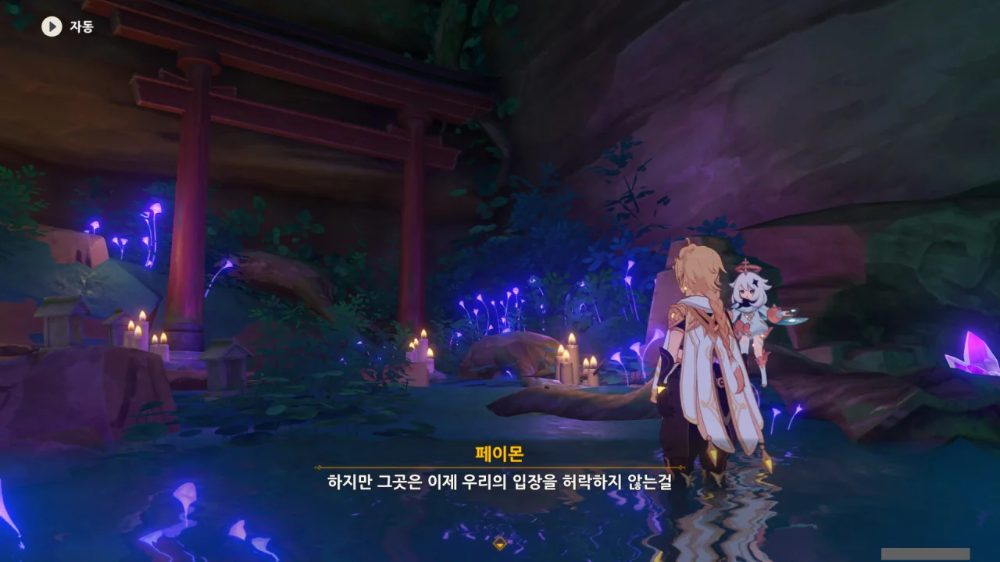
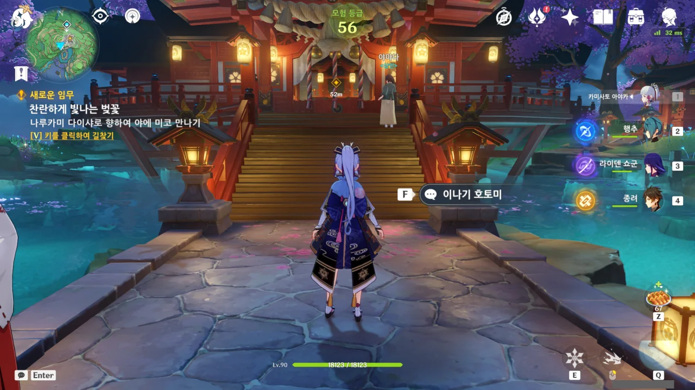
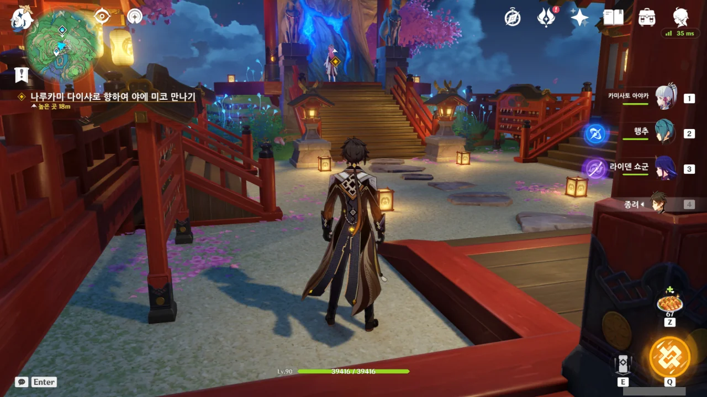
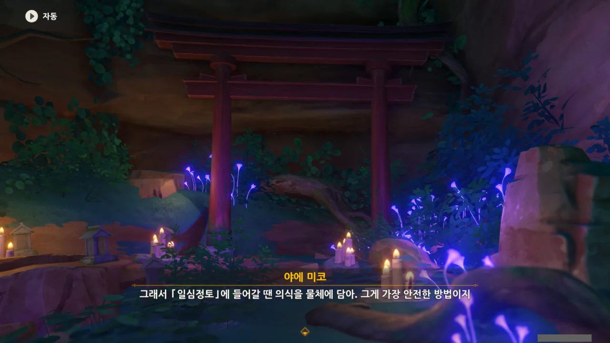



페이몬이 '꼭 이 방법이어야만 했어?'라고 하지만, 정말로 다른 방도가 없었다.

현재 에이는 몸이 없는 상태이기 때문에, 대외 활동을 하려면 반드시 쇼군 인형의 협조가 필요하다. 그리고 그 협조를 얻기 위해 쇼군과 무한히 싸우고 있는 거고...





에이가 얼른 쇼군을 이길 수 있도록 도와줘야 한다.

안 그러면 분명 에이는 이긴다는 것에만 집착하다 왜 마코토의 의식 공간에 들어왔는지조차 잊어버릴지도 모른다.

다시 돌아가서 에이와 합세하고는 싶지만, 토리이의 상태를 보면 알 수 있듯, 이제 다시 마코토의 의식 공간으로 들어갈 수 없다.



페이몬 표정이 왜 오늘따라 귀엽게 보이지?

아무튼, 이럴 때는 '도와줘요 야에에몽' 하고 야에 미코에게 도움을 요청하면 어떻게든 되지 않을까?



누가 여우 아니랄까 봐 너무 능글맞고 싸가지가 없어서 야에 미코를 보기 꺼려지지만, 별수 없잖은가.

다시 올라가는 귀찮음을 덜어주려는 걸까, 컷신이 끝나자 곧바로 나루카미 다이샤 입구로 데려다준다.

야에 미코가 신성한 벚나무 앞에 서 있다.





저렇게 까칠하게 말하는 걸 보면, 야에 미코도 여행자 못지않게 초조했던 모양이다.



일단 야에에게 자초지종을 설명한다.





에이의 일을 전해 듣고 고지식하기 짝이 없다며, 실력이 조금이라도 부족하면 이룰 수 없는 목표라고 에이를 까대는 야에 미코.

늘 있는 일이라고는 하지만, 이번 일은 너무 번갯불에 콩 구워 먹듯 진행되었다. 별다른 수가 없었기도 하지만...





하지만 야에 미코 역시 마코토의 의식 공간에 대해서는 별로 아는 것이 없다고 한다.

기껏해야 마코토의 의식 공간이 신성한 벚나무의 토대인 것과, 에이의 것과는 조금 다르다는 정도만 안다고.

&nbsp;

그런데 마코토의 의식 공간이 신성한 벚나무의 토대라고? 이건 정말 처음 듣는 이야기인데.

그런데 그러면 말이 안 되지 않나? 에이가 마코토의 의식 공간과 함께 이나즈마에 돌아왔을 때 이미 신성한 벚나무가 이나즈마에 원래 있었던 것처럼 나타났다고 말하지 않았나?

마코토의 의식 공간을 신성한 벚나무 아래 동굴에 둔 것은 그 이후일 테니, 앞뒤가 맞지 않는 이야기가 된다.





심지어 의식 공간 본연의 성질조차 에이와 마코토의 것이 서로 다르다고 한다.

그게 설마 색깔 차이는 아니겠지?





야에 미코의 말에 따르면, 지금 에이 근처의 모든 것이 혼란스러운 상태라 억지로 들어가면 시간 공간에서 영원히 길을 잃을 수도 있다고 한다.

하지만 야에 미코는 에이의 권속이기 때문에, 그곳이 어디인지는 몰라도 일단 에이의 곁에 여행자를 보내줄 수 있다고 한다.

아, 설마 그래서 야에가 여행자에게 부적을 준 건가?

그런데 그냥 의식 공간에 들어가는 것과 의식을 물체에 담은 채 들어가는 것에 대체 어떤 차이가 있는지 잘 모르겠다.



페이몬이 혼자 빼려고 하자, 여행자와 야에 미코가 쌍으로 페이몬에게 '그래서 안 갈 거야?'라고 한다.

결국 함께하기로 한 페이몬.





에이에게 향하는 포탈을 연 야에가 뭔가 의문을 표한다.

아무것도 아니라며, 그냥 조금 뒤죽박죽 한 것이라고 하는데... 이거 설마 뭔갈 숨기고 있는 건 아니겠지?



의식 공간에 들어갈 때 염원을 끊임없이 속으로 외워야 추상 공간의 파도에 휩쓸리지 않는다는 조언을 건네주는 야에 미코.



야에 미코는 바깥에 남아 최악의 경우를 대비하겠다고 한다.



> 우리 신을 부탁해, 여행자. 날 위해서, 이나즈마를 위해서, 최선을 다해줘.

오오... 야에 미코가 웬일로 저런 따뜻한 말을?



> 자자, 빨리 가서 뭐든 해!

으휴, 그럼 그렇지.
