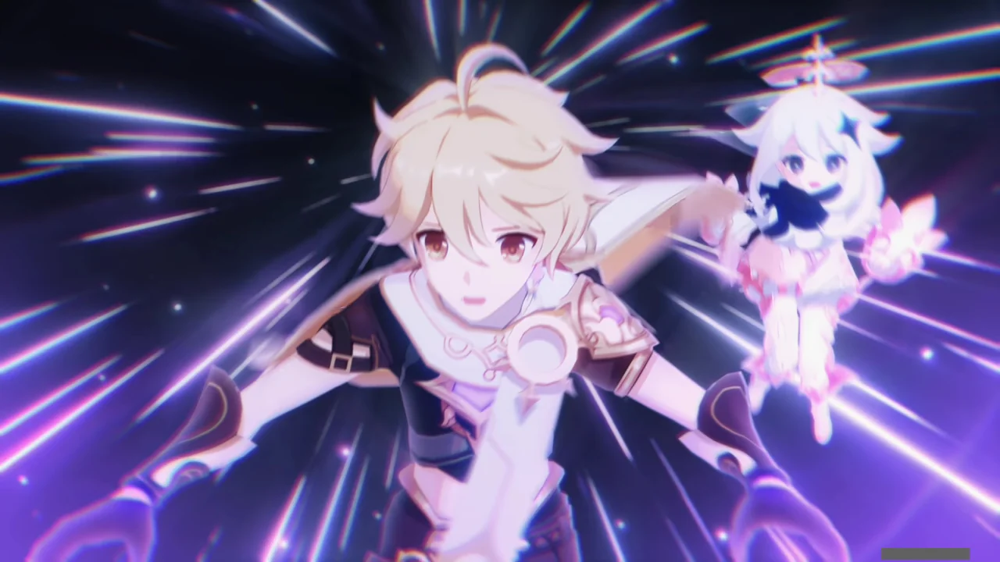

마코토의 의식 공간 안으로 들어가는 여행자와 페이몬.

뭐라 형언하기 어려운 신기한 장면이 빠르게 스쳐 지나간다.



점괘를 묶어두는 저 구조물이 무얼 의미하는지는 잘 모르겠다.

그다음 나온 건 천수각이 빠르게 지어져 올라가는 모습이다. 천수각 모델링을 그대로 활용한 것인지, 아직 대문이 나타나지 않은 공간을 통해 모델의 빈 면 너머의 반대편이 그대로 보인다.



> 공간에 들어갈 때 네 염원을 속으로 계속 외워

야에 미코의 조언을 떠올린다.





> 널 가장 적합한 장소로 보낼 수 있어

수많은 장면이 빠르게 주변을 스쳐 지나간다.

대충 파악한 것만 보자면, 아마 여행자가 이나즈마에 도착한 후 있었던 일이 재생되는 듯하다.

시뇨라와의 어전 시합에서 있었던 일, 코코미 전설 임무에서 볼 수 있었던 와타츠미 섬 병력과 나루카미 섬 병력의 해변에서의 격돌 장면이 빠르게 나타나고 사라진다.

그리고 에이가 쇼군과 싸우는 장면 역시 여행자 옆을 스쳐 지나간다.

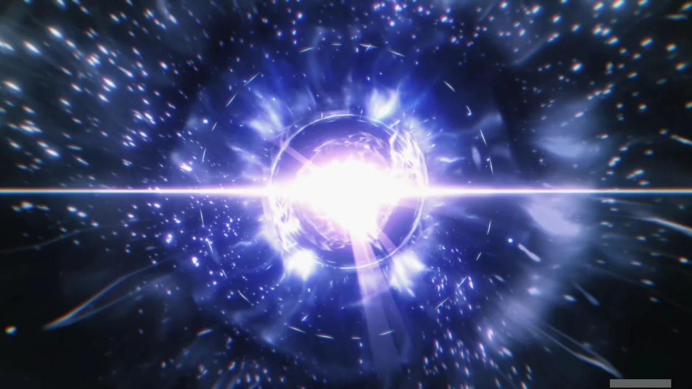

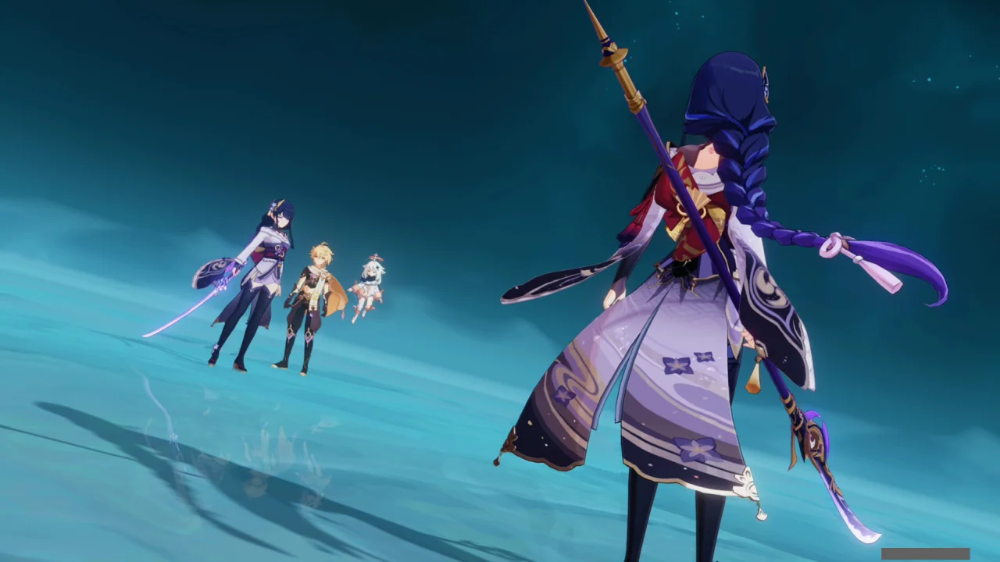

에이 곁에 도착한 여행자.

평안한가.



여행자를 보고 적잖이 놀란 에이. 설마 여행자가 다시 돌아올 줄은 몰랐던 것일까?

그런데 "그때의 모습"이라니? 설마 이곳의 시간의 흐름은 바깥과 다른 걸까?

대체 그동안 이곳에서 무슨 일이 있었던 거야?







뭐지? 갑자기 에이와 쇼군이 서로 '너 고집 세다'라고 서로를 칭찬하는데?

쇼군은 에이더러 영원함의 모든 적을 보여줘도 흔들리지 않았다고 하고, 에이는 쇼군이 굳건하게 법칙을 집행하는 모습이 「영원함의 수호자」란 이름에 걸맞다고 한다.



여행자는 잠시 자리를 비운 것뿐인데, 그동안 이곳에서는 500년이라는 시간이 지난 것 같다.

와, 그러면 둘 다 500년 동안 쉬지 않고 계속 싸워온 거야?

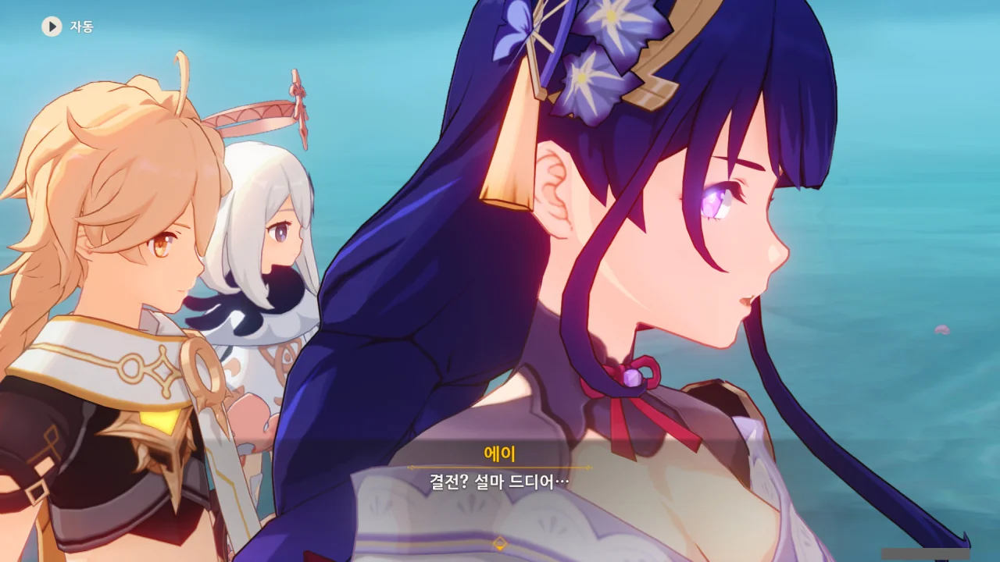

결전이라고? 이게 마지막이라고?



> | | |
> |:--|:--|
> | 여행자 | 모두 **끝**낼 건가요? |
> | 에이 | 난 다음 「**시작**」이 될 거야. |
> {_borderless=true,_thead=false}

... 정말 멋지다. 이런 구조를 뭐라고 불러야 하지?

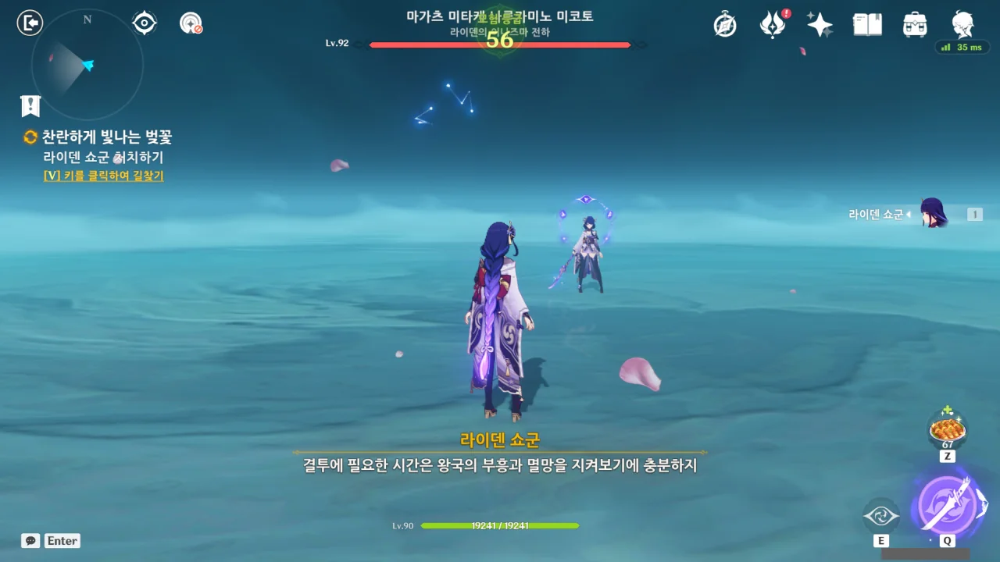

> 결투에 필요한 시간은 왕국의 부흥과 멸망을 지켜보기에 충분하지.

라이덴 쇼군의 저 말이 무슨 말인지 이해하기가 힘들다. 말 그대로 500년이라는 시간은 한 왕국이 세워지고 스러지는 걸 지켜보기 충분한 시간이라는 걸까? 마치 고려와 조선이 그랬던 것처럼?

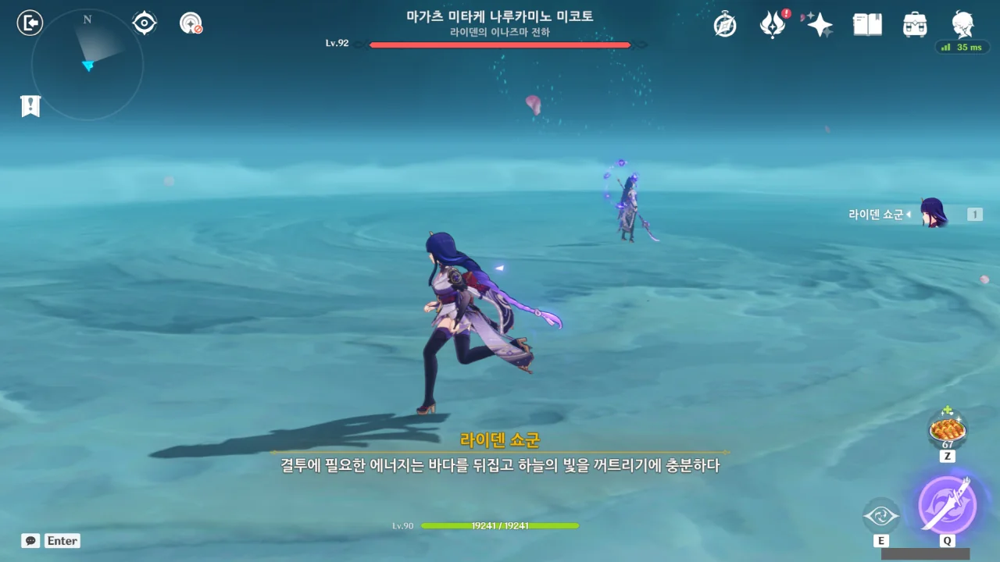

> 결투에 필요한 에너지는 바다를 뒤집고 하늘의 빛을 꺼트리기에 충분하다.

... 진짜 무슨 말을 하는 건지 모르겠네.

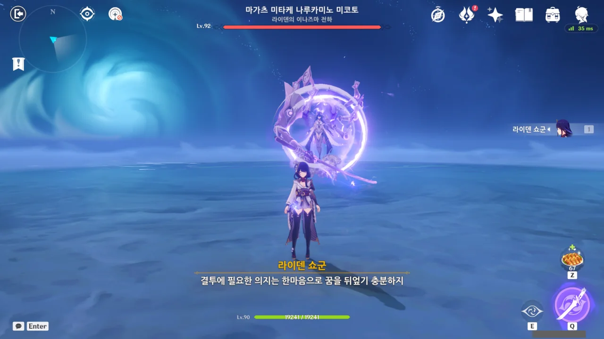

> 결투에 필요한 의지는 한마음으로 꿈을 뒤엎기 충분하지

아까 전 말과 엮어 생각하면, 자신의 힘과 의지는 에이의 「꿈」을 꺾기에 충분하다는 말일까?

에이가 여행자와 헤어지기 전, "이 전투가 수개월 아니 몇백 년이 걸린다 해도 몇 번이든 쇼군을 쓰러트릴 거야"라고 한 것이 생각난다.

&nbsp;

그나저나 내 라이덴 쇼군도 저런 간지 넘치는 외부 무장 좀 줘요...

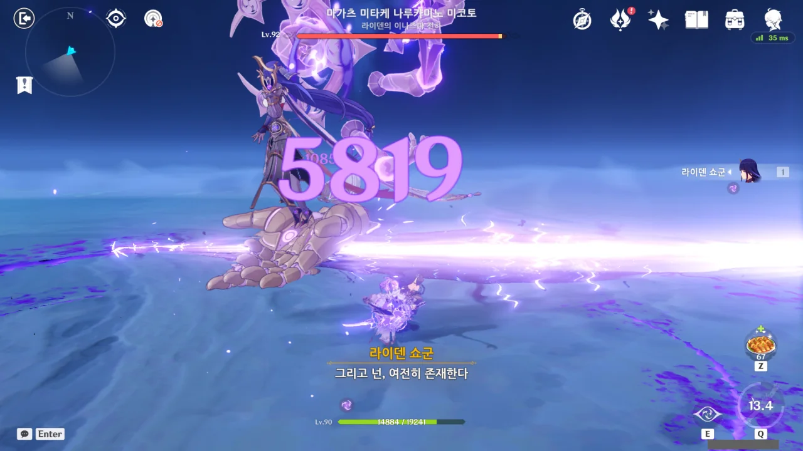

> 그리고 넌, 여전히 존재한다.

그렇게 많은 시간과 힘, 의지를 들였음에도 에이가 꺾이지 않는다는 말일까?

제발, 좀 쉽게 이야기 해줘라...

&nbsp;

아까 전과는 달리, 쇼군의 공격이 꽤 아프게 들어온다. 지금까지는 음식으로 체력을 채우며 버텼었는데, 이제는 배가 불러 더는 음식을 먹을 수 없다.

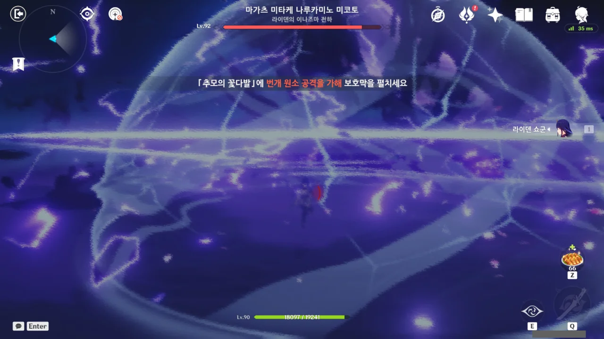

필드에 '추모의 꽃다발'이라는 구조물이 생기는데, 이를 제시간 안에 부숴 보호막을 펼치지 못하면 죽는다.

그런데 이 장면도 굉장히 멋지더라.





이것 말고도 이런저런 공격 패턴이 나왔는데, 그중 제일 인상 깊은 것이 바로 줄넘기였다. 3D 게임에서 이런 줄넘기를 할 줄은 정말 몰랐는데.

배치도 나름 까다로워, 몇 번 얻어맞았다.

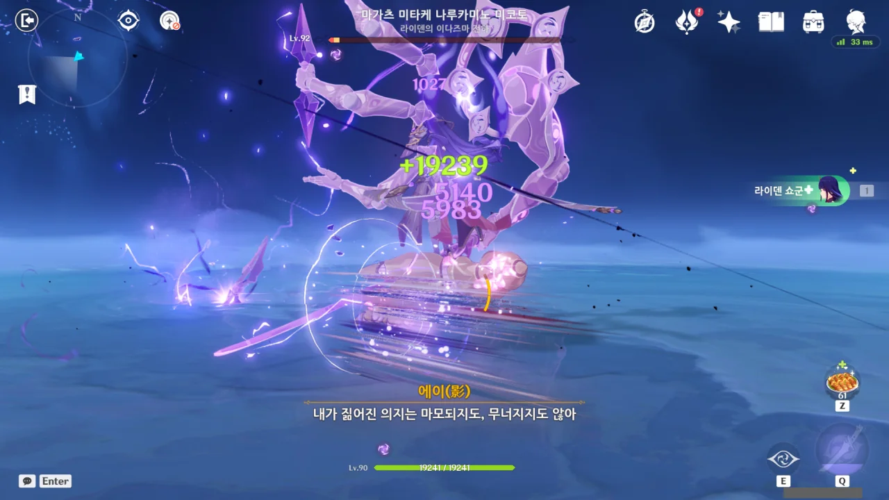

대시할 때 순간적으로 무적이 되는 '대시 무적' 등을 열심히 써서 최대한 덜 맞으려고 노력했지만, 결국 내 라이덴 쇼군의 체력이 먼저 닳았다.

그런데 체력이 1에서 더 밑으로 떨어지지 않더니, 이런 간지나는 대사와 함께 체력이 완전히 회복되었다!

> 내가 짊어진 의지는 마모되지도, 무너지지도 않아.

그래, 마모되고 무너지는 건 내 컨트롤 실력이지...



에이가 쇼군을 또다시 이겼다.

> 영원히 마모되지 않는 의지는, 결국 미래를 품을 수 없구나.

저 말은 라이덴 쇼군뿐만 아니라, 쇼군 인형을 만들 당시의 에이의 말이기도 하다. 이렇게 생각하니 뭔가 쓸쓸해지는걸.



에이 역시 자기 혼자였다면 이 결투에서 지는 건 자신일 것이라고 말한다.

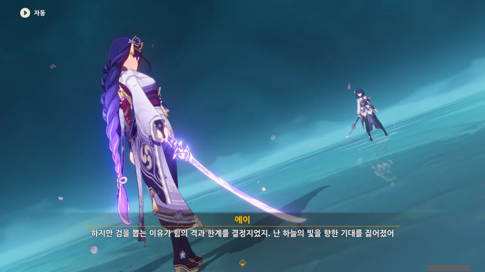

> 난 하늘의 빛을 향한 기대를 짊어졌어.

이게 바로 「염원」이라는 걸까?





아니, 마코토의 검이 에이에게 경고하고 격려한다고 느낀 것이 단순히 그렇게만 느낀 것이 아니라 실제로 검에서 인지 밖의 힘이 방출된 것이었다고?



마코토가 준 「몽상의 일심」을 힘껏 쥐면 다시 마코토와 함께 서는 느낌이 든다는 에이.

마코토가 에이에게 남긴 건 이 의식 공간과 「몽상의 일심」 둘이 전부이니 그렇게 느끼는 것일 수도 있겠다.



드디어 쇼군이 에이의 새로운 의지가 마모의 결과물이 아님을 인정했다. 이제 이전처럼 쇼군이 에이를 방해하는 일은 없을 것이다.



에이 역시 쇼군을 자기 자신이라고 인정하며, 마코토가 그랬듯이 쇼군을 도구 취급하지 않겠다고 말한다.



그래, 그게 아마 성장일 것이다.



> 다만 무사로서 지금처럼 싸울 기회가 있길 기대하지

어휴, 누가 뼛속까지 무사 아니랄까 봐... 500년 동안 실컷 싸워서 아주 기분이 좋은가보다.



> 이런 느낌은 처음이다. 신기하군. 음미할만해.

그래도 진 것이 나름 분한 모양이다.

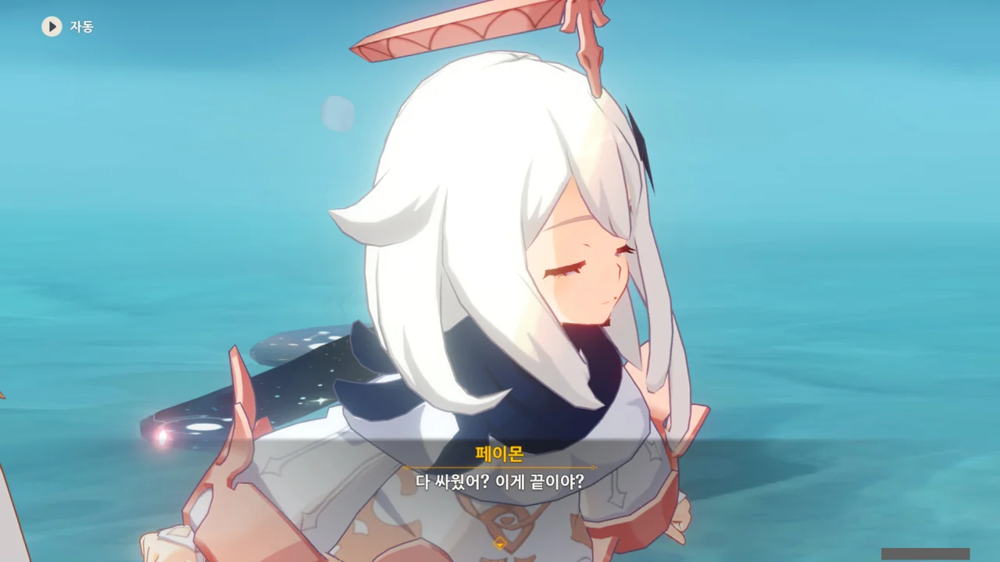

> 다 싸웠어? 이게 끝이야?

아니 ㅋㅋㅋ 에이와 쇼군이 어린애처럼 동네 모래밭에서 투덕거리며 싸운 것처럼 이야기하지 말라구 ㅋㅋㅋ

딱히 틀린 말은 아니지만... ㅋㅋㅋ



그런데 갑자기 에이의 「몽상의 일심」이 빛난다.



> 난 라이덴 마코토야. 책임을 다하지 못한 전대 번개 신으로서 너희에게 많은 골칫거리를 남겼네.

아니, 분명 라이덴 마코토는 죽었다고 하지 않았어?



마코토는 죽기 전 에이가 마코토를 진짜 이해하고 인정할 때 나타날 수 있도록 「몽상의 일심」에 미미한 의지를 남겼다. 





이런 복잡한 방법을 쓴 건, 에이가 워낙 고집불통이라 마코토의 말을 들을 생각조차 하지 않았기 때문이다.

에이가 마음을 돌릴 때까지 기다릴 시간이 없었던 마코토는 이런 방식으로라도 에이에게 메시지를 전할 수밖에 없었다.

&nbsp;

마코토가 "일이 너무 빨리 일어났다"라고 하는 걸 보면, 마코토는 켄리아나 이나즈마에 닥친 재앙을 어느 정도 예측하였던 것일까?



에이가 「무상」에 집착하지 않도록 「영원」과 「꿈」에 대한 이치를 천천히 에이에게 전수했어야 했지만, 그러지 못했다고 말하는 마코토.

결국 마코토는 켄리아에 갔다가 덜컥 죽어버리고 말았지.



아니, 정말 켄리아에 무슨 일이 일어날지 어느 정도는 알고 있었다고?

대체 500년 전 켄리아에는 대체 정확히 무슨 일이 있었던 거야? 「그쪽」은 또 뭐고?





마코토가 남긴 의지는 미미하기에 그동안 이나즈마에 무슨 일이 있었는지, 얼마 만에 에이를 만나는 것인지 아무것도 모른다고 한다.

> | | |
> |:--|:--|
> | 마코토 | 분명 울고 싶었을 때가 많았을 거야. 그렇지? |
> | 에이 | ... 날 얕보지 마. |
> | 마코토 | 봐, 인정했네. |
> {_borderless=true,_thead=false}

저렇게 말하는 걸 보면 둘이 자매가 맞다.



마코토가 에이를 위해 '이나즈마의 고통을 해소할 수 있는 선물'을 준다.



마코토의 의식이 씨앗으로 변해 에이의 손에 놓인다.



> 만민을 가호하는 기적의 나무는 이 순간에도 보이지 않는 낯선 존재야.



> 언제 뿌리를 내리고 어디서 싹 틔울지는 탄생시킨 자의 마음과 꿈에 달렸어.

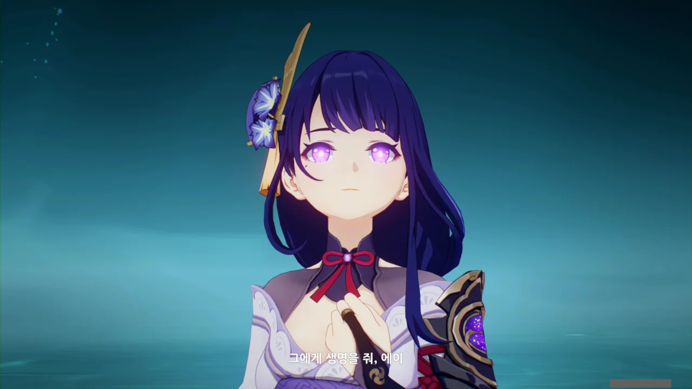

> 그에게 생명을 줘, 에이.

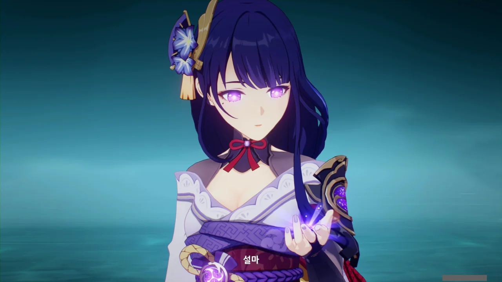

설마 이 씨앗이 신성한 벚나무의 씨앗인 걸까? 그게 가능한 일이야?

에이가 씨앗을 마코토의 의식 공간에 심는다.



> 영원은 시간을 무한으로 늘리고 꿈은 모든 순간을 빛나게 해.

땅에서 나무가 자라난다.



> 두 가지가 함께 빛나면 신성한 벚나무는 천리의 속박을 벗어나 어둠 속에서 피어나지.

벚나무가 자라나더니, 주변에 나루카미 다이샤의 모습이 비친다.

&nbsp;

마코토가 말한 건 영원과 꿈 어느 한쪽이 옳다는 게 아니었다. 둘 모두가 다 중요한 것이었다.



> 악몽은 흩어지고 현실은 실현되니 우리가 꿈꾸던 광경은 여전히 앞에 있어.



> 난 이나즈마의 미래를 볼 수도 너와 동행할 수도 없게 됐지만

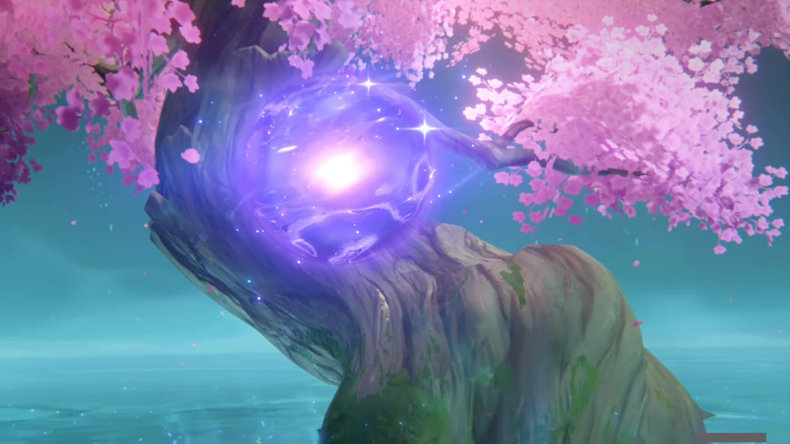

마코토의 의지가 또다시 눈앞에 나타났다.



> 난 정말 기뻐. 내 마지막 소원도 이뤄졌거든.



> 네 치도는 날 위해 수많은 재난을 막아줬지. 줄곧 너한테 빚진 느낌이었어.



> 미미한 보답이지만 네가 깨어나 새로운 만남을 갖기 전까지 이 벚나무가 시간을 벌어 줄 거야.

마코토가 말한 '새로운 만남'이란 여행자를 말하는 거겠지.



> 어때? 이미 효과가 생기지 않았어?

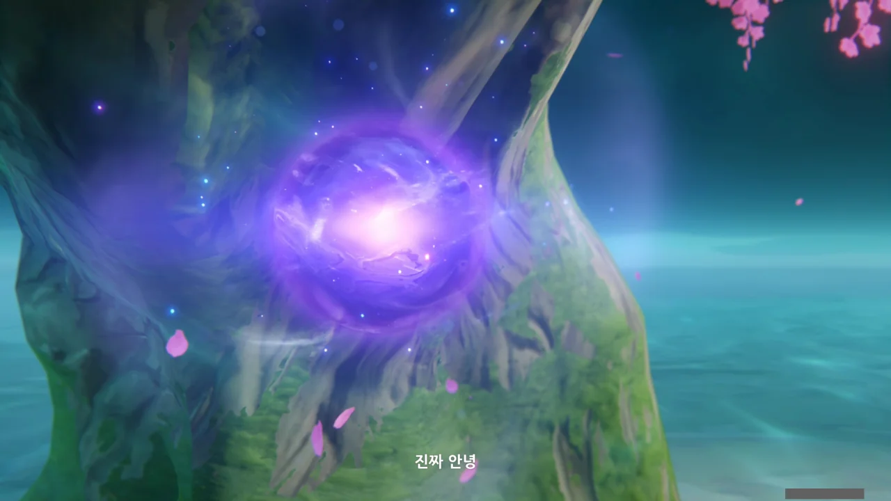

> 진짜 안녕.

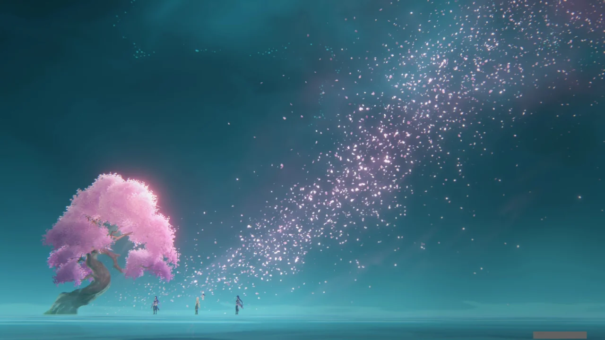

마코토의 의지가 벚꽃이 되어 흩날려 사라진다.

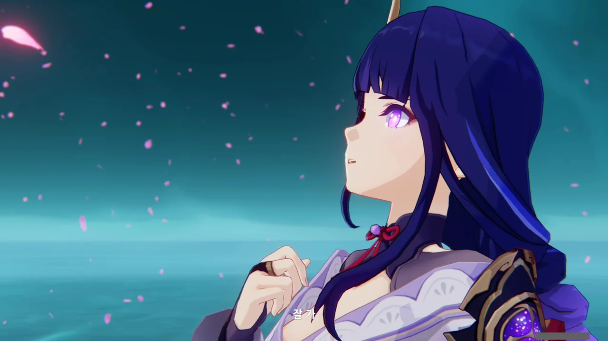

> 잘 가.

에이 역시 마코토와 마지막 작별 인사를 한다.
