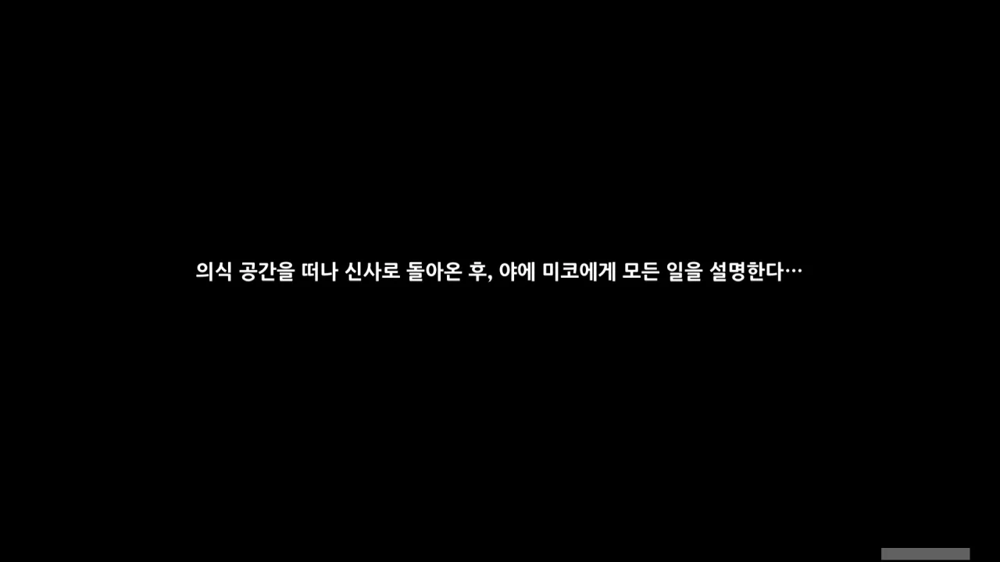
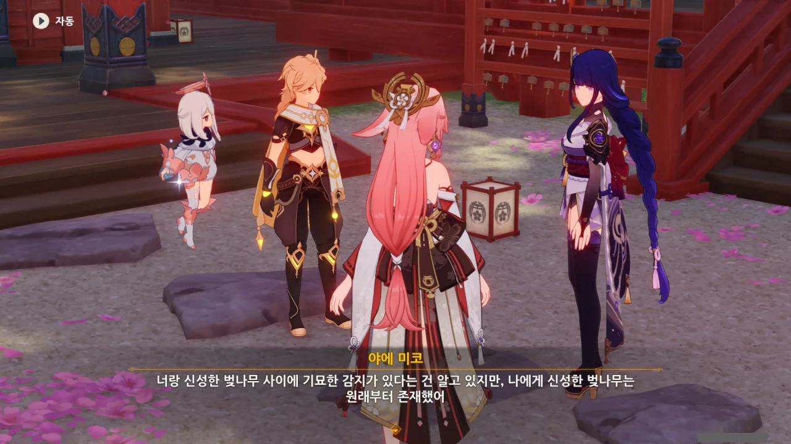
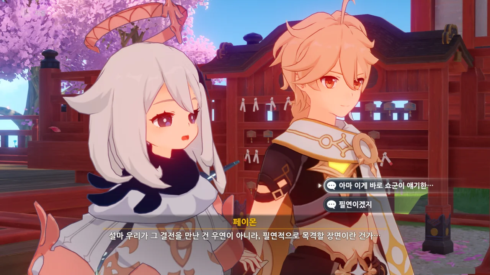
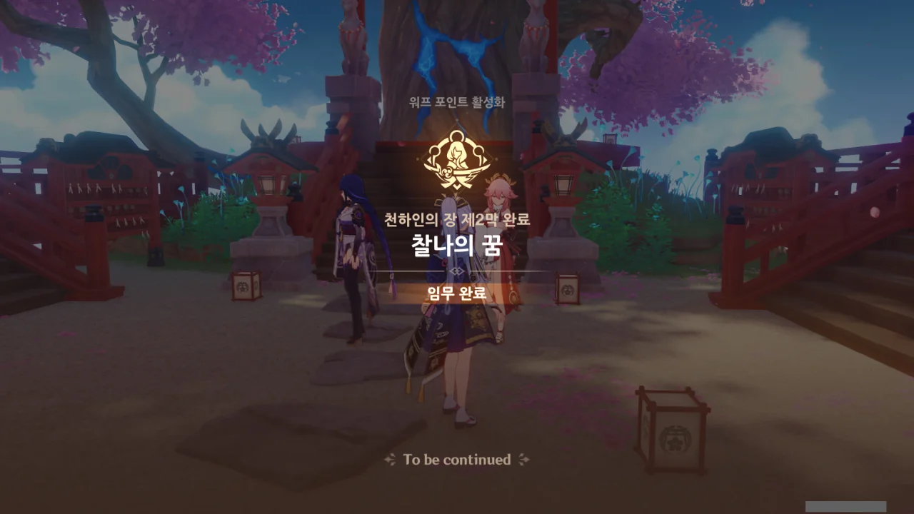
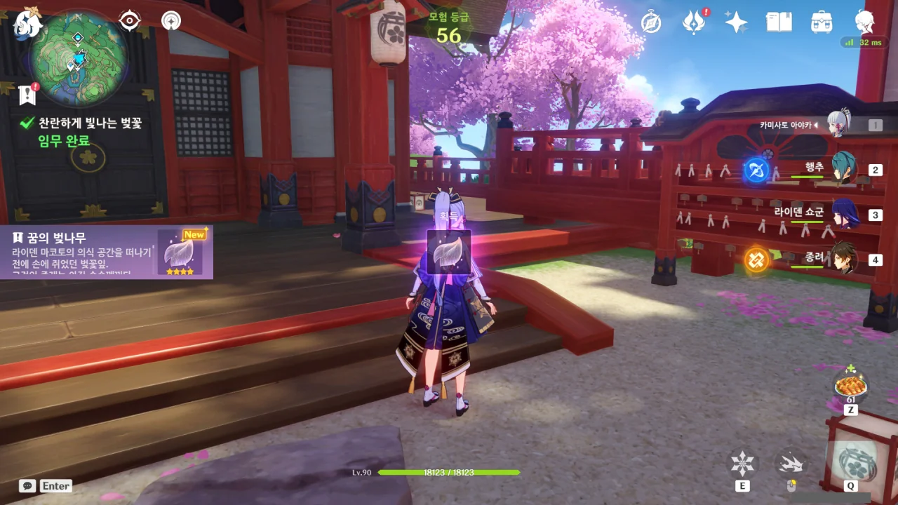
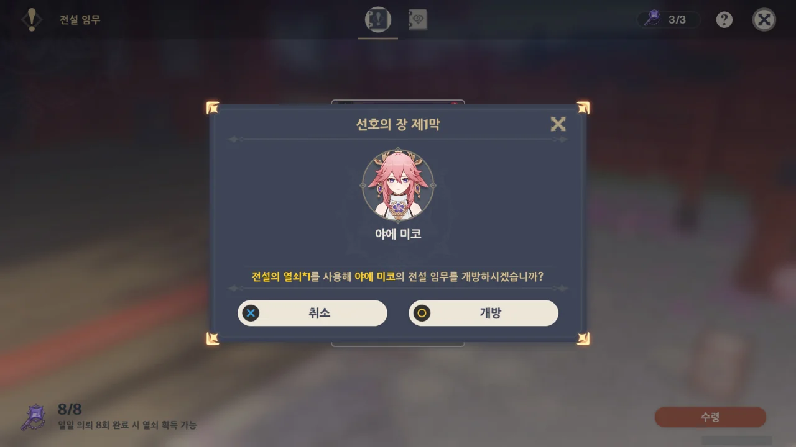
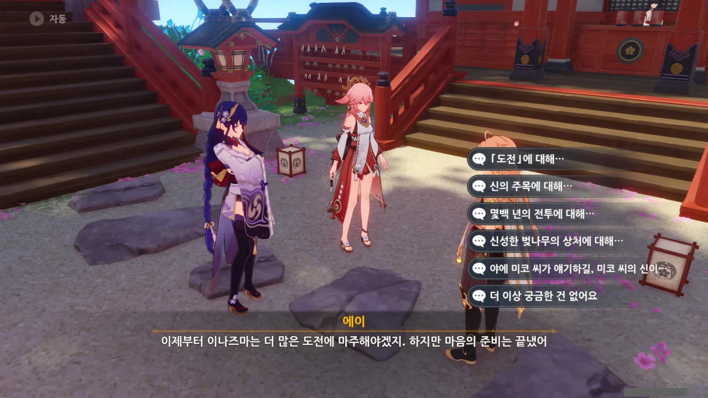



조금 전 에이가 심은 신성한 벚나무가 과거의 이나즈마에서 싹을 틔웠다는 건 정말 신기한 일이다.



「영원함」은 시간과 뗄 수 없는 개념이기에, 영원함에 대한 이해가 깊은 마코토라면 시간 개념이 모호해지는 일을 벌일 수 있을 거라는 이야기인가...

그러고 보면 마코토의 의식 공간에 들어갈 때 시간이 나아가면서 동시에 되돌아가는 신기한 경험을 했다. 왜, 천수각이 지어지는 모습이라던가, 여행자가 이나즈마에 와서 경험한 장면들 있지 않은가.



야에 미코가 마코토의 의식 공간으로 가는 통로를 열고 나서 "조금 뒤죽박죽 하네"라고 한 것이 의식 공간에서 「급류」를 느꼈기 때문이었구나.

하지만 그 급류는 지금 완전히 사라졌다고 한다.

아마 그렇겠지.

&nbsp;

내 생각이지만, 마코토의 의식 공간에서 시간의 급류가 생겼던 건, 에이가 아직 신성한 벚나무를 심기 전에 이미 신성한 벚나무가 존재하는 상황 때문이 아니었을까 한다.

그러던 것이 에이가 신성한 벚나무를 심자, 인과 관계 모순이 해결되어 급류가 사라진 것이고...



하지만 이런 기묘한 일은 마코토 혼자서 한 것이 아닐 수도 있다. 「더 높은 경지의 힘」이 개입했을 수도 있다.

하지만 마코토의 신성한 벚나무가 없었더라면 이나즈마는 500년 전 이미 재난과 오염에 삼켜져 사라졌을 것이다.

그러니 상관없지 않을까.

&nbsp;

단순한 떡밥에 불과한 이야기이지만, 여기에 '시간의 마신'이 개입했을 수 있다는 이야기를 들은 적이 있다.

마코토가 시간을 넘나드는 신성한 벚나무 씨앗을 만들 수 있었던 것 자체가 '시간의 마신'의 도움이 있었기 때문 아니냐는 것이다.

에이가 예전에 말했듯이, 에이를 제외한 이나즈마의 모든 사람은 신성한 벚나무가 원래부터 있었던 것으로 기억되고 있다.



예전 에이는 신성한 벚나무와 마코토의 의식 공간 사이에 어떤 연관성이 있으리라 생각하고 그걸 증명하려 했지만, 그 당시 신성한 벚나무는 아직 심어지기 전이었기 때문에 증명에 실패했다.



그러고 보니 마코토의 의식 공간에서 자라난 신성한 벚나무의 모습은 지금과 매우 다른데? 거기서 본 벚나무는 이렇게 여우 모양이 아니었던 것 같은데...

알고 보니 야에 미코가 자기 취향대로 손질했다고 한다.

아니, 신성한 벚나무를 그렇게 취급해도 돼?



야에 미코는 장난이라며, 신성한 벚나무가 저런 모습이 된 건 많은 여우의 돌봄 덕분이라고 하지만... 내가 볼 때는 아닌 것 같다.

하지만 마코토의 의식 공간에서 신성한 벚나무가 자라날 때, 주변에 많은 여우들이 모여든 걸 생각하면 또 틀린 말 같지 않는단 말이지...





여행자가 마코토의 의식 공간을 떠난 시간은 짧은데, 의식 공간 안에서의 시간은 500년이나 지속되었지.

여행자가 의식 공간에 들어갈 때, 야에 미코가 말한 대로 염원을 계속 속으로 외운 덕에 급류가 여행자를 모든 염원이 모이는 시간의 교차점, 가능성이 가장 큰 순간으로 데려갔다고 한다.

급류의 방향이 마코토의 영향을 받았을지는 잘 모르지만, 여행자가 아니었더라면 에이에게 도움을 줄 수 없었을 것이라고 한다.

그러니까 여행자가 500년 후 다시 에이와 쇼군 앞에 나타난 건 필연적으로 그렇게 될 것이었기 때문이란 거네...





의식 공간 내부의 시간이 바깥과 동일하게 흐르는 줄 알았던 에이는 500년 만에 여행자가 다시 나타났을 때 이나즈마에 또다시 큰 재난이 닥쳐 에이를 빼내려고 온 줄 알았다고 한다.

뭐, 그런 게 아니라 에이가 의식 공간 안에 갇힐지도 몰라 그런 거였지만.





마코토의 의식을 본 후 기분이 어떠냐고 묻는 야에 미코.





마코토의 목소리만 듣고 만나지 못해 조금 그리웠지만, 이제 앞으로 나아가기로 한 에이.

자신의 미성숙함도 모두 계산 안에 넣고 이나즈마의 다양한 가능성을 예측한 마코토에 감탄한다.



자신은 그저 씨앗을 심었을 뿐이라고 말하는 에이지만, 그건 무수한 노력이 쌓여 만들어진 것이었다.

그리고 마코토와 에이 누구 하나의 의지도 중요하지 않은 것도 아니다.

마코토의 의지가 괜히 "영원은 시간을 무한으로 늘리고 꿈은 모든 순간을 빛나게 해. 두 가지가 함께 빛나면..."이라고 했겠는가.



> 오늘에서야 너랑 이나즈마는 몇백 년 전의 그림자에서 완전히 벗어났네.
> 마코토와 너는 이나즈마에서 하나라도 빠질 수 없는 「과거」와 「미래」야.

야에 미코의 말에 백번 동의한다.



> 그야 예전의 너는 전혀 듣지 않았잖아.

대체 500년 전의 에이는 어떤 사람이었을까. 주변의 모든 사람에게 고집불통이라는 말을 들을 정도면... ㅋㅋㅋ...



야에 미코가 "그러면 쇼군의 자리도 나한테 이틀 양보할 수 있을까?"라고 하자, 대번에 팔짱을 끼고 야에 미코를 째려보는 에이.

&nbsp;

저 둘은 진짜 신과 권속 사이가 아니라 악우(惡友) 관계인 것 같다. 고운 정 미운 정 다 든 사이라고 해야 할까.





와, 쇄국령을 폐지한다고?

이제 더 이상 「영원함」을 추구하지 않기로 했으니, 나라를 봉쇄할 필요가 없다고 말한다.

&nbsp;

쇄국령 하니 생각난 건데, 리월항에서 케이아나 아야카 등의 얼음 캐릭터를 이용해 바다를 건너 이나즈마로 '밀입국'을 시도하는 사람이 제법 있었다. 이유는 별거 없고, 재미있으니까.

다만 쇄국령 때문에 이나즈마 근처로 가면 강제로 리월항으로 이동되는데, 그조차도 랜선을 뽑았다 끼우는 식으로 회피해서 밀입국에 성공하더라.

아마 쇄국령이 폐지되면 랜선을 뽑을 필요가 없으니, 아예 대놓고 도보로 입국을 시도할 사람이 나오지 않을까?



그래. 이제 에이의 말처럼 이나즈마는 더 많은 도전과 더 많은 만남을 마주할 것이다.

천하인의 장 제2막, 찰나의 꿈 완료!

***

전설 임무가 끝나면 이렇게 기념 아이템을 준다.

아마 원신이 최종장에 다다르면 이 기념 아이템을 쓰는 날이 오지 않을까 생각한다.

다음 전설 임무가 야에 미코 전설 임무였기에, 미리 열어두었다.

아직 라이덴 에이와 야에 미코가 사라지지 않고 있기에 말을 걸어보니 추가적인 대화 내용이 나타난다.

문제는 이 이야기가 각각 어디부터 어디까지인지 내가 기록을 못했다. 별수 없이 기억에 의존해 사진을 끊는 수밖에...







진지하게 쇄국령 폐지 이후의 이나즈마 정책 변화에 대해 고민중인 에이와 달리 나루카미 다이샤 티켓 판매나 생각하고 있던 야에 미코가 에이에게 핀잔을 듣는다.









마코토가 인간들에게 보낸 시선은 책임이 아닌, 칭찬과 기대가 어린 시선이었다. 

책임을 제외해도 인간을 사랑하기에 즐거워했을 것이라는 마코토. 분명 「인간 찬가」와 같은 주제의 이야기를 좋아하지 않았을까?









500년간 쇼군과 싸우며 단 한 순간도 경계를 풀지 않고 집중한 에이는 정말 대단하다.









에이가 말한 '다른 것'은 분명 아직 정화되지 않은 오염에서 튀어나온, 공격성 강한 기억이겠지. 

에이가 야에 미코에게 게으름 피우지 말라고 하는 걸 보면, 나루카미 다이샤 역시 삼봉행과 같이 신성한 벚나무를 관리하는 것으로 추측된다.









'야에 미코의 신'이 무슨 이야기인지 잘 모르겠지만, 야에 미코에게 둘만의 비밀로 남겨두자는 협박 아닌 협박을 받았다. 

무슨 말인지 궁금해하는 에이에게 유부가 먹고 싶어졌다고 둘러대는 야에 미코.



이제 정말로 천하인의 장 제2막 끝!
