사실 나히다 전설 임무는 아끼고 아꼈다 나중에 천천히 먹으려고 했었다.

하지만 이번 이벤트인 '성대한 지혜의 축제'의 진행 지점과 나히다 전설 임무의 시작 지점이 겹치는 바람에 어쩔 수 없이 나히다 전설 임무를 어느 정도 진행해야 했다.

얼마 전에도 일일 임무 시작 지점과 이벤트 진행 지점이 겹치는 바람에 일부러 미뤄뒀던 이벤트를 강제로 했었고.

하... 이럴 때에는 전설 임무나 이벤트 임무를 아예 비활성화할 수 있었으면 좋았을 텐데...

&nbsp;

나히다의 첫 번째 전설 임무, ['남은 온기'](https://genshin.honeyhunterworld.com/ch_2034/?lang=KO)를 내가 대체 언제 했더라? 너무 오래전에 해서 그런지, 지금 그 임무에 대해 기억나는 것이 많이 없다.

나히다가 모임에 갑자기 나타나자, 조금 전까지만 해도 열성적이었던 분위기가 팍 식어 어색해졌고, 이에 잔뜩 실망한 나히다가 "난 그릇 속의 물방울이 되고 싶은 거지, 눈치 없는 그릇이 되고 싶지 않아"라며 삐진 장면.

나히다가 세계를 구하기 위해 어떤 희생을 했는지 전혀 모르면서 모세이스가 건방지게 "신님께서 인간을 더 잘 이해하셨다면, 직접 가슴이 미어지는 이별을 경험해 봤다면 이렇게 야속하게 굴지는 않으셨을 겁니다"라고 말한 장면.

그나마 기억나는 건 이 두 장면이다.

정선궁에서의 감금 생활에서 벗어난 나히다가 어떻게 수메르를 직접 다스리는지를 가까이서 볼 수 있어 참 좋은 임무였다고 생각한다. 어린 겉모습과는 달리, 할 일을 제대로 해내는 나히다를 보면서 입가에 미소가 가시질 않더라고.

&nbsp;

기왕 생각난 김에, 수메르 마신 임무의 하이라이트를 다시 봐야겠다.

모세이스 그 녀석에게 이 영상을 62억 번은 보여줘야 성이 찰 거 같아.



> 난 문제를 내는 사람이자 답을 구하는 사람이야.
> 세상 사람들의 꿈으로 세상을 구원하는 것이 한때는 내가 구한 답이었지만, 이제는 너희들도 자신만의 답을 찾았으니 모든 꿈을 세상 사람들에게 돌려주도록 할게.
> 수메르의 백성들이여, 안녕. 오늘 밤, 아름다운 꿈을 꾸길.

수메르 마신 임무를 진행하다 이 컷신을 보고 눈물을 글썽이지 않은 사람은 과연 그 심장이 뛰고 있는 것인지 의심해야겠지.

***

아무튼, 서론이 길었다. 이제 정말로 나히다의 두 번째 전설 임무를 시작해야지.



수메르성 입구에서 만난 나히다는 수메르성으로 들어가고 있었다.

전설 임무 제1막에서도 수메르성 이곳저곳을 잘만 돌아다니던 나히다였지만, 아직도 내게 있어 수메르성을 자유로이 돌아다니는 나히다의 모습은 어색하기만 하다.

여전히 정선궁에 가면 나히다가 맞아줄 것만 같은데 말이다.

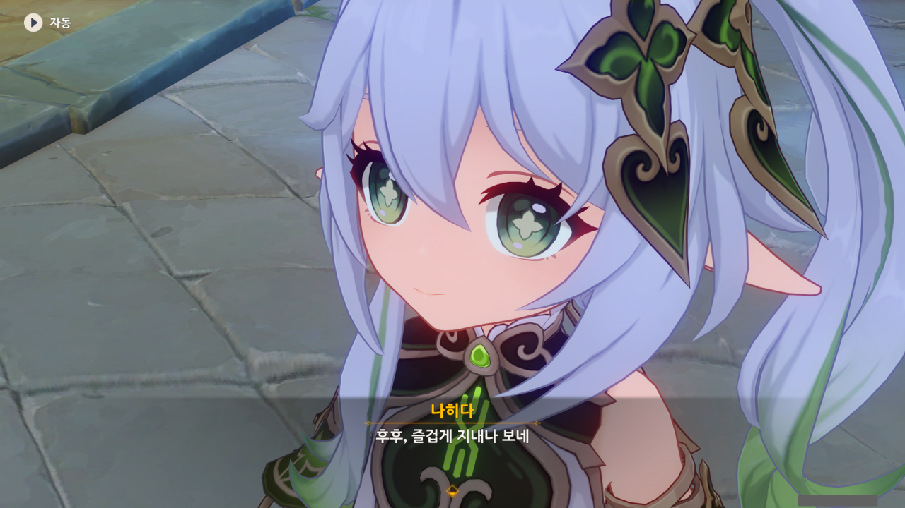

어... 음... 원신을 켜서 공월 보상 원석을 받고, 일일 임무를 모두 끝낸 후, 곧바로 게임을 끄는 걸 반복하는 게 즐거운 건가?

스토리 관련 임무를 아껴 먹으려다 보니, 달리 할 게 없더라고.

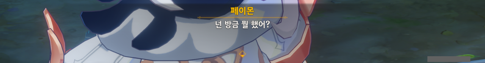

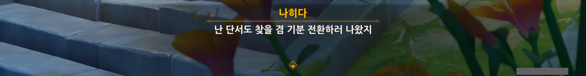

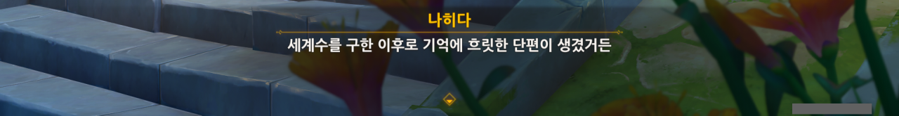

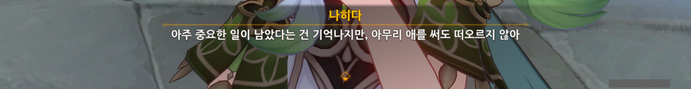

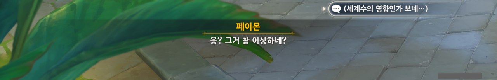

룩카데바타를 세계수에서 삭제하자, 티바트의 모든 사람들의 기억과 역사에 개찬이 이루어졌다. 나히다를 포함한 일곱 신마저 룩카데바타의 행적을 나히다의 것으로 기억한 것이 충격이었지.

나히다가 말하는 '기억의 흐릿한 단편'은 아마 그 개찬의 잔재가 아닐까?

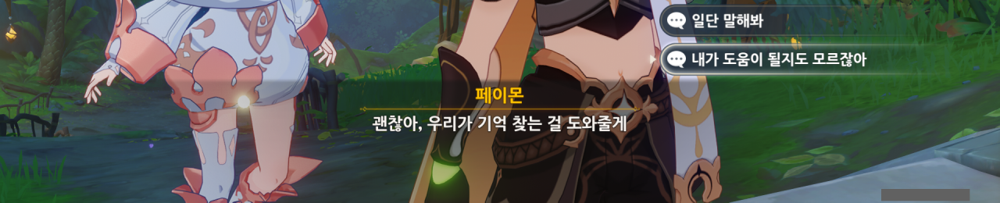

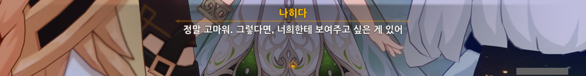

그렇다면 나히다를 돕지 않을 수 없다.

대체 룩카데바타가 뭘 남겼는지 궁금하지 않은가? 이건 참을 수 없다.



나히다가 꺼낸 건 뭔가 결정체처럼 생긴 물건이었다. 항아리 지식처럼 생긴 것 같기도 하고...

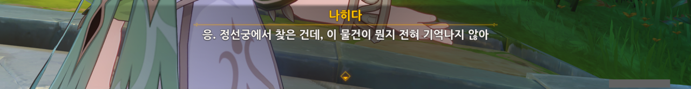

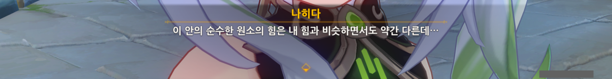

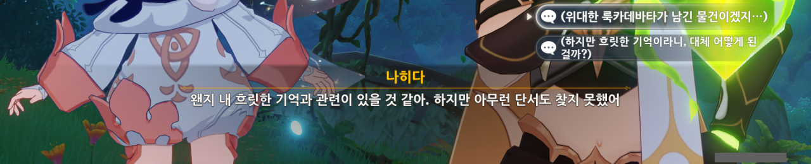

나히다의 힘과 비슷하면서 약간 다른 힘이라면 룩카데바타의 힘 말고는 다른 후보가 없다.

룩카데바타는 대체 이걸 왜 남긴 걸까?

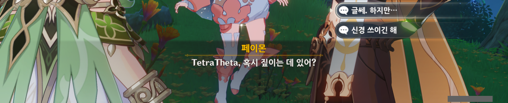

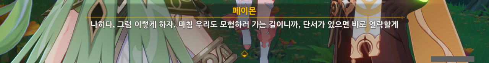

대체 저게 뭔지는 나중 가면 알 수 있을 것이다. 저게 맥거핀이 아닌 이상 말이다.

하지만 저렇게 별개의 모델을 썼으니, 맥거핀은 아마 아닐 것이다.

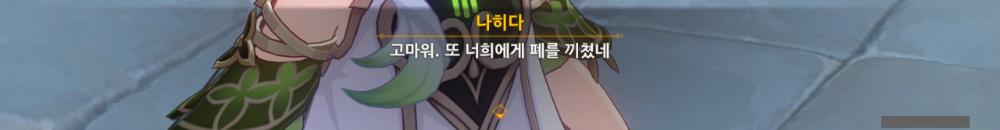



나히다와 이야기하던 중, 성 입구에서 경비를 서던 경비병 앞에 버섯몬 하나가 나타났다.

평소 경비병이 성 주변을 순찰하며 몹을 소탕하기라도 하는 것인지, 평소 수메르성 근처에는 몹이 전혀 나타나지 않는다.

그런데 수메르성, 그것도 입구에 버섯몬이 나타나다니, 이건 정말 신기한 일이다.



버섯몬의 시선이 여행자와 나히다에게 향한 것으로 보아, 버섯몬은 여행자 혹은 나히다에게 뭔가 할 말이 있는 것 같다.

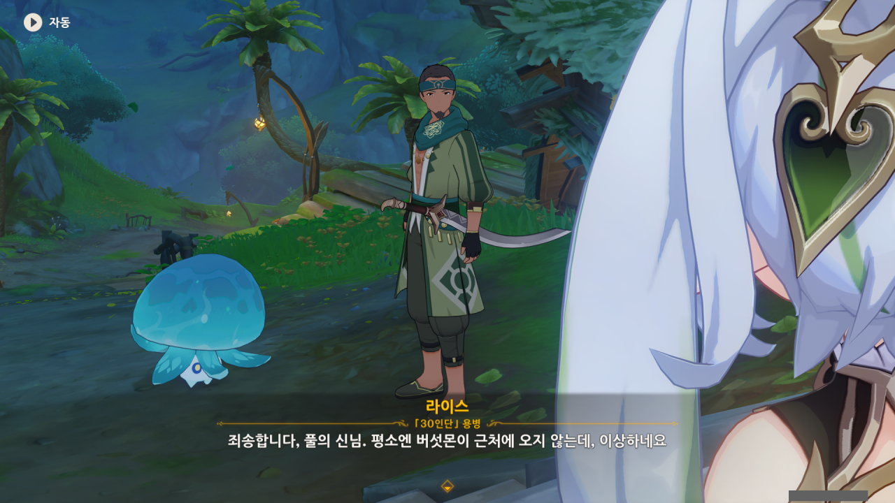

그래. 나도 그렇게 생각해.

대체 버섯몬이 여기에 웬일일까?



어... 그렇긴 한데... 버섯몬도 말을 할 수 있었어?



버섯몬이 마물이긴 하지만, 뭔가 묘한 위치에 있는 마물이다.

필드에서 만나는 버섯몬은 하나같이 플레이어를 보자마자 적대시하지만, 이벤트 등에서 등장하는 버섯몬은 그렇지 않거든. 오히려 버섯몬이 여행자의 동료가 되는 경우가 많다.

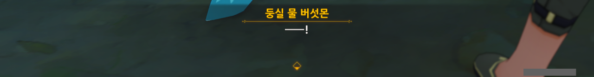

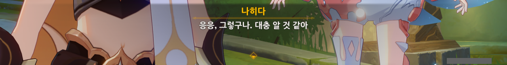

뭐야, 설마 방금 둘이 대화한 거야?



> 그걸 알아들었다고?

페이몬의 고개가 갸우뚱하는 모습이 너무 귀엽다.

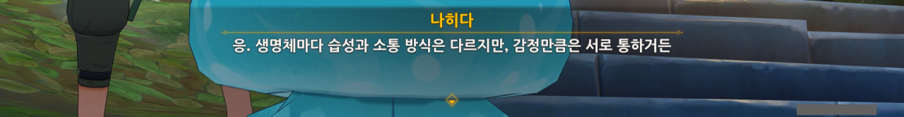

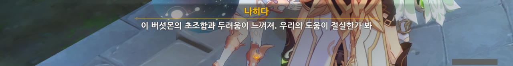

직접적으로 뜻이 통한 건 아니지만, 전해져 온 감정을 통해 대충 어떤 말을 하고 있는지 파악했다는 나히다.

이심전심이라는 건가...

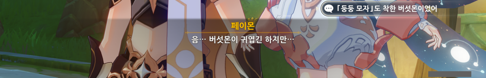

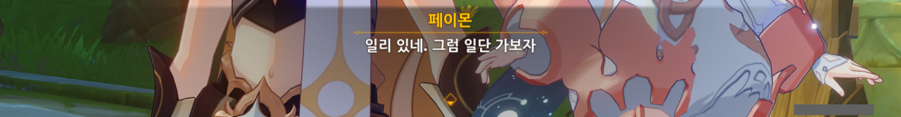

이벤트에서 여행자의 동료였던 버섯몬, 「둥둥 모자」를 예시로 들자 곧바로 납득하는 페이몬.

거 참, 일리 있네!

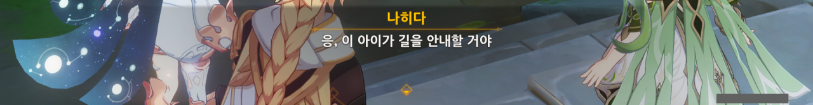

버섯몬이 안내하는 대로 따라가 보자.

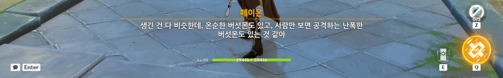

아까 말했다시피, 필드에서 만나는 버섯몬은 선공몹이지만, 이벤트 등에서 만나는 버섯몬은 비선공, 혹은 아군 취급이다. 방금 나히다와 *대화*했던 버섯몬도 따지고 보면 비선공이고 말이다.

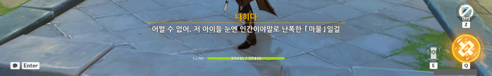

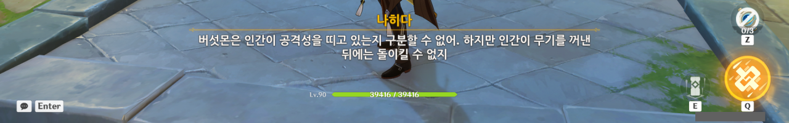

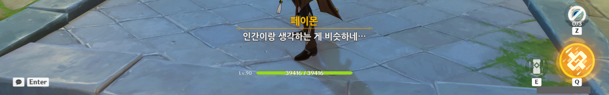

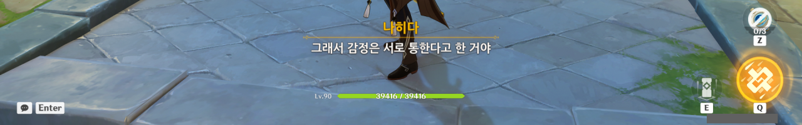

듣고 보니 맞는 말이긴 한데, 뭔가 억울한 기분이 드는 건 왜일까?



버섯몬을 따라가자, 저 앞에 또 다른 버섯몬 둘이 더 보인다.

그런데 저거... 혹시 뒤집혀 있는 건가?



정말이네.

그런데 뒤집힌 버섯몬의 머리는 대체 어떻게 되어 있는 걸까? 이렇게 보니 그냥 바닥에 핀 꽃처럼 생겼다.



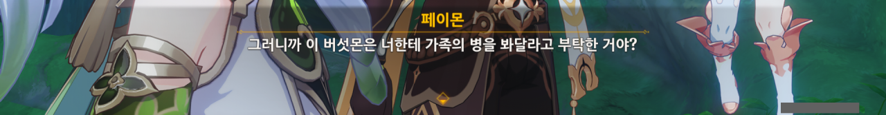

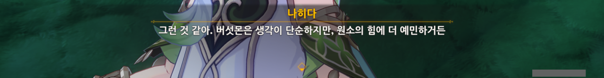

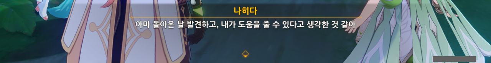

버섯몬은 나히다가 아픈 버섯몬을 치유해 줄 수 있을 것이라 생각해, 나히다를 보자마자 그렇게 안달복달한 모양이다.

음, 대체 무슨 근거인진 잘 모르지만...

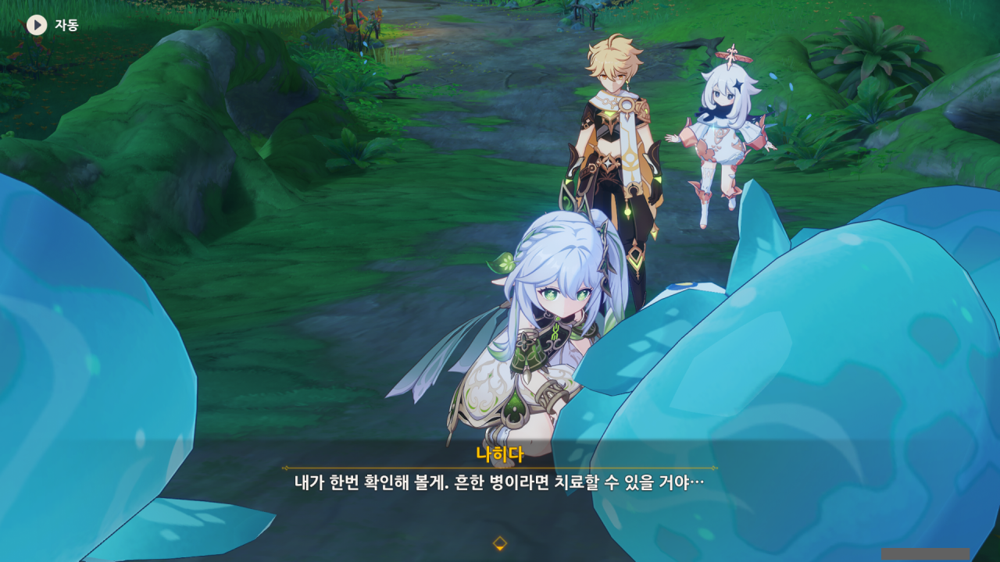

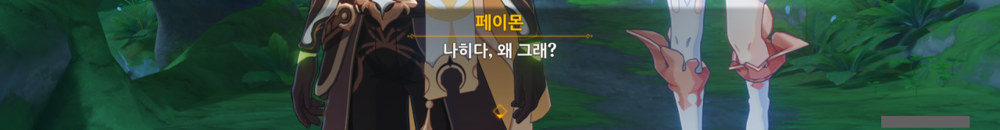

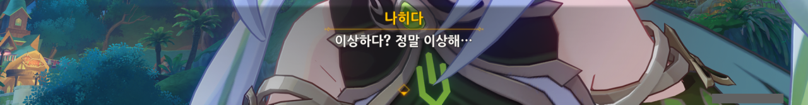

아픈 버섯몬을 살펴보더니, 갑자기 이상하다고 말하는 나히다. 대체 뭐가 이상하다는 걸까?

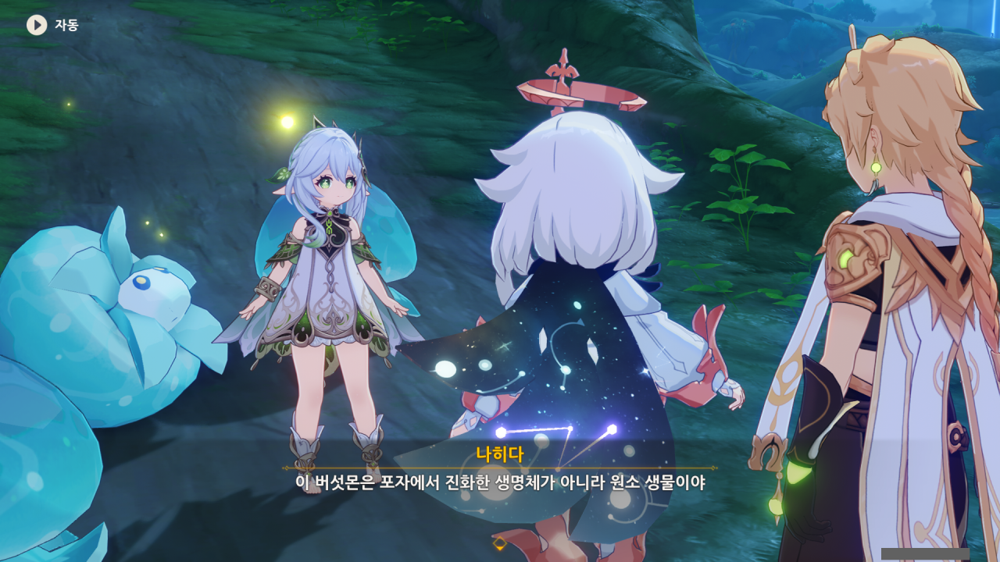

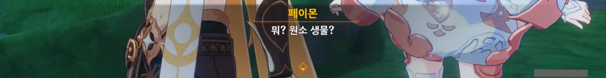

이 아픈 버섯몬은 그냥 버섯몬이 아니라, 원소 생물이라고 한다.

원소 생물에는 수정 나비와 슬라임이 있고, 광풍의 핵이나 뇌음의 권현, 큐브 시리즈, 물의 정령 같은 보스 역시 원소 생물에 속한다.

그러니까... 얘가 수정 나비나 슬라임과 같은 위치라고?

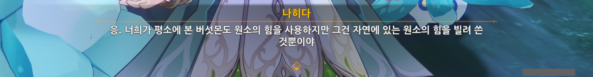

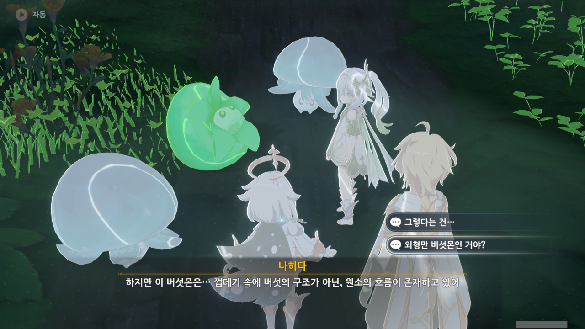

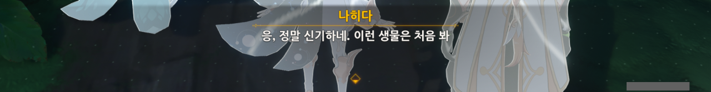

어라, 정말이네. 원소 시야로 살펴보자, 아픈 버섯몬 혼자 색깔이 다르다.

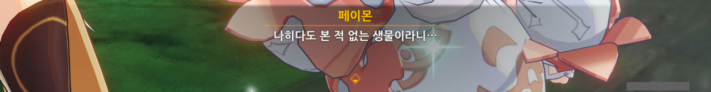

지금까지 이런 경우를 본 적이 단 한 번도 없었기에, 나히다가 신기해했던 것이었다.

나히다는 세계수와 연결된 지식의 신이자, 최초의 허공 단말기이기도 하기 때문에 모르는 지식이 없을 텐데...

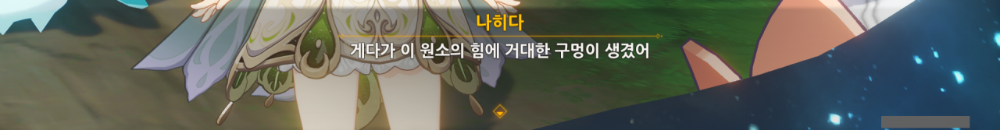

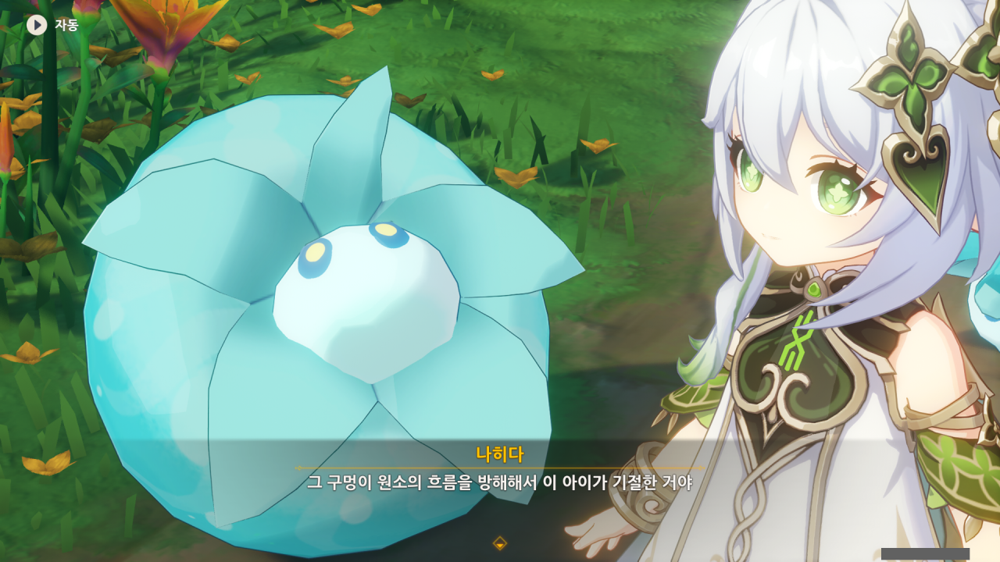

원소의 힘에 거대한 구멍이 생겨 원소의 흐름을 방해했기에 이 원소 생명체가 아프게 되었다고 말하는 나히다.

뒤집어진 버섯몬을 볼 때마다 무슨 꽃처럼 생겼다는 생각을 도저히 지울 수 없다.

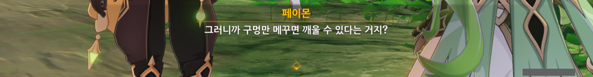

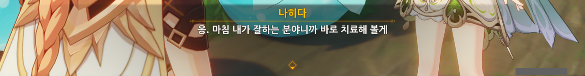

원소 생명체 버섯몬에 생긴 '구멍'을 메워주는 나히다.

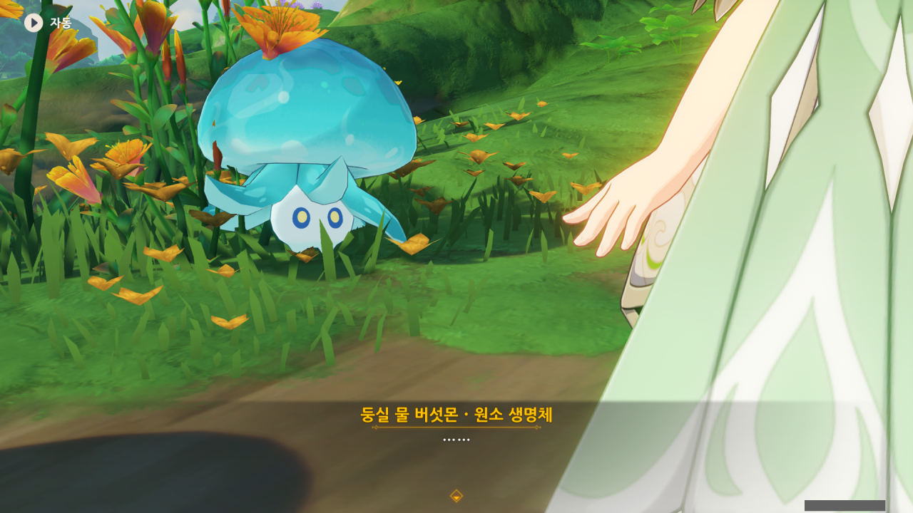



깨어난 원소 생명체 버섯몬을 본 나머지 버섯몬들이 아주 신났다.

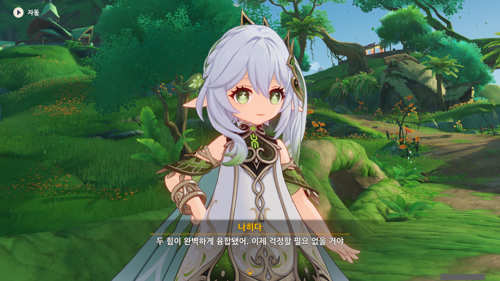

두 힘이 융합되었다는 게 정확히 무슨 말인지는 잘 모르겠지만, 나히다가 걱정할 필요가 없다고 했으니 괜찮은 거겠지.



갑자기 사람 말을 하는 원소 생명체 버섯몬. 아니, 이게 진짜 어찌 된 일이지?

'풀의 왕'은 풀의 신인 나히다를 말하는 것일 테고, '낯선 인간'은 여행자, '낯선 생물'은 페이몬을 말하는 것이 분명하다.

&nbsp;

그런데 이 버섯몬, 목소리가 조금 특이하다. 굉장히 차분하게 말을 하는데, 목소리에 약간 에코가 들어간 느낌이다.



> 낯선 생물은 이런 목소리를 내는군요. 저도 놀랐답니다.

분명 놀리려는 뜻은 없는 것 같은데, 마치 '와! 말을 할 줄 아는 생물이구나! 대단해!'라고 말하는 것 같다.

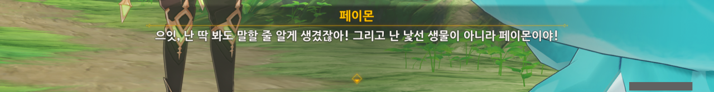

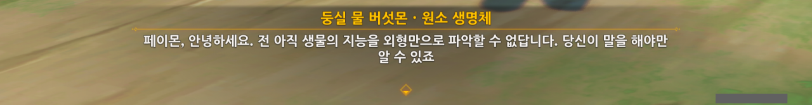

> 전 아직 생물의 지능을 외형으로만 파악할 수 없답니다. 당신이 말을 해야만 알 수 있죠.

아니, 거기서 정론을 들고 오시면...



ㅋㅋㅋㅋㅋㅋ 페이몬이 자신이 말도 못 하는 바보 같아 보이는 거냐며 회의감을 느낀다.

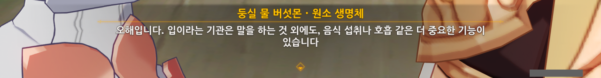

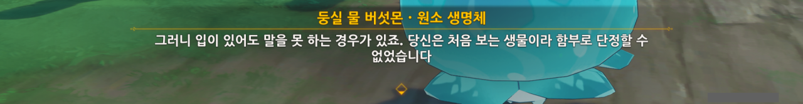

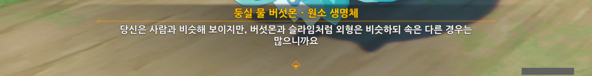


정말 페이몬 말처럼, 이 원소 생명체 버섯몬은 아카데미아에 다니는 것처럼 아주 말이 청산유수이다.

뭔가 알하이탐이랑 죽이 잘 맞을 것 같은데.


원소 생명체 버섯몬이 말하는 「가족」이란 다른 버섯몬을 말하는 거겠지.


자기들끼리 뭐라 말한 후, 다른 버섯몬의 말을 옮겨주는 원소 생명체 버섯몬.

&nbsp;

원소 생명체 버섯몬의 말대로, 다른 버섯몬과 헤어진 후 장소를 옮겼다.


원소 생명체 버섯몬의 정체를 묻는 나히다. 아까 나히다가 "역시 넌 버섯몬이 아니구나?"라고 말한 것의 연장일 것이다.


원소 생명체 버섯몬이 말하는 「종말」은 심연 혹은 금단의 지식과 연관된 것으로 보인다.

금단의 지식은 적왕의 왕국을 끝장내기까지 했으니, 종말이라 불리기에 손색이 없다.


정말 「종말」의 정체가 심연이었네.

더 정확히 말하자면, 종말은 심연과 같고, 심연의 지식은 곧 금단의 지식이다.

그러게. 금단의 지식은 사막에 널리 퍼졌다고 알고 있는데.


이 원소 생명체의 고향은 사막이 아닌 것이 확실하나, 정확히 어디에 있는지는 모른다고 한다.

사막이 아니라면 우림 지대에 있다는 건데... 우림은 숲의 책 임무를 하면서 샅샅이 다 뒤지고 다녔다고 자부할 수 있다. 그런데 남은 지역이 또 있다고?

어쩌면 이 원소 생명체가 기억을 잃어버린 것도 나히다의 경우처럼 세계수 정화의 영향 때문일지도 모르겠다.


그렇지. 어쩔 수 없이 금단의 지식을 마지막까지 품고 있던 룩카데바타가 소멸했으니, 이제 수메르에 남은 금단의 지식은 없는 셈이다.


다른 생존자는 고향의 위치를 아직 잊어버리지 않았을 수도 있으니, 다른 원소 생명체를 찾으면 이 원소 생명체의 고향이 어디인지 알 수 있을지도 모른다.


'착한 아이들'? 수메르성의 사람 아이들을 말하는 걸까, 아니면 다른 무언가를 비유한 걸까?


나히다가 힘을 쓰는 걸 아까와는 다른 형태로 보여줄 줄 알았는데, 버섯몬을 치유할 때와 동일하게 손 끝에서 초록색 무언가가 사르륵 나오고 끝났다.


약속? 무슨 약속?


예언이라고? 그러면 나히다나 룩카데바타가 정말로 그렇게 말한 게 아닐 수도 있지 않을까?


나히다의 기억이 룩카데바타의 것을 포함해 온전했더라면 그게 정말 약속이었는지 단순한 예언일 뿐이었는지 알 수 있겠지만, 룩카데바타에 대한 기억은 세계수를 정화하며 날아가 버렸으니, 지금은 그냥 그런가 보다 하며 넘길 수밖에 없다.


가족의 결말...? 설마 말로라는 의미는 아니겠지?


아무튼, 나히다 전설 임무 제2막 시작!

&nbsp;

...이라고 말은 했지만, 최대한 아껴먹을 생각이다.

처음 사진을 찍으며 '적당한 곳에서 끊어야지'라고 생각했는데, 끊고 나니 찍은 사진이 140장이나 되는 바람에, 조금 놀랐다.
