어제 원신의 버전이 올라가 2.2가 되었다.

사실 원신 버전 업데이트보다는 캐릭터 기원에 더 관심이 있었던지라, 이번 업데이트로 무엇이 바뀌었는지에 그리 큰 관심을 가지지 않았다.

그야, 이번 버전에서 호두가 복각하거든. 이걸 어떻게 참아?

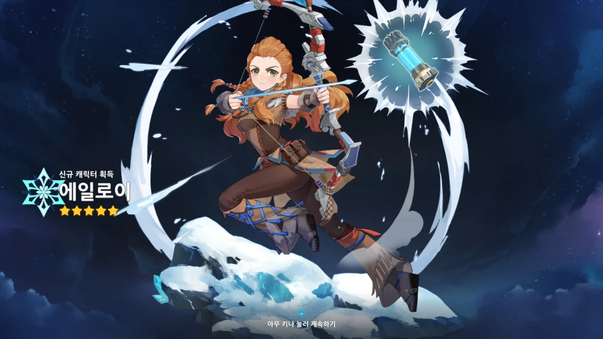

우편함을 보니 에일로이가 들어와 있었다.

호라이즌: 제로 던과의 콜라보로 인해 추가된 콜라보 캐릭터인데, 플레이스테이션을 쓰는 사람들은 바로 이전 버전인 2.1 버전에서 이미 에일로이를 받았다고 하더라.

&nbsp;

원본 에일로이와 비교하면 선녀라고 할 수 있을 정도로 훨씬 더 귀엽고 이쁜 캐릭터이긴 하지만, 쓸 것 같지는 않다. 그냥 20/40으로 만든 후, 인연 하나 빼먹고 방치할 예정이다.

각청도 똑같이 20/40으로 만들어 인연만 빼먹은 후 방치 중인데, 에일로이라고 오죽할까.

&nbsp;

에일로이의 성능은 0.5 감우 정도 된다고 하던데, 잘은 모르겠다.

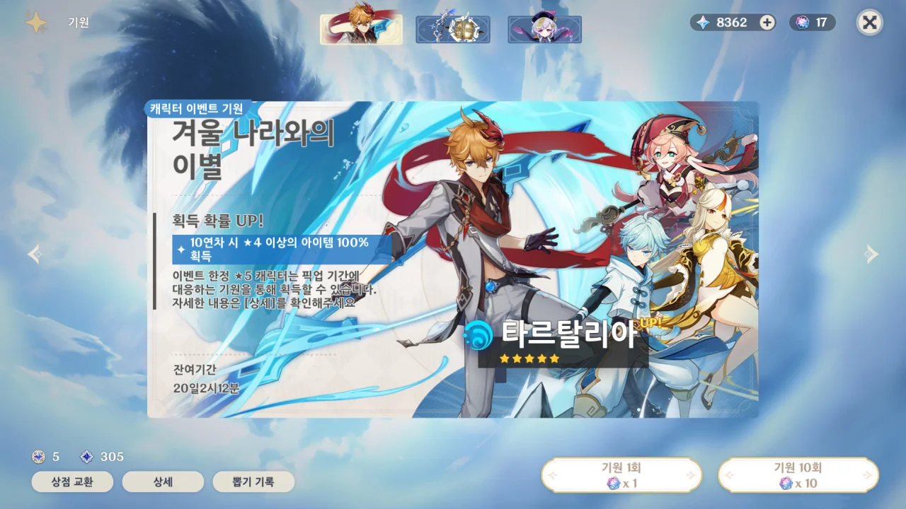

타르탈리아는 6돌을 하지 않으면 쓰기 힘들다고 하길래, 아예 쳐다도 보지 않는 중이다.

4성 캐릭터 풀도 옛날 길고 길었던 아야카 픽업과 동일하기에, 4성을 보고 뽑을 이유도 없다.

&nbsp;

다음 픽업에는 호두와 토마가 나온다고 하던데, 토마가 4성으로 나올 것 같다.

그러면 호두를 1돌로 만들 때까지 토마가 최소한 한 번은 나오겠지.

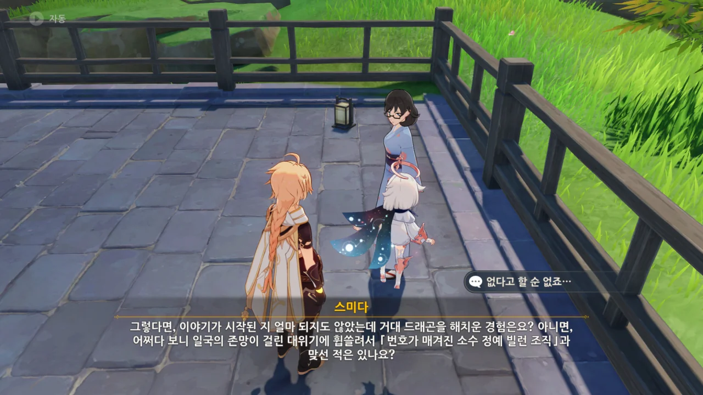

스미다가 '거대 드래곤을 해치운 경험' 혹은 '일국의 존망이 걸린 대위기에 휩쓸려 번호가 매겨진 소수 정예 빌런 조직과 맞선 적'이 있냐고 물어보는데... 놀랍게도 둘 다 경험이 있다.

드발린은 거대 드래곤에 해당하고, 일국의 존망이 걸린 대위기라면 리월에서 있었던 오셀의 부활을 이야기하는 것이겠지. 번호가 매겨진 소수 정예 빌런 조직? 이거 완전 우인단이잖아.

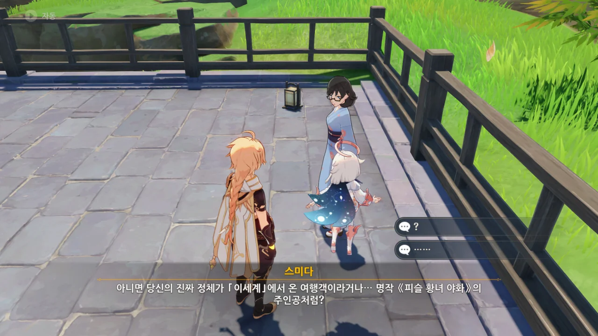

심지어 주인공은 '이세계에서 온 여행객'이다. 분명 주인공 남매가 이세계에서 왔다는 이야길 들은 기억이 있거든.

그런데 《피슬 황녀 야사》는 대체 뭐냐? 설마 피슬의 중이병 설정이 이 책에서 온 거였어?

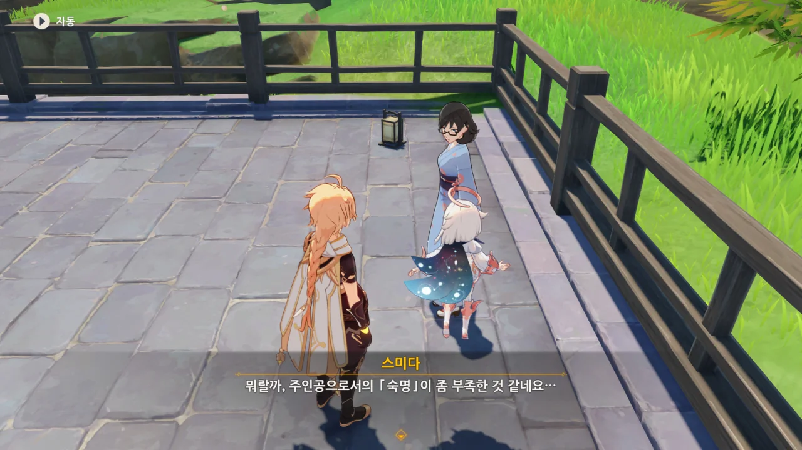

> 주인공으로서의 「숙명」이 부족한 것 같네요...

하, 뭐래니. 헛웃음이 절로 나온다.

여행자는 이미 원신이라는 이야기의 주인공이고, 주인공으로서 겪을 만한 일은 다 겪었다.

제대로 알지도 못하면서.



절대로 대사가 출력되던 중 사진을 찍은 것이 아니다. 이게 대사가 다 출력된 것이다.

대체 검수팀은 월급 받고 뭐하냐! 이 게임에서 캐릭터, 스토리, 대사, 더빙 빼면 뭐가 남길래 대사 검수를 이따위로 해?

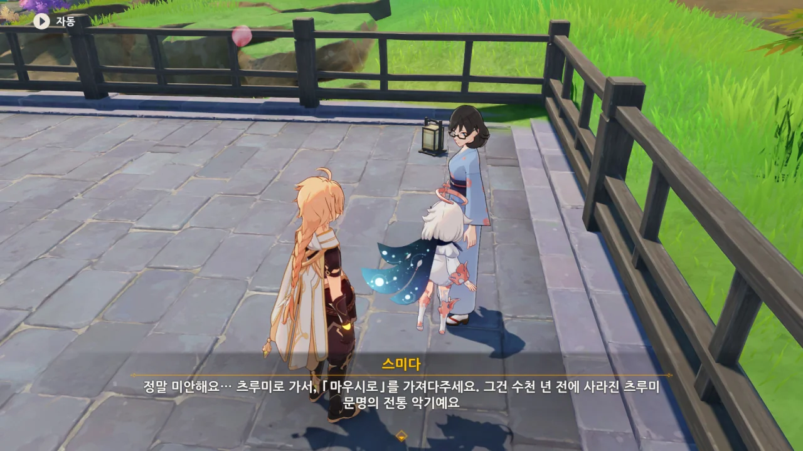

스미다가 츠루미 섬으로 가 수천 년 전에 사라진 츠루미 문명의 전통 악기를 찾아와달라고 한다.

그게 그냥 츠루미 섬에 가면 있는 거야? 수천 년 전의 악기라면 무덤이라도 도굴하지 않는 이상은 찾기 어려울 것 같은데?

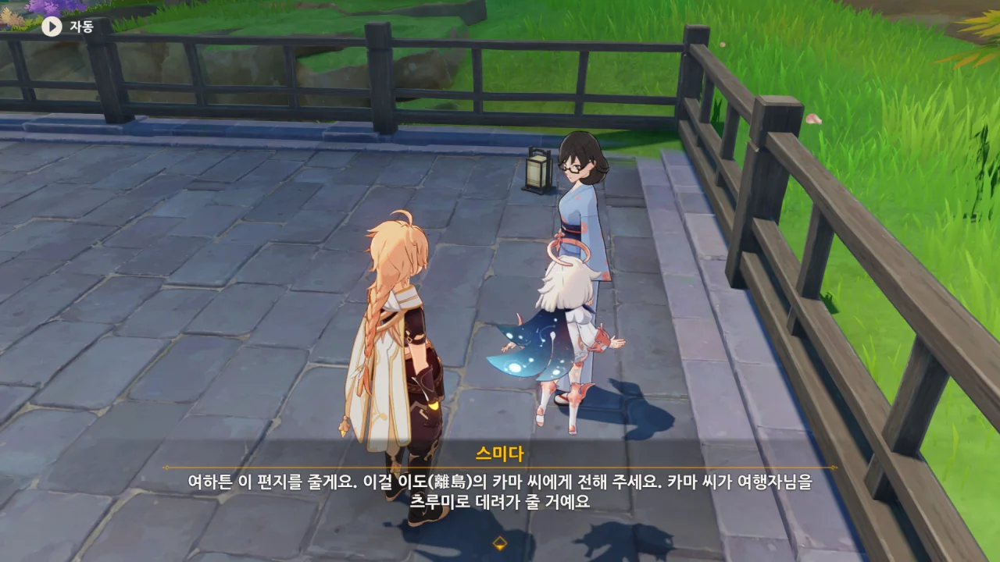

직접 파도 배를 타고 츠루미 섬으로 갈 줄 알았는데, 다행히도 누군가가 츠루미 섬까지 태워준다고 한다.

이나즈마에 처음 올 때가 생각나는걸. 그때에도 북두의 배를 빌려 타고 왔었지.

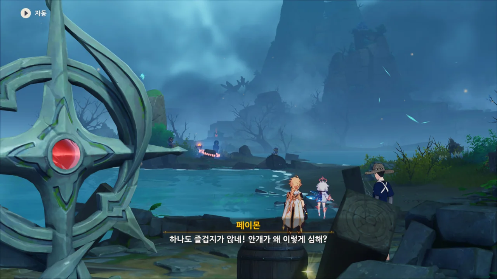

섬이 온통 안개로 뒤덮여 있다.

여기에 과연 사람이 살기는 할까? 이렇게 안개가 사시사철 자욱한 곳에 산다면 분명 건강이 좋지 않을 텐데.

왜 츠루미 문명이 수천 년 전에 망했는지 알 것 같기도 하다.

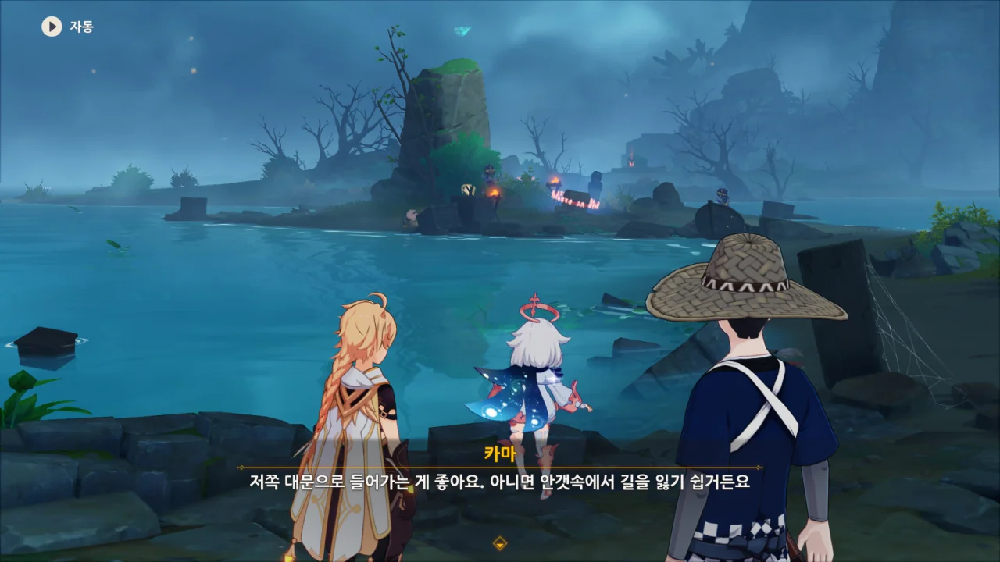

카마가 '대문으로 들어가는 것이 좋다'라고 하지만, 그 대문이 뭔지 잘 모르겠다. 여기선 대문은커녕 대문 비슷한 것도 보이질 않는데.

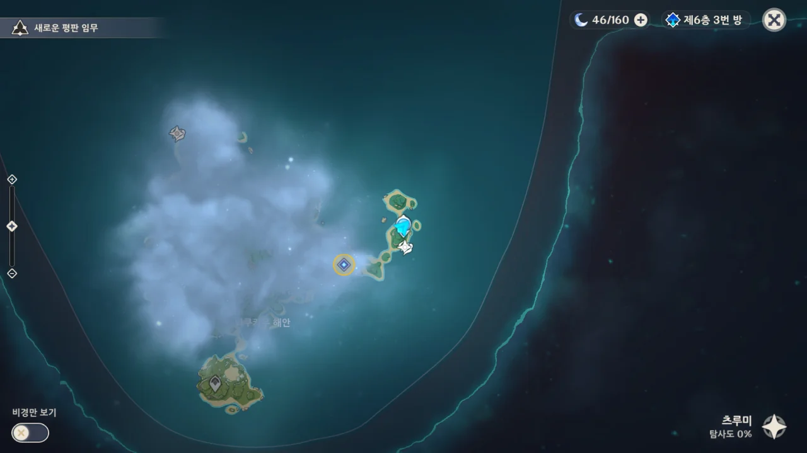

지도를 열자 섬 전체가 안개에 뒤덮여 아무것도 보이질 않는다.

이게... 맞나?

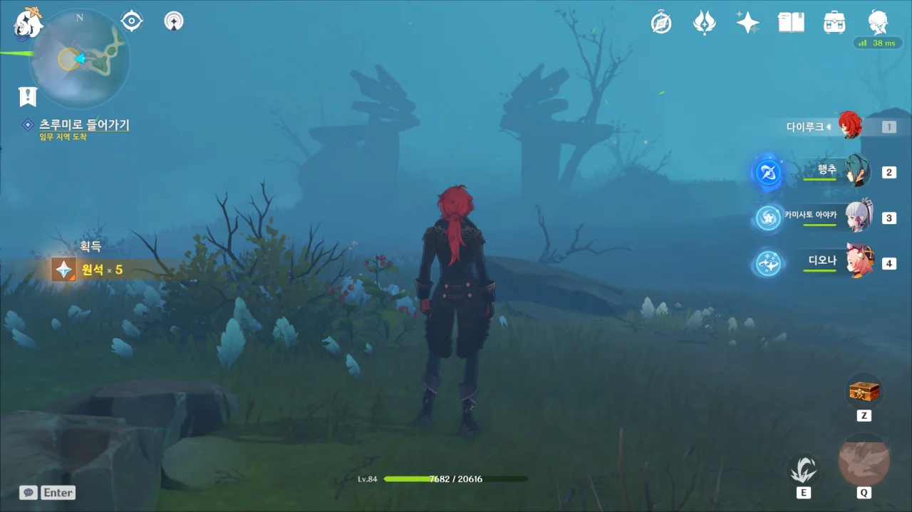

설마 이게 아까 카마가 이야기한 '대문'이야? 이게 어딜 봐서 대문이야?

심지어 이 구조물은 아까 카마가 말할 때 보여준 곳에 있지도 않았다. 안개에 가려져 있었거든.

이런 건 최소한 컷신으로라도 보여줘야지...



가까이 가니 안개가 조금 걷힌다.

하지만 맵에는 여전히 안개가 낀 곳이 있다. 저 네 곳을 전부 다 가야겠지, 아마.



어린아이를 하나 발견했다.

이곳의 문명은 수천 년 전 멸망했으니, 지금껏 오면서 본 구조물과 마찬가지로 버려진 섬이다. 그런데 이런 곳에 어린아이가 홀로 돌아다닌다고? 이 아이가 혼자서 배를 몰고 이곳에 왔을 것 같지는 않은데?

클리셰대로라면, 이 어린아이는 살아있는 사람이 아닐 확률이 매우 높다. 살아있지 않거나, 사람이 아니거나.

그런데 그런 의심을 한 지 얼마 지나지 않아 다른 사람을 만날 수 있었다.

음... 미안.

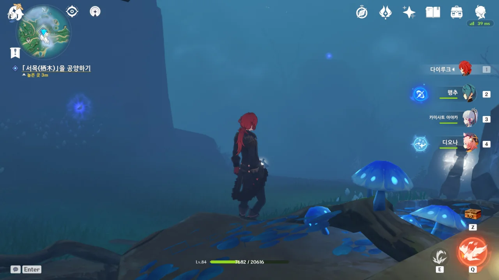

서목에 공양하라고 해서 공양을 하는데, 그게 그냥 서목을 만지면 서목에서 솟아 나와 세 갈래로 흩어지는 깃털을 전부 주운 후 다시 서목을 만지는 것이다.

이거, 공양 맞아?

&nbsp;

그런데 깃털이 참 짜증 나는 곳에 흩어져 있더라. 깃털을 모으다 보니 옛날 나루카미 섬에서 열심히 뺑이 친 기억이 솔솔 피어올랐다.

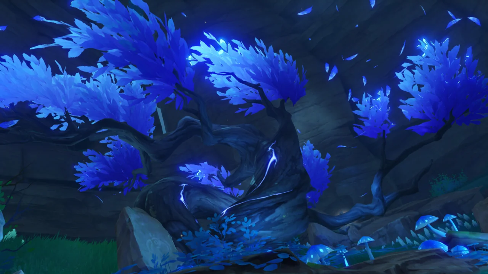

서목에 깃털을 모두 모아다 주면 이렇게 죽어있던 나무에 생기가 돌며 나뭇잎 같은 것이 돋아오른다.

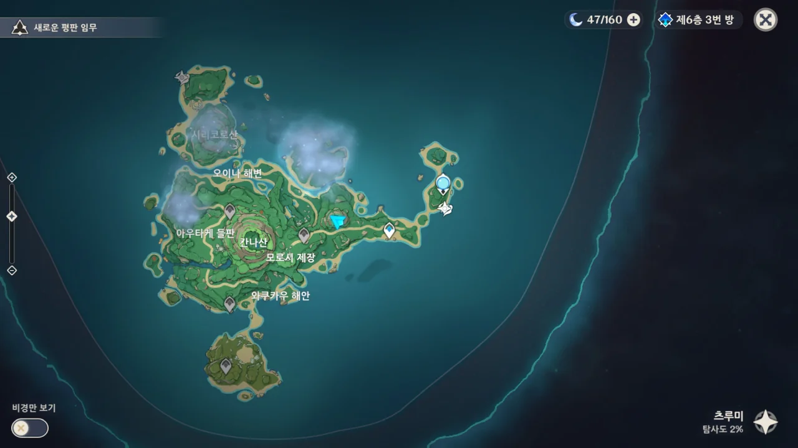

아무래도 이 짓거리를 세 번 더 해야 하나 보다.

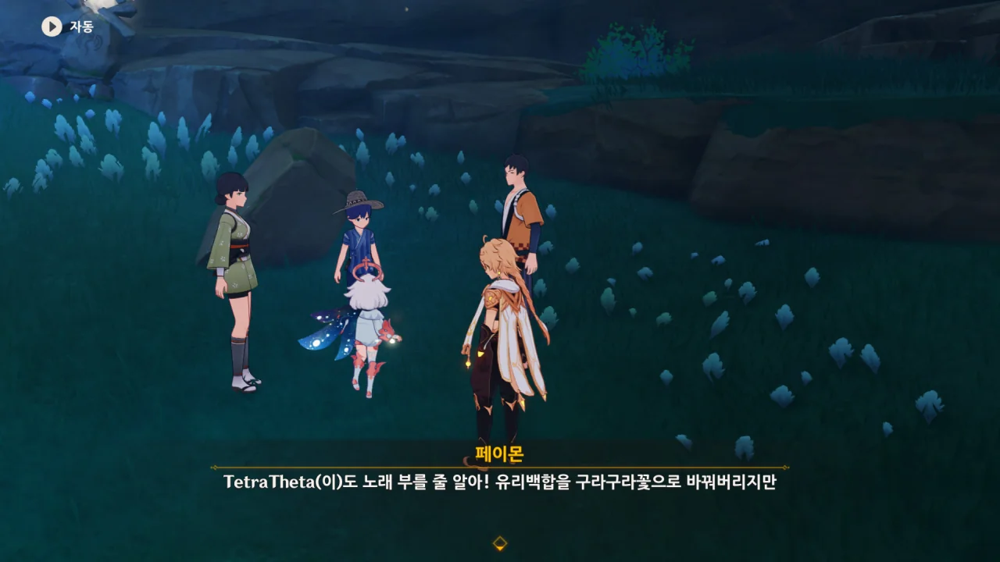

> 여행자도 노래 부를 줄 알아! 유리백합을 구라구라꽃으로 바꿔버리지만

제발, 여기서 노래만은 부르지 말아다오. 내가 남행자를 고른 걸 제일 처음 후회했을 때가 남행자가 부른 노래를 들었을 때였다고.

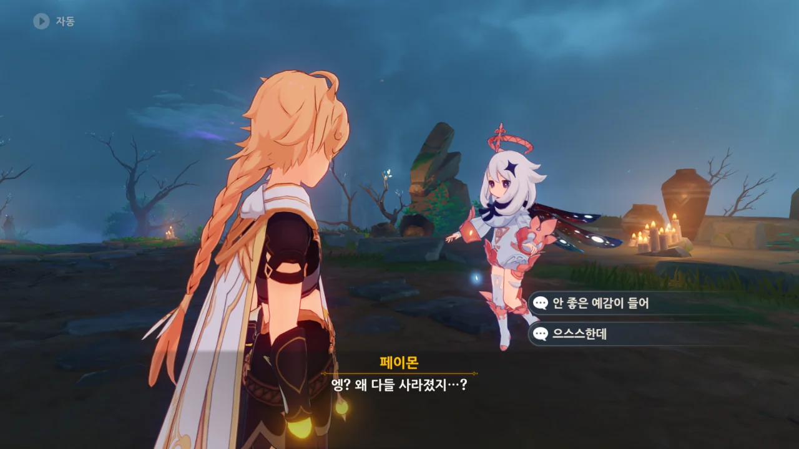

열심히 세 곳의 서목에 공양하고 돌아오니, 아까 전까지만 해도 있던 사람들이 온데간데없이 사라졌다. 심지어 아까 처음 만난 어린아이조차도.

아까 사람들에게 말을 걸었을 때 전부 아무 말도 하지 않던 것이 어째 수상하더니만... 여행자가 지금껏 이 섬에서 만난 모든 사람이 전부 유령 비슷한 거였던 거야?

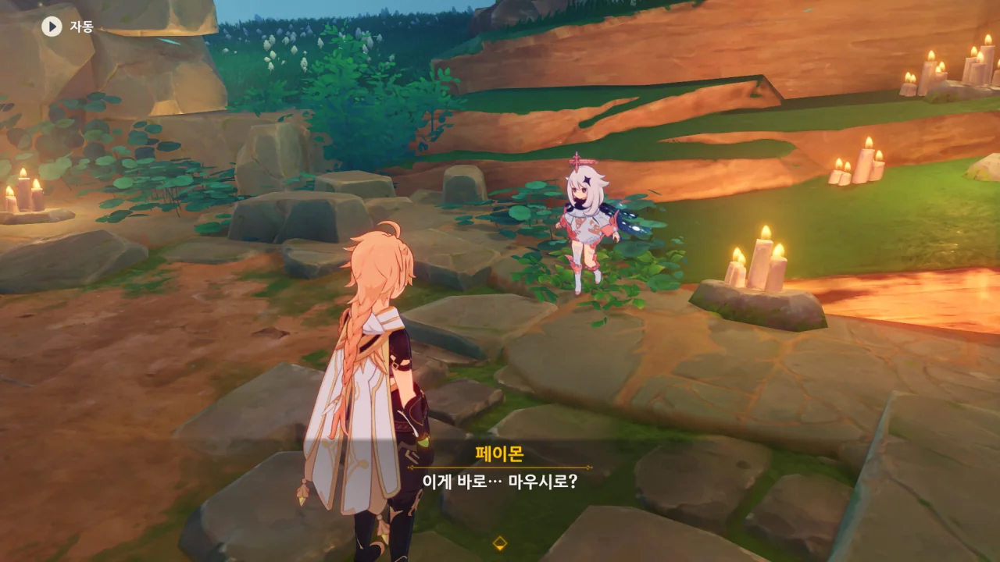

그래도 여기 온 목적인 마우시로는 확보했다.

만약 마우시로가 여기 놓여있는 걸 찾지 못했더라면 정말로 무덤을 뒤져야 했을지도 모르겠다.

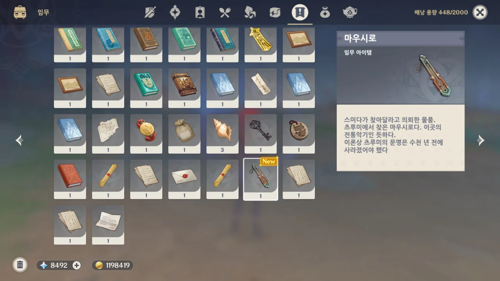

> 마우시로
> ***
> 스미다가 찾아달라고 의뢰한 물품.
> 츠루미에서 찾은 마우시로다. 이곳의 전통악기인 듯하다.
> 이론상 츠루미의 문명은 수천 년 전에 사라졌어야 했다.
{.bq}

어째 임무 아이템의 플레이버 텍스트가 쌔한 느낌을 주는데...

하지만 다시 나루카미 섬으로 돌아와 스미다에게 마우시로를 주려 했을 때는 마우시로가 감쪽같이 사라진 후였다.

이런 일이 예전에도 여러 번 있었던 모양인지, 스미다는 놀라지 않고 차분하게 다른 모험가가 겪었던 일을 설명해 준다.

허깨비를 배낭 안에 넣고 다녔다고 하니, 좀 더 으스스한 느낌이 든다.

그리고 또다시 분위기를 해치는 대사 미출력 버그. 아오, 진짜.

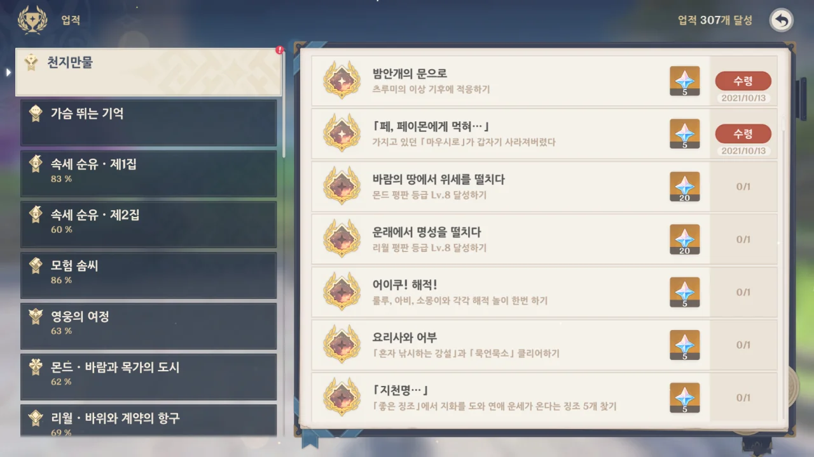

새로운 업적이 달성되어 업적 창을 확인해 보니 「페, 페이몬에게 먹혀...」라는 업적이 달성되어 있었다.

ㅋㅋㅋㅋㅋㅋ 페이몬이 마우시로를 먹은 거야? ㅋㅋㅋㅋㅋㅋ

***

여기까지는 그냥 한 번 나오고 끝나는 일회성 월드 임무인 줄 알았다. 그런데 다음날 보니 연계 임무가 생겨 있더라.

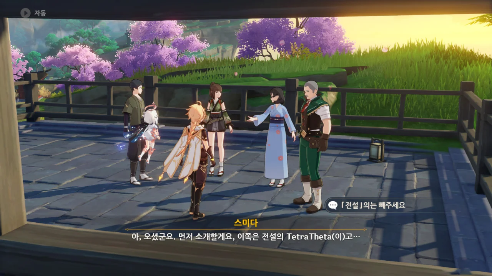

스미다가 여러 사람을 한데 모았다.

모험가 길드의 로알드와 만능 산고 탐정 사무소의 탐정, 그리고 그곳의 사장인 산고이다.

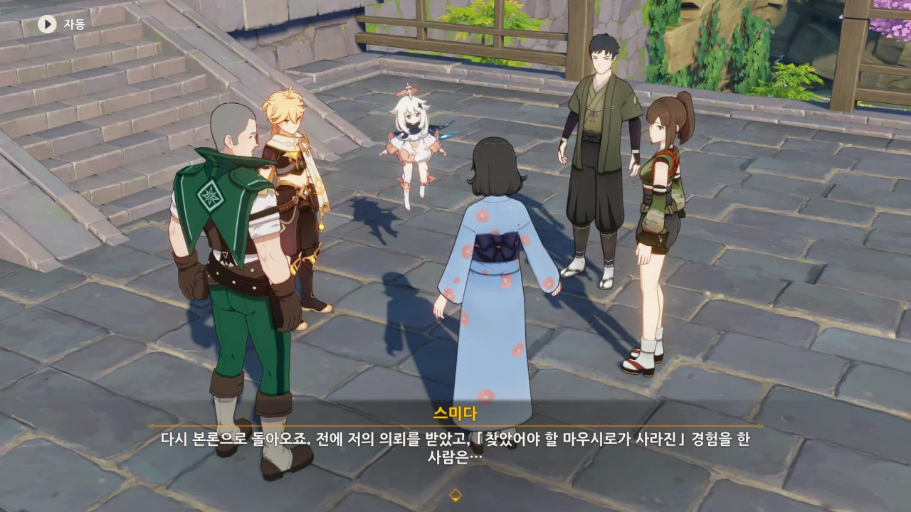

이들 모두가 스미다의 의뢰를 받고 마우시로를 확보했으나, 츠루미 섬에서 돌아와 보니 마우시로가 사라진 경험을 한 사람들이다.

이외에도 스미다가 의뢰를 맡긴 사람이 더 있지만, 다들 이런저런 이유를 들어 또다시 모이는 걸 거절했다고 한다.

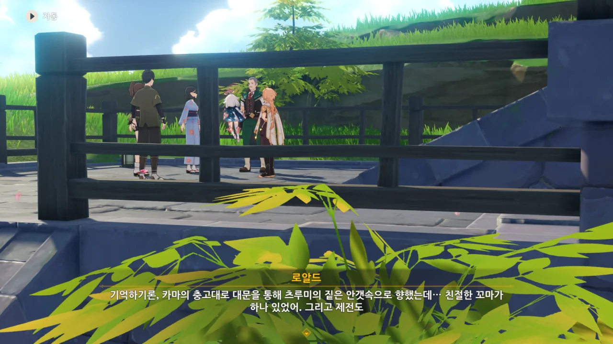

신기하게도 탐정 사무소의 탐정 둘은 츠루미 섬에서 무슨 일이 있었는지 전혀 기억하지 못했지만, 로알드는 그곳의 일을 기억하고 있었다.

그가 기억하는 내용 역시 여행자가 겪었던 것과 동일하다.

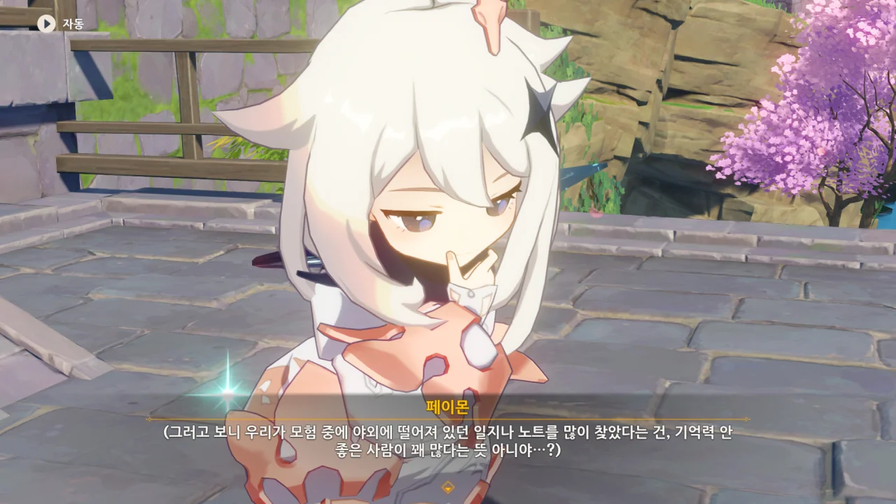

로알드가 그때 있었던 일을 기억하는 까닭은 그의 기억력이 좋지 못해 자주 일지를 썼고, 그 덕분에 그곳에서의 기억을 잊지 않을 수 있었다고 한다.

그런데 우리가 돌아다니다 보면 곳곳에 이런저런 일지나 노트가 떨어져 있던데...  이 세상에는 기억력이 좋지 않은 사람이 대체 얼마나 있는 걸까?



츠루미를 멸망시킨 번개의 마효(魔梟)는 세이라이 섬의 아마쿠모 산마루에서 라이덴 쇼군에 의해 토벌되었다. 아사세 신사가 세워진 것 역시 그 번개 올빼미가 남긴 힘을 억제하기 위해서였고.

실제로 우리가 세이라이 섬 정상에서 실컷 팰 수 있는 뇌음의 권현 역시 번개 올빼미가 남긴 잔재와 같은 것이다.

&nbsp;

드디어 원신에서 제대로 된 루비 문자를 사용하는구나.

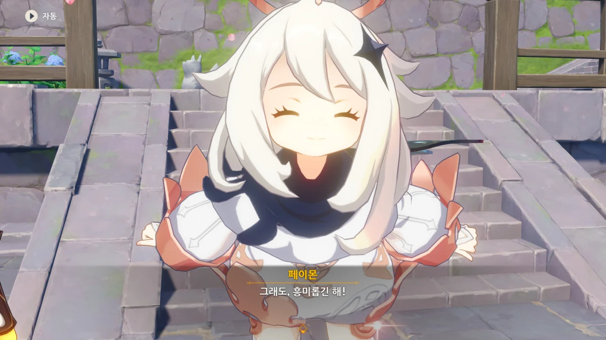

이외에도 산고가 츠루미 섬에 무슨 일이 생긴 것인가에 대해 여러 가설을 제시했지만, 머릿속에 제대로 들어오지 않았다.

하지만 페이몬은 귀여웠다.

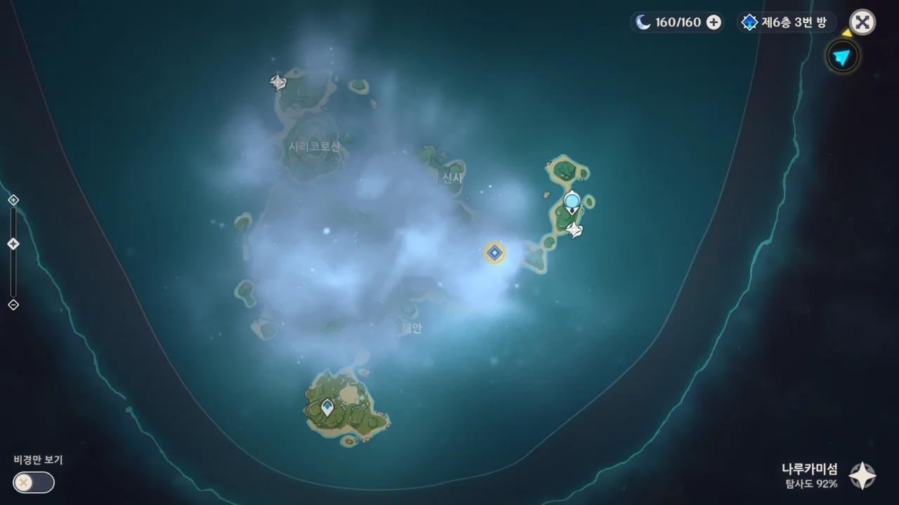

아니, 분명 내가 저 안개를 어제 다 걷어냈을 텐데? 왜 또 안개가 생긴 거야?

설마 이 안개, 매일 가서 안개를 걷어내야 하는 거야?

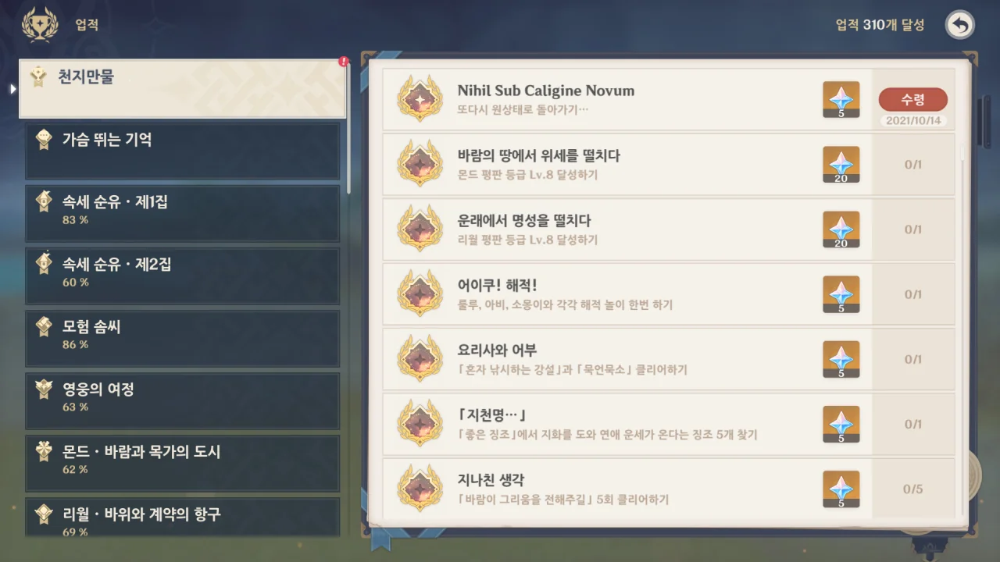

Nihil Sub Sole Novum은 '태양 아래 새로운 것은 없다'라는 라틴어 구절이고, Caligine는 '안개'라는 뜻의 라틴어 단어이다.

즉, Nihil Sub Caligine Novum은 '안개 아래 새로운 것은 없다'라는 뜻이 되는 것이다.

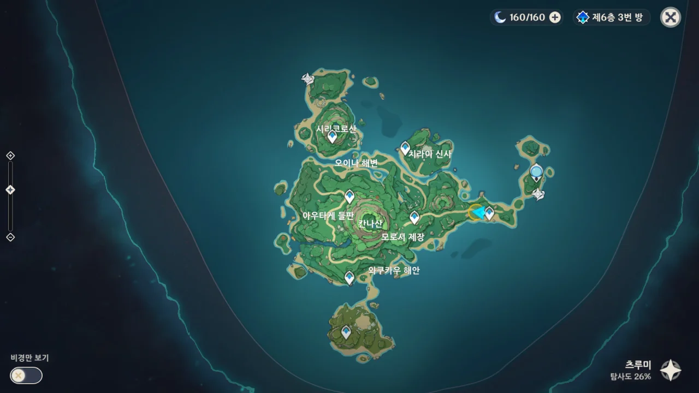

임무 지역에 오니 다시 안개가 걷혔다.





무한 루프처럼 모든 걸 처음부터 다시 시작할 줄 알았는데, 그건 아니었던 모양이다.

어제 만났던 류는 여행자는 물론, 이전에 츠루미 섬에 방문했던 여행자들 역시 기억하고 있었다.



츠루미 사람들은 뇌조의 깃털을 이용해 안갯속에서 서로의 위치를 알렸다고 한다. 그러다가 나무를 이용해 그 소리를 흉내 내게 되었다고 한다.

아마 그게 마우시로겠지?



그러고 보니, 예전에 뇌음의 권현을 잡았을 때, 뇌음의 권현이 '뇌조의 깃털'이라는 아이템을 떨어트리지 않았었나?



아니, 이게 정말이었네.

류의 말대로라면 뇌조의 깃털은 마우시로의 '원류'이기 때문에 과거의 영혼을 보는 기능도 있다고 한다.

왜 나루카미 섬에서 '신성한 벚나무 대액막이' 월드 임무를 할 때 쓴 '기억의 렌즈'가 생각나는 것일까?

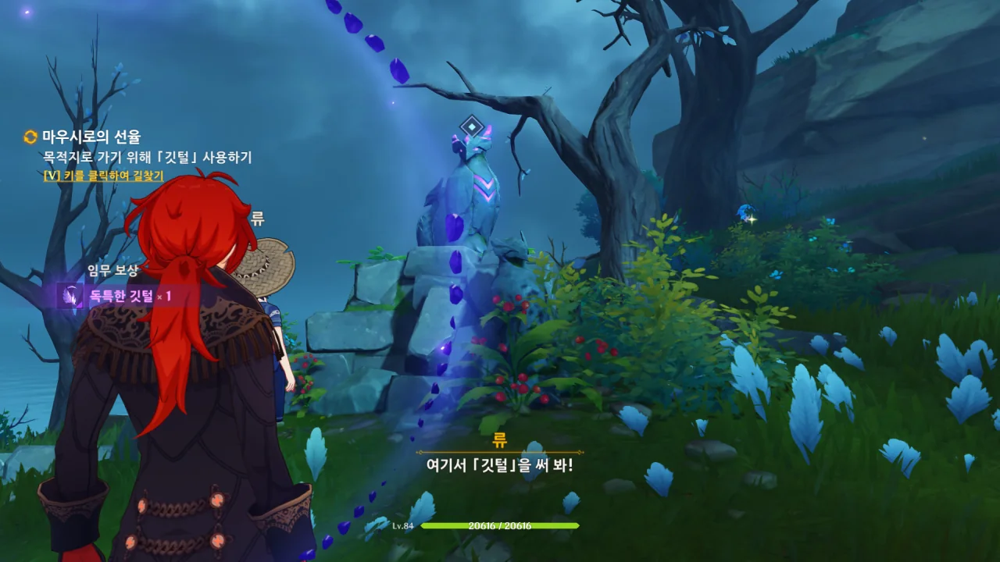

아니, 정말이었잖아! ㅋㅋㅋ...

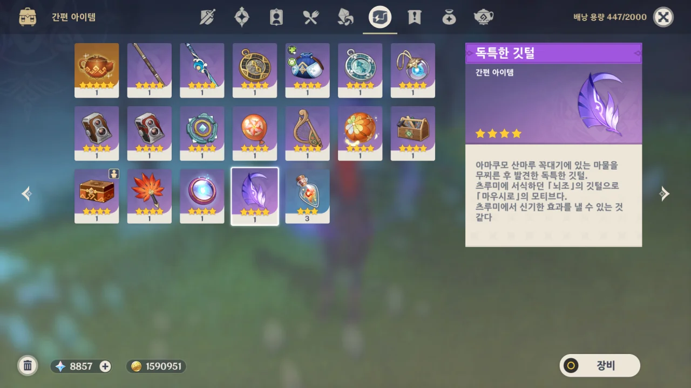

원래 있던 '뇌조의 깃털' 아이템이 사라지고 '독특한 깃털' 아이템으로 대체되었다.

'뇌조의 깃털' 아이템은 일종의 기념품이라 생각하고 있었는데, 여기에 쓰려고 만든 아이템이었구나.

> 독특한 깃털
> ***
> 아마쿠모 산마루 꼭대기에 있는 마물을 무찌른 후 발견한 독특한 깃털.
> 츠루미에 서식하던 「뇌조」의 깃털로 「마우시로」의 모티브다.
> 츠루미에서 신기한 효과를 낼 수 있는 것 같다.
{.bq}

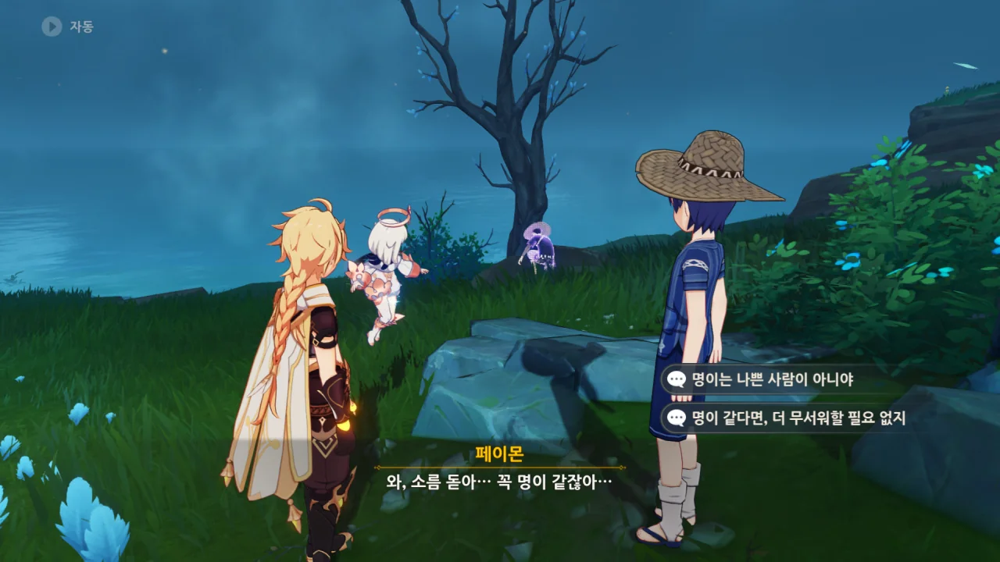

깃털로 석상을 활성화하자, 환영이 나타난다.

저게 '명이'라고 하는데, 그게 누구인지 기억이 전혀 나질 않는다.

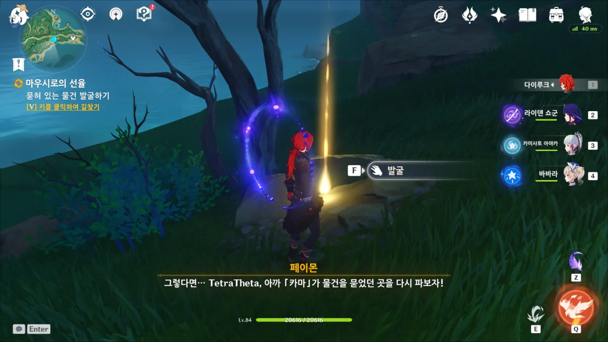

처음에 '무덤 도굴'을 언급했을 때는 그냥 농담으로 한 소리였는데, 진짜로 땅을 파게 될 줄은 몰랐다.



또다시 마우시로를 발견했다.

> 마우시로
> ***
> 스미다가 찾아달라고 의뢰한 물품.
> 누군가가 츠루미를 떠나기 전에 남긴 마우시로인 것 같다.
> 류의 말에 따르면 나무 피리는 악기가 아니라, 츠루미의 안갯속에서 사는 사람들이 서로의 위치를 확인하기 위해 사용하는 도구라고 한다.
{.bq}

이번 마우시로의 플레이버 텍스트를 보니, 이 마우시로는 사라질 것 같지 않다.

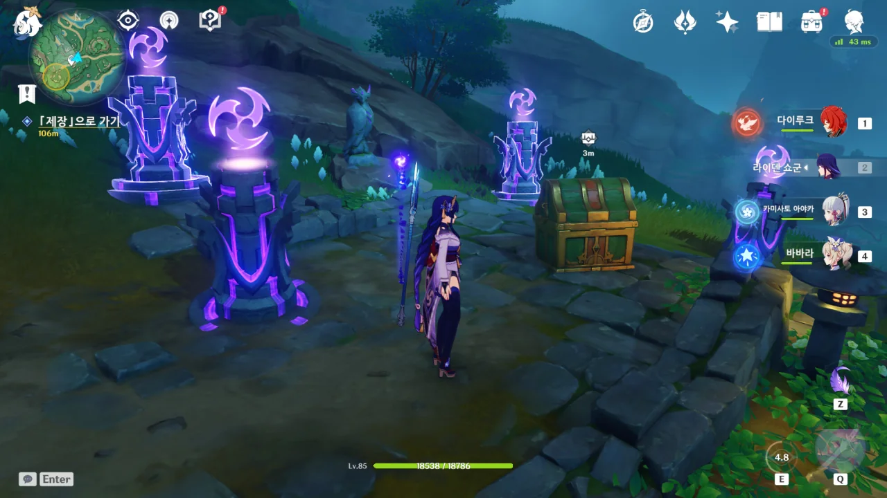

이 섬은 그야말로 퍼즐 천국이다.

여기에 왜 원소 기둥이 두 개밖에 없나 궁금해했었는데, 깃털을 써서 나머지 두 기둥을 과거에서 불러와 활성화하면 이렇게 상자가 나온다.

아, 이러면 피슬을 키워야 하나? 활 캐릭터는 쓰기가 힘들어 대충 방치해두는 중인데...

라이덴은 번개 속성 공격을 할 수 있는 것이 10초에 한 번 쓸 수 있는 E 스킬이라 이런 퍼즐을 푸는 데에는 적합하지 않다.

그에 비해 피슬과 같은 활 캐릭터는 그냥 강공격을 하면 번개 속성 공격을 할 수 있다.

그렇기에 라이덴보다는 피슬이 이런 퍼즐에 더 도움이 될 것 같다. 츠루미 섬의 안개를 걷는 구조물에 번개 속성 공격을 하기에도 피슬이 더 편할 테고...



꼬마애 둘과 어른 둘, 그리고 노인 둘이 하는 이야기를 옆에서 들어보았다. 뭔가 분위기가 심상치 않다. 이 섬사람들은 이상하리만치 외부인에게 배타적이다.

사요라는 사람을 좀 더 유의 깊게 기억해 둬야겠다. 츠루미 섬에 온 외부인인데, 섬사람들에게 바깥 세계 이야기를 하는 통에 미움을 받는 것 같다.



이페가 '이시네 문자의 비밀'을 언급하기에 이시네 문자를 이용한 퍼즐이 나올 것으로 생각했다.

내 예상은 틀린 적이 없었다. 젠장맞을.

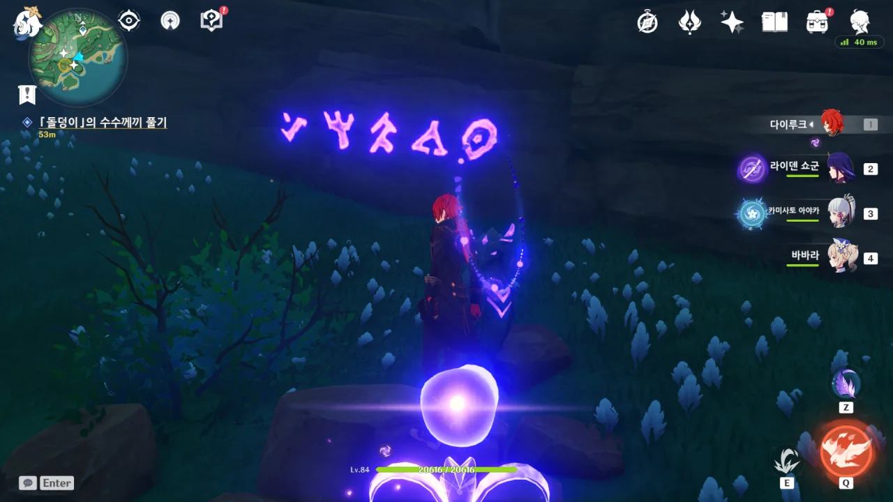

벽에 그려진 순서대로 문자를 활성화하면 되는 것 같다.

난 문자가 그려진 돌을 번개 속성으로 공격해야 할 줄 알았는데, 그냥 일반 공격으로도 되더라.

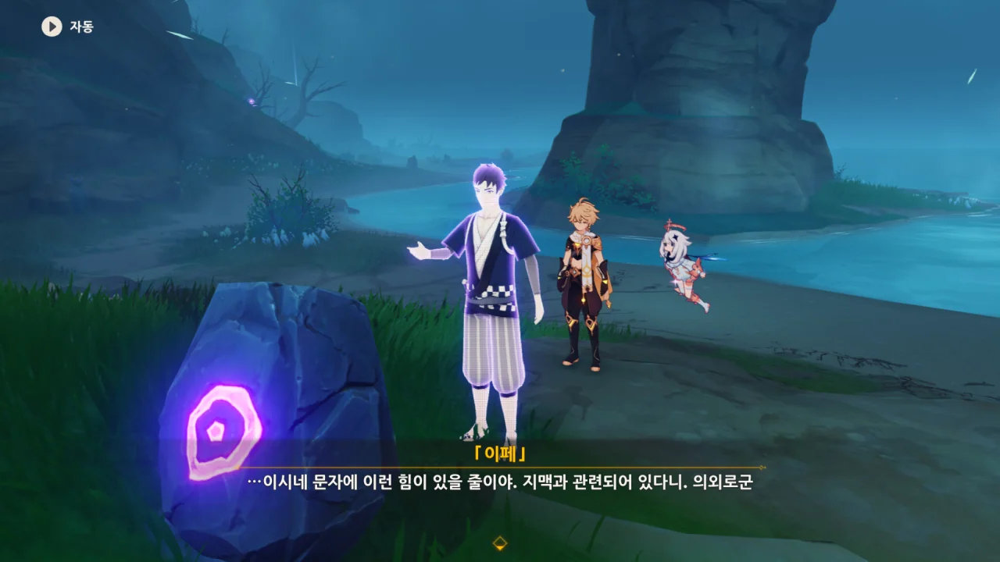

이시네 문자가 지맥과 관련이 있다고?

그게 정확히 무슨 의미인지는 잘 모르겠지만, 이시네 문자가 그려진 퍼즐이 더 있다는 것으로 이해했다.

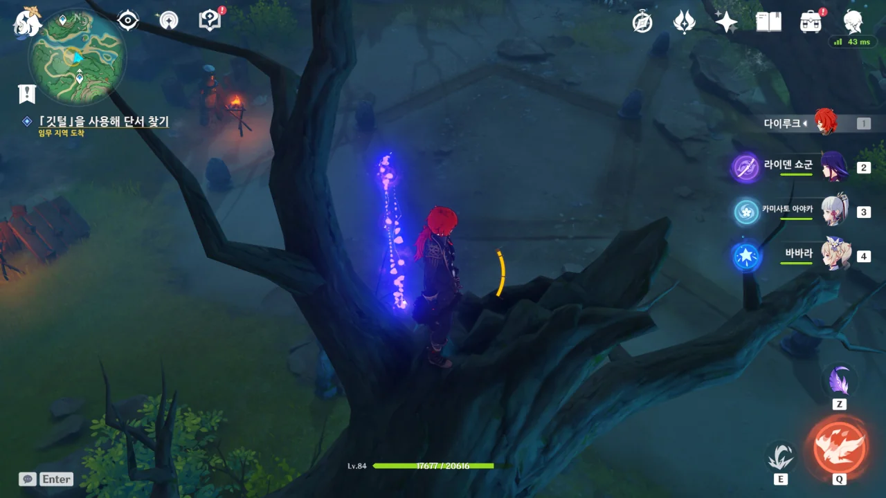

예전에 여길 지나칠 때, '여기서 뭔가 퍼즐이 있을 것 같은데'라고 생각했었다. 정말이었다.

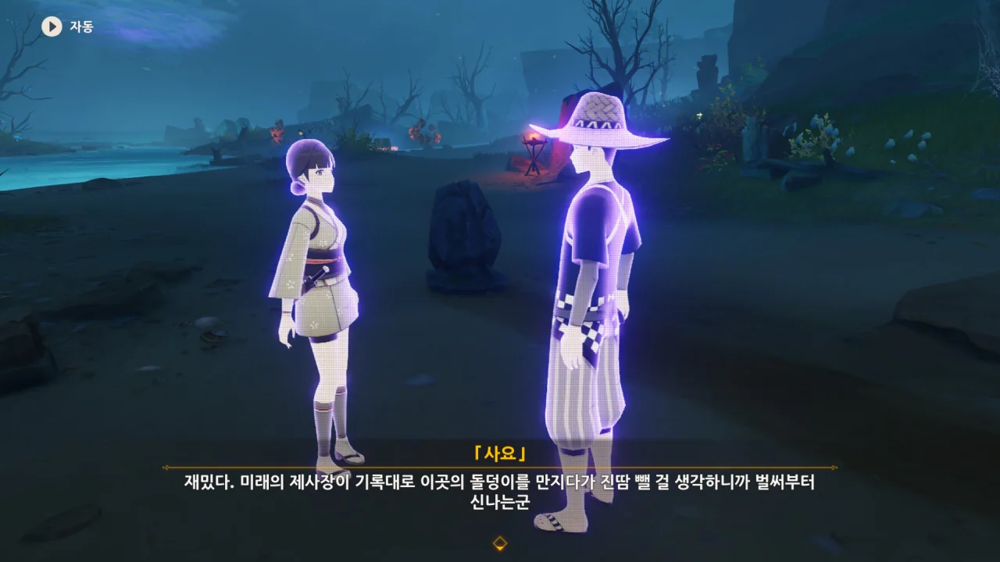

사요와 다른 남자가 신나게 이시네 문자가 새겨진 돌들의 위치를 옮긴다.

류는 제사장의 손자인 것 같은데, 그러면 이 사보타주에 동참하면 안 되지 않나? 무슨 놀이라고 생각한 것인지, 같이 껴서 돌을 옮기고 있더라.

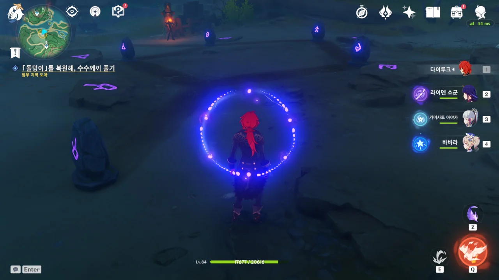

그래서 전부 제자리로 돌려놓았다.

왜, 퍼즐 중에서 3x3으로 칸이 있는데 그중 한 칸만 비어 있어, 그 빈칸으로 다른 칸을 옮겨 그림을 완성하는 퍼즐이 있지 않은가? 이 퍼즐은 그 퍼즐과 같은 느낌이 들더라.

다행스럽게도 대피선이 세 개나 있어 그 퍼즐보다는 좀 수월했지만.

난 아직도 그 3x3 퍼즐을 풀지 못한다.



뭐? 뇌조에게 사람을 제물로 바쳐? 인신 공양이라고?

이거 뭔가 안 좋은 예감이 드는데.



뇌조와 소년의 만남... 나, 이런 스토리를 성유물 스토리로 본 것 같다.

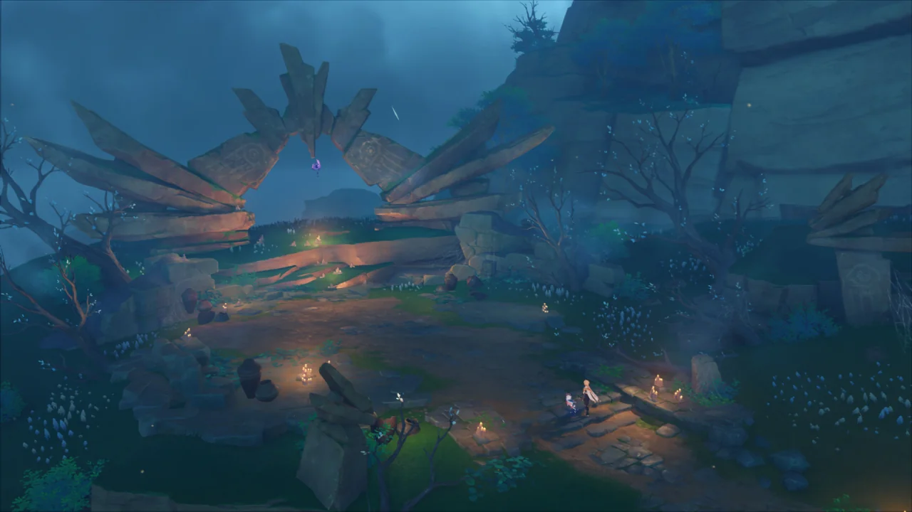

아, 멋지군. 아까 전만 해도 제장에 옹기종기 모여있던 사람들이 또다시 간데없이 사라졌다.

여기, 귀신 들린 섬 맞다니까?



이번에도 마우시로가 사라지지 않았는지 재차 확인하는 페이몬.

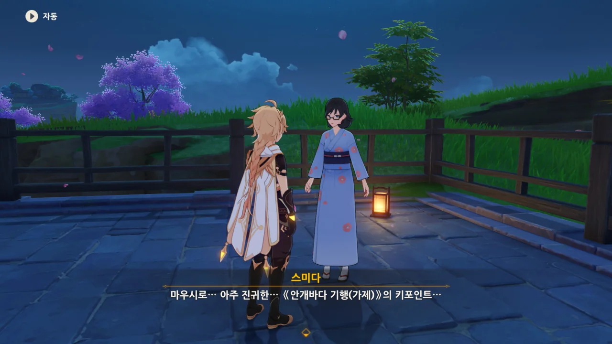

스미다에게 마우시로를 건네자, 엄청나게 감격해한다.

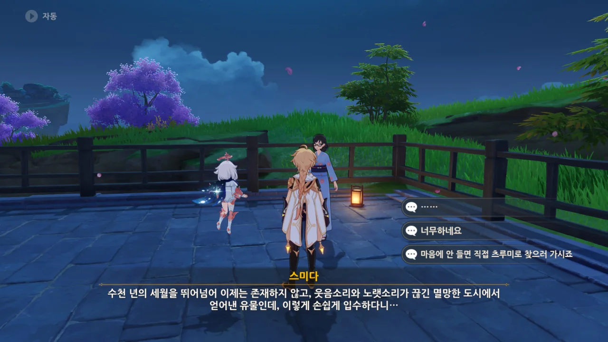

아니, 내가 마우시로를 갖고 온 게 그렇게 꼽다면 직접 츠루미 섬으로 가서 마우시로를 구하면 될 일 아닌가?

꼬우면 직접 발로 뛰던가.

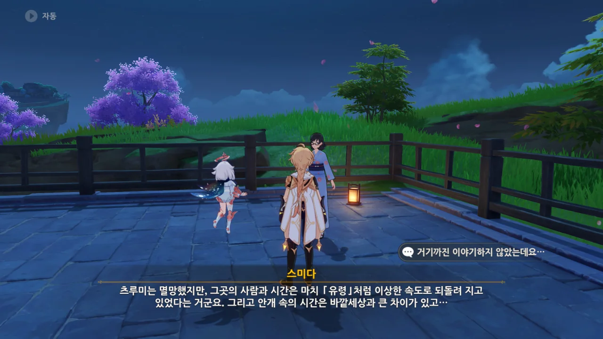

스미다가 이런저런 이야기를 하는데, 아무래도 여행자가 들려준 이야기가 스미다의 머릿속에서 이미 한 편의 이야기로 재창작되고 있는 것 같다.

***

아, 내가 말했던 성유물이란 바로 '번개 같은 분노' 성유물 세트였다.





번개 같은 분노 성유물 세트에는 위와 같은 배경 이야기가 있는데, 내 예상이 맞는다면 이런 스토리가 앞에서 날 기다리고 있을 것 같다.

> 류는 뇌조에게 제물로 바쳐지고, 분노한 뇌조는 츠루미 문명을 싸그리 멸망시켜 버렸다.
{.bq}

뭐, 인신 공양을 하는 문명 따위, 멸망해 버리는 것이 백번 옳다.
