오늘 츠루미 섬으로 이동할 때 로딩 화면에 '3의 법칙'이라는 말이 적혀 있었다. 워낙 빠르게 지나간 터라 제대로 읽지는 못했지만, 내 예상대로라면 오늘 츠루미 섬의 이야기가 대강 끝날 것 같다.

굉장히 기대되는걸.

***

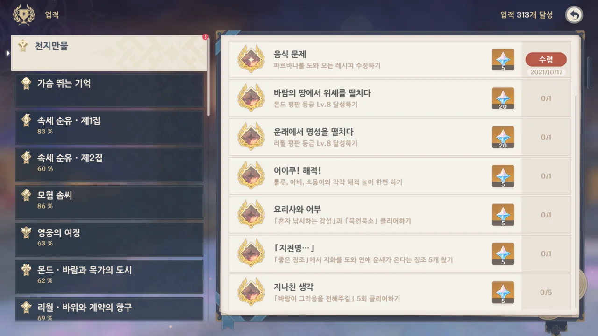

이나즈마의 일일 임무인 '미식 어벤져스: 미식 문답'에 나온 모든 문제의 정답을 맞히자, 업적이 하나 깨졌다.

음식 어벤져스 이야기는 카메이 무네히사를 영입하고 나서 끝난 줄로 알았는데, 아무래도 그 뒤의 이야기가 더 있는 것 같다.

뭐, 이들의 이야기는 꽤 재미있으니까 상관없다.

***

아무튼 다시 츠루미 섬의 이야기로 되돌아가자.

이번에는 카마와 이야기를 해보라고 한다.



카마와 츠루미 섬의 관계가 궁금하다고 하자, '카마'는 자기 가문의 성씨이며 츠루미에서 왔다고 밝힌다.

그러니까 카마가 이름이 아니라 성씨였다는 거지?

&nbsp;

이 녀석, 말이 너무 많아서 좀 줄였다.











솔직히 말해, 약간 이해하기 어렵다. 두 이야기가 얽혀있어서 그런가.

츠루미 섬에 사는 「뇌조」가 한 아이를 원해, 제사장이 그 아이를 제물로 바치기로 했다.

카마의 조상은 인신 공양이 일어나는 걸 차마 견디지 못해 뇌조가 왔던 방향, 세이라이 섬으로 작은 배 한 척을 타고 떠났다.

이때 제물이 될 예정인 아이 역시 데려가려 했지만, 아이는 자신의 의지로 츠루미 섬에 남아 제물이 되었다.

아이가 제물로 바쳐진 후, 뇌조는 츠루미를 뇌폭으로 멸망시킨다. 이때 발생한 빛과 소리는 세이라이 섬에 있던 사람들에게까지 확연히 느껴졌다고 한다.

이후 츠루미 섬에는 츠루미 섬의 마지막 제전이 무한히 반복되게 되었다. 그 마지막은 항상 뇌조가 뇌폭으로 츠루미 섬을 멸망시키는 것이고, 그러면 모든 것이 다시 처음으로 되돌아간다.

하지만 제물로 바쳐졌던 아이, 류는 이 순환에서 유일한 예외가 되었다.

&nbsp;

세이라이 섬의 아사세 신사는 뇌조의 힘을 억제하기 위해 만들어졌으며, 코세키 마을은 신사를 공양하기 위해 세이라이 섬으로 이주한 사람들이 만든 마을이었다.

하지만 츠루미 섬을 멸망시킨 후 뇌조가 세이라이 섬에서까지 깽판을 치자, 라이덴 쇼군이 뇌조를 토벌했고, 그 여파로 세이라이 섬은 사람이 살기 힘든 환경이 되어버렸다.

세이라이 섬사람들은 칸나즈카로 이주해 타타라스나에서 일했다. 하지만 카마의 가문은 '메츠케'의 방식에 회의를 느끼고 나루카미 섬으로 떠나 이도에서 장사를 시작했다.

하지만 카마의 세대에 와서는 빚 말고는 남은 것이 없게 되었다.

&nbsp;

류의 입장에서 생각해본다면, 류는 수천 년 동안 끊임없이 반복되는 제전에서 뇌조의 제물이 되기 위해 살해당하고 살해당했다. 그 모든 기억을 끌어안은 채 말이다.

정말 끔찍한 일이다.

&nbsp;

츠루미 섬에서 본 환영에 따르면, 츠루미 섬에서 마지막에 배를 타고 떠나는 것은 사요였다. 사요는 류와 함께 떠나려 했지만, 류는 섬에 남겠다고 했었고.

그러니 사요는 카마의 조상이 맞다.

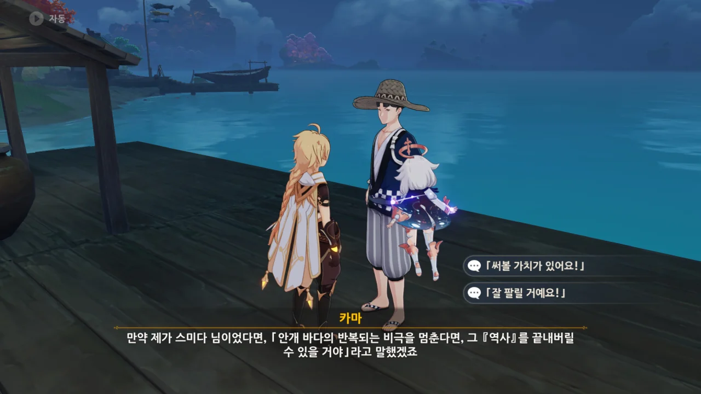

> 안개바다의 반복되는 비극을 멈춘다면, 그 『역사』를 끝내버릴 수 있을 거야

오, 이건 좀 멋진 말인걸.

이젠 츠루미 섬이 안개에 뒤덮여 있어도 그리 놀랍지 않다. 그야, 매일 오전 5시가 되면 츠루미 섬은 안개에 뒤덮이는걸.

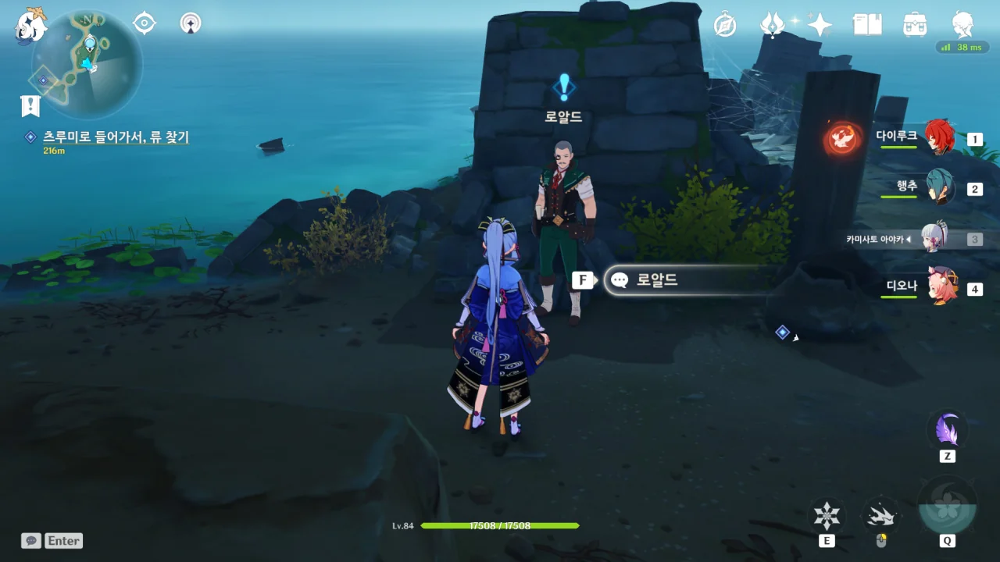

아니, 근데 왜 여기에 로알드가 있지?





로알드는 기억력 상승, 대뇌 피로 해소, 시력 회복 등의 효과가 있는 형광 버섯을 채집하러 온 것이었다.

그런데 안개 속에서 자꾸만 길을 잃는 통에, 채집을 전혀 하지 못했다고 한다.

&nbsp;

음... 그 형광 버섯, 내가 여길 돌아다니면서 보이는 족족 전부 캐서 없을지도 몰라.

당장 형광 버섯을 쓸 일은 없으니, 로알드에게 채집한 형광 버섯을 주기로 했다.



아잇, 이 아저씨, 왜 이렇게 원하는 게 많아.

이번엔 츠루미 벽화를 사진으로 찍어달라고 한다.

&nbsp;

츠루미 섬을 돌아다니며 벽화를 조금 본 것 같은데, 이건 나중에 해야겠다.

지금은 츠루미 섬에 얽힌 비밀을 먼저 풀어야겠어.

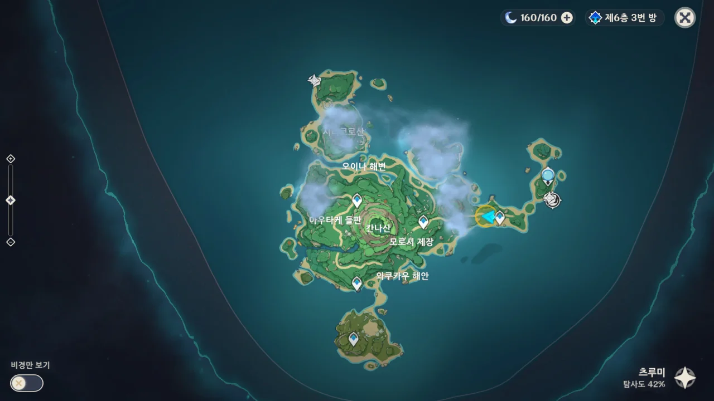

또 서목 근처에 안개가 꼈다.

또 서목에 공양하라는 건 아니겠지?



류는 보이지 않고, 말을 걸어도 답하지 않는 환영만이 여행자를 맞이할 뿐이다.

서목이 제전의 관건이라 했으니, 서목을 부숴버리면 제전을 더 이상 진행할 수 없을 것이다.

&nbsp;

물론, 과거의 일이 무한히 반복되는 일이니만큼 전혀 소용없는 짓일 가능성도 크다.

하지만 난 저 서목을 처음 볼 때부터 꼴 보기 싫었어. 부순다!

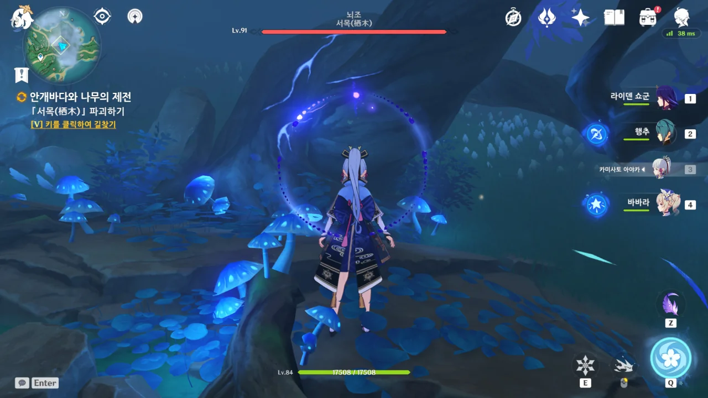

아니 ㅋㅋㅋㅋㅋㅋ 나무인데 보스 취급이네 ㅋㅋㅋㅋㅋㅋ

'뇌조 - 서목'이라는 이름의 보스로 취급되고 있다.

&nbsp;

그런데 이 녀석, 91레벨이라서 그런지 체력이 잘 닳지 않는다.

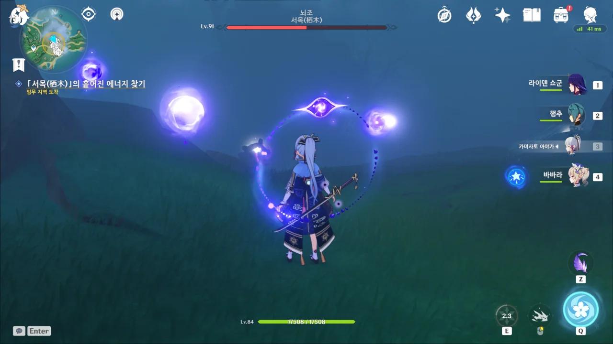

그렇게 한동안 서목을 패다 보니, 깃털 대신 에너지 구슬 같은 것이 서목에서 튀어나왔다. 깃털과 달리 그 개수도 7개나 되고.

문제는 이것 역시 부숴야 한다.

오로지 원소 반응으로만 대미지를 입기 때문에, 아야카가 없었더라면 이 부분을 넘기기 힘들었을 것이다.

그런데 왜 행추 E 스킬을 쓰면 감전 원소 반응이 일어나야 할 텐데, 왜 아무런 반응이 일어나지 않았던 것일까?

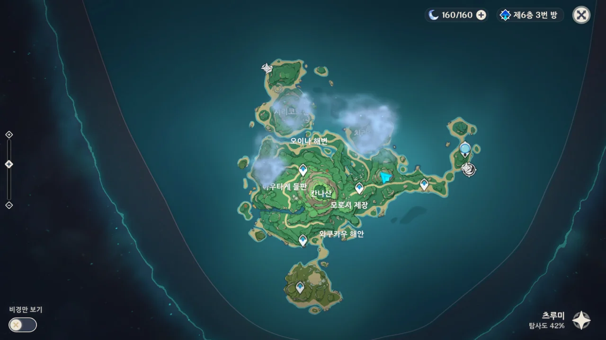

오, 서목 하나를 부수니 안개가 걷혔다.

때려야 말을 듣는 건 기계뿐만이 아니었나 보다.

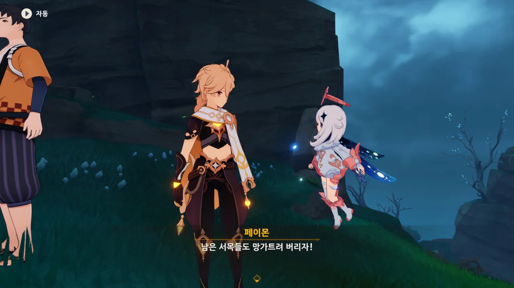

> 남은 서목들도 망가트려 버리자!

왜 난 페이몬의 저 대사에서 클레의 그림자를 진하게 느낀 것일까?

그러고 보니 클레를 여기 데려왔으면 아주 좋아하며 이곳저곳에 통통 폭탄을 던지고 다녔을지도 모르겠다.

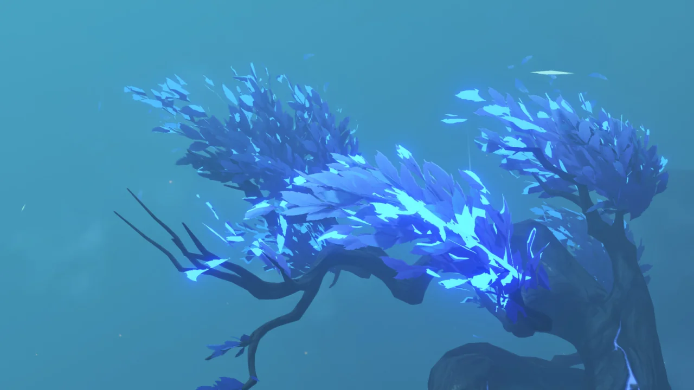

잔뜩 돋아있던 푸른 나뭇잎이 사라져간다.



*Sector clear.*

제전으로 돌아가 보니 하늘이 핑크빛으로 물들면서 번개가 마구 내려치기 시작한다.



거 서목 좀 파괴했다고 잔뜩 삐진 모양이다. 째째한 망령 같으니라고.

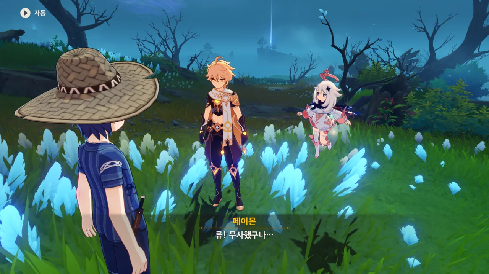

드디어 류를 만났다. 무사했구나!

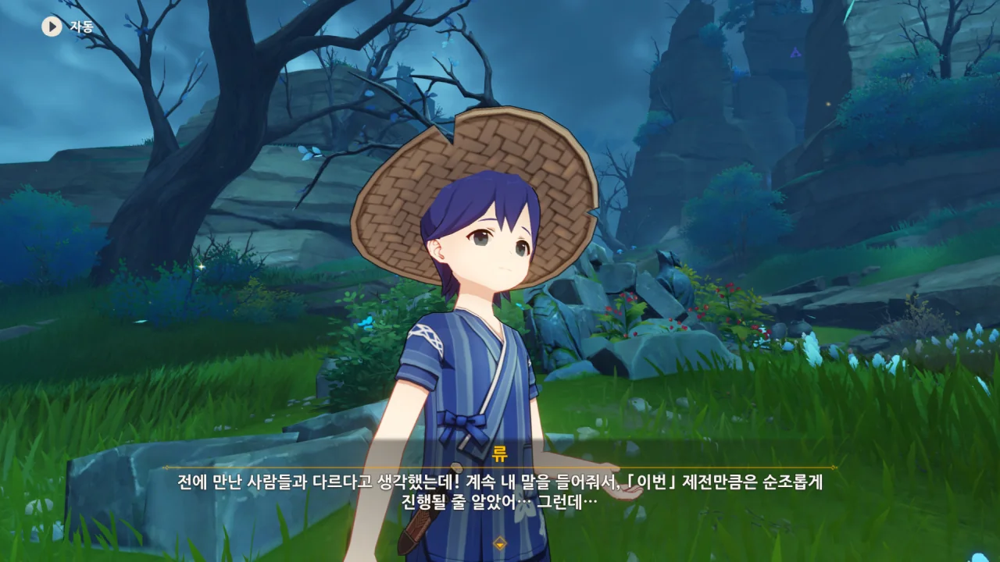

우린 그저 류를 도우려던 것뿐이다. 그런데 왜 류에게 책망을 듣는 거지?





류가 다시 깨어났을 때, 류는 사람들이 자기를 보지도 듣지도 못한다는 걸 알게 되었다. 그야, 류가 본 사람들은 진짜 사람이 아니라 무한히 반복되는 환영 속 존재였으니 말이다.

뇌조가 분노할 때, 와쿠카우, 오이나, 아우타케에만 번개가 치지 않는 걸 알게 된 류는 번개가 끝날 때까지 거기에 숨었다고 한다.

하지만 번개가 끝나면 류는 같은 일을 반복하는 사람들 사이에서 또다시 눈을 뜨게 된다.

&nbsp;

다행이다. 난 류가 매번 살해당하는 줄 알고 있었는데.

물론 지금의 경험도 좋은 건 아니지만, 최소한 매번 살해당하는 것보다는 낫다.

&nbsp;

류는 제전에 문제가 있어 '카파치'가 화난 것으로 생각해 다시 처음으로 되돌아갈 때마다 제전을 완벽하게 만들기 위해 심혈을 기울이지만, 매번 실패한다.

그야, 뇌조가 원한 건 죽은 류의 핏물이 담긴 황금잔이 아니었으니. 뇌조가 화난 건 오히려 제전이 잘 진행돼서였다.



아, '카파치'는 뇌조를 말하는 거다.

류 이전에 제물로 바쳐진 사람들에겐 무관심했던 뇌조였지만, 류에게는 관심을 가졌다고 한다.



애석하게도 류의 소원은 이루어질 수 없는 소원이다.

다 죽었거든. 뇌조에 의해서.

&nbsp;

그런데 츠루미 섬을 나간 게 사요와 **카마**라고? 그러면 카마의 선조는 사요가 아니라 츠루미 섬의 카마였던 걸까?

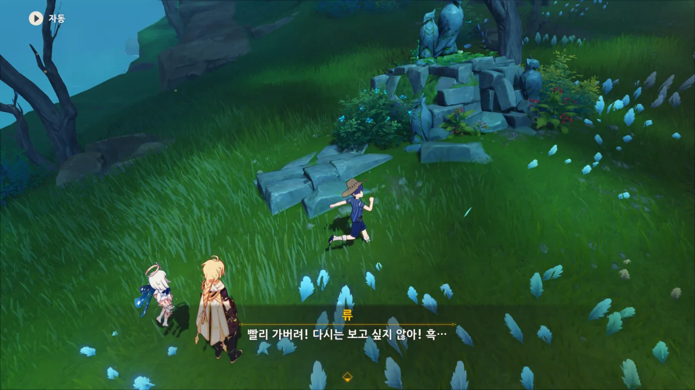

원래 선의로 한 모든 행동이 보답받는다는 보장은 없지만, 이건 좀 씁쓸하다.

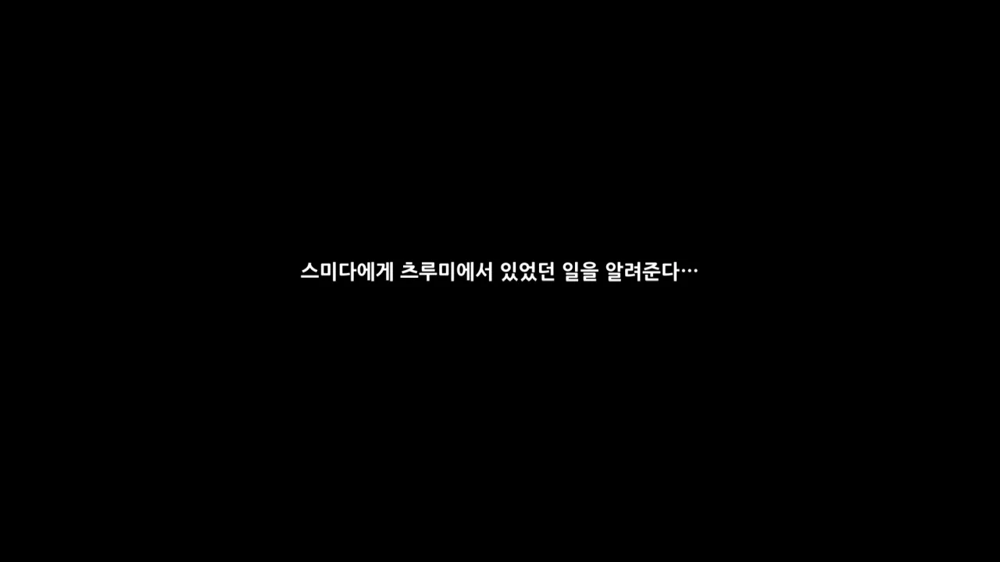

다시 나루카미 섬으로 돌아온 후, 스미다에게 그동안 있었던 일을 다 이야기해 주었다.



어허, 「설정」이라니. 실제로 있었던 일이거늘.

저번에 마우시로를 가져다주었을 때도 그렇지만, 스미다의 언행이 좀 많이 마음에 들지 않는다.

&nbsp;

자꾸 그럴 거면 모험가에게 일을 맡기지 말고, 본인이 직접 가던가.





제멋대로 스토리를 만들어 내는 스미다이지만, 이번에는 진짜 있었던 일을 써 내려가고 있다.

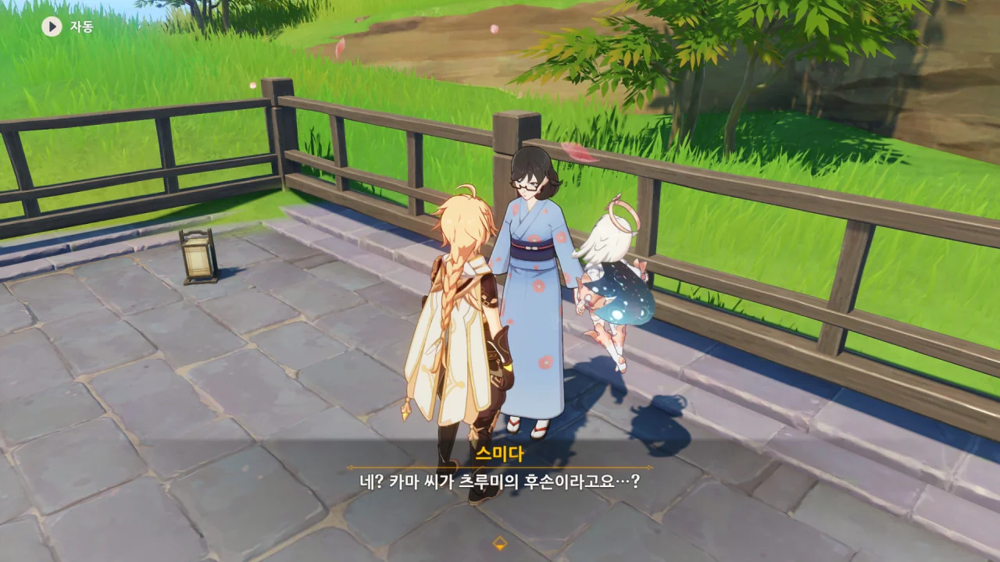

엥, 난 스미다가 그 사실을 이미 알고 있을 줄 알았는데.



카마가 그 이야기를 스미다에게 하지 않은 이유는 단 하나다. 안 물어봤으니까.

물론, 츠루미의 이야기는 그리 행복한 이야기도 아니고, 카마에게 있어 츠루미 섬은 음침한 기억밖에 없는 곳이기에 그런 것도 있다.



아, 정말 싫다.

제발 그런 소설은 입 밖에 내지 말고 일단 글로 썼으면 좋겠다.

당사자 앞에서 태연하게 뇌내망상을 꺼내는 건 대체 무슨 깡이야?

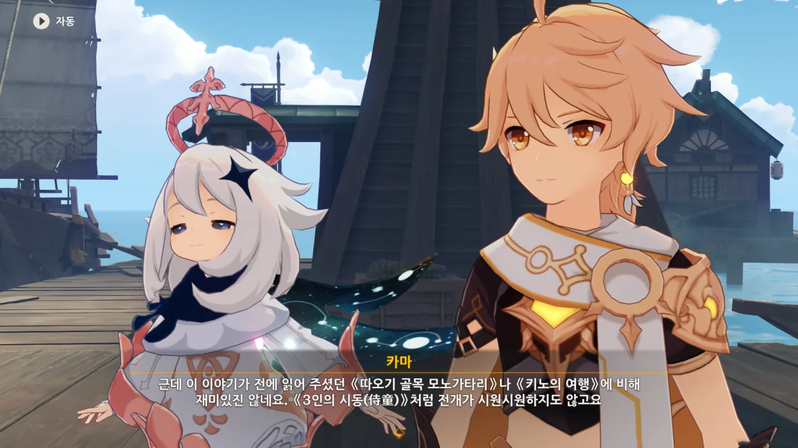

그리고 스미다의 이야기는 곧바로 카마에게 까였다. 재미가 없어서.

카마도 스미다와 뭔가 죽이 잘 맞는 것 같다.

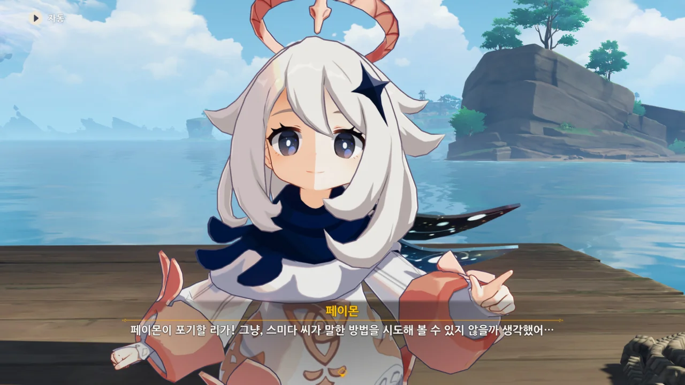

아무튼, 츠루미 섬의 저주를 한 번 스미다의 방식대로 풀어보기로 했다.
