섬에 낀 안개가 이번엔 붉다. 아마 서목을 부순 것의 영향일지도 모른다.

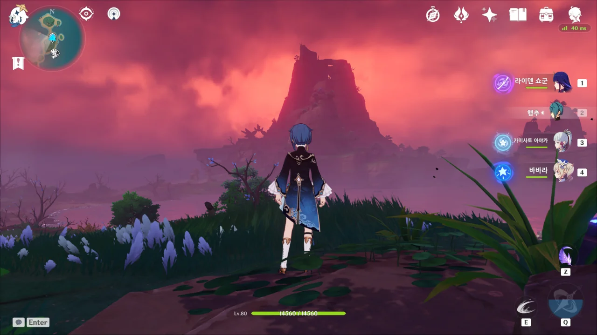

하늘이 온통 붉은 터라, 마치 세계가 멸망하기 일보 직전인 느낌이 든다.

&nbsp;

게다가 이전과 달리 번개가 자주, 많이 내려친다.

번개가 내려치는 속도도, 빈도도 빠른 데다 한 번에 두 개 이상의 번개가 내려치기도 하므로, 별생각 없이 앞으로만 가다가는 번개에 반드시 한 번은 맞게 된다.



여전히 류는 보이지 않지만, 카마가 있다.

츠루미 섬을 그리 좋아하지 않던 카마지만, 이 악순환을 끊을 좋은 기회라 생각해서 섬 깊숙이까지 온 것 같다.



> 외지인인 당신들까지 이렇게 노력하는데, 옆에서 구경만 한다면 그건 너무 비겁해요.
> 환영뿐일지라도 감정은 있을 거예요. 그렇다면 순환 속에서 끊임없이 고통받는 건 너무 가혹해요.
> 안개 바다의 반복되는 비극을 끝내 류를 구하고, 선조의 소원을 이룰 수 있다면, 지금껏 절 속박했던 『역사』를 끝내버릴 수 있지 않을까요.

오, 카마가 굉장히 멋진 말을 한다.

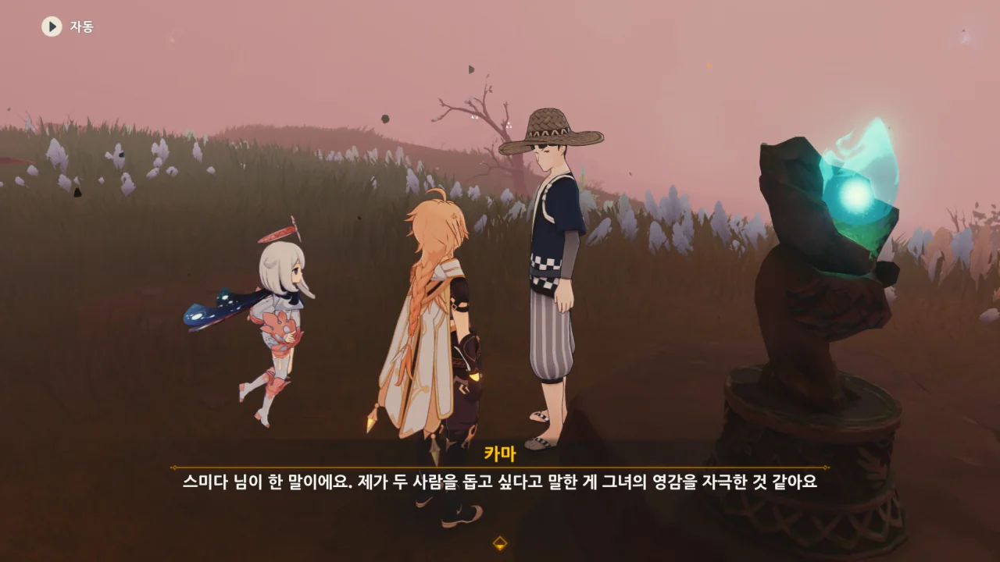

그럼 그렇지. 카마가 한 말이 아니라, 스미다가 한 말이었다.

대사 양 옆에 「」가 붙은 걸 보고 알아차렸어야 했는데.

하지만 카마가 저 말을 했다는 건, 본인 역시 그 말에 깊이 동감했기 때문일 것이다.

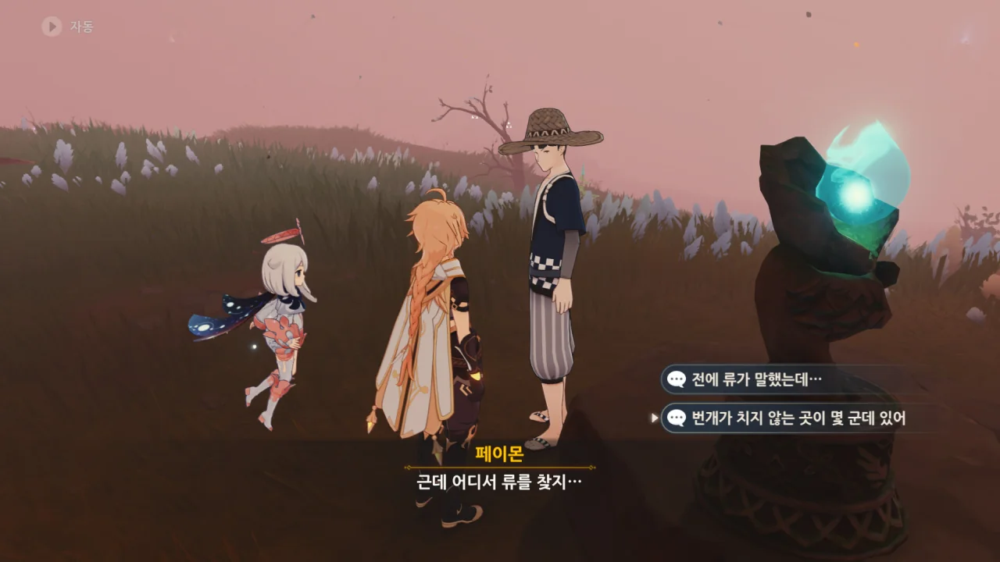

하지만 일단 류를 찾는 것이 선행되어야 한다.

저번에 류가 번개가 치지 않는 곳이 세 곳 있다고 했던 것 같은데.

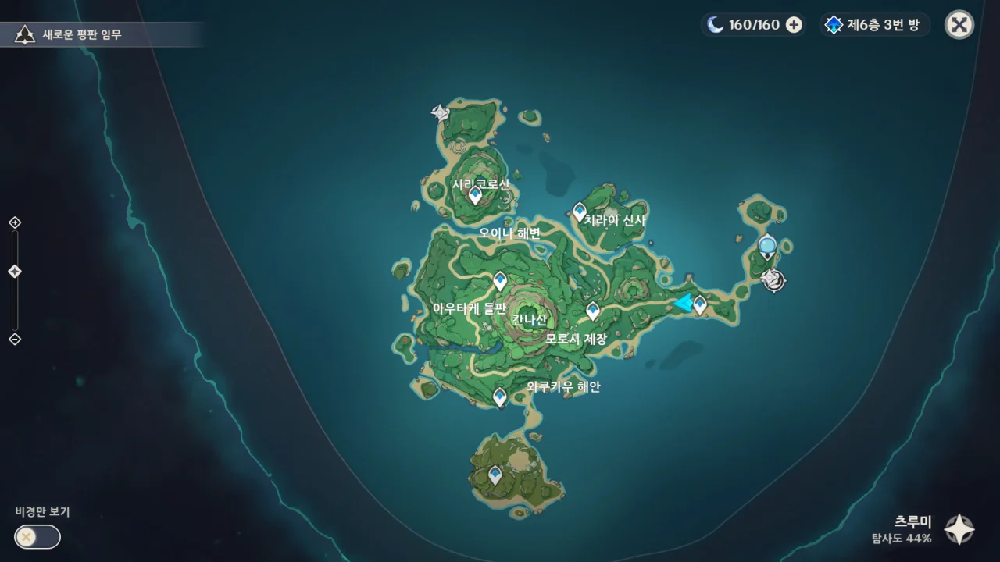

섬에는 여전히 붉은 안개가 잔뜩 껴있지만, 최소한 맵에서는 안개가 사라졌다.

그야, 안개를 치우지 않으면 이 넓은 섬을 워프 포인트 없이 걸어 다녀야만 하는걸.

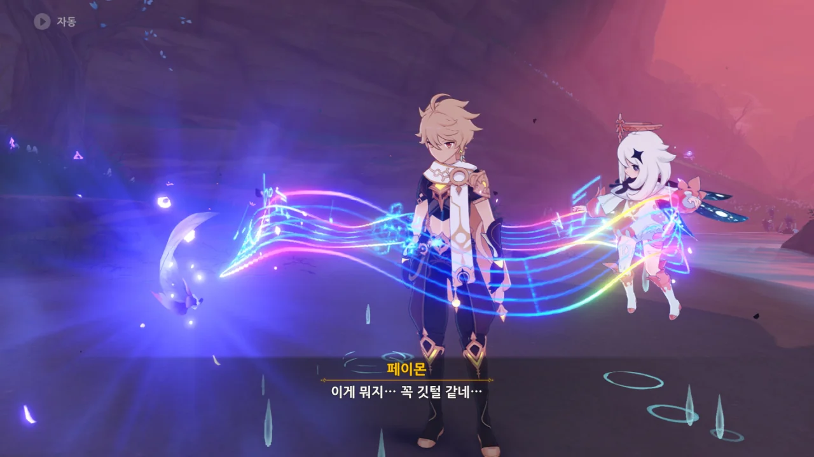

깃털을 사용하라는 말에 깃털을 사용했더니, 갑자기 몹 여럿이 튀어나왔다.

튀어나온 몹들을 전부 제거하니, 이번엔 또 다른 깃털이 공중에 동동 떠 있다.

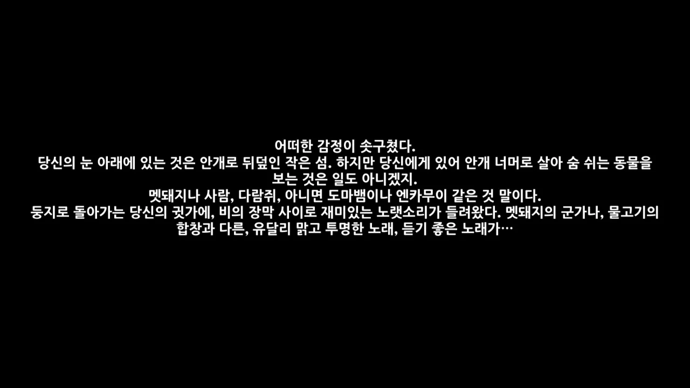

깃털을 만지니 뇌조의 감정 같은 것이 느껴진다.

'멧돼지의 군가', '물고기의 합창'... 뇌조 이 녀석, 의외로 시적인 녀석이었잖아?

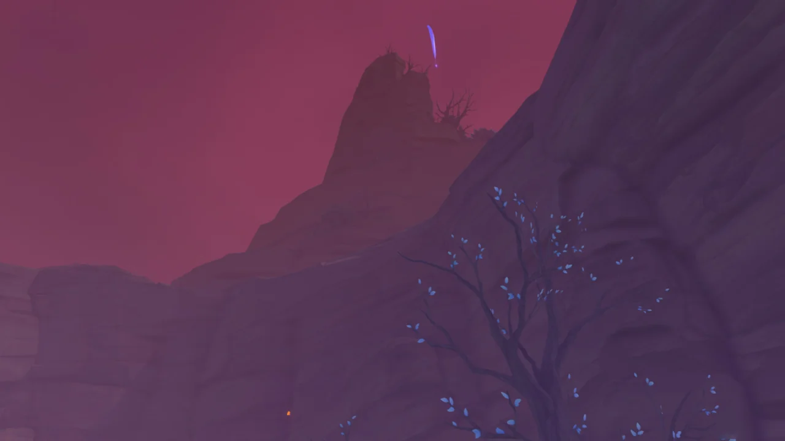

깃털은 저 멀리 산 너머로 휙 날아가 사라져 버렸다.

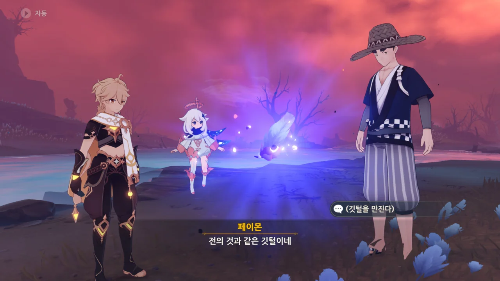

다른 곳에서도 아까 전과 같은 상황을 마주할 수 있었다.

깃털 쓰고, 몹 잡고, 깃털 만지고.

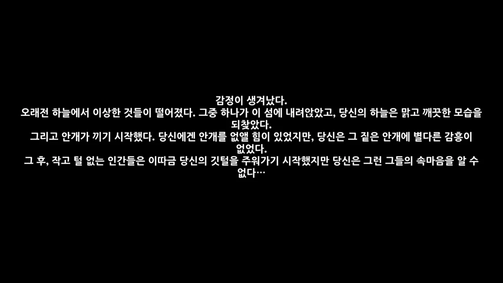

내 기억에는 뇌조가 이 섬에 안개를 불러온 것으로 알고 있는데, 잘못 알았나 보다.

대체 하늘에서 떨어진 것이 무엇이었을까? 한천의 못?

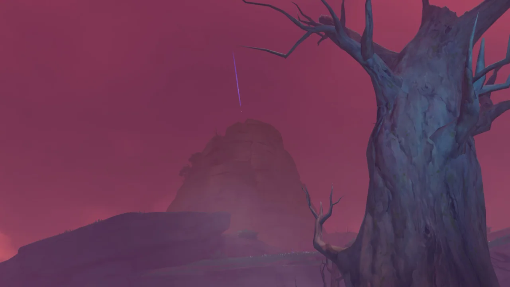

이 깃털 역시 아까 전 깃털처럼 산 너머로 날아가 버렸다.

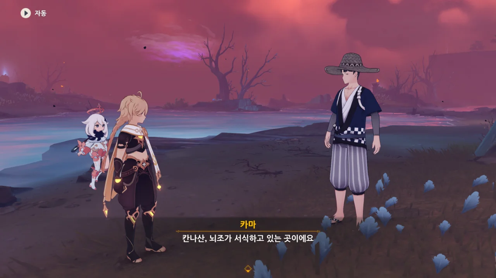

카마의 말에 따르면, 깃털이 날아간 곳은 뇌조가 서식하던 칸나 산이라고 한다.

우리의 마지막 목적지가 칸나 산이 될 것 같네.



류를 다시 만났다.

&nbsp;

이래서 종교가 무서운 거다.

제전을 아무리 완벽하게 진행하려 해도 똑같은 일이 계속 반복된다면, 제전 그 자체에 문제가 있을 것이라는 생각을 할 법도 한데, 류는 앵무새처럼 '제전을 더 완벽하게 진행해야 해'라고 하질 않는가.

우리가 이러는 게 전부 류, 널 위한 거라고.



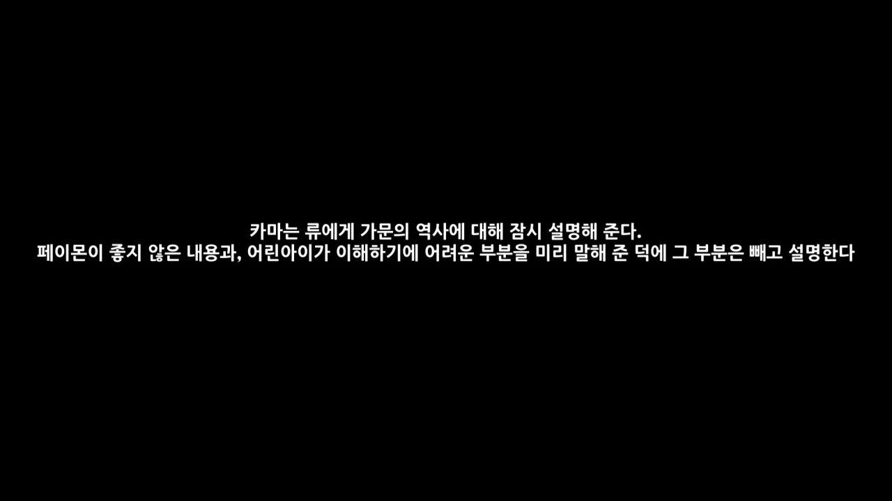

류가 카마를 보더니 환영 속 카마가 다시 돌아온 것으로 착각하는 일이 있었지만, 류가 지금 보고 있는 카마는 환영 속 카마의 먼 후손이라고 잘 알려주었다.

스미다가 '차라리 그냥 환영 속 카마라고 뻥 치는 게 어때요?'라는 의견을 냈지만, 무시당했다.

애 앞에서 거짓말은 나빠요.



아니, 그게 아니래도 자꾸.

뇌조는 제전이 형편없어서 화를 낸 게 아니라, 네가 죽어서 화를 낸 거였다고.



어, 뭐야? 류도 환영을 볼 수 있는 거야?

류와 뇌조의 첫 만남이 재생된다.













마을 사람들은 뇌조에게 제물로 바쳐지기 위해 죽을 것이란 말을 류에게 대놓고 하지 않고, 그저 '천둥 번개를 가라앉히고 폭풍을 단비로 만들 수 있다' 정도로만 돌려 말한 것 같다.

인신 공양도 질이 나쁜데, 거짓말까지 했다니 질이 더 나쁘다. 제일 중요한 핵심을 의도적으로 빠트렸잖아.

&nbsp;

뇌조는 '먹구름과 비의 노래', '머나먼 북쪽의 푸른 용의 아득한 노래', '여우 토끼 땅벌레의 떨리는 협주곡'은 들어봤어도 류의 노래와 같은 것을 들어본 적이 없다며 류의 노래를 특별하게 생각한다.

그런 뇌조에게 류는 '다음에 돌아오면 다른 노래도 들려주겠다'라는 약속한다.

뇌조는 '다음에 왔을 때 네가 여전히 살아있다면'이라며 이를 수락한다. 말이 조건부이지, 사실상의 승낙이나 다름없다.

그리고 '그녀'가 자신에게 붙여준 이름을 잊고 그저 '뇌조'로 살아가던 뇌조에게 류가 '칸나 카파치', 뇌정의 독수리라는 이름을 붙여준다.

&nbsp;

처음에는 뇌조를 '마효(魔梟)'라며 올빼미로 부르더니, 이번엔 '카파치'라며 독수리로 부른다. 뇌조는 대체 어떻게 생긴 거야?

아무튼 섬 곳곳에 놓여있던 새 조각상은 칸나 카파치를 조각한 것이었다는 것이 밝혀졌다.

아냐. 그건 확실히 아냐.



3의 법칙이라는 건 세 번째에 일이 잘 풀린다는 의미가 아니라 네 번째가 돼서야 일이 잘 풀리게 된다는 의미였나?
