칸나 산에 도착했다.

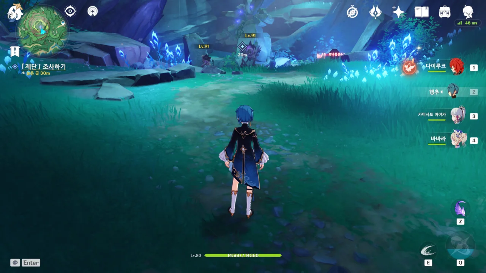

아니, 왜 수계 늑대가 여기에 있냐? 다행스럽게도 큰 늑대는 전투가 시작되자 울부짖더니 어디론가 사라지고, 남은 작은 늑대 세 마리만 없애면 되었다.

이번 업데이트에서 추가된 신규 적인데, 수계 늑대에게 공격받으면 침식 효과 때문에 파티 전체의 체력이 감소한다.

문제는 이 침식 효과가 실드를 무시하기 때문에, 수계 늑대와 전투를 하려면 무조건 팀에 힐러가 있어야 한다.

게다가 단단하기까지 해서, 잡기가 어렵다.

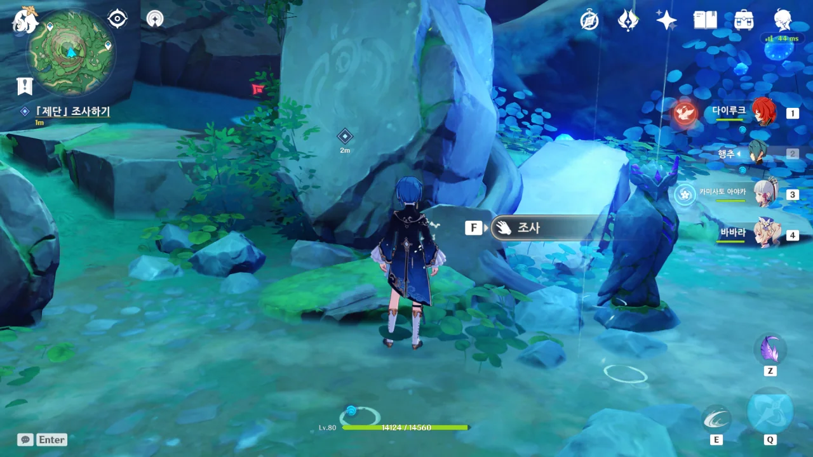

모든 수계 늑대를 제거한 후, 제단을 조사해 본다.

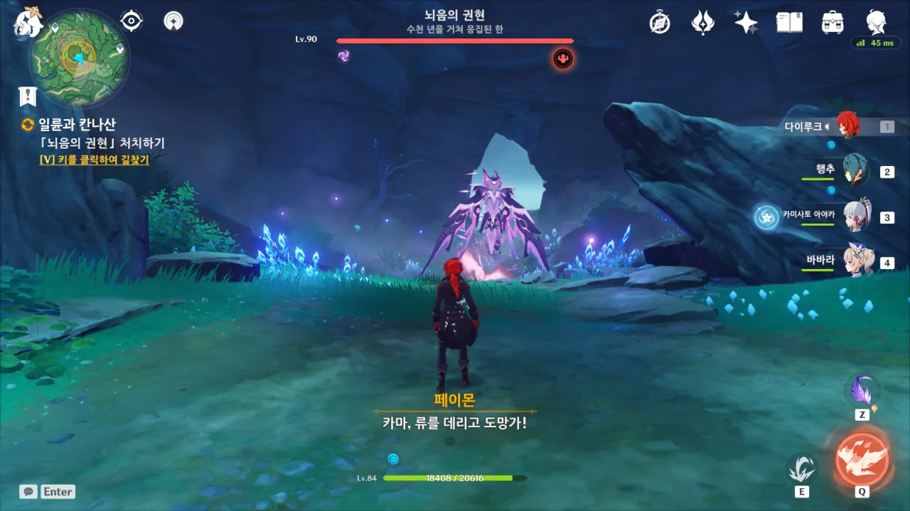

아니, 넌 왜 또 여기서 나오세요.

분명 처음 만났을 때는 그냥 '뇌음의 권현'이었던 것 같은데, 이번에는 '뇌음의 권현 - 수천 년을 거쳐 응집된 한'이라는 수식어가 붙어있다.

&nbsp;

처음 뇌음의 권현을 만난 곳은 평지인 데다 넓어 공격을 피하기 용이했지만, 여기는 지형도 좁고 땅이 굴곡져 공격을 피하기 정말 까다로웠다.

결국 파티에 바바라가 있음에도 불구하고 음식을 가방에서 꺼내 먹어야 했다.



뇌음의 권현을 처음 만난 곳이 세이라이 섬의 꼭대기였지. 정확히는 섬 꼭대기 위에 생성된 거대한 땅덩어리 위에서였고.

분명 난이도는 스토리 난이도로 동일할 텐데, 왜 이번 뇌음의 권현이 더 어려운 것 같지...

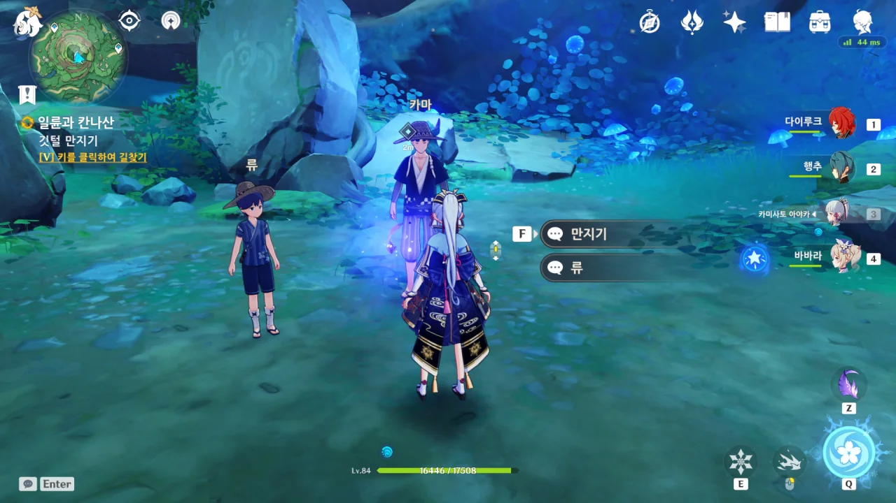

처음 뇌음의 권현을 잡았을 때와 마찬가지로, 이 뇌음의 권현 역시 깃털을 떨어트렸다.



> 너희들은 세상에 하나밖에 없는 노래를 피와 물이 되어 이 땅에 헛되이 스며들게 했다.
> 그렇다면 나 「칸나 카파치」가 다시 그 아이, 류의 노랫소리를 듣게 될 때까지, 이 땅은 영원한 재액을 겪게 될 것이다.

거 봐. 내 말이 맞았다니까?

류가 제물로 바쳐진 것 때문에 분노한 칸나 카파치가 츠루미 섬을 통째로 멸망시켜 버린 것이다.

이제 류도 왜 츠루미 섬이 영원히 반복되는 시간 속에 갇힌 것인지 알겠지. 제전이 문제가 아니었다고.



여기서 칸나 카파치가 라이덴 쇼군에 의해 토벌당해 죽었다고 말하기는 좀 그렇다.

페이몬이 카마가 실수로 뇌조가 이미 죽었다고 말하려는 걸 억지로 끊고 말을 급하게 돌리는데, 세 살 먹은 아이도 알아차릴 수 있을 만큼 어색했다.

그런데... 류가 과연 츠루미 섬을 벗어나 세이라이 섬으로 갈 수 있을까?



카마를 뒤로 따로 불러 이야기를 해보니, 카마 역시 류에게 칸나 카파치가 이미 죽었다는 말을 꺼낼 생각이 없었다고 한다.

괜히 낯부끄러우니, 페이몬에게 떠넘기기로 하자.



류가 츠루미에서 수천 년 동안 있을 수 있는 것은 칸나 카파치의 힘으로 발생한 츠루미 섬의 지맥 이상 때문으로 추측된다. 그렇기에 류는 츠루미 섬 바깥으로 나갈 수 없고.

만약 그렇다면 칸나 카파치의 힘이 담긴 이 깃털을 이용하면 류 역시 섬 바깥으로 나갈 수 있을지도 모른다.

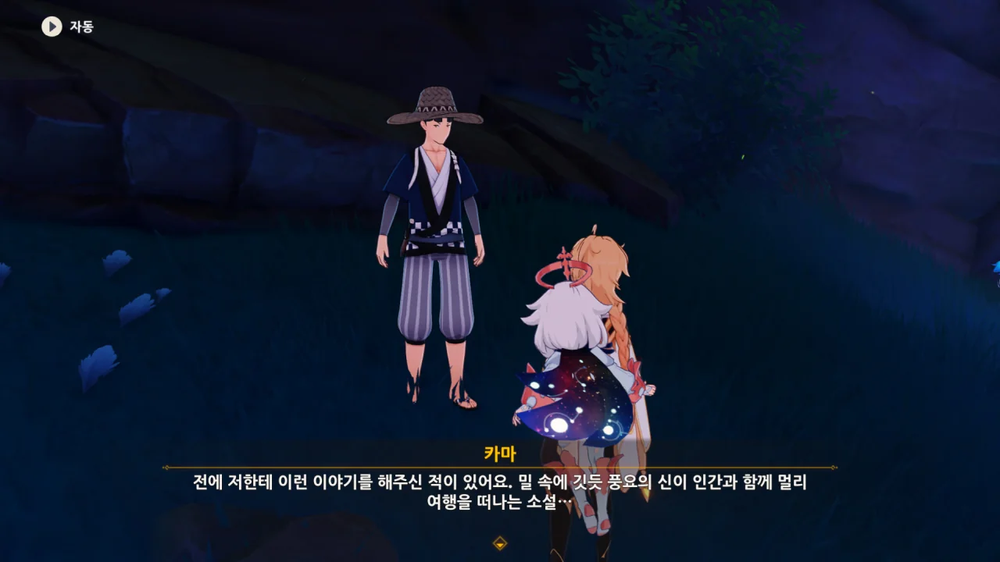

> 밀 속에 깃든 풍요의 신이 인간과 함께 멀리 여행을 떠나는 소설

이거, 늑대와 향신료 이야기잖아. '밀 속에 깃든 풍요의 신' 부분이 너무 빼도 박도 못할 증거인데?

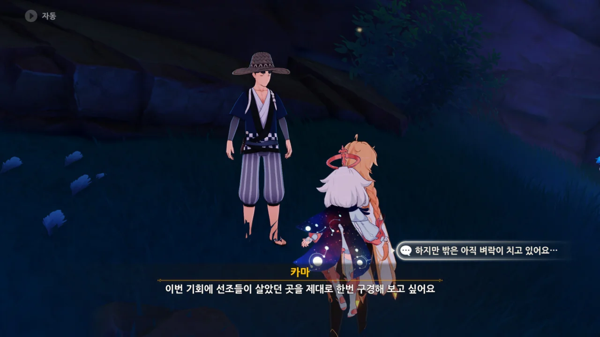

카마 역시 류와 함께 세이라이 섬으로 가기로 했다.

바깥에 번개가 수도 없이 치고 있는 상황이지만, '이런 벼락은 이나즈마에 살면서 수도 없이 봐왔다'라며 별것 아닌 것처럼 치부하는 카마.

이나즈마 사람들에게 이런 벼락은 일상과 같은 건가?



류에게 깃털을 만지게 한 후, 세이라이 섬 아마쿠모 산마루에 데려왔다.

예상처럼, 류는 무사히 츠루미 섬을 벗어날 수 있었다.

&nbsp;

우리의 노력이 무색하게도, 류는 칸나 카파치가 이미 죽은 것을 알고 있더라.



그래도 자신을 츠루미 섬 바깥으로 데려와 줘서 고맙다고 말하는 류.

류는 자신의 노래를 칸나 카파치에게 들려준다.





류가 부르는 노래는 이나즈마의 이곳저곳을 돌아다니며 수도 없이 들었던 그 노래였다.



노래를 마친 류에게 깃털 하나가 살포시 내려온다.

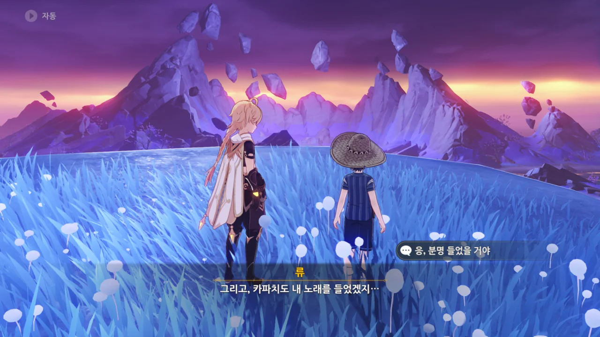

분명 카파치의 원혼도 류의 노래를 들었을 것이다. 류에게 내려온 깃털이 그 증거니까.

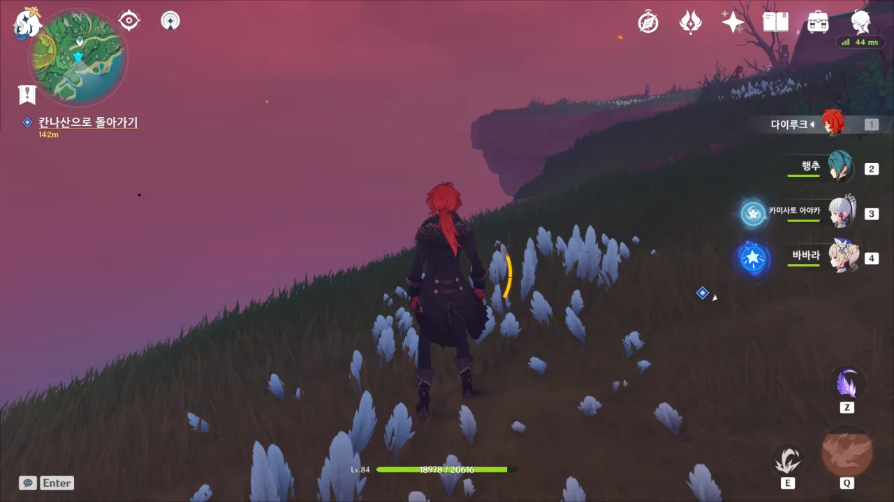

여전히 새빨간 하늘이지만, 적어도 더 이상 번개는 내려치지 않는다.

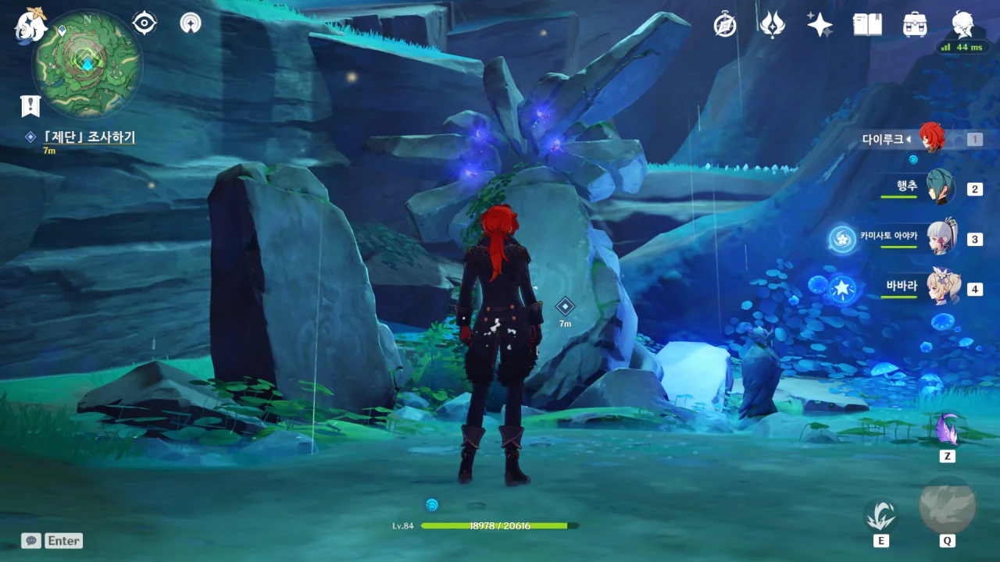

아까 여기 있을 때는 전혀 눈치채지 못한 것인데, 제단 위쪽에 깃털이 네 개가 있다.

세 개는 츠루미 섬을 돌아다니며 얻은 것이고, 하나는 뇌음의 권현을 잡고 얻은 것이다.

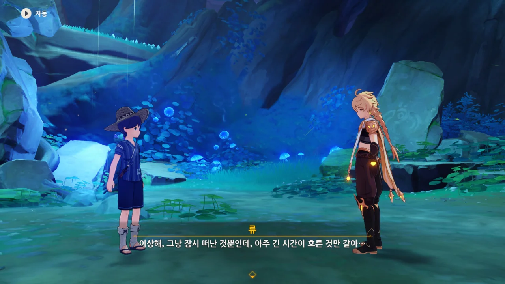

긴 시간이 흐르긴 했지...



류가 마지막 깃털을 제단에 올려놓자, 제단 뒤에 죽어있던 나무에 푸른 잎사귀가 자라나며 날씨가 갠다.

이제 칸나 카파치의 한이 풀린 것일까.





그래, 이럴 것 같더라.

류와 함께 세상을 여행하자고 약속했지만, 사실 이루어질 수 없는 약속이었다.

류는 이미 죽은 사람이니까. 칸나 카파치의 한이 풀렸다고 다시 살아날 수 있는 것도 아니니..

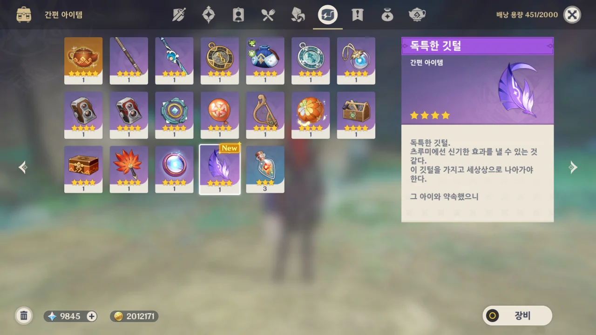

> **독특한 깃털**
> ***
> 독특한 깃털.
> 츠루미에선 신기한 효과를 낼 수 있는 것 같다.
> 이 깃털을 가지고 세상으로 나아가야 한다.
> &nbsp;
> 그 아이와 약속했으니.
{.bq}

그런데 이 뭉클한 장면에서까지 '세상상'이라는 오타를 냈어야 했니, 미호요?



그래, 잘 자. 이제 쉬어.

&nbsp;

분명 어디 다른 곳에 다녀오면 이곳에 있던 류는 흔적도 없이 사라진 상태이겠지. 뻔한 스토리이지만, 가슴 한쪽이 아련해지는 것은 어쩔 수 없다.

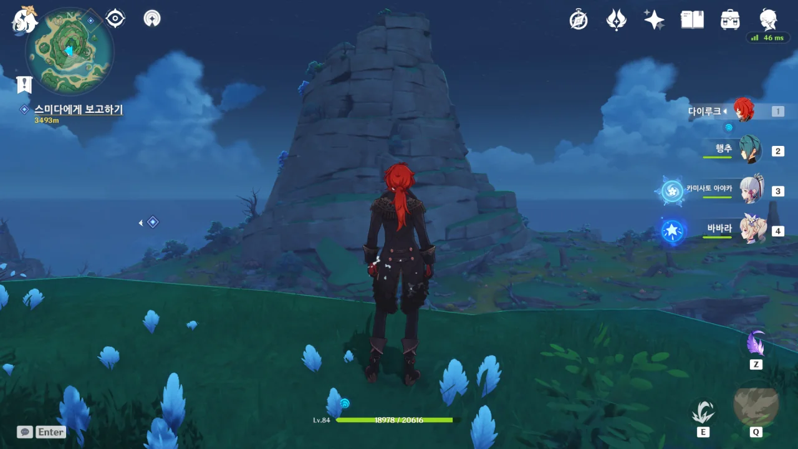

섬의 날씨가 완전히 개었다.

그냥 사진만 봐서는 여느 이나즈마의 섬과 다를 바가 없어 보일 정도이다.

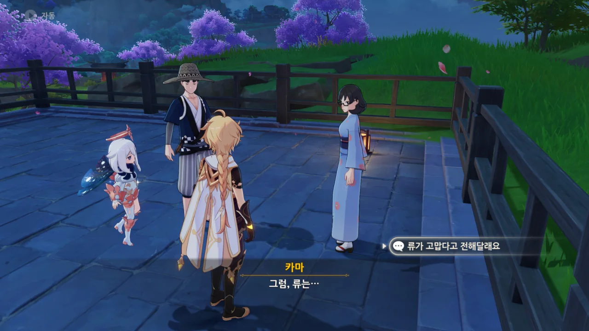

스미다에게 마지막 보고를 한다.

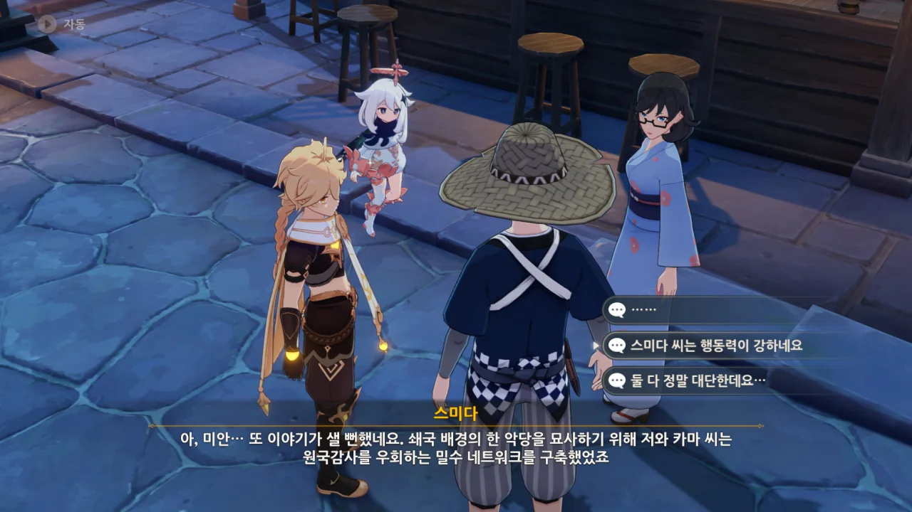

글을 쓰기 위해 원국감사를 우회하는 밀수 네트워크까지 구축했다고? 너무 일을 크게 벌이는 거 아냐?

모 만화가가 조폭을 사실적으로 묘사하기 위해 사채를 빌려보았다는 말이 덩달아 생각날 지경이다.



이게 프러포즈인지 아닌지, 나 원 참...

스미다는 기껏 글 소재를 다 모아놓고선, 이야기가 자연스럽게 써지는 날이 올 때까지 절필하고 정처 없이 여행 다닌다는 폭탄선언을 해버린다.

그러고서 카마가 자신의 곁에 있어 줘야 한다고 하자, 카마가 '그렇지 않아도 같이 갈 수 있게 해달라고 할 참이었다'라고 말한다.

저 둘은 사이가 맞지 않는 것 같으면서도 잘 맞는, 기묘한 커플이다.

&nbsp;

나중에 다른 사람들의 이야기를 들어보니, 저 둘은 몬드에서도 볼 수 있고, 리월에서도 볼 수 있는 등, 정말 말 그대로 온 세상을 다 돌아다니는 중이라고 한다.
