오늘은 반드시 연하궁으로 가고야 말겠다.

새로운 지역이 추가되었는데, 거길 탐험하지 않는다는 건 너무 아깝다.

또한 연하궁에 있을 상자와, 그 상자를 열어 얻을 원석을 생각하면 더더욱 가지 않을 수 없다.

그 원석 정도라면 분명 다음 픽업인 야에 미코를 뽑을 때 도움이 될 것이니 말이다.

&nbsp;

테스트 서버에서 유출된 모습이긴 하지만, 야에 미코가 궁을 쓰는 모습을 봤다.

와... 이걸 안 사고 배겨?

그 장면을 4K로 찍은 사진이 있길래, 냉큼 받아서 용량 최적화를 한 후, 고이 클라우드에 소장했다.

***

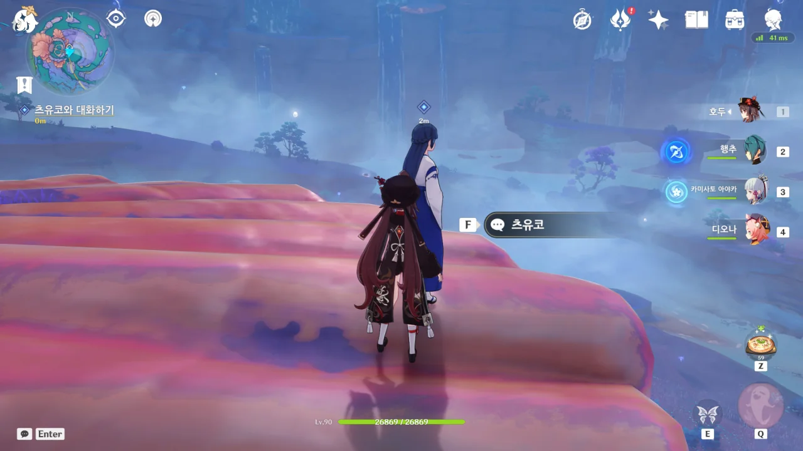

연하궁 탐사는 츠유코에게 말을 거는 것으로 시작한다.



츠유코는 말을 너무 돌려서 말한다. 본인 말로는 코코미가 그렇게 말하면 도움이 될 거라고 말했다는데, 글쎼다.

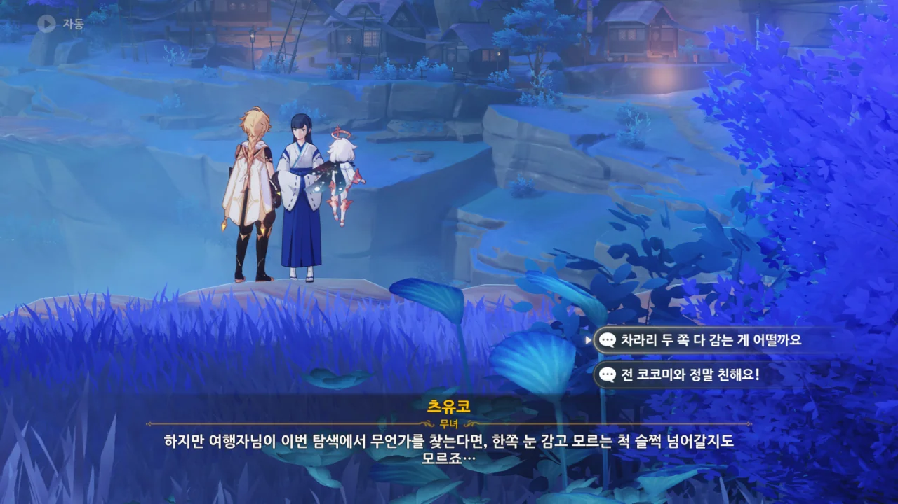

> 이번 탐색에서 무언가를 찾는다면, 한쪽 눈 감고 모르는 척 슬쩍 넘어갈지도 모르죠.

'거기서 뭘 찾던 못 본 척 넘어가겠다'라고 말하려는 것 같은데, 그럴 거면 두 눈 다 감아야지!





음... 그러니까 연하궁에 가고 싶으면 월광욕 연못의 열쇠를 찾아오란 이야기인가?

여긴 고유명사가 너무 많아서 뭐가 뭔지 도통 이해하기 힘들다.

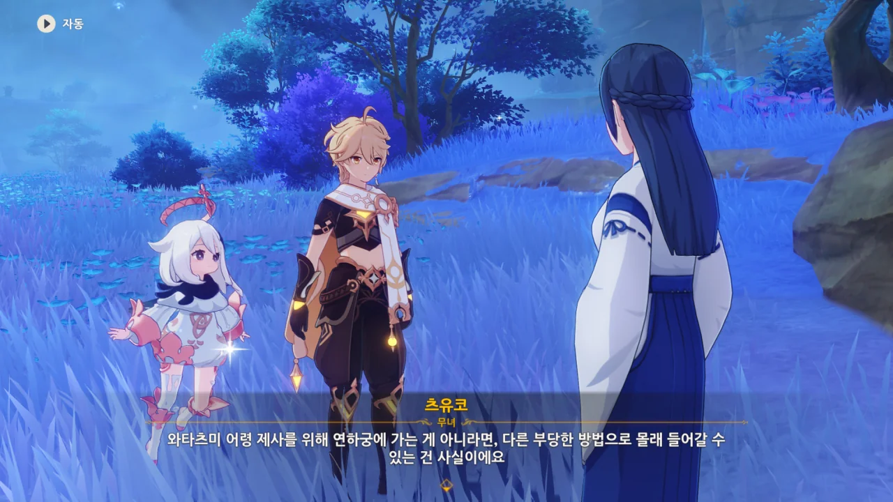

너무 오랜만에 와타츠미 섬에 와서, '와타츠미 어령 제사'가 뭔지조차 다 까먹었다.

츠유코의 말에 따르면 연하궁은 봉인된 것이 맞긴 하지만, 백도어 같은 방법으로 들어갈 수도 있다고 한다.

그 말인즉슨, 안에 몬스터가 있다는 말이다.



츠유코의 말을 듣고 '설마 이걸 외워서 위치를 유추해 찾아가야 해?'라고 생각했는데, 다행스럽게도 지도에 직접 위치를 찍어준다.

만약 이렇게 지도에 위치를 찍어주지 않았다면, 난 일말의 주저함도 없이 인터넷을 켜 공략을 찾았을 것이다.

저 힌트만 듣고 찾아가기에는 너무 힌트가 빈약했거든.



뜬금없이 페이몬이 츠유코에게 '월광욕 연못의 열쇠'를 세 번 말해보라고 하더라. 츠유코는 그걸 말하다가 혀가 꼬여버렸다.

'혀를 깨물었다'라... 아직도 그 소설 시리즈, 나오고 있을까? ~~시츠레 카미마시타~~

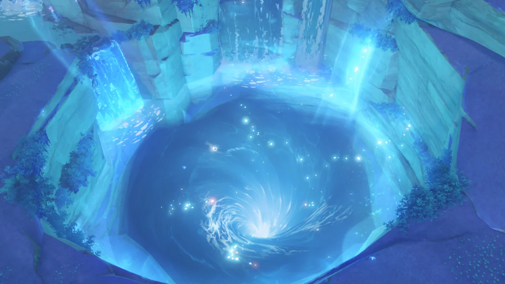

연하궁의 입구가 열렸다. 저기로 뛰어들면 되는 건가?

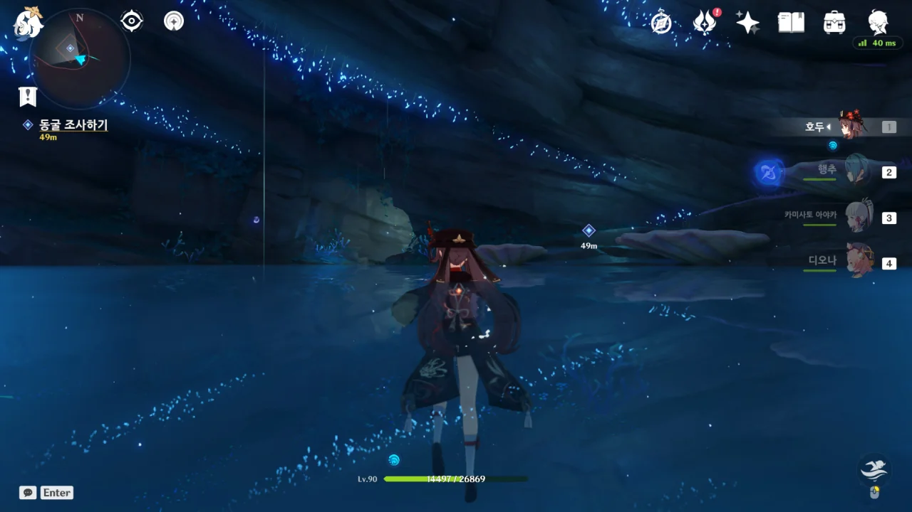

정말이었네. 날개를 펼칠 새도 없이 지면에 곤두박질쳐 깜짝 놀랐는데, 바닥이 물이라서 낙하 대미지를 전혀 받지 않을 수 있었다.

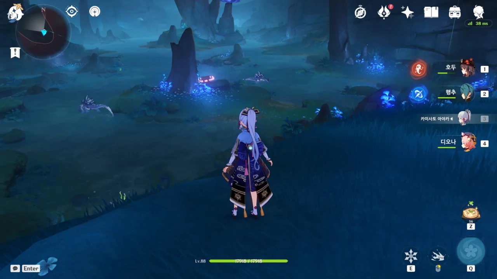

분명 여기, 연하궁 맞지? 그런데 왜 평범한 지하동굴이 있는 거지?

설마 연하궁 사람들은 구석기 시대 사람들처럼 동굴과 막집에서 살았던 거야?

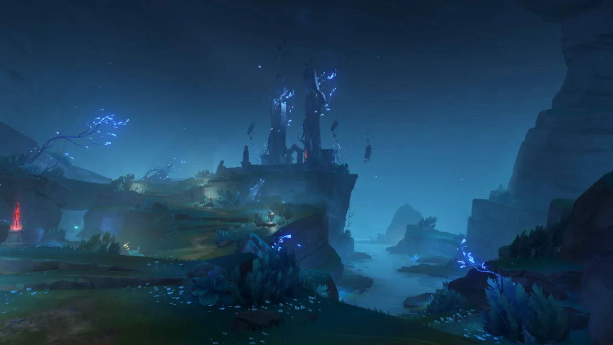

좀 더 깊이 들어가 보니 무슨 문처럼 생긴 구조물이 나타났다.

아까 거기는 연하궁 입구 바깥이었나보다.



문에 건문이 그러져 있다. 그 말인즉슨, 열심히 건문을 모아와 문에 박아 넣으라는 이야기이다.

그래서 그렇게 했다.

문이 활성화되는 장면이 매우 이쁘더라.

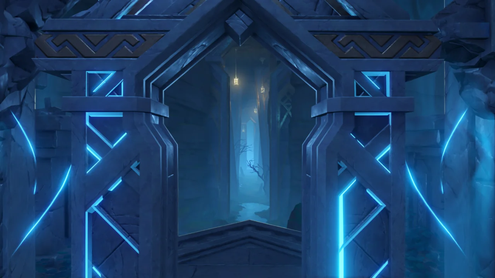

문 너머에 새로운 통로가 보인다. 분명 저 뒤는 벽이었을 텐데?



문 옆으로 돌아가 뒤를 보니, 문 뒤는 여전히 평범한 절벽이었다.

문을 통해서 뒤를 보면 새로운 통로가 나타나지만, 그렇지 않으면 평범한 절벽이 나타난다.

나, 이런 연출 정말 좋아하는데. 서브리미널이나 그런 게임에서 자주 보이는 연출 아닌가.

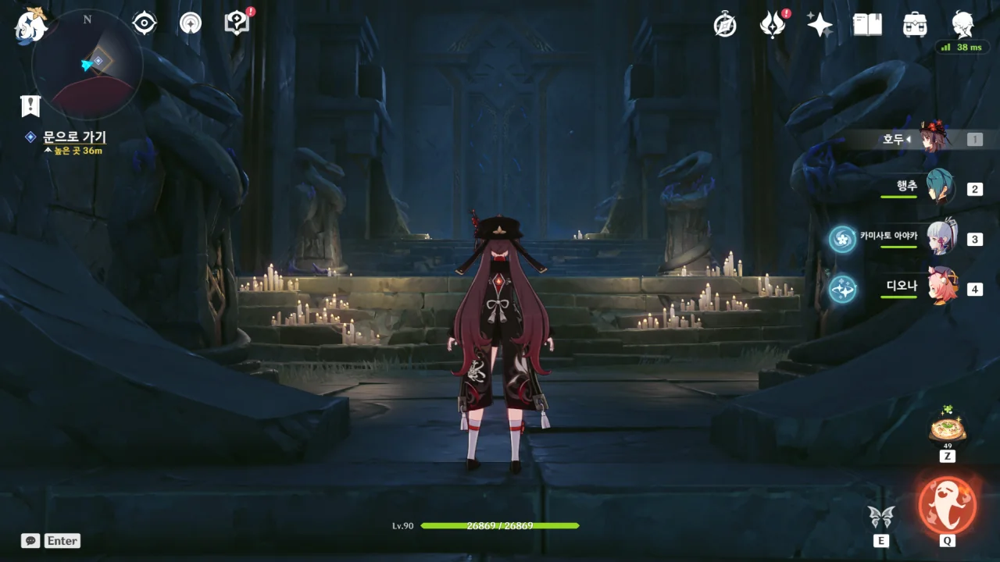

통로를 따라 걷다 보니 새로운 문이 나타났다.

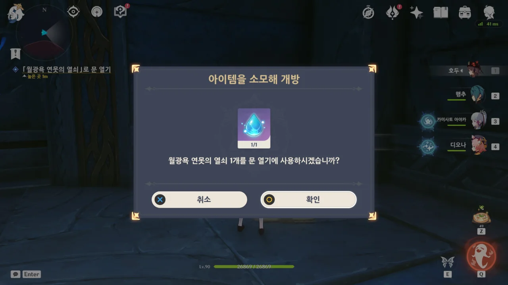

월광욕 연못의 열쇠를 여기서 쓰는 거였구나.

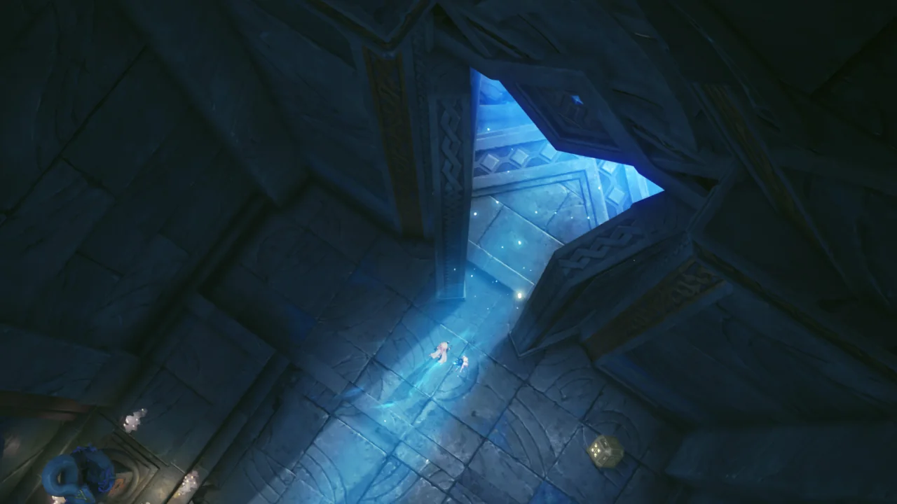

문이 열린다.



와, 정말 이쁘다...

사람들 말로는 연하궁의 느낌이 엘든 링과 비슷하다고 하던데, 과연 어떨까?

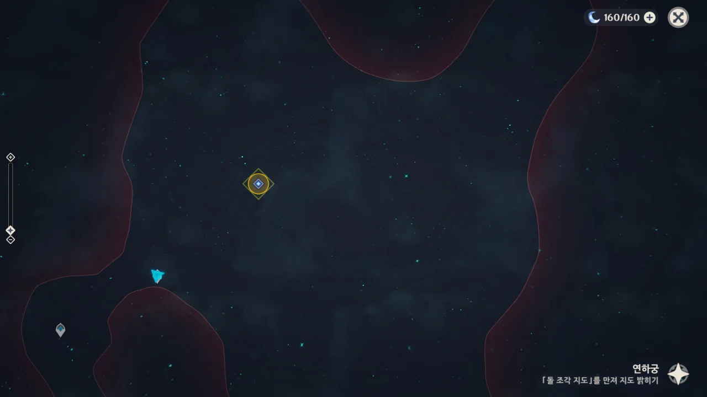

그런데 지도가 온통 깜깜하다.

신상이 있다면 신상을 만져 지도를 밝힐 수 있을 텐데, 여긴 신상이 없다.

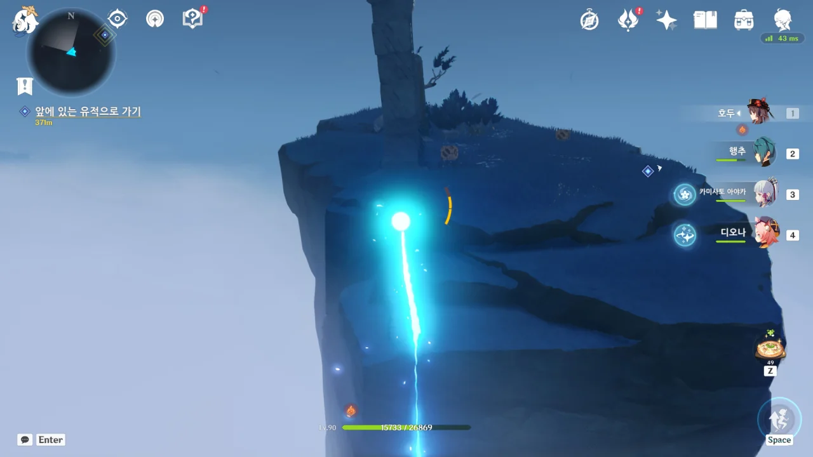

누가 연하궁이 이나즈마 아니랄까 봐, 여기에도 번개가 되어 이동하는 장치가 있다.

다만 이나즈마의 것과 다른 점이라면 이나즈마에서는 보라색 번개가 되어 이동하는 느낌이었고, 여기에선 푸른색의 광선이 되어 이동하는 느낌이다.

게다가 이나즈마에는 문 오브젝트를 회전시켜 도착 지점을 변경할 수 있지만, 여기는 출발 지점과 도착 지점이 정해져 있다.

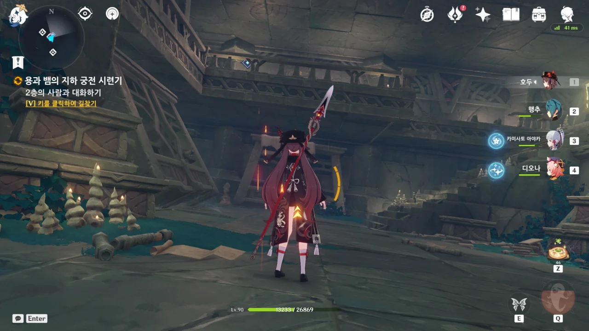

여기 건물은 좀 옆으로 기울었다.



2층에 웬 사람이 있나 했는데, 자신을 '용사에게 안내하는 역할'이라고 한다.

가이드네.



츠유코가 별다른 말을 한 적은 없는 것 같은데...

안내원이 있는 이유는 용사에게 백야국의 문자를 처음부터 외우게 하느니, 그냥 안내원을 하나 옆에 붙여 대신 해석하게 하기 위해서라고 한다.



그러니까 지금 우리의 목표인 중앙탑으로 가려면 결계를 해제할 열쇠 같은 걸 찾아야 한다는 소리지?





엔죠가 열심히 무언가를 설명하지만, 머릿속에 잘 들어오지 않는다. 아까부터 자꾸 고유명사를 들이대니, 고유명사만 해도 이미 머리가 터질 것만 같다.

그냥 열심히 사진이나 찍고, 나중에 천천히 읽으면서 해석하면 되겠지.



백도어로 연하궁에 들어는 올 수 있지만, 정식으로 들어온 용사가 아니라면 연하궁의 진실에 도달할 수 없다고 한다.

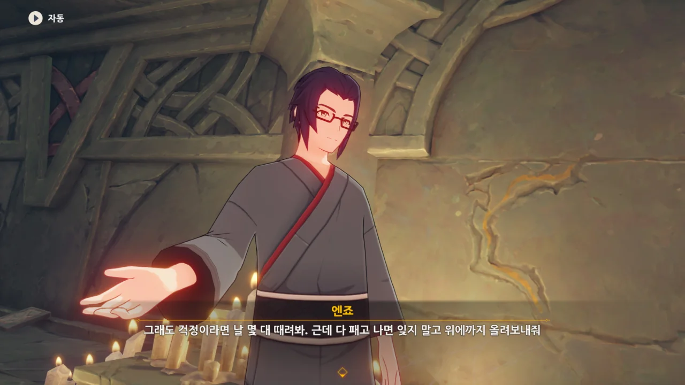

아니, 왜 자꾸 때려보라고 하는 거지? 설마 너, 맞는 걸 좋아한다거나 그런 취향이 있는 건 아니지?



지도를 밝히는 방법이 연하궁은 특이하네. 다른 곳은 신상을 만져 지도를 밝힌다면, 연하궁은 벽의 지도를 보고 지도를 밝힌다.
