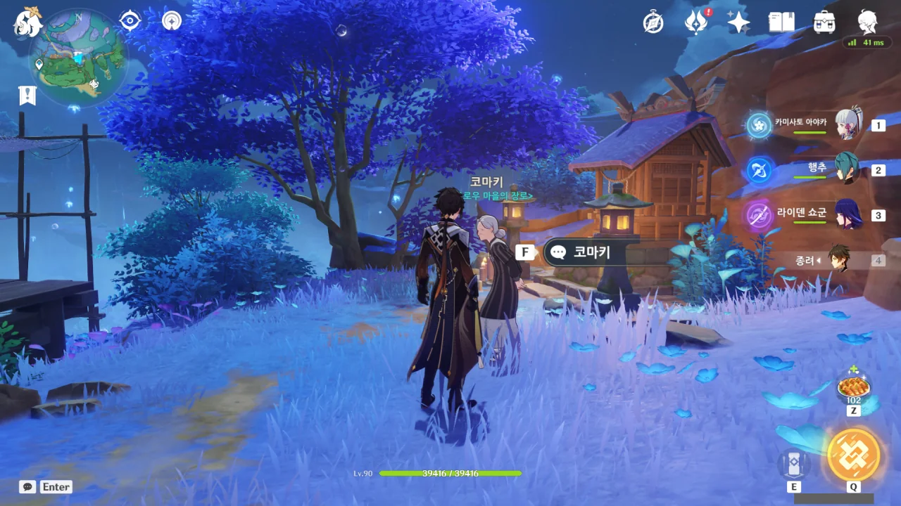
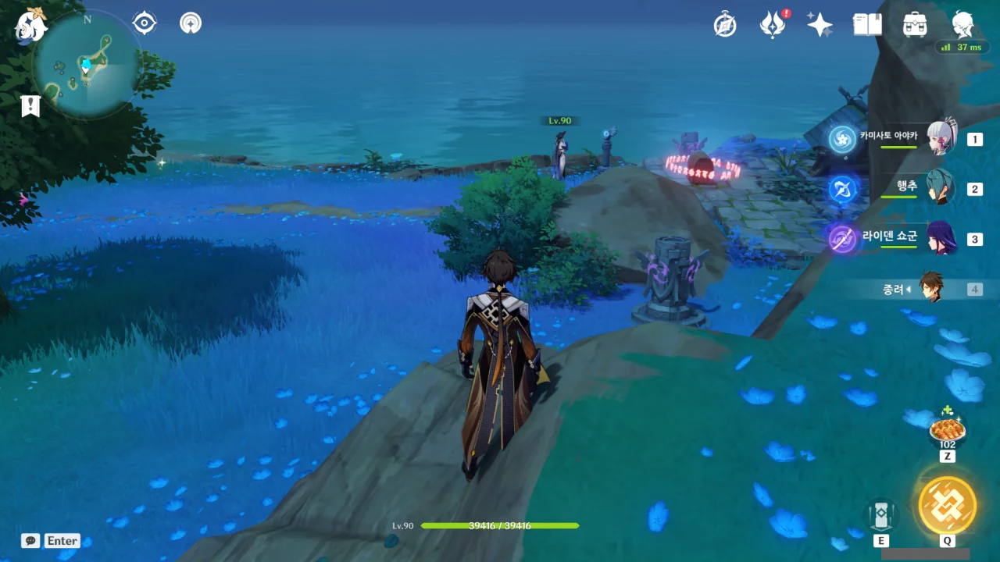
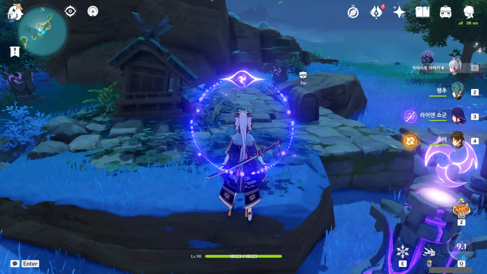
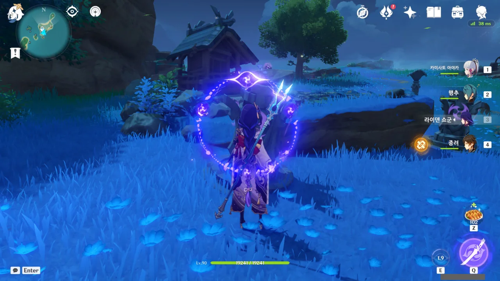
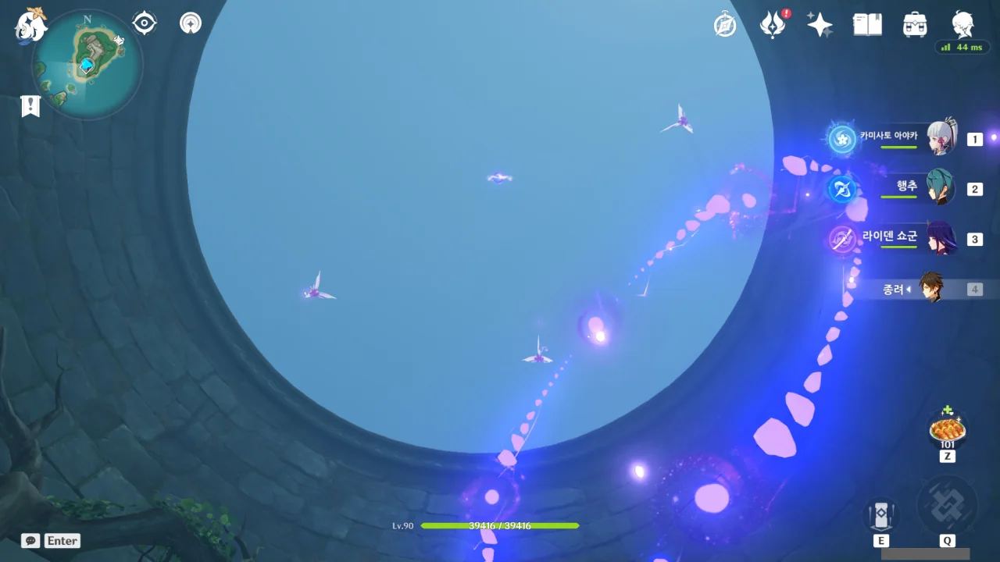
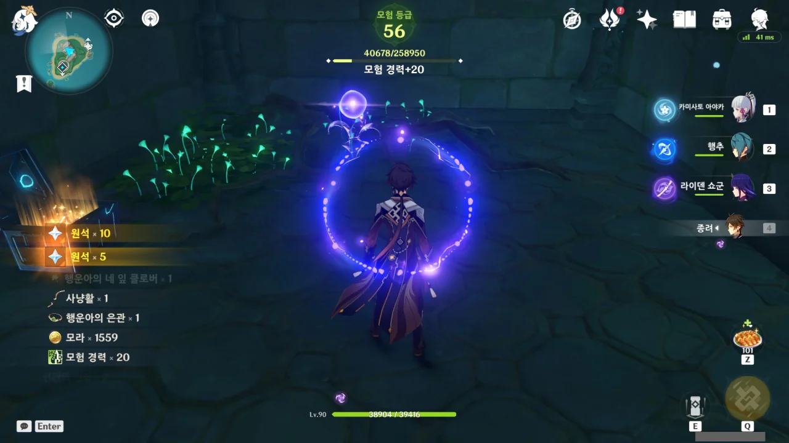
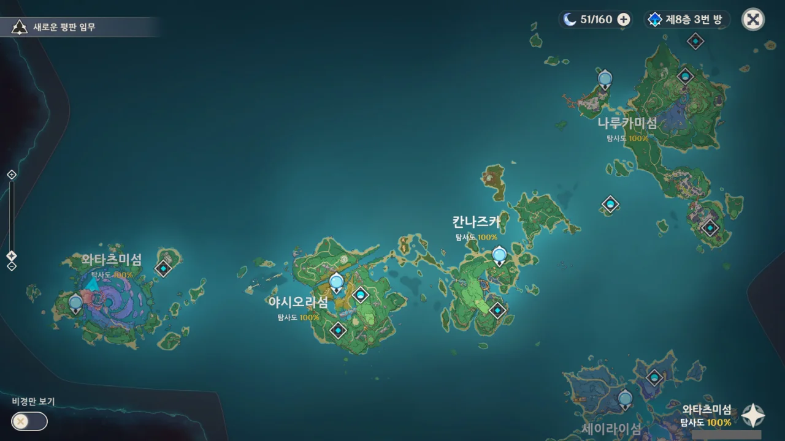

탐사도를 올리는 데에 있어 월드 임무만 한 것이 없다.

그도 그럴 것이, 일단 월드 임무를 전부 끝내면 업적과 함께 원석을 준다. 중간중간 상자를 열면 또 원석을 준다. 상자를 열었기 때문에 탐사도가 오른다.

즉, 원석도 벌고 탐사도도 올리는 일석이조의 행위가 바로 월드 임무이다.

&nbsp;

지도에 월드 임무를 표시해 둔 곳은 총 두 곳. 아사세 신사의 네코와 관련된 임무, 보우로우 마을의 촌장 할머니와 관련된 임무 이렇게 둘이다.

일일 임무를 모두 끝내고 나면 할머니에게 가 점을 쳐본다.

딱 봐도 저 상자를 열기 위해선 번개 원소 기둥을 활성화해야 할 것 같다.

저기 저 거울 여인은 내가 여기에 올 때마다 저러고 있던데, 가까이 가니 갑자기 나타난 해란귀와 합세해 날 죽이려 들었다.

그런데 그렇게 합동 공격을 하는 둘을 죽이는 것이 이 상자를 여는 해법이었다. 뭐야, 원소 기둥은 상관없었던 거야?

하지만 저게 괜히 있을 리가 없는데.

뭔가 정해진 순서대로 번개 원소 기둥을 작동시켜야 하는 것 같다.

하지만 분명 제대로 했음에도 불구하고 퍼즐이 풀리지 않아, 게임을 한번 종료했다 다시 켜야만 했다.

옛날엔 이런 경우가 드물었는데, 최근 들어 이런 퍼즐 같은 것이 버그로 인해 풀리지 않는 경우가 잦다.



업적과 함께 보물상자를 획득했다.

스크린샷 프로그램을 켜지 않은 채 멍하니 네코와 관련된 월드 임무를 진행하다 결국 고양이 모양 석상을 완성했다.

그러자 하늘의 구름 역시 고양이 모양으로 변해 있었다. 그걸 왜 내가 찍질 못했을까...

네코가 말한 '늦게 온 「좋은 일」'이 바로 그것이었나 보다.



저기 위에 둥둥 떠 있는 번개 선령을 따라가는 말이겠지?

이것으로 보우로우 마을 촌장 할머니와 관련한 월드 임무도 끝이 났다. 찾아보니 이게 마지막이라더라.

내가 왜 이 도전을 안 한 걸까 궁금해하며 타임 어택 도전을 시도했다. 그리고 곧바로 내가 왜 이 도전을 안 했는지 깨달았다.

아니, 번개 구슬 하나 어디 갔는데!

&nbsp;

결국 유튜브 영상을 찾아보고서야 어떻게 하는 건지 알았다.

방금 타임 어택 도전을 끝내자마자 와타츠미 섬의 탐사도가 100%가 되었다.

이제 남은 건 세이라이 섬과 츠루미 섬인가? 연하궁은 지금 90%일 것이다.

&nbsp;

이나즈마가 모두 끝나면 리월을 할 차례이다. 2.6 버전에 층암거연이 나온다고 하던데, 거기도 뭐 탐사도는 금방 올리겠지.
