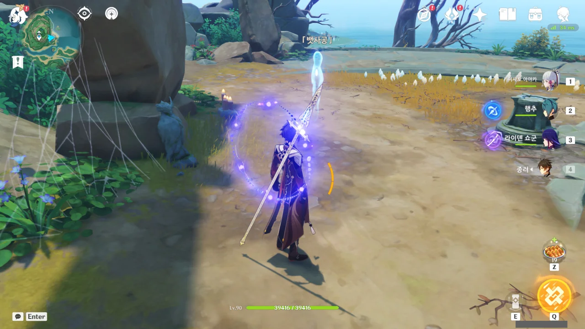
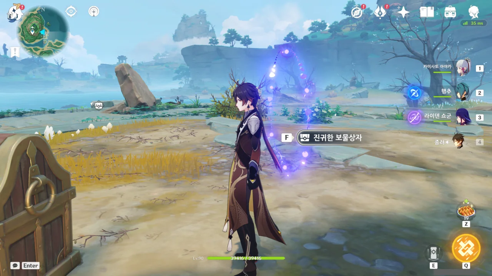
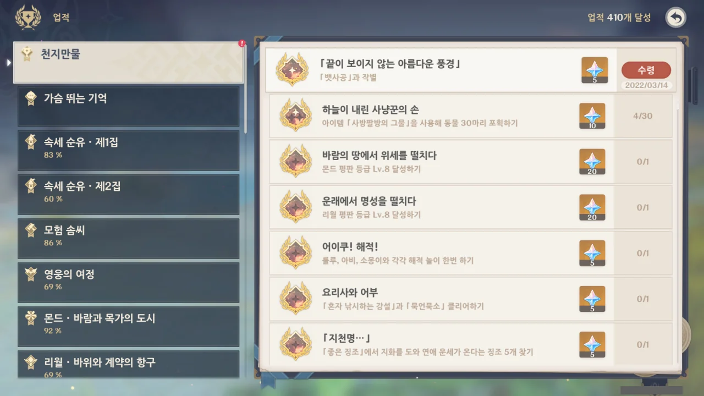

지도에 '우나' 마커를 찍어두고도 마커의 존재를 잊고 있었다. 그러다가 오늘에서야 다시 '우나' 마커를 발견했다.

츠루미 섬 월드 임무는 유령 관련 임무를 7개 끝내고 마지막으로 우나 관련 임무만 남겨둔 상태이다.



물품 전달까지 아주 완벽하다.

모든 유령 관련 임무를 끝낸 것을 확인하고 뱃사공에게 말을 걸었으나, 여전히 다른 임무가 남았다는 말을 반복하기에 '아, 또 뭐가 문젠데!'라며 화를 내었다.

그런데 그냥 그 자리에서 한 번 더 말을 걸면 되는 문제였다.





츠루미 섬에 남아있던 모든 유령이 사라진다.

유령이 없는 츠루미 섬을 불러오기 위해 한번 로딩 창이 뜬 것으로 보아, 이제 앞으로 츠루미 섬에서 유령을 볼 일은 없을 것 같다.

그리고 업적 하나가 달성되었다.

&nbsp;

이제 츠루미 섬도 유령이 없으니 그저 적막한 섬이 되어버렸다.
