이상하다. 월드 임무가 자꾸만 복사된다.

분명 처음에는 '라나'라는 NPC를 돕다가 라나가 죽음의 땅에 침식당해 의식을 잃자, 라나를 치료하기 위해 뛰는 것이 시작이었다.

그런데 이제는 별세계에서 '마라나'니 '마타하라'니 알 수 없는 용어들에 둘러싸여 별의별 것들을 해치우고 다니고 있다.

여긴 누구인가 난 어디인가...

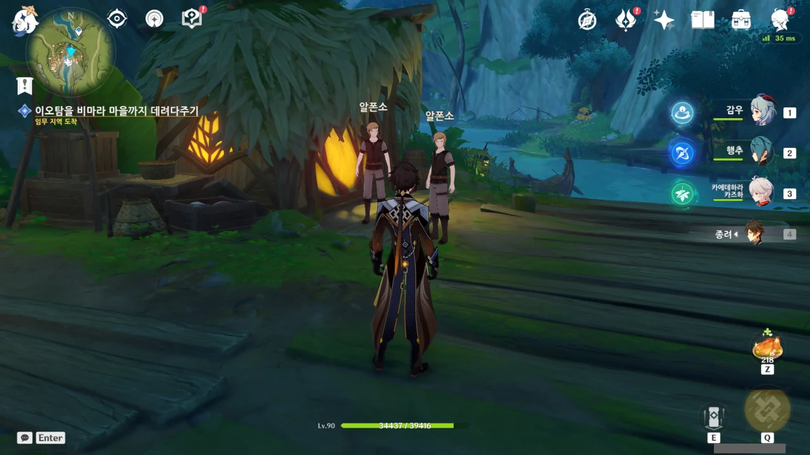

아 ㅋㅋ 알폰소도 복사가 된다고 ㅋㅋ

&nbsp;

여기서 컷신이 나와야 하지만, 버그 때문에 컷신이 재생되지 않는 모습이다.

결국 게임을 껐다 켜 해결해야 했다. 다행스럽게도 다시 들어오니 곧바로 임무 진행이 되더라고.



증식하는 월드 임무.

&nbsp;

그... 류웨이 선생님... 월드 임무가 많았으면 좋겠다고 생각한 건 맞는데, 이건 너무 많은 거 아닐까요?

월드 임무 먹다가 목메 죽겠네...

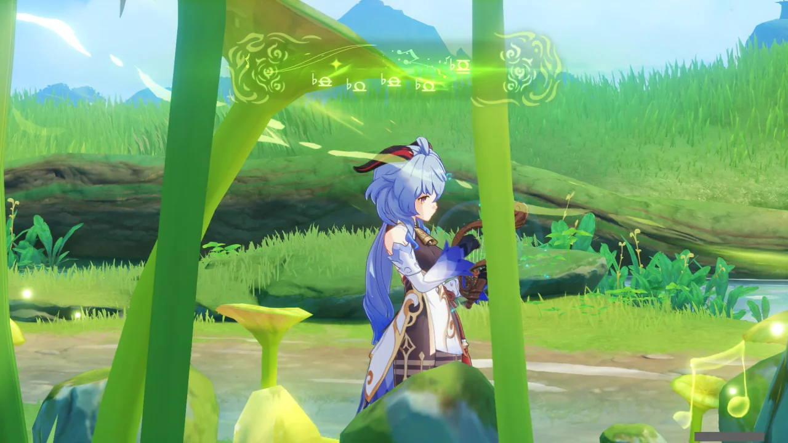

수금으로 포탈을 열거나 풀 씨앗을 해금하는 걸 보며 문득 깨달은 것이 하나 있다.

별 건 아니고, 예전에 모든 워프 포인트와 신상을 찍겠다고 덤비다가 넝쿨이 가로막고 있어 들어가지 못하는 동굴을 발견한 적이 있었다.

거기 근처에도 빈 풀 씨앗 주머니 같은 것이 있었는데, 그것도 분명 수금으로 활성화하는 것일 테다.

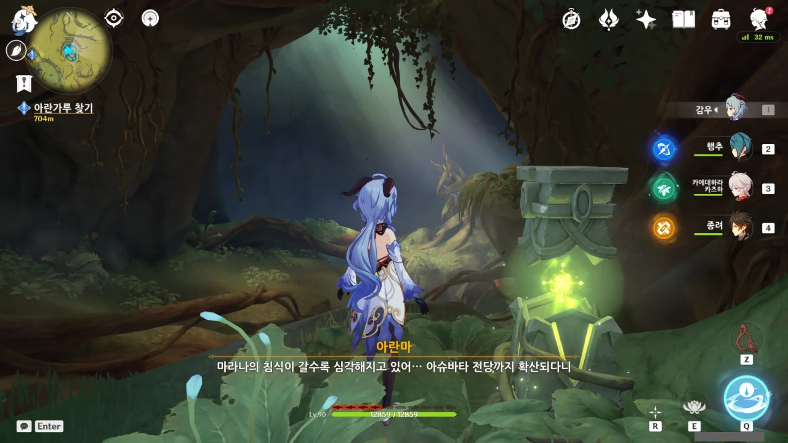

죽음의 땅에 발을 들여놓자마자 침식 스택이 4개나 적립된다.

튜토리얼을 읽어보니, 이 스택이 10개가 되면 파티의 모든 캐릭터가 깩하고 죽어버린다고 한다.

수계 늑대의 침식은 그래도 필드에 나와 있는 캐릭터만 죽였는데, 이건 한술 더 뜬다.

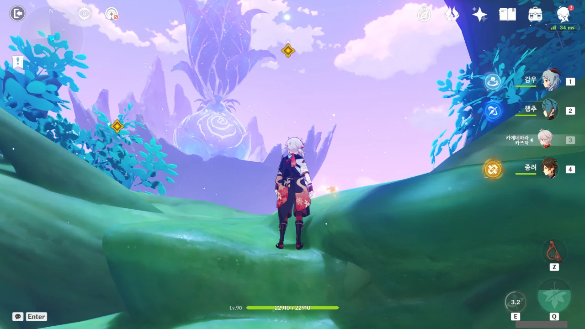

저걸 보자마자 난 양파를 떠올리지 않을 수 없었다.

저걸 보고 양파를 떠올리지 않은 자, 양파를 제대로 보지 못한 자임이 틀림없다.

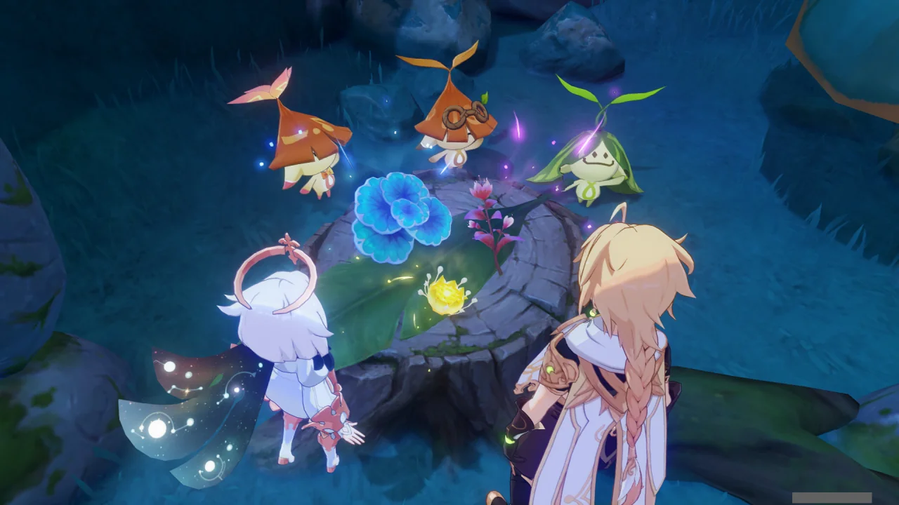

이곳저곳에서 '으어어' 하며 스스로를 잃은 채 모은 재료를 모아 샤바샤바 무언가를 한다.

분명 무언가를 한 것 같은데, 그게 뭔질 모르겠다.

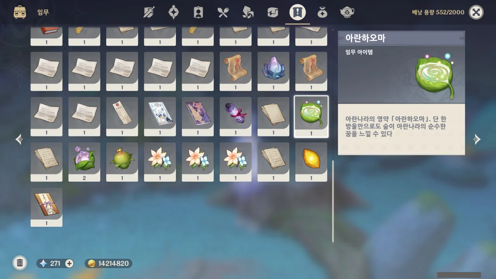

> 단 한 방울만으로도 숲이 아란나라의 순수한 꿈을 느낄 수 있다.
{.bq}

난 아무것도 모르겠던데.

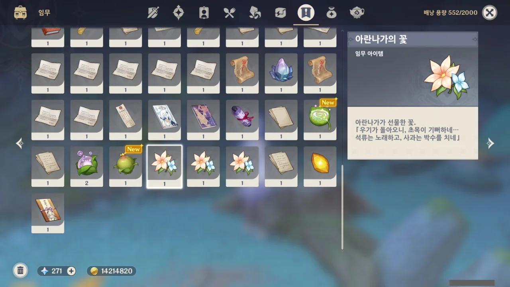

아란나라들이 꽃을 선물할 때, 그냥 말로만 선물했다고 하고 넘어갈 줄 알았다. 그런데 아란나라가 준 꽃이 실제로 배낭에 임무 아이템으로 들어오더라.

그래, 나 같은 오타쿠는 이런 사소한 것에도 감동하는 족속이라고.

난 무슨 포탈이라도 열릴 줄 알았는데, 눈앞의 버섯이 쑥쑥 자란다.

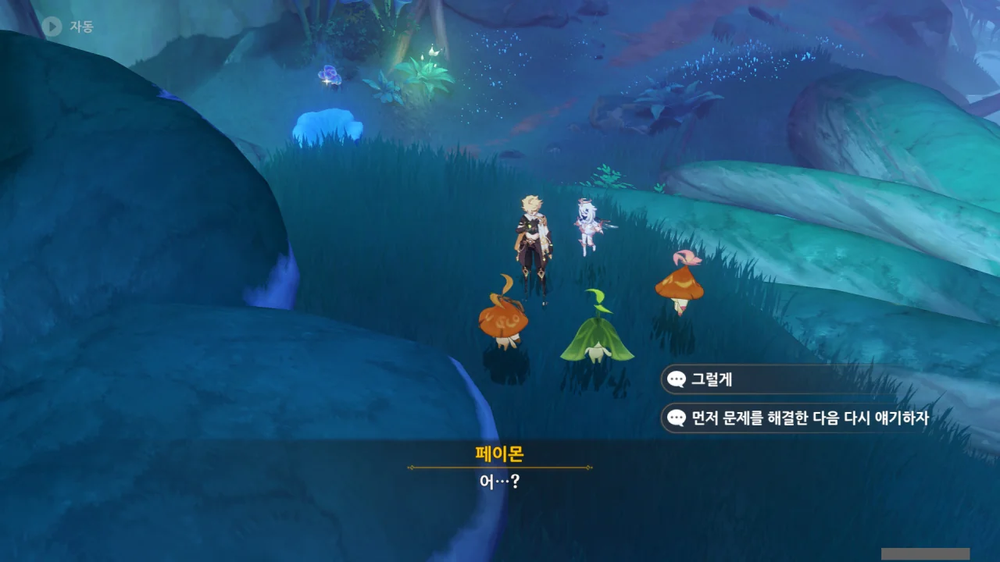

아란나라가 이야기하는 걸 들어보니 뭔가 불안하다. '희생'이라고?

아까는 재료를 갈아서 영약을 만들었으니, 이제 아란나라를 갈아 다른 무언가를 만들어야 하는 거야?

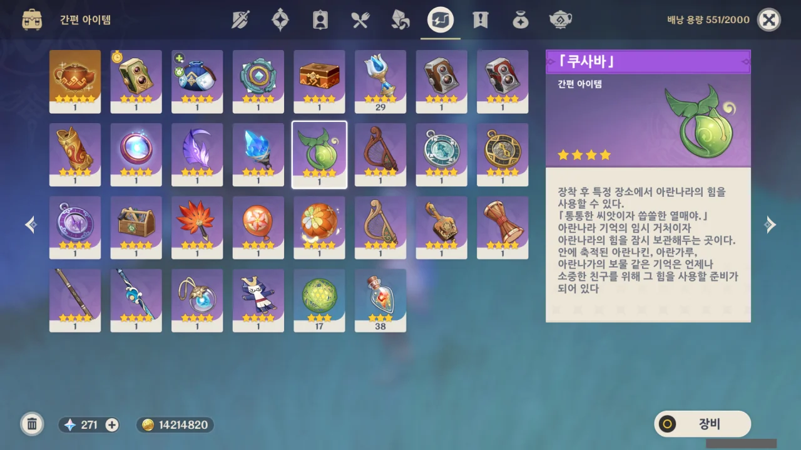

> 아란나라 기억의 임시 거처이자 아란나라의 힘을 잠시 보관해 두는 곳이다.
> 안에 축적된 아란나킨, 아란가루, 아란나가의 보물 같은 기억은 언제나 소중한 친구를 위해 그 힘을 사용할 준비가 되어 있다.
{.bq}

... 정말 아니지? 그치?

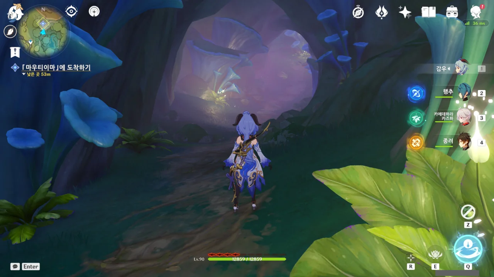

죽음의 땅이 보이지도 않는데 침식 스택이 4개나 쌓이는 걸 보고 기겁했다.

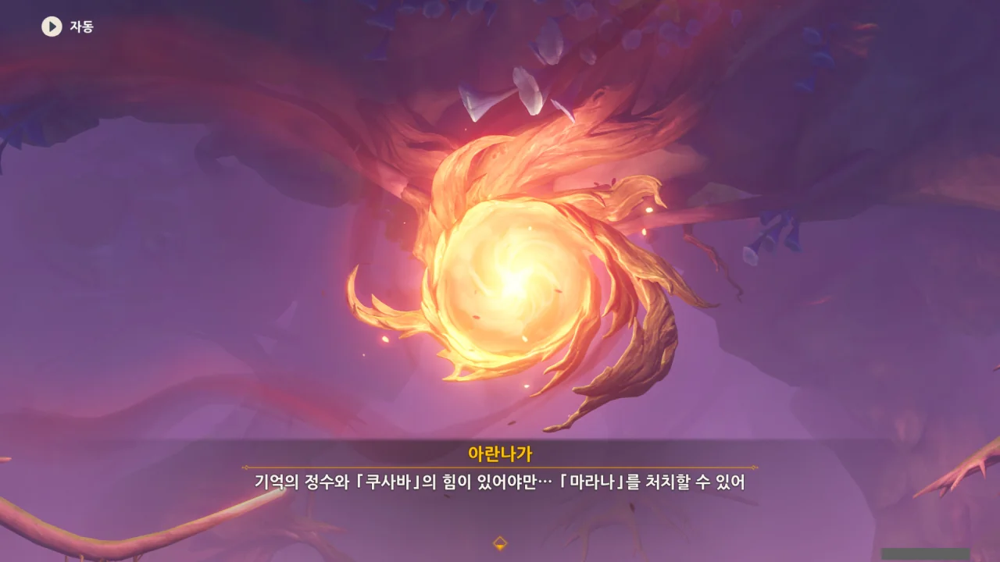

저게 「마라나」라고? 어째 나루카미 섬 지하에서 보라색 버전으로 본 것 같은데?

&nbsp;

일단 여기까지 진행했을 때, 아란나라를 진짜로 갈아서 무언가를 만드는 것이 아니란 것에 한숨 돌렸다.

내 기억 속의 미호요는 '여기 천진난만한 아이들이 보이십니까? 짜잔~! 당신이 나중에 얻을 이 아이템은 이 아이들을 갈아 만든 아이템입니다!'라고 눈도 깜빡 않고 말할 수 있는 회사라서 말이다.

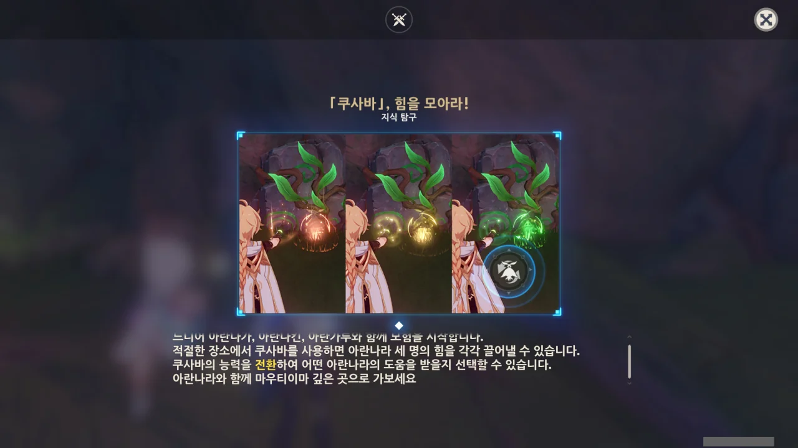

오, 이건 좀 괜찮은데? 능력 전환이라니, 나중에 필드에서 써먹기 굉장히 편하겠다.

문제는 무슨 색이 무슨 능력인지 전혀 기억하지 못한다는 거다. 초록색이 뭔가를 부수는 능력이었던가?

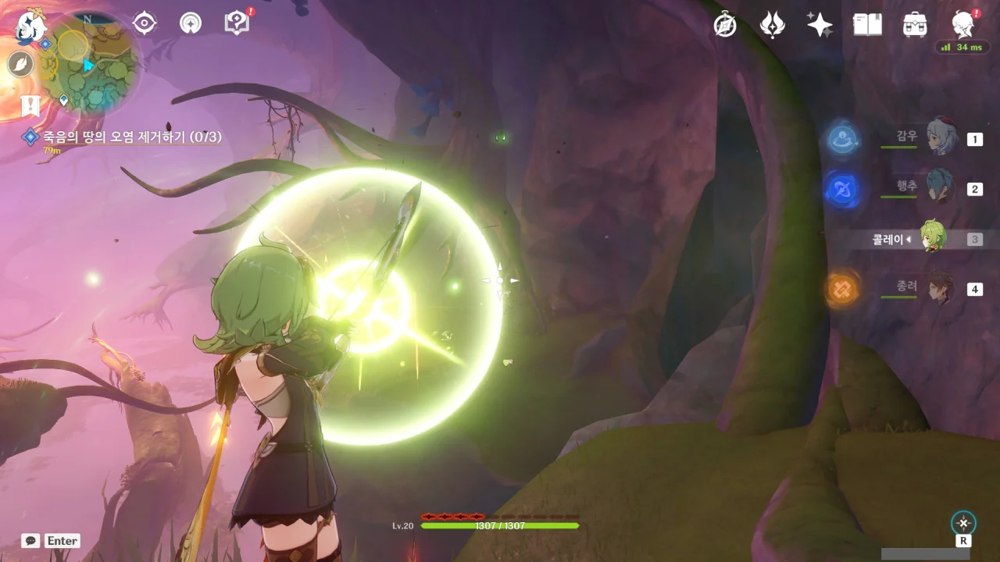

여기서 화살로 저격해 부수는 건 안 되더라.

대체 왤까? 먼 하늘을 향해 활을 쏘면 저 멀리까지 화살이 날아간다는 영상을 본 적은 있는데...

&nbsp;

콜레이로 클로버 인장 주머니를 멀리서 활성화할 수 없는 걸 보면, 그냥 단순히 모델만 보이는 거리와 실제로 작동하는 거리가 다른 것 같다.

적어도 그 작동 거리 안에서 풀 원소로 공격해야 해당 사물이 활성화되는 그런 구조겠지.

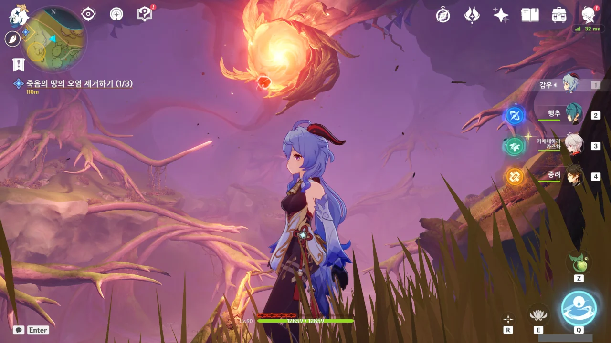

대체 뭐에 자꾸 맞고 있는 건가 궁금해 했는데, 저 가운데 천장에 매달린 붉은색 '팔레트 스왑'이 날 향해 붉은색 구체를 쏘고 있었다.

원신이 원래 피격 시 무적 시간에 짠 편이라, 붉은색 구체를 3연속으로 맞기가 굉장히 쉬운데, 그렇게 붉은색 구체를 세 번 연달아 맞으니 체력이 10,000이나 날아가더라.

아무리 침식 디버프로 최대 체력이 줄어들었다고는 하지만, 그래도 체력이 고작 2,000만 남은 걸 보고 기겁했다. 그렇지 않아도 음식을 많이 먹은 터라 더는 먹을 수 없는 상태였는데.

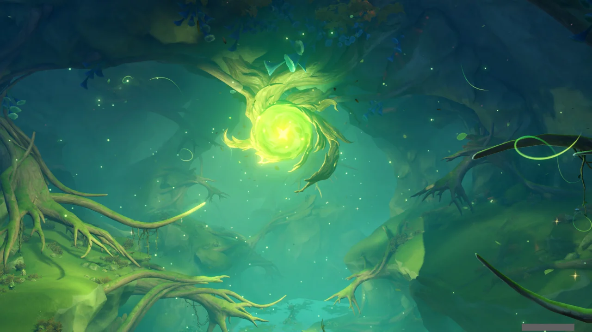

모자란 체력은 행추 E 스킬로 채운 후, '안 맞으면 되는 거 아닐까?'라는 마음가짐으로 돌격해 이겼다.

그러니까 정말로 '팔레트 스왑'이 초록색으로 팔레트 스왑을 하더라고.

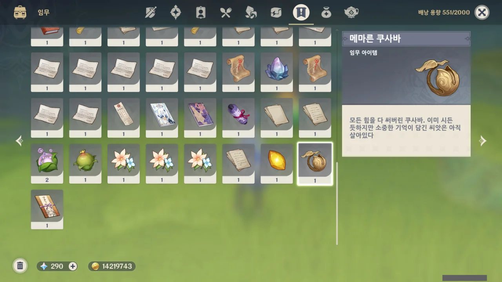

아, 「쿠사바」는 아무래도 이번 월드 임무 전용 아이템이었나보다. 모든 힘을 다 써서 메말라 버렸다고 되어 있다.





아란나라는 기억을 소모해 힘을 쓰는 걸까? 아까 전 봤던 임무 아이템의 플레이버 텍스트에도 그런 내용이 적혀 있었는데...



밖으로 나가 햇볕을 쬐면 머리가 맑아질 거라는 페이몬의 말에, 「마우티이마」와 함께 있어 줘야 한다며 거절하는 아란나라들.



> 너의 기억과 꿈속에 우리의 희생을 잊지 말고 기억해 줘.

이미 한번 말한 내용을 또다시 말하는 걸 보면, 정말로 기억을 잃은 모양이다.

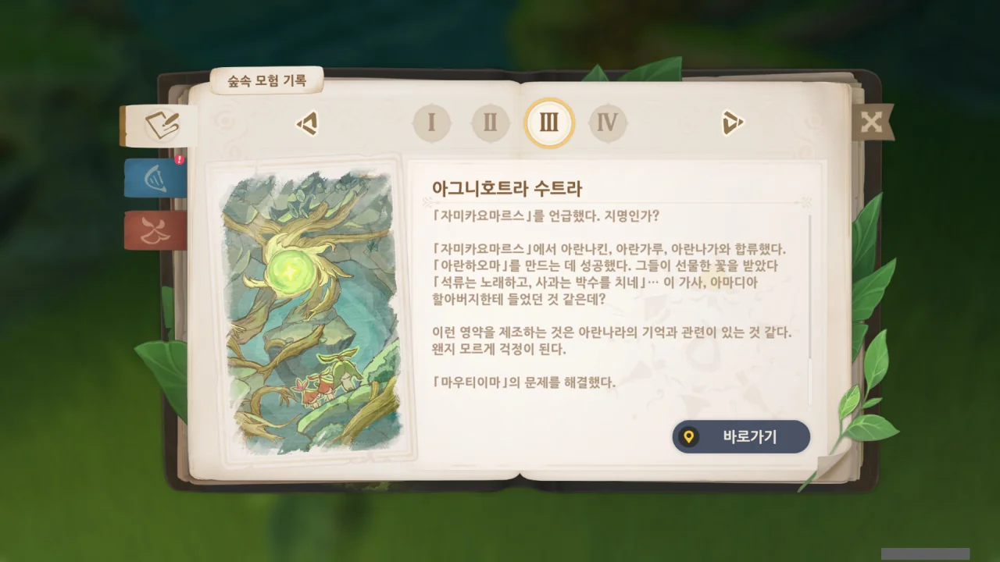

숲의 책에 무덤덤하게 '「마우티이마」의 문제를 해결했다'라고 적어 두었네...
