이전 글에서 거대 로봇을 발견했을 때만 해도 내가 그 안에 들어갈 것이라고는 전혀 상상조차 못 했다.

난 그게 그냥 배경 장식인 줄 알았지!

&nbsp;

뭔가 수상쩍은 연구원을 만나 '유적 거상'이라는 거대 로봇을 작동시키기 위해 고군분투하는 우리 여행자 되겠다.

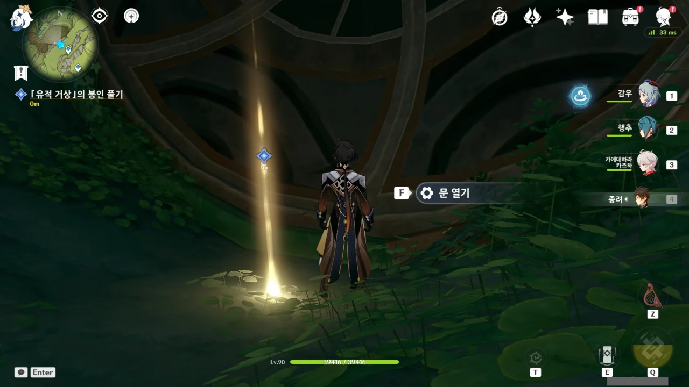

중간에 있었던, 두 할아버지의 유치한 다툼 같은 사소한 일은 넘기고, 어찌어찌해서 결국 유적 헌터의 내부로 들어갈 수 있게 되었다.

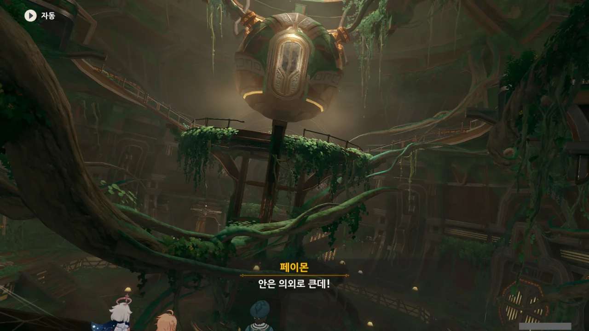

> 안은 의외로 큰데!

어어, 페이몬 그 대사는 안 된다.

&nbsp;

이 장면이 PV에서 나왔을 때는 여기가 수메르 아카데미아의 연구시설인 줄 알았다. 그런데 켄리아의 유적 헌터 내부였네.

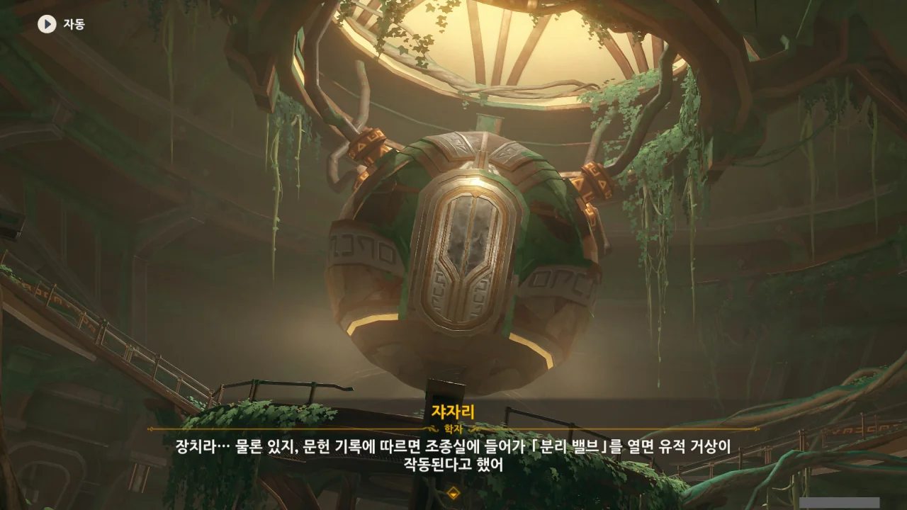

분리 밸브가 뭔지는 모르겠지만, 가운데 있는 저 구체가 조종실인 건 알겠다.

어째 생긴 모양이 둠가이가 걷어찬 후 '내가 포탄이 될게'라고 말할 것처럼 생겼지만.

긴 이야기를 요약하면, '예비 동력을 이용해 전력을 복구하세요'가 된다.

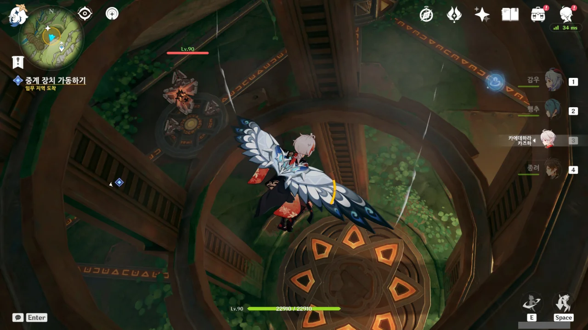

엘리베이터 통로를 따라 내려가니 날 반겨주는 유적 기계 병사.

대놓고 '여행자 왔는가?'라고 말하듯이 놓여 있어 나도 모르게 웃음이 튀어나왔다.

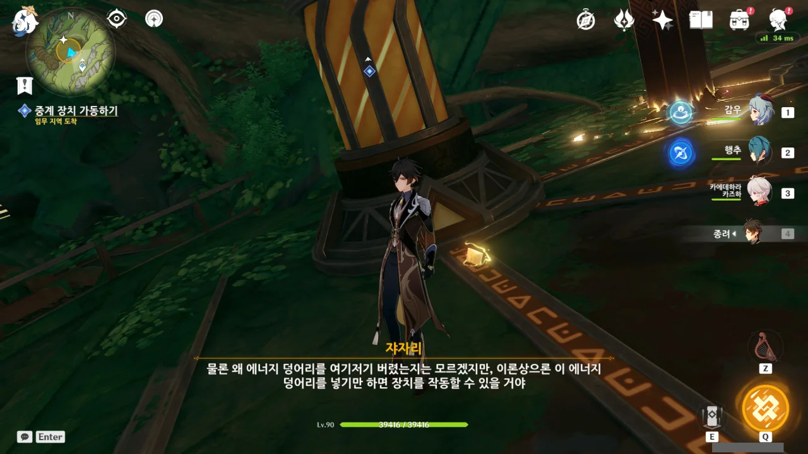

예비 에너지원을 아무렇게나 바닥에 내버려 두는 켄리아의 기상.

좋게 생각해, 무슨 충격으로 인해 보관된 장소에서 튀어나왔다고 가정하더라도, 이건 너무 많이 흩어져 있잖아.

예비 에너지원을 하나 꽂았는데, 아무래도 이게 다가 아닌 것 같다. 어... 그러니까 모든 곳에 예비 에너지원을 꽂으란 거지? 이거 퍼즐이지?

하지만 이게 나무의 꿈속에 들어가 붕쯔붕쯔하는 것보단 훨씬 낫다.

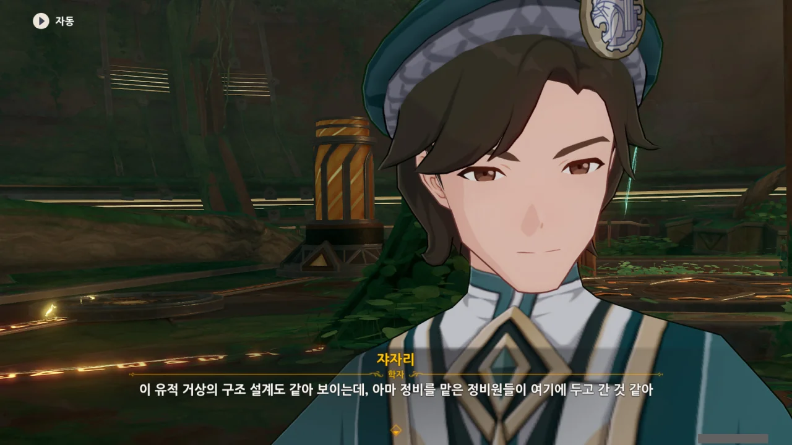

이 유적 거상 정도면 전략 병기 아냐? 그런 병기의 설계도를 이런 곳에 아무렇게나 내버려 뒀다고?

켄리아인의 자신감은 하늘을 찌르다 못해 아주 썩어 흘러넘치나 보다.

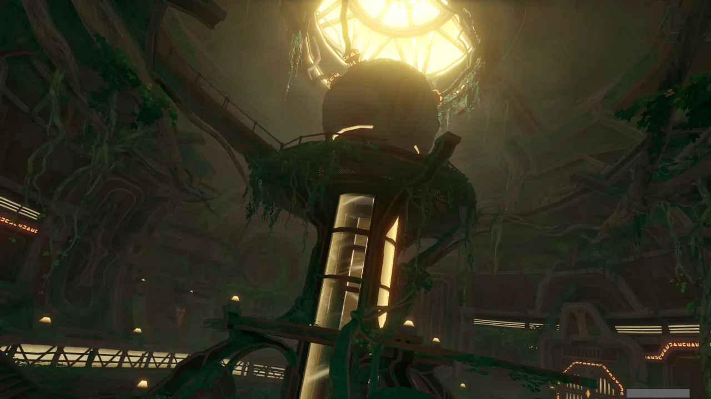

어찌 되었든, 최하층에 있던 모든 중계 장치를 연결하니 불이 들어온다.

이게 어떤 느낌이냐면, 윈터 솔저에서 실드에 옛 벙커에 들어가니 불이 틱틱 켜지고 컴퓨터 테이프가 빙글빙글 돌아가는 걸 보는 느낌이다.

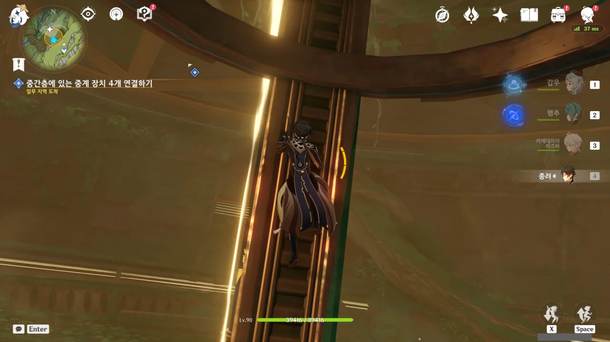

그런데 위로 다시 어떻게 올라갈지 모르겠다. 벽을 타고 올라가는 건 확실히 아니다.

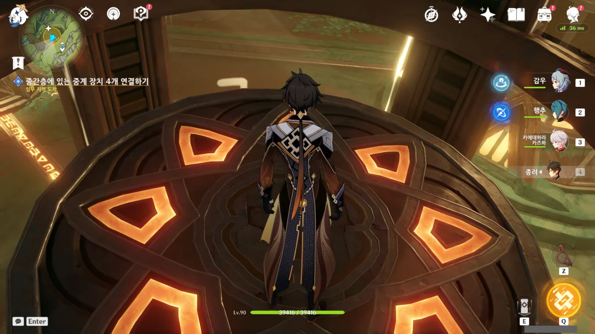

알고 보니 바닥에 엘리베이터 호출 버튼이 있었다. 아니, 그런 건 바닥이 아니라 벽에 붙여 놔야지...

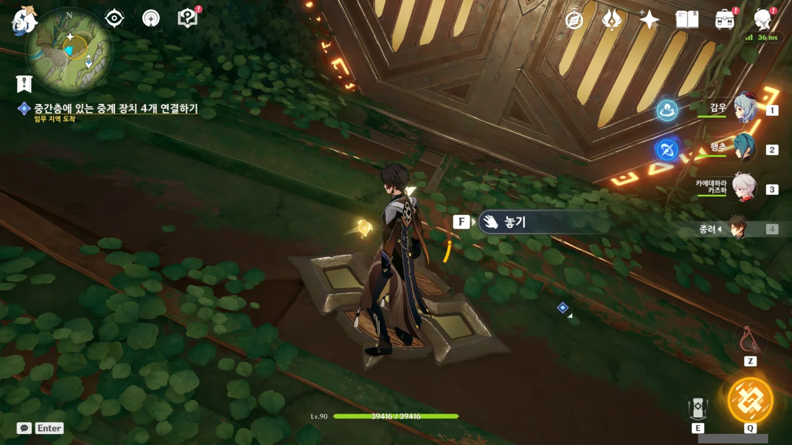

중간층 역시 퍼즐이 있었다. 이번에는 곳곳에 흩어져 있는 보조 에너지원 4개를 모아 중계 장치 네 곳에 넣는 일이다. 그런데 이렇게 보조 에너지원을 두 개 이상 필요로 하는 문이 있어, 그리 쉽지는 않았다.



누군가의 사망 기록이다. '백조 기사'라고 하니 왠지 몬드가 생각나는데...

이 사람은 중상으로 인한 다발성 장기 부전 탓에 죽었다고 한다. 너무 심각한 상처를 입어 몸 안의 장기가 하나하나 죽어버린 것이다.



이 사람은 반란을 일으켜 기계 한 대를 망가트리고 총사령관의 왼쪽 눈을 잃게 했으나, 총사령관에 의해 사살당했다고 한다.

그래도 한때 같은 기사라고, 총사령관은 반란을 일으켰음에도 이 사람을 기사식 장례를 치러줬다고 한다. 정말 대인배네...

'최후의 동포'라는 말이 나온 것으로 보아, '백조 기사'는 켄리아의 기사를 칭하는 호칭으로 추측된다. 켄리아가 500년 전 멸망한 후, 유적 헌터에 탑승했던 기사들이 이곳에서 최후를 맞이한 모양.

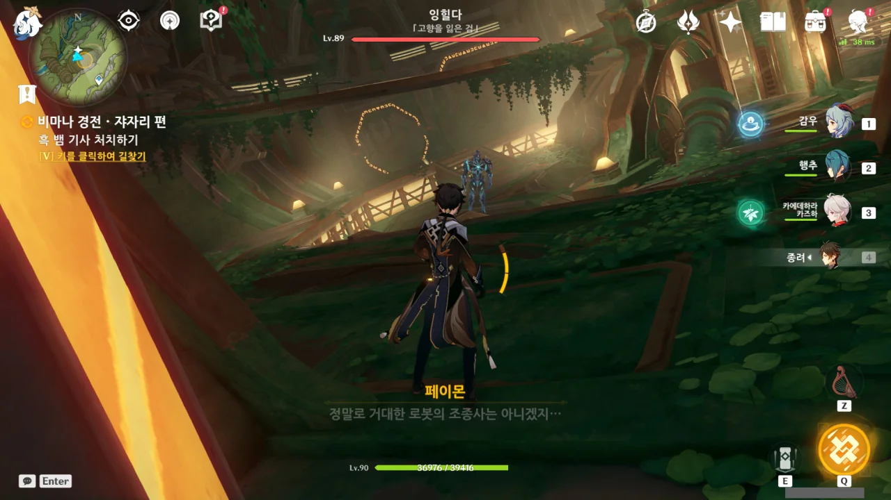

중계 장치를 모두 연결하니, 갑자기 '잉힐다'라는 이름의 흑 뱀 기사가 나타났다. 500년 전에 다 죽은 거 아니었어?

아무튼 적이니까 곧바로 썰었다.

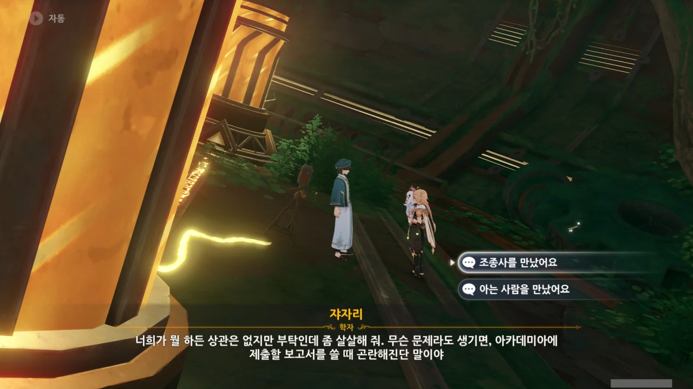

방금 만난 흑 뱀 기사는 500년 전 죽은 켄리아 백조 기사의 망념이 아니었을까?

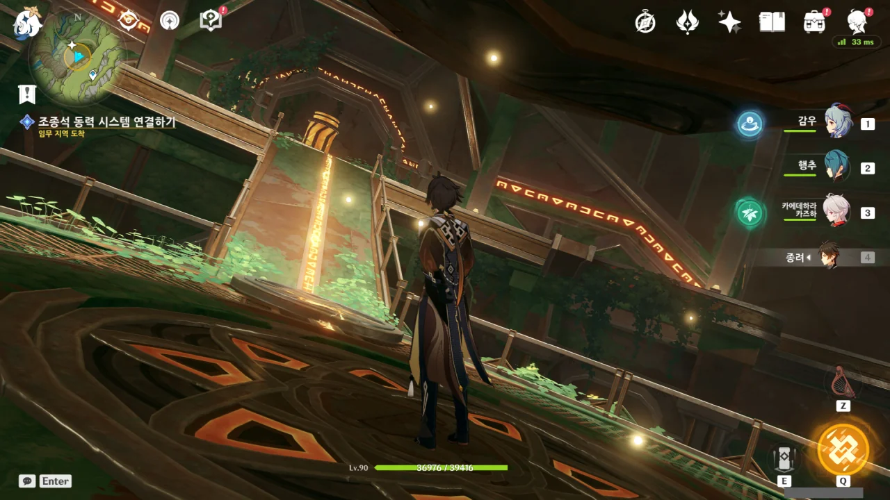

상층부 역시 퍼즐로 되어 있었다. 그래도 이번 퍼즐은 보조 에너지원 2개로 하는 쉬운 퍼즐이었다.

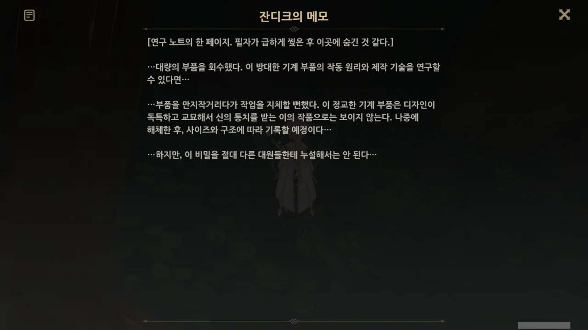

잔디크가 누구인지는 잘 모르겠지만, 비밀이랍시고 기계 부품 연구를 다른 대원들에게 숨기는 걸 봐선 뭔가 뒤가 구린 사람 같다.



잉힐다는 어둠의 마수와 싸우다 실종되어, 남은 물건으로 장례를 치렀다고 한다.

그 잉힐다, 방금 내가 썰었는데.

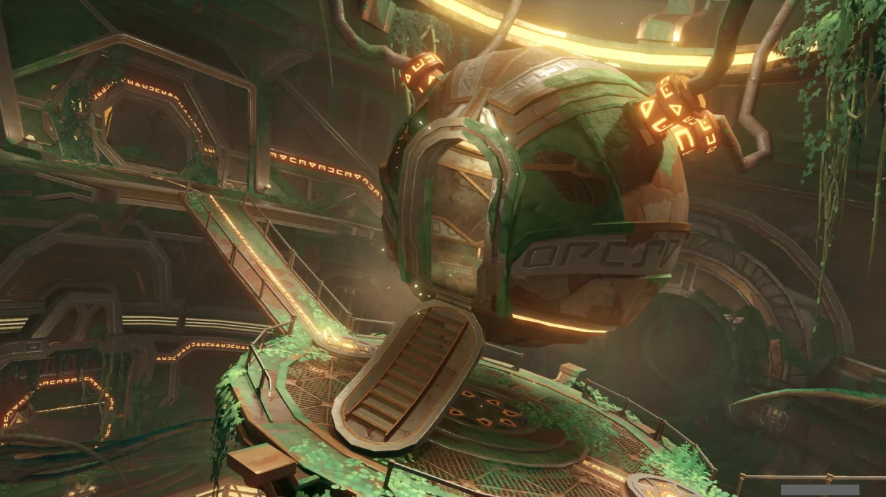

상층부의 중계 장치도 마찬가지로 모두 연결하니 조종실의 문이 드디어 열린다.

가운데 부분이 열릴 것으로 생각한 내 예상 그대로였다.

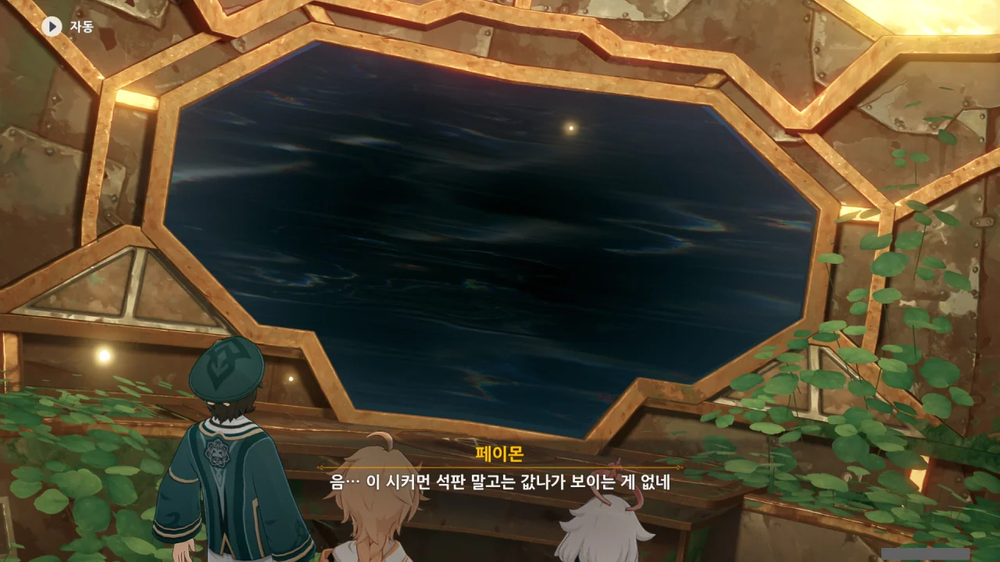

저 '검은 석판'은 바깥을 보여주는 모니터일 것이다.



역시나.

??? 텅 빈 화면에는 'Enter 공격'이라는 문구밖에 없다. 그마저도 한 번 눌러보니 쟈자리가 멈추라고 말하는데, 정작 화면 조작을 멈추고 쟈자리에게 말을 걸어봐도 별다른 반응이 없다.

공격하는 게 맞는 거 같은데... 그럼 뭐다?



&nbsp;

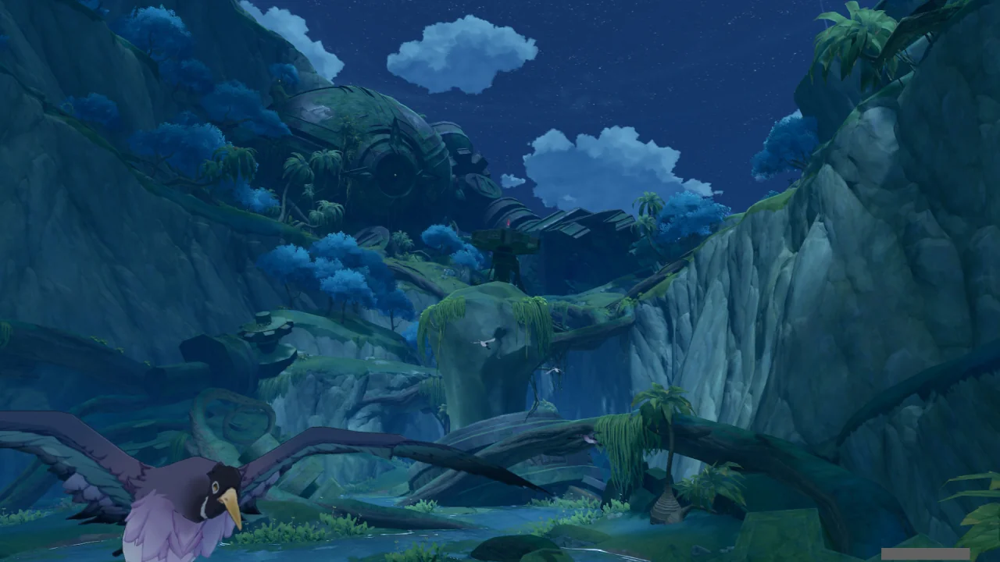

오오... 새가 도망가는 걸 보니, 정말로 유적 거상이 움직이려나 보다.

그런데 난 이 유적 거상이 눈에서 레이저 빔을 퓨슝 하고 쏠 줄 알았는데, 아닌가 보다.

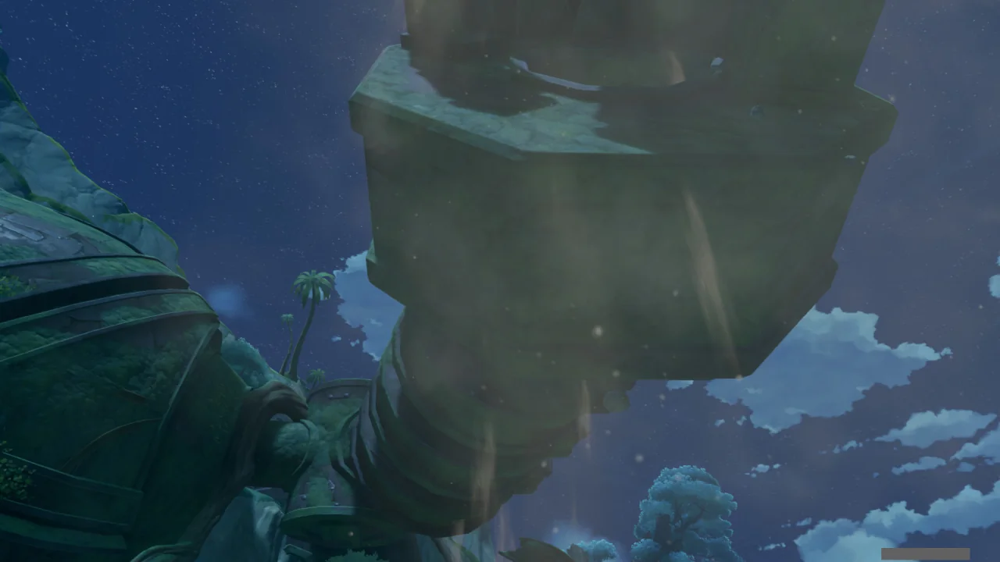

유적 거상이 팔을 천천히 들어 올린다. 오오, 설마 팔로 물리적 공격을 하려는 걸까?

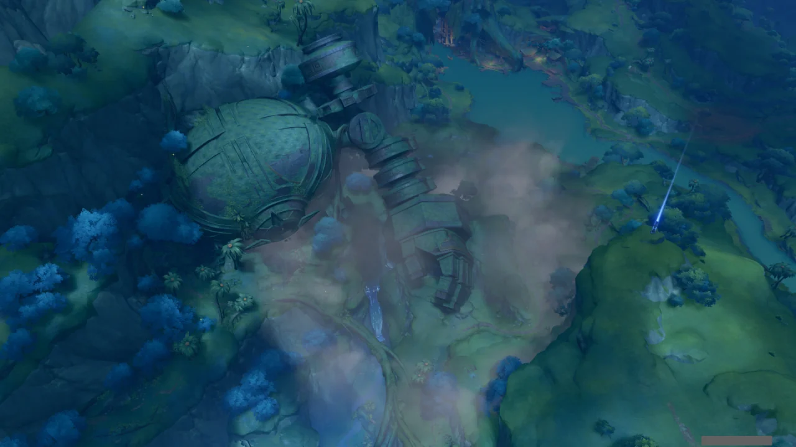

하지만 팔을 들어 올리다 말고 팔을 힘없이 털썩 떨어트린다.

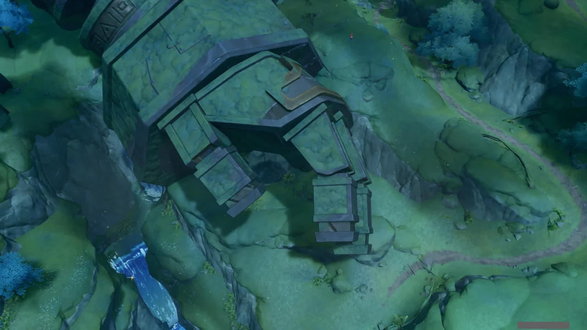

그리고 그 충격 때문에 땅 밑으로 향하는 구멍이 뚫린 것 같다. 손 사이에 둥근 구멍이 뚫렸다.

&nbsp;

어... 그러니까 지금까지 한 모든 게 그저 유적 거상의 팔을 한 번 들었다 내려놓기 위함이었다고?



이건 내가 잘못한 게 아니라, 유적 거상이 고장 난 탓이다. 애당초 Enter 키로 공격밖에 할 수 없었다고?





이 유적 거상은 더 이상 작동하지 않을 것 같아, 이번 의뢰는 여기서 일단 끝이라고 한다.

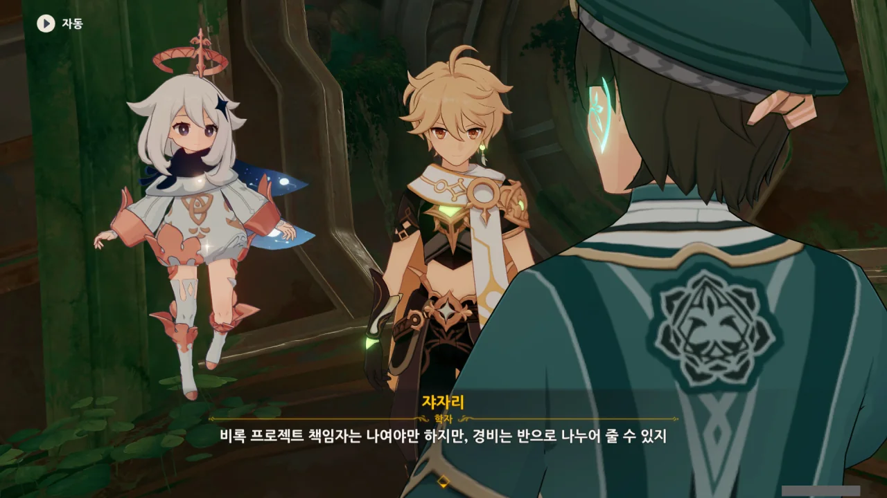

쟈자리는 말하는 게 묘하게 사람 속을 긁는다. 본인은 악의가 전혀 없겠지만, 듣는 사람의 속을 잔뜩 긁는다고 해야 할까?

아란나라가 쟈자리를 수상하다고 말한 것과는 달리, 그냥 유적 거상을 연구하는 연구자로밖에 보이지 않는다. 좀 싸가지가 없는 것 빼고는.

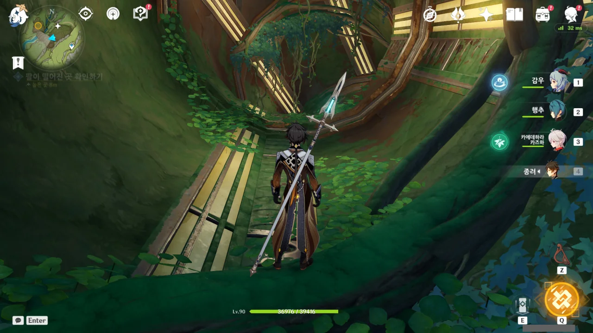

미니맵을 보건대, 여기는 아까 유적 거상이 떨어트린 팔의 내부인 것으로 보인다.

팔 내부가 비어있는데 충격에 찌그러지지 않은 걸 보면, 유적 거상의 재료는 굉장히 튼튼한 것 같다.



웁스. 아란리캔이 꽃을 심은 후, 여기서 계속 여행자를 기다리다가 유적 거상의 손에 맞을 뻔했다고 한다.

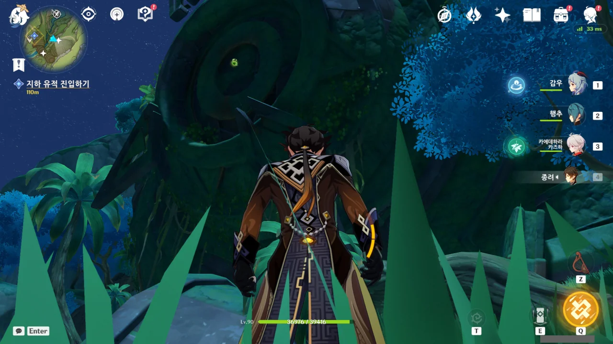

유적 거상의 눈 부위에 잃어버린 풀의 신 눈동자가 있네. 위치 선정이 아주 죽여준다.

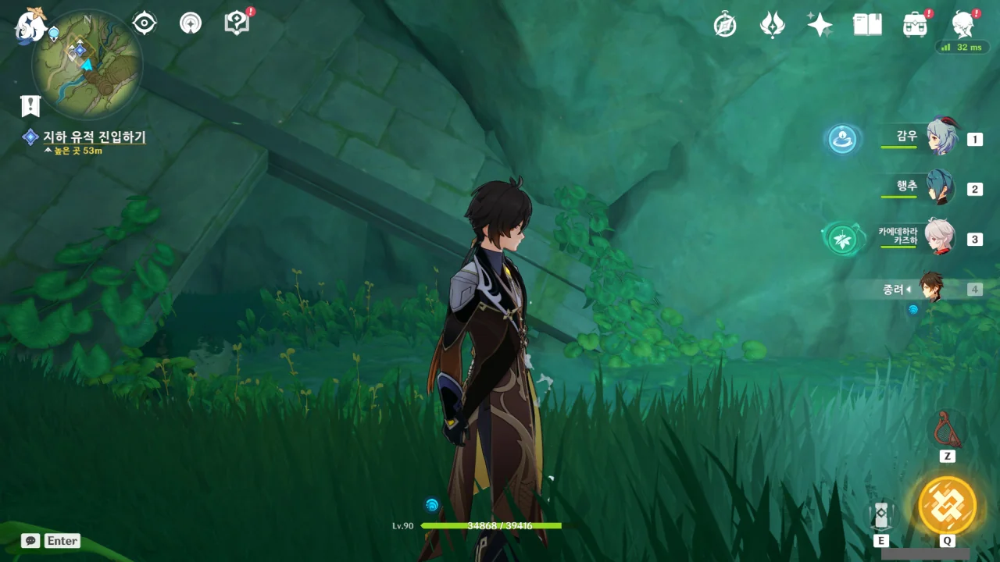

일단 유적 거상으로 뚫은 구덩이로 내려오긴 했는데... 길이 없다?

알고 보니, 너무 깊이 내려온 것이었다.

이 밑에 이 월드 임무를 하게 된 이유가 있다. 무슨 동력원이 숲을 오염시킨다고 했던 것 같은데...

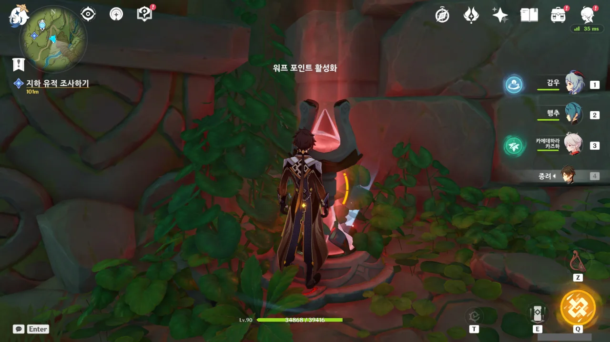

와, 모든 워프 포인트를 다 열었다고 생각했는데, 아직도 워프 포인트가 남아 있었구나.

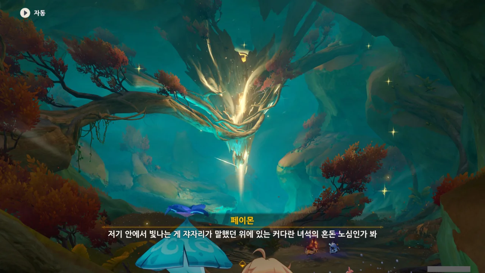

저 혼돈의 노심이 지금 숲을 오염시키고 있다. 그럼 꺼야지, 뭐.

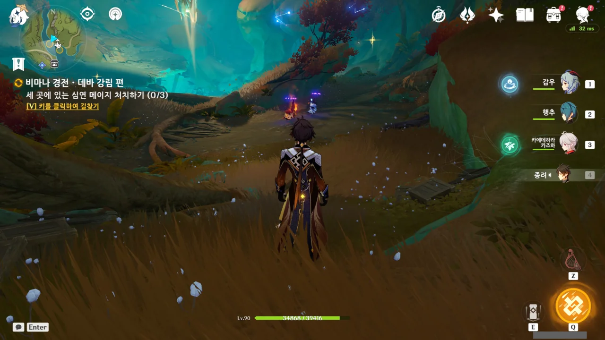

티바트에서 뭔가 나쁜 일이 일어났을 때 그 배후로 심연 교단, 우인단, 츄츄족 셋 중 하나를 꼽으면 높은 확률로 들어맞는다.

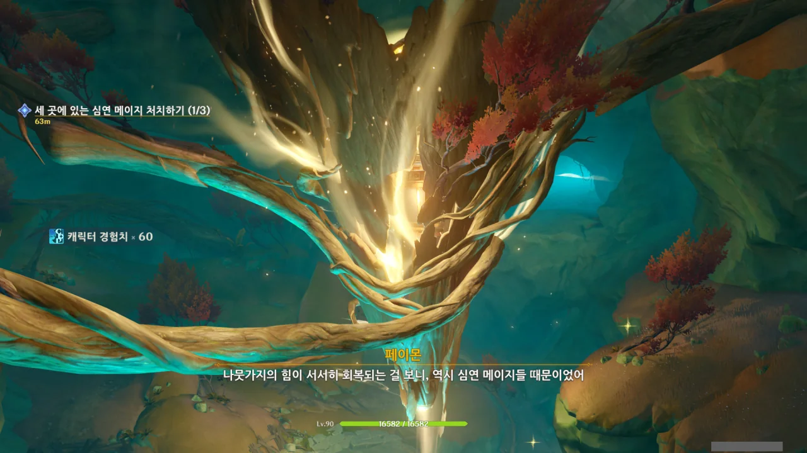

심연 메이지를 썰어버리니, 혼돈의 노심 봉인이 다시 강화되고 있다.

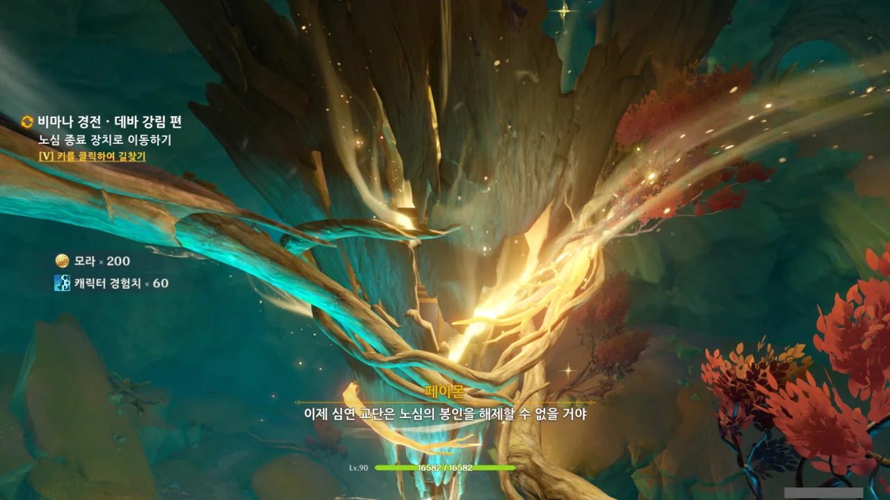

당연하지. 다 썰어버렸으니까.

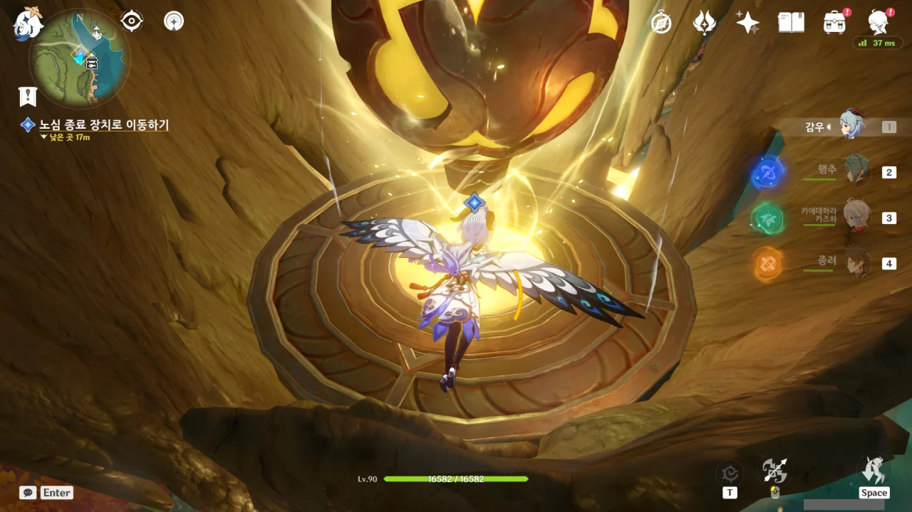

아직 노심이 작동 중이기에, 직접 끄러 내려간다.

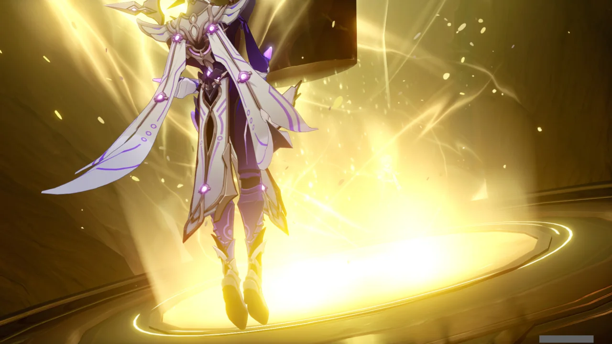

아니 젠장, 넌 또 누구세요.

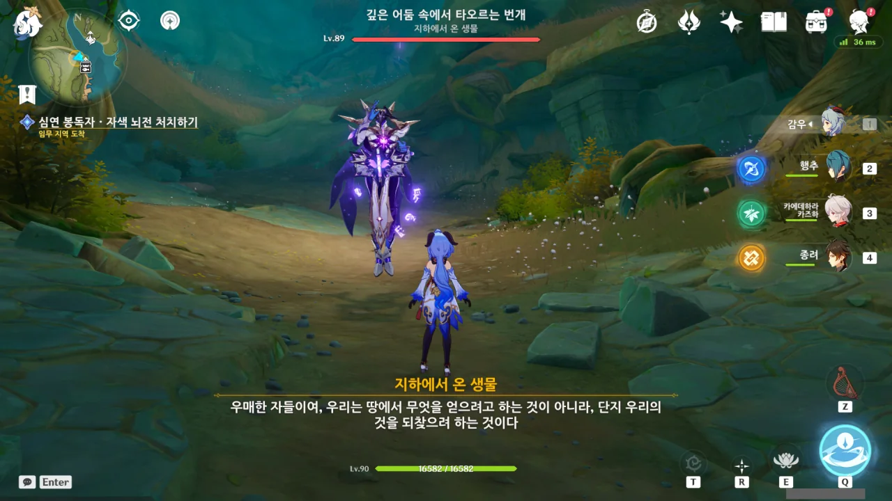

난 저 번개 봉독자가 정말 싫다.

&nbsp;

예전에 나선 비경은 거들떠보지도 않았을 때, 이벤트에서 번개 봉독자를 처음 만났다.

그때 파티 조합이 아야카, 행추, 라이덴, 바바라 이렇게 넷이었는데, 심연 봉독자 돌이 나와서 내 캐릭터 셋을 순식간에 썰어버렸다. 기억이 맞는다면, 하나는 불 봉독자였고 다른 하나가 번개 봉독자였을 거다.

바바라 혼자 살아남은 채, 되지도 않는 짤짤이 딜로 애써 봉독자 둘을 공격하고, 대시 무적으로 봉독자의 공격을 피하고, E 스킬로 체력을 채우며, 궁으로 파티를 살렸다. 되살아난 파티가 또다시 봉독자에게 죽으면 바바라는 또다시 외로운 도주와 싸움을 계속해야 했다.

체감상 30분은 그 방에서 고생했던 것 같다. 이후 심연 봉독자는 보기만 해도 이가 북북 갈린다.

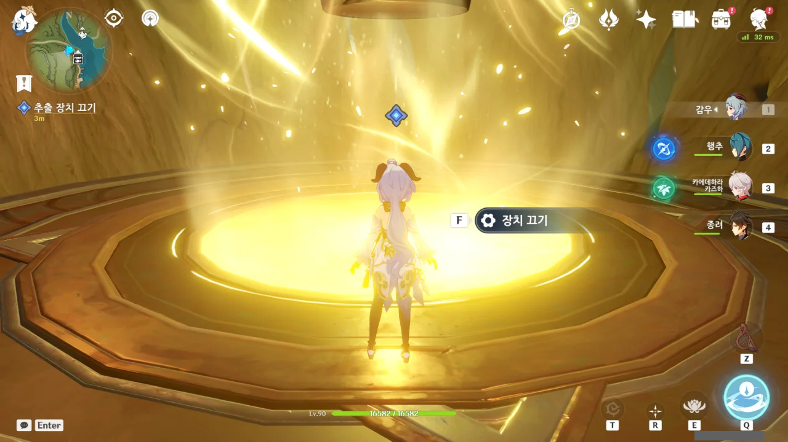

아무튼, 번개 봉독자도 썰어버리고 다시 노심으로 가 추출 장치의 전원을 껐다.

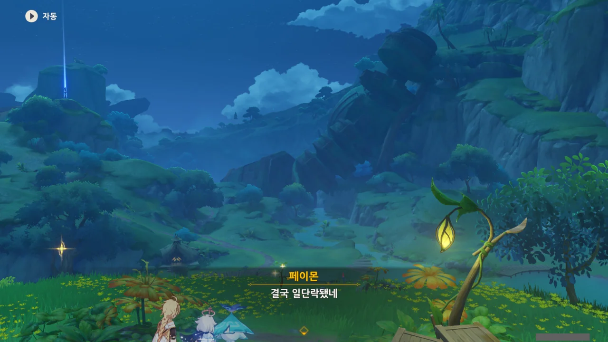

비마나 경전 임무가 대충 완료되었다. 정말 정신없네.

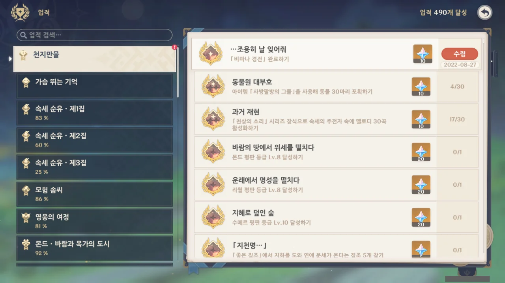

> ... 조용히 날 잊어줘
{.bq}

이건 대체 누구에게 하는 말일까?
