월드 임무가... 끝나지 않아... 살려줘...

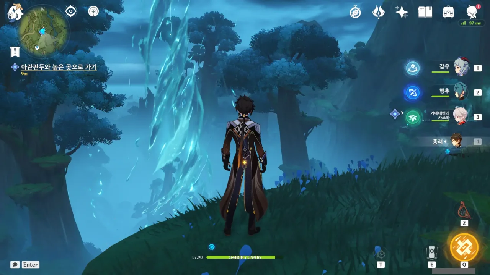

아란나라와 함께 하는 대모험은 여전히 계속되고 있다.

저 물기둥, 회전하는 모습이 왠지 가까이 갔다간 그대로 다짐고기가 될 것만 같다.

&nbsp;

그런데 저 장면도 PV에 나왔었던가?

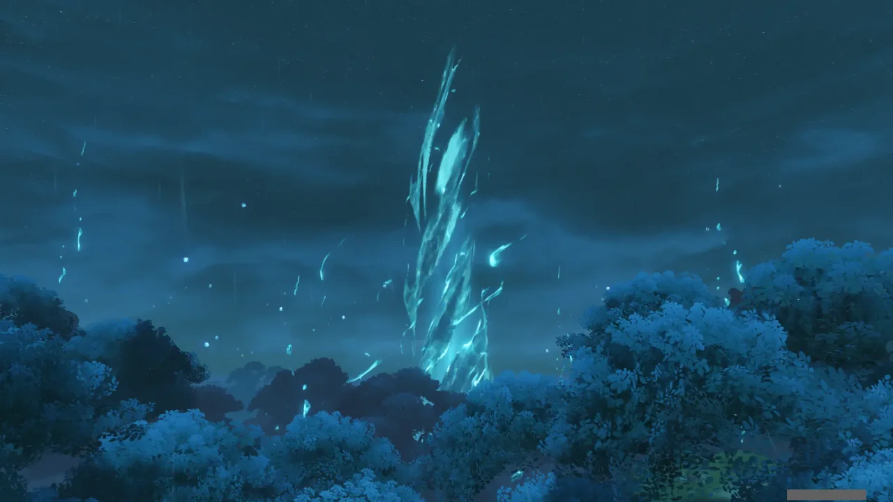

뭐지? 분명 여기 왔을 때 물기둥이 있는 걸 봤는데, 컷신에서는 없던 물기둥이 생겨나는 모습을 보여준다.

내가 너무 빨리 와서 그런 거야?

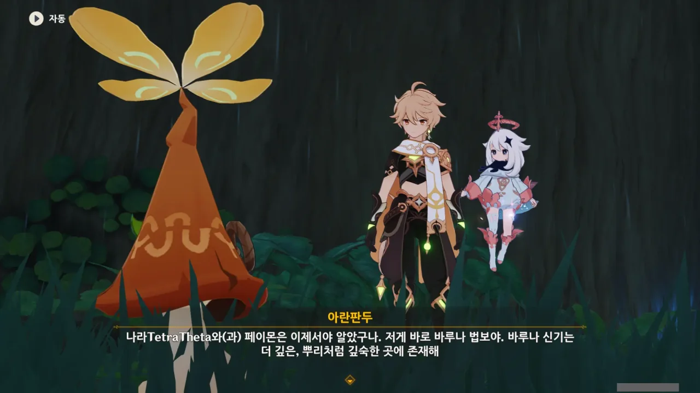

저 물기둥 밑에 우리가 찾는 바루나 신기가 있다고 한다.

그런데 대체 '바루나 법보'와 '바루나 신기'에는 무슨 차이가 있는 거야? 둘 다 같은 걸 말하는 거 아니었어?

아란판두가 말하는 걸 들어보면 저 구조물 전체가 바루나 법보이고, 바루나 신기는 지하 깊숙한 곳에 존재하는 것만을 말하는 것 같은데...

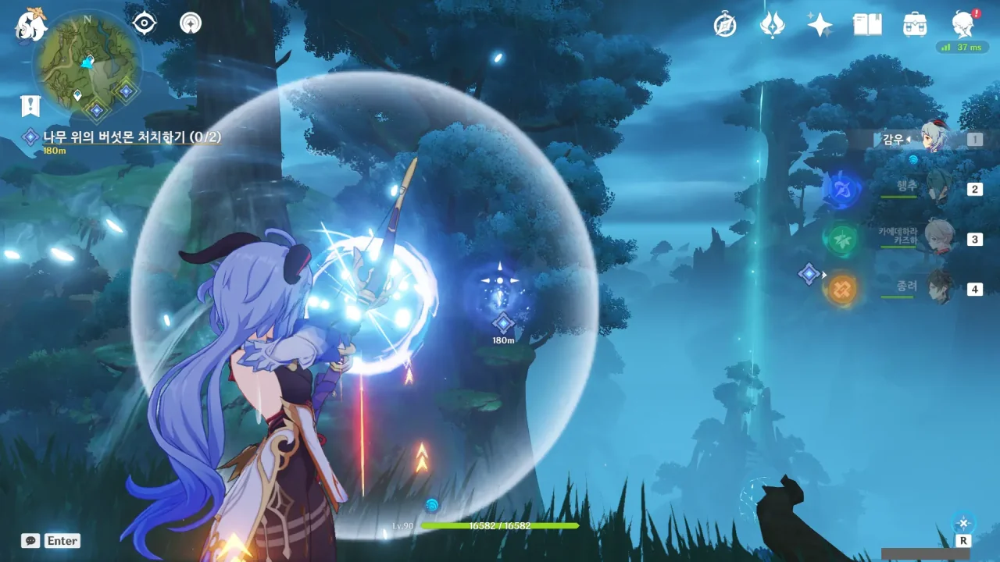

나무 위에 있는 버섯몬을 감우의 장거리 저격으로 처리할 수 있을까 궁금해서 실험해 보았다.

감우의 다음 화살이 날아가는 사이, 전투가 풀려 버섯몬의 체력이 다시 회복된 후 화살에 맞아 전투에 진입하는 것이 계속 반복된다.

이럴 때는 아모스가 굉장히 갖고 싶어진다. 분명 아모스의 특성이 화살의 비행시간에 비례해 추가 대미지가 들어가는 것이었지? 그 추가 대미지면 분명 저 버섯몬을 한 번에 처리할 수 있었을 텐데.

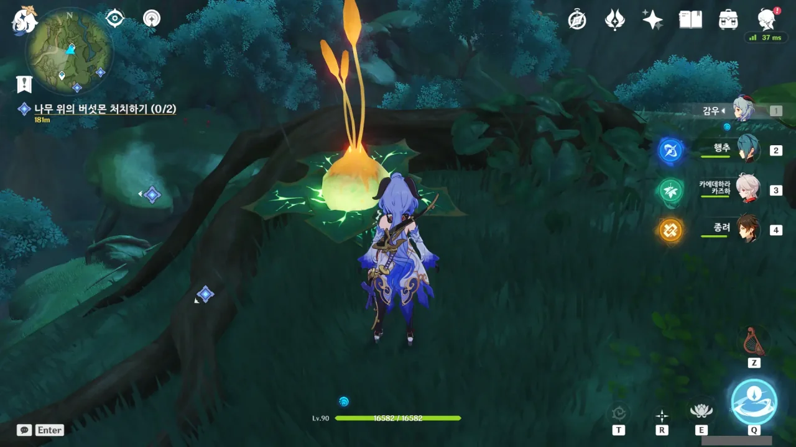

이 클로버 인장 주머니는 공중에서 입체 기동을 할 수 있도록 해주는 고마운 존재이지만, 반드시 풀 원소로 공격해야만 활성화한다는 게 조금 불만이다. 지금 파티에 풀 원소 캐릭터가 없기 때문에, 콜레이 등을 꺼내야만 하거든.

게다가 지금 같은 경우에는 반드시 이 클로버 인장 주머니를 활성화해야만 다음 플랫폼으로 넘어갈 수 있다.

&nbsp;

아직도 20레벨인 콜레이를 꺼내 들어야만 했다.

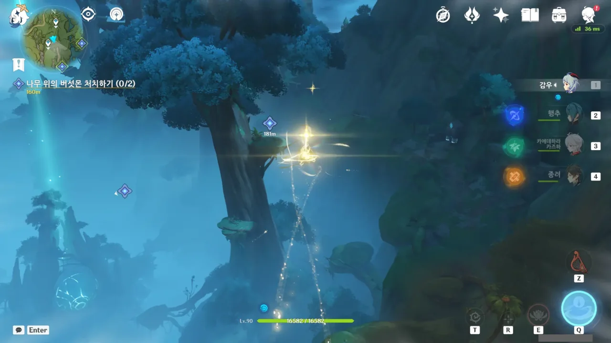

그래도 이렇게 클로버 인장을 타고 날아가는 장면은 굉장히 멋지다.

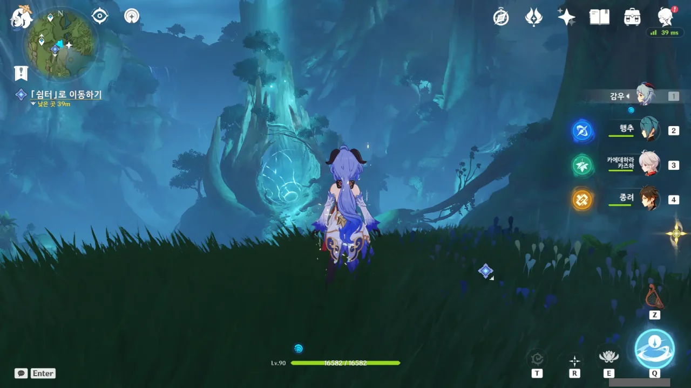

주변에 있던 버섯몬을 싹 다 잡아 없애니 소용돌이치던 물기둥이 사라졌다.

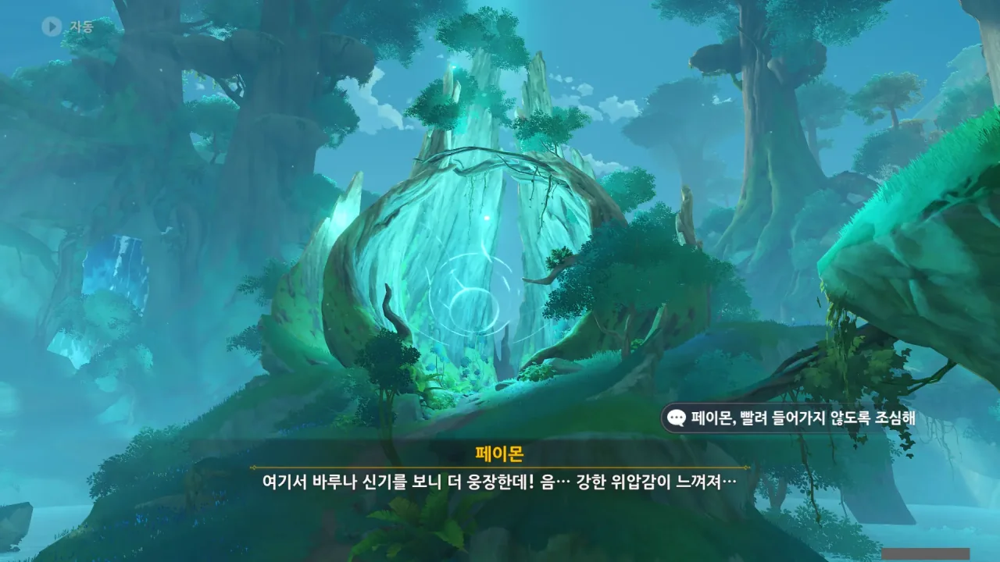

그냥 '바루나 법보'와 '바루나 신기'는 같은 말인가 보다.

왜 수메르에는 양파를 연상시키는 것이 이렇게나 많은 걸까? 양파는 건강에 좋으니 많이 먹으라는 의미인가?

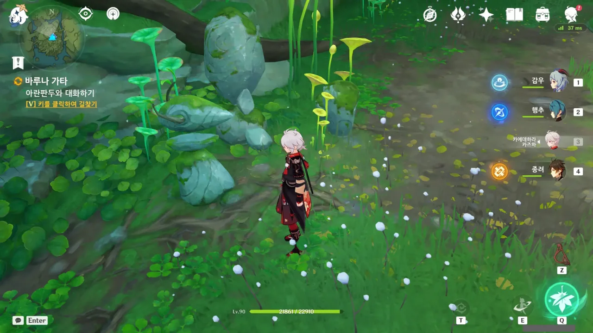

문을 열기 위해 '꼭지'를 열심히 돌린다.

저 장치를 표현하는 정식 단어가 있었던 것 같지만, 저 모양을 보자마자 '꼭지'라는 단어가 머릿속에 단단히 박혀버렸다.



밑으로 가는 길이 열린다.

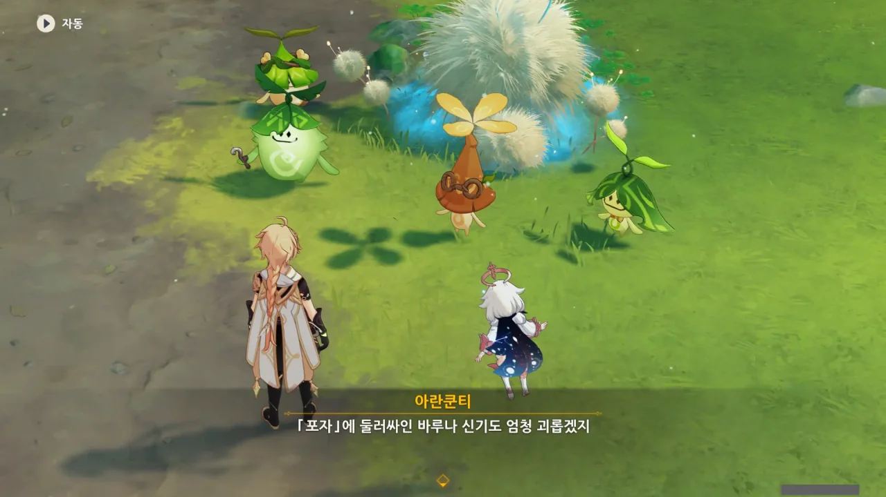

무슨 솜털 같은 것이 잔뜩 자라있는데, 이게 버섯 포자라고 한다. 그러면 불에 태우면 되는 건가?

포자를 치우려니 버섯몬이 하나 튀어나와, 그걸 한참이나 쫓아다녀야 했다. 그런데 결국 도착한 곳이 한 바퀴 돌아 다시 여기더라.



버섯몬을 잡고 나니, 드디어 바루나 법보를 복구할 수 있었다.



누군가의 실험 기록이다.

여기 근처에 있는 마을은 비마라 마을이 유일한데, 거기서 사람들을 납치해 생체 실험을 했다. 납치된 사람 중 아이들은 전부 실험 전 사라졌지만, 성인들은 꼼짝없이 생체 실험의 대상이 되어야만 했다.

&nbsp;

저번에 비마라 마을에서 아이들이 실종되었다 돌아온 적이 있었다고 하지 않았나? 설마 그 이야기는 아니겠지.

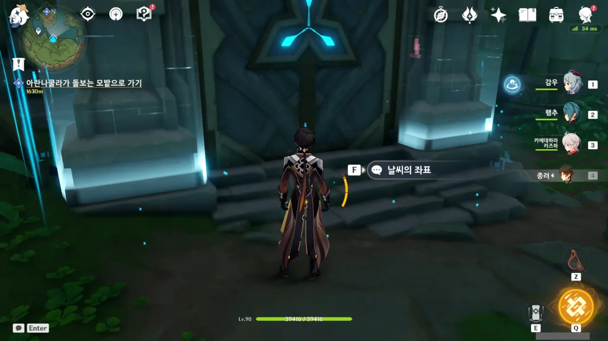

아, 이 비경이 이렇게 오는 거였어?

예전에 지도를 밝히려 했다가 도저히 어떻게 지하로 내려가는지 몰라 포기했던 비경이 바로 여기에 있었다.

이것으로 모든 워프 포인트와 비경을 열었다고 말하고 싶지만, 이전처럼 월드 임무를 통해 진입한 새로운 지역에 또 다른 워프 포인트나 비경이 나타날 수도 있다.

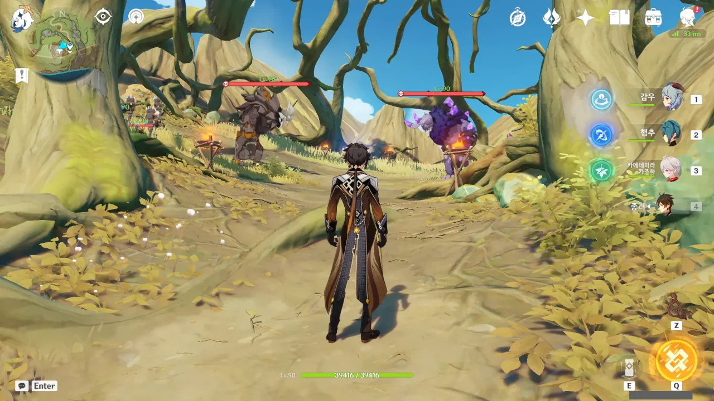

신의 눈동자를 모으기 위해 다흐리의 폐허에 왔다가 츄츄왕 둘이 서로 마주 보고 있는 장면을 발견했다.



아무리 봐도 저 장면을 패러디한 것 같은데...

그래서 둘이 과연 언제 싸울까 하염없이 기다려 보았다. 그런데 5분이 넘도록 서로 노려보기만 하고 싸우질 않아, 그냥 둘 다 잡았다.

츄츄왕 뒤에는 츄츄왕과 동일한 원소의 츄츄 샤먼 여럿이 응원이라도 하듯 서 있더라고.

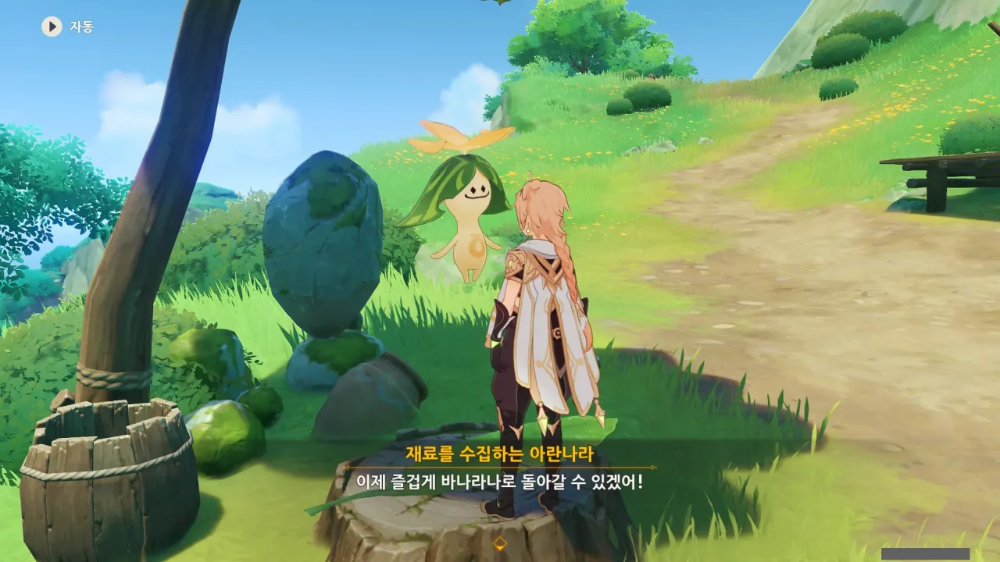

바나라나에서 열리는 축제에 참여하기 전, 수메르 우림 전역에 흩어져 있는 아란나라 64마리를 모두 바나라나로 돌려보내면 컷신에서 나타나는 아란나라의 숫자가 그만큼 늘어난다는 이야기를 들었다. 나중에 나오는 상자를 더 많이 열 수 있다고도 하고.

그래서 아란나라를 열심히 찾아다니는 중이다.

처음에는 64마리 전부를 만나려고 했는데, 일부 아란나라의 위치가 현재 내 진행도로는 도달할 수 없는 지역에 있어, 포기했다.

그래서 다시 월드 임무로 돌아갔다. 월드 임무를 하면 진행도가 올라가 아까 갈 수 없었던 곳도 갈 수 있게 되겠지.

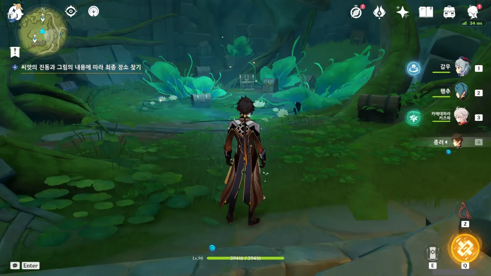

응? 지금 왜 여기서 상자가 나와? 상자는 축제가 다 끝나면 열 수 있는 거 아니었어?

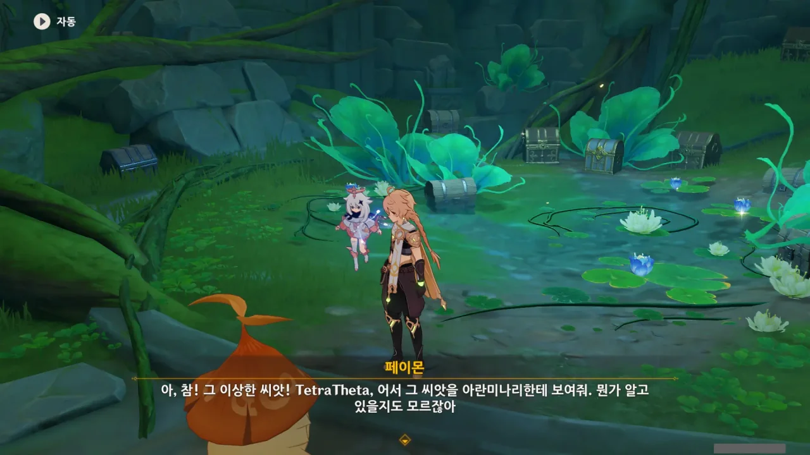

아란미나리와 대화하다, 옛날 층암거연에서 우연히 얻은 씨앗을 아란미나리에게 주게 되었다.

그 씨앗을 처음 얻은 곳이 층암거연의 다른 곳과는 다르게 나무와 풀, 버섯이 자라는 곳이어서 나중에 수메르에서 씨앗을 쓸 것 같다고 생각했었는데, 그게 지금이 될 줄이야.



씨앗을 물에 넣으니 아란나라가 되었다. 아란나라도 식물이었어?

그림으로 상자를 찾는 퍼즐을 풀 때, 페이몬이 '위험에 처한 아란나라가 있을지도 모른다'라는 핑계를 댔는데, 그 말이 정말일 줄이야...

그 아란나라가 여태껏 여행자 배낭 속에 있었다는 것이 제일 의외다.





층암거연까지 간 아란님바는 검은색 오염을 만나 위험에 빠졌고, 위기에서 벗어나기 위해 씨앗으로 변했다고 한다. 그걸 여행자가 주워서 수메르까지 온 것이고.



돌아온 지 얼마 되지도 않았는데 또 모험을 떠나는 아란님바. 이번에는 풍경을 그린 그림 말고도 선물도 같이 아란미나리에게 보내겠다고 한다.

여기 있는 보물상자는 전부 아란미나리의 것이라고 한다.





그러니까 아란나라를 많이 도와줄수록 보물상자에 보물을 많이 넣어두겠다는 거지?

'초록색 나라'는 분명 모험가 길드의 모험가를 이야기하는 것 같다.

&nbsp;

> 초록색 나라는 동굴이나 집 안으로 들어가서 「보물상자」 여는 걸 좋아하던데. 나라 여행자랑 페이몬은 싫어?

아니, 굉장히 좋아해. 아주 좋아해. 늘 새로워. 늘 짜릿해.

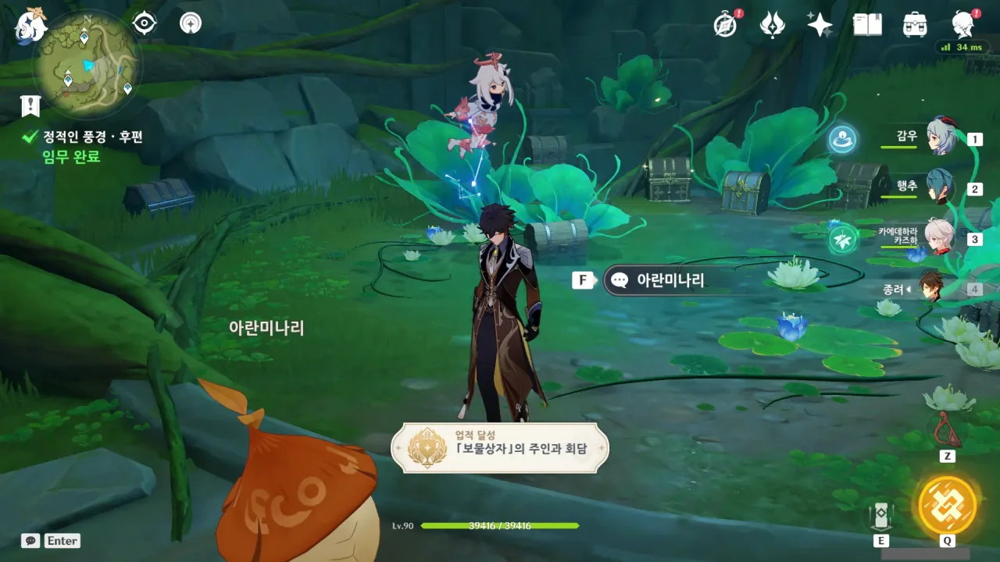

'「보물상자」의 주인과 회담'이라는 업적이 깨졌다.

주위를 둘러보니 아직 열 수 없는 보물상자가 조금 보인다. 이 상자들은 모든 아란나라를 바나라나로 돌려보낸 후, 한꺼번에 열자.

분명 지금 여는 것보다 감동이 수십 배는 될 것이다.
