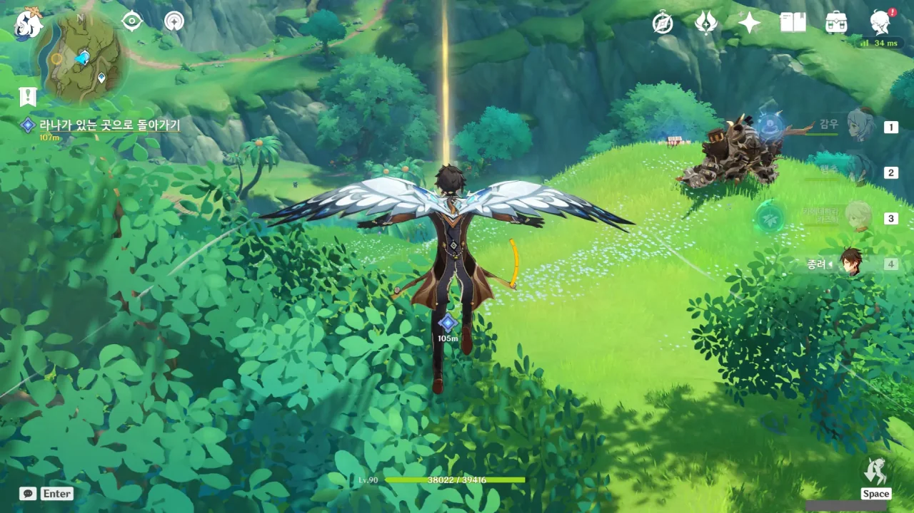
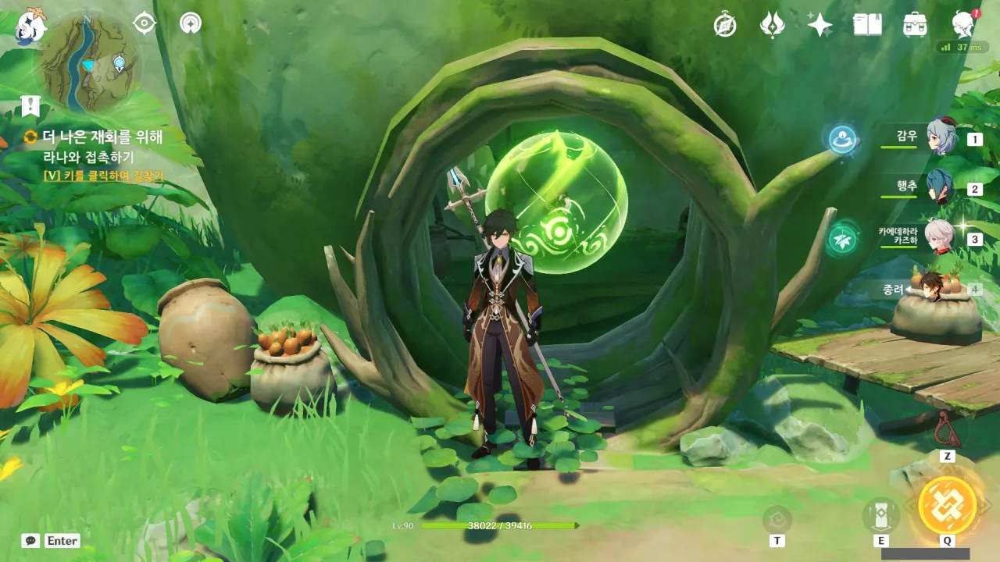
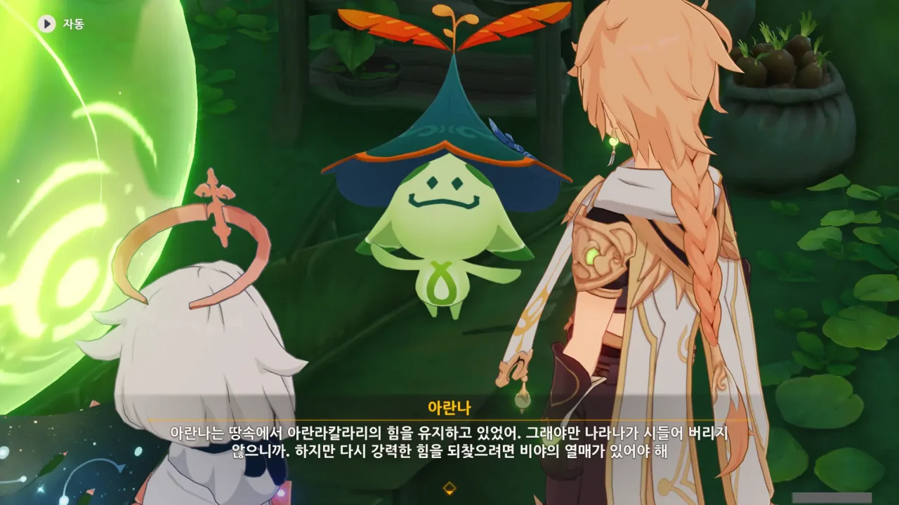
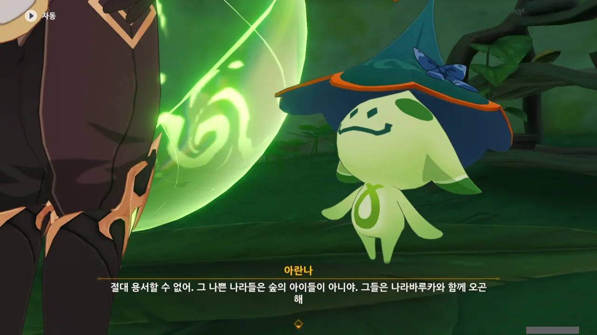
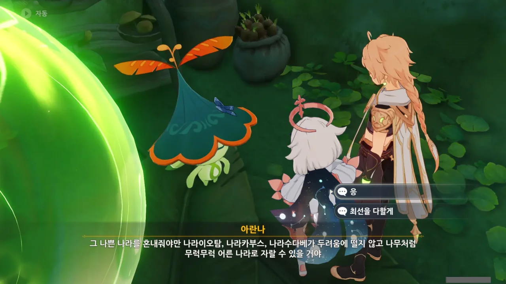
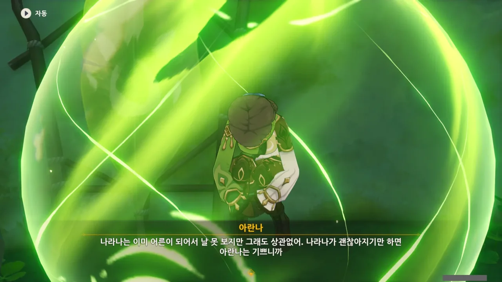

엄밀히 말해 지금 하는 것이 우트사바 축제 전날 밤에 일어나는 건 아니지만, 이번 사진들을 묶어 설명하기에 '전야'만큼 어울리는 단어가 없다.

> 라나가 있는 곳으로 돌아가기
{.bq}

아, 드디어! 드디어 이 '숲의 책' 임무가 시작한 지점으로 돌아갈 수 있어.

머릿속에서 'Ah, finally!'라는 대사가 자동 재생된다.

그런데 여기 아란나라가 하나 있어야 하지 않나? 라나를 구체 속에 가둬두기만 하고 어디 간 거지?

알고 보니 아란나는 땅속에서 절전 모드로 라나의 현재 상태를 유지하고 있었다.

그래. 저 '비야의 열매'를 얻기 위해서 지금껏 이 고생을 해왔던 것이다. 라나를 치유하기 위해서 말이다.





비마라 마을에서 아이들이 실종되었다가 마을로 돌아온 건 아란나가 아이들을 보호한 것이라고 한다. 나쁜 사람과 도금 여단이 아이들을 데려간 걸 발견하자, 그들 몰래 아이들을 다시 데리고 나왔다고 한다.

그러고 보니, 저번에 얻은 실험 기록에서 실험체로 삼기 위해 성인과 아이들을 납치했지만, 아이들이 사라졌다는 기록이 있었다. 아무리 생각해도 그 기록이 이 일을 말하는 것 같은데.

그런데 아이들은 왜 납치된 기억이 없을까?



아이들이 납치된 기억이 없던 까닭은 아란나가 그들의 기억을 일부러 지웠기 때문이다.

아란나의 말에 따르면, 그런 기억을 계속 갖고 있으면 두려움에 떨다 「두려움」의 힘을 믿게 되어 비뚤게 자란다고 한다.

트라우마를 이야기하는 걸까?

정황상 '숲의 아이'라는 건 수메르 우림 지역 출신의 사람을 지칭하는 것으로 보인다.

그렇다면 수메르 우림 지역 바깥에서 온 사람이 도금 여단을 동원해 아이들을 납치했다는 말이 된다.



비마라 마을에 '숲의 아이'가 아닌 '눈의 아이'가 하나 있는데, 심성이 착한 건지 어린아이들과 자주 함께 있다고 한다. 하지만 그는 아까 말한 나쁜 사람과 함께 아란나라에 관해 이야기하기도 했다.

'눈의 아이'라는 건 분명 스네즈나야 사람을 뜻하는 거겠지? 그렇다면 스네즈나야의 스파이가 하나 비마라 마을에 숨어 있다는 말이 된다.



아이들과 잘 지낸다고 하지만, 그것조차 아이들을 쉽게 납치하기 위해 꾸며낸 것일 수도 있지.

이유야 어찌 되었든, 죄 없는 아이들을 납치한 죄는 무겁다.

그래. 그들이 한번 실패했다고 그만둘 것 같지도 않다. 이번 기회에 아주 뿌리를 뽑아 태워버려야지.

라나가 이미 어른이 되어 아란나를 보지 못하게 되었지만, 그래도 라나가 괜찮아지기만 하면 기쁘다고 하는 아란나.

코끝이 찡해진다.



라나는 처음에는 아란나와 비슷한 키였지만, 점차 성장해 감에 따라 키가 커졌고, 작은 나무만큼 커진 후에는 아란나를 보지 못하게 되었다고 한다.



라나에게 그런 이야기를 해준 것이 아란나였구나.

> 그들도 나라나처럼 건강하게 자라면 좋을 텐데. 아, 하지만 나라나처럼 마라나에게 달려드는 건 안 돼!

ㅋㅋㅋㅋㅋㅋ



> 결국 숲이 이 모든 걸 기억할 테니까.

숲의 책 임무를 진행하며 수도 없이 들은 말이다.

> 아무것도 사라지지 않아. 모든 아름다운 것은 사라지지 않을 거고, 모든 고통은 아름다운 것의 영양소가 될 거야.

그런데 왜 이 말을 들으니 불안해지는 걸까?



우트사바 축제의 준비가 모두 끝났다고 한다. 여행자와 페이몬만 가면 된다는 듯하다.

드디어 이 긴 뺑뺑이의 끝이 다가왔다.



라나의 지금 상태를 유지하려면 아란나가 옆에 남아 계속 지켜봐야 한다고 한다.

여행자와 페이몬이 괜히 미안해할까 봐 괜찮다고 위로해 주기까지 한다.



비야의 열매에 아란나의 힘이 필요하다고?

이거 또 불안해지는데. 아란나라에게 있어 힘의 근원은 기억이니까.



아란나에게 꽃을 받았다.

지금껏 만난 다른 아란나라에게서도 꽃을 받았었는데, 아란나에게서도 꽃을 받을 줄 몰랐다.
