오늘도 아란나라 찾기는 계속된다.

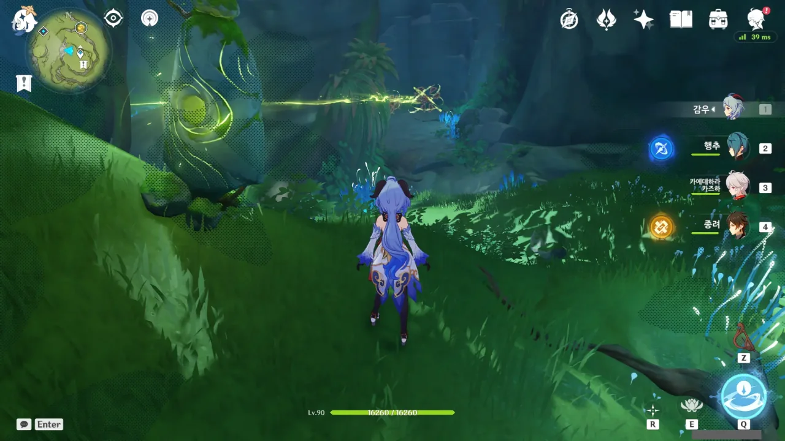

모든 아란나라를 찾기 위해선 이 '바위 자물쇠' 임무도 같이 해야 한다고 한다.

그래서 수메르 전역에 흩어진 16개의 바위 자물쇠를 하나하나 찾아 해제한 후, 자물쇠에 묶여 있던 유적 기계 장치를 잡고 있다.

&nbsp;

저거만 잡으면 얼추 다 잡는 것 같은데.



그 「커다란 쇳덩이」, 내가 이미 다 잡아다 족쳤단다.

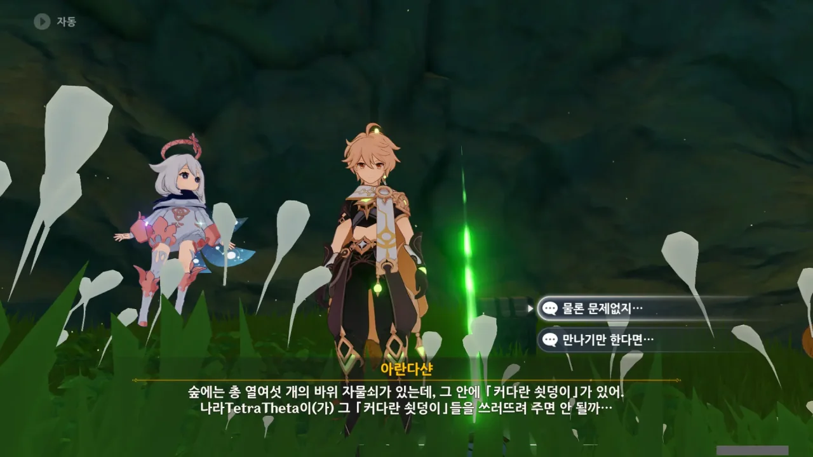

안 그래도 지금 그걸 하고 있었어.



분명 모든 바위 자물쇠를 다 해제한 것 같은데, 임무가 다음 단계로 넘어가지 않는다.

그래서 원신 맵스를 켜고 지도를 뚫어지도록 쳐다보며 대체 어디에 아직 처리하지 않은 바위 자물쇠가 있는지 찾았다.

한참을 찾은 끝에, 데반타카 산 호수 한가운데에 있는 바위 자물쇠를 찾았다. 바위 자물쇠 아이콘 배경색이 호수 색깔과 비슷한 탓에, 찾지 못하고 넘어간 것이었다.

데반타카 산 호수까지 가서 마지막 바위 자물쇠를 처리했다.

&nbsp;

> 아란다샨을 만났던 동굴에는 아마 색다른 「놀라움」이 우리를 기다리고 있을지 모른다.
{.bq}

놀라움... 놀라움보다는 피곤함이 더할 것 같은데.

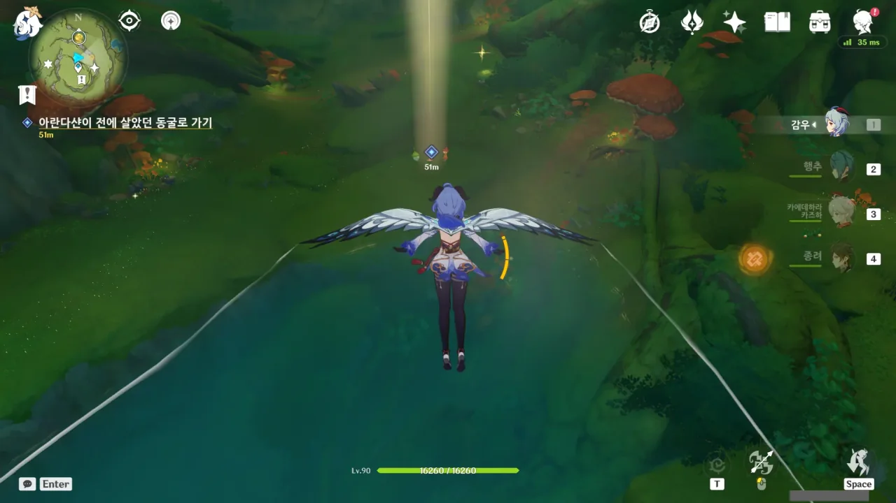

아우, 드디어 찾았다. 어디 있는지 한참을 돌아다녔네.



아란나라의 이름은 너무 외우기 힘들다. 아란사타, 아란사하, 아란유타, 아란나, 아란마 등... 이름 앞에 '아란'이 붙는 것 외에는 죄다 거기서 거기인 이름처럼 보인다.

그래서 그냥 외우는 걸 포기했다.

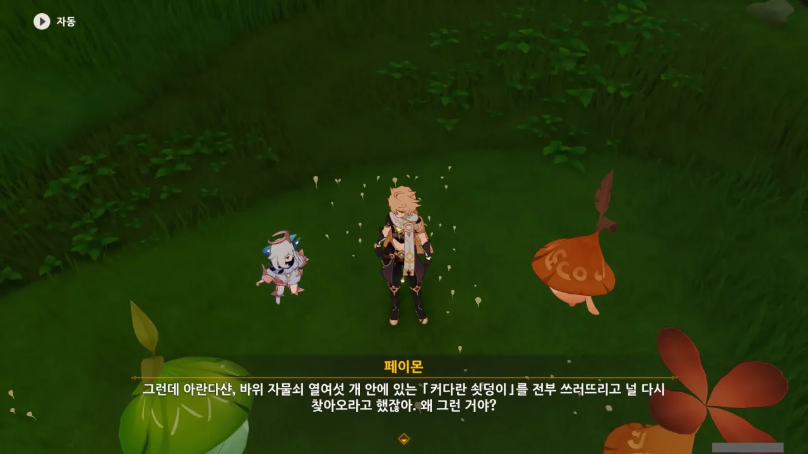

그러게. 그러고 보면 유적 기계 장치들이 왜 바위 자물쇠에 묶여 있는지 듣질 못했다.

심심해서 그렇게 묶어둔 건 아닐 거 아냐.





유적 기계 장치들이 갑자기 나타나 숲을 불태우는 등, 깽판을 치자 아란다샤가 「아란라칼라리」로 수많은 「커다란 쇳덩이」를 쓰러트리고 바위 자물쇠로 묶어두었다고 한다.

그러고 보면 바위 자물쇠에 묶여있던 유적 기계 장치들은 전부 불을 사용하긴 했다. 미사일을 쏘거나, 비행용 엔진 분사구로 말이다.



바위 자물쇠는 영구적인 것이 아니라, 쇠로 된 자물쇠가 녹이 슬면 결국 부서져 버리듯, 시간이 한참 지나면 부서질 수 있다고 한다.

그래서 이 아란나라들은 바위 자물쇠를 꾸준히 관리해 오고 있었다.



하지만 자물쇠를 아무리 관리해도 언젠가는 자물쇠가 풀릴 것이다. 그래서 유적 기계 장치가 풀려나도 잡을 수 있게 아란나라들은 자신의 실력을 갈고닦고 있었다.





「커다란 쇳덩이」는 유적 기계 장치를 말하는 건 알겠는데, 「네모네모 쇳덩이」는 대체 뭐지?

설마 영구 장치 진영은 아니겠지.

&nbsp;

그런데 아란나라들이 말하는 '나라바루나'는 대체 누굴까? 금빛이 번쩍인다고 하는 걸 보면 여행자처럼 금발인 것 같은데...

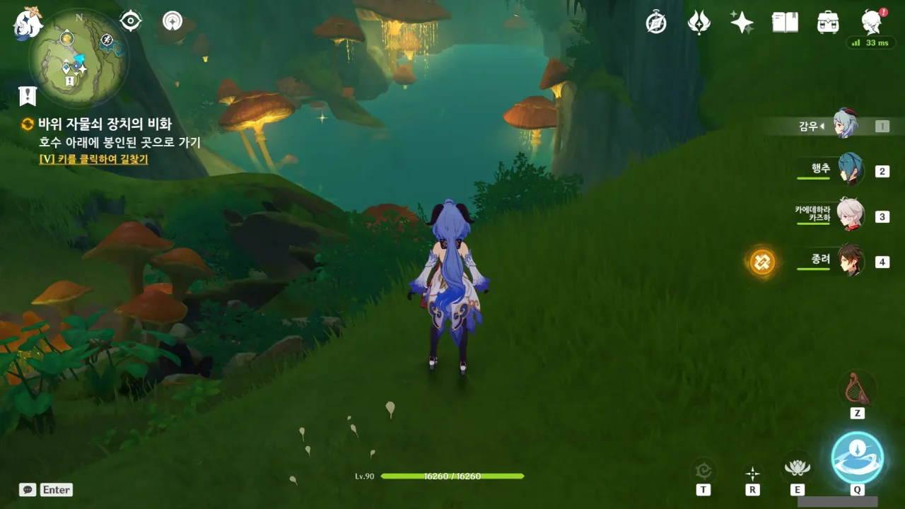

가야 할 곳이 물 밑에 있어, 또 풀 기둥을 쏴 물을 내려야 하나 싶었는데, 친절하게도 아란나라가 물을 내려주더라.

이번에도 '알아서 물 내리세요'라고 하는 거라면 한숨을 푹푹 내쉬며 물을 내렸겠지...

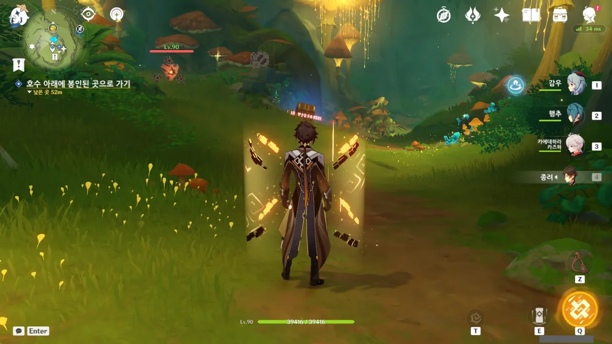

앞에 유적 기계 장치 둘이 있고, 잠겨진 상자가 있다.

유적 기계 장치 둘만 잡으면 상자가 열릴 줄 알았는데, 유적 드레이크도 나왔다.

별 어려움 없이 처리했지만.

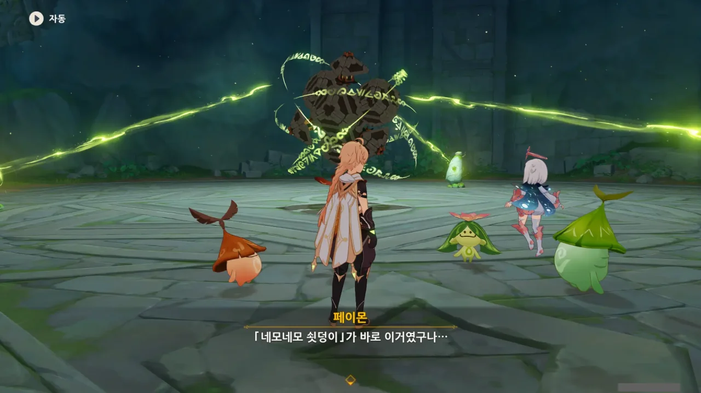

설마 했지만, 정말 「네모네모 쇳덩이」가 영구 장치 진영일 줄이야...

별로 어렵진 않겠네. 육성 재료 모은다고 이나즈마에 있는 영구 장치 진영을 내가 얼마나 많이 잡았는데.

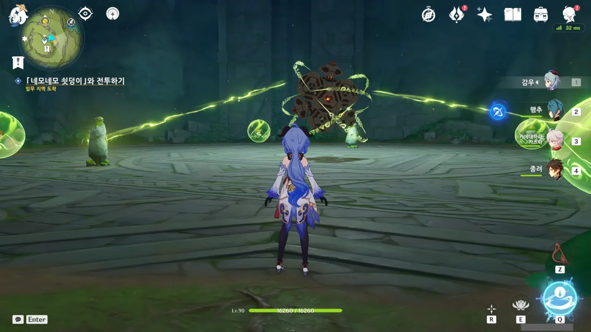

아, 그래. 한번 가보자고.

저 바위 자물쇠 역시 내가 직접 손으로 풀어야 해서, 요이미야로 바위 자물쇠에 불을 붙인 다음, 바위 자물쇠가 불에 타는 동안 재빨리 파티 구성을 전투용으로 바꿨다.

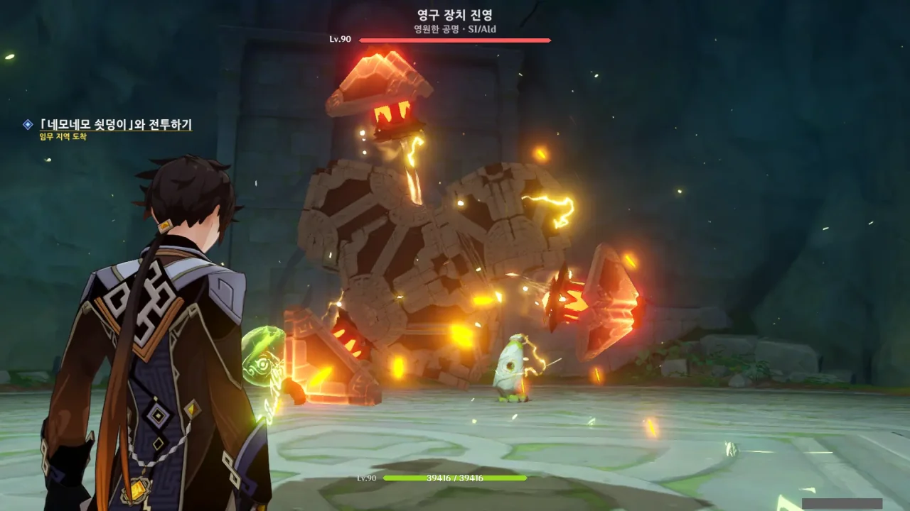

와라!

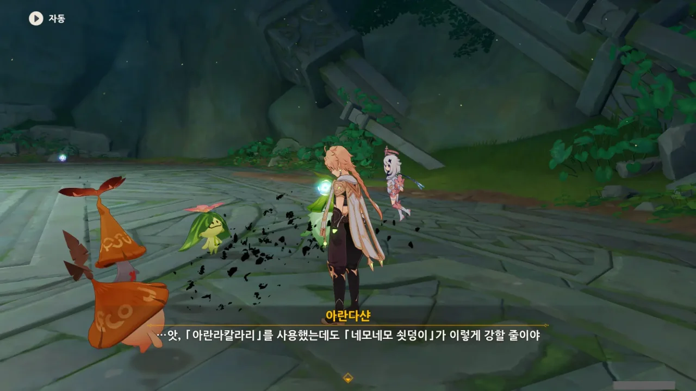

영구 장치 진영을 오랜만에 잡아서 그런가, 이나즈마에서 영구 장치 진영을 잡을 때보다 시간이 조금 오래 걸렸다.

그래도 잡았으니까.

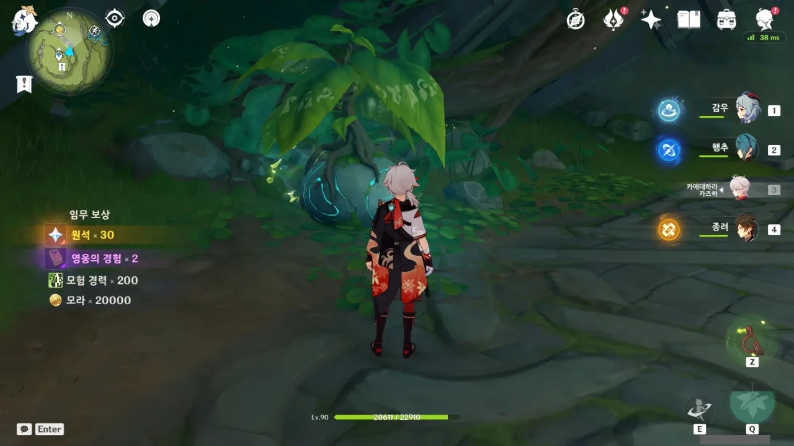

여기서 끝일 줄 알았는데, 아란나라들이 꿈속에서도 수련한다고 한다.

바위 자물쇠 임무를 할 때 누군가가 해준 조언에 따르면, 아란나라의 꿈속 수련을 모두 완료하면 보상을 준다고 한다.



아까보다 약간 더 어려워진 것 같긴 한데... 잘 모르겠다.



이후에도 몇 번 더 영구 장치 진영을 잡았다.

갈수록 날 도와주는 아란나라가 하나씩 줄어들었는데, 그럴수록 오히려 더 영구 장치 진영을 잡기 쉬워지더라? 설마 아란나라가 돕는 게 내가 아니라 영구 장치 진영이었어?

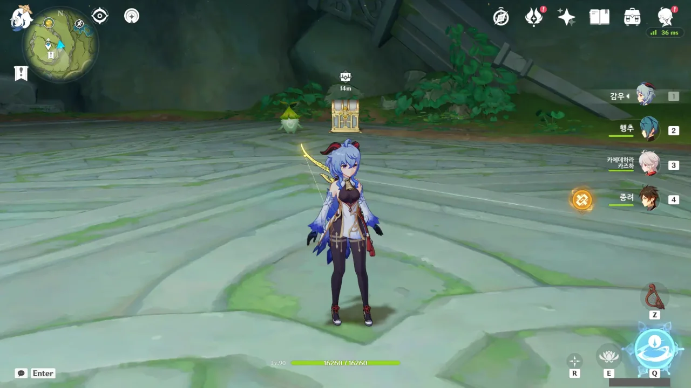

저 화려한 보물상자의 자태를 보라! 천사의 울림이 들리는 지경이군!

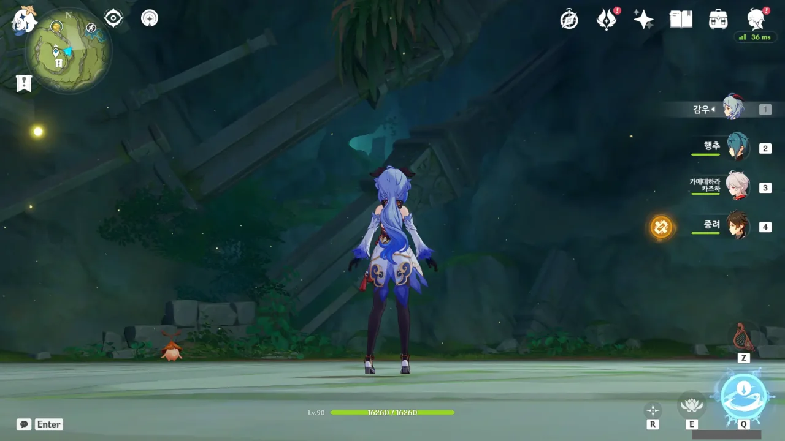

그런데 원래 목표는 영구 장치 진영을 잡아 보상을 얻는 것이 아니라, 아란나라 64마리를 모두 찾는 것이기 때문에, 여기서 저 위로 올라가야 한다.

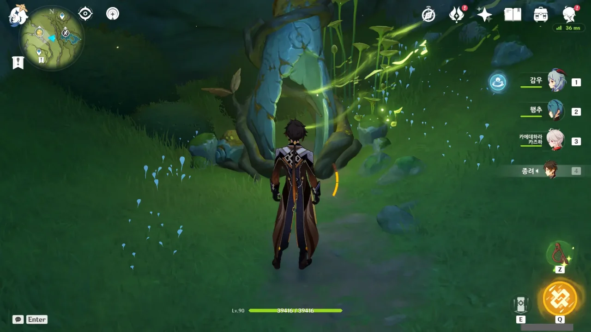

공략에 따르면, 여기로 들어가면 된다고 한다.



???

아니... 그... 왜 물이 가득 차 있습니까?

내가 어디서 물을 아직 안 내렸나? 공략 글에는 먼저 물을 내려야 한다는 언급이 없었던 것 같은데...

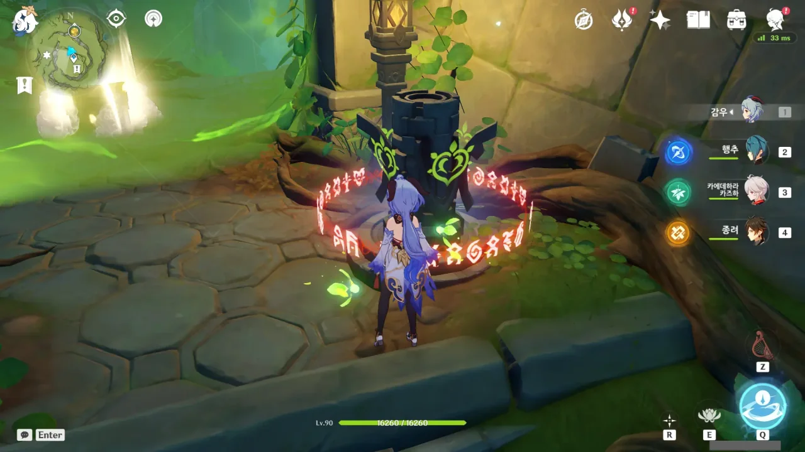

혹시나 해서 지하 동굴을 샅샅이 뒤졌다. 아직 하지 않은 퍼즐이 보이면 그게 물을 내리는 장치일지 싶어서 전부 풀었고, 선령조차 전부 선령의 정원으로 데려다주었다.

이 선령을 데려다주는데, 선령이 갑자기 땅 밑으로 쑥 꺼지는 걸 보고 기겁했다. 난 또 무슨 버그라도 걸려서 선령이 사라진 줄 알았거든.

그런데 곧바로 상자가 나타난 것으로 보아, 선령의 정원이 땅 밑에 있었던 것 같다.

아니, 대체 선령의 정원을 왜 땅 밑에 숨겨둔 거야?

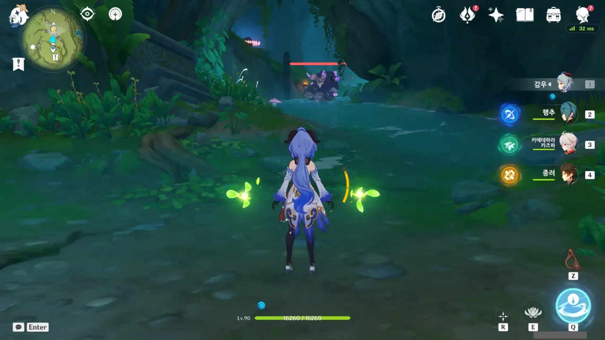

눈앞에 번개 츄츄왕이 보인다. 커뮤니티의 글을 보니, 저 츄츄왕을 잡다가 비명횡사한 사람이 제법 있는 모양이다.

전투를 해보니, 그 사람들은 전부 감전 때문에 죽은 것이었다.

바닥이 물이고, 번개 츄츄왕의 공격은 번개 속성이라, 물에서 계속 감전 대미지가 들어온다. 그러니 사람들이 종려 실드를 믿고 무지성으로 공격하다가, 감전 대미지로 인해 실드가 일찍 사라졌고, 그대로 감전 대미지에 죽어버린 것이다.

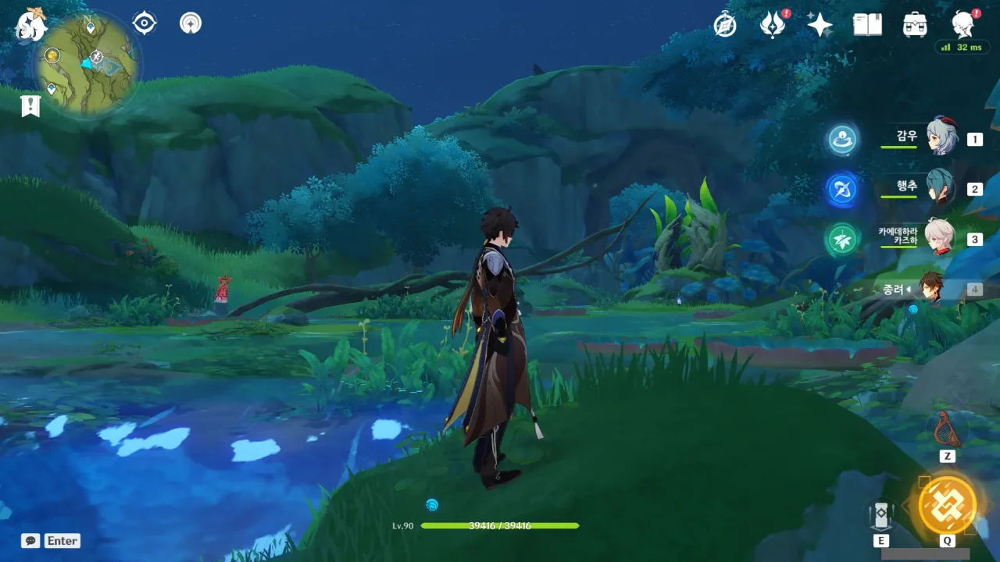

응? 아니, 왜 바깥으로 나오는 거지? 난 분명 지하에 있는 물을 내리기 위해 여길 돌아다니는 건데?

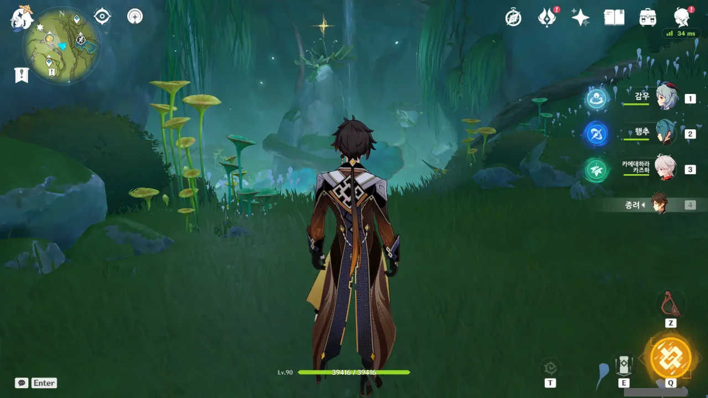

해결 방법을 드디어 알아냈다.

수천삼림에서 바루나 신기로 날씨를 비로 바꾸면 주변의 물이 내려가는데, 그 상태에서 여기로 오면 물이 빠져 있다.

여긴 수천삼림과 꽤 거리가 먼 곳인데, 어째 여기까지 바루나 신기가 영향을 끼치나 보다.

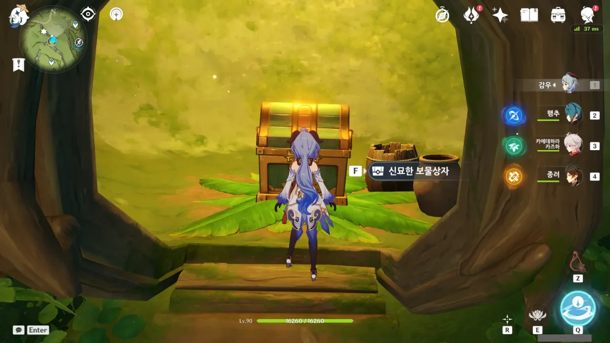

여기 있던 아란나라를 찾고, 그 뒤에 있던 신묘한 보물상자도 열었다.

아직 아란나라 64마리를 모두 찾기 위한 여정은 끝나지 않았다...
