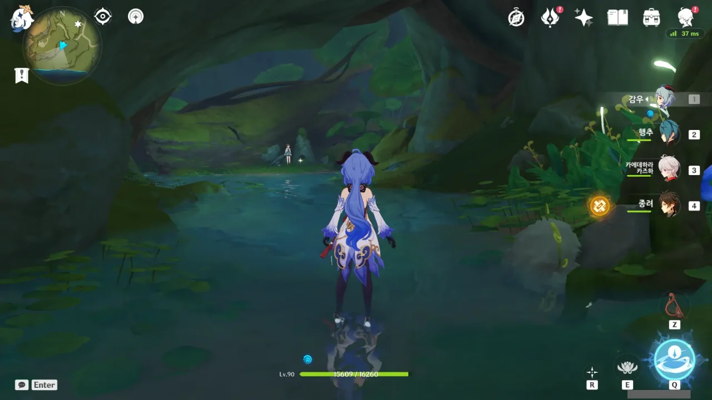
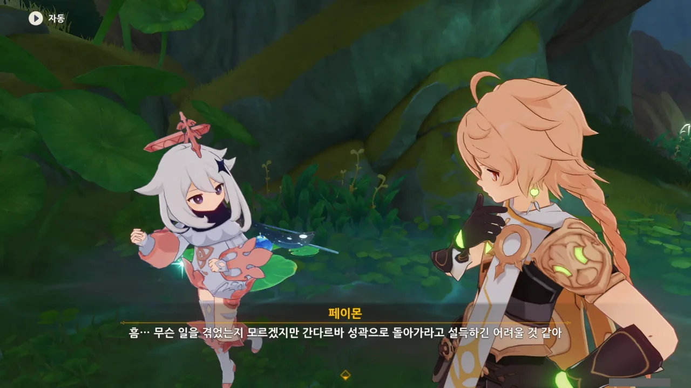
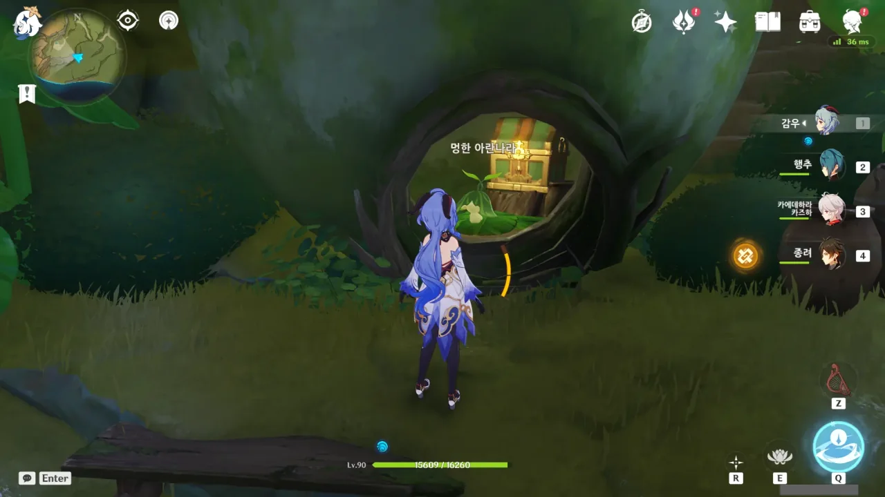
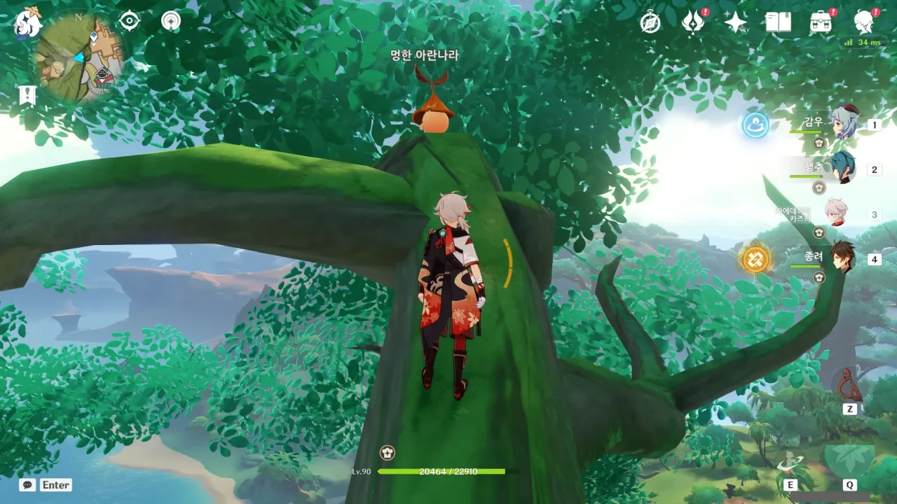
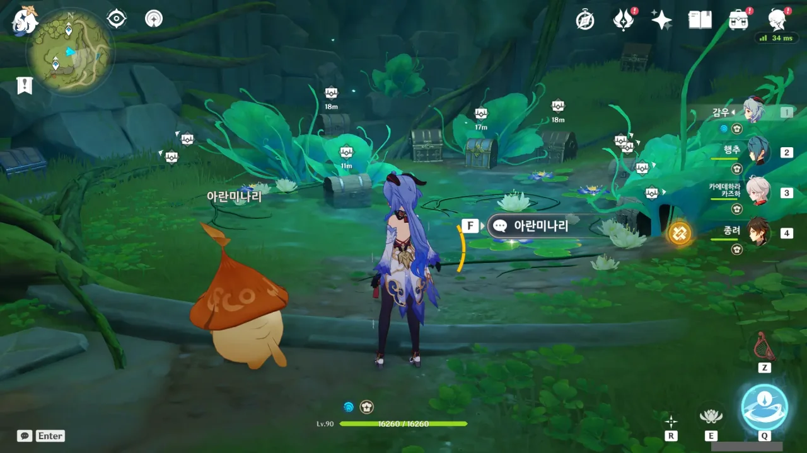
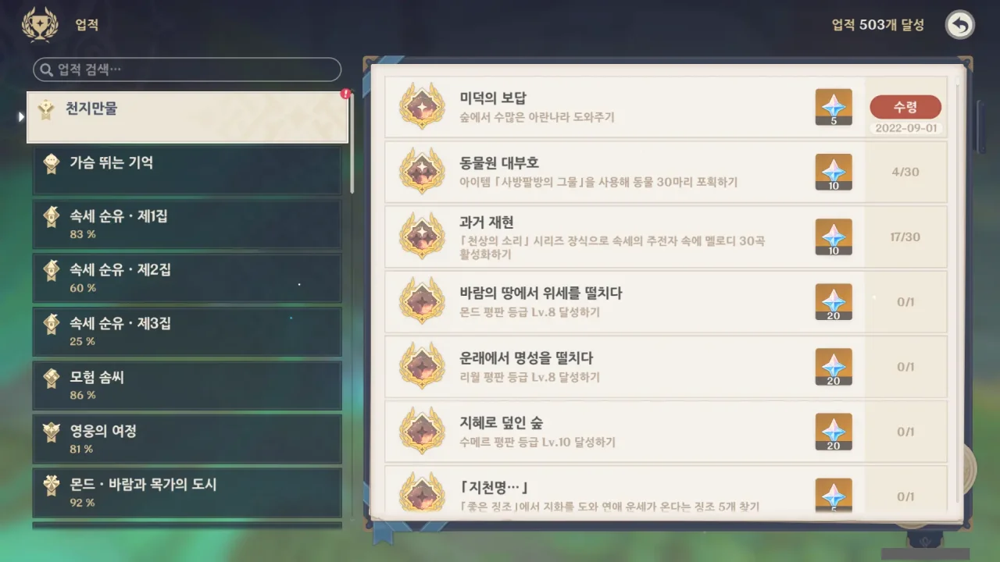
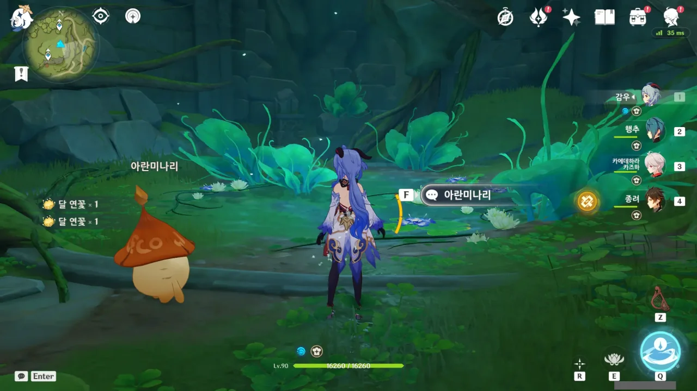

드디어... 드디어... 아란나라 64마리를 모두 찾았다!

지하 깊숙한 곳에 들어왔는데 웬 꼬마가 홀로 서 있다.

아니, 여긴 죽음의 땅 너머였는데? 심지어 죽음의 땅이 좁고 복잡한 공간에 펼쳐져 있어, 그걸 처리할 때 침식 스택이 9개나 쌓였을 정도로 위험한 곳이었다.

&nbsp;

대체 여기에 어떻게 온 거냐?



버릇이 없다고 하니까 대뜸 '부모 없어'라고 탈룰라를 걸어버리는 당돌한 녀석.



내가 물어본 건 그저 '이 지하 깊은 곳에서 혼자 뭘 하고 있냐'라고 물은 것뿐이다. 그런데 무슨 저런 장황한 이야기를 하는 거지?





흠... 분명 알폰소 이야기겠지? 아이들이 '오빠'라고 부를만한 사람은 그 녀석이 유일하지 않은가.



숲속은 대자연의 선물로 가득하다며, 배가 고프면 별 버섯, 달콤달콤 꽃, 허브를 먹으면 된다고 말한다.

그거 죄다 식물이잖아. 한창 자랄 나이에 채식만 하면 키가 안 클 텐데... 버섯이 있긴 하지만, 버섯에서 단백질을 기대할 수는 없지 않은가.

지금 당장 간다르바 성곽으로 돌아가도록 설득할 수는 없을 것 같다.

뭐, 나중에 관련 임무가 생기겠지.

아무튼, 죽음의 땅을 뚫고 여기까지 내려온 이유는 이 아란나라를 만나기 위해서였다.

이 아란나라가 마지막 64번째 아란나라일 것으로 생각했는데, 그 뒤에 딱 하나가 더 남아 있었다.

여기에 아란나라를 배치할 생각은 대체 누가 한 거지? 인간이 맞나요? 인간의 새끼인가요?



원신 맵스에서 모든 아란나라가 체크된 걸 확인하고 아란미나리에게 돌아갔다.

드디어 상자를 열 수 있다! 상자깡의 시간이다!

이 수많은 상자를 보라.

일부 상자 위에 상자 아이콘이 없지만, 그건 한 화면에 너무 많은 아이콘이 표시되고 있기 때문에 생략된 것이다.

아무튼, 다 먹었다. 다 먹었다고!

심지어 업적도 깨졌다.

그러니까 이 업적은 64마리의 아란나라를 모두 바나라나로 돌려보내고, 아란미나리의 상자까지 열어야 얻을 수 있는 업적이란 말이네...

상자를 다 먹고 난 후, 공터를 보며 감격에 잠긴다.

아직 숲의 책 월드 임무를 다 끝내지 않았기 때문에, 이제 임무의 끝을 보려 한다.
