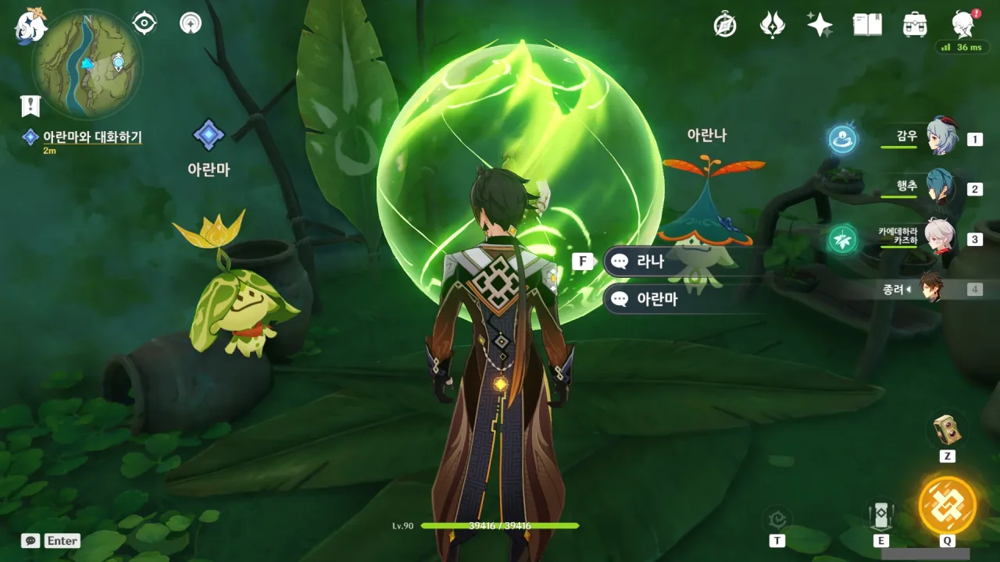

이제 이 월드 임무도 끝을 볼 때가 되었지.



여행자와 페이몬이 올 때까지 기다려준 모양이다.

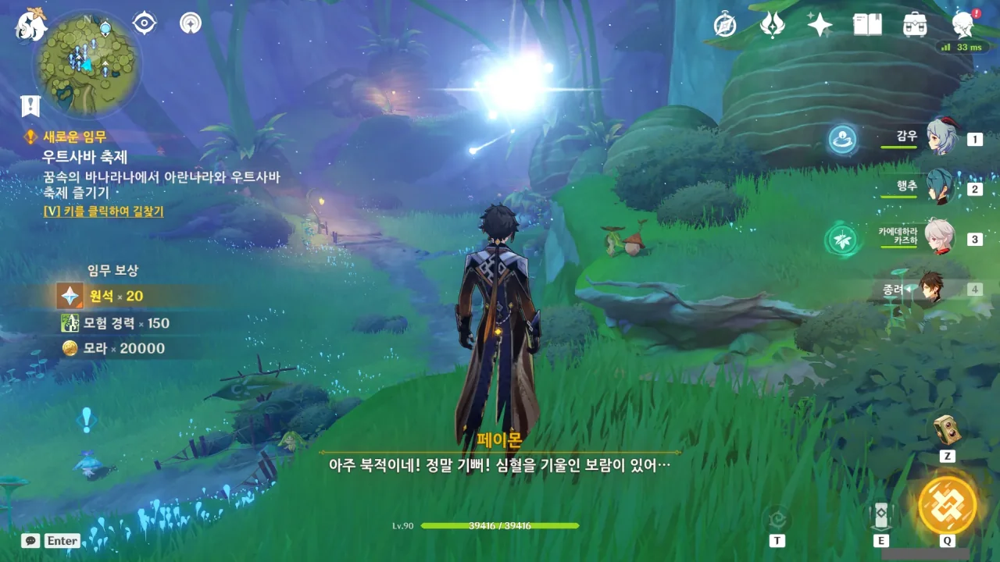

미니맵에 나타난 무수한 느낌표를 보고 난 속으로 비명을 지를 수밖에 없었다.

또 임무야? 또 심부름이야? 왜? 왜왜? 왜왜왜?



이건 뭐 애들도 아니고... '얘는 약하니까 나랑 놀자!', '아니거든! 네가 더 약하거든!' 이러고 싸우는 것 같다.

유치해서 오히려 귀엽다.

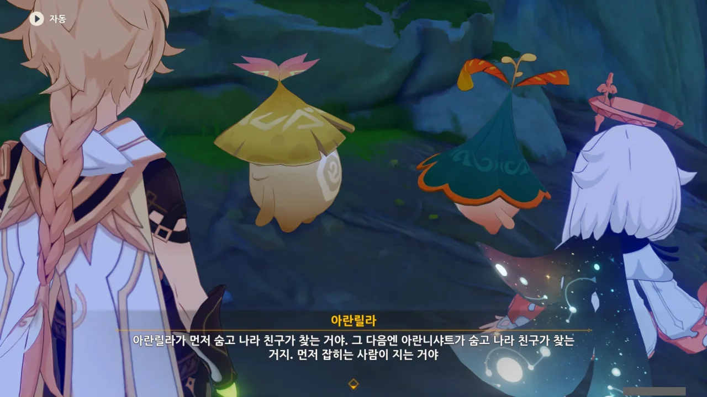

둘이 투덕대다 합의점을 봤는데, 그게 약간 좀 이상하다.

둘이 숨고 내가 찾는 거로 승부를 겨루기로 했다고? 그러면 더 오랫동안 숨은 사람이 이기는 건가?



하지만 둘 다 금방 찾았다. 별로 어렵지도 않더만.

그러니까 내가 제일 세네!

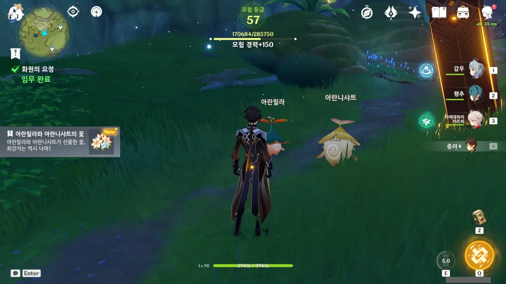

> 최강자는 역시 나야!
{.bq}

아니, 어째 내가 저 둘을 찾으며 한 생각과 똑같냐? ㅋㅋㅋ



아란파카티의 말을 들어보니, 요 며칠 동안 쉬지 않고 오빠들에게 잔소리하며 화를 내고 있었던 모양이다. 와우...

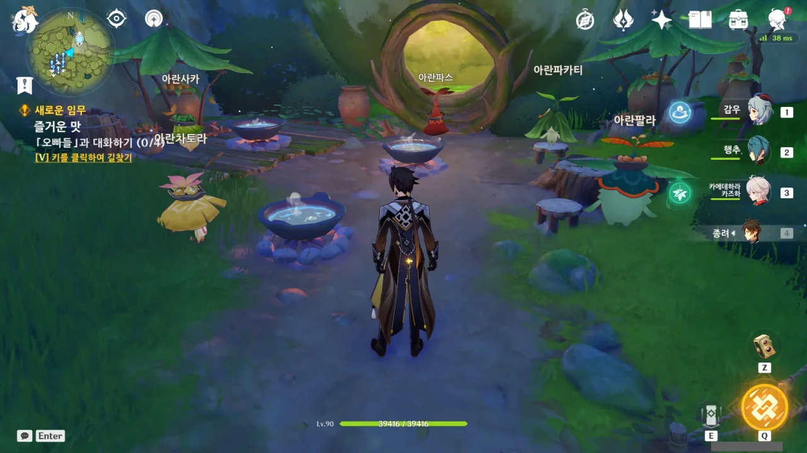

오빠들에게 말만 걸면 되는 건가?

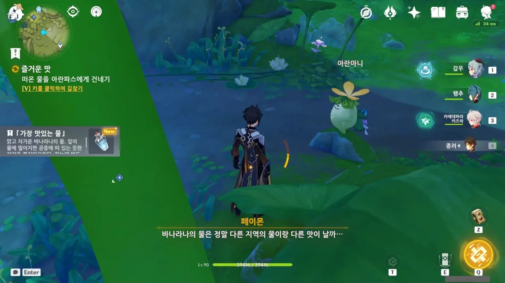

응 아냐... 물 떠오는 심부름도 해야 해...

아니, 요리할 거면 미리 재료부터 준비했어야 하는 거 아냐?

그래도 다른 '오빠'들은 이런 심부름을 시키지 않더라.



페이몬이 오가는 정이 있어야 한다고 해서 무슨 요리를 제출해야 하나 궁금해했는데, 1성짜리 '맛있는 무 수프'를 제출해야 했다. 뭔가 좀 이상한데.

&nbsp;

뭐, 게임 외적으로 생각한다면, 성급이 높은 요리의 재료는 구하기 약간 까다롭거나 귀찮은 경우가 많아, 이때 그런 요리를 요구했다면 투덜대며 필요한 재료를 구하러 쏘다녀야 했을 것이다.

하지만 무 수프의 재료는 무와 허브 둘뿐이다. 이 둘은 굉장히 자주 볼 수 있는 재료니, 큰 부담 없이 만들 수 있다.

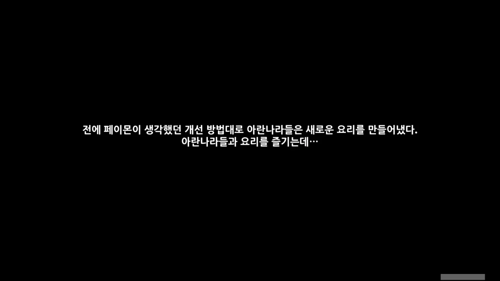



기껏 열심히 맛있는 요리를 만들었더니, 아란나라들에게 혹평을 받았다. 어느 아란나라는 '내 훌륭한 재료가... 흑흑...'이라고 슬퍼하더라.

아니, 왜? 맛만 있구만.

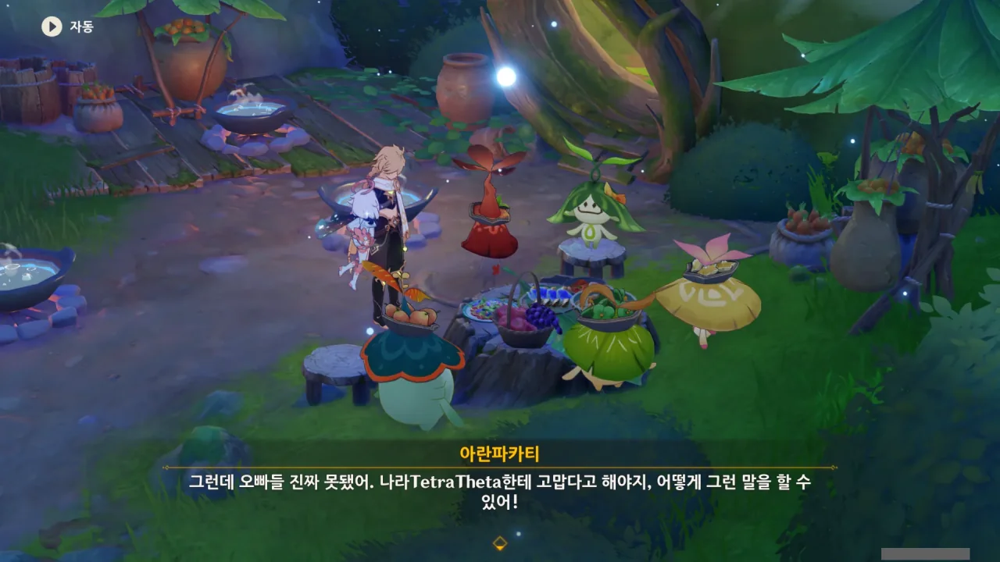

> 그런데 오빠들 진짜 못됐어.

왜 이 대사가 머릿속에서 더빙이 되는 걸까? 분명 이 월드 임무는 더빙이 없는데...

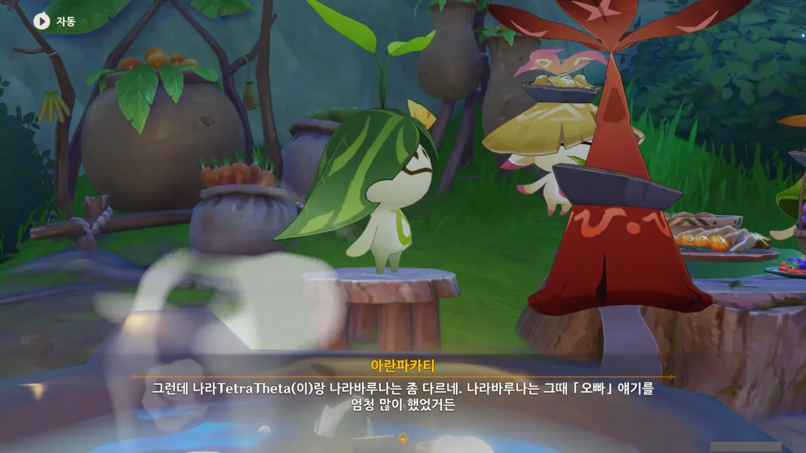

나라바루나에 대해 아란나라들이 종종 이야기하던데, 나라바루나의 성별이 여자인 걸 확인했다.

여자임. 오빠가 있음. 금빛 머리카락... 혹시 심연 공주 너니? 우연치고는 이거, 너무 잘 들어맞는데.



아란자는 말하는 것이 꼭 할아버지처럼 말한다. 그래서 옛날 있었던 일을 제대로 기억하지 못하는 걸까? 치매가 와서?

옛날 있었던 축제에서도 나라바루나와 아란자를 포함한 모두가 함께 축제를 즐긴 모양이다.

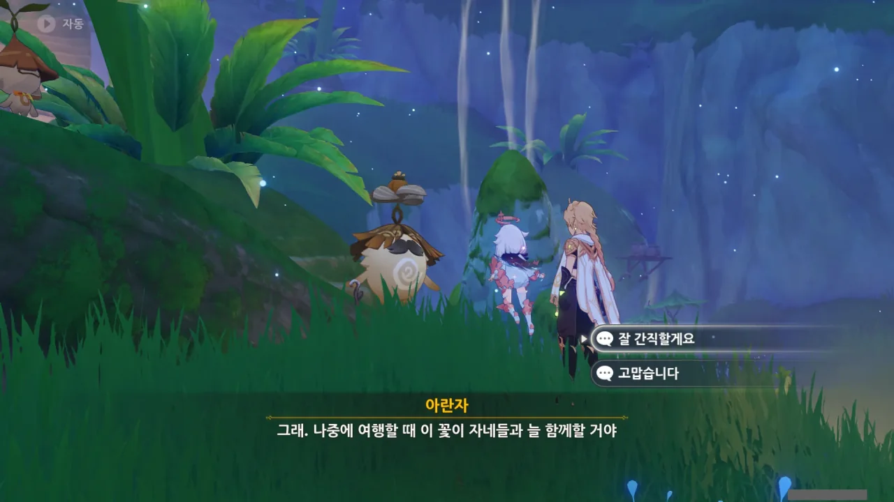

아란자가 꽃을 준다.



나라바루나를 왜 나라바루나라고 부르는지 물어봤는데, 바루나 신기를 고쳐줬기 때문이라고 한다. 그녀의 본명은 아무도 들어본 적이 없다고.



다른 아란나라들이 시간을 표현할 때, '씨앗이 나무가 될 때 동안'과 같이 모호하게 표현하는데, 이 이름을 알 수 없는 아란나라는 '수백 해'라고 비교적 명확하게 시간 표현을 한다. 보기 드문 아란나라인걸.

이 아란나라는 왜 이름이 ???로 표기된 걸까?



보통 아란나라는 낮이나 밤이 존재하지 않는 꿈속의 바나라나에 살기 때문에 나무가 자라고, 꽃이 피고, 달이 떠오르는 걸 보며 시간의 흐름을 추측한다고 한다. 아란나라의 긴 수명 역시 아란나라의 모호한 시간 표현에 한몫하고.

하지만 이 아란나라는 더 많은 기억과 지식을 흡수해서 '해'라는 비교적 명확한 시간 표현을 할 수 있다고 한다.



아란나가 아란라칼라리의 원리는 기억의 힘이라고 했던 기억이 난다.

이 아란나라는 아란나를 알고 있는 모양이다. 아란나를 '아이'라고 표현한 것으로 보아, 아란나보다 나이가 많은 것은 확실해 보인다.



비야의 얼매는 아란나라의 기억과 꿈을 추출해 만들어지는, 아란나라에게 있어 가장 소중한 결실이라고 한다. 추출이라 했으니, 비야의 열매를 만들고 나면 기억이 사라질 것 같고.

아란나라의 소중한 기억을 바쳐 만드는 것이니만큼, 비야의 열매는 소원을 이뤄주는 효능이 있는 것 같다. 다른 사람을 위해 쓸 때만 발휘되는 것이지만.

아란나가 비야의 열매를 얻고자 한 이유 역시 죽음의 땅에 침식된 라나를 치료하고 싶어하기 때문이었지.



이름을 알 수 없는 아란나라는 자신도 아란자, 아란지, 아란피카티와 함께 나라바루나에게 꽃을 줬다고 말한다.

아란피카티, 의외로 나이가 꽤 많았구나?

이 이름을 알 수 없는 아란나라 역시 여행자에게 꽃을 주며, 다시 만나게 될 것이라 말하고 사라진다.

다른 아란나라가 사라질 땐 땅속으로 쑥 꺼지듯 사라지는데, 이 아란나라는 뒤돌아 걸어가더니 사라졌다.

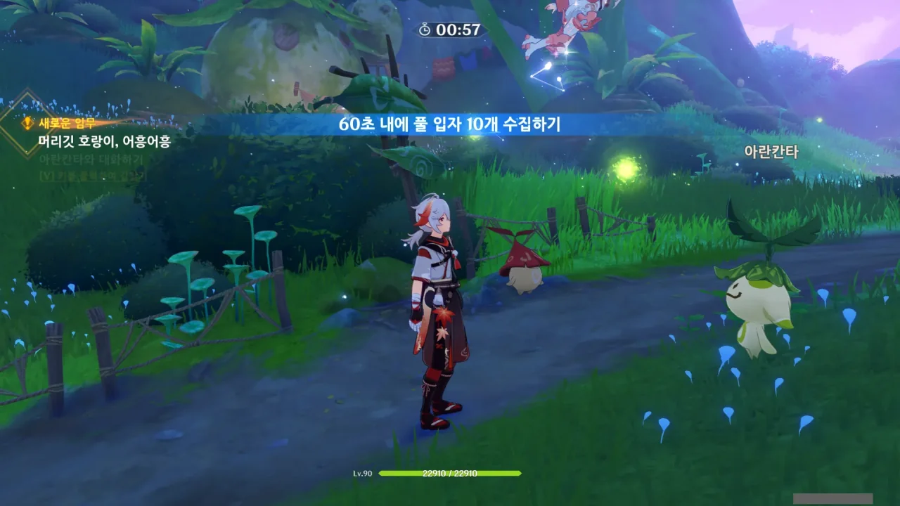

아니, 이 아란나라는 만나자마자 대뜸 도전을 시키네.

풀 입자가 잘 보이지 않아, 자꾸만 길을 헤매다가 아슬아슬하게 성공했다.

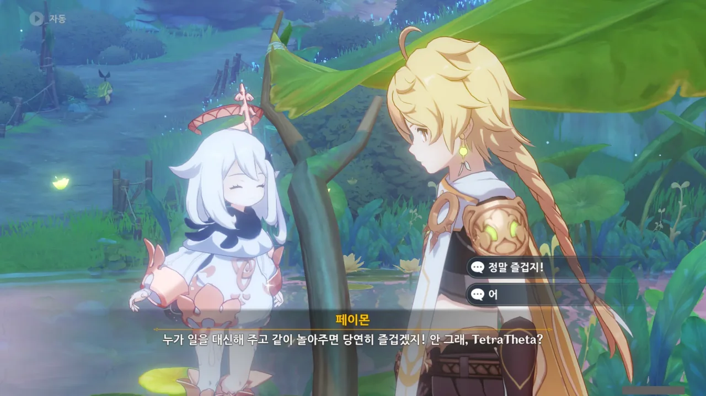

> 누가 일을 대신해 주고 같이 놀아주면 당연히 즐겁겠지!

이거 설마, 아란나라보고 들으라고 하는 소리는 아니지? 우리가 발품 다 팔고 다녔었고, 아란나라는 제자리에서 거의 하는 일도 없었잖아. 그래서 까는 거지, 그렇지?

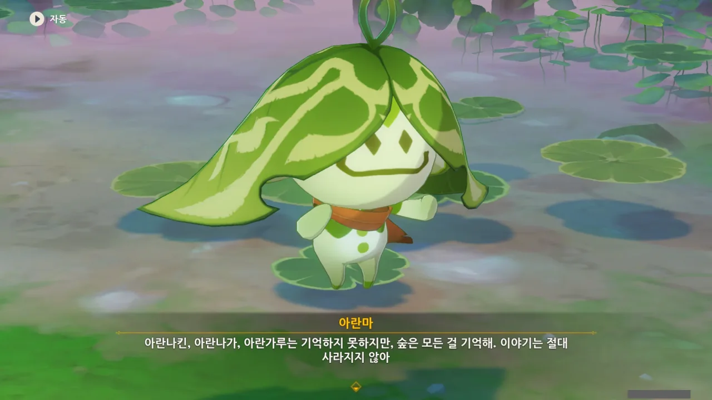

아란마가 자꾸만 '숲은 모든 걸 기억해', '이야기는 절대 사라지지 않아'라고 말하는 것이 굉장히 불안하다.

아란나가 자신의 기억을 이용해 비야의 열매를 만들 것만 같거든.





아란자가 아란나라와 함께 노래를 불러야 한다고 해서 잔뜩 긴장했는데, 다행스럽게도 노래를 부르는 대신 악기를 연주할 수 있었다.

&nbsp;

내가 원신을 하며 후회하는 것이 여럿 있지만, 그중 제일이 남행자를 고른 것이다. 차라리 여행자를 고를 걸 그랬어...

그래도 남행자가 게임에서 직접 말을 하는 경우는 드물어, 그냥 '아, 남행자 좀 별로네'라고 생각하는 것에 그쳤지만, 리월에서 유리백합에 노래를 부를 때 남행자의 목소리를 처음 듣고 남행자를 고른 걸 정말로 후회했었다.





이 노래도 나중에 음반으로 내주겠지? 다시 듣고 싶어지는 노래다.

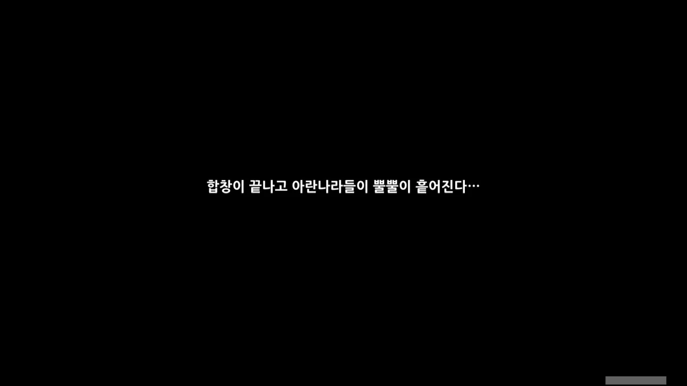

뭔가 말하는 게 '볼일 서로 다 봤으니 ㅂㅇㅂㅇ'라고 하는 느낌인데, 이거.

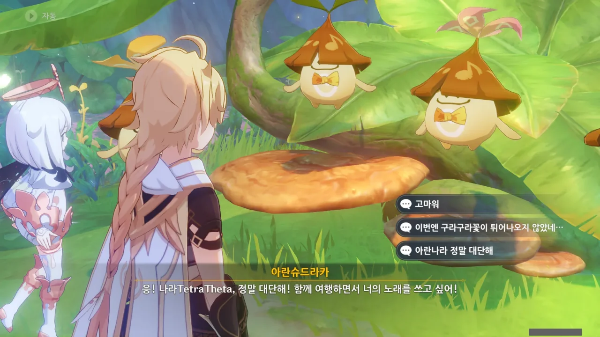

유리백합 사건 이후, 여행자가 노래를 부를 때면 항상 저 구라구라꽃 이야기가 나온다.

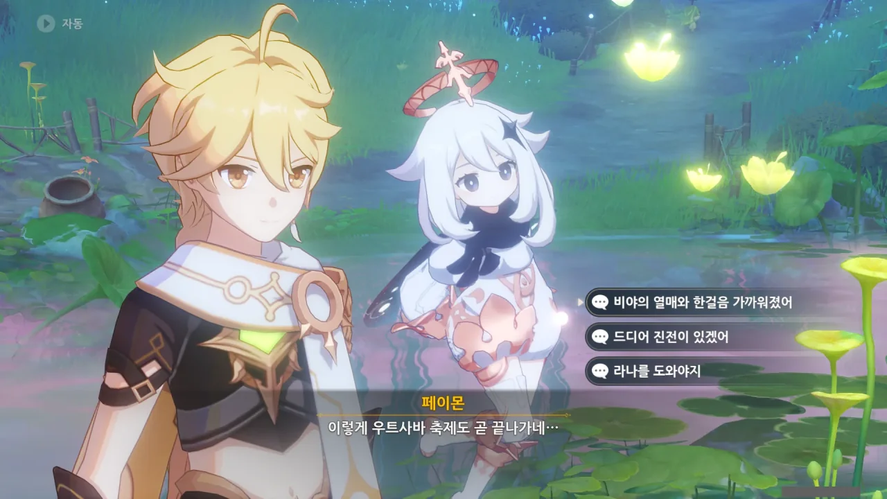

정말 먼 길이긴 했지. 라나를 구하기 위해 비야의 열매가 필요한데, 비야의 열매를 얻으려면 우트사바 축제를 열어야 한다. 우트사바 축제를 열기 위해서는 아란나라들이 시키는 일을 전부 해야 한다.

어우...



아란자와 아란마는 이미 다른 곳으로 갔다고 한다. 대체 어디로 간 거지?

이번 아란나라 임무를 하며 받은 꽃이 여러 개 있는데, 이번 기회에 미리 정리해둘까 한다.



> 아란자는 중요한 기억을 잃은 것 같다.
{.bq}

ㅋㅋㅋㅋㅋㅋ 난 왜 이 서술이 웃기지? ㅋㅋㅋㅋㅋㅋ









> 하지만 아란나라의 미뢰는 도저히 믿을 수가 없다
{.bq}

ㅋㅋㅋㅋㅋㅋ 어지간히 데었나 보네 ㅋㅋㅋㅋㅋㅋ

> 최강자는 역시 나야!
{.bq}

그래, 이런 맛에 플레이버 텍스트를 보는 거다.


