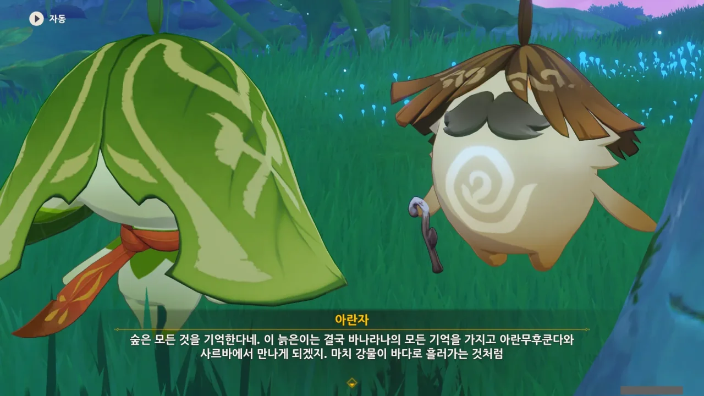
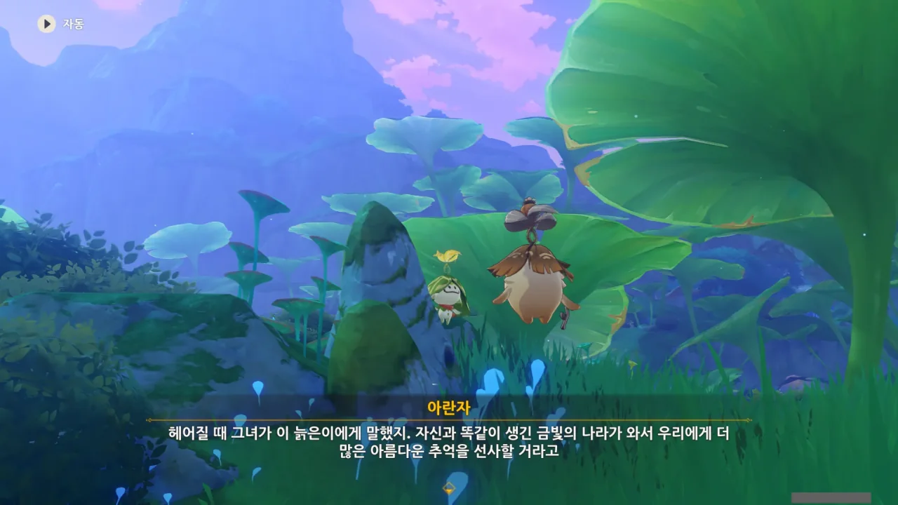
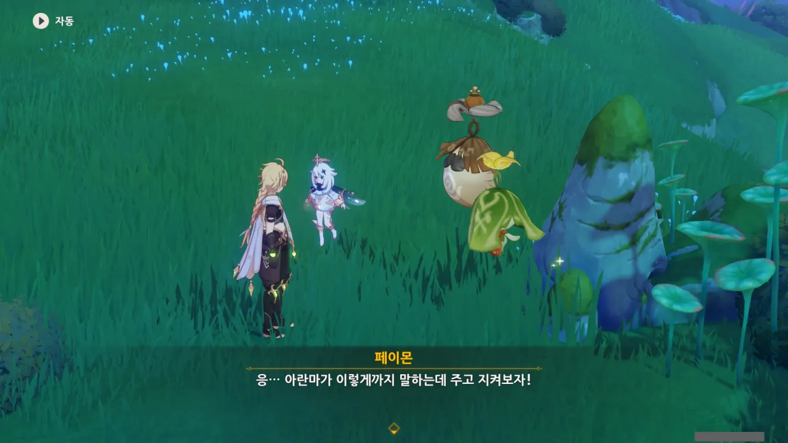
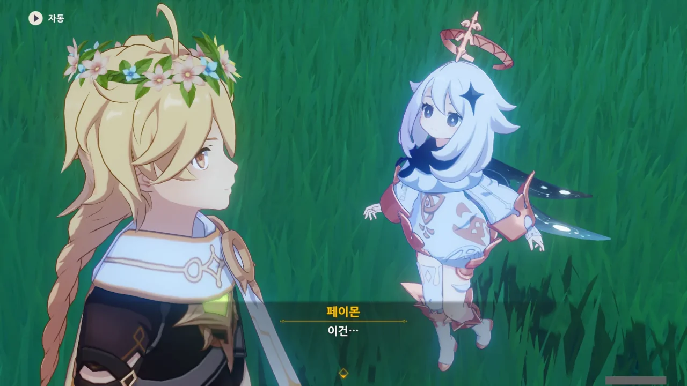
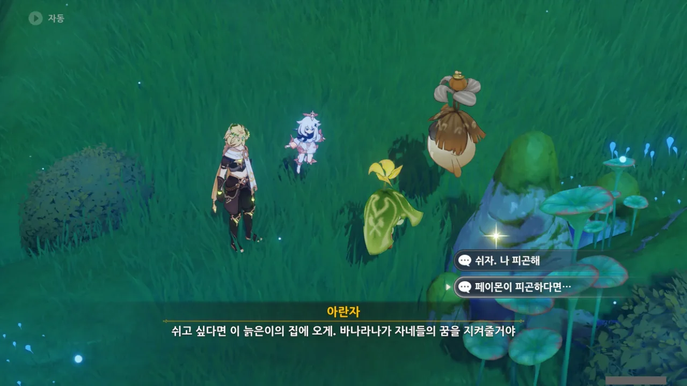
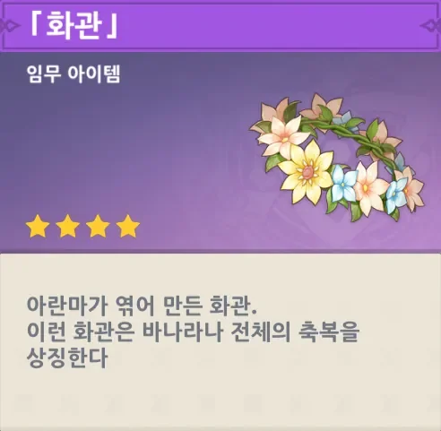
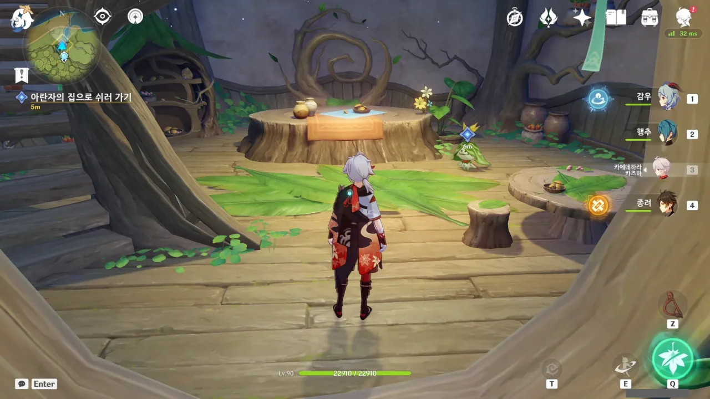
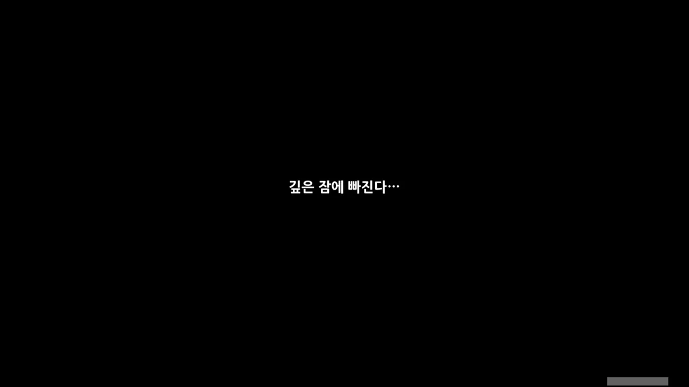





아란마와 아란자가 이야기를 나누고 있다.

나라바루나가 있었다고 말하는 것으로 보아, 옛날에 있었던 우트사바 축제를 말하는 것으로 보인다. 그 당시에도 마라나, 죽음의 땅이 수메르에 창궐했던 모양이다.

아란자가 많은 아란나라들이 바사라 나무가 되지 못하고 사르바로 돌아갔다고 하는데, 정황상 추측해 보면 아란나라가 커서 바사라 나무가 되는 것으로 보인다. 그리고 사르바로 돌아갔다고 하는 건 죽었다는 걸 말하는 거겠지.



수많은 아란나라들이 죽는 걸 본 나라바루나는 눈물을 흘렸다고 한다. 아란나라는 소금을 정말 무서워하지만, 나라바루나의 눈물은 무섭지 않았다고 기억하는 아란자.

아란자가 여행자가 나라바루나와 정말 닮았다고 하는데, 아무리 생각해도 나라바루나는 심연 행자를 일컫는 말 같다. '금빛 찬란하다'라고 할 정도의 금발이고, 나라바루나가 여성이라는 언급이 있었으니 말이다.



그래, 언젠간 '나라바루나'가 누구인지 알게 되겠지.



아란마가 여행자가 아란나라였다면 서로 더 일찍 만나 더 많은 추억을 쌓았을 것이라고 말하는데, 어우... 아란나라가 되는 건 질색이다.

아란자 말처럼, 사람은 나무처럼 생명이 길지도 않고, 아란나라처럼 꿈과 기억의 열매를 맺거나 서로 나눌 수 없긴 하다.

하지만 난 그걸 고독하거나 비참하다고 생각하진 않거든.

여태 64마리의 아란나라를 찾아다니며 자주 들은 아란나라, 아란무후쿤다는 대체 누굴까? 말만 들어보면 전설급의 힘을 갖고 있는 아란나라였던 것 같은데...



그래, 저번에 지금 이 바나라나는 이전에 있던 바나라나 이후에 새로 만들어진 바나라나라는 이야길 들은 기억이 난다. 그런데 그 바나라나가 인재(人災)로 인해 멸망했었구나.

이후 사람을 믿지 못하고 꿈속에서만 살며 사람 근처에도 가지 않았다가, 나라바루나가 아란나라를 열심히 돕는 걸 보고 나서야 다시 마음을 열었다고 한다.

흠... 아무리 생각해도 나라바루나가 심연 행자인 것 같은데...





그러고 보니, 아란자와 아란마 둘 다 나라바루나와 함께 있었을 정도면 상당히 나이가 있는 것 아닌가? 그런데 왜 아란마 혼자서만 이렇게 늙어버린 걸까?



아, 그래. 비야의 열매. 라나를 치유하기 위해서 그게 필요했었지.

아란나라의 이야길 듣다가 깜빡 잊고 있었다.



대체 「아슈바타 전당」과 「아슈바타 신전」은 무슨 차이가 있는 거지? 그냥 「아슈바타의 꿈 나무」가 있어서 「아슈바타 신전」이라고 부르는 건가? 아란나라의 이야기는 고유명사가 너무 많아 이해하기 힘들다.

아란나라가 크면 비야의 열매를 맺을 수 있는 바사라 나무가 된다. 메모.



아란자는 오래 전, 이 꿈속의 바나라나를 만들고 유지하기 위해 「꿈 나무」, 바사라 나무가 되었다고 한다. 그래서 아란자는 이 꿈속의 바나라나 바깥으로 나갈 수 없다.

아란마와 다르게 아란자 혼자만 늙은 것이 이것 때문인 걸까?



본인들이 원하는 거라면야... 아란나라에게는 아란나라만의 가치가 있을 테니 말이다.

그러고 보니, 아까 사람처럼 시간을 '해'로 셀 줄 아는 특이한 아란나라를 만났었다. 



그 아란나라가 비야의 열매를 맺기 위해선 기억과 꿈이 필요하다고 했었다.

정말 그런지 아란마에게 물어보자, 아란마는 기억나지 않는다고 한다. 비야의 열매를 만드느라 기억을 소모했으니, 기억이 나지 않는 거겠지.



그래. 우트사바 축제에서 꽃을 참 많이 받았더랬다. 이렇게 꽃을 많이 받아도 되는 건가 싶을 정도로 많이 받았다.



> 숲은 모든 걸 기억하지.

이젠 저런 말을 들을 때마다 내 주변의 아란나라가 기억을 잃을 것만 같아 불안해지기만 한다.



아란마가 그 꽃을 자신에게 달라고 한다. 화관을 만들기 위해서라고 한다.

> 그건 안 되지.

여행자, 너무 단호한 거 아냐? 그렇게 대답하면 아란마가 괜히 무안해할 거 같은데.

하지만 난 예전에 이미 아란나라가 준 꽃의 사진을 찍어두었기 때문에, 흔쾌히 아란마에게 그동안 받은 꽃을 건네주기로 했다.



아, 화관을 씌워주기까지 하는 거야?

음... 이 화관... 분명 저번 PV에서 이 화관을 쓴 여행자가 어떤 검은 구체에게서 IMA FIRIN MAH LAZOR를 당했던 것 같은데...



아무튼. 그건 나중에 가서 보면 알겠지.



'아란나라와의 우정의 징표'인 꽃을 엮어 화관을 만들면, '아란나라와 온 바나라나가 가장 사랑하는 나라에게 선사하는 축복'의 뜻이 되는 것 같다.





> 나라여행자가 화관만 쓰고 있으면 아란나라가 어려운 일을 같이 해결해 줄 거야.
> 악몽이 찾아와도 아란나라가 나라를 지켜 줄 수 있어.

뭔가 굉장히 가슴 뭉클해지는 말이다.



페이몬은 왜 내겐 화관을 주지 않냐 묻자, 아란마가 '넌 이미 여행자가 지켜주고 있잖아'라고 대답한다.

아 ㅋㅋ 그래, 일은 내가 다 했지 ㅋㅋ...





뜬금없이 아란마가 '잠 좀 자지 않을래?'라고 묻는다. 바소마 열매를 바치러 아슈바타 신전에 가야 한다고 하지 않았어?

페이몬이 피곤하다고 했으니, 피곤한 거겠지.

잠은 아란자의 집에서 자는 것으로 했다.

> 「화관」
> ***
> 아란마가 엮어 만든 화관.
> 이런 화관은 바나라나 전체의 축복을 상징한다.
{.bq}

응? 여기 침대가 전혀 안 보이는데? 2층에 있는 건가?

에이, 설마 저 테이블 위에서 자라는 말은 아니겠지.



아란나라는 정말 위험할 때, 작은 씨앗으로 변해 꿈 없는 수면에 빠진다고 한다. 그렇게 한 번 씨앗으로 변한 후, 다시 돌아오려면 「추억」을 정말 많이 떠올려야 한다고 한다.

저번에 만났던, 아란님바가 그런 식으로 씨앗으로 변한 거겠지.



아란나라는 씨앗으로 변할 때 말고는 잠을 자지 않는구나.

아란마가 말한 '바나그니'가 뭔지 찾아봤는데, 구라구라꽃이라고 하더라.

음, 구라구라꽃은 악몽이 맞긴 하지.



여기서 잠에 들고 다시 깨어나면 모든 게, 마치 한여름 밤의 꿈이었던 것처럼 감쪽같이 사라지는 그런 전개가 너무 유명한지라, 페이몬이 불안해하는 것도 이해가 간다.

응? 그런데 그냥 여기서 바로 잔다고? 침대도 없이? 설마 진짜로 테이블 위에서 자는 거야?
