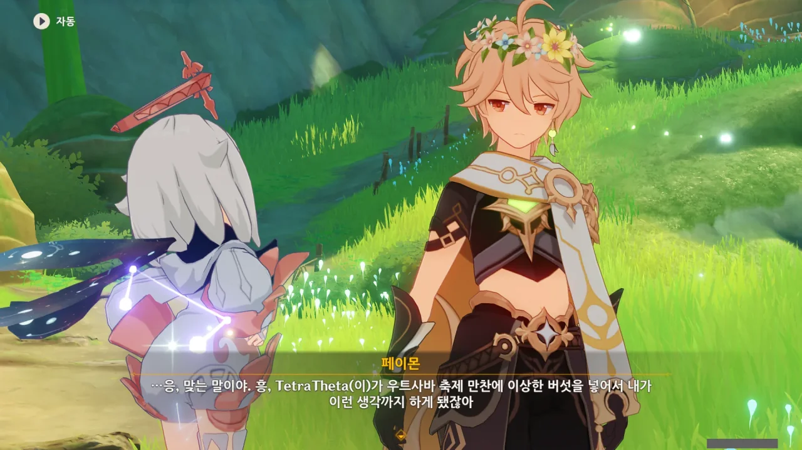
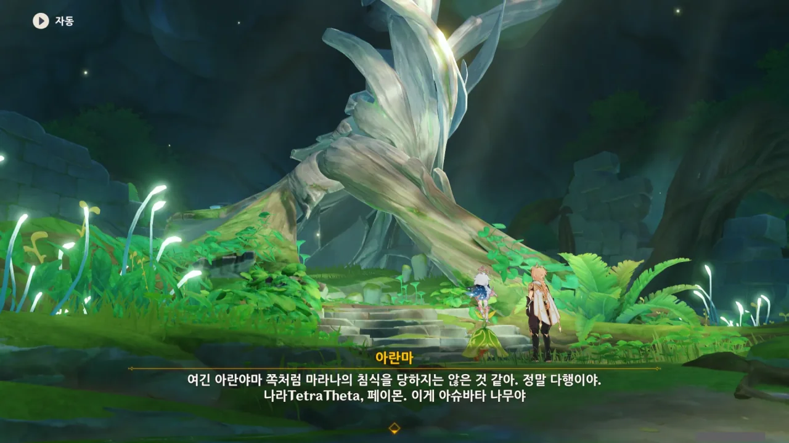
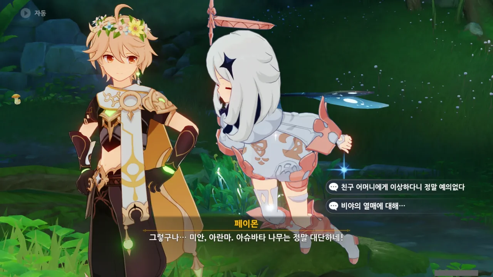
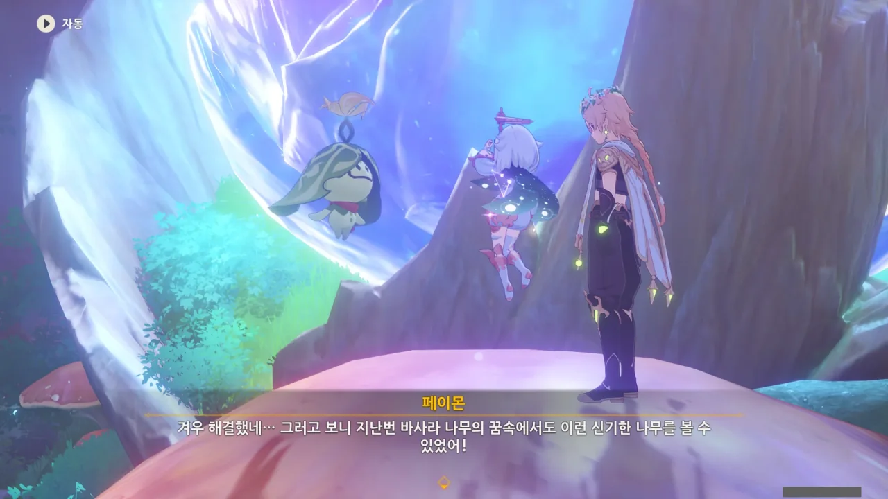
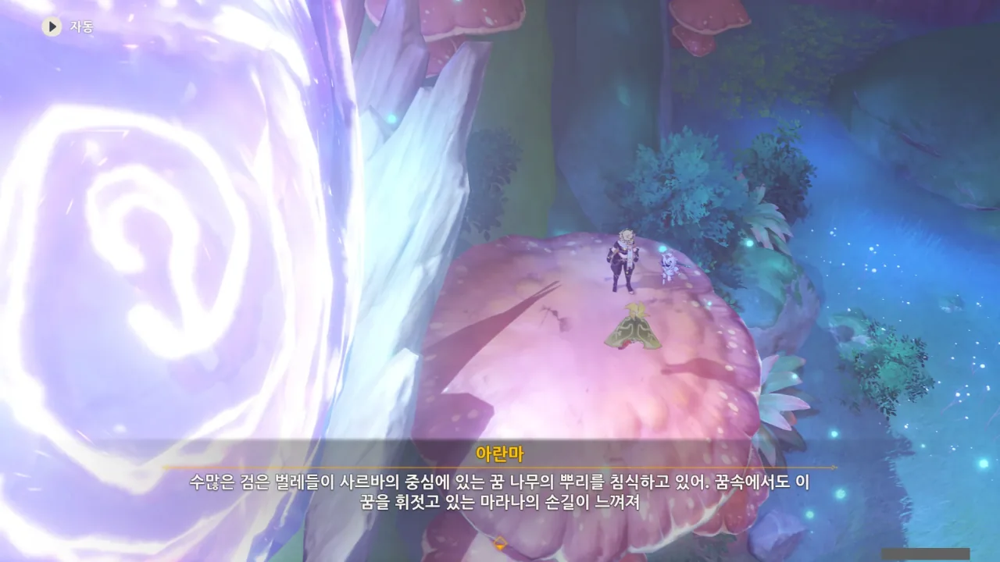
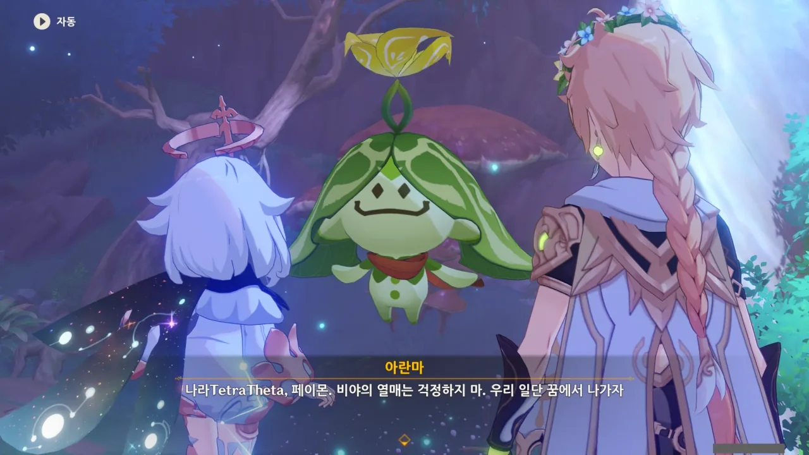



자고 일어나니 현실의 바나라나에서 깨어났다. 주변에는 그 어떤 아란나라도 보이지 않는다.

꿈속에서 꿈을 꾸면 마치 인셉션처럼 꿈 안의 꿈을 꾸고, 거기서 깨어나면 다시 꿈 안에서 깨어날 줄 알았는데, 그냥 현실에서 깨어나네.



아란자의 집에서 나와 조금 걸으니, 아란마가 우릴 기다리고 있었다.

같이 아슈바타 신전에 가기 위해 우릴 여태 기다리고 있었다고 한다.

아니, 본인이 헛걱정한 걸 왜 나한테 떠넘기는 거지? 봐라, 여행자 역시 게슴츠레 눈을 뜨고 페이몬을 째려보지 않는가.

흠, 저 나무, 어디서 많이 본 것 같은데. 지도에 아직 밝혀지지 않은 곳을 가려는데, 그곳에 저런 모양의 나무가 제법 많이 있던 것 같다.

막상 거기로 가려니 페이몬이 '앞쪽은 다음에 탐색하러 오자'며 여행자를 강제로 돌려세웠지만.

이게 아슈바타 나무라고 한다. 이게 있어서 여길 아슈바타 신전이라고 부르는 거겠지.



아슈바타 나무는 최초의 바사라 나무라고 한다. 아란무후쿤다는 아슈바타 나무에서 나온 최초의 아란나라이고. 그래서 모든 아란나라는 이 아슈바타 나무의 자식이라고 할 수 있다고 한다.

아란야니 여왕 이야기가 있긴 했는데, 도저히 무슨 말인지 이해할 수 없어 그냥 넘겼다. 고유명사가 잔뜩 들어간 아란나라 이야기는 정말 이해하기 힘들다.

> 친구 어머니에게 이상하다니 정말 예의 없다

ㅋㅋㅋㅋㅋㅋ 페이몬에게 저렇게 핀잔을 주다니 ㅋㅋㅋㅋㅋㅋ

처음 만났을 때도 페이몬을 '비상식량'이라고 표현하질 않나, 이젠 '친구 엄마에게 무례하네'라고 먹이질 않나... 나, 이런 거 너무 좋아!



아슈바타 나무가 비야의 열매를 맺으려면 앞서 만났던 바사라 나무인 아란지, 아란야마, 아란마하의 꿈과 기억의 결정체인 바소마 열매를 아슈바타 나무에 먹여야 한다.

바사라 나무에서 씨앗이 자라면 아란나라가 되고, 열매가 자라면 꿈과 기억의 결정체인 바소마 열매가 된다니... 아란나라의 생태는 정말 이해하기 힘들다.

나만 바소마 열매를 아슈바타 나무에게 먹이는 게 동족상잔처럼 보이는 건 아니겠지.



화관을 쓴 채 아슈바타 나무에 가까이 가자, 아슈바타 나무 역시 다른 아란나라처럼 여행자를 축복한다. 이러면 여행자 역시 다른 아란나라처럼 숲의 아이로 받아들여진다고 한다.

그러니까 '너도 이제 우리 동족이나 다름없어'라고 말하는 건가?



아슈바타 나무에게 바소마 열매를 주기 위해선 직접 아슈바타 나무의 꿈에 들어가야 한다.

그래, 여기서 간편하게 바소마 열매를 먹일 수 있을 거라곤 생각하지 않았지...



아슈바타 나무의 꿈속에 들어가자, 여기에도 죽음의 땅이 펼쳐져 있었다.

여긴 침식 스택이 쌓이지 않아, 이전보다는 편하게 적들을 처치할 수 있었다.

그런 것 치고는 수계 늑대가 여전히 아팠지만...

그래. 바사라 나무의 꿈에 들어갈 때마다 이렇게 생긴 양파가 보이더라고.

아슈바타 나무 역시 죽음의 땅에 침식된 것 같다. 방금 처리한 죽음의 땅을 처리하긴 했지만, 아직 한참 모자란 것 같다.



기껏 얻은 바소마 열매를 아슈바타 나무를 회복시키는 데 다 쓰는 것 같다. 이러면 비야의 열매는 대체 어떻게 되는 거지?



아란마가 무슨 이상한 말을 하나 싶었는데, 아슈바타 나무와 대화하고 있었다고 한다.



그래, 사람은 원래 식물과 대화할 수 없다고.

아란마가 일단 아슈바타 나무의 꿈속에서 나가자고 한다.

아란마가 비야의 열매에 대해 걱정하지 말라고 했지만, 아까 아슈바타 나무와 대화할 때, 아란마가 이런 말을 했다.

> 이렇게 빠른 줄은 몰랐지만 때가 되면 뭘 해야 할지 알고 있어.

난 왜 저 말이 이렇게 불안한 걸까?



드디어 비야의 열매를 얻었다. 이제 라나를 치료할 수 있는 걸까?



그런데 아란마가 그 비야의 열매를 흡수해 버린다. 이게 맞는 건가?

새로운 아슈바타 나무를 심어야만 비야의 열매를 맺을 수 있다고 한다.

그럼, 지금 아슈바타 나무는 어쩌고? 새로운 아슈바타 나무가 지금 아슈바타 나무를 대체하는 건가? 그게 그렇게 해도 되는 건가?



이거 좀 싸한데...

아란나라는 바사라 나무가 될 수 있다. 아슈바타 나무 역시 바사라 나무이다.

아슈바타 나무가 모든 힘을 바소마 열매의 형태로 아란마에게 주었고, 아란마는 거기에 '우리의 기억'을 더하면 비야의 열매를 만들 수 있다고 한다.

비야의 열매를 만드는 것은 아란나라가 아니라, 바사라 나무이다.

&nbsp;

설마, 아란마가 새로운 아슈바타 나무, 바사라 나무가 되어 비야의 열매를 맺는 전개인 거냐?





아란마가 유식해졌다. 아슈바타 나무의 꿈과 기억을 얻어, 그렇게 되었다고 한다.

이걸 보면 아란나라가 참 신기하긴 해... 마치 항아리 지식을 생각나게 한다니까.



아슈바타 신전 깊은 곳에 과거의 바나라나가 봉인되어 있고, 거기에 있는 마라나의 화신을 처치해야만 강한 아슈바타 나무를 심어 비야의 열매를 맺을 수 있다고 한다.

여기만 아슈바타 신전인 줄 알았는데, 저 너머까지 전부 아슈바타 신전인 모양이다. 아니면 저기까지가 아슈바타 신전이고, 그 너머는 과거의 바나라나인 걸지도...
