이 월드 임무, 예상보다 훨씬 길다!

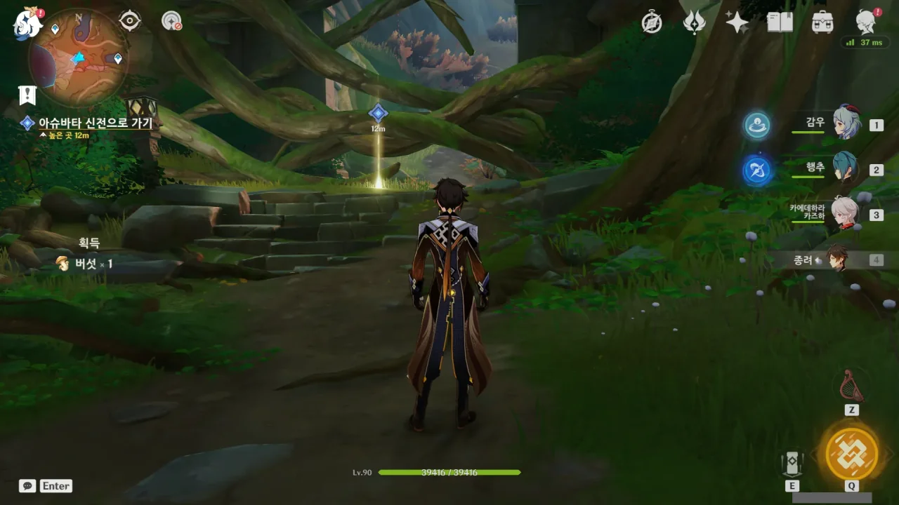

임무 목표 지점 근처에 가니, 미니맵이 시뻘겋게 변했다. 아마 이 임무 없이 그냥 앞으로 갔다간 페이몬이 '앞쪽은 다음에 탐색하러 오자!'라며 플레이어를 강제로 되돌려 보내겠지...

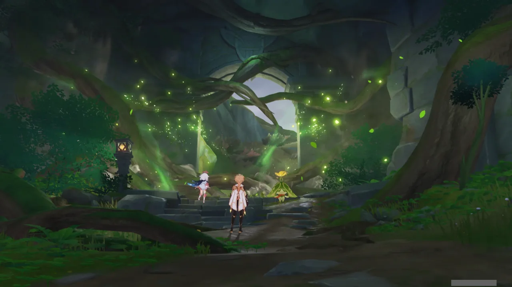

길을 막고 있던 넝쿨이 사르륵 풀어지며 길을 비켜준다.

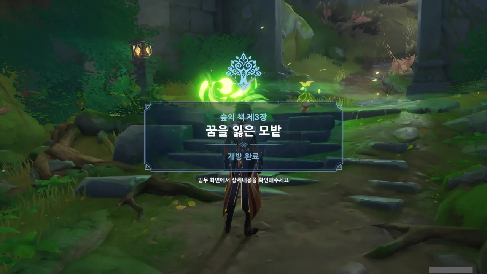

숲의 책 제3장 개방...

내 기억에 의하면, 제1장은 라나와 둥가둥가 하는 이야기였고, 제2장은 아란나라와 둥가둥가 하는 이야기였다. 그렇다면 이번 제3장은 아란마와 둥가둥가 하는 이야기일까?

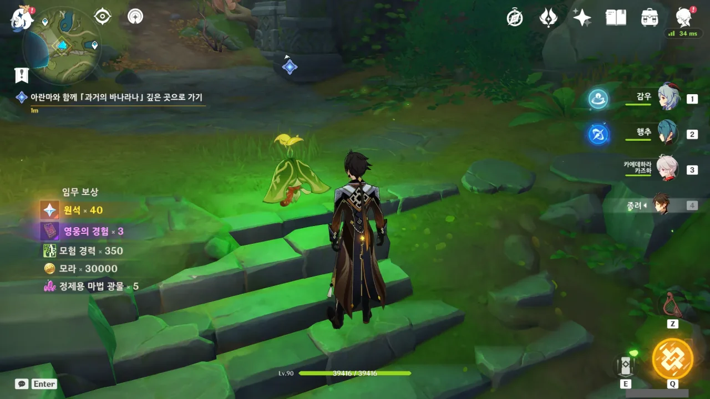

아란마 주변이 초록색으로 빛나고 있다. 뭐지, LED인가?

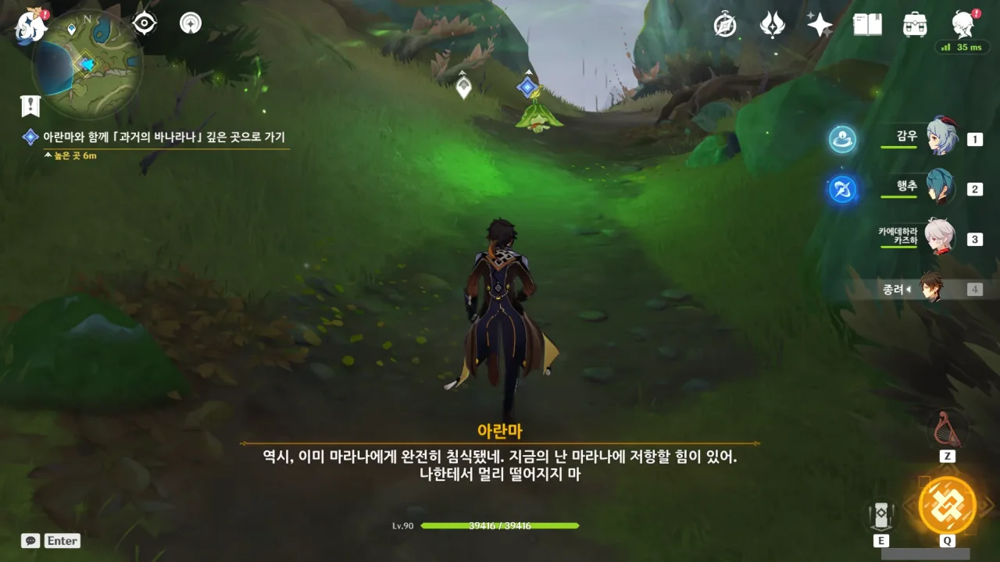

마라나에 침식당한 곳이라도 주변에 있는 등불로 어떻게든 버틸 수 있지 않을까?

하지만 일단 아란마가 하라는 대로 아란마 주변에 머물기로 했다. 아란마 주변에 초록색으로 범위가 표시되고 있다.

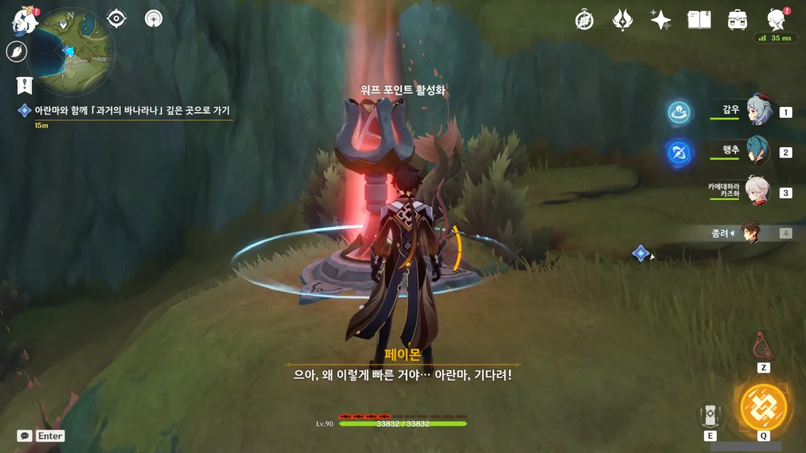

일단 워프 포인트 먼저 찍고... 워프 포인트는 중대사니까.



페이몬이 좀 천천히 가달라고 말하자, '페이몬이 떠다니는 모습을 보면 딱히 체력을 소모하는 것 같진 않은데'라고 답하는 아란마. 그래, 나도 계속 그 생각을 하고 있었거든.

그런데 페이몬이 그럴 때마다 '비행할 때 온 정신을 집중해야 한다'라고 하거나, '안 보이는 곳에서 열심히 달리고 있다'라고 말하는 걸 보면, 뭔가 우리 눈에 보이지 않는 곳에서 열심히 힘을 쓰고 있나 보다.



선령을 돌려보낼 때마다 항상 이상한 경로로 움직여서 엄청 귀찮다고 생각하고 있었는데, 페이몬은 아예 거기에 한술 더 떠, 선령을 '여기저기 날아다니는 초대형 반딧불이' 정도로 생각하고 있었다.

ㅋㅋㅋㅋ 그건 좀 너무한 거 아니냐 ㅋㅋㅋㅋ



어디서 주워들은 건진 잘 기억나지 않지만, 예전에도 선령이 옛 종족이 퇴화한 흔적 같은 것이라고 들은 기억이 있다. 대체 무엇이 퇴화해 저렇게 된 건진 모르지만.



아, 갑자기 선령에 대한 이야기를 꺼내 길게 늘인 이유가 페이몬이 지쳐서 쉴 겸 한 이야기였던 거야? 대단하네...

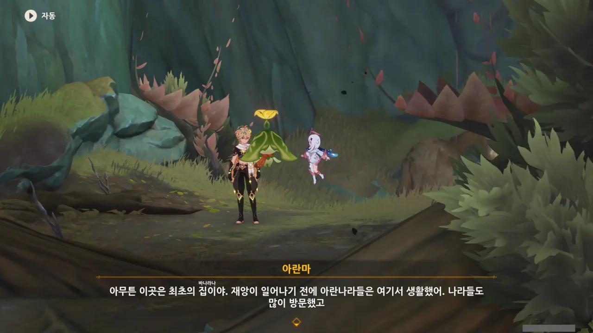

바나라나가 '마을'이라는 뜻인 줄 알았는데, '집'이라는 뜻이었구나.

여기가 '과거의 바나라나'라고 불리는 것에서 유추할 수 있듯이, 예전엔 아란나라들이 여기 살았다고 한다. 꿈속 같은 곳이 아니라, 사람도 방문할 수 있는 지역이었고.

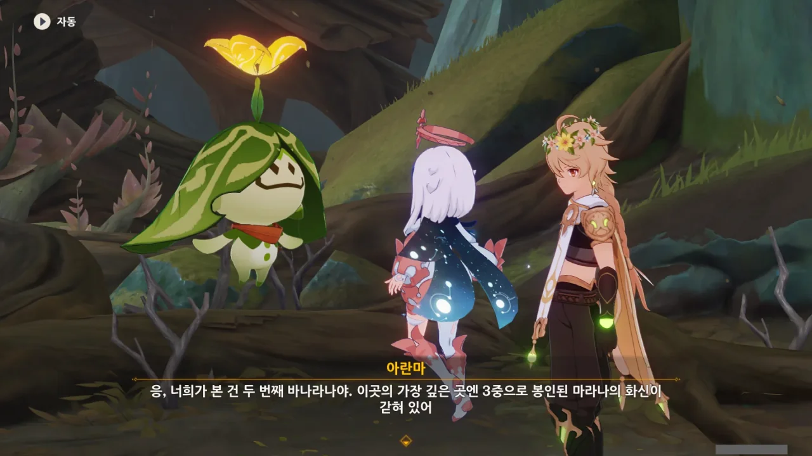

그리고 여기가 황폐해진 후, 아란나라들은 바사라 나무가 된 아란자의 꿈속에서 살게 되었다. 그곳이 바로 지금의 '꿈속의 바나라나'이고.

지금 '과거의 바나라나' 가장 깊은 곳에는 마라나의 화신이 봉인되어 있다고 한다. 그게 지금 우리의 목표고.





마라나의 화신을 봉인한 세 봉인 중 첫 번째 봉인을 해제하기 위해선 세 가지 기억을 가진 명문이 필요하다고 한다.

「3의 법칙」 하니 츠루미 섬에서 만났던 류가 떠오른다. 거기서도 「3의 법칙」이라는 말이 나왔었는데, 정작 뺑이는 네 번 쳤다.

그러고 보니, 그 이후로 깃털을 꺼낸 적이 단 한 번도 없다. 「3의 법칙」이나 류 역시 이야기가 나오기 전까진 까맣게 잊고 있었고.

뭐, 어쩔 수 없는 일이겠지. 영어 속담에도 'Out of sight, out of mind'라는 말이 있지 않은가. 안 보이면 잊히는 법이다.

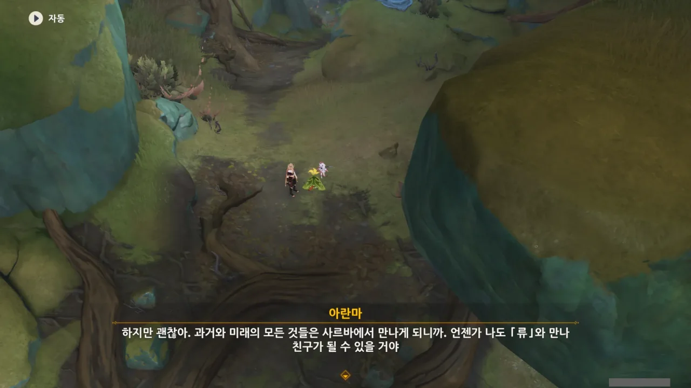

대체 「사르바」는 뭘까? 아란마가 말하는 느낌을 보면 '저승'이나 '내세'를 뜻하는 것 같은데...

아, 그러니까 우리가 방금 지나쳐 온, 넝쿨로 가로막힌 길이 세 봉인 이전의 또 다른 봉인, '바나의 문'이라는 거지?

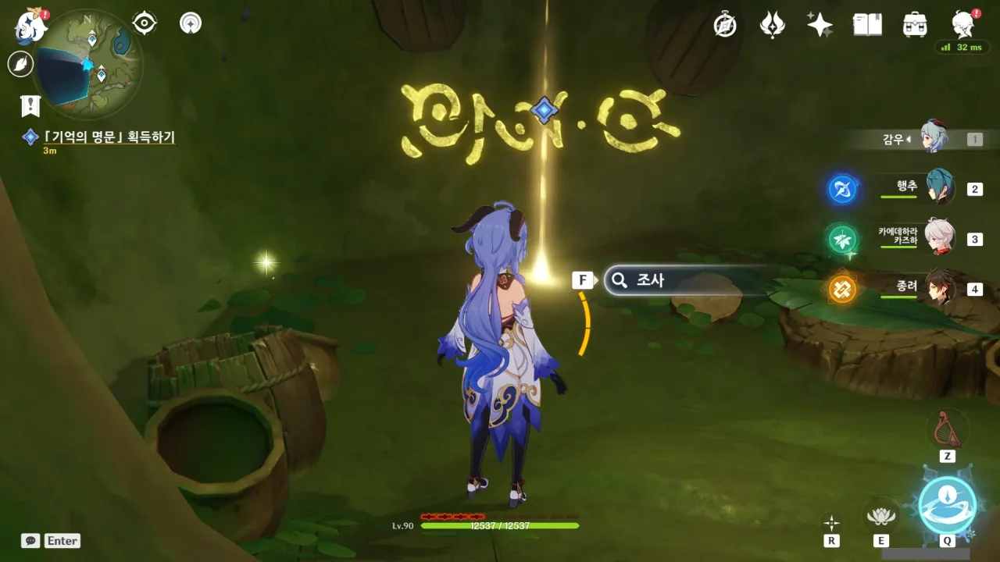

첫 번째 기억의 명문을 찾았다.

이 집이 아래쪽에 있기에 내려갔더니 갑자기 버섯몬이 눈앞에서 스으윽하고 나타나, 깜짝 놀라 E 스킬로 갈아버렸다.





「기억의 명문」이라는 게 메시지도 남길 수 있는 거였어?

> ... 아, 너도 숲의 아이구나. 내 「기억의 명문」을 읽었다는 건, 마라나가 완전히 제거되었거나 네가 마라나를 제거하러 왔다는 거겠지?
> 난 듣고 싶은 이야기가 아주 많아. 아란자의 꿈은 아름다워? 아란나랑 아란마니는 어떻게 지내? 이 시대에 탄생한 새로운 노래는 무척 아름답겠지?
> 아, 급하게 알려 줄 필요는 없어. 지금의 난 들리지도 보이지도 않거든. 하지만 괜찮아. 우린 사르바에서 만나게 될 거야.
> 그때가 되면 지상의 이야기를 천천히 알려 줘! 이 명문은 나와 아란지, 아란야마가 함께 생각해 낸 야심작이야. 이걸 네게 줄게---

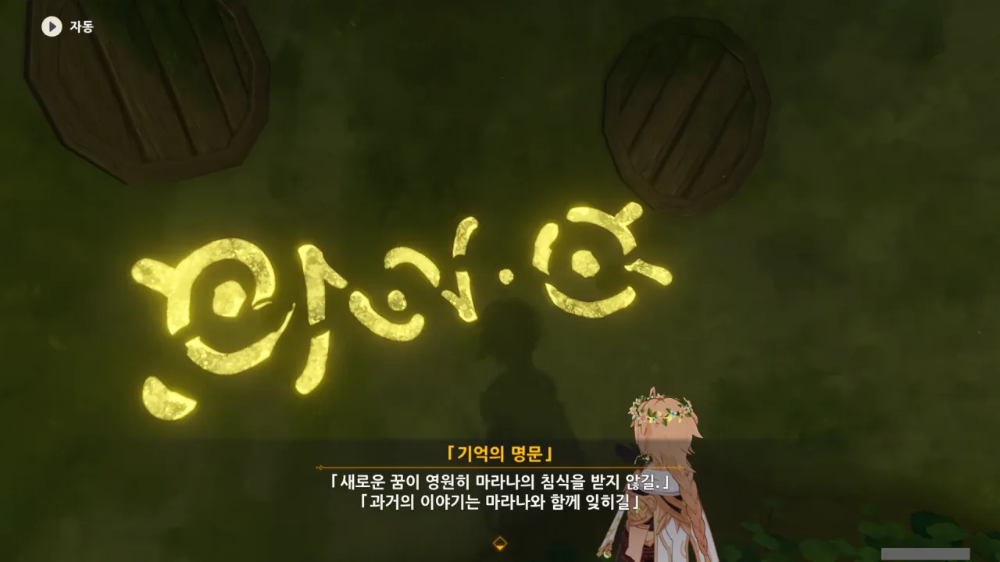

> 「새로운 꿈이 영원히 마라나의 침식을 받지 않길.」
> 「과거의 이야기는 마라나와 함께 잊히길.」

첫 번째 「기억의 명문」을 받았다.

「기억의 명문」을 읽자, 명문의 빛이 사라졌다.

「기억의 명문」의 기억을 아란마가 흡수했다고 하니, 아마 괜찮을 것이다.



'아란라칼라리'가 원래 노래를 지칭하는 단어였다는 이야길 들은 페이몬은 '아란라칼라리'라는 이름이 너무 복잡하다며 '생명의 노래'라는 새로운 이름을 붙여 준다.

이게 원래 이름인 '마하마이트리 쿠사 스토트라'보다 훨씬 부르기 쉬운걸.



아란마의 말이 매우 유창해진 걸 페이몬이 의아하게 여기자, 아란마는 자신이 아까 아슈바타 나무에서 천백 년에 달하는 기억을 얻었고, 그 덕분에 엄청 유식해 보일 거라고 말한다.

아란나라에게 있어, 기억은 소모할 수 있는 자원이며 힘의 원천이라는 게 굉장히 신기하게 느껴진다.

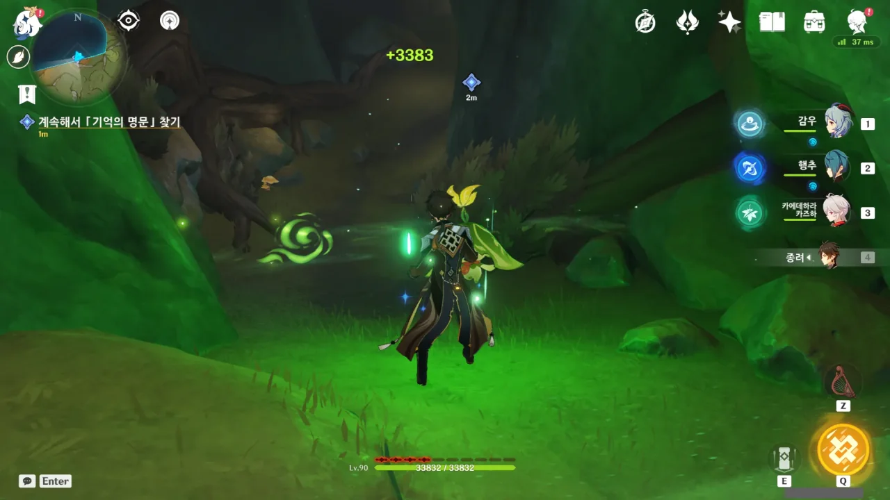

와, 아란마 근처에 있으면 죽음의 땅 침식 스택도 줄어들고, 힐도 되네? 정말 유용한걸!



두 번째 명문을 찾았다.

> 아란지는 다시 한번 엄청나게 많은 꽃이 핀 바나라나를 보고 싶어. 푸른 나무 위에 앉아 있는 새들을 바라보며, 나라들과 함께 나무 아래에서 노래하는 거야.
> 마라나가 무섭긴 하지만 이런 상상을 하면 더 이상 두렵지 않아. 아란야마가 말하길, 아란지는 아주 용감해서 좋아하는 걸 생각하면 금방 두려움을 잊을 수 있다고 했어.
> 그래서 아란지는 명문의 내용을 결정한 거야. 더 이상 아름답지 않은 바나라나에 온 네가 더 용감해지길 바라면서---

이번 명문은 아란지가 남긴 명문이다.

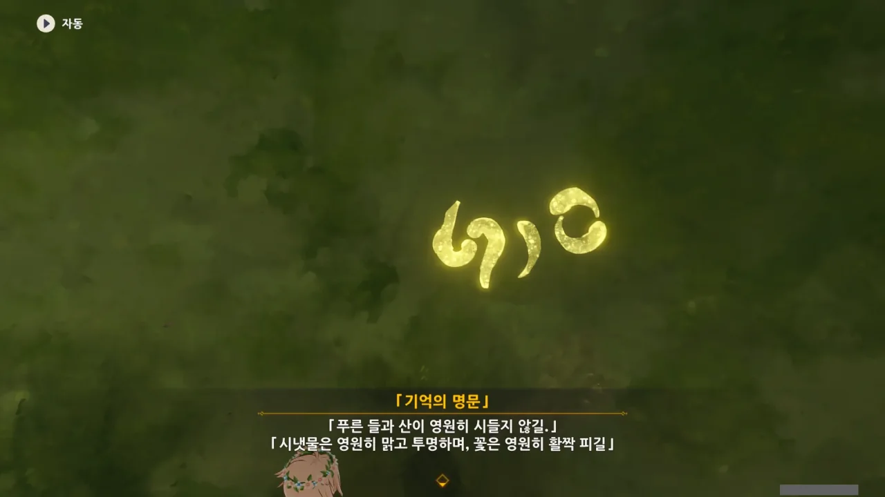

> 「푸른 들과 산이 영원히 시들지 않길.」
> 「시냇물은 영원히 맑고 투명하며, 꽃은 영원히 활짝 피길.」



앞에 유적 드레이크가 누워있는 걸 보고 '설마 저것도 잡아야 하나?'라고 생각했는데, 정말 유적 드레이크를 잡아야 했다.

땅이 고르지 않아, 평지에서 잘 맞던 스킬이 잘 맞지 않는다.



마지막 세 번째 명문을 찾았다.

> 우린 분명 승리할 거야. 산 것은 언제나 죽은 것을 이기니까. 마치 우리가 언젠간 사르바에서 다시 만나게 되는 것처럼 말이야.
> 「친구들과 다시 무성한 숲속을 걷게 될 거야. 시냇물이 자신을 정화하고 시든 나무에 새로운 새싹이 피어나듯, 아름다운 것들은 결국 돌아오고 고통의 기억은 모두 사라질 거야.」
> ... 이게 바로 내 명문이야. 안녕.

그래, 안녕.



마지막 명문을 얻고 아란마에게 가니, 아란마가 앞장서다 갑자기 땅 밑으로 쑥 꺼졌다.

순간 저번에 만났던, 땅 밑으로 쑥 꺼진 선령이 생각나 가슴이 철렁했다. 그때 정말 게임이 고장 난 줄 알고 게임을 껐다 켜야 하나 잠깐 진지하게 고민했었다니까?

&nbsp;

아란마를 따라 내려간 곳에는 나무 둥치가 있고, 거기에 장벽이 쳐져 있다.

저기에 소용돌이가 세 개 그려져 있다는 건, 분명 「기억의 명문」을 세 개 찾아야 한다는 의미겠지?



그래, 「기억의 명문」을 남긴 아란나라의 이름이 어디서 한 번 들어본 것 같다 했더니, 바소마 열매를 얻기 위해 방문했던 바사라 나무의 이름이었다. 마라나를 봉인하기 위해 바사라 나무가 된 건가 보다.

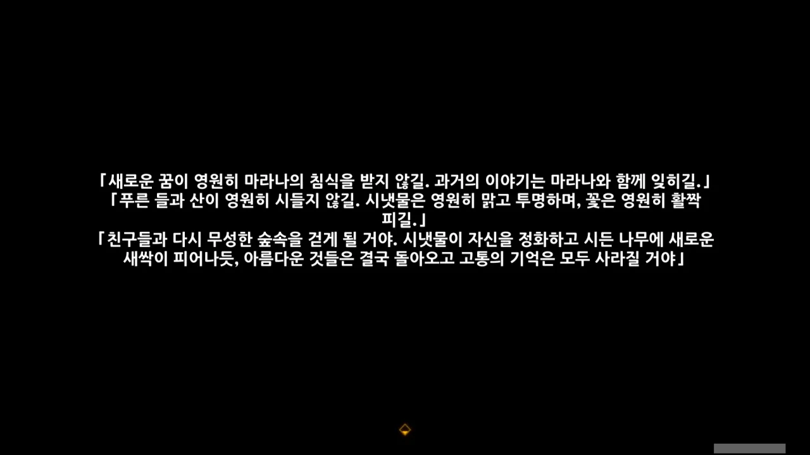

> 「새로운 꿈이 영원히 마라나의 침식을 받지 않길. 과거의 이야기는 마라나와 함께 잊히길.」
> 「푸른 들과 산이 영원히 시들지 않길. 시냇물은 영원히 맑고 투명하며, 꽃은 영원히 활짝 피길.」
> 「친구들과 다시 무성한 숲속을 걷게 될 거야. 시냇물이 자신을 정화하고 시든 나무에 새로운 새싹이 피어나듯, 아름다운 것들은 결국 돌아오고 고통의 기억은 모두 사라질 거야.」

앞서 얻은 세 「기억의 명문」을 순서대로 읊는다. 이렇게 조합해 보니, 꽤 그럴듯한 시가 되었다.

그런데 마지막 연은 개비스콘 광고를 생각나게 한다. 광고 문구가 뭐였더라? '편안함은 가라앉고 통증은 오래갈 거야'였던가?

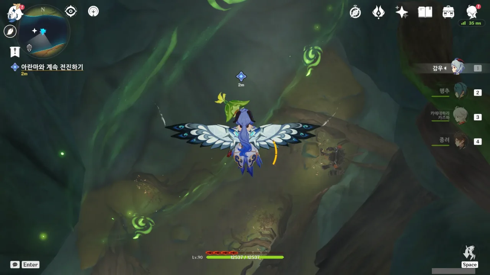

이걸 보고 피식 웃지 않을 수 없었다.

난 아란마가 발을 아래로 한 채 천천히 아래로 내려갈 줄 알았는데, 그냥 엎드린 채로 아래로 내려가고 있다.

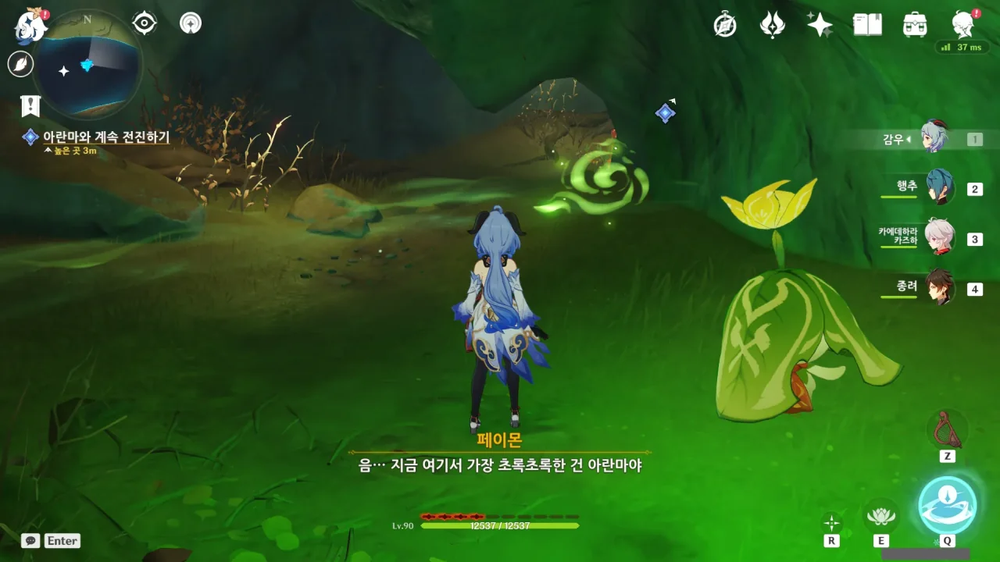

> 지금 여기서 가장 초록초록한 건 아란마야.

정말이다. 다른 곳은 전부 풀이 누렇게 죽어있는데, 아란마 주변만 초록색이다. 아란마가 얼마나 초록초록한 건지, 아란마 주변의 풀이 다시 살아난 것처럼 보일 지경이다.

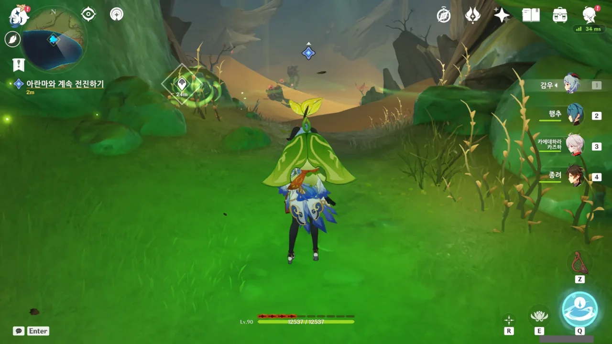

와, 씨, 잠깐만. 왜 저렇게 혹이 많아?

심지어 아란마와 대화하는 도중 날아온 유적 가디언의 미사일 때문에 내 감우가 비명횡사할 뻔했다.

종려의 옥홀 방패가 있어 다행이지, 그게 아니었다면 안 그래도 연약한 감우가 수많은 미사일을 그대로 얻어맞고 빛 가루가 되어 흩어졌을 것이다.

&nbsp;

그런데 왜 여긴 풀 씨앗 주머니가 없지?

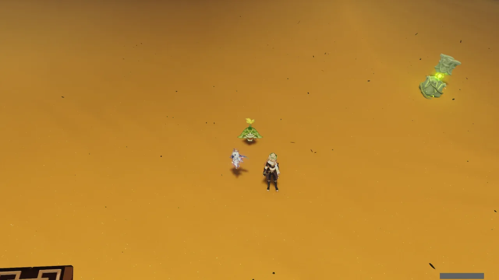

아마 이것 때문에 일부러 배치하지 않은 것 같다.

아란마가 팡 하니 주변에 있던 혹이고 뭐고 전부 싹 사라졌다.



아니, 아란라칼라리가 아니라 그냥 한 대 툭 때린 거였다고? ㅋㅋㅋㅋㅋㅋ

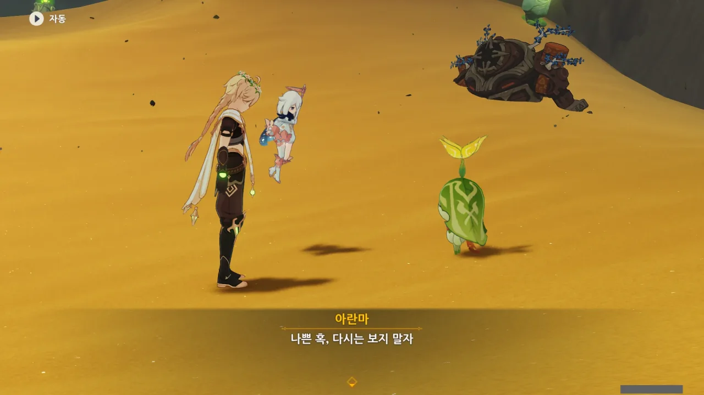

아란나라와 함께 다니다 보면 '■■■■, 다시는 보지 말자'라고 말하는 걸 수도 없이 들을 수 있다.

나 방금, 제2장에서의 트라우마가 재발한 거 같아.

버섯몬, 다시는 보지 말자. 마라나, 다시는 보지 말자. 나쁜 혹, 다시는 보지 말자. 다시는 보지 말자.



그런데 이렇게 한 번 팡 해서 주변의 죽음의 땅을 없앨 수 있다면 모든 아란나라가 모여서 이곳저곳 팡팡 하고 다닌다면 수메르의 모든 죽음의 땅을 없앨 수 있는 거 아닐까?

하지만 이건 아란마가 아슈바타 나무에서 천백 년의 기억을 빨아먹은 덕택에 가능했던 거라고 한다. 다른 아란나라가 이렇게 할 수 있으려면 엄청난 시간이 필요하다고.



좋은 건 항상 일회용이다.

조금 전 일격으로 인해 상당한 힘을 써버린 아란마는 말투도 다시 예전으로 돌아갔다.

> 이게 다 페이몬 때문이야.

아까 전부터 여행자가 좀 많이 까칠하다? 대화 선택지가 왜 이래 ㅋㅋㅋㅋㅋㅋ

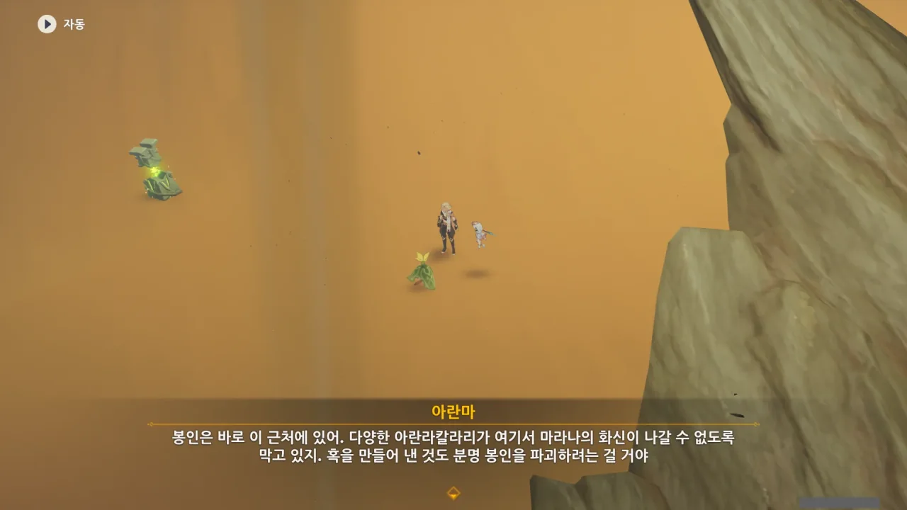

아, 완벽하게 이해했어. 이제부터 여행자 혼자서 지지고 볶고 다 하란 말이지?



주변에 놓여있는 온갖 퍼즐 요소를 보니, 지금껏 수메르 우림 지역에서 보아온 모든 퍼즐의 총집편이라는 느낌을 준다.



아란마가 여기 가만히 있으며 힘을 다시 비축할 동안, 여행자와 페이몬이 가서 마라나의 화신을 처치하라는 말인가?
