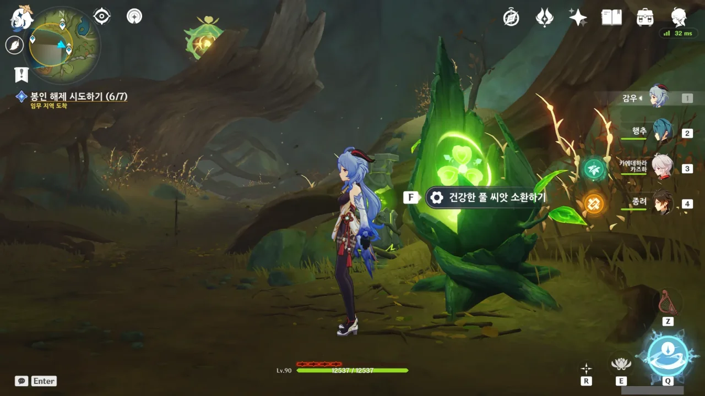

마라나의 화신의 봉인을 해제할 때마다 이번 퍼즐은 지금껏 있었던 모든 퍼즐의 총집편이라는 인상을 지울 수 없다.

불붙여서 푸는 바위 자물쇠, 풀 씨앗 맞춰서 여는 과녁, 수금 뜯어서 여는 막힌 벽... 지금껏 봐온 퍼즐 아닌가.

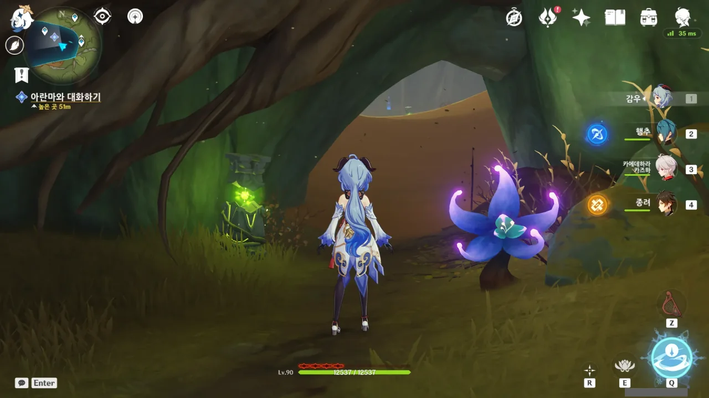

이번 퍼즐을 모두 해결하니, 아까 처음 출발한 곳으로 되돌아왔다.

어째 처음 주변을 둘러봤을 때 벽 한쪽이 부자연스럽게 막혀있었는데, 이거 때문이었구나.

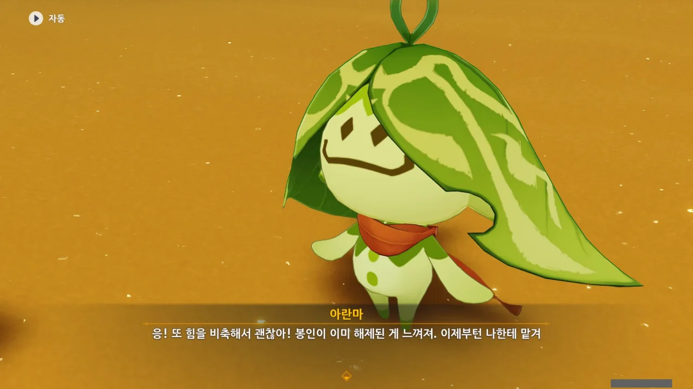

아란마 역시 힘을 회복했다.



응? 모래가 사라진다고?



정말로 모래가 사라진다.

사실 사라진다기보다는, 수챗구멍에 모래가 빨려 들어가는 모습이라고 하는 게 더 정확할지도 모르겠다.

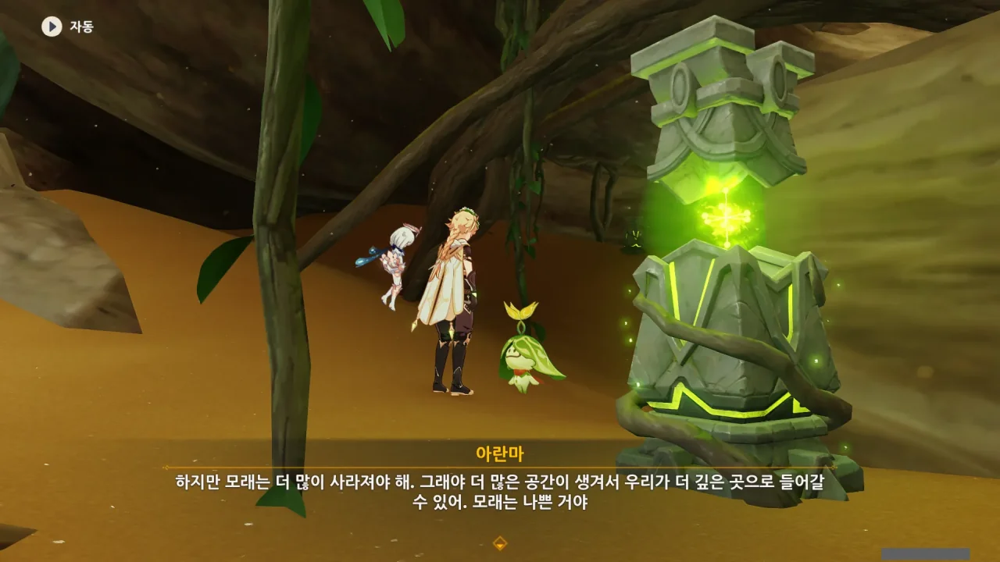

> 모래는 나쁜 거야

난 모래도 괜찮던데. 아, 물론 보는 입장에서만 그렇다는 이야기다.

해변의 모래사장에서 뒹구는 건 어릴 적에나 좋아했지, 지금은 별로 좋아하지 않는다. 사막의 모래도 비슷한 느낌이겠지.



파멸의 유적 가디언을 보고, '저거와 또 싸워야 하나?'라고 생각했는데, 정말로 그렇더라.

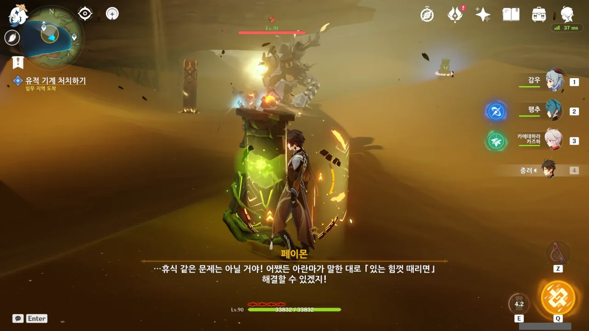

기껏 죽여놨더니 주저앉아서 체력을 회복하고 다시 덤비는 파멸의 유적 가디언.

체력 회복은 너무한 거 아니냐고.

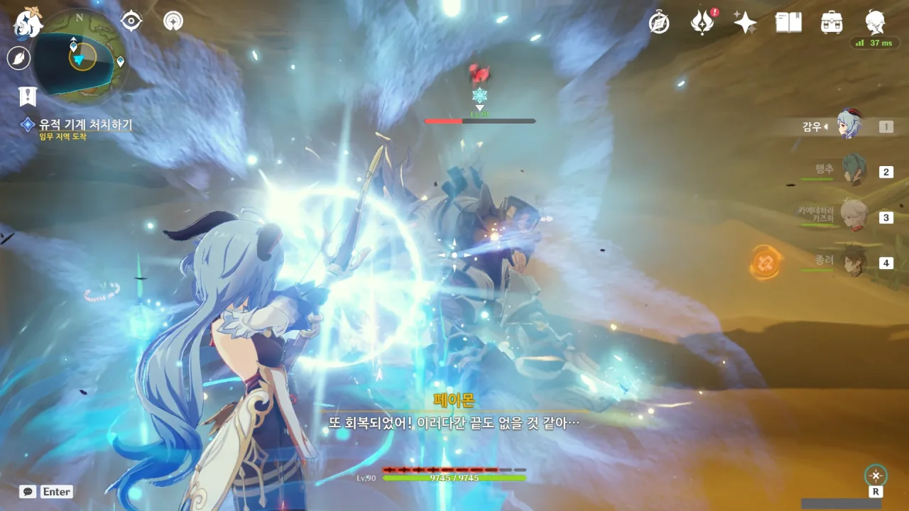

아란마! 뭐라도 좀 해봐! 나 이러다 죽겠다!

심지어 주변의 모든 풀 기둥이 잠겨버려서 쌓인 침식 스택을 제거할 수도 없다.

이러다 진짜 파티가 전멸하겠는데?



아란마가 파멸의 유적 가디언을 그냥 봉인해 버린다.

아무튼 침식 스택도 다시 4칸으로 줄어들었으니, 적당히 해결된 거로 하자.

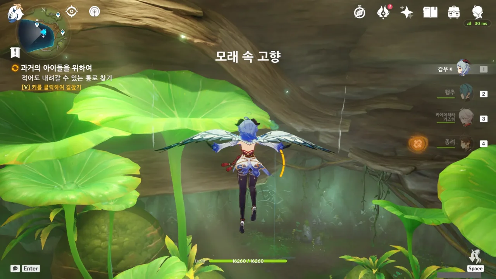

컷신이 끝나자, 내 캐릭터가 갑자기 하늘에서 뚝 떨어지고 있었다. 급하게 바람의 날개를 폈다.

아니, 이게 대체 무슨 일이래?

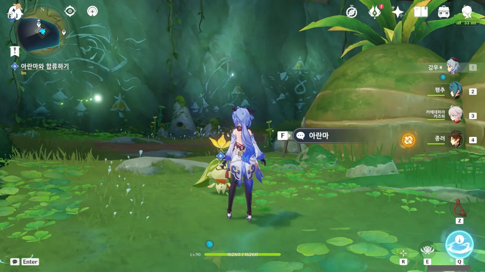

아란마가 또 기억을 까먹어, 주변을 돌아다니며 뭔가 앞으로 나아가는데 힌트가 될 만한 걸 찾아보았지만, 별다른 수확이 없다.

동굴 벽에 그려진 벽화는 아무래도 옛날에 마라나를 봉인할 때의 장면을 그린 것 같다.



어느 정도 기억을 회복한 아란마가 말해주길, 여기는 아란무후쿤다의 옛날 집이라고 한다.

다른 아란나라가 지표면에서 살 때, 아란무후쿤다 혼자서 이 깊은 곳에서 살았다고?



호랑이도 제 말 하면 온다더니, 정말로 아란무후쿤다가 나타났다.

저번에 만났던, 이름이 '???'로 되어 있고, 시간을 '해'로 제대로 셀 줄 알던 아란나라가 바로 아란무후쿤다였구나.



여기까지 오느라 벌써 많은 기억을 써버린 아란마.

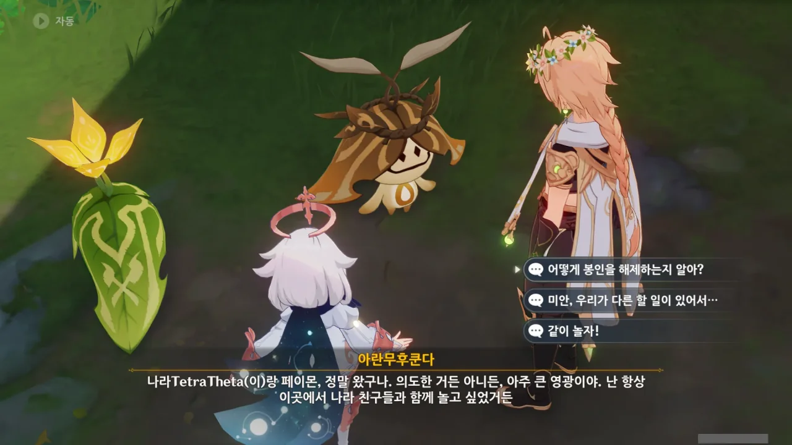

아, 그래서 여기에 의자가 있던 거였어? 난 아란나라가 의자에 앉을 수도 있는 건가, 신기해 했었는데.



저번에 '아란마가 새로운 아슈바타 나무가 되는 거 아냐?'라고 생각했었는데, 그 생각은 날이 갈수록 더 굳어지고 있다.



아란무후쿤다가 마지막 봉인이었다고 한다.

그러니까 아란무후쿤다는 마라나와 가장 가까운 곳에서 지금껏 마라나를 감시해 오고 있었던 거구나.

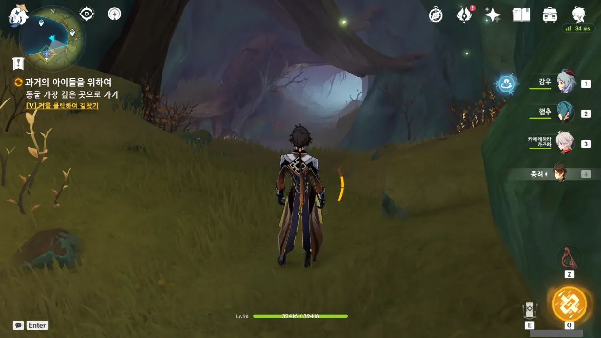

분명 아까까지만 해도 초록초록하던 공간이 조금 걸었다고 벌써 우중충해졌다.

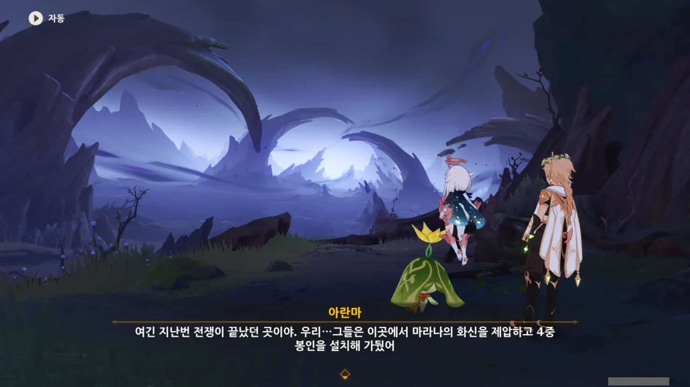

이상하다... 분명 여긴 지하 깊은 곳 아니었어? 그런데 왜 하늘 같은 것이 보이지...



그러니까 마라나는 자기 위에서 자랐어야 할 바사라 나무, 아란나라를 역으로 침식해 그 몸을 빼앗아 '화신체'를 만들었다는 거네?

죽이지 않을 이유가 없군.

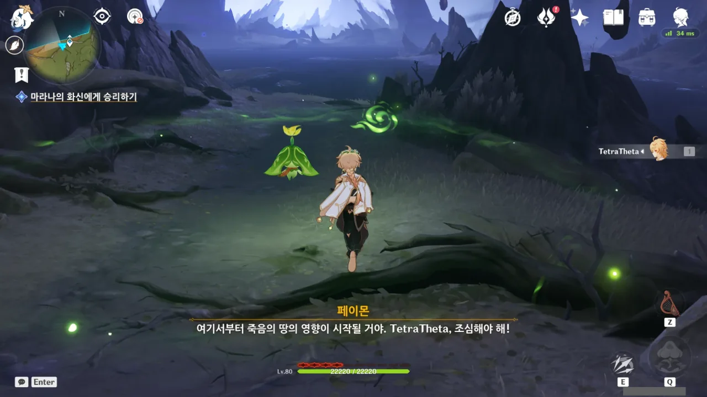

들어오자마자 또 침식 스택이 4개나 쌓였다. 게다가 조작할 수 있는 캐릭터도 강제로 여행자로 고정되었다.

안돼! 이런 미친 짓은 그만둬! 난 내가 열심히 키워둔 캐릭터로 마라나의 화신을 잡고 싶단 말이다!

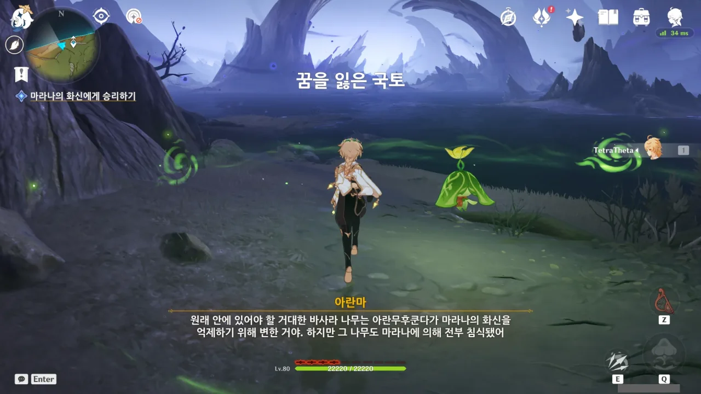

이상하다. 마라나가 침식한 바사라 나무는 아란무후쿤다가 변한 것이라고 한다. 그러면 내가 지금껏 보아온 아란무후쿤다는 대체 뭐지? 아란나라는 바사라 나무와 아란나라의 모습을 자유자재로 바꿀 수 있는 건가?

어찌되었건, 마라나의 화신을 죽일 이유가 또 하나 늘었다.

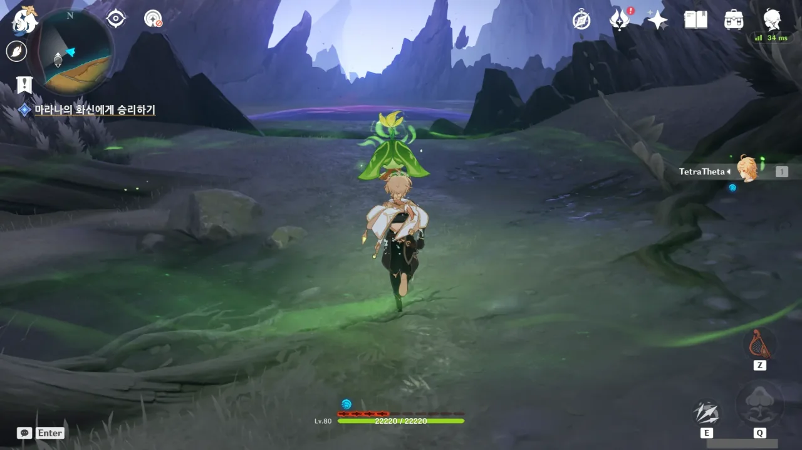

저기 앞에 뭔가 검보라빛, 거무튀튀한 것이 바닥에 깔려 있다.



그리고 거기서 튀어나오는 무언가. 저게 아마 마라나의 화신이겠지.

그런데 왜 난 여기서 이 이미지가 생각난 걸까?



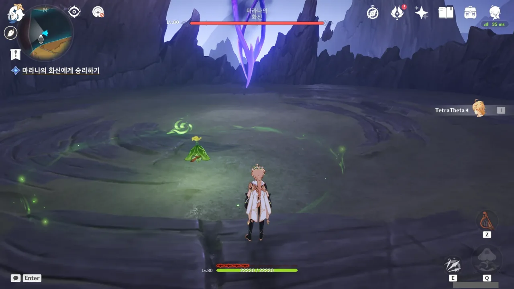

아니, 잠깐만. 지금 나보고 공중에 떠 있는 적을 한손검 캐릭터로 때리라고 하는 거야? 그것도 90레벨이 아닌 80레벨 캐릭터로? 이게 말이야, 방구야?

내 원래 여행자가 지금 고작해야 60레벨 정도밖에 되지 않았을 테니, 지금 내가 조작하고 있는 여행자 캐릭터는 이번 월드 임무 전용으로 설계된 캐릭터이겠지만, 그래도 이건 아주 너무한데.

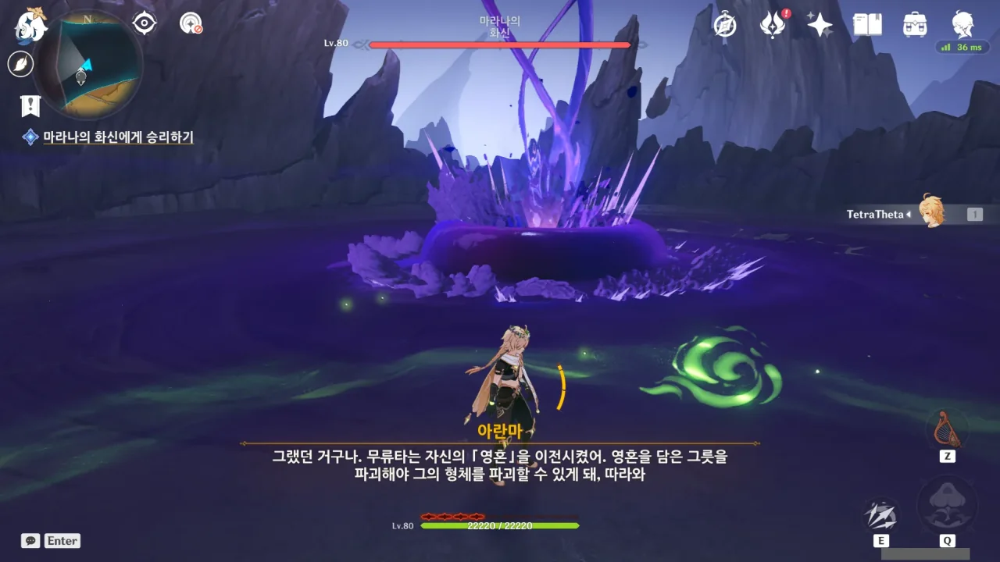

'무류타'가 마라나의 이름인 건가?

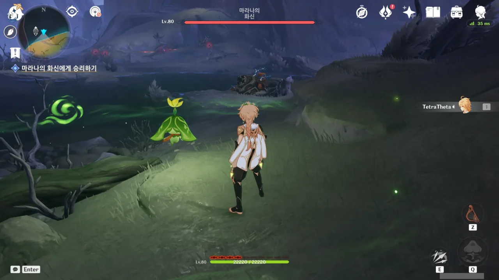

아니, 젠장. 또 죽음의 땅이야?

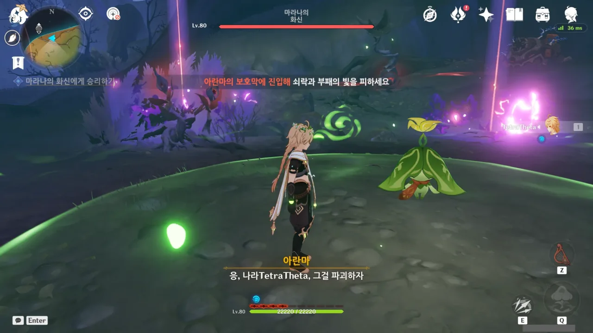

하늘에서 레이저 폭격 같은 것이 마구 떨어진다.

궁금해서 한 번 맞아보니, 공격이 한 번만 들어오는 게 아니라 레이저 공격처럼 여러 번 맞는 구조라, 대미지가 좀 아프게 들어온다.

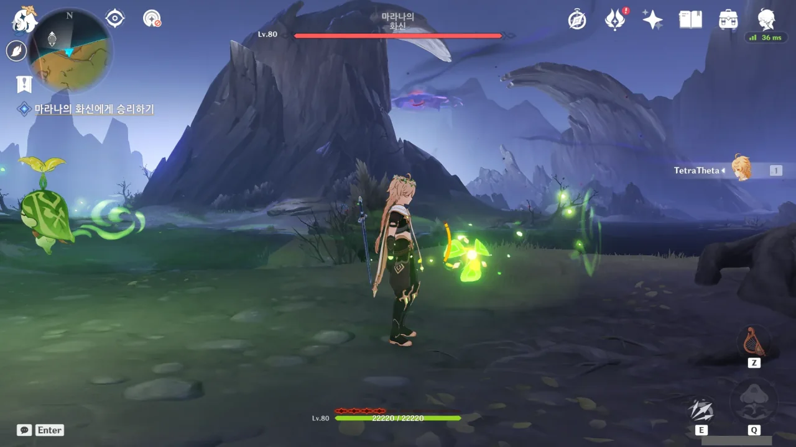

난 여기서 한손검 하나로 열심히 뺑이치고 있는데 마라나의 화신은 저게 가운데에서 느긋하게 포격이나 날리고 있는 게 굉장히 마음에 들지 않는다.

또 마라나의 화신을 죽일 이유를 찾아내셨군요. 정말 끝이 없습니다.

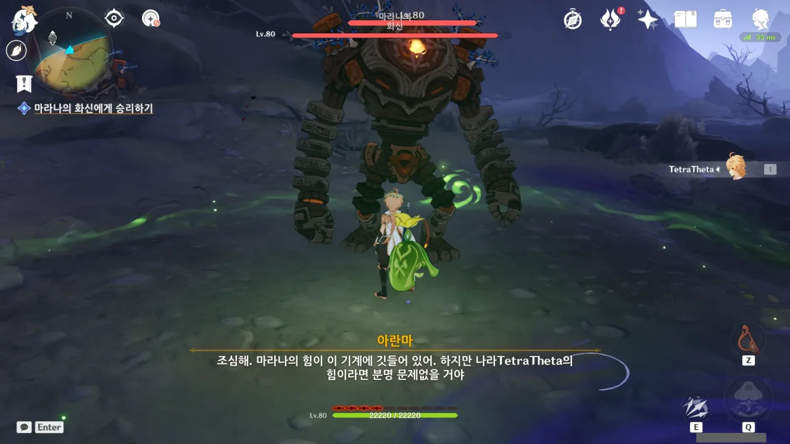

얼씨구? 이젠 유적 가디언까지 나타난다.

여행자가 80레벨이라서 그런가, 공격력이 굉장히 낮다. 어휴... 내가 애지중지 키운 감우라면 벌써 이런 유적 가디언은 강공 차지 서너 번으로 잡았을 텐데...

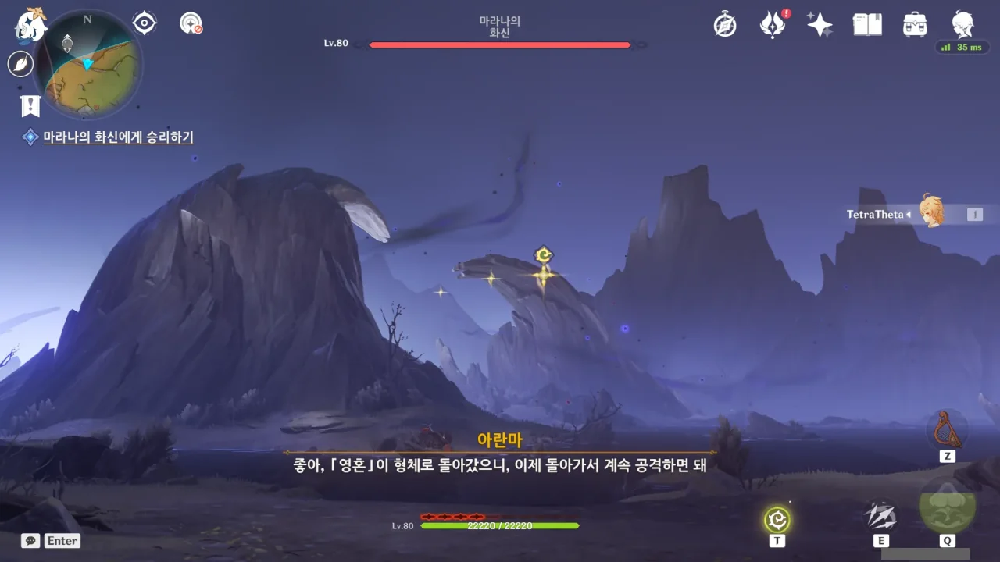

가운데에 있던 마라나의 화신이 보이지 않는다. 이제 포격하지 못하겠지?

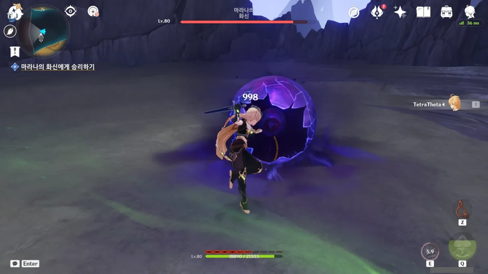

여행자가 하는 거라곤, 그저 땅바닥에 힘없이 떨어져 있는 마라나의 화신을 한손검으로 주야장천 때리는 것이다.

이... 이게 보스전?

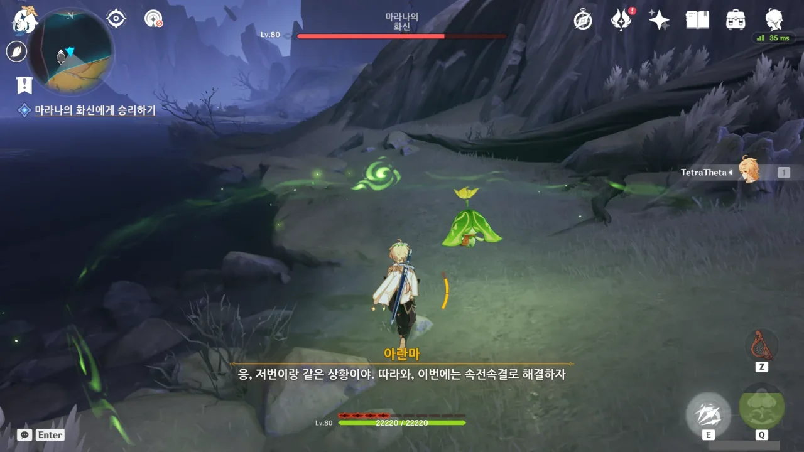

물론 마라나의 화신은 다시 기운을 차리게 되고, 여행자는 또다시 마라나의 화신의 '영혼'을 수확하기 위해 이동하게 된다.

어... 이건 좀 아니지 않니?

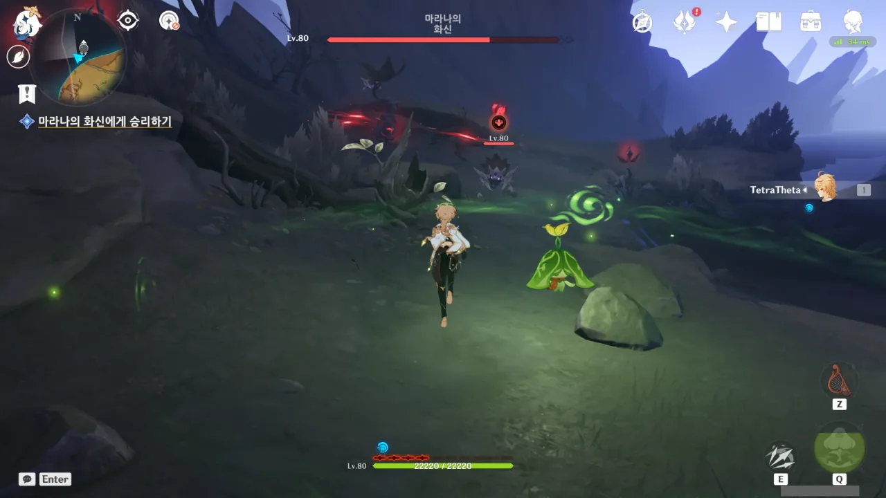

아, 젠장맞을. 난 저 수계 사냥개가 정말 싫어.

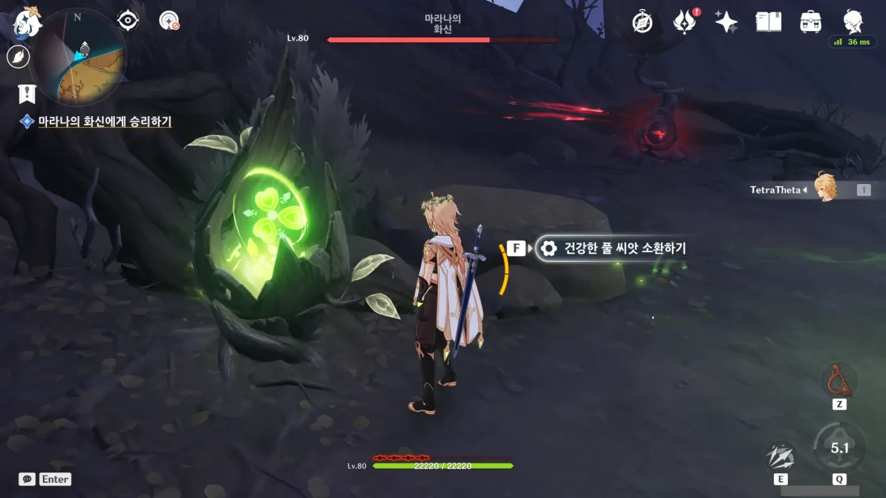

그러고 보니, 여기 나오는 풀 씨앗은 전부 크고 굵은, 건강한 풀 씨앗이다.

죽음의 땅 혹을 제거하려면 풀 씨앗을 써야 하는데, 활은 그냥 대충 맞춰도 풀 씨앗이 혹을 향해 날아가지만, 한손검은 강공격으로 때려야 풀 씨앗이 날아가더라.



마라나의 화신이 땅에 떨어져 정신을 못 차리자, 아란마가 마라나의 화신을 봉인하려 한다.



그리고 그대로 봉인을 조여간다. 오... 봉인을 저렇게 하는 거였나?



하지만 봉인은 아쉽게도 실패했다.

마라나의 화신이 봉인을 터트리고, 기운을 모아 슈퍼노바 레이저를 아란마에게 쏜다.



아란마가 배리어를 쳐서 레이저 공격을 막아주고는 있는데, 어째 많이 위태로워 보인다?

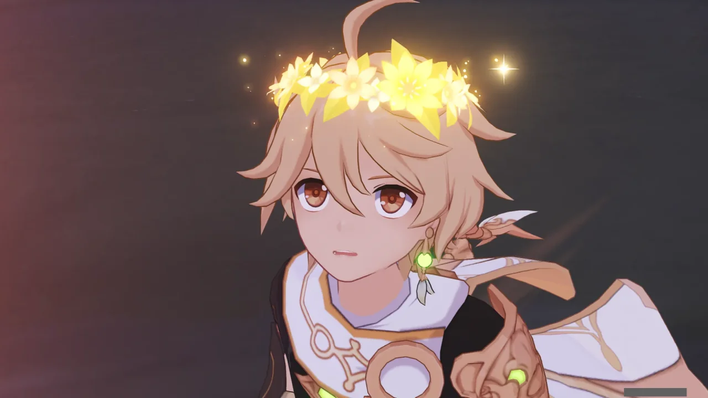

그때 여행자 머리에 있던 화관이 밝게 빛나기 시작한다.





그동안 있었던, 아란나라와 함께한 추억이 스쳐 지나간다.

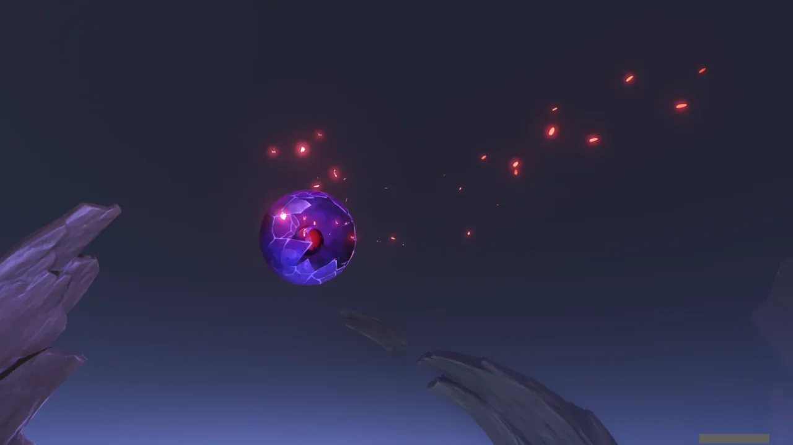

다행스럽게도 마라나의 화신의 레이저 공격은 무한정 쏠 수 있는 것이 아니었나 보다.

힘이 다한 듯 비틀비틀하며 땅에 떨어지는 마라나의 화신.



그동안 만났던 아란나라들의 응원을 받으며 화신을 실컷 두들겨 팬다.

그런데 잡몹이 너무 많이 나오는데요, 이거.

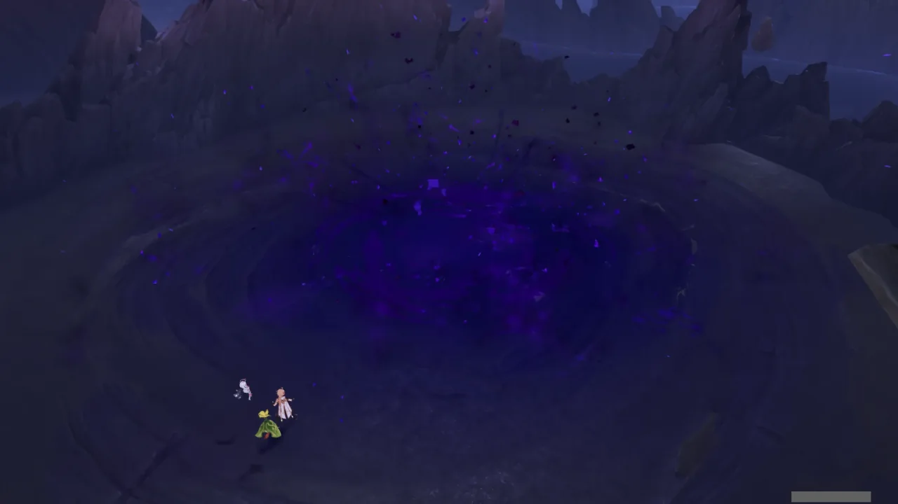

그래도 아란나라들의 응원 덕분일까, 쭉쭉 차오르는 원소 게이지와 빠른 E 스킬 회복은 못 이기더라. 어째선진 몰라도 중간중간 체력이 회복도 되었고.

그게 아니었더라면 금방 나가떨어졌을 정도로 잡몹이 많이 나왔다.

&nbsp;

아무튼, 힘이 다한 마라나의 화신은 팍하고 터져버렸다. 뭔가 시시한 결말이다.

&nbsp;

아, 그래. 이 말을 빠트릴 뻔했다.

마라나의 화신, 다시는 보지 말자.
