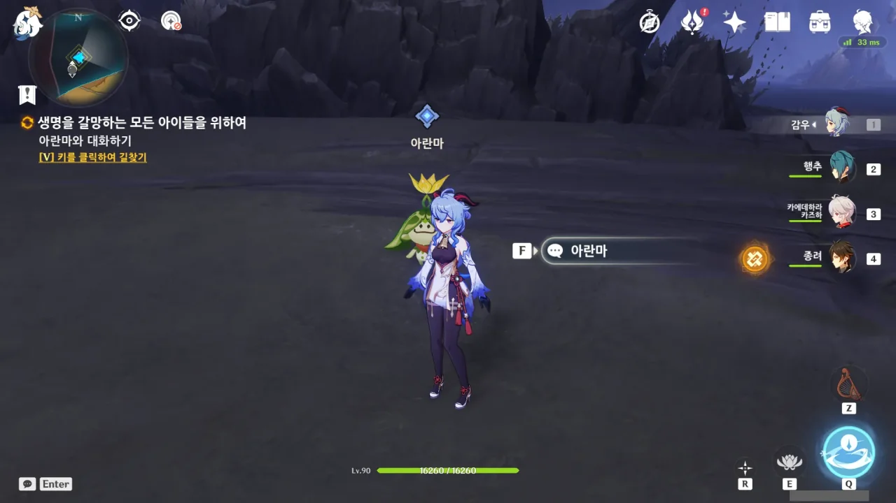
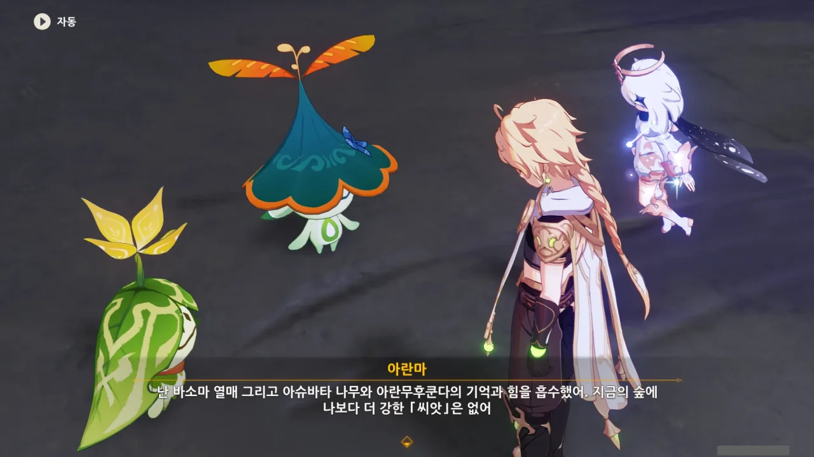
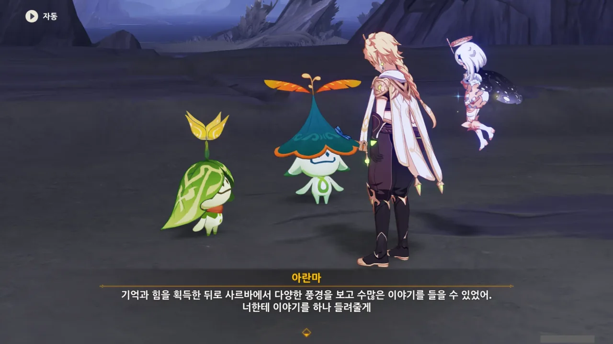
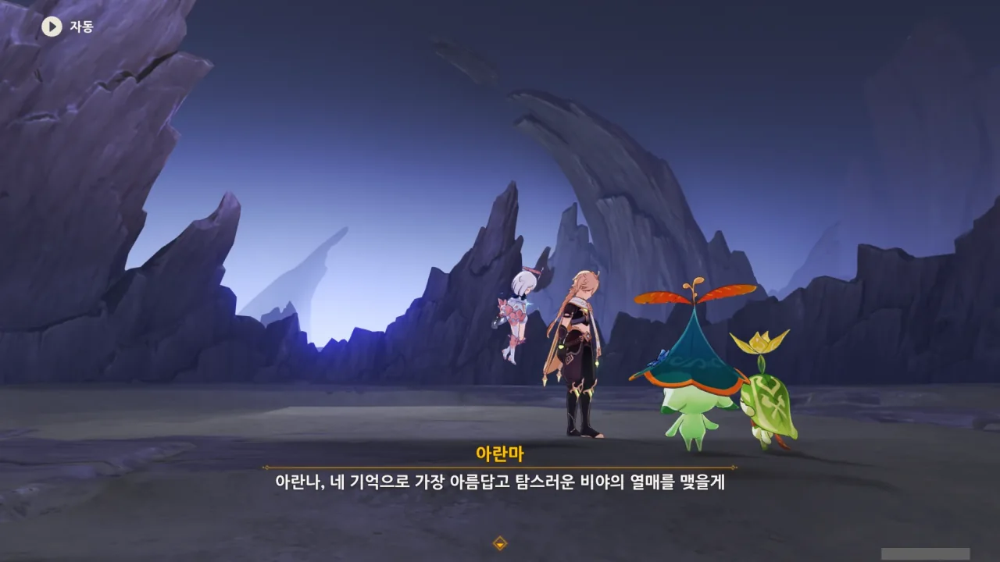
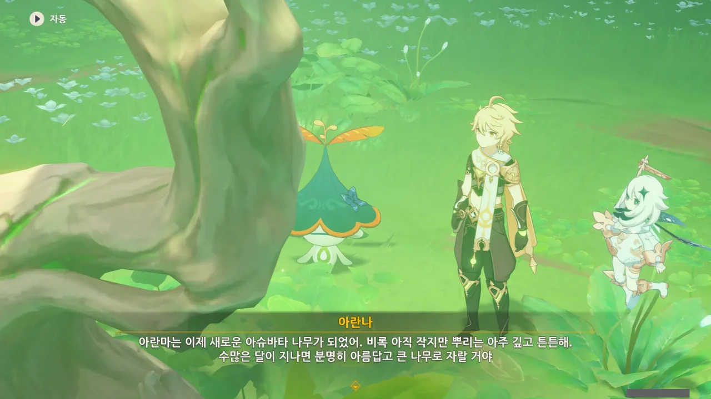
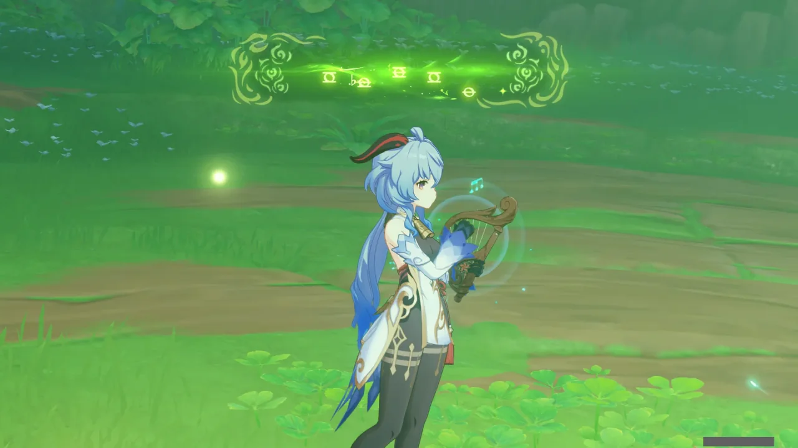
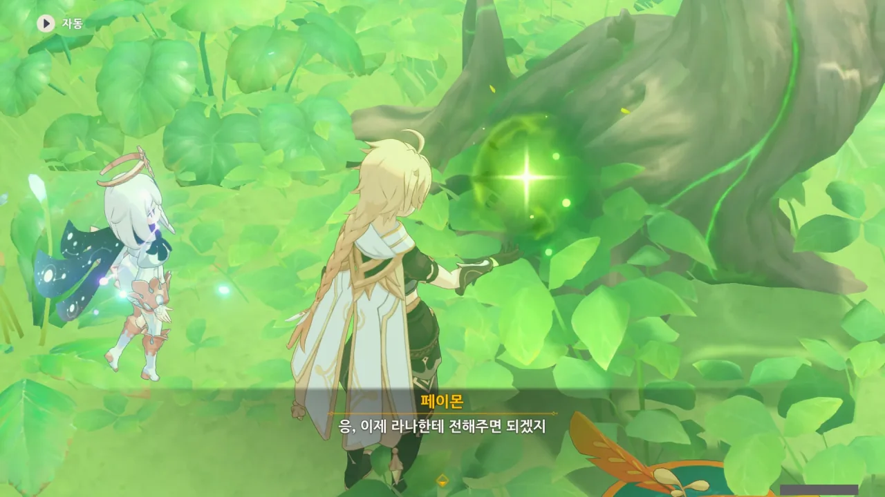
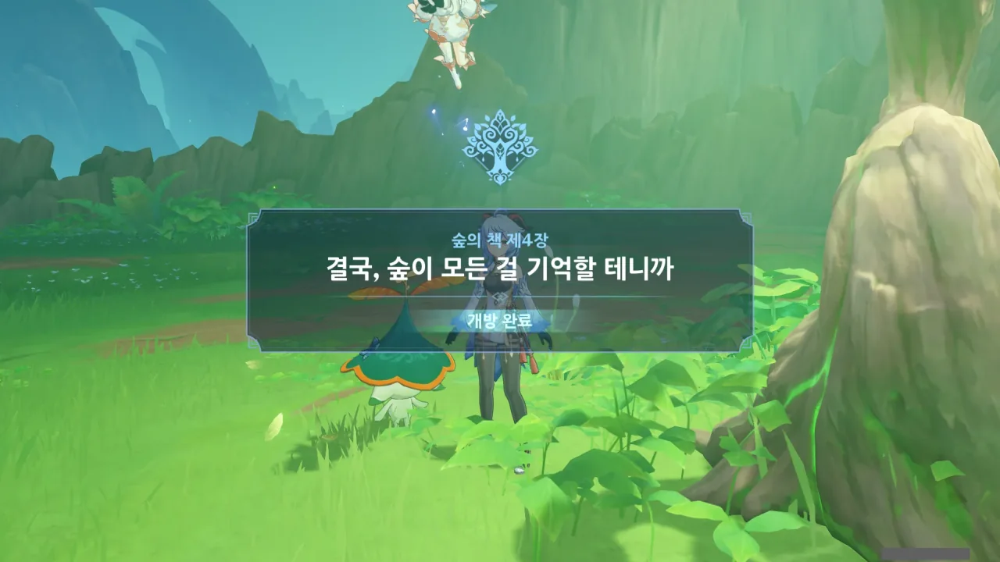
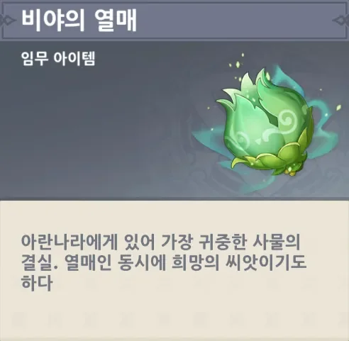

마라나의 화신을 처치했다.

전투 다 끝나고 나서야, 내가 쓰던 캐릭터를 돌려주네.

난 예전부터 마라나의 화신 눈깔에 감우 화살을 박아 넣는 걸 기대하고 있었다고! 이렇게 한손검을 휘적휘적 휘두르는 게 아니라...



아, 조금 전 아란나라들의 응원이 단순한 응원이 아니라 정말 힘을 보태준 거였어? E 스킬 대기시간이 짧고 체력 회복이 되는 게 단순한 시스템 지원이 아니었구나.



이제야 깨달은 건데, 여행자가 머리에 쓰고 있던 화관이 사라졌다.

아까 마라나의 화신을 처치할 때 빛나며 무언가를 한 후, 그대로 소멸한 것 같다.





이대로 영영 마라나가 없어졌으면 좋겠지만, 이미 사르바에 마라나의 기억이 생겨버린 탓에, 이를 제거하지 않는 한, 먼 훗날 또다시 마라나가 나타날 것이라고 한다.

뭐, 그건 한참 나중의 일이니, 내가 신경 쓸 필요는 없겠지.



비야의 열매를 만들려면 아란나의 기억을 사용해야 한다고? 왜 난 그걸 여태껏 몰랐지?

난 그냥 아슈바타 나무에서 비야의 열매를 얻은 다음, 아란나에게 가져다주면 될 줄 알았는데.



땅 밑으로 쑥 꺼진 아란마를 보고 '어, 설마 진짜 비마라 마을에 있는 아란나를 데리러 간 건가?'라고 생각했는데, 정말이었다.



아란무후쿤다의 기억을 통해 「워프 아란라칼라리」를 배운 아란마가 아란나를 순식간에 여기로 데려온 것이다.

그런데 여기서 싸운 게 비마라 마을에서 느낄 수 있을 정도로 거셌나? 여기서 비마라 마을까지는 꽤 먼 거리일 텐데...





예상했던 대로, 아란마가 새로운 아슈바타 나무가 되는 전개였다. 그리고 아란나의 기억과 꿈으로 비야의 열매를 맺고, 그걸로 라나를 치유하는 것이다.

이렇게 될 줄은 알았지만, 아란마와 헤어진다니, 매우 아쉽다.

아슈바타 전당의 세 바사라 나무, 아슈바타 신전의 아슈바타 나무, 아란무후쿤다의 기억과 꿈, 힘을 모두 전해 받은 아란마가 현재 가장 강한 「씨앗」이다.



원래 자기 눈과 몸을 통해 자신만의 기억을 쌓을 생각이었지만, 상황이 상황이다 보니 아란마가 새로운 바사라 나무의 왕, 아슈바타 나무가 되게 되었다.



아슈바타 전당에 있던 세 바사라 나무 역시, 아란지, 아란야마, 아란마하가 변한 것이고, 거기서 얻은 바소마 열매는 그들의 기억이다.



아란마가 아슈바타 나무가 되어버리면, 지금처럼 함께 수메르를 돌아다니지 못할 텐데... 그게 너무 안타깝다.

아란마가 사르바에서 다양한 풍경을 보고 수많은 이야기를 들을 수 있었다며, 이야기 하나를 들려준다.

그런데 사르바는 대충 '저승'이라는 뜻 아니었어? 대체 사르바가 뭘까?



아직 수메르 우림 지역 서쪽에 있는 사막이 열리지 않았는데, 그곳에 대한 이야기인 것 같다.





> 언젠가 우리의 꿈과 우리의 기억이 하나가 되어 무수하게 많은 사르바의 나뭇가지 위에 꽃을 피울 거야.

사르바는 무슨 나무인 걸까? 음... 그럼 세계수? 사르바는 세계수인 걸까?

지맥의 기억을 간직하는 세계수라면 지금까지의 모든 것이 전부 말이 되긴 한데...





아란마가 땅속으로 사라지고, 그 자리에 작은 나무가 자란다. 황량하던 대지에 초록빛 풀이 자라난다.

비야의 열매를 얻는 데 필요한 아슈바타 나무와 아란나의 기억 모두가 이제 준비되었다.

뿌리가 아주 깊고 튼튼하다 했으니, 아란마도 언젠간 아슈바타 신전의 나무처럼 엄청나게 크게 자라겠지.



> 하지만 친구가 추억보다 더 소중해.
> 기억은 다시 쌓을 수 있지만 잃어버린 친구는 다시 돌아오지 않아.

그래. 그래서 내가 이제 곧 사라질 아란나의 추억을 안타까워하면서도 아란나를 말리지 못하는 것이다.

추억은 다시 쌓을 수 있지만, 죽어버린 친구는 다시 돌아오지 않을 테니.



그래. 아란나가 라나와의 추억을 잊는다고 해도, 여행자가 그걸 기억할 것이다. 어쩌면 라나 역시 아란나를 기억할지도 모르지.



아란마와 아란나에게 「위대한 꿈의 멜로디」를 들려준다.

아란나의 기억이 응축되어 만들어진, 비야의 열매를 얻었다.

> 결국, 숲이 모든 걸 기억할 테니까
{.bq}

이 말 만큼 씁쓸한 말이 과연 있을까.



정말로 그동안의 모든 기억을 다 잃어버린 아란나.

괜찮다. 자기소개는 몇 번이고 다시 할 수 있으니 말이다.



그래도 비야의 열매와 아슈바타 나무를 보고, 그동안 무슨 일이 있었는지 어렴풋이 눈치챈 것 같다.



어허, 같이 가야지. 어딜 혼자 보내려고.



라나가 기억을 잃은 아란나를 보며 속상해할지 걱정하는 것 같은데, 그건 직접 가서 보면 되지 않을까?

> 비야의 열매
> ***
> 아란나라에게 있어 가장 귀중한 사물의 결실. 열매인 동시에 희망의 씨앗이기도 하다.
{.bq}

그래... 결국, 숲이 모든 걸 기억할 테니까...
