라나에게 돌아가기 전, 반드시 해야 하는 일이 하나 있다.

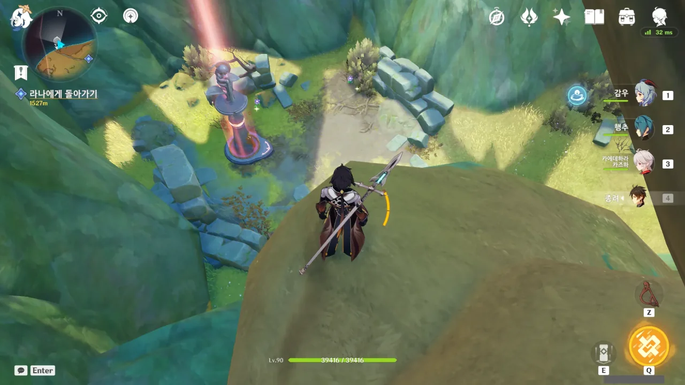

바로 신상 밝히기다. 아니, 이걸 어떻게 참겠는가? 이걸 지금 밝히지 않으면 나중에 여길 다시 와야 하는데?

게다가 신상을 하나 밝힐 때마다 신상에서 회복할 수 있는 체력의 최대치가 1,500씩 늘어난다.

지금도 신상에서 약 110,000 정도의 체력을 회복할 수 있는데, 이 정도면 파티 하나의 체력을 완전히 회복시킬 수 있는 양이다.

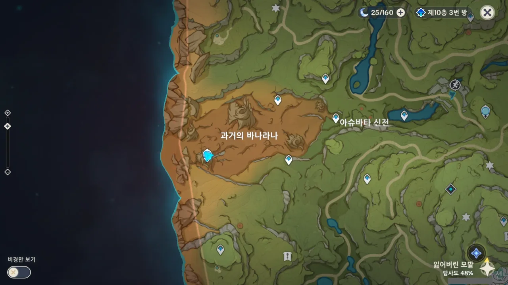

짠.

이제 라나를 보러 가자.

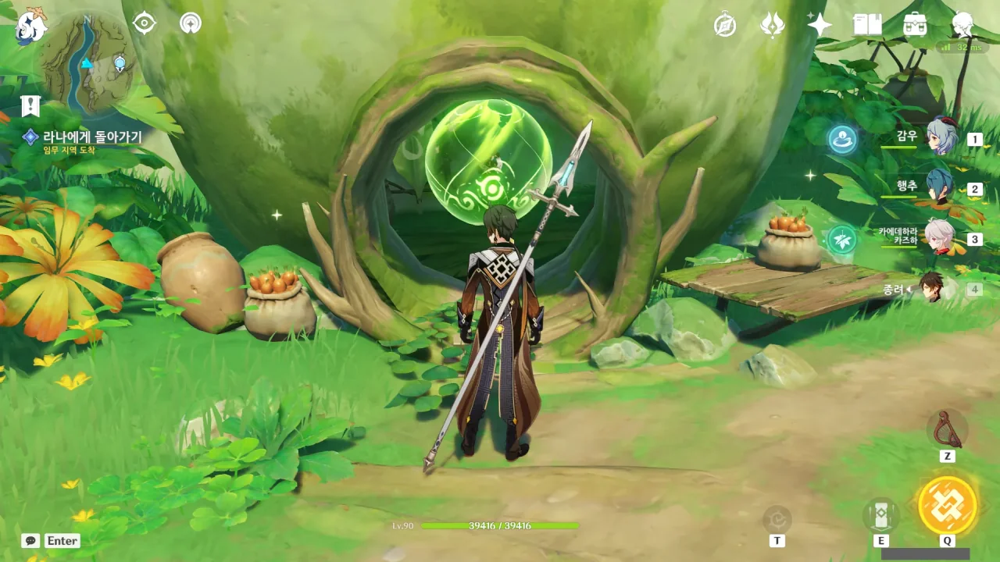

아란나가 자신의 기억을 소모해 힘을 잃은 만큼, 이 구체 역시 흩어져 사라졌을 줄 알았는데 용케도 이게 남아있네.



자신의 아란라칼라리를 알아보고 안의 사람이 자기 친구임을 눈치챈 아란나.



Hey, you. You're finally awake.

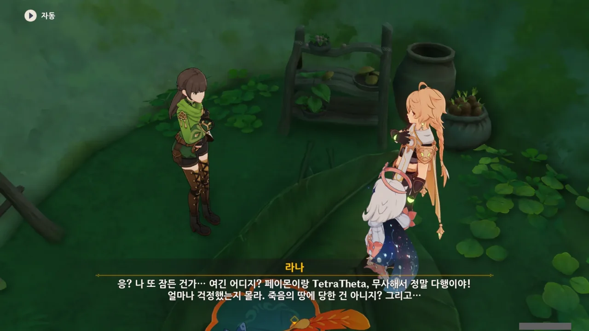

라나가 갑자기 원시 고대 이야기를 꺼내기에 잠깐 의아해했는데, 생각해 보니 라나는 숲의 책 월드 임무 초반에서 죽음의 땅에 침식된 이후 지금까지 잠만 쿨쿨 자고 있어, 여태껏 일어난 일을 전혀 몰랐던 것이다.

내가 널 살리려고 온 수메르 우림을 뒤지고 다녔단다.



라나는 아란나를 단번에 알아보고 반가워하지만, 아란나는 그저 '얘가 내 친구구나' 하는 정도의 느낌으로 대답한다.

어우, 손발이 오그라들어서 더는 못 봐주겠네.



라나가 어릴 적 그런 일을 겪었구나.

아란나가 라나에게 꽃을 선물로 줄 정도였으면 둘이 정말 친했다는 거 아냐? 아란나라가 주는 꽃은 '아란나라와의 우정의 징표'니까.



> 별 버섯은 하늘의 별이 땅에 떨어진 그림자

우트사바 축제 때, 한 아란나라가 낸 퀴즈 내용이 '하늘의 별이 땅에 떨어진 것'을 제출하는 것이었는데, 그 문제의 정답이 '별 버섯'이었던 적이 있다. 처음 할 때에는 실수로 그냥 버섯을 제출하는 바람에 정답을 맞히는 데 실패했지만.

사실 따지고 보면, 이런 이야기 역시 클리셰, 진부한 이야기라고 할 수 있다.  
어른들은 보고 듣지 못하는, 그저 어린아이들의 상상 속 친구라고 생각했던 존재가 사실 진짜 존재해서, 아이들과 함께 모험을 떠나는 이야기 말이다.

하지만 그런 진부한 이야기도 결국 어떻게 풀어내느냐가 중요한 것이다.

새로운 이야기라도 이야기를 잘 풀어내지 못하면 아무런 감흥을 주지 못하지만, 진부한 이야기라도 잘 풀어낼 수만 있다면 여운이 남는 이야기가 된다.

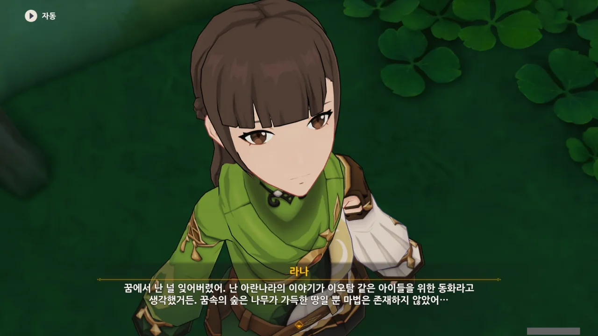

그거, 꿈이 아니라 진짜 있었던 일 아냐? 딱히 틀린 말도 아닌 거 같은데...



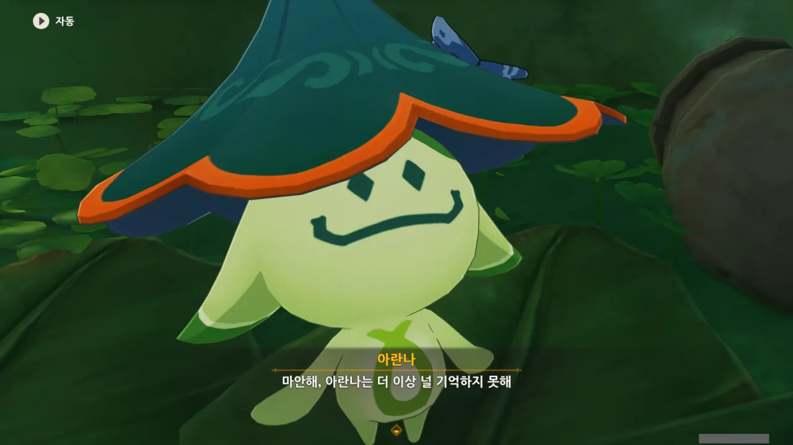

> 미안해, 아란나는 더 이상 널 기억하지 못해.

글 쓰면서 이제야 알아챈 건데, 아란나의 대사가 '미안해'가 아니라 '마안해'로 잘못 적혀 있다.

내 감동 돌-려-줘-

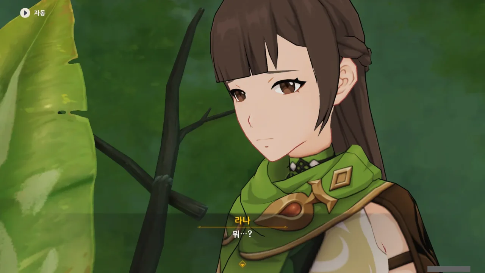

당연히 라나는 당황해한다. 친구가 자길 잊어버렸다는 게 당황스러운 일이 아닐 수 없으니.

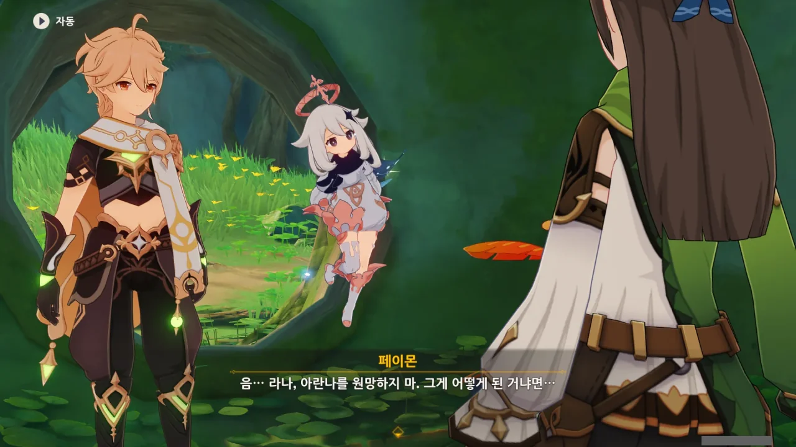



그래서 여행자가 라나에게 그동안 있었던 일을 차근차근 설명해 준다.

그 내용 전부가 저 세 줄로 요약된다는 게 조금 씁쓸하다. 내가 그동안 한 모든 게 아무것도 아닌 것처럼 느껴져서...



아란나에게 있어, 라나와 함께 했던 기억도 소중했기에, 비야의 열매로 라나의 아란나와의 기억도 같이 회복된 것으로 보인다.



우리가 한 건 조금 손을 거들어 준 것뿐이지...



그래. 라나를 치유하기 위해 라나와의 기억을 잃었지만, 그건 곧 아란나에게 있어 라나가 그 기억을 포기할 만큼 소중한 사람이었다는 증명이 된다.





그래. 기억은 또 함께 쌓아나가면 되니까.



아란나라와 함께 여행하면서 순찰관 일을 병행하는 건 분명 어려운 일일 것이다.



지금 의심 가는 사람이 딱 하나 있다. 비마라 마을의 알폰소. 그 사람이 제일 의심스럽다.





그 사람이 이것까지 예상하고 움직였을 것 같진 않은데... 이건 그냥 얻어걸린 게 아닐까?





이쪽도 떠돌아다니는 건 매한가지인데...

이쪽은 여동생 하나 찾기 위해서 전 티바트 대륙을 떠돌아다니고 있다고. 변변한 집도 없어서 잠도 아마 주전자 안에서 잘 걸?

라나는 아예 떠나는 것이 아니라, 다시 마을로 돌아올 것이라고 한다.



라나가 아란나에게 다시 한번 같이 여행하지 않겠냐고 제안하자, 아란나가 흔쾌히 받아들인다.



둘이 처음 만났을 때처럼, 서로 다시 인사를 한다.



라나에게 신의 눈이 생겼다.

적어도 동영상으로 그걸 보여줄 줄 알았는데, 텍스트 세 줄로 때워버리니, 실망이 이만저만이 아니다.



그래도 신의 눈이 있으니, 수메르를 여행할 때 곤란해질 일은 드물겠네.



아, 그러고 보니, 숲의 순찰자는 전부 타이나리 밑의 사람들이지.

무작정 여행을 훌쩍 떠날 수는 없는 법이다.



어디에서 본 건진 몰라도, 지나갈 때마다 '모험이 순조롭길!'이라고 인사하는 NPC가 있었던 것 같다.

모험이 순조롭길!



과연 나중에 라나를 다시 볼 수 있을까? 층암거연에서 만났던 지경도 인상 깊은 NPC였지만, 영영 실종된 거로 처리되었거든.

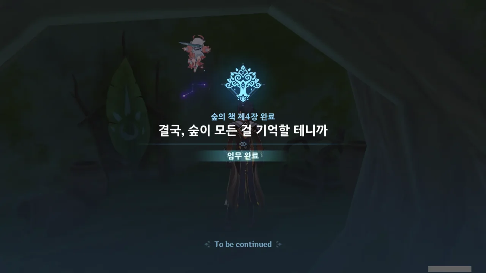

숲의 책 월드 임무 완료!

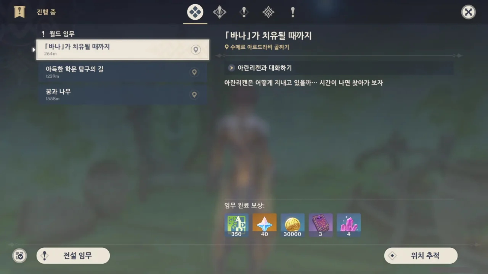

하지만 아직 남은 파생 월드 임무가 있다. 이건 나중에 해야지.

일단은 비마라 마을에 가서 그 수상쩍은 남자와 이야기를 나눠봐야 하지 않겠는가.

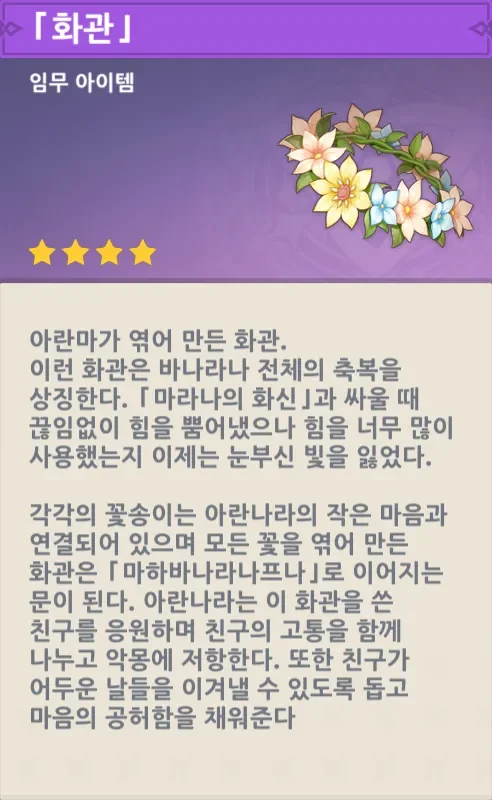

난 화관이 영원히 사라졌을 거로 생각했는데, 4성 임무 아이템이 되어 다시 돌아왔다.

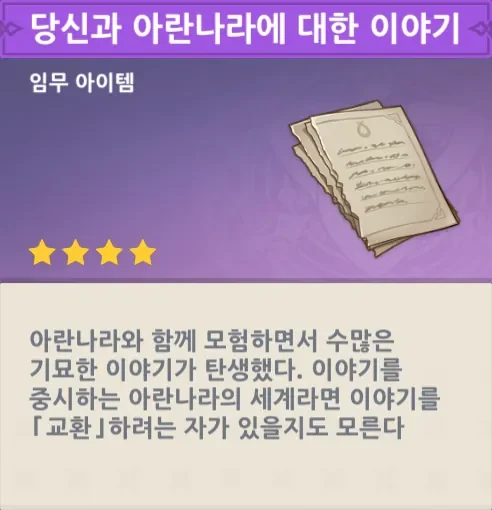

이 이야기는 과연 누가 사갈까?

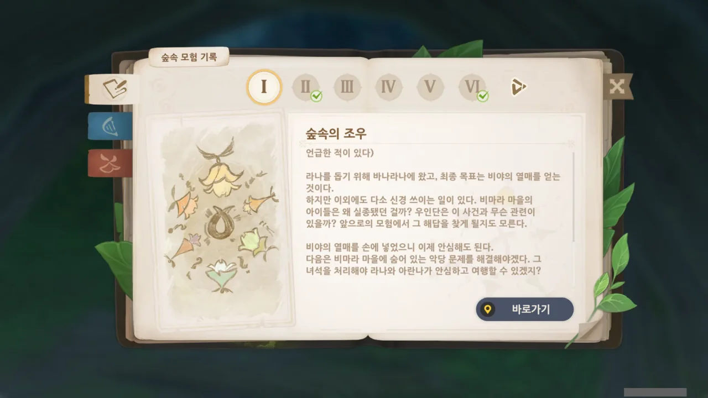

그리고 숲의 책 임무가 끝났다고 해서 정말로 모든 게 끝난 건 아니다. 이 모험 기록을 보면, 3번, 4번, 5번이 아직 완료되지 않았다고 나오지 않은가.

게다가 그림만 보고 보물상자가 매장된 위치를 찾아가는 것 역시 11번 그림 밑에 '아직 갈 수 없는 지역이다'라는 설명이 적혀 있다.

아마 3.1 버전이 나와야 끝을 볼 수 있겠지.

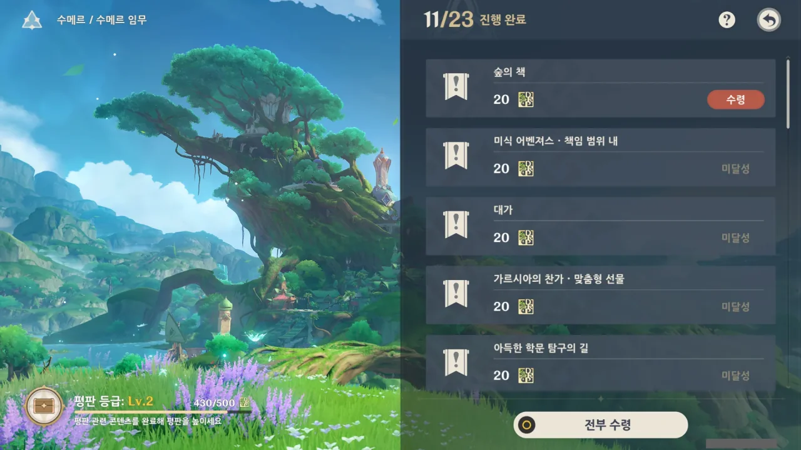

아니, 그런데 그 길고 긴 숲의 책 임무를 끝냈는데 다른 월드 임무처럼 고작 평판 20점만 준다고? 최소한 50점은 줘야지!
