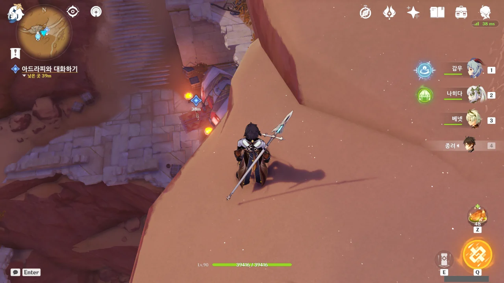
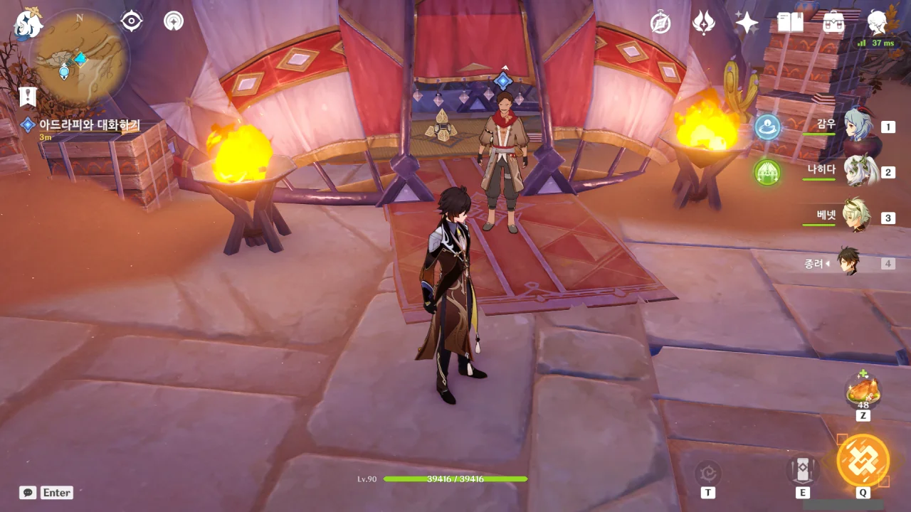
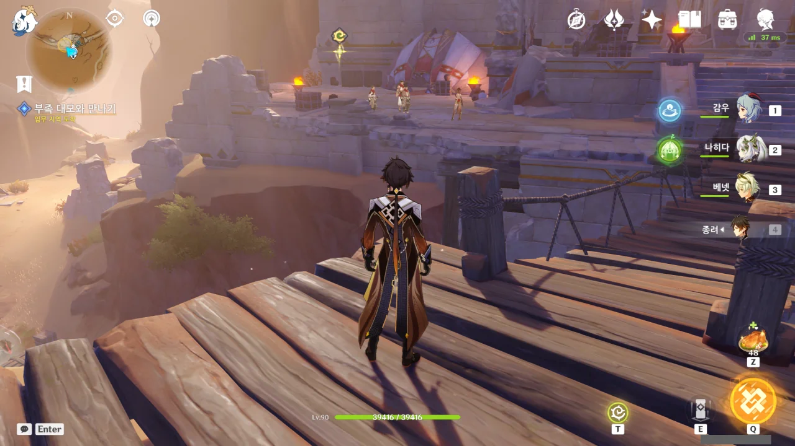
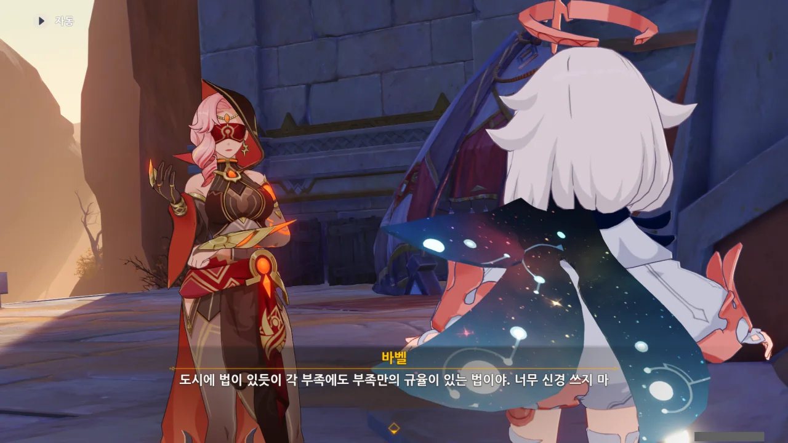
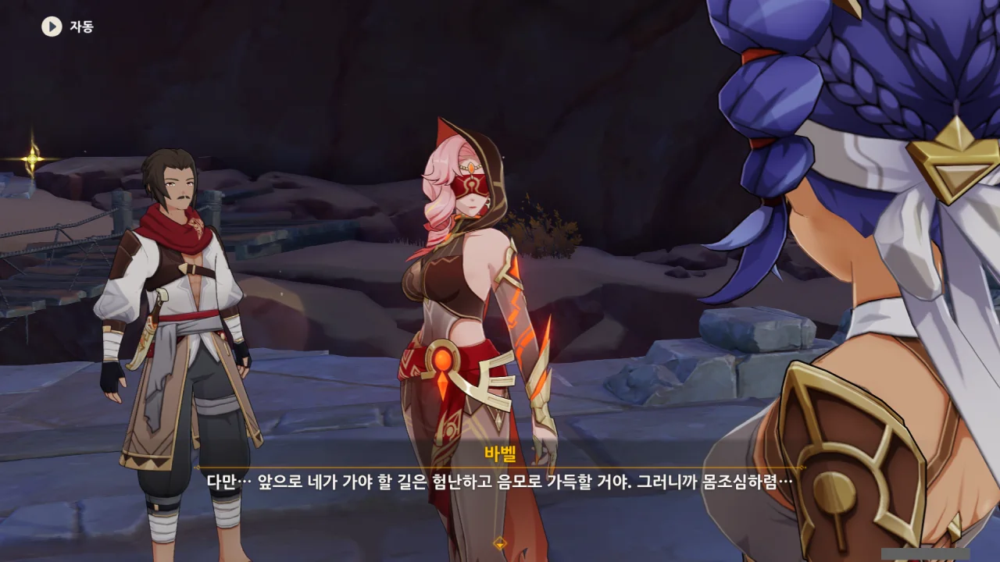
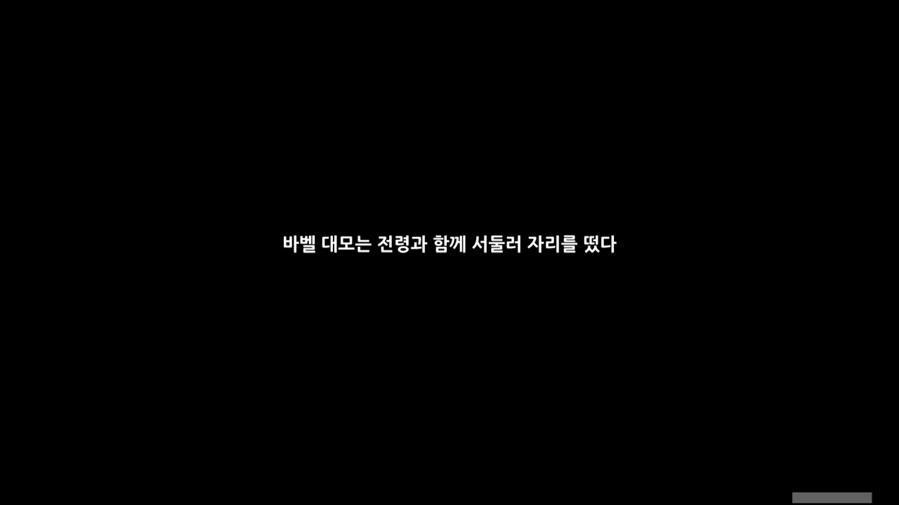
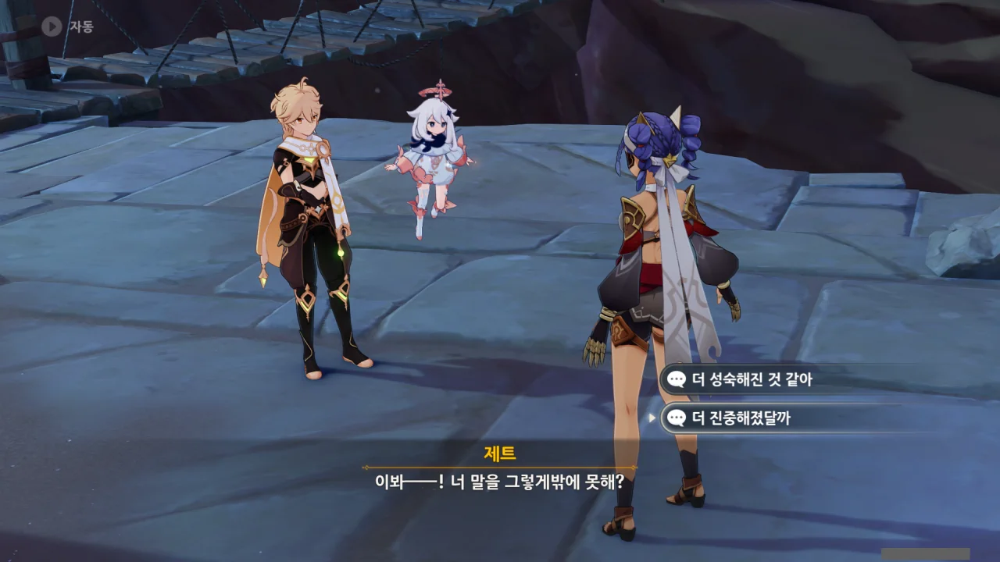

이야, 드디어 숲의 책, 황금빛 꿈을 이은 빌키스의 애가 임무를 시작하는구나...

숲의 책은 수메르 우림 지역의 이야기라면, 황금빛 꿈과 빌키스의 애가는 수메르 사막 지역의 이야기이다.

아아, 숲의 책은 정말 임무가 증식에 증식을 거듭하는, 처음 보는 형태의 월드 임무였어... A 임무를 완료하려면 B, C 임무를 해야 하고, B 임무를 완료하려면 D, E 임무를 해야 하고 D 임무를 완료하려면 H, I 임무를 해야 하는 그런 식의 임무였다. 나중에 가서는 '내가 왜 이걸 하고 있더라?'라는 생각까지 들었다니까.

황금빛 꿈은 그냥 단편성 월드 임무일 거로 생각해 사진을 전혀 찍지 않아, 지금 남은 사진이 단 한 장도 없다. 적왕과 관련된 월드 임무여서일까, 굉장히 허무하더라.

&nbsp;

아무튼.

'빌키스의 애가' 임무의 시작은 '황금빛 꿈'에서 만난 제트가 모험가 길드를 통해 여행자에게 편지를 보내 여행자를 자기 부족으로 초대하는 것이다.

그리고 그 부족을 찾아가니, 웬 부족원 둘이 길을 막고서 검문하더니, '누구누구를 먼저 찾아가 이야기하라'라고 하는 상황이다.

&nbsp;

그런데 왜 그 상황에 대한 사진이 없냐고? 모험가 길드에서 있었던 일은 내가 일일 임무를 하느라 사진을 미처 찍지 못해서이고, 검문 이야기는 하드라마베스 사막 탐험 도중 갑자기 컷신으로 납치되어서 그렇다.

분명 난 골짜기 위를 지나갔는데, 갑자기 컷신이 재생되더니 검문 이야기가 나오고, 그 컷신이 끝나니까 난데없이 골짜기 밑에 서 있더라? 컷신 판정 범위가 너무 넓은 거 아냐?

일단 이 아저씨와 이야기를 해보라고 하는데... 뒤에서 둠둠인지 붐붐인지 아무튼 이름이 잘 기억나지 않는 기계가 있는 것으로 보아, 여기가 제트의 집인 것 같다.

안에 아카데미아에서 몰래 유출해 온 논문과 책이 있던데, 제트가 공부를 꽤 하는 모양이다. 논문 제목부터가 좀 난해해 보이던데.



'그런 사람이 있긴 한데'라니... 설마 제트가 부족 몰래 편지를 보낸 상황은 아니겠지? 보통 부족에 손님이 올 예정이라면 그런 정보가 부족 전체에 퍼지지 않나? 최소한 손님을 맞이할 사람은 알고 있을 거 아냐.

&nbsp;

설마... 제트, 왕따당하고 있는 건 아니겠지?





뭐 이딴 싸가지가 바가지인 놈이 다 있지?

처음 보는 사람에게 대뜸 '이상한 복장을 한 부잣집 친구'라는 무례한 말을 내뱉질 않나, 그 외부인 앞에서 '외부인에게 나쁜 걸 배운다'라고 하질 않나...

다만 여행자의 옷이 정말 배를 깐, 이상한 복장이라 복장에 대해선 차마 뭐라 말을 못 하겠더라.

&nbsp;

내가 듣기로, 실제로 사막에 사는 부족은 폐쇄성이 크긴 해도 절대 이딴 식으로 손님을 푸대접하지는 않는다고 알고 있다. 사막 부족에게 있어 손님은 외부 정보를 가져다주는 좋은 정보원이 될 수 있으니까.

그러니까 그냥 이놈이 이상한 것이길 빈다. 나, 지금 이 부족에 대한 첫인상부터가 굉장히 안 좋아졌거든.



오, 이 마세리아라는 아저씨는 그래도 말이 좀 통하는 것 같은데.



??? 네?

이 아저씨는 싸가지가 없는 건 아닌데, 뭔가 이상한 말만 한다. '암살자처럼 생겼다'라니, 거 기분 정말 나쁜데요. 여행자가 무슨 에지오도 아니고 말이다.



이 아저씨가 지금껏 만난 사람 중 가장 정상인 것 같다. 말을 좀 더듬긴 해도, 앞선 사람들처럼 이상한 말은 안 하잖아.

다들 '바벨 대모'를 언급하는 것으로 보아, 그 '바벨'이란 사람이 이 부족의 족장 혹은 대표인 것 같다.



나만 지금 위화감을 느끼고 있는 걸까? 제트에 관해 물어보면 다들 하나같이 일단 '제트는 착한 아이'라는 말부터 내뱉는다.

정말 제트가 착한 아이라서 저러는 거라면 모르겠지만, 지금 외부에서 찾아온 손님을 '여기 가봐라', '저기 가봐라' 이리저리 조리돌리는 모습을 볼 때, 그건 아닌 것 같거든.

제트를 괴롭히고 있거나, 제트를 부족의 치부라며 푸대접하고 있는 상황에서 누군가가 제트의 안부를 물어봤을 때, 제트를 괴롭히고 있다고 말을 못 하니 적당히 '제트는 좋은 아이야'라고 둘러대는 느낌이 든다.

이 악어들은 정말로 기르고 있는 악어였는지, 잡아서 고기를 얻진 못하더라. 아쉬워라.

임무 마커가 있는 곳으로 가는데, 저 앞에 사람들이 모여있다. 저기에 '바벨 대모'라는 사람이 있는 걸까?



아마 우리가 오기 얼마 전에 다른 외부인이 좋지 않은 목적으로 이 부족에 방문한 듯하다. 그래서 아까 만난 사람들이 우리에게 까칠했던 걸까?

아무튼 저기, 한 번만 더 기회를 달라는 남자가 굉장한 곤경에 빠졌다는 건 알겠다.



> 그녀가 네 썩은 이빨을 다 뽑아내고 네 혀를 잘라버리기 전에 말이다.

'그녀'? 말하는 걸 들어보면 바벨 말고도 다른 권력자가 있는 것으로 보이는데... 아니면 처형인 이거나. 잘 모르겠다.



> 타니트를 위해 목숨까지 바칠 수 있다면서 왜 살아서 날 만나러 온 거지?

와, 정말 잔인한 말이네. '목숨까지 바칠 수 있다면 진작 자결할 것이지 왜 날 만나러 온 거지?'라고 말하는 거 아냐. 저런 취급까지 당할 정도면 대체 얼마나 큰 잘못을 저지른 걸까?

&nbsp;

하지만 그와 별개로, 인명을 경시하는 듯한 발언이라 그리 마음에 들진 않는다.



'눈의 나라'는 분명 스네즈나야를 말하는 것일 테다. 스네즈나야에서 온 사람이라면 십중팔구 우인단일텐데... 설마 우인단은 수메르 우림 지역에서 민폐를 끼친 것도 모자라, 사막 지역에서도 민폐를 끼치고 있는 걸까?

티바트 대륙에서 뭔가 좋지 않은 일이 일어났을 때, 그 배후로 우인단, 심연 교단 둘 중 하나를 꼽으면 십중팔구 들어맞는다던데... 역시...

&nbsp;

바벨이 어르신이라 불리는 걸 싫어하는 걸 보면, 사막 부족이 으레 그렇듯, 이 부족 역시 가족공동체 느낌이 강한 것 같다.



> 네 혀에는 외부인의 독이 가득하고 머리 또한 외부인의 황금에 오염됐구나.

저 남자가 우인단에게 뇌물 같은 걸 받고 그들의 활동을 묵인하거나 그에 동참한 걸까? 그게 사형 판결을 받을 정도로 큰일인가?

> 한때 우리 부족 사람이었으니 어떻게 할지는 너희도 알고 있겠지.

부족 내에서 이런 *배신자*를 처리하는 방법이 정해져 있는 것 같다.



처형은 처형이고, 내 용건은 내 용건이고. 아, 드디어 바벨과 대화를 나눌 수 있겠네.

저 남자가 정확히 무슨 잘못을 저질렀기에 죽어야 했는진 잘 모르겠지만, 저렇게 가차 없고 냉혹한 모습을 보이는 걸 보면 바벨은 부족의 지도자인 것으로 보인다.



지금 우리와 온화한 어조로 이야기하고 있는 바벨이 조금 전 한 사람의 생명을 결딴내는 판결을 했단 걸 생각하니, 조금 으스스하다.

물론 공과 사를 구분해야 하고, 손님 앞에서 화를 낼 수도 없는 법이니 저게 당연한 행동이긴 하지만, 마치 사이코패스처럼 보인단 말이지...



조금 전 처형된 남자의 죄목은 '도둑질'이었다고 한다.

아니, 도둑질이 사형당할 정도로 큰 죄목이었어? 아냐, 그래도 우인단이 얽혔으니, 단순한 도둑질은 아니었을 게 분명하다.

이방인... 우인단... 도둑질... 벌써 내 앞날에 드리울 수많은 우인단의 그림자가 눈앞에 어른거리는 것 같다. 대체 여기서 무슨 일이 일어나고 있는 거야?

그래. 도시에 법이 있듯, 사막 부족에게도 그들만의 규율이 있겠지. 맞는 말이야. 그 규율이 선만 넘지 않는다면 말이야.

그런데 그것과 별개로, 처음 부족을 방문하는 사람에게 대놓고 틱틱대며 아니꼽게 구는 건 인성에 문제가 있는 거 아닐까?



응? 아주 좋은 타이밍이었다니, 그게 무슨 소리지? 설마 부족 내부의 재판 및 처형을 보여주기 좋은 타이밍이었다고 말하는 건 아니지?



제트가 우릴 여기에 부를 수 있었던 건 바벨의 허락이 있었기 때문이며, 그 덕분에 우리가 '타니트 사냥터'를 안전하게 지나 도착할 수 있었다고 한다. 사냥터? 웬 사냥터?

또한 제트가 우릴 부른 건 제트가 미처 마치지 못한 일 때문이라고 한다. 설마 적왕의 유산과 관련된 무언가는 아니겠지? 나, 벌써 불안해지는데. 적왕의 유산과 얽혀서 좋은 결말을 얻을 수 없단 것 정도는 다들 알 거 아냐.



'타니트 사냥터'에 관해 묻자, "너희를 사냥하는 건 아니다"라는 답변을 들었다. 그럼 사람 잡는 사냥터란 거잖아. 우리가 그 대상이 아닐 뿐이지.

설마 특정 구역을 설정해 두고 거기를 오가는 모든 사람을 잡아 죽이겠다는 그런 사냥은 아니지? 그러면 야만인과 다름없는 건데...



아무튼 무서운 건 무서운 거다.

제트가 왔다고 하니, 일단 제트와 볼일을 먼저 보자.



아까 끌려 나간 남자를 제트가 *처리*한 모양이다. 마지막 존엄은 지켜주었다고 하니, 단칼에 죽인 모양.

그러면 아까 제트가 말한 '그녀'가 제트일 확률이 높아졌다.

제트, 안 본 사이에 무서워졌어...





드디어 이쪽을 바라봐주는구나.





제트가 우리를 초대하는 일로 예전에 다른 부족민과 다툼이 있었던 듯하다. 뭐야, 타니트 부족은 그 정도로 폐쇄적인 부족이었어? 아니면 제트가 정말 왕따라도 당하고 있었던 거야?

일단 모두 바벨이 허락한 일이라고 하니, 절차적 문제는 없는 것 같지만...

당연한 일이겠지만, '제트가 미처 다 하지 못한 일'이 무엇인지에 대해선 바벨 역시 알고 있을 것이 분명하다. 일단 무슨 일인지 알아야 외부인의 방문을 허락하든 말든 할 것 아닌가.

그런데 그걸 '험난하고 음모로 가득한 길'이라고 하다니... 난 그저 친구를 만나러 왔을 뿐인데 이게 무슨 횡액이지?





바벨이 떠났다.

여기서 언급된 '아자릭'이 누군진 모르겠지만, 내 직감은 그 '아자릭'이라는 사람이 곧 등장할 거라고 속삭이고 있다. 분명 임무 진행 중 어디선가 만나겠지.



> 피부가 더 까맣게 탔어...

ㅋㅋㅋㅋㅋㅋ 아니, 무슨 말을 해도 그렇게 ㅋㅋㅋㅋㅋㅋ

아아, 옛날의 제트가 벌써 그립다. 너무 많이 변했어!



제트가 성숙해지길 바란 것도 맞고, 혼자서 잘 해낼 수 있길 바란 것도 맞긴 한 데... 뭔가 이 방향은 아닌 것 같단 말이지.



흠... 왜 난 자꾸 바벨에게 뭔가 뒤가 구질구질한 꿍꿍이가 있단 생각이 자꾸 드는 걸까?

일반적으로 폐쇄성이 강한 사회에서 혼혈은 배척받기 마련이다. 그런데 그걸 바벨이 직접 나서서 챙겨줬다고? 바벨이 제트의 아버지인 제브라엘과 정말 친한 사이가 아니었다면 이건 백방 무슨 뒤 꿍꿍이가 있단 이야기잖아.



아니, 상사병은 무슨 얼어 죽을... 나 방금 소름 끼쳤어.



부족의 남자애들이 죄다 상사병이니 뭐니 하는 실없는 소리만 해대서 그렇단다. 아니, 대체 뭘 어떻게 배워야 그런 닭살 돋게 소름 끼치는 말을 해댈 수 있는 거야?



뭔가 좀 불안하니까 덧붙이자면...

사람이 과거만 바라보고 있으면 안 되는 것이 맞긴 해도, 그렇다고 현재나 미래만 바라봐서는 안 된다. 과거, 현재, 미래 셋 다 골고루 볼 수 있어야 하거든...





오랜만에 만난 친구에게 자신이 해야 할 잡일을 떠넘기는 제트. 야, 그럴 땐 먼저 물어보는 거야! 대뜸 떠넘기는 게 아니라!
