저번에 '빌키스의 애가' 월드 임무를 시작했지만, 이후 한동안 그 임무를 재개하지 않았다.

왜냐고? 월드 임무를 하면서 나히다로 여러 NPC의 속마음을 읽고 싶었거든.



지금 내가 주력으로 쓰고 있는 캐릭터는 감우이다. 감우는 강공 위주의 활 얼음 딜러이다. 그리고 내가 쓰고 싶어 하는 나히다는 법구 풀 서포터이다.

여기서 문제가 생긴다. 풀 원소와 얼음 원소는 서로 반응하지 않는다. 따라서 이 두 원소와 반응할 수 있는 또 다른 원소가 필요해진다.

&nbsp;

내가 추천받은 건 베넷과 향릉이었다. 풀과 불, 얼음과 불은 서로 반응하니까.

제일 처음 키워본 건 베넷이었다. 베넷을 고른 이유는 단순히 저 둘을 추천하는 글에서 베넷이 조금 더 쓰기 좋을 것이라고 해서였다.

하지만 막상 무기와 성유물을 맞추고 써보려니, 연소와 융해 반응을 지속적으로 일으키기 힘든 캐릭터였다. 베넷의 E는 짧게 누를 경우, 그냥 불로 한 대 치는 공격이 끝이며, Q는 처음 내리찍을 때에만 주변에 불 대미지를 주니까. 그래서 몇 번 써보고, 베넷은 다시 집어넣었다.

그리고 두 번째이자 마지막 선택지인 향릉을 키워보았다.

향릉에게 현 상황에서 제일 어울리는 성유물은 절연이었다. 그런데 절연이 막상 캐려니까 더럽게 안 나오더라고. 다른 거 캘 때에는 아주 남아돌더니 말이다.

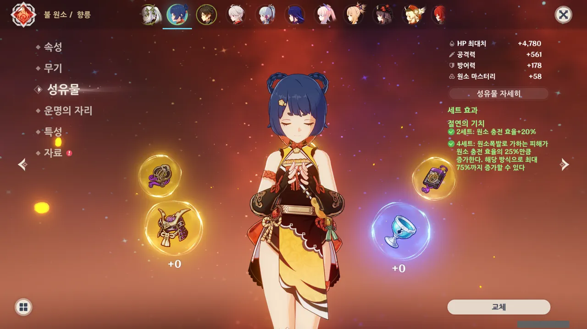

거의 한 달 가까이 절연만 파밍 했는데, 여전히 쓸만한 성유물이 나오지 않는다.

원신 성유물이 뭐 다 그렇지...



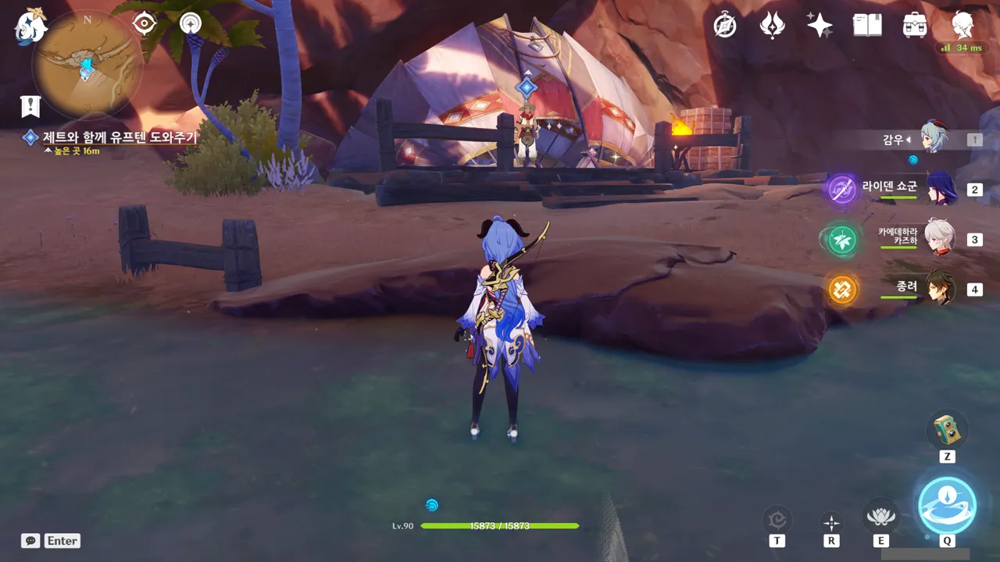

거의 한 달 만에 하는 임무라, 처음 임무 내용을 봤을 때 '대체 유프텐이 누구야?'라고 생각했었다.

그런데 임무 지역에 도착하자마자 '아, 그 말더듬이?'라고 바로 기억이 돌아오더라.

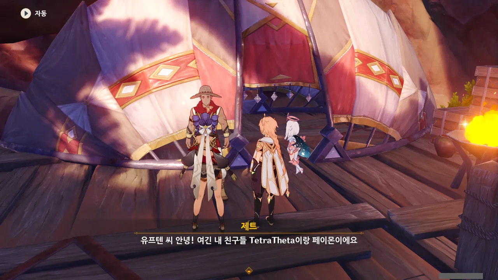

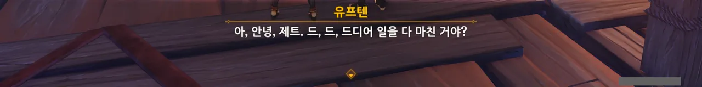

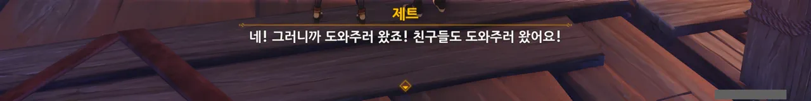

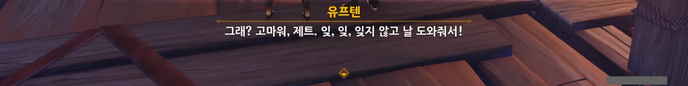

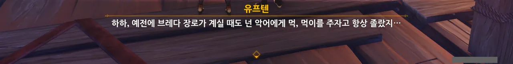

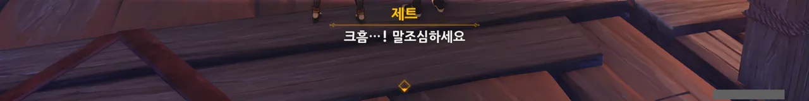

'브레다 장로'라는 말이 나오자, 말조심하라는 제트.

단순히 죽은 사람이라면 말조심을 할 필요가 없다. 따라서 '브레다 장로'는 무언가 큰 잘못을 저지르고 처벌을 받은 사람일 확률이 높다. 그리고 이전에 보았던 '재판'대로라면, 그 '브레다 장로'라는 사람 역시 처형되었을 가능성이 커 보이고.

아마 제트가 '브레다 장로'를 직접 처형했을 가능성이 높아 보인다.

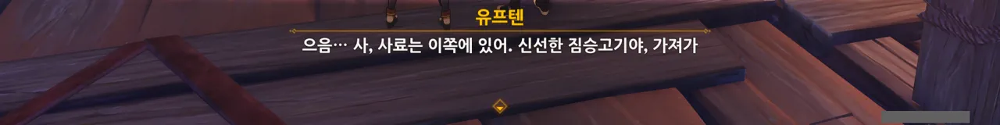

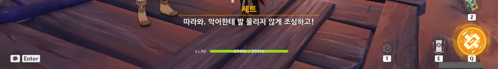

아무튼, 악어에게 밥을 주러 간다.

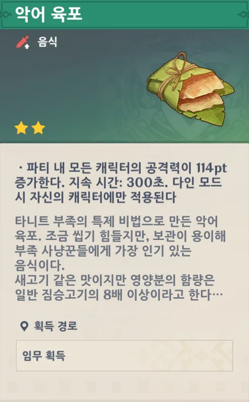

유프텐의 집에서 악어 육포를 발견할 수 있었다.

처음 유프텐의 말을 제대로 안 듣고 '설마 이 악어 육포를 악어에게 주는 거야? 동족상잔?'이라고 생각했는데, 나중에 다시 보니, 악어에게 줄 것은 이 악어 육포가 아니라 그냥 단순한 짐승고기였다.

그나저나 악어를 키우는 이유가 고기 때문이었구나. 하기사, 악어에게서 얻을 것이 가죽 아니면 고기밖에 더 있겠는가.

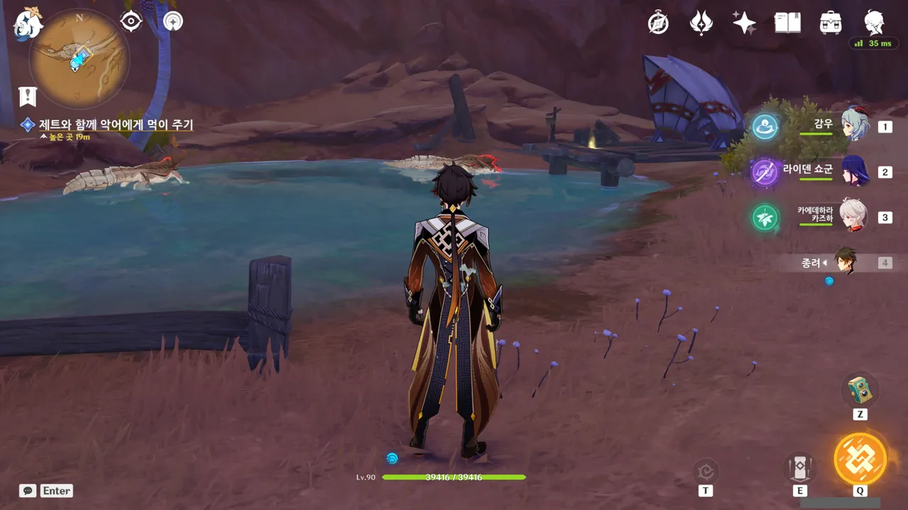

저기서 악어 밥을 주는 건가?

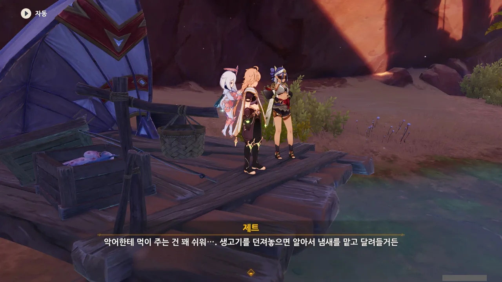

저 말을 들을 때 생각난 움짤이 하나 있다.

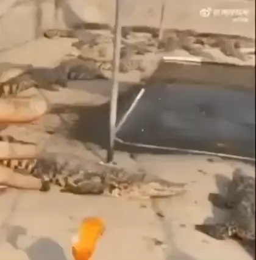

마침 꽤 적절하지 않은가? '생고기', '알아서 달려든다'. 그걸 먹을 수 있는가는 둘째치고 말이다.



제트를 보지 않은지 그리 오래되지도 않았건만, 애가 벌써 많이 변해 버렸다.

예전의 순수했던 제트는 간데없고, '배신자'니 뭐니 하는 제트를 보자니, 마치 '너무 일찍 어른이 되어버린 아이'를 보는 것만 같다.





> 내 심기를 건드리면 알지?

예전의 순수했던 제트를 돌려줘! 그때의 제트는 보기만 해도 흐뭇해지는 녀석이었다고! 이렇게 '강냉이'를 입에 담는 사나운 녀석이 아니라!

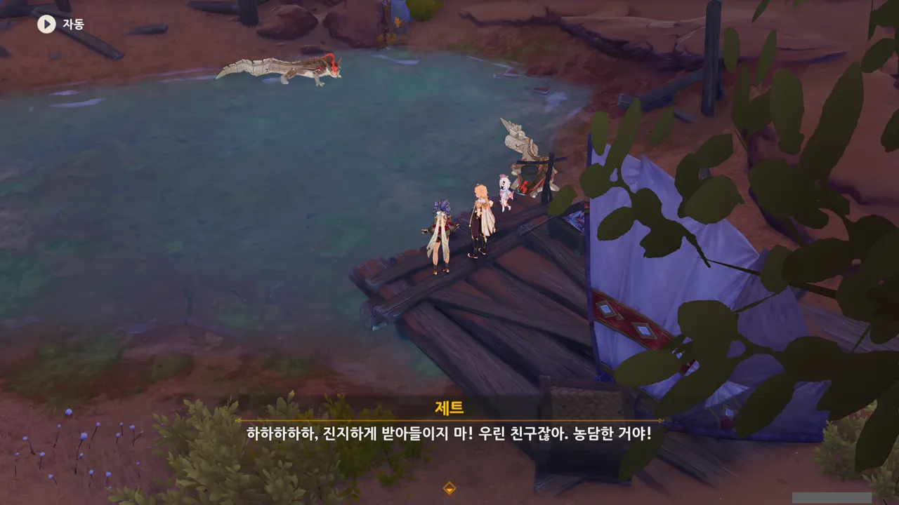

아니, 전혀 농담처럼 안 들렸거든.

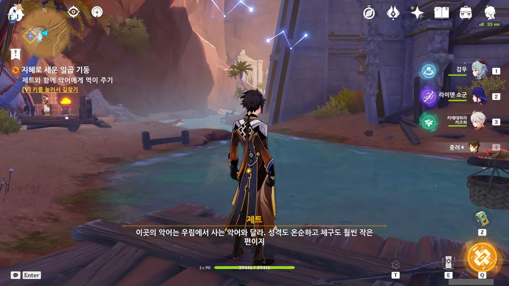

글쎄다. 우림에 사는 악어와 크기 면에서 별반 차이가 없는 것 같은데...



부족 바깥의 사물에 대한 통찰력이 뛰어나다고 평가하는 건 좋은데, 결론이 글러먹은 것 같다. 의심스러운 외부인 추적? 부족 배신자 처리?

그냥 애 하나 잘 구슬려서 바벨 본인의 손은 깨끗이 한 채, 눈에 거슬리는 외부인이나 부족원을 제트 손으로 치워버리는 것 같다는 생각밖에 들지 않는다.

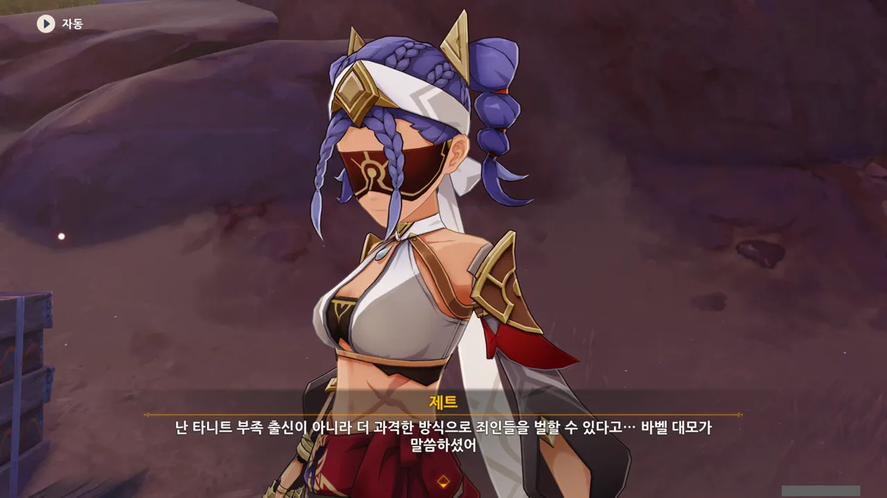

부족 출신이 아닌 것과 더 과격한 방식으로 사람을 죽이는 게 대체 무슨 관련이 있다고...

아무래도 바벨이 매우 의심스럽다. 이거 분명 꿍꿍이가 있어...

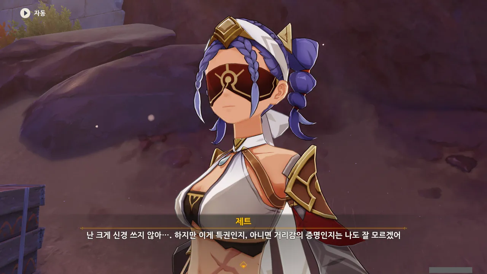

글쎄, 내가 보기에, 그건 특권이라기보다는 거리감의 증명 같은데.

생각해 보라. 부족 바깥에서 혼혈이 하나 들어왔다. 그런데 이 혼혈이 하는 일이 사람을 죽이는 일이다. 이 혼혈을 과연 누가 좋아할까?

당장 이전에 다른 부족원들이 제트에 대해 '제트는 좋은 아이야'라고 앵무새처럼 말한 것을 생각해 보면, 이건 열이면 열, 백이면 백 제트를 따돌리는 것이다.



처음에는 '아하, 이런저런 지식을 배우는구나'라고 생각했는데, 이 부족에 대한 의심이 쌓이고 쌓일수록 바벨이 제트에게 고작 사람 죽이는 법만 가르치고 있는 게 아닐까 하는 생각이 든다.



악어 밥을 준 것 같지 않지만, 아무튼 악어 밥을 줬다고 한다.

아까 오면서 보니까, 옆에서 다른 사람이 물가에 뭔가를 뿌리고 있던데, 그게 악어 밥이었던 걸까? 악어 밥은 그 사람이 줬겠지, 뭐.



> 배신자 피 냄새보다 더 고약할까?

이 사람도 제정신은 아니었구나.



어... 아드라피가 대체 누구였더라?



그 와중에 제트는 유프텐이 말을 더듬는 걸 갖고 '악어 고기'를 '악악악악어 고기'라며 놀린다.

아까 유프텐이 피 냄새 운운하며 놀린 걸 받아친 느낌이다. 유프텐 말처럼 발칙하긴 하네, 하하.

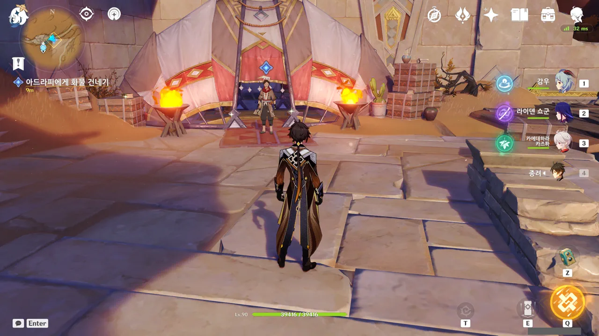

아, 아드라피가 이 싸가지였어? 아무튼, 이 싸가지에게 악어 고기를 줘야 한다.





분명 평범한 대화일 건데, 아드라피의 첫인상 때문인지, '새로 사귄 친구 자랑'같은 말이 뭔가 비꼬는 말처럼 들린다.

이건 아드라피가 잘못했네.





응? 붐붐이 저렇게 가만히 있는 게 고장 나서 그런 거라고? 그냥 단순한 휴면 상태인 건 줄 알았는데.

처음에는 붐붐이 저기 저렇게 있는 걸 보고, '아, 여기가 제트 집인가 보다'라고 생각했는데, 생각을 잘못해도 단단히 잘못했다.

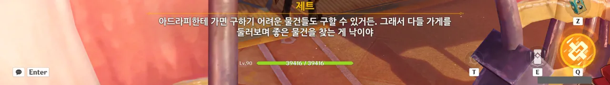

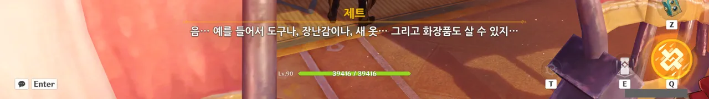

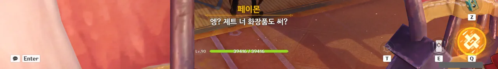

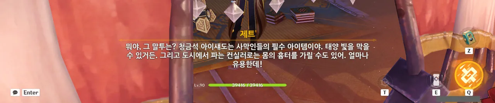

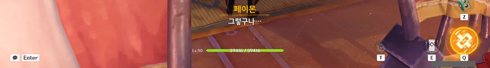

아드라피는 부족 상인인가 보다. 부족을 대표해서 부족이 직접 만든 걸 팔고, 부족에게 필요한 걸 사 오는 그런 외부 전담 창구와 같은 상인 말이다.

그나저나 제트도 화장은 하는구나. 미용보다는 실용적 목적이 더 강한 것처럼 보이지만.



'제트의 집이 과연 어딜까'라는 생각에 온 마을을 돌아다니다, 이상한 문서 두 개를 발견했다.

'부족 상인'이라고 하는 건 방금 그 아드라피를 말하는 거겠지. 상인이 정보원 역할까지 수행하는 건 그리 드문 일이 아니니까. 정보원이 이렇게 부족장인 바벨에게 편지를 쓴 것 역시 별 일은 아니다.

하지만 그 내용이 문제다.

&nbsp;

마신 임무에서 아자르 일파가 대규모로 실각한 후, 아카데미아에서는 그동안 소홀히 여겼던 사막 민족에 대한 유화책을 재개했으며, 그 일환으로 사막 부족민들에게 교육을 실시한다고 기억하고 있다.

하지만 부족민 텐트 곳곳에 놓인 고급 지식이 담긴 책 여럿과, 아카데미아의 교육 수준이 기초적이라고 말하는 편지 내용을 볼 때, 사막 민족들은 이미 밀수를 통해 아카데미아의 책을 들여와 아카데미아의 고급 지식들을 상당수 익힌 것으로 보인다.

&nbsp;

그런 상황이다 보니, 이들은 아카데미아의 무료 교육도 뭔가 다른 숨은 의도가 있는 것 아닐까 하고 의심하고 있는 것 같다. 아카데미아에서 구라바드 유적과 영원의 오아시스에 관심을 갖고 접근하려는 것이 아니냐며 의심하는 것이다.

구라바드 유적? 영원의 오아시스? 대체 그게 뭐지?

&nbsp;

편지 마지막의 '독립과 단결', '아카데미아의 더러운 손'이라는 문구들이 조금 마음에 걸린다. 이들은 수메르로부터 독립이라도 하려는 걸까? '외부의 강력한 세력'은 우인단 혹은 아카데미아, 아니면 둘 모두를 지칭하는 것으로 보인다.

&nbsp;

편지와 함께 발견한 계약서에는 바벨과 타니트 부족이 상당한 모라를 받은 조건으로 아카데미아에서 온 학자들에게 협조하는 내용이 적혀 있었다.

하지만 앞선 편지 내용으로 봐선, 이 학자가 구라바드 유적이나 영원의 오아시스에 대해 관심을 갖고 있다는 것이 확인되면 마침 보는 눈도 없겠다, 조용한 곳에서 이 학자를 몰래 죽여버릴 것 같다.

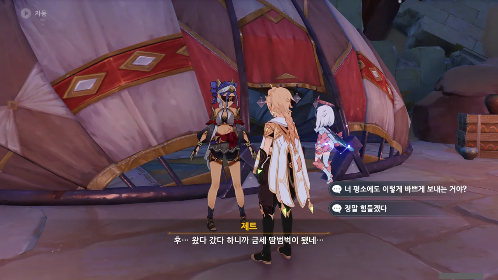

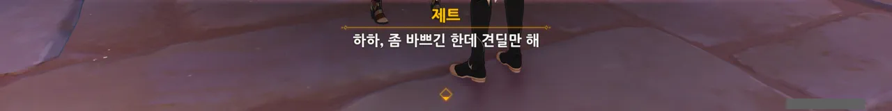

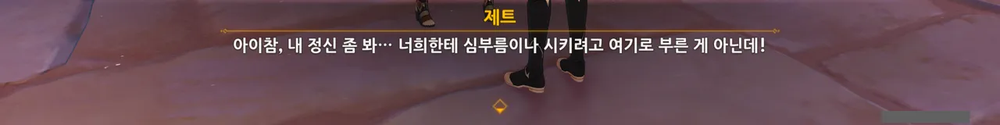

그래, 언제 본론으로 넘어가나 싶었다.

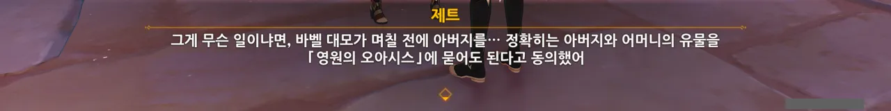

아까 아드라피의 편지에서 '영원의 오아시스'라는 단어가 나왔지 않았나?

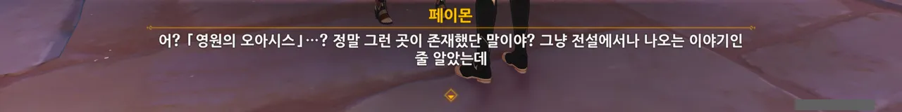

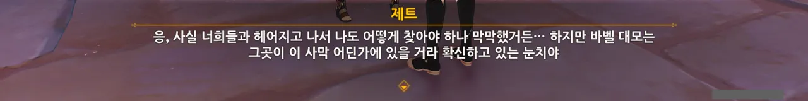

흠, 그러니까 바벨 역시 '영원의 오아시스'가 어디에 있는지 모른다는 말이네.

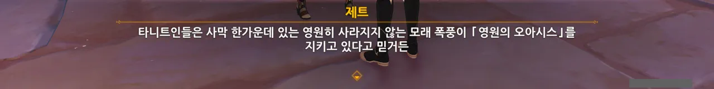

이 사막 지도를 밝힐 때, 사막 한가운데에 모래폭풍이 불고 있었는데, 아마 거길 말하는 것 같다. 모래폭풍이 걷히고 나면 오아시스가 나타날지도 모르겠네.

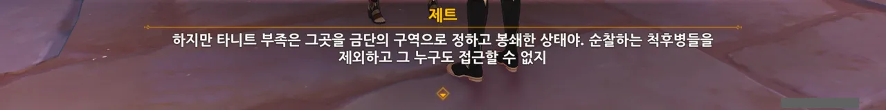

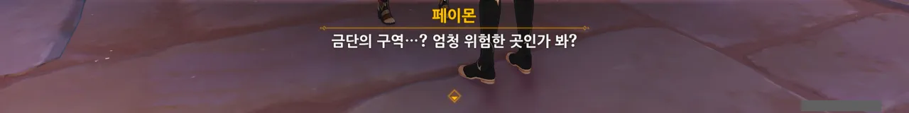

그런데 왜 타니트 부족은 거길 금단의 구역으로 정한 걸까? 부족의 성지인 걸까? 그런데 그런 곳에 제트 부모님의 유품을 묻도록 허락해 준다고?

&nbsp;

내 직감이 날카롭게 소리치고 있다. 이건 100% 수상쩍고 100% 뒤가 구린 이야기이다. 바벨은 영원의 오아시스가 어디에 있는지 모르니, 이미 적왕의 유산에 가본 경험이 있는 제트를 앞세워 영원의 오아시스가 어디 있는지 찾을 생각인 것으로 보인다.

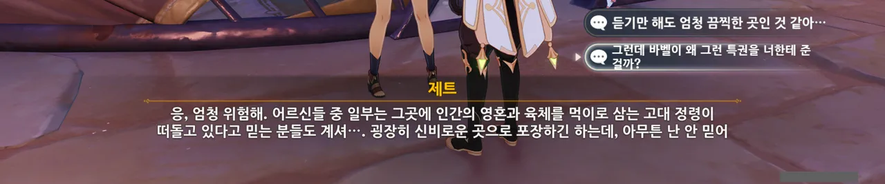

'인간의 영혼과 육체를 먹이로 삼는 고대 정령'? 필드 보스를 말하는 걸까?

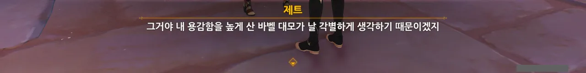

아냐... 이건 100% 벗겨먹으려는 의도야...

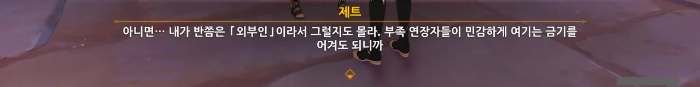

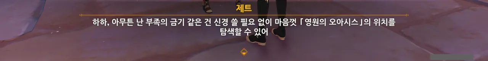

그러니까 말이 안 되는 거라니까? 외부인은커녕 같은 부족민도 들어가지 못하도록 한 성지에 흔쾌히 혼혈이 들어가게 허락했다고? 이 폐쇄적인 사막 부족이? 그게 말이 되는 소리야?

차라리 '넌 혼혈이니 우리는 들어갈 수 있다손 쳐도, 넌 절대로 못 들어가!'라고 했다면 혀를 찼을지언정 의심하진 않았겠지.

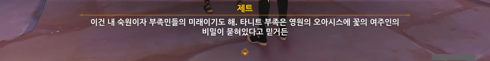

제트야, 그게 정말 네 숙원이 맞니? 아무리 봐도 그건 바벨이 제트에게 불어넣은 '부족민의 숙원' 같아 보이는데.

아무리 봐도 그 영원의 오아시스에 묻혀 있다는 '꽃의 여주인의 비밀'을 찾기 위해 제트를 부려먹는 것 같다니까?

'꽃의 여주인'은 지금은 흔적조차 제대로 남지 않은, 수메르의 세 신왕 중 하나인 화신(花神)을 의미하는 것으로 보인다.

음... 글쎄. 과연 그럴까.

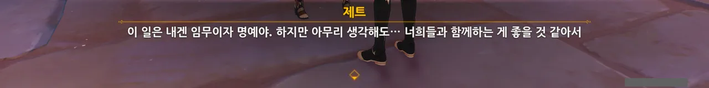

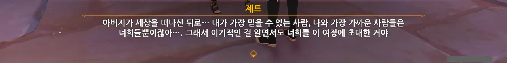

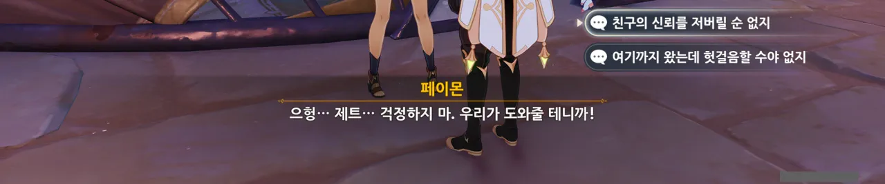

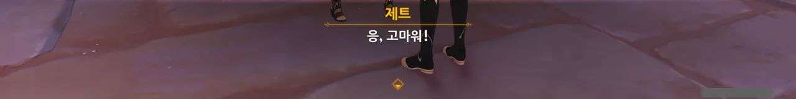

그래... 제트니까. 제트를 봐서라도 도와줄 것이다.

분명 바벨은 오아시스를 찾을 즈음에 다시 나타나서 '이 모든 것은 내 계획대로'나 '이제 너희들은 쓸모를 다했으니 죽어라' 같은 판에 박힌 말을 하겠지?

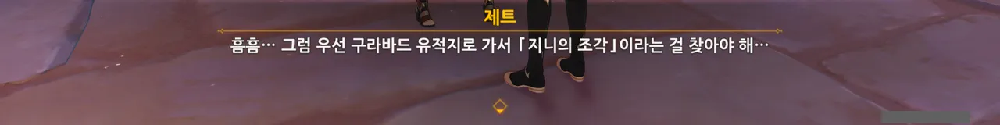

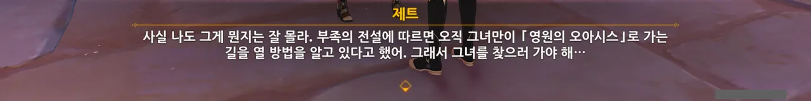

구라바드 유적지. 여기 역시 아까 그 편지에 나왔던 단어이다.

아무래도 '지니의 조각'을 여럿 모아 지니를 복구한 다음, 그 지니의 인도에 따라 영원의 오아시스에 가는 게 이번 월드 임무의 내용인 것 같다.

멋지네. 또 사막 지하에서 길을 헤매게 생겼어.

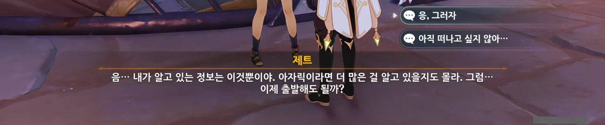

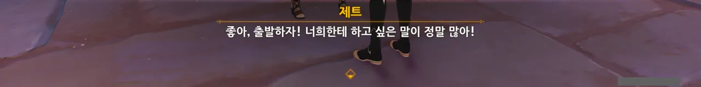

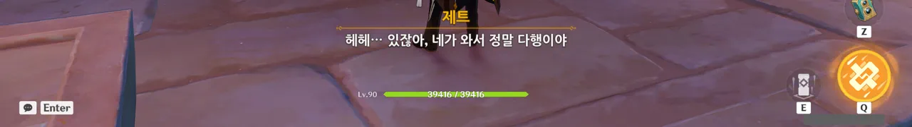

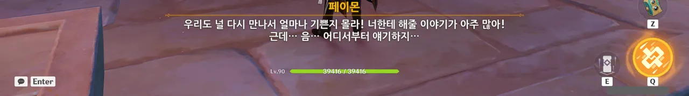

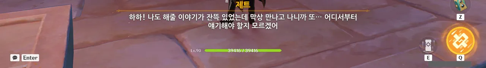

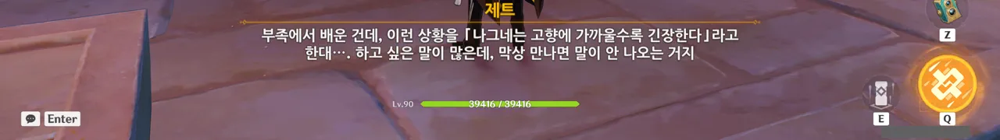

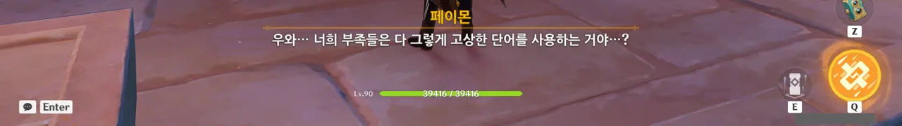

아무래도 사막 부족들은 아카데미아에서 밀수해 온 여러 책들로 고급 지식들을 익혔기에 저런 말이 나올 수 있었던 거겠지.

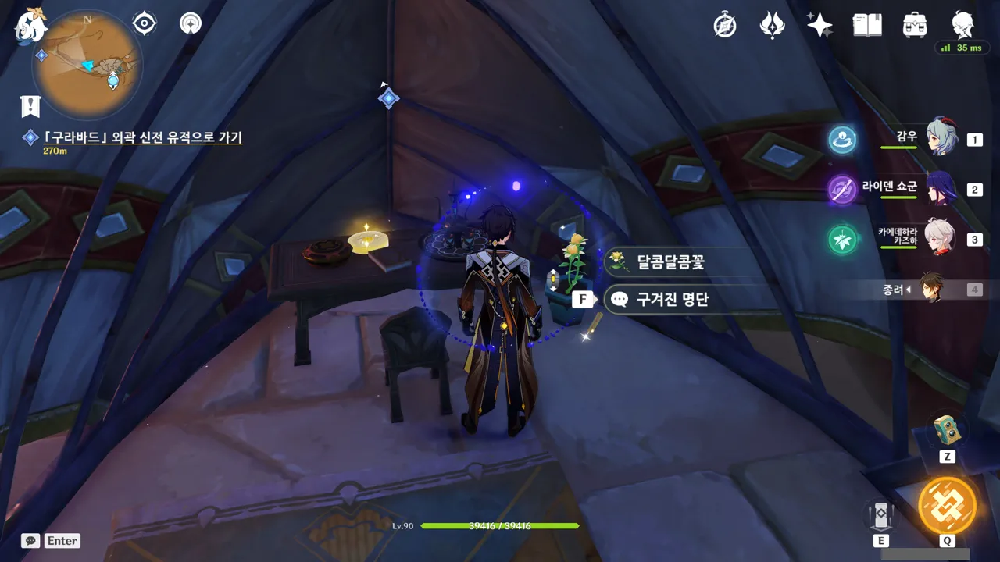

그런데 제트의 집 안에는 '구겨진 명단'이라는 쪽지가 하나 있다.

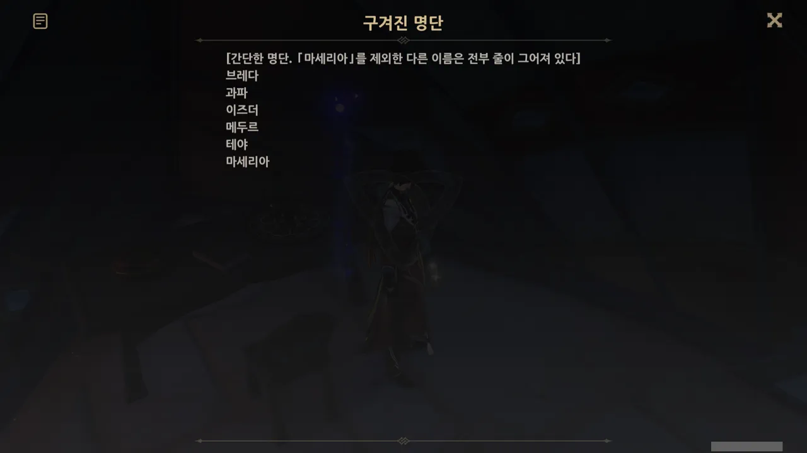

> 구겨진 명단
> ***
> \[간단한 명단. 「마세리아」를 제외한 다른 이름은 전부 줄이 그어져 있다.\]
> ~~브레다~~
> ~~과파~~
> ~~이즈더~~
> ~~메두르~~
> ~~테야~~
> 마세리아
{.bq}

맨 위에 '브레다'라는 이름이 있는 것으로 보아, 제트가 직접 죽였던 '배신자'의 목록으로 보인다.

***

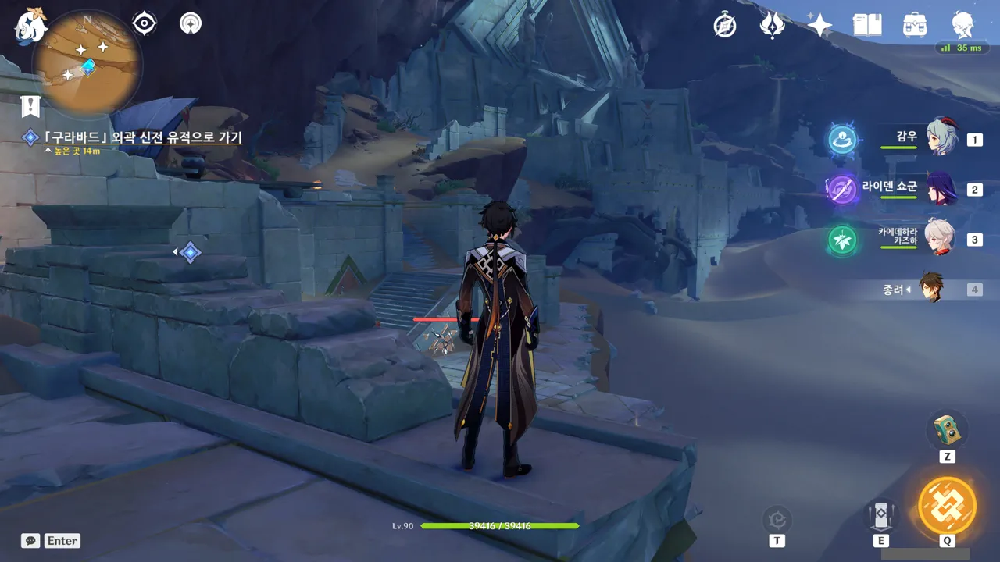

구라바드가 어딘가 했더니, 바로 여기였구나.

종종 수메르 일일 임무가 여기에 뜨기 때문에, 월드 임무를 진행하지 않았어도 자주 방문했던 곳이다.



그런데 밤에 여길 오니까 꽤나 장엄하다.

건물의 위치 또한 인상 깊은데, 절벽을 파내고 거기에 건물을 만들어놨다.

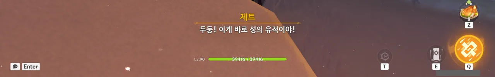

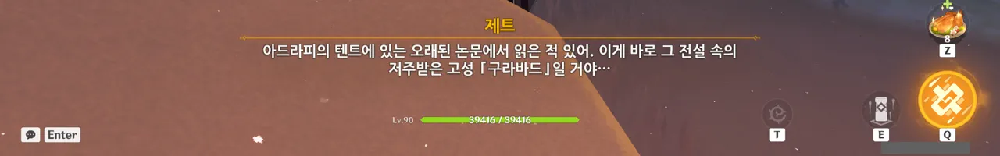

구라바드 유적의 원래 이름은 '구라바드 성'이었다고 한다. 그런데 왜 저주받은 성이라고 하는 걸까?

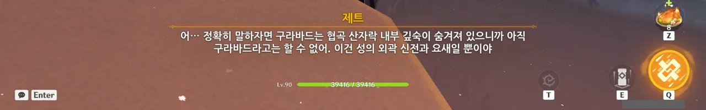

오... 그러니까 저 겉으로 드러난 부분이 그저 성의 외곽 신전 겸 요새라는 거지? 성 안 도시는 더 깊숙한 곳에 있고?

사막 지하를 헤매며 '대체 여기가 어디야!'라고 외쳤던 것이 엊그제 같은데... 벌써부터 앞날이 어두컴컴하다.

아, 그게 다 책에 적혀 있었던 거구나. 진짜 별의별 책을 아카데미아에서 밀수해 왔다.

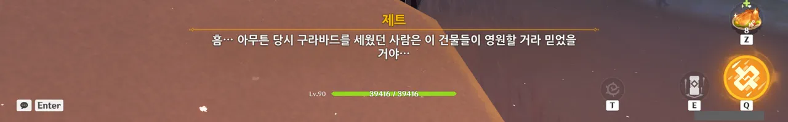

이 세상에 영원한 건 없는 법이지...

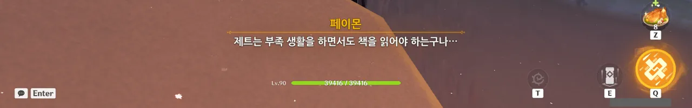

책. 중요하지, 중요해. 그런데 바벨이 그 말을 했다고 하니, 기분이 참 묘하다.

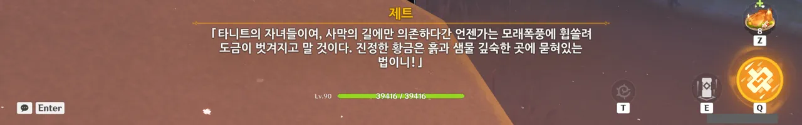

> 진정한 황금은 흙과 샘물 깊숙한 곳에 묻혀있다

맞는 말처럼 보이지만, 바벨이 저 말을 했다고 하니 뭔가 숨은 뜻이 있는 것만 같다.

'흙과 샘물'은 분명 농사를 말하는 것으로 보이지만, 사막에서 농사는 쉬운 일이 아니잖아. 그럼 저게 '땅 밑에 묻힌 옛 유적의 보물'을 말하는 걸까?

아. 또 오벨리스크다. 이 월드 임무를 끝내고도 또 봉인석을 찾아 여길 샅샅이 뒤지고 다녀야 하는 거야?

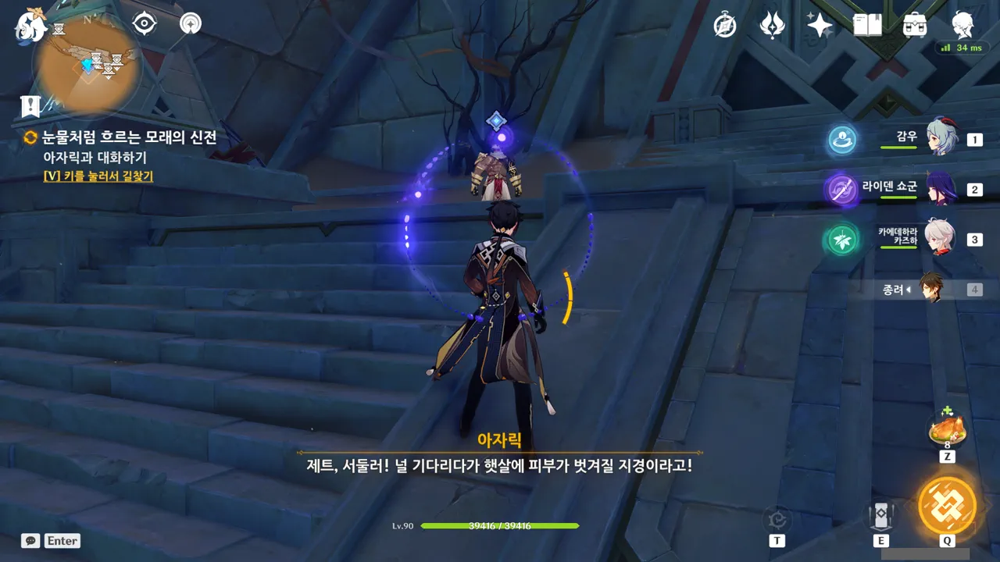

누가 우리에게 말을 거는 건가 했는데, 바로 앞에 웬 떡대가 하나 서있었다.

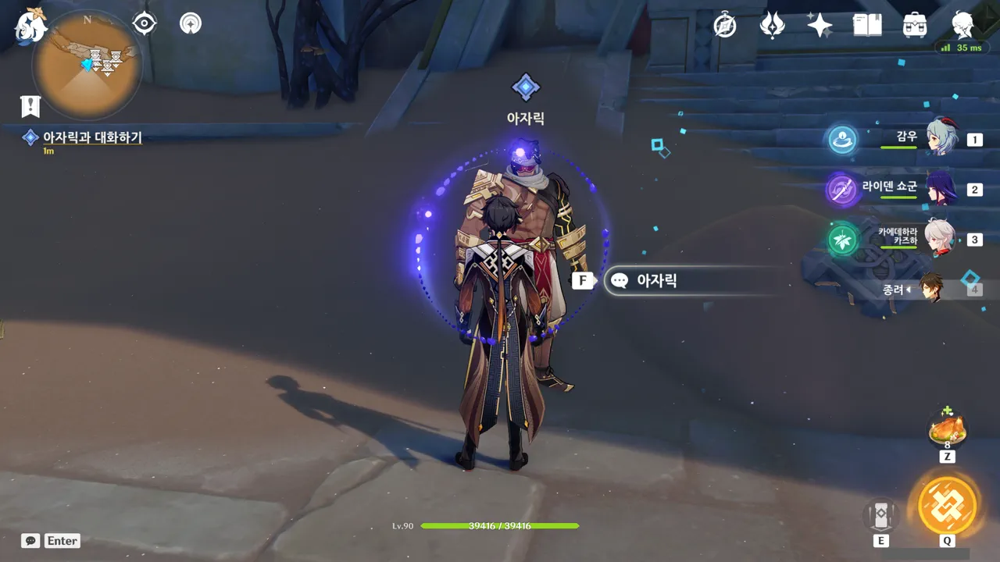

아, 이 사람이 아자릭이야? 키가 굉장히 크네.

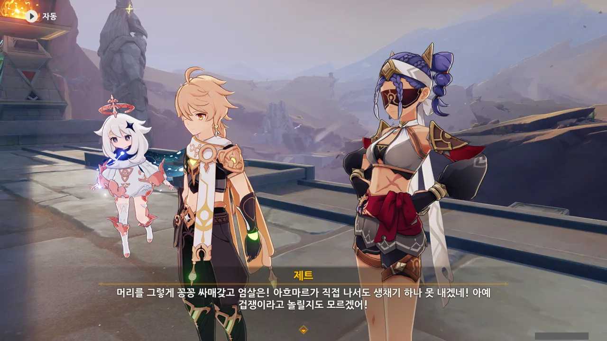

머리를 꽁꽁 싸매놓고 '햇살에 피부가 벗겨지겠다'라며 엄살이라니. ㅋㅋㅋㅋㅋㅋ 잘 보면 아자릭의 얼굴 중 피부가 겉으로 드러난 곳이 거의 없다.



아자릭이 제트와 비슷한 나이일 줄 알았는데, 연장자라고 말하는 것을 보면 아자릭의 나이가 훨씬 더 많은 것 같다. 고작 한두 살 정도 차이가 난다고 연장자라고 부르진 않으니 말이다.

그나저나 아자릭과 제트가 서로에게 엿을 먹이는 모습이 아주 보기 좋다. 아자릭은 제트를 카라칼이라 하고, 제트는 아자릭에게 유적 옆에서 몰래 술이나 홀짝이는 게 할 일이냐며 맞받아친다.

누가 보면 친남매인 줄 알겠네.



제트에게 씨름을 가르쳐 준 것이 아자릭인데, 정작 아자릭은 이후 제트를 씨름으로 이긴 적이 없다고 한다. 아니, 저렇게 덩치가 차이 나는데, 씨름을 못 이겼다고?

아자릭... 설마 너 제트 봐준 건 아니지? 아니면 그 씨름이 '남녀 간의 씨름'이었던 거냐?



제트에게 있어 아자릭은 '친한 동네 오빠' 정도인 것 같다. 그런데 아자릭이 말한 '더 친밀한 사이'라는 말이 좀 수상한데.

제트는 여자애니까, 남자애들보다는 여자애들과 더 마음이 맞을 것이다. 그러니까 아자릭이 말한 '네가 여자애들하고 노는 걸 더 좋아하지만 않았어도'라는 말은 제트와 아자릭의 관계가 단순한 친구 관계 그 이상이라는 뜻 아닐까? 만약 그런 거라면 여행자와 페이몬이 동시에 '오우...'라고 반응한 것도 충분히 설명이 된다.





아, 아자릭이 제트 보고 카라칼이라고 한 이유가 제트가 카라칼처럼 충동적이어서라고 한다.

충동적이라기보다는 기가 세다고 해야 할 것 같지만...



아무튼, 잡담은 여기까지. 유적까지 왔으면 유적에 들어가 보기는 해야지.



아자릭의 역할은 여행자 일행을 구라바드 성 유적으로 인도하는 일이라고 한다.

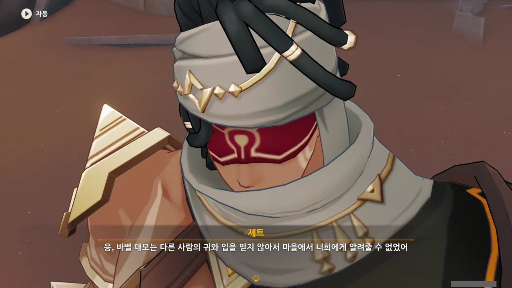

응? 대체 이게 무슨 말이야?

아까 분명 제트 말로는 영원의 오아시스에 부족의 운명이 걸려있다, 뭐 그렇게 들은 거 같은데. 그런데 그런 이야기를 '다른 사람의 귀와 입을 믿지 않는다'라며 다른 부족원들에게는 함구했다고?

진짜 보면 볼수록 바벨에게 뭔가 더러운 꿍꿍이가 있다는 확신이 더해져가고 있다.

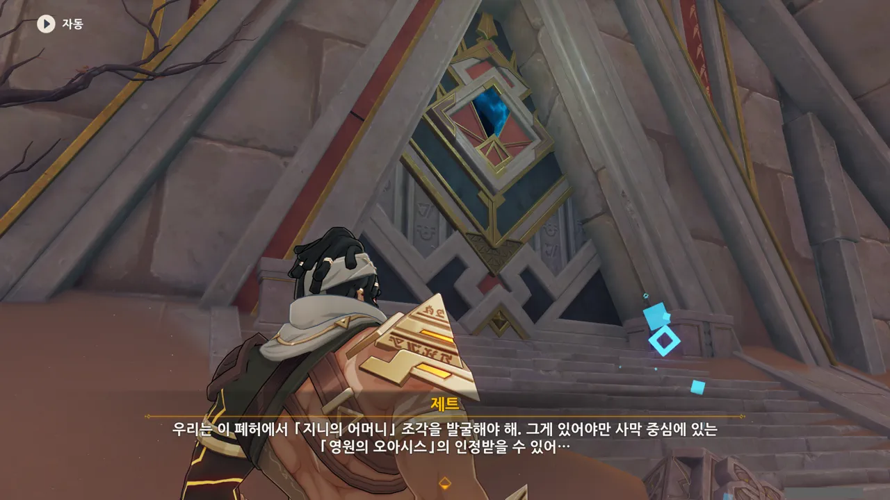

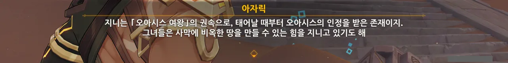

아까는 그냥 '지니의 조각'이라고 했는데, 정확한 이름은 '지니의 어머니 조각'이라고 한다.

아자릭은 지니가 '오아시스 여왕의 권속'이라고 하는데, 오아시스 여왕 역시 화신(花神)을 이르는 다른 호칭인 걸까?

그나저나 지니가 사막에 비옥한 땅을 만들 수 있는 능력이 있다니. 이건 좀 신기한 걸.



그러니까 '지니의 어머니 조각'을 모으면 두 가지 일을 할 수 있다. 아마 지니를 원래대로 돌려놓고 할 수 있는 일이겠지만.

첫째. 사막에 비옥한 땅을 만들 수 있다. 이러면 사막 민족인 타니트 부족이 사막에서 농사를 지을 수 있다. 그러면 저번에 바벨이 말했다던 '흙과 샘물' 역시 정말로 농사를 의미한 말이 되는 거겠지.

둘째. 영원의 오아시스의 봉인을 풀 수 있다. 이건 대체 어떤 실용적 의미가 있는 걸까?

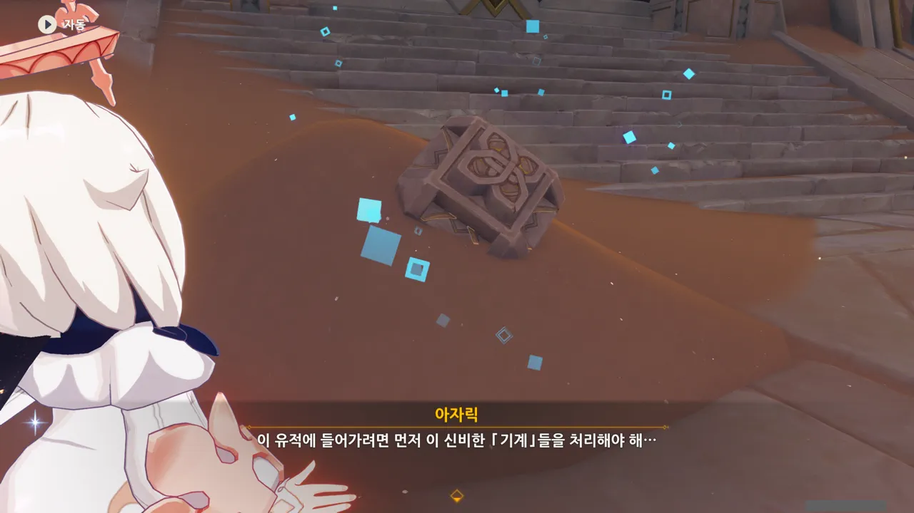

모래더미에 묻힌 버튼? 그냥 바람 캐릭터로 모래를 날려버리면 되는 거 아냐?



무슨 말인진 잘 모르겠지만, 저 빨간 장치를 때리면 바람이 나온다는 것으로 이해했다. 그리고 그 바람으로만 저 모래더미를 치울 수 있고.

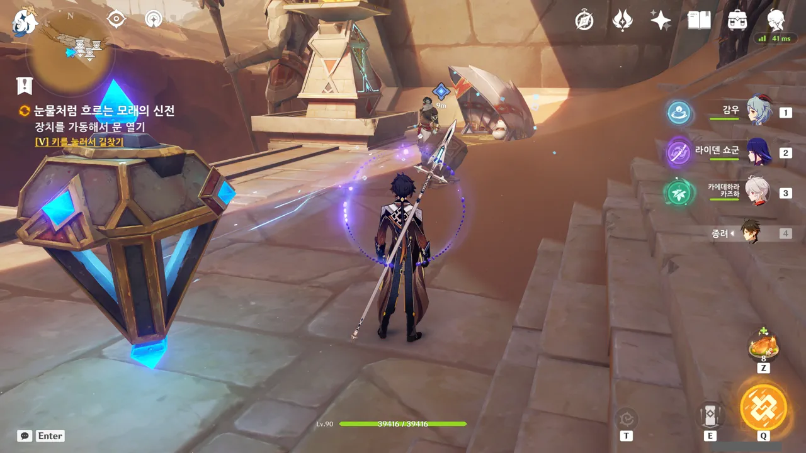

빙고. 맞네.

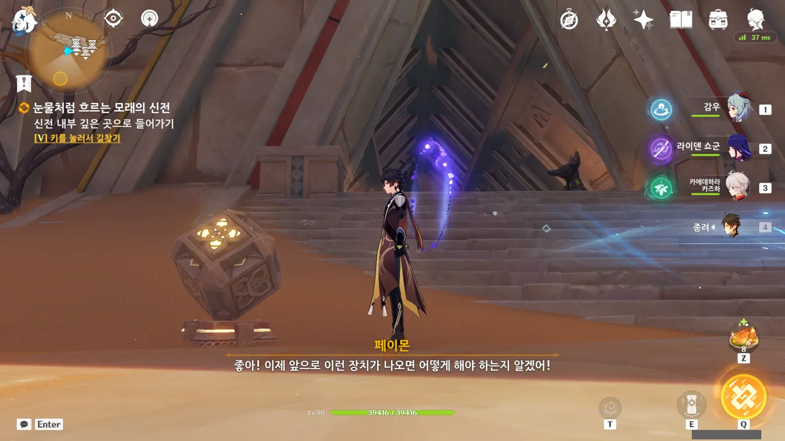

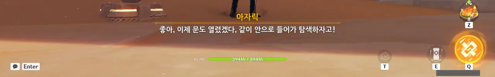

이런 새로운 기믹은 언제나 환영이다. 재미있잖아?
