'안은 생각보다 깨끗한데?'라는 생각을 하며 들어간 순간, 무언가 불길한 느낌을 주는 구조물을 발견했다.

저 피라미드처럼 생긴 무언가, 분명 매우 귀찮은 장치임이 분명해 보인다.

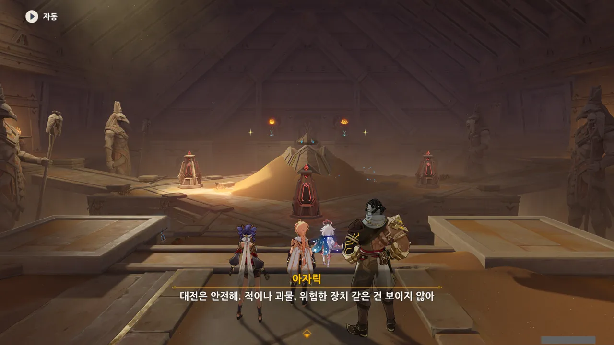

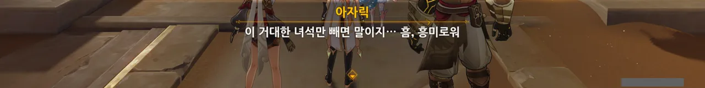

딱 봐도 주변의 모든 빨간색 장치를 활성화해야지만 가운데 있는 저 피라미드 구조물이 활성화되는 것으로 보인다.



아자릭의 말에 따르면, 저 피라미드 구조물은 '지니의 어머니'를 봉인하는데 쓴 장치라고 한다.

그러니까 저걸 해제하면 지니의 어머니 조각을 얻을 수 있다는 거겠지?

그나저나 '어머지 조각'이라고 하니 어감이 굉장히 이상하다.



그리고 참 편하게도, '날 먼저 활성화해보세요'라고 전력으로 외치는 듯한 스위치가 하나 있다.

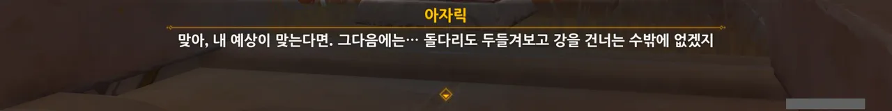

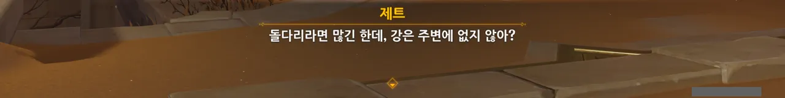

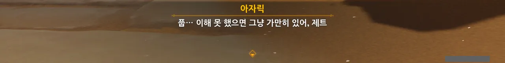

'돌다리도 두드려보고 건넌다'라는 말을 아자릭은 이해하고 말하지만, 제트는 그걸 이해하지 못해 '그게 무슨 뜻이야?'라고 묻는 걸 보니, 아자릭은 제트보다 더 많은 걸 알고 있는 것 같다. 나이가 많아서일까?

제트, 너, 바벨 말대로 책 열심히 읽고 그러는 거 아니었어?



스위치를 작동시키자, 아까의 바람 장치가 피라미드 한쪽에 쌓인 모래를 걷어낸다. 이런 식으로 나머지 세 곳도 다 하라는 거지?



왜 안되긴... 아직 모래가 쌓여 있는 부분이 많이 남아있잖아.





아, 사막 부족민들은 고대 지니의 남은 힘을 이용해 원소의 힘을 다루었던 거구나. 난 사막 부족민들 역시 신의 눈을 몸 어딘가에 갖고 있는 줄 알고 있었는데.

그런데 그걸 왜 지금 물어봐?

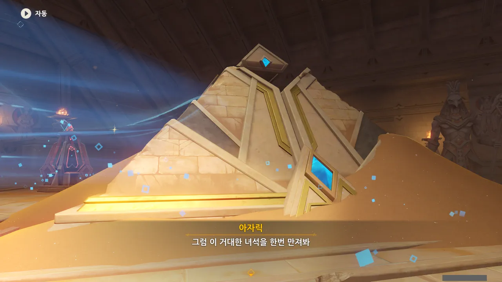

아니? 여행자가 원소의 힘을 신의 눈이나 고대 지니의 힘이 없어도 다룰 수 있는 것과 이 장치 사이에 무슨 상관이 있는 건가?



> 이상한 거라면 여태껏 수없이 만져봤잖아?

ㅋㅋㅋㅋㅋㅋ 아니, 그렇긴 한데 ㅋㅋㅋㅋㅋㅋ

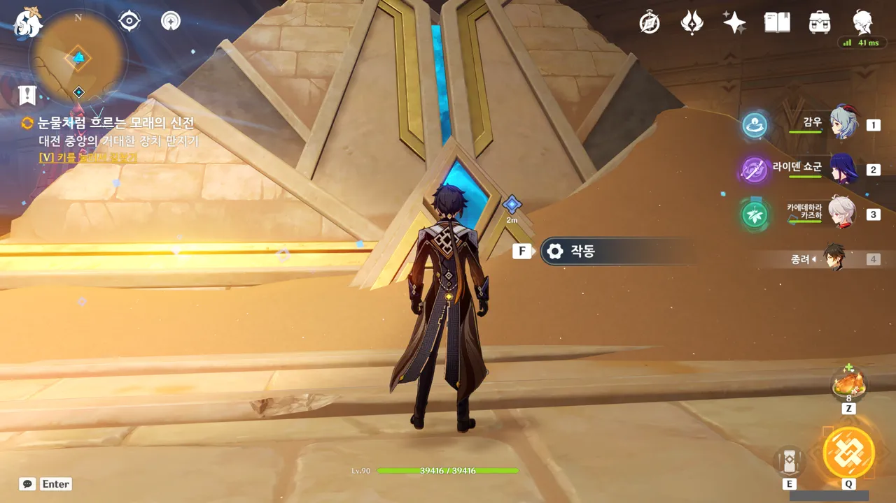

일단 하라는 대로 만져본다.

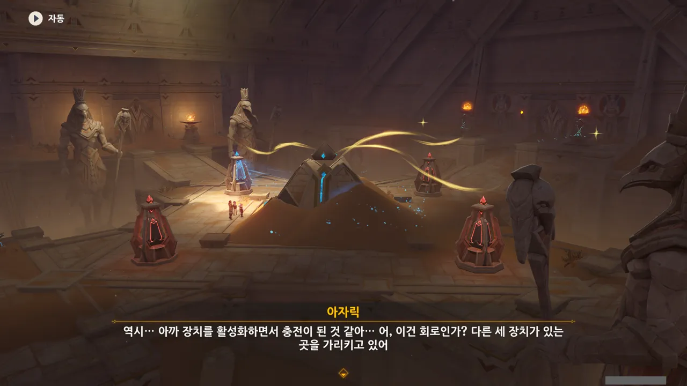

장치가 정말 활성화되긴 했다. 그런데 이 피라미드 장치와 원소의 힘에 대체 무슨 관계가 있어 이렇게 되는 걸까?

그리고 원소의 힘이 필요하다면 제트나 아자릭이 고대 지니의 힘을 써 이 장치를 작동시켜도 되는 일 아니었을까?

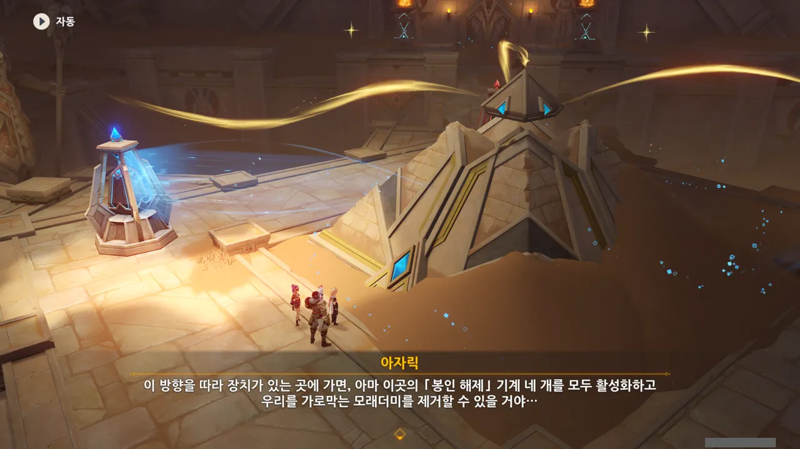

하, 뭐 그럼 그렇지. '이 선을 따라가서 퍼즐을 해결하세요'라는 뜻이다.

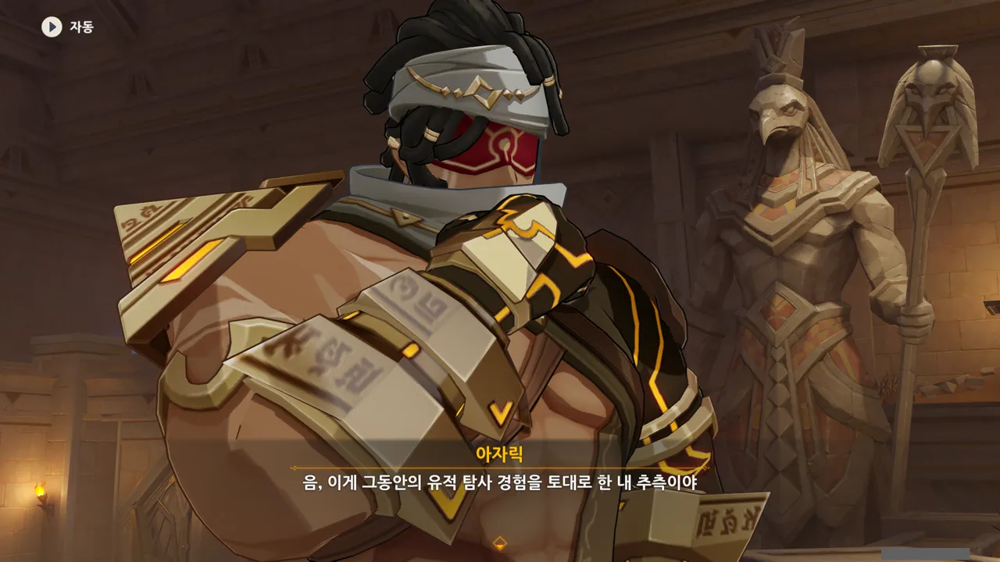

아자릭이 저 말을 할 정도라면, 아자릭은 여태껏 수많은 유적을 탐사해 온 걸까? 부족의 성지라고 하던데, 꼭 그런 것도 아닌 모양이지.



저도 모르게 사막 부족민들을 차별하는 발언을 한 페이몬.



저곳을 먼저 가보자며 한 곳을 가리키는 아자릭.

사실 별다른 선택지가 없다. 문이란 문은 죄다 모래로 뒤덮여 있는데, 지금 활성화된 바람 장치로 모래를 걷어낼 수 있는 문은 오직 저 문밖에 없거든.



> | | |
> |:--|:--|
> | 제트 | 왜? |
> | 아자릭 | 그냥. |
> {_borderless=true,_thead=false}

말이 직감이지, 그냥 둘러대기 귀찮아서 직감이라고 때우는 거잖아...



이야, 자신감이 정말 대단한걸.

적이 나오면 처치하고, 안되면 도망친다... 그게 맞는 말이긴 한데, 가끔 도망칠 수조차 없는 경우도 있다고?

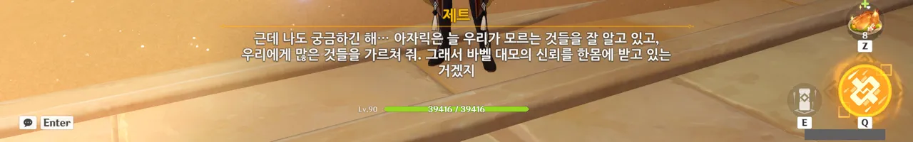

아자릭은 다른 부족민에 비해 아는 것이 많아, 바벨의 신뢰를 받고 있다고 한다.

바벨이 평소 책을 읽으라고 잔소리를 해댄 제트보다 아는 것이 많으니, 뭐...

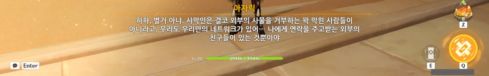

지금까지 본 사막인들은 배신이니 뭐니 하면서 꽉 막힌 삶을 살고 있던 것 같았는데...

아자릭이 연락을 주고받는 외부의 친구들이 과연 누굴까?

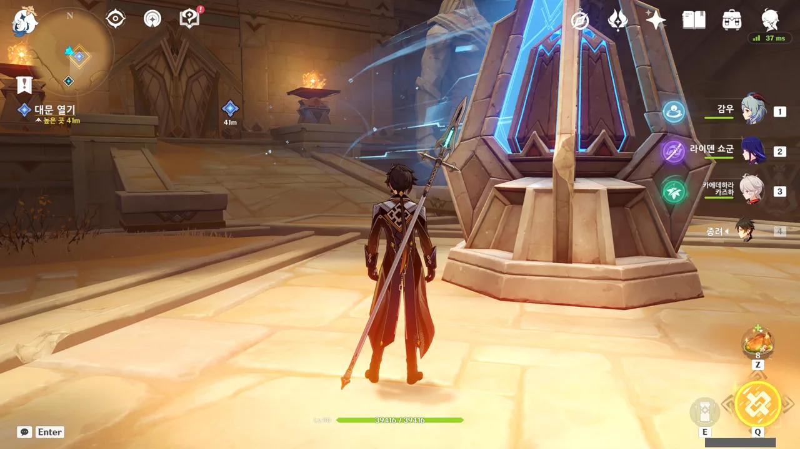

바람 장치를 이용해 문을 여는 버튼을 덮고 있던 모래를 전부 치웠다.

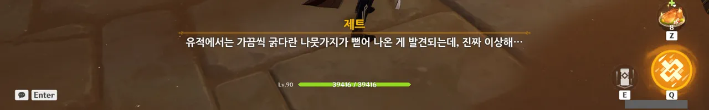

그러게? 제트 말대로, 이 유적은 곳곳에서 굵직한 나뭇가지가 자란 것이 종종 보이곤 한다. 그런데 여기는 나무가 자라기 힘든 사막이잖아.

여태껏 지하에 있는 나뭇가지를 봐도 '그냥 배경 오브젝트겠지'라며 깊게 생각하지 않았는데, 확실히 이상한 일이긴 하네.

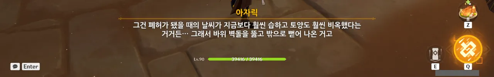

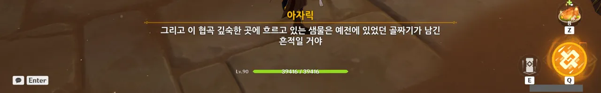

아자릭의 말에 따르면, 지금은 온통 모래밖에 보이지 않는 이 사막도 옛날에는 마치 수메르 우림처럼 날씨도 습하고 땅도 비옥했다고 한다.

쉬이 상상이 가지 않는걸.

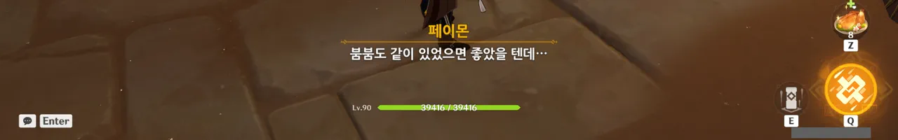

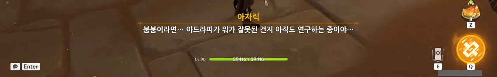

아까 제트와 아드라피의 대화에서도 들었던 내용이지만, 현재 붐붐은 어째서인지 고장 난 상태이며, 아드라피가 붐붐을 고치기 위해 붐붐을 연구하는 중이다.

그런데 이상한 점은, 붐붐은 적왕의 유적에서 여태껏 고장 없이 잘만 있었다는 것이다. 제트가 타니트 부족에 들어간 지 얼마 되지도 않았는데 붐붐이 고장 났다고?

좀 수상쩍은데... 아드라피가 일부러 붐붐을 고장 낸 거 아냐?

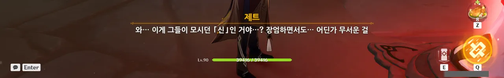

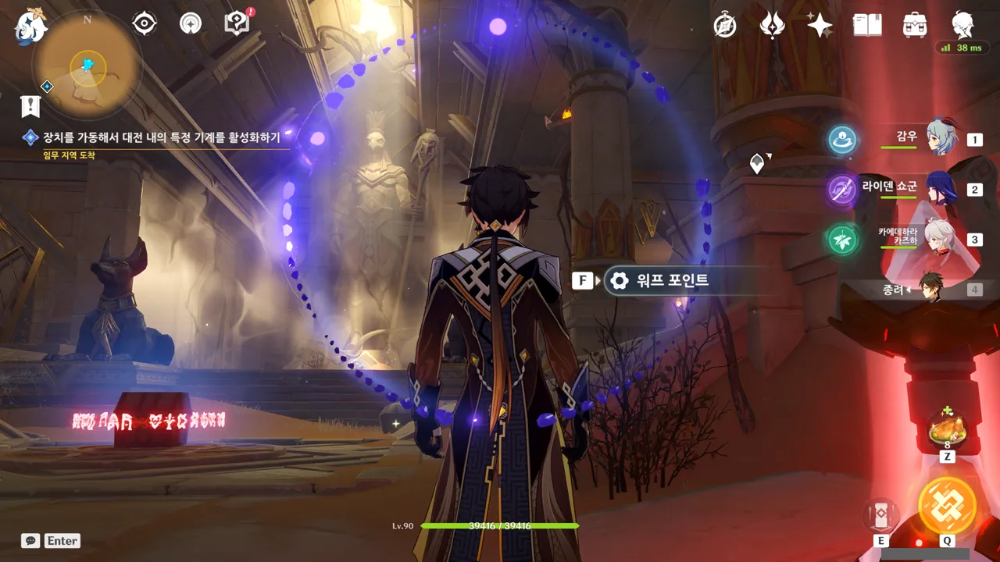

워프 포인트가 보이길래 냅다 달려가는데, 제트의 대사가 들려왔다.

대체 뭘 보고 그런 말을 한 건가 싶어 주위를 둘러보니, 거대한 석상이 하나 있다. 그리 인상적인 모습은 아닌걸.

지금 저 조각상 앞에는 약간 노랗고 반투명한 막이 둘러쳐져 있어, 조각상에 더 가까이 갈 수 없다.

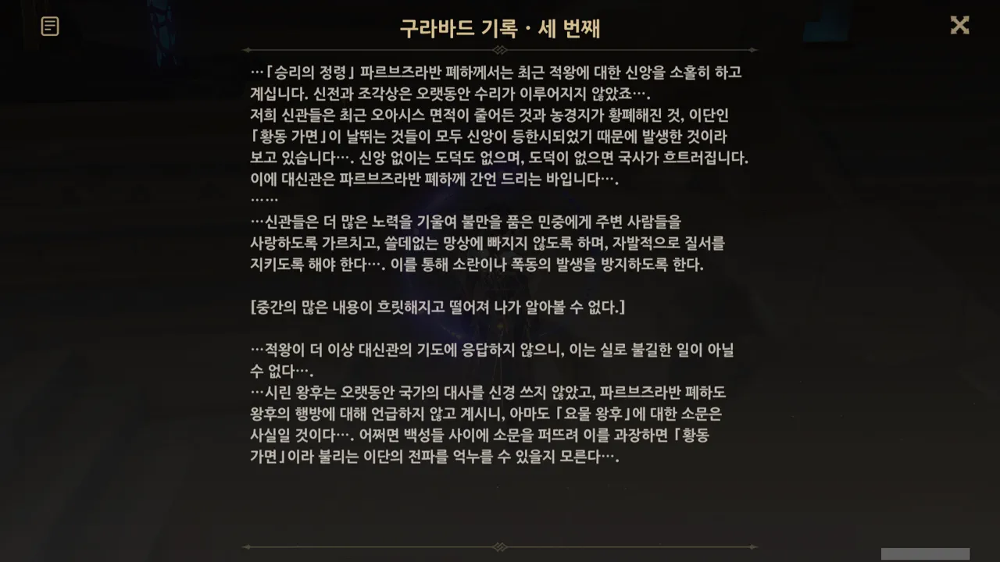

그리고 이 방 안에는 '구라바드 기록 - 세 번째' 석판이 있다.

사막의 역사에 대해 그리 자세히 알아보지 않았기 때문에, 그저 '아, 나라의 왕이 더 이상 적왕을 신봉하지 않는구나'라는 정도로밖에 읽히지 않는다.



약간의 퍼즐을 풀고, 아까 본 조각상 앞의 버튼을 누르자, 세 가지 변화가 생겼다.

* 조각상 앞을 막고 있던 반투명한 벽이 사라졌다.
* 우리가 들어온 문이 닫혔다.
* 아까 조각상 앞으로 올 때 발견한, 잠겨있던 문 버튼이 풀렸다.

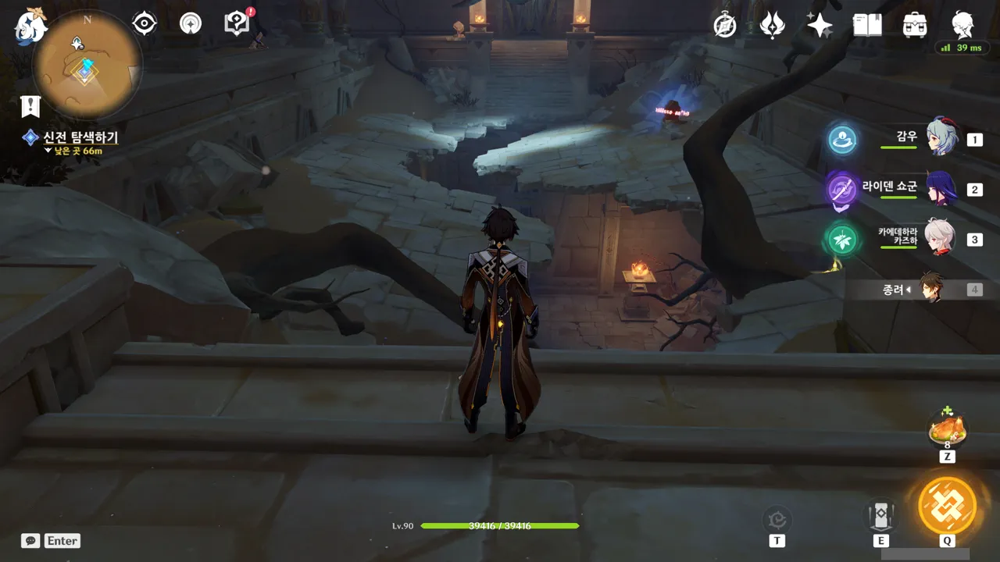

어... 여기 밑으로 내려가라고? 농담이지?

난 이렇게 다른 한쪽 길에도 분명 무언가 먹을 것이 있어 보이는데 임무 진행 때문에 다른 길로만 가야 하는 상황이 그리 달갑지 않다.

일단 저 앞의 상자부터 먹자.



상자 근처에 다가가자, 위층에서 엄청 커다란 새가 떨어졌다. 같이 내려온 다른 새고기 공급원도 몇 있었는데, 이 커다란 새는 몇 대를 때려도 도저히 죽을 생각을 하지 않는다.

아니, 너 대체 정체가 뭐냐? 무슨 미니 보스급으로 단단하네!

그리고 약간의 전투 끝에, 커다란 새가 죽자, 상자가 열렸다.

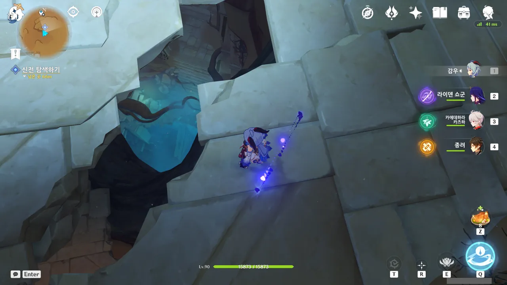

일단 내가 가야 할 길은 저 밑이다. 그런데 저 밑에... 내가 잘못 보고 있는 게 아니라면, 저거 물 아냐?

남쪽 사막에서도 지하 깊은 곳에 물이 고여있는 걸 보긴 했지만, 이렇게 물이 깊게 고여있지는 않았는데...

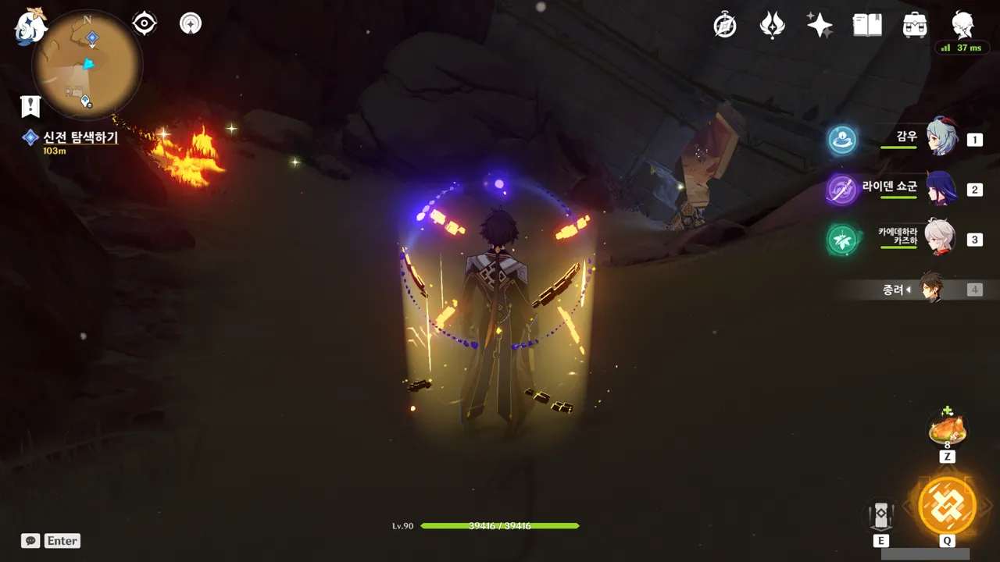

일단 내려가기 전에 열 수 있는, 정면에 있는 문을 열고 들어가자, 뭔가 '여기는 네가 가야 할 길이 아니다!'라는 느낌을 팍팍 주는 새로운 길이 나타났다.

여긴 유적과 유적 사이를 잇는 자연동굴로 보인다.

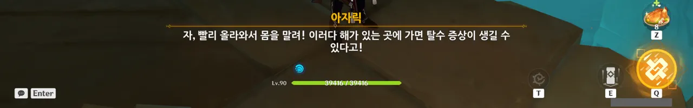

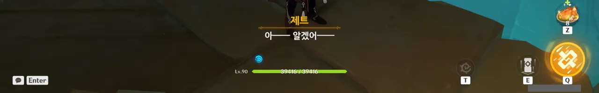

내려오자마자 제트는 시원하고 깨끗한 물에 환호하지만, 아자릭은 얼른 나와서 몸을 말리라고 한다.

그런데 몸이 젖어있는 상태에서 직사광선에 노출되면 탈수 증상이 생기나? 이건 처음 듣는 소리인데.

다만 이렇게 사막에 고여있는 물은 병균이 번식하기 딱 좋은 환경이라는 건 들어본 적이 있다. 이 물도 그리 깨끗한 물은 아닐지도...

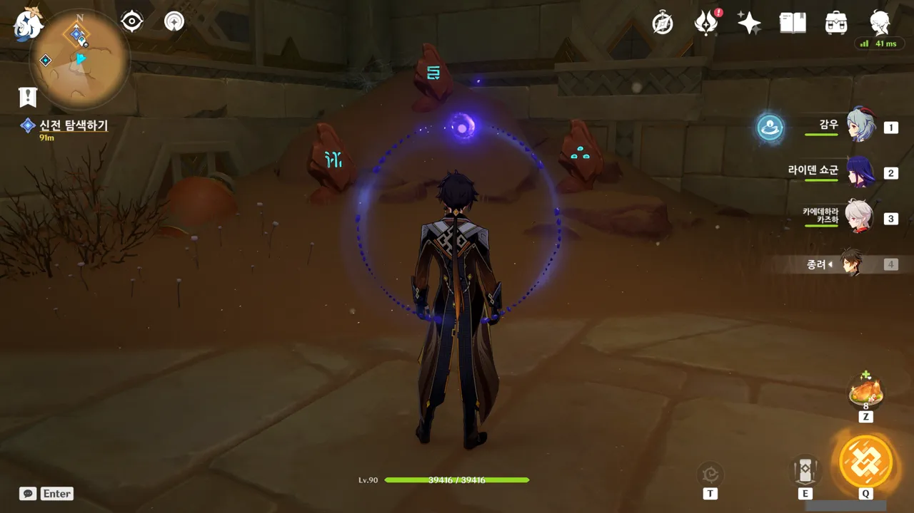

유적의 길을 따라 천천히 올라가던 중, 기묘하게 배치된 세 문자를 발견했다.

이건 대체 어디다 쓰는 걸까?



저 문자들이 어디에 쓰이는지는 얼마 지나지 않아 알게 되었다.

이 세 개의 돌에 그려진 문자를 아까 본 그 세 문자와 동일하게 만들면 상자가 뿅 하고 나타난다.



상자 양 옆에 있는 기계 장치를 보며 '너희들, 내가 다가가면 분명 일어나서 날 때릴 거지?'라고 생각했는데, 아니나 다를까, 기계 장치들은 내 기대를 저버리지 않았다.

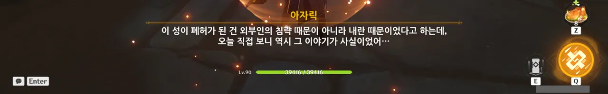

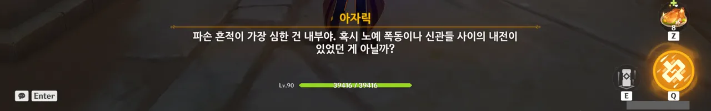

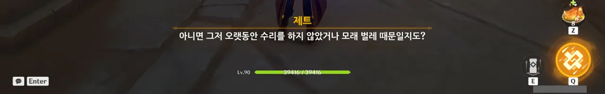

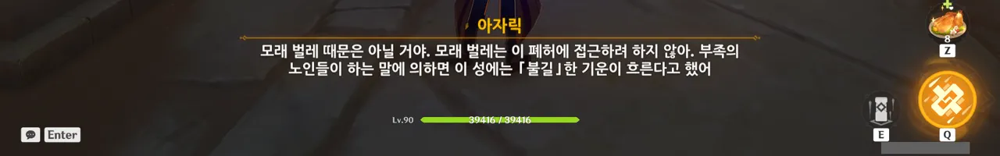

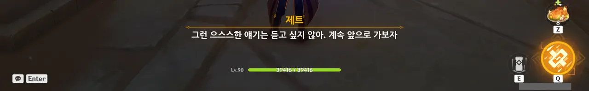

아자릭은 이 성이 폐허가 된 이유가 외부의 침략 때문이 아니라 내분 혹은 내전 때문이라고 추측하고 있다. 외부의 파손 흔적보다 내부의 파손 흔적이 더 심하기 때문이다.

모래 벌레 같은 것들도 이 유적엔 얼씬조차 하지 않는다는데, 대체 옛날에 무슨 일이 있었길래 그러는 걸까?

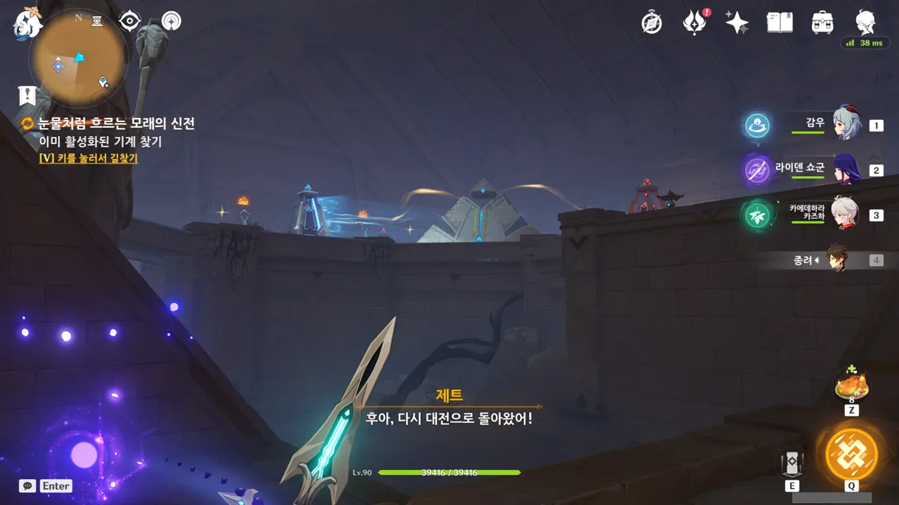

어쩌다 보니 아까 처음 본 거대 피라미드 장치로 돌아왔다.

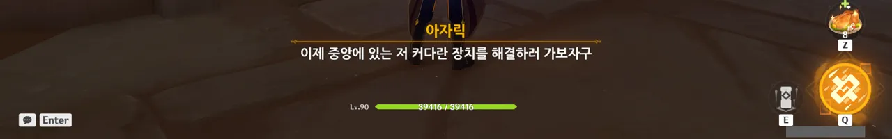

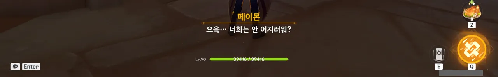

음... 페이몬은 대체 왜 머리가 어지럽다고 하는 거지? 여행자는 달리 불편함을 느끼지 못하는 것 같던데.

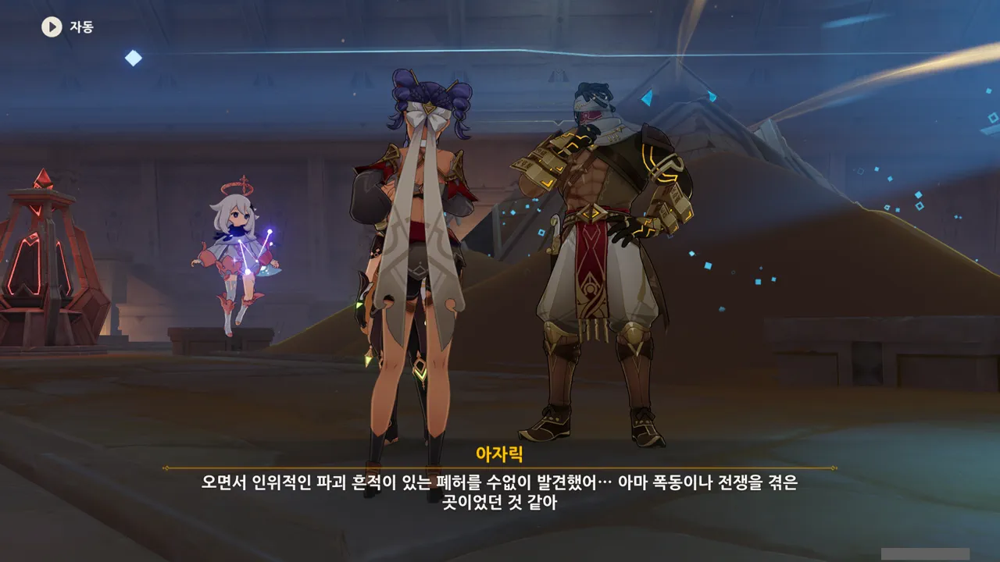

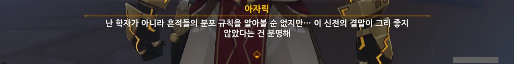

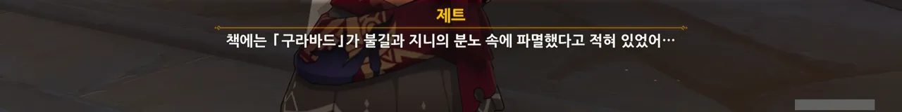

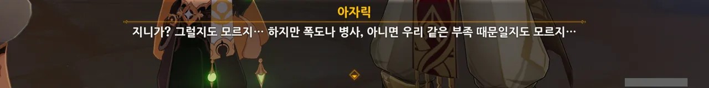

진짜 보면 볼수록 이 유적의 과거가 궁금해진다. 책에서는 이곳이 불길과 지니의 분노 속에 파멸했다고 적혀 있지만, 남아있는 흔적은 그게 아니라 내분 혹은 내전으로 인해 멸망했음을 보여주고 있으니 말이다.

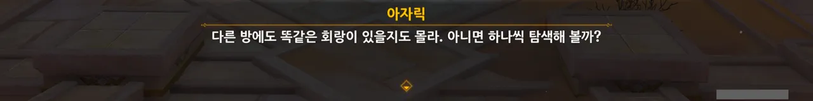

여태껏 하나밖에 장치를 가동해보지 못했지만, 다른 곳 역시 이런 식으로 이 방으로 돌아올 수 있도록 통로가 만들어져 있을 것이다.

그리고 모든 바람 장치를 활성화해, 가운데 있는 피라미드 장치를 활성화하면 쨔잔, 지니 조각이 나오는 거지.

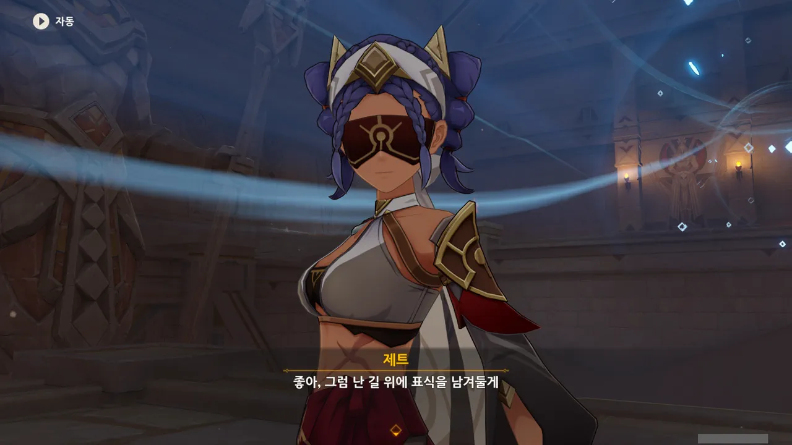

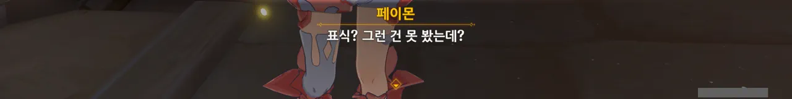

표식? 웬 표식?

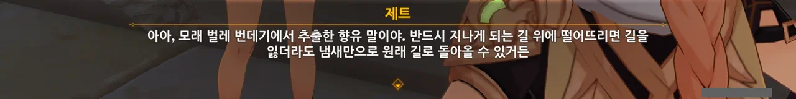

이야, 그 향유, 분명 냄새가 엄청 진할 것 같다.

사람 코는 아무리 심한 냄새라고 해도 곧잘 적응해서 그 냄새를 맡지 못하게 되거든.

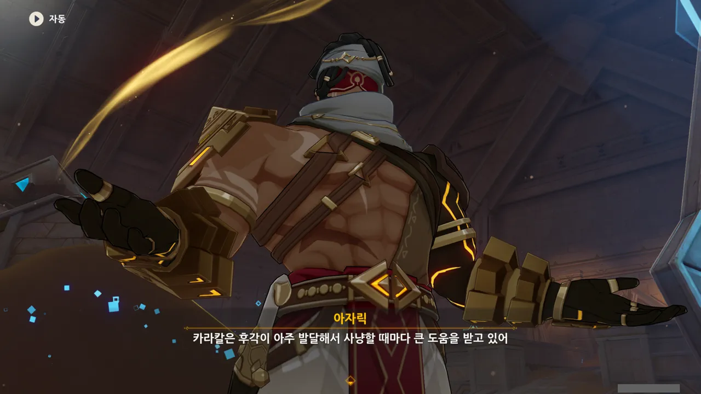

아니면 아자릭 말처럼 향유의 냄새가 심하지 않지만, 제트의 후각이 엄청 발달해서 희미한 냄새도 잘 맡을 수 있는 건지도 모르지.

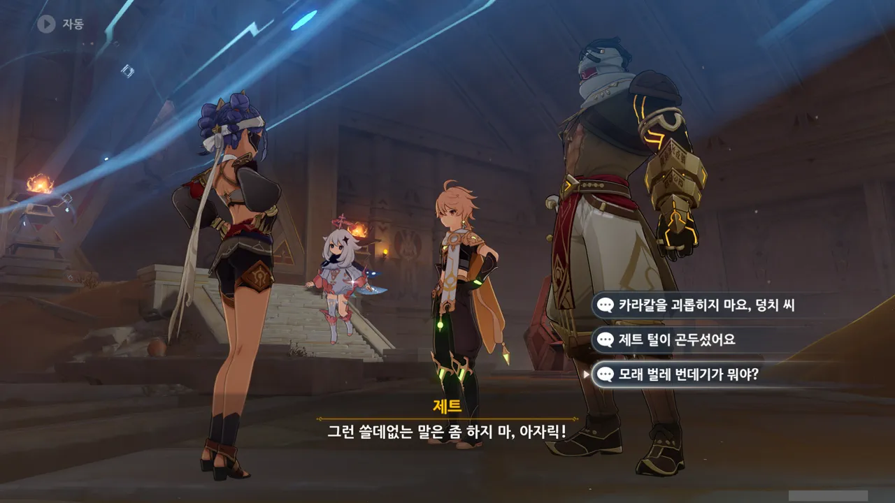

ㅋㅋㅋㅋㅋㅋ 나머지 두 선택지가 모두 제트를 놀리는 선택지이다.

첫 번째 선택지는 아예 제트를 카라칼이라고 놀리는 것이고, 두 번째 선택지는 제트를 고양잇과 동물인 카라칼에 빗대 제트가 화가 났다고 놀리는 것이다.

&nbsp;

그런데 내가 제일 궁금한 건, 그 '모래 벌레 번데기'가 뭐냐는 것이다. 그게 뭐였더라? 어떻게 채취하는 거지? 향은 어떻고?

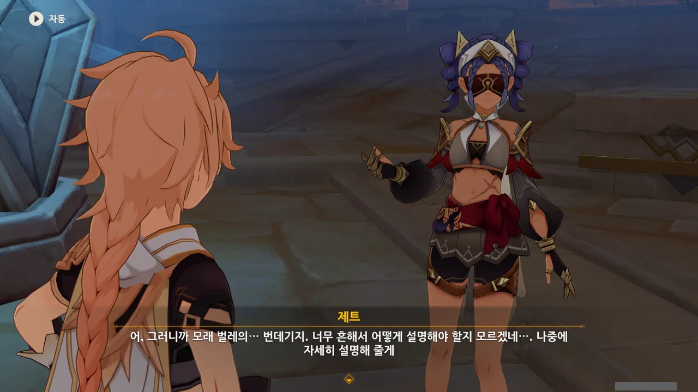

하지만 별 소득은 없었다. 모래 벌레가 너무 흔하다고? 왜 난 본 적이 없는 것 같지?

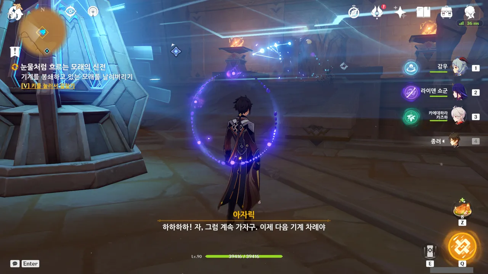

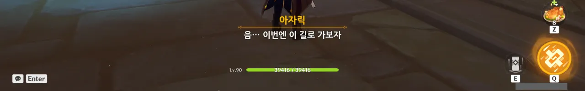

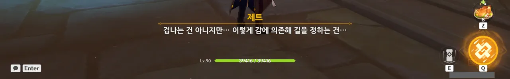

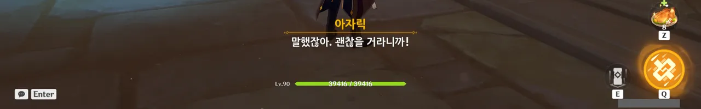

이번에도 아자릭은 감으로 다음 갈 길을 고른다. 하지만 이 녀석, 감으로 골랐다고는 하지만 정확히 우리가 갈 수 있는 길만을 고르고 있다.

사실 말로만 감으로 골랐다고 하는 거고, 사실은 이 유적에 대해 뭔가 더 알고 있는 게 아닐까?

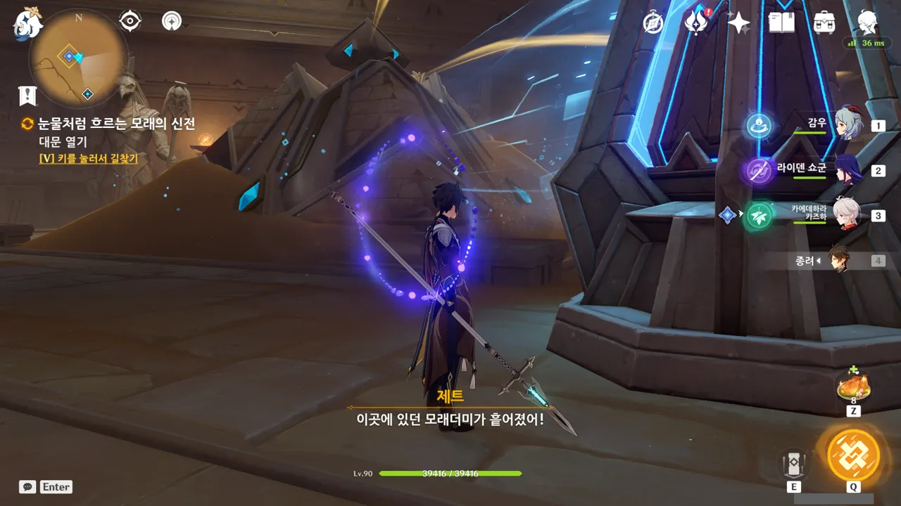

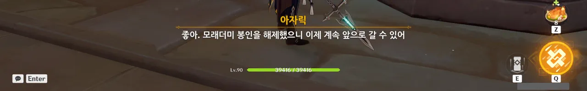

아무튼, 바람 장치를 이용해 다음 문을 여는 버튼과 피라미드에 쌓인 모래를 걷어내었다.

***

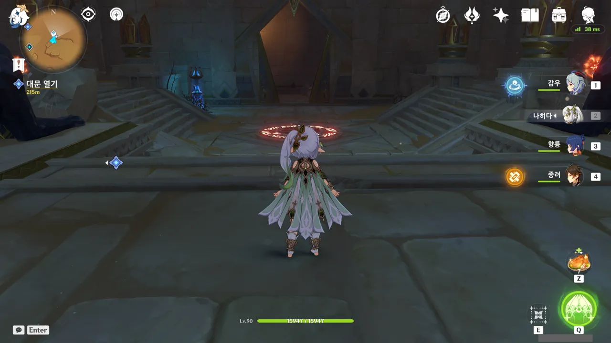

일일 임무를 하고 돌아오니, 저번에 닫혔던 문이 지금은 또 열려 있다.

뭐, 그럼 그렇지. 저 문을 계속 닫아두었다간 오가기 엄청 불편했을 걸?

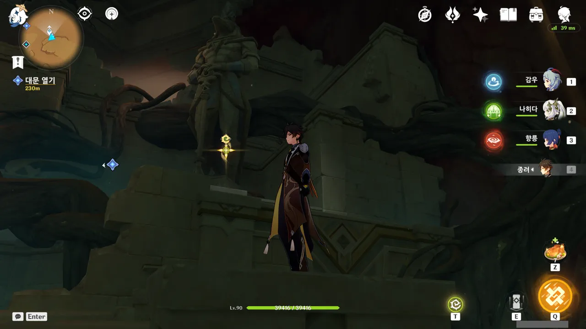

저번에 왔던 길을 찬찬히 되짚어가며 제트가 말했던 '유적 곳곳에 널린 나뭇가지'의 존재를 다시 확인하기도 했다.

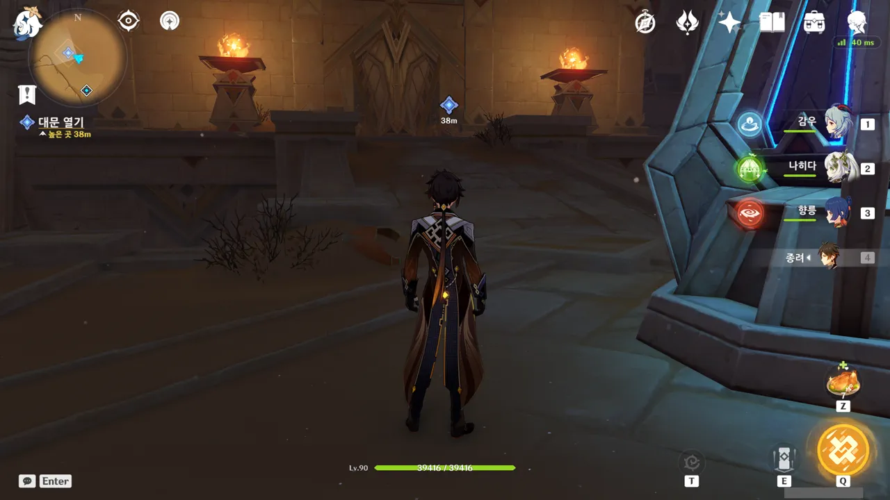

다시 중앙 피라미드에 도착했다. 이번에 가야 할 길은 저 문이다. 문을 여는 버튼을 막고 있던 모래는 이미 저번에 치웠고.

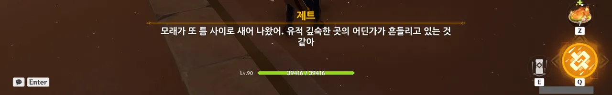

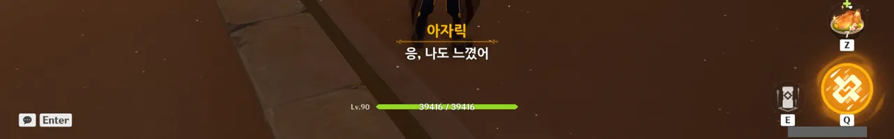

갑자기 제트와 아자릭이 모래 이야기를 하길래, 무슨 모래를 보고 저런 대화를 하는 건가 싶어 주변을 둘러보았다.

정말로 옆을 보니 모래가 조금씩 떨어지고 있었다.

그런데 유적이 흔들리고 있다고? 여기, 설마 지진지대였어? 지진이 나서 유적이 무너지는 건 아니겠지?

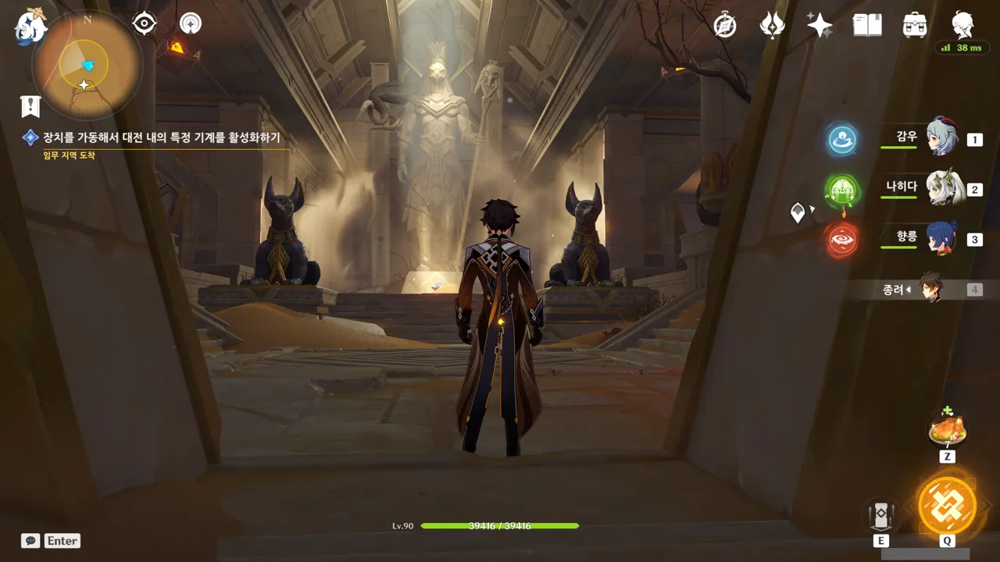

저번에 봤던 그 조각상과 똑같아 보이는 또 다른 조각상을 발견했다. 이 방에서도 저번처럼 조각상 앞의 버튼을 누르라고 하겠지?

그렇다면 왜 버튼을 저 조각상 앞에 둔 걸까? 저번에 들은 걸 제대로 기억하고 있다면, 저 조각상은 적왕 혹은 왕국의 왕을 의미한다고 하던데... 지니의 조각을 억압하는 것과 무언가 상관관계가 있는 걸까?

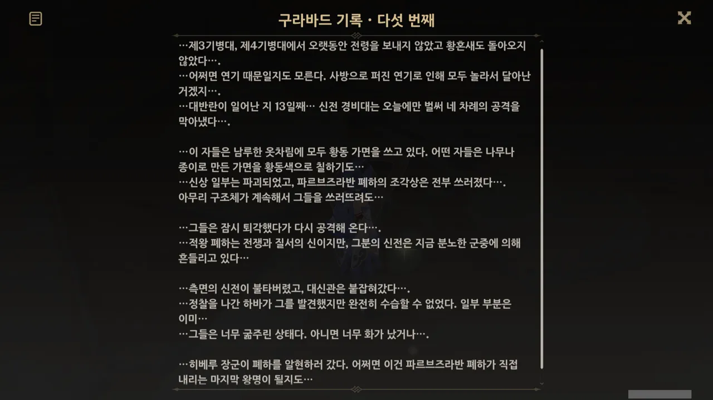

또 다른 구라바드 기록을 발견했다. 저번에는 세 번째 기록이었고, 이번엔 다섯 번째 기록이다.

흠... 내가 뭘 놓쳤나? 중간에 번호 하나가 비는데?



저번과 똑같다. 조각상 앞의 버튼을 누르자, 들어온 문이 닫히고 새로운 문이 열렸다.

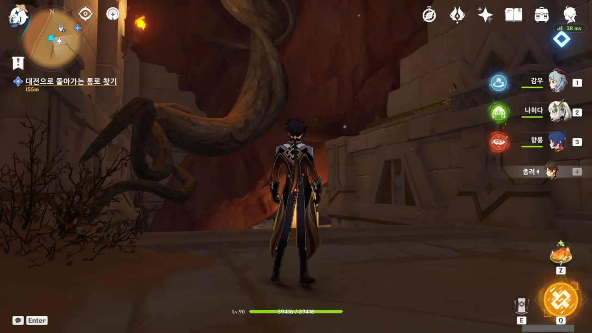

이 정도 굵기면 나뭇가지가 아니라 나무뿌리나 나무줄기라고 불러야 하는 거 아냐?

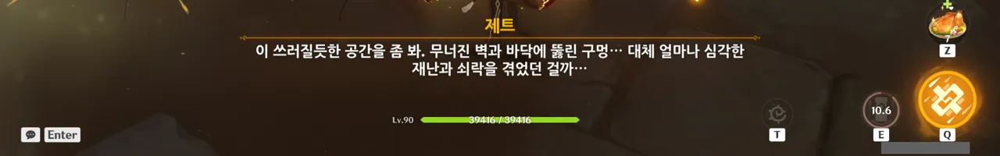

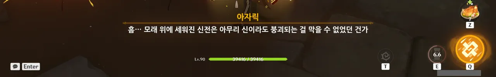

내부에서 내전이나 내란 등을 겪었을 것이라 추측한 것과 별개로, 유적의 손상이 꽤 심각하다.

저번에 봤던 물웅덩이 역시 여러 층의 바닥이 갈라져 맨 밑에 물이 고이게 된 것이고, 물이 고이게 된 것도 멀쩡한 방이 침수되서였다.

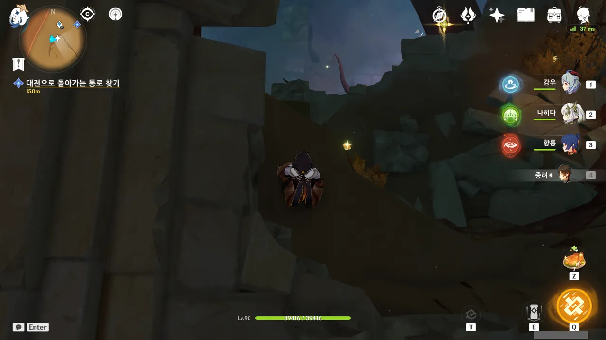

이번에도 또 떨어지네...



모래시계 두 개가 보이길래 '아, 이건 쉽겠네'라고 생각하며 모래시계를 작동했다. 그런데 모래시계가 더 필요하다고 하더라?

알고 보니 맨 위층에 프리즘으로 만들어야 하는 모래시계가 하나 더 있었다.

맨 위에서 내려오면서 하니, 금방이더라.

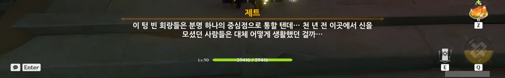

그러게? 아무리 신전이라고 해도 사람이 지낼 수 있는 방 정도는 있을 법 한데, 모든 길과 방이 중앙에 있던 피라미드로 향한다.

신전에 살던 사람들은 대체 어디서 산 걸까?

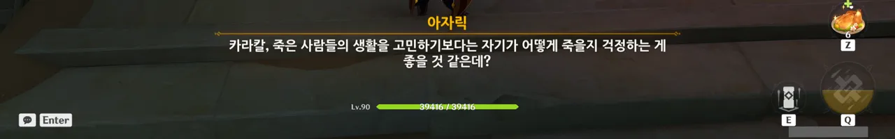

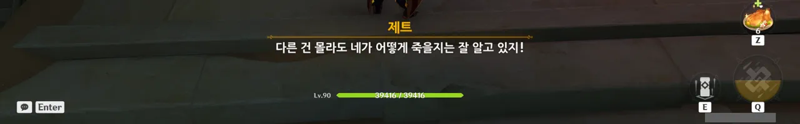

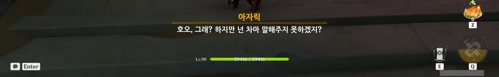

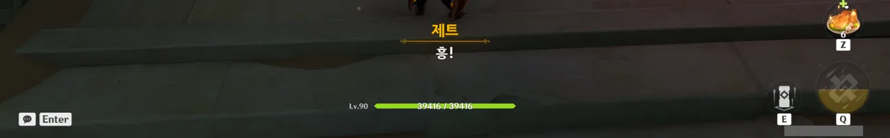

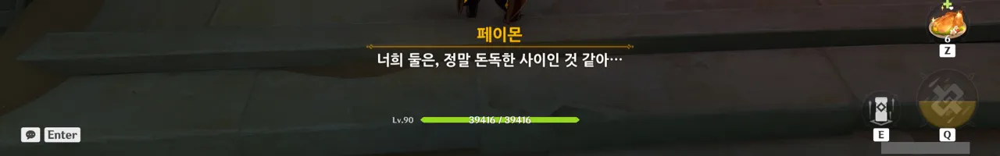

그 와중에 아자릭과 제트는 서로 투닥거린다. 거 참 사이좋네.

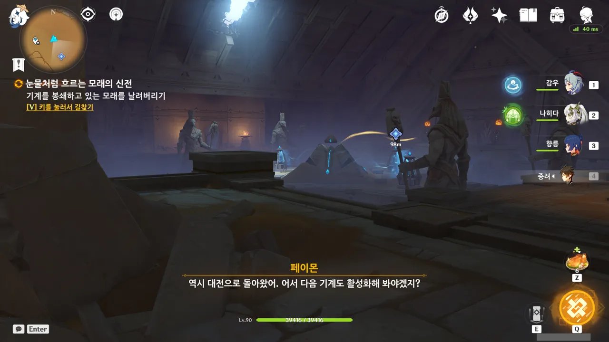

또다시 중앙의 큰 방으로 돌아왔다. 나머지 역시 이런 방식이겠지.

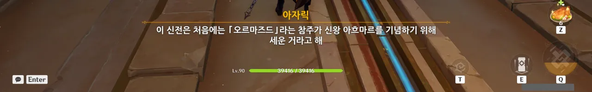

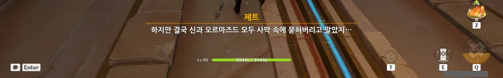

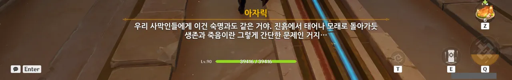

또 내가 모르는 이야기가 나왔다.

얼핏 듣기로는, 사막에는 막장에 막장을 거듭하다 죄다 쫄딱 망해버린 왕국이 가득했다고 하더라.

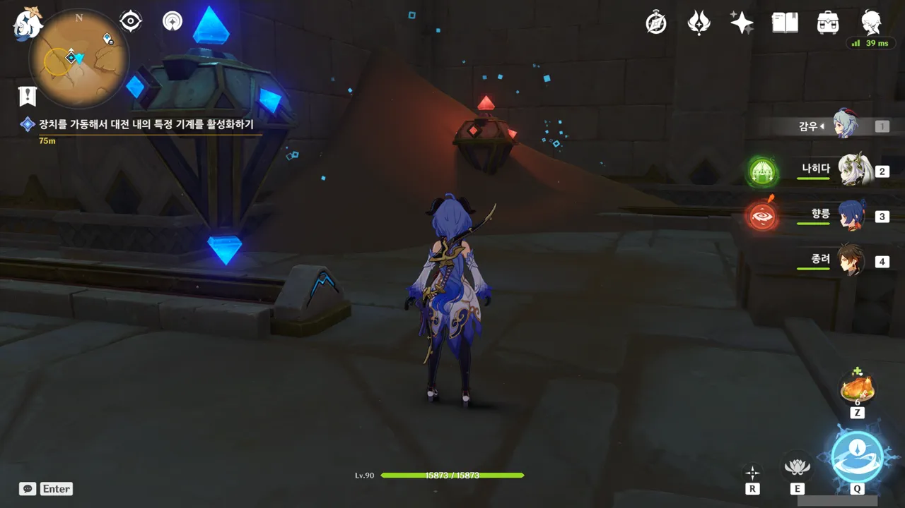

오, 이렇게 모래에 파묻혀 있으면 바람 장치도 비활성화된다.

여기 모래는 그냥 모래가 아닌 모양이지.

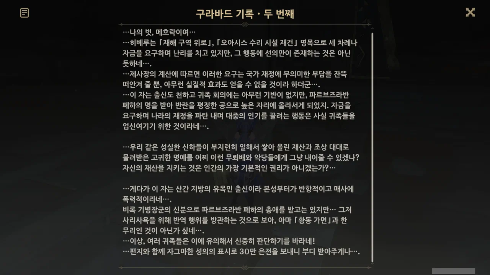

두 번째 구라바드 기록 발견. 지금까지 찾은 기록은 2, 3, 5번 기록이 전부다.

그나저나 동참을 요청하는 편지에 30만 은전이라는 거금을 첨부한 건, '설득'을 위함이 아닐까?

> 나를 돈으로 사려고 하는 겐가? 날 모욕할 셈인가?
> 라고 꾸짖기에는 너무나도 많은 돈이었다.
{.bq}

한쪽의 주장만을 담고 있는 편지이니, 실제로 저 '히베루'라는 사람이 어떤 사람일지는 전혀 알 도리가 없다.

정말로 귀족을 업신여기고 포퓰리즘에 영합하는 정치를 한 것일 수도 있고, 정말로 당장 필요한 요구만을 했을 뿐인데 귀족들이 자신들의 지위를 위해 히베루의 요구를 묵살한 것일 수도 있다.

옛날에는 저런 부류의 사람들은 모두 정의롭고 옳은 일만을 한다고 생각했는데, 아는 게 많아지니, 모두가 그런 건 아니더라고.

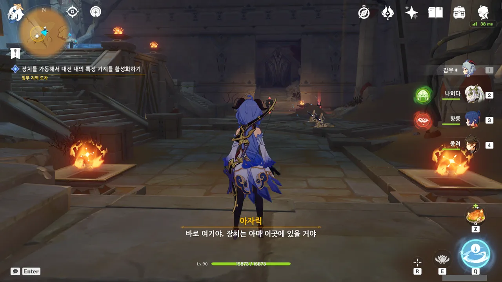

또 다른 방을 찾았다. 그런데 방의 생김새가 이전의 두 방과는 다르다. 마지막 방이라서 그런가?

네 번째 구라바드 기록을 찾았다. 그러면 총 다섯 개의 구라바드 기록이 있는데, 내가 첫 번째 기록만 못 찾고 놓친 건가?

나중에 찾지, 뭐. 기록이 어디 도망가는 것도 아니지 않은가.



이걸 왜 꼭 내가 눌러야만 하는 걸까?

물론 게임이니까 플레이어가 진행하지 않으면 안 되도록 설정했겠지만, 게임 내적으로 보았을 때 제트나 아자릭이 이 장치를 작동시키지 못할 이유가 없어 보이거든. 아까 분명 사막 민족들도 지니의 힘으로 원소의 힘을 다룰 수 있다며.

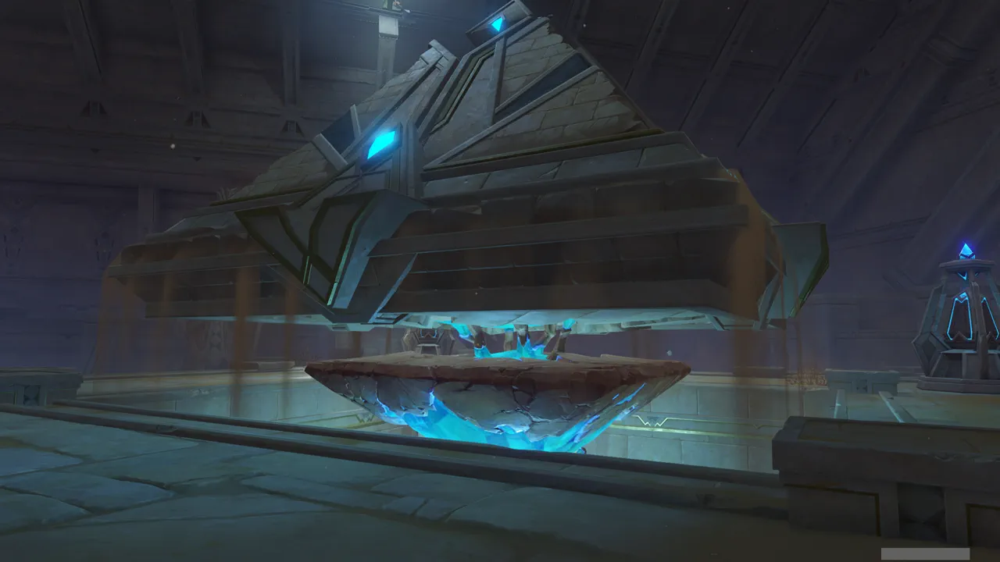

중앙의 피라미드가 공중으로 솟아오른다. 피라미드 밑에 뭔가가 있는데, 저게 뭘까?

설마 저기에 지니 조각이 있는 건 아니겠지?





피라미드가 움직일 때, 화면이 심하게 흔들리지 않았기에, 대체 왜 다들 서로 괜찮냐고 묻는지 이해가 되지 않는다.

저 큰 돌덩이가 움직이는 건데, 땅이 흔들릴 수도 있는 거지.

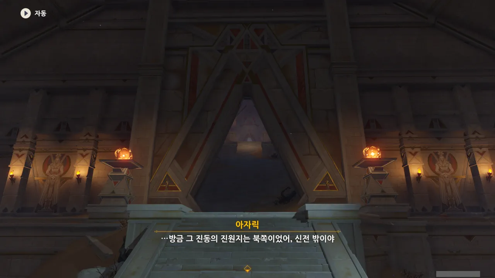

아, 피라미드뿐만 아니라, 신전 바깥의 무언가도 동시에 움직였나 보다.

그런 거라면 큰 진동이 생겨도 이상할 게 없지.



> 왜 나는 느껴지지 않는 거지...?

아, 그야 페이몬 넌 날아다니니까 그렇지.

&nbsp;

페이몬을 보니, 예전에 어디선가 봤던 퀴즈가 하나 떠오른다. '밀폐된 상자 안에 새가 있는데, 이 새가 상자 안에서 공중에 뜬 채 날갯짓을 하면 상자의 무게가 변할까, 변하지 않을까?'라는 문제였던 거로 기억한다.

이 질문을 해결하고자 '호기심 해결사'라는 프로그램에서 트럭에 새 여러 마리를 싣고 모든 새가 날아다닐 때의 트럭 무게 변화를 측정했는데, 아무런 변화가 없었다고 한다.

뭐, 새의 무게보다 트럭의 무게가 압도적으로 무거워 유의미한 무게 변화를 이루어내기 힘들었을 것 같은데, 그 프로그램에서는 '변화가 없다'라는 결론을 내리더라.

그래. 나도 바깥에 무슨 해괴한 일이 생겼을까 정말 궁금하다.

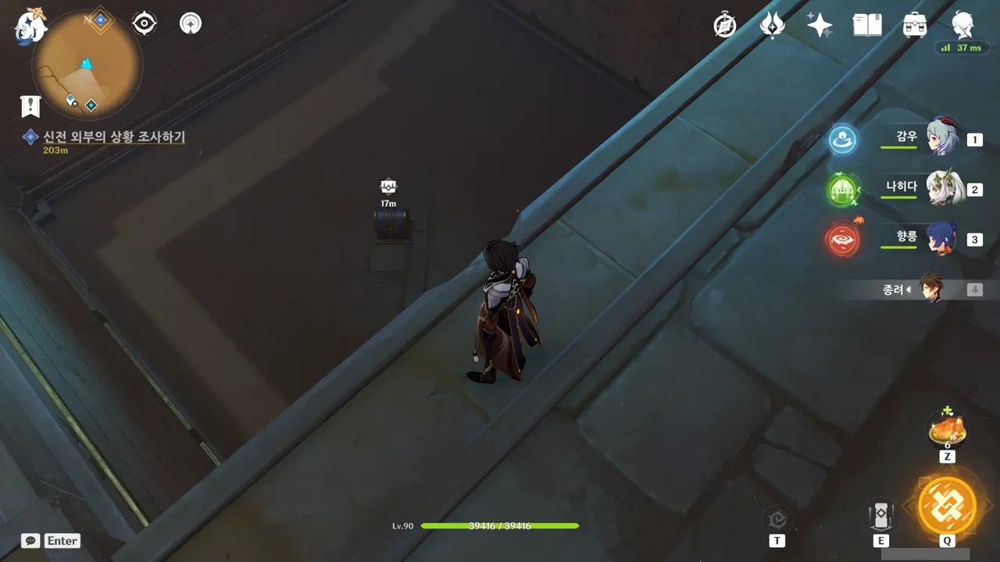

하지만 그전에 이 탐스러운 상자 먼저 먹고.

응? '신의 장기판'? 이런 지명이 원래 있었나?

그나저나 이렇게 신전을 나와보니, 이 신전이 사막 중앙의 모래폭풍을 마주 보고 있다는 사실이 체감된다.

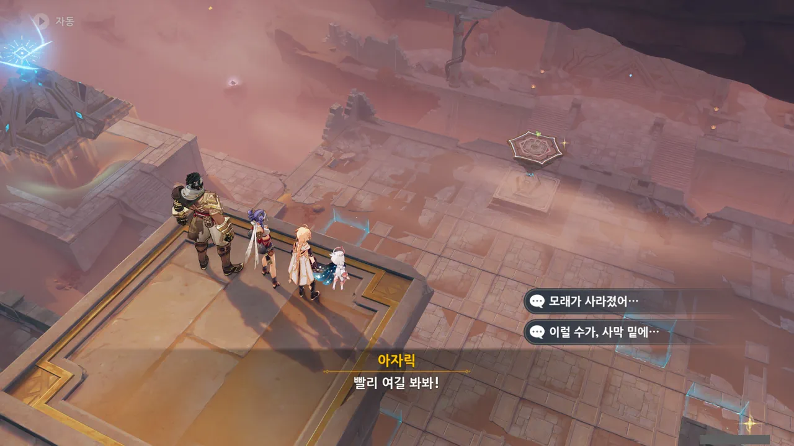

와... 바닥에 있던 모래가 사라지고 그 밑에 있던 온갖 퍼즐, 아니 유적들이 나타났다.

와! 새로운 퍼즐! 와! 새로운 보물상자!

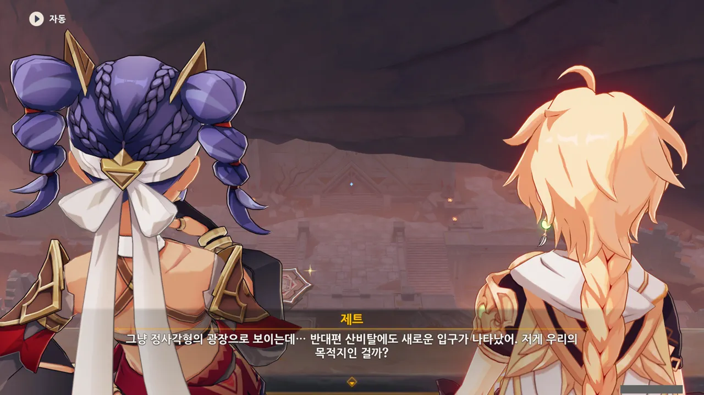

저 문, 딱 봐도 '여기로 들어오세요'라고 말하는 것 같지 않아? 분명 나중에 저기로 들어갈 게 분명하다.

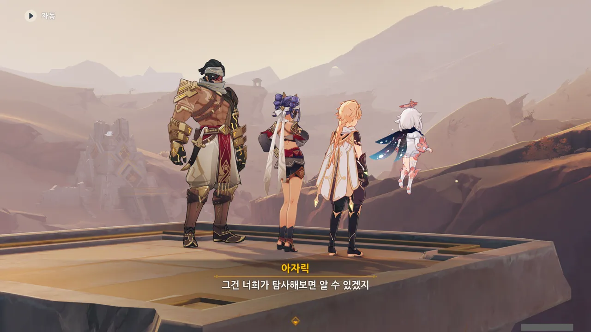

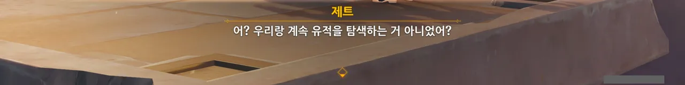

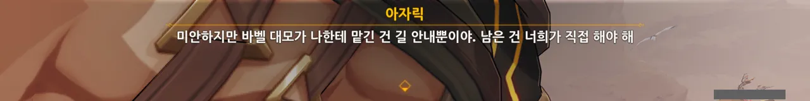

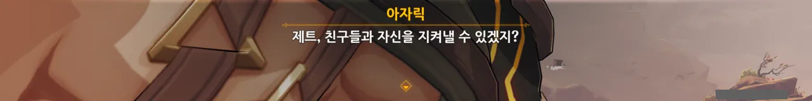

아자릭의 역할은 여기까지라고 한다. 자신의 역할은 길 안내까지이니, 나머지 퍼즐 풀이는 제트와 여행자가 알아서 하라고 한다.

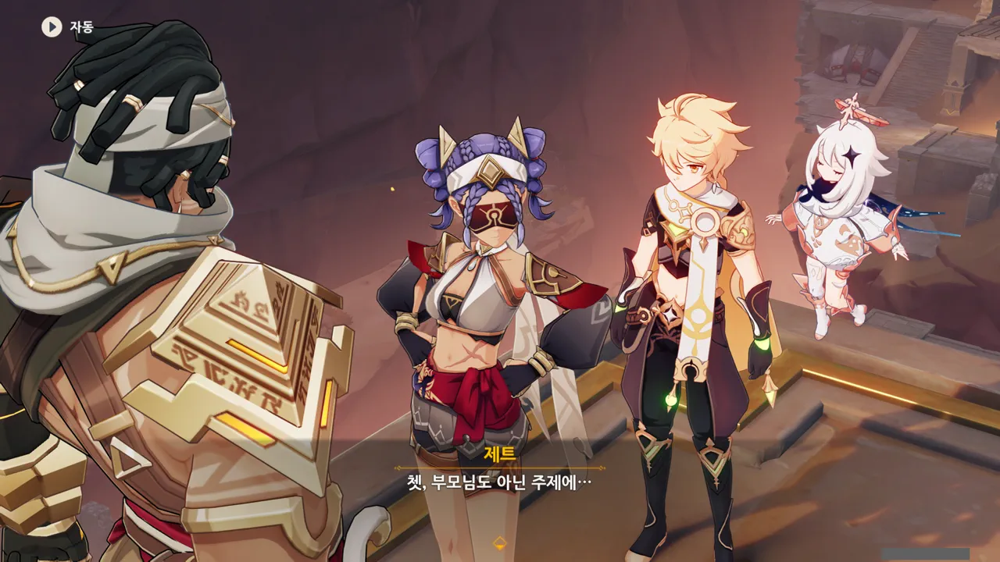

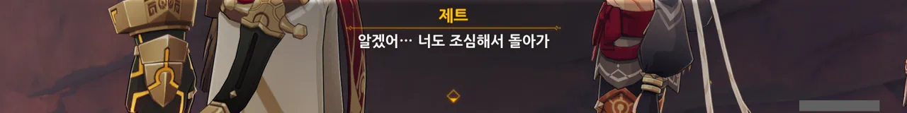

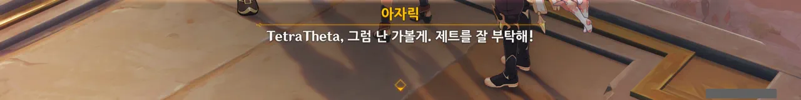

제트가 '부모도 아닌 주제에...'라고 투덜대지만, 그래도 아자릭을 잘 배웅한다.

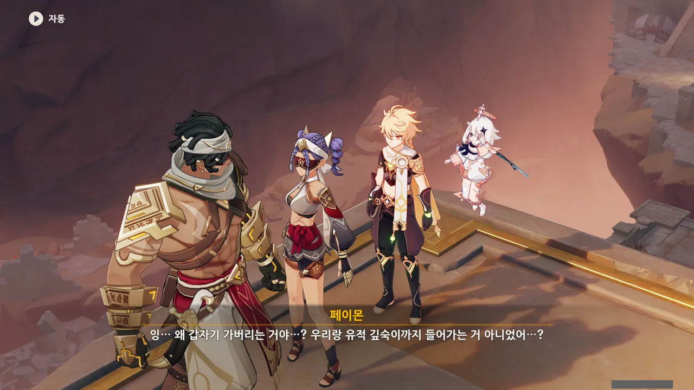

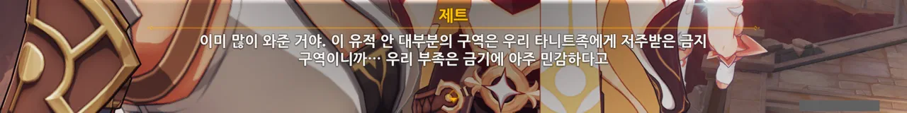

이 부분이 정말 이해가 되지 않는다니까.

아자릭이 부족의 금기 때문에 더 이상 여행자 일행과 함께할 수 없다는 건 이해할 수 있다. 그런데 제트는 왜 되는 거야? 여긴 부족원은 물론이요, 외부인도 접근하지 못하도록 막고 있는 유적 아니었어?

&nbsp;

저번에 말했지만, 이건 100% 뒤가 구린 이야기이다. 제트는 바벨에게 속고 있는 게 분명하다.

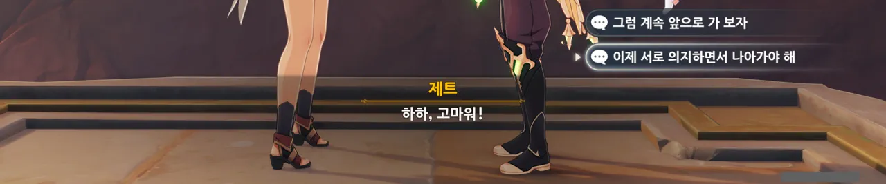

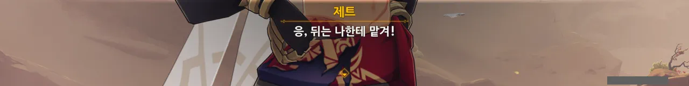

일단 계속 전진하는 수밖에 없다. 뭐가 되었건, 앞으로 가보면 알 수 있겠지.

아자릭 말처럼, 가는 길을 방해한다면 모조리 베어버리면 되는 것이다.

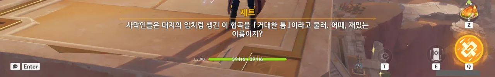

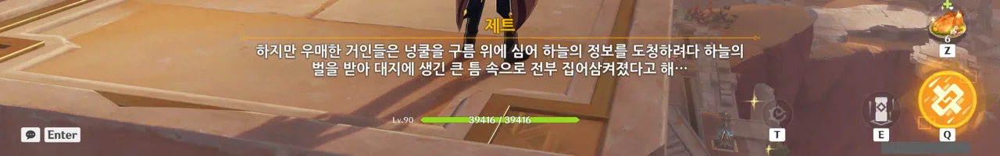

일반적으로 이런 전설은 진실을 은유적으로 내포하고 있는 경우가 많다.

거인은 아마 켄리아인을 말하는 것일까? 하늘의 정보를 도청한다는 말이나, 하늘의 벌을 받았다는 말을 보면 켄리아인이 맞는 것 같은데. 거인이라는 말 역시 그들이 운용했던 그 커다란 로봇을 의미하는 것일 테고... 그렇다면 넝쿨을 구름 위에 심는다는 말은 무슨 의미였던 것일까. 

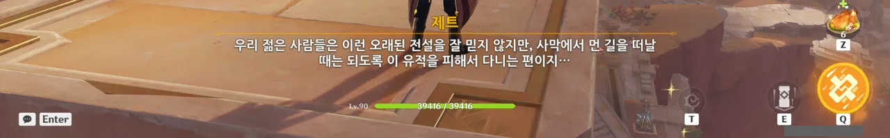

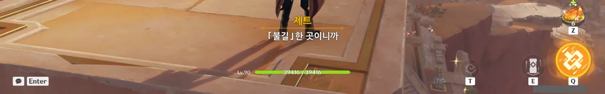

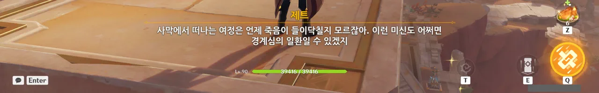

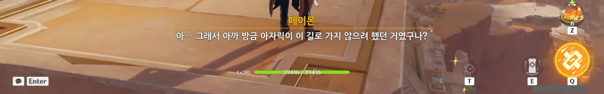

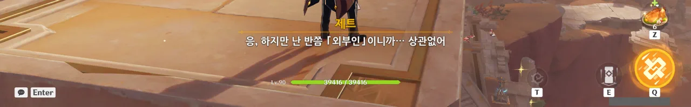

뭐, 사막과 같은 오지에서 미신이 유행하는 것은 드문 일이 아니니까.

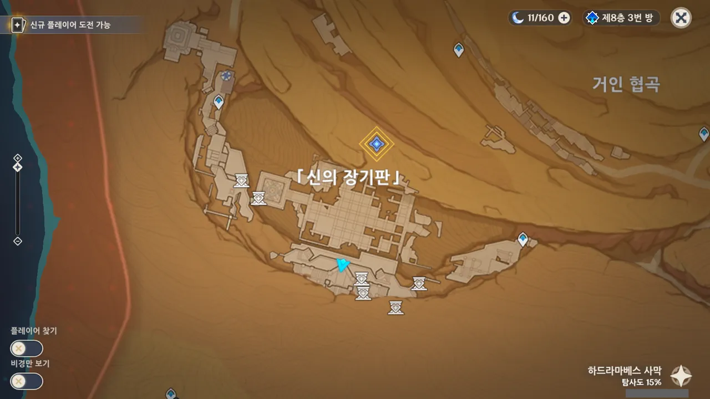

지도를 열어보니, 지형이 바뀌었다. 아, 저래서 '신의 장기판'이라고 한 거였냐?

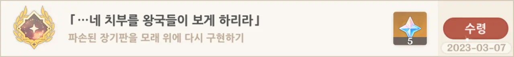

그리고 이와 함께 깨진 업적 역시 뭔가 의미심장하다. '네 치부를 왕국들이 보게 하리라'...?
