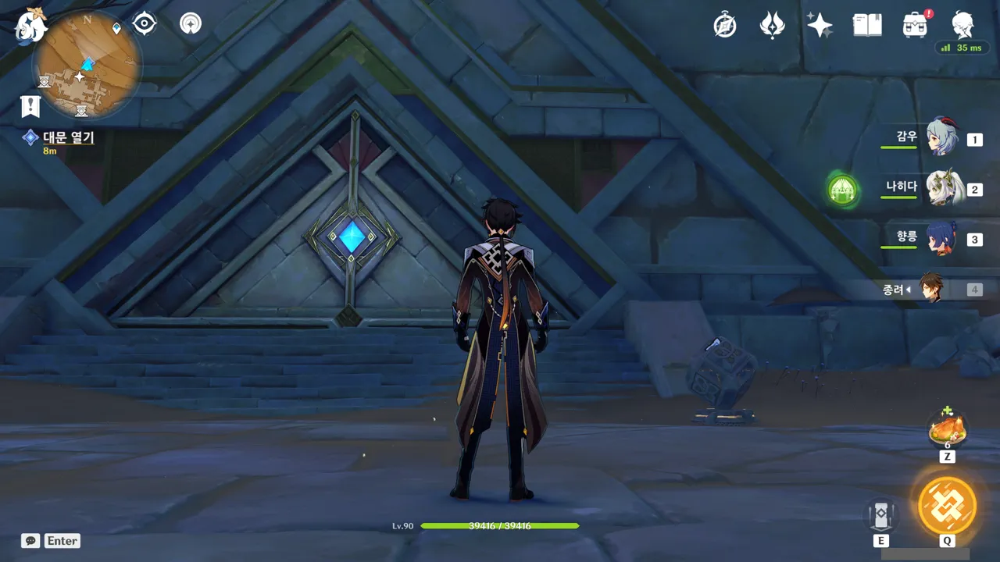

저번에 봤던 그 문 앞이다.

문에 들어가기 전에 '문을 열기 위해서 먼저 이걸 하세요'라는 식으로 이리저리 뺑뺑이를 돌릴 줄 알았는데, 의외로 순순히 문으로 들어가게 해 준다.

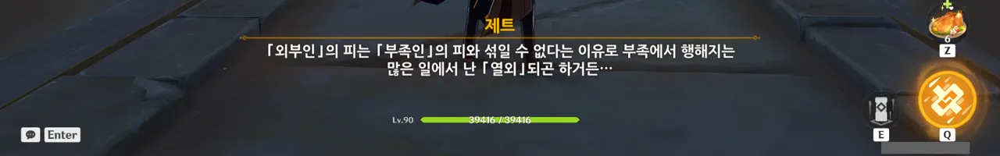

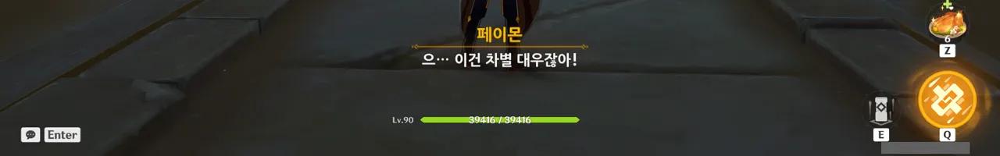

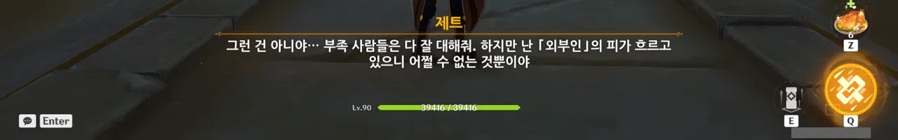

아니긴 뭐가 아냐. 차별 맞네.

이미 가스라이팅이 다 끝난 건지, 차별 대우를 차별 대우라고 말해줘도 아니라고 말하는 제트.

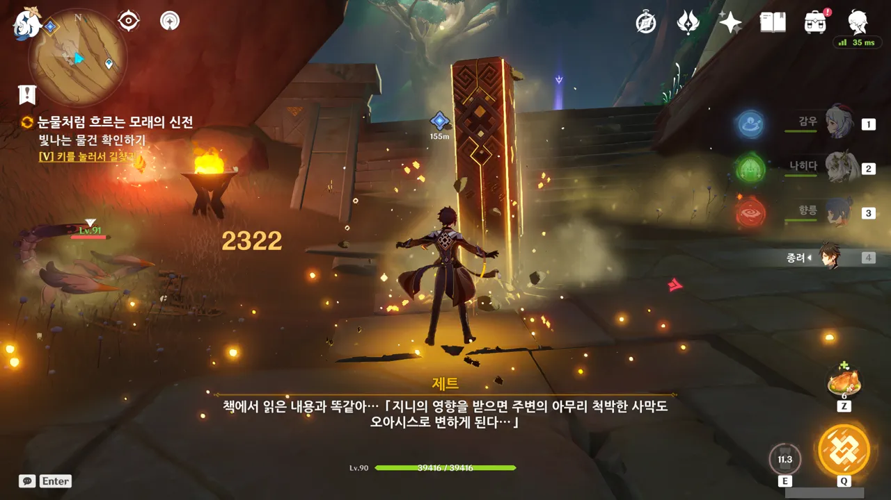

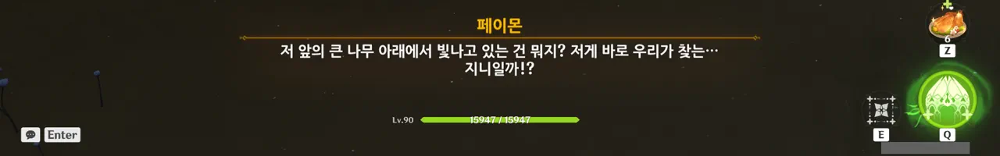

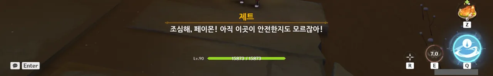

제발... 전투할 때는 말하지 말아 줘... 싸우랴, 사진 찍으랴 아주 정신이 없다고...

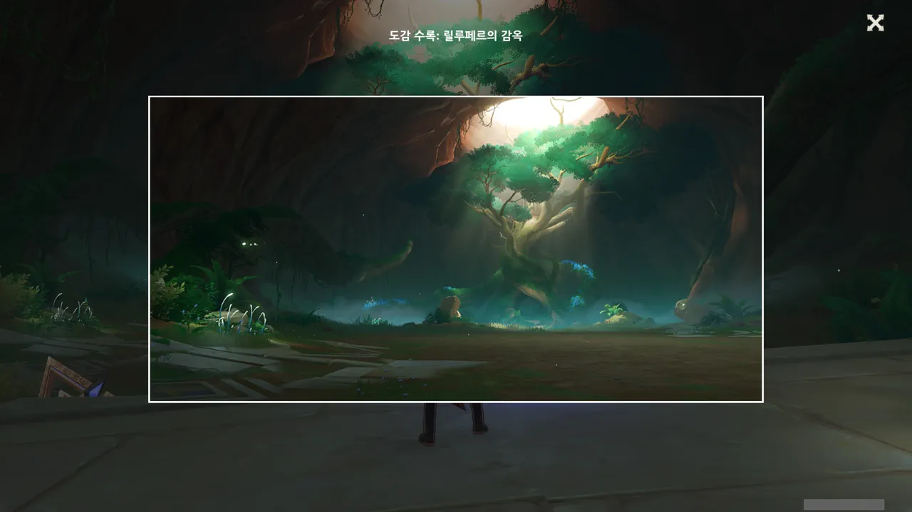

그런데 확실히 제트 말처럼, 이곳은 다른 곳과 다르게 나무에 잎사귀가 무성하게 자라있으며, 푸른 잔디 또한 곳곳에 자란 것이 보인다.

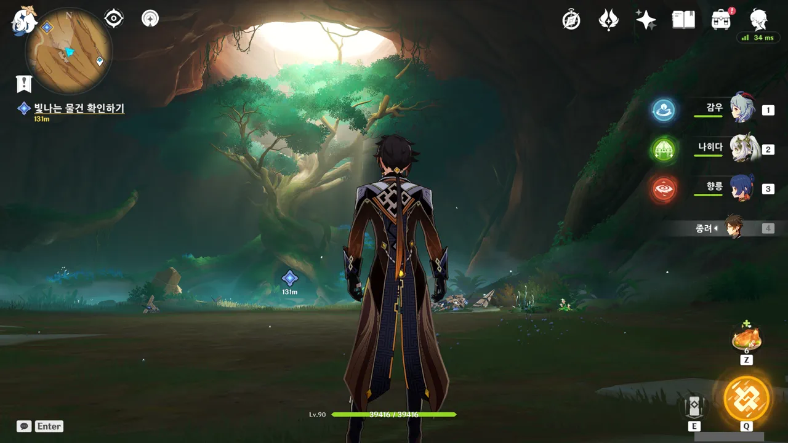

이야... 이렇게 보니까 또 이쁘네. 저기 나무 밑으로 가라고 퀘스트 마커가 떡하니 찍혀있다.

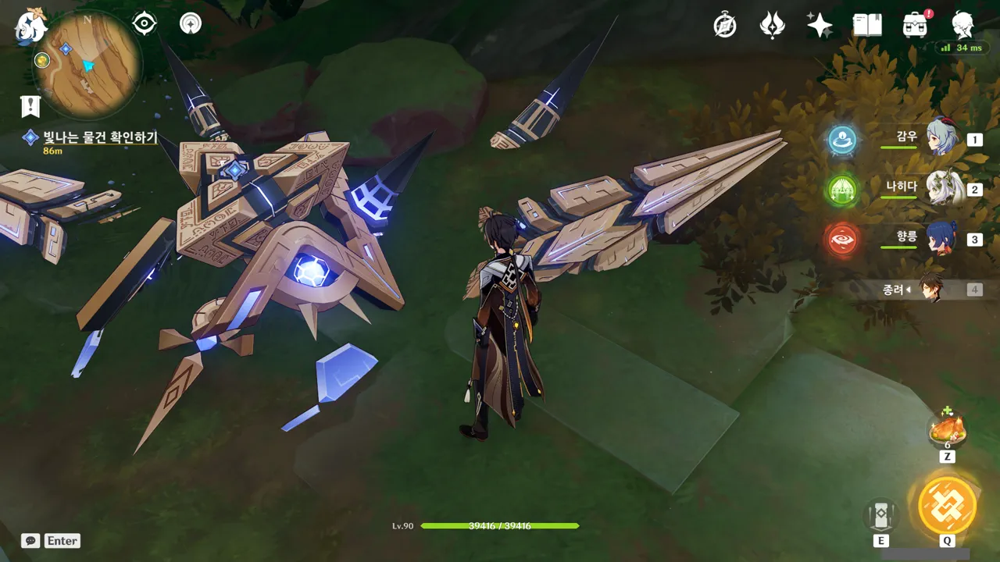

나무 밑으로 가다 발견한 기묘한 잔해. 내가 봤을 때, 이건 조금 있다 다시 되살아나서 우릴 공격할 것이다.

다른 잔해는 그냥 곱게 땅에 파묻혀 있는데, 이건 아직 살아있다는 듯이 전기가 조금씩 파직거리고 있거든.

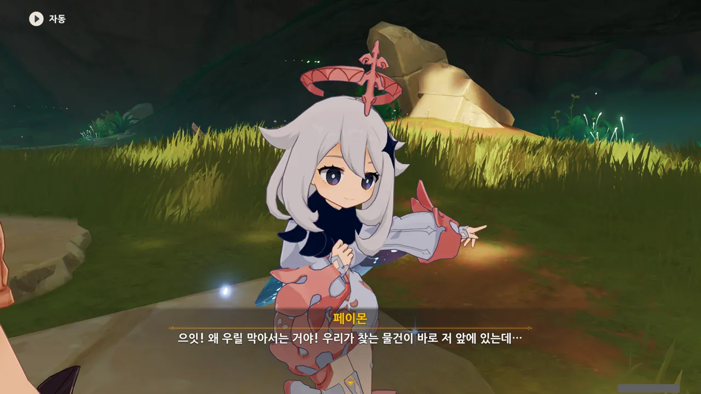

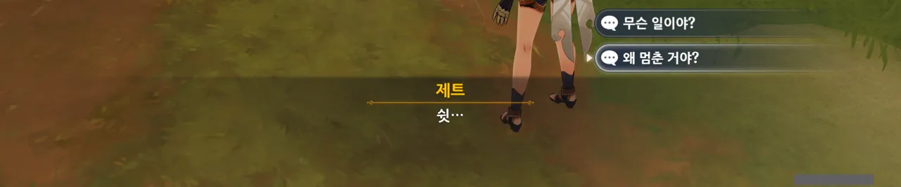

가는 길을 갑자기 제트가 막아선다.

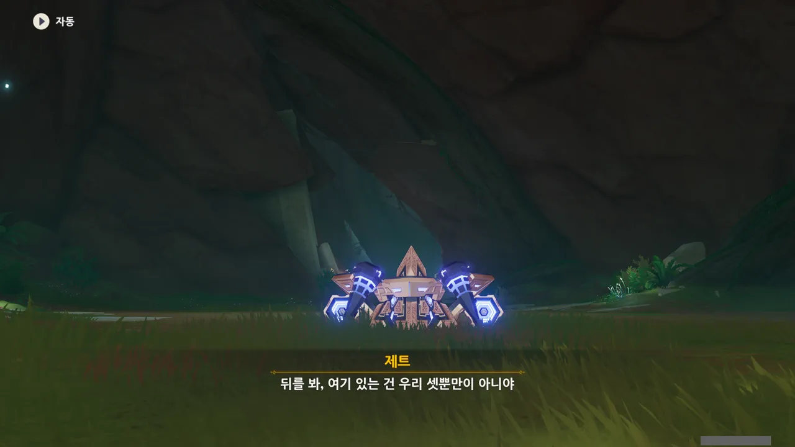

아잇 젠장, 그러면 그렇지. 아까 '이 녀석, 되살아나는 거 아냐?'라고 생각했던 그 녀석이 맞다.

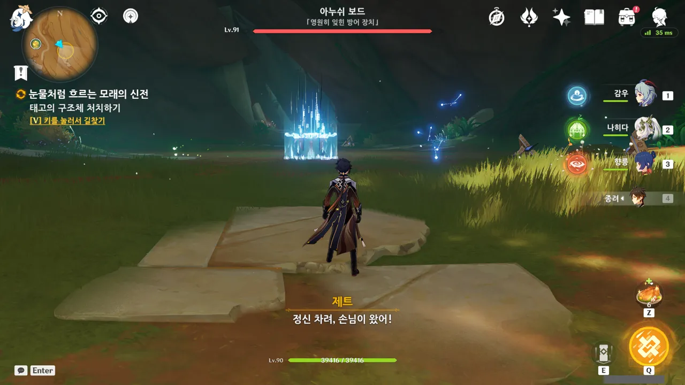

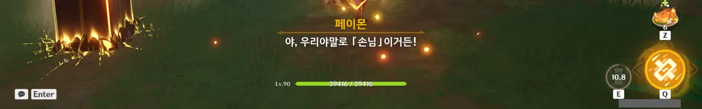

ㅋㅋㅋ 그러네 ㅋㅋㅋ 여기선 우리가 손님이지, 참. ㅋㅋㅋ

보스 이름이 '영원히 잊힌 방어 장치 - 아누쉬 보드'인데, 영원히 잊히기에는 이미 글러먹은 것 같다.

아무튼 처리 완료.

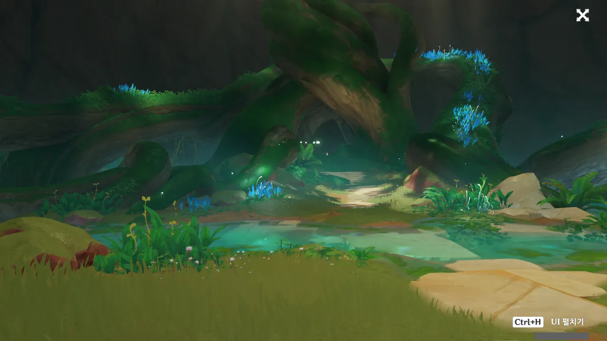

그나저나 여기 참 이쁘다. 사막 한가운데서 이런 장면을 보게 될 줄이야... 이쁘니까 사진 한 장 남겨놓았다.

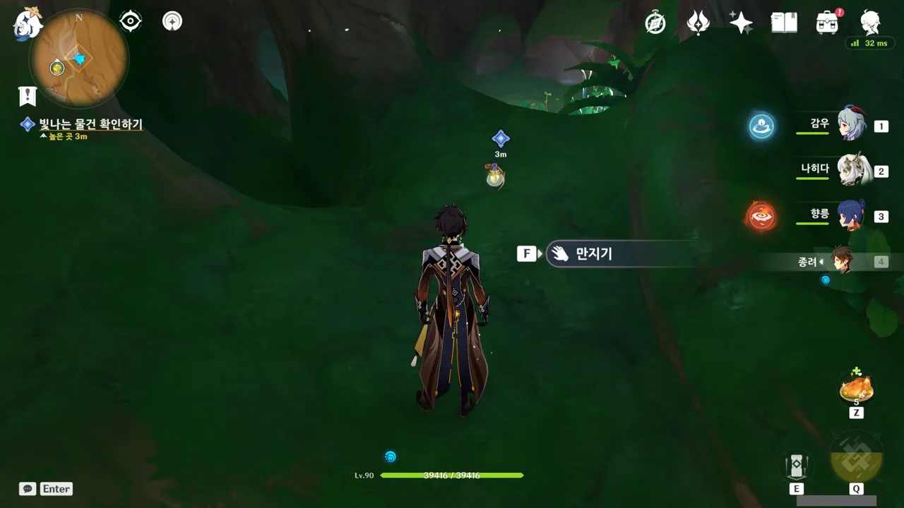

뭔가 병처럼 생긴 것이 공중에 둥둥 떠있다.

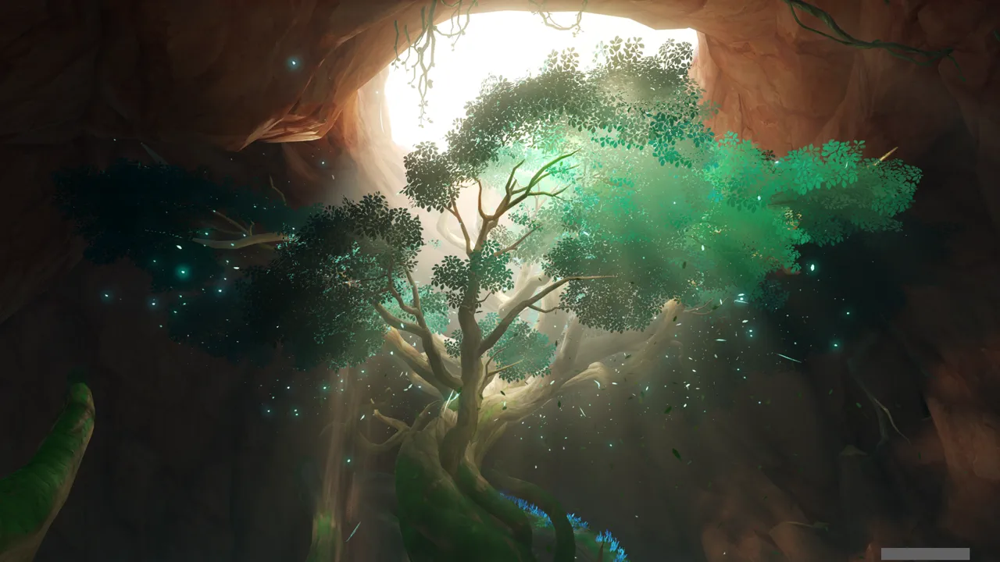





병을 만지자마자 나무에 매달려 있던 수많은 나뭇잎들이 사라지고, 벽이 무너지고, 온갖 푸르렀던 것들이 죄다 시들어버렸다.

와, 그러니까 이 모든 식물들이 여기 있던 지니의 힘에 의해 푸르게 유지되고 있었던 거야? 지니 힘 엄청 세네.

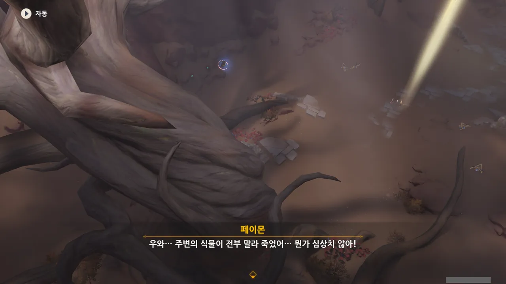

식물들이 그냥 시든 것도 아니고, 말라죽었다고 한다.

이제 남은 건 다른 사막 유적에서도 종종 보이곤 하던, 평범한 나뭇가지밖에 없다.





와! 병이 말을 한다! 그런데 입도 거칠어!

페이몬에게 '시끄러운 꼬마'라고 말하거나, '시끄럽고 쓸모없는 혀는 대체 왜 갖고 있냐'라는 독설을 내뱉는 캐릭터는 지금까지 손에 꼽을 정도 아니었나?

알하이탐이 페이몬에게 쓴소리를 하긴 했다만, 그냥 단순히 바보라고 한 것뿐이잖아.



정황상 이 지니가 '지니의 어머니'일 확률이 높아 보이는데, '지니의 어머니'가 맞냐 묻자, 자신이 지니인 것은 맞고, 어머니였던 적 역시 있지만, '지니의 어머니'는 아니라고 한다. 애매한 대답인걸...

그나저나 '비천한 사막 주민'...? 뭔가 느낌이 좋지 않다. 마치 천민을 멸시하는 귀족 같은 느낌인걸.

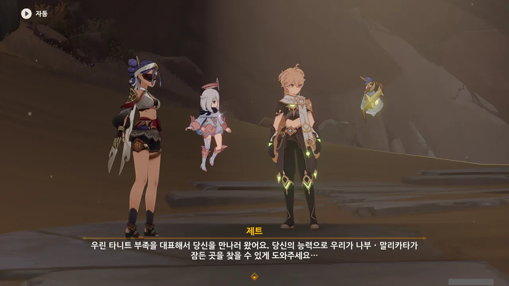

제트가 공손하게 자신의 부탁을 전한다.



그런데 이 병쪼가리, 싸가지가 아주 바가지네. 타니트 부족 못지않은 싸가지다.

저 '물러서도록 해'라는 대사 역시 영어로 치면 Back off 정도의 느낌으로 보인다. 왜, '천한 것이 어디~'로 시작하는 그런 상투적인 대사 있지 않은가. 딱 그런 느낌이다.

그나저나 주인이라니... 옛날 사막 민족들은 누군가의 노예였던 걸까?

&nbsp;

아무튼, 난데없이 뺨을 맞은 제트.



'사막인 여자 노예'는 제트를 지칭하는 걸 테고, '날아다니는 애완동물'은 페이몬을 일컫는 거겠지. '타향을 떠도는 왕자'라... 여행자 남매가 어디 왕족이었다는 말이 있었던가? 심연 교단에서 여행자의 여동생을 '공주'라고 부르긴 하지만, 그것만 갖고는 좀 부족하거든.

&nbsp;

이 상황에서 떠오르는 건 역시 캡틴 아메리카였다.

흑인 차별이 만연한 시대에 태어난 사람이라면, 냉동되었다 다시 깨어났는데 눈앞에 흑인이 자신에게 뭐라 뭐라 말하고 있는 상황을 보고 '으악! 니■■가 말을 한다!'라는 식의 반응을 보이는 것이 일반적일 것이다.

하지만 캡틴 아메리카는 눈앞에서 흑인이 말하는 것에 전혀 개의치 않고 그가 말하는 걸 끝까지 경청하지 않았던가.

물론, 고귀한 정신을 가진 캡틴 아메리카가 인종 차별 사상을 갖고 있지 않다는 걸 보여주기 위한 장치의 일환이겠지만, 그 정도만 해도 일단 대단한 것이다.

릴루페르? 이름의 어감은 참 좋네...





모래나 먹는 노예 ㅋㅋㅋ 진짜 인종 차별적 단어는 다양하다니까.

그런데 친구에게 자꾸 노예니 비천하다니 하는 걸 보니 기분이 좀 나쁜데.

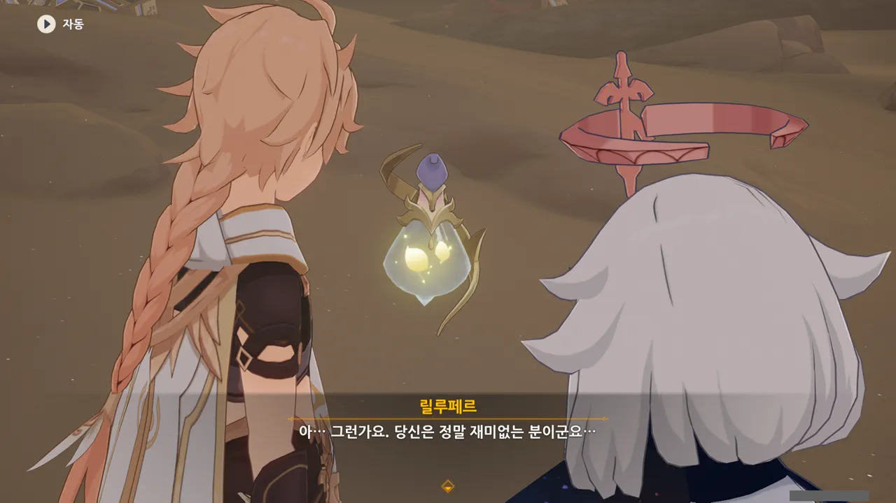

재미가 없기는. 노래 한 번 들으면 그 생각이 싸악 바뀔 거야.



현재 릴루페르는 영혼이 사분오열되어 제 힘을 온전히 쓸 수 없는 상황이라고 한다. 아무리 봐도 릴루페르가 전설 속 그 지니가 맞는 거 같은데.

그런데 지니가 변신도 할 수 있다고? 나한이나 야차 같은 단어는 리월에서나 나올법한 단어일 텐데... 대체 릴루페르는 어디까지 돌아다녀본 거지?



이야, 지니에게는 진명도 있다고 한다.

하지만 꽤 그럴듯한 설정이다.

오컬트 등에서 흔히 말하길, 악마에게는 각자 진명이 따로 있고, 그 진명을 외치면 악마를 내쫓을 수 있다고 한다. 기독교가 퍼지는 과정에서 토착 신앙의 신 등은 전부 악마로 격하되었고, 그중에는 지니 또한 포함되어 있었다.

그러니 지니에게 진명이 있다는 설정은 꽤 그럴듯한 설정이다.



제트가 기겁을 하길래 왜 그러냐고 물어보니, 지니가 진명을 제공한 사람은 진명을 통해 지니를 마음대로 부릴 수 있다고 한다.

그럼 좋은 거 아냐? 아, 물론 이런 것 역시 동전의 양면처럼 나쁜 점도 있겠지, 아마...?

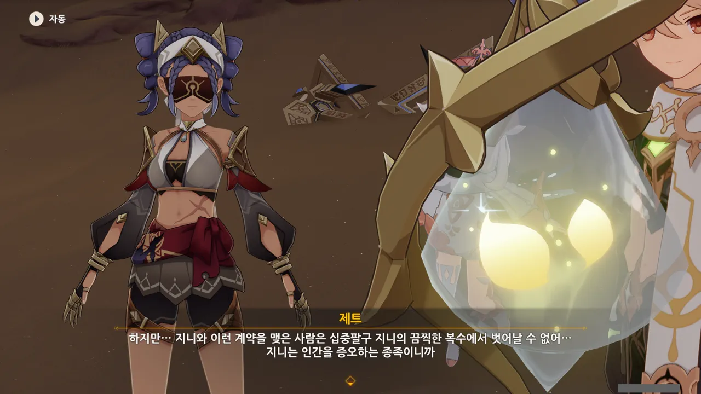

그런데 제트의 말에 따르면, 지니는 인간을 증오하는 종족이기 때문에, 지니와 계약을 맺은 사람은 지니에게 끔찍한 복수를 당한다고 한다.

그게 어떤 복수인지는 잘 모르겠지만, 흔히 말하는 *파멸* 같은 게 아닐까?





심지어 릴루페르 또한 그 말을 부정하지 않고 '독충이나 두꺼비를 싫어하듯 나 역시 그럴 뿐이다'라고 말한다.

그러니까 릴루페르에겐 사람들이 독충이나 두꺼비처럼 보인다는 거 아냐. 이야, 이런 선민사상을 가진 종족이 있었다니.



심지어 전설 속 릴루페르는 구라바드의 왕, 오르마즈드 가족 전체를 꿀로 익사시켰다고 한다.

오르마즈드... 분명 저번에 본 석판에 나온 왕의 이름 아니었나? 가족 전체가 꿀로 익사했다니, 이 얼마나 끔찍한 죽음이니? '오라, 달콤한 죽음이여'도 아니고...

&nbsp;

그런데 바벨은 왜 이렇게 위험한 전설 속 지니를 원한 걸까? 영원의 오아시스로 가는 길을 아는 다른 지니가 있을 수도 있잖아.

릴루페르를 보건대, 그 지니 또한 릴루페르처럼 한 대 패고 싶은 녀석일 수도 있지만...





그 전설 역시 부정하지 않는 릴루페르. 그러니까 지금까지 제트가 말한 게 다 사실이었단 거야?

그래놓고서, '그런데 맨 입으론 나부 말리카타가 잠든 곳을 안 알려줄 건데?'라고 하고 있다.

&nbsp;

그러니까 양자택일이라는 거다. 제트의 친구, 여행자를 릴루페르의 주인으로 만들어 지니의 저주를 받게 하고, 나부 말리카타가 잠든 곳을 찾거나, 나부 말리카타가 잠든 곳을 찾는 것을 포기하던가. 이 둘 중 하나를 택하라는 거다.

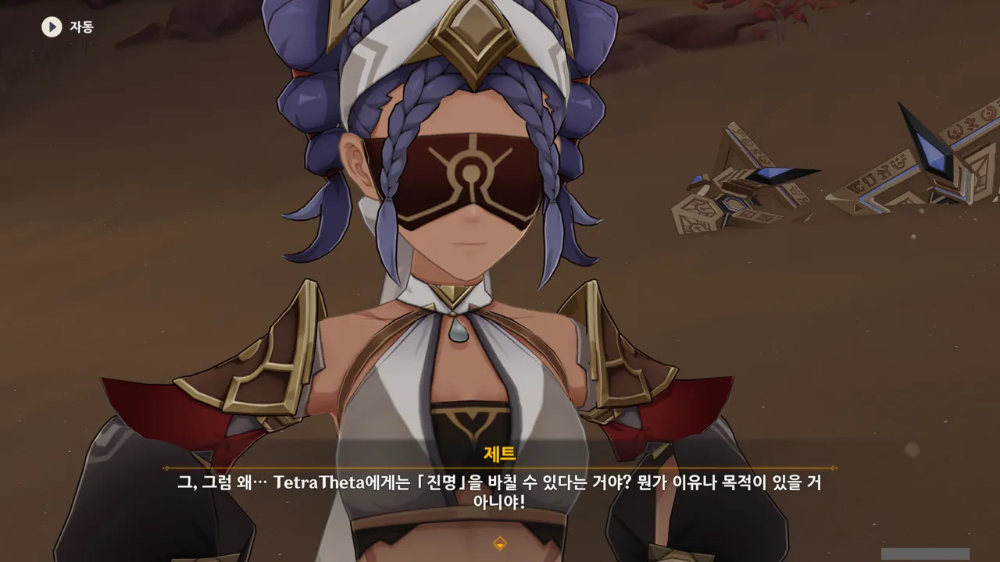

그런데 왜 하필 여행자일까? 릴루페르가 말하는 걸 들어보면 옛날에는 사막 왕국의 지배계층을 잘만 섬겼던 것 같은데... 그게 지금의 사막 민족 아냐?

아니면 사막 왕국의 지배계층이 전설 속 '거인'이었던 걸까? 그런 거라면 또 말이 되긴 할 거 같은데...



릴루페르가 여행자를 주인으로 선택한 이유: 마음에 들어서. ... 뭐요?

전설 속에 등장하는 여러 자의식이 있는 무구들은 그 무구의 인정을 받지 못하면 사용할 수 없다고 하던데, 그게 여기서도 나온다고?

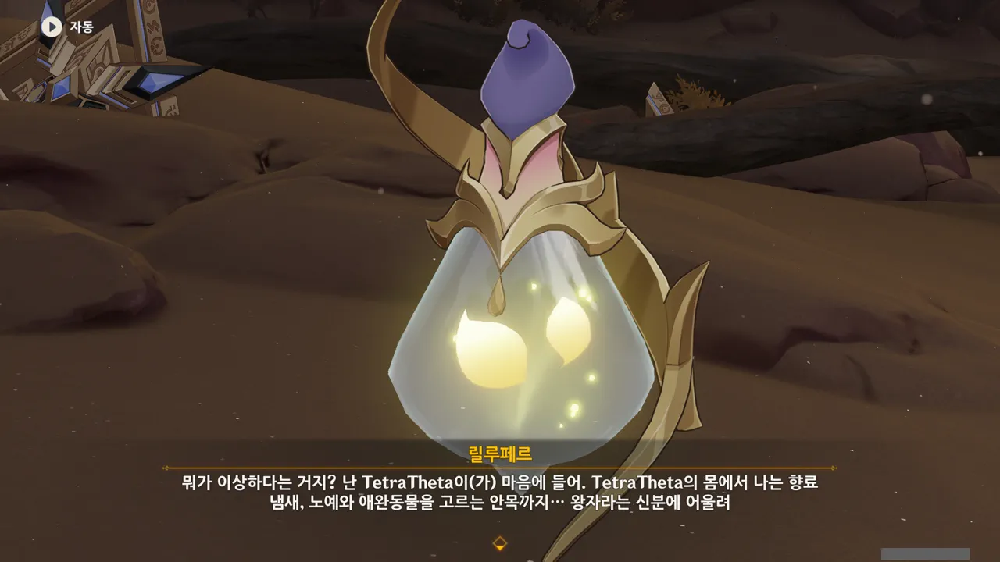

내 말을 듣지 않는군요. 아까 분명 왕자가 아니라고 말했건만.

게다가 여행자를 왕자로 생각하는 기준조차 이상하다. 고작 그런 거로 여행자를 왕자로 생각한다고?



페이몬... 알아차리는 게 너무 늦어!

페이몬이 삐진 얼굴로 "우리 그냥 이거 버리자"라고 말하는 게 너무 귀엽다.

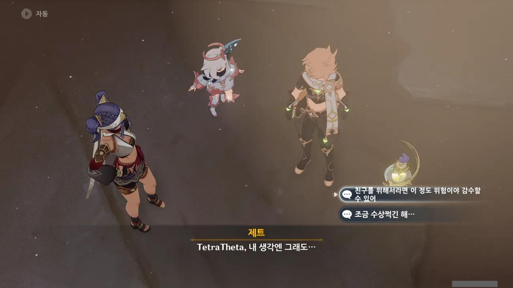

그런데... 까짓 거 죽기밖에 더하겠어?

그리고 여행자는 이미 천리와도 칼을 맞댄 사이이다. 릴루페르가 여행자에게 뭔가 할 수 있을 거라곤 생각되지 않는걸.

저주? 압도적인 힘이 있다면 저주고 뭐고 다 부술 수 있는 거 아닌가? 이른바 '청컨대 화포로써 이를 물리치소서'인 것이다.



제트 입장에서야 말리고 싶겠지. 둘도 없는 친구가 자신을 위해 저주를 감내하려는 거니까. 하지만 동시에 자신은 릴루페르의 지식을 이용해 나부 말리카타가 잠든 영원의 오아시스로 가야 한다.

아마 이러지도 저러지도 못하는 심정이겠지. 그 마음, 충분히 이해한다.



아, 안 죽어요, 안 죽어.

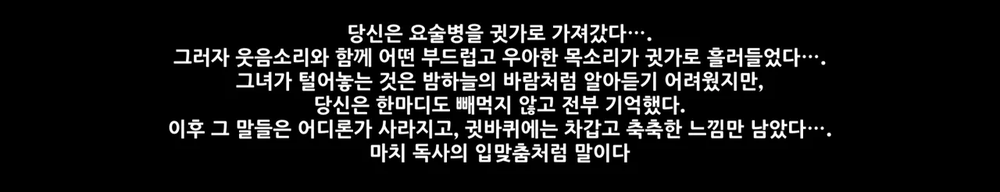

묘사를 보면 릴루페르의 진명은 알아듣기 더럽게 어려운 모양인데, 여행자는 그걸 어찌 다 기억한 모양이다.

'독사의 입맞춤'이라... '지니의 저주'를 생각할 때, 확실히 그런 느낌일 것이다.

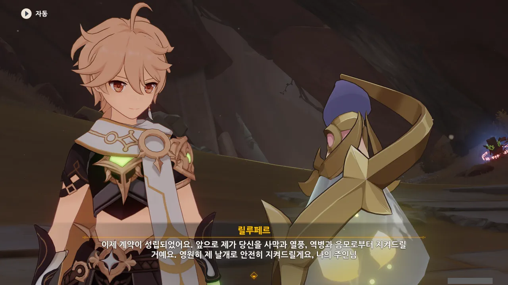

> 앞으로 제가 당신을 사막과 열풍, 역병과 음모로부터 지켜드릴 거예요.
> 영원히 제 날개로 안전히 지켜드릴게요, 나의 주인님.

나만 이 대사가 '내가 널 지켜주긴 하겠지만, 내가 네 등짝을 쑤시지 않는다고는 안 했다'라고 들리는 걸까?



와! 플라잉 스파게ㅌ... 아니 보틀이다!





제트가 갑자기 까칠해졌다. 왜 그런지 알 것 같으면서도 잘 모르겠네...



그리고 그에 대한 릴루페르의 답변.

> 아직 어머니가 되어보지 않은 여자아이들은 보통 이러곤 해.

응? 웬 뜬금없는 어머니?

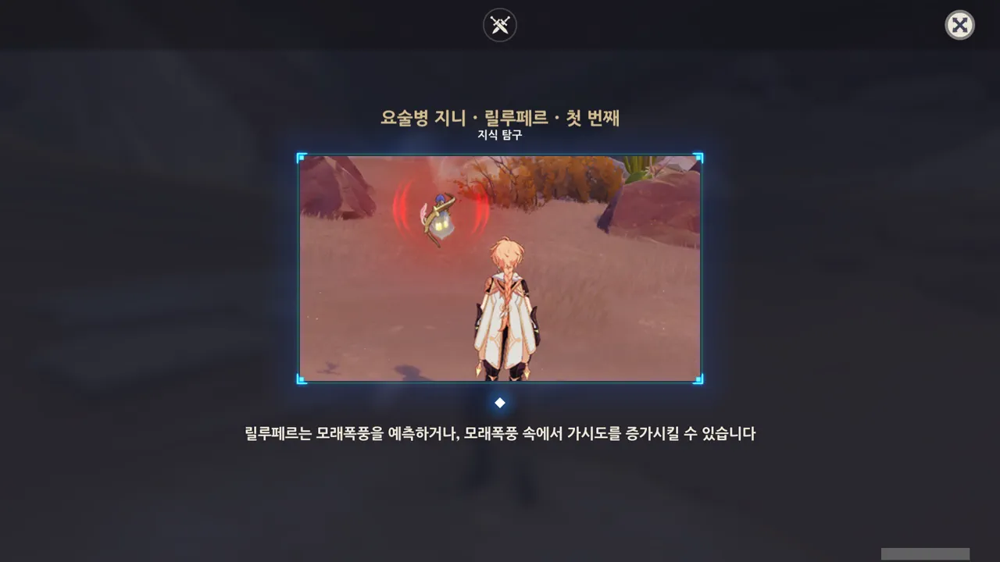

현재 릴루페르의 기능은 모래폭풍을 예측하거나 모래폭풍 속에서의 가시도를 높이는 것 정도밖에 없다.

말은 거창하게 해 놓고 별 기능이 없네!

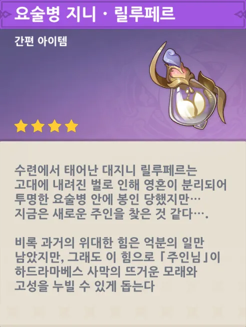

플레이버 텍스트조차 릴루페르의 힘이 약하다고 하고 있다.

릴루페르의 조각을 모으면 이 문구 역시 바뀌겠지?

아까 릴루페르가 담긴 병이 있던 자리 앞에는 이 상자가 하나 놓여 있다.

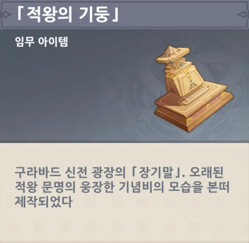

아... 이게 그 장기판 위에 놓는 피스인 걸까?

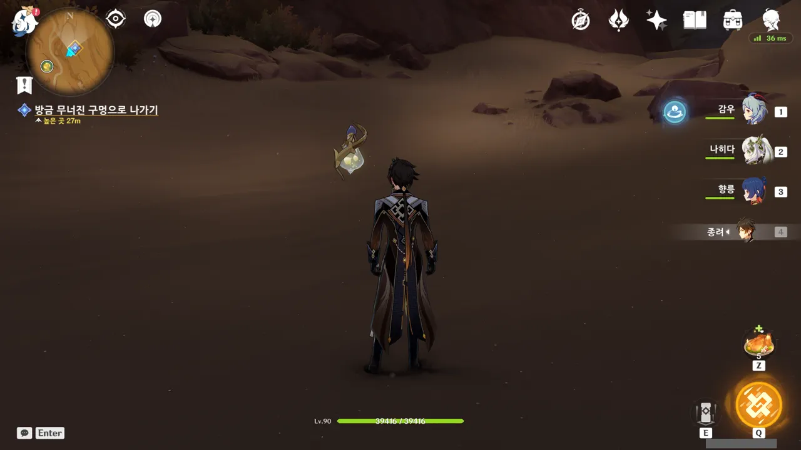

새로 얻은 릴루페를 장착하고, 주변을 싹 다 뒤졌다.

원신에서 펫과 간편 아이템을 동시에 장착할 수 있어 참 다행이다. 만약 둘이 같은 슬롯을 공유했다면, 난 릴루페르는 배낭에 처박아둔 채, 삼공식 영양키트만 들고 다녔을 거다.

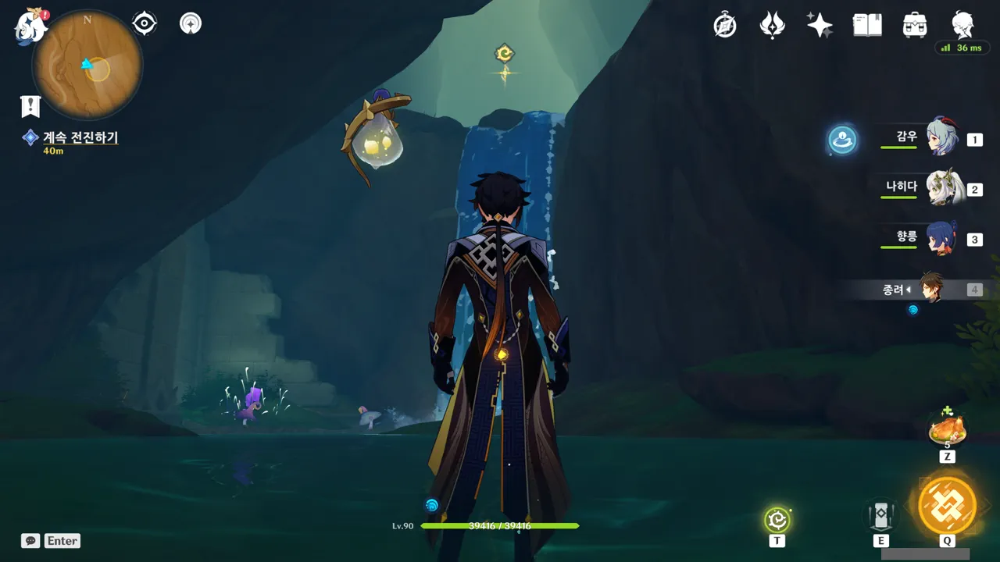

아까 컷신에서 무너졌던 벽 너머로 가보았다.

이야, 여긴 또 흐르는 물이 있는 녹지네. 방금 전 옆 방은 릴루페르를 회수하자마자 곧바로 황량한 사막처럼 변해 죄다 시들어버렸는데, 여긴 릴루페르의 힘이 아니라 흐르는 물 등의 다른 환경적 요인 덕분에 녹지가 유지되고 있는 것으로 보인다.



> 역시 여기 있었어.

'역시'? 역시라는 말이 나오기 위해선 누군가가 이 사람에게 여행자 일행이 이곳으로 올 거란 정보를 알려줬어야 한다. 그게 대체 누굴까?

일단 제일 의심 가는 건 역시 아자릭이다. 아자릭이 여행자 일행과 헤어진 후, 이 사람에게 여행자 일행이 이곳으로 올 것임을 알려주었다면 충분히 '역시'라는 말이 나올 수 있지.

하지만 그렇게 되면 아자릭이 대체 어떻게 여행자 일행이 이곳으로 올 것을 알았느냐가 문제가 된다. 이 동굴은 아까 전 유적과 직접적으로 이어진 것이 아니라, 유적의 벽이 무너지며 생긴 틈을 통해 유적과 이어진 곳이니까.

게다가 이 유적은 사막인들에게 있어 금지 아니었어? 그런데 왜 그 주변을 사막인들이 돌아다니고 있는 거야?

역시 금지니 뭐니 하는 건 죄다 거짓말이었어.

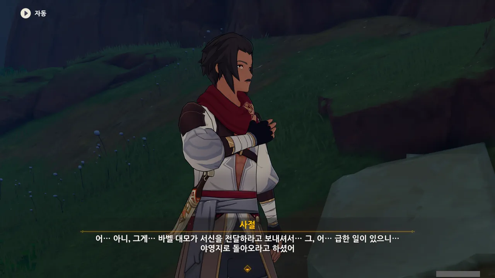

> 바벨 대모가 서신을 전달하라고 보내셔서...

<u>서신</u>을 <u>전달</u>하라고 했다고? 단어 선택이 굉장히 수상쩍은데...

서신이란 편지를 뜻한다. 그러니까 저 말대로라면 사절이 제트에게 무언가 편지 같은 걸 전해주어야 한다. 하지만 저 사절이 전한 건 편지가 아니라 전언이었다.

바벨이 무언가 말을 전하고자 했다면, '전언이 있다'라고 말하지, '서신을 전달하라'라고 말해선 안 된다.

&nbsp;

사막 민족이니 제대로 된 교육을 받지 않아 말실수를 한 걸 수도 있다고 생각할 수 있지만, 이 녀석들은 수메르 성에서 파견 나온 학자가 가르치는 걸 '기초 교육'이라 하면서 별 도움이 되지 않는다고 말하는 녀석들이다.

이미 아카데미아에서 밀수한 여러 전문 서적을 닳도록 돌려보며 지식을 쌓기도 했었고.

그러니 저건 절대로 단순한 말실수가 아니다.



아까부터 제트가 굉장히 까칠해져 있다. 이래서야는 아까 아자릭이 제트를 '카라칼 같다'라고 말한 게 사실 정확한 평가가 아닐까 하는 생각조차 들 정도이다.



급기야는 여행자에게도 날을 세우는 제트. 아니, 왜 거기서 날 걸고넘어지는데?

아무리 친구라고 해도 넘지 말아야 할 선이 마땅히 있을 텐데... 이러면 참 곤란하다.

&nbsp;

제트가 릴루페르에게 화를 내는 건, 아까 릴루페르가 먼저 제트를 노예 취급했으니 충분히 그럴 만도 하다 생각할 수 있다.

하지만 제트에게 나쁜 말을 한 적 없는 여행자에게까지 날을 세우는 건 좀 그렇지.

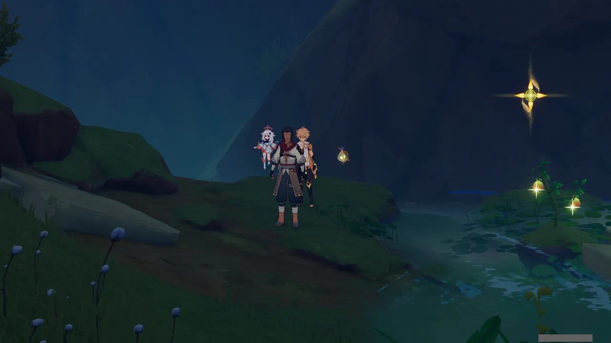

정말로 여행자를 내버려 두고 먼저 가버리는 제트.

실망이다.

사절은 협곡을 따라가면 타니트 야영지로 돌아갈 수 있을 거라고 말한 후, 떠난다.

말을 자꾸 더듬는 걸 보면, 좀 많이 의심스러운 사절이다.



릴루페르가 말하는 '저 아이'는 대체 누굴 말하는 걸까? 사절? 제트? 그 사람의 어떤 면을 보고 재미있다고 한 걸까?

물론, 여기서 재미있다고 말한 건 정말 재미있어서가 아니라 비꼬는 의미로 말한 거겠지만 말이다.



에이, 제트가 릴루페르를 질투한다고? 왜? 그럴 이유가 보이지 않는데?

차라리 제트를 노예 취급해서 화가 났다고 하는 게 더 그럴듯해 보인다.

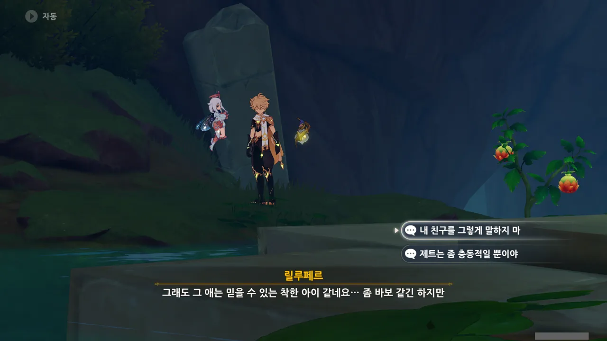

아까 말한 '저 아이'는 제트를 말하는 것 같다. '믿을 수 있는 착한 아이'... 맞는 말이다.

그래도 '바보 같다'라는 말에는 동의할 수 없지만.



왠지는 모르겠지만, 나 역시 릴루페르가 말하는 게 뭔가 마음에 든다.

하지만 릴루페르가 이런 식으로 호감을 사는 말을 하는 게 전부 나중에 여행자를 배신하기 위한 빌드업이 아닐까 의심이 된다. 배신을 하기 위해선 먼저 신뢰를 쌓아야 하니까.

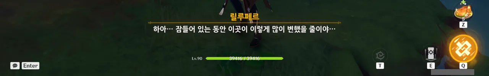

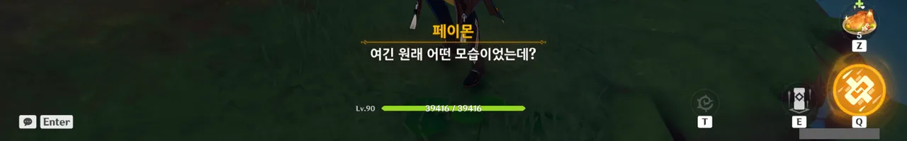

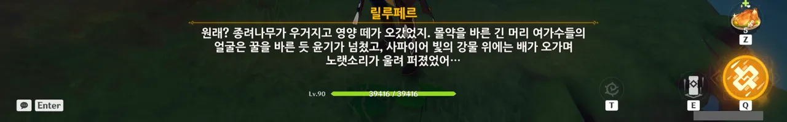

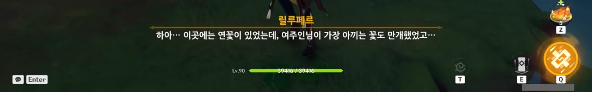

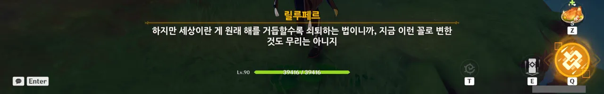

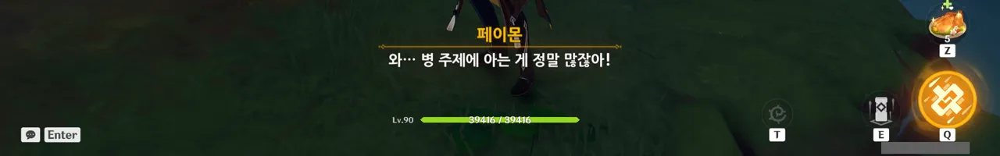

릴루페르가 읊어주는 옛날 모습은 쉬이 상상하기 어려운 장면뿐이다.

이 사막이 옛날에는 그렇게 풍족한 땅이었다고?

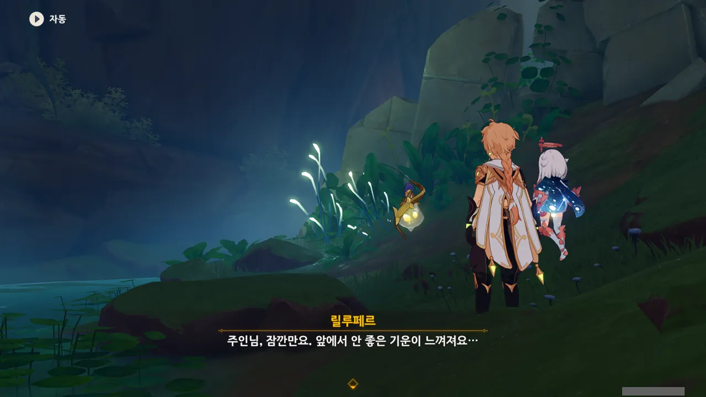

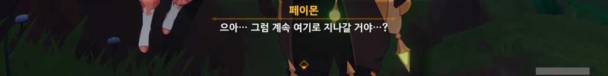

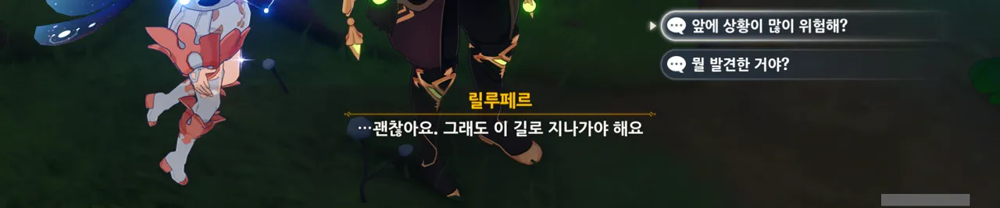

앞에 안 좋은 기운이 느껴진다라... 릴루페르는 대체 뭘 느낀 걸까?

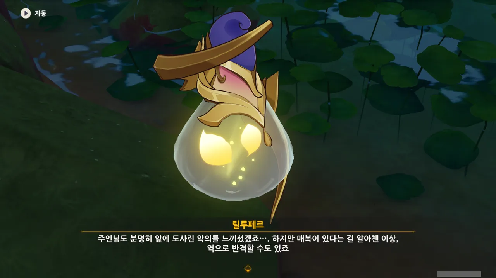

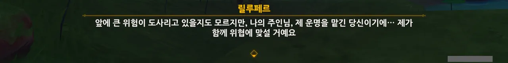

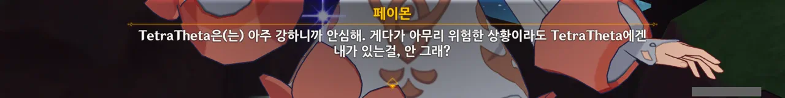

릴루페르가 감지한 건 매복한 사람들의 악의였나 보다.

역시 아까 사절의 목적은 바벨을 핑계 삼아 제트를 여행자와 떨어트리기 위함이었나 보다. 저들이 같은 사막 민족인 제트까지 제거할 거라고 생각되진 않으니.

&nbsp;

릴루페르가 여행자와 함께 위협에 맞설 거라고 하지만... 너, 아직 힘 약하잖아...

그리고 원신 시스템 상으로, 펫은 전투가 시작되면 숨어버린다. 그러니까 펫 슬롯에 장착된 릴루페르 역시 말만 번지르르하게 '같이 싸울게요'라고 말하지만, 막상 전투가 시작되면 스윽 사라질 거란 이야기다.

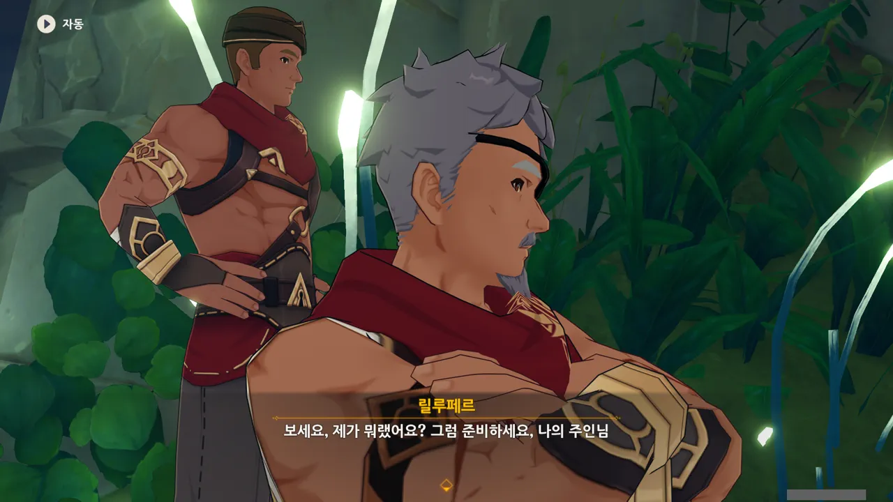

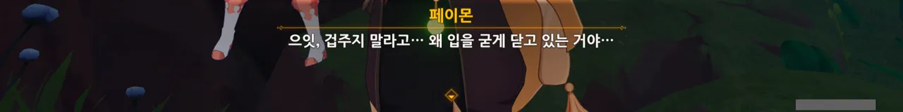

같은 사막 민족이라고 해서 모두 제트의 친구인 건 아니니까.

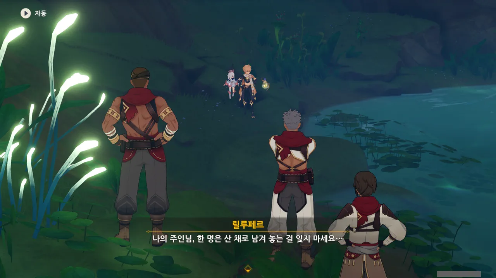

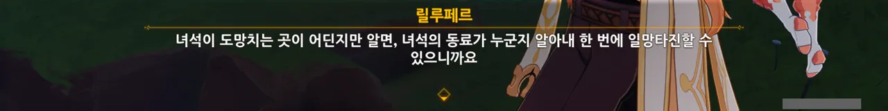

오, 그거 정말 좋은 생각이야. 하지만 전투 시스템상, 한 명만 남기지는 못할 것 같다. 전부 없애야 전투가 끝나거든.

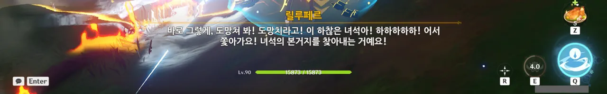

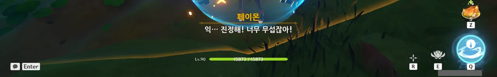

이야, 저렇게 광소하는 릴루페르라니. 정말 마음에 든다.

평소에는 음침하거나 혹은 조용하고 자신감 없는 캐릭터인데, 막상 전투에 돌입하기만 하면 눈을 까뒤집고 입가가 찢어지도록 웃으며 적을 가차 없이 도륙하는 그런 이중적인 성격의 캐릭터가 난 정말 마음에 들거든.

물론 릴루페르는 전투에 있어 도움이 단 1도 되지 않았지만 말이다.

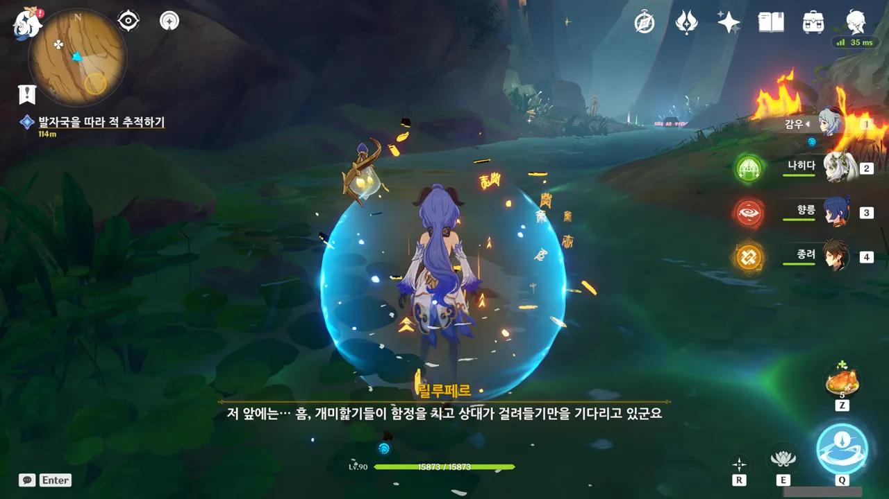

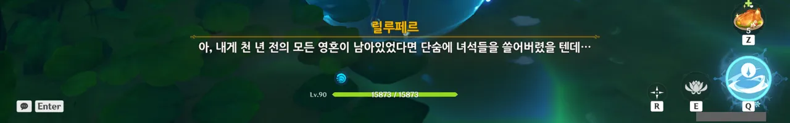

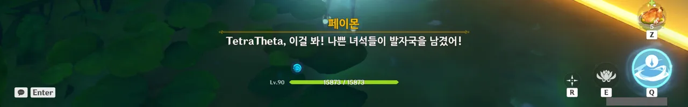

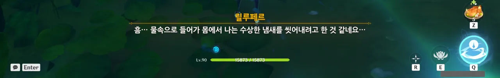

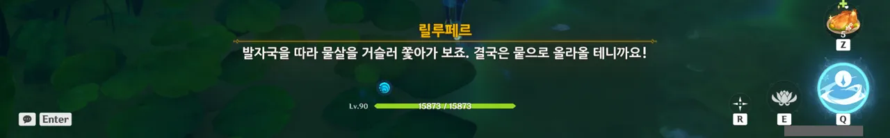

적이 발자국을 남겼다. 물에 들어갔다는 묘사가 있길래, 원소 시야로 물 원소가 묻은 발자국을 찾을 거라 생각했는데, 그냥 전진하는 게 전부였다.

앞에 도금 여단 잡몹이 하나 있긴 했는데, 멀리서 감우로 조금 때려주니까 춤만 추다가 맥없이 죽어버렸다.

업적 창을 열어보니, 「그건 단지 끝나지 않는 노역일뿐이야!」라는 업적이 깨져있었다. 대체 누구에게 하는 말일까?

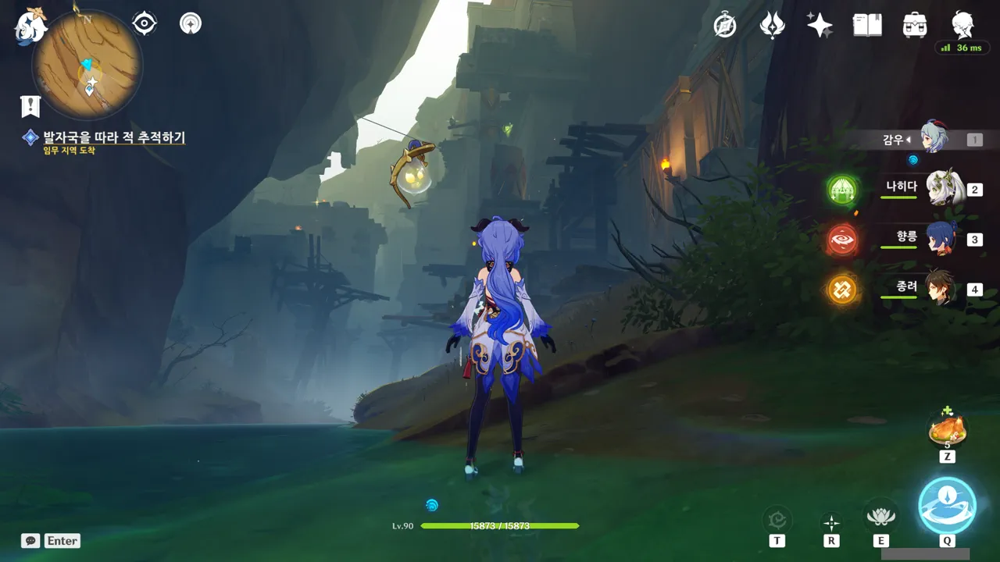

오, 무슨 유적 발굴지 같은 곳이 나왔다.



갑자기 릴루페르가 무슨 말을 하는데, 정작 적은 보이지 않아서 혹시나 하는 마음에 위를 올려다보았다.

... 너희들, 거기 위에서 뭐 하니?

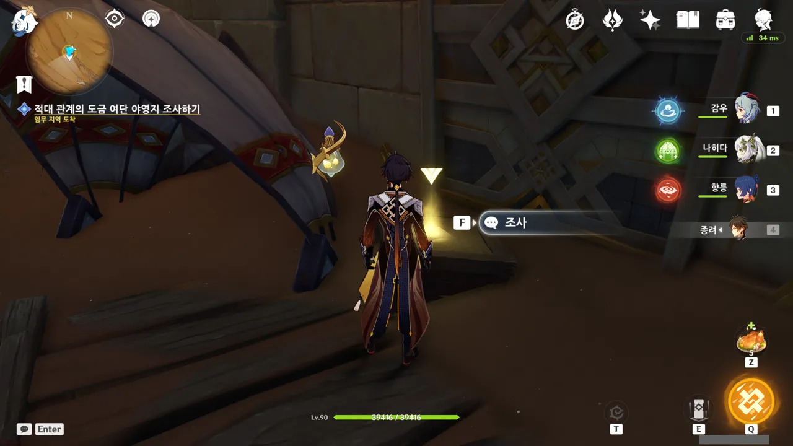

아까 위에 있던, 제자리에서 열심히 달리던 둘을 잡고 나니, 조사할 것이 하나 보인다.

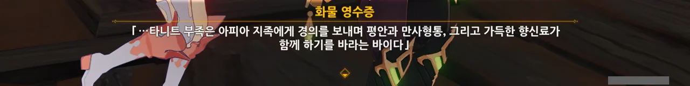

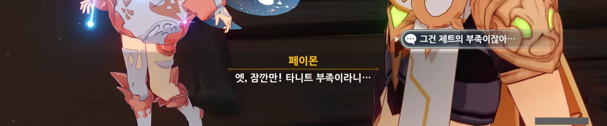

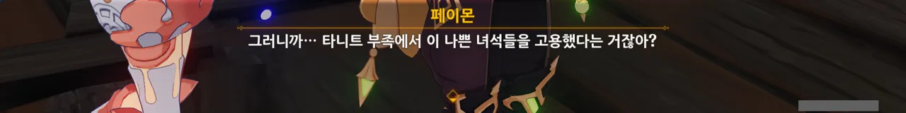

화물 영수증의 내용으로 미루어보아, 타니트 부족이 아피아 지족에게 매복 강탈을 의뢰한 것 같다. 타니트 부족은 제트의 부족이지.

여기서 생각할 수 있는 가능성은 두 가지이다.

1. 바벨이 앞에선 온갖 착한 척을 다 하더니, 뒤에서는 여행자를 약탈할 생각으로 아피아 지족에게 매복 강탈을 의뢰했다.
2. 타니트 부족 내에 부족의 이름을 멋대로 가져다 쓴 배신자가 있다.

역시 첫 번째 가능성이 더 그럴듯해 보이지?

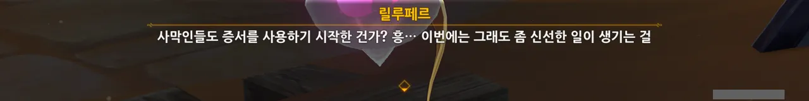

릴루페르의 말을 들어보면, 옛날 사막인들은 증서를 사용하지 않은 것으로 보인다. 그러면 대체 뭘로 증명을 남긴 걸까?

아니면 릴루페르가 이전에 했던 말로 미루어보아, 옛날 사막인들은 전부 노예였기 때문에, 증서의 대상이 되면 되었지, 증서를 쓸 입장이 아니었을 수도 있다.

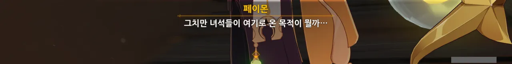

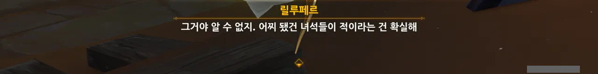

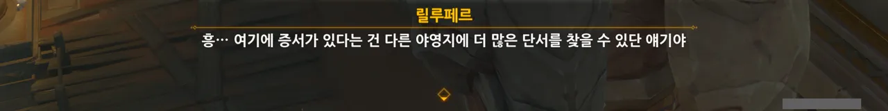

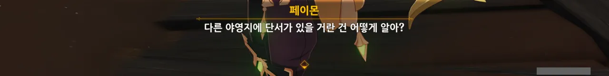

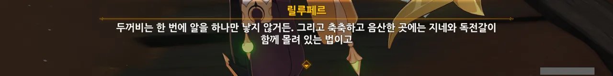

다른 비유 대상도 많은데 꼭 두꺼비, 지네, 독전갈 등에 비유하는 게 좀 징그럽긴 하지만, 틀린 말은 아니다. 저렇게 문서로 된 화물 영수증이 있다는 건, 다른 증거 또한 나올 수 있다는 이야기거든.

저게 유일한 증거였으면, 여기에 이렇게 아무렇게나 놔둘 것이 아니라, 어디 중요한 곳에 꼭꼭 숨겨두었겠지.

하지만 증거가 여럿이라면, 그중 하나가 취급 부주의로 이렇게 아무렇게나 방치되었을 가능성이 있다.

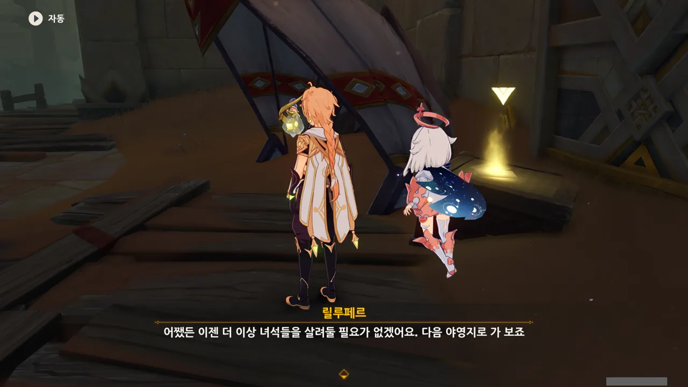

'이젠 더 이상'이라니. 지금껏 만난 적을 단 하나도 살려둔 적이 없건만.

별 이유는 없고, 그러지 않으면 전투가 끝나지 않는다.

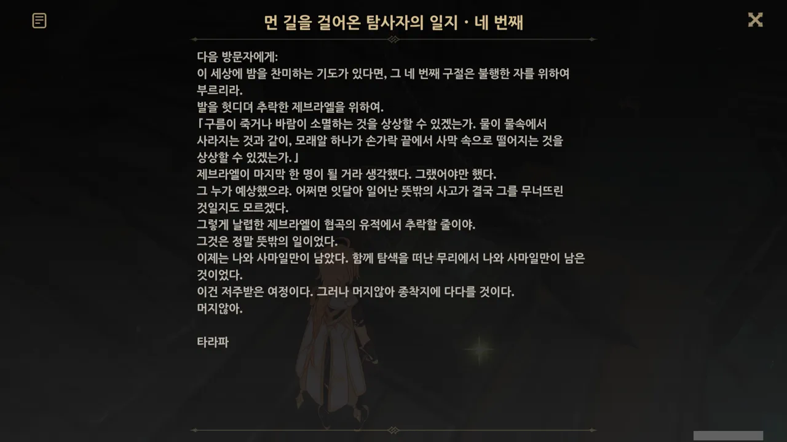

'먼 길을 걸어온 탐사자의 일지'의 네 번째 글을 찾았다.

다음 글이 더 있을 것 같은데, 대체 어디서 놓친 걸까?

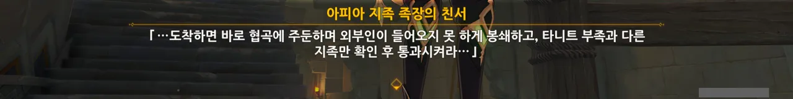

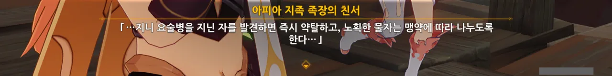

아피아 지족 족장의 친서를 찾았다. 와, 이렇게 중요한 문서를 아무렇게나 방치해 뒀다고?

타니트 부족만 부족으로 불리고, 다른 부족은 지족으로 불리는 것으로 보아, 아피아 지족 등의 다른 지족은 전부 타니트 부족에서 갈라져 나온 부족으로 추측된다.

&nbsp;

그나저나 친서 내용을 보면, 여행자가 지니 요술병을 얻게 만든 후, 곧바로 약탈해 벗겨 먹을 계획이었나 보다. 이 발칙한 녀석들.

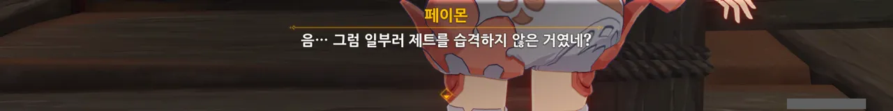

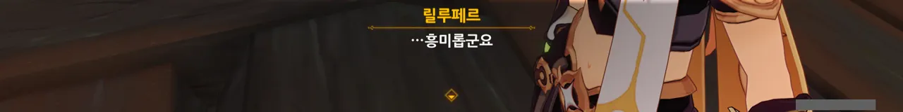

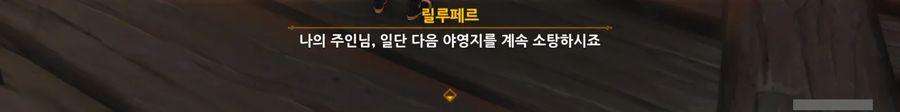

그리고 제트를 여행자와 떨어트린 것도 의도된 것이었다. 제트는 타니트 부족 사람이니, 통과 대상이지만 여행자는 '지니 요술병을 지닌 자', 약탈 대상이었기 때문이다.

그래서 바벨이 불렀다는 핑계를 대며 제트를 따로 떼낸 거였구나?

역시 전부 잡아서 하나하나 썰다 보면 무언가 답이 나오는 법이다.

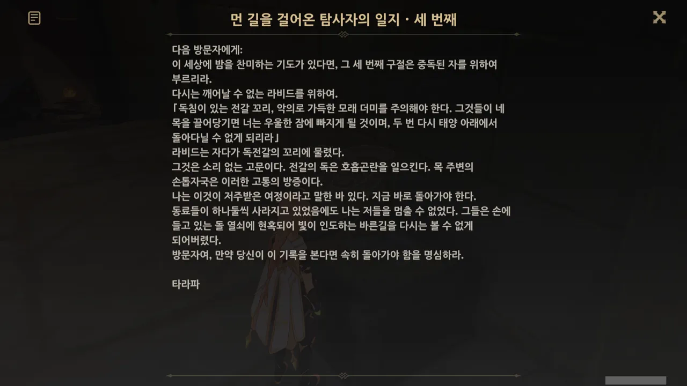

세 번째 일지도 발견했다. 이 흐름대로라면 두 번째와 첫 번째 일지도 곧 볼 수 있겠네.



이 매복자들은 철두철미하게도, 여행자의 인상착의까지 서로 공유하고 있었다. 악당 주제에 쓸데없이 부지런하긴.

릴루페르의 감정은 그 색깔로 알 수 있는 것 같다. 릴루페르가 화를 내는 것처럼 부르르 떨 때, 그 색깔이 붉어졌거든.



아드라피가 누군가 했는데, 타니트 부족의 상인이었잖아. 왜, 붐붐을 수리 중인 그 사람 말이다.

이렇게 보니, 아드라피가 붐붐을 수리 중이란 것도 새빨간 거짓말로 보인다. 아카데미아의 전도유망한 학자가 일평생을 쏟아부어야 겨우 만들 수 있는 것이 자동 기계 장치인데, 그걸 일개 사막 민족의 상인이 고친다는 것 자체가 이상하지 않은가?



ㅋㅋㅋㅋㅋㅋ '어깨가 쇠사슬로 꿰뚫린 사막인' ㅋㅋㅋㅋㅋㅋ

그러니까 릴루페르 말은 오직 노예 사막인만 믿을 수 있다는 이야기잖아.

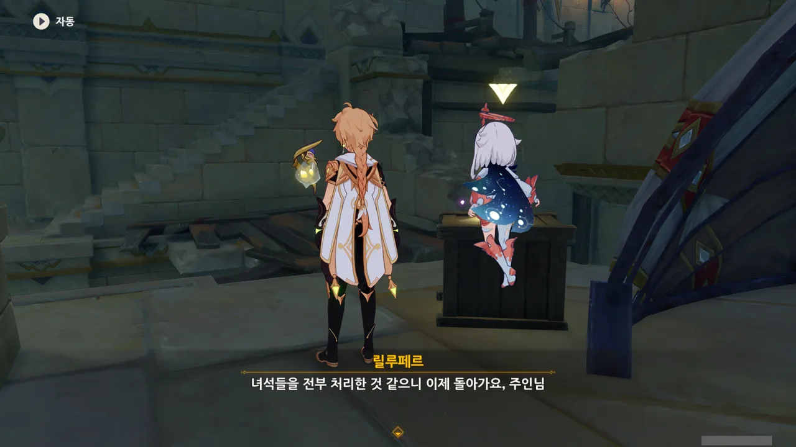

아무튼, 이건 타니트 부족에 돌아가면 알 수 있을 것이다. 정말로 바벨이 흉계를 꾸민 건지, 다른 누군가가 타니트 부족을 참칭 한 건지 말이다.

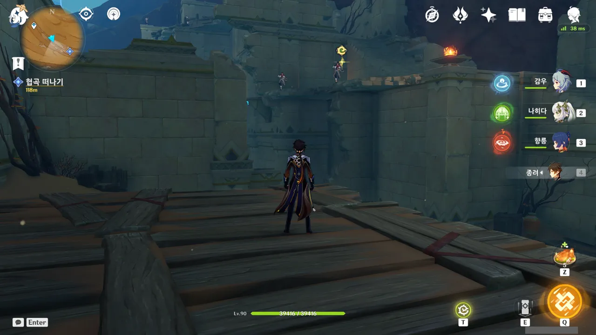

... 진짜 너희들은 대체 뭘 하고 싶은 거니?

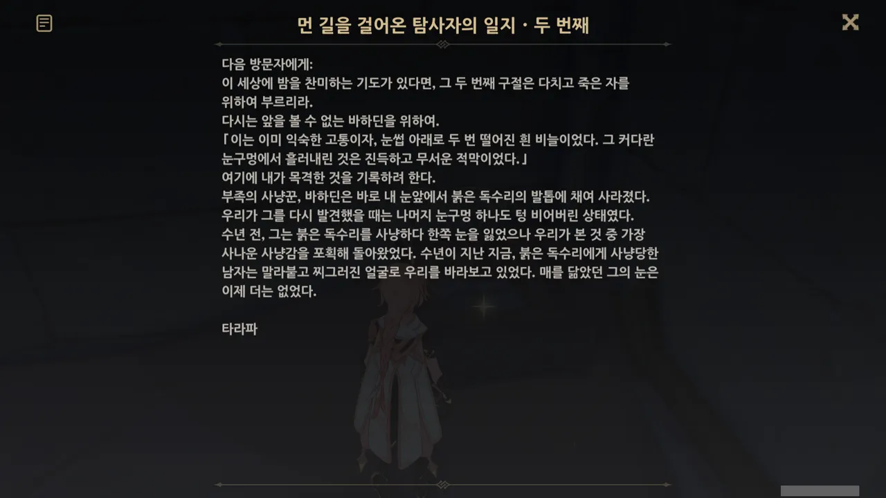

탐사자의 두 번째 일지를 찾았다.

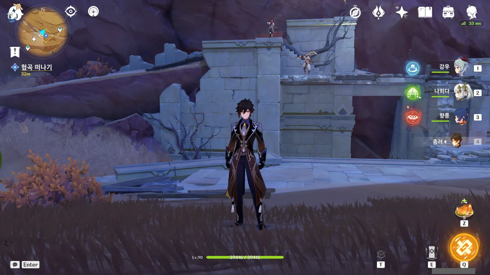

협곡 꼭대기까지 올라왔는데, 제자리에서 열심히 뛰는 모습은 여전하다.

이젠 저런 모습을 보면 어처구니가 없어 헛웃음이 나올 정도다.

그래, 그래... 너네들 하고 싶은 대로 다 해...

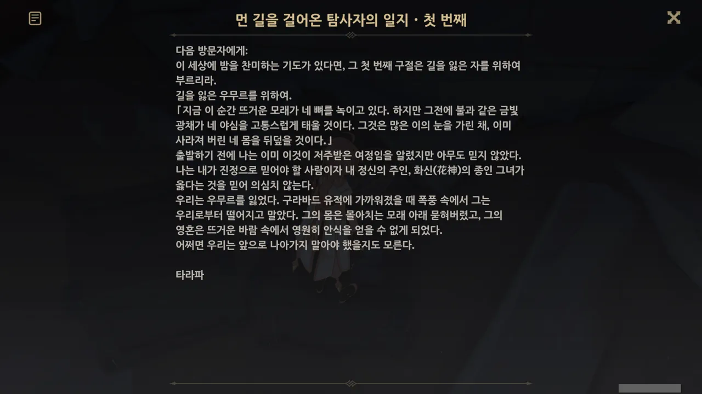

탐사자의 첫 번째 일지까지 찾았다. 아무래도 타라파 혼자만 남는 다섯 번째 일지는 놓친 모양이다. 뭐, 나중에 여기 다시 올 때 찾을 수 있겠지.

매 일지마다 사람이 꼭 하나씩 끔찍하게 죽어나간다.

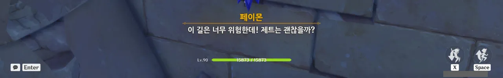

제트는 안전할 것이다. 의뢰 내용에서도 여행자에 대해서만 쓰여있었지, 그 일행도 같이 처리하라는 말은 없었잖은가?

그나저나, 이거 아무리 생각해도 사막 민족들이 괘씸하다. 제트를 혼혈이라는 이유로 온갖 꺼림칙한 일이란 일은 다 시켜놓은 주제에 이젠 그 친구인 여행자까지 이용해 먹고 죽여 없애려 해?

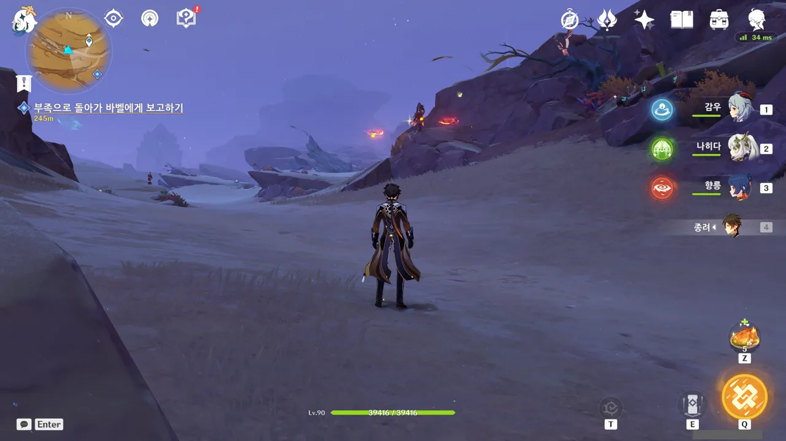

그리고 또 하나 의심스러운 점. 대체 왜 우인단 채무처리인이 협곡 맨 꼭대기에 있을까?

설마 타니트 부족 녀석들, 말로만 우인단을 배척하지, 사실 뒤에선 우인단과 결탁한 거 아닐까?
