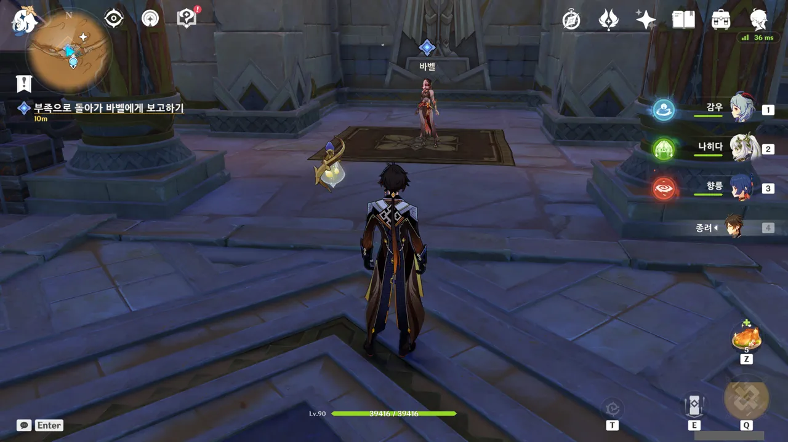

바벨이 정확히 어디 살고 있나 계속 궁금해했었는데, 이 유적 건물 안쪽에 살고 있었던 듯하다.

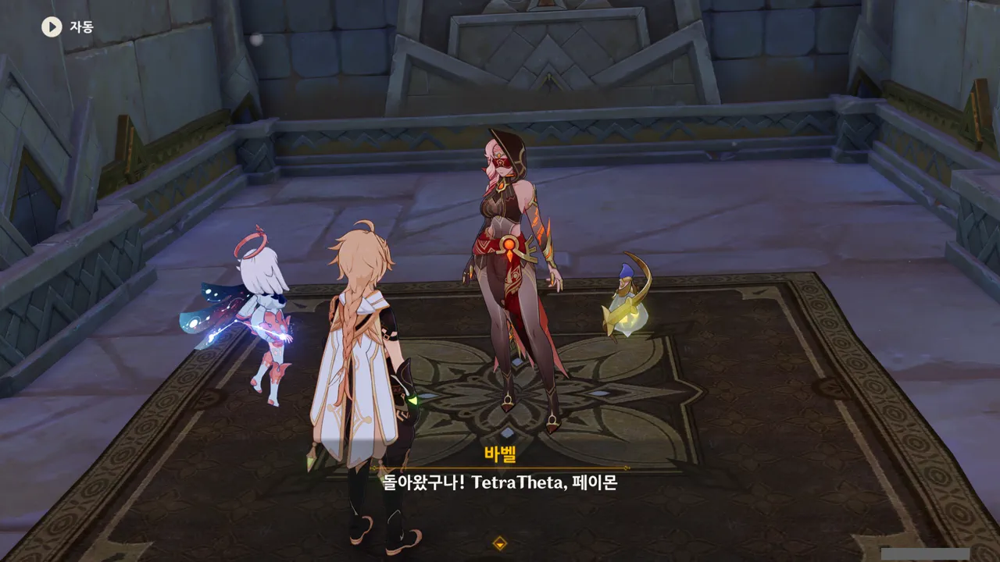

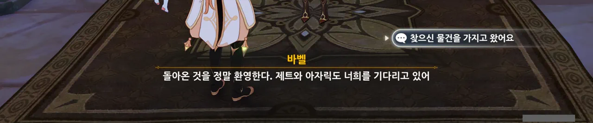

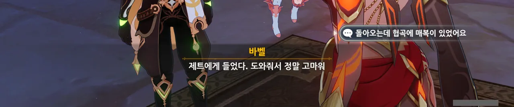

여행자를 반갑게 맞아주는 바벨. 오는 와중 매복을 당했다고 말한다.

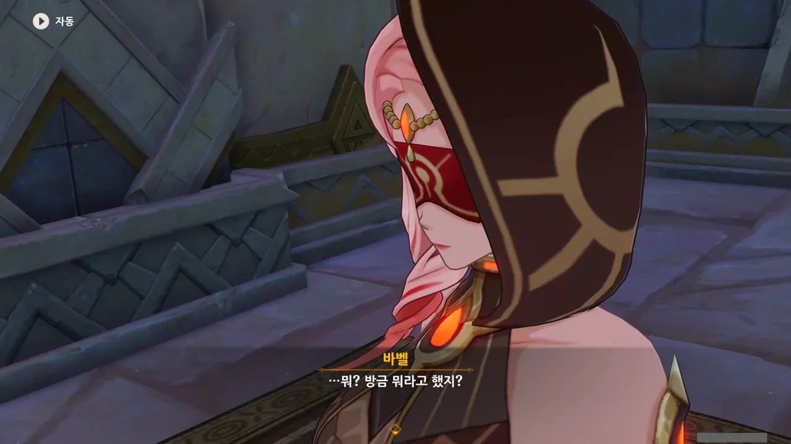

이야기를 듣고 놀란 바벨.

왜 난 바벨의 저 놀람이 가식적이라는 생각을 지울 수 없는 걸까? 아드라피가 서신을 보낸 것이니, 바벨 역시 뭔가 알고 있었음이 분명할 텐데...

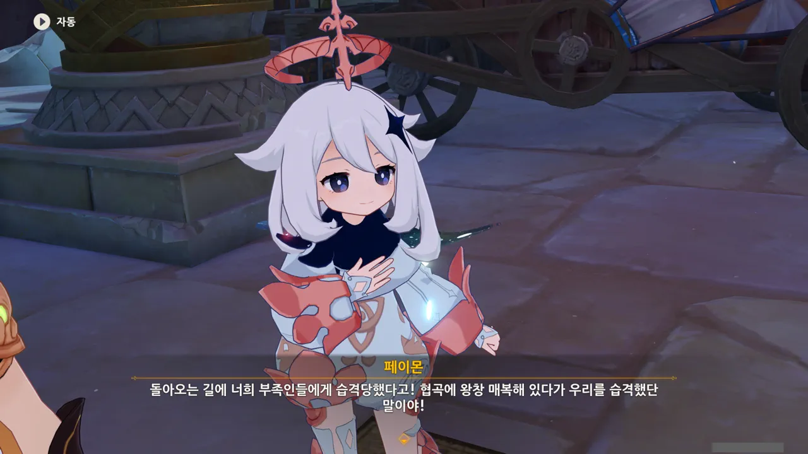

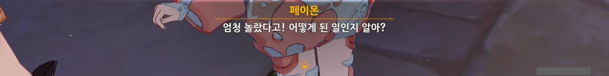

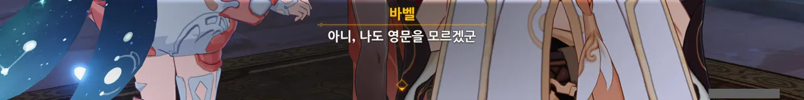

약간의 침묵 끝에 영문을 모르겠다고 답하는 바벨.

저 침묵은 변명거리를 생각하기 위한 침묵인 걸까, 아니면 정말 아무것도 몰라서 나온 침묵인 걸까?

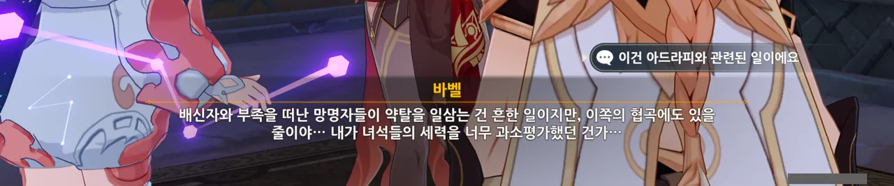

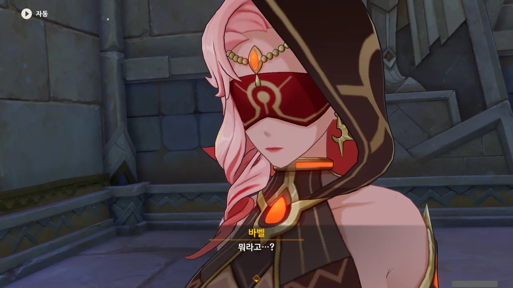

바벨은 부족의 배신자와 망명자가 꾸민 일이라서 이야기하지만, 아드라피가 관련된 일이라고 말하자 또다시 "뭐라고?"라며 놀라워한다.

정말 바벨은 몰랐던 일 같은데, 그래도 누가 알겠는가? 저것 역시 바벨의 혼신을 담은 연기일지 아닐지.

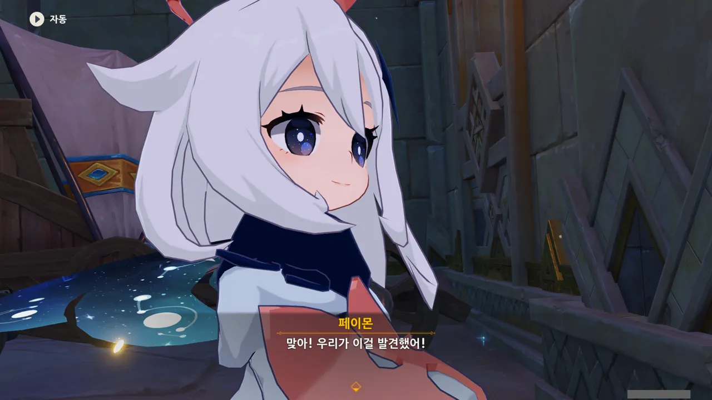

아드라피의 쪽지를 바벨에게 보여준다. 이거면 확실한 증거가 될 수 있겠지.

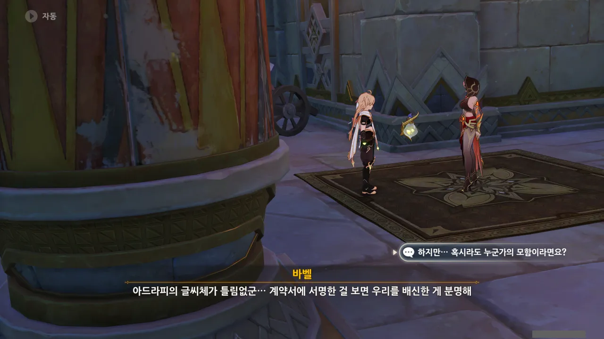

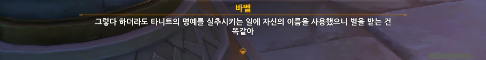

쪽지에 적힌 것이 아드라피의 필체가 맞다고 하는 바벨. 그 말인즉슨, 이 모든 일이 아드라피가 꾸민 일이라는 것이다.

여행자의 말처럼, 아드라피가 다른 사람에게 속아 그런 문서를 작성했을지도 모른다. 하지만 바벨 말처럼, 쪽지에 대놓고 '매복', '강탈' 등의 단어가 들어갔는데 그게 타니트 부족에게 어떤 영향을 끼칠지 아드라피가 몰랐을 리가 없잖은가. 이건 '나도 그저 속았을 뿐이에요'라고 변명할 수도 없다.

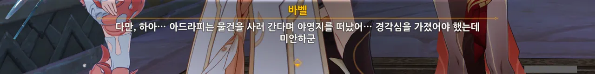

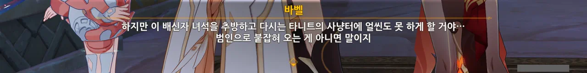

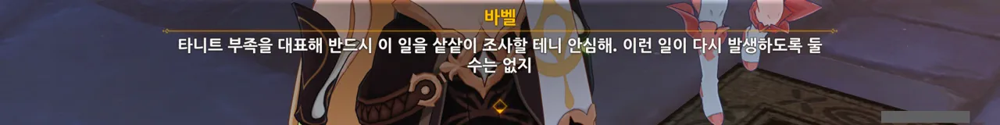

바벨은 즉석에서 아드라피를 부족의 배신자로 간주하고 추방하기로 했다. 잡을 수 있으면 잡아오고 말이다.

물론 잡혀온다면 그 결과가 어찌 될지는 이미 첫날부터 아주 잘 봤고 말이다.

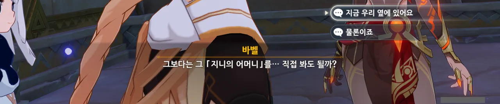





아까 릴루페르가 제트에게 하던 말을 보고 예상하긴 했다만, 이렇게 바벨을 보자마자 '비천한 사막인', '노예'라고 부를 줄이야.



심지어 부족의 '어머니'인 바벨에게 노예처럼 춤이라도 춰보라며 도발까지 한다.

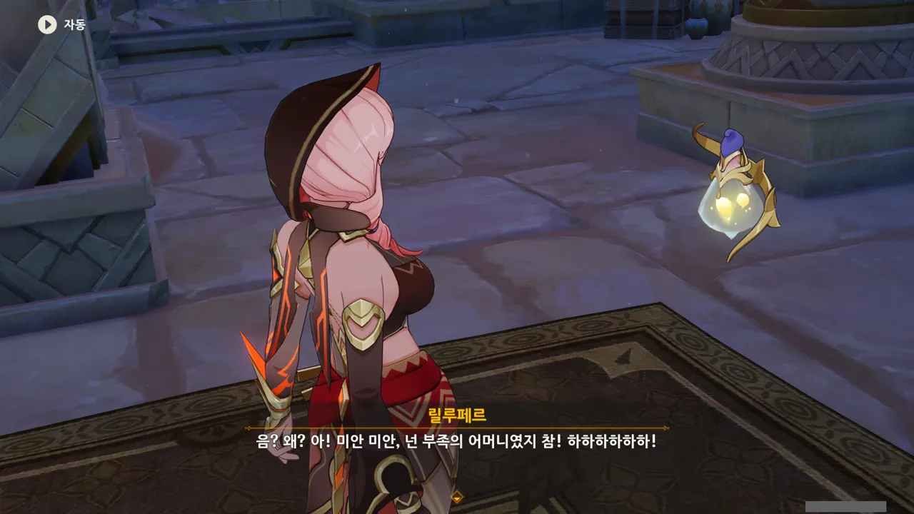

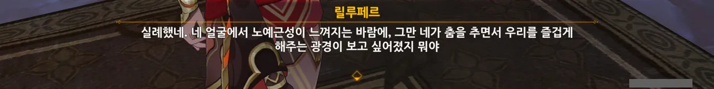

거기에 후속타로 '얼굴에서 노예근성이 느껴진다'는 모욕을 더하는 릴루페르.

이건 바벨이 화가 잔뜩 나서 릴루페르를 후려쳐도 할 말이 없겠다.

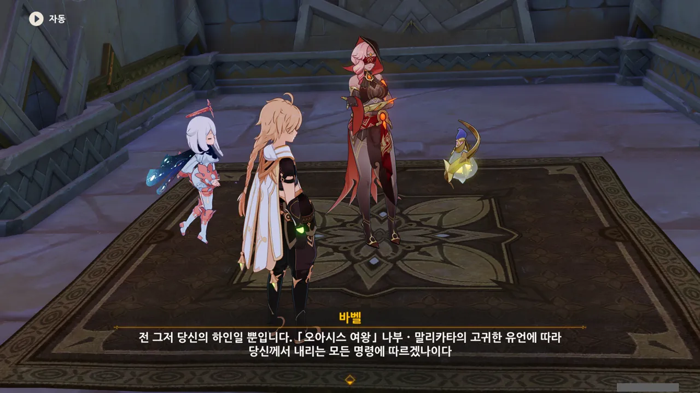

하지만 용케도 바벨은 화를 내지 않고 '나부 말리카타의 유언에 따라 당신의 명령을 따르겠다'라고 말한다.

하지만 이건 '네가 아니라 나부 말리카타의 뜻에 따라 춤을 추는 것이다'라고 말하는 거니, 바벨 나름대로 릴루페르에게 맞받아친 것이다.

아, 그래. 난 이렇게 서로 혀끝으로 싸우는 걸 구경하는 게 제일 재미있더라. 내가 그 영향권에 들지 않는 한 말이야.



바벨이 그렇게 맞받아치자, 릴루페르 역시 '농담이었다', '아첨인 것 다 안다', '너 같은 노예는 필요 없다'라고 바벨을 공격해 댄다.

바벨 입장에선 속이 터지겠지. 온갖 굴욕과 화를 꾹꾹 눌러 참고 부족의 비원 --- 혹은 자신의 욕심 --- 을 위해 춤이라도 추겠다고 하니, 곧바로 '농담이었음 ㅋㅋㅋ'이라며 능욕을 당한 꼴 아닌가.



아니, 거기서 또 뭘 하려고, 릴루페르!

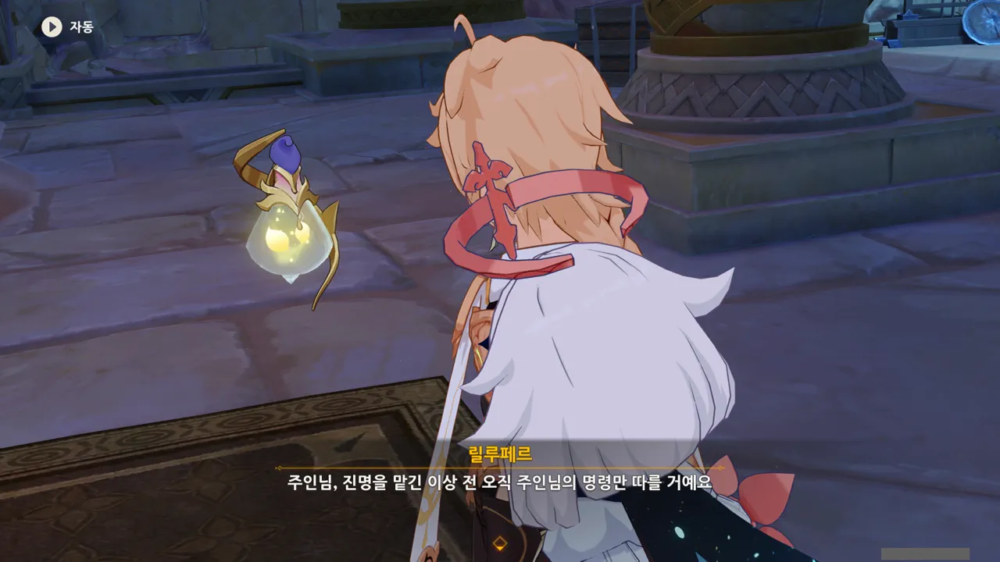

> 결정은 **주인님**이 하세요

여행자가 자신이 진명을 맡긴 주인이라며, 결정을 여행자에게 맡기는 릴루페르.

타니트 부족의 손님인 여행자는 자신의 주인으로 모시고 존중하지만, 부족의 '어머니'인 바벨은 그저 노예 취급이다. '여행자 > 릴루페르 > 바벨'이라는 말이니, 바벨에게 이보다 더한 모욕은 없지 않을까?





하지만 그 탓에 불똥이 여행자에게까지 튀어버렸다. 둘이서 말싸움하는 걸 옆에서 조용히 팝콘이나 뜯으며 구경하려 했는데, 갑자기 여행자까지 끌어들이네...

무릎은 꿇지 않아도 된다며, 바벨을 노예 취급하는 건 여전하다.

물론, 이 정도의 모욕을 들은 바벨의 안색이 변하지 않을 리 없다.

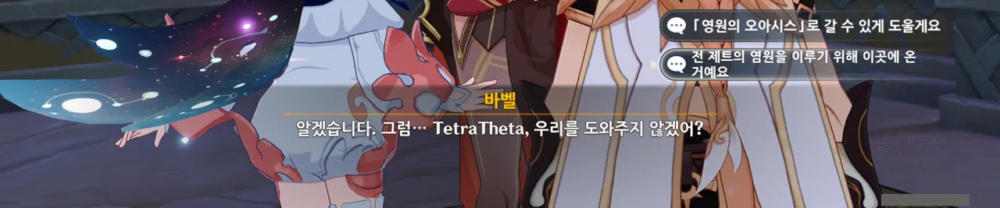

하지만 괜히 부족의 '어머니'가 아니라는 걸까? 바벨은 그 많은 모욕에도 불구하고 여행자에게 정중하게 도와달라고 요청한다.

바벨을 돕기야는 하겠지만, 그건 바벨 때문이 아니라, 제트를 봐서 돕는 거야. 다른 건 다 몰라도, 부족의 온갖 꺼림칙한 일을 제트에게 몰아준 건 아무리 봐도 이해도, 인정도 할 수 없거든.

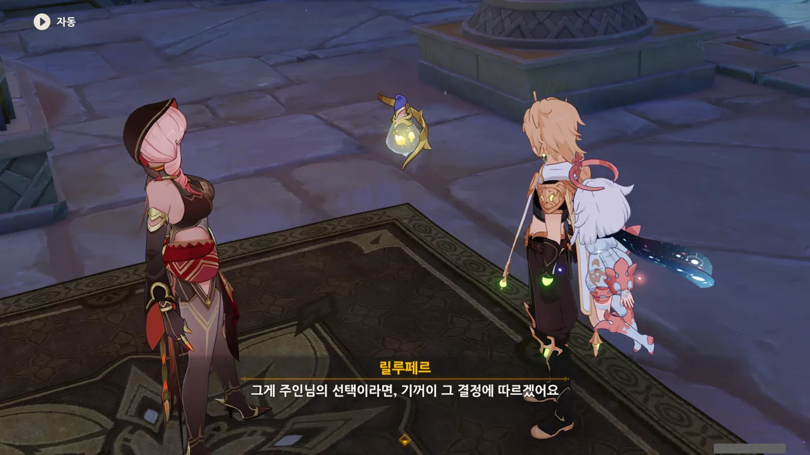

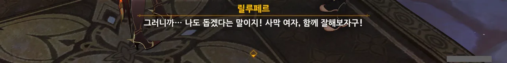

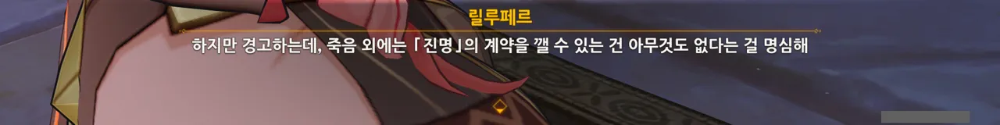

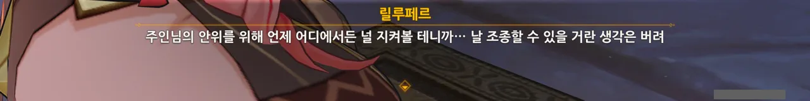

릴루페르의 말에 따르면, 지니가 하는 진명의 계약은 죽음 외에는 깰 수 없다고 한다.

그러니까 바벨이 직접 릴루페르를 구슬려 영원의 오아시스로 가는 길을 알아낼 수 없다는 이야기이다. 왜냐면 릴루페르는 자신이 진명을 알려준 주인인 여행자의 말만을 들을 테니까.



끝까지 바벨을 놀리는 릴루페르.

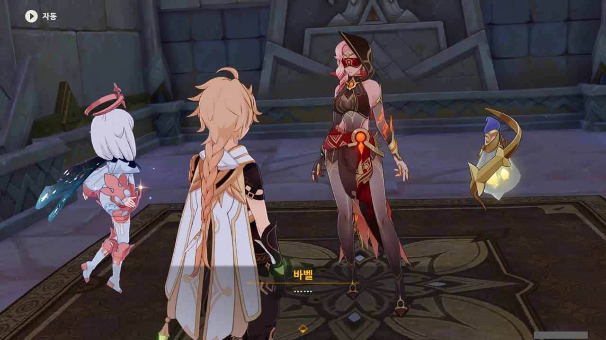

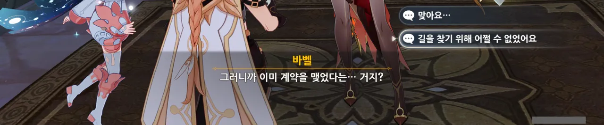

계약을 맺지 않으면 오아시스로 가는 길을 알려주지 않겠다는데 뭘 어쩌겠어. 계약 맺어야지.

그렇게 쳐다봐도 소용없다구.

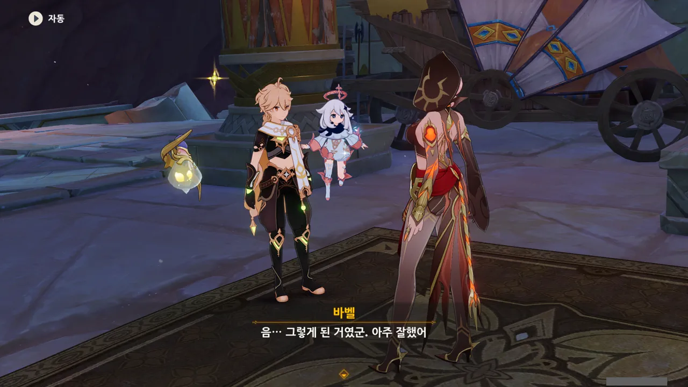

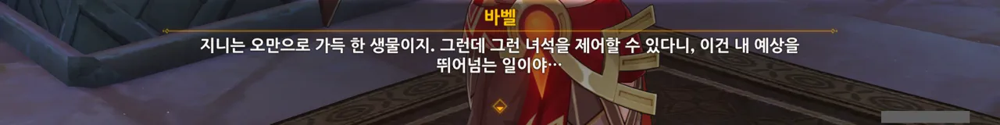

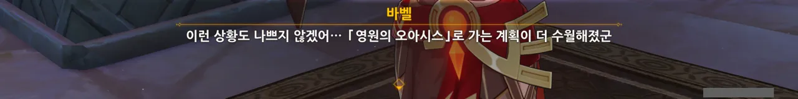

릴루페르에게 온갖 굴욕적인 말을 들었음에도 불구하고 '오아시스로 가는 계획이 더 수월해졌다'라며 긍정적으로 생각하는 바벨.

뭐랄까, 정신력이 대단하다고 해야 할까, 멘털이 단단하다고 해야 할까... 아무튼 대단하네.

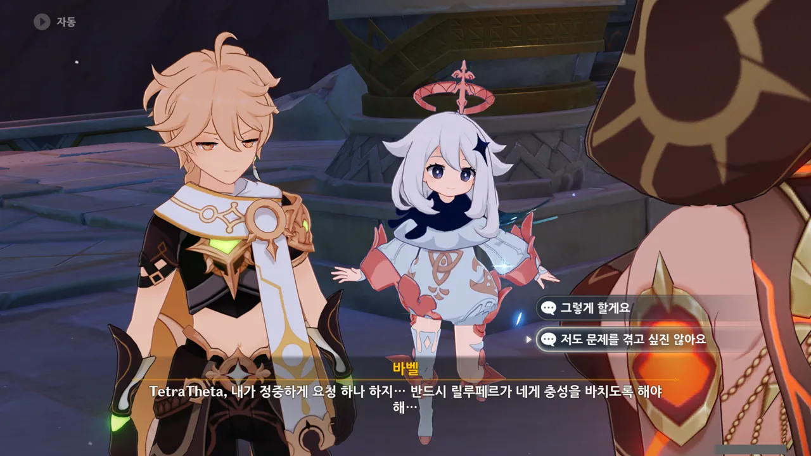

와, 바벨이 *정중하게* 요청을 한다. 굉장히 저자세네.

내 생각이지만, 제멋대로 저 좋을 대로 주인을 고른 지니가 과연 주인의 말을 맹목적으로 따를까? 그냥 자기 마음에 들면 따르고 그렇지 않으면 안 할 것 같은데...

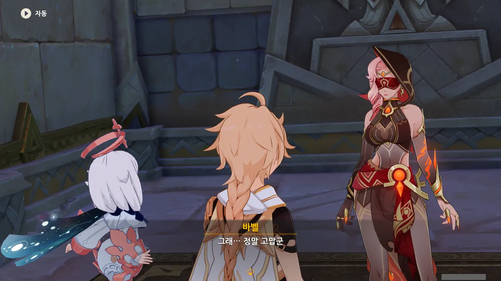

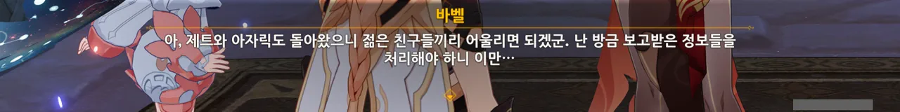

바벨이 서둘러 자리를 뜨는 것으로 보이는 건 나뿐만이 아닐 것이다.

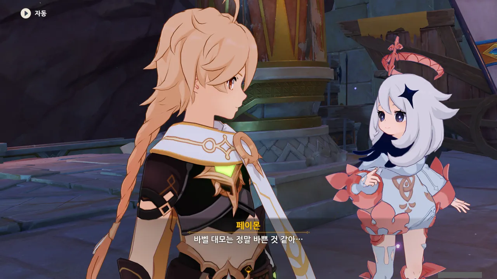

바쁘다기보다, 그 자리에 계속 있으면 아까 있었던 릴루페르와의 말싸움이 다시금 생각날 거 같아서 그런 게 아닐까? 바벨은 이렇다 할 반격조차 제대로 하지 못하고 계속 릴루페르에게 얻어맞았잖아.

분명 자다가도 분해서 이불을 뻥뻥 차 댈걸?

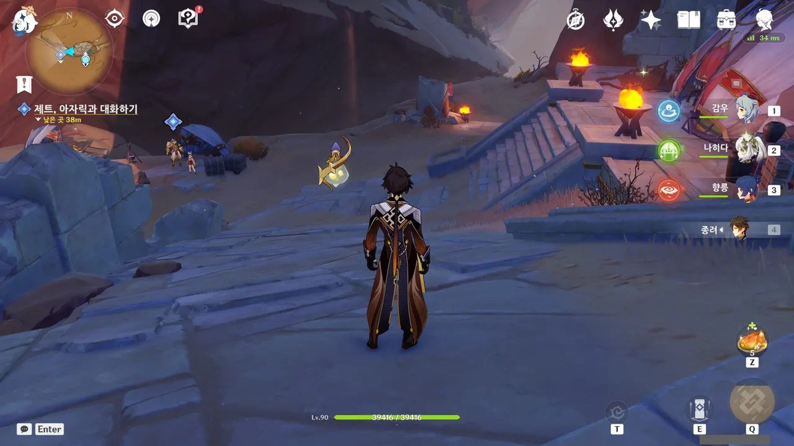

어라? 제트의 집은 오른쪽의 큰 천막 아니었어? 왜 저기에 천막을 따로 치고 있는 걸까?



제트는 여전히 말이 없다. 여전히 삐진 걸까?

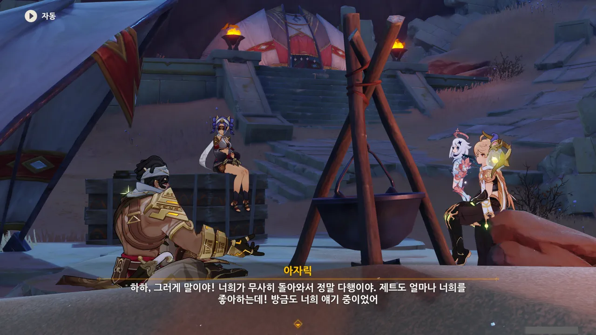

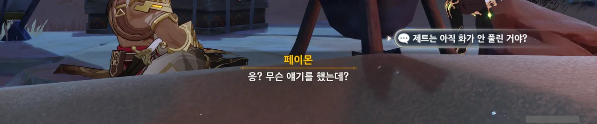

응? 여태껏 제트가 여행자 이야기를 하고 있었다고? 여행자가 오니 말 한마디 않는 걸 보면 아직도 화가 덜 풀린 것 같은데...



음... 이럴 땐 보통 제트가 '강한 부정'을 표하는 게 클리셰일 텐데, 여전히 제트는 말이 없다. 대체 뭐지?

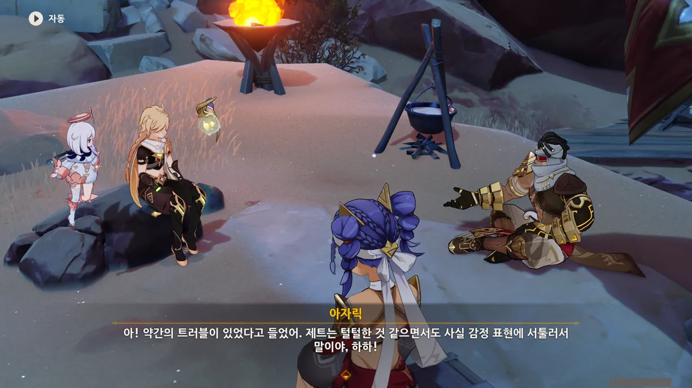

아, 그냥 감정 표현에 서툴러서 여태 말을 하지 않은 거였구나.

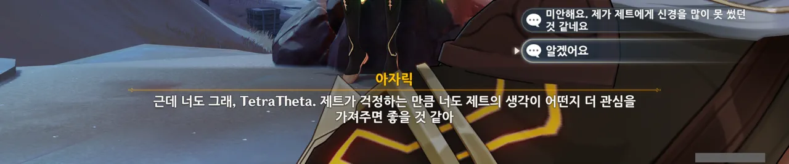

아니, 이건 억울하다니까?

일단 뭐라도 유추할 수 있게 말이나 행동을 하면 지레짐작이나마 제트의 생각을 알아볼 텐데, 그런 거 하나 없이 그냥 떽떽거리고 가버리니, 그걸 내가 어찌 알라고?!

이건 모함이야, 모함!

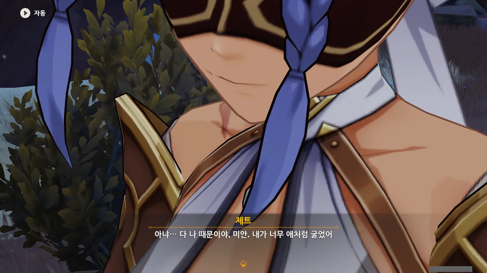

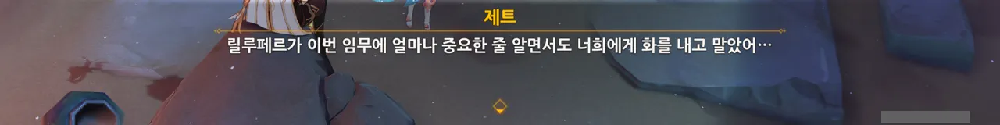

제트가 저렇게 사과하니, 뭐라 할 말이 없어진다.

그리고 사과하는 곳도 좀 잘못되지 않았니? 여행자가 제트를 도운 건 별다른 속셈이 있어서가 아니라 순수히 제트를 위해서 도운 거였는데, 이번 임무 운운하면 참...

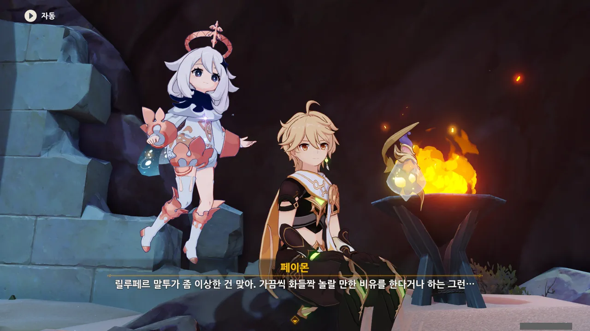

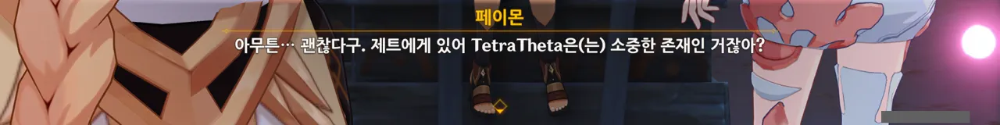

하기야, 아까 협곡 밑에서 릴루페르가 앞에 매복이 있다 알려준 걸 생각하면 릴루페르는 그리 나쁜 녀석이 아닐지도 모른다.

그것 역시 호감작을 위한 초석이라고 하면 할 말이 없긴 하지만...



와, 제트가 아무런 표정 변화 없이 무덤덤하게 '내 최고의 친구인걸'이라고 말하는 걸 보니, 뭔가 섬찟한 느낌이다.

왜, 이미 마음을 정리한 것 같은 느낌 있지 않은가. 그게 여행자에 대한 연심인지, 아니면 다른 건지는 잘 모르겠지만...



아무튼, 제트가 자신을 잘 감독해 달라는 걸로 결론이 났다. 뭔가 찜찜한 결말인걸.

여기서 더 캐물어봤자 별다른 소득도 없을 테니, 일단은 그냥 그런 거로 하자.



바벨이 릴루페르에 대해 함부로 물어보지 말라고 아자릭에게 말한 것 같다. 아니면 아자릭뿐만 아니라 부족원 전체에게 그랬거나.

대체 왜 그랬을까?

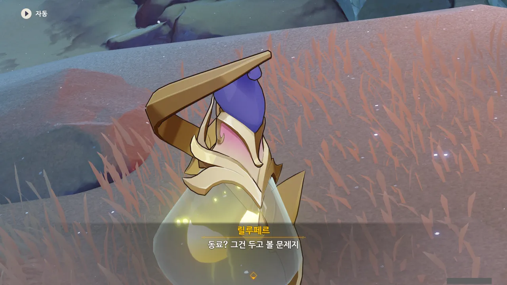

아자릭이 동료인지 아닌지는 두고 볼 문제라며, 릴루페르가 또다시 빈정댄다.

아까 협곡 밑에서 매복이 있었던 건 아자릭이 여행자 일행과 헤어진 후, 매복조에게 정보를 흘렸기에 가능한 일이 아니었나 의심했었는데, 아마 그것 때문이겠지...





아, 이 둘, 재미있네.

고의가 아니었겠지만, 아자릭에게 '말하는 병', '사나운 녀석' 취급을 당한 릴루페르가 붉게 변하며 화를 잔뜩 내고 있다. 그와 정반대로, 아자릭은 릴루페르에게 '사막 노예 녀석'이란 말을 들어도 별로 개의치 않는 것 같고.

이거 완전... '아자릭 > 릴루페르 > 제트' 구도 아냐?



그래도 릴루페르는 아자릭에 대해 정식으로 소개받자, '머리랑 입이 부족하지만 튼실해 괜찮은 녀석'이라고 평가를 바꾼다.

지금껏 릴루페르가 내린 평가를 볼 때, 저 정도면 상당히 고평가라고 할 수 있지 않을까?

아냐... 저 기준이 노예를 기준으로 평가하는 걸 수도 있어...

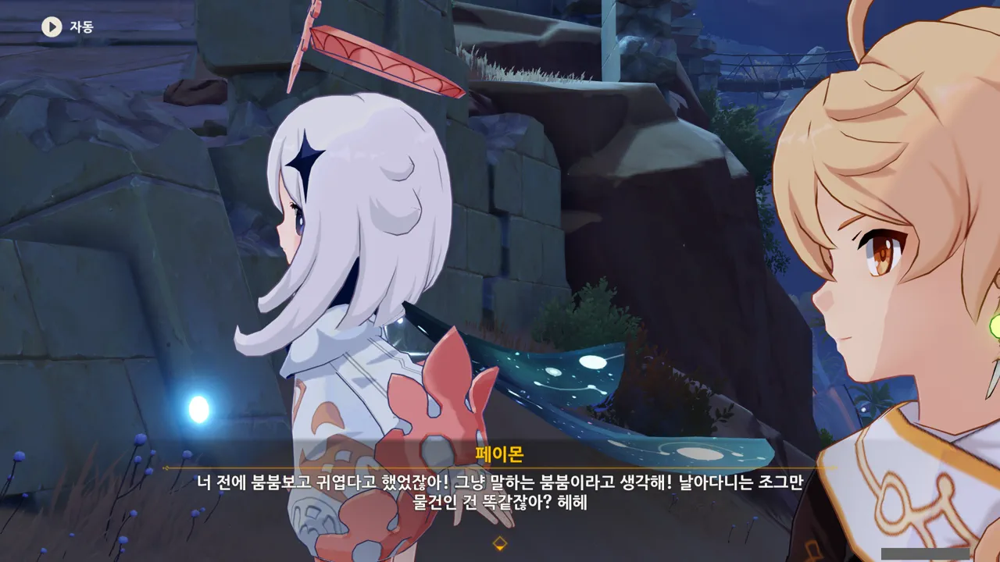

와, 말하는 붐붐! 붐붐이 릴루페르처럼 말하고 다녔으면, 황금빛 꿈 임무가 정말 끔찍했을 거야...

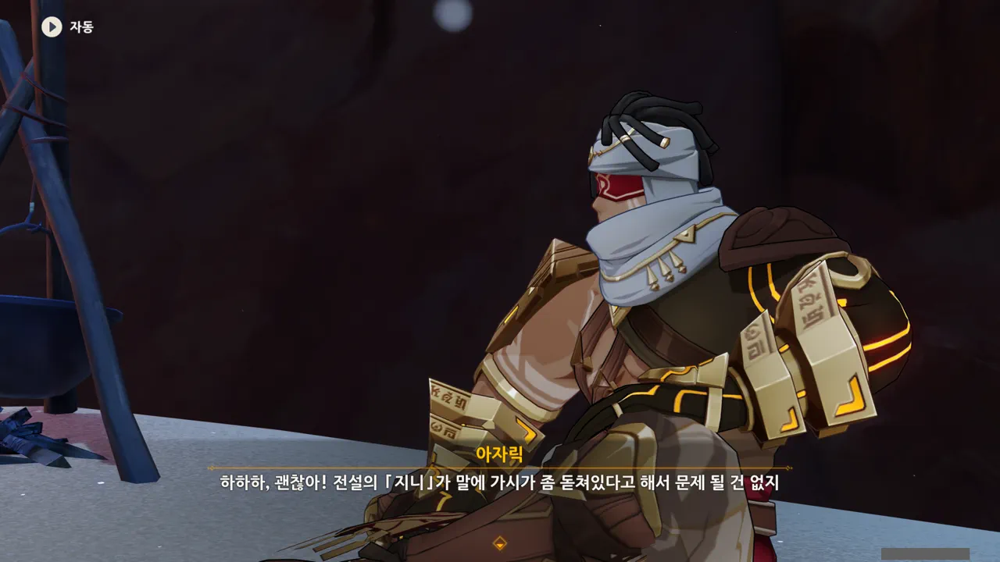

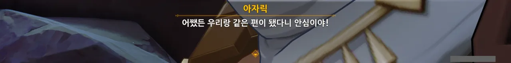

아자릭, 굉장히 긍정적이네. 어쩌면 아자릭에게 보이는 릴루페르는 앙앙 짖어대는 '전설의 치와와' 같은 것이 아닐까? 둘 다 작잖아.

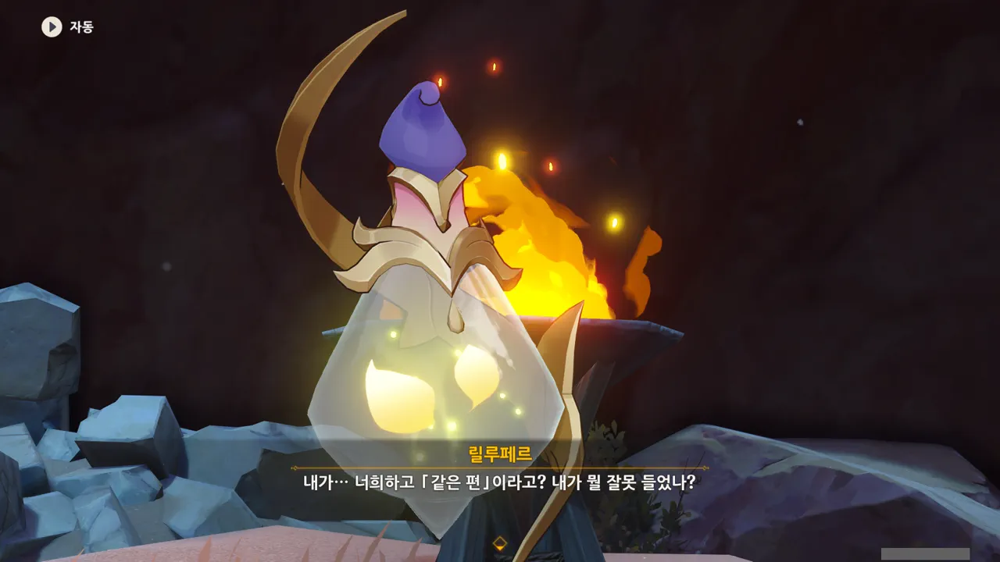

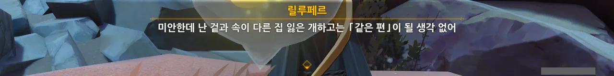

릴루페르가 아자릭을 '겉과 속이 다른 집 잃은 개'라고 불렀다. '집 잃은 개'가 과연 무슨 뜻일까?

겉과 속이 다르다는 건 이전의 매복 때문에 아자릭을 의심하고 있으니 그런가 보다 하겠지만, '집 잃은 개'가 대체 뭘 의미하는 건지 모르겠다.



심지어 그게 좀 센 말이었던지, 아자릭과 제트 둘 다 말이 없다.

상황적으로 보면, 제트로 인해 침체되어 있던 분위기를 아자릭이 릴루페르의 모욕을 감내하며 기껏 되살려놓았더니 거기에 릴루페르가 찬 물을 끼얹은 모습이다.

분위기 언-메이커 릴루페르가 그러면 그렇지.



아자릭 역시 충격을 받은 모양인지, 괜찮냐고 물었을 때 곧바로 '괜찮아'라고 답하지 않고 약간의 침묵을 섞어 '... 괜찮아'라고 답한다.



아자릭과 헤어진 후 생긴 일에 대해 궁금해하길래, 모두 이야기해 주었다.



이야기를 들은 제트는 여행자를 습격한, '부족의 배신자와 다른 지족의 끄나풀'이 자신이 예전에 쫒던 패거리와 한 패인 것으로 추측한다. 게다가 그들이 우인단과 결탁했을 가능성마저 내비치고 있다.

아까 협곡을 올라왔을 때, 우인단 채무처리인이 있었던 걸 생각해 보면 정말로 그랬을지도 모르지.

&nbsp;

그나저나 그들의 행동 방식과 행적에 익숙해질 정도로 그들을 추격한 거야? 바벨이 제트를 참 심하게 굴렸나 보다.





기껏 분위기가 괜찮아지나 했는데, 제트가 또다시 자책모드에 들어갔다.

그래, 아드라피는 일단 붙잡아서 심문을 해봐야 뭐가 어떻게 돌아가고 있는지 알 수 있겠지. 그에 대한 처벌은 타니트 부족이 알아서 하라고 하고.

&nbsp;

그런데 아드라피가 붐붐을 여태껏 *수리*하고 있었잖아. 붐붐은 괜찮은 걸까? 나중에 한번 가봐야겠다.



이야... 제트가 저렇게 말하니까 조금 무서운데.





분위기가 갑자기 재미있어졌다.

* 페이몬: 제트가 진지해졌다 ▷ 제트: 내가 예전에는 진지하지 않았다는 말이냐?
* 아자릭: 제트가 부족민다워졌다 ▷ 제트: 내가 예전에는 부족민답지 않았다는 말이냐?

페이몬과 아자릭이 말실수 하나로 제트에게 얻어맞고 있다. 아, 이런 게 아주 꿀잼이지.



오... 아자릭은 '친구의 일을 자신의 일처럼 생각하는 모습이 기꺼운 것이다'라며 제트의 발톱을 피한다.

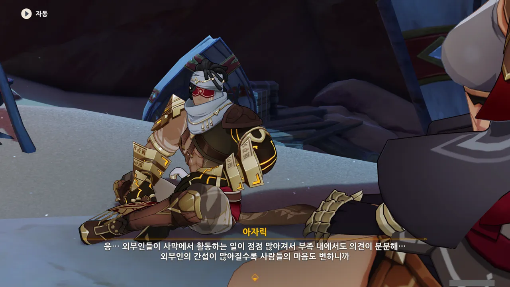

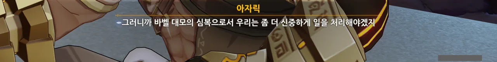

이전에 아드라피가 바벨에게 보낸 편지 내용에서도 나왔듯이, 사막 민족들은 수메르 성 사람들의 개입을 달가워하지 않는 것으로 보인다. 수메르 성 사람들이 다가와도 예전처럼 다른 꿍꿍이가 있어 그럴 것이라 생각해, 그들을 멀리하는 것이다.

뭐, 그건 그들의 업보니까, 수메르 성 사람들이 알아서 잘 대처해야겠지.

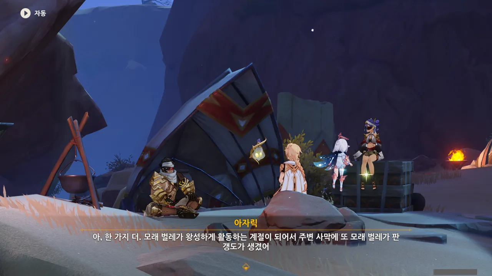

모래 벌레? 그러고 보니 이전에 유적 안에서 제트가 모래 벌레의 번데기로 흔적을 남겼다고 하지 않았나?



'평소에도 잘 잡던 녀석들인데 뭐 어때'라고 말하는 제트에게 "그래도 방심하면 안 돼!"라며 일갈하는 아자릭.

누가 보면 친구 사이가 아니라 애지중지하는 애인이라도 되는 줄 알겠다.



흠... '모래 벌레', '향신료'... 이거 듄의 '샤이 훌루드' 패러디 아닌가?

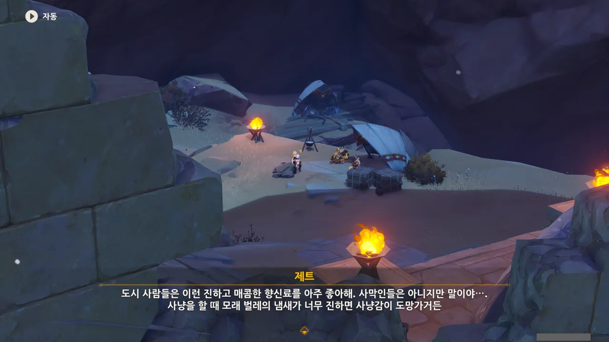

듄에서 '모래 벌레'가 만드는 '스파이스 멜란지'와 비교하면 그냥 진하고 매콤한 향신료일 뿐이지만, 수메르 사람들에게 있어 향신료는 굉장히 중요한 요소임을 생각해 보면 이 향신료는 '스파이스 멜란지'만큼은 아니지만 수메르 사람들에게 있어 상당히 중요한 자원임을 유추할 수 있다.

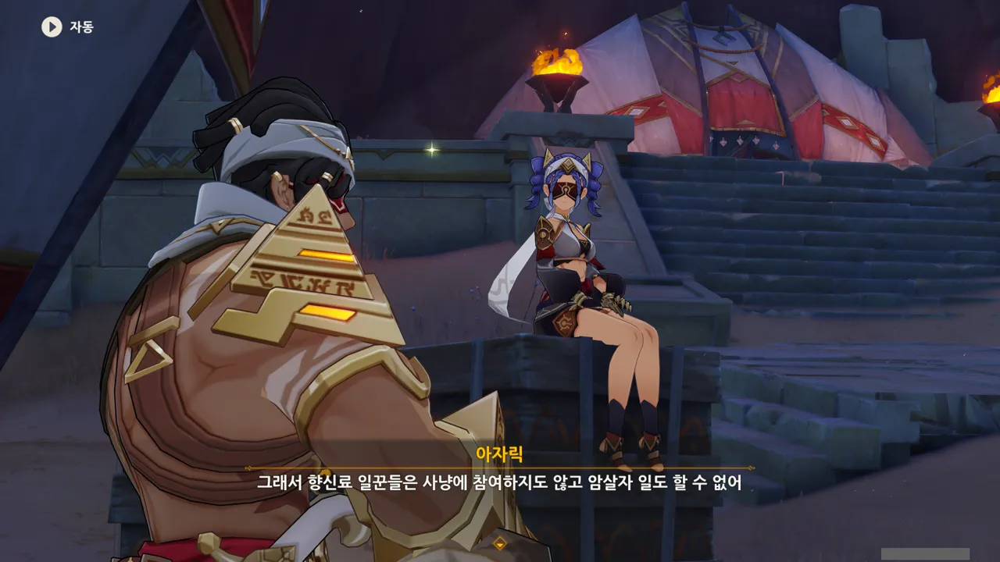

다만 모래 벌레에게서 향신료를 추출하는 일꾼들은 몸에 모래 벌레의 냄새가 진하게 배기 때문에 다른 일을 할 수 없다고 한다. 사냥감은 냄새를 맡고 멀찍이 도망가버리고, 암살 대상 역시 그들의 냄새를 맡고 암살자가 오고 있음을 알아차린다고 한다.

내 생각으로는 이러한 향신료 일꾼들은 부족 내에서의 지위가 낮을 것으로 추측된다. 일을 그것밖에 하지 못하니까.



모래 벌레 번데기 냄새는 성체의 것보다 훨씬 부드럽기 때문에 제트처럼 표식으로 삼아 길을 잃는 것을 방지하는데 쓰기도 한다고 한다.

그래, 내가 원한 정보는 바로 이거였어. 아까 유적 안에서 이야기해 주었으면 좋았으려만.





제트는 모래 벌레가 위험하지 않다고 하는데, 그 말을 끊고 아자릭이 '외부인에게 위험할 수 있다'라고 말하는 것으로 봐선, 아자릭의 '모래 벌레는 위험하다'는 말은 거짓말인 것으로 보인다. 그리고 여기서 아자릭이 왜 그렇게까지 말했는지조차 유추할 수 있다.

만약 모래 벌레가 위험하지 않음이 다른 사람들에게 알려지게 되면 수메르 성의 상인들이 양식을 시도할 것이고, 그러면 결과적으로 사막 민족들의 밥줄이 하나 끊기는 셈이니, 아자릭과 같은 사막 민족 입장에서는 외부인이 '모래 벌레는 위험하지 않다'라는 사실을 알게 해서는 안 되는 것이다.



릴루페르가 말한 '아펩의 자손'이 사막 민족을 뜻하는 것일까?

여태 릴루페르가 말한 것을 종합해 보면 사막 민족은 아주 예전에는 강대한 민족, 혹은 지배 계층이었으나 어떠한 일로 몰락해 노예가 되었던 것 같다.



오, 릴루페르가 이야기보따리를 풀려는 모양이다.

그래, 릴루페르의 이야기를 들어보면 옛날에 어떤 일이 있었는지 조그만 힌트라도 얻을 수 있지 않을까?

내가 봤을 때, 저 말은 제트를 약 올리기 위해 한 말이다.



거 봐라. 제트가 벌써 날이 잔뜩 서서 '난 이미 귀를 막았어!'라고 말하지 않았는가.

그 와중에 페이몬은 제트 따라 귀를 막으려 했다. 요 귀여운 녀석 ㅋㅋㅋ...

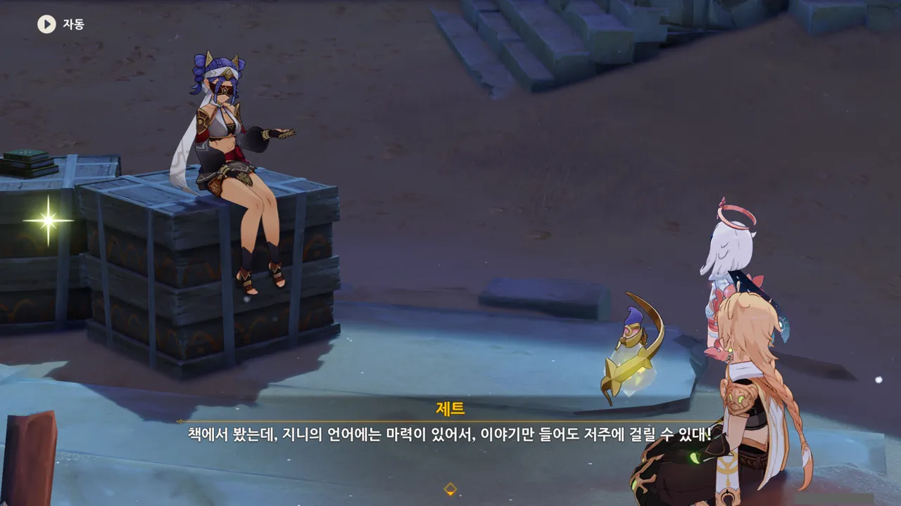

아, 귀를 막은 것이 그것 때문이었어...? 기껏 제트가 귀를 막은 이유에 대해 상상의 나래를 펼쳐보았는데 죄다 헛것이었던 셈이다.

지니의 언어에 마력이 있다니... 이게 무슨 최면 어플도 아니고...

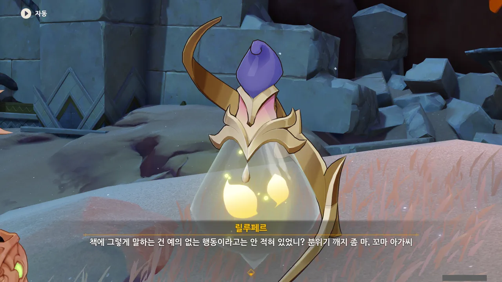

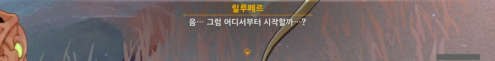

릴루페르가 쏘아붙이는 말이 너무나도 웃기다.

> 책에 그렇게 말하는 건 예의 없는 행동이라고는 안 적혀 있었니?

맞는 말이긴 한데...

하여튼 제트와 릴루페르 이 둘 사이는 보면 볼수록 재미있다. 대부분은 제트가 릴루페르의 말에 발끈하는 것이지만...

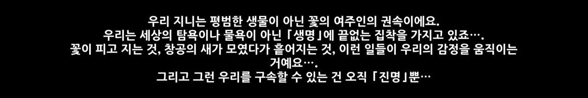

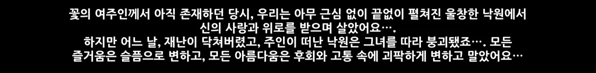

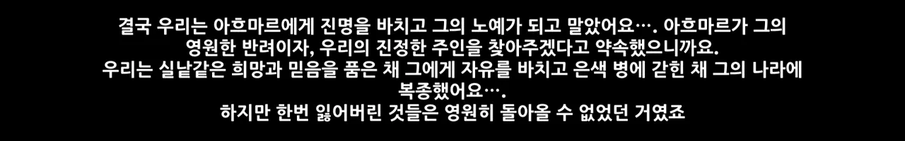

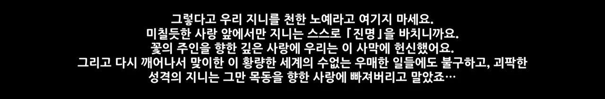

그러니까 지니는 화신(花神)의 권속이고, 화신이 죽자 화신을 되살리겠다는 거짓말을 한 적왕에게 진명을 바치고 노예가 되었다는 것인데...

마지막의 '괴팍한 성격의 지니'는 릴루페르 자신을 말하는 것일 테고... '목동'은 과연 누구일까?

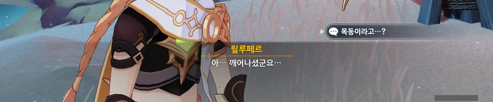

아, 설마 여행자는 릴루페르의 이야기를 듣다가 그대로 잠들어버린 거야?

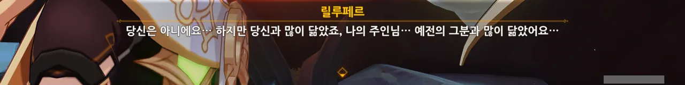

흠... 여행자와 닮았다라... 혹시 나라바루나 너니? 그러고 보면 나라바루나가 여행자의 여동생일 것이라는 추측도 있었는데 말이다.





제트가 느끼기에, 릴루페르의 이야기가 어딘가 익숙하다고 한다. 여행자가 알지 못하는 과거의 기억 때문일까, 제트가 읽은 책에 있던 이야기 때문일까?

그나저나 '이미 일어난 일이니까 앞으로도 일어날 수 있겠지'라고 하는 말이 무언가 수상쩍다. 이런 부류의 이야기가 어딜 가나 보이는데, 이거 자체가 티바트의 정체에 대한 떡밥 뭐 그런 것은 아니겠지?





오늘 릴루페르의 비유 초이스는 '숙주를 조종하는 기생충' 되겠다. 릴루페르의 괴상한 비유는 언제 들어도 질리지 않는다니까...

그리고 '인간의 따분한 수치심'이라니. 그거야말로 사회를 지탱하는 한 축이건만...

하지만 제트가 릴루페르의 말을 듣고 '크흠...!'이라고 한 것을 보면... 설마 제트, 여행자에게 연심이 있는 거니?

오... 그러면 여태까지의 제트가 한, 알 수 없는 이유의 행동들 대다수가 말이 되긴 하는데... 정말? 정말로?

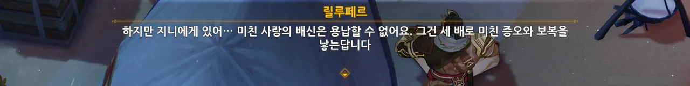

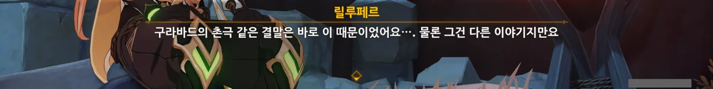

릴루페르는 구라바드가 어떻게 멸망한 것인지 잘 아는 듯하다.

분명 나중에 그 이야기도 풀어주겠지?



그래. 이렇게 아예 대놓고 '릴루페르는 왜 여행자에게 진명을 바쳤는가? 다른 목적은 없는가?'라고 묻는다면 나야 좋지.

솔직히 여행자가 무슨 페로몬을 풀풀 풍기고 다니는 것도 아닌데 릴루페르가 왜 여행자를 마음에 들어 하며 달라붙는지 나도 잘 모르겠거든... 일단 도움이 되니까 OK지만 말이다. 

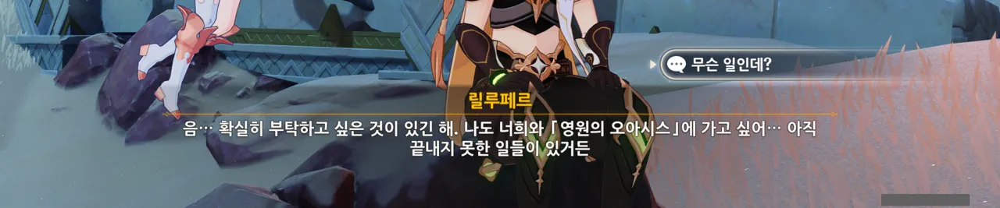

그러니까 릴루페르 역시 끝내지 못한 일 때문에 영원의 오아시스로 가고 싶다는 건데... 그러면 왜 지금까지 가지 못한 것일까? 일곱 갈래로 찢겨 봉인된 것 때문에? 그 끝내지 못한 일은 무엇일까?

나중에 릴루페르의 조각을 모으다 보면 알 수 있지 않을까.



> | | |
> |:--|:--|
> | 제트 | 건배할까? |
> | 릴루페르 | 뭐로 건배하게? 설마 나? |
> {_borderless=true,_thead=false}

제트와 릴루페르 사이가 꽤나 좋아진 것처럼 보인다.

그나저나 릴루페르가 '설마 나로 건배할 거야?'라고 묻는 건 참 재미있었어.

아 ㅋㅋ 릴루페르도 병에 있으니까 아무튼 뭘 담을 수 있겠지 ㅋㅋ



야이... 가벼운 주제라면서. 그러면서 대뜸 카드 게임을 하자고 한다고?

난 카드 게임 그 임무, 임무 화면에서 사라질 때까지만 하고 단 한 번도 건드린 적이 없다. 그건 내 취향이 아냐...

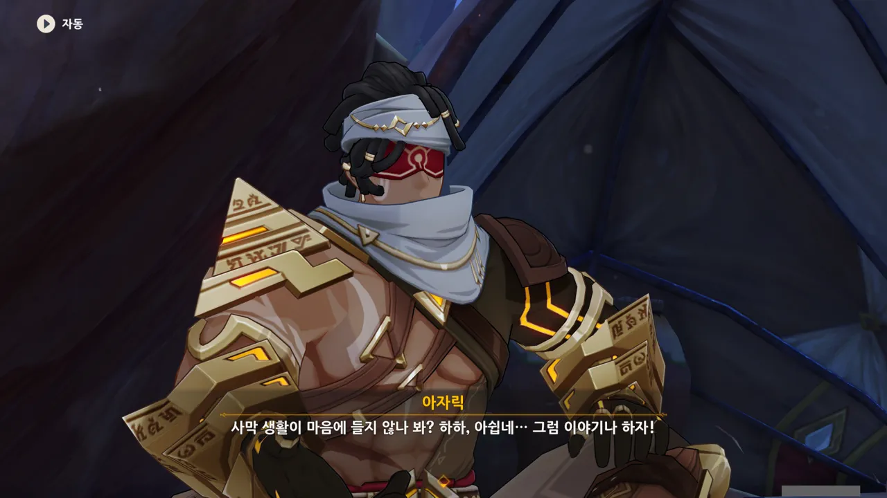

그렇다고 그걸 '사막 생활이 마음에 들지 않는 거냐'라고 하다니. 이건 순수히 취향 차이라고.

취향입니다. 존중하세요.

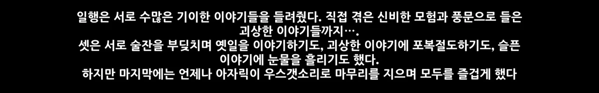

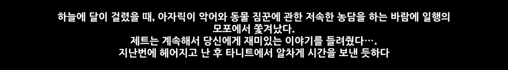

대체 '악어와 동물 짐꾼에 관한 저속한 농담'이 뭐였을까?

모포에서 쫓겨날 정도의 농담이라면 성(姓)에 관련한 농담일 것으로 보이는데... 대체 어떻게 해야 그런 농담이 있을 수 있는 걸까?
