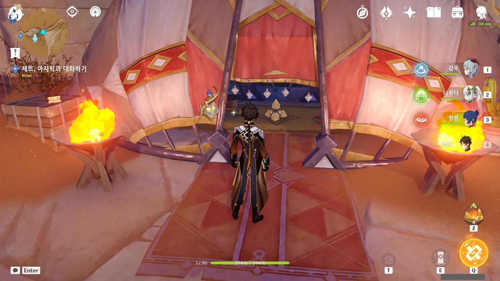

붐붐이 걱정되어 아드라피의 천막으로 가보았다. 다행히도 붐붐은 그대로 있었다.

저번에 왔을 땐 붐붐이 마치 죽은 듯 가만히 있었던 것으로 기억하는데, 지금 보니까 마치 아주 얕은 숨을 쉬듯이 조금씩 벌렁벌렁이고 있다.

이걸 보니, 역시 아드라피가 붐붐에게 뭔가 좋지 않은 일을 했던 것 같다. 붐붐을 고친다는 핑계를 대며 붐붐을 고장 내던 아드라피가 없어지니, 붐붐이 자가회복에 들어가는 모습처럼 보이지 않은가.

뭐... 자세한 진위에 대해선 영영 모르게 되겠지만.

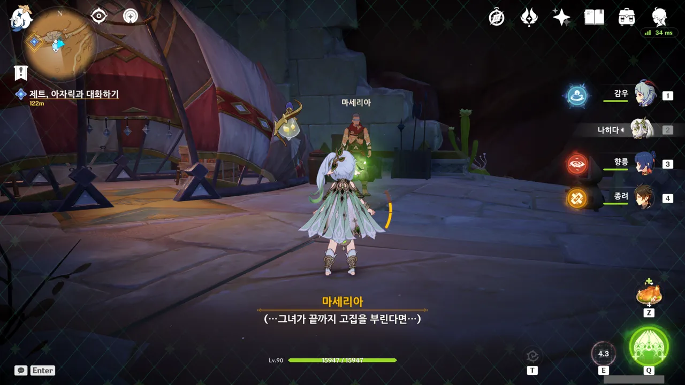

기왕 나히다를 들었으니, 타니트 부족원들의 마음속을 들여다보기로 했다.

일단 제일 먼저 선택한 건 처음 보는 사람에게 암살자니, 친구는 약점이니 같은 무례한 말만 해댔던 마세리아였다.

> ... 그녀가 끝까지 고집을 부린다면...

그녀? 고집? 대체 그녀는 누구고 고집은 무슨 고집일까?

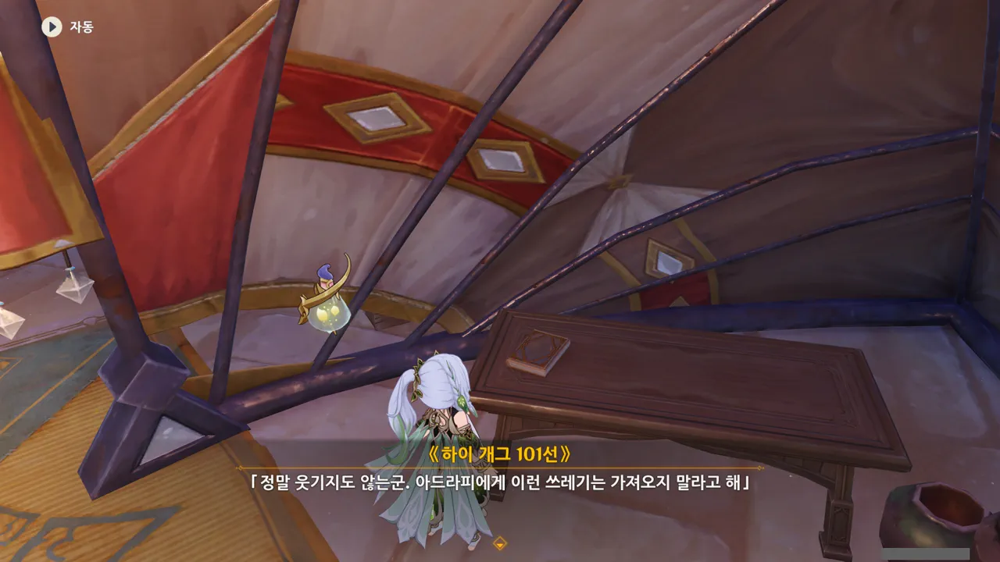

마세리아의 집 안에는 사이노가 참 좋아할 것만 같은 '하이 개그 101선'이라는 제목의 책이 있었다. 정작 마세리아의 마음에는 들지 않았던 것인지, 책을 '이런 쓰레기'라고 부른다.

하이 개그가 재미없긴 하지.

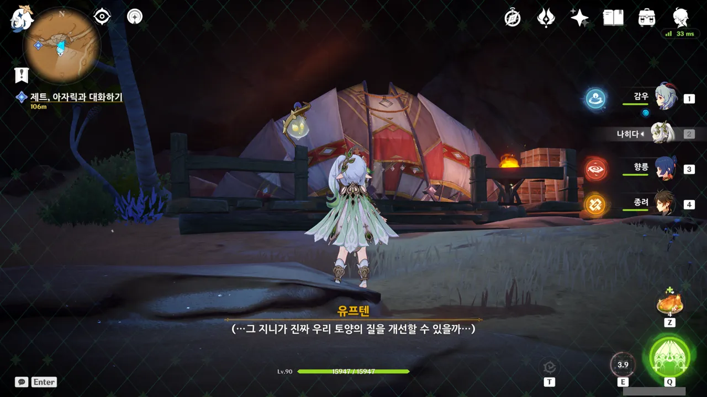

말더듬이 유프텐은 릴루페르가 정말로 토양의 질을 개선할 수 있을지 의심하고 있다.

저번에 릴루페르를 회수할 때, 릴루페르를 회수하자마자 릴루페르가 있던 곳의 녹지가 빠르게 시들고 죽어버렸었다. 아마 이곳 토양의 질을 개선시키려면 릴루페르를 여기에 천년만년 박아두어야 가능할 것 같은데, 그러면 릴루페르가 싫어하지 않을까?

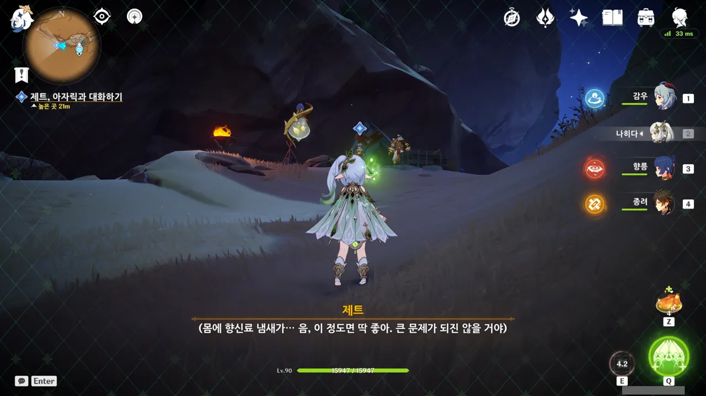

이번엔 제트의 생각을 읽어보기로 했다.

향신료? 냄새의 정도를 보는 걸 보아, 어떤 향신료를 향수 대용으로 쓴 걸까? 아니면 저번에 쓴 모래 벌레 향신료의 냄새가 아직도 몸에 남아있는 걸까?

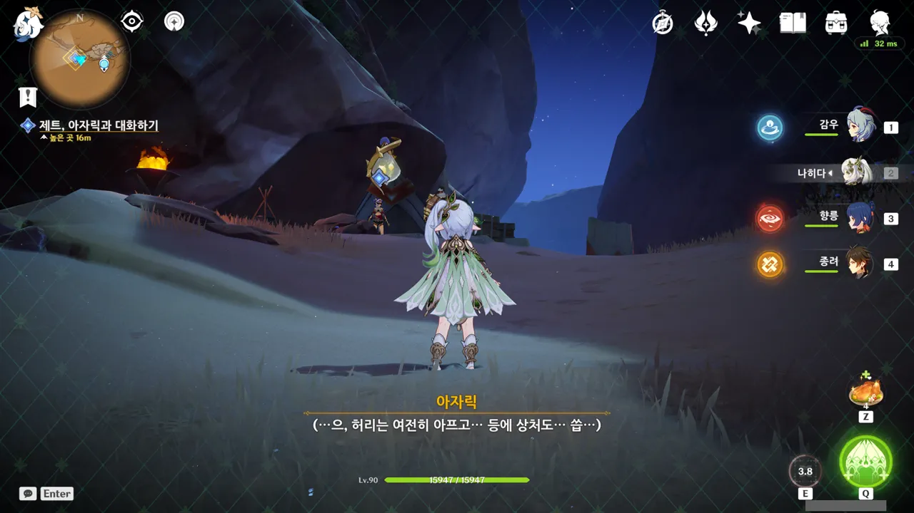

> ... 으, 허리는 여전히 아프고... 등에 상처도... 씁...

아자릭... 대체 어젯밤에 뭘 한 거니?

허리가 아프다, 등에 상처가 났다... 이거 100% 남녀정사를 말하는 거 아닌가? 그러면 제트와 아자릭이 서로 응앗응앗 한 걸까?



릴루페르의 비유는 비유에 징그러운 것이 좀 나올 뿐인데, 페이몬은 그것 때문에 잠을 제대로 자지 못한 모양이다.

고작 그 정도 갖고?



아자릭은 잠을 설쳤다고 한다. 한밤중에 바벨을 만나러 갔기 때문이다.

어... 그럼 설마 바벨과 아자릭이 응앗응앗을 한 거야?

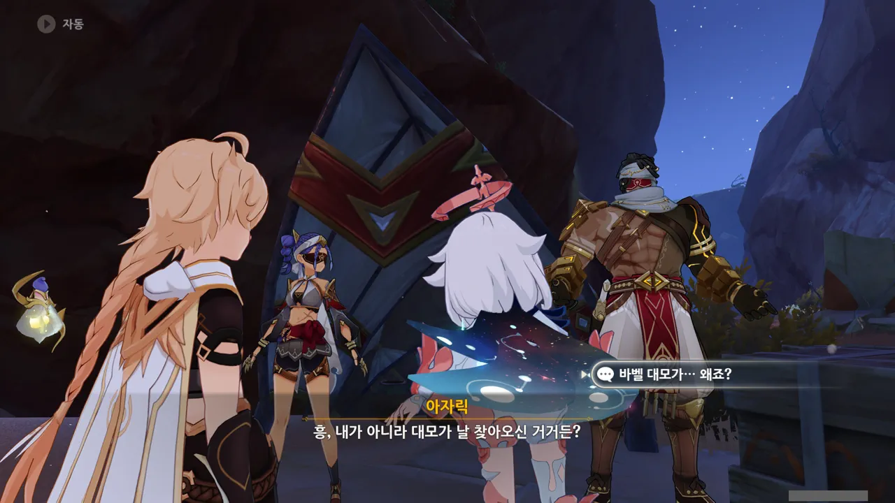

아자릭이 바벨을 찾아간 게 아니라, 바벨이 아자릭을 찾아왔다고 한다. 그러면 아자릭은 바벨의 정부(情夫)인 걸까? 



*부족 어른들의 일*이라... 이거 아무리 봐도 100% 남녀정사인데?

그러면 대체 바벨과 아자릭의 나이는 어떻게 되는 거지? 제트와 아자릭이 서로 반말로 대화하는 것으로 보아, 둘의 나이 차이가 크지 않을 것으로 생각하고 있었다. 그런데 제트보다 나이가 훨씬 많아 보이는 바벨과 아자릭이 서로 응앗응앗을 했다고?

... 정말 이 세상은 풀리지 않는 미스터리로 가득해...

'공공연히 알려진 비밀' ㅋㅋㅋㅋㅋㅋ

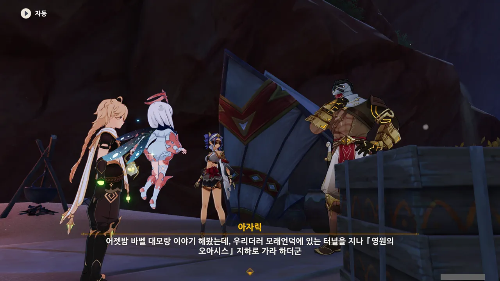

다음 행선지는 '영원의 오아시스' 지하라고 한다. 드디어 영원의 오아시스에 갈 수 있는 걸까?

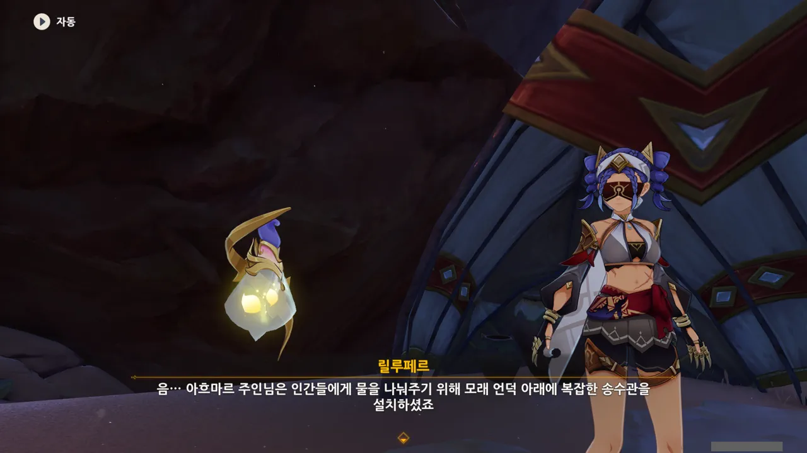

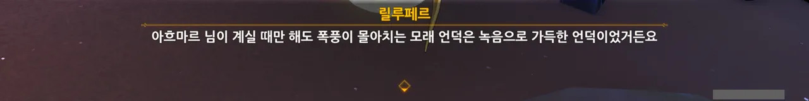

아자릭이 말한 '모래 언덕 밑의 터널'은 옛날 적왕이 인간들에게 물을 공급하기 위해 모래 언덕 밑에 설치한 송수관이라고 한다.

정말 상상이 가지 않는 장면인걸. 지금 저렇게 폭풍이 몰아치는 모래 언덕이 옛날에는 녹음으로 가득한 언덕이었다니...

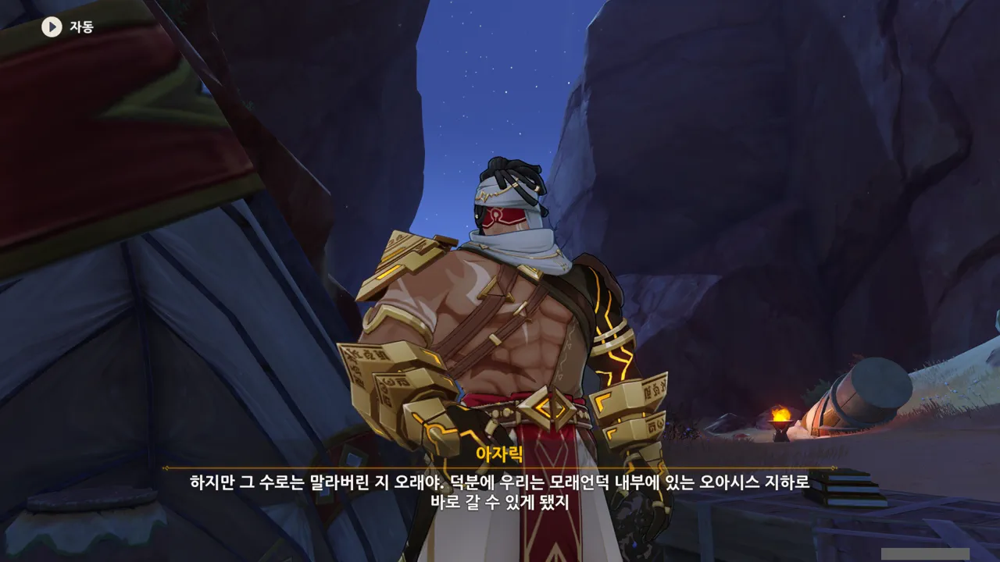

아무튼, 지금은 말라버린 그 터널을 따라 오아시스 지하로 향한다고 한다.

그런데 오아시스가 여전히 존재한다면, 오아시스와 연결된 지하의 터널 역시 물이 어느 정도 차있지 않을까?

어쩌면 영원의 오아시스 역시 세월의 힘을 이기지 못하고 시간이 지남에 따라 말라버렸을지도 모르겠는걸.





어젯밤 바벨이 아자릭과 정사를 나눈 후, 아자릭에게 오아시스 지하로 가는 길을 소상히 알려준 모양이다. 그림까지 그려가며 말이다.

> ... 역시 아직 젊군, 아자릭. 허허허...

바벨의 속마음. 역시 어젯밤 바벨과 아자릭이 한판 한 모양이다.

난 바벨이 꽤 젊은 나이일 거라고 생각했는데, 제트와 크게 나이 차이가 나지 않을 아자릭에게 '아직 젊다'라고 말하는 것으로 보아, 모델링의 한계 때문에 젊게 보이는 것뿐이지, 사실은 나이가 적잖이 있는 것으로 보인다.

그러면 '바벨 &gt;&gt; 아자릭 &gt; 제트' 이렇게 되는 건가.



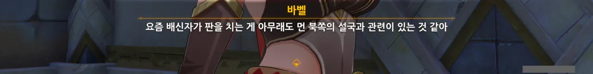

제트에게 아드라피 척살 명령이 떨어졌다. 이제 아드라피를 만나면 합법적으로 두들겨 팰 수 있다는 이야기다.

'먼 북쪽의 설국'은 100% 스네즈나야를 말하는 거겠지. 그리고 거기에 얽힌 거라면 당연히 우인단일 테고.

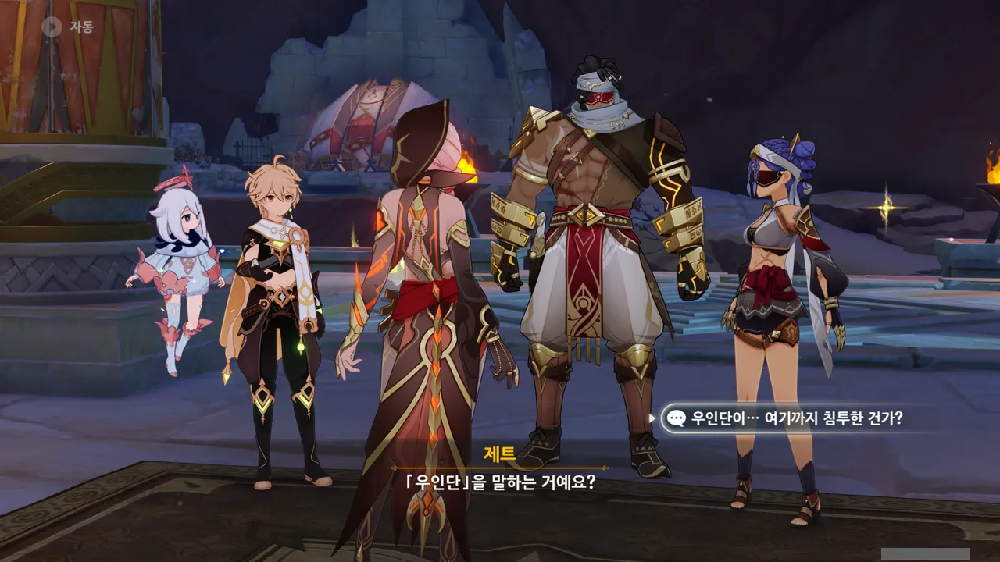

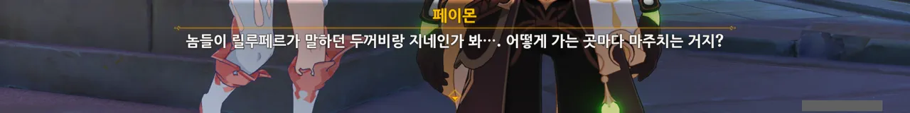

두꺼비와 지네 ㅋㅋㅋㅋㅋㅋ

그래, 우인단은 없는 곳이 없더라. 그나마 연하궁 정도가 우인단을 볼 수 없는 곳일걸?

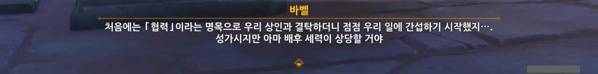

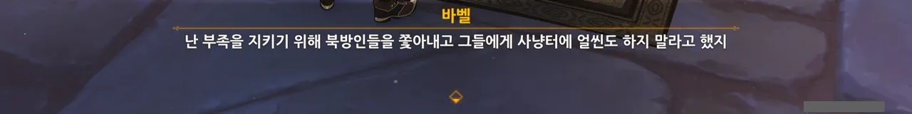

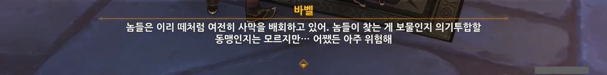

바벨 역시 꽤 많은 걸 알고 있었다.

맞아, 우인단 뒤에는 스네즈나야가 있지. 우인단 자체가 스네즈나야의 무력 집단 아니던가.

그리고 우인단이 노리는 것은 보물과 의기투합할 동맹 둘 다일 가능성이 꽤 높아 보인다. 더 정확하게 말하자면, 의기투합할 동맹보다는 이나즈마의 와타츠미 반란군처럼 적당히 이용해 먹고 버릴 수 있는 장기짝을 원하는 거겠지.

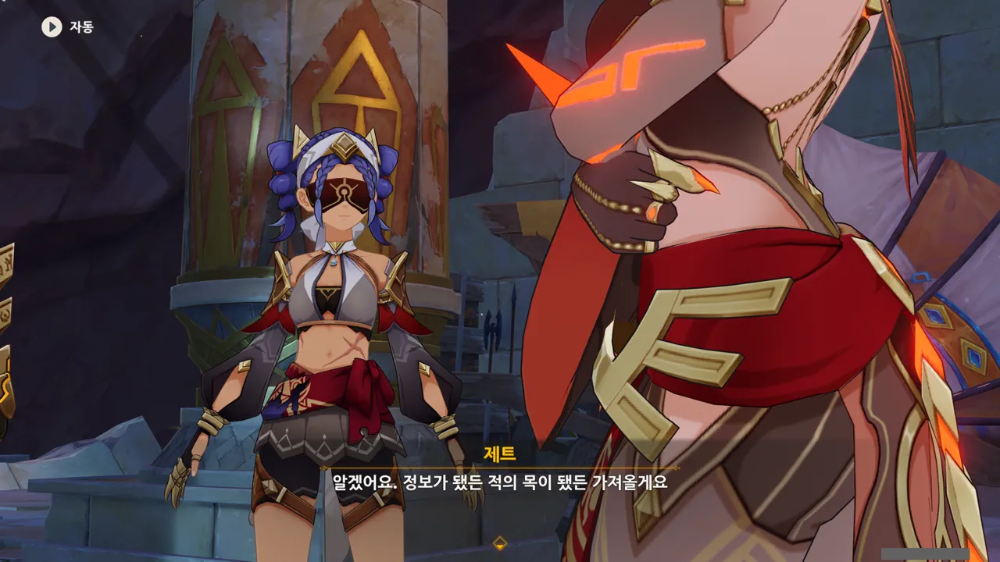

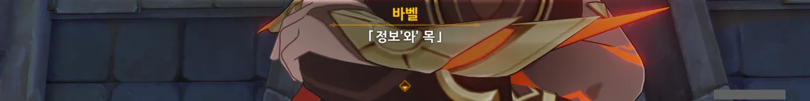

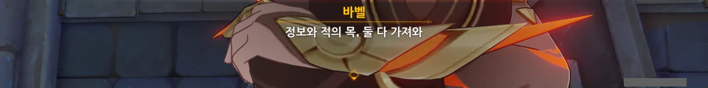

> 정보'와' 목. 정보와 적의 목, 둘 다 가져와.

와, 이거 정말 멋진 대사다.

제트가 정보나 목 중 하나를 가져오겠다고 하자, 바벨이 정보**와** 목, 둘 다 가져오라고 한다.



그래. 지금 중요한 건 오아시스 지하로 가는 길이지.



모래 벌레? 아자릭은 위험하다고 말했지만, 외부인 앞이라서 그렇게 말하는 건 줄 알았는데... 어쩌면 내가 잘못 생각한 걸지도 모른다. 바벨까지 저런 말을 할 정도면, 단순히 겁을 주기 위해서 한 소리는 아닌 것으로 보이거든.



모래 벌레는 지니에게 유인당한다. 메모.

릴루페르는 자신이 무슨 재앙의 상징처럼 말해지자 발끈대서 부들대고 있다.

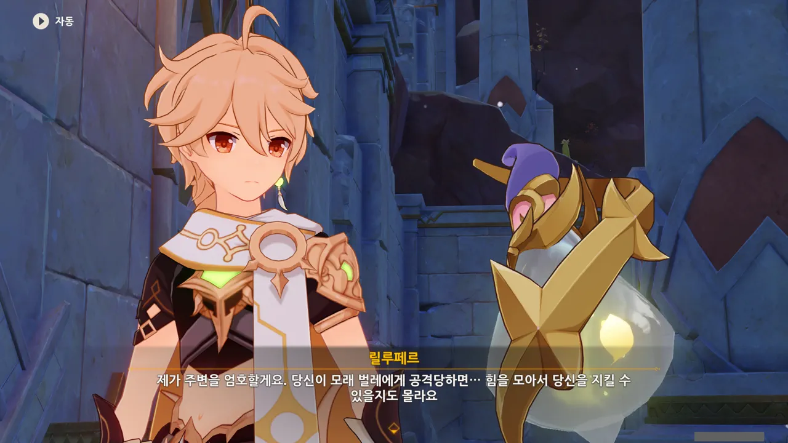

> 당신이 모래 벌레에게 공격당하면... *힘을 모아서* 당신을 *지킬 수 있을지도 몰라요.*

그래, 릴루페르도 자신이 현재 힘이 없음을 잘 알고 있구나.



그런 상황에서 릴루페르는 그저 조기경보기 역할밖에 하지 못하고, 실제 호위는 --- 그런 게 필요하다면 --- 제트가 다 하게 될 것이라고 생각하게 되는 건 어째서일까.

&nbsp;

그런데 아까 '아자릭에 대해'라고 적힌 선택지 역시 물어볼 수 있을 줄 알았는데, 곧바로 다음 대화 지문으로 넘어가버리더라. 아자릭이 대체 어땠는데?!



오아시스 수로에 릴루페르의 다른 조각이 있다고? 그걸 바벨은 대체 어떻게 알아낸 거야? 적어도 이 야영지에서 볼 수 있는 책에는 그런 언급이 없었던 거 같은데.



'외부인'? 바벨과 아자릭 둘 다 할 말을 잃은 걸 보아하니, 그 외부인에 대한 것 역시 어젯밤의 만남에서 알려준 듯하다.

그 외부인이라는 게 설마 우인단은 아니겠지? '저 놈들, 정말 나쁜 놈들이래요!'라고 말하는 사람이 알고 보니 그 나쁜 놈들과 내통하는 관계였다는 건 이젠 식상하다시피 한 클리셰이지 않은가.



이건 100% 릴루페르가 적당히 둘러대는 것이다.

여기서 더 캐물어봐도 이득이 없으니 적당히 둘러대면서 빼고, '학자들을 약탈하고 상인에게서 지도를 훔치는 것은 사막인들의 오랜 수법'이라며 마지막에 한 발 꽂아 넣고 가는 거지.





릴루페르는 여전히 오아시스로 가는 열쇠를 쥐고 있다. 그래서 릴루페르에게 대놓고 모욕적인 말을 들어도 바벨은 자신 혹은 부족의 염원을 위해 릴루페르에게 저자세를 취할 수밖에 없다. 그래서 릴루페르를 책망하는 제트를 만류한 것이겠지.

아니면 정말로 무언가 켕기는 것이 있어 그걸 재빨리 덮고자 한 걸 수도 있고.

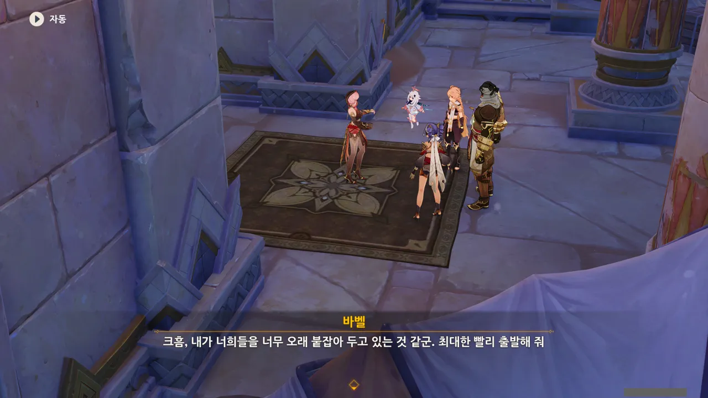

바벨이 최대한 빨리 영원의 오아시스로 출발해 달라고 한다.

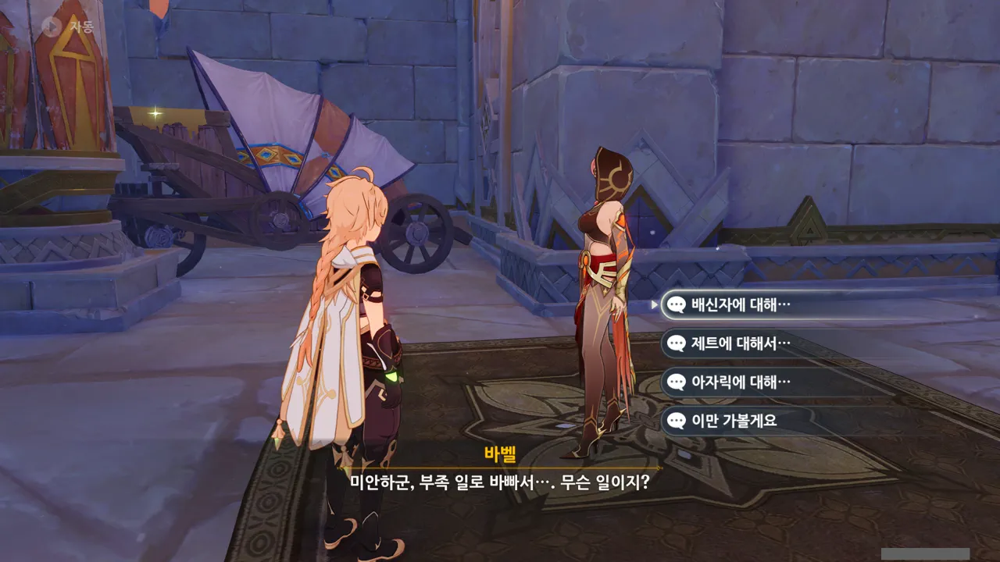

하지만 그전에 물어볼 건 물어봐야지.



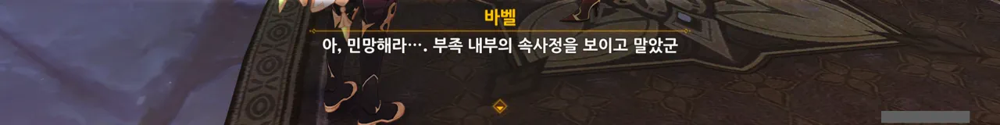

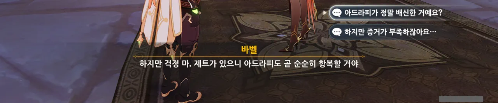

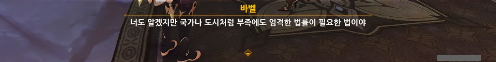

글쎄... 잘 모르겠다. 속이 시원하긴 한데, 과연 이게 맞나 싶기도 하거든.





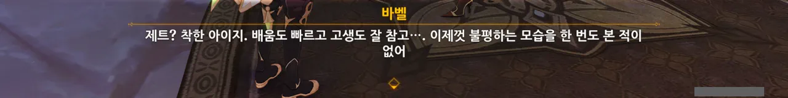

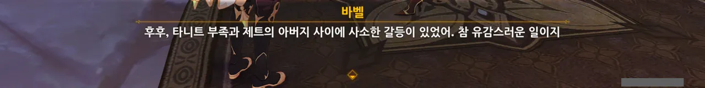

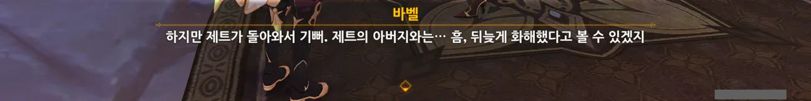

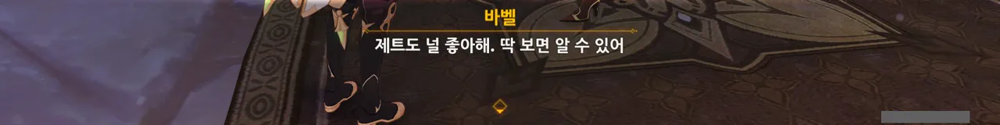

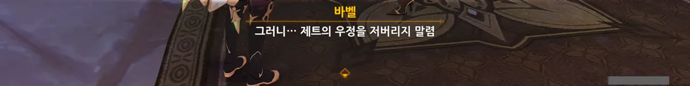

뭐? 제트가 여행자를 좋아한다고? 어... 정말?

지금까지의 제트의 행동을 보면 정말 그런 것인지 좀 의심스럽다.





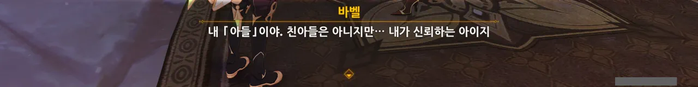

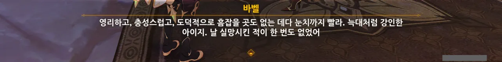

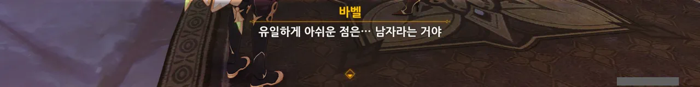

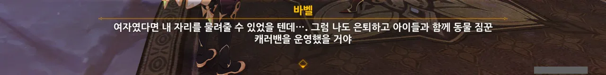

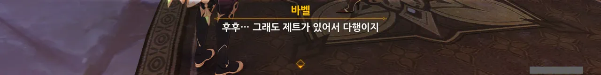

아자릭의 유일한 단점이 남자라고 하는 걸 보면, 사막 부족의 지도자 자리에는 여성만이 올라설 수 있는 것으로 보인다.

바벨은 제트를 자신의 후계자로 삼고, 자신은 부족의 지도자 자리에서 내려와 아자릭과 동물 짐꾼 캐러밴을 운영하고 싶은 듯하다.

그나저나 아자릭을 아들 같은 녀석이라 해놓고 밤새 응앗응앗을 했다고?



***

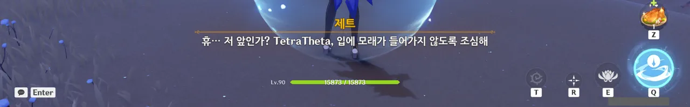

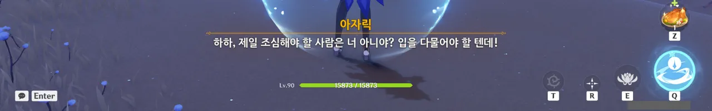

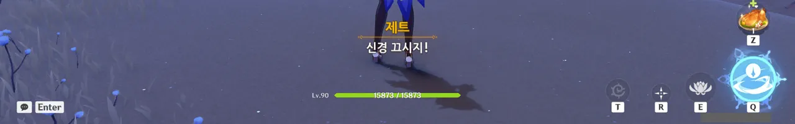

임무 지역에 도착하자마자 아자릭과 제트가 서로 투닥댄다. 정말 친하다니까...

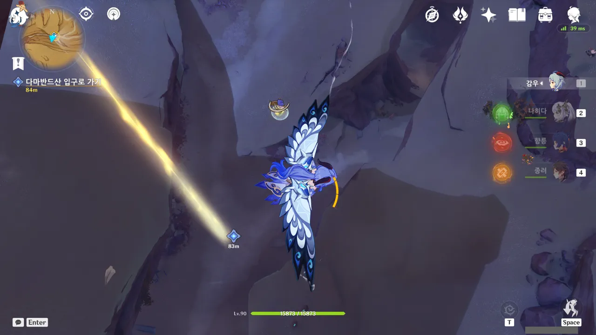

가야 할 곳은 저 밑이다.

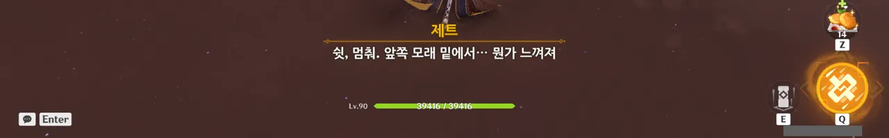

모래 벌레? 오오, 드디어 모래 벌레를 볼 수 있는 건가?



막 멀리서 뭔가가 모래먼지를 잔뜩 일으키며 다가오고 있다.

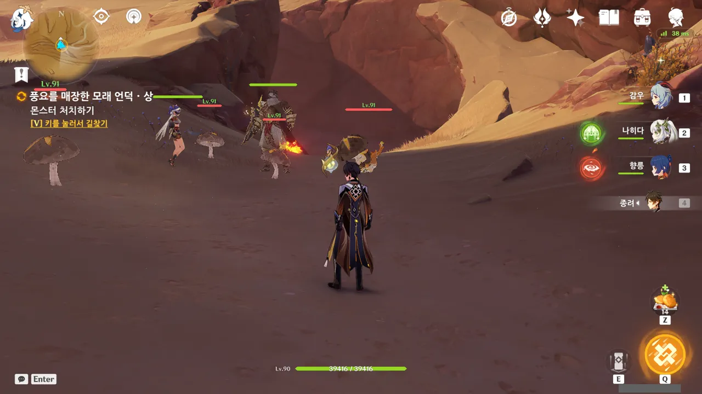

...? 이건 그냥 버섯몬인데요? 설마 모래 벌레가 이 버섯몬이었다고 말할 건 아니겠지?

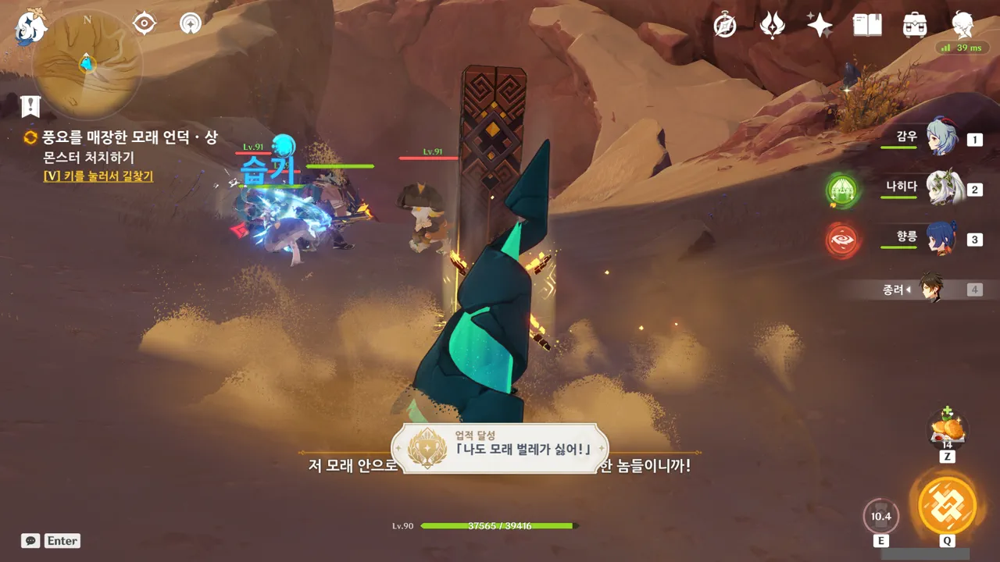

그렇게 생각한 순간, 바닥에 붉은 원이 표시되더니 바닥에서 드릴이 솟아올라왔다. 그리고 그와 동시에 '나도 모래 벌레가 싫어!'라는 업적이 달성되었다.

젠장, 종려 실드를 제때 펼친 줄 알았는데.

&nbsp;

그런데 이 드릴, 예전에 사막 워프 포인트를 미리 뚫어두겠다고 돌아다닐 때 발견한 것이었다. 그때에는 왜 이 업적이 깨지지 않았던 걸까?

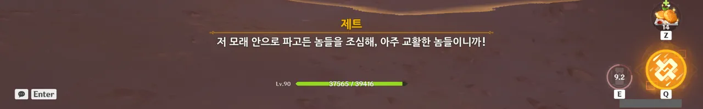

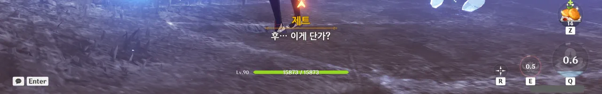

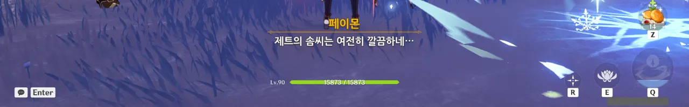

이 몹들은 제트가 아니라 내가 다 잡은 거다.

꼬우십니까, 휴먼? 리월로 오십시오. 이 천성은 무료로 제공됩니다.



베르누이의 정리였던가? 폭이 좁은 곳에서는 유체의 압력이 높아진다고 한다. 그래서 도시의 고층 빌딩 사이에는 '빌딩풍'이라고 불리는, 세찬 바람이 분다.

아마 이 협곡 역시 그런 경우겠지.

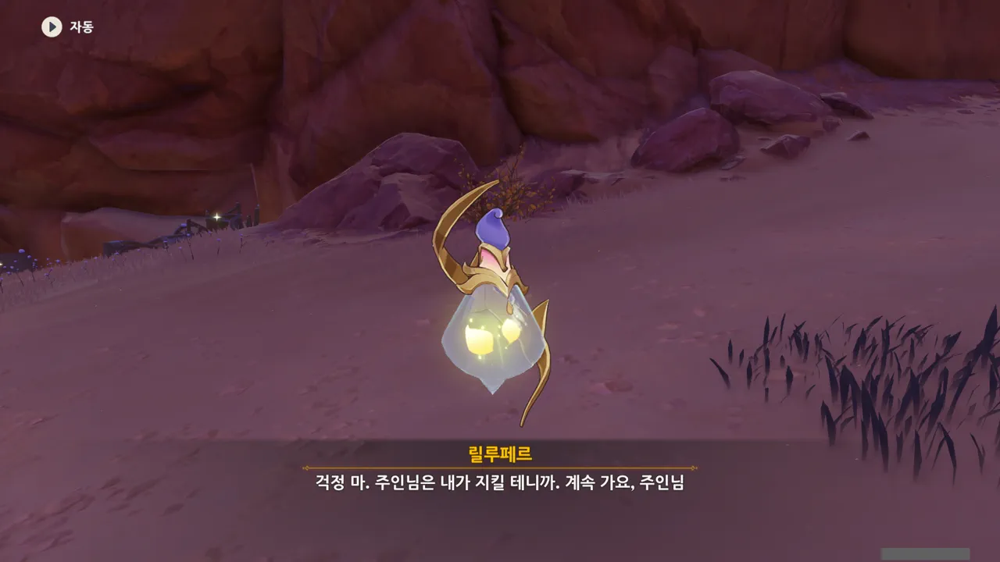

릴루페르가 여행자를 지키는 모습은 아직 코빼기도 보이지 않았다.



이번에도 아자릭은 끝까지 함께하지 않고 먼저 떠나버린다.

만약 오아시스에서의 일을 얼추 끝마치고 나오는데 저번처럼 매복이나 우인단 같은 것을 만난다면, 아자릭이 우릴 배신했다는 확실한 증거가 될 것이다.

그런데... 상식적으로 그렇게 두 번이나 연달아 매복을 할 것 같지는 않다.

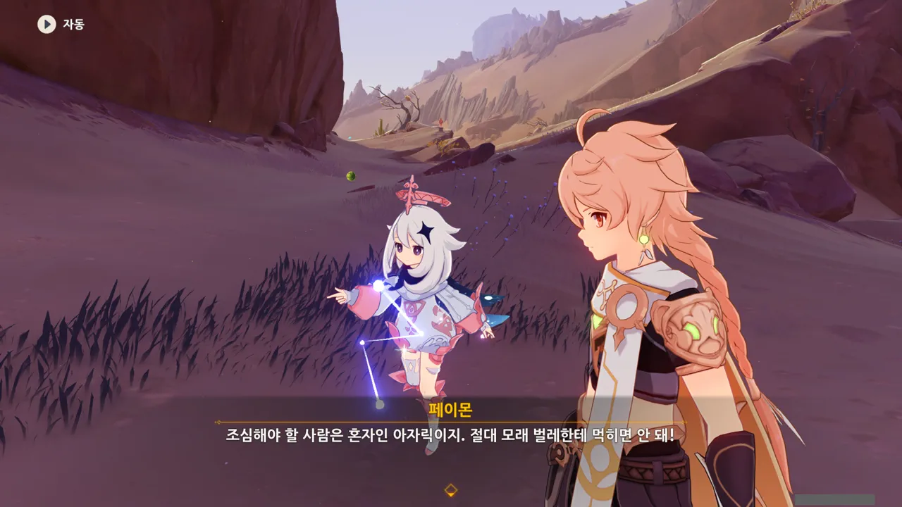

아자릭이 모래 벌레에게 허무하게 먹힐 것 같진 않은데...

정말 그렇게 된다면 참 어처구니가 없을 것이다.

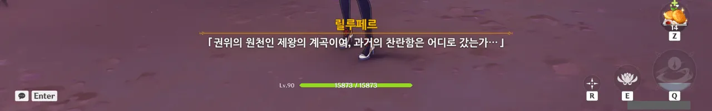

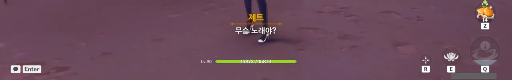

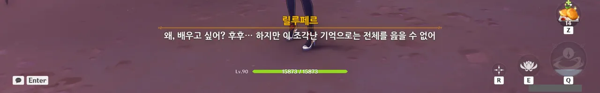

릴루페르의 모든 조각을 모으게 되면 저 노래의 모든 가사를 알 수 있게 되는 걸까?

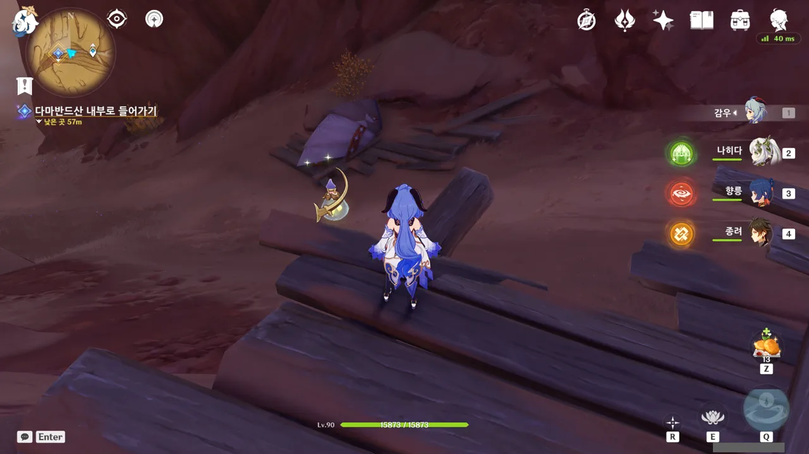

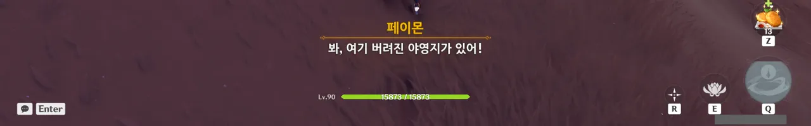

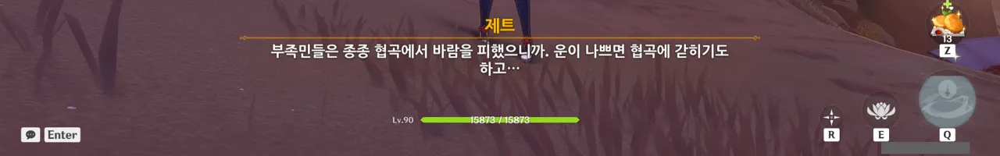

사막인들의 천막이 보인다. 제트 말로는 부족민들이 협곡에서 바람을 피할 때 쓴 것이라고 하는데...

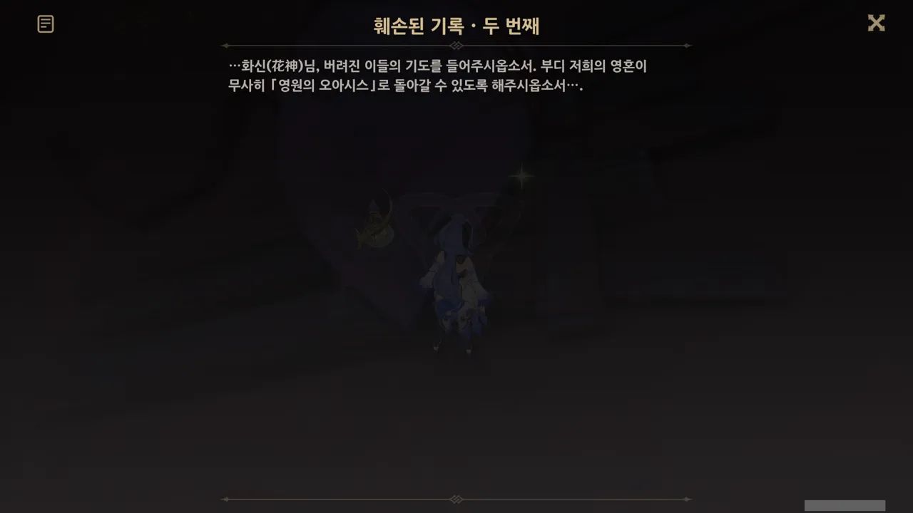

그 야영지에 꽃의 화신과 '영원의 오아시스'를 찾는 문서가 하나 남겨져 있다.

과연 이들이 평범한 부족민들이었을까? 단순히 모래 바람을 피해 협곡으로 피신한 부족민들로 보이지는 않는다.

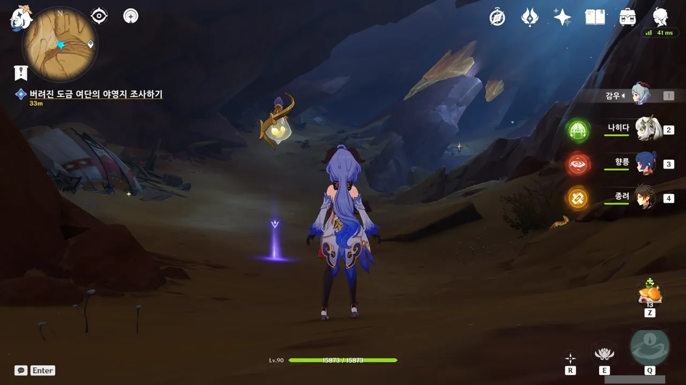

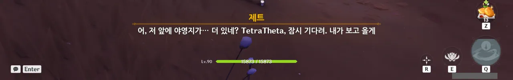

앞에는 또 다른 야영지가 있다.



제트의 조사 결과, 이 야영지는 타니트 부족이 만든 것이었다. 바벨이 여행자 말고도 다른 사람들을 이곳으로 보낸 모양이다.

그런데, 릴루페르 말처럼, 여긴 분명 부족의 성지니 뭐니 해서 부족민은 물론이요, 외부인의 접근까지도 막는 곳 아니었어? 그런데 왜 타니트 부족의 야영지가 여기에 있는 거야?



바벨이 이 야영지에 대한 정보를 알려주지 않은 것으로 보아, 이들은 이곳에 도착한 후 단 한 사람도 살아 돌아가지 못한 것으로 보인다.

이 탐사대가 바벨이 보낸 것인지, 바벨 이전의 지도자가 보낸 것인지는 모르겠지만, 바벨은 예전에 많은 사람들이 죽은 곳으로 제트와 여행자를 보낸 셈이 된다.

위험하다고 바벨이 전에 이야기하긴 했지만, 위험한 곳과 사람이 죽은 곳은 엄연히 다른 개념이잖아.

&nbsp;

어쩌면 바벨은 말로만 제트를 이뻐하고, 사실은 제트를 그저 쓰기 편한 장기짝 정도로만 생각한 게 아닐까? 제트가 바벨을 신뢰하는 것 역시 신뢰도 쌓기를 위한 빌드업 때문이었을 수도 있지.

... 그래. 일단 나중에 돌아가서 물어보는 게 나을지도 모른다. 당장은 이 모든 게 그저 심증에 불과할 뿐이지 않은가?

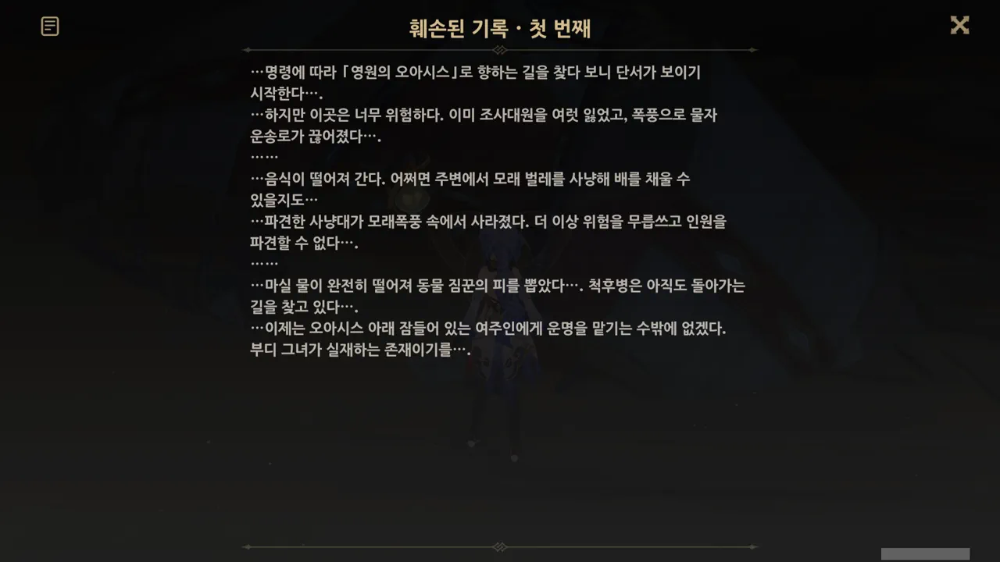

첫 번째 훼손된 기록을 찾았다. 아까 전 찾은 두 번째에 비해 알아볼 수 있는 문장이 훨씬 많다.

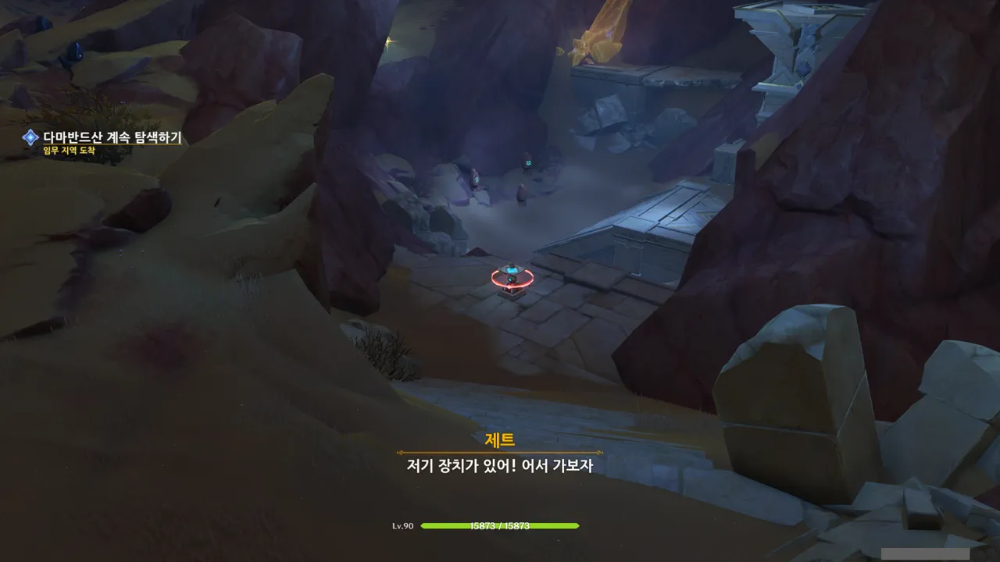

이건 딱 봐도 '이걸 잠금 해제 하세요'라고 말하는 거지, 그렇지?

하지만 저건 조금 있다 보기로 하고, 일단 이 앞에 뭐가 있는지부터 보기로 했다.

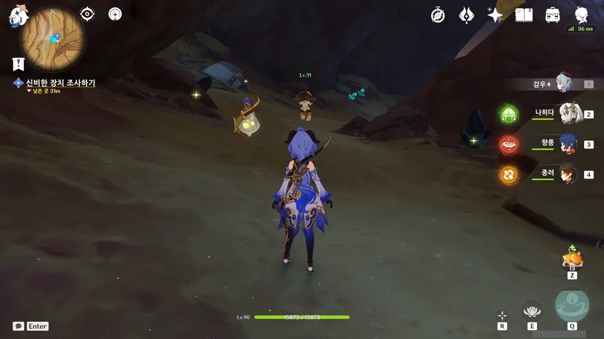

일단 텐트 몇 개를 더 발견하긴 했지만, 주변에는 버섯몬뿐이었다. 설마 버섯몬 때문에 탐사대가 전멸했겠어...?

이 탐사대는 바벨이 보낸 것이 맞았다. 바벨 이전의 지도자가 보냈을 수도 있다고 생각했는데.

심지어 지금 우리가 보고 있는 흔적을 남긴 탐사대 이전에도 다른 탐사대가 여럿 파견되었다고 한다. 그런데 그 많은 사람들이 죄다 모래 벌레에게 먹혔다고?

와... 모래 벌레, 생각보다 엄청 센데?

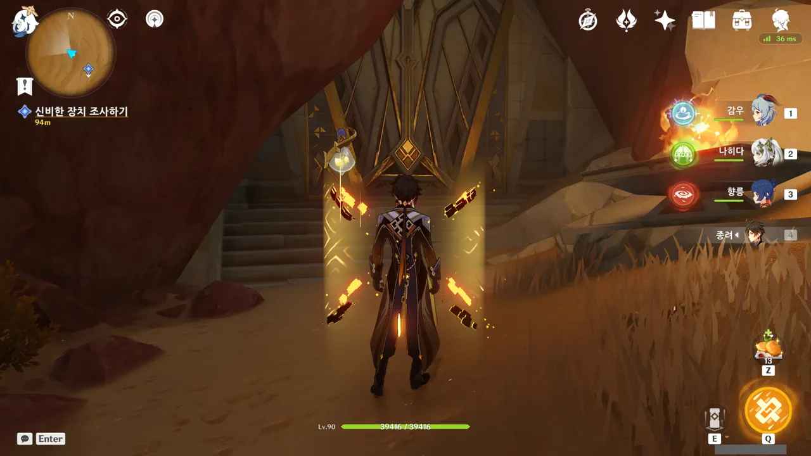

길 끝에는 닫힌 문밖에 없다. 아까 그 장치가 있는 곳이 유적의 입구라면, 여기는 유적에서 나오는 출구 아닐까?



저런 장치는 지금껏 수십 번도 넘게 만져본 것 같은데...

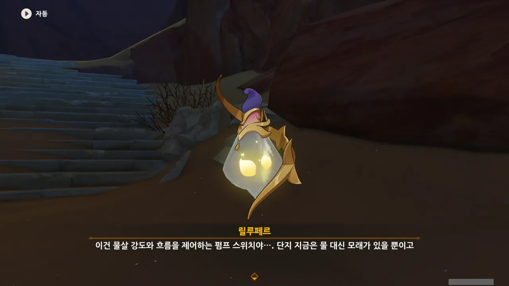

다행히도 저 장치는 물의 흐름과 그 강도를 제어하는 펌프 스위치라고 한다. 위험한 건 아니네.

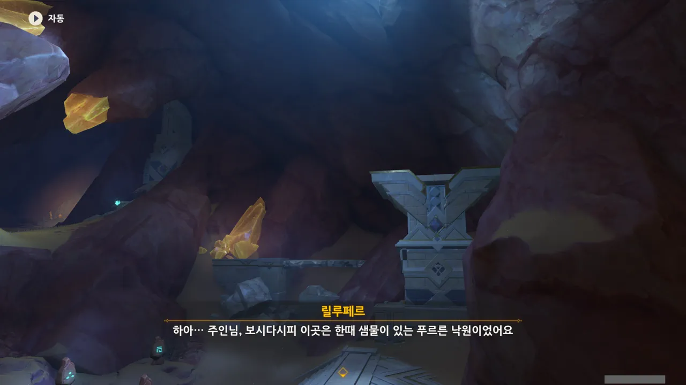

솔직히 말해, 여기가 한때 샘물이 있는 푸르른 낙원이었다는 게 도저히 믿기지 않는다. 대체 어딜 봐서?



오, 드디어 릴루페르가 처음으로 쓸모를 발휘하는구나!

그 첫 쓸모는 잠겨있는 스위치를 잠금해제하는 것이었다.



장치를 가동하자, 하늘에서 모래가 떨어지고, 모래가 모래 그릇에 가득 차자 아까 발견한 그 문이 열렸다.

이 기믹, '저수지 기믹'이라고 불렸던가? 이전에도 몇 번 한 것 같은데...

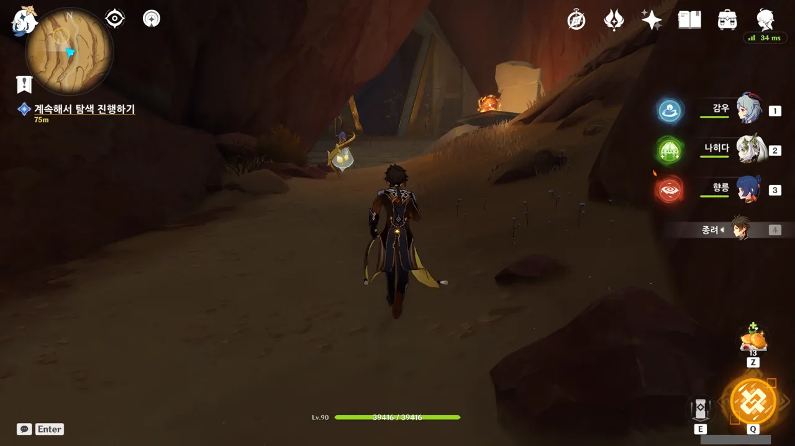

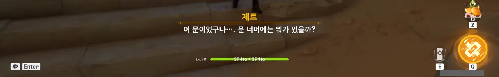

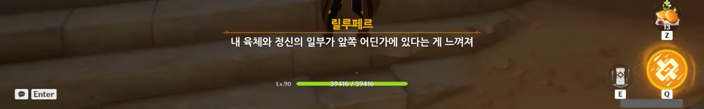

대체 바벨은 이 앞에 릴루페르의 조각이 있다는 걸 어떻게 안 걸까? 정말 릴루페르 말처럼, '외부인'에게서 들은 걸까? 지금까지 파견했던 모든 조사단은 전멸했으니, 여기서 얻은 정보를 바벨은 알 수 없지 않은가.

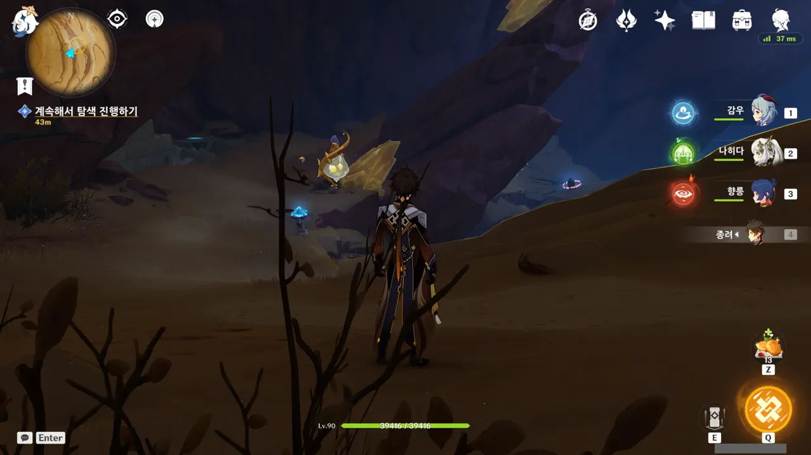

앞은 별 것 없어 보인다. 또 스위치가 하나 있고... 저 왼쪽에 저건 뭐지?

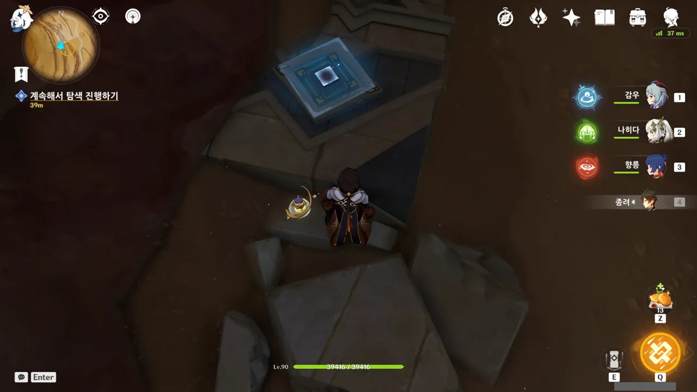

이건 대체 뭐길래 이렇게 반짝이고 있는 걸까?

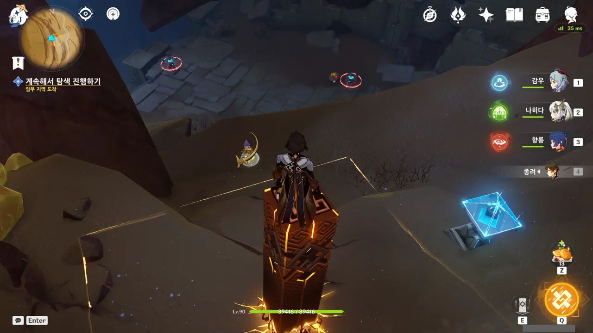

스위치 밑에는 또 다른 스위치 두 개가 더 있다.

분명 저것들을 모두 다 눌러야겠지...?

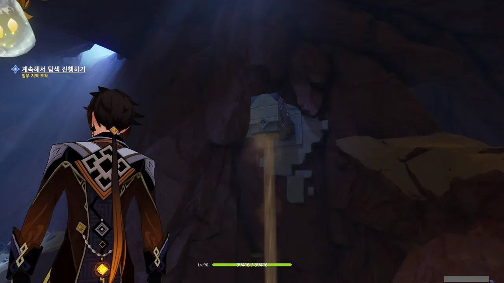

첫 번째 스위치를 누르자, 또 모래가 그릇 안에 가득 찬다.



통로? 무슨 통로? 어디 막힌 통로 같은 건 안 보이는데...





허. "무모한 생각이긴 한데, 시도해 볼 만한 것 같네"가 릴루페르 나름대로 인정해 주는 말이라고 한다.

뭐... 예전처럼 제트를 포함한 사막인들을 잔뜩 비하해 대며 제트를 까내리지 않는 것만 해도 어디냐.





그 와중에 페이몬은 '너네 둘 다 꼬마네 ㅎㅎ'라고 했다가 대번에 제트에게 '그럼 너는 꼬마보다 더한 꼬꼬마겠네?'라고 반격을 당했다.

페이몬은 이렇게 말로 얻어맞는 걸 보는 게 제일 재미있다니까. 불똥이 왜 튀기는! 먼저 이니시를 걸었으니까 불똥이 튀기지!

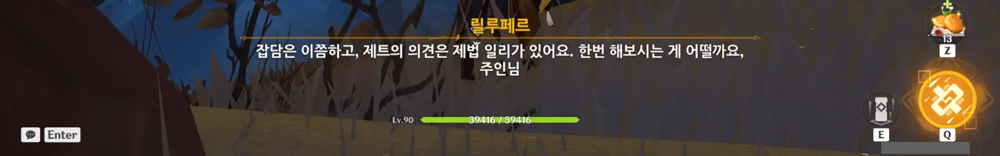

다른 방법이 있는 것도 아니라서, 제트 말대로 스위치를 만져보기로 했다.



이랬던 부품이 양쪽으로 쫙 늘어나더니, 정말로 뭔가 연결되었다.

설마 저게 정말로 파이프였어? 방금 모래가 그 안으로 흐른 거고?



페이몬이 벽 뒤에 뭐가 있는지 살펴보자고 했는데, 저 스위치를 작동시키기 전에 먼저 이 방으로 들어와 퍼즐을 적당히 맞춰두었기 때문에, 페이몬이 뭐라 말할 새도 없이 퍼즐 보상이 나와버렸다.

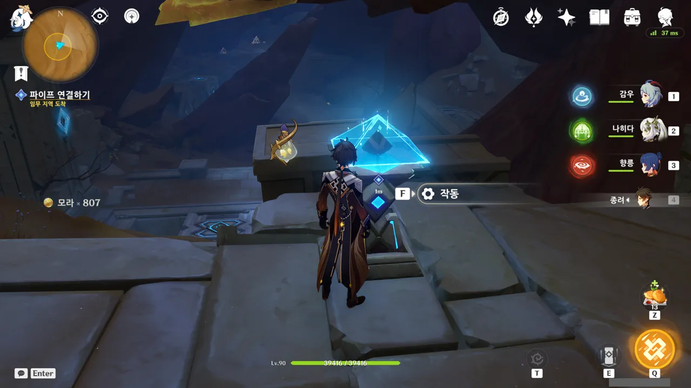

그다음은 이 스위치.

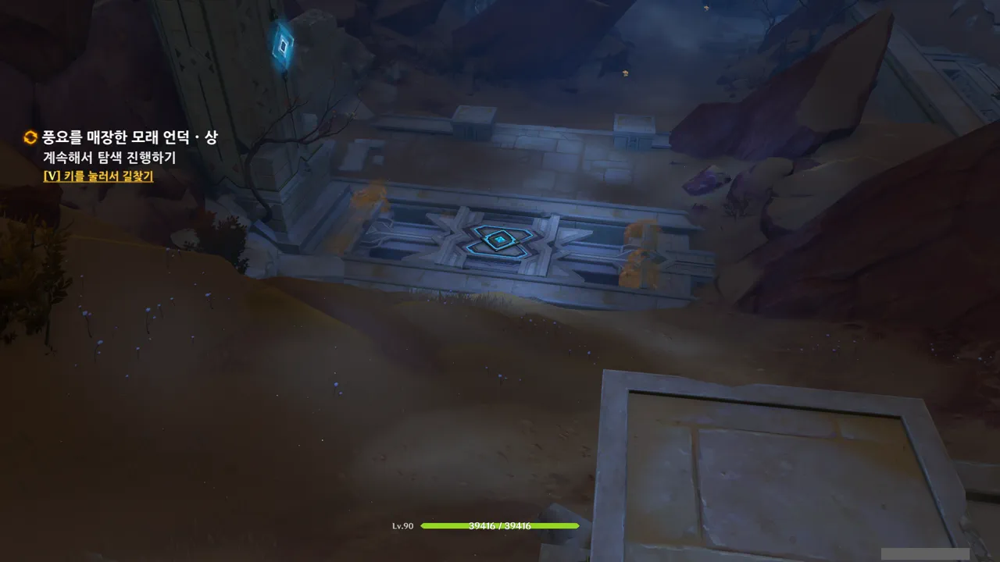

역시나 아까처럼 가운데의 부품이 양 옆으로 펼쳐지며 파이프가 서로 연결된다.

아, 이제 뭐가 어떻게 돌아가는 건지 알겠어.

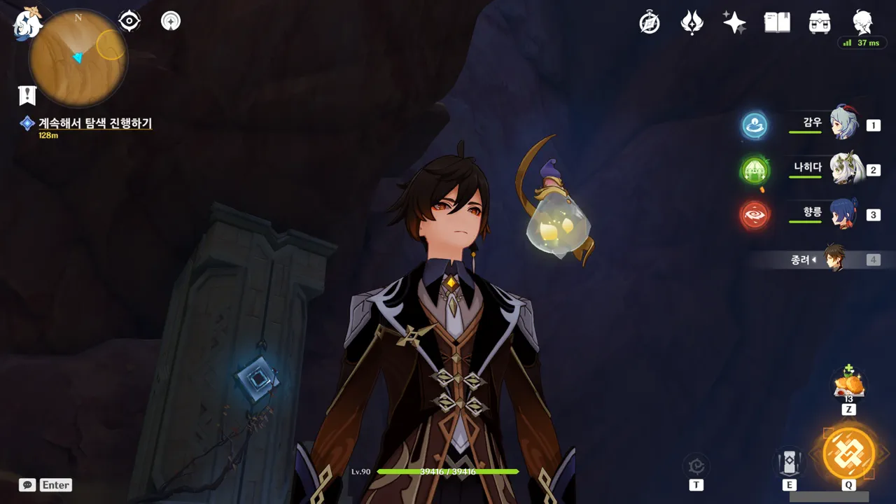

지금 저기 있는 파이프는 안에 모래가 있다는 뜻으로 빛나고 있는데, 정작 연결된 곳에는 모래 그릇도 없고, 그저 돌밖에 없다. 대체 어디로 연결된 걸까?

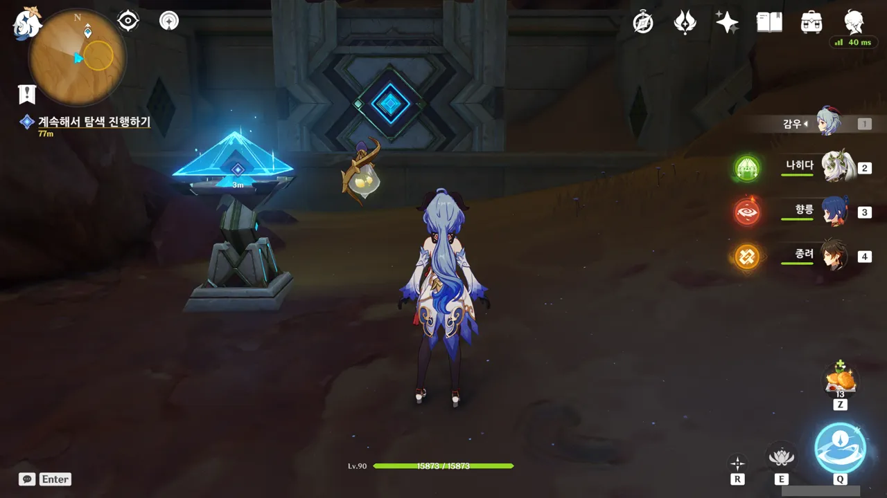

이 스위치를 활성화하면 분명 이 앞에 있는 장치가 양 옆으로 펼쳐지겠지.

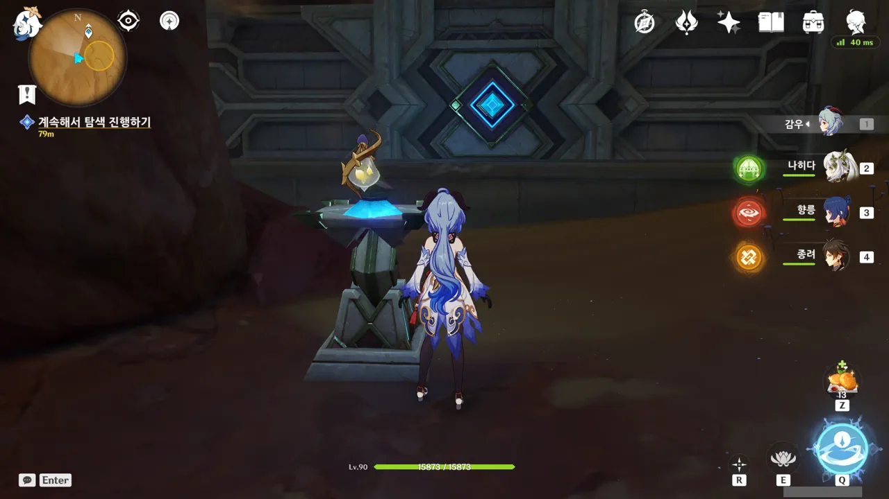

빙고.

아잇, 젠장맞을. 여기서도 권능 업그레이드를 해야 하다니.

더 많은 퍼즐! 더 많은 미로! 더 많은 스트레스!

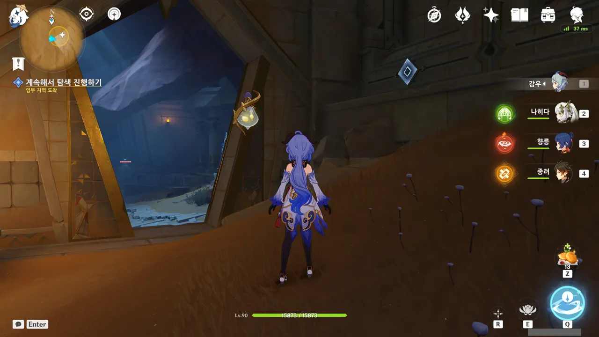

지금까지 연결한 모든 파이프가 이 오른쪽의 파이프와 연결된 것 같다. 그래서 이 문이 열린 거겠지.



아... 이럴 때 그 아란나라가 생각난다.

아란나라 이름이 다 거기서 거기라, 정확한 이름은 기억나지 않지만, 뭔가 촤라락 하니까 모래가 쏴아아 하며 싹 빠지던데.

네가 오늘따라 정말 그립다.

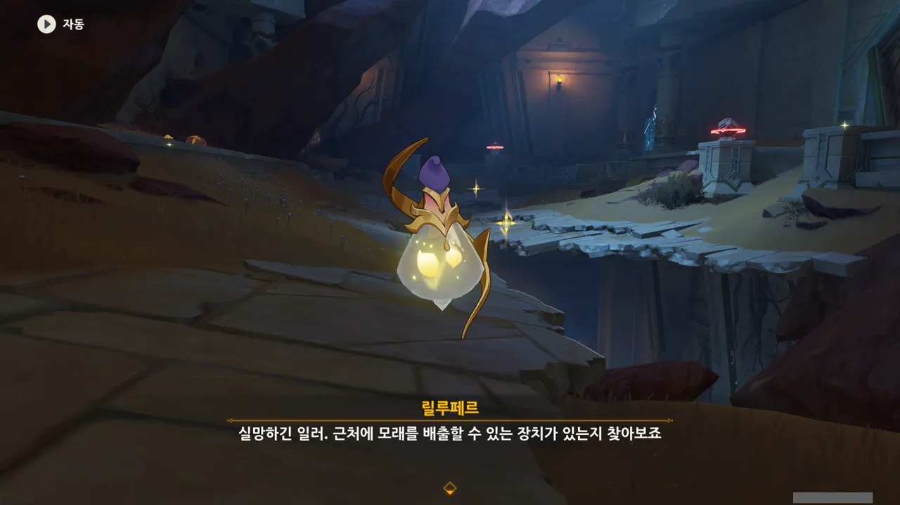

릴루페르의 말에 따르면, 근처에 모래를 배출할 수 있는 장치가 있을 수 있다고 한다.

그건 좀 나중에 찾자.
