모래를 배출할 수 있는 장치라고 해보았자, 결국 다 퍼즐 풀이, 기믹 수행 이런 거다.

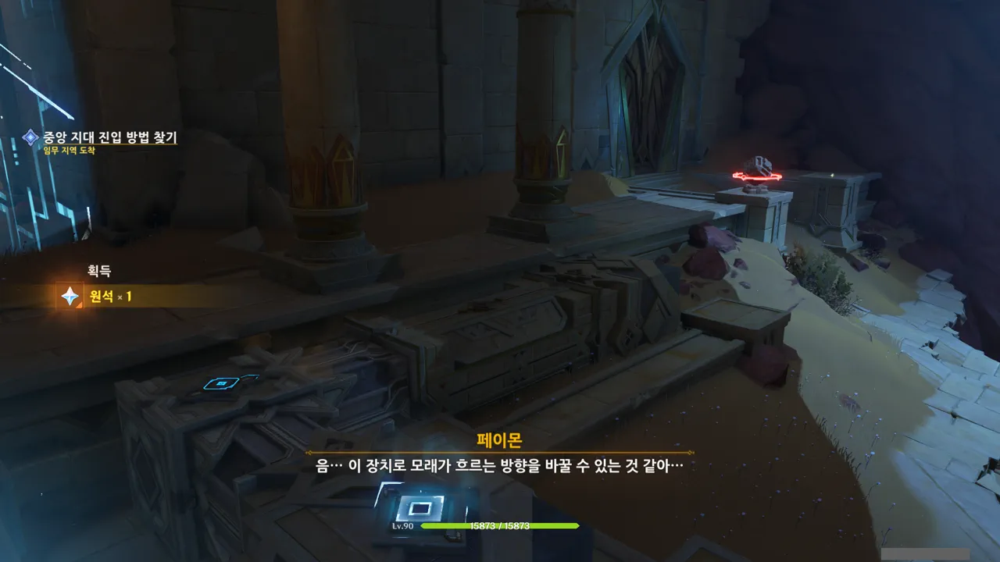

그러니까 이런 것처럼 말이지.

모래가 흐르는 방향을 바꿔야 한다고? 어떻게? 어디에서 어디로 바꿔야 하는데?

뭐, 이런 건 직접 한 번 만져보면 어디가 어떻게 어떤 방식으로 바뀌는지 바로 알 수 있으니 상관없다.



아, 그러니까 아까 조작했던 스위치가 모래의 흐름을 바꿔서 두 장치 중 하나만 활성화시키는 거구나.

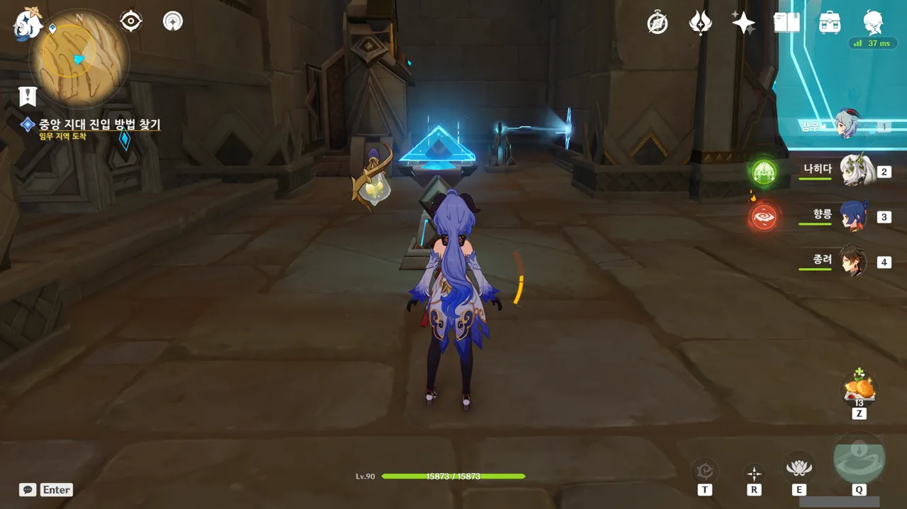

방금 전 잠겨있던 스위치가 이제는 잠금이 풀렸다. 이걸 누르면 분명 옆의 밸브가 열리면서 모래가 흐르겠지.

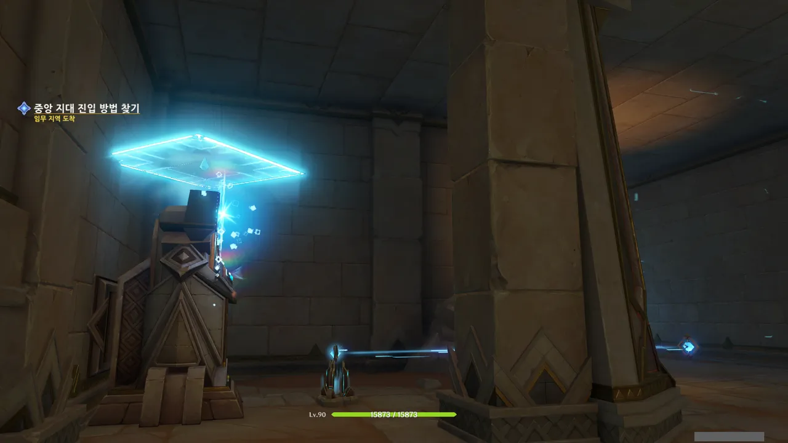

빙고.

열린 곳에는 엘리베이터가 있었다.

이 엘리베이터, 이번 월드 임무를 하며 처음으로 쓰는 엘리베이터 같은데... 사막 유적을 그렇게 많이 돌아다녔는데 이게 처음 쓰는 엘리베이터라니. 뭔가 새롭다.

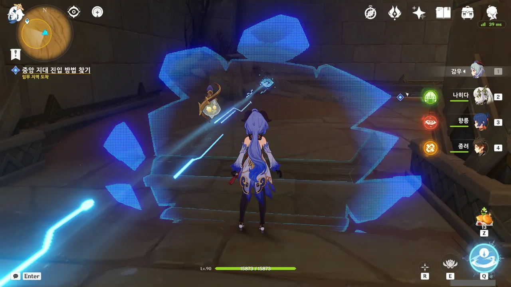

그리고 또 하나 알아챈 것.

이렇게 퍼즐을 풀던 도중 투명화되는 벽은 실제로 사라진 것이 아니라, 그냥 이렇게 투명하게 변할 뿐이었다. 난 이 벽이 정말로 사라지는 건 줄 알았는데...

돌이켜 생각해 보면, 이 기믹은 옛날 황금빛 꿈 월드 임무를 할 때에도 나왔던 기믹이다. 그러니 그 후속 월드 임무인 빌키스의 애가를 할 때에도 이런 기믹이 나올 거라고 생각했어야 했는데...

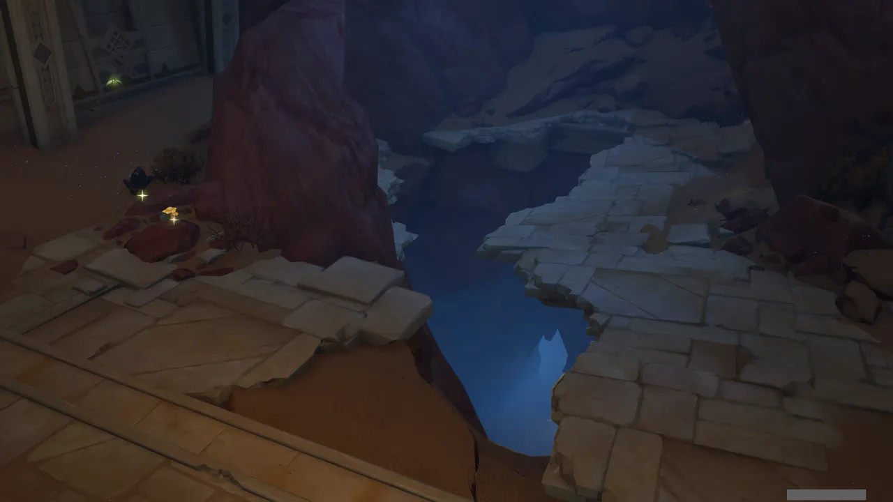

문을 열고 나니, 뭔가 모래가 사라져 있다.

이상하다, 난 분명 모래를 배출하는 것처럼 생긴 장치를 만진 기억이 없는데? 언제 모래가 빠져나간 거지?

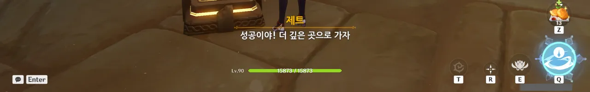

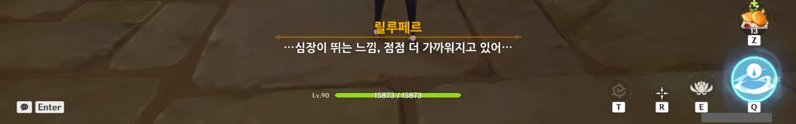

심장이 뛰는 느낌이라... 지니가 자신의 조각을 느낄 때 저런 느낌인가 보다.

아니면 저기 있는 조각이 정말로 릴루페르의 심장 부분일 수도 있고.



아래로 내려가기 전, 위를 한번 보고, 아래로 내려가서 다시 위를 한번 더 봤다.

내려가기 전에 본 위층은 그저 '한 층 내려왔구나' 정도밖에 안 되는 느낌이었는데, 아래로 내려가 위를 다시 보니, 벌써 위가 까마득하게 멀다.

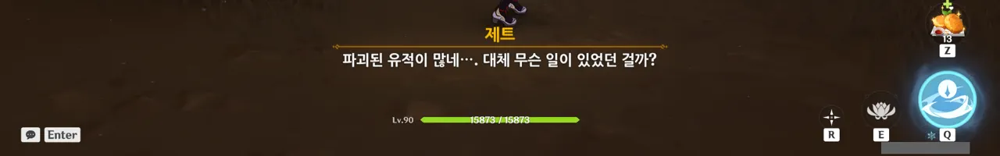

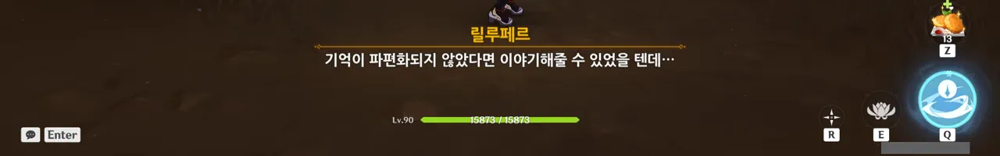

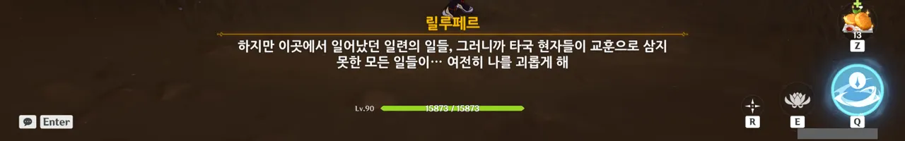

릴루페르가 말한, '타국 현자들이 교훈으로 삼지 못한 일'이 대체 무엇일까 생각해 보았다.

&nbsp;

예전 기록의 내용이 잘은 기억나지 않지만, 구라바드 왕국 말기에 대규모 반란이 있었다.

반란 도중, 왕국의 이전 역사를 기록한 기록물들이 전부 사고로 인해 소실되었을 수도 있고, 반란에 성공한 반란군이 이전 왕조의 잔재라며 이전 왕조의 것들을 계획적으로 파괴했을 수도 있다.

그래서 릴루페르가 구라바드 왕국에서 있었던 일을 타국 현자들이 교훈으로 삼지 못했다고 말한 것이지 않을까? 기록이 소실되었기 때문에 말이다.

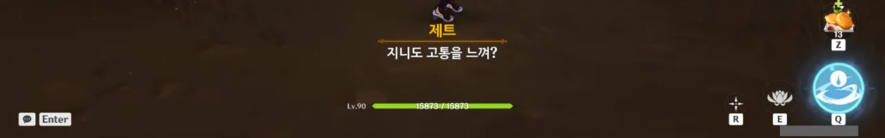

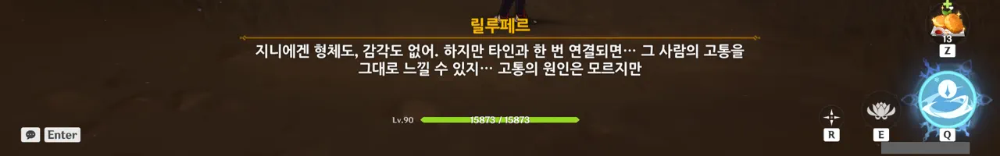

타인과 연결된다는 건 아마 지니가 주인을 선택하고 진명을 바친다는 걸 이야기하는 거겠지?

주인의 고통을 지니 또한 느낀다는 것으로 보아, 진명을 바친다는 건 단순히 진명을 알려주는 것이 아니라, 지니가 주인과 영적으로 연결된다는 것을 의미하는 것일지도 모른다.

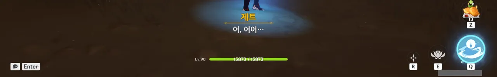

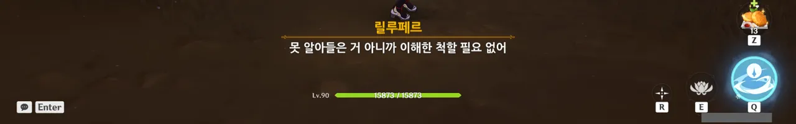

이전보다 제트와 릴루페르가 서로 가까워진 모양이다.

릴루페르도 예전처럼 대놓고 제트에게 까칠하게 대하거나 시비를 걸지 않고, 제트 또한 릴루페르를 그리 거북하게 여기지 않는 것으로 보인다.

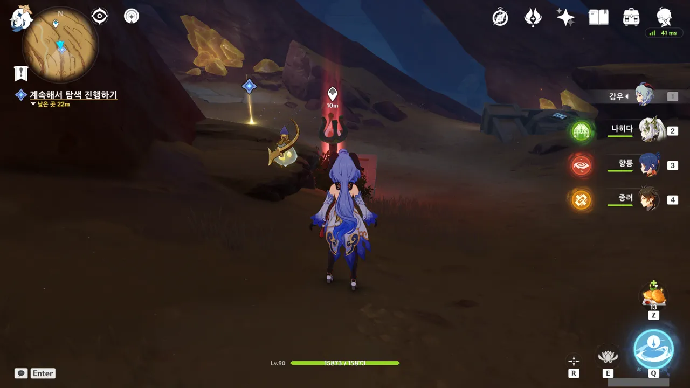

오, 또 다른 워프포인트다.

안 그래도 저번에 진행했던 곳까지 다시 가기 위해 멀리 떨어진 워프포인트에서부터 열심히 달려야만 했었는데, 참 잘 되었다.

이제 덜 뛸 수 있겠네.

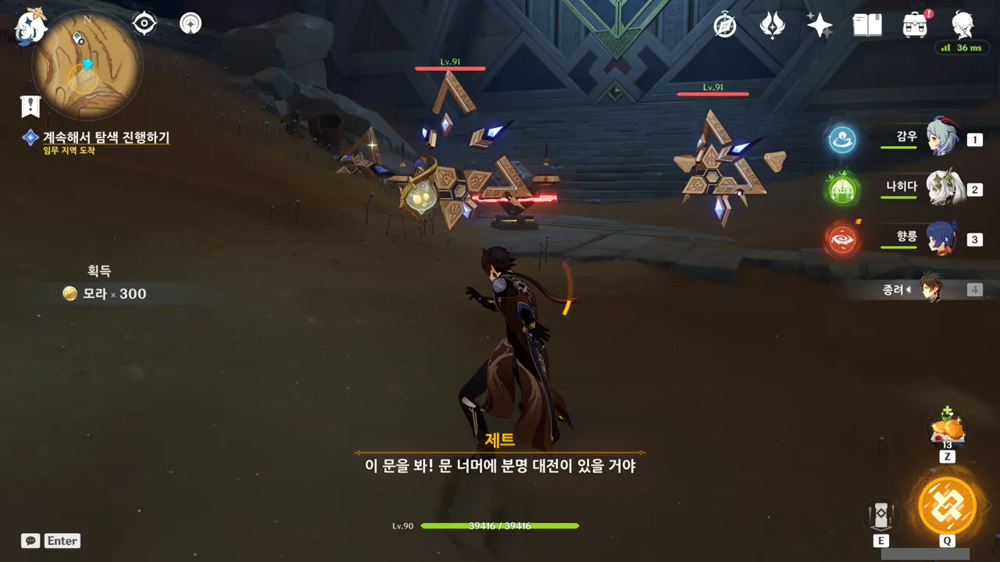

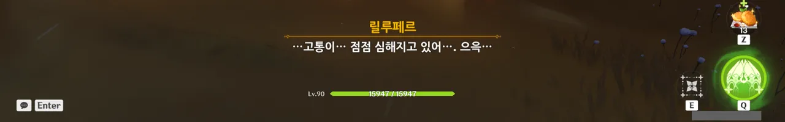

으아아악! 전투하는 데 말하지 마! 진짜 사진 찍는 입장에서 이렇게 전투 도중 대사가 나오면 전투하랴, 사진 찍으랴 아주 정신이 없다고!

&nbsp;

그런데 릴루페르는 왜 갑자기 아파하는 거지? 설마 여행자가 전투 도중에 맞았다고 그러는 거야?

아니, 난 분명 종려 실드를 두르고 싸우고 있는데, 왜?



문을 열자 보이는, 격자가 쳐진 천장. 분명 이 위층으로 갈 수 있을 것처럼 보인다.

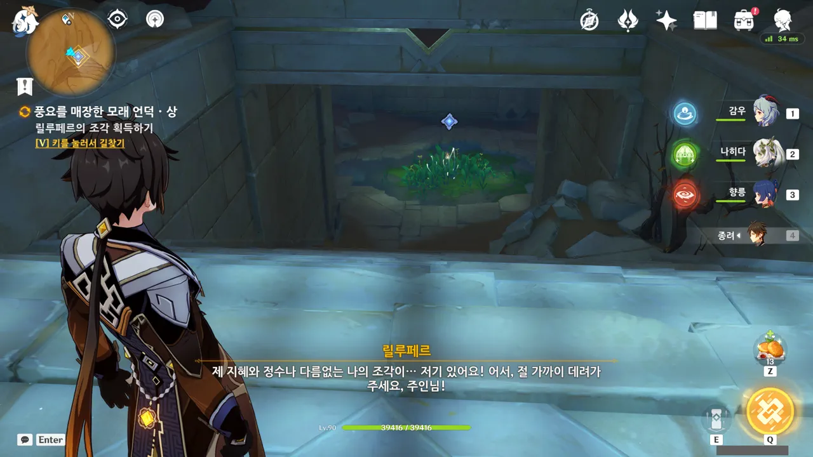

저 조각이 릴루페르의 '지혜'를 담당하는 부분인가 보다.

솔직히, '정수'라는 단어를 보면 스타크래프트가 먼저 떠올라...

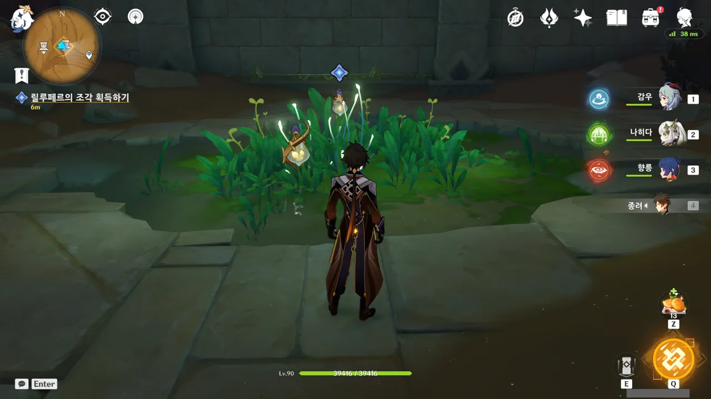

그런데, 가까이 다가가 보니, 그냥 릴루페르 2와 다름이 없다. 둘 다 똑같이 생겼는데?

설마 이걸 얻으면 릴루페르가 둘이 되어 같이 둥둥 떠다니는 건가...



릴루페르의 정수가 릴루페르에게 흡수되면서, 작은 연못에 있던 식물들이 모두 말라죽었다.

이건... 릴루페르의 기억인가? 그런데 왜 여행자가 힘이 빠진다고 느끼는 것일까?

그나저나, 지니의 감정은 극과 극을 달리는 모양이다. 미친 듯이 증오하다가 갑자기 격정적인 사람으로 급변하다니...



릴루페르 역시 여행자가 어떤 걸 느꼈는지 알고 있나 보다. 아까 '주인의 고통 역시 같이 느낀다'라고 했으니, 그럴 만도 하지만.



릴루페르가 자신의 조각을 되찾아, 힘을 어느 정도 회복한 것 같다.



아니, 왜 또 여기서 아자릭이 나와?

난 바벨과 아자릭이 서로 좋아하는 관계라 생각하고 있었는데, 제트가 하는 말을 들어보면 제트 역시 아자릭을 좋아하는 모양이다.

이게 제트의 짝사랑인지, 아자릭이 양다리를 걸치는 건지, 아니면 아자릭이 제트와도 응앗응앗을 한 것인지는 잘 모르겠지만...

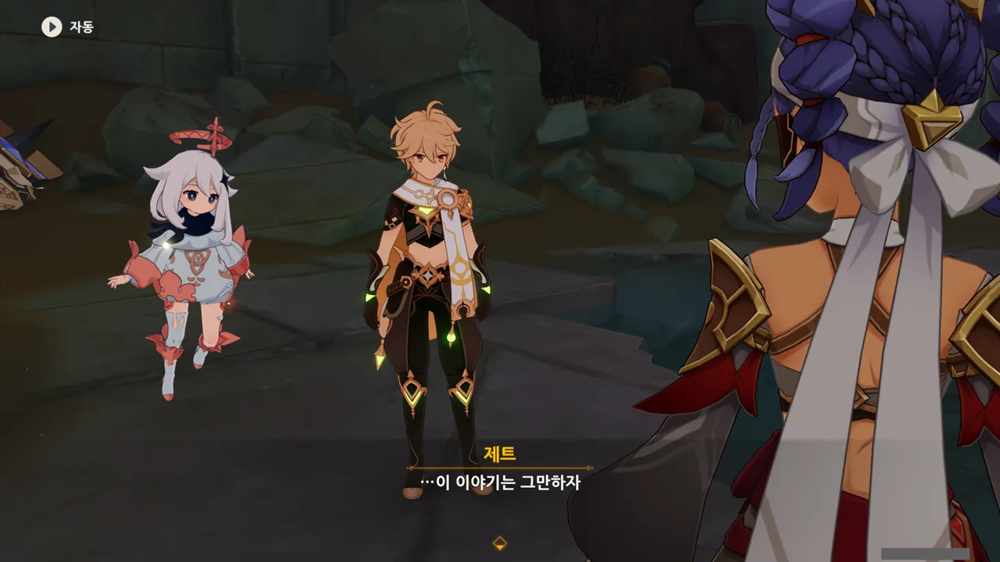

그래, 뭐, 나중에 가면 알 수 있겠지. 누군가가 직접적으로 말을 하거나, 어딘가에 남겨진 쪽지 등을 통해 알 수 있을 것이다.

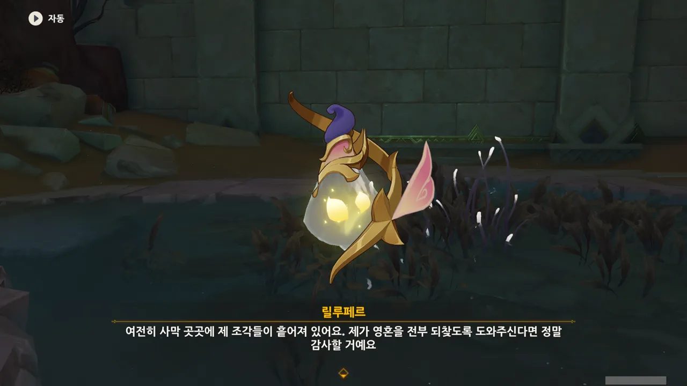

이걸로 모든 릴루페르의 조각을 찾았다 생각했는데, 아직 사막 곳곳에 릴루페르의 다른 조각들이 흩어져 있다고 한다.

사혼의 구슬 조각 모으기도 아니고...



그러니까 이렇게 주변에 작은 오아시스가 있는 곳이 바로 릴루페르의 조각이 있는 곳이라고 한다.

지니를 만든 건 화신(花神)이다. 화신은 죽었다고 들었는데, 사실은 죽은 게 아니라 이렇게 릴루페르의 조각처럼 화신이 영원의 오아시스 어딘가에 잠들어 있는 게 아닐까?





페이몬의 시력이 좋다고? 난 왜 저 말이 하나도 믿기지 않는 걸까? ㅋㅋㅋ...



드디어 릴루페르가 필드에서 쓸모가 있게 되었다.

그런데... 왜 이게 유명석 Mk.2로 보이는 거냐? 으아악, 층암거연 멈춰!



릴루페르의 외형이 바뀌어서 '오, 뭐지?'라고 생각했는데, 도움말을 다시 보니, 릴루페르가 업그레이드될수록 바뀌는 외형 역시 그려져 있었다.

나란 남자, 글만 읽고 그림은 보지 않지. ㅋㅋㅋ...

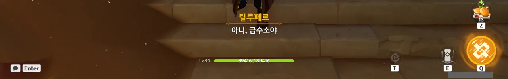

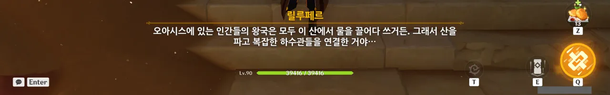

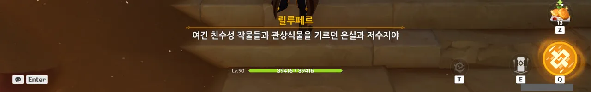

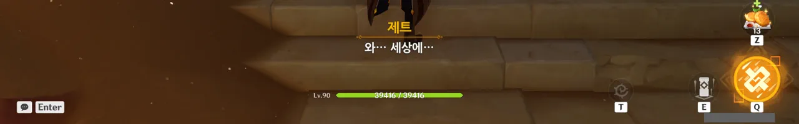

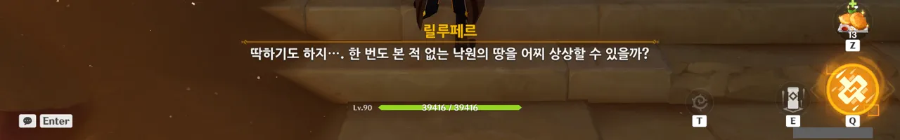

아까 릴루페르의 조각을 주운 곳이 온실과 저수지였다고 한다.

뭔가 그런 느낌이 어느 정도 나긴 하는데, 여기가 옛날 '낙원의 땅'이라고 불렸다는 것이 도저히 상상이 가지 않는다.

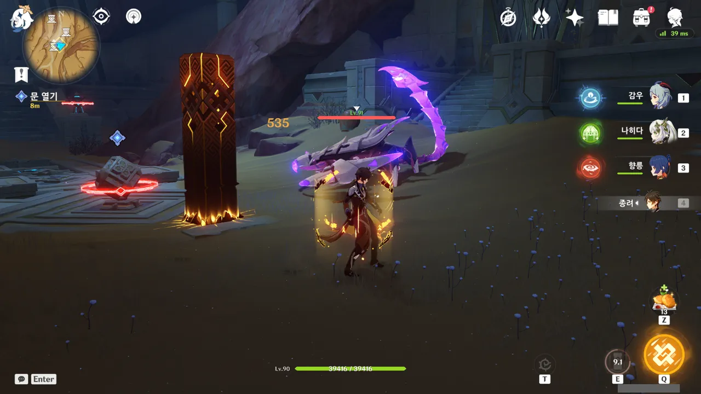

아니, 넌 또 누구세요.

심지어 이걸 잡으면 고기나 뭐 그런 아이템을 줄 줄 알았는데, 아무것도 안 주더라. 대체 뭔데?!

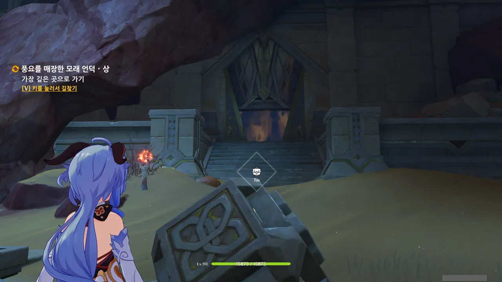

아무튼, 버튼을 누르니 문이 열리고 상자가 나타났다.

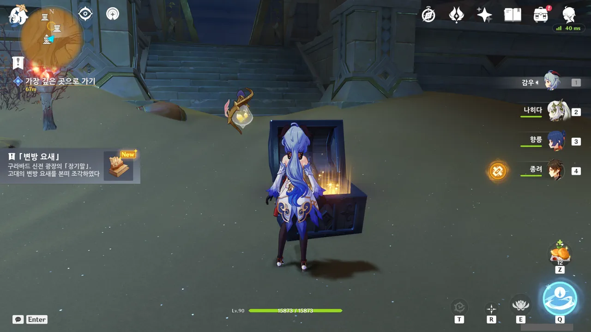

원석이 나오는 상자인 줄 알았는데, 구라바드 신전 장기판에 쓸 수 있는 말을 하나 주는 상자였다.



와, 나 릴루페르가 이런 식으로 농담하는 거, 처음 봐... '모래 가지고 좀 놀까?'라니...

저 스위치를 보고 한 말이겠지?

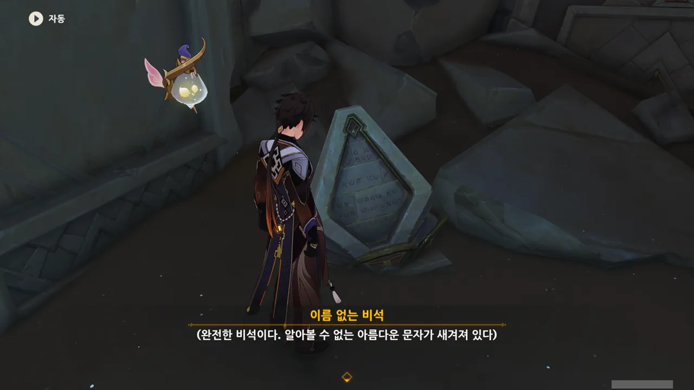

스위치를 누르기 전, 옆에 있던 비석을 조사해 보니 읽을 수 없다고 한다.

저번에도 이런 비석을 하나 봤었는데...

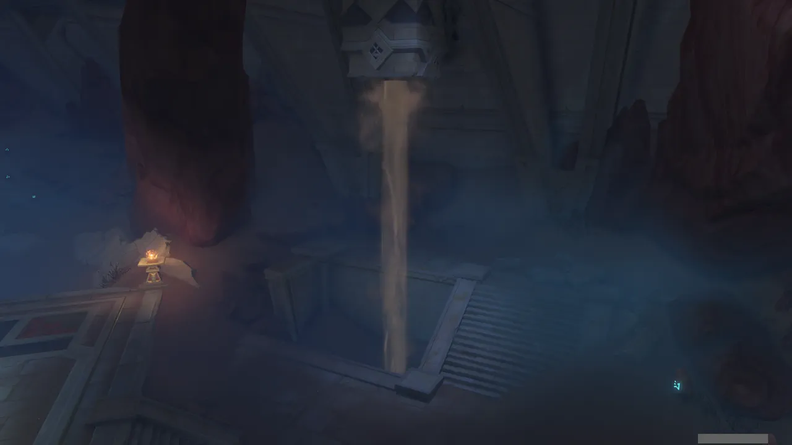

스위치를 누르니, 앞에 있는 광장으로 모래가 흘러내린다.

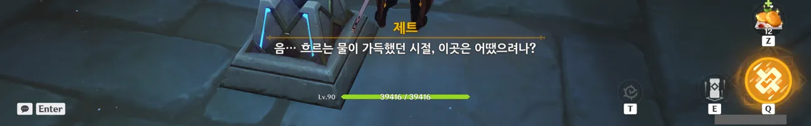

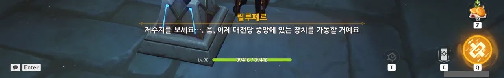

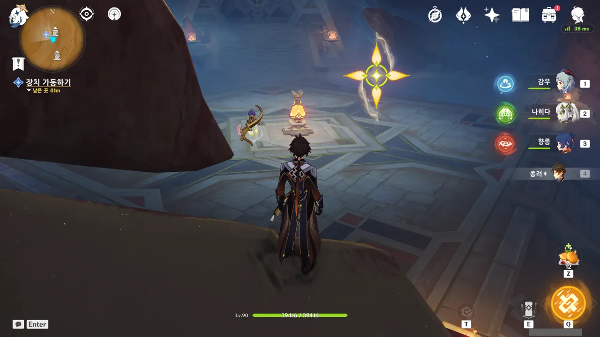

그러니까 이 공간이 '대전당'이라는 곳이고, 이 마름모꼴 제단 주변에는 모래 대신 물이 차있었다는 거잖아. 그렇게 생각하니 좀 이쁜 것 같은데.

'대전장 중앙에 있는 장치'... 저걸 말하는 거겠지?

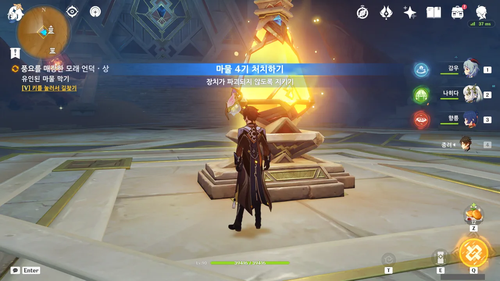

아니, 왜 여기서 지맥 제압석 디펜스를?

열심히 디펜스를 하던 도중 릴루페르가 한 말에 따르면, 저 마물들은 릴루페르에 유인되어 온 거라고 하더라.

이전에 누구였더라, 아자릭이었나 바벨이 한 말이 틀린 말은 아니었네.



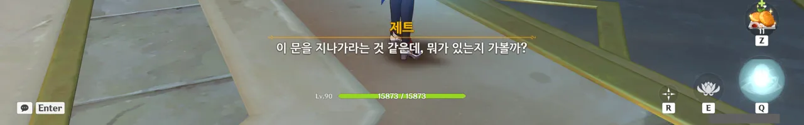

가운데의 장치에서 노란색 빛이 흘러나오더니, 문이 열리고 빛이 그 문 밖으로 흘러나간다.

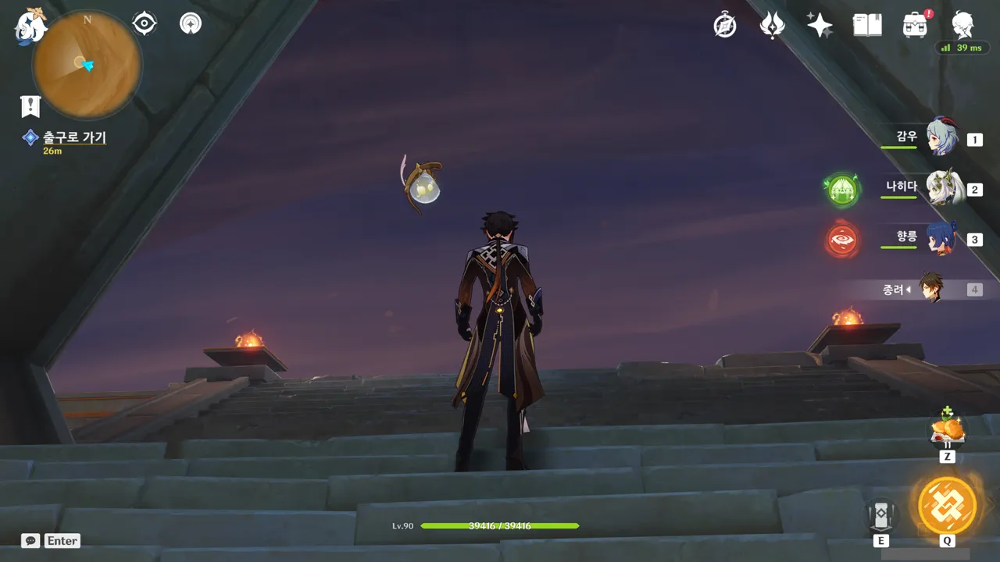

그런데 여기... 바람이 많이 부는데, 나가도 괜찮은 거 맞나?

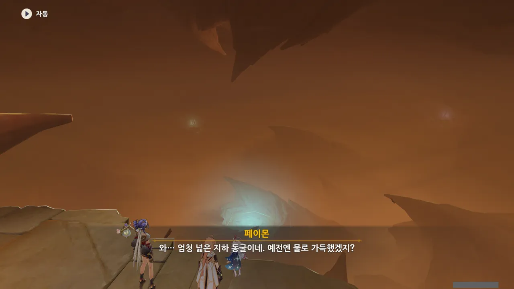

바람 때문에 문 밖으로 나갈 수 없다는 전개를 기대했지만, 아무런 문제 없이 문 밖으로 나갈 수 있었다.

문 밖에는 엄청나게 넓은 지하 동굴이 있었다. 여기도 분명 아까 그 구라바드 장기판처럼 무언가 기믹을 수행하는 곳일까?



이 장소는 영원의 오아시스에 에너지를 공급하는 장치라고 한다. 그 영원이라는 것도 그걸 유지하기 위해서 별도의 에너지가 필요로 하나 보네.

'큰 주인(적왕)의 수정잔'은 화신(花神)과 이별한 후, 그녀가 안치된 영원의 오아시스를 유지하기 위해 설치한, 이 장치의 핵심 부품으로 보인다.



다만 그때가 언제였는지는 릴루페르의 기억이 아직 온전치 않아 잘 모르겠다고 한다.



음, 그래. 그럴 것 같더라. 이런 곳에 퍼즐이나 기믹이 없으면 오히려 심심하겠지.

가운데에 있는 저 수정잔에 가기 위해서는 다른 장치 두 개를 더 해제해야 하는 것 같다.

그러니까 아까 제단 위의 노란색 장치를 포함해서 세 개의 장치를 해제해야 한다는 소리지.

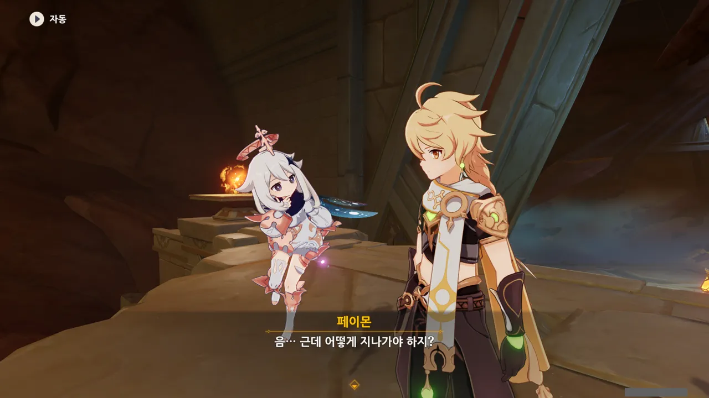

그러게 말이다. 당장 보이는 저 수정잔까지의 거리가 꽤나 까마득해 보이는데. 바람의 날개를 쓴다고 해도 닿을 수 있을 것 같지 않다.



여기서 다시 지상으로 돌아가야 한다는 것이 그리 마음에 들지는 않지만, 그래도 지금으로서는 별 다른 방법이 없다. 저 두 곳으로 갈 다른 방법을 찾아야겠지.



혹시 주변에 뭔가 먹을 것이 있을까 해서 곧바로 지상으로 올라가지 않고 주변을 좀 둘러보았는데, 아무것도 없었다. 정말 아무것도 없더라.

