

흠... 뭔가 알 것 같기도 하고, 모를 것 같기도 하다.

같은 공기인데, 집 안에서 느끼는 공기와 바깥에서 느끼는 공기가 좀 다르긴 하다. 바깥의 공기가 더 상쾌한 느낌. 하지만 미세먼지가 가득한 날이라면 바깥의 공기가 더 탁하다는 느낌이 확 들거든...

사막은 모래폭풍이 자주 부니까, 공기가 탁하지 않을까?



내가 저번에 분명 말했지. 유적에서 나왔는데 아자릭이 우릴 기다리고 있으면 그건 아자릭이 우릴 배신한 게 분명하다고.

거 봐라. 아자릭 옆에 있는 저 두 NPC, 딱 봐도 여차하면 여행자를 쓱싹 해버리려고 데려온 어깨가 아닌가.



릴루페르 역시 말을 아끼고 있다. 이거... 굉장히 불안한데.



허, 탐사와 정찰이라니. 핑계치곤 굉장히 빈약하네.

페이몬이 말했다시피, 이 드넓은 사막에서 같은 사람과 두 번씩이나 마주친다는 건 도저히 말이 되지 않는다.



하... 이거 아무리 봐도 불안한데...





릴루페르가 '그거 말하지 말라'라고 하려는데, 제트가 먼저 냉큼 '당연하지!'라고 대답해 버렸다.

제트 이 녀석, 아자릭에게 아주 콩깍지가 다 꼈네... 이러고도 아자릭이 전혀 의심스럽지 않은 모양이다.



어휴... 딱 봐도 구린내가 풀풀 풍기는 아자릭의 제안을 좋다고 덥석 받아 드는 제트.

그래도 애써 긍정적으로 생각하자면, 아까 그 어깨들이 보이지 않으니, 지금 당장은 안전하다고 할 수 있을 것이다. 아마도... 근거는 없지만...

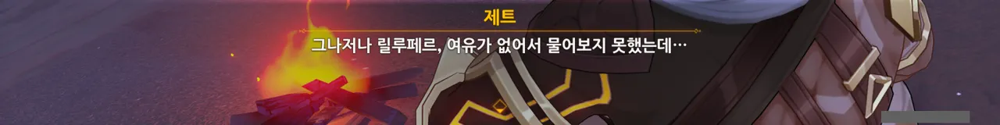

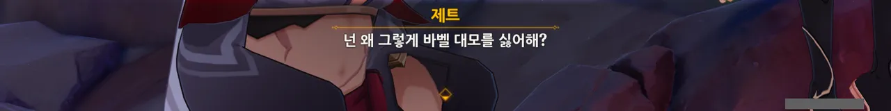

나 역시 바벨이 마음에 들지 않는다.

다른 의심은 다 제쳐두더라도, 부족의 온갖 더러운 뒤치다꺼리를 제트에게 다 떠맡기지 않았는가. 이것만으로도 이미 바벨은 비호감의 영역에 들어선 것이다.

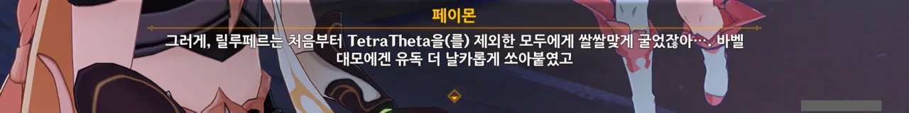

그래, 그랬었지. 릴루페르는 여행자를 제외한 모두에게 재수 없게 굴었었지.

지금은 제트와 그럭저럭 잘 지내고 있지만, 여전히 다른 사람들에겐 날을 잔뜩 세우고 있다.

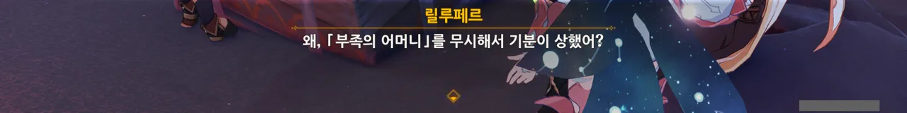

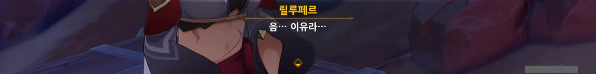

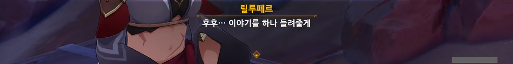

아니, 바벨을 싫어하는 이유를 들려달라니까. 갑자기 옛날이야기를 꺼내는 릴루페르.

내가 예전이 이 이야기를 어디서 들은 적이 있었나? 왜 이 이야기를 예전에 한 번 본 것 같지?

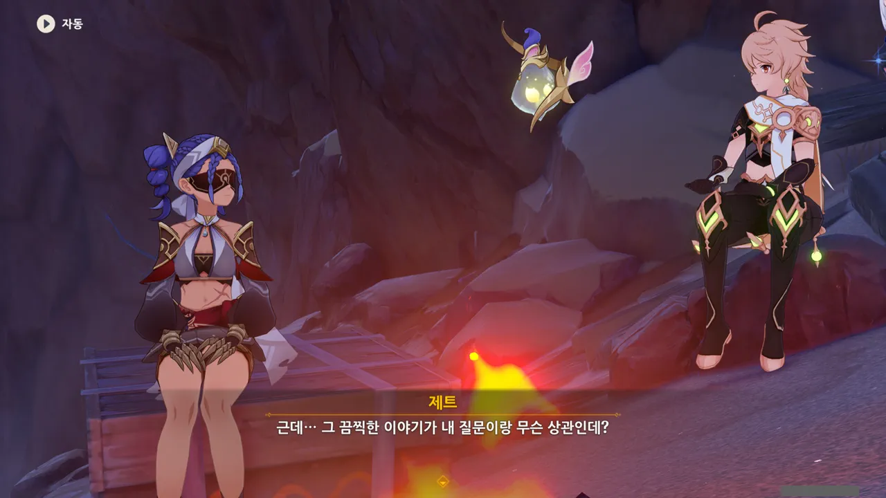

그래. 릴루페르가 바벨을 싫어하는 이유를 알려달라니까 왜 갑자기 옛날이야기를 한 건지 나도 궁금한데.

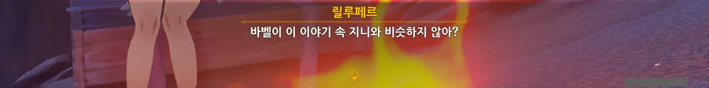

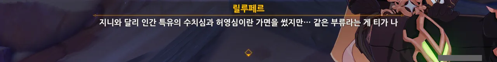

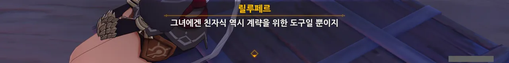

그러니까 릴루페르가 보기에, 이야기 속의 지니나 바벨이나 모두 자신의 계략을 위해서라면 친자식이라도 단 한 치의 망설임 없이 소모해 버릴 인물이라는 것이다.

음, 나도 바벨이라면 충분히 그럴 수 있을 것처럼 보여.

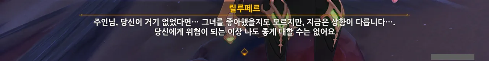

이건 좀 많이 의외인데. 만약 릴루페르가 여행자가 아닌 바벨을 먼저 만났더라면, 바벨을 좋아했을지도 모른다고 한다.

릴루페르는 이미 바벨이 여행자에게 위협적인 인물이라 생각하는 모양이다. 물증이 없어서 그렇지, 바벨은 이미 충분히 의심스럽긴 하다.

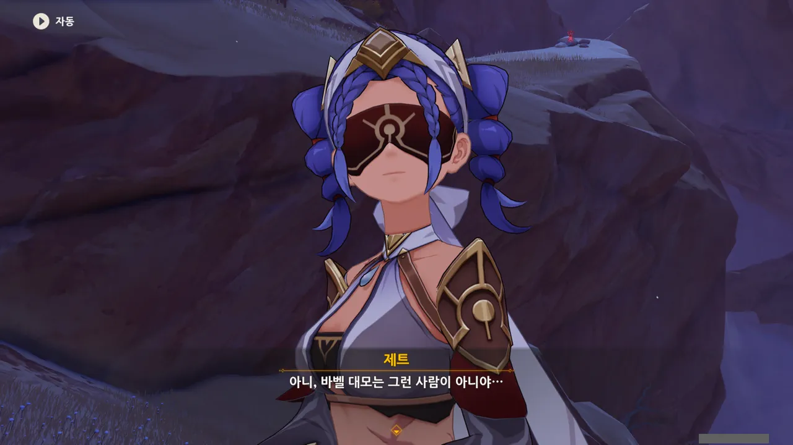

안타깝게도 제트는 이미 바벨에게 잔뜩 가스라이팅이라도 당한 것인지, 바벨이 그럴 리 없다고 한다.

바벨이 시킨 온갖 더러운 일을 했으면서도 바벨이 어떤 사람인지 아직 잘 모르는 모양이네.

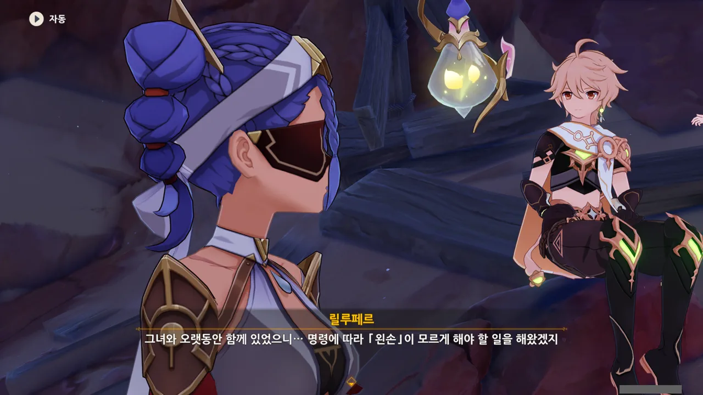

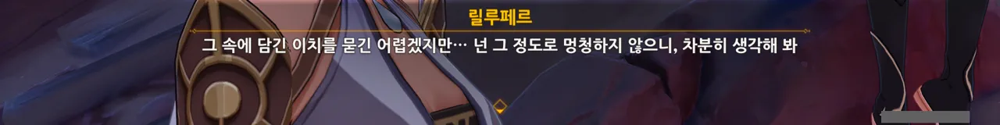

여기에도 '오른손이 한 일을 왼손이 모르게 하라'와 같은 격언이 있는 걸까?

릴루페르는 마지막으로 제트에게 '넌 그렇게 멍청하지 않으니, 내 말을 잘 생각해 봐'라는 말을 남긴다.





> 그건 네가 비겁한 노예라서야!

릴루페르가 보기에는 아자릭 역시 바벨과 비슷한 부류로 보였나 보다. 릴루페르의 말을 그냥 흘려들으라고 아자릭이 말하자마자 곧바로 대차게 쏘아붙인다.

아자릭을 '비겁한 노예'라고 한 걸 보아, 아자릭 역시 바벨과는 조금 다른, '상종 못할 것'인지도 모른다.



글쎄... 과연 그럴까? 오히려 학을 뗐으면 더 뗄 것 같은데. '동족 혐오'라는 말이 괜히 있는 게 아니잖은가.





이야기를 더 끌어봤자 좋을 것 없으니, 아자릭이 화제를 돌린다.



지금 되새겨보니, 이번 탐사 역시 그리 녹록지는 않았다.

바벨이 예전에도 탐사대를 여럿 보내놓고 우리에게 일언반구 하지 않은 증거를 확인했고, 모래 파이프라는 새로운 퍼즐도 발견했다. 마지막에는 도대체 어떻게 접근해야 할지 감조차 잡히지 않는 새로운 퍼즐 요소를 찾아냈고...



> 그 수정잔, 비싼 거야?

'수정잔'이라는 단어를 듣고 눈에 불이 켜진 페이몬. 페이몬은 먹을 것과 돈이면 아주 사족을 못쓴다니까...

글쎄? 거기 가봐야 알겠지. '수정잔'이라는 단어가 은유적인 건지, 아니면 직접적인 건지는 직접 가봐야 알 수 있을 테니 말이다.

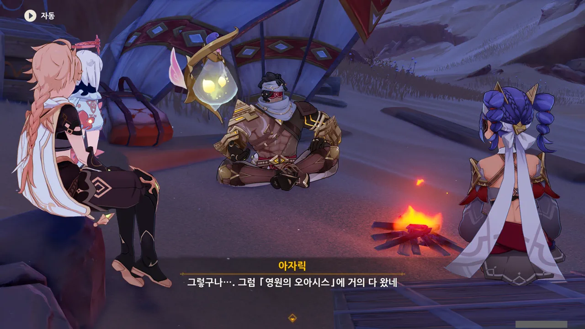

> 그렇구나... 그럼 「영원의 오아시스」에 거의 다 왔네.

아자릭이 우릴 배신했다고 생각하는지라, 저 말이 '좋아, 다음에는 정말로 배신해 주마'로밖에 들리지 않는다.

배신할 거면 빨리 좀 하던가. 애태우지 말고...

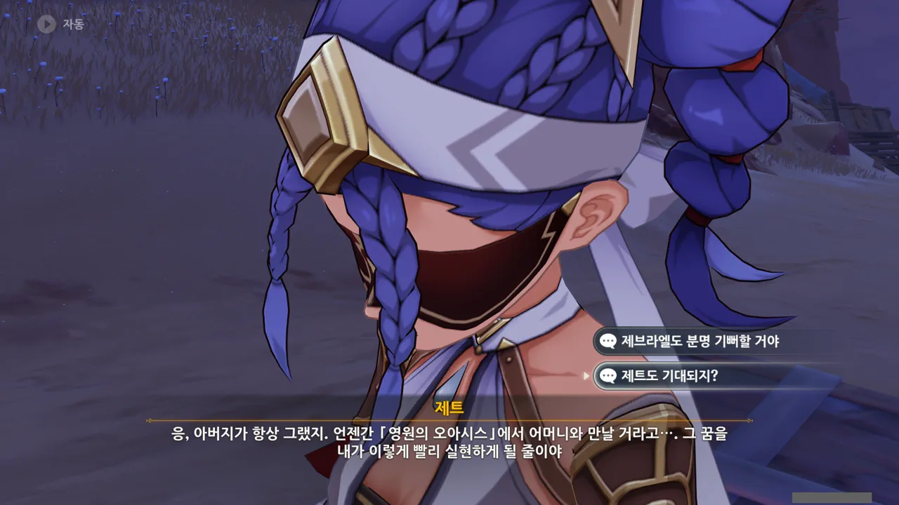

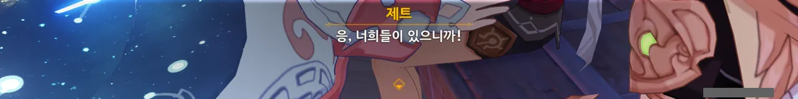

어... 제브라엘이 그렇게 말했던가? 황금빛 꿈 임무를 한 지 너무 오래되어 전혀 기억이 나지 않는다.

정말 제브라엘이 그런 말을 했어도, 그때라면 「영원의 오아시스」가 저승에 대한 은유적인 표현일 거라 생각해서 넘겼을 것 같다. 그렇지 않고서야 전혀 기억이 나지 않을 리 없잖은가.

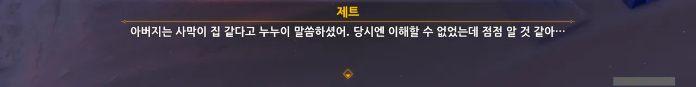

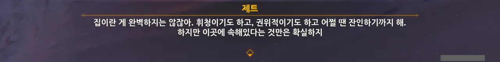

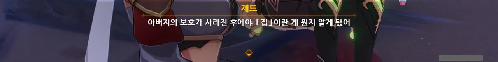

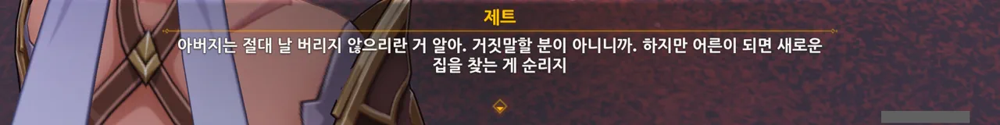

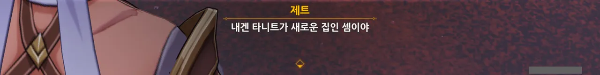

제트가 큰 깨달음을 얻었다.

그래. '집', '고향'... 다 그런 의미이지...





제트가 여행자와 있을 때에만 마음이 놓인다고 한다. 제트에겐 타니트 부족 역시 집처럼 편안한 장소가 아니었단 말이지. 하기사, 혼혈이라며 온갖 더러운 일만을 시키는 곳을 어떻게 집처럼 여길 수 있을까.

그러니까, 방금 제트가 "내겐 타니트가 새로운 집인 셈이야"라고 말했지만, 사실 타니트 부족 역시 제트에게 새로운 집이 되지 못했다는 의미이다.

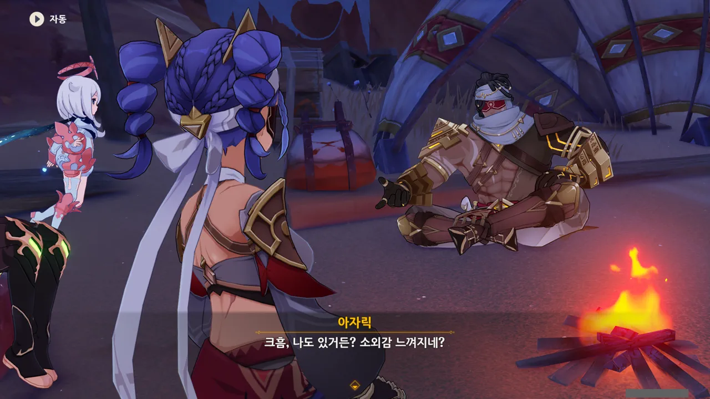

아, 아저씨는 좀 빠지쇼. 배신자(진) 주제에...



와... 이건 나도 좀 섬뜩한데.

타니트 부족에 처음 왔을 때, 제트는 울지도 않고 말도 하지 않았다고 한다. 분명 아버지를 잃은 충격 때문에 그랬던 거겠지만, 저 말은 아무런 감정을 외부에 표출하지 않았다는 말 아닌가. 마치 감정이 죽어버린 것처럼...





싸움에서 지던, 남에게 얻어터지던, 절대 울지 않고 꾹 참고 있다가, 한번 꼭지가 열리면 펑하고 터진다라...

제트가 마음고생이 참 심했구나. 그래도 지금은 이렇게 화도 내며 감정 표현을 하는 모습을 보니 다행이다.

&nbsp;

의젓하다는 건 너무 일찍 어른이 되어버렸다는 말이기도 하다.





제트에게는 그때 일이 흑역사인 듯 하지만...

아자릭이 제트를 잘 챙겨주어서 다행이다. 아까도 말했다시피, 지금 와서는 그게 다 호감작을 위한 빌드업이 아닌가 하는 의심이 들어서 문제지.



가물가물한 기억을 애써 붙잡아 돌이켜보면, 제트의 어머니는 아카데미아 학자였던 것 같다.



그리고 제브라엘이 제트에게 불러주던 고전 동요에는 적왕의 유산을 발동시키는 힘이 있었지...





제트가 말은 저렇게 해도, 어떤 느낌인지 충분히 알 것 같다.

아버지를, 그리고 어머니를 추억할 수단 중 남은 거라곤 저 노래 하나밖에 없는데, 그 노래마저도 이젠 기억 속에서 희미해져 이제는 음정조차 제대로 잡지 못하고 있다.

나 역시 비슷한 경험이 있기 때문에, 어떤 느낌인지 잘 알 것 같다.



오늘 하루의 뒷맛은 씁쓸했다. 

***



오늘은 아자릭이 '이번에도 오아시스는 너희들끼리 찾아봐'라며 떠나지 않는다. 오히려 보여줄 것이 있다며, 어디론가 따라오라고 한다.

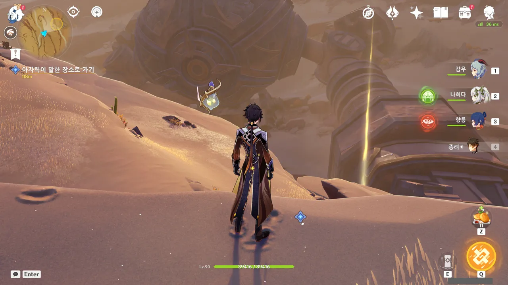

아니, 진짜, 제발, 좀.

수메르 우림 지역에서도 하나 봤고, 남부 사막 지역에서도 하나 봤는데, 이젠 북부 사막 지역에서도 하나가 나오네.

이쯤 되면 수메르의 아이콘은 저 유적 거상이 아닐까?



정작 나는 시큰둥한데 말이지...



> 우리더러 저 안에 들어가서 놀라는 건 아니겠지?

ㅋㅋㅋㅋㅋㅋ 아, 정말 웃겨 죽겠네. 우리가 무슨 애들도 아니고, 저 안에서 놀라니 ㅋㅋㅋㅋㅋㅋ

아자릭은 이 유적 거상을 이용해 위험한 모래 지대를 건너갈 생각인가 보다.

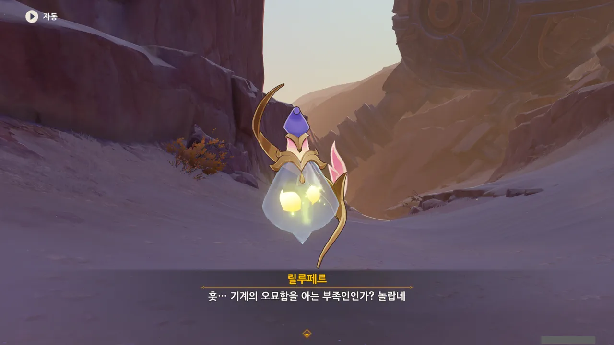

릴루페르 역시 '기계의 오묘함을 아는 부족인'이라며 놀라움을 금치 못한다.

나도 그렇긴 해. 그냥 걸어갈 줄 알았거든.



그런데 아자릭은 저 유적 거상 가동 방법을 어떻게 알아낸 걸까?

아드라피가 남긴 도면에 유적 거상의 구조가 기록되어 있었으며, 기본적인 지식만 있다면 쉽게 알아볼 수 있다고 말하지만... 그게 정말로 그럴 리 없잖은가.

당장 수메르 우림 지역에서 만났던, 유적 거상을 연구하던 아카데미아 학자조차 문헌 기록에 남은 정보를 토대로 유적 거상의 가동 방법을 추측할 뿐이었다.

아카데미아 학자 정도나 되어야 접근 가능한 정보를 토대로, 아카데미아 학자조차 추측할 수밖에 없었던 유적 거상의 작동 방법이 '기본적인 지식만 있으면 쉽게 알아볼 수 있다'라...

분명 아드라피는 몰라도, 아자릭은 우인단과 거래했을 것이다.



아, 그래. 그 학자 이름이 쟈자리였지, 참.

그나저나 유적 거상을 만져본 적이 있다고 아자릭에게 말해도 될지 잘 모르겠다.



유적 거상이 전쟁 기계는 맞지. 그런데 대체 왜 여기에 온 것인지는 잘 모르겠다.

500년 전이면 켄리아가 멸망했을 때인데, 그 당시 켄리아는 일곱 신에게 대대적으로 침공당하던 입장이라, 다른 나라에 쳐들어갈 여력이 없었을 게 분명하거든.

그리고 여태껏 발견한, 유적 거상 내부의 문서의 내용을 보면, 유적 거상이 수메르에 온 건 침공이 아니라 다른 목적이 있었던 것으로 보인다.

그게 뭐였는지는 잘 모르지만.

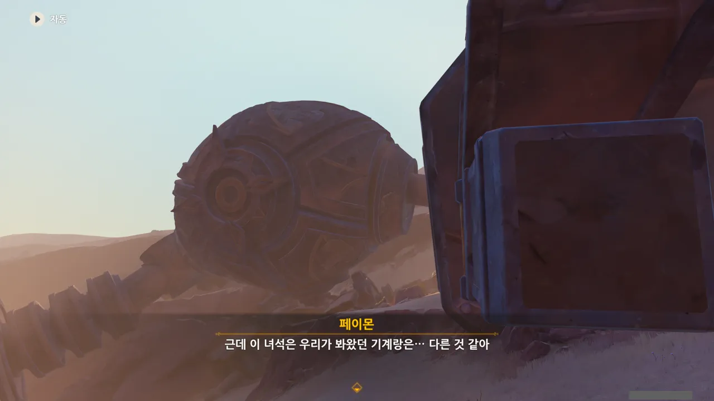

지금껏 봐온 유적 거상과 이 유적 거상이 다르다고? 어디가?

아, 설마 유적 거상 머리에 이끼나 풀 같은 것이 없다는 말인가?

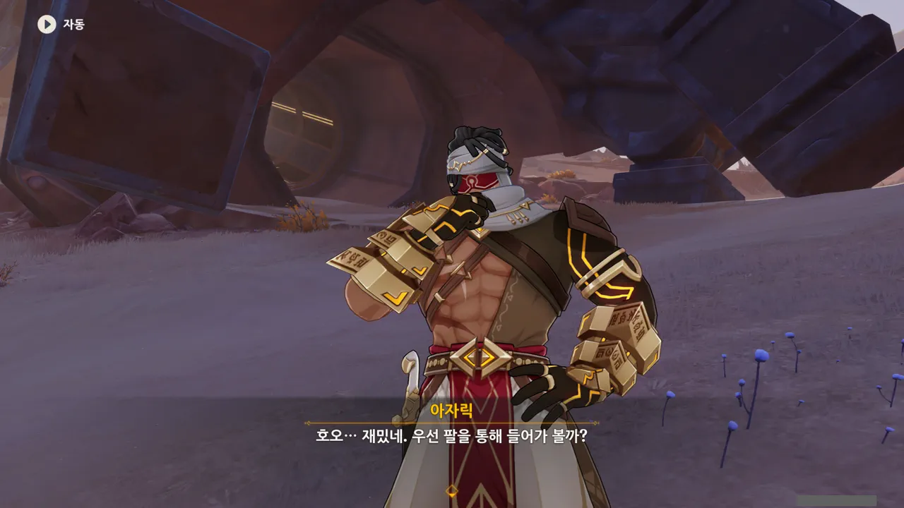

어째 유적 거상은 출입구가 죄다 팔이네. 난 여태 관리용 통로로 들어간다고 생각하고 있었는데, 어쩌면 유적 거상은 정말 출입 통로가 팔에 있는 걸지도 모른다.

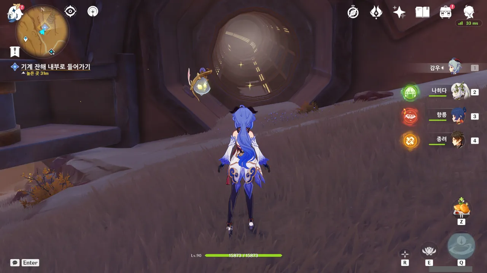

그래, 이렇게 보니까 정말 출입 목적의 터널처럼 보인다.

&nbsp;

저렇게 생긴 터널을 보니, 옛날 어릴 적 친구 집에서 본 로봇 장난감이 생각나네.

> 초고속 열차처럼 생긴 파츠가 몸통 파츠의 어깨 부분을 관통해 들어가 반대편으로 튀어나온 후, 양쪽 끝에서 팔이 튀어나오는 구조
{.bq}

그 장난감에 대해 기억하는 건 저게 전부였다.

나중에 한참 시간이 지난 후, 우연찮게 알게 된 그 로봇의 이름은 '가오가이가'였다. 그 친구네 집에는 '가오가이가' 말고도 '마이트가인'도 있었던 것 같은데, 확실하진 않다. 그때 난 저 합체 기믹만 신기해하고, 그 외의 것에는 전혀 관심을 가지지 않았거든...

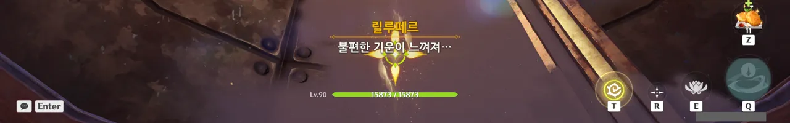

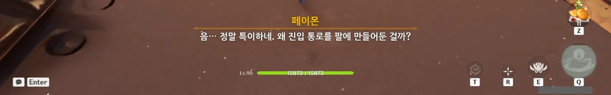

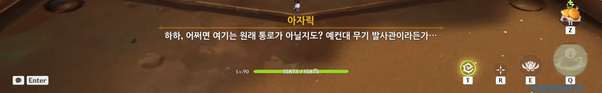

릴루페르는 이 유적 거상에서 불편한 기운이 느껴진다며, 굉장히 거북해한다. 유적 거상이 무슨 에너지로 움직이는 거였더라?

그냥 짐작이다만, 이 유적 거상은 물리적인 탄환을 발사할 것 같지는 않다. 기껏해야 유적 거상의 얼굴에서 나오는 에너지 빔 정도가 전부겠지.

그러면 팔 끝, 몸통 쪽에 있는 문은 방폭문 정도가 되려나.

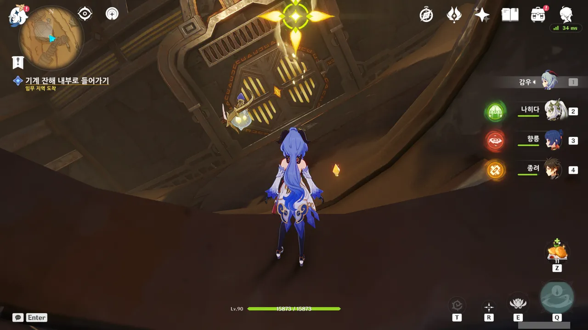

음... 잠긴 문과 바닥에 아무렇게나 널브러진 에너지원... 이걸 모아서 문을 여는 거겠지, 저번처럼.

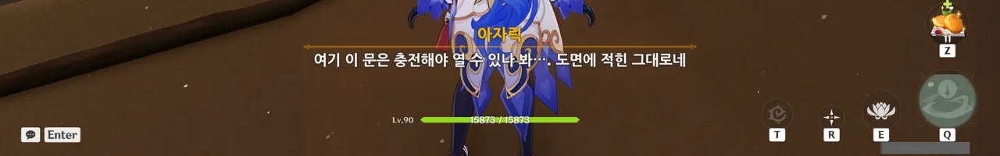

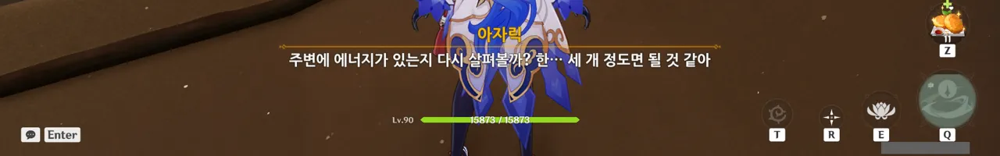

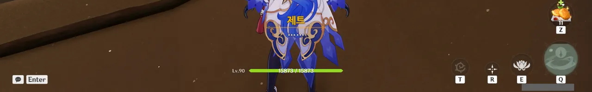

아까부터 제트가 말이 없다.

그리고 아자릭은 이 유적 거상에 대해 너무 잘 알고 있다.

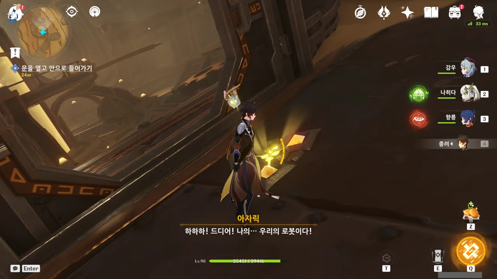

거봐 거봐 거봐 거봐. 이 녀석, 이럴 줄 알았다. *나의* 로봇? *나의*---?

아자릭이 곧 배신한다에 내가 한 10만 원 정도는 걸 수 있다.



예전에 보았던 유적 거상과 똑같은 방식이다. 그때에도 맨 밑 층에서 동력을 회복한 다음 유적 거상을 움직였었지.

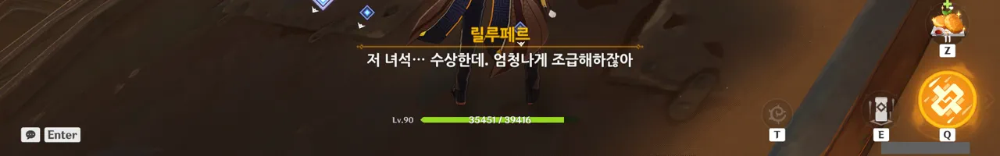

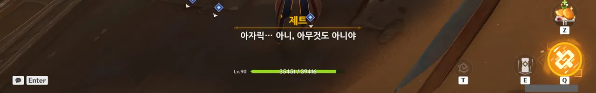

아자릭이 조급해한다고? 그런 낌새는 보이지 않았는데...

이게 다 더빙이 되지 않아서 생긴 문제이다. 분명 그렇다. 아무튼 그렇다. 더빙이 되었더라면 아자릭의 목소리를 듣고 아자릭이 지금 조급해하는 것인지 아닌지 알 수 있었을 텐데.

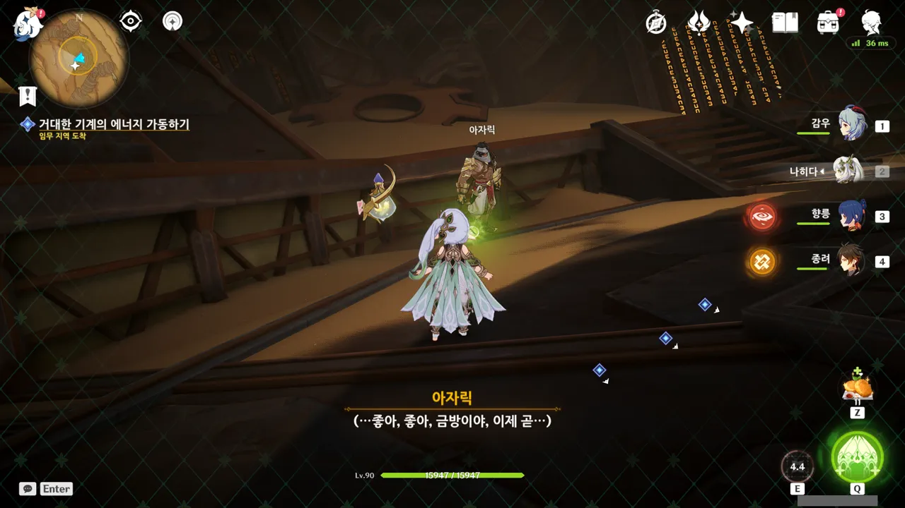

마침 아자릭이 필드에 서있길래, 나히다로 속마음을 들여다보았다.

> 좋아, 좋아, 금방이야, 이제 곧...

이제 곧? 금방? 뭘?

분명 우릴 배신할 타이밍을 잡고 있는 거겠지.

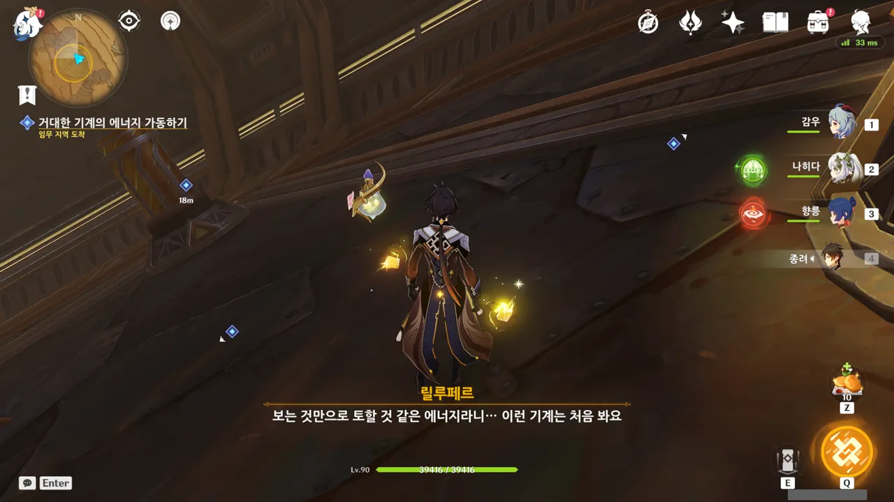

릴루페르는 이 에너지원을 '보는 것만으로도 토할 것 같은 에너지'라고 한다. 이게 그렇게 역겨운가?

분명 예전에 유적 거상의 에너지원이 무엇이었는지 들은 기억이 있는데...

* 유적 거상의 동력원이 이 에너지 기반에서 심연 기반으로 점진적으로 대체되었다
* 이 에너지원은 원소력과 연관이 있다

이 정도가 내가 기억하는 전부이다.



아무튼, 모든 에너지원을 투입하자, 유적 거상에 전원이 들어온다.

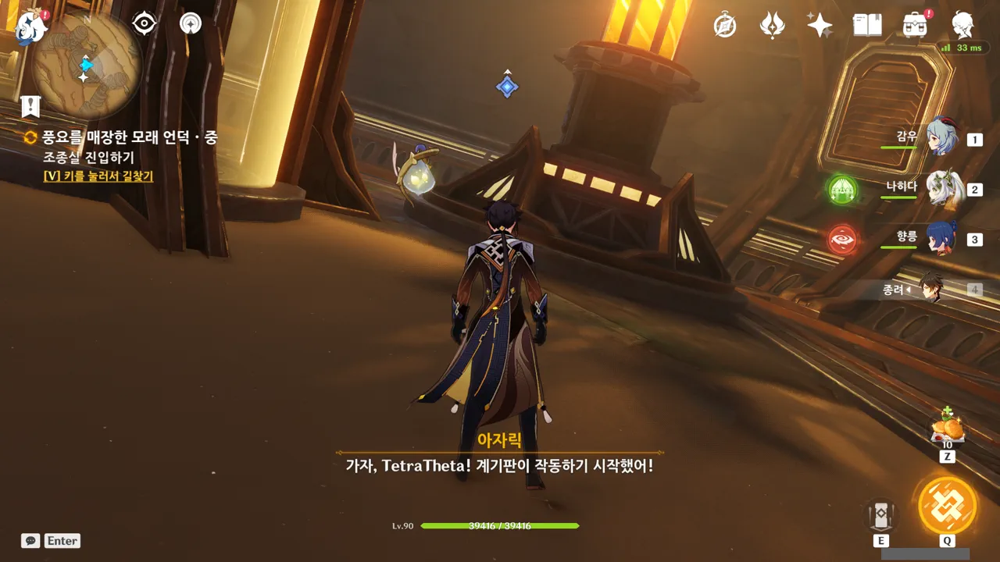

아자릭, 이 자식, 신났구만, 신났어.



이야, 아카데미아의 학자도 이렇게 유적 거상의 정보를 대번에 읽어내지 못했을 거다.

아무리 생각해도, 아자릭이 이 유적 거상에 대한 정보를 아드라피가 사라진 후의 며칠 사이에 다 익혔을 리 없다. 분명 그 이전부터 유적 거상에 대한 정보를 접해왔겠지. 그렇지 않고서야 이렇게 빨리 유적 거상의 현재 상황에 대해 파악할 수 있을 리 없잖은가.

그런 의미에서, 유적 거상의 무기가 근거리 무기인 왼팔 하나밖에 남지 않은 것은 참으로 다행이라 할 수 있다. 이 배신자 자식이 이걸 갖고 노는 꼴은 절대로 못 보지.





제트는 아자릭이 마치 다른 사람처럼 보인다며 걱정이 가득한 표정이다.

그야, 배신의 때가 다가왔으니 슬슬 본심이 가면 밖으로 삐져나오는 거겠지.

> 그래? 더 듬직해졌다는 거지? 하하!

듬직해지긴 개뿔이.



유적 거상에서 찾을 수 있는 매뉴얼에는, 유적 거상이 이렇게 작동 불능에 빠졌을 경우, 자동 조종 장치를 회수하라고 되어 있었다. 당연히 이 유적 거상이 좌초했을 때 여기 타고 있던 켄리아인들이 자동 조종 장치를 빼갔겠지.

아자릭이 여행자에게 유적 거상 조작을 맡기는 건, 옆에서 보고 조작법을 훔쳐 배우기 위함이 아닐까?



가야 할 방향에 대해선 릴루페르가 자신의 조각이 느껴진다고 하니, 그 안내를 따르기로 했다.



하... 왜 이렇게 불안할까.

아자릭이 여행자 옆에서 유적 거상 조종법을 곁눈질로 익힌 다음, 적절한 때에 '유적 거상 조종법도 다 익혔으니, 이제 넌 필요 없다!'라며 여행자의 등을 푹 찌를 것만 같다.

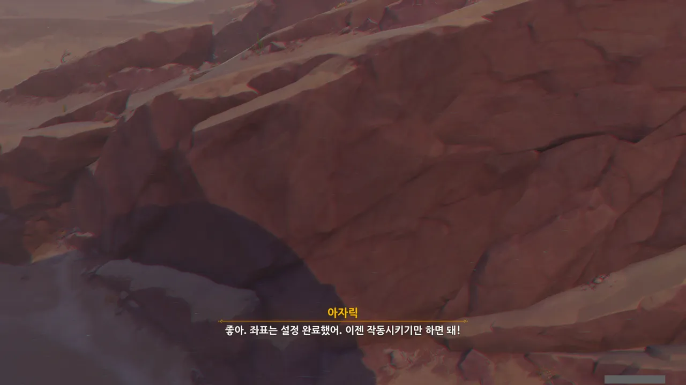

작동시키면 된다는 말에 '어, 그러면 Enter 키를 눌러야 하나?'라고 생각했는데, 자동 진행이었다.





와, 나, 유적 거상이 일어서는 거, 처음 봐!

지금까지 유적 거상이 한 일이라고는 팔을 들었다가 힘없이 내려놓기, 눈에서 눈깔빔 쏘기밖에 없었는데...

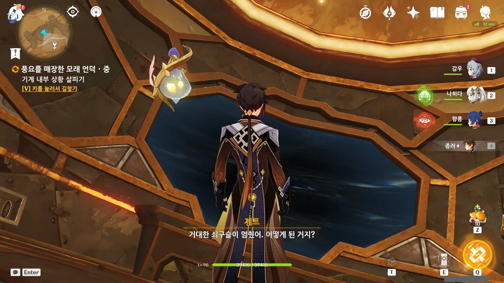

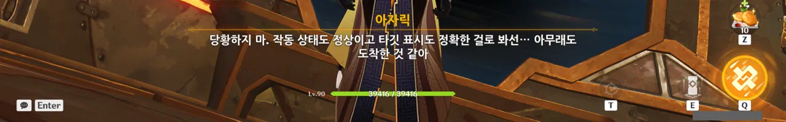

그냥 쓱 로딩이 한번 지나가고 끝이라, 뭐가 달라진 건지 전혀 모르겠다.

로딩이 있었으니 뭔가는 바뀌었겠지.

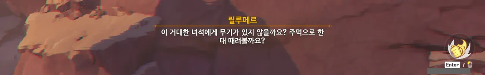

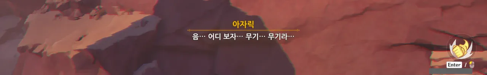

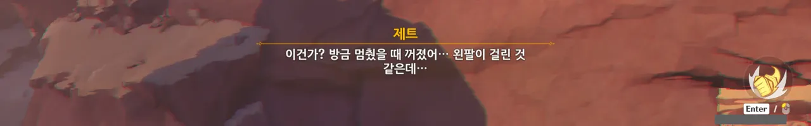

일단 목표 지점에 도착은 했으나, 릴루페르의 조각이 있는 곳으로 들어갈 방법이 없는 상황.

우림 지역에서 했던 것처럼, 왼팔로 내려치고 싶은데, 왼팔이 지금 꺼져 있다.



아드라피가 있었으면 좋았을 거라고 한탄하는 아자릭. 하지만 그 녀석, 왜 여행자를 강도질하려 했는지부터 일단 심문해 알아봐야 한다고.

게다가 아드라피가 그 후에 순순히 유적 거상을 조종해 줄 것 같지도 않다. 분명 유적 거상을 험하게 다뤄 나머지 사람들을 쓰러트린 후, 그 틈을 타서 도망치려 하겠지.



아, 그러니까 지금 실시간으로 아드라피가 남긴 도면을 보고 있는 것이 아니라, 타니트 부족의 야영지에서 그걸 전부 외우고 왔다는 거야?

유적 거상처럼 복잡한 기계의 작동 매뉴얼을 다 외우고 다녔다고? 좀 많이 의심스러운데.

그래서 일부러 바보 같은 대답을 골랐다. 아자릭 저 녀석에게 유용한 정보를 줄 수는 없지.





잡았다, 요놈! 드디어 그 더러운 속내를 제트에게까지 들켰구나!

&nbsp;

아자릭이 말한, 이 사막에서 '그들'이라고 부를 수 있을 만한 집단은 우인단 아니면 각 부족의 탈주자 그룹밖에 없다.

하지만 '그들'이 유적 거상의 모조품을 만들었다고 하는 걸 보면, '그들'은 우인단을 말하는 것이 분명하다. 유적 거상을 연구하고 모조할만한 재력을 탈주자 그룹이 갖고 있을 리 없잖은가.

그러니 아자릭은 현재 우인단과 결탁한 상태임이 확실해 보인다.

&nbsp;

제트가 '그들'이 누구냐고 캐묻자, '여기서 그걸 궁금해하는 사람은 아무도 없는 것 같은데 신경 끄시지'라고 말하며 대답을 회피하는 아자릭.

궁금해하는 사람이 없기는 개뿔이. 여기 내가 아주 궁금하시다.



지랄이 아주 풍작이네.

성격이 급하다고? 방금 한 말실수를 덮기 위해 강압적으로 구는 게 뻔히 다 보인다.



하지면 여기서 따져봤자 달라지는 건 없을 것이다. 일단 왼팔의 동력을 복구했다.



왜 직접 유적 거상을 조종하지 않냐고 묻자, 자기가 하면 느낌이 없다고 하는 아자릭.

이게 뭔 개소리지? 유적 거상을 조종할 줄 몰랐다면 그래도 의심이 덜할 텐데, 저렇게 말하는 걸 봐선 아자릭 역시 유적 거상을 조종할 줄 아는 게 틀림없다.



어딜 보고 버튼을 눌러야 하나 생각하자마자 아래쪽에 무언가가 반짝반짝 빛난다.



와... 씨... 이건 정말 쩐다. 유적 거상이 주먹을 쥔 다음, 저 돌 벽을 주먹으로 쳤어! 심지어 허리까지 돌려가며 힘껏 내리찍었다고!

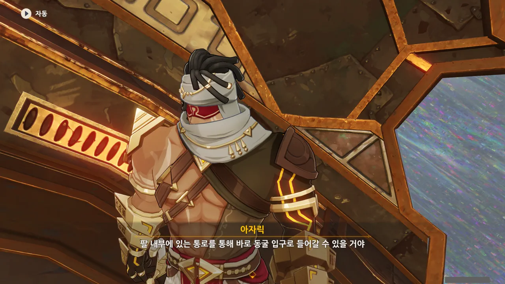

아, 그렇네. 주먹이 벽을 파고들었을 테니, 팔에 있는 구멍을 통해 벽 안쪽으로 바로 들어갈 수 있을 것이다.

나중에 돌아올 때도 유적 거상의 팔을 통해 여기로 돌아오게 되는 걸까?

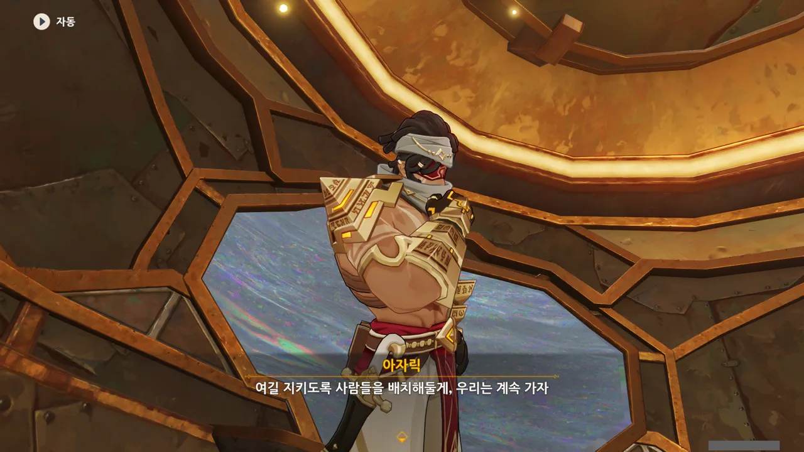

사람들? 무슨 사람들? 여기, 우리끼리만 온 거 아니었어?

역시 아자릭은 배신자가 맞다. 아자릭이 말한 사람들 역시 이전에 만났던 어깨 아니면 우인단이겠지.



ㅋㅋㅋㅋㅋㅋ 진짜 헛소리도 정도껏 해야지 ㅋㅋㅋㅋㅋㅋ

아자릭의 지랄이 갈수록 더 심해지고 있다.

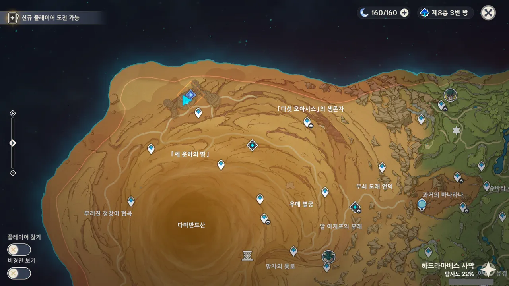

와, 그나저나 정말 유적 거상이 먼 거리를 이동했다. 아까 전만 해도 우매 별궁 쪽에 있었는데, 지금은 세 운하의 땅 위쪽에 있다.

맵 로딩이 왜 있나 했더니, 이거 때문이었구나?
