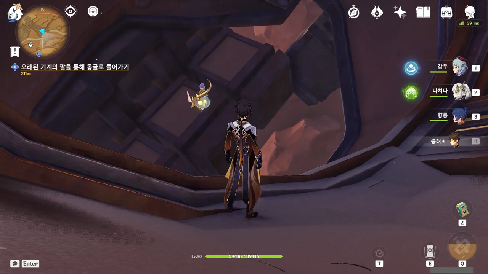

유적 거상의 팔을 통해 내려왔다. 그런데 거상의 주먹이 벽 안에 있는 게 아니라, 벽 바깥에 있다.

흠... 난 유적 거상의 팔이 주먹채로 벽을 관통해서, 유적 거상의 팔을 벗어나면 곧바로 벽 안으로 들어갈 수 있을 줄 알았는데...

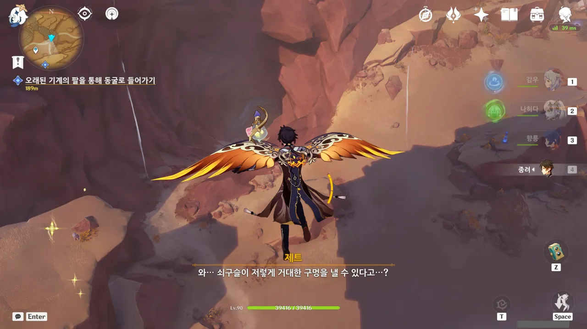

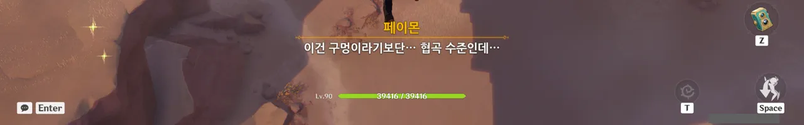

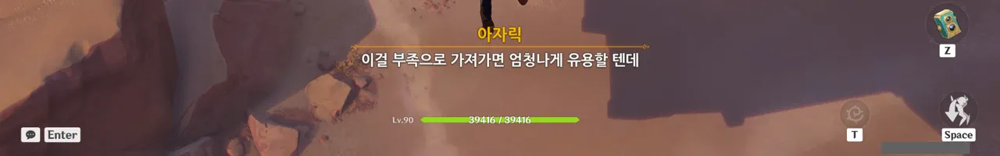

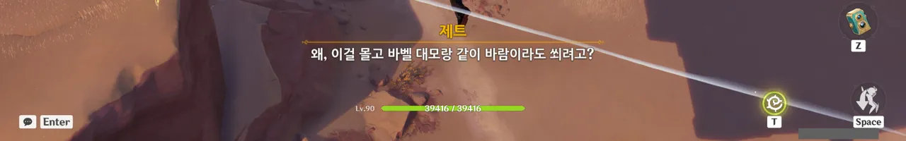

제트가 말한 '쇠구슬'을 오해해, 순간 유적 거상이 쇠구슬을 쏴 벽을 부순 줄 착각했다. '쇠구슬'은 유적 거상 그 자체를 말하는 거였지, 참...

&nbsp;

보통 이렇게 주먹질을 하면 단순히 충격을 가한 부분과 그 주변이 통째로 뭉개질 텐데, 이 흔적은 마치 팔의 빈 공간을 통해 에너지 빔 포가 나와 벽을 관통한 것처럼 생겼다.

설마 유적 거상의 근접 공격이란 것도 말이 근접 공격이지, 주먹질을 하면 팔의 빈 공간을 통해 에너지 빔 포 같은 것이 나와 추가 공격을 하는 구조일지도 모른다. 음... 이런 공격 방식을 내가 어디서 들어봤더라? 무협지에 나오는 발경이었나?

&nbsp;

아자릭 이 녀석은 벌써 배신각을 잔뜩 세워놓은 주제에 "이걸 부족으로 가져가면 엄청나게 유용할 텐데"라는 말이나 지껄이고 있다.

설마 이 녀석, 부족을 위해서라면 배신조차 용납된다는 그런 발칙한 생각을 갖고 있는 건 아니겠지? 어딘가의 겨울 메기를 좋아하는 버터링 머리 대통령도 아니고 말이다.

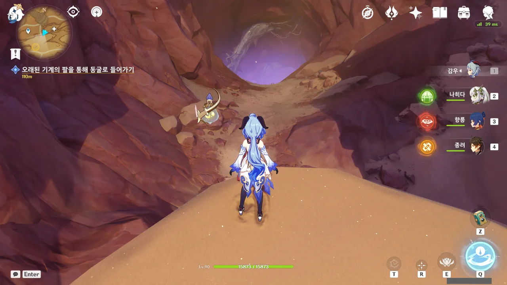

그나저나 뚫린 구멍이 정말로 깊고 길다.

그런데 왜 저 너머에 보라색 안개가 낀 거지?

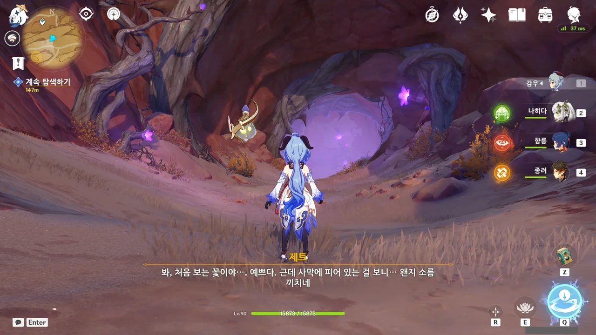

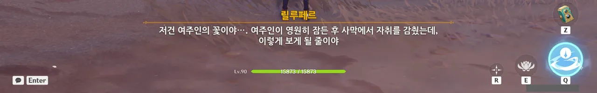

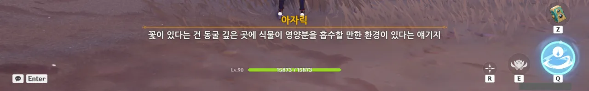

저 보라색 꽃은 화신(花神)의 꽃이라고 한다.

어디서 들은 건진 잘 기억나지 않지만, 화신(花神)의 꽃은 자홍빛 파디사라라고 한다. 화신이 죽은 후, 자홍빛 파디사라는 전부 멸종했고, 지금 있는 파디사라는 화신을 기리며 룩카데바타가 복제한 꽃이라고 한다.

저 꽃의 색깔은 보라색이지만, 달리 보면 자홍색이라고 봐도 무방하니, 어쩌면 저 꽃이 화신의 파디사라일지도 모르겠다.



앞에는 '저수지'와 스위치가 하나 있었다. 릴루페르가 잠금을 해제해 준 스위치를 누르자, 저수지에 모래가 가득 차며 길이 열린다.

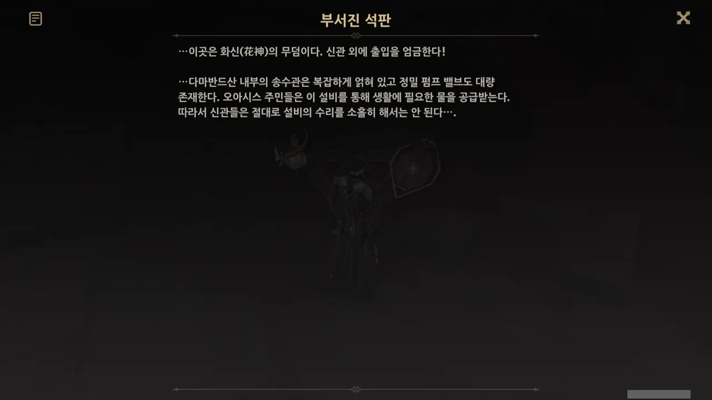

이런 내용의 석판은 또 처음 보는 걸.

여기가 화신(花神)의 무덤이라고 한다. 화신이 영원의 오아시스에 묻혔다고 했으니, 제대로 온 것이 맞다.

&nbsp;

다만 조금 신기한 것이라면, 영원의 오아시스는 그저 화신의 무덤 역할만 한 것이 아니라, 오아시스 인근에 사는 사람들에게 물을 공급하는 역할 또한 맡은 것으로 보인다. 그래서 신관들은 단순히 신을 모시는 것이 아니라, 사람들에게 물을 공급해 주는 펌프의 유지보수도 같이 하고 있었다.

사막에서 물은 곧 권력을 의미하니, 이 신관들은 어쩌면 왕족보다 더한 대접을 받고 살았을지도 모르겠다.

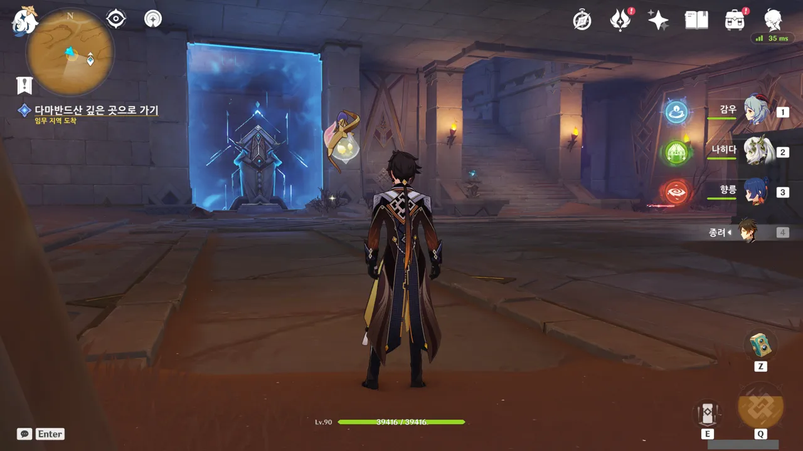

와, 이것 좀 봐라. 그냥 슬쩍 보기만 해도 이 퍼즐을 풀기 위해 머리를 좀 써야 할 것으로 보인다.



양 옆에는 닫힌 문 두 개가 보이고, 가운데에는 위로 올라가는 계단이 보인다.

퍼즐을 풀고 나서 어디로 가야 할지 도저히 감이 잡히지 않는데? 퍼즐을 다 풀면 '여기로 가세요~'라는 뜻으로 짧은 컷신이 나올 테니, 그걸 보고 가야 할 것 같다.



제트와 아자릭의 마음을 읽어보았다.

제트는 아자릭이 대체 무얼 숨기고 있는지 의심하고 있으며, 아자릭은 어딜 가나 파이프 천지라며 불평하고 있다.

아직까진 큰 문제가 없어 보이네.

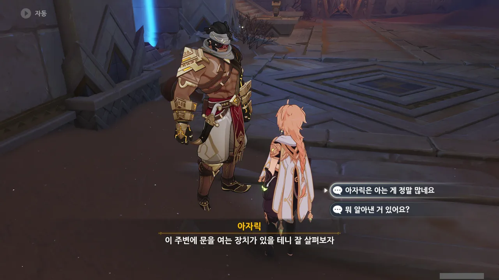

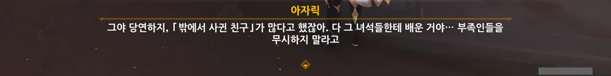

아자릭을 한 번 떠보았다. '밖에서 사귄 친구'라... 분명 우인단이겠지. 안 봐도 뻔하다.

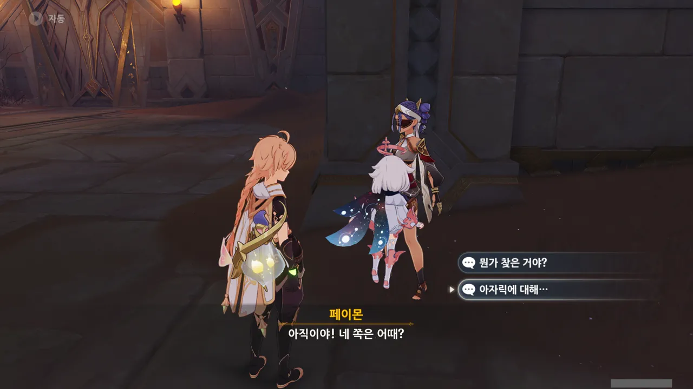

제트는 알고 있는 것이 너무 많은 아자릭을 의심하고 있지만, 아자릭이 바벨의 가장 믿음직스러운 부하이기 때문에 '계속 의심해 봤자 좋을 것 없다'라고 생각하고 있다.



내가 뭘 했는지 모르겠는데, 파이프가 연결되면서 첫 번째 사진의 장치가 활성화되었고, 두 번째 사진의 장치 역시 활성화되며 위로 쑤욱 솟아올랐다.

뭐? 아니, 왜 저게 위로 치솟아?

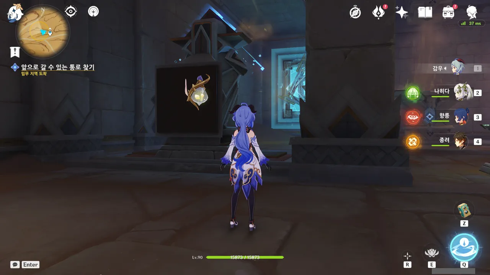

방금 올라온 장치가 이건 거 같은데... 양 옆에 빈 공간이 있으니 길을 막기 위한 용도는 아닐 것 같고... 대체 목적이 뭐지?

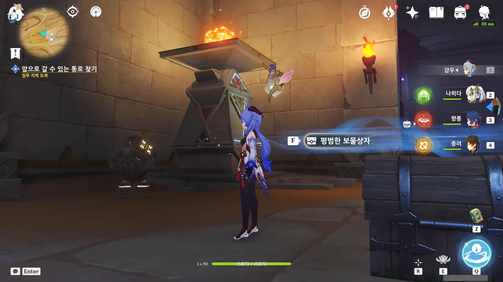

이후로도 그저 눈에 보이는 퍼즐을 정처 없이 풀어나가고 있다.

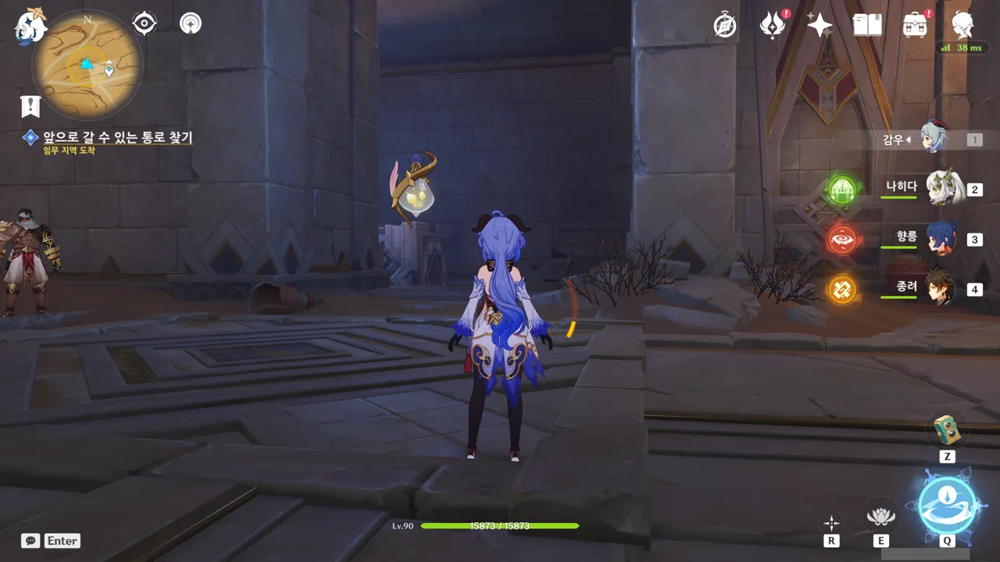

아, 아까 올라간 그 장치 너머에 있는 공간에 갈 수 있게 되었다. 그래서 그 장치가 위로 올라갔던 거였구나.

이런 게 나왔다는 건, 앞으로 이렇게 위아래로 움직이는 장치 또한 만나게 될 거라는 거겠지. 이번 건 '이 장치는 이렇게 움직일 수도 있습니다!'라고 알려주는 튜토리얼 같은 거고.

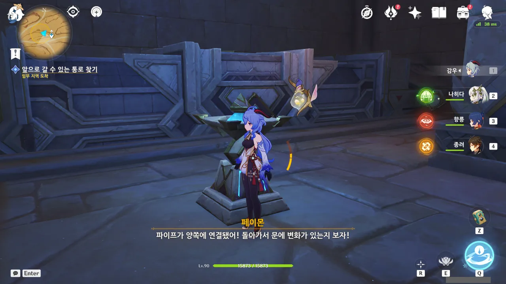

파이프는 보지도 않고 눈앞의 퍼즐만 풀어대기 바빴는데, 뭐가 어찌 잘 돌아는 가고 있는 모양이다.

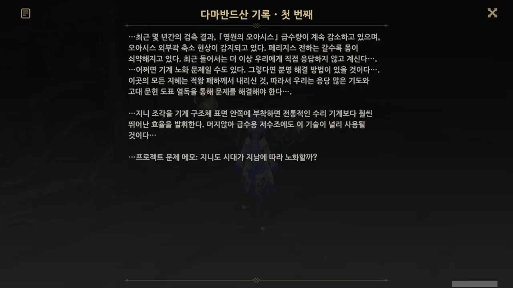

아까는 발견하지 못한, 첫 번째 다마반드산 기록이다.

지니 조각? 설마 지니를 조각내서 동력원으로 쓰는 거야? 그런 잔인한 짓을 하다니...

&nbsp;

그나저나 여긴 지식을 대하는 태도가 수메르 아카데미아와 다른 것 같다.

아카데미아는 '문제가 생기면 열심히 탐구하고 분석해 연구하자'라는 주의라면, 여기는 '모든 지식은 적왕이 내려준 것이니, 문제가 생기면 열심히 기도하고 옛 문헌을 열심히 읽자'라는 주의로 보인다.

그러니까 모든 문제의 해결책이 과거 문헌에 있다는 말인데... 이러면 지식이 고여버려 더 이상 발전할 수 없게 된다.

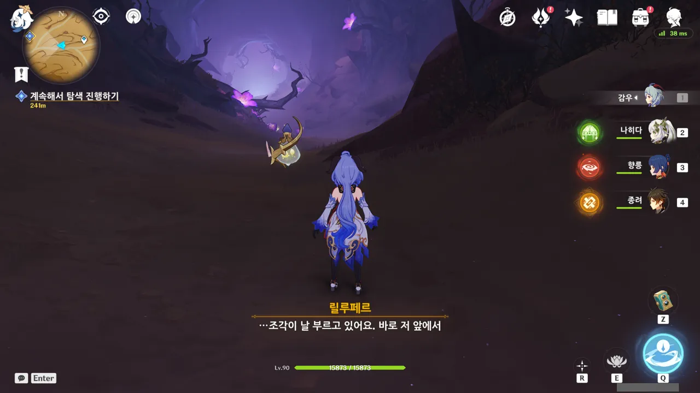

릴루페르가 저 대사를 하자마자 눈앞에 버섯몬 두 마리가 나타났다. 이거, 릴루페르가 유인한 게 틀림없다.

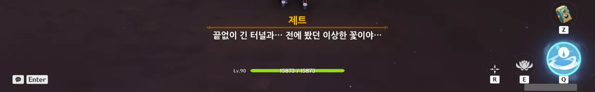

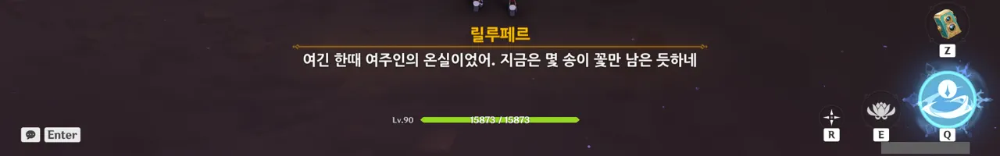

흠... 분명 저번에도 한때 온실이었던 방에 간 적이 있지 않았나? 거기와는 주변 환경이 좀 많이 다른 것 같은데... 여긴 온통 모래투성이인 동굴이잖아.

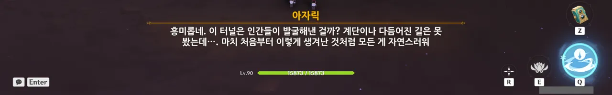

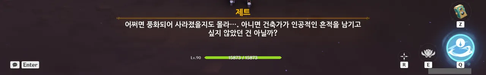

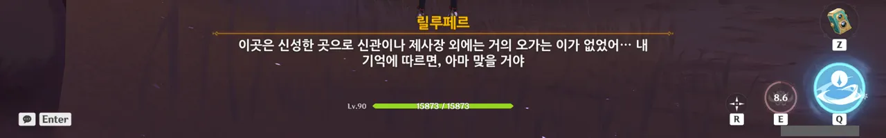

그러게? 이 동굴은 어떤 이유로 생긴 걸까? 유적의 문이 열리면 자연스럽게 동굴이 나타나고, 동굴의 끝에는 또 다른 유적의 문이 자연스럽게 놓여 있다.

단순한 우연이라고 하고 싶어도, 남부 사막 지역에서의 유적은 유적과 동굴 사이를 이동할 때 유적의 벽 사이에 난 틈으로 들어가는 등, 풍화 등으로 인해 길이 아닌 곳을 지나가는 느낌이 강했지만, 여긴 그런 낌새가 전혀 없다.

인위적으로 이렇게 만들었다고 생각하기도 힘든 것이, 여긴 신성한 곳이라 신관이나 제사장 이외에는 오가는 사람이 없었다고 하거든. 그런 사람들이 일부러 이런 동굴을 걸어 다녔을 것 같지는 않다.

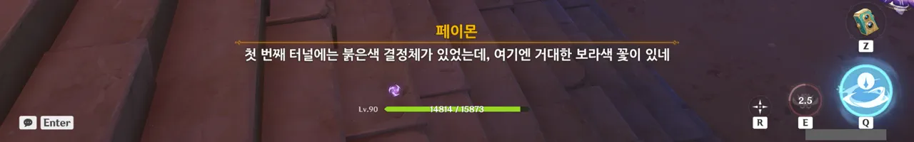

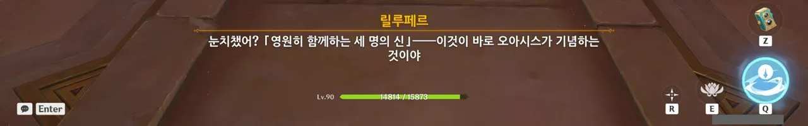

붉은색 결정체? 못 봤는데...

'영원히 함께하는 세 명의 신'이라... 분명 적왕, 화신, 룩카데바타 셋을 말하는 거겠지?

영원의 오아시스는 화신의 무덤이지만, 세 신이 함께했던 추억을 보존하는 공간이기도 한 모양이다.

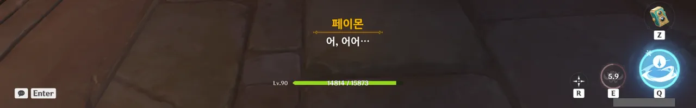

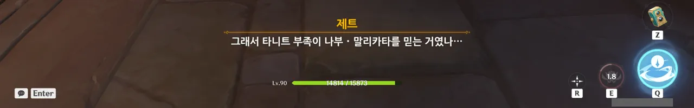

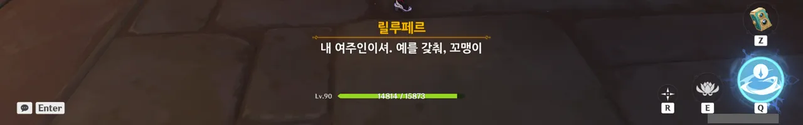

아, 화신의 이름이 '나부 말리카타'였어? 예전에 바벨이 릴루페르에게 한 말을 듣고 그럴 것 같다고 생각하긴 했지만...

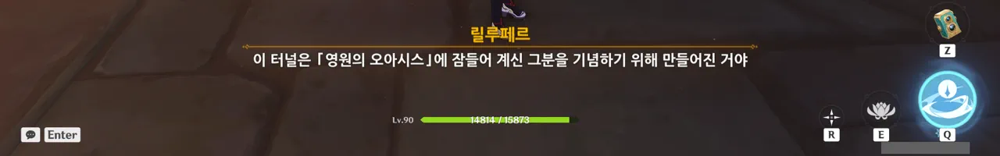

뭐? 이 터널을 사람들이 인공적으로 만들었다고? 그리고 그 목적이 화신을 기념하기 위해서라고?

유적과 유적 사이를 잇는 동굴이 대체 왜 화신을 기리는 의미인지 전혀 모르겠는데...

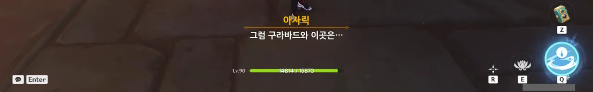

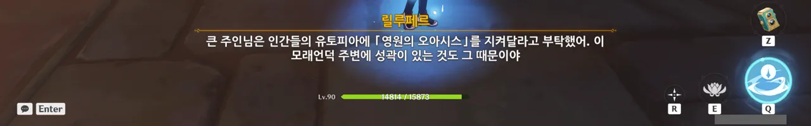

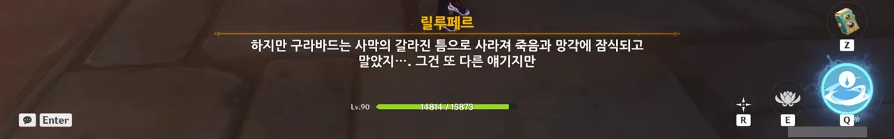

구라바드 역시 영원의 오아시스를 지키기 위해 만들어진 성곽 도시라고 한다.

하지만 내분으로 추정되는 무언가 때문에 망해버리고 말았지...

아까 튀어나온 후, 계속 날 괴롭히던 버섯몬 둘을 없애버렸다.

전투 도중 대사가 나오면 사진을 찍기 힘들어서 계속 뒤로 도망치고 있었거든...



제트야... 저건 녹슬었다기보다, 그냥 망가졌다고 보는 게 더 맞지 않아? 아예 박살이 났는데?



무슨 말인지는 잘 모르겠지만, 저 방에 들어가 퍼즐을 풀면 된다는 것으로 이해했다.

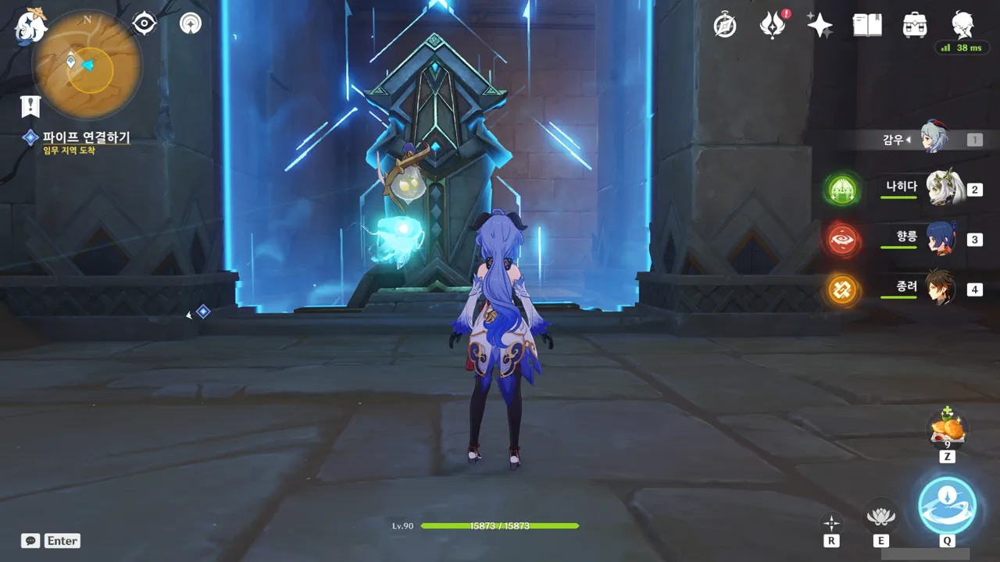

아잇, 이런 젠장맞을. 아까 발견한 선령을 데려오고 있었는데, 중간에 있는 이 장치 때문에 선령이 더 이상 앞으로 나아가지 못하고 있다.

이 장치를 풀기 위해 퍼즐을 풀다 보면 분명 이 선령의 존재를 까맣게 잊어버리고 말 텐데...

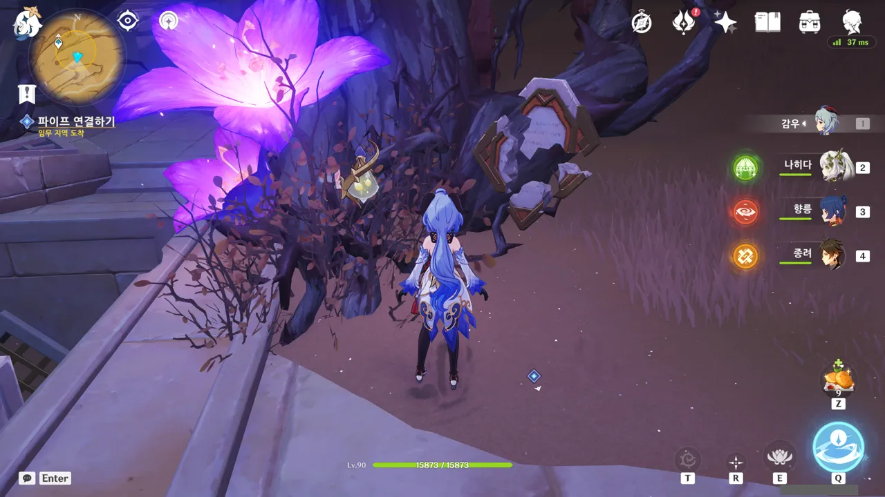

지금은 상호작용을 할 수 없는, 쪼개진 석판이 공중에 둥둥 떠있다.

옆에 있는 스위치 또한 비슷한 상황임을 보아, 아마 퍼즐을 풀면 석판과 스위치가 원래대로 돌아오는 구조로 보인다.





이후 퍼즐을 푸니, 한 장치는 아래로 사라지고, 다른 장치는 위로 올라가 사라진다.

저 장치의 목적은 대체 뭘까? 그 덩치 때문에 길을 막는 목적이라 생각하고 싶지만, 첫 번째 장치처럼 그 뒤에 아무런 통로가 없는 경우도 있어, 길을 막는 용도라 생각하기 힘들다.

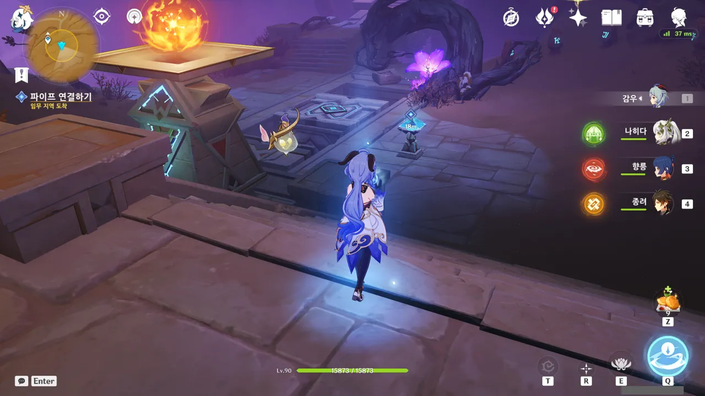

아무튼, 스위치가 복구되었다. 이제 저 밸브를 조작할 수 있겠지.

스위치를 조작하자 모래 파이프가 서로 연결되면서 석판 역시 원래대로 복구되었다.

모래가 흐른다고 석판이 복구되는 건 좀 신기한걸.

난 여태 '페리지스'가 사람 이름인 줄 알았다. 그런데 지니의 이름이었네?

사람들과 대화를 할 수 있는 것으로 보아, 릴루페르와 비슷한 격을 지닌 지니로 보이는데, 페리지스가 대지니라고 하니, 릴루페르 역시 대지니겠지.



이게 파디사라라고 했던가? 생긴 건 마치 철쭉처럼 생겼다. 하지만 그 줄기에는 가시가 돋친 것이, 마치 장미 같기도 하다.

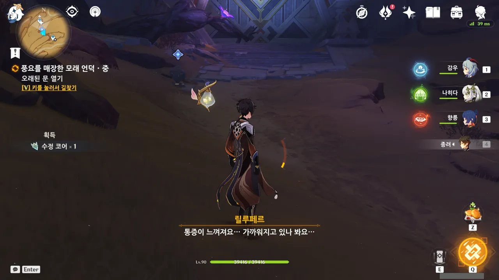

대체 지니는 몸이 어떤 구조로 되어 있길래, 자신의 조각이 가까워질수록 통증을 느끼는 걸까?

설마 환상통이니?

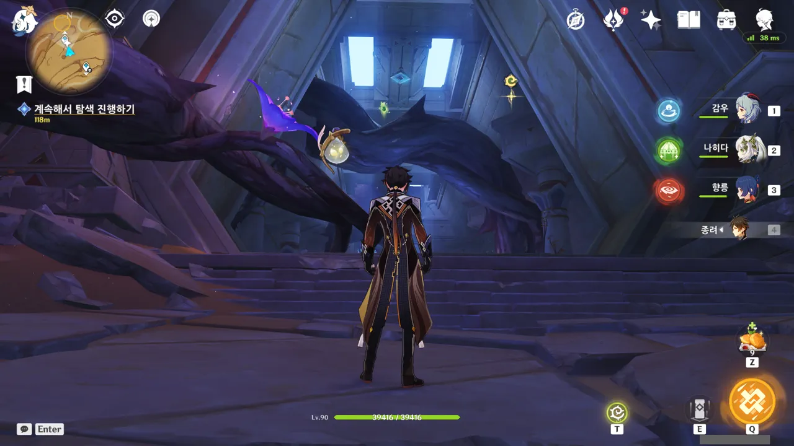

여기도 위쪽이 환하다. 다만 저번에 봤던 온실의 천장에는 철창이 있을 뿐이었지만, 여기는 철창 대신 모래 파이프가 있다.

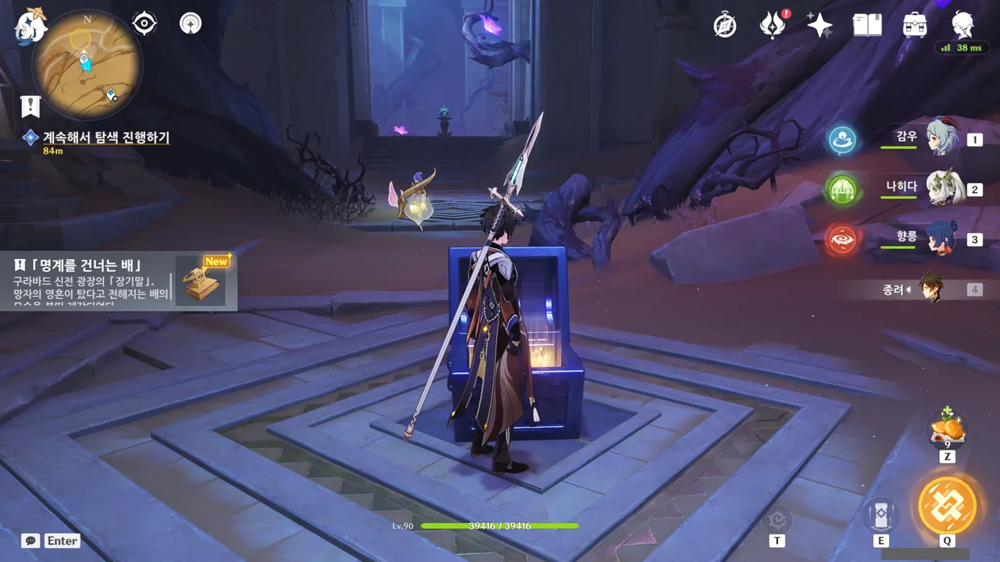

가운데 난데없이 놓여있던 상자에는 장기짝만 들어있었다.



지금까지 모은 장기짝은 총 세 개. 장기판에 장기짝을 놓을 수 있는 자리가 아마 서너 개 정도 되었던 것 같은데... 정말 이번 월드 임무가 거의 다 끝나가는 것일지도 모른다.

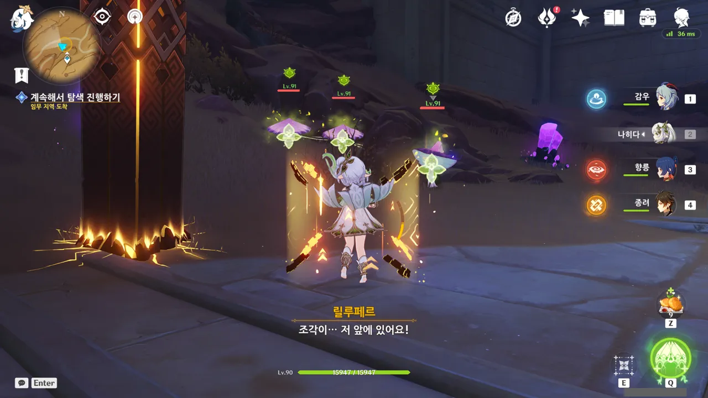

릴루페르가 자신의 조각이 저 앞에 있다고 할 때, 내 앞에 나온 것은 버섯몬이었다.

전투 중에 대사, 멈춰! 사진 찍기 힘들다고!

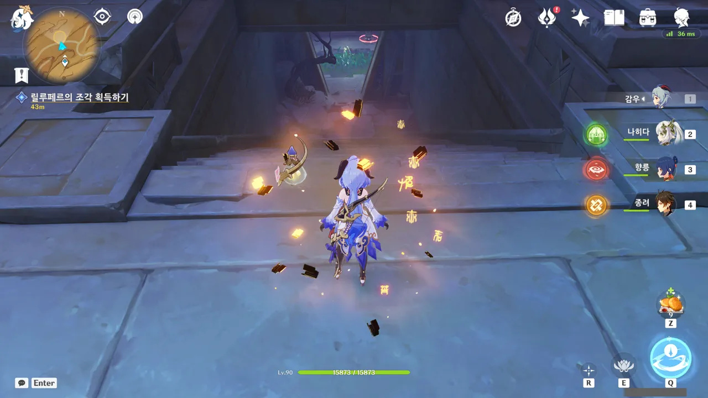

저번 온실과 똑같은 구조의 방이다. 내려가는 계단 밑에 작은 오아시스 하나, 그 위에 릴루페르의 조각 하나.



... 이건 대체 무슨 이야기일까? 무언가를 은유한다는 건 알 것 같은데...



어휴, 차라리 여행자가 본 걸 짤막한 영상으로나마 보여줬으면 좋았을 텐데.

그냥 텍스트로 때워버리니, 여행자가 저걸 찰나에 모두 느낀 건지, 아니면 멍하니 서있으며 1배속으로 본 건지, 다른 NPC가 말해주지 않으면 알 수 없다.

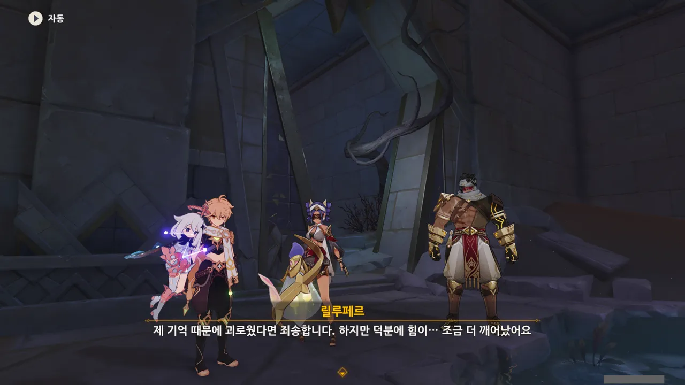

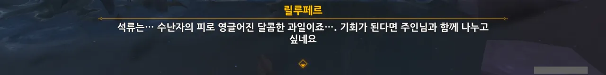

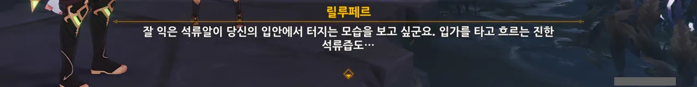

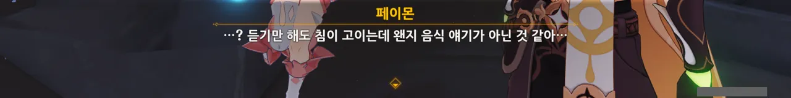

'수난자의 피로 영글어진 달콤한 과일'이라... 굉장히 불길한 비유인데.

아기를 잡아먹는 '귀자모신'이라는 나찰을 부처가 교화시킬 때, 인육이 먹고 싶으면 석류를 대신 먹으라고 했다는 전설 때문에, 석류는 인육을 의미하기도 한다.

'입가를 타고 흐르는 진한 석류즙'은 마치 식인을 연상시킨다. 으으, 꺼림칙해라.





오, 웬일로 릴루페르가 제트에게 이렇게 부드럽게 대하는 거지?

"또 기분 상했어?"라고 릴루페르가 걱정하듯 얌전히 묻는 모습을 보면, 정말로 제트를 배려하고 있구나 하는 생각이 든다.



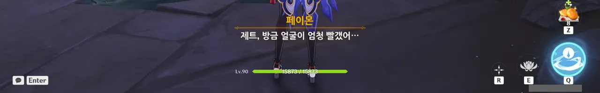

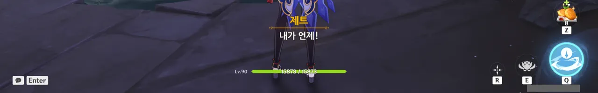

음... 제트의 마음은 정말 알다가도 모르겠네. 왜 얼굴을 붉힌 거야?

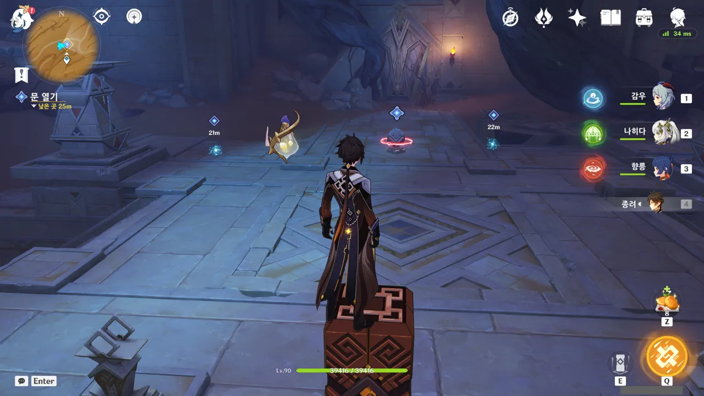

퍼즐 다음에는 또 퍼즐이 있다.

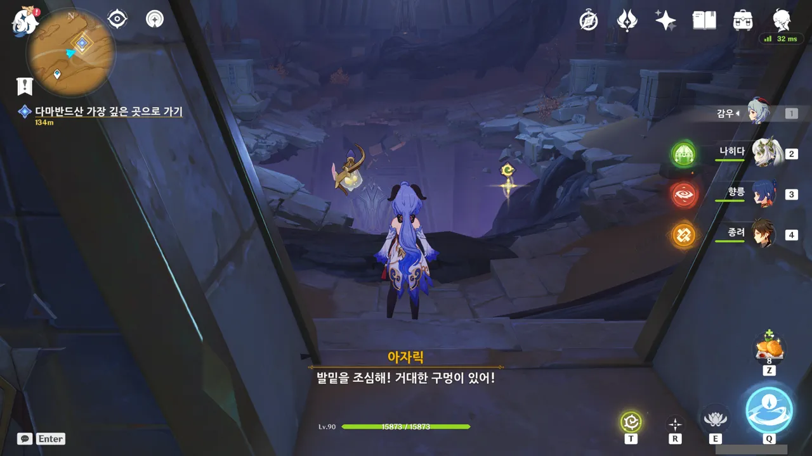

문을 열자마자 나오는 거대한 낭떠러지.

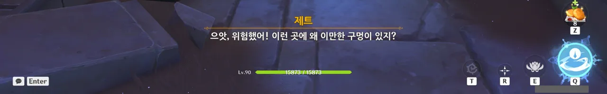

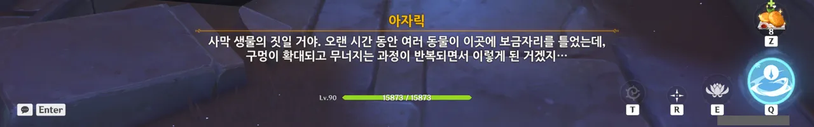

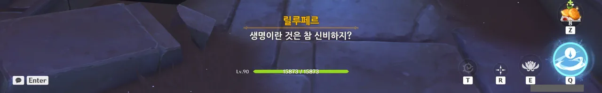

처음엔 이 말만 보고 '동물들이 뭐가 아쉬워서 돌바닥에 구멍을 파?'라고 생각했다.

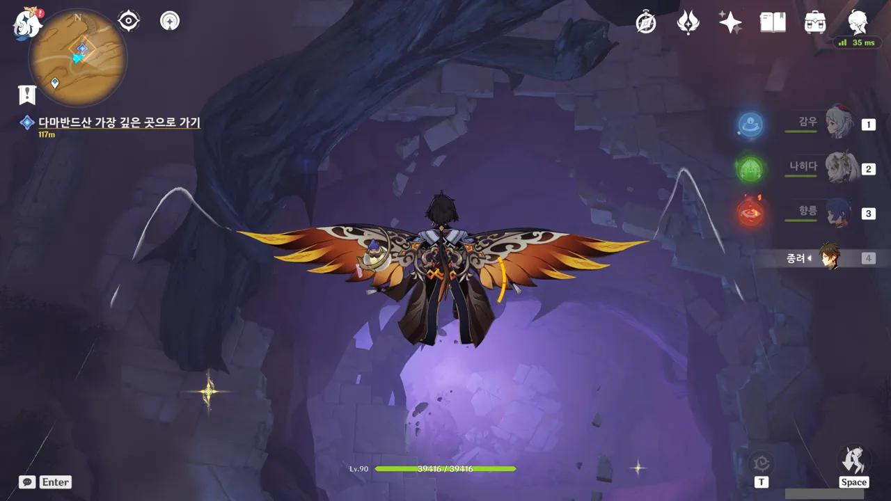

그런데 내려가며 아래를 보니, 정말 릴루페르 말처럼 사막 동물들이 파놓은 구멍 때문에 이렇게 유적이 무너졌을 것 같더라.

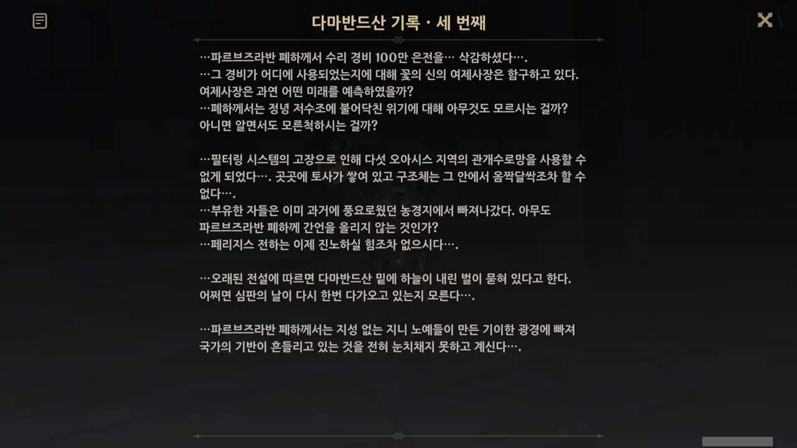

세 번째 다마반드산 기록. 여기도 구라바드에서 본 것처럼, 나라가 망해가는 징조가 보인다.

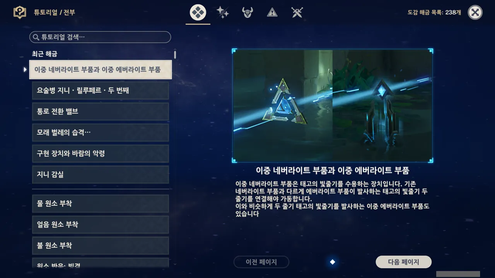

이야, 기존의 네버라이트 부품과 에버라이트 부품도 골치가 아팠는데, 이젠 그게 이중으로 있네?

이번에 내가 본 건 이중 네버라이트였다. 양쪽에서 빛을 쏘니 뭔가 퍼즐이 풀리긴 했는데, 그다음 진행을 어떻게 해야 하는지 도저히 알 수 없어, 그냥 퍼즐 풀이를 포기하고 나왔다.

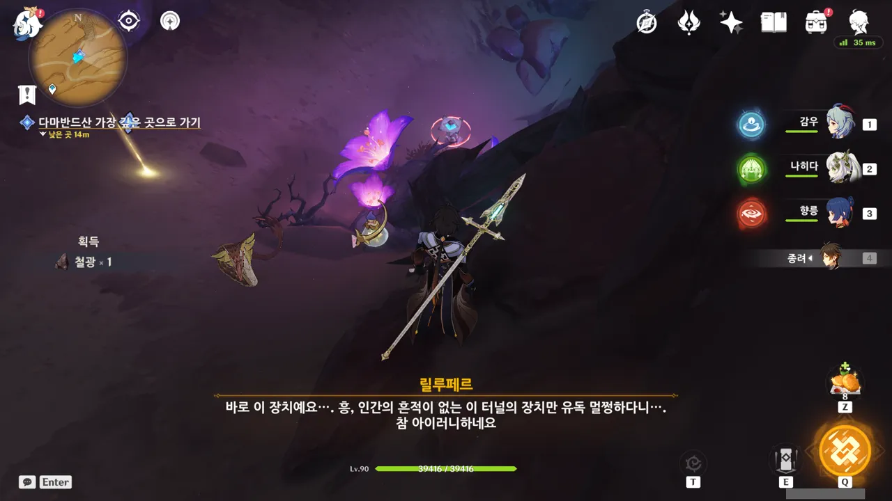

음, 그러니까 이걸 누르면, 저번에 했던 제단 디펜스를 또 할 수 있다는 거지?

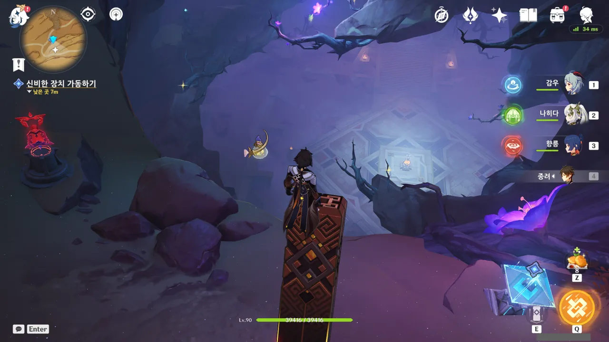

이걸 이 유적 끝에서 보게 될 줄이야...

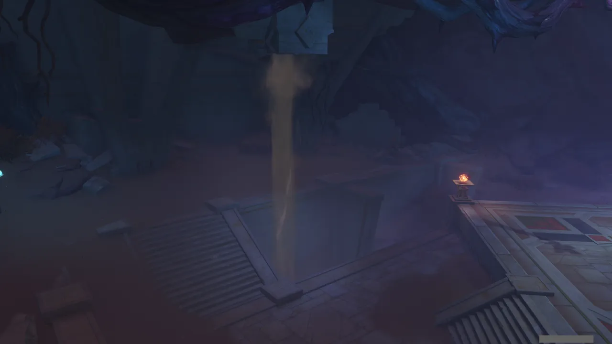

저번과 똑같이, 스위치를 누르자 아래로 모래가 떨어진다.

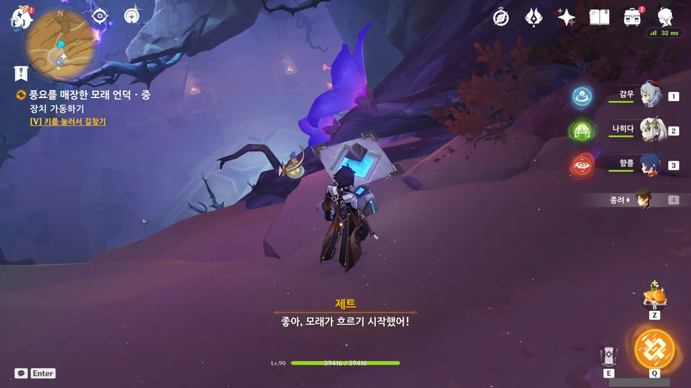

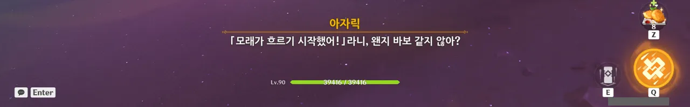

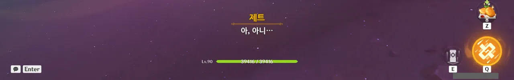

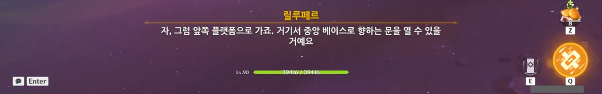

모래가 흐른다는 표현이 어때서? 이쁘기만 하구만.

그 와중에 릴루페르는 제트와 아자릭이 서로 딴지를 걸든 말든 아랑곳 않고 앞쪽 플랫폼으로 가자고 갈 길을 재촉한다.



그래. 여기도 제단 디펜스를 할 줄 알았어...

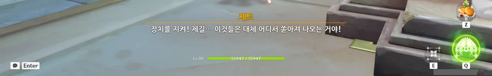

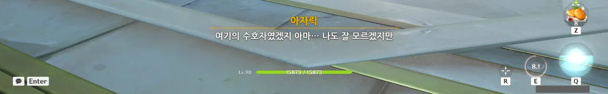

> 이것들은 대체 어디서 쏟아져 나오는 거야!

내가 하고 싶은 말이다, 정말!



아무튼, 장치가 활성화되자, 노란색 모래가 문 밖으로 길을 안내한다.

이번에는 모래의 색이 조금 다를 줄로 기대했는데, 저번과 똑같은 노란색이라 조금 실망스럽더라.

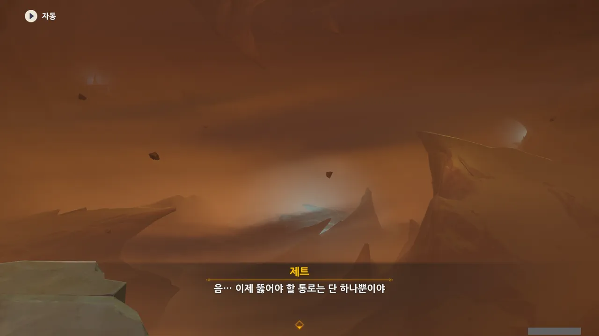

아, 맞다. 이번 유적은 유적 거상으로 길을 뚫어서 왔지, 참.

나머지 유적도 유적 거상을 이용해 길을 만들어야 하는 걸까?



페이몬 이 녀석. 혼자 날아다니는 주제에 다리가 아프다고 하다니. 곯려줄 목적으로 '난 괜찮아' 선택지를 골랐다.

페이몬이 옛날에 날아다니는 것처럼 보이지만, 보이지 않는 곳에서 열심히 뛰어다니고 있다고 말한 것 같은데, 평소 하는 걸 보면 전혀 그렇게 안 보이거든.



페이몬은 역시 놀리는 맛이 있다.

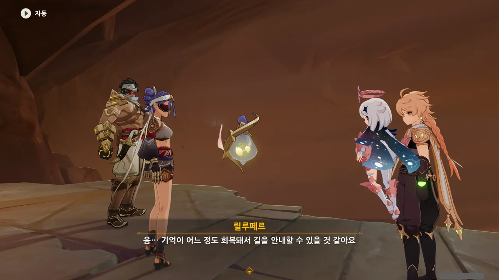

릴루페르의 기억도 더 회복되어, 다음 길을 안내할 수 있다고 한다.

저 가운데에 있는, 수정잔인가 뭔가 하는 걸 얼른 보고 싶다.



나히다로 두 사람의 마음속을 들여다보았다.

아자릭은 이곳이 답답하다며, 얼른 햇빛을 쐬고 싶어 하고, 제트는 아자릭이 초초해하는 이유가 뭘까 불안해하고 있다.

과연 아자릭은 언제 배신할까?
