지상으로 돌아올 때만큼은 이렇게 빠르게 보내주는 게 마음에 든다.

다만, 이러면 나중에 다시 들어갈 때 어떻게 들어가는지 제대로 기억하지 못할 수 있지만...





500년 동안이나 방치된 녀석이다 보니, 이 유적 거상을 지속적으로 사용하기는 힘들어 보인다.

언제 고장 날 지 알 수 없으니, 남은 목적지도 속전속결로 끝내기로 했다.

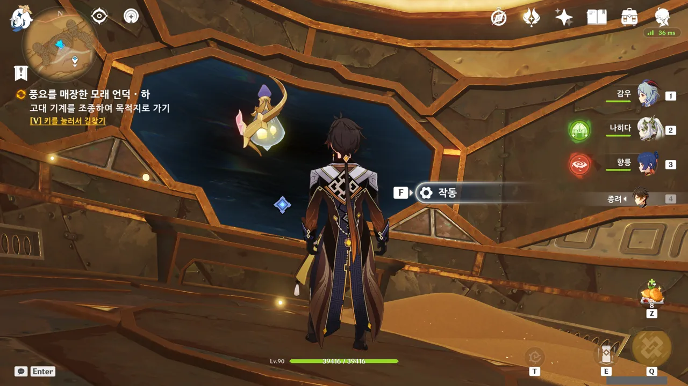

오, 여기서도 곧바로 유적 거상 조종실로 보내주네. 마음에 드는 걸.

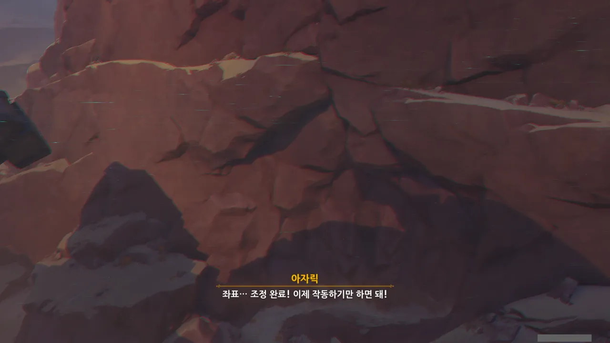

그러고 보니, 저번에는 그냥 검은 화면으로 화면을 가리고 '짜잔, 유적 거상이 먼 길을 이동했습니다!'라고 얼버무렸었지... 과연 이번에도 그럴까?

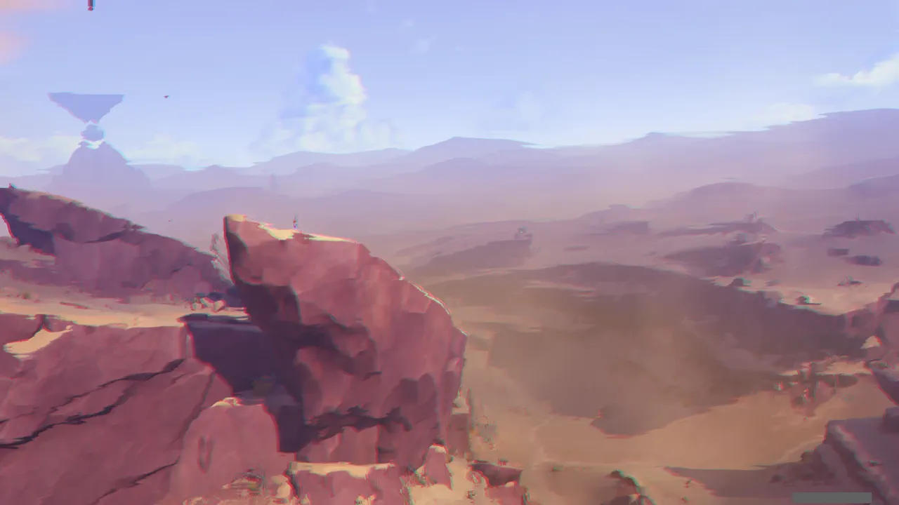

와! 유적 거상이 걷고 있다!

아니, 이럴 거면, 차라리 유적 거상이 처음 이동할 때 이런 영상을 보여주면 되는 거 아니었어? 왜 처음에는 검은 화면으로 가리고, 두 번째에 이런 영상을 보여주는 거야? 차라리 두 번째를 검은 화면으로 가렸으면 '아 ㅋㅋ 두 번째는 식상하니까 ㅋㅋ'라며 좋게 넘어갈 수 있었을 텐데...

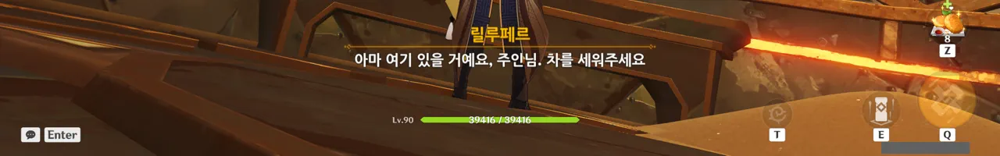

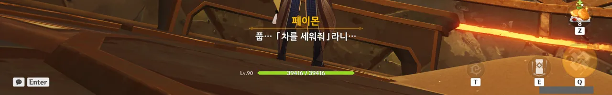

전투 중 대사가 나오는 것보다 더 짜증 나는 게 뭔지 알게 되었다. 바로 사진 찍을 새도 없이 지나가 버리는 대사다.

릴루페르가 유적 거상을 세워달라며 "차를 세워주세요"라고 말하자, 페이몬이 그걸 비웃고, 거기에 릴루페르가 '어머, 넌 마차를 본 적도 없구나? 저런...' 같은 말로 페이몬을 찍어 누르는 장면이었는데... 대사가 너무 빨리 지나간 터라, 릴루페르의 대사를 마저 찍지 못했다.

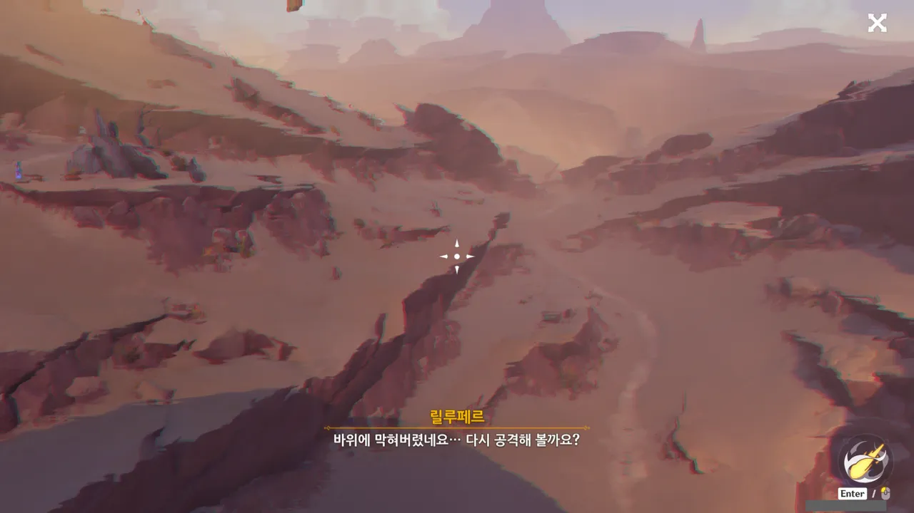

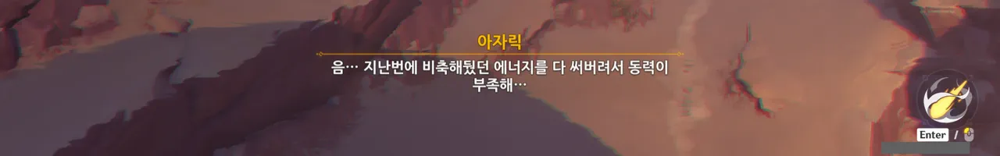

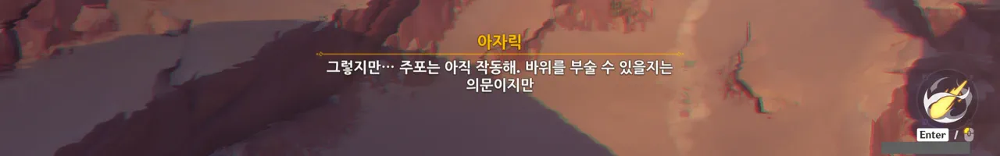

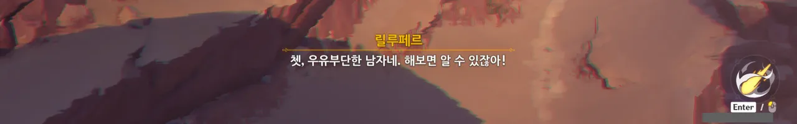

저번에는 왼손으로 주먹질을 해서 길을 만들었지만, 이번에는 주먹질을 하기에는 동력이 부족해 눈깔 빔을 쏘는 전개가 되었다.

첫 번째와 두 번째가 똑같으면 식상하다고 말했겠지만, 이렇게 다른 방식으로 진행된다면 신선하다 말할 수 있겠지.

그런데 그런 배려는 잘하면서, 대사 읽을 시간을 안 주는 건 대체 뭐냐?

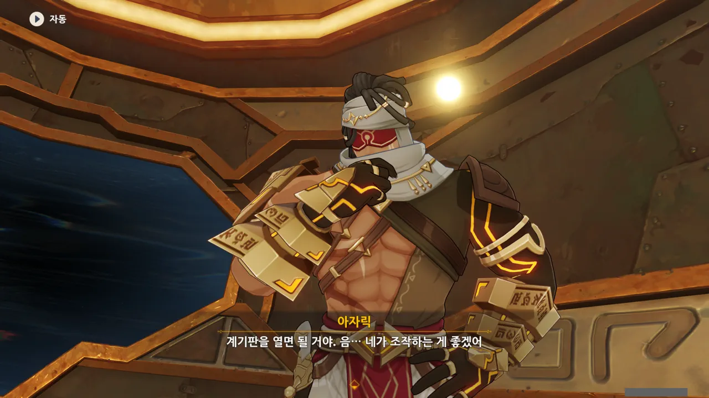

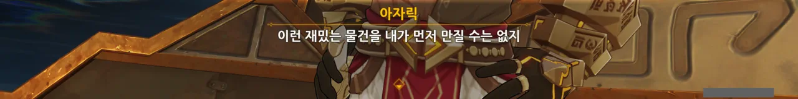

아자릭, 스스로 말해놓고도 이상하다는 생각이 들지 않니? 재미있는 물건이면 내가 먼저 만져보고 싶은 게 정상 아냐?

정말 핑계 못 댄다...

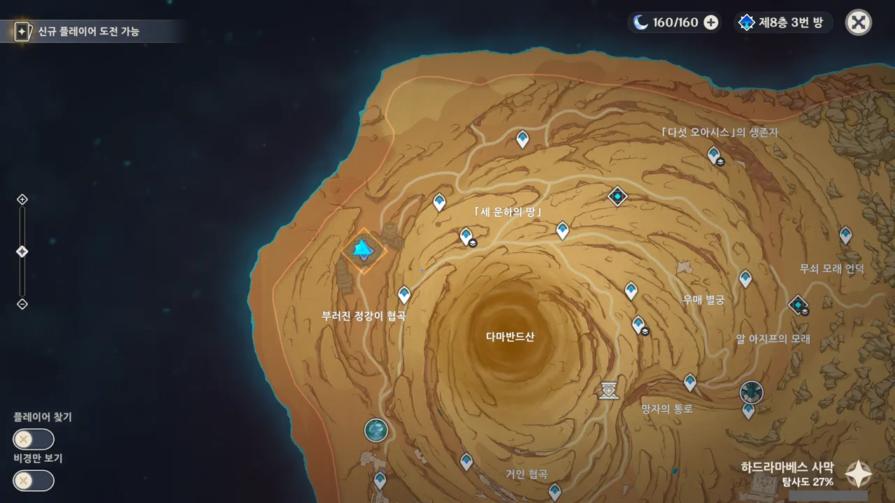

이야, 유적 거상이 정말 먼 길을 이동했다.

처음에는 다마반드산 동쪽에 있는 우매 별궁에 있었던 유적 거상이, 다마반드산 북쪽에 있는 「세 운하의 땅」에 간 다음, 이제는 다마반드산 서쪽에 있는 부러진 정강이 협곡까지 왔다.

다마반드산 남쪽에는 타니트 부족의 야영지가 있으니, 다마반드산 주변을 거의 한 바퀴 돈 셈이다.

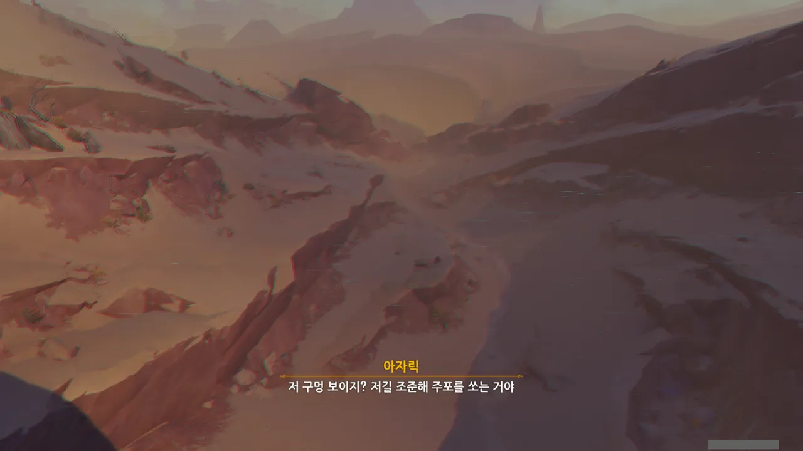

구멍? 무슨 구멍?

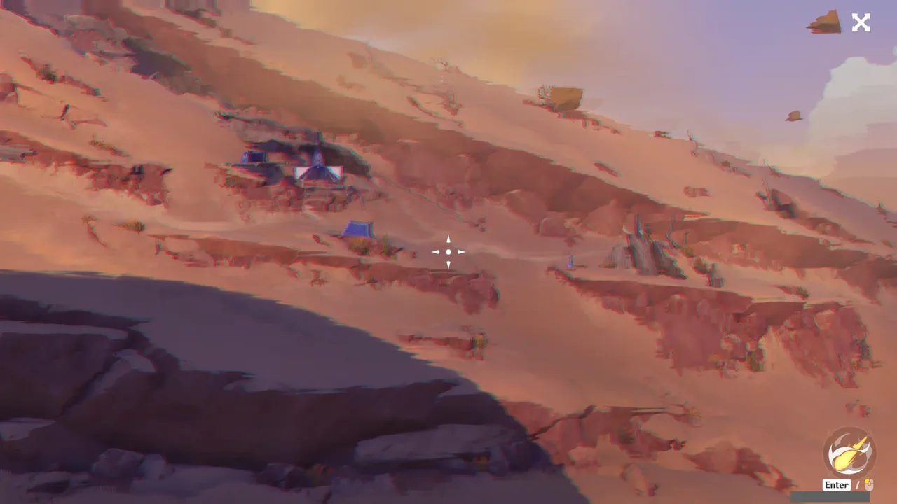

잠깐... 저거 우인단 야영지 아냐?

혹시나 해서 예방공격 차원으로 주포를 이용해 우인단 야영지를 두들겨 보았지만, 아무런 효과가 없었다.

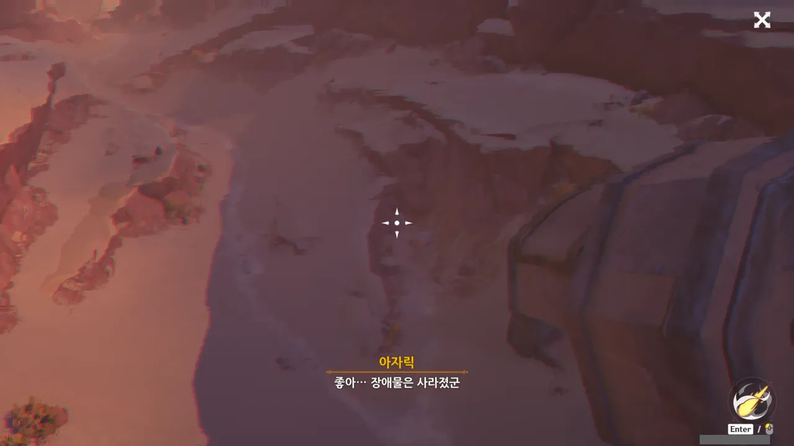

하는 수 없이 그냥 하라는 대로 길을 막고 있는 바위덩어리를 주포로 쏠 수밖에 없었다.

저기 외에는 주포가 통하는 곳이 없더라.



아자릭이 길을 나서다 말고 갑자기 멈춰 선다.



그러더니 갑자기 여행자에게 부탁할 것이 있다고 한다.

뭐? 뭔데? 혹시 지금 여기서 배신하려는 거야? 나 여태껏 그거, 엄청 기다려 왔거든!

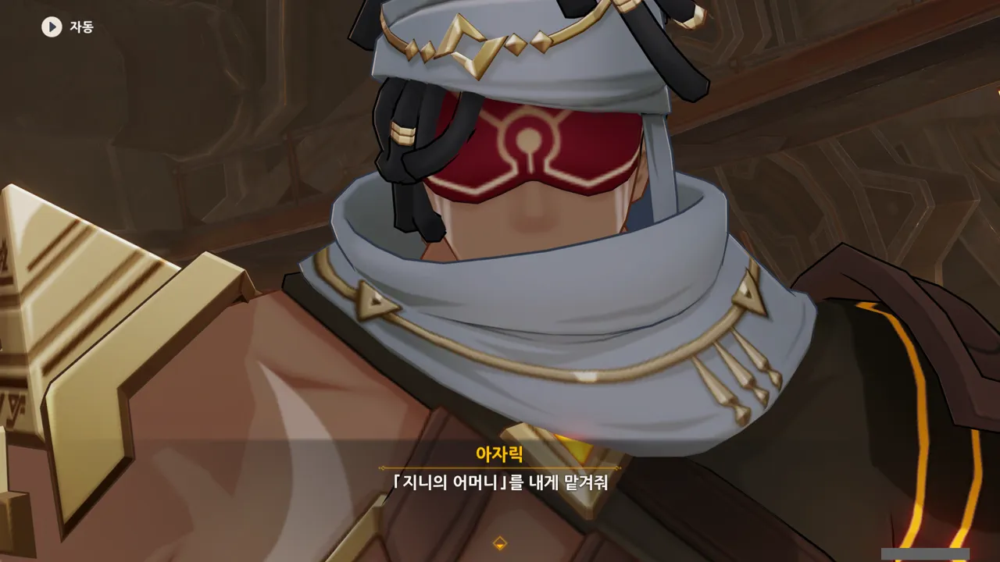

릴루페르를 자신에게 넘겨달라고 부탁하는 아자릭.

아, 그렇게 나오시겠다?

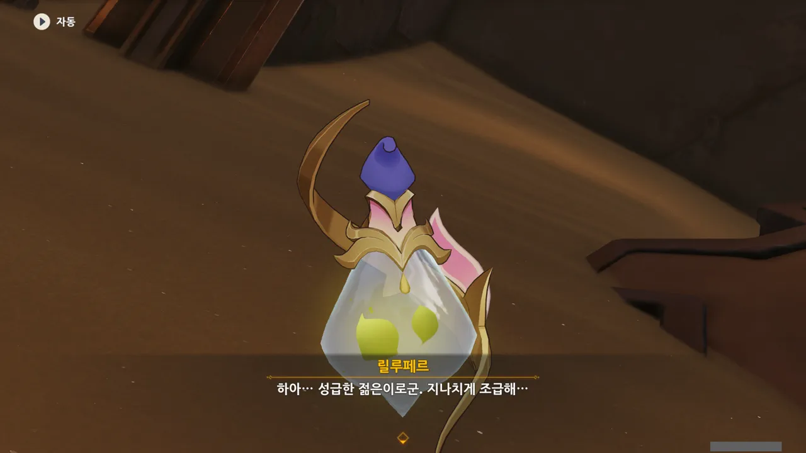

그 말을 들은 릴루페르가 아자릭을 '성급한 젊은이', '지나치게 조급하다'라고 한다.

이미 여러 번 배신의 낌새를 보여온 만큼, 언제 배신하냐의 차이만 있을 뿐이라 생각하고 있었는데?



곧 목적지에 도착하는 만큼, 「지니의 어머니」를 남의 손에 맡길 바에야 자기가 보관하고 있는 게 낫다고 말하는 아자릭. 그게 타니트를 위한 길이라고 한다.

웃기지도 않는 소리다. 그럴 거면 처음부터 릴루페르를 찾기 위한 여행에 동참했어야지.

금지(禁地) 같은, 되지도 않는 걸 들먹이면서 릴루페르와의 계약을 회피해 지니의 저주 대상에서 쏙 빠져 놓고, 영원의 오아시스에 다 와가니까 '남의 손' 운운하며 릴루페르를 가져가겠다?

어림도 없지. 지랄도 정도껏 해라, 아자릭.



심지어 이건 바벨이 시킨 일도 아니고, 순전히 아자릭 본인이 릴루페르가 욕심이 나서 하는 말이다.

그래놓고서 "분명 대모도 승인해 주실 거야"라고 하네.

야, 너, 어디 가서 개그맨 해도 되겠다, 얘.





아자릭의 논리는 대충 이렇다.

> 「지니의 어머니」를 더 필요로 하는 건 타니트 부족이다.
> 타니트 부족은 지니의 힘을 이용해 사막에 울창한 오아시스를 재창조해, 비옥한 땅을 얻을 수 있을 것이다.
> 그리하면 바벨은 제트를 후계자로 인정할 것이고, 여행자 역시 그에 합당한 *명예*를 얻을 수 있을 것이다.
{.bq}

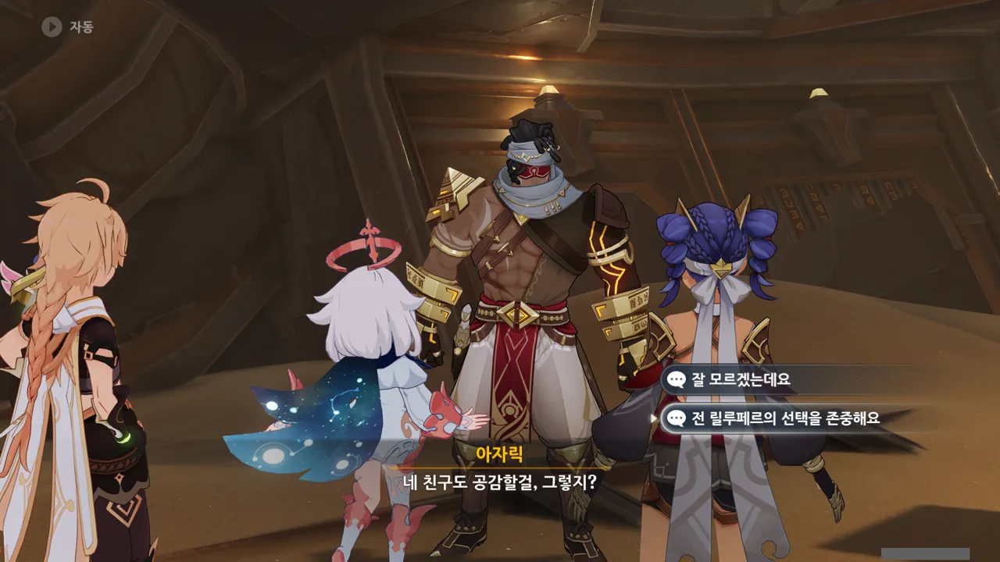

저 논리는 겉보기에 그럴듯해 보인다. 하지만 저 논리에는 두 가지 맹점이 있다.

* 릴루페르의 의사는 전혀 반영되어 있지 않다
* 지니의 저주를 짊어진 건 여전히 여행자이다

지금까지 릴루페르의 조각을 회수할 때, 그 주변에 있던 작은 오아시스가 말라비틀어진 걸 봤을 때, 타니트 부족이 원하는 비옥한 땅을 만들고 유지하기 위해서는 릴루페르를 오아시스에 천년만년 처박아둬야 한다. 릴루페르가 잠시라도 거길 떠난다면, 오아시스는 순식간에 말라붙을 테고.

릴루페르가 과연 그걸 좋아할까? 여기에 릴루페르의 의사는 전혀 반영되지 않았다.

게다가 현재 지니와 계약 관계를 맺은 건 여행자다. 지니와 계약을 맺을 때 언급된, '지니의 저주'는 여전히 여행자가 짊어지고 있다. 지금은 아무 일 없지만, 언제 '지니의 복수'의 대상이 될지 모르는 일.

하지만 아자릭은 절대 거기에 대해 '네 목숨을 지켜주겠다'와 같은 말을 하지 않고, 죽으면 아무런 소용없을 명예만을 언급하고 있다.

그러니까 '너 죽으면 비석 정도는 세워줄게'라고 말하는 것과 다름없다.

그리고 거기에 하나 더. 지니가 한, 진명을 건 계약을 깨는 방법은 계약자가 죽는 방법밖에 없다.

뭐, 그래서 여행자를 죽이려고?

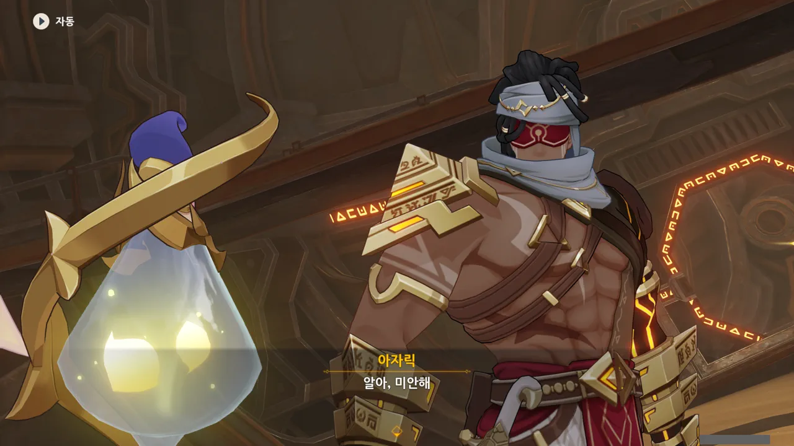

뭐? 진짜? 이 새끼 제대로 미쳤네.



여행자를 죽이겠다는 아자릭의 말에 제트 역시 제대로 화났다.

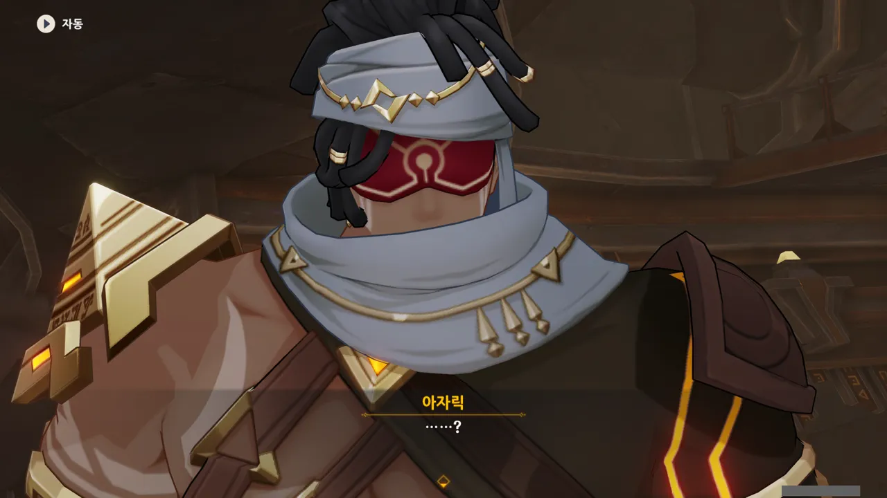

그리고 아자릭은 제트가 왜 화를 내는지 전혀 이해하지 못하고 있는 모습이다.



> | | |
> |:--|:--|
> | 제트 | 대충 알겠어. 너를 죽이겠다. |
> {_borderless=true,_thead=false}

그래. 원래 칼을 들었으면 역으로 칼에 찔려 죽을 각오 역시 해야 하는 법이다.

여행자를 죽이려 했다면, 여행자에게 죽임 당할 각오도 했겠지?



아, 타니트 부족이라는 한 가족 사이니까, 제트는 당연히 타니트 부족원인 아자릭의 편을 들어야 한다, 그 소리야?

오히려 그 반대지. 가족이 잘못을 저질렀다면 다른 사람보다 더 매섭게 꾸짖어야 하는 게 가족이다. 안에서 새는 바가지, 바깥에서도 새지 말라는 법은 없잖은가.

쓰다듬고 다독이는 건 그다음의 일이지.



제트가 밝히는, 아자릭의 행위가 부족에 대한 배신인 이유 세 가지.

1. 대모의 허락 없이 부족의 손님인 여행자를 해치려 하고, 여행자의 권리를 모욕했으니 이는 부족에 대한 배신이다.
2. 북방 외부인, 즉 우인단과 내통하여 배운 기술을 저 혼자서만 알고 부족원과 공유하지 않은 건 부족의 도덕성에 대한 모독이다.
3. 동족인 제트를 속이고 곤경에 빠트린 것 역시 배신이다.

제트 말 참 잘한다! 잘한다잘한다 잘한~다!



> 검으로 네 결백을 증명해 봐.

여태 오빠처럼 여기고 있던 아자릭에게 배신당한 제트의 마음이 절실히 이해된다.



이번엔 다른 논리를 꺼내드는 아자릭.

자길 죽이면 제트가 되려 배신자가 된다고 한다. 제트가 부족원을 죽이면 제트의 결백을 증명해 줄 사람이 없다고 하는데...

이게 바로 타니트 부족이 제트를 진정한 부족원으로 받아들이지 않았다는 증거 아냐? 제트에게 '혼혈'이란 낙인을 찍고 뭘 해도 의심한다는 말이잖아.

심지어 제트를 아끼는 것처럼 보이던 아자릭까지 여태 그런 생각을 하고 있었다는 걸 보면, 부족원 전체가 이런 생각을 하고 있다는 짐작도 할 수 있다.

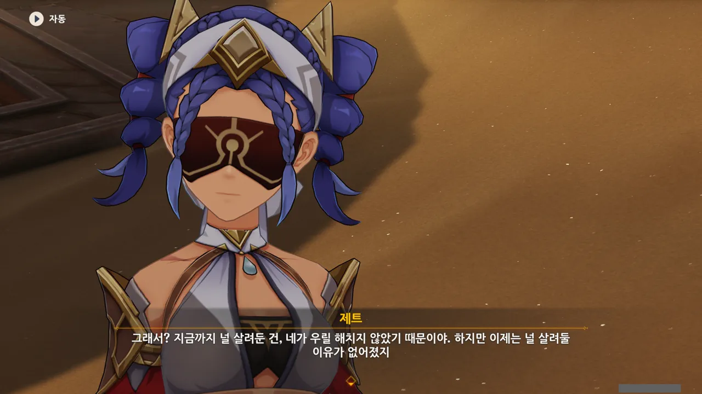

그렇지. '어쩌라고' 이 한 마디면 다 해결된다.

생각해 보라. 이건 뭘 해도 제트의 정당방위라고? 혼혈이라는 이유 하나 만으로 제트에게 부족의 온갖 더러운 일을 다 시켜온 주제에, 제트를 차별하고 있었지 않은가. 이건 제트가 타니트 부족원들을 몰살해도 할 말이 없지.

뭘 새삼스럽게...



> 진정해 우린 아직 대화로 해결할 여지가 있어

ㅋㅋㅋㅋㅋㅋ 아, 이 집, 개그 잘하네. ㅋㅋㅋㅋㅋㅋ

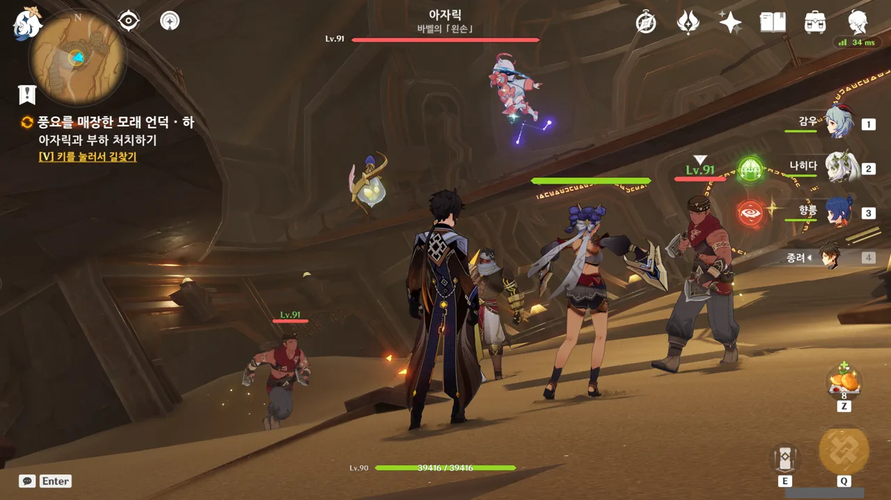

저번에 봤던 어깨인지는 잘 모르겠지만, 갑자기 패거리가 나타났다.

그나저나 아자릭의 별칭이 '바벨의 「왼손」'이었구나.

저번에 릴루페르가 제트가 명령에 따라 *왼손*이 모르게 해야 할 일을 해왔다고 했는데, 설마 이걸 노린 거였나?

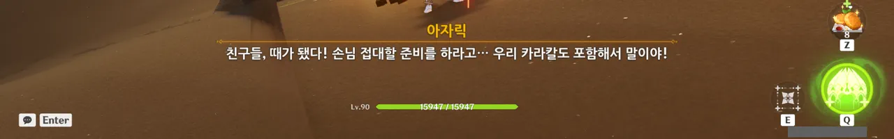

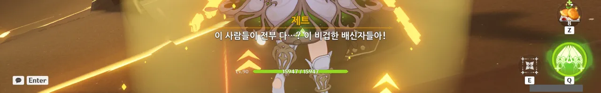

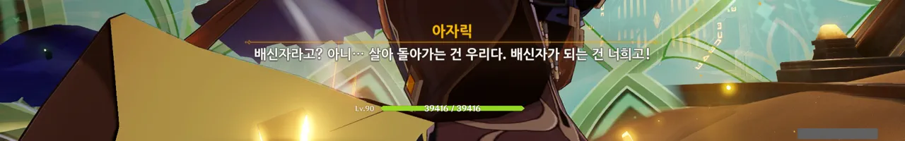

아, 그래. 다른 게임에서도 비슷한 이야기를 들었었지.

> History is written by the victor.

그런데 너네들, 그냥 잡몹이잖아. 이길 수 있을 리 없지.

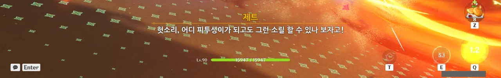

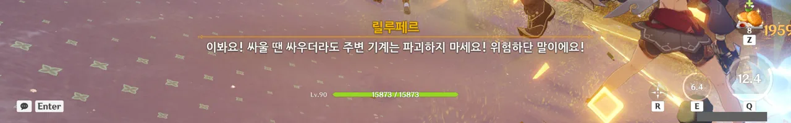

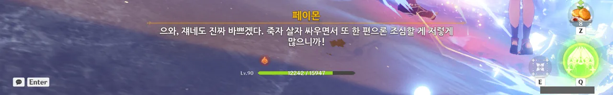

하하, 개판이네.

게임 내적으로는 릴루페르의 말처럼 주변 기계를 파괴하지 않도록 신경 쓰면서 난전을 벌여야 하고, 게임 외적으로는 전투하는 와중에 대사가 바뀌면 제때제때 사진을 찍어야 하고...

이게 개판이 아니면 뭐겠는가.

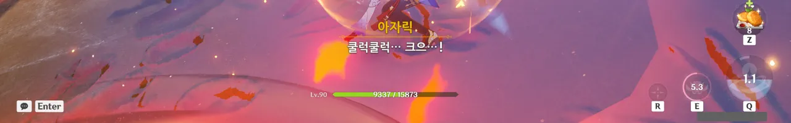

아, 이겼다.



나의 카라칼 ㅋㅋㅋ 마지막까지 지랄이 짜다.



그래, 유언이라면 들어줄 수 있지. 뭐, 갈 때 가더라도 담배 한 대 정도는 괜찮으니 말이다.

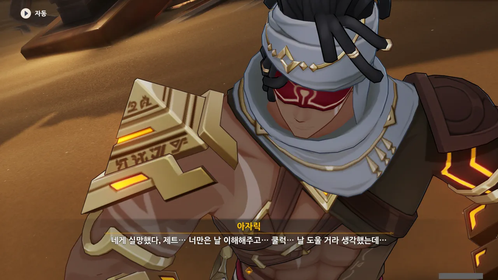

아니, 유언을 말하랬더니, 신박한 개소리를 지껄이고 있네 ㅋㅋㅋ

실망은 제트가 더 했지. 넌 실망을 운운할 처지가 아냐, 이 자식아.



이런 말, 꽤 유명하지 않던가? 거짓과 기만 위에 세워진 풍요는 오래가지 않는다라고...

그리고, 이미 아카데미아에서 사막 민족에 대한 복지를 제공하기 시작했다. 그 일환인 교육조차 '에이, 기초적인 지식밖에 없네' 하고 걷어찬 주제에 바라는 게 참 많다.

제대로 된 열의가 있었다면 '선생님, 이미 알고 있는 내용입니다'라는 식으로라도 이야기해봤어야지. 그런 말을 한 기미는 없던 거 같은데?

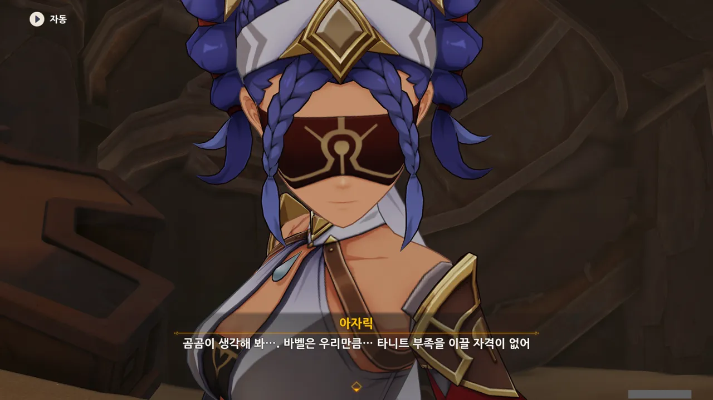

> 곰곰이 생각해 봐... 바벨은 우리만큼... 타니트 부족을 이끌 자격이 없어.

이야, 아자릭은 바벨의 뒤통수를 칠 생각도 하고 있었다는 거네? 바벨이 그렇게 아꼈는데, 배은망덕이 따로 없다.



어휴... 솔직히 말해, 더 들어줄 가치조차 없는 것 같다. 이 정도면 그냥 길에 가다 발에 차이는 수준의, 자기 논리에 매몰된 엑스트라 악당 1 정도밖에 안 되는 것 같은데.

난 아자릭이 배신할 때, 최소한 그럴듯하고 공감할 수 있을 법한 논리를 들고 와 배신하길 바랐다. 그런데 이건 논리의 기초부터가 잘못되었잖아.

하... 김이 팍 식어버렸다. 이건 피라미 수준도 안돼...

저런 뻔히 보이는 거짓말을 누가 믿겠나?

동서고금을 막론하고, '날 놔주면 너희를 곱게 보내주겠다'라고 말한 녀석이 그 말을 정말 지킨 경우는 손에 꼽을 정도다.



제트가 아자릭을 죽였다.

&nbsp;

그래, 아자릭이 틀린 말만 한 건 아니네. 살아 돌아가지 못한 쪽이 배신자라는 거, 그거 하나는 맞는 말 같다.





아까의 전투 탓인지, 유적 거상이 불안정해져, 감정을 추스를 새도 없이 유적 거상을 탈출해야만 하게 되었다.

유적 거상을 못쓰게 될 줄은 알았는데, 이런 식으로 못쓰게 될 줄은 몰랐는걸.



유적 거상 내부 곳곳에서 작은 폭발과 스파크가 일어난다.

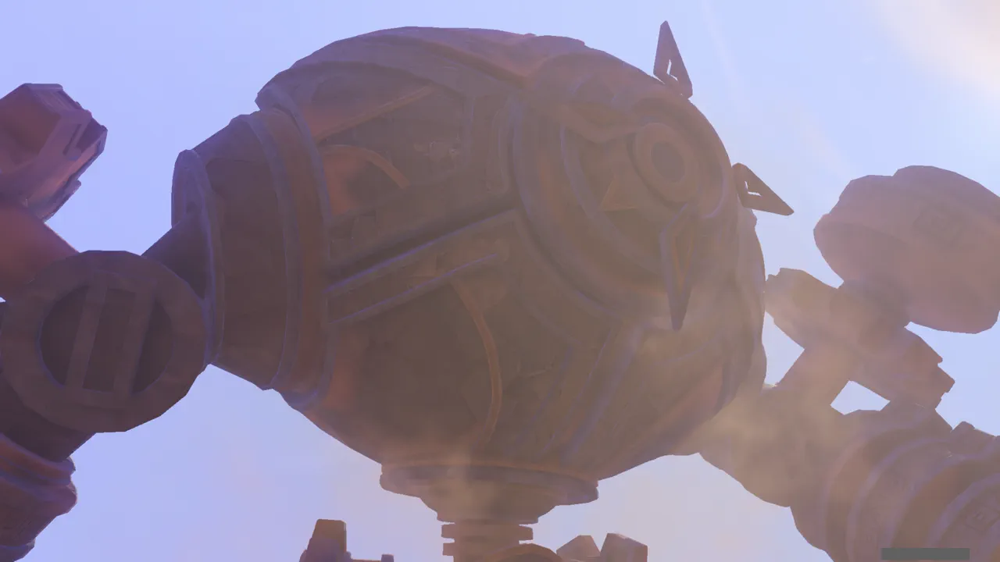

유적 거상이 천천히 중심을 잃고 쓰러진다.



제트와 페이몬, 릴루페르는 다 멀쩡한데, 여행자 혼자만 정신을 잃은 모양이다.

아, 그래. 유적 거상이 폭발할 수도 있긴 하겠네. 안에는 아직 에너지원이 그대로 남아있을 테니까.



유적 거상에서 여행자가 곱게 나왔으면 기절할 일이 없었을 테니, 유적 거상에서 튕겨나간 듯하다.

그런데도 고작 멍이 좀 든 것뿐이라니, 운이 굉장히 좋았네.

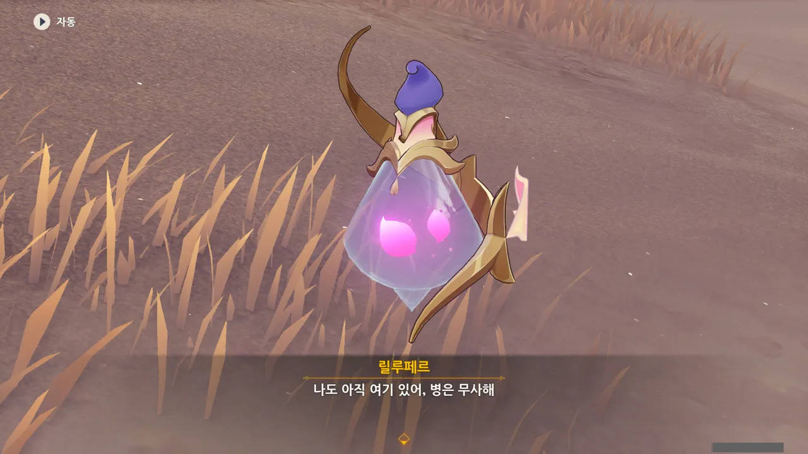

릴루페르 역시 무사하다. 그 정도 충격이었으면 병이 깨질 법도 한데 말이다.



제트는 고작 상처 몇 개가 늘었을 뿐이라고 한다.

정말 괜찮은 거 맞지...?

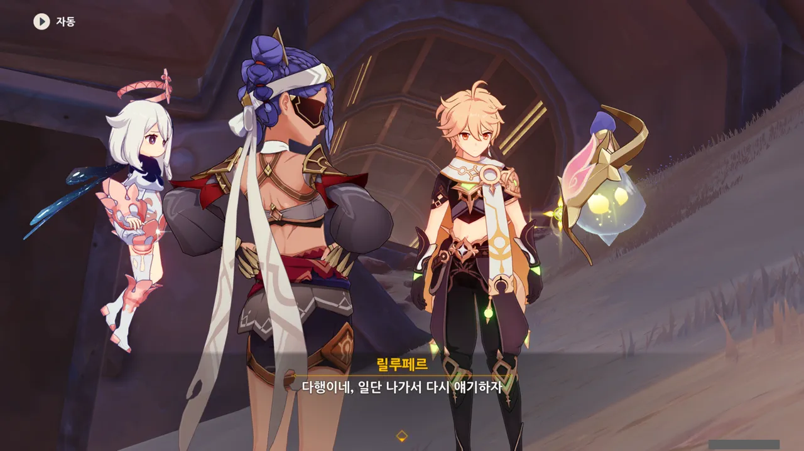

일단 다들 무사하니, 유적 거상에서 벗어나서 다시 이야기하기로 했다. 이 주변은 아직 위험하니 말이다.

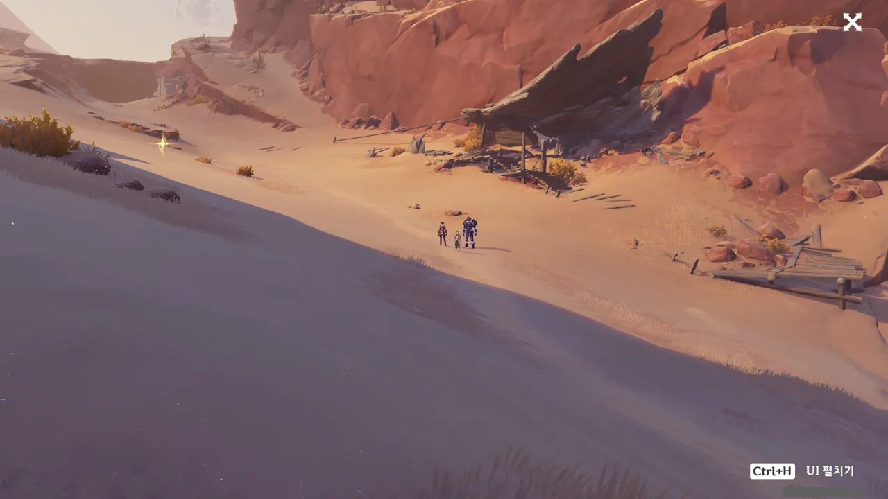

그런데... 저기 저 세 사람은 뭐냐? 저 중 둘은 우인단으로 보이는데?

아자릭을 처치하고 나니, 이런 업적이 깨졌다.

윤활유가 될 때까지 끓인다고? 찾아보니, 분별증류로 석유를 증류할 때, 가장 마지막에 남는 게 윤활유와 아스팔트라고 한다.

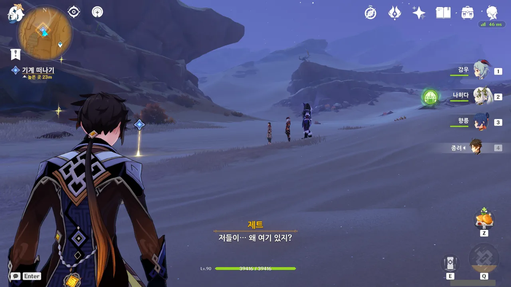

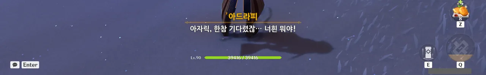

뒤의 둘은 우인단인 걸 곧바로 알아차렸지만, 가운데의 사막인이 누구인지 몰랐는데, 이제 보니 아드라피였다.

그런데 아자릭? 설마 아드라피와 아자릭이 서로 한패였어? 그것도 우인단을 끼고?

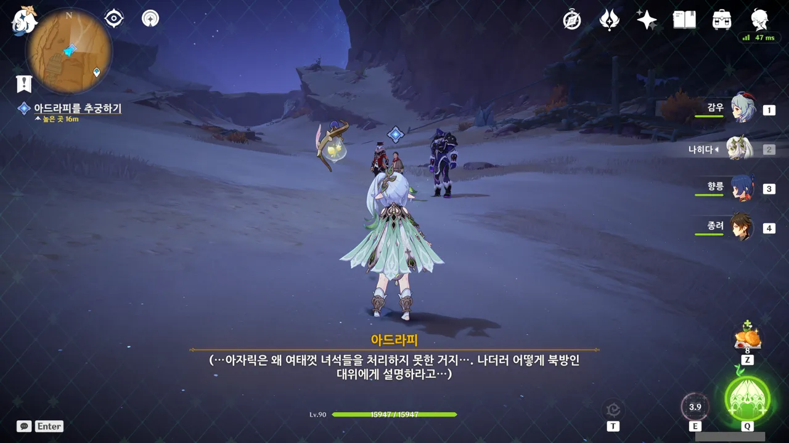

나히다로 마음속을 들여다보니, 아드라피는 아자릭이 이미 여행자 일행을 처리했을 거라 예상한 듯하다.

어림도 없지. 여행자를 죽이려면 마신 정도는 나와야 가능할걸?



아, 그러고 보니, 아드라피는 아자릭이 배신하기 훨씬 전부터 부족의 배신자로 낙인찍혀 추방되었었지?

아드라피가 일단 진정해 보라고 하지만, 잔뜩 화가 난 제트는 '네 편이었던 아자릭은 이미 내 손에 죽은 지 오래다'라며 일갈한다.



이야... 그러니까 아드라피와 아자릭은 제트가 아자릭을 오빠처럼 생각하니, 아자릭이 여행자를 해치려고 할 때 여행자가 아니라 아자릭의 편을 들 거라고 생각한 거야?

아자릭이 여행자를 죽여서라도 릴루페르를 빼앗아가려 한 걸 생각해 볼 때, 릴루페르는 이들의 계획에 있어 필수불가결한 존재이다.

그런데 릴루페르의 계약자인 여행자를 죽여 릴루페르를 빼앗으려는 계획을 세울 때, 단순히 제트가 여행자보다 아자릭을 더 따를 것이란 가정만으로 이 모든 걸 계획했다고?

정신이 나가도 단단히 나간 건지, 자살할 새로운 방법이 필요했던 건지 정말 모르겠다.





아드라피가 뭔가 시간이라도 벌어보려는 건지, 잠깐 생각할 시간을 달라고 하는데, 바로 뒤에 우인단 둘을 데려다 놓고 그런 말을 하면 그저 변명거리를 생각할 시간을 달라고 하는 것 밖으로 보이지 않는다.

뒤의 두 우인단 역시 "으음... 그게 말하자면 긴데..."라며, 아드라피와 똑같이 버벅거리고 있다.



ㅋㅋㅋ 그렇지. 굳이 대화를 할 필요가 있나?

이미 아자릭이 모든 계획을 말하고 죽었으니, 그냥 다 죽여도 되고, 하나만 사실 검증용으로 살려둬도 되거든.

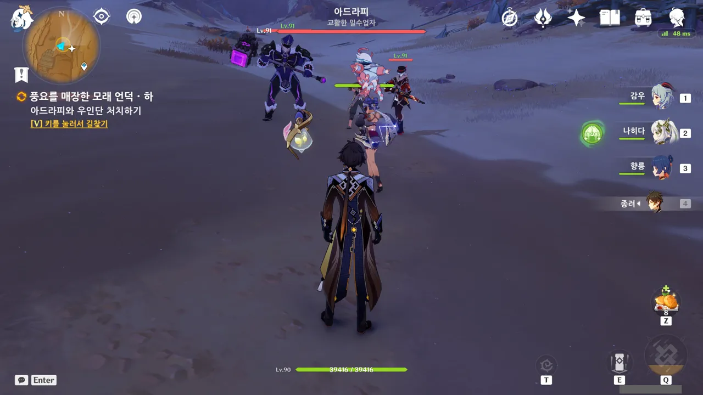

교활한 밀수업자, 아드라피와 전투 시작.

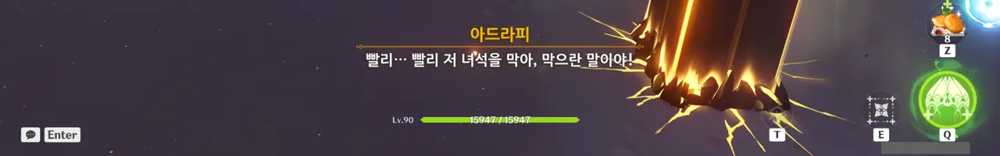

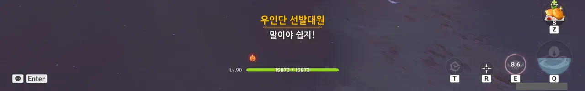

아드라피를 조금 어루만져주니, 우인단에게 어서 빨리 여행자를 막으라고 악을 써댄다.

하지만 이 시점에서의 여행자는 우인단의 천적이나 다름없거든. 그게 가능할 리 있겠나.

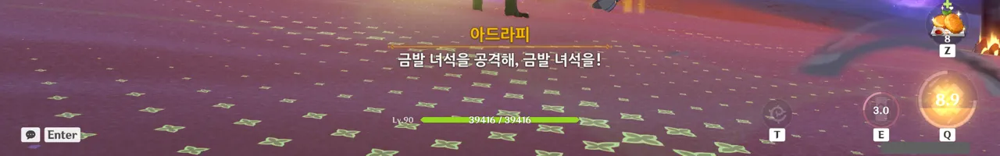

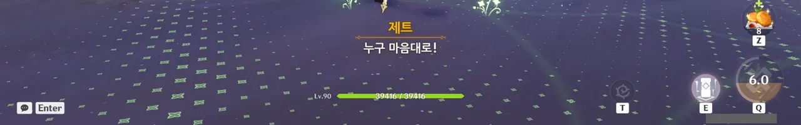

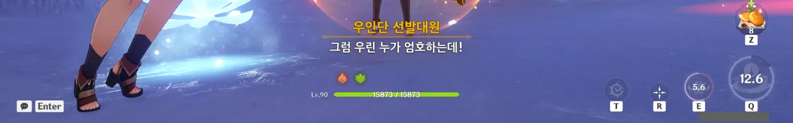

아드라피와 우인단이 서로 다투는 꼴을 보아하니, 아주 가관이다.

그런데 우인단 너네는 빈약한 무력을 가진 아드라피를 경호하기 위해 따라온 거 아니었냐? "그럼 우린 누가 엄호하는데!"라니... 직업 정신이 빈약하구나.

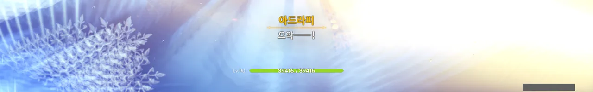

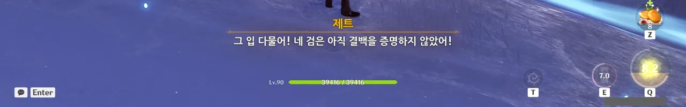

아드라피 컷! 아드라피는 "으악---!"이라는 단말마만을 남기고 사라져 버렸다.

정확히는 난전 중 아드라피가 어떻게 죽은 건지 제대로 못 본 것이지만. 뭐, 다른 도금여단 NPC가 죽을 때처럼 모래를 흩뿌리며 사라졌겠지.

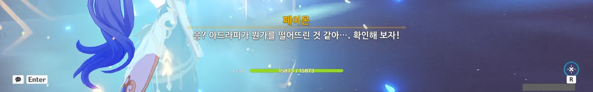

쨔잔, 페이몬이 '약탈'을 배웠다!

아드라피가 떨어트린 무언가를 확보했다.

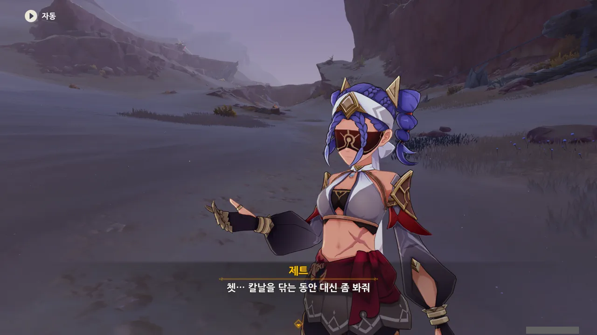

제트가 무기를 정비하는 사이, 아드라피가 과연 무얼 남겼는지 대신 읽어보기로 했다.

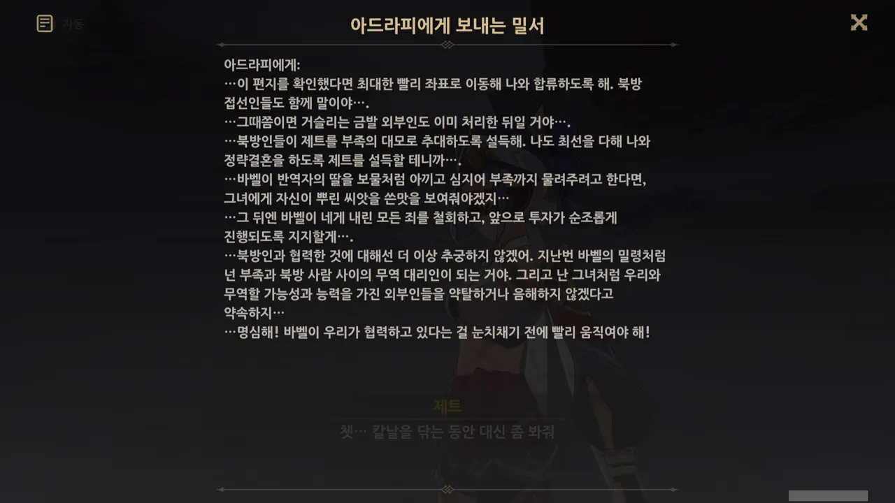

아드라피가 남긴 건 아자릭이 보낸 것으로 보이는 밀서였다.

&nbsp;

아자릭이 배신한 이유는 부족의 부흥 같은 거창한 것 때문이 아니었다. 아자릭은 그저 바벨 대신 자신이 권력을 잡고 싶었던 것뿐이었다.

&nbsp;

아자릭은 아드라피가 우인단과 결탁한 것 때문에 추방된 것을 알게 되자, 아드라피에게 몰래 한 가지 거래를 제안했다.

바벨이 아드라피에게 내린 추방 및 척살령을 철회하고, 아드라피가 이전처럼 우인단과 거래하는 걸 눈감아줄 테니, 자신이 부족의 실권자가 되도록 도우라는 내용이었다.

물론, 아자릭이 부족의 실권을 잡기 위해서는 현재 권력자인, 부족의 대모인 바벨이 먼저 제거되어야 했다.

바벨을 제거한 후, 아자릭과 아드라피는 우인단을 등에 업고, 부족의 다음 대모로 제트를 추대할 생각이었다. 그래야 아자릭이 제트와의 정략결혼을 통해 제트를 바지사장으로 만들고 부족의 실권을 쥘 수 있으니까.

그러면 아자릭이 아드라피에게 내려진 추방 및 척살령을 철회하고, 아드라피는 다시 부족으로 돌아올 수 있게 되는 것이다. 물론, 아드라피와 우인단은 예전처럼 계속 거래할 것이고.

하지만, 우인단을 등에 업고 부족의 실권을 쥔 이상, 아자릭은 우인단에게 쿠데타라는 약점을 잡힌 꼭두각시가 될 수밖에 없다.

&nbsp;

유적 거상 안에서 있었던 아자릭의 제안은 릴루페르와 여행자의 의사를 전혀 고려하지 않았고, 이번에 알게 된 그의 계획은 정략결혼의 당사자인 제트의 의사를 전혀 고려하지 않았다.

자길 여태 아껴준 바벨에 대한 배신이 들어간 건 말할 것도 없고...

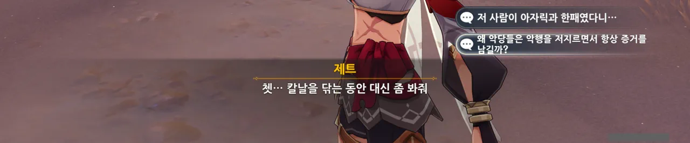

예전에 '악당들은 왜 자신의 악행에 대한 증거를 남기는 것인가'라는 질문에 누군가가 그 이유를 추론한, 재미있는 글을 읽었었다.

요약하면, 서로 언제 배신할지 모르는 악당 사이이기 때문에, 거래나 계약에 대한 증거를 남겨 상대방이 배신자라는 것을 증명하기 위함이라는 것이었다.

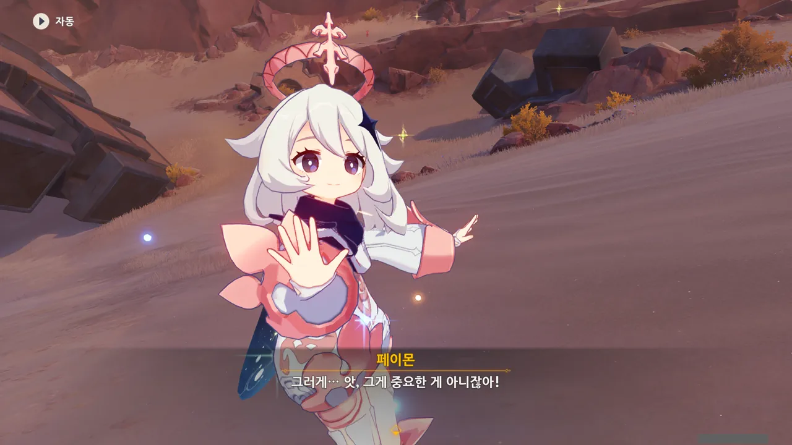

나도 알아. 그냥 한탄일 뿐이야...

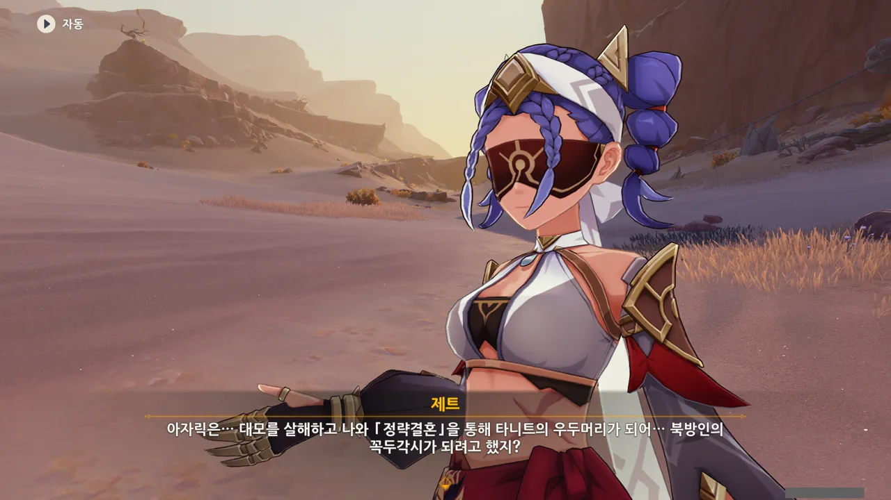

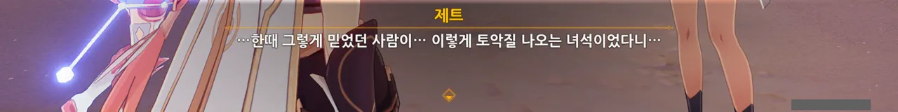

흔한 악당 C 유형, 권력에 눈이 먼 타입이지.

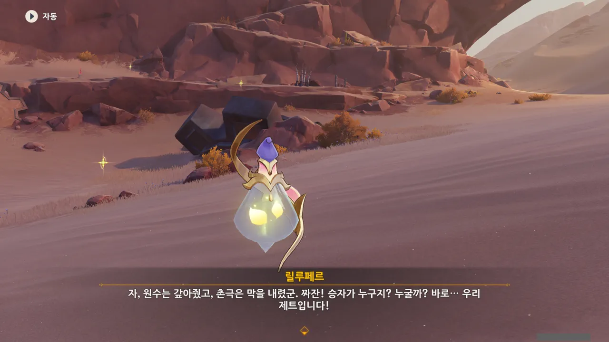

릴루페르가 많이 유해졌다. 지금 상황을 유머스럽게 정리하다니, 예전의 릴루페르였으면 톡 쏘는 소리만 했겠지...

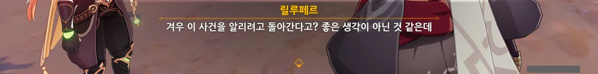

응? 왜 지금 돌아가면 안 되는데?

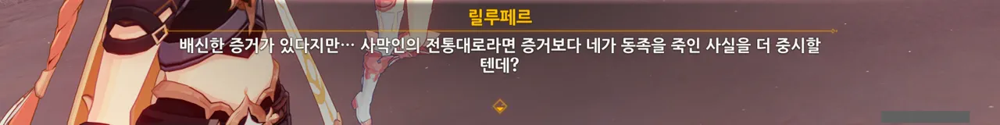

아자릭이 했던 말도 완전히 틀린 말은 아니었나 보다.

그러니까 지금 그냥 돌아가면 제트는 아드라피의 경우처럼 대놓고 추방이나 척살령이 내려지지는 않겠지만, 부족원을 죽였다는 오명을 짊어지게 된다는 이야기이다. 그게 잘한 일이던 잘한 일이 아니던 말이다.

릴루페르의 말은 그럴 바에는 그 오명을 덮어씌울 수 있을만한 성과를 가져가는 것이 낫다는 것이고.

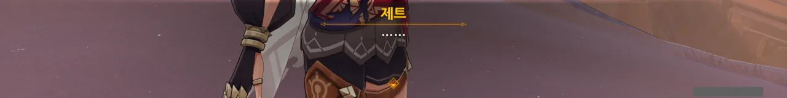

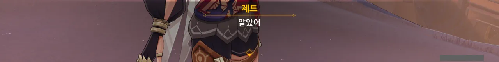

아니면 지금 돌아가더라도 이번 일을 일언반구 하지 않던가 말이다.

릴루페르의 친절한 설명을 듣자 제트도 수긍한다.

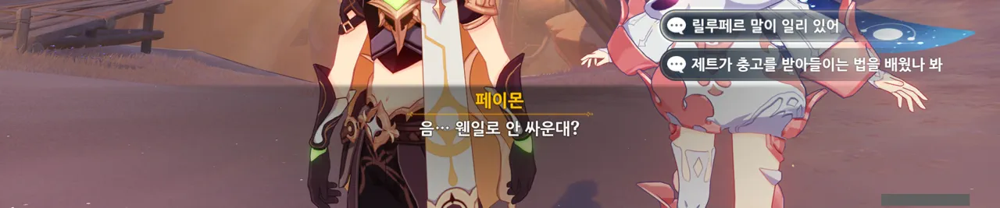

릴루페르가 말을 예전보다 훨씬 부드럽게 한 것도 있고, 제트가 릴루페르의 충고를 받아들여서이기도 하다.

둘 다 많이 컸는걸.

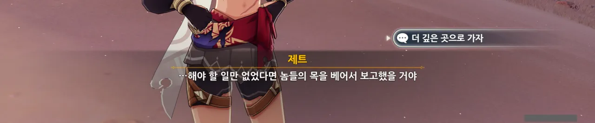

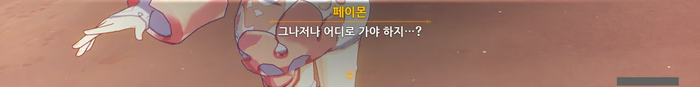

앞으로 가야 할 길은 릴루페르의 안내를 따르기로 했다.

뭐, 아자릭이 있을 때에도 릴루페르의 안내를 따랐으니, 달라진 것은 없다.

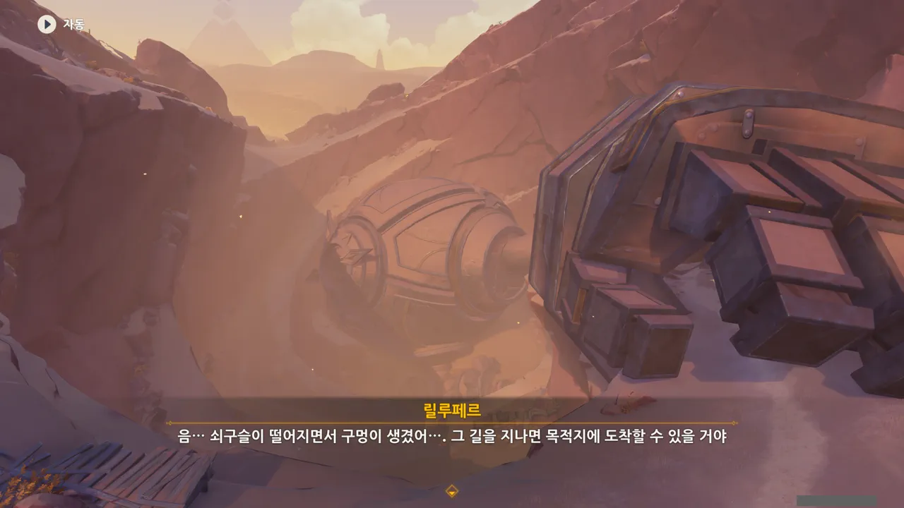

유적 거상이 그냥 땅바닥에 풀썩 쓰러진 줄 알았는데, 제법 큰 구덩이를 만들며 쓰러진 것 같다.

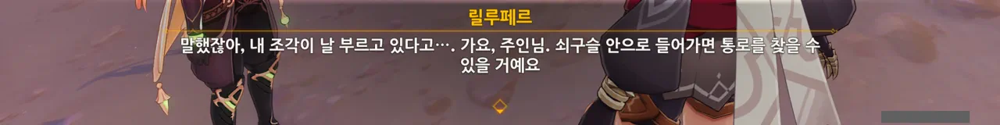

아마 더 깊숙이 내려가려면 유적 거상의 파묻힌 다른 한쪽 팔을 통해서 가야 할 것 같다.

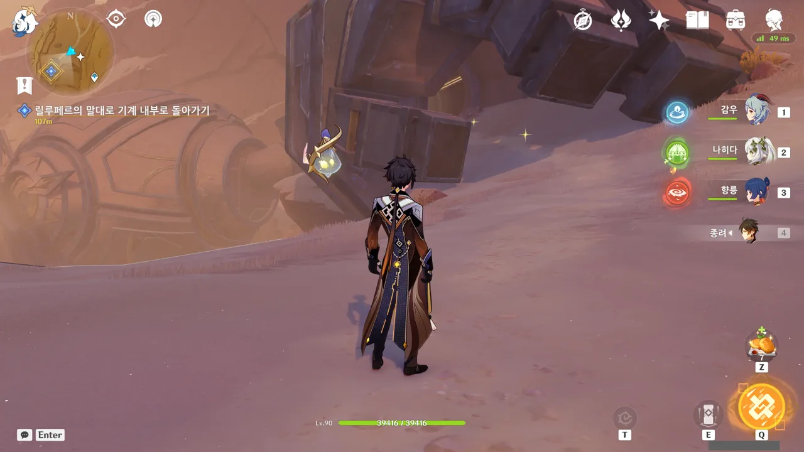

그나저나 가기 편하라고 왼쪽 팔은 이렇게 절벽에 걸친 채로 유적 거상이 쓰러져있다.

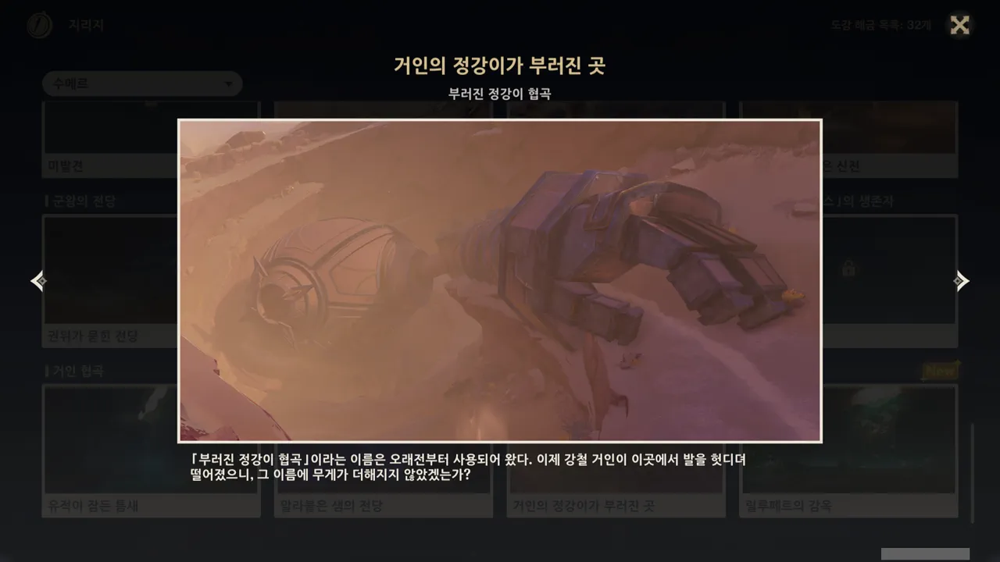

어쩌다 보니 지역 이름이 이름값을 해버렸다.

예전부터 '부러진 정강이 협곡'이라고 불리던 지역에 유적 거상이 쓰러졌으니, 정말로 이름값을 해버린 것이다.
