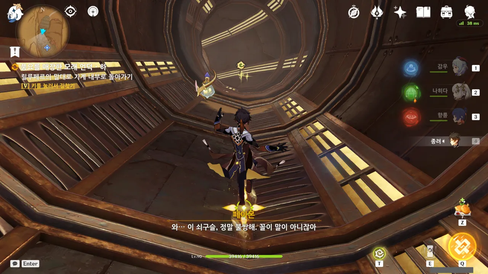

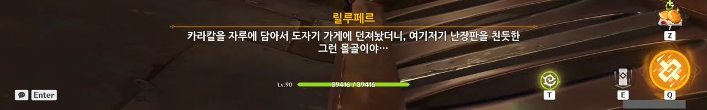

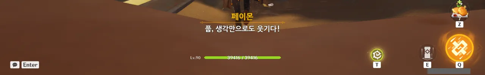

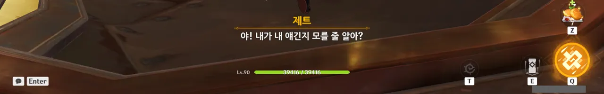

지금 유적 거상의 꼴이 말이 아니긴 하지. 당장 아까 여기서 탈출할 때만 해도, 곳곳에서 스파크와 불꽃이 튀기지 않았던가.

그런데 그걸 릴루페르가 '카라칼을 자루에 담아서 도자기 가게에 던져놨다'라는 식으로 비유하자, 자길 놀리고 있단 걸 제트가 귀신같이 알아채는 게 꽤 웃기다.

그와 별개로, 고양이를 --- 카라칼은 고양잇과 동물이니까 --- 자루에 담은 후, 도자기 가게에 던져두면 어떤 꼴이 날지 또 단번에 상상이 가, 웃겼다.

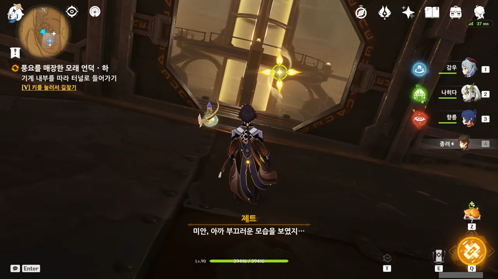

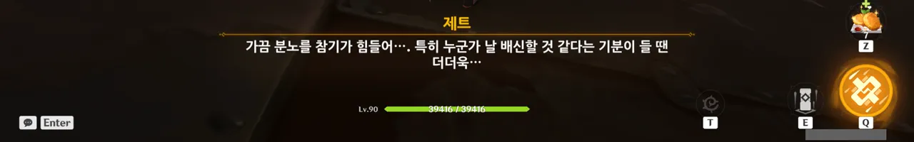

아자릭의 배신이 제트에게는 꽤 큰 충격이었나 보다.

하기야, 타니트 부족에 온 후 계속 오빠처럼 따라온 사람이 자신의 친구와 부족의 대모를 죽이자고 말하는 모습을 보고 충격을 받지 않을 사람은 없을 테니.

여행자는 제트와 다르게, 안 지 얼마 되지도 않은 사람이 자길 죽이려 드는 상황이었으니, 아자릭에 대해 별 생각이 없겠지만.

그나저나 제트가 '가끔 분노를 참기 힘들다'라고 말하는 걸 보면, '황금빛 꿈'에서 있었던 일이 제트에게 큰 마음의 상처를 남긴 모양이다. 분노를 참기 힘들다고 말하는 건 그때의 트라우마가 발현하는 게 아닐까?

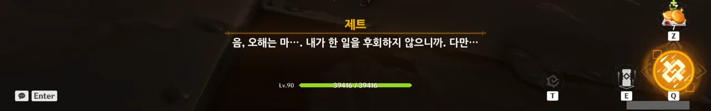

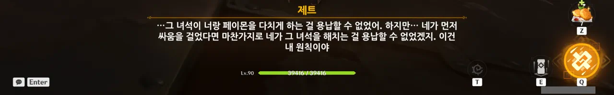

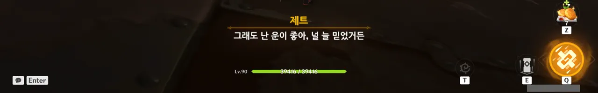

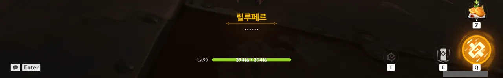

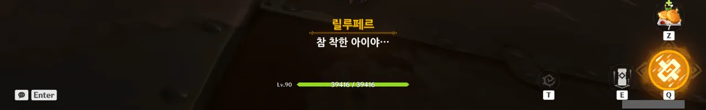

제트에게는 여행자와 아자릭 모두 소중한 사람이었는데, 아자릭이 자신과 부족을 배신하고 여행자에게 칼을 겨눈 상황을 쉬이 받아들이기 힘들겠지. 게다가 아자릭이 여태껏 자신을 어떻게 생각하고 있었는지조차 알게 되었으니 말이다.

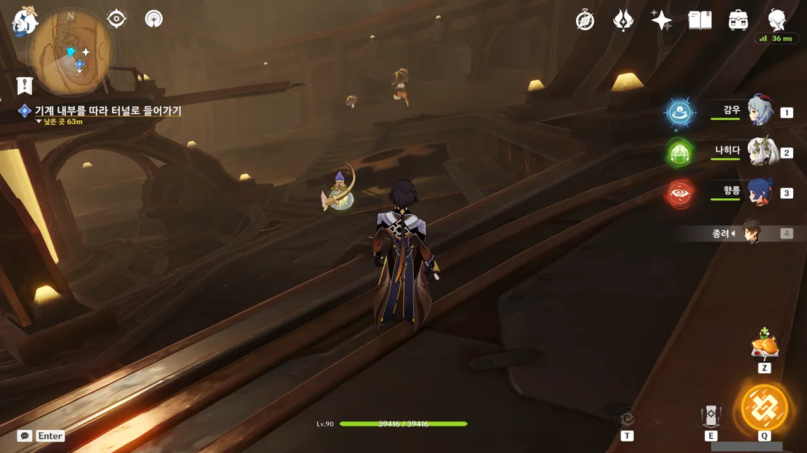

잠깐만... 여기 방금 전까지만 해도 굉장히 깨끗한 곳 아니었나? 유적 거상이 쓰러진 지 얼마 되지도 않았는데 벌써부터 안에 버섯몬이 진을 치고 있다.

이거 맞아?

유적 거상에서 발견한 계약서.

타니트 부족에서 봤었던 계약서와 동일한 것 같다. 옛날 쓴 글을 다시 찾아 읽어보니 내용이 완전히 동일하다. 그때에도 아자릭의 이름이 계약서에 쓰여있었구나.

이건 아자릭이 갖고 있었던 계약서인 것 같다. 그렇지 않고서야 이게 여기에서 발견될 이유가 없지 않은가. 아자릭은 왜 이 계약서를 계속 들고 다닌 걸까?

다만 이 계약서는 몇 년 전 작성되었다고 쓰여있는데, 타니트 부족에서 발견한 문서에는 그런 내용이 없었다. 타니트 부족에서 본 건 계약을 갱신하며 새로 쓴 계약서였던 걸까?

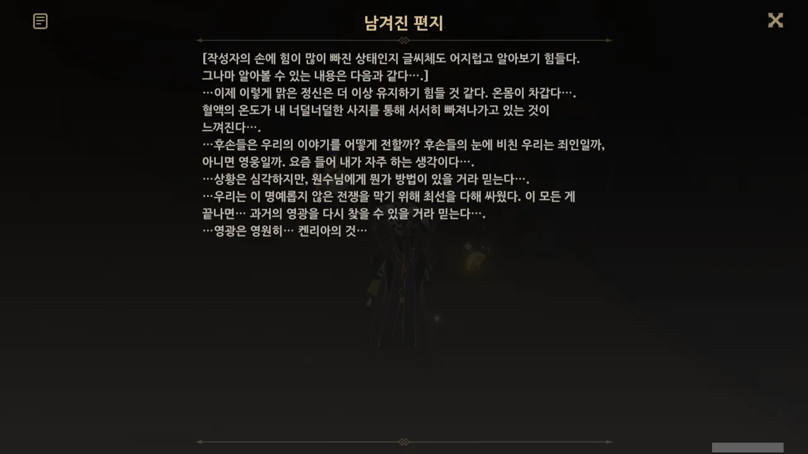

그리고 또 다른 문서. 이건 유적 거상이 최초로 좌초했을 때 유적 거상에 타고 있던 켄리아인이 남긴 유서로 보인다.

어디서 주워들은 것인지 모르겠는데, 켄리아가 수메르 지하 깊숙한 곳에 있는 지하 왕국이라고 하더라. 수메르 곳곳에 유적 거상이 보이는 건, 500년 전 켄리아에서 사람들이 탈출할 때 유적 거상을 타고 탈출해서 그렇다고 들었다.

이야, 잔디크가 여기까지도 왔어?

지금껏 나온 정황상의 증거를 보면, '잔디크'는 우인단 집행관 '도토레'의 본명으로 보인다. 만약 그렇다면, 우인단이 아자릭에게 유적 거상에 대한 자세한 정보를 제공한 것이 전혀 이상한 일이 아니게 된다. 도토레가 이미 유적 거상을 연구했으니까.

그나저나 노트의 내용을 보면 도토레가 유적 거상을 타다가 멀미를 한 것을 알 수 있다.

> 평행감각이 크게 흔들리는 바람에 **생리적으로 버틸 수 없어서** 운행을 멈춰야만 했다.
{.bq}

ㅋㅋㅋㅋㅋㅋㅋㅋㅋㅋㅋㅋ

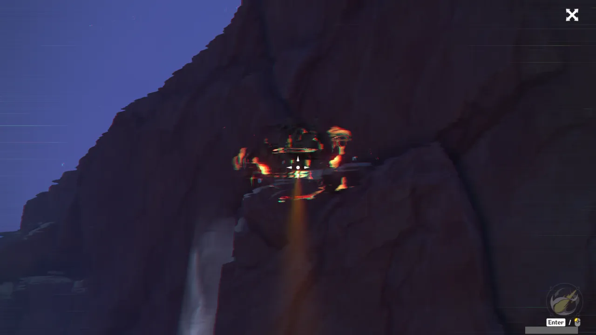

아까 신나게 싸우면서 유적 거상 내부가 크게 손상되었음에도 불구하고, 유적 거상의 주 무기 시스템은 여전히 잘 작동한다. 정말 대단한 기술력이야.

그래서 대충 부술 수 있어 보이는 바위와, 그 근처에 있던 츄츄족들을 유적 거상의 주포로 날려버렸다.

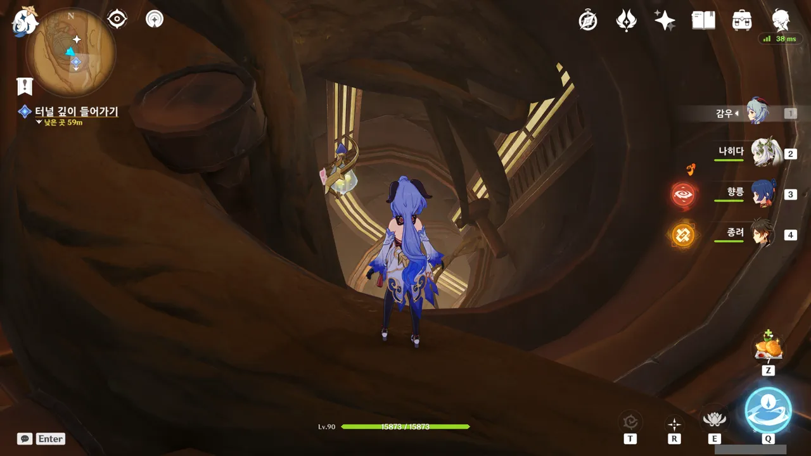

아까 유적 거상 내부에 버섯몬이 나타난 것도 이상했는데, 이것 역시 이상하기 짝이 없다.

유적 거상의 오른팔 내부에 굵은 나무줄기가 자라 있다.

유적 거상이 이곳에 온 건 얼마 되지 않았으니, 그 사이에 나무가 이렇게 크고 빨리 자랐을 리가 없다. 그렇다면 이 나무줄기는 유적 거상이 우매 별궁에 있었을 때부터 있었던 것이라 봐야 하는데, 그렇다기에는 나무줄기가 부러진 흔적이 전혀 없다.

분명 유적 거상이 쓰러지면서 오른팔에도 큰 충격이 갔을 텐데?

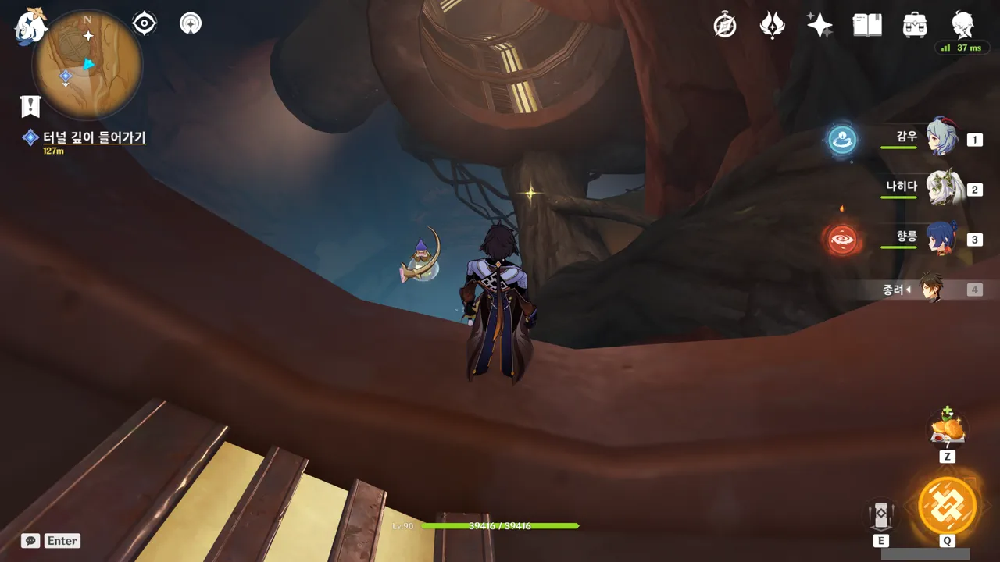

자, 봐라. 유적 거상의 오른팔이 이렇게 조각났을 정도의 충격이었는데, 나무줄기가 부러진 흔적은 전혀 보이지 않는다.

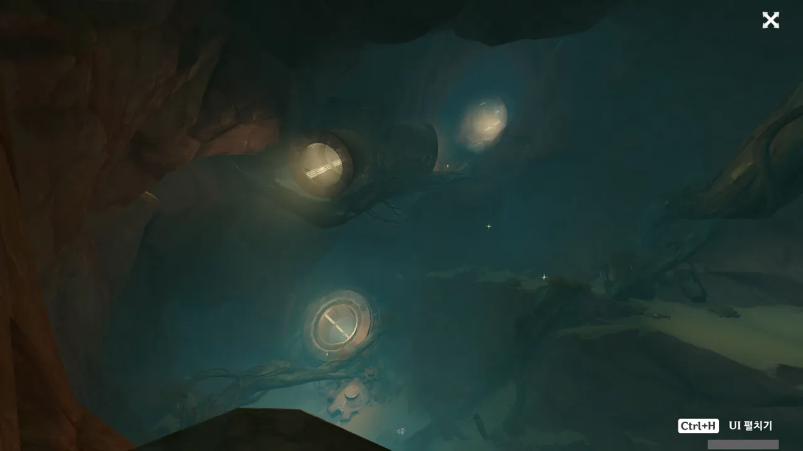

밖에서 보니, 더 이상하다.

유적 거상은 분명 위에서 아래로 쓰러졌다. 그리고 지금 이곳은 밀폐된 동굴 안이다.

이것이 가능하려면, 유적 거상이 쓰러지면서 *우연찮게* 뚫린 구멍에 오른팔을 집어넣었고, 유적 거상의 오른팔은 동굴이 뚫린 모양대로 이리저리 구부러지며 더 깊숙이 들어가다가 급격한 각도 변경에 의해 산산조각 나 동굴 안쪽에 흩어져야 한다.

그게 가능할 리 없잖아. 게다가 그런 것치고는 유적 거상의 오른팔 안에 있던 나무줄기가 충격에 의해 부러진 흔적이 전혀 보이지 않는다고.



또 다른 스위치를 발견했다. 스위치를 누르자, 모래가 흘러내린다.

아, 여기서도 신나게 모래 파이프 퍼즐을 풀게 생겼구나.

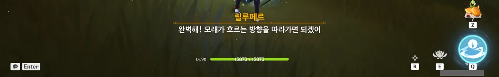

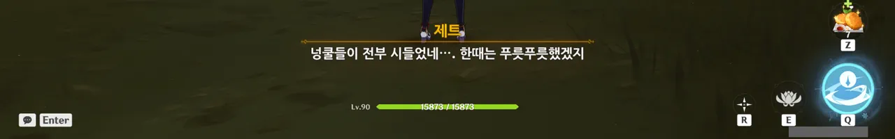

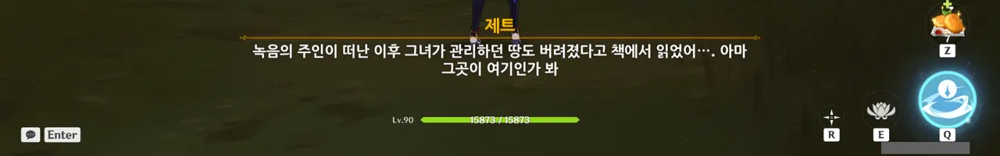

저번에 봤던, 자홍빛 파디사라의 나무줄기에는 곳곳에 가시가 돋쳐있었지만, 여기 나무줄기에는 가시가 없다.

거기만 뭔가 특별했던 걸까?

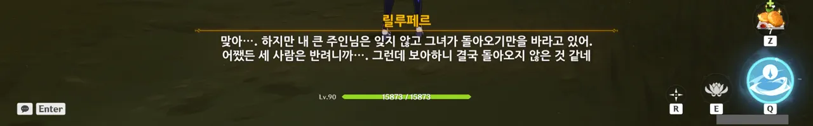

이념...? 적왕이 대체 무슨 이념을 갖고 있었길래?

그나저나 내가 알기로 화신(花神)은 아예 죽은 것으로 알고 있는데, 릴루페르는 계속 '화신이 돌아올 것이다'라는 말을 한다. 진짜 내가 뭘 잘못 알고 있던 건가?

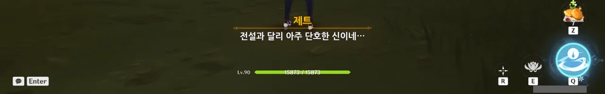

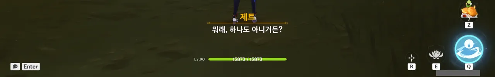

큰 충격을 받긴 했지만, 제트도 단호한 면이 있긴 하다. 아자릭이 배신하자, 우유부단하게 아자릭과 여행자 사이에서 갈등하지 않고 대번에 아자릭을 끊어내버리지 않았는가.

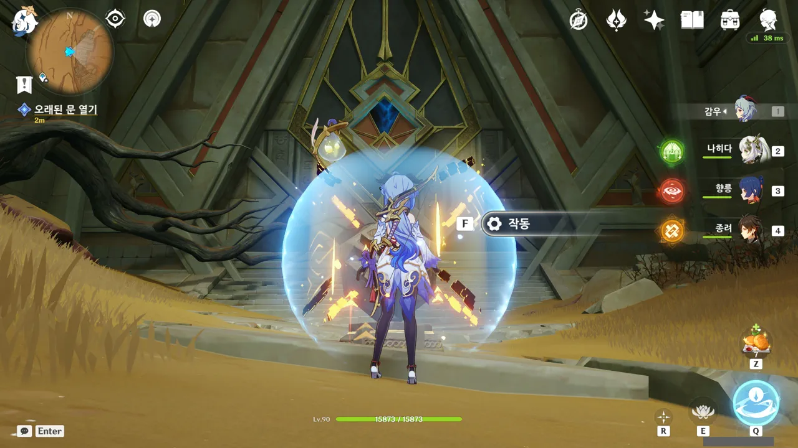

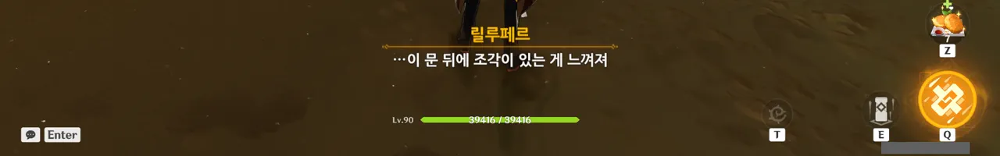

거의 다 온 모양이네.

어째 이 방의 모습이 낯익다? 처음 릴루페르의 조각을 얻었던 방의 모습과 비슷해 보이는데.

설마 여기도 태고의 빛인가 뭔가 하는 걸 끌고 와서 불을 밝혀야 하는 그런 구조인가?

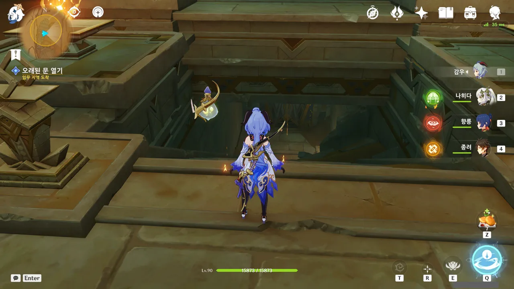

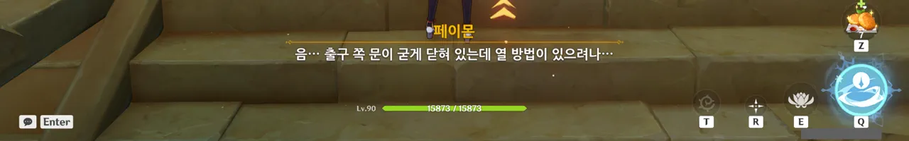

어, 그런데 여긴 릴루페르의 조각이 있을 것으로 추정되는 방의 문이 닫혀있다.

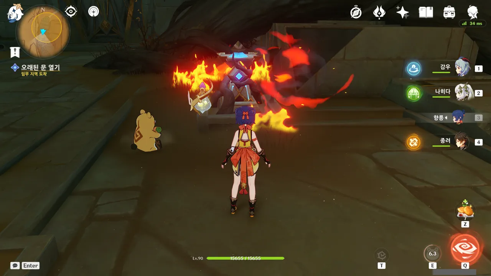

스위치를 감싸고 있는 넝쿨은 불로 태울 수 없다. 결국 퍼즐이네.



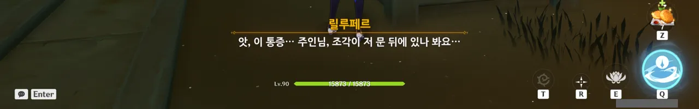

모래를 끌어오자, 스위치에 얽혀있던 넝쿨이 풀린다. 스위치를 누르니 문이 열린다.

대체 무슨 원리야?

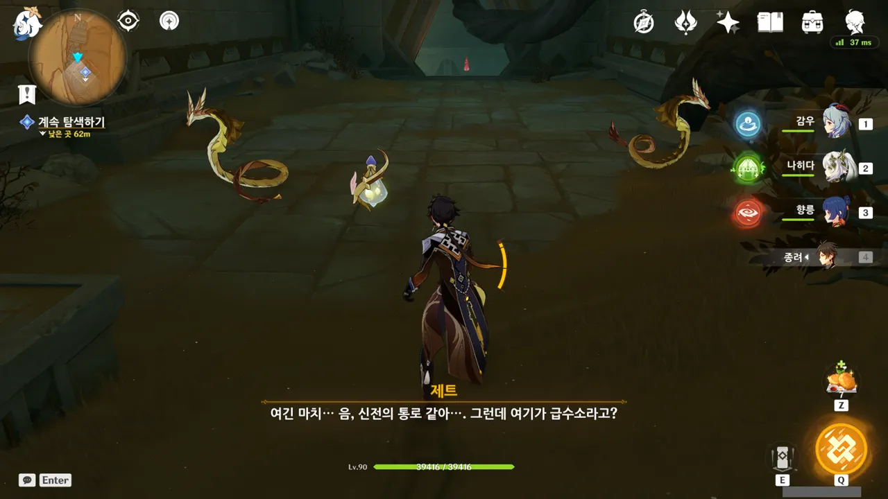

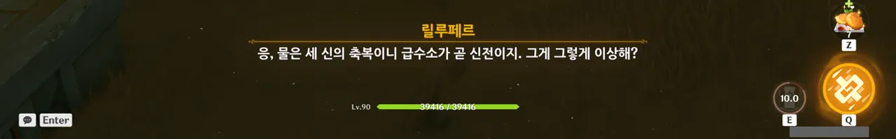

옛날 사막 사람들은 물을 세 신이 준 축복이라 여겼구나. 그래서 급수소가 곧 신전이었던 거고.

즉, '신전이 급수소의 역할도 겸했다'가 아니라, '급수소가 신전의 역할을 겸했다'였던 셈이다.

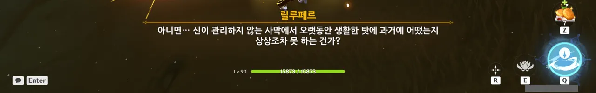

또 릴루페르가 무슨 핀잔을 주는 건가 생각했는데, 릴루페르가 봉인되었을 때에는 아직 사막에 왕국들이 멀쩡하게 있었을 때 아니었던가?

이미 사막 왕국이 모두 멸망해 폐허만 남은 시대에 태어난 제트와, 사막 왕국이 멀쩡할 때에 봉인당한 릴루페르가 보는 시선이 다를 수밖에.

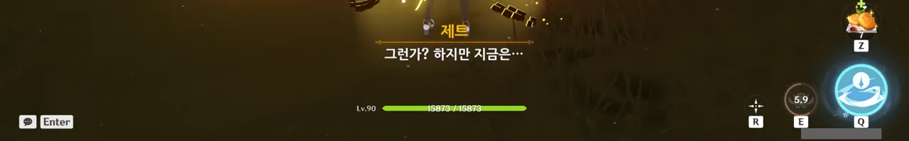

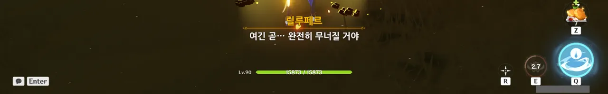

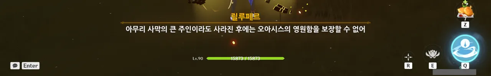

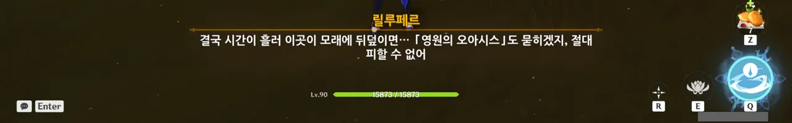

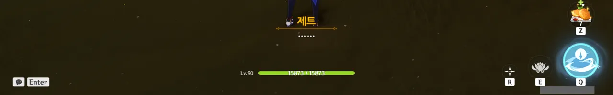

「영원」이란 건 없는 법이다.

릴루페르가 봉인되었을 때만 해도, 이곳의 파이프에는 물이 흐르고 있었다. 하지만 사막 왕국이 모두 멸망하고, 시간이 한참 지난 지금에는 파이프에 물 대신 모래가 흐르고 있지.

시간이 지날수록 이 지하는 모래로 점차 메워질 것이고, 영원의 오아시스에 에너지를 공급하던 지하 시설들 역시 모래에 파묻힌 끝에, 더 이상 영원의 오아시스에 에너지를 공급해주지 못할 것이다.

그러면 에너지의 공급이 끊긴 영원의 오아시스 역시 주변의 사막처럼 황폐하게 변해버리겠지.



아무튼, 릴루페르의 다른 조각을 찾았다.

이건 릴루페르가 왕의 가족들을 꿀로 익사시킨 장면을 말하는 거겠지?

릴루페르의 기억은 너무 조각난 데다가 비유가 너무 많아, 정확히 무슨 내용인지 이해하기 힘들다.



남의 기억을 보는 일에 중독될 수도 있나?

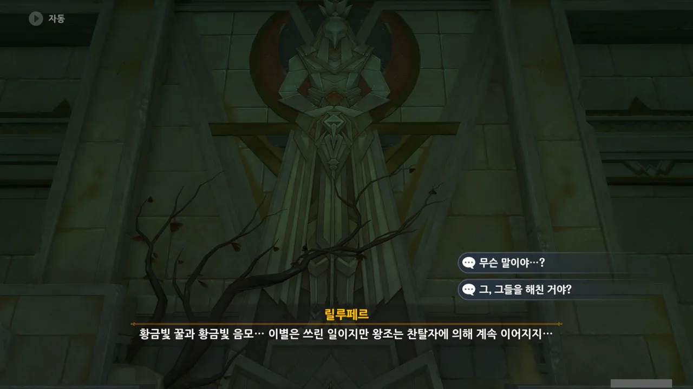

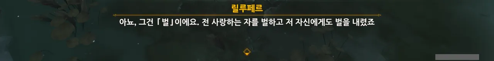

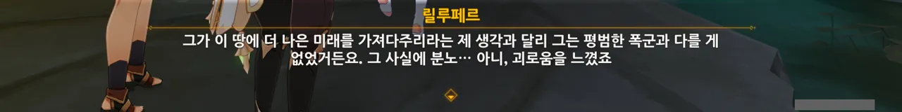

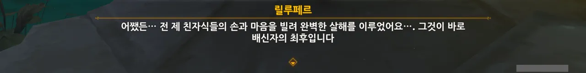

저번에 야영지에서부터 든 생각이지만, 릴루페르가 옛날이야기랍시고 들려준 이야기는 전부 릴루페르 자신이 행하고 겪은 이야기가 아니었을까? 왕족을 꿀에 익사시켰다는 이야기는 이미 제트의 말에서 입증이 되었으니 말이다.



그래. 복수를 위해 제 친자식까지 이용하는 건 분명 정상이 아니다.



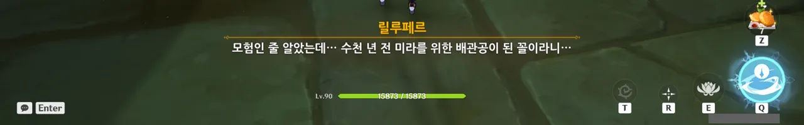

저번에 했던 것처럼, 스위치를 눌러 아래쪽 광장에 모래를 공급한다.

> 수천 년 전 미라를 위한 배관공이 된 꼴이라니...

배관공이라고 하니, 마리오를 떠올리지 않을 수 없더라. 마리오 시리즈에 미라는 없지만, 해골은 있으니, 아무튼 비슷한 거 아닐까?



이제는 놀랍지도 않다. 릴루페르도 '이럴 줄 알았어요!'라고 하지 않은가.



이번에도 모래가 바깥으로 길을 안내한다.

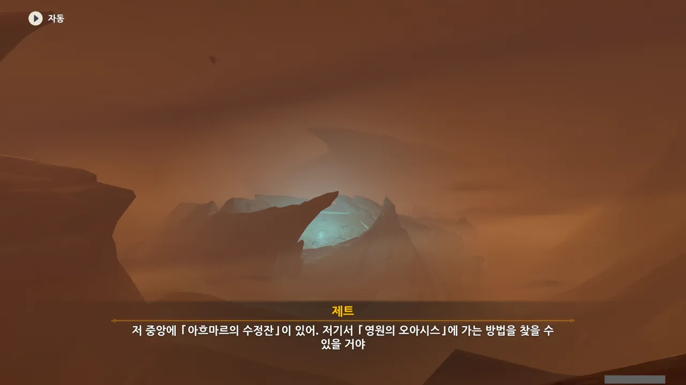

세 곳의 장치를 모두 작동시켰으니, 이제 저 가운데로 갈 수 있는 걸까? 대체 저기엔 뭐가 있을까?

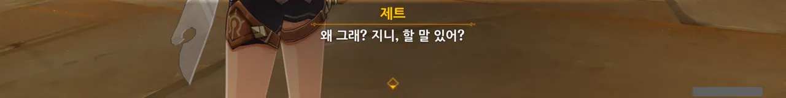

릴루페르에게 익숙한 기운이라... 릴루페르의 조각은 아닌 모양인데, 대체 뭘까?

와! 이번에도 편하게 이동을 시켜준다.

저 거리를 날아서 내려가야 했으면 '쯧, 불편하게...'라고 속으로 중얼거렸을 텐데.

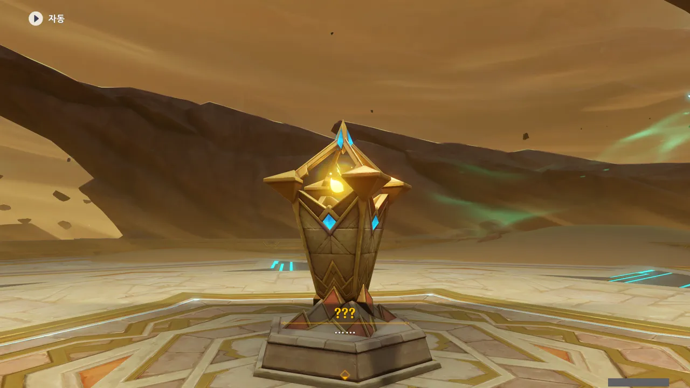

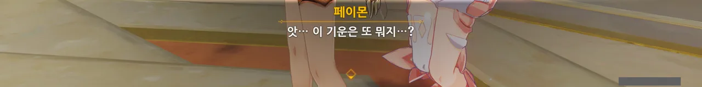

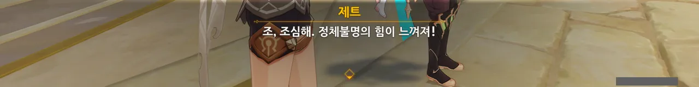

광장 가운데에 뭔가가 있다. 그런데 저 가운데에 노란색으로 빛나는 거... 설마 지니는 아니겠지?

> 조, 조심해. 정체불명의 힘이 느껴져!

이런 말을 들을 때마다 힘이 빠진다. 모니터 너머의 나는 그런 걸 전혀 못 느끼겠거든. 그리고 그걸 깨달을 때마다 몰입감이 훅훅 떨어진다.



장치에 있는 무언가가 릴루페르를 알아본다.

릴루페르를 '구라바드를 파멸한 원흉', '수많은 간신배의 어머니'라고 부르는 걸 보면, 릴루페르가 옛날이야기라며 들려준 이야기 전부가 정말 릴루페르의 과거 이야기였을지도 모르겠는걸.



언니? 릴루페르의 언니?

난 여태껏 지니 역시 아란나라처럼 가족이라는 개념이 없을 줄 알고 있었다. 둘 다 마신의 권속이자 창조물이니 말이다.

아란나라 '가족'이 있긴 했지만, 그건 정말 혈연으로 얽힌 가족이라기보다, 의사가족(Pseudo-family)라고 봐야 하니, 예외다.

&nbsp;

페리지스... 페리지스... 저번에 석판에서 본 이름 같은데. 석판에서 '페리지스 전하'라고 언급된 인물로 보인다.

왕족에게나 붙이는 '전하'라는 호칭으로 불린 페리지스는 대체 왕국에서 어떤 지위를 지녔던 걸까?



릴루페르가 처음 제트를 보고 그랬던 것처럼, 페리지스 역시 제트를 '사막 출신 노예'라 부른다.

왜 저러는 건지 이해가 되지 않는 건 아니지만, 묘하게 열받는 건 어쩔 수 없겠지.



진짜 페이몬은 약방의 감초가 따로 없다.

지니의 가족 상봉이라는 심각한 상황에서 여행자가 "아마 가문 전체가 다 저럴 거야"라고 하니, "저 집엔 절대 안 놀러 갈 거야"라고 말한다.

나, 이런 만담 같은 거 정말 좋아하거든.

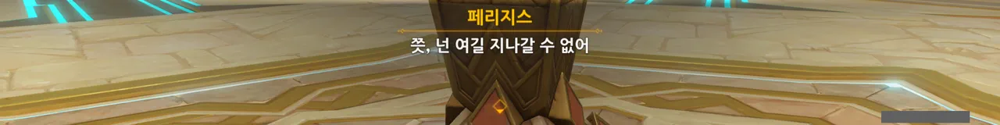

뭐지? 페리지스가 문지기 역할을 하고 있는 건가?

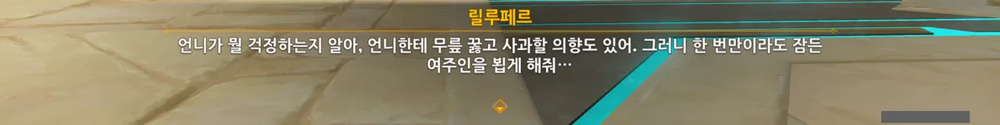

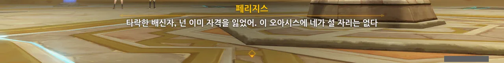

대체 지니나 사막 민족이나 다른 게 뭘까?

지니가 사막 민족을 노예라고 부르는 것을 보면 옛날이 어땠는지 대충 짐작이 간다. 여행자처럼 흰 피부를 지닌 사막의 지배층은 지니와 갈색 피부의 사막 민족들을 노예로 부렸을 것이다.

다만 지닌 능력의 차이 때문에 지니가 조금 더 높은 지위를 가졌을 것이라 생각된다. 일부 지니는 '전하'라고 불릴 정도로 높은 지위에 올라설 수 있었을 테고.

그런데 하는 말을 보면, 지니나 사막 민족이나 똑같다. 배신자니, 여기에 네가 설 자리는 없다니... 마치 똥 묻은 개가 겨 묻은 개 나무라는 격이라니까.

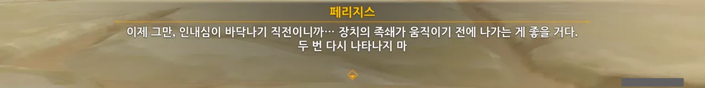

장치의 족쇄? 페리지스는 저 장치에 갇혀있는 것일까?

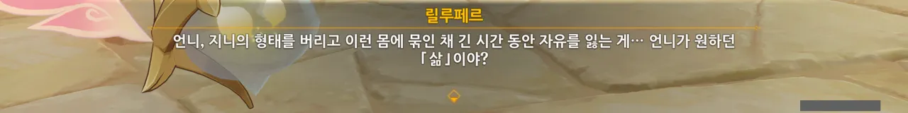

정말 그런가 보네. 페리지스는 저 장치에 여태껏 묶여서 홀로 외롭게 여길 지키고 있었던 모양이다.

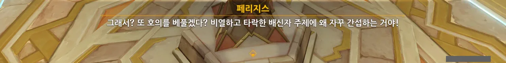

> 그래서? 또 호의를 베풀겠다?

릴루페르와 페리지스, 그리고 사막 왕국 사이에 정확히 어떤 일이 있었는지는 이것저것 뒤져보며 찾아봐야 할 것 같긴 한데, 페리지스가 릴루페르를 보통 증오하는 게 아닌 것 같다.

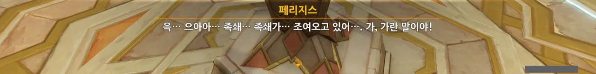

이야, 심지어 그 족쇄라는 게 지니에게 고통도 주는 장치였어?

페리지스가 마조히스트가 아니라면, 대체 왜 저런 장치 안에 들어가 고통을 자처하고 있는 걸까?

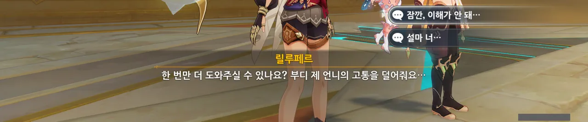

아니, 그래도 무슨 일인지 설명은 좀 해주면 안 될까.

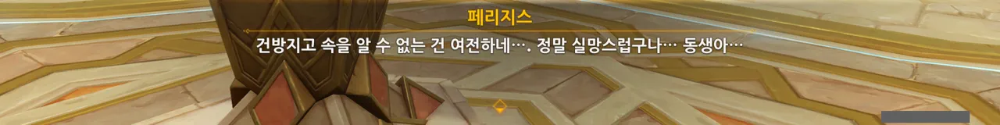

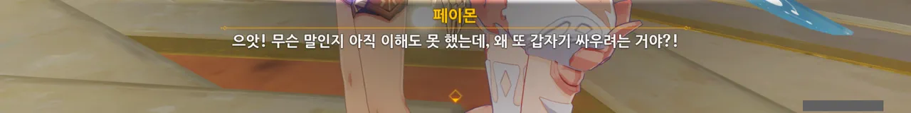

릴루페르에게 설명을 요구했더니 페리지스가 대뜸 릴루페르를 까댄다.

아니, 까대지 말고 설명을 좀 하라고. 왜 니들만 아는 이야기 해!

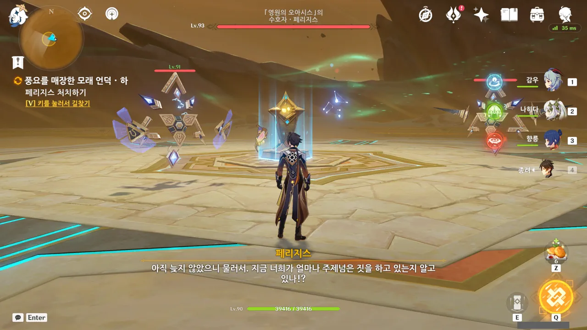

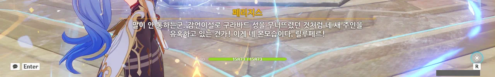

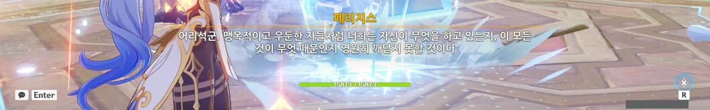

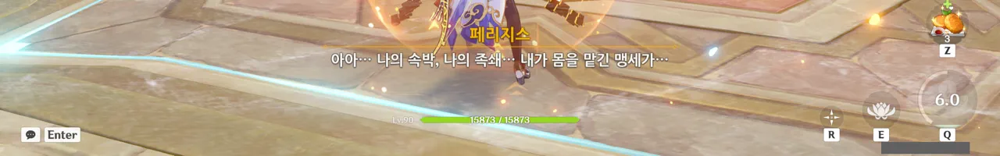

페리지스가 뭔가 열심히 말하고는 있는데, 설득을 하기 위해선 먼저 이해를 시키는 것이 상식 아닌가? 설명조차 하지 않으면서 여행자를 '어리석고 맹목적이며 우둔한 자'라고 말하는데, 전혀 설득력이 없다.

&nbsp;

아무튼, 페리지스가 갇혀있던 장치를 파괴했다. 이 녀석, 태고의 구조체 시리즈는 전부 꺼내더라.

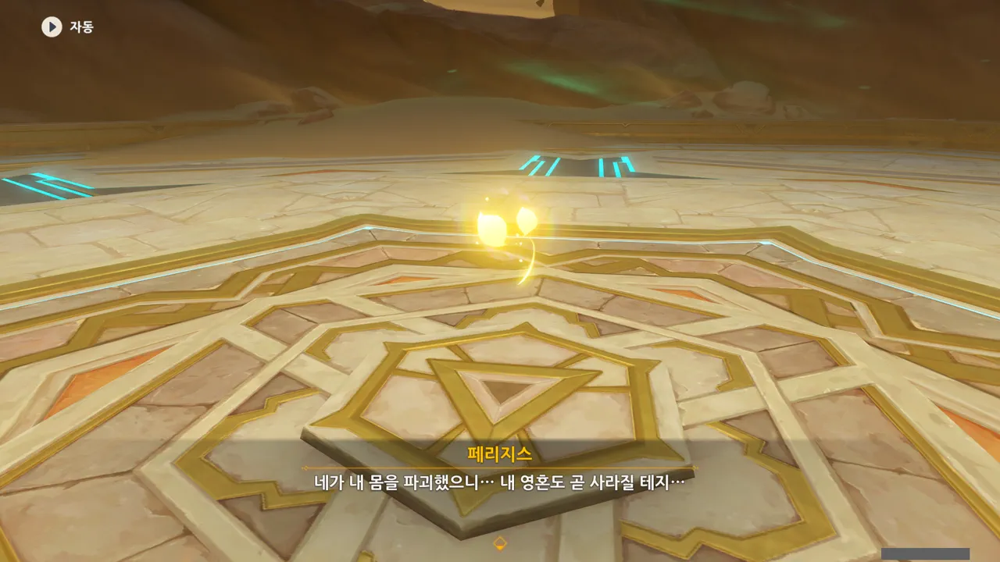

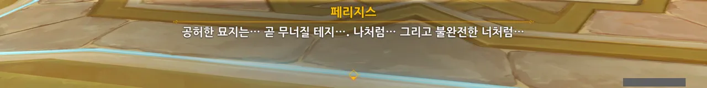

아무래도 페리지스가 영원의 오아시스를 여태 유지하고 있었던 것 같다.

어... 그러면 영원의 오아시스 역시 사라진다는 의미인가?

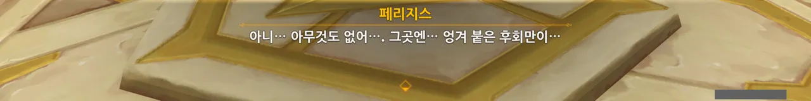

엉겨 붙은 후회라... 대체 무슨 의미일까?

지니는 이래서 안 돼. 죄다 알 수 없는 말만 하잖아!

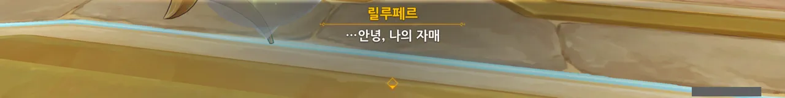

페리지스가 죽었다.

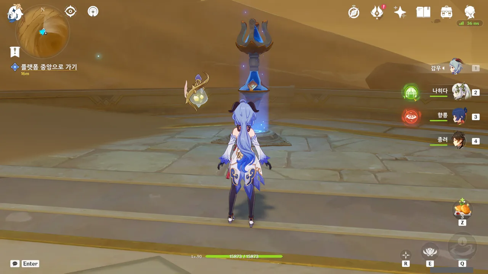

나, 여기 워프 포인트는 활성화한 적이 없는데... 알아서 활성화가 되어 있다.

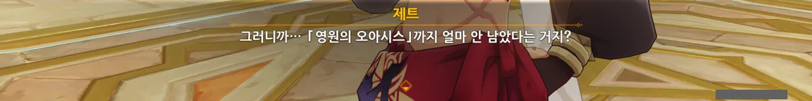

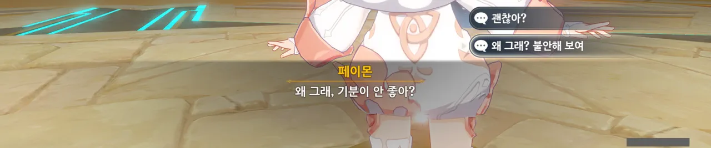

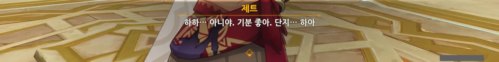

릴루페르와 페리지스의 대화를 들으며 제트 역시 자신이 타니트 부족에게 정말로 받아들여진 것인지 고민하고 있다.

내가 볼 때는 전혀 아니지만. 아마 타니트 부족에게 있어서 제트는 찌꺼기, 부산물 정도로 받아들여지지 않았을까? 대충 쓰고 버리기 편한 그 정도 말이다.

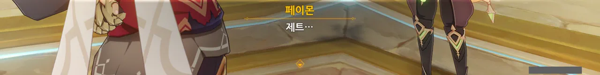

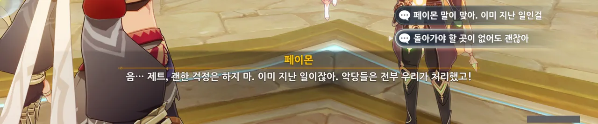

여행자답게 '돌아가야 할 곳이 없어도 괜찮아'라는 답변을 해줬다.

부족을 배신한 악당을 처치하긴 했지만, 타니트 부족의 푸대접은 제트가 돌아가더라도 해결되지 않을 테니.

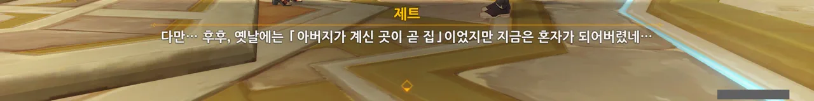

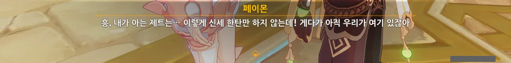

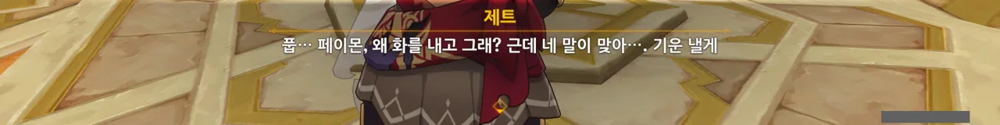

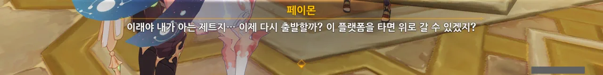

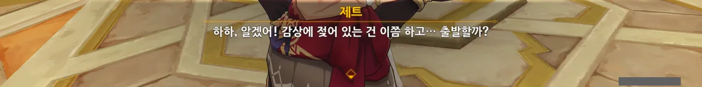

페리지스가 있던 곳이 위로 올라가는 플랫폼이었다. 난 그냥 넓은 광장인 줄로만 알고 있었는데.

그러면 이 위로 가면 이제 영원의 오아시스로 갈 수 있는 거겠지?

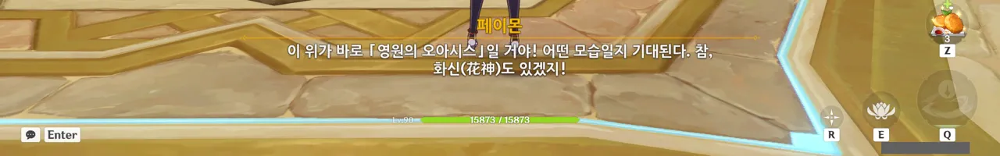

과연 화신이 어떤 모습으로 남아있을까 궁금하다. 무덤일까? 앰버밍 된 시체일까?

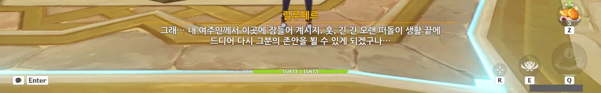

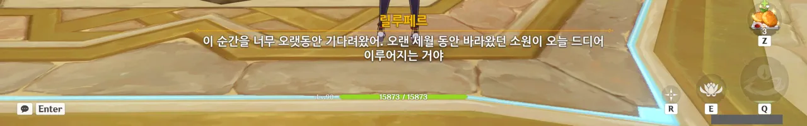

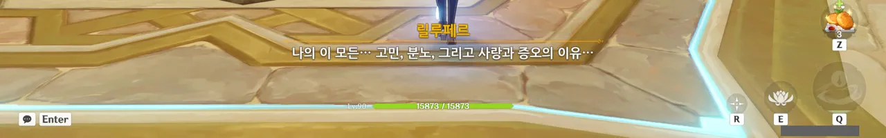

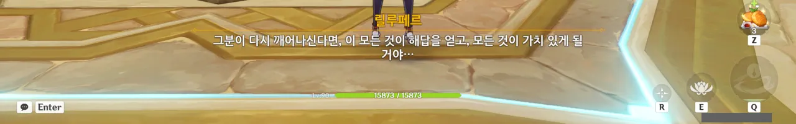

릴루페르는 화신이 영원의 오아시스에서 다시 깨어날 것이라고 믿고 있는 것 같은데, 내가 알기로 지금껏 죽은 마신 중에서 다시 되살아난 마신은 없었던 것으로 기억한다.

누룽지는 그저 힘을 잃고 잠들었을 뿐이니, 죽은 것은 아니고.
