

플랫폼에 올라서자, 정말로 플랫폼이 위로 올라간다.

플랫폼의 면적이나 크기가 그리 크지 않을 거라 생각했는데, 플랫폼의 면적도 생각보다 크고, 그 밑에 드러난 부분의 크기도 엄청 컸다. 처음 보자마자 살짝 당황했다니까?

플랫폼 밑부분은 마치 적왕의 무덤을 거꾸로 뒤집은 듯한 모양처럼 느껴진다.



플랫폼을 타고 올라왔다. 그런데 주변이 조금 이상하다. 곳곳에 풀이 보이는 걸 봐선, 영원의 오아시스에 온 게 맞는 것 같은데... 왜 풀이 시들시들하게 죽어있지?

혹시 내가 이상한 곳으로 온 게 아닌가 싶어, 뒤로 가보니 '하드라마베스 사막으로 가기'라고 뜬다. 그럼 내가 영원의 오아시스에 온 게 맞단 소리인데... 뭐지?

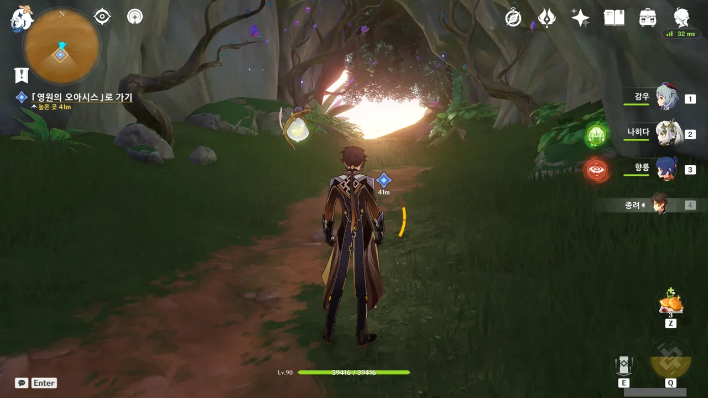

아, 풀이 시들시들한 건 오아시스 입구만 그랬던 거구나. 앞으로 더 가보니, 싱싱한 초목들이 반겨준다.

곳곳에 자란 저 자홍색 꽃은 파디사라겠지?

이야, 여기 장관이네.

그런데 모든 게 멈춰있다. 저 새들도 날아가는 모습이 절묘하게 사진에 찍힌 게 아니라, 그냥 처음부터 저런 모습으로 공중에 붕 떠있는 것이다.

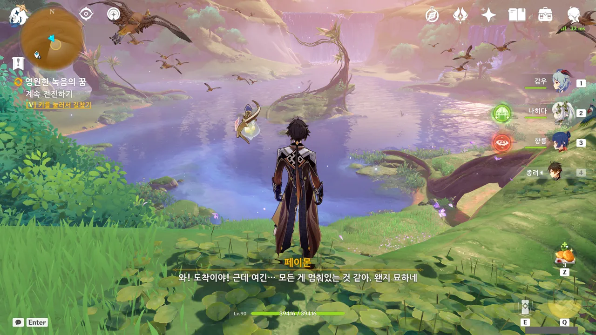

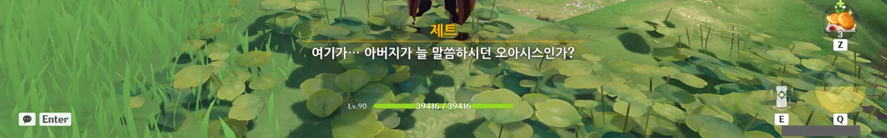

여기가 영원의 오아시스가 맞겠지? 맞을 것이다. 모든 것이 멈춰있으면 그 순간만큼은 영원할 테니, 영원의 오아시스라고 부르기에도 손색이 없고 말이다.

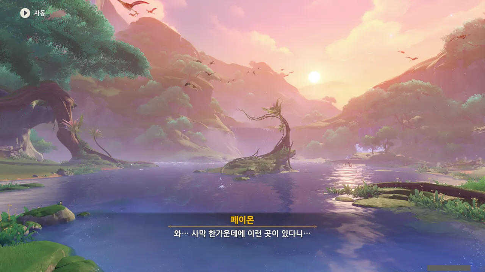

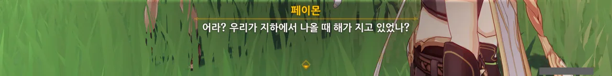

저 하늘은 가짜 아닐까?

우리가 아까 그 수정잔까지 갔을 때, 상당한 깊이를 내려갔었다. 그런데 그 깊숙한 곳에서 고작 엘리베이터 하나 탔다고 지상까지 곧장 올 것 같지는 않다.  
물론 수메르성 지혜궁에서 아자르의 방으로 가는 엘리베이터가 꽤 먼 거리를 이동하긴 했지만, 여긴 그보다 더 깊이 내려간 것처럼 보이거든.

게다가 지도를 보면, 모래폭풍이 다마반드산 주위를 감싸고 있는데, 저 하늘에는 모래폭풍이 전혀 보이지 않는다.

이 하늘은 돌 천장에 그럴듯한 환상을 덮어 씌운 게 아닐까?

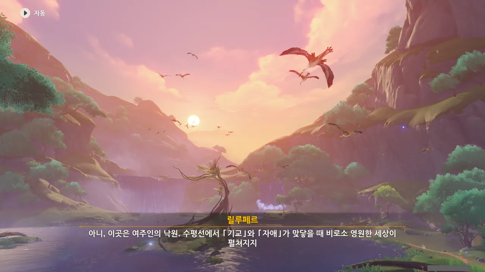

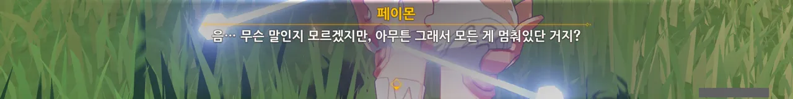

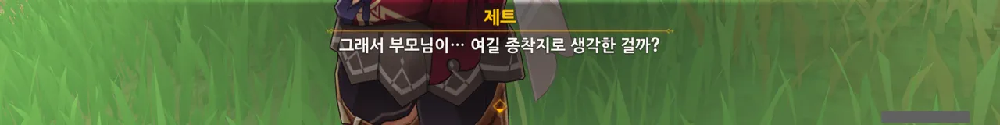

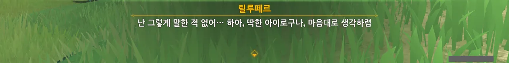

'수평선에서 「기교」와 「자애」가 맞닿을 때'가 무슨 뜻인지는 잘 모르겠지만, 대충 해가 질 무렵을 뜻하는 것으로 보인다. 그러니 적왕은 이 완벽한 장면을 위해 이 공간의 시간조차 멈춰놓은 것이다.

그런데 제트의 부모님은 왜 여길 종착지로 생각한 걸까? 릴루페르의 말을 들어보면 우리가 뭔갈 오해하고 있는 것 같지만, 잘 모르겠다.

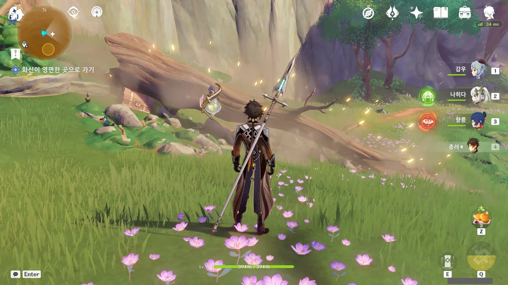

나무가 쓰러질 때 흩날리는 먼지조차 공중에 고정되어 있다.



정말 기묘하다. 기묘하기 짝이 없다.

물 위를 걷는 건 그렇다 쳐도, 물 위로 튀어 오른 물고기 위에까지 올라설 수 있을 줄은 몰랐다. 아마 물 위를 날아다니는 새 위에도 설 수 있겠지.

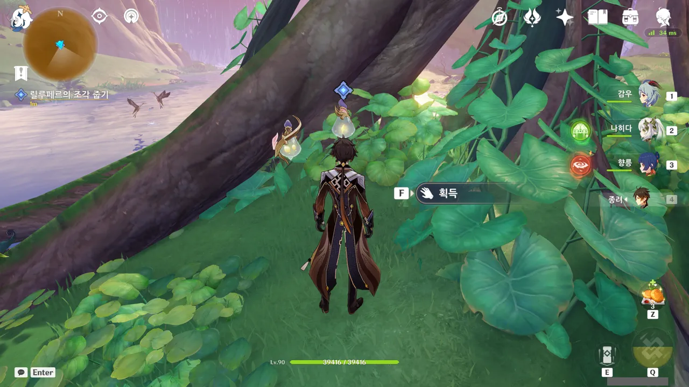

릴루페르의 마지막 조각으로 보이는 게 가운데 섬에 있다.

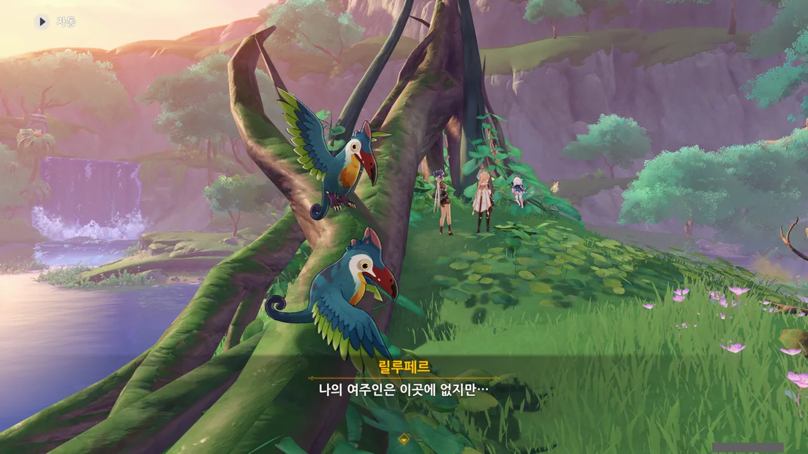

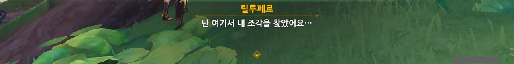

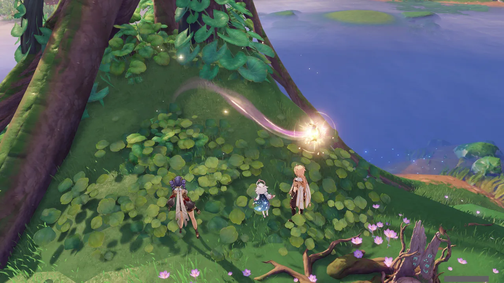

릴루페르의 조각 회수.

늘 그랬듯 몸에서 힘이 빠져나감을 느끼는 여행자. 하지만 이번엔 '따뜻한 온기가 그 자리를 채운다'라는 묘사가 추가되었다.

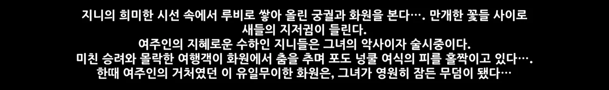

뭐? 화신(花神)의 눈이 텅 비어있다고? 그리고 그 자리에 무한한 공허가 있다고?

별세계를 여행하며 온갖 일을 겪었을 여행자조차 엄청난 공포를 느끼는 걸 보면, 화신의 눈이 있어야 할 자리에 눈알이 없고, 대신 검고 무한한 공간이 있기라도 한 거였을까?

여태껏 생각해 온, 화신에 대한 이미지가 산산조각 나고 있다.

저래서 야는 화신이 흑막이나 악당처럼 보이잖아.

이번에는 여행자가 걱정되는지, 제트가 여행자의 손을 꼭 붙잡고 있다.

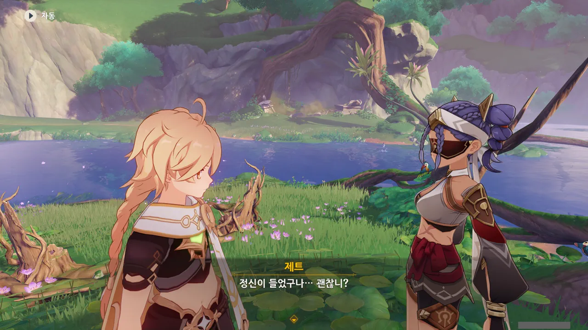

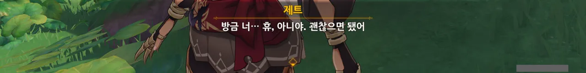

방금 여행자가 어땠길래...?

아, 설마 릴루페르의 기억을 볼 때 본 화신의 눈 때문에 그런 것인가?

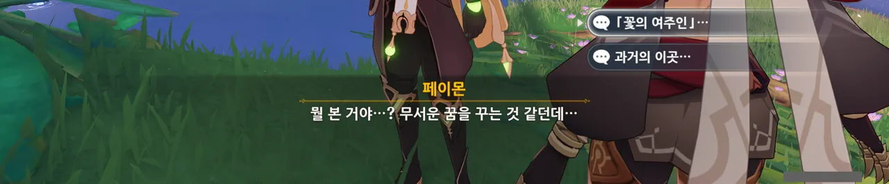

거기서 화신을 보기는 했지.

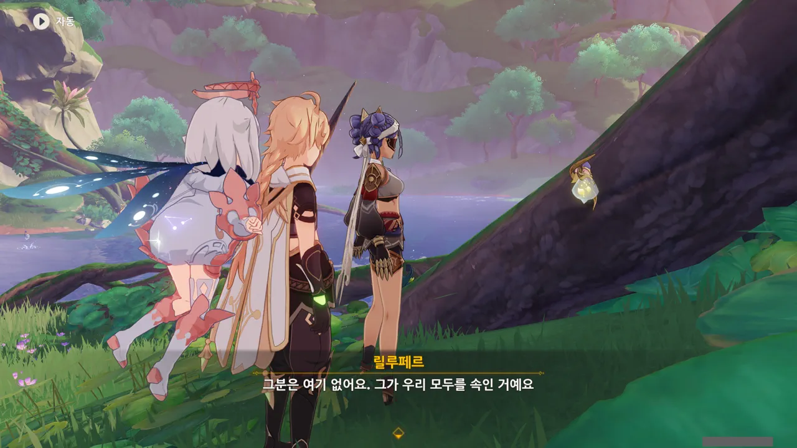

드디어 릴루페르도 진실을 깨달았다.

적왕은 화신이 다시 깨어날 거라고 지니에게 약속했지만, 화신은 다시 깨어나지 않았다.

생각해 보면 딱한 일이다. 영원의 오아시스에 도달해 다시 깨어난 화신을 보길 그토록 바랐을 텐데 말이다.

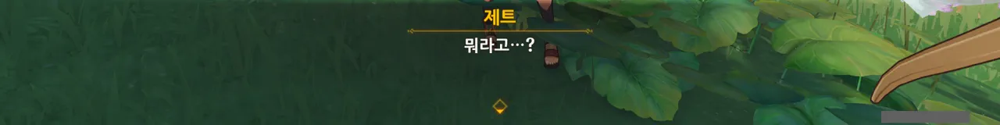

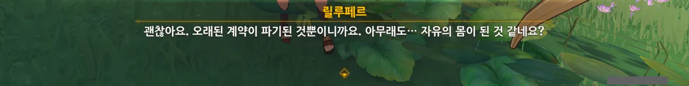

적왕이 왜 지니를 속인 건지 잘 모르겠다. 언젠가는 들통날 거짓말임을 분명 알았을 텐데.

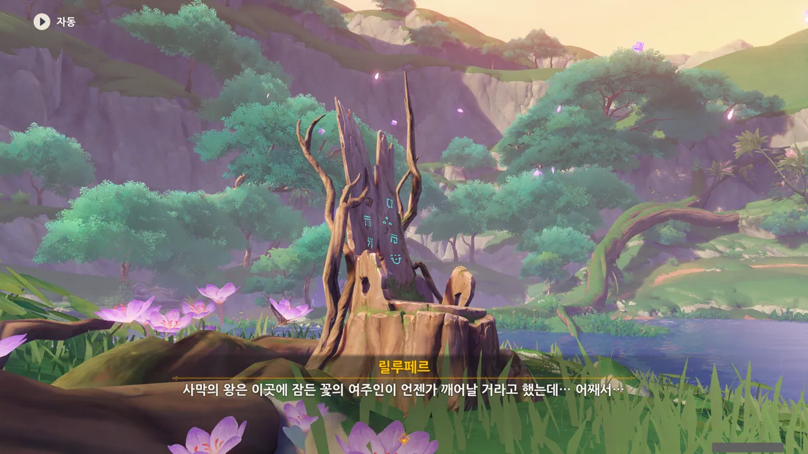

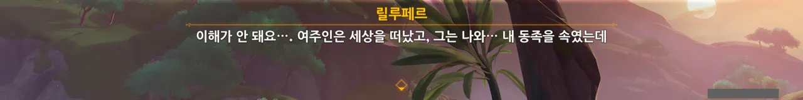

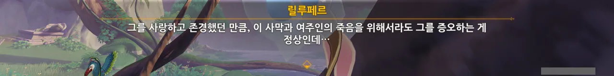

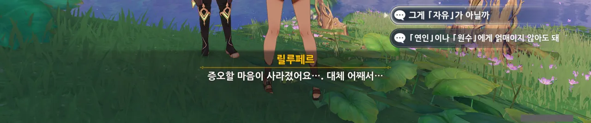

화신이 언젠가 다시 깨어날 거라며, 자신을 비롯한 여러 지니들을 속인 적왕을 증오해야 하지만, 증오할 마음이 전혀 들지 않는 릴루페르.

잘은 모르겠지만, 어쩌면 저 감정은 그토록 바라왔던 복수를 끝낸 후 느끼는 공허함과 비슷하지 않을까? 삶의 목표가 일순간 모두 사라지는 그런 공허함 말이다.

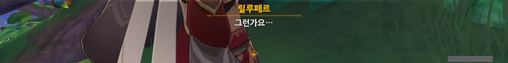

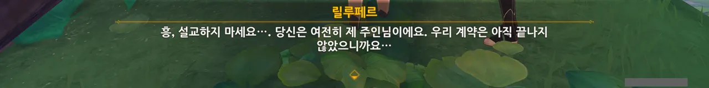

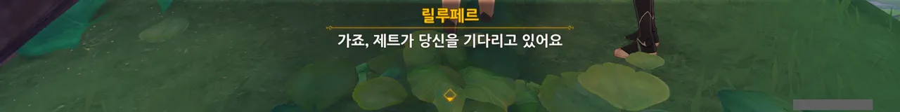

그래, 그러고 보니 여기에 온 목적은 제트의 부모님이 쉴 자리를 찾기 위함이었지.

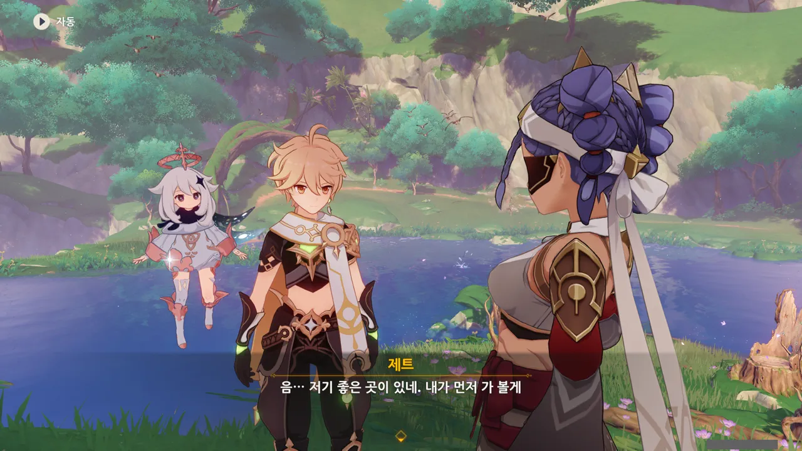

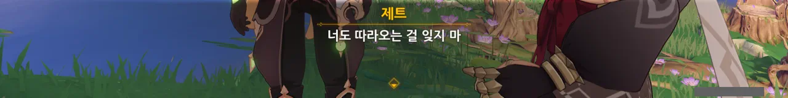

제트는 좋은 자리를 찾았는지, 먼저 떠났다.

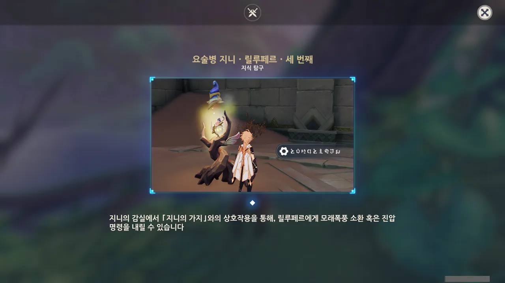

수천삼림에서 비를 끄고 켤 수 있었던 것처럼, 모래폭풍을 끄고 켤 수 있는 것 같다.

아마 모래폭풍이 켜져 있을 때에만 가능한 기믹이나, 꺼져 있을 때에만 가능한 기믹이 있겠지.

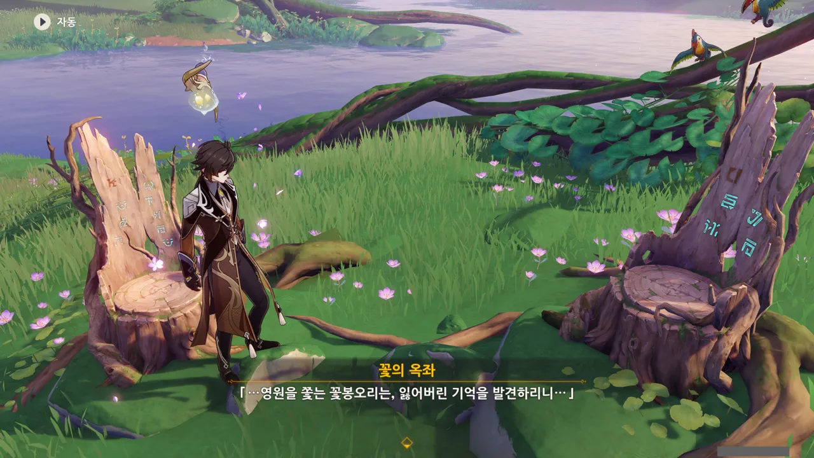

얼핏 듣기로는 여기 이 세 의자에 한 명씩 앉으면 업적이 깨진다고 한다.

문제는 같이 할 친구가 모자라다는 것이지만.



아무래도 저 파란색 문자를 모아야 할 것 같다

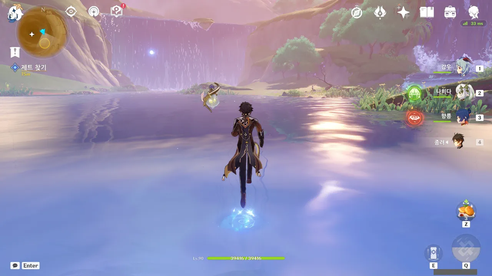

제트가 있는 곳으로 곧장 향한다.

진짜 물 위를 걷는 건... 참 이상한 일이다.

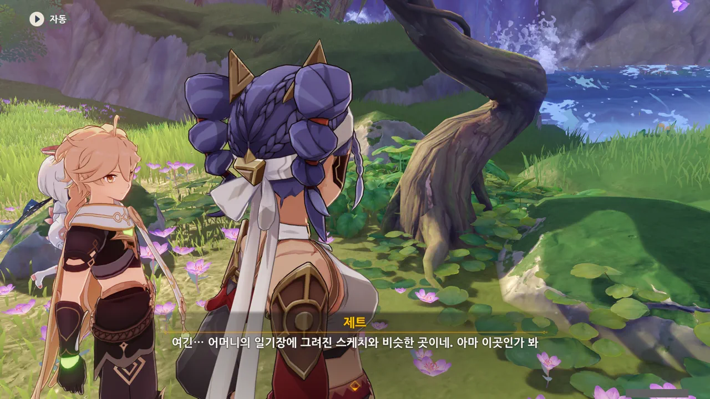

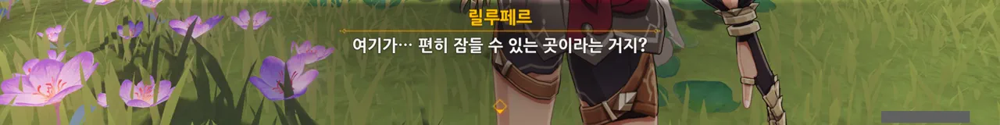

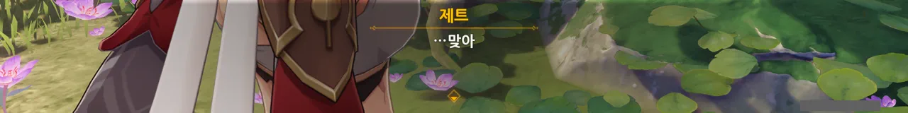

제트의 어머니가 남긴 일기장에 그려진 스케치의 풍경과 비슷한 곳을 고른 제트.



제트도 릴루페르와 비슷한 경우 아닐까? 부모님을 영원의 오아시스에 모시는 게 삶의 목표였는데, 그게 방금 해결되었지 않은가.



그건 아닌가 보다. 그냥 이 공간 안에 있으면 화신의 영향을 받아 자연히 편안함과 기쁨을 느끼게 된다고 릴루페르가 알려준다.

그러면 아까 릴루페르가 느낀 그 감정도 화신의 영향 때문 아냐?

제트의 어머니가 어떻게 죽었는지는 잘 기억나지 않지만, 제트의 아버지 제브라엘은 적왕의 유산에 의해 시체조차 찾을 수 없게 되어버려, 결국 남은 것은 두 사람의 유품뿐이다.

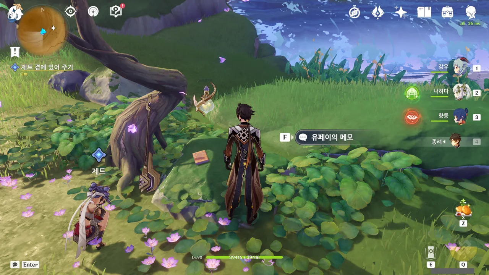

아, 그래. 제트의 어머니 이름이 유페이였어.



... 정말 사람 앞길은 모르는 법이다.





마지막에 새 두 마리와 물고기 한 마리를 보여준 것은 절대로 허투루 보여준 것이 아닐 것이다. 아마 그럴 것이다.



여행자 일행이 이곳으로 오면서 조각의 힘을 흐트러뜨리고 유지 장치를 파괴했으니 이 영원의 오아시스 역시 무너져 내리고 모래에 묻힐 것이라고 했지만, 잘 생각해 보면 굳이 여행자가 오지 않았어도 이 영원의 오아시스는 결국 무너져 내릴 운명이었다.

지금까지 보아온, 예전에 물이 흐르던 파이프에는 이제 모래가 흐르고, 그 과거 기록에서도 오아시스의 영역이 점점 줄어들고 있다는 말이 나왔다.

단지 여행자는 그 시간을 그저 조금 앞당긴 것뿐이다.





애가 갑자기 센치해졌네. 그럴 날은 아직 한참 멀었는데 말이다.

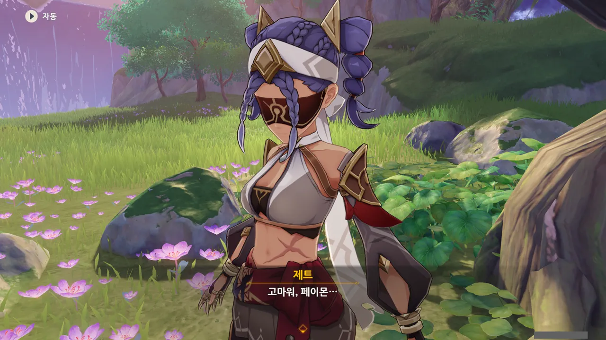

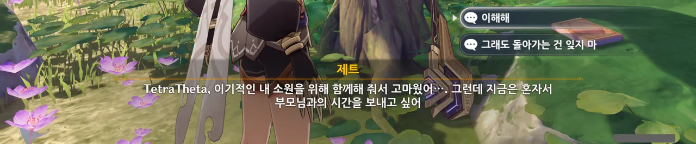

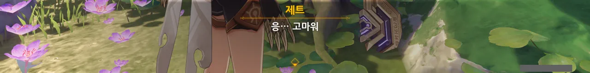

제트가 부모님과의 시간을 보내고 싶다고 하기에, 자리를 비켜주었다.

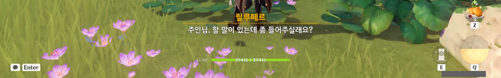

그런데 릴루페르가 갑자기 할 말이 있다고 한다.

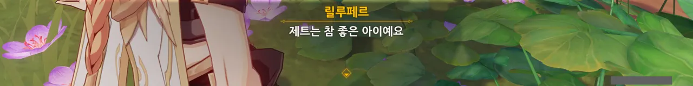

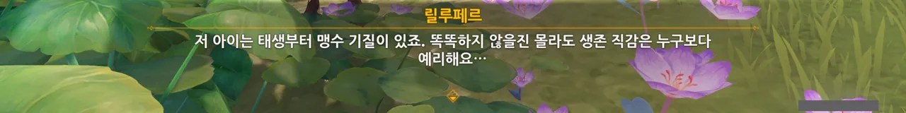

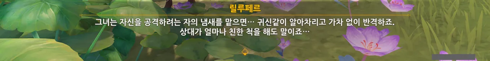

그래. 아자릭때에도 그랬었지.

릴루페르는 대체 제트의 미래가 어떨 것이라고 예상한 것일까? 무엇을 보고 그런 말을 하는 것일까?

도저히 알 방법이 없다.

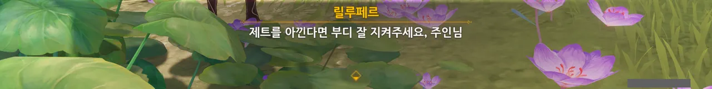

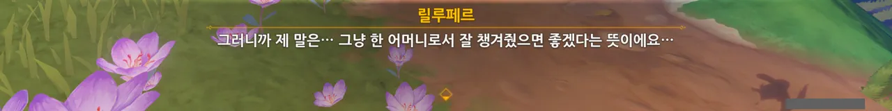

어머니라...

제트는 여전히 말없이 부모님의 유품이 높인 나무를 바라보고 있다.

&nbsp;

그래서 제트가 부모님과의 마지막 시간을 보낼 동안, 주변에 있던 상자를 좀 먹어보기로 했다.



공중에 붕 떠다니는 수상한 꽃봉오리.

'접촉하기'를 누르면 이동하고, '기억 활성화하기'를 하면 특정 지역의 시간을 조절할 수 있다.

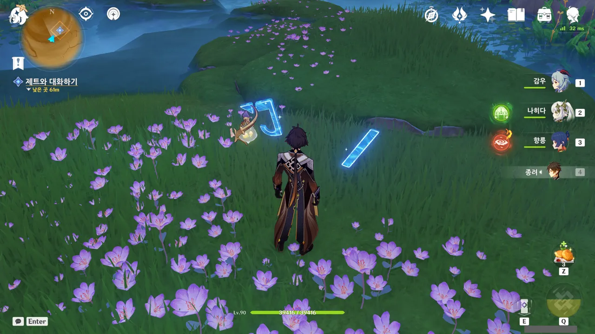

그리고 발견한 파란색 문자. 아마 이걸 원래 모양이 되도록 시간을 조절한 후 먹는 것이겠지?

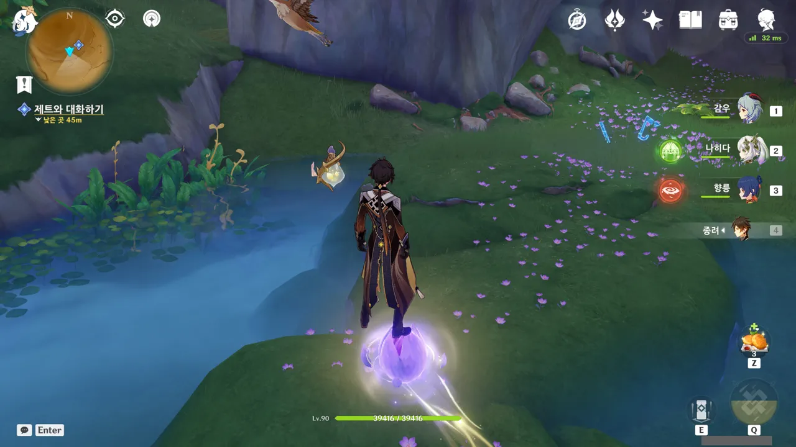

이동하던 도중, 꽃봉오리에 올라타버렸다.

재미있어서 한번 더 해보려 했지만, 거듭된 실패 끝에 결국 단념하고 말았다.

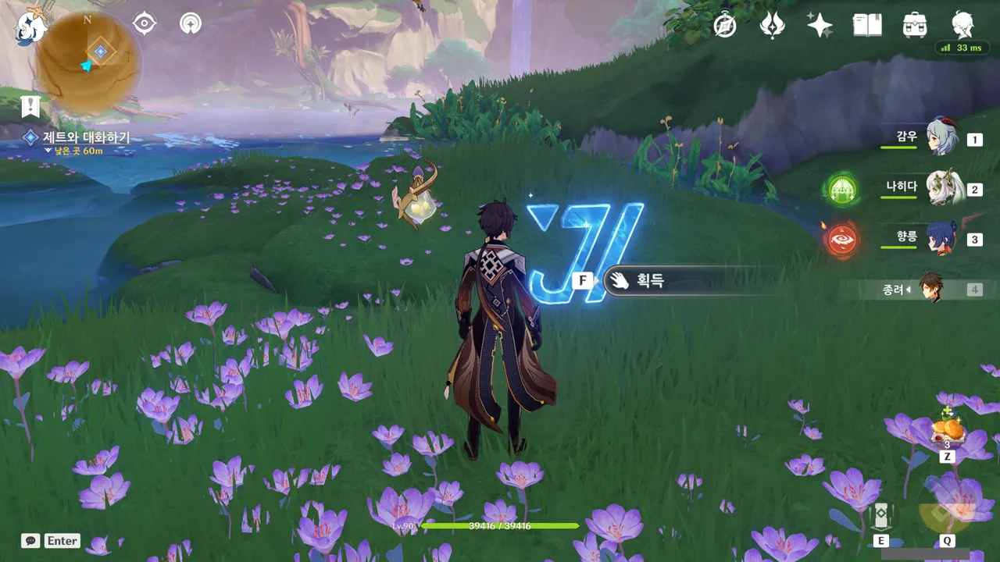

문자를 원래 모양대로 복구하자, 획득할 수 있도록 바뀌었다.

그러니까 이걸 총 세 개 모아야 한다는 거지?



다음 문자 역시 큰 어려움 없이 얻을 수 있었다.

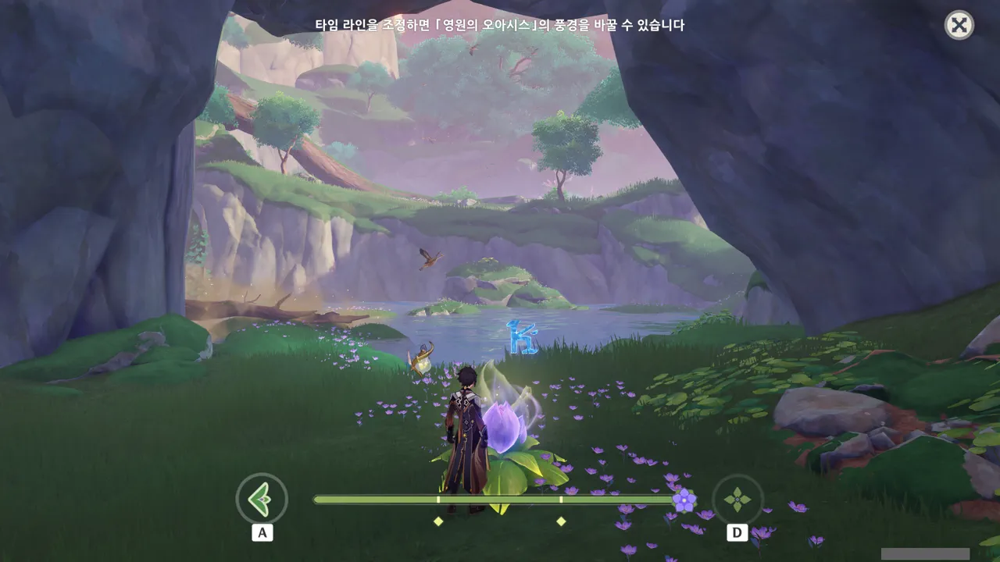

마지막 문자 역시 획득 완료.



세 문자를 의자에 박아 넣자, 그중 한 의자에 분홍색 꽃 같은 것이 피더니 아주 먹음직스러운 상자와 업적 하나를 준다.

***

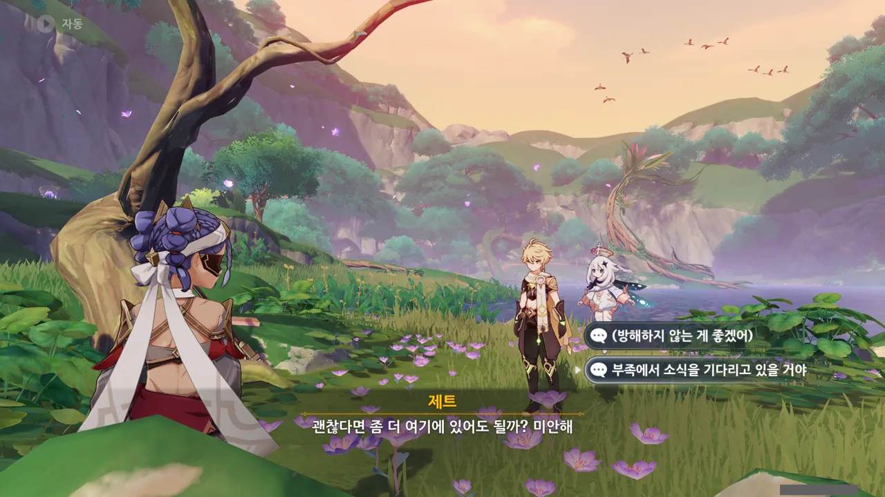

며칠 동안 다른 일로 바빠, 월드 임무를 전혀 진행하지 못했다. 그러니 제트도 여기 며칠 동안 있었다는 이야기인데, 이 녀석은 아직도 여기에 그대로 있고 싶어 하네.

이제 갈 시간이야, 욘석아.

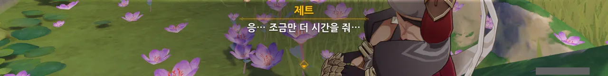

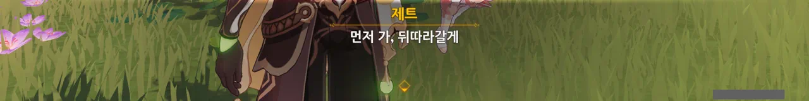

그래도 거듭 가야 한다고 말하니, 먼저 가라고 말하고 뒤따라온다.

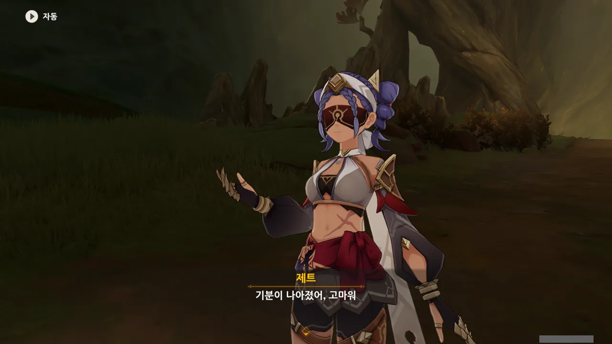

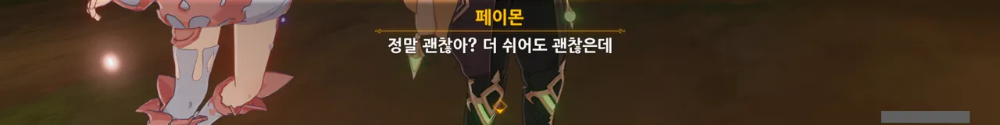

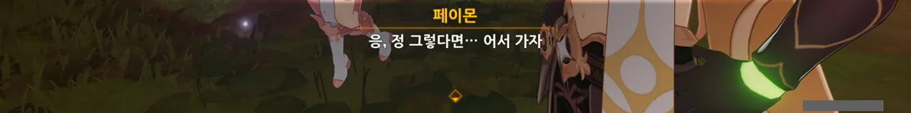

이제 바벨에게 최종 보고를 할 시간이다.

바벨의 속마음을 읽어보았다. 척후병? 근심거리? 대체 무슨 말일까?





제트의 대사가 일부 누락된 것 같다.

> 비록 두 분은 타니트의 보우를 받지 못한다고 해도

여기서 제트의 대사가 끝나는데, 만약 바벨이 제트의 말을 잘라먹었단 걸 표현하고자 했으면 아마 플레이어의 별도 입력 없이 곧바로 바벨의 대사로 넘어갔을 것이다. 이미 예전에도 그렇게 한 적이 있으니.

하지만 지금은 플레이어의 입력을 받아야 바벨의 대사로 넘어가니, 대사가 일부 누락되었다고 보는 게 합당하겠지.





뭐? 바벨과 제트 둘 다 아자릭이 배신할 걸 미리 알고 있었다고? 여태껏 그런 낌새는 전혀 없었는데?

제트는 아자릭이 배신할 걸 미리 알고 있었다고 생각할 수 있다. 지금껏 아자릭의 말에 "..."라고 아무 말 없이 침묵한 적이 몇 번 있었거든. 그걸 제트가 아자릭을 의심하는 거라고 여길 여지가 충분하다.

하지만 바벨의 경우는 정말 의외다. 심지어 바벨은 제트보다도 먼저 아자릭의 배신을 알고 있었다는 건데...

잠깐. 잠깐만. 그러면 바벨은 아자릭이 배신한 걸 알고 있었음에도 저번에 아자릭과 밤에 응앗응앗 찐한 관계를 맺었던 거야?

간이 배 밖으로 나왔다고 해야 하나, 참 대담한 사람이네.

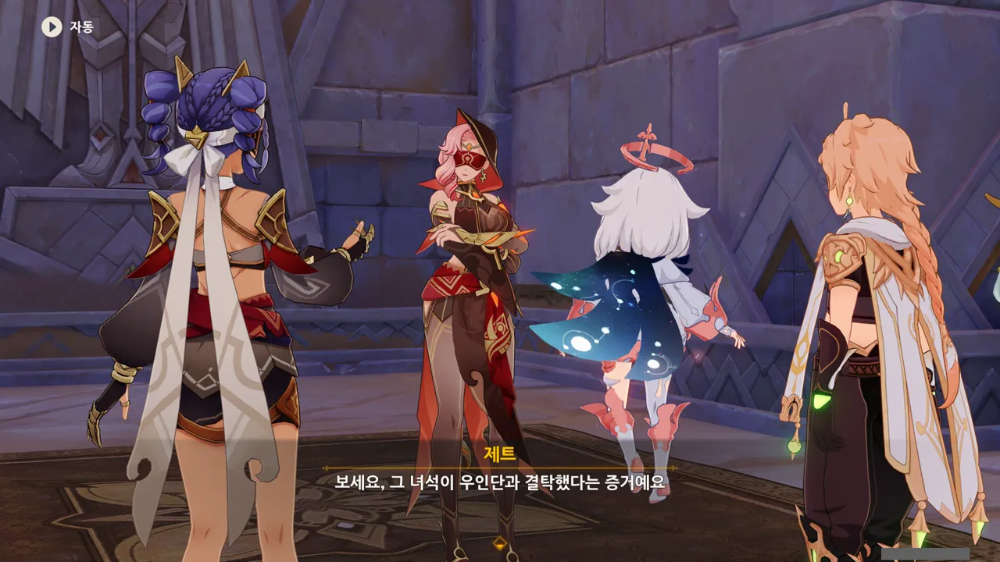

아자릭과 아드라피가 우인단과 결탁했다는 증거로 아드라피가 남긴 편지를 바벨에게 건네준다.



원신에서 아쉬운 것 중 하나를 꼽으라면 이 표정 변화 없는 얼굴을 꼽을 수 있다.

일반 NPC는 표정 변화 없이 그냥 손짓발짓과 머리를 숙인 각도 정도로 감정을 표현하는 것이 전부이니, 이게 그냥 침묵하고 있는 것인지 침울해하고 있는 것인지 도저히 알 방법이 없다.

&nbsp;

아무튼, 바벨은 아자릭이 배신했었다는 것을 진작에 눈치챘지만 아자릭을 '왼손'이라고 부를 정도로 아꼈기에 직접 끊어낼 수 없었다고 한다.

잔정이 많다고 해야 하는 것일까?

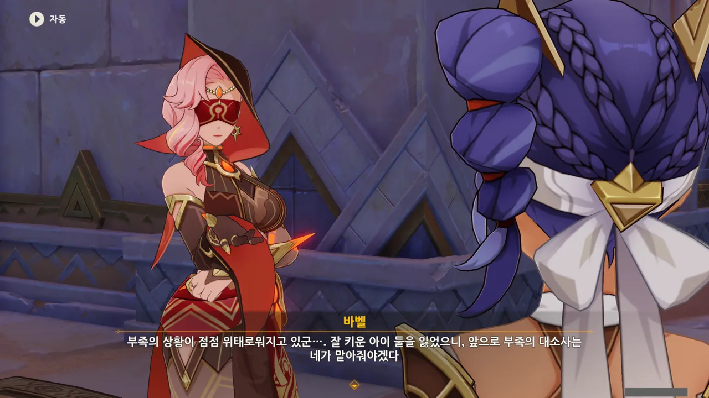

잘 키운 아이 둘이라는 것은 아드라피와 아자릭 둘을 이야기하는 것일 테다.

&nbsp;

바벨이 보기보다 나이가 많다는 것은 알고 있었지만, 정말 혼란하다.

아드라피는 얼굴에 수염이 나있을 정도로 나이가 많다. 그 정도의 수염을 키우려면 적어도 20대 후반에서 30대 초반 정도는 되어야 하지 않을까. 내가 수염을 길러본 적이 있어야 말이지...

아자릭은 얼굴을 죄다 꽁꽁 싸매고 다녔으니 그 나이를 잘 알 수 없지만, 청소년으로 보이는 제트가 오빠처럼 생각했다는 것으로 보아 제트보다 나이가 많다고 추측할 수 있다. 그렇다면 20대 정도로 볼 수 있겠다.

&nbsp;

그런데 이 둘을 '아이'라고 말할 정도면, 바벨의 나이는 대체 얼마나 되는 거야?



사막인에게는 계급 개념이 없다고 한다. 그래서 바벨과 처음 만났을 때 '부족의 배신자'가 바벨에게 '어르신'이라고 한 것을 보고 바벨이 화를 냈었던 것이다.

하지만 권력을 쥐었는데 계급이 생기지 않는다고? 인간 사회에서 그게 가능할 것 같지는 않은데...





제트는 자신이 진정한 타니트 부족의 일원인지 아닌지 여전히 갈피를 잡지 못하고 바벨에게 자신이 이제 진정한 타니트의 부족 일원이냐고 묻는다.

그런데 바벨이 말하는 것을 들어보면 아무리 생각해도 저게 그냥 입발린 소리로밖에 들리지 않는다.

제트는 부족 내에서 '처형인', '망나니' 역할을 맡고 있다. 동서고금을 통틀어, 이 직업이 대우를 받은 적은 전혀 없었다. 타니트 부족이라고 다를 건 없겠지.

그런 역할을 혼혈인 제트에게 시킨다는 건, 그 의도가 좀 많이 불순한 것으로 보일 수밖에 없지 않을까. 제트를 쓰고 버리기 쉬운 손패로 보지 않는 한, 저런 역할을 시킬 리 없다.



아, 그래. 일전에 협곡으로 내려갈 때 타니트 부족 탐사대의 흔적을 다수 발견했었지.

그건 대체 어찌 된 일이었을까?



릴루페르가 오랜만에 시원하게 톡 쏘아붙인다. 잘한다, 릴루페르!



아니 그런데 왜 이 둘은 말이 없는 거지? 바벨은 그렇다 쳐도 제트 너는 왜...?





바벨은 예전에 유적과 오아시스로 탐사대를 보낸 사실을 순순히 인정한다.

그런데 탐사대가 전멸했을 것이라는 내 추측과 다르게, 살아 돌아온 사람이 아예 없지는 않았던 모양이다.

아무튼, 그런 위험성 때문에 그곳을 부족의 금지로 지정했다고 말하는 바벨.

아자릭 역시 탐사대의 일원이었다고 한다. 그래서 제트가 나올만한 곳에 미리 가서 진을 치고 있을 수 있었던 것일까?





그렇다면 왜 그 사실을 제트와 여행자에게 이야기해주지 않았느냐가 중요해진다. 위험한 곳임을 알면서도 사지로 보낸 셈이니.

과연 바벨은 어떻게 대답할까?

> 너희가 무사히 돌아오리란 걸 알았으니까.
> 그래서 널 믿으며 묵묵히 기도했단다.

순 뻥이네. 입발린 소리가 너무 지나쳤다. 이걸 누가 믿어?



이걸 그냥 믿고 넘어간다고? 정말로? 어... 음...



릴루페르도 전혀 납득하지 못한 눈치지만, 제트가 그런가 보다 하고 넘어가니 그냥 적당히 넘기는 것 같다.



바벨이 '보상으로 뭘 줄까?'라고 하는데, 선택할 수 있는 선택지가 전부 별로인 것 같다.

그래서 가장 괜찮아 보이는 '제트의 생일 축하연에서 건배를 해달라'라는 요구를 했다. 이 정도면 크게 나쁘지 않지.

모라? 이미 넘치도록 많다. 기념품? 굳이 기념품이 필요한가?





'그 정도'라니. 거 참 말이 심하시네.



솔직히 말해, 난 바벨의 저 "너와 릴루페르 님의 인도를 따르는"이라는 말이 전혀 믿기지가 않는다.

자, 그러면 이제 다음에 무슨 일이 있을까?

&nbsp;

&nbsp;

&nbsp;

&nbsp;

&nbsp;

&nbsp;

&nbsp;

&nbsp;

&nbsp;

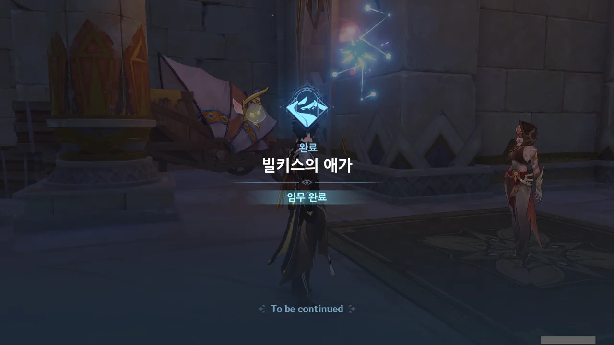

으응? 여기서 빌키스의 애가가 끝난다고?

아니 이야기가 이렇게 끝나버리면... '바벨에게는 더러운 꿍꿍이가 있을 것이다'라는 내 추측은 어떻게 되는 거야? 설마 '사실 바벨은 정말로 제트를 아끼는 대모였습니다' 뭐 이런 결말인 거야?

일단 하루 정도는 더 기다려보기로 했다. 저번에도 실제 시간으로 하루를 기다려야 열리는 후속 월드 임무가 있지 않았던가.
