사실 빌키스의 애가 월드 임무 이후에 있는 모든 월드 임무는 사진을 찍지 않고 나 혼자 빠르게 볼 생각이었다.

&nbsp;

게임을 하며 사진을 찍는 건 좋은데, 사진이 너무 많아지면 게임을 하다 말고 사진이 저장된 폴더에 가 여러 작업을 해야 한다.

먼저 사진을 한 장 한 장 보며, 삭제할 사진을 골라내야 한다. 그 후, 적당한 이야기 분량이 되도록 사진을 각각 새로운 폴더에 옮겨야 한다. 새로운 폴더에서는 사진을 어떤 유형으로 자를 것인지 또다시 사진을 한 장 한 장 보며 분류해야 한다. 사진을 자른 후에는 내가 의도한 대로 사진들이 잘 잘렸는지 확인도 해야 하고.

거기서 끝나는 것이 아니다. 일단 사진의 확인이 모두 끝난 후에는 다시 게임으로 돌아갈 수 있지만, 나중에 블로그에 그동안 찍은 사진을 글과 함께 써 올려야 한다. 하지만 글을 쓴다는 것이 어디 쉬운 일이던가?

빌키스의 애가 월드 임무 중, 이런 식으로 게임의 흐름이 끊기는 일이 너무 자주 발생하자, 그다음 월드 임무는 사진을 일절 찍지 않기로 속으로 다짐했었다.

&nbsp;

그런데 매사냥 월드 임무 도중, 그냥 넘길 수 없는 문서를 발견해 버렸다. 아직 월드 임무를 시작한 지 얼마 되지 않은 시점이었기에, 그냥 거기서부터 사진을 찍기로 했다.

아아, 또 사진을 분류하고 글을 쓰느라 한동안 머리가 아파오겠지... 어흑, 마이깟.

***

대충 기억나는 지금까지의 상황은 이러하다.

타니트 야영지의 마세리아 더 어쌔신 오타쿠에게서 자신의 딸인 타들라가 위험에 빠졌다면서, 다리가 아픈 자신 대신 타들라를 도와달라는 부탁을 받았다.

마세리아에게서 들은, 타들라의 마지막 위치로 가보니, 주저앉아있는 타들라와 우인단이 보였다. 그래서 우인단을 싹 쓸어버렸다.

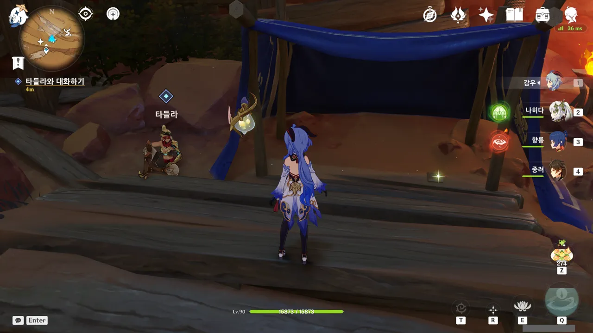

타들라 오른쪽에 무슨 책 같은 것이 있어, 읽어보았다.

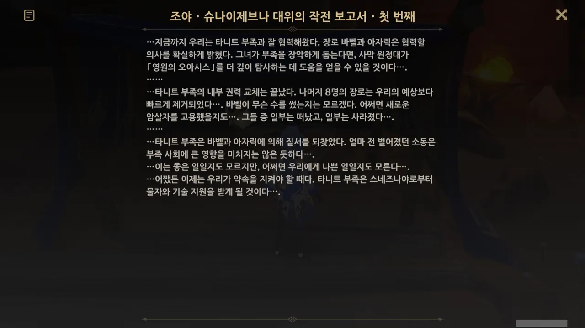

우인단 장교가 작성한 것으로 보이는 작전 보고서이다.

저번 빌키스의 애가 월드 임무 내내 바벨의 뒤가 구리다고 생각했지만, 그에 대한 물증은 없고 심증만 있어, 속으로 불만만 표할 수밖에 없었다.

그런데 여기, 바벨의 뒤가 구리다는 증거가 있네?

&nbsp;

바벨은 생각했던 것보다 뒤가 더러운 여자였다. 악녀라고 해도 좋고.

타니트 부족의 장로였던 바벨은 부족의 족장이 되어 권력을 잡고 싶어 했고, 그래서 자신의 심복인 아자릭과 함께 우인단과 손을 잡았다.

권력을 잡기 위해, 바벨은 어떤 수를 써서 나머지 여덟 장로들을 빠르게 제거했다.

보고서에 '일부는 떠났고, 일부는 사라졌다'라고 되어 있는데, 사라진 장로는 아마 바벨에 의해 죽었을 가능성이 매우 높다.

&nbsp;

그리고 여기서 생각난 것이 하나 있다. 제트의 집에서 발견한 '구겨진 명단'이라는 문서였다.

> ~~브레다~~
> ~~과파~~
> ~~이즈더~~
> ~~메두르~~
> ~~테야~~
> 마세리아
{.bq}

말더듬이 유프텐의 말에 따르면, 지금은 죽은 브레다가 예전 장로였다고 한다. 그리고 명단에 적힌 사람 중, 이름에 줄이 그어져 있는 사람은 제트가 죽인 사람이 아닌가 추측하기도 했다.

이 두 문서의 내용을 종합해 추측하면, 바벨이 권력을 잡은 과정은 대충 이렇게 된다.

&nbsp;

장로회는 기업의 이사회와 비슷하다. 이들의 주 역할은 족장에게 조언을 하는 것이지만, 족장이 부족을 이끌기 적합하지 않다고 판단했을 때, 현 족장을 끌어내리고 새 족장을 추대할 수 있다.

그렇기에 바벨과 아자릭은 안정적이고 확고한 권력을 얻기 위해선 부족의 장로들을 모두 제거해야 한다고 판단했을 것이다. 그래서 이들은 다른 장로들을 하나하나 부족의 배신자로 몰아간 후, 제트로 하여금 그들을 죽이게 했다.

저 목록에 있는 사람 중 마세리아만 살아남은 이유는 확실치 않다. 어쩌면 그가 스스로 장로 자리에서 내려와, 더 이상 바벨의 권력에 이의를 제기할 수 없기에 그냥 그를 내버려 둔 것일 수도 있다.

&nbsp;

그리고 저 문서 때문에 내가 지금 이렇게 글을 쓰고 있다.

그냥 넘겨도 되는 문서가 아니라, 여태껏 품고 있었던, 바벨에 대한 의심을 단 한 번에 증명해 주는 문서였으니 말이다.

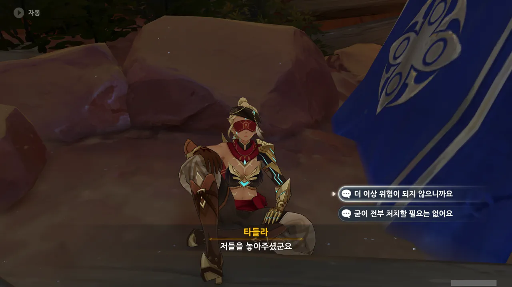

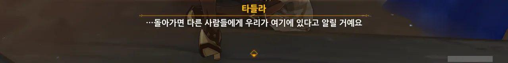

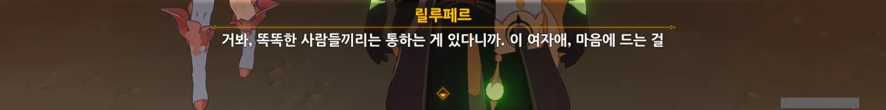

여행자가 우인단을 놓아줬다고 하는 타들라의 말을 듣고 잠깐 생각해 보았다.

&nbsp;

원신에서 플레이어가 상대하는 인간형 적들은 모두가 정말로 플레이어에게 죽는 것이 아닐지도 모른다. 츄츄족은 제외하고 말이다.

보물 사냥단을 처치하면, "일단 후퇴해야겠어!"라고 외치며 바닥에 연막탄을 뿌리고 사라지는데, 여행자의 시야를 가리고 도망친 것이라 보는 편이 합당하다.

도금 여단의 경우는 모래를 뿌리거나 모래로 변해 사라지는데, 사람이 죽었다고 모래로 변할 리는 없으니, 모래는 눈속임이고 실제로는 도망쳤다고 보는 것이 옳겠지.

천암군의 경우는 기억이 너무 오래되어 확실치 않지만, 그냥 땅바닥에 볼품없이 나동그라지는 모습만 나온 것으로 기억한다. 이나즈마의 텐료 봉행 병사들 역시 천암군과 모션을 공유하니, 마찬가지일 거고.

우인단의 경우에는 조금 애매하다. 모두가 하나같이 유언처럼 보이는 말을 내뱉지만, 이렇게 타들라와 같은 다른 NPC의 입을 빌려 여행자가 그들을 놓아주었다고 말하는 경우도 적지 않으니까. 어쩌면 그 유언처럼 보이던 대사도 그저 후퇴하며 내뱉는 소리일지도 모른다.

&nbsp;

전혀 쓸데없는 생각이지만, 그래도 재미있다.



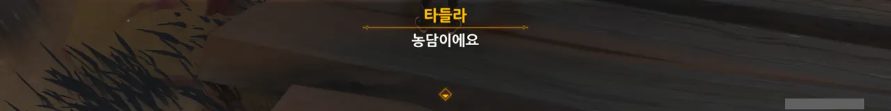

스스로 죽을 곳을 찾을 수도 있다는 말이 어떻게 농담이야... 농담도 정도가 있지...

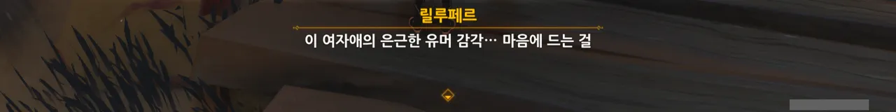

그런데 릴루페르는 이런 *농담*이 취향인가 보다.

릴루페르의 비유에 독충이나 두꺼비가 나올 때부터 알아봤어야 하는 건데...

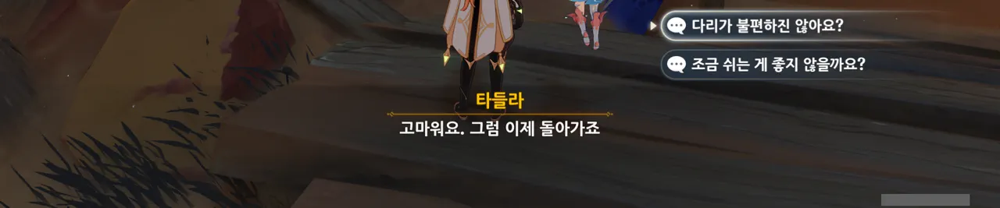

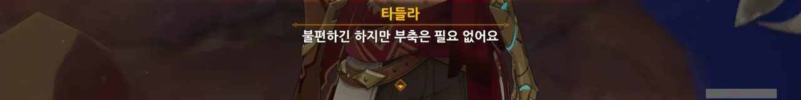

좀 많이 다친 것 같은데, 부축은 필요 없다고 한다.

흠... 아까 우인단과 전투할 때, 우연히 타들라가 나히다의 E 스킬 범위 안에 들어가, 타들라의 속마음을 볼 수 있었다.

분명 그때 몸에 힘이 들어가지 않는다고 생각하고 있었던 것으로 기억하고 있거든?

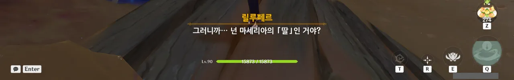

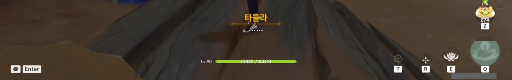

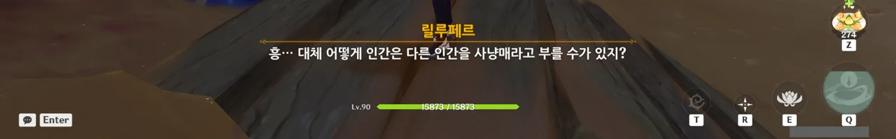

그러게. 지금 와서 다시 생각해 보니 마세리아는 타들라를 '사냥매'라고 불렀었다.

타들라가 마세리아의 친자식인지는 잘 모르겠다만, 사람을 사냥매로 부르는 것은 좀 많이 이상하다.

거 봐. 사람을 사냥매라고 부르잖아. 이거 이상하다니까.

아냐, 할머니가 손주를 '우리 강아지'라고 부르는 것처럼, 딸을 '사냥매'로 부르는 것일 수도 있어.

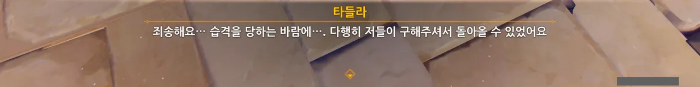

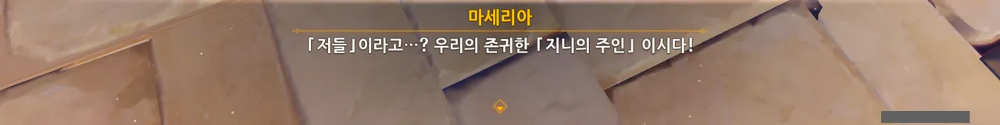

지금 그게 중요한 게 아닐 텐데...

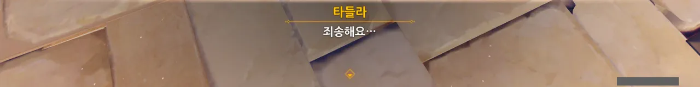

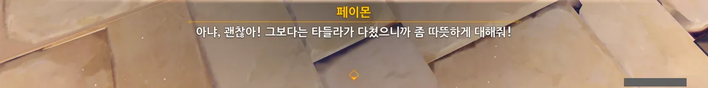

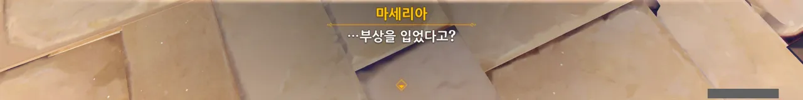

타들라가 부상을 당했다는 말에 정색하는 마세리아.

딸을 '사냥매'라고 불러도, 정작 딸이 다친 것에 걱정했던 모양이지? 역시 '사냥매'는 애칭이었던 거야...

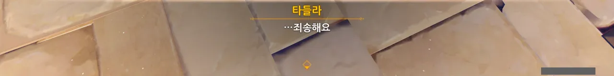

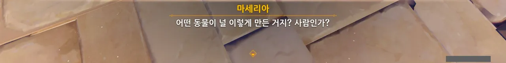

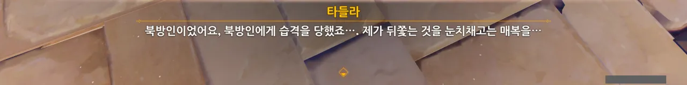

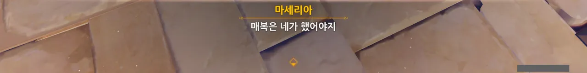

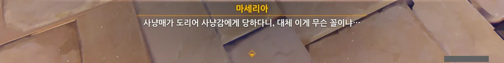

전혀 아니었다. 마세리아는 타들라를 정말 '사냥매'로 보고 있었다.

사람을 동물, 도구 취급하다니... 사막 민족은 다 이런가? 만약 그런 거라면 정말 실망인데.

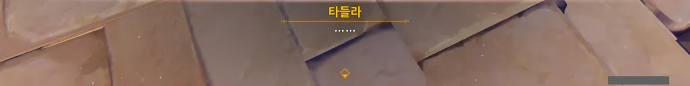

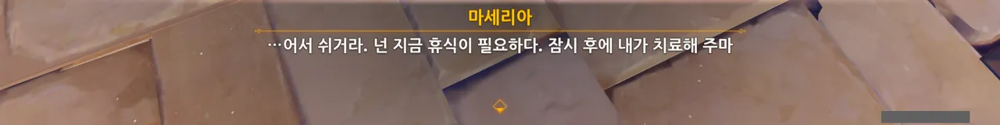

타들라가 고통을 참으며 천천히 걸어 나갔다는 말로 미루어보아, 타들라가 야영지로 돌아온 것도 고통을 참으며 온 것으로 보이는데...

첫인상부터 영 좋지 않았던 마세리아에 대한 평가는 이번에도 하락세를 보이고 있다.

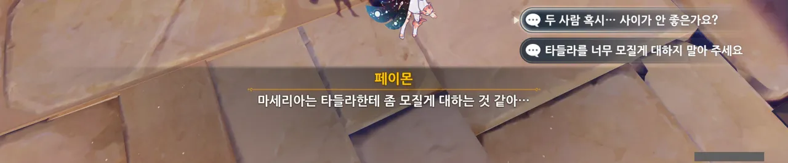

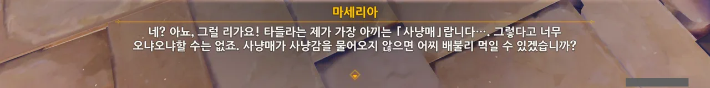

사람을 사람이 아니라 무슨 동물 키우듯이 대하네...

오늘부터 마세리아는 인간 말종으로 결정이다.

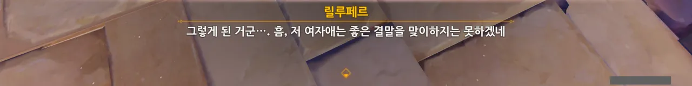

그래, 그건 나도 동의해. 저런 아비 밑에서 큰 자식은 대부분 별로 좋지 않은 결말을 맞더라고...

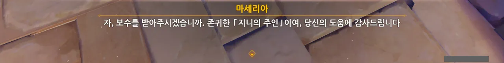

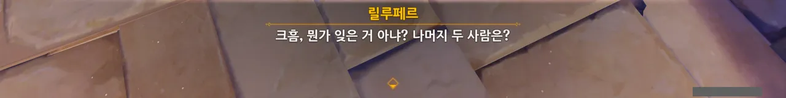

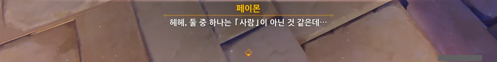

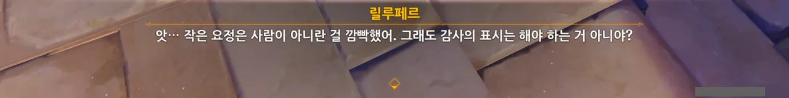

> | | |
> |:--|:--|
> | 페이몬 | 헤헤, 릴루페르는 사람이 아니잖아? |
> | 릴루페르 | 아, 페이몬은 사람이 아니었지? 미안, 깜빡했어. |
> {_borderless=true,_thead=false}

아, 이런 만담, 너무 좋아. 더 해줘!

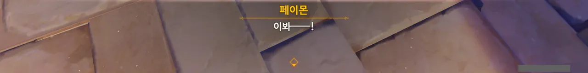

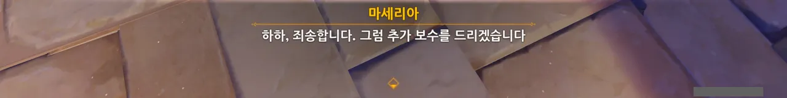

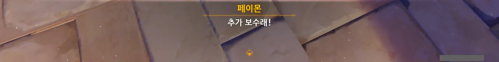

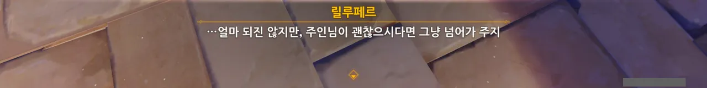

하... 정말 싫다. 하지만 우리 호구 여행자는 마세리아가 도와달라고 하면 또다시 달려 나가겠지.

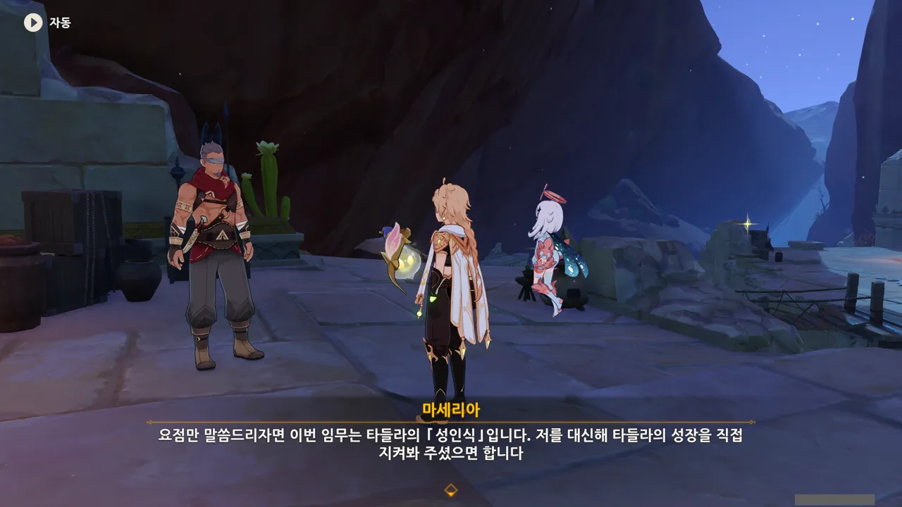

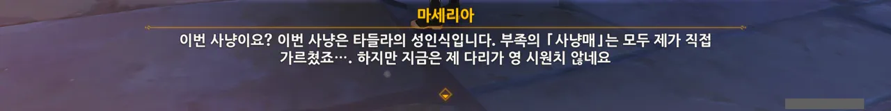

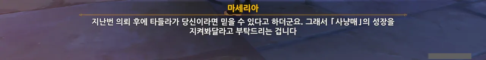

이번 마세리아의 부탁은 타들라의 성인식을 옆에서 지켜봐 달라고 하는 것이었다.

부족의 사냥매를 모두 직접 가르쳤다고 하는 것으로 보아, 마세리아가 이런 식으로 학대하며 양육한 사람이 한둘이 아닌 것 같다.

갈수록 마세리아가 점점 더 싫어진다.

&nbsp;

자꾸만 다리가 불편하다고 강조하는 마세리아를 보니, 저번에 했던 추측을 수정해야겠다.

어쩌면 바벨과 아자릭이 마세리아의 다리를 분질러놓고, 장로 자리에서 얌전히 내려오지 않으면 죽이겠다고 협박한 걸지도 모른다. 부족에서 도망쳐봤자, 불편한 다리 때문에 얼마 가지도 못하고 잡혀 죽을 것이 확실하니, 마세리아는 장로 자리에서 내려올 수밖에 없었을 것이다.

&nbsp;

하지만 그렇다고 해도, 사람을 동물이나 도구 취급하며 키우는 건 도저히 봐줄 수 없다.

여태껏 아이들을 그렇게 키워왔다면, 마세리아의 다리가 분질러진 것도 천벌이라고 할 수 있겠지.

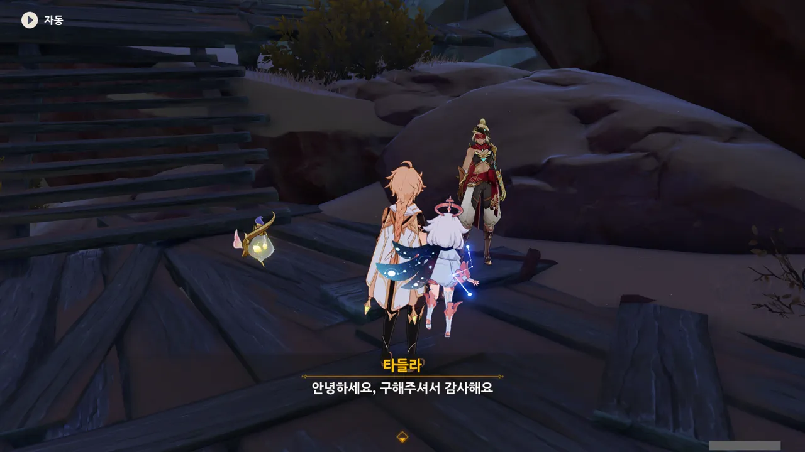

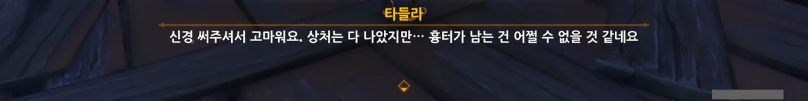

저번에 타들라가 입은 상처가 흉터가 질 정도로 심한 상처였나 보다.

그런데 마세리아는 그런 심한 상처를 입은 타들라에게 책망만 했단 말이지... 망할 것.

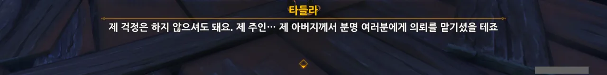

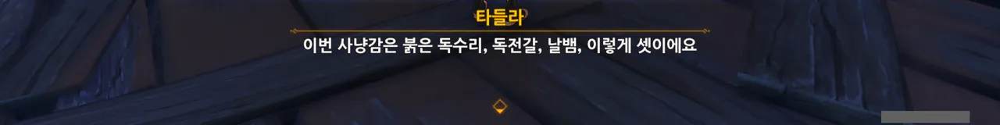

방금 타들라가 마세리아를 아버지가 아니라 주인님으로 부르려던 것 같은데... 심지어 그걸 캐물으니 아무 말 않다가 사냥감 이야기로 얼버무리려고 한다.

점점 더 마세리아가 수상해진다. 주인님? 딸에게 자길 그렇게 부르라고 시켰다고?

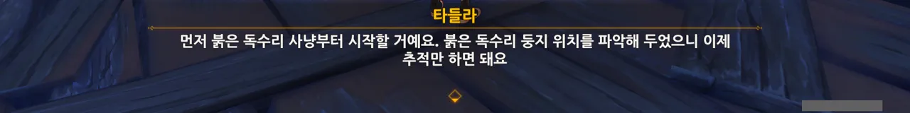

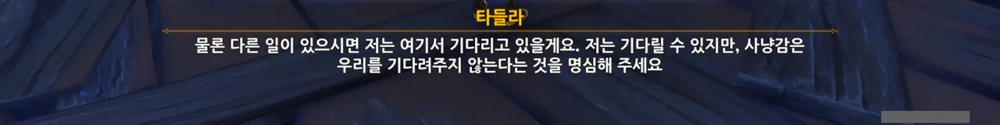

붉은 독수리가 뭐였는지는 잘 기억이 나지 않지만, 어차피 길게 끌 생각이 없으니 바로 출발하기로 했다.

> 저는 기다릴 수 있지만, 사냥감은 우리를 기다려주지 않는다는 것을 명심해 주세요.

대체 타들라가 왜 이 말을 한 거지?

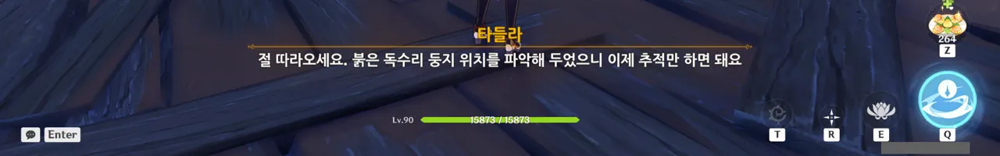

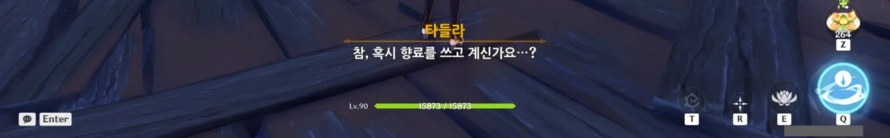

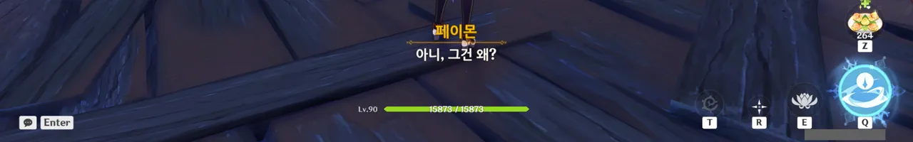

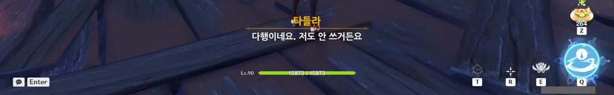

저번에 아자릭에게서 들은 바에 따르면, 향신료 일꾼들은 몸에 밴 모래 벌레의 냄새 때문에 사냥도 하지 못하고 암살자 일도 할 수 없다고 했던 것 같다.

타들라가 향료 이야기를 꺼낸 것은 앞으로 있을 일에 대한 일종의 복선인 것일까?

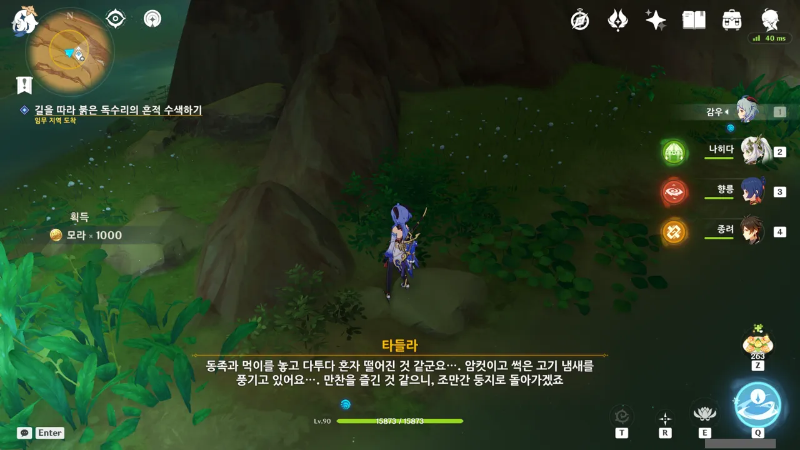

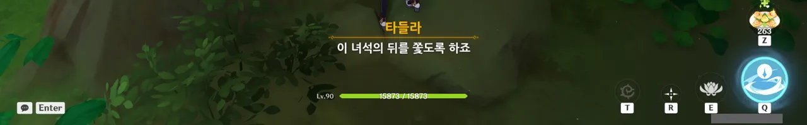

붉은 독수리가 남긴 흔적을 보고 그 행적을 유추하는 타들라.

내 시야에서는 그냥 노란색 조사 포인트로밖에 보이지 않으니, 대체 정확히 무엇을 보고 타들라가 저런 추측을 한 것인지는 전혀 알 도리가 없다.

어... 설마 타들라가 붉은 독수리의 똥을 직접 손으로 만진 거야?

어우... 그렇게까지 꼭 해야 하나...?

붉은 독수리는 자신이 추적당하고 있다는 것을 알아차리자마자 자신의 흔적을 지우기 시작했다.

이거, 보통내기가 아닌걸.

붉은 독수리의 흔적을 따라 도착한 곳은 붉은 독수리의 둥지.

타들라는 독수리가 둥지에 없는 것으로 보아, 이미 수상한 낌새를 눈치채고 도망친 것 같다고 말한다.

그나저나 둥지가 이렇게 크면 분명 붉은 독수리도 엄청 크겠지? 드발린 정도의 크기는 아니더라도 최소한 유적 가디언 둘이나 셋 정도의 크기일 것 같다.

인내심을 갖고 독수리가 둥지로 오기까지 기다릴 수밖에 없다고 하는 타들라.

그런데 아까 보니 둥지 곳곳에 노란색 조사 포인트가 있었는데, 그건 대체 뭘까?

우인금 하면 우인단 아니면 '바보의 금'밖에 생각이 나지 않는다. 여기서 갑자기 뜬금없이 우인단이 나올 이유는 없으니 분명 '바보의 금' 이야기일 것이다.

헤, 나만 저 생각을 한 게 아니었구먼.

역시나 내 예상대로였다.

황철석 혹은 황동은 그 색깔이 금과 비슷해 금으로 착각하기 쉽다. 그래서 '바보의 금'이라고 불리는 거고.

타들라의 '황동은 값어치가 없다'라는 말을 듣고 쓴웃음을 지었다. 실제 황동은 제법 비싼 금속이거든.

&nbsp;

현대 사회에서 황동이 비싼 이유로 두 가지를 꼽을 수 있다.

일단 황동을 만들 때, 구리가 들어간다. 구리 역시 전선의 재료 등으로 쓰이기 때문에, 상당히 비싼 금속이다. 또한 황동은 총탄이나 포탄의 탄피 재료이기도 하다.

하지만 티바트에서는 구리로 전선을 만들지도 않고, 황동으로 총탄이나 포탄의 탄피를 만들지도 않는다. 그러니 황동을 '바보의 금'이라 부르며 무가치하게 생각하는 것은 충분히 이해할 수 있는 것이다.

타들라는 밤까지 붉은 독수리를 기다리자고 말한다.

하지만 그전에 일단 페이몬의 말처럼 반짝이는 것을 먼저 좀 조사할 생각이다. 저 조사 포인트를 만졌을 때 어떤 대화나 반응이 나올지가 매우 궁금하거든.

그런데 얼씨구, 조사를 시작하자마자 위쪽에서 붉은 독수리가 잔뜩 화난 채 나타났다.

그 와중에 이명으로 '내 보물!'이라고 적혀있다. 아무래도 자신의 보물을 뒤적거리는 여행자에게 잔뜩 화가 난 모양이다.

물론, 붉은 독수리는 나타나자마자 여행자에게 찢겼다.

소 뒷걸음치다 쥐 잡은 격으로 어쩌다 보니 붉은 독수리를 밤까지 기다리지 않아도 잡을 수 있었다.

그냥 "음... 사양할게요"를 선택해도 되었지만, 타들라가 말한 남은 일이 무엇인지 궁금해 위쪽 선택지를 골랐다.

타들라가 말한 남은 일이란 사냥감 해체였다. 그래, 중요한 일이긴 하지.

붉은 독수리를 잡으면서 몸에 묻은 신선한 피를 이용해 독전갈을 바로 꾀어내겠다는 타들라.

피비린내가 그렇게 심한가? 페이몬이 코를 막을 정도라니...

솔직히 말해, 무언갈 한 것 같지가 않아 바로 독전갈로 향하고 싶다.

붉은 독수리가 너무 시시하게 잡혔어... 이건 준비운동조차 되지 않는다고.

하지만 어림도 없지. 그대로 하룻밤 쉬고 가는 분위기가 되어버렸다.

페이몬과 릴루페르가 서로 투닥대는 모습이 참 보기 좋다.

아자릭과 제트와 함께 모닥불 앞에 앉았을 때에는 아자릭이 이런저런 이야기를 해서 분위기가 참 부드러웠는데... 지금은 그때와는 또 분위기가 다르다.

이럴 때면 아자릭이 조금 그리워진다. 그 배신자 녀석, 다시 보고 싶진 않지만.

타들라에게 마세리아에 대해 물어보았다.

타들라는 마세리아가 자신의 아버지이며 자신은 아버지의 사냥매라고 한다. 그리고 끝.

더 물어보아도 말을 잘하는 것은 앵무새지, 자신과 같은 사냥매가 아니라며 그 이상 아무 말을 하지 않는다.

대체 애를 어떻게 키워야 저런 말이 나오는 것일까?

그러게? 릴루페르의 코는 과연 어디에 있을까? 릴루페르는 병 속에 갇혀있는데도 잘도 냄새를 맡는구나 싶다.

그것 말고도 궁금한 게 있다. 과연 페이몬의 엄살이 심한 걸까, 아니면 나머지가 피비린내를 잘 참고 있는 걸까? 평소 페이몬의 행적을 생각해 보면 페이몬의 엄살이 심한 것이라고 생각된다만, 실제로는 어떨지.

흠... 여기 옛날에 한 번 온 것 같은데... 친구와 함께 다인 모드에서 정처 없이 필드를 돌아다녔는데, 그러면서 보이는 자원이란 자원은 다 잡고, 보이는 몹이란 몹은 다 잡고 다녔었다. 그때 분명 이런 보랏빛 공간에서 거대한 전갈을 잡았었거든.

어쩌면 조금 전 잡았던 붉은 독수리도 나중에 다시 한번 그곳으로 가면 또 잡을 수 있지 않을까?

전갈에게 미끼를 써서 약체화시킨 후 잡는 방법이 여럿 있지만, 독전갈의 난이도가 궁금해 미끼 없이 잡아보기로 했다.

종려의 실드만 있다면 두려울 것은 오직 침식밖에 없다. 침식은 실드도 뚫거든...

그런데 침식 디버프는 수계 늑대 시리즈처럼 심연 계열의 몹만 쓴다. 그러니 독전갈이 심연과 관련이 없는 한, 독전갈은 침식 디버프를 걸지 않을 것이다.

임무 내용에 '후미진 곳에 숨기'라고 되어 있길래 대체 어디에 숨어야 할까 생각했는데, 뒤편에 타들라와 함께 조사 포인트가 하나 있었고, 조사 포인트를 들여다보니 '숨기'라고 적혀있었다.

난 옛날 이벤트에서 했던 것처럼 Ctrl 키를 눌러 수풀 속에 숨는 그런 기믹으로 생각했었는데, 그냥 버튼 하나만 누르면 적당히 알아서 숨는다.

좀... 실망스러운걸.



독전갈을 하나 잡았는데 1+1 행사라도 하는 것인지, 한 마리가 더 나왔다.

첫 번째 독전갈은 그냥 '독전갈 - 위험한 매복자'였다면, 두 번째 독전갈은 '청소부 독전갈 - 사냥꾼의 쌍둥이 형제'였다.

아마 형제가 같이 지냈던 모양인데, 형제가 쌍으로 전갈 고기 세트가 되었다.

타들라가 부상을 입었다. 처음 타들라를 만났을 때가 생각나는걸. 그때에도 타들라가 다쳤었지.

다만 걱정되는 것은 타들라가 '조금 다쳤을 뿐'이라고 한 것이다.

첫 만남에서도 그랬지만, 타들라는 큰 상처로 인한 고통도 별 것 아니라고 말하며 상처의 고통을 묵묵히 참는다. 아마 마세리아의 가스라이팅 때문이겠지.

이번에도 타들라가 사냥감을 해체하는 모습을 보고 싶었다.

나는 순수하게 타들라가 사냥감을 해체할 때를 묘사한 글이 보고 싶었을 뿐이지만, 여행자의 생각은 달랐던 모양이다.

여행자의 말도 듣고 보니 그렇긴 하다. 안 그래도 사냥감 해체용 칼은 날카로운데, 부상으로 인한 고통 때문에 힘을 잘못 주어 또 다른 부상을 입을지도 모르지 않은가.

상처로 인한 통증에도 불구하고 독전갈 해체를 무사히 끝마친 타들라.

호흡이 떨릴 정도면 보통 아픈 것이 아니었을 텐데, 이걸 대단하다고 해야 할지...

그다음은 날뱀 사냥이다. 그런데 타들라의 상태는 정말 괜찮은 것일까?

본인이 자꾸만 저렇게 괜찮다고 하니 어쩔 도리가 없긴 한데... 영 불안하다.

릴루페르가 '예전에 느껴본 듯한 고통'을 느낀다. 이거 분명, 릴루페르의 조각이 근처에 있다는 소리인데.

난 저번에 빌키스의 애가 월드 임무를 할 때 릴루페르의 조각을 모두 모은 줄 알았는데? 그때 릴루페르의 모든 기능이 해금되었길래, 릴루페르의 모든 조각을 되찾은 줄로만 알고 있었다.

으음, 릴루페르가 처음에 몇 조각으로 찢겼다고 했지? 그동안 모은 릴루페르의 조각은 몇 개고?

릴루페르의 조각을 찾고 싶어도, 조각이 만들어낸 오아시스 근처에 사는 날뱀 무리 때문에 조각의 정확한 위치를 파악하기 어려운 상황.

그렇지. 페이몬 말처럼 날뱀이 조각을 찾는데 방해된다면, 날뱀을 모두 잡아버리면 되는 일이다.

마침 날뱀을 잡으러 온 것이기도 하고 말이다.



일단 한번 쉬고 가자는 릴루페르의 말에 '그냥 가면 되는데 굳이 왜?'라고 생각했다.

하지만 정찰을 하고 오겠다는 타들라가 곧바로 주저앉자, 왜 릴루페르가 그런 말을 했는지 단숨에 이해했다.

타들라의 몸 상태가 예상보다 훨씬 좋지 않았던 모양이다.

릴루페르의 "「너무 아파요」라는 뜻이군"이라는 대사가 뭔가 웃기긴 하는데, 다른 한편으로는 안쓰럽기도 하다.

이게 다 마세라티인지 마세리아인지 뭔지 하는 놈 때문이다. 그놈의 가스라이팅 때문에 고통조차 제대로 표현하지 못하는 것 아니겠는가.

고통은 뇌가 느끼는 것이기 때문에, 아플 때 아프다며 욕을 하면 실제로 고통이 약간 경감되는 효과가 있다고 한다.

일단 타들라는 잠시 쉬도록 하고, 혼자 날뱀을 잡으러 가기로 했다.

날뱀을 보자마자 저번에 친구와 함께 돌아다닐 때 잡았던 녀석임이 기억났다.

저 '타락한 사자'라는 것은 대체 무슨 뜻일까? 그때에도 궁금해했었는데.

사람이 몸 상태가 별로 좋지 않을 수도 있지. 모든 사람이 언제나 컨디션 100%인 건 아니니 말이다.

타들라를 사냥매라고 부르면 마세리아의 가스라이팅에 대해 동의하는 꼴이 되는 것 같아, 일부러 사냥매라고 부르지 않기로 결심했다.

타들라는 날뱀을 해체하러, 여행자는 릴루페르의 조각을 얻으러 잠시 갈라졌다.



구라바드를 비롯한 사막 왕국에 대한 이야기인 것 같지만, 이미 난 사막 왕국에 대한 이야기를 이해하길 포기했다. 너무 복잡한 걸.

정 궁금하면 나중에 따로 위키를 읽어볼 것이다. 분명 친절한 누군가가 구라바드와 다른 사막 왕국 이야기를 아주 잘 정리해 놨을 거야.

내가 아는 건, 릴루페르가 구라바드에 무언가 심한 짓을 했다는 것이 전부이다. 자신의 복수를 위해 자기 친자식까지 도구로 써가며 말이다.

이전에 보았던 릴루페르의 기억을 종합해 추측한 것이지만, 릴루페르가 구라바드에 한 짓은 흑막에 가까운 짓이 아니었을까?

뒤에서 계획을 세운 후, 사람들을 유혹하고 부추겨 자신이 원하는 대로 움직이게 하는 그런 종류 말이다.

어째 배경이 온통 검은색이다 싶었는데, 여태껏 릴루페르와 심상 세계에서 대화를 한 것 같다.

잠깐만, 그런데 구라바드의 멸망이 그저 예고에 불과하다고? 그건 또 무슨 말이야?

아까도 말했지만, 여행자에게 있어 타들라는 사냥매가 아니기 때문에 사과한 것이다.

릴루페르가 아까 전보다 상태가 괜찮아졌다고 말하는 타들라에게 전갈 독에 당했으니 더 쉬어야 한다고 말한다.

릴루페르가 '좋은 사냥매라면 자신의 생명을 소중히 여겨야 한다'라며 타들라가 사냥매임을 강조하길래, 일부러 페이몬의 편을 들어줬다.

타들라는 사냥매 같은 것이 아니라, 하나의 멀쩡한 사람이라고.

몸이 성치 않은 타들라를 대신해 여행자가 야영지를 세운다.

다행스럽게도 하룻밤 푹 쉬니까 타들라의 상태가 정말로 나아진 것 같다.

여행자에게 호감을 표하는 타들라를 보며 '사냥매 답지 않다'라고 불안해하는 릴루페르.

나도 비슷한 생각이긴 하다. 마세리아가 있는 한, 타들라는 사냥매 신세에서 벗어날 수 없을 것이다. 마세리아라면 분명 저렇게 '풀어진' 타들라를 질책할 게 분명하다.
