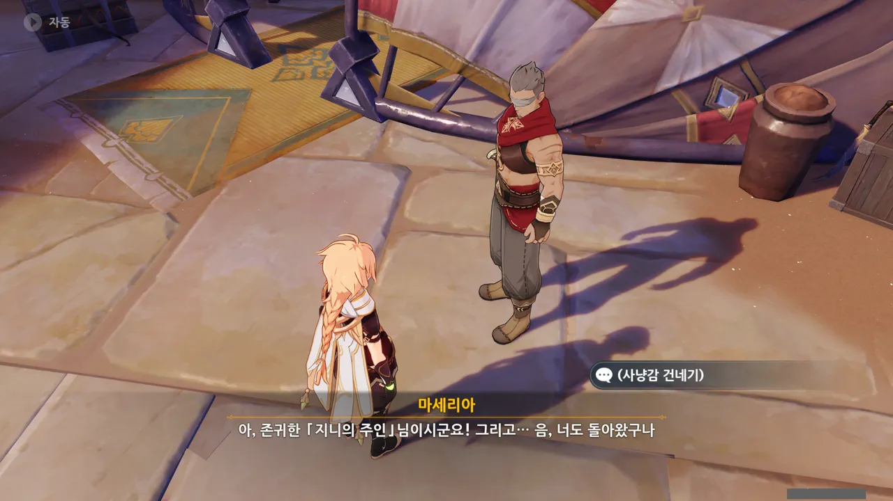

마세리아에게 돌아왔다.

마세리아는 여전히 지니의 주인인 여행자만 눈에 들어오고, 자신의 딸은 눈에 보이지도 않나 보다.



타들라의 성인식에서 가져온 아이템들의 플레이버 텍스트가 하나같이 찝찝하기 그지없다.

날뱀의 뿔은 아무런 효능이 없지만 사막 부족민들은 이걸로 만든 약을 도시 사람들에게 수면에 도움이 되는 약이라고 속여 팔고 있다.

독전갈의 꼬리와 붉은 독수리 깃털은 독으로 가공할 수 있다.

&nbsp;

나는 모든 사람들을 선입견 없이 보려고 노력하는 편이다. 하지만 이런 기분 나쁜 일만 반복되다 보니, 사막인들에게 없던 편견이 생기려고 한다.

예전이라면 도시 사람들에게 차별당하던 사막 부족민들이 불쌍하다고 생각했을 텐데, 지금은 그게 다 자업자득이 아닐까 하는 생각조차 들 정도이다.

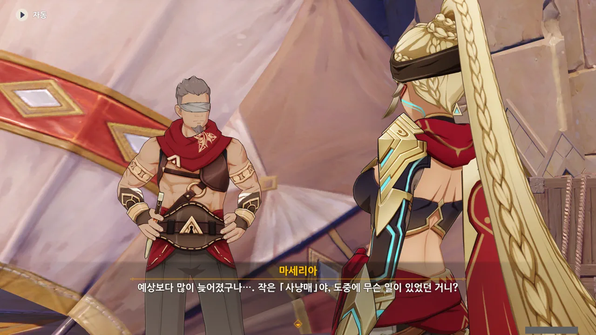

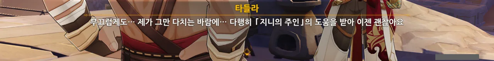

마세리아가 잠시 말을 않다가 "그래, 무사하다니 다행이다"라고 말한다.

평소 타들라에 대한 마세리아의 태도를 볼 때, 저건 정말 타들라가 무사해서 다행이라고 말하는 게 아니라, 지니의 주인인 여행자에게 잘 보이기 위해 하는 빈말로 보인다.

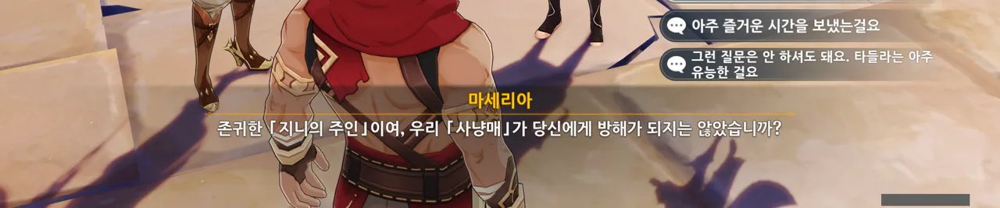

맞아, 타들라가 얼마나 유능했는데.

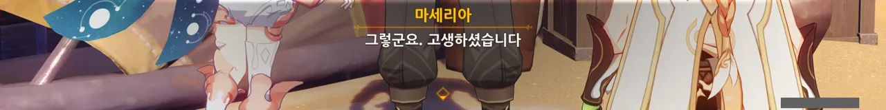

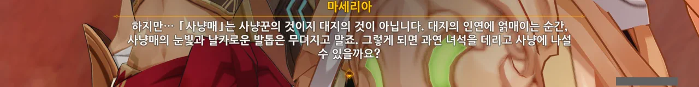

마세리아도 여행자와 타들라 사이의 관계를 눈치챈 듯, 여행자에게 타들라와 멀어지라고 이야기한다.

자식에게 가스라이팅 하는 새끼의 말은 들을 필요가 없다. 타들라를 자식이라 여기는 것인지는 둘째치고 말이다.

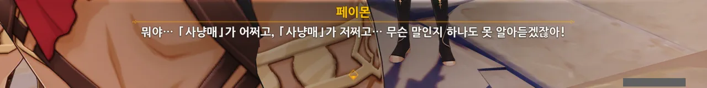

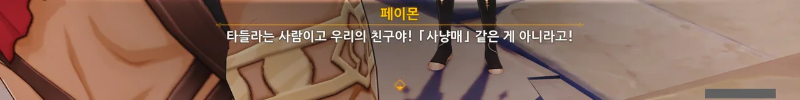

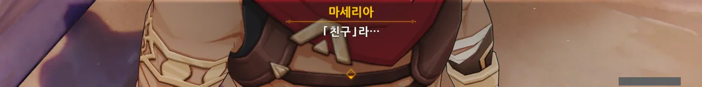

페이몬이 타들라를 친구라고 부르는 것을 듣자 얼굴을 굳히는 마세리아.

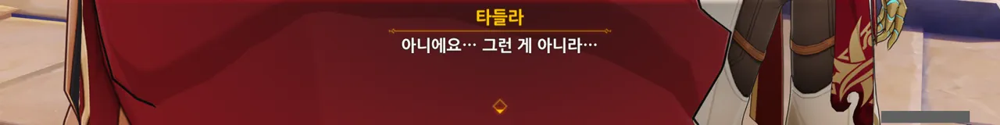

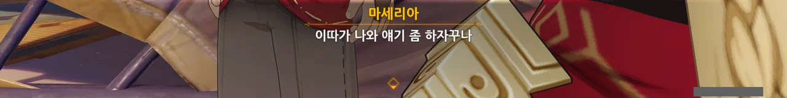

이다음에 어떤 일이 있을지 벌써부터 예상이 간다.

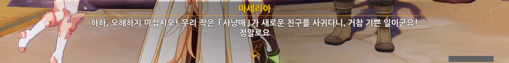

아, 지랄 마쇼. 아닌 거 얼굴에 다 보이는데.

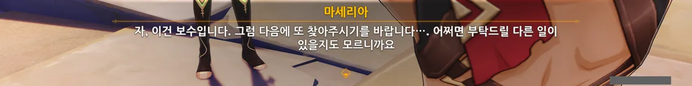

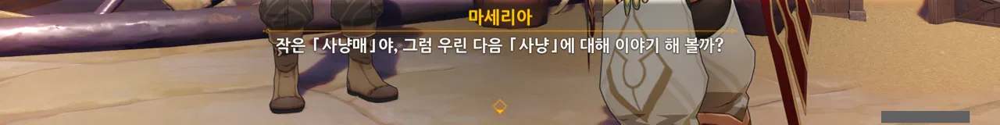

여행자가 떠나자 다음 사냥에 대해 지시하는 마세리아.

분명 세 짐승을 잡아온 것으로 타들라의 성인식은 모두 끝난 것 아니던가? 왜 또 지시를 하는 것일까?

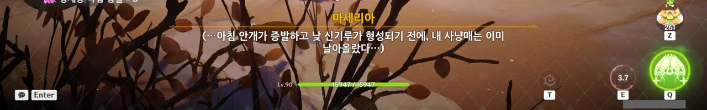

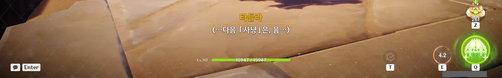

나히다로 둘의 마음속을 들여다보았는데, 도대체 무슨 말을 하는 것인지 알 수 없다.

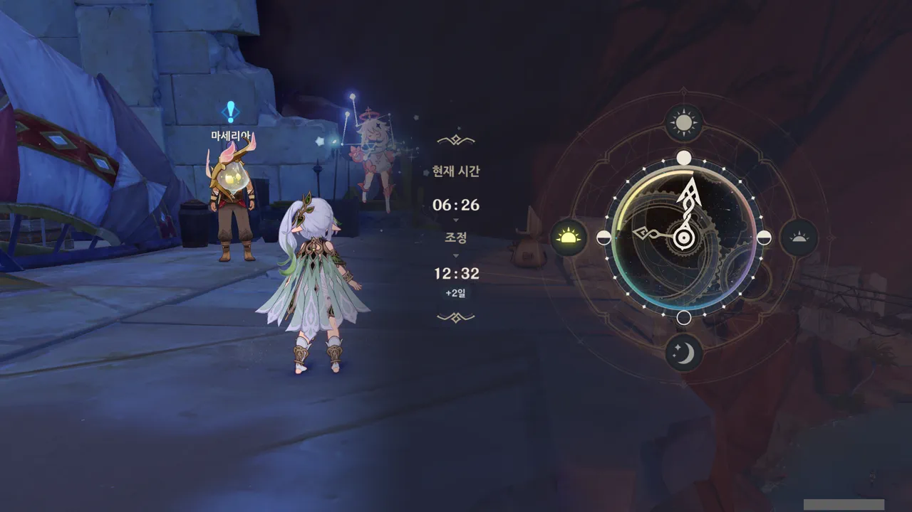

다음 퀘스트가 뜨지 않길래 검색을 해보니, 시간을 돌려보라는 말이 나왔다.

그런데 혹시나 해서 이틀 치 시간을 돌렸는데, 시계가 돌아가자마자 곧바로 마세리아 머리 위에 퀘스트 마커가 뜬 것으로 봐서 조금만 기다려도 되지 않았을까 싶다.

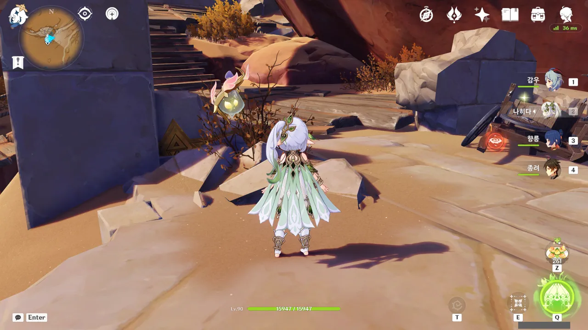

타들라가 보이지 않는다. 어디 간 것일까?

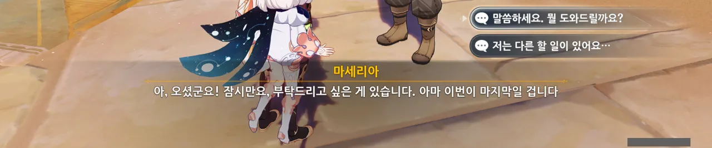

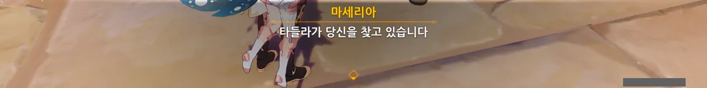

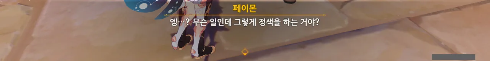

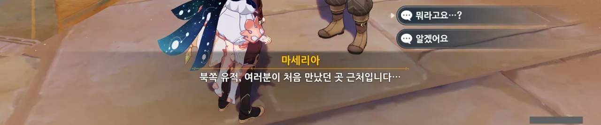

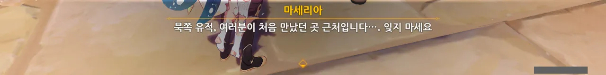

다짜고짜 북쪽 유적으로 가라는 마세리아. 이거 굉장히 수상쩍은데...

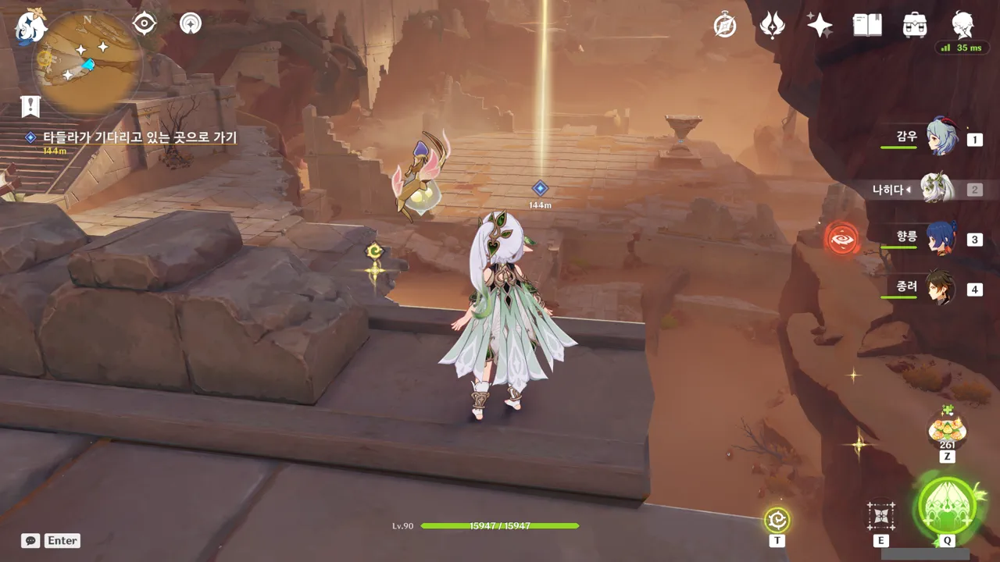

타들라는 장기판 위에서 여행자를 기다리고 있다.

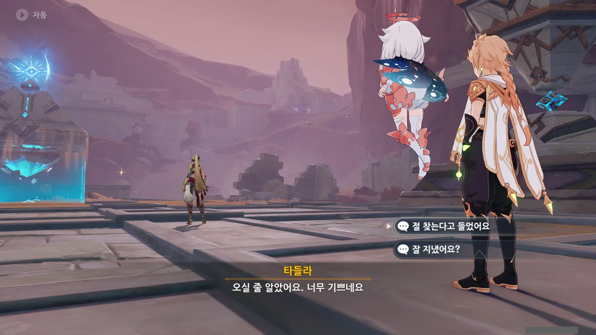

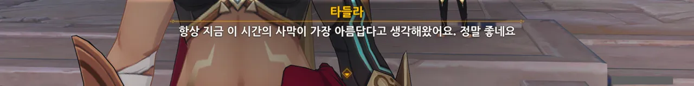

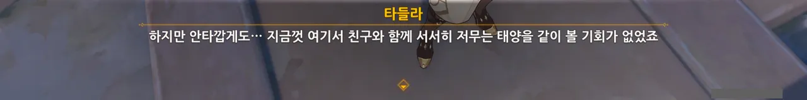

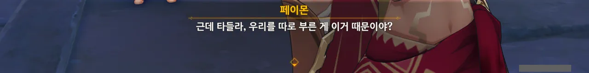

여행자를 돌아보지 않고 자기 할 말만 하는 타들라.

풍경 이야기를 하려고 우릴 여기로 부른 것은 아닐 테고...

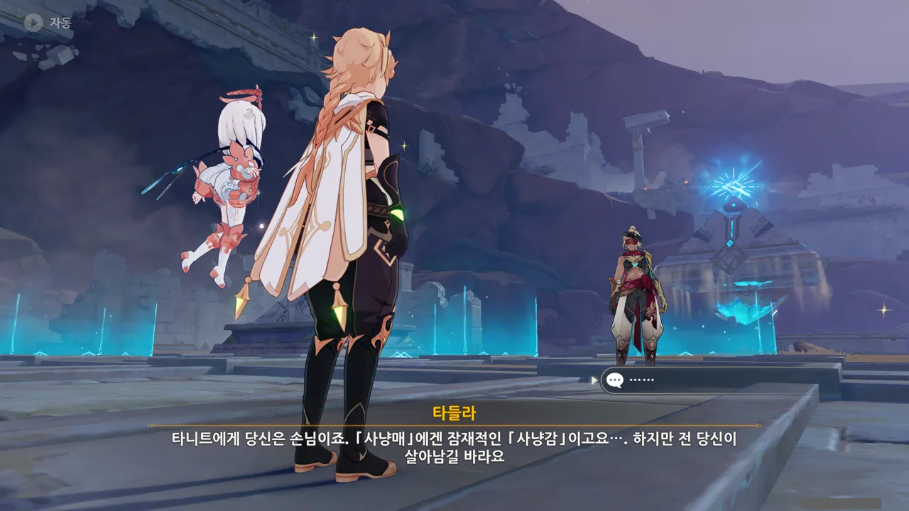

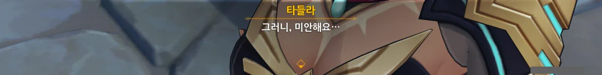

아, 이해했다.

마세리아는 타들라에게 여행자를 「사냥」하라고 한 것이다. 그리고 오랜 가스라이팅 때문에 타들라는 이를 거부할 수 없었던 것이고.



곧바로 타들라와의 전투가 시작된다.

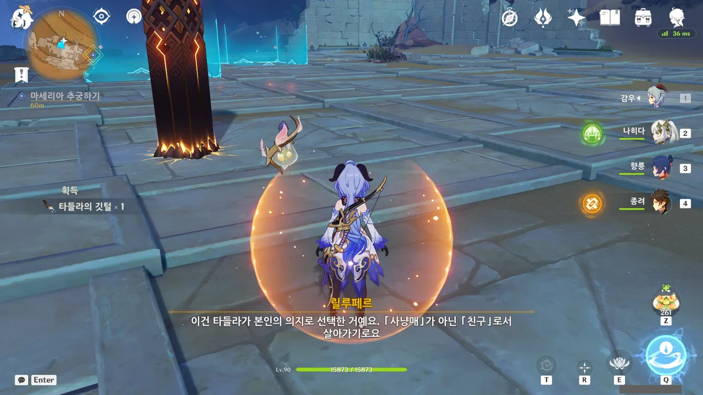

타들라는 죽어가며 자신을 잊지 말아 달라는 말을 남겼다. 순식간에 지나가서 사진을 찍을 새도 없었지만.

이 결말은 타들라 본인이 직접 선택한 것이라고 릴루페르가 말한다. 사냥매로서 친구인 여행자를 죽이느니, 여행자의 친구로서 여행자에게 죽겠다는 것이다.

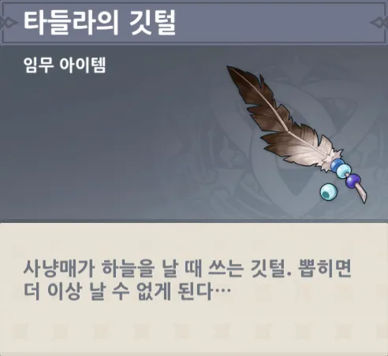

타들라를 처치하고 얻은 아이템의 플레이버 텍스트도 암울하기 그지없다.

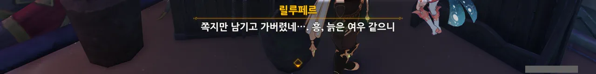

마세리아에게 항의를 빙자한 복수를 행하려 마세리아를 찾아갔지만, 마세리아는 이미 흔적도 없이 사라진 후.

그 대신 쪽지 하나를 남기고 갔다.

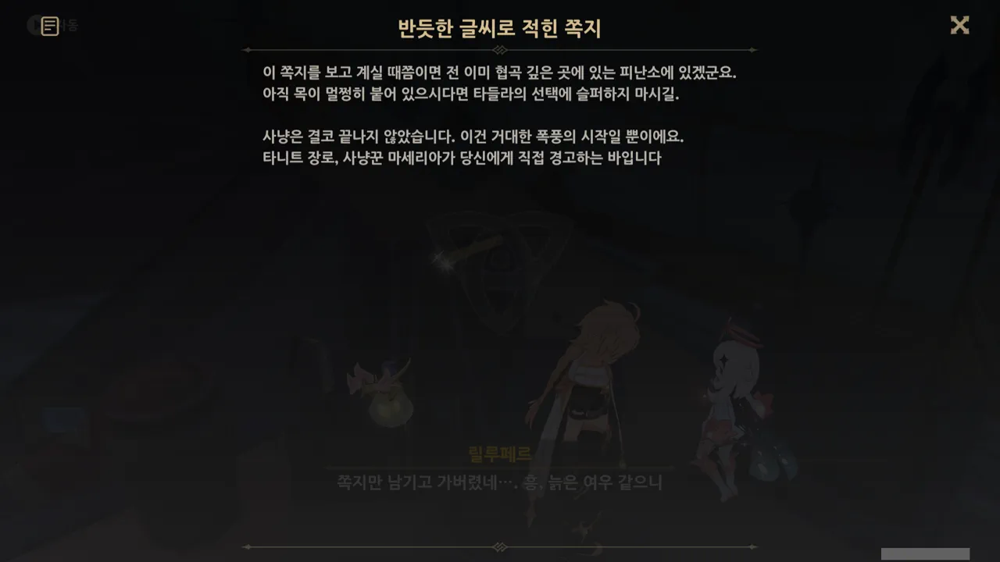

야, 지랄이 짜다.

언젠가 마세리아를 만나면 묻지도 따지지도 않고 입을 뚫어버려야지.

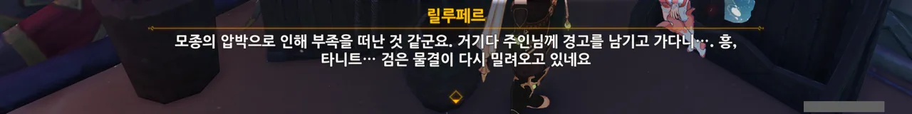

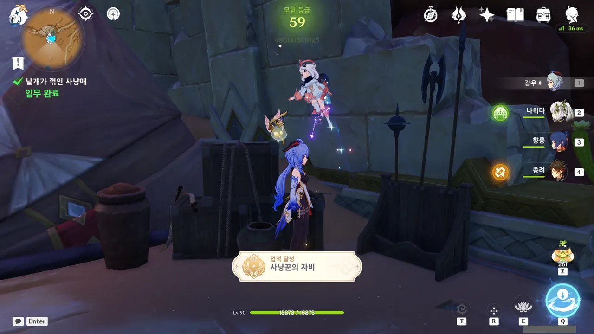

사냥꾼의 자비 업적을 마지막으로 사냥매 임무가 모두 끝나게 된다.

거 참 기분 찝찝하기만 하네.
