갑자기 드는 생각이다만, 수메르 사막 지역의 월드 임무도 우림 지역의 월드 임무, 숲의 책 못지않게 긴 것이 아닐까 하는 생각이 든다.

임무가 끝없이 가지를 치던 숲의 책보다는 일직선인 사막 지역 월드 임무가 훨씬 낫지만...

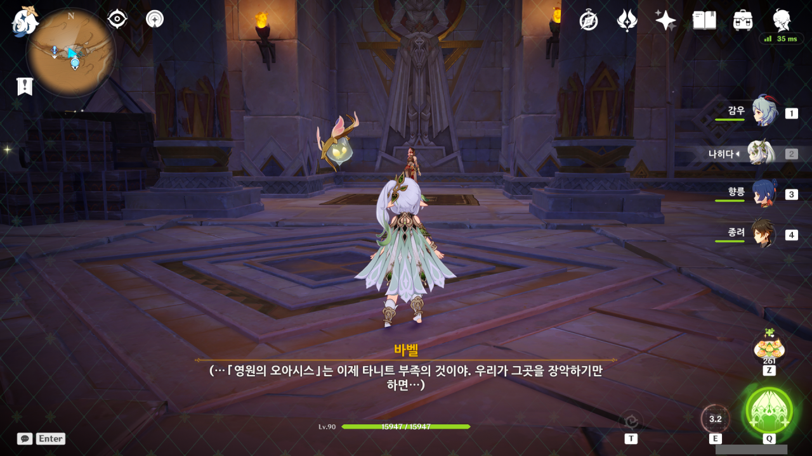

> 「영원의 오아시스」는 이제 타니트 부족의 것이야. 우리가 그곳을 장악하기만 하면...

바벨... 빌키스의 애가 월드 임무에서 별다른 일 없이 임무가 그대로 끝났기에 바벨에 대한 의구심을 조금 접어두었더니, 곧바로 이어진 매사냥 월드 임무에서 바벨이 옛날에 뭘 했는지에 대한 문서가 튀어나왔다.

바벨의 진실을 알게 되니, 이제는 바벨이 아무리 좋은 말을 해도 다 더러운 꿍꿍이가 있어 그러는 것으로밖에 보이지 않게 되었다.

예전에는 그 모든 의혹을 그저 의심병 가득한 망상일 뿐이라고 치부할 수 있었지만, 지금은 어떤 의심을 해도 그럴듯한 말이 된다.

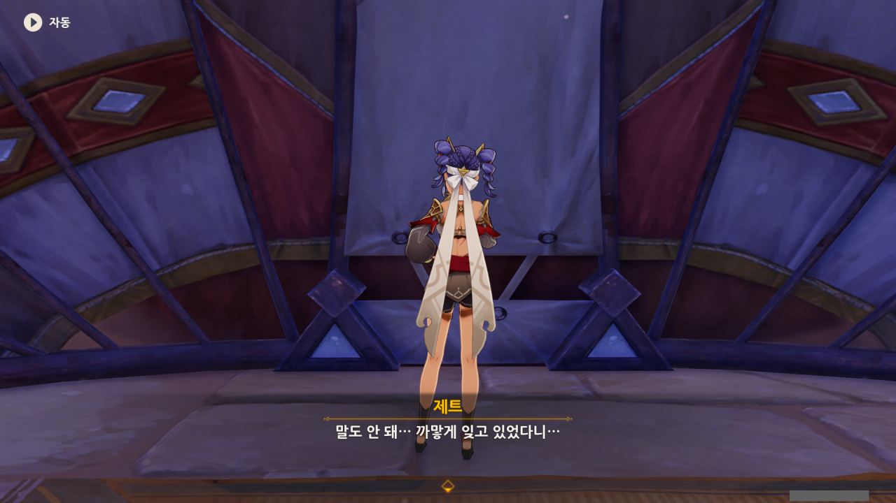

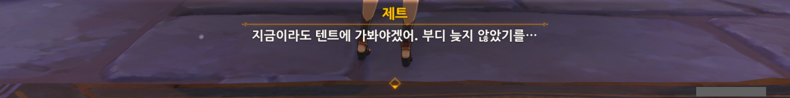

임무 시작을 위해 제트에게 가보았더니, 제트가 뭔갈 잊었다며 혼잣말을 하고 있다.

대체 뭘 깜빡한 거지?

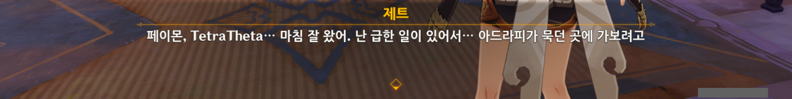

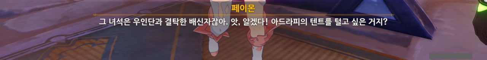

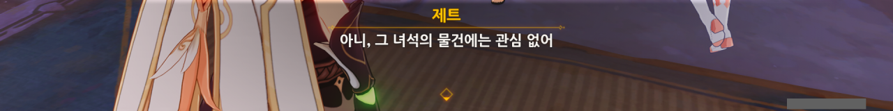

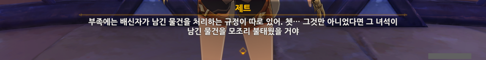

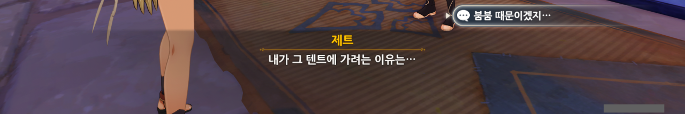

제트가 왜 아드라피의 텐트에 가려나 했는데, 아드라피에게 맡겼던 붐붐 때문이었다.

아드라피가 추방된 이후, 아드라피의 텐트에 붐붐이 여전히 있는 것을 확인했었지만, 그건 내가 따로 가서 본 거였으니, 제트는 붐붐이 아직도 아드라피의 텐트에 있는지 아닌지 모르고 있는 것이다.

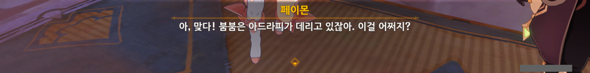

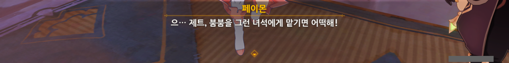

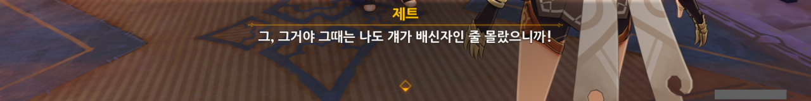

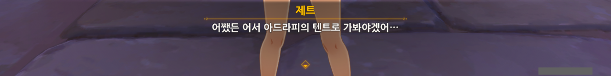

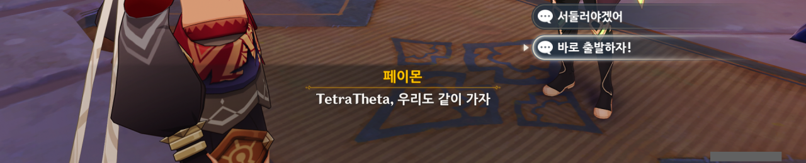

우리가 여태 자리를 비웠던 사이, 다른 누군가가 아드라피 등의 사주를 받고 붐붐을 몰래 가져갔을 수도 있으니, 지금 제트와 함께 가서 다시 확인하는 것도 나쁘지 않을 것이다.

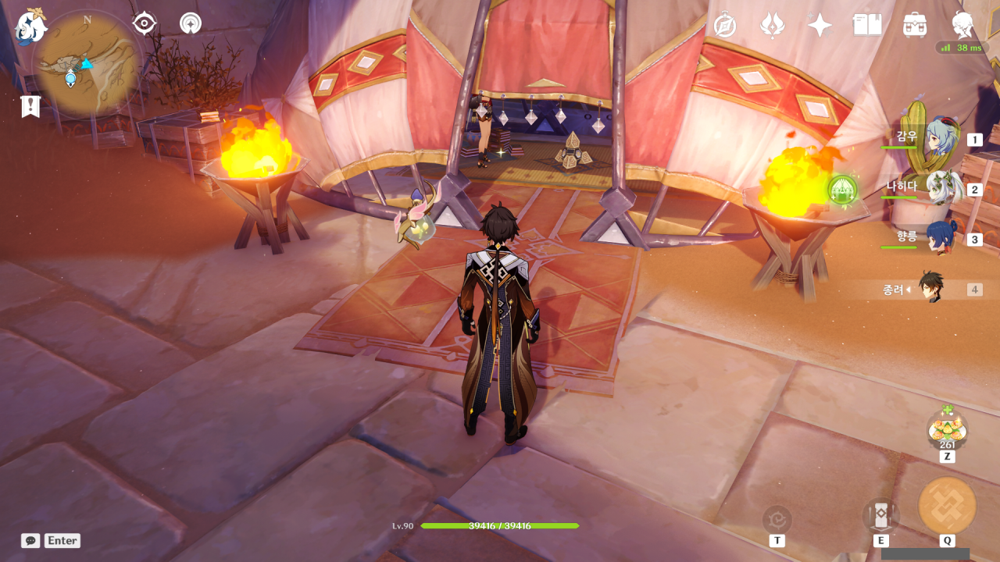

역시나 내 걱정은 기우였다. 붐붐은 저번에 봤던 그 장소에 그대로 놓여있었다.

상태가 영 좋지 않아 보이는 것 역시 그대로이다.

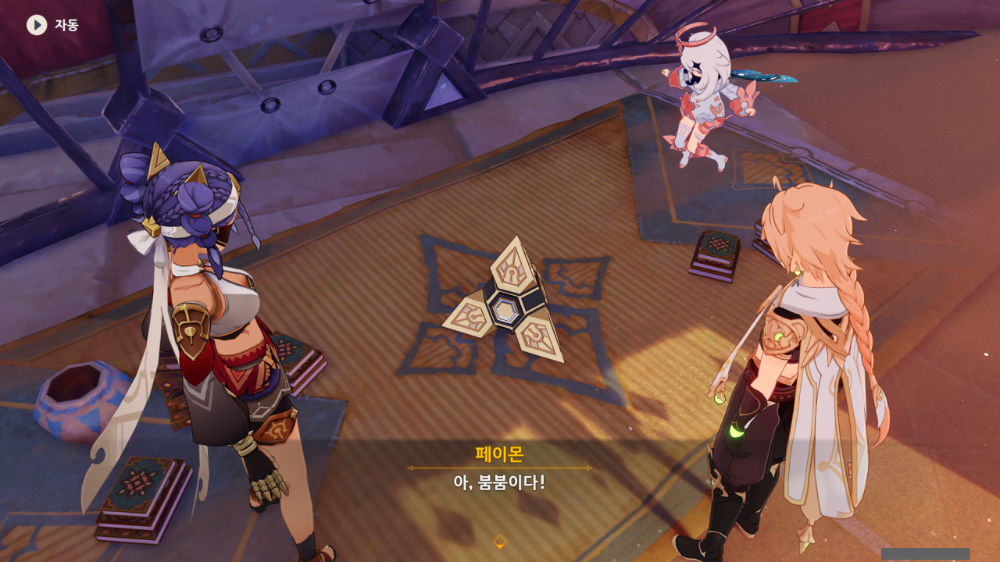

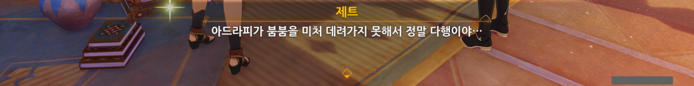

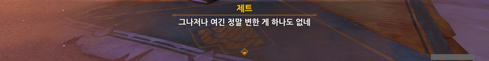

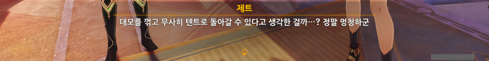

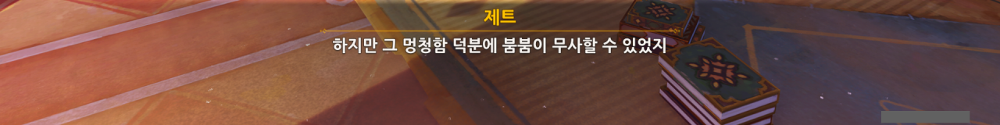

저번에도 한 이야기지만, 난 붐붐의 상태가 좋지 않다는 말을 들었을 때, 붐붐을 고치겠다고 나선 아드라피를 제일 먼저 의심했었다.

그야, 고대 문명의 장치인 붐붐을 일개 사막 부족의 상인이 본 지 며칠 만에 고칠 수 있다는 걸 누가 믿겠는가?

분명 아드라피가 제트 몰래 붐붐에게 뭔가를 끼워 넣어 붐붐의 정상 작동을 방해한 다음, 붐붐을 수리한다는 명목으로 제트에게서 붐붐을 가져온 후, 다른 누군가에게 팔아넘길 생각이었겠지.

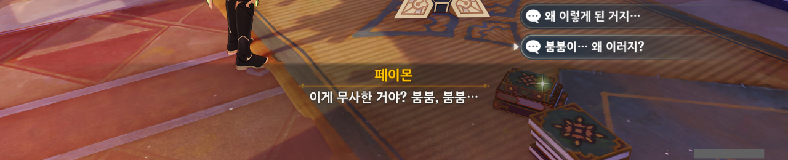

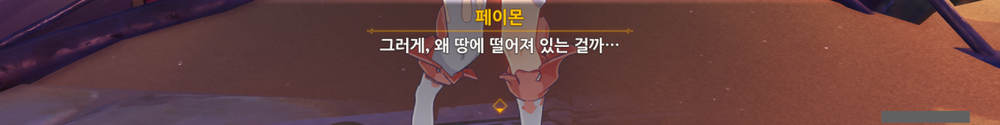

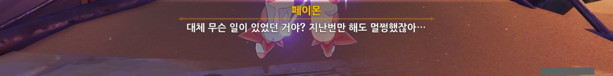

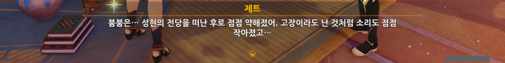

그렇다면 혹시 붐붐을 성현의 전당으로 다시 가져가면 붐붐이 다시 원래대로 돌아올 수 있을까?

여태껏 성현의 전당에서 에너지를 공급받다가, 제트와 함께 하면서 성현의 전당에서 멀어져 에너지를 제대로 공급받지 못한 탓에 붐붐이 이렇게 된 것일 수도 있지 않은가.

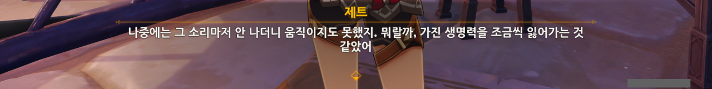

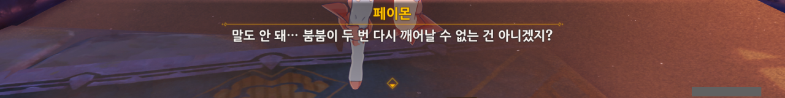

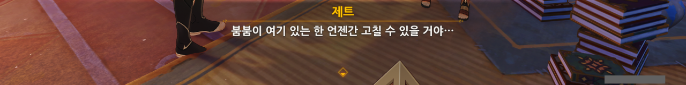

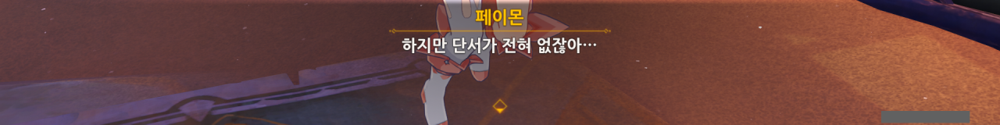

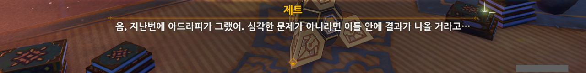

아, 그래. 아드라피가 저런 말도 했었지.

지금은 아드라피, 아자릭, 바벨 뒤에 우인단이 있다는 걸 알고 있으니, 대충 마법의 단어인 우인단을 외치면 어떻게라도 할 수 있을 거라 생각할 수 있지만, 저 말을 들었을 때에는 그걸 전혀 몰랐었다.

아드라피가 더더욱 의심스러웠을 수밖에.

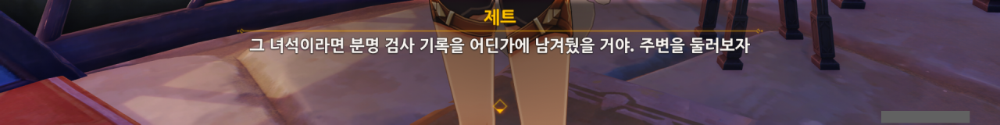

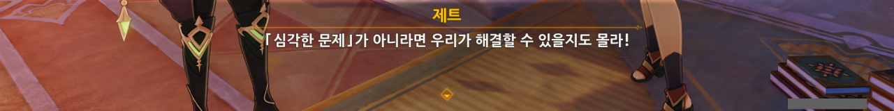

아드라피도 죽었겠다, 아무런 양심의 가책 없이 아드라피의 텐트를 뒤져보기로 했다.

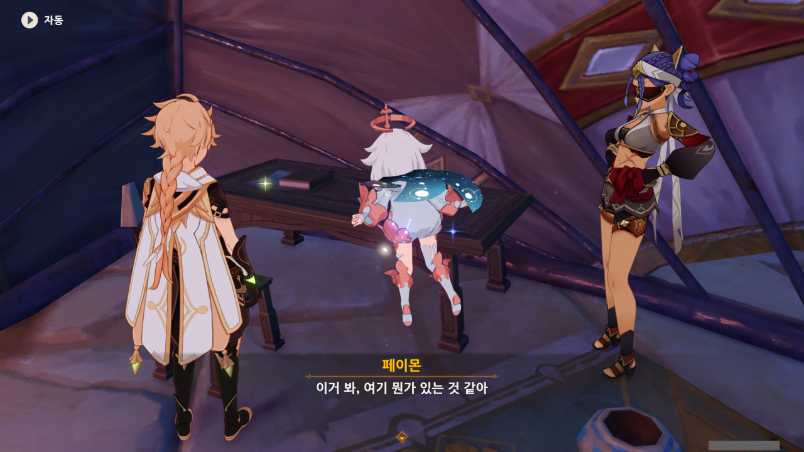

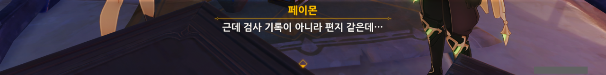

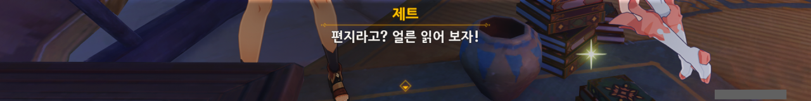

아드라피는 시시껄렁한 대화를 위해 편지를 쓸 것 같지 않았으니, 사소한 편지라도 우리에게 도움이 될 수 있지 않을까?

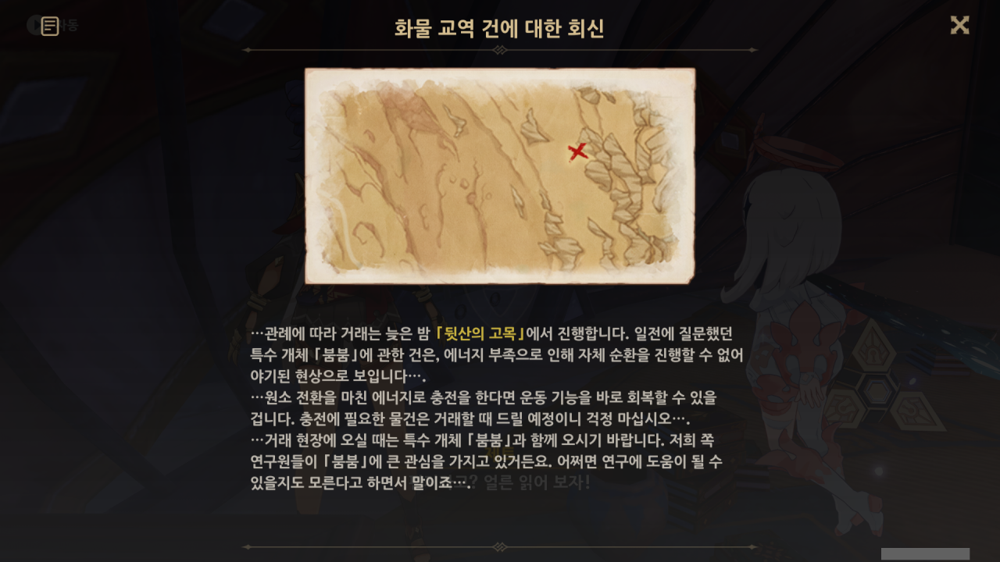

오, 그래, 좋아. 붐붐을 고칠 방법을 찾은 것 같다.

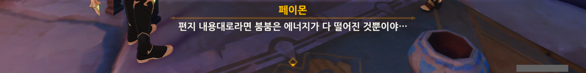

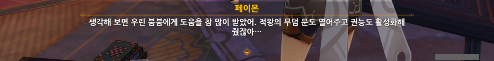

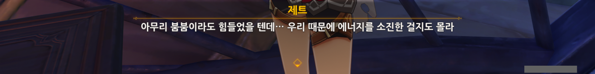

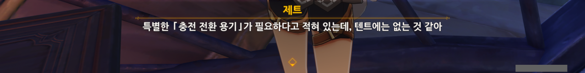

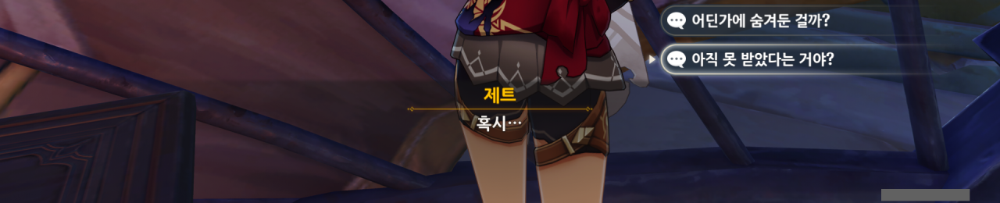

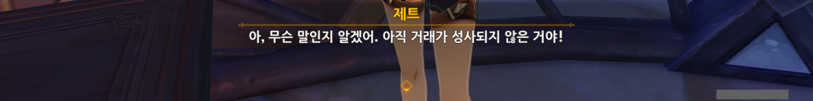

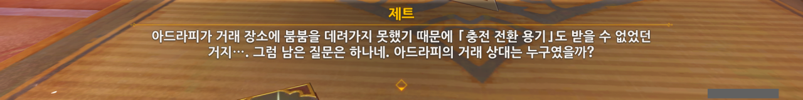

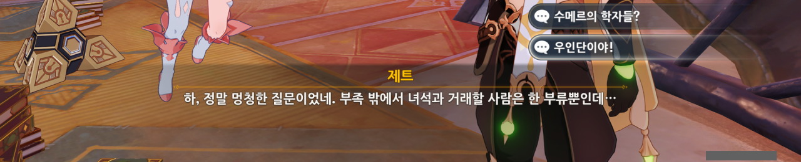

아드라피의 뒤를 봐준 것이 우인단이니, 이건 당연히 우인단과의 거래 이야기겠지.

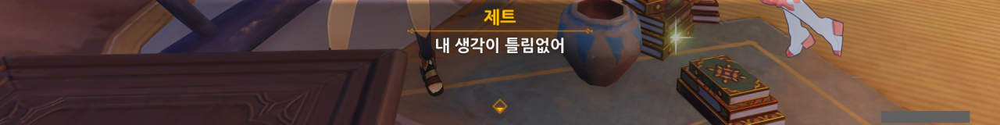

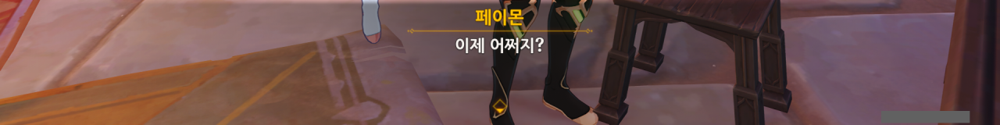

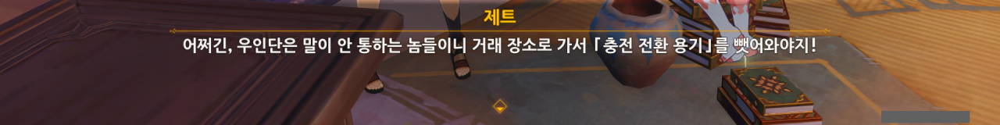

당연한 이야기다. 우인단이 '내놔' 하면 곱게 '예, 여기 있습니다'라고 말할 녀석들은 아니지 않은가? 그러니 가서 뺏어와야지.

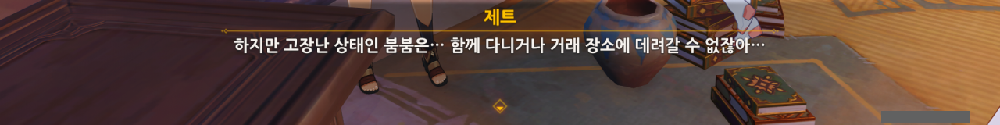

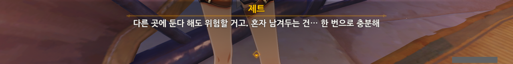

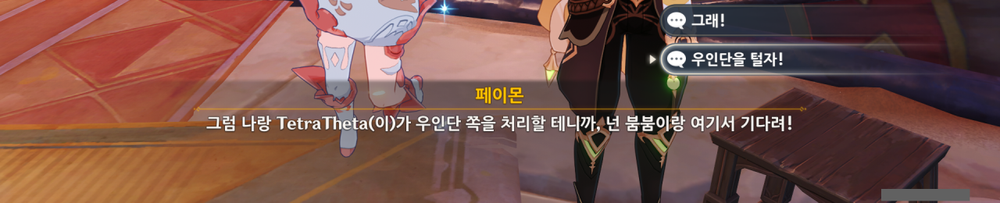

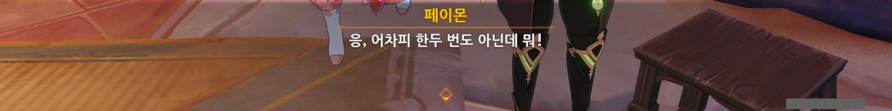

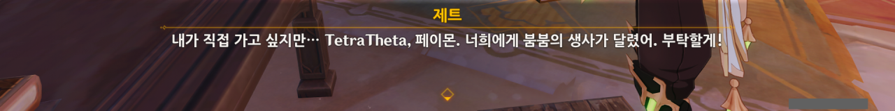

우인단 집행관 정도 되는 거물이 아닌 한, 여행자가 다 이길 수 있을 것이다.

이미 우인단 집행관 중 하나인 시뇨라도 1|1 매치로 이긴 적이 있고.

그래서 제트와 붐붐은 타니트 부족에 남고, 여행자 혼자 거래 장소로 가, 「충전 전환 용기」를 우인단에게서 약탈해 오기로 했다.

무슨 놈의 거래 장소가 이렇게 찾기 힘들어? 분명 지도를 보고 갔음에도 불구하고, 저 장소 하나를 못 찾아서 한참 동안이나 주변을 이리저리 뒤지고 다녀야 했다.

저 '프레드록 프롱큰스틴'이라는 사람은 우인단과 함께 일하는 사람 같다.

이름을 보아하니 폰타인 사람 같은데, 스네즈나야 사람처럼 술을 엄청 좋아한다.

그가 요구한 것 중 「충전 전환 용기」를 제외하면 남는 게 스네즈나야 특산품 술인 「불의 물」, 폰타인 감주밖에 없다. 이 모두가 전부 술이고.

술을 좋아하는 사람치고 그 결말이 좋았던 걸 본 적은 없었던 것 같은데...

나다.

> 맞는 쪽이 그런 말을 하니까 묘하게 설득력이 있네

ㅋㅋㅋㅋㅋㅋㅋㅋㅋㅋㅋㅋ

아니, 이게 뭐라고 이렇게 웃긴 거지?

이야, 뭘 말해야 하는지 말도 안 해주고 대뜸 말하라고 하네. 이거 제대로 된 심문법 맞아?

아니, 이게 통한다고? 역시 물리치료가 효과가 있었던 것일까?

새로 온 소녀라... 제트를 말하는 걸까?

생각해 보면 제트가 타니트 부족에 온 것도 그리 오래되지는 않았다.

아자릭? 죽었어. 지금쯤 잘 썩고 있을걸?

뭐? 아드라피의 가치가 없어졌다고? 대체 이게 무슨 말이지?

바벨과 아자릭이 우인단과 결탁한 것은 아드라피가 우인단과 결탁한 것과는 별개의 일이다.

바벨 역시 우인단과 교류가 있었으므로, 아드라피가 우인단과 따로 결탁한 걸 눈치챘을 수도 있긴 하지만, 이건 단순한 추측에 불과하다.

그리고 바벨은 아드라피가 여행자를 암살하려 했다는 걸 알게 되자, 곧바로 아드라피를 부족에서 추방했다.

교역 담당자의 말을 보면, 아드라피의 가치가 없어진 건 아드라피의 배신이 드러나기 이전인 것으로 추측되는데...  대체 뭐가 어떻게 돌아가는 거야?

방금 전까지 자신을 실컷 두들겨 팬 사람 앞에서 기밀을 운운하다니... 너, 정말 간이 크구나?

페이몬이 협박하는 걸 보면 굉장히 유치하다는 생각밖에 들지 않는다.

신기한 건, 이게 또 통한다. 대체 왜? 역시 폭력에서 오는 원초적인 공포는 유치한 협박도 유효한 협박으로 만들어주는 건가?

'수메르성의 집행관'은 도토레, '현자'는 지금은 축출된, 이젠 이름조차 기억나지 않는 그 대현자를 말하는 것으로 보인다.

복종 운운하는 것을 보면, 프레드록 교수는 단순한 우인단 협력자가 아니라, 집행관까지는 아니더라도 꽤 높은 자리를 차지하고 있는 우인단 단원 같다.

도토레에게 복종하지 않는다는 이야기는, 도토레와 프레드록 교수 둘 다 연구자이기 때문에, 프레드록 교수가 더 높은 자리에 있는 도토레를 질투해서 그런 것으로 보인다.

&nbsp;

프레드록 교수가 찾고 있다는 생체 샘플은 대체 뭘까?

아드라피 역시 우인단에게 곱게 이용당하진 않았던 모양이다.

우인단은 아드라피에게 그가 원하는 물건을 몇 번이고 구해다 주었지만 정작 우인단이 원하는 물건을 아드라피에게서 받지 못했다고 한다.

그 말인즉슨, 아드라피는 우인단을 이용해 부족 내에서 자신의 지위를 굳혔지만, 부족에게 중요한 것이자 우인단이 원하는 것은 절대로 주지 않았다는 말이 된다.

우인단은 설마 봉인가?

하지만 우인단도 생각이 아예 없던 건 아니라서, 아드라피가 거래 장소에 붐붐을 가져오면 붐붐을 그에게서 빼앗고 그대로 아드라피와의 연을 끊으려고 했다고 한다.

아드라피는 자신이 부족과 우인단 사이에서 줄을 잘 타고 있다고 생각한 모양이지만, 사실 그가 타고 있었던 줄은 금방이라도 끊어질 듯한 썩은 동아줄이었던 셈이지.

그래서 여행자와 우인단 교역 담당자는 서로가 원하는 것은 들고 오지 않은 채, 상대의 것을 빼앗기 위해 왔다.

> 뭐? 「너희도」 빼앗을 생각으로 온 거야?

ㅋㅋㅋㅋㅋㅋㅋㅋㅋㅋㅋㅋ 이거, 완전 코미디네, 코미디.

그래도 충전 전환 용기에 대한 정보는 모두 사실이라고 한다.

그건 그래도 다행이네. 우인단이 아드라피에게서 붐붐을 빼앗기 위해 적당히 지어낸 거짓말이 아니라 다행이야.

사실 지금까지 여행자는 단 한마디도 꺼내지 않았고, 모든 협박은 페이몬이 했다.

순둥순둥한 페이몬이 이렇게 「성장」했다니...

저번에 말했지만, 여행자는 필요한 상황이 아니면 적을 죽이지 않았을 수도 있다.

그나마 적을 죽였다고 생각될만한 상황은 리월에서 오셀이 쳐들어올 때, 귀종기를 공격하던 우인단을 죽인 것 정도?

여행자가 함부로 적을 죽이지 않는 것처럼 보이는 게 어른의 사정 때문인지, 아니면 정말 여행자가 그런 성품을 가지고 있어서 그런 것일지는 잘 모르겠다.

그래. 나도 그랬으면 좋겠다.

예전에 열쇠로 문을 열고 들어갔는데 들어가자마자 문이 다시 닫혀서 안에 잠깐 갇힌 적이 있었거든.

다행히도 우인단 거점은 여기서 그리 멀지 않은 곳에 있었다.

거점을 지키는 우인단이 있었는데요, 없었습니다.

충전 전환 용기를 안의 창고에서 찾았다.

사실 바로 이전에 천장이 무너지면서 뱀 두 마리가 튀어나와 약간 놀랐는데, 고작해야 뱀 정도라서 그냥 잡았다.

이걸 보니까 조금 걱정되는데...

이 충전 전환 용기를 사용해도 여기에 담긴 에너지를 다 쓰면 또다시 붐붐이 비실비실대는 거 아냐?

붐붐에게 어떻게 에너지를 공급해줘야 하나 고민하고 있었는데, 알아서 잘 먹는다.

에너지를 공급받은 붐붐이 다시 공중에 떠올랐다. 

제트와 붐붐 사이의 대화를 보며 늘 생각나는 것이 있다.

분명 제트는 붐붐이 하는 말을 알아듣지 못한다고 이야기한 적이 있다. 그럼 붐붐과 어떻게 대화를 하느냐? 적당히 감으로 한다고 한다. 그런데도 대화가 잘 이루어지고 있는 것 같단 말이지...

신기한 일이다.

흑역사 들추기 ㅋㅋㅋㅋ

붐붐에게 에너지가 공급되기는 했지만, 아직 휴식이 더 필요한 모양.

제트가 그렇다고 하니까 그런 것이다.

그럼 여행자는 쿨하게 물러나주지.

진짜 원신의 업적명은 골 때리는 게 참 많다니까...

임무가 끝난 후, 제트와 말을 할 수 있길래 해보았다.



음, 괜히 안 좋은 기억을 끄집어낸 것 같다.

조금 전 대화 선택지에 의미심장한 선택지가 있었다.

> 내가 대모랑 갈등이 생기면 어떻게 할 거야...?

글쎄... 내 직감은 바벨이 곧 여행자의 뒤통수를 거하게 칠 거라고 속삭이고 있거든.







혹시나 싶어 제트와 바벨의 속마음을 읽어보았다.

제트는 그저 붐붐이 회복한 것에 대해 기뻐할 뿐이었다. 바벨 역시 영원의 오아시스에 대해 생각하고 있었을 뿐이고.

&nbsp;

그렇다면 이번이 아니라 다음에 바벨이 배신하겠군.
