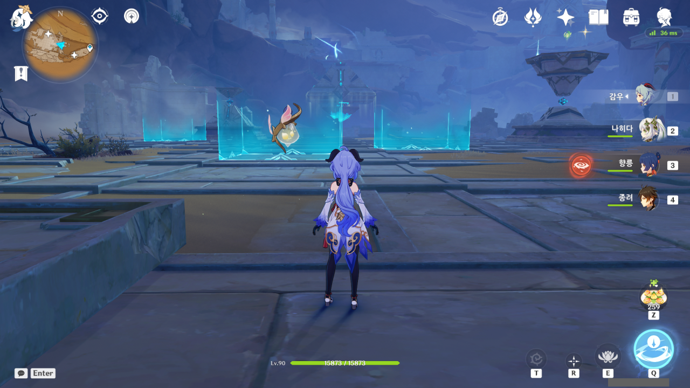

지금까지는 한 월드 임무가 끝나면 그 연계 월드 임무가 지도에 곧잘 나타났었는데, 이제는 더 이상 나타나지 않는다.

그래서 여태껏 배낭에 잠자고 있던 장기짝을 꽂아보기로 했다.

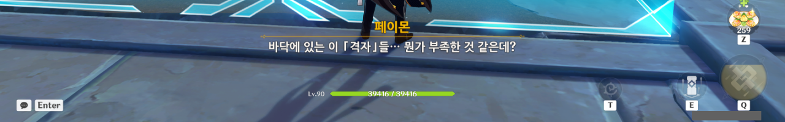

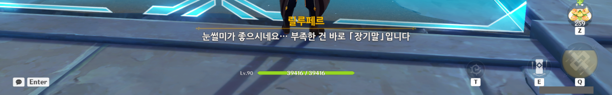

그래, 안 그래도 지금 그 장기짝을 꽂아 넣으려고 했어.

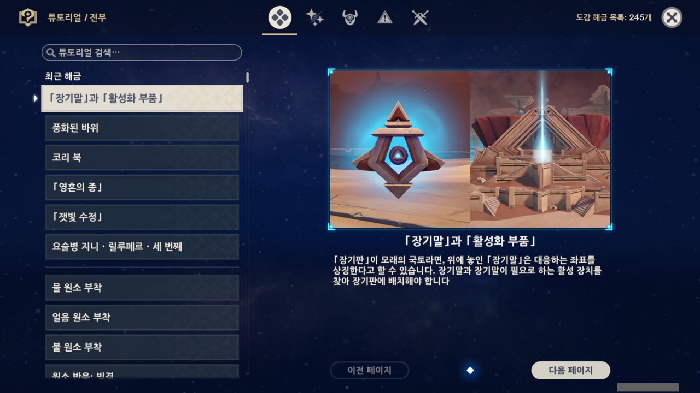

국토, 좌표라는 말이 나오는 걸 보면, 이 장기판은 일종의 전략 지도로 보인다. 지도 위에 장기짝이 위치하는 곳의 실제 대응 장소로 가보면 장기짝의 모양과 동일한 지형지물이 있겠지.

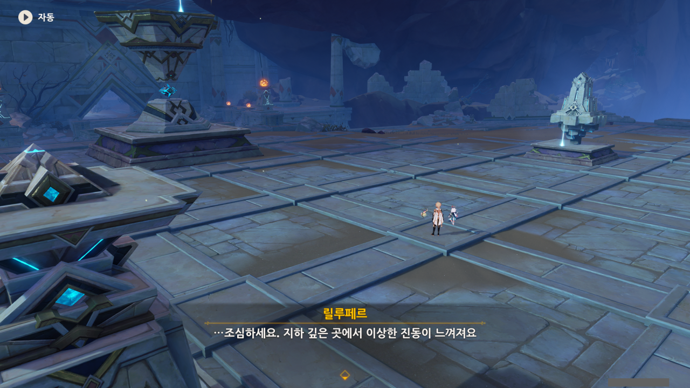

장기짝 다섯 개를 전부 다 놓자, 땅 속에서 진동이 느껴진다고 한다.

내 게임 화면도 위아래로 흔들리는 것으로 보아, 그 진동의 크기가 범상치 않은 듯하다.

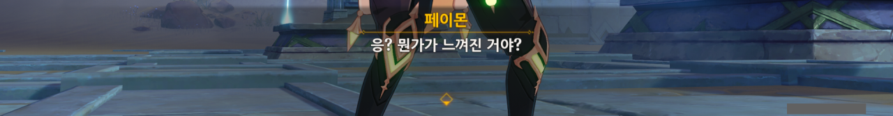

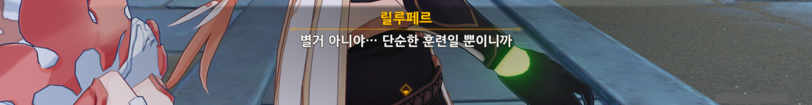



> | | |
> |:--|:--|
> | 릴루페르 | 별거 아니야... 단순한 훈련일 뿐이니까. |
> | 페이몬 | 오오, 별건 아니고 그냥 「훈련」일 뿐이구나! |
> | 페이몬 | 잠깐--- 「훈련」은 무슨! |
> {_borderless=true,_thead=false}

ㅋㅋㅋㅋㅋㅋ

방금 전 진동에 대해 릴루페르가 '단순한 훈련이야'라고 말하자, 페이몬이 '아, 그렇구나' 하고 납득하다 말고 눈을 휘둥그레 뜨며 기겁한다.

아, 나, 이런 거 너무 좋아... 페이몬은 앞으로 좀 더 재미있는 모습을 보여주길 바란다.

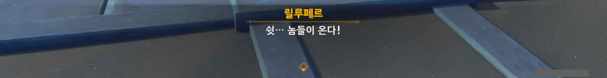

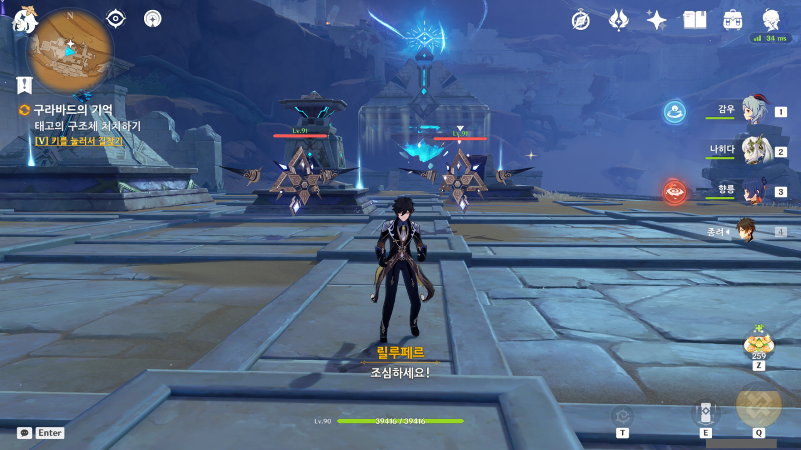

뭐, 큰 거라도 나오나 싶었는데, 그냥 태고의 구조체 몇 마리 정도가 끝이었다.

난 무슨 보스급 개체가 나올 줄 알았는데... 조금 실망했다.

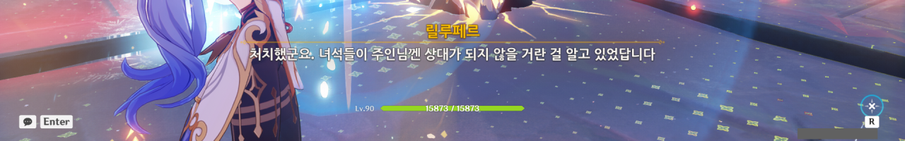

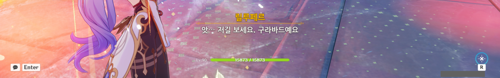

응? 구라바드? 웬 구라바드?

조금 전만 해도 존재하지 않았던 장기짝이 모래와 함께 갑자기 나타났다.

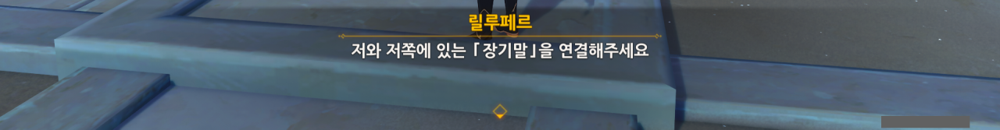

보아하니, 새로 생긴 저 장기짝에 릴루페르를 연결해야 하는 것 같다.

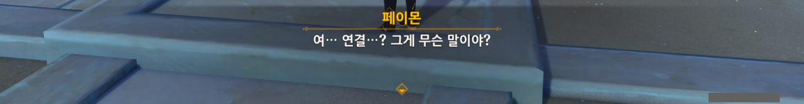

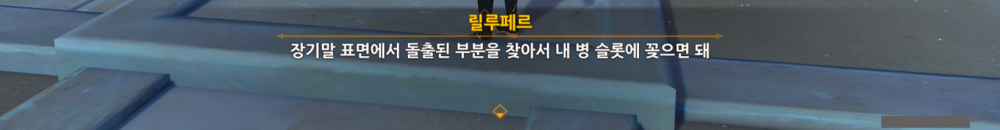

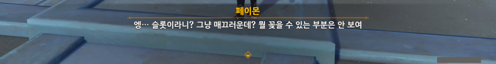

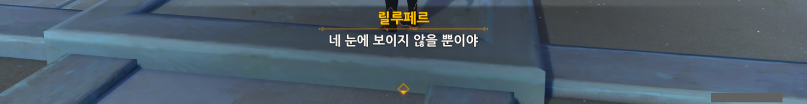

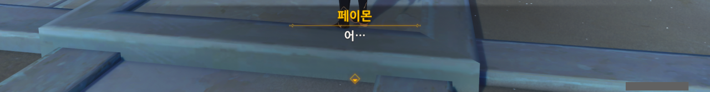

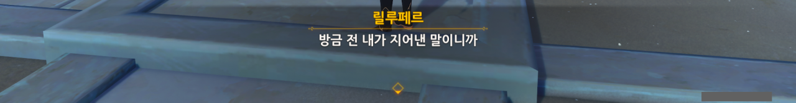

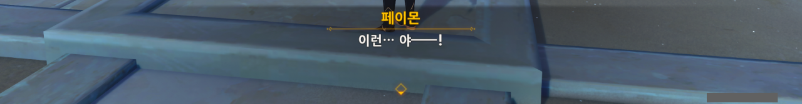

ㅋㅋㅋㅋㅋㅋ

오늘따라 릴루페르가 페이몬을 아주 찰지게 놀려먹는다. 아까는 단순한 훈련이라며 페이몬을 곯려먹었다면, 이번엔 지어낸 거짓말로 페이몬을 속여먹었다.

둘이 아주 죽이 잘 맞네!

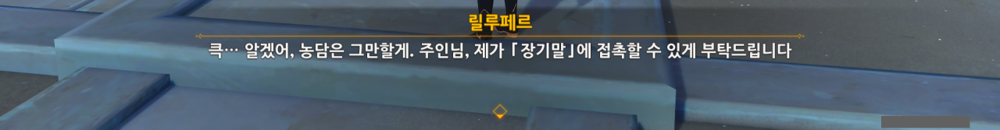

릴루페르가 말은 저렇게 했어도, 구라바드 장기짝에 릴루페르를 연결해야 하는 건 맞는 모양이다.

음, 이제 또 신나는 지하 유적 여행이 시작되려는 건가?

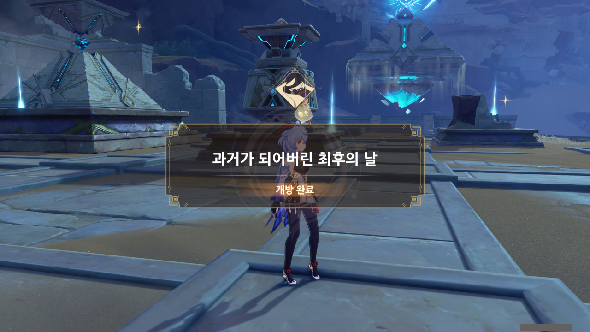

아무튼, '과거가 되어버린 최후의 날' 월드 임무가 본격적으로 시작되었다.

&nbsp;

하지만 그전에 장기짝과 그 삽입 위치 먼저 살펴봐야지.



이 장기짝은 '변방 요새'라고 한다. 그런데 이 건물, 아루 마을의 촌장 집처럼 생기지 않았어?



'성현의 전당'은 보자마자 '성현의 전당'임을 곧바로 알아차렸다. 황금빛 꿈이 바로 여기서 진행되었으니, 이걸 모르는 게 더 이상할 것이다.



위에 이렇게 배가 놓여있는 건물은 처음 본다. 그 이름조차 '명계를 건너는 배'라고 한다.

어쩌면 이건 실제로 있었던 건물이 아니라, 옛날 이 땅이 비옥한 땅이었을 시절 사용했던 배를 묘사한 게 아닐까?



원래 있었던 장기짝인 '적왕의 무덤'. 처음에 이걸 봤을 때, '저거 아무리 봐도 적왕의 무덤처럼 생긴 것 같은데...'라고 생각했는데, 정말이었다.



유적 안에서 자주 보았던, 스위치 등을 통해 움직이던 작은 구조물. 이름이 '적왕의 기둥'이라고 한다.



이건 보자마자 '구라바드 신전'인 걸 알아챌 수 있었다. 신전 입구가 딱 저렇게 생겼거든.



난 여태껏 '적왕의 수정잔'이 페리지스가 있던 지역의 이름이라 생각하고 있었다. 하지만 페리지스가 지키고 있던, 엘리베이터 자체가 '적왕의 수정잔'이라고 한다.

어째 엘리베이터 치고는 좀 크다 싶었지...

&nbsp;

장기짝도 다 구경했으니, 릴루페르를 새로 생긴 장기짝에 연결해야겠다.

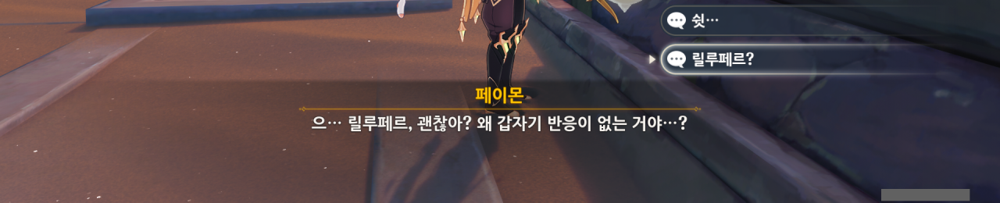

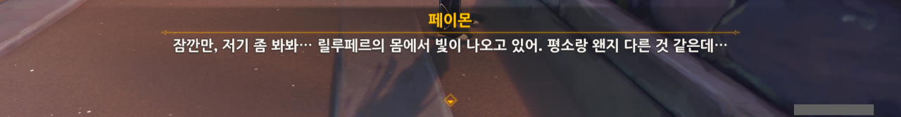

또다시 릴루페르의 기억을 보는 것 같다. 그 과정이 약간 다르긴 한데, 큰 틀에서는 비슷하니 말이다.

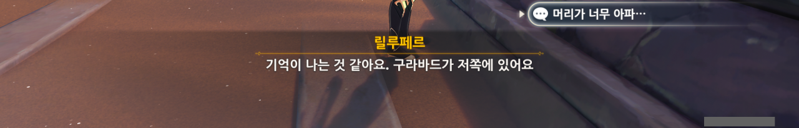

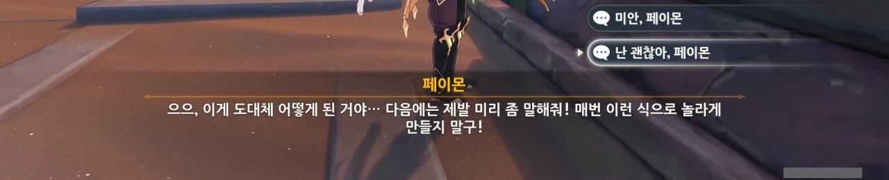

여태껏 그래왔던 것처럼, 이번에도 여행자는 릴루페르의 기억을 보는 동안 아무 말 없이 가만히 서있었던 모양이다.

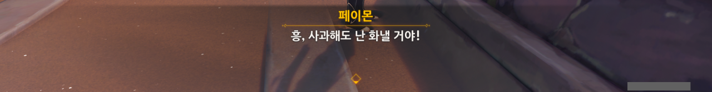

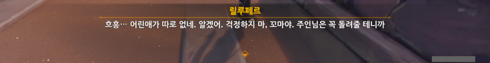

ㅋㅋㅋㅋㅋㅋ 어린애 ㅋㅋㅋㅋㅋㅋ

페이몬이 "응, 사과해도 난 화낼 거야!"라고 할 때, 속으로 '무슨 어린애도 아니고...'라고 생각했었는데, 그다음에 곧바로 릴루페르가 어린애 타령을 하니, 웃지 않을 수 없었다.

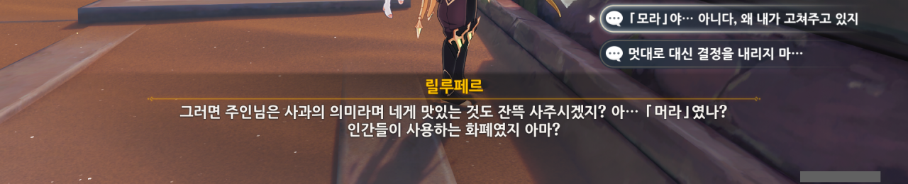

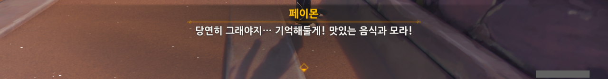

와... 페이몬을 음식과 모라로 매수하다니! 그것도 여행자의 돈으로!

릴루페르도 이제 페이몬이 어떤 생물인지 다 파악한 것 같다.

여행자는 릴루페르의 '머라'를 '모라'로 고쳐주려다, '이걸 왜 내가 고쳐주고 있지'라며 한탄한다.

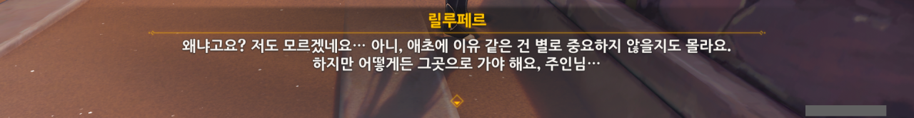

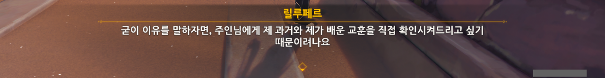

저 말은 여태껏 릴루페르의 기억이 보여주고 릴루페르가 직접 들려주던 이야기를 알아듣기 쉽게 직접 릴루페르가 설명해 주겠다는 말일까?

제발 그랬으면 좋겠다. 여태껏 들은 구라바드를 비롯한 사막 왕국 이야기는 전부 두리뭉실해서 이해하기 힘들었거든. 이야기가 조각나있어 그런 것도 있었지만.

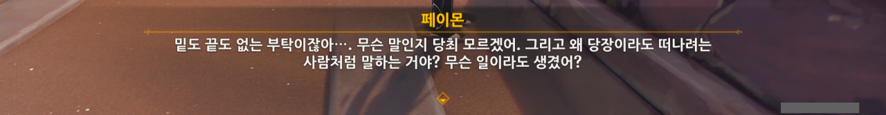

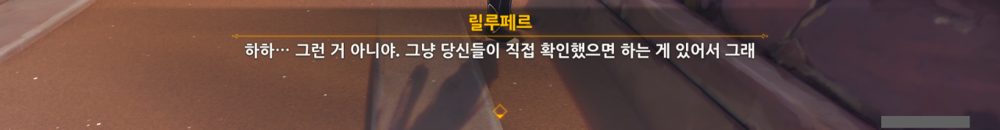

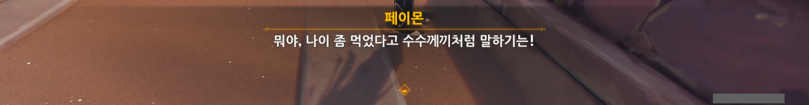

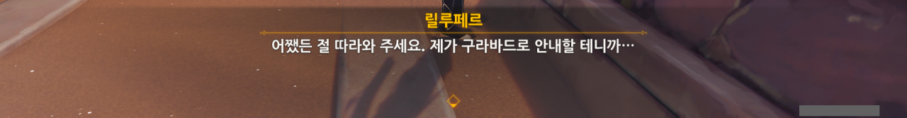

릴루페르를 따라가면 될 것 같다.

그런데 임무 창을 보는 순간, 조금 불안해졌다.

&nbsp;

지금 진행 중인 임무인 '과거가 되어버린 최후의 날'처럼, 배경이 검은색으로 되어 있는 임무는 두 가지 중 하나이다.

첫째. 굉장히 중요한 임무이다. 특정 지역에 대한 핵심 이야기를 이런 식으로 풀어낸다고 보면 된다.

둘째. 굉장히 길다. 숲의 책 월드 임무처럼 말이다.

&nbsp;

그리고 난 지금, 이 임무도 빌키스의 애가나 숲의 책처럼 너무 길면 어쩌나 걱정하고 있다. 또 며칠 동안 글만 쓰기는 싫거든...

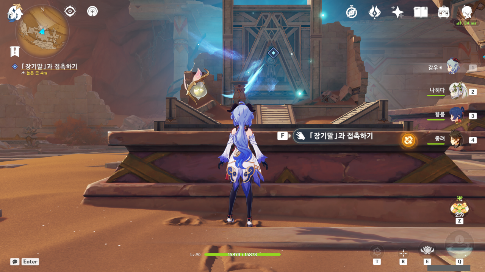

새로 나타난 장기짝에 릴루페르를 꽂아 본다.

그런데 여기는 대체 어딜 나타내는 걸까?

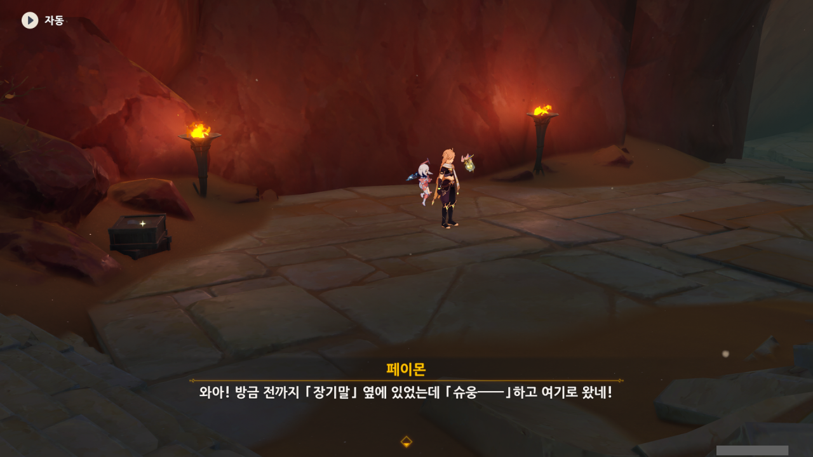

갑자기 어디론가 순간이동했다. 여긴 또 어디지?

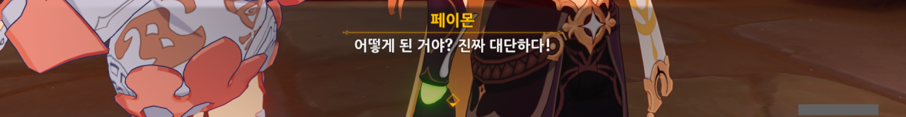

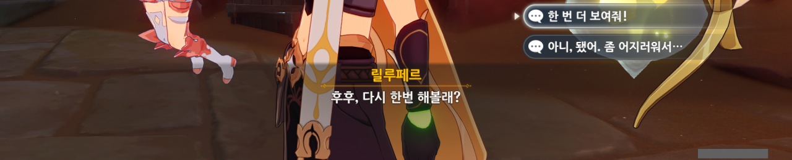

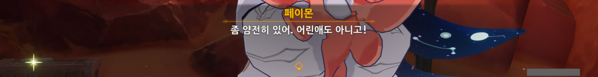

평소 페이몬이 하던 것처럼 철없이 "한 번 더 보여줘!"라고 했더니 반대로 페이몬에게 핀잔을 들었다.

야! 아니, 그걸 네가 왜, 으윽...

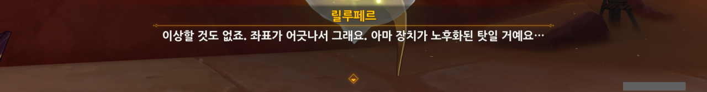

여기가 최종 목적지인 줄 알았는데, 엉뚱한 곳으로 왔다고 한다.

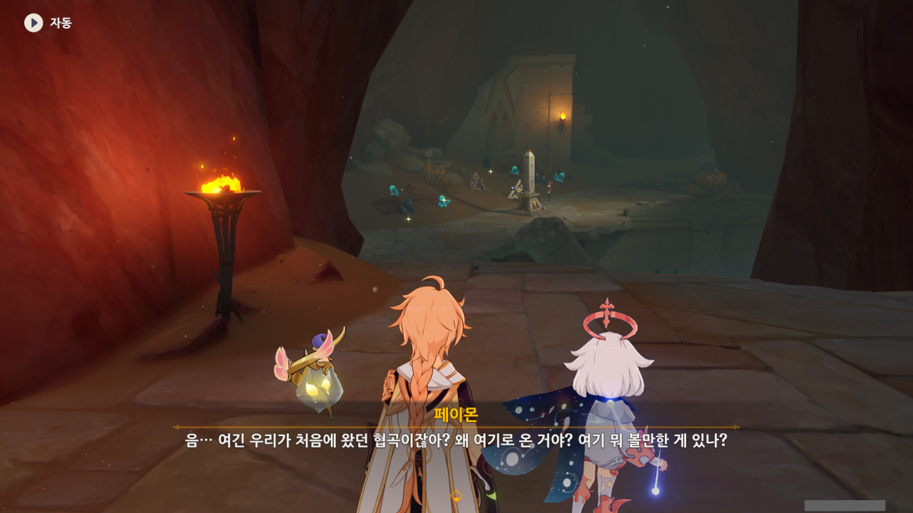

그런데 여기가 우리가 처음 왔던 협곡이라고? 왜 난 하나도 기억이 안 나지?

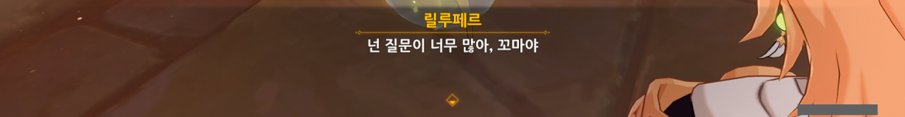

질문 좀 했다고 릴루페르에게 핀잔을 들은 페이몬.

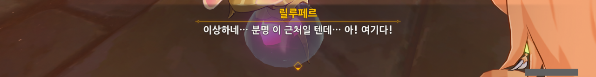

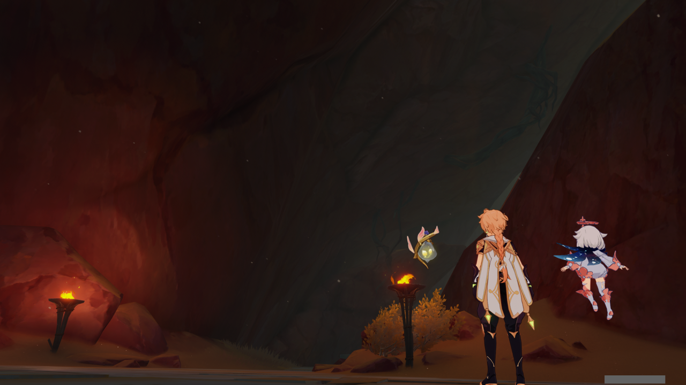

릴루페르가 뭘 한 건진 몰라도, 벽이 무너지면서 그 뒤의 공간이 나타났다.

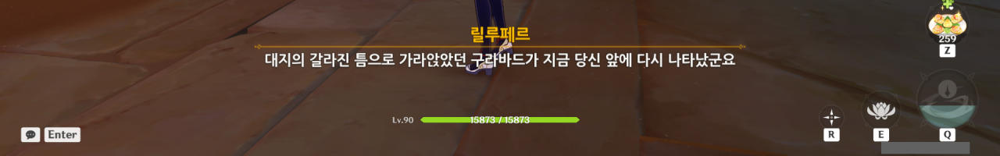

아무래도 여기가 구라바드인 모양.

구라바드 신전이 구라바드를 둘러싸고 있던 성벽에 지어진 건축물이라 했는데, 그러면 우리는 여태껏 구라바드 성벽 구역만 돌아다니고 있었던 거야? 난 여태껏 릴루페르의 조각이 구라바드 내부 곳곳에 흩어져 있었다고 생각했는데.

대체 구라바드는 어떻게 생긴 도시였던 걸까?

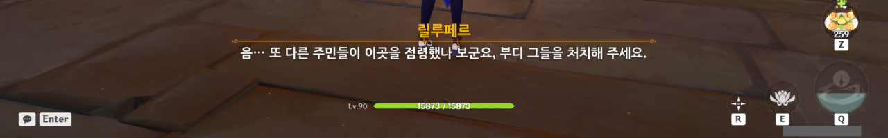

안쪽에 무언가가 더 있는 모양이다.

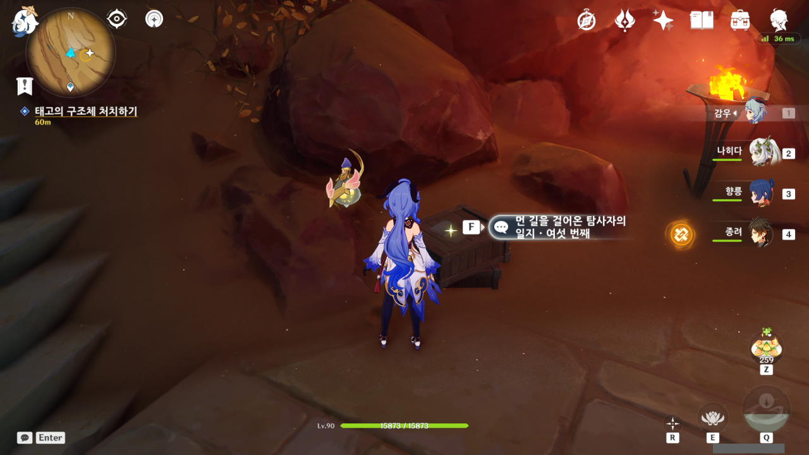

하지만 그전에 여기 옆에 있는 이 쪽지를 읽어보기로 했다.

여섯 번째 '먼 길을 걸어온 탐사자의 일지'라... 빌키스의 애가 월드 임무에서 네 번째 일지까지 찾았었는데, 결국 다섯 번째는 내가 찾지 못했었다는 이야기네.

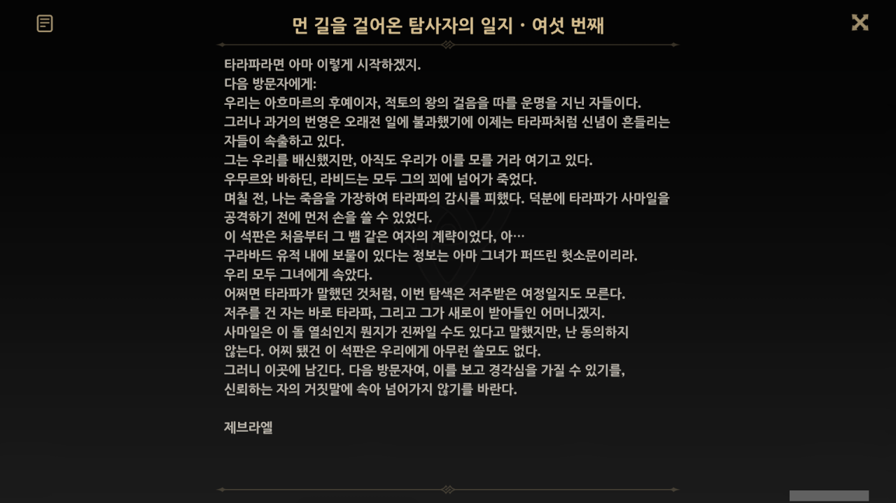

이번에는 여태껏 일지를 써 온 타라파가 아닌, 네 번째 일지에서 죽었다고 한 제브라엘이 쓴 일지이다.

&nbsp;

아무래도 이 당시 탐사의 본래 목적은 따로 있었던 모양이다.

이 탐사대는 새로 부족의 족장이 된 바벨의 명령 하에 꾸려진 탐사대이다.

바벨은 자신이 새 족장이 된 것에 불만이나 의심을 품은 사람들을 탐사대에 넣은 후, 자신의 심복인 타라파를 리더로 삼아 구라바드 유적에 있는 보물을 탐사하게 했다.

하지만 바벨과 타라파의 주목적은 사고사를 가장해 탐사대의 대원들을 모두 죽이는 것이었다. 나중에 「영원의 오아시스」에 타니트 부족이 도달할 것을 가정해, 그들이 사고로 죽었다는 증거가 될만한 기록을 타라파가 남기도록 하기도 했다.

하지만 제트의 아버지인 제브라엘은 타라파의 감시를 피하기 위해 실족사로 자신의 죽음을 위장했고, 타라파가 사마일을 죽이기 전에 타라파를 제거한 것으로 보인다.

&nbsp;

생각했던 것보다 바벨의 심계가 깊다. 제브라엘이 이를 눈치채고 빠져나오지 않았었더라면, 이들은 전부 불행한 사고로 죽은 것으로 기록되었겠지...

그런데 사마일과 제브라엘은 대체 무엇 때문에 서로 갈라서게 된 걸까?

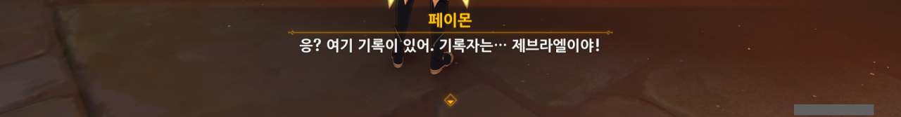

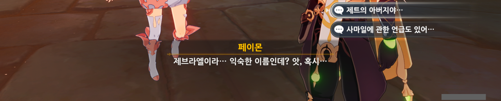

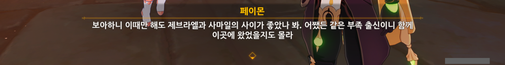

사마일과 제브라엘이 자신을 죽이려 한 바벨이 있는 타니트 부족으로 그냥 돌아갔을 것 같지는 않다. 그래서 바벨은 이들을 확실히 제거하기 위해 저 둘을 타라파를 죽인 부족의 배신자로 몰았을 것이 분명하다.

그 이후, 제브라엘과 사마일은 의견 차이로 인해 서로 갈라섰을 것이고...

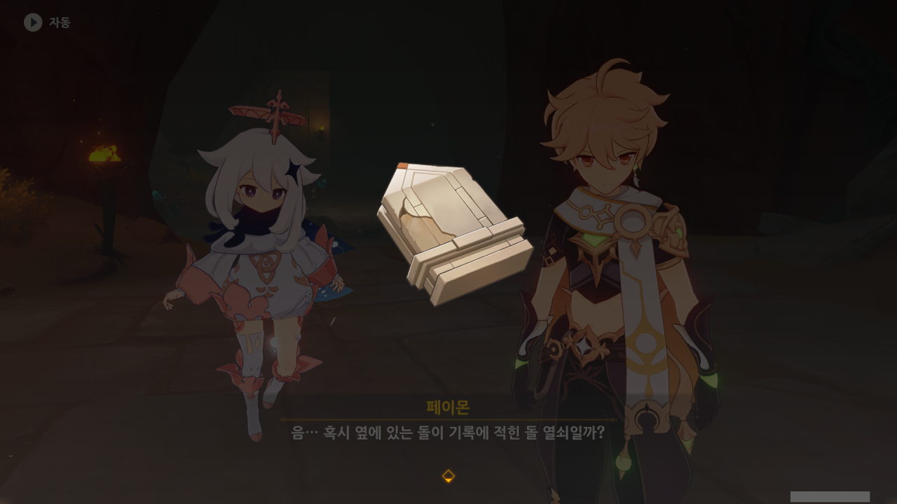

제브라엘이 놓고 간 돌 열쇠를 발견했다.

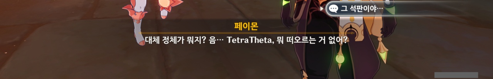

일지에는 돌 열쇠와 석판 이야기가 적혀 있었으니, 아마 이 돌 열쇠를 석판에 넣는 게 아닐까 생각된다.

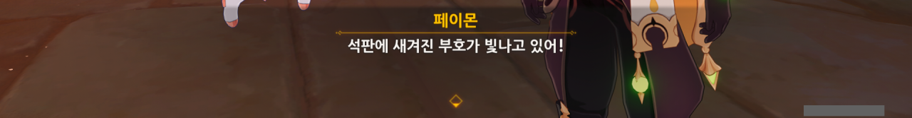

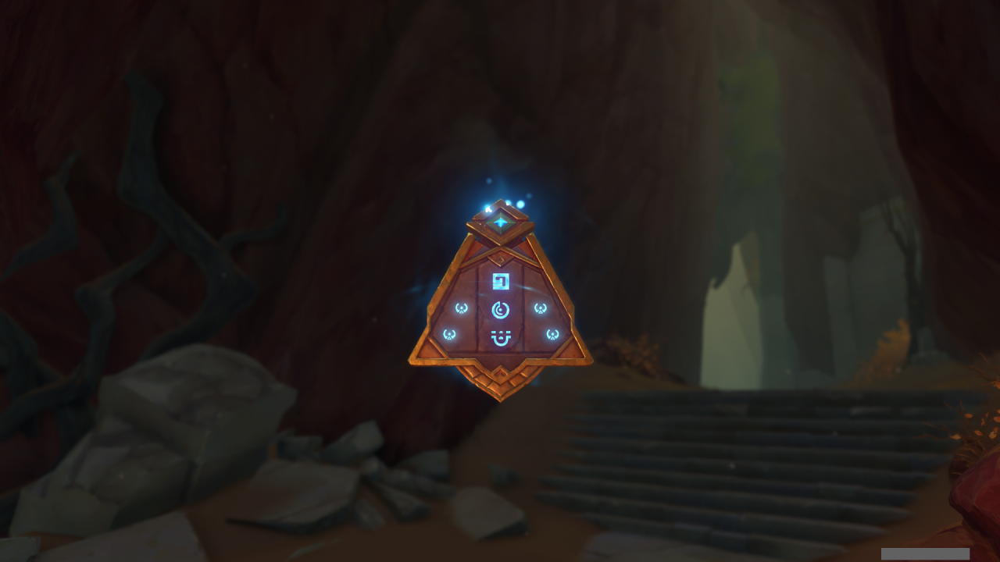

아니나 다를까, 돌 열쇠는 석판에 새로운 기호를 새긴 후, 사라졌다.

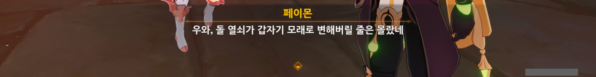

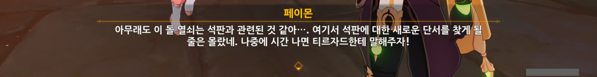

아, 그러고 보니 티르자드도 있었지. 왜, 제브라엘에게 의뢰를 맡겼던 그 비호감 학자 있지 않았는가.

나중에 티르자드에게 말을 거는 선택지도 생기는 걸까?

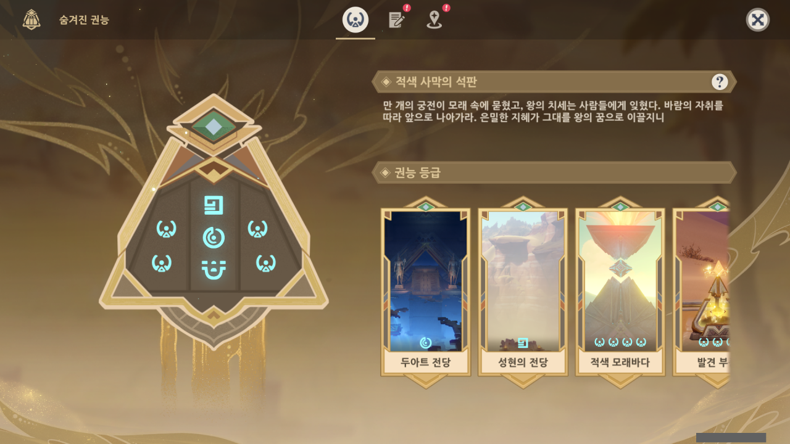

석판에 다른 문자가 들어갈 공간이 딱히 더 보이지 않는 것으로 보아, 조금 전 그 돌 열쇠가 석판의 최종 업그레이드였던 것 같다.

이제 석판이 업그레이드가 덜 되었다면서 열리지 않던 문을 열 수 있겠네.



그리고 발견한 오벨리스크.

생각해 보니 옛날에 연하궁에서 건문을 모으듯이, 이 사막에서도 인장을 모아야 했었다.

으으, 이걸 언제 다 해?!

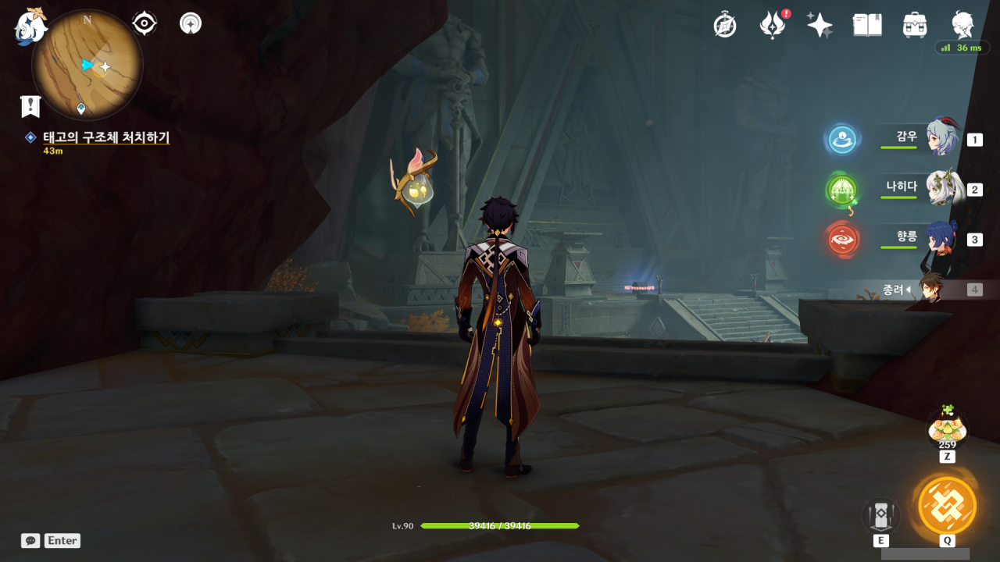

아까 새로 생긴 장기짝에 묘사된 장소가 바로 여기인가 싶었지만, 장기짝에는 횃불 장치가 하나만 있었다. 여기는 횃불 장치가 두 개 다 있고.

하지만 장기짝을 통해 올 수 있는 장소가 여기밖에 더 없지 않은가?



불청객인 태고의 구조체를 처치하고 또 다른 릴루페르의 조각을 확보했다.

제발 이게 마지막 조각이어라.

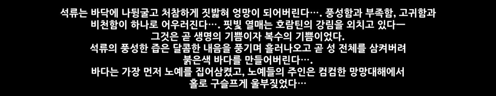

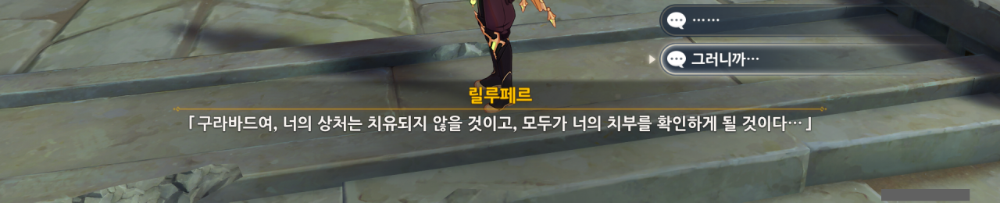

여태 다른 릴루페르의 기억을 봤을 때 보여주던 기억보다 더 많은 기억을 보여주는 이번 기억.

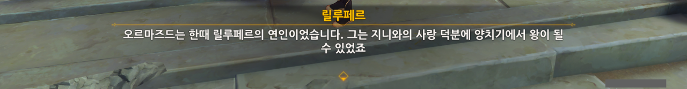

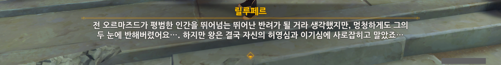

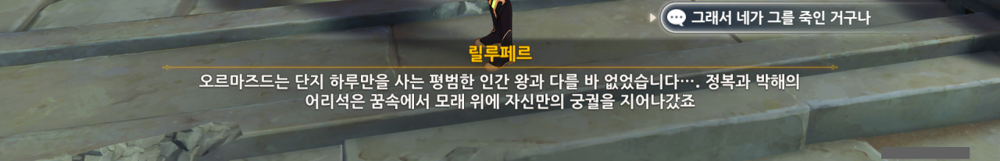

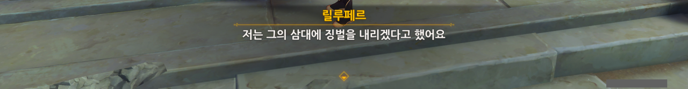

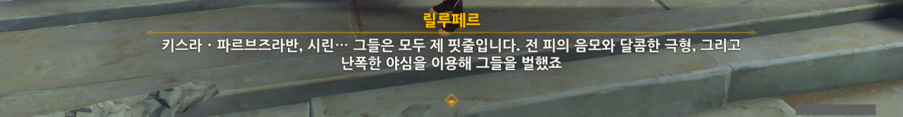

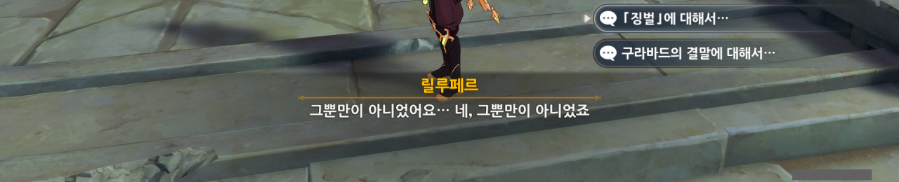

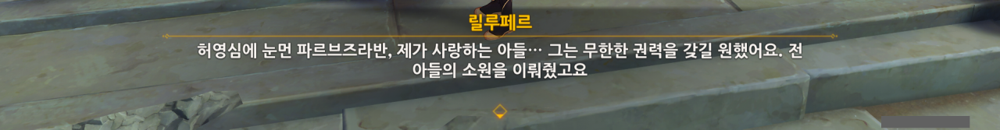

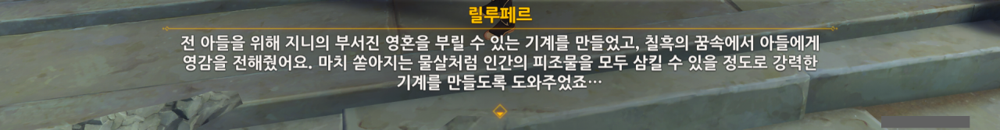

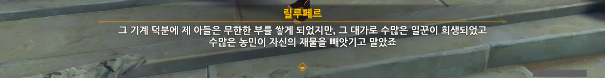

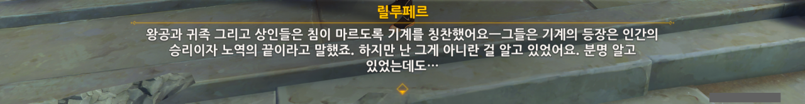

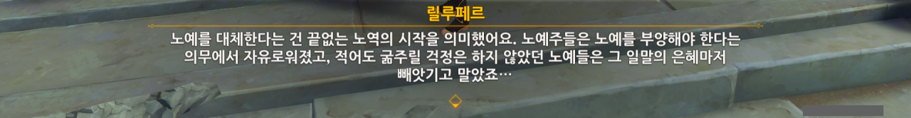

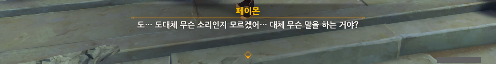

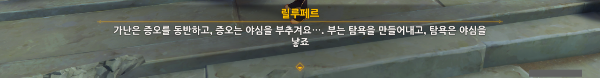

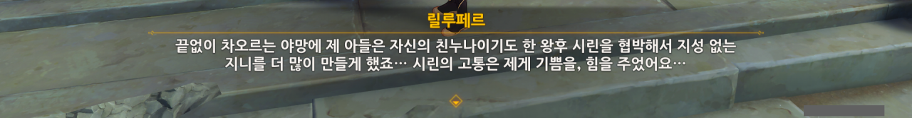

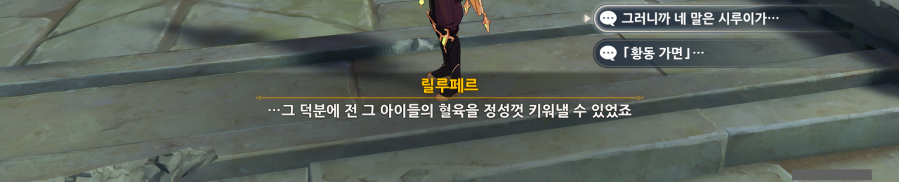

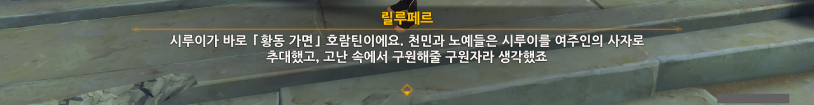

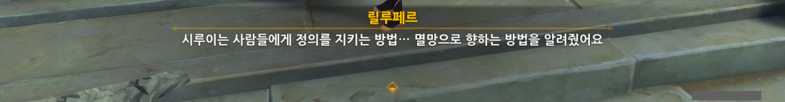

그러니까 오르마즈드에 실망한 릴루페르는 자신의 자손인 파르브즈라반, 시루이를 이용해 구라바드를 무너트렸다는 게 간략한 이야기가 되려나.

자기 자식마저 복수의 도구로 이용한 릴루페르. 페리지스에게 심한 독설을 들은 것도, 릴루페르에 대한 전설이 좋지 않은 것도 충분히 이해가 된다.

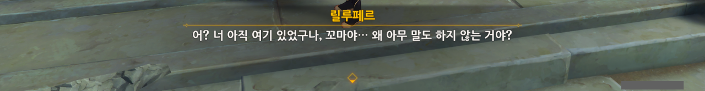

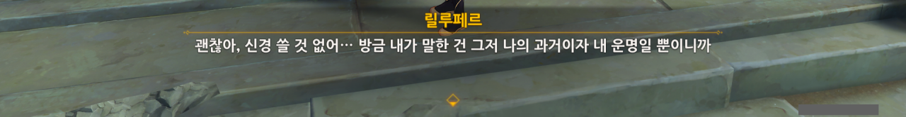

그 이야기를 '내 과거이자 운명'이라고 하는 것을 보면, 그때 한 일에 대해 전혀 후회하지 않는 모양이다.

복수를 했으니 그에 따른 결과마저 모두 짊어지겠다는 그런 의지의 표현으로 보인다.

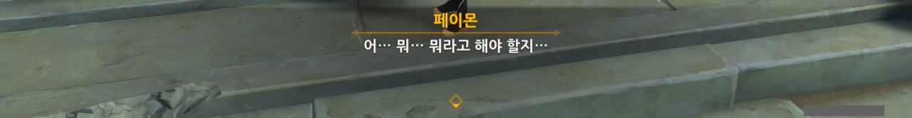

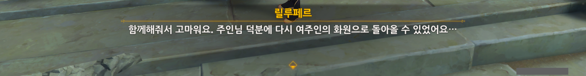

응? 뭔가 불안한 말을 하는데.

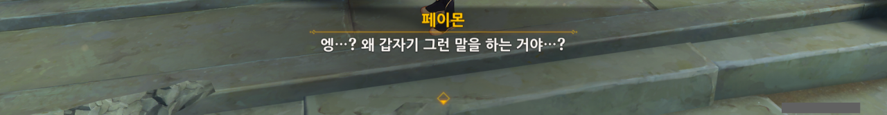

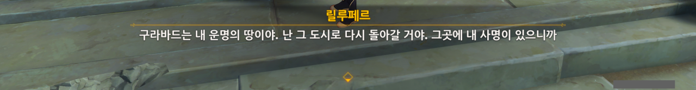

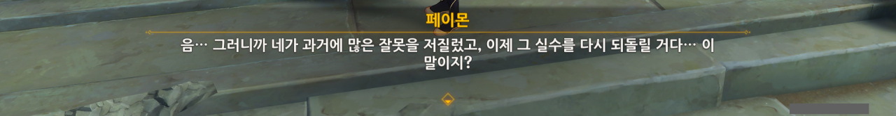

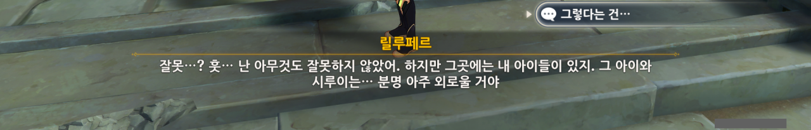

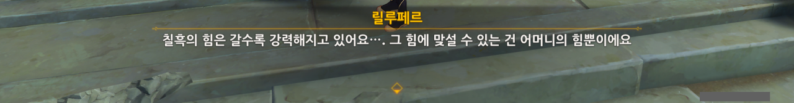

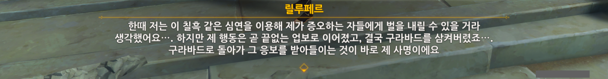

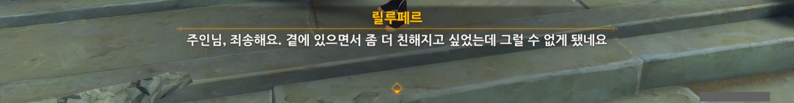

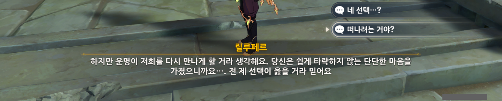

키스라 왕이 되었다는 '검은 마수'가 무얼 뜻하는지 잘 몰랐는데, 릴루페르가 심연을 이용했다는 말로 보아, 키스라 왕을 비롯한 구라바드 왕국의 지배층은 전부 츄츄족이 된 모양이다.

&nbsp;

지금은 멸망한 구라바드로 돌아간다고 말하거나, 지금은 죽고 없을 아이들 곁으로 간다고 말하는 것을 보면 릴루페르는 스스로의 목숨을 끊을 생각인 것 같다.

마치 모든 매듭을 풀었으니 더 이상 남은 것이 없다고 말하는 것처럼 보이는 것은 나 혼자만의 생각인 걸까.

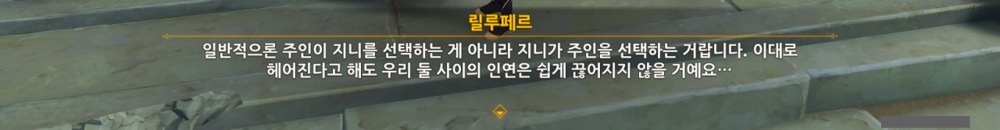

그래. 처음에 릴루페르가 그렇게 말했었지. 지니가 주인을 선택하는 거라고. 그런데 그걸 지니가 먼저 작별을 고할 때에도 쓸 줄은 몰랐는걸.

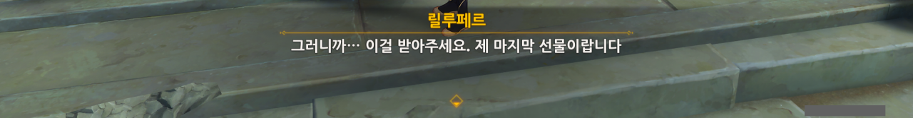

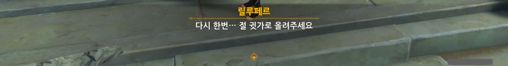

릴루페르는 여행자에게 고대의 언어를 가르쳐주고 먼 길을 떠났다.

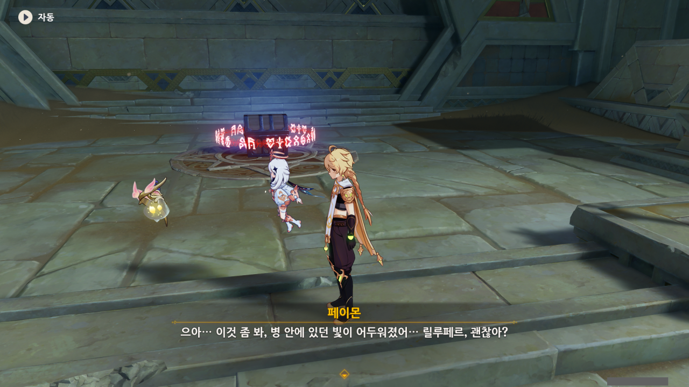

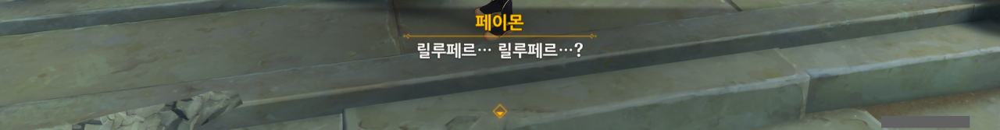

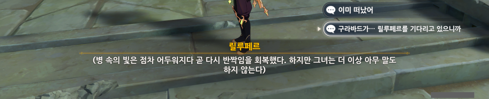

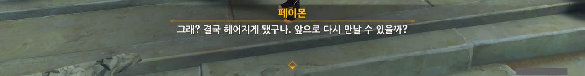

글쎄... 어쩌면 다시 만나지 않는 편이 더 나을 수도 있지 않을까. 

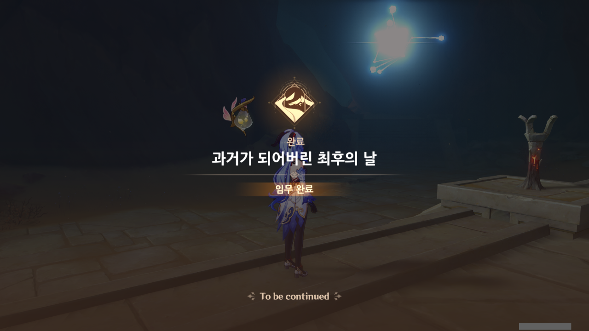

또 하나의, 뒷맛이 씁쓸한 월드 임무가 끝났다.

과거의 일은 다시는 돌이킬 수 없으니, 지금 있는 모두는 각자의 입장에서 최선을 다한 것이다. 하지만 그 최선의 결과는 그리 달콤하지 않다.
