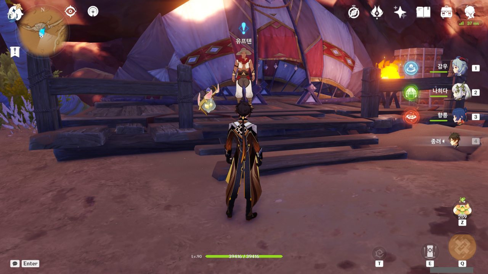

하릴없이 타니트 부족을 돌아다니다, 유프텐에게 퀘스트 마커가 뜬 것을 발견했다.

유프텐에게서 임무를 받는 것은 정말 오랜만이지 않나? 타니트 부족에 처음 온 날, 악어에게 먹이를 준다고 했던 것이 전부였던 것 같은데.

여전히 유프텐은 말을 더듬는다.

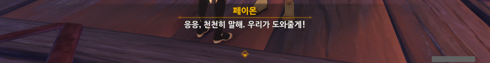

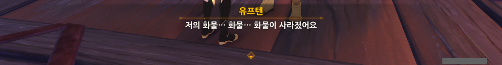

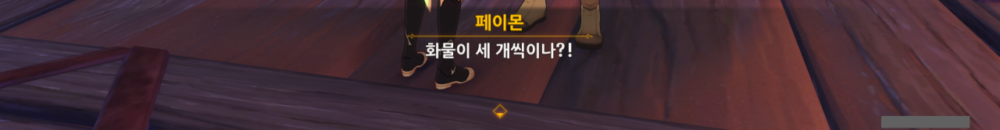

ㅋㅋㅋㅋㅋㅋ

유프텐이 말을 더듬느라 '화물'을 세 번 말한 걸 갖고, 페이몬이 화물이 세 개씩이나 사라졌냐고 놀린다.

웃기긴 하는데 ㅋㅋㅋ 그럼 못써 ㅋㅋㅋ

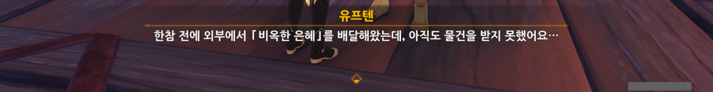

외부에서 온 물품을 유프텐이 관리하는 것으로 보아, 아드라피가 축출된 이후, 유프텐이 부족 상인의 역할을 맡은 것으로 보인다.

그런데 「비옥한 은혜」는 대체 뭘까?

'비옥'이라는 단어로 미루어볼 때, 「비옥한 은혜」는 비료의 일종으로 보인다. 이 메마른 사막에 왜 비료가 필요한 걸까? 여긴 농사를 짓기 전혀 좋지 않은 곳일 텐데 말이다.

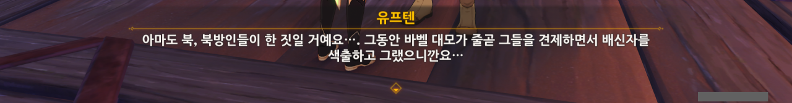

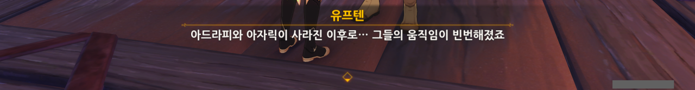

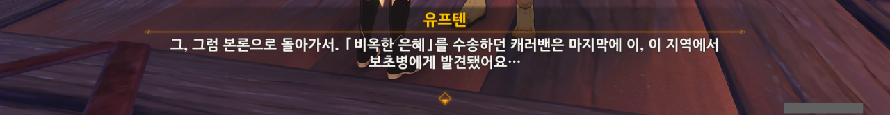

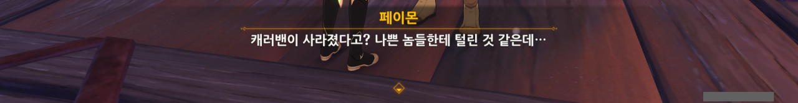

화물뿐만 아니라, 그걸 운반하던 캐러밴까지 통째로 사라졌다고 한다. 대체 「비옥한 은혜」가 뭐였길래, 그걸 운반하던 캐러밴까지 통째로 사라진 걸까?

유프텐은 이 모든 짓이 북방인, 즉 우인단의 소행이라 생각한다.

그런데 「비옥한 은혜」가 정말 비료의 이름이라면, 우인단이 캐러밴을 몰살하면서까지 비료의 운반을 막을 필요가 없지 않나? 북국은행이라는 거대한 은행을 굴리는 게 우인단인데, 비료의 운반을 막아야 할 당위성이 보이지 않는다.

캐러밴의 전멸에서 기대할 수 있는 효과라고 해봤자, 타니트 부족을 방해하는 정도밖에 되지 않을 텐데, 그러기에는 가성비가 너무 떨어지는 것처럼 보인다.

그러니, 내가 볼 때에는 길가의 도적이나 부족의 배신자 집단에게 습격당한 것이 아닐까 한다.

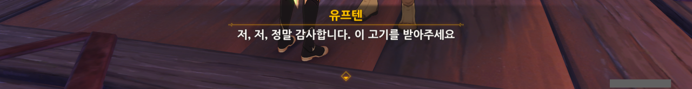

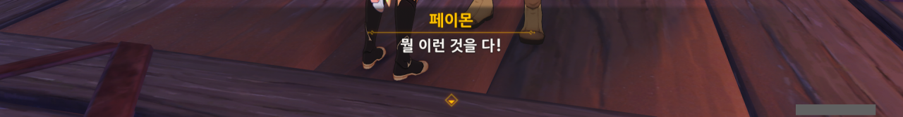

유프텐에게 고기를 받았다.

그걸 '아유~ 뭘 이런 걸 다~'라는 느낌으로 받는 페이몬. 순간 시골의 인심 좋은 할머니를 보는 느낌이었어...

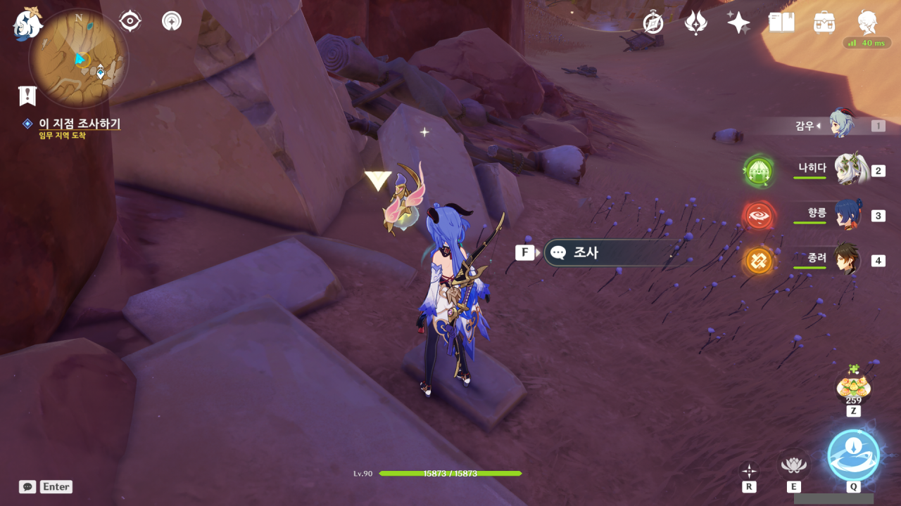

임무 지역에 도착해 보니 조사 지점이 하나 있다.

캐러밴에게 무슨 일이 생긴 것인지는 모르지만, 화물이 길을 따라 이리저리 흩어져 있는 것을 보아, 그들에게 무언가 좋지 않은 일이 있었음이 틀림없어 보인다.

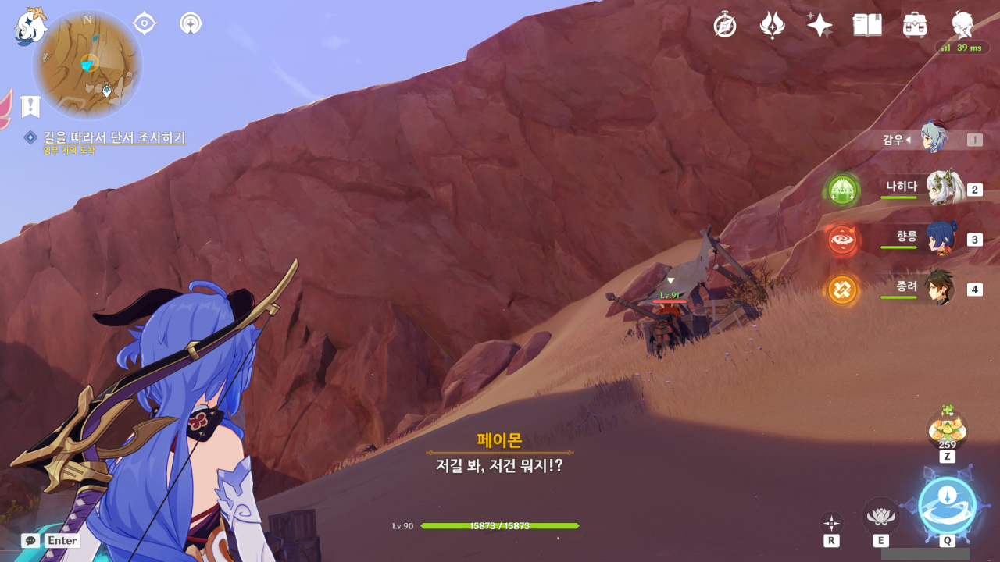

길가에 떨어져 있는 또 다른 짐무더기를 츄츄족 무리가 뒤지고 있다.

타니트 부족의 문양이 그려져 있는 것으로 보아, 캐러밴의 화물임이 틀림없는 상황.

여행자가 뜬금없이 매복을 이야기했는데, 실제로도 양 옆에 절벽이 있어 매복하기 최적인 지형이기는 했다. 아까 처음 항아리를 발견한 곳 역시 매복을 하려면 못할 것도 없는 지형이었고...

그런데 왜 캐러밴은 이러한 지형을 앞두고 왜 미리 정찰을 하지 않은 걸까?

길가에 널브러진 상자의 크기가 제법 큰데, 이런 큰 화물 상자가 텅 빈 채 방치되어 있다는 건 캐러밴을 습격한 집단이 큰 화물까지 모조리 다 탈탈 털어갔다는 걸 의미한다. 캐러밴이 텅 빈 상자를 옮길 이유는 없으니 말이다.

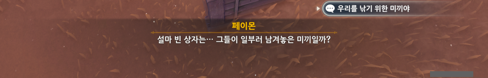

나도 이 상황이 조금 의심스럽긴 하다.

우리가 물건을 살 때 가성비를 논하듯이, 도적 역시 훔칠 물건의 가성비를 따진다. 도적에게 있어, 무게가 가볍고 부피가 작으며, 값어치가 높은 물건이 최고로 가성비가 높은 물건이다. 그래야 갖고 도망가기 편하니까.

하지만 이 도적은 캐러밴의 모든 화물을 부피와 무게에 관련 없이 모두 털어갔다. 그것도 그걸 담은 상자는 내팽개친 채 말이다. 절대로 일반적인 도적이 보일 행태가 아니다.

이렇게 길 곳곳에 남은 흔적은 도적이 어쩌다 실수로 남긴 게 아니라, 의도적으로 여행자를 특정 장소로 유도하는 미끼겠지.

&nbsp;

그래도 유프텐의 말을 믿고, 이 모든 게 다 도적단이 한 소행이라는 가정을 유지하기로 했다.

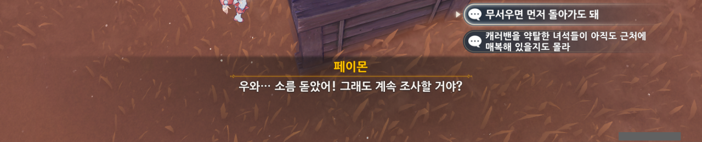

참을 수 없는 페이몬 놀리기. "무서우면 먼저 돌아가도 돼~"

앞에 츄츄족의 야영지가 있다.

음, 츄츄족이라면 어느 정도 가능성이 있긴 하겠네. 츄츄족의 판단 기준은 사람과 다르니 말이다. 무거운 짐도 쉬이 옮길 수 있는 덩치도 있고.

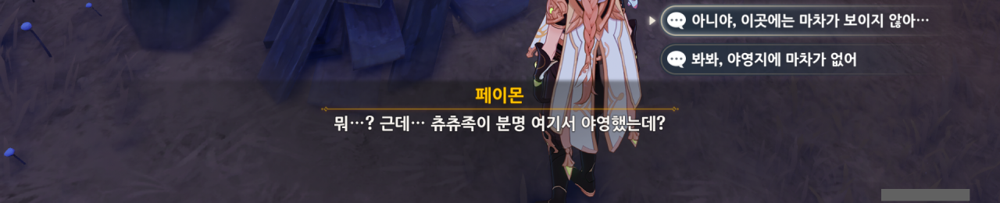

하지만 츄츄족을 모두 처치하면서 주변을 뒤져본 결과, 마차의 잔해나 비슷한 것이 전혀 나오지 않았다.

게다가 여기 있는 짐과 잔해는 츄츄족이 만든 게 아니라, 누군가가 일부러 가져다 놓은 것처럼 보인다.

도적단이 혹시 있을지도 모를 추격자가 츄츄족과 싸우도록 유도하기 위해 훔친 물건의 일부를 여기다 놓고 간 걸까?

그러게. 하지만 곧 알게 될 것 같다.

모포가 길가에 버려져 있다.

가장 단순한 추측은 이렇다.

캐러밴의 모든 짐을 갖고 도망치던 도적단은 도중 만난 츄츄족 야영지에 시간 끌기 용으로 약탈한 물건 중 일부를 놓고 왔으며, 이곳에 와서는 무겁고 값어치가 상대적으로 떨어지는 물건을 유기한 것으로 보인다.

다만 모든 물건을 갖고 도망치자는 의견을 가진 단원과 내부 마찰이 일어나 전투가 일어났고, 그 때문에 모포에 '불길한 얼룩'이 묻었을 것이다.

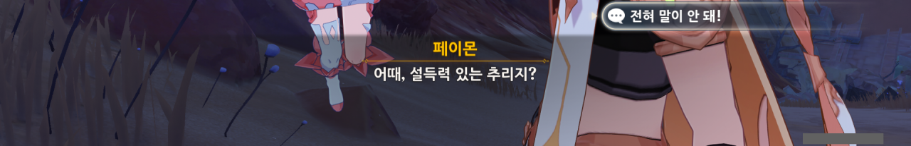

페이몬은 캐러밴이 도적단과 만난 후, 이곳까지 도망치면서 싸우다 일부 화물을 유실했을 것이라 추측한다.

하지만 여기까지 오면서 싸운 흔적은 없었다.

이미 캐러밴과 도적단 사이의 싸움은 끝난 지 오래고, 우리가 지금까지 봐온 흔적은 도적단이 이동하며 필요 없는 것들을 버린 흔적이라 보는 편이 더 나을 것이다.

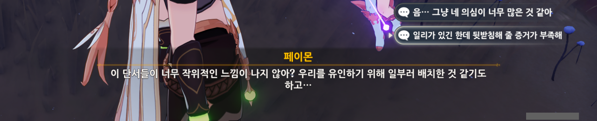

그래, 나도 그렇게 생각해.

지금까지 발견된 흔적은 너무 *편리하다*. 일부러 우리의 사고를 유도하는 게 아닐까 싶을 정도로 발견된 흔적이 너무 많다.

이런 식으로 흔적을 남기는 건, 우인단은커녕 제대로 된 도적단도 하지 않을 일이다.

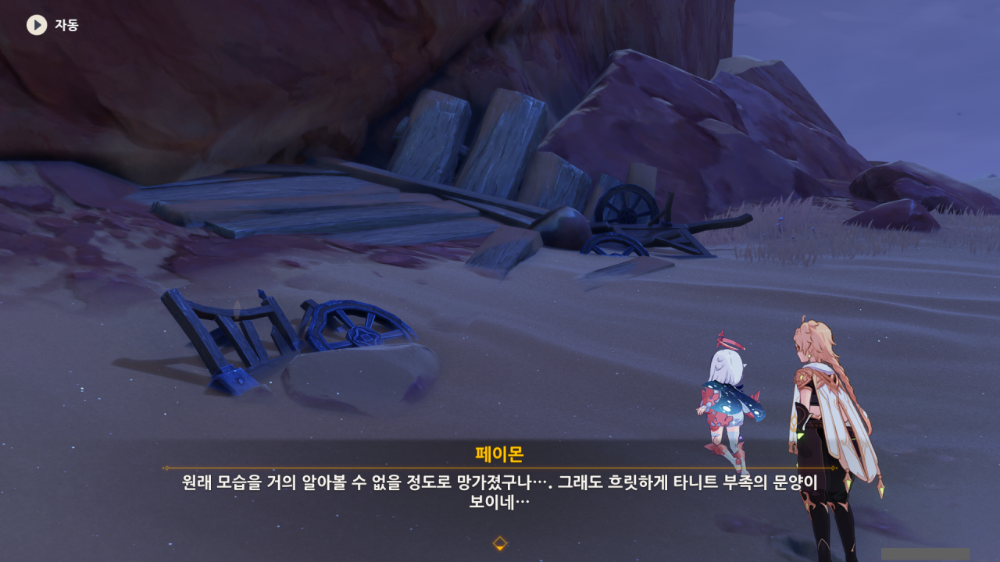

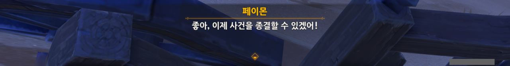

타니트 부족의 표식이 그려진 마차의 잔해를 발견했다.

뭔가 의심은 들지만, 그걸 뒷받침할만한 직접적인 증거는 없으니, 유프텐에게는 본 것 그대로 말해주기로 했다. 캐러밴은 도적단의 습격을 받아 전멸했다고.

누군가가 여행자를 부른다. 누구?

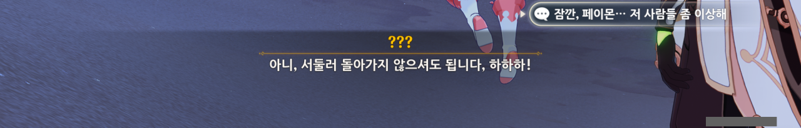

서둘러 돌아가지 않아도 된다니, 그게 무슨 소리야? 게다가 이 조사에 제트 역시 투입되었다는 말은 처음 듣는데?

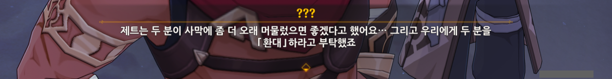

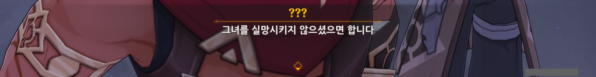

아하, 알겠다.

저들이 지금 말하는 「환대」는 죽음을 뜻하는 거겠지. 사막에 좀 더 오래 머물렀으면 좋겠다는 것도 시체의 형태로 사막에 묻히라는 말이다.

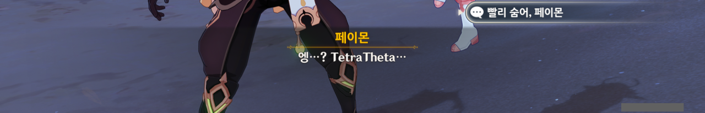

의뢰고 자시고, 칼을 뽑았으면 칼에 맞아 죽을 각오도 당연히 했겠지?

아, 그래. 사막의 「환대」에 감사하는 것을 잊었다.

여행자는 예의가 발라서 감사 인사를 할 줄 알거든.

그동안 제트와 잘 지내왔는데, 갑자기 제트가 이런 일을 꾸밀 이유가 없다. 누군가가 제트를 사칭했거나, 최악의 경우라도 뭔가 오해가 있었던 거겠지.

지금껏 보아온 제트는 이렇게 몰래 암살자를 보낼 성격이 전혀 아니잖은가.

뭐가 어찌 되었건, 타니트 부족 내부에 여행자의 적이 있는 것은 확실하다. 그게 정확히 누군진 아직 잘 모르지만.

하지만 여기서 섣불리 사막을 떠났다간, 제트의 신변이 위험해질 수도 있다.

여행자를 제거했다 여긴 여행자의 적이 제트가 더 이상 쓸모없다 여겨, 제트를 해칠 수도 있지 않은가?

일단 타니트 부족으로 돌아가, 캐러밴의 행방에 대해 조사한 걸 알려주되, 제트에 대한 말은 쏙 빼놓고 이야기하기로 했다.

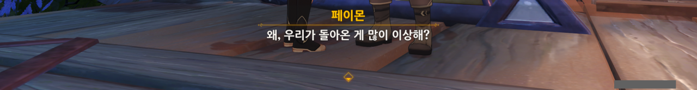

그런데 돌아온 우리를 본 유프텐의 반응이 좀 이상하다. 평소보다 말을 좀 더 더듬는 듯한 유프텐.

마치 여행자가 멀쩡한 걸 보고 당황한 것처럼 말이다.

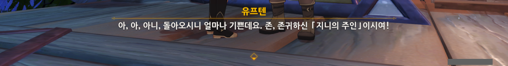

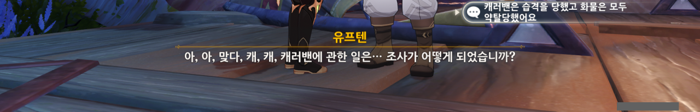

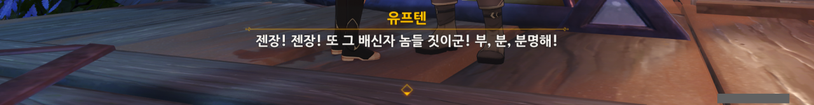

아직 캐러밴 조사 결과에 대해 자세히 이야기하지 않았음에도, 이 모든 게 배신자의 소행이라 단정하는 유프텐. 대체 무슨 근거로?

어째서인지는 잘 모르겠지만, 유프텐은 '캐러밴이 습격을 당한 건 배신자의 소행이다'라고 믿게 만들고 싶은 모양이다.

분명 우리에게 처음 의뢰를 할 때에는 '배신자와 결탁한 북방인의 소행이다'라고 했던 것 같은데?

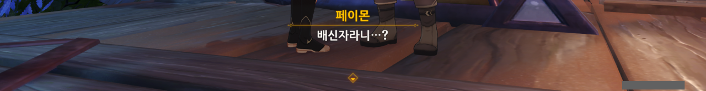

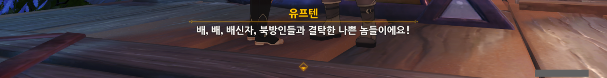

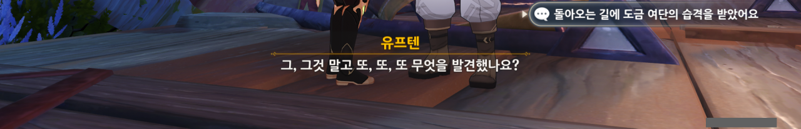

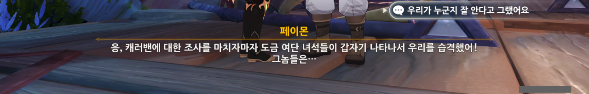

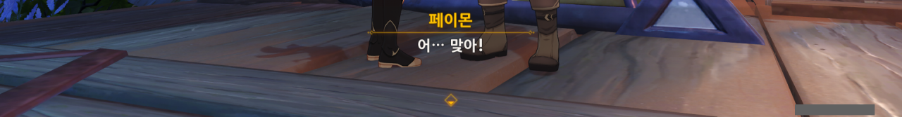

제트에 대한 이야기는 쏙 빼놓은 채, 캐러밴의 행방에 대한 조사 결과를 유프텐에게 말해주었다.

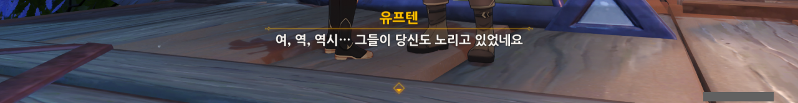

아무리 봐도 도금 여단이 여행자를 노릴 이유는 없다고 생각하는데... 그 녀석들도 의뢰 때문이라고 말했었고.

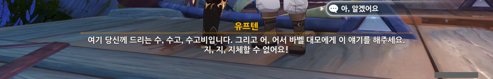

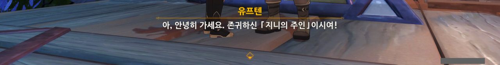

대화가 끝난 후, 유프텐의 속마음을 들여다보았다.

> 비료가 써졌어. 이거 큰일이다...

비료가 도난당했다고 하지 않고 비료가 써졌다고 말하는 유프텐. 「비옥한 은혜」는 그냥 비료가 아닌 것이 분명해 보인다.

유프텐은 이 이야기를 바벨에게도 알려달라고 했다. 이러면 유프텐은 물론이요, 바벨까지 의심할 수 있다.

&nbsp;

현재 내가 생각하는, 가장 그럴듯한 진실은 다음과 같다.

사실 캐러밴은 처음부터 존재하지 않았다. 여행자가 본 상황은 유프텐이 무언가 손을 써, '「비옥한 은혜」를 운송 중이던 캐러밴이 부족의 배신자 집단에게 습격당했다'라고 여행자가 생각하도록 연출한 것이다. 여행자가 마지막에 만난 암살자 역시 제트를 사칭한 유프텐이 사주해 보낸 것이다.

만약 이 모든 일을 유프텐 혼자서 꾸민 일이라면, 유프텐은 여행자가 이 사실을 바벨에게 알리게 두어선 안된다. 제트가 저번에 말했듯이, 대모의 허락 없이 부족의 손님인 여행자를 해치려 한 것은 부족에 대한 배신이니까.

하지만 바벨 역시 유프텐과 한통속이라면, 이를 걱정하지 않아도 된다. 바벨이 알아서 이를 덮고 외부 배신자의 소행이라며 잘 포장해 줄 테니까.

그러니, 바벨이 유프텐과 함께 제트를 사칭해 여행자를 죽이려 한 것이라 보는 것이 합당하다.

만약 여행자가 암살자의 습격에서 살아남는다고 하더라도, 암살자에게 제트가 자신들을 보냈다고 말하게 했으므로, 여행자의 의심은 일차적으로 제트를 향할 수밖에 없고, 바벨과 유프텐은 안전해진다.

내친김에 바벨의 속마음도 읽어보았다.

바벨은 릴루페르가 침묵하고 있는 것에 불안해하고 있다.

뭐, 그럴 수밖에 없는 것이, 릴루페르는 이미 구라바드로 먼 여정을 떠난 지 오래다. 지금 여행자 곁에 있는 건 릴루페르의 껍데기뿐이지.

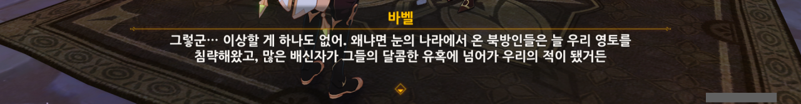

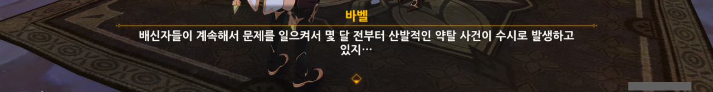

바벨 역시 자세한 사정은 듣지도 않고 이 모든 게 전부 배신자와 북방인의 소행이라고 단정 짓는다.

역시 유프텐과 바벨이 서로 짜고 치는 게 틀림없어.

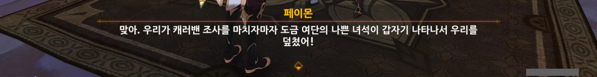

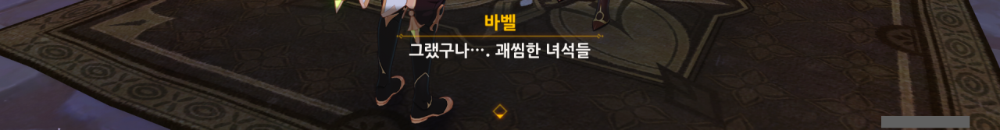

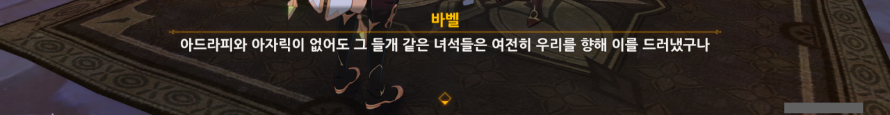

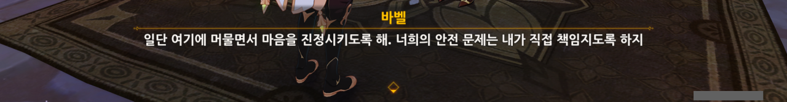

만약 내 의심이 옳다면, 여행자가 타니트 부족 안에 있는 것이 더 위험하다.

타니트 부족 내부에 배신자가 있고, 그게 부족의 대모인 바벨일 것으로 의심되는 상황에서 타니트 부족 내부에 머무는 건 자살행위나 다름없지.

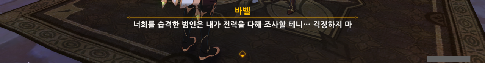

바벨은 습격 사건에 대해 전력을 다해 조사하겠다고 말하지만, 분명 거짓말일 것이다.

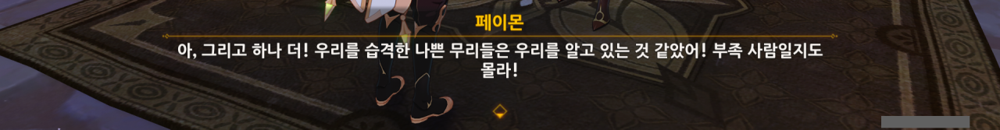

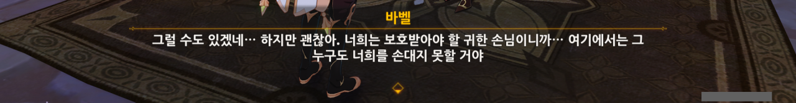

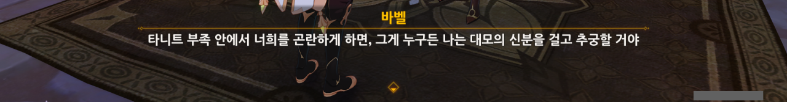

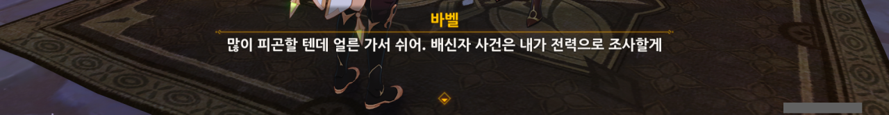

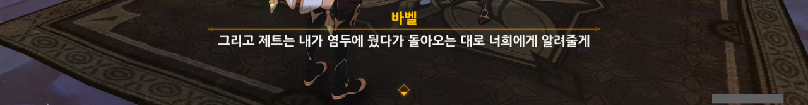

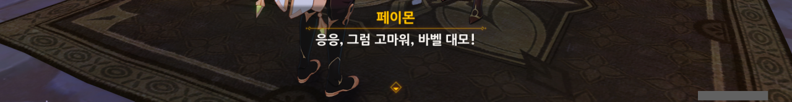

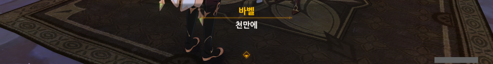

예전이었다면 이렇게 바벨을 의심하는 것도 지나친 의심병이라 웃으며 넘길 수 있겠지만, 우리는 매사냥 월드 임무에서 바벨이 어떤 방식으로 권력을 잡았는지 이미 다 보았지 않았는가.

바벨이 말하는 '그 아이'란 대체 누굴까? 정황상 제트를 이야기하는 것 같은데, 대체 바벨과 제트 사이에 무슨 대화가 오갔길래?

&nbsp;

이튿날로 시계를 돌렸다.

아, 그렇게 나오시겠다?

너무 속이 보여서 웃음이 나올 지경이네.

그래. 어떤 주장을 하려면 마땅히 그에 대한 증거와 근거를 제시해야 하는 법이다.

허, 정말 빈약하기 짝이 없는 근거네.

증거라는 게 고작 타니트 부족의 적인 우인단의 증언 하나뿐이다. 이럴 경우, 우인단이 의도하고 뿌리는 잘못된 정보로 인한 정보 오염을 걱정해야 하는 게 정상이거늘.

게다가 보초병의 시선을 피해 야영지를 세우는 건 당연한 일이다. 타니트 부족이 보초병을 세웠다면, 우인단은 당연히 이를 탐지할 정찰병을 운용했겠지.

&nbsp;

만약 바벨의 말이 모두 진실이라면, 이렇게 주먹구구식으로 부족을 운영해 온 바벨과 타니트 부족은 진작에 우인단에게 멸망당했을 것이다. 역정보를 흘리기도 쉽고, 속여먹기도 쉽다. 그냥 밀어버리면 끝 아니겠는가.

빈약한 근거를 지적하자, '그건 최악의 시나리오일 뿐이다'라고 변명하는 바벨.

아니, 조금 전까지만 해도 확신에 가득 찬 어조로 제트가 배신자라고 하지 않았어?

말은 저렇게 해도, 이미 바벨은 제트가 부족의 배신자라고 단정 짓고 있다. 절대로 '제트는 무고할지도 모른다'라고 하지 않잖아.

말은 저렇게 했지만, 제트를 바벨에게 데려오기 전, 먼저 제트와 이야기를 나눠볼 생각이다.

바벨의 말과 제트의 말을 교차 검증해 보면 누가 거짓말을 하고 있는지 알 수 있을 테니 말이다.

아니, 그건 절대 아닐 거야. 내 장담하지.
