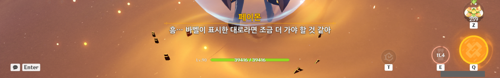

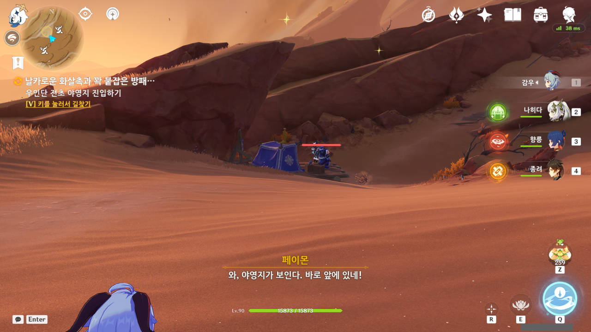

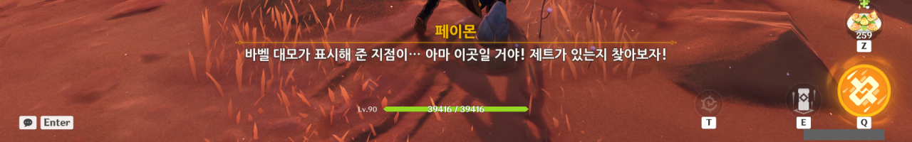

바벨이 알려준 곳으로 가니, 정말 우인단 야영지가 있었다.

뭐, 이것까지 거짓말을 할 이유는 없으니 말이다.

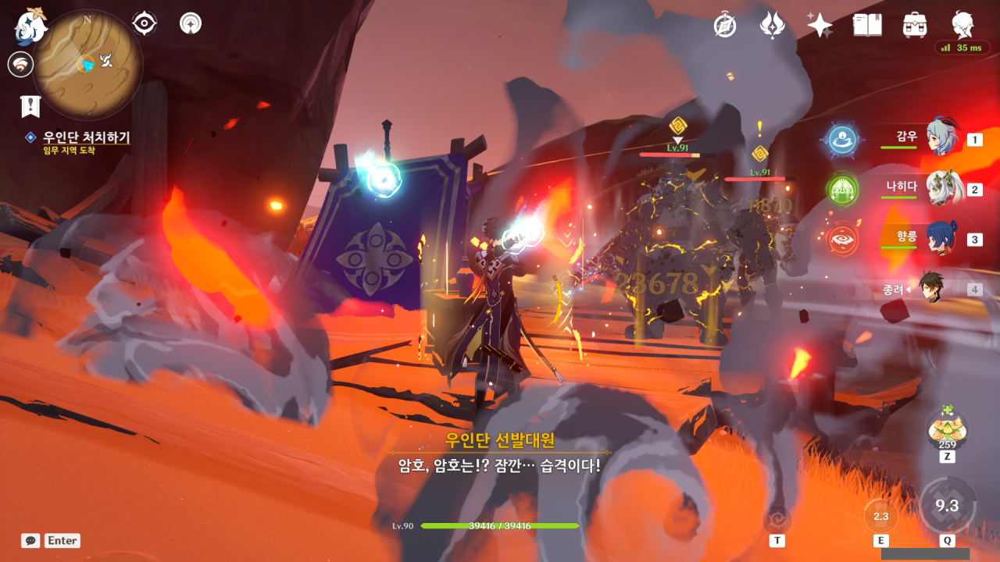

암호? 웬 암호?

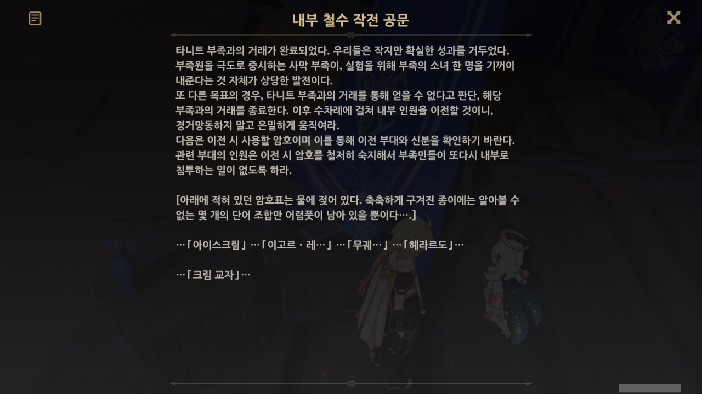

우인단이 남긴 내부 철수 작전 공문을 보니, 타니트 부족이 한 소녀를 우인단에게 넘겼다고 한다. 이건... 제트를 말하는 건가?

우인단이 원했던 '또 다른 목표'가 뭔지에 대해선 전혀 감도 잡히지 않는다. 하지만 우인단이 타니트 부족과의 거래를 통해 이를 얻을 수 없다고 판단했으니, 지금 당장은 걱정하지 않아도 좋을 것 같다.

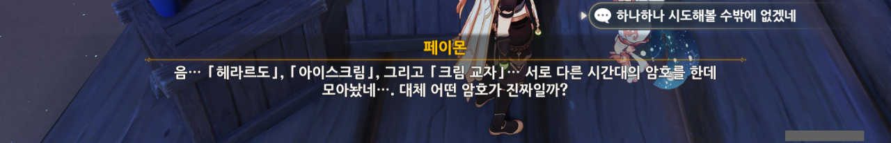

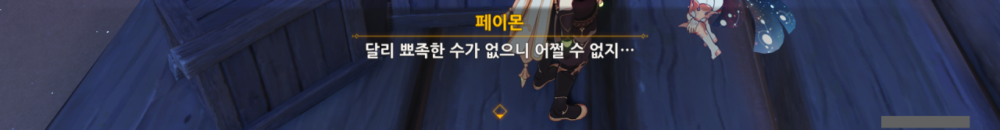

이 지역에 있는 우인단은 피아식별을 위해 암구호를 사용하는 것으로 보인다. 훌륭한 선택이다만, 그 덕택에 좀 귀찮아졌다.

암구호에 대해선... 별 수 없지. 그냥 아무거나 대는 수밖에. 암호에 대한 다른 단서를 얻기 전까진 별다른 방법이 없다.

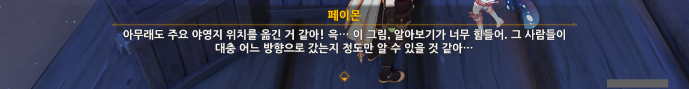

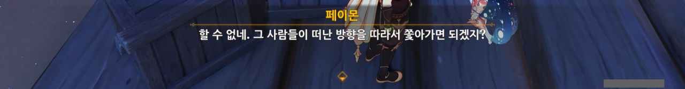

제트는 여기 없으니, 다른 곳으로 이동한 주요 야영지를 찾아가기로 했다. 거기에 제트가 있겠지.

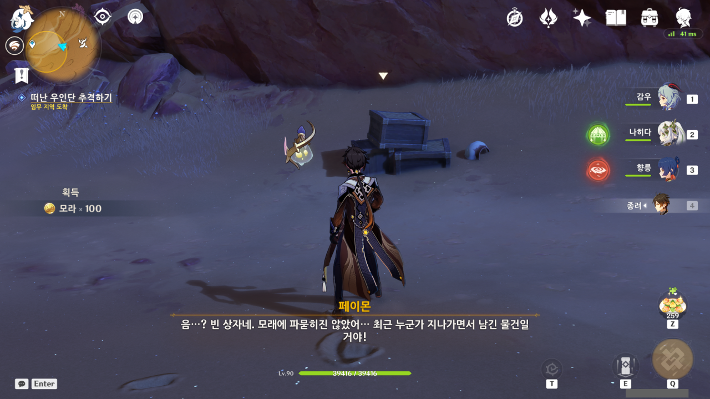

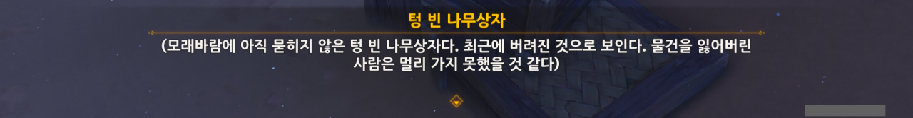

텅 빈 나무상자를 발견했다. 이 흔적이 최근에 생겼다는 것 외에는 별다른 정보를 얻지 못했다.

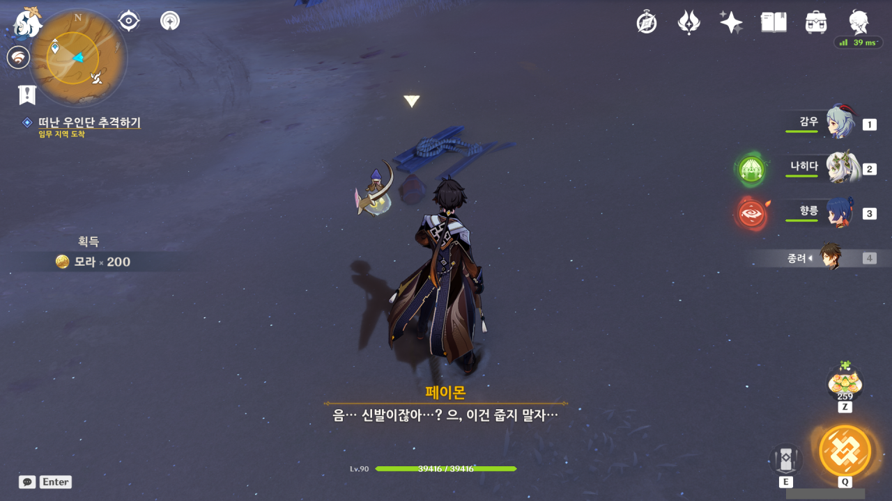

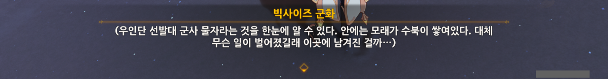

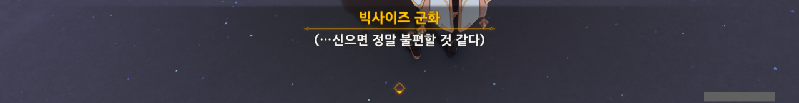

우인단의 큰 군화를 발견했다.

방금 발견한 상자 근처에 있었던 것으로 보아, 이 군화 역시 버려진 지 얼마 되지 않았다고 생각할 수 있다. 그런데 벌써 이렇게 안에 모래가 수북이 쌓였다고?

> ... 신으면 정말 불편할 것 같다.

그야 당연하지! 크기도 안 맞고, 안에는 모래가 가득하니까!

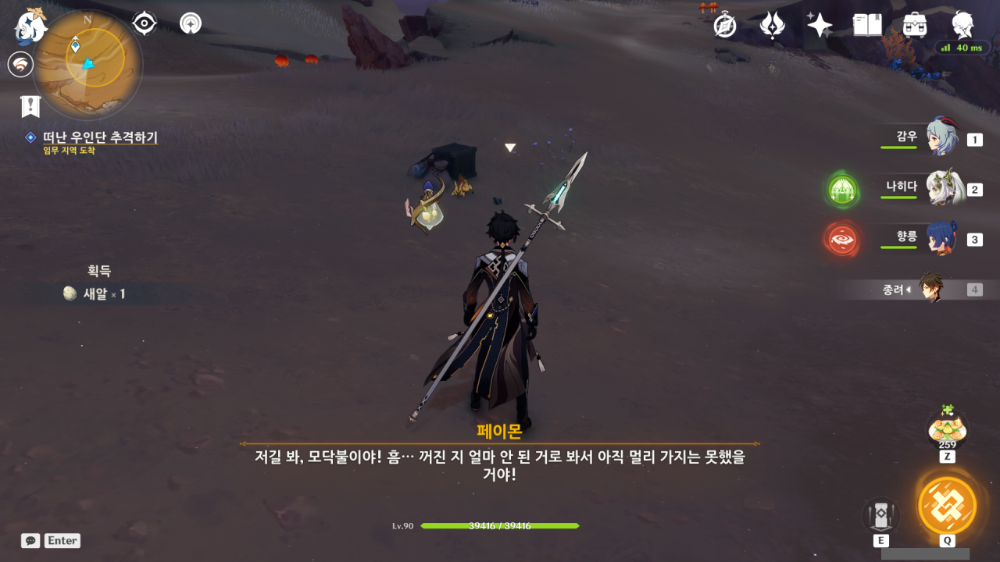

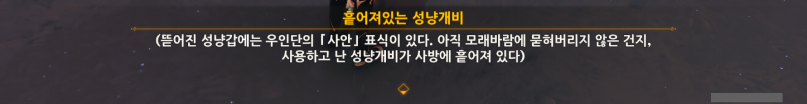

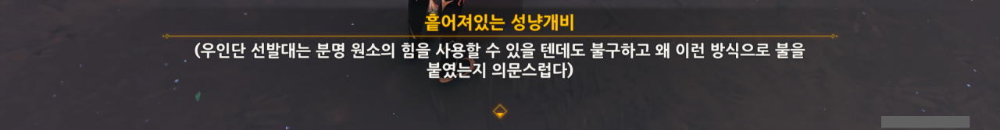

우인단은 사안을 통해 원소의 힘을 사용할 수 있지만, 여전히 불을 피우기 위해 성냥을 사용한다. 사안을 쓰면 수명이 줄어들기 때문이다.

와타츠미 섬에서 사안의 부작용을 전혀 알지 못했던 텟페이가 사안을 남용하다 얼마 안 가 죽어버린 걸 생각하면, 사안이 깎아먹는 수명의 양은 꽤 되는 것으로 보인다.

그렇게 위험한 물건이니, 우인단은 사안을 전투와 같은 중요한 때에만 사용하는 것으로 보인다.



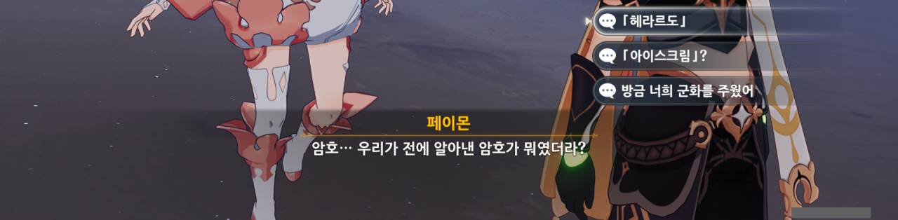

암호를 묻는 우인단에게 아까 봤던 암호 중 아무거나 말해보았다.

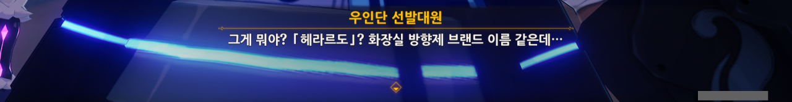

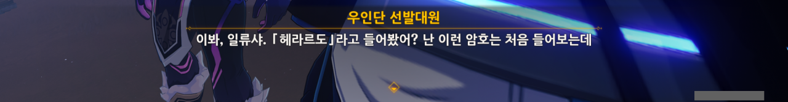

아잇, 젠장. 「헤라르도」는 암호가 아니었던 모양이다.

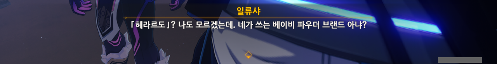

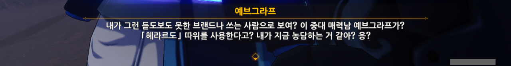

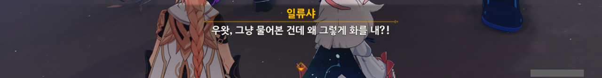

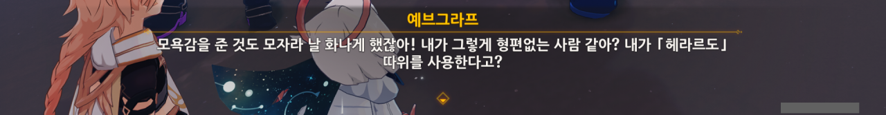

여행자는 그저 "헤라르도"라고 말했을 뿐인데, 두 우인단이 '듣도 보도 못한 베이비파우더 브랜드'같다며 서로 싸우고 있다.

어... 이거, 괜찮은 거 맞지?

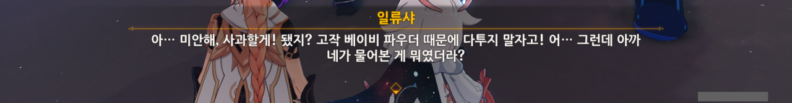

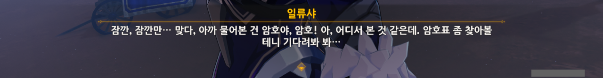

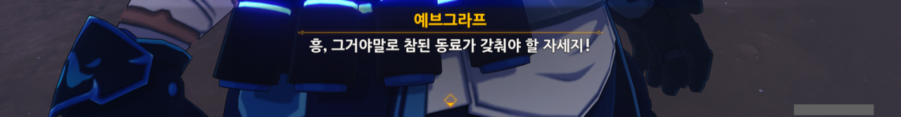

아, 그래. 그래도 방금 말한 게 암구호라고 생각할 정신은 있었나 보다.

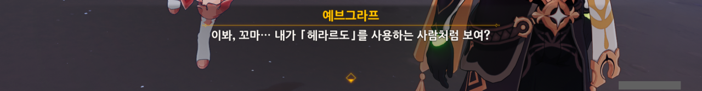

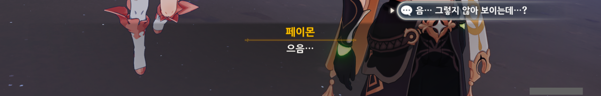

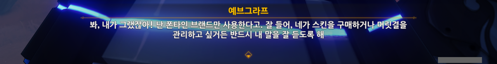

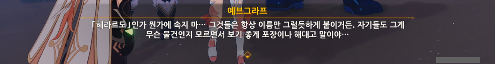

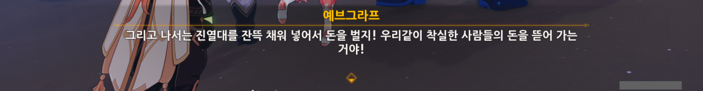

「헤라르도」가 뭔지 모르겠지만, 예브그라프는 「헤라르도」를 엄청나게 까댄다.

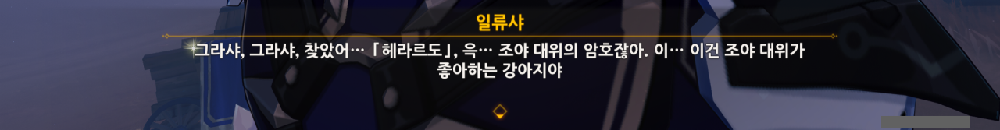

그런데 짜잔~! 「헤라르도」는 이 두 우인단의 상관, 조야 대위가 좋아하는 강아지의 이름이었습니다!

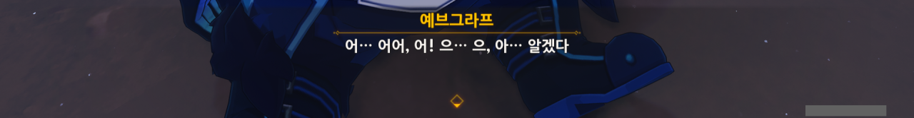

졸지에 상관의 애완동물 이름이 '듣도 보도 못한 브랜드 이름', '형편없다', '이름만 그럴듯하다'라고 까댄 꼴이 된 예브그라프는 그만 제자리에 털썩 주저앉아버린다.

ㅋㅋㅋㅋㅋㅋ

> 口是禍之門(구시화지문) - 입은 재앙을 여는 문이고
> 舌是斬身刀(설시참신도) - 혀는 자신을 베는 칼이니
> 閉口深藏舌(폐구심장설) - 입을 닫고 혀를 깊숙이 간직한다면
> 安身處處牢(안신처처뢰) - 어디서나 거뜬히 몸을 편히 하리라
{.bq}

예브그라프가 급발진만 하지 않았어도 이런 일은 생기지 않았을 텐데 ㅋㅋㅋㅋㅋㅋ

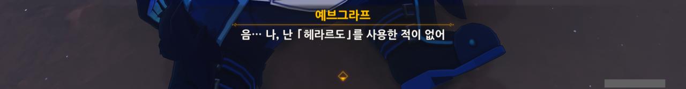

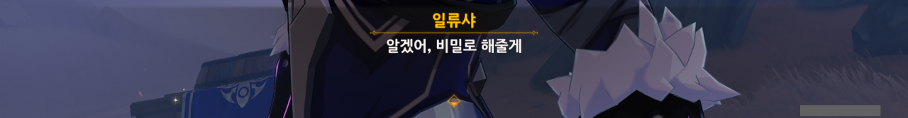

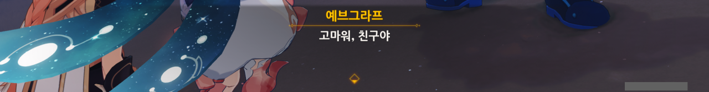

그래도 둘 사이가 참 좋은 모양인지, 일류샤가 예브그라프의 말을 못 들은 척 비밀로 해준다.

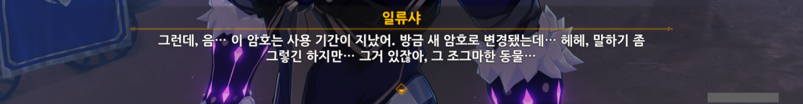

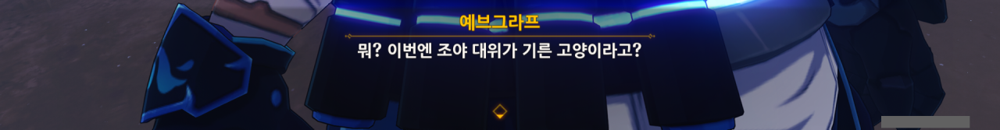

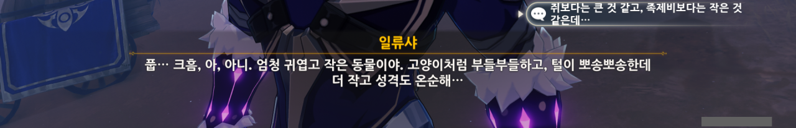

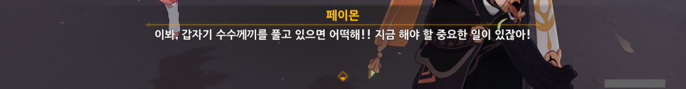

그런데 방금 전 여행자가 제시한 '헤라르도'라는 암호는 사용 기간이 지났다고 한다. 거 참, 괜스레 복잡하게...

그리고 두 우인단과 여행자는 암구호를 교환하다 말고 조야 대위가 기르는 '조그마한 동물'에 대해 스무고개를 하고 있다.

... 이게 맞아?

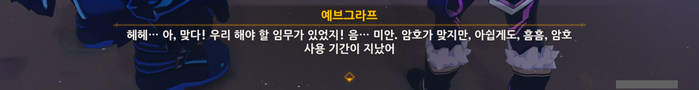

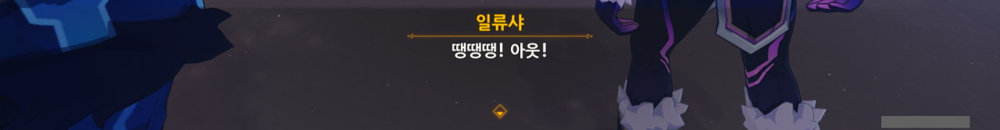

그래. 그건 방금 말한 거잖아.

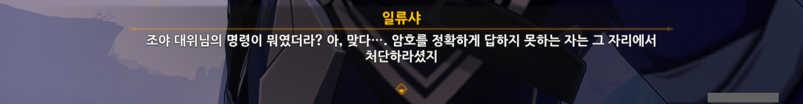

아니, 뭐? 오래된 암구호를 말했을 뿐인데 죽인다고? 이거 맞아?

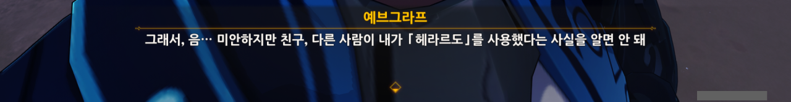

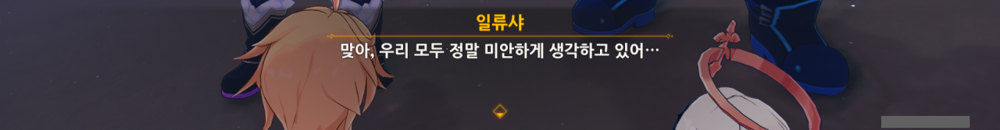

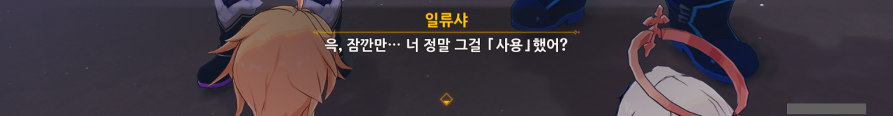

잠깐만. 예브그라프가 「헤라르도」를 사용했다고? 헤라르도는 조야 대위의 애완동물이잖아.

너 설마...? 나만 이상한 상상을 하는 건 분명 아닐 것이다.

어휴, 그래. 차라리 이렇게 서로 질펀하게 싸우는 게 차라리 나을 것 같다.

이 둘의 대화를 듣고 있자니, 정신이 나갈 거 같거든.

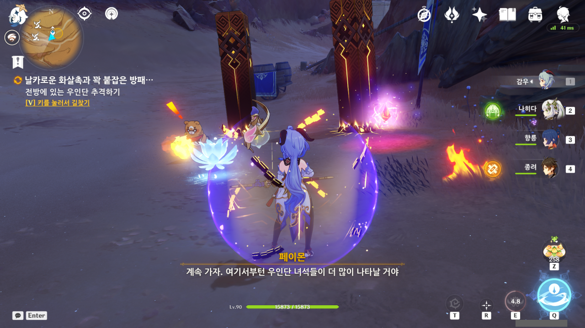

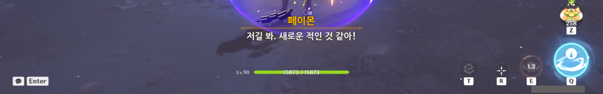

계속 이럴 바에는 그냥 차라리 문답무용으로 다 죽이고 시작하면 안 될까?

이런 정신 나간 대화를 계속 들으면 나까지 정신이 나갈 거 같거든.

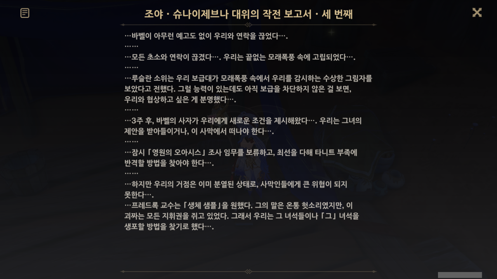

조야 대위가 작성한 작전 보고서이다.

여태 우인단과 잘 거래해 오던 바벨이 갑자기 우인단의 뒤통수를 쳤다고 한다. 바벨이 우인단과 거래한 목적 중 하나인, 영원의 오아시스의 위치를 여행자와 제트를 통해 알게 되었으니, 더 이상 우인단과 거래할 필요가 없다 판단해서일 것이다.

모래폭풍 속에서 고립된 우인단은 바벨에게서 자신의 제안을 받아들이거나, 이 사막을 떠나라는 일방적인 조건을 제시받았고, 타니트 부족에게 반격하고자 했다.

하지만 우인단의 거점은 이미 분열된 상태라, 타니트 부족을 상대할 수 없었다.

이 와중에 우인단 부대의 지휘권을 쥐고 있는 프레드록 교수는 '생체 샘플'을 원했고, 그래서 우인단은 '그 녀석들'이나 '그 녀석'을 생포할 방법을 찾기로 했다고 한다.

&nbsp;

'그 녀석들'은 누구고 '「그」 녀석'은 또 누구야? 거 참... 머리 복잡해지게 만드네.

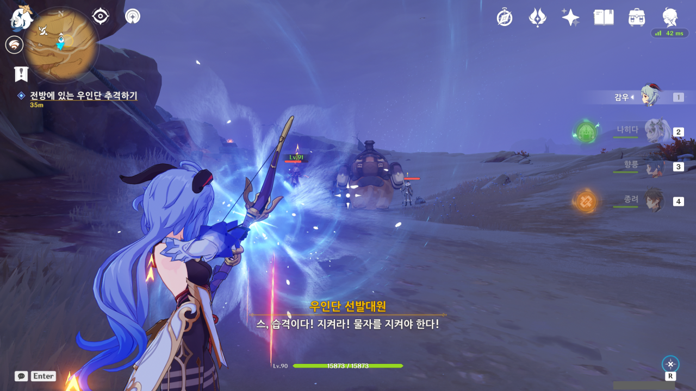

또 다른 우인단 그룹을 만났다.

물자를 지켜야 한다고 한 것으로 보아, 보급품 호송대가 아닐까 생각된다.

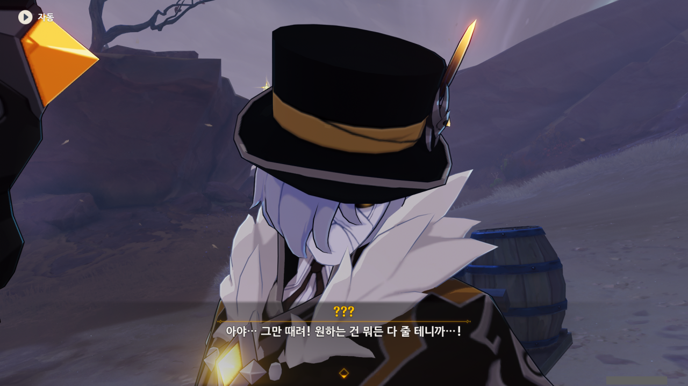

이들이 운송하던 물자가 전부 캠핑 용품인걸 볼 때, 이들은 다른 지점으로 철수 중인 부대이거나 다른 거점에 보급품을 운송 중이던 호송대였던 모양이다.

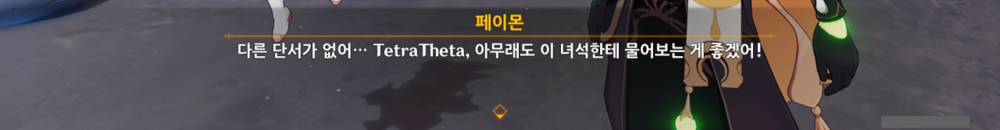

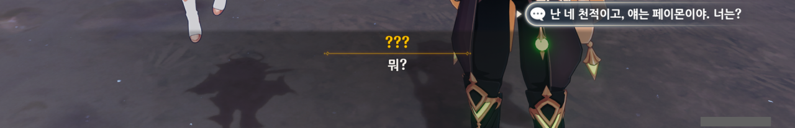

잡은 포로의 이름을 물어보며, 자기소개를 "난 네 천적이야"라고 하는 건 또 뭐야 ㅋㅋㅋㅋㅋㅋ

곱게 정보를 내놓지 않으면 잡아먹겠다는 협박인 걸까 ㅋㅋㅋㅋㅋㅋ

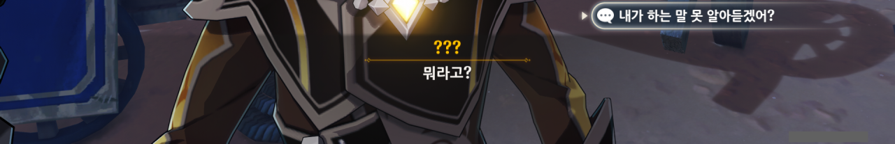

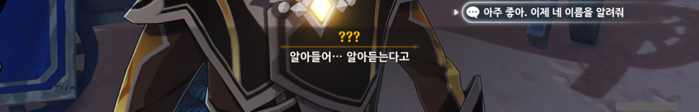

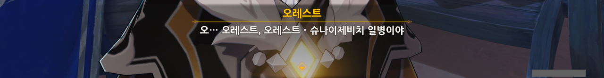

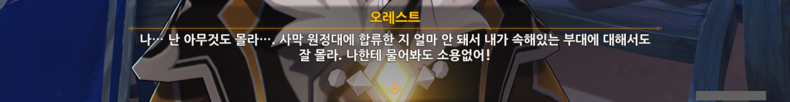

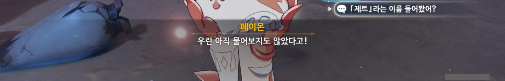

사막 원정대에 합류한 지 얼마 되지 않았어도 최소한 '제트'라는 이름 정도는 들어봤겠지.

제트가 우인단에게 잡힌 건 며칠이 채 되지 않았을 테니.

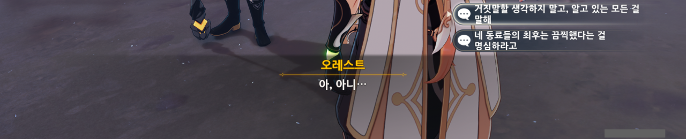

말을 더듬는 걸 보니, 거짓말을 하고 있는 게 분명하렷다.

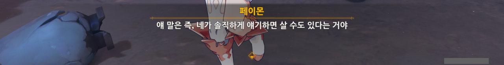

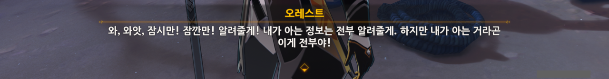

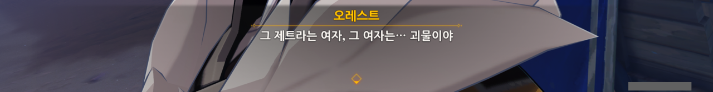

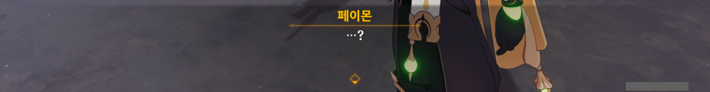

솔직하게 말하면 살려줄 수 있다고 말하자, 곧바로 제트에 대해 정보를 알려주는 오레스트.

그런데 제트가 괴물이라고?

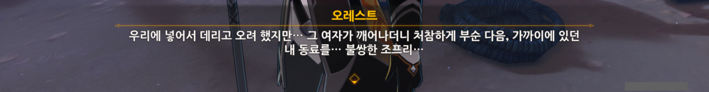

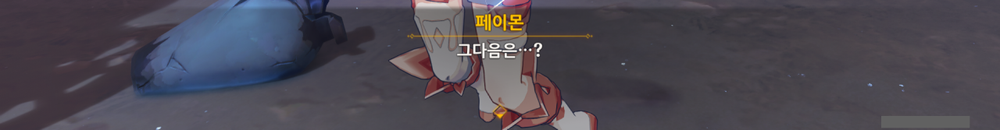

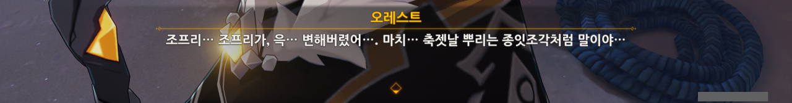

제트를 우리에 넣어서 운송하려 했지만, 깨어난 제트가 우리를 부순 후, 근처에 있는 '조프리'라는 이름의 우인단을 말 그대로 잘 다져진 고깃 조각으로 만든 모양이다.

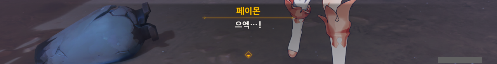

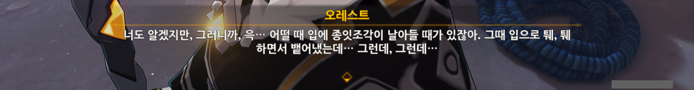

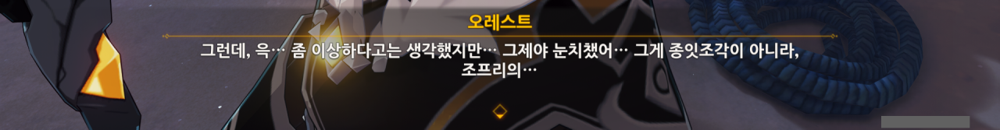

오...

게다가 하필이면 그 조각난 조프리의 고깃 조각이 오레스트의 입에 날아 들어간 모양이다. 오레스트는 무의식적으로 그걸 퉤 하며 뱉어냈지만, 방금 자신의 입에 들어온 게 사람의 고깃 조각이란 걸 금세 깨달았다.

이야, 이거 PTSD가 꽤 세게 오겠는걸.

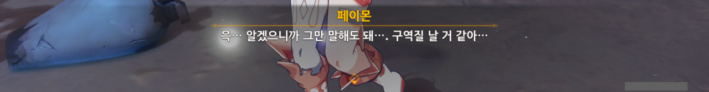

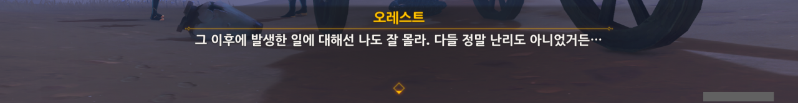

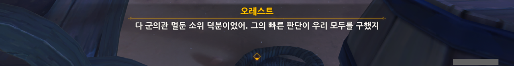

군의관이 대체 뭘 했던 걸까? 제트에게 큰 상처를 주지 않았던 거라면 좋을 텐데...

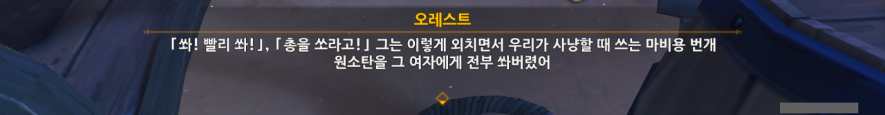

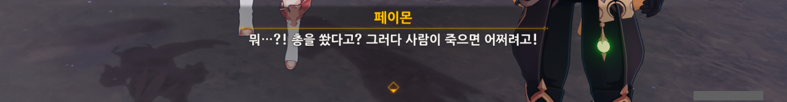

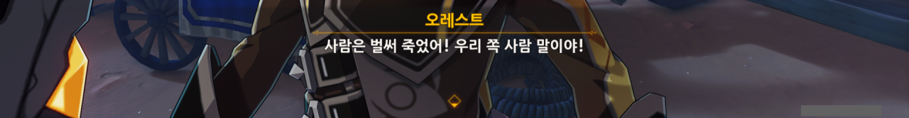

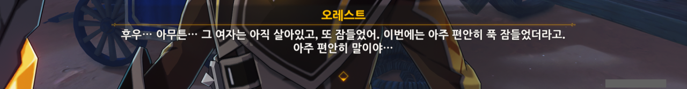

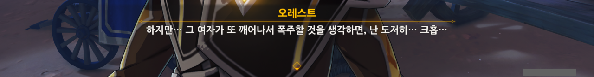

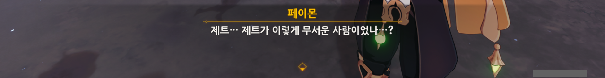

제트를 마비시키기 위해, 갖고 있던 마비용 번개 원소탄을 전부 제트에게 쏟아부은 군의관.

> | | |
> |:--|:--|
> | 페이몬 | 뭐...?! 총을 쐈다고? 그러다 사람이 죽으면 어쩌려고! |
> | 오레스트 | 사람은 벌써 죽었어! 우리 쪽 사람 말이야! |
> {_borderless=true,_thead=false}

ㅋㅋㅋㅋㅋㅋ

&nbsp;

> 제트... 제트가 이렇게 무서운 사람이었나...?

제트가 한번 꼭지가 돌면 무섭긴 했었지.

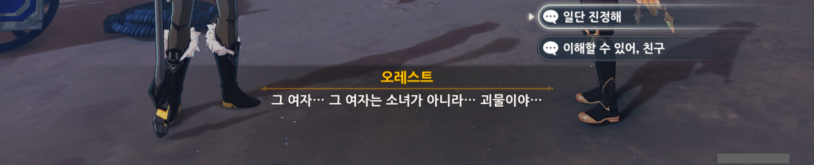

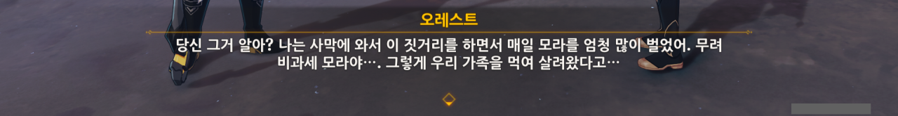

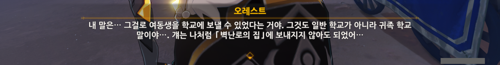

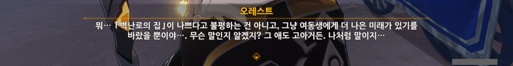

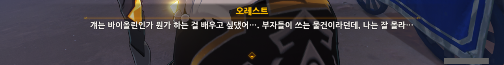

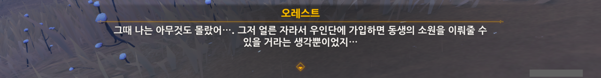

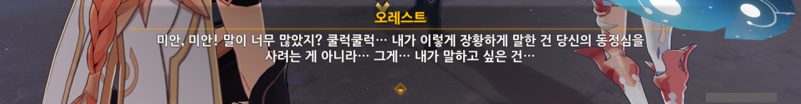

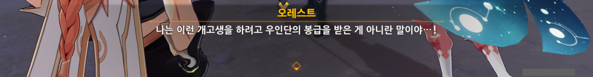

오레스트, 이 녀석도 어찌 보면 딱한 녀석이다.

자신과 마찬가지로 고아가 된 자신의 여동생이 바이올린을 배우고 싶어 하자, 여동생을 자신처럼 「벽난로의 집」이 아닌 귀족 학교에 보내기 위해 우인단에 들어왔다고 한다. 우인단에 들어가면 엄청난 양의 모라를 무려 비과세로 지급해 주니까.

> 나는 이런 개고생을 하려고 우인단의 봉급을 받은 게 아니란 말이야...!

글쎄? 우인단에 들어온 이상, 이런 취급을 받을 각오 역시 하고 온 거 아니었어?

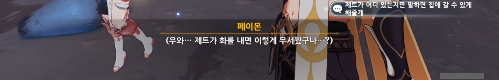

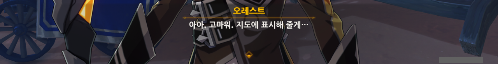

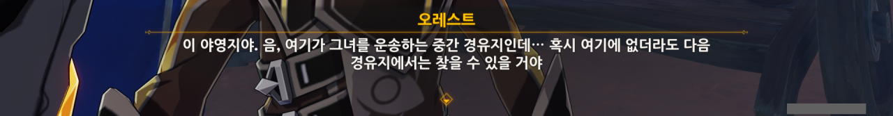

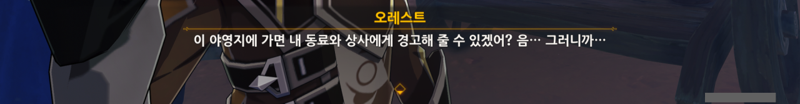

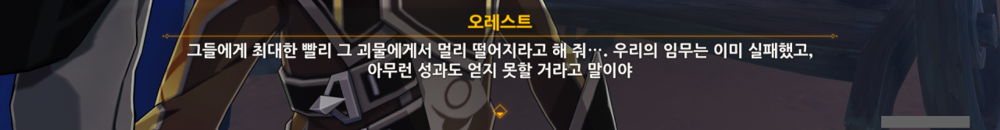

이 녀석, 제트 때문에 정신이 나가서 제대로 된 판단을 못하고 있나 보네.

자신을 '우인단의 천적'이라고 소개한 사람이 잘도 우인단에게 그 경고를 전해 주겠다, 그렇지?

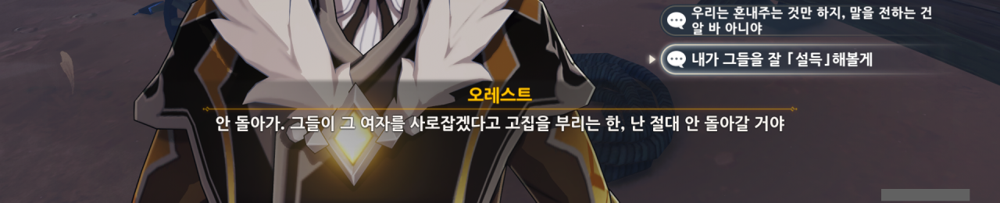

그러니까 여행자는 그들을 사막의 방식대로 잘 「설득」 해 줄 것이다. 이미 여러 번 해온 것이기도 하고.

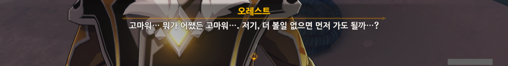

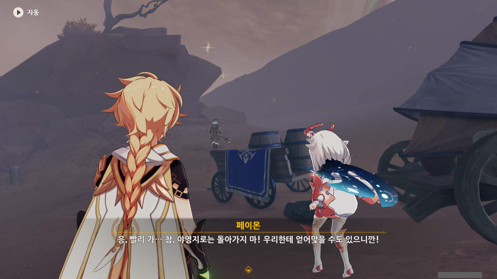

이야, 이렇게 우인단이 멀리 사라지는 모습도 보여주네.

냉정하게 판단하자면, 오레스트는 이 사막에서 오래 버티지 못할 것이다. 한동안 우인단 야영지로 돌아가지 않겠다고 했는데, 낮에는 덥고 밤에는 추운 이 사막에서 어떻게 버티려고?

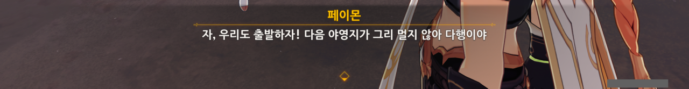

얼른 제트를 만날 수 있으면 좋겠다. 그래야 뭐가 어떻게 흘러가고 있는지 정확히 알 수 있을 테니...

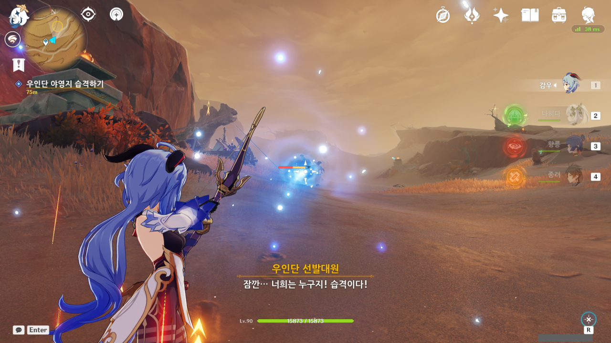

조금 걷자, 또 다른 우인단 그룹을 찾을 수 있었다.

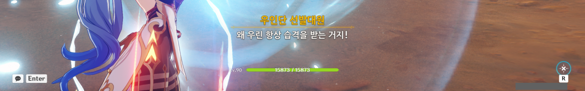

글쎄... 아마 너희가 우인단이라서?

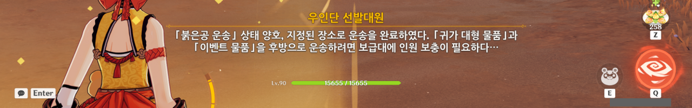

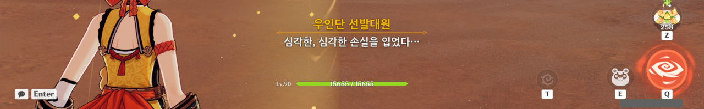

좋아, 또 모르는 단어들이 나왔다.

「붉은 공」, 「귀가 대형 물품」, 「이벤트 물품」이 뭔지 알아내야 한다. 저 셋 중 하나는 분명 제트를 말하는 것일 테니까.

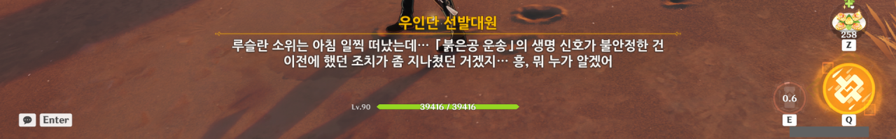

「붉은 공」의 생명 신호가 불안정하다고 하는 것으로 보아, 「붉은 공」은 제트를 말하는 것으로 보인다.

제트가 저렇게 된 이유는 제트가 날뛰는 걸 막겠다고 마비용 번개 원소탄을 잔뜩 제트에게 쏴서 그런 것 같고.

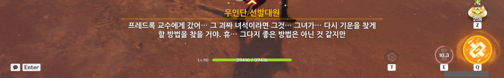

'그녀'라고 말하는 것으로 보아, 「붉은 공」은 제트가 확실하다.

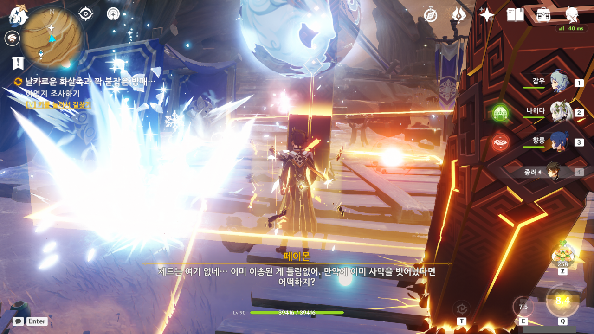

사막을 벗어났으면 쫓아가면 된다.

미구현 지역이나 바다 너머로 도망쳤다면 어쩔 수 없겠지만, 우인단이 아무리 빨라봤자 워프 포인트를 쓸 수 있는 여행자보다 빠르진 못할 테니까.

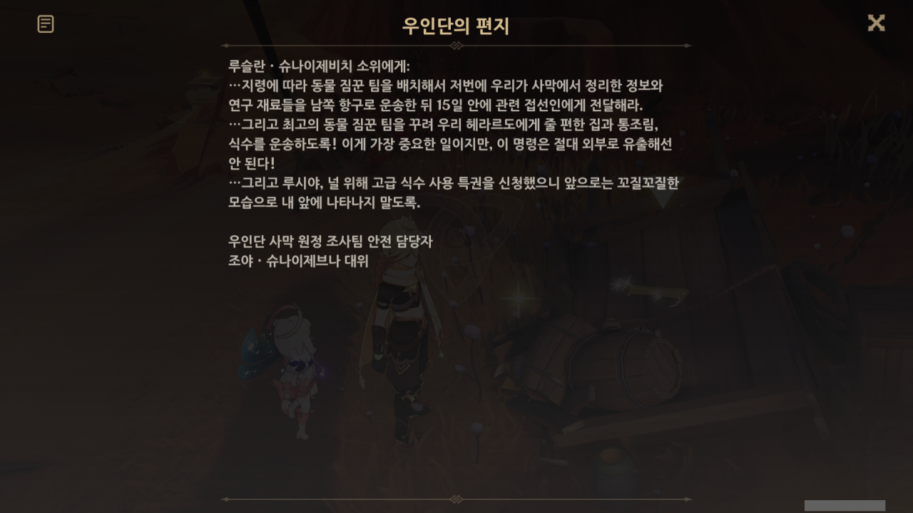

아니나 다를까, 우인단은 물품을 해로를 통해 수송할 계획이다. 이러면 남은 시간이 촉박해진다.

그래도 다행인 건, 여기서 가장 가까운 항구인 오르모스 항구까지 거리가 꽤 된다는 점이다. 분명 금방 따라잡을 수 있겠지.

정 안된다면 오르모스 항구에서 대기하는 방법도 있다. 아카데미아 사람 여럿과 친분이 있는 만큼, 어쩌면 그들의 도움도 받을 수 있을지도 모른다.

&nbsp;

그나저나 조야 대위라는 사람은 공적인 일에 사적인 일을 자주 섞는 타입의 사람으로 보인다.

자기 애완동물에게 줄 편한 집과 통조림, 식수를 '최고의 동물 짐꾼 팀'으로 수송하라고 하며, 그게 제일 중요한 일이라고 한다.

그건 제트나 다른 기타 물품은 최고보다는 조금 덜 한 수준의 동물 짐꾼 팀으로 수송한다는 이야기잖아.

그거, 맞아?

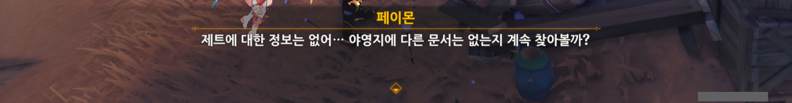



루슬란이라는 사람은 조야 대위와 프레드록 교수 사이에 껴서 고생하는 모양이다.

루슬란이 조야 대위에게 사막에 조금 더 남아 실험을 계속하자고 건의했지만, 타니트 부족과의 불공정 거래에 대해 잔뜩 불만을 품고 있던 조야 대위가 군법을 운운하며 철수를 강행하려 했다.

그러자 루슬란은 조야 대위가 붉은 글씨로 군법 운운한 문서를 그대로 프레드록 교수에게 보내, 우인단 부대의 지휘권을 지닌 프레드록 교수가 조야 대위에게 철수 대신 계속 남아, 실험을 계속하도록 명령하게 만들었다.

어찌 되었건, 좋은 일이다. 이들이 철수하지 않고 여기에 계속 남아있다면, 제트를 구출하기 훨씬 편해질 테니까.

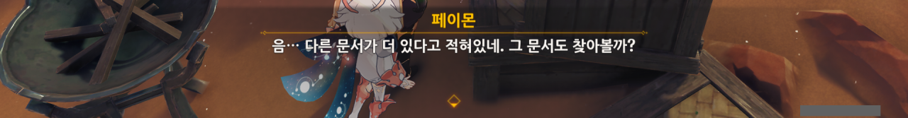

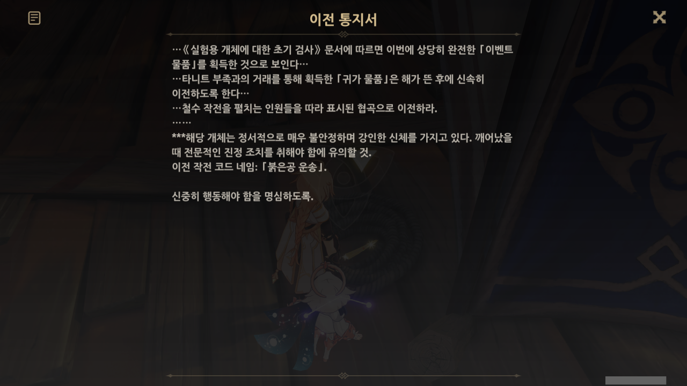

우인단의 다른 문서를 보니, 「붉은 공」, 「귀가 물품」, 「이벤트 물품」 모두가 제트를 가리키는 것으로 보인다.

「이벤트 물품」은 우인단이 최초 계획했던 항목들이고, 「귀가 물품」은 우인단이 최종적으로 획득한 항목, 「붉은 공」은 제트를 지칭하는 것으로 보인다.

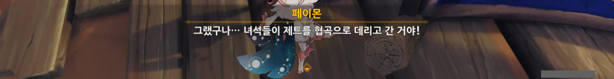

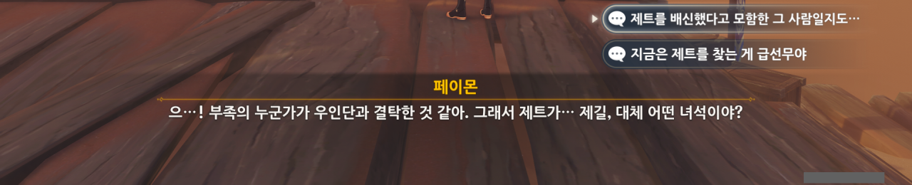

보지 않아도 이미 뻔하지 않은가. 분명 바벨과 유프텐 그 둘이겠지.

일단 그 둘에 대해서는 제트를 찾고 나서 타니트 부족에 가서 따질 생각이다.

경우에 따라선 철과 피로 따지게 될 수도 있겠지만.

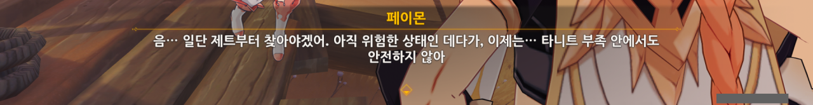

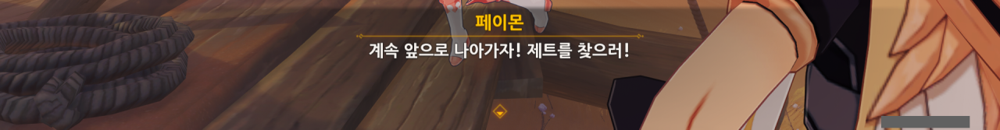

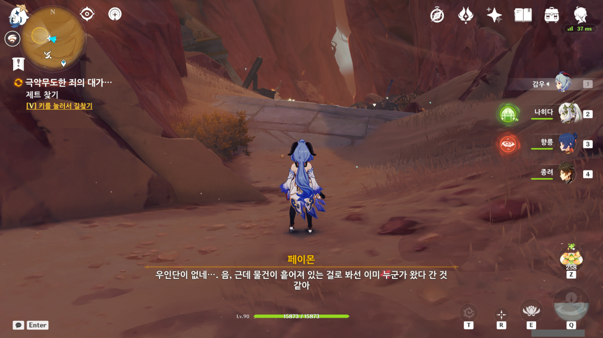

곳곳에 온통 엉망이 된 흔적들이 널려있다.

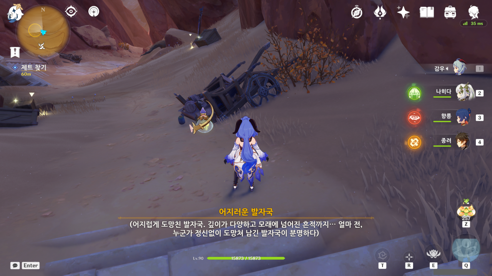

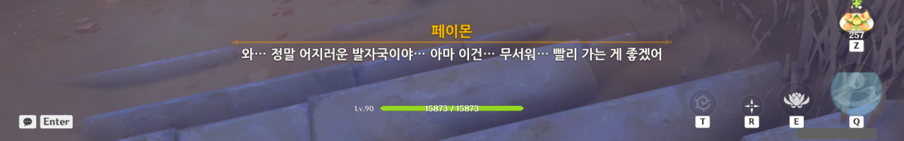

이들은 대체 무엇으로부터 도망친 걸까?

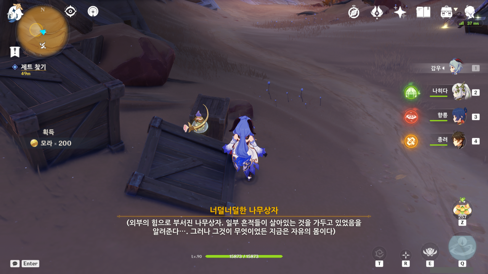

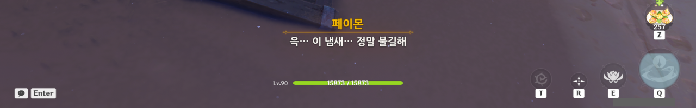

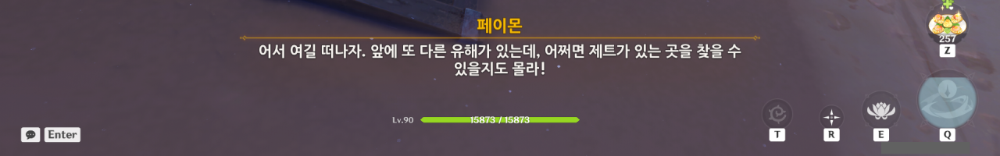

정황상 제트를 이 상자에 가둬둔 모양인데, 제트가 힘으로 뜯고 탈출한 모양이다.

그나저나 너무하네, 정말. 사람을 이렇게 작은 상자에 가둬두다니.

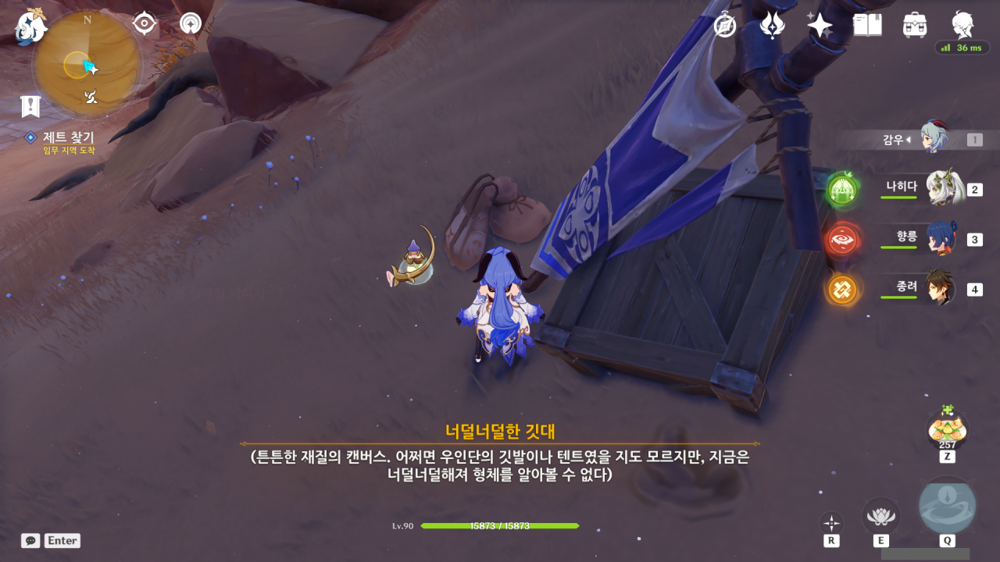

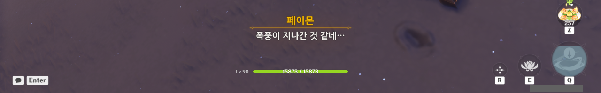

우인단의 텐트*였던 것*...

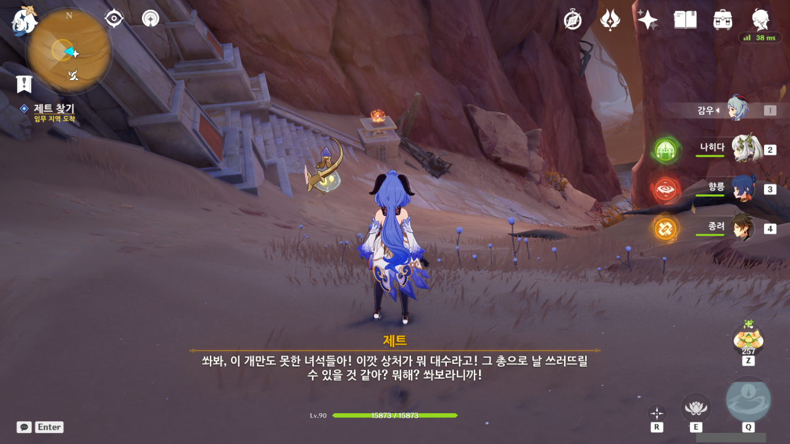

어우야, 제트 입이 아주 걸걸하다.

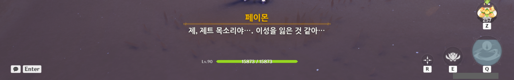

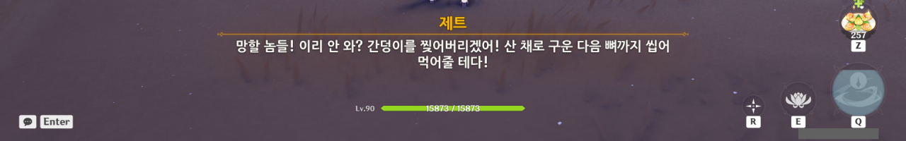

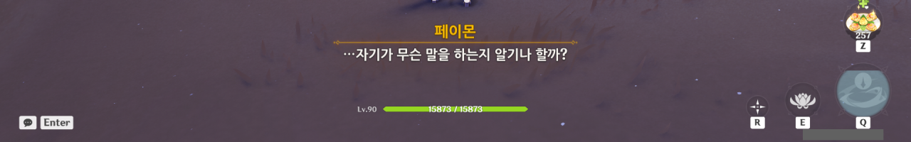

글쎄. 그냥 화가 잔뜩 나서 아무 말이나 내뱉는 것처럼 보인다.

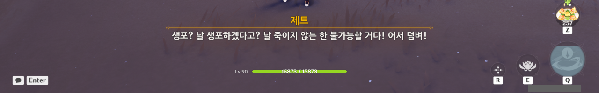

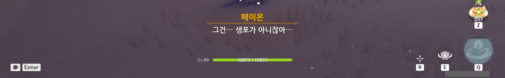

멀리서 들려오는 제트의 말에 하나하나 태클을 거는 페이몬.

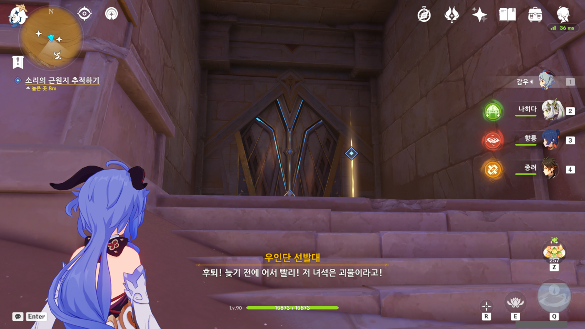

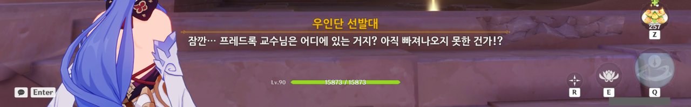

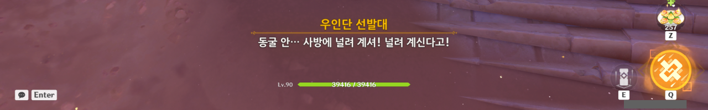

저런. 프레드록 교수는 진작 제트에게 찢겨 잘게 다져진 고깃 조각이 된 모양이다.

한번 얼굴 정도는 보고 싶었는데, 그럴 수 없게 되었네.

사람을 갖고 실험을 하려 한 이상, 그게 그에게 어울리는 최후일 것이다.

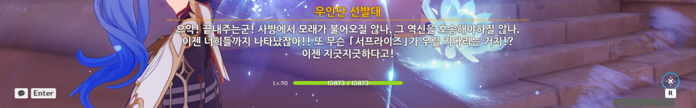

아, 괜찮아. 더 이상의 서프라이즈는 없어. 죽으면 서프라이즈고 뭐고 없잖아?

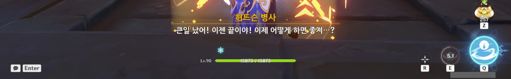





아래로 내려가니, 제트를 찾을 수 있었다.

제트 주변에 아무도 없는 걸 보면, 나머지 우인단은 제트가 전부 썰어버린 모양이다.

&nbsp;

아, 드디어 제트와 대화를 해볼 수 있겠네.
