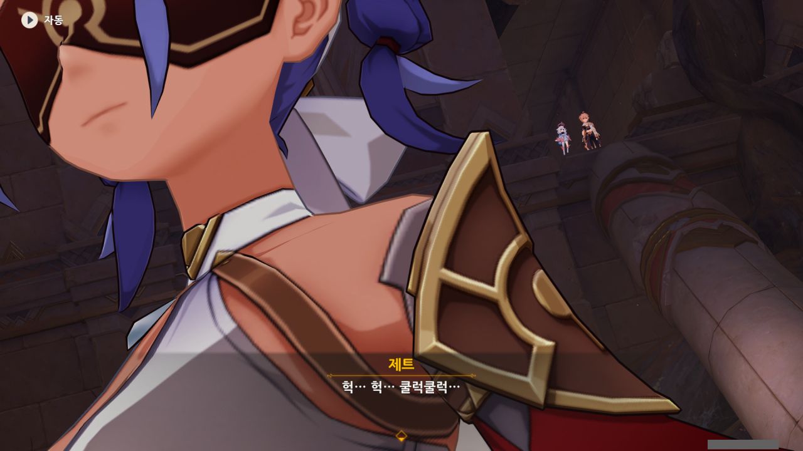

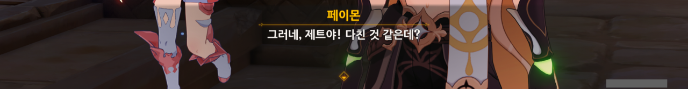

제트의 상태가 영 좋지 않아 보인다.

당연한 일이다. 며칠 전, 우인단에게 사로잡힌 이후, 틈만 나면 계속 우인단을 공격해 온 제트이다.

그 우인단이 기겁하고 도망칠 정도로 사람 여럿을 찢어놓았는데, 그러면서 우인단의 마비탄까지 수없이 맞았다.

그래놓고 몸이 성하길 바라는 건 욕심이지.

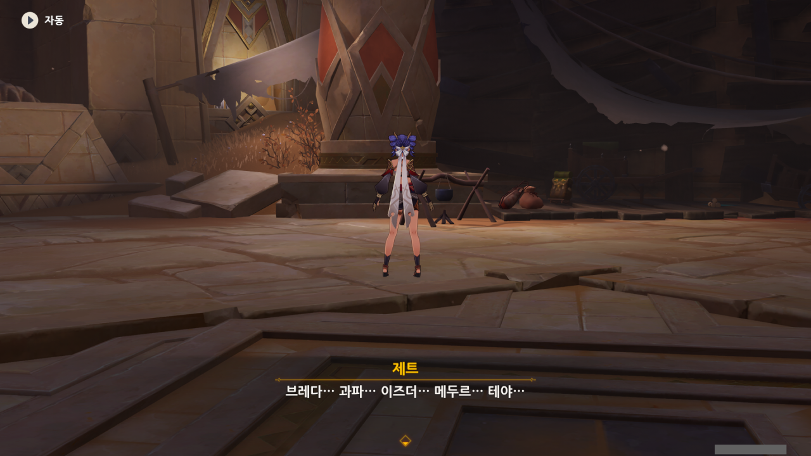

제트가 중얼거리는 저 이름들은 제트의 집에서 발견할 수 있는 쪽지에 적힌 것이다. 마세리아를 제외하면 전부 이름에 취소선이 그어져 있었지.

제트가 직접 죽인 타니트 부족의 장로들의 이름이었던 것으로 기억한다.

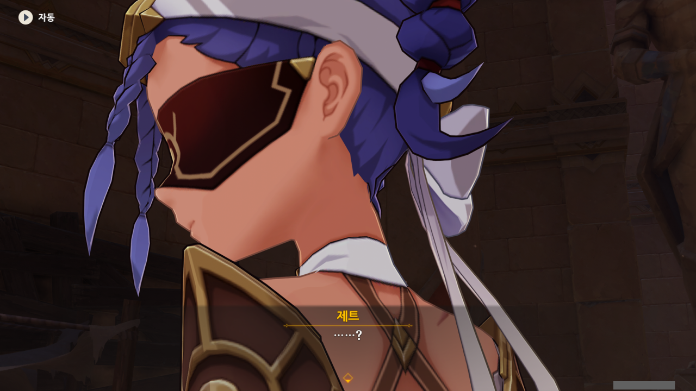

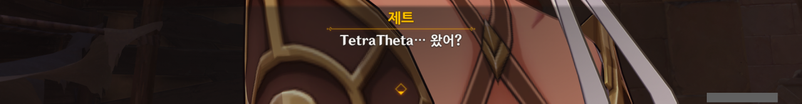

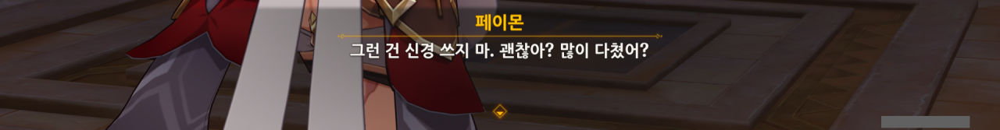

제트 역시 바벨이 자신을 팔아넘긴 걸 알고 저렇게 이성을 잃을 정도로 분노한 모양이다.

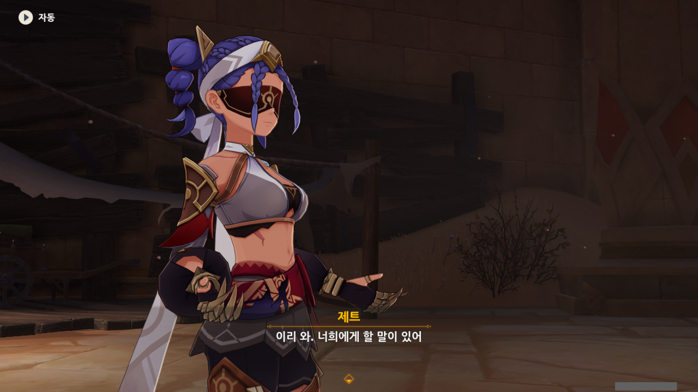

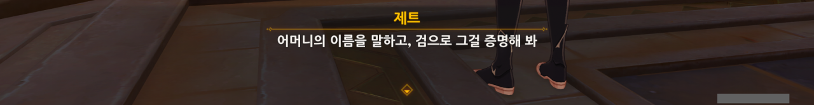

뭐? 왜 그 대사가 여기서 나와?

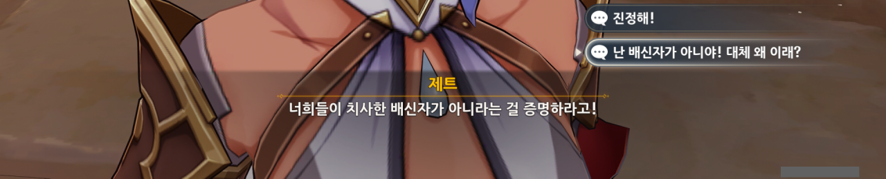

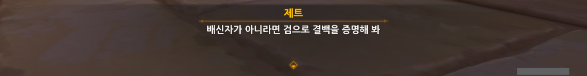

제트가 다짜고짜 여행자가 배신자라고 한다. 아니, 대체 왜?

기껏 구해주러 왔건만 도리어 여행자를 배신자로 몰아가다니, 많이 당황스러운데.

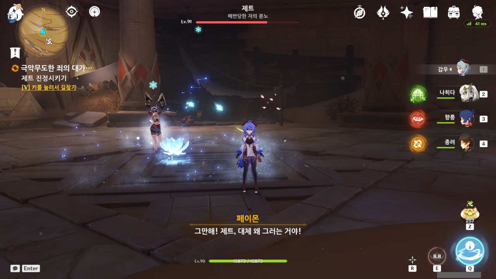

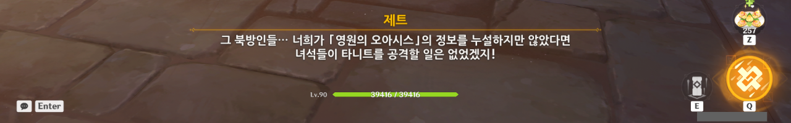

이게 뭔 개소리야?

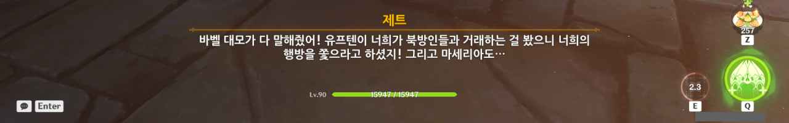

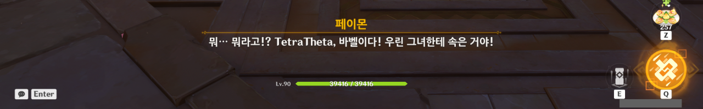

아, 그런 거였구나.

제트와 여행자 모두 바벨의 차도살인지계에 당한 것이었다.

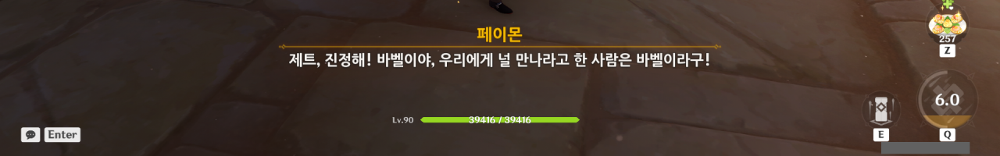

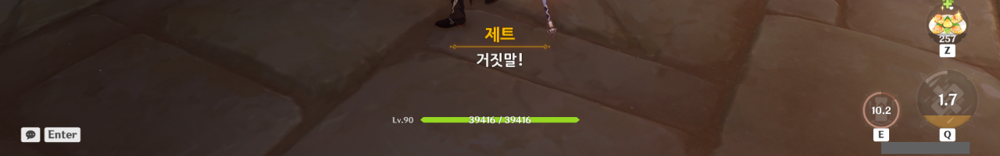

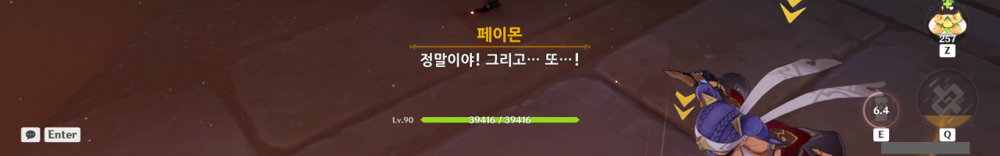

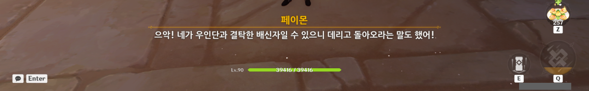

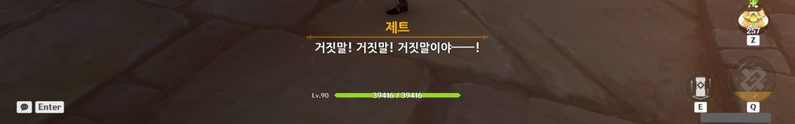

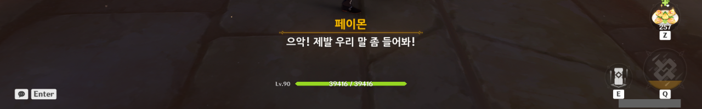

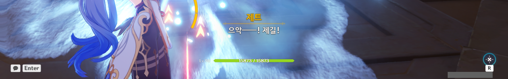

사실을 말해줘도 도통 들어먹질 않는다.

그러면 좀 패서라도 듣게 만들어야지.



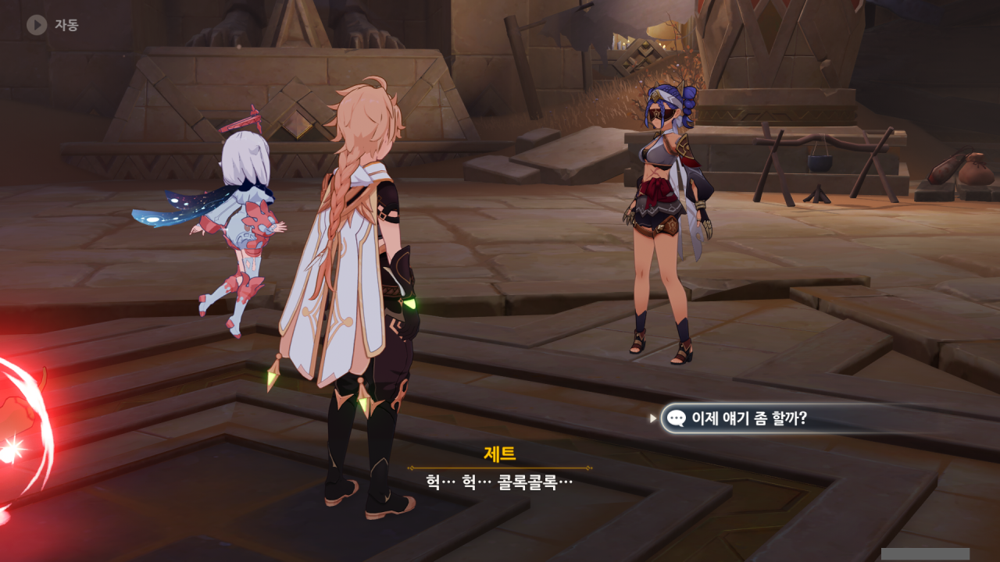

이제 정신이 좀 들어?

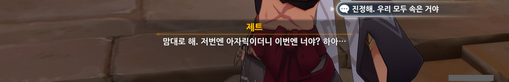

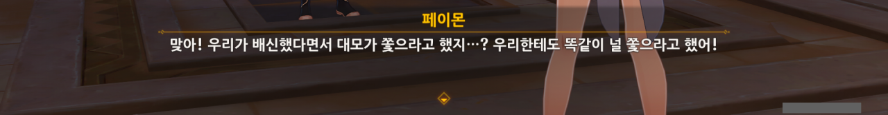

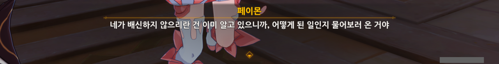

거 참, 답답하게. 이쪽도 제트 네가 배신자라는 이야길 듣고 온 거라니까?

피차 바벨로부터 부족의 배신자라는 말을 들었는데, 제트가 냅다 칼을 먼저 빼드니 참으로 섭섭하다.

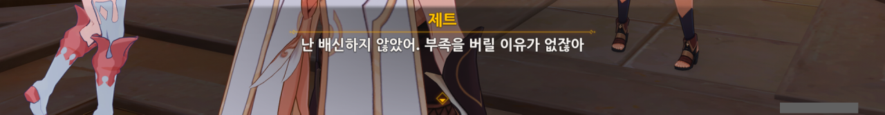

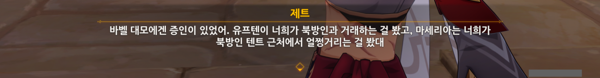

유프텐이 그렇게 말했다고?

역시, 내 예상대로, 바벨과 유프텐이 작당해 여행자와 제트를 죽일 생각이었던 모양이다.

살생부에 본격적으로 두 사람의 이름이 적혔다. 다른 건 몰라도, 저 둘은 꼭 없애야겠어.

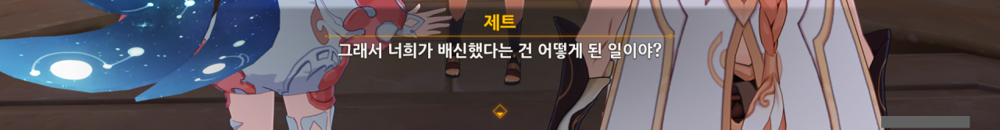

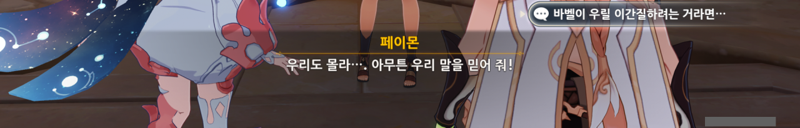

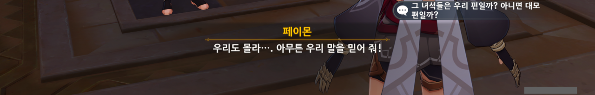

맞아, 맞아. 우리 사이를 이간질하는 사람이 우리 편일 리가 없지.

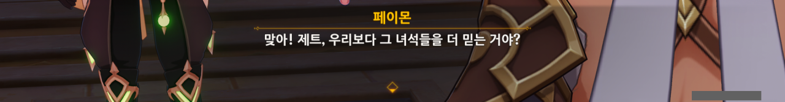

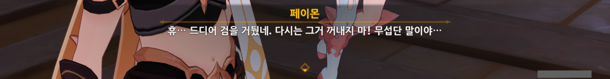

드디어 제트가 우리 말을 믿어주는 것 같다.

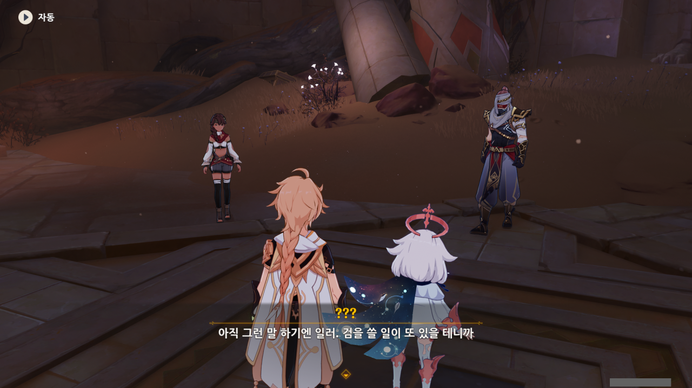

아, 또야? 바벨이 아예 작정을 하고 암살자를 보낸 모양이다.

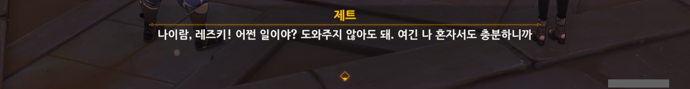

그래, 그럴 줄 알았다.

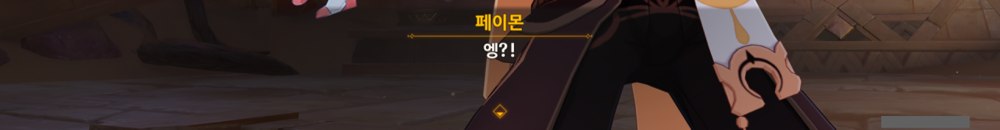

제트와 여행자를 죽일 작정이라고 두 사람 앞에서 대놓고 이야기하는 나이람과 레즈키. 그 와중에 페이몬은 마음에 든다며 살려두니 마니 이야길 하고 있다.

거, 굉장히 자신감이 넘치는 모양인데... 그 자신감, 감당할 수 있겠어?

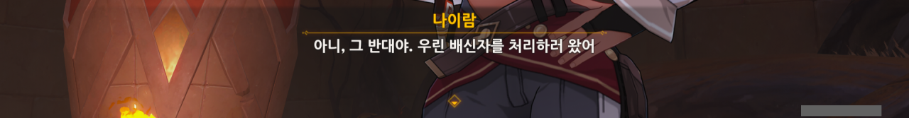

이들은 바벨로부터 여행자와 제트 모두가 부족의 배신자라는 말을 듣고 온 모양이다.

어찌 생각해 보면 이들도 불쌍하긴 하지만, 내 목에 칼을 들이미려는 사람에게까지 그런 동정을 하는 건 사치다.

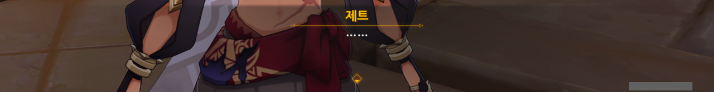

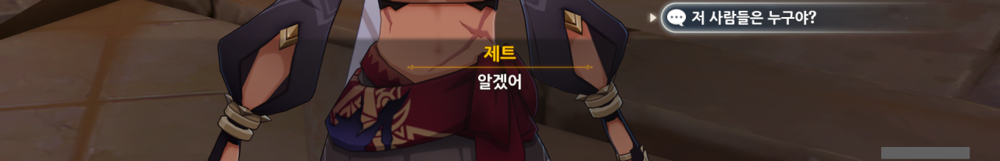

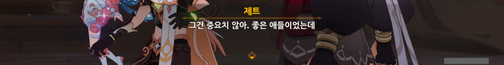

저들이 누구인지 중요치 않은 이유는 간단하지. 곧 죽을 놈들이라서이다.

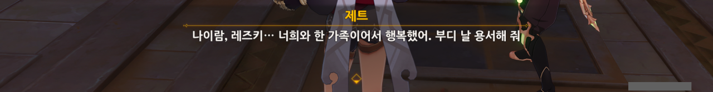

저들 입장에선 제트가 부족의 배신자일 텐데, 그 배신자가 "부디 날 용서해 줘"라고 하는 말에 "그래, 시작하자"라고 대답하다니...

역시 사막인들의 감성은 알기 어렵다.

저들의 수식어가 '타니트의 「사냥매」'이다. 타들라 역시 「사냥매」였었지...

만약 타들라가 여행자의 손에 죽임을 당하지 않았더라면, 타들라 역시 저들과 같이 여행자를 공격했겠지...

타들라가 여행자의 손에 먼저 죽은 것이 다행인지 아닌지 잘 모르겠다.

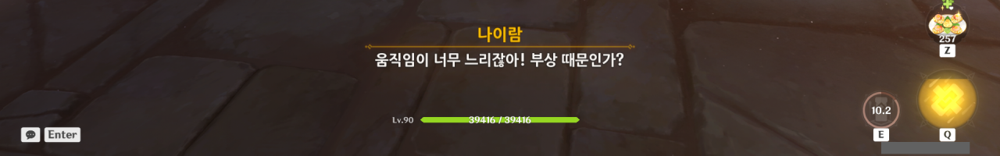

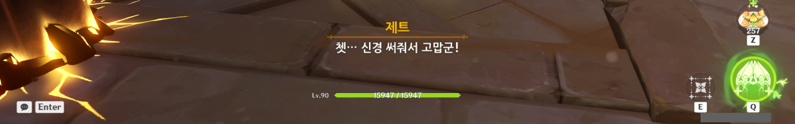

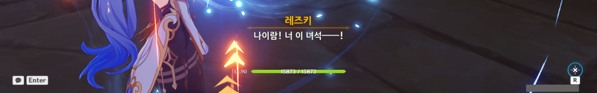

나이람을 처치하자, 레즈키가 잔뜩 분노한다.

그런데? 분노해서 어쩔 건데? 네가 할 수 있는 거라곤 그 자리에 서서 계속 화내다가 여행자에게 목이 따이는 것 외에는 없잖나.

누군갈 죽이려면 역으로 자기 목이 따이는 것도 각오했어야지.

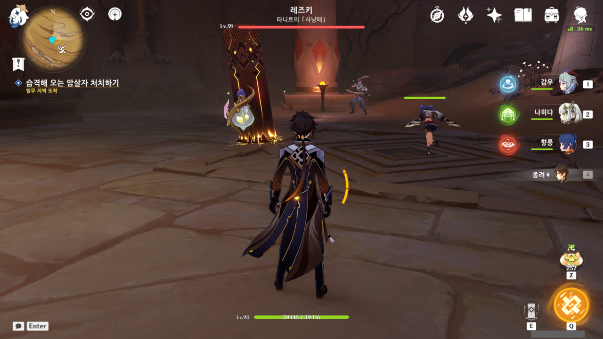

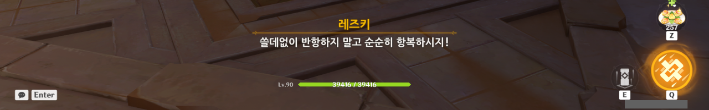

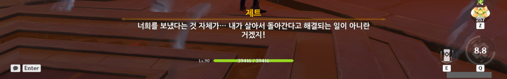

뭐, 당연한 말이다.

부족의 지도자인 바벨이 제트를 부족의 배신자로 낙인찍은 이상, 제트가 여기서 살아 돌아간다고 해도 타니트 부족이 제트를 다시 받아주지 않을 테니까.

만약 타니트 부족이 바벨의 편을 들어 제트를 끝까지 적대시하겠다면, 타니트 부족도 바벨과 함께 지우면 되는 일이다. 간단하잖아?

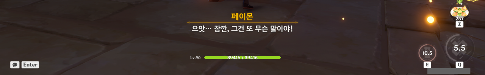

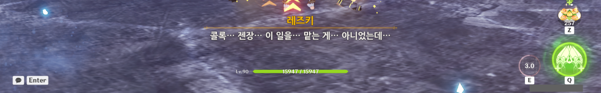

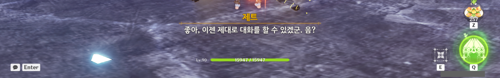

나이람과 레즈키를 모두 처치했다.

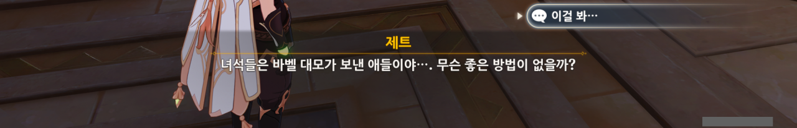



우인단의 야영지에서 발견한 문서를 제트에게 보여주었다.

이 문서들은 바벨이 여태껏 우인단과 거래해 왔으며, 제트 역시 우인단에 팔아넘겼음을 증명하는 문서들이다.

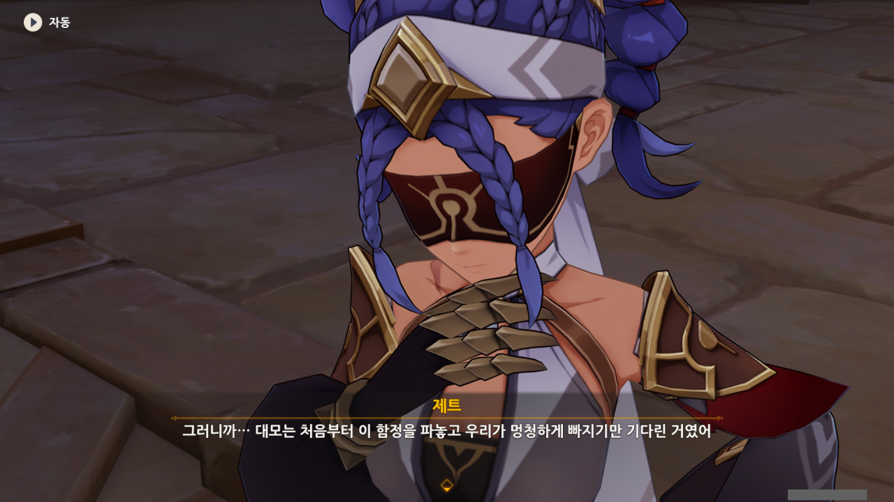

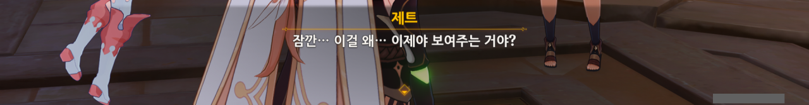

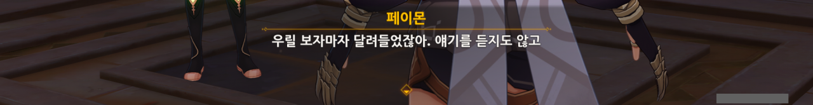

그야, 제트가 여행자를 보자마자 배신자니 뭐니 하면서 칼을 꺼내드는 통에 이 문서들을 보여줄 새가 없었으니까.

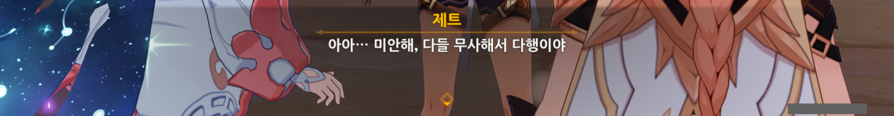

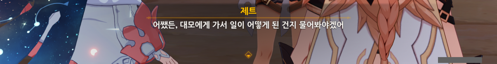

그 물어본다는 거, 사막식 「질문」 맞지?

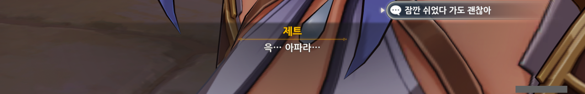

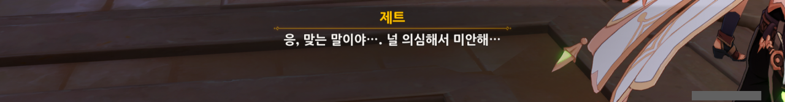

바벨이 보낸 암살자가 모두 죽었기 때문에, 바벨에게 이쪽 상황을 알려줄 사람이 단 하나도 없게 되었다.

그러니 느긋하게 제트의 상처를 치료한 후, 바벨을 찾아가면 된다.

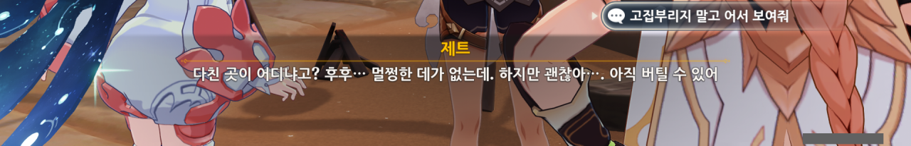

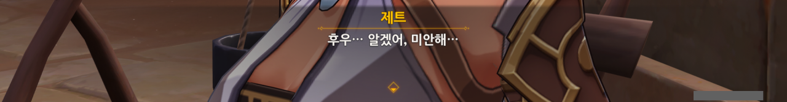

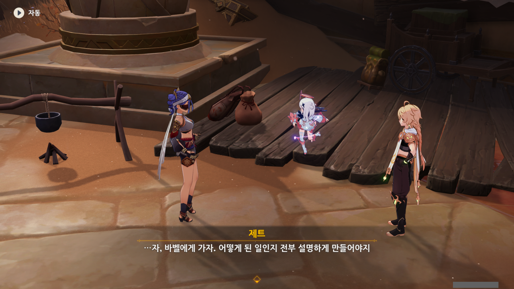

그래. 일단 바벨을 잡고 시작하는 거다.

부하를 ㅋㅋㅋ 기다리는 ㅋㅋㅋ

바벨은 그 암살자들이 여행자와 제트를 처치할 수 있을 거라고 생각한 모양이다.

사람 잘못 봐도 한참 잘못 봤어.

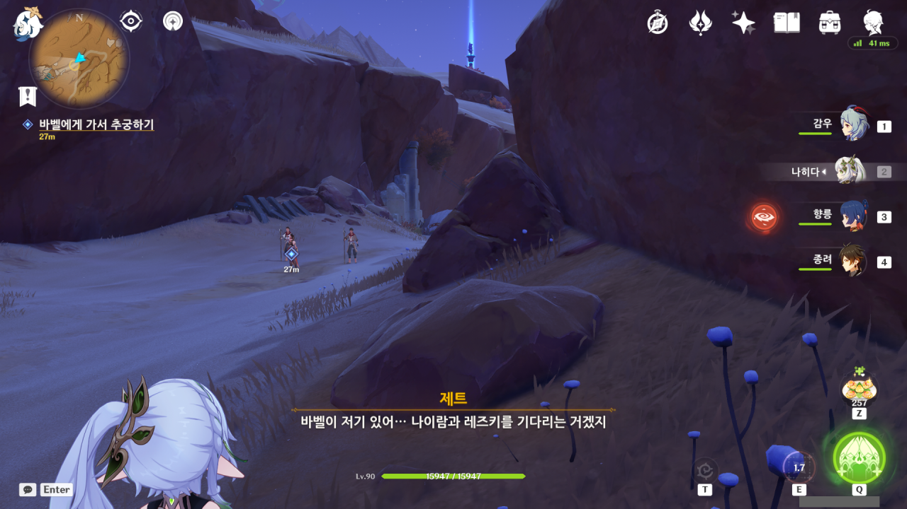

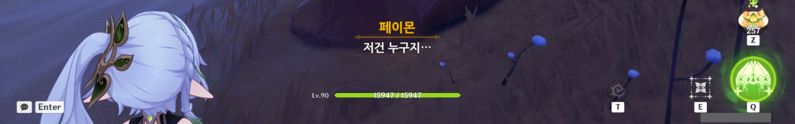

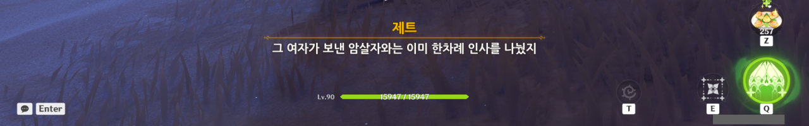

그리고 바벨 옆에는 또 다른 암살자가 있다. 분명 여행자와 제트를 죽이고 돌아온 암살자를 죽여 없애, 완벽한 범죄를 꾸밀 생각이겠지.

그런데 어쩌나. 우리 둘 다 모두 멀쩡히 살아있는데.

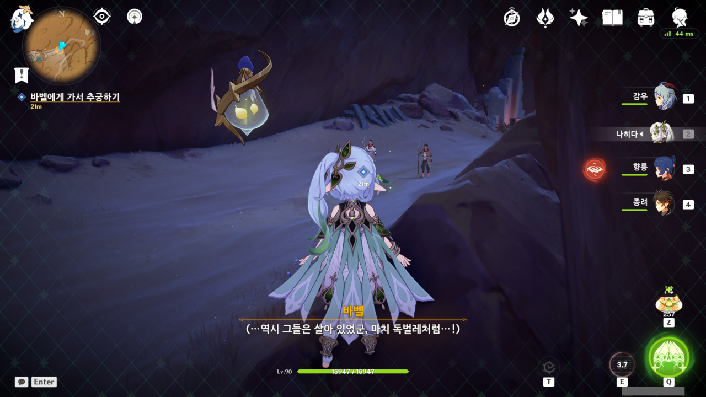

허, 누가 누굴 보고 독벌레라고 하는 건지... 적반하장이 따로 없다.

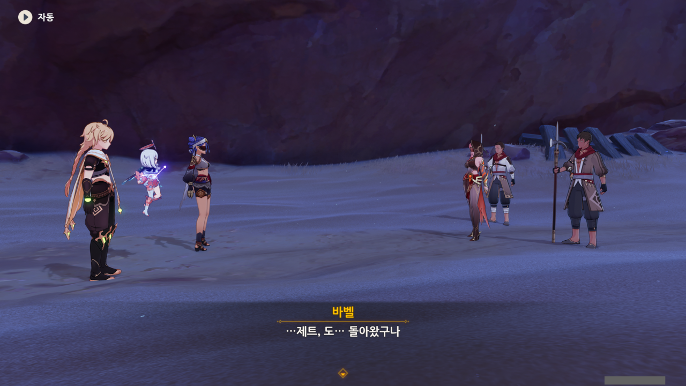

제트와 여행자가 멀쩡히 돌아오자, 바벨이 적잖이 당황한다. 아, 벌써부터 입가에 미소가 번지는걸.

&nbsp;

세상에서 제일 보기 좋은 건, 자신의 야심 찬 계획이 잔뜩 망가져 당황하거나 절망한 악당의 얼굴이다.

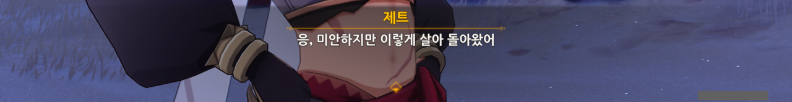

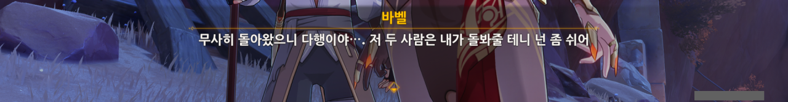

하, 어딜 되지도 않는 술수를 부리려고.

자신의 적인 제트와 여행자가 함께 붙어있으면 위험하다 생각해, 제트와 여행자를 떨어트려 놓으려는 바벨의 생각이 다 보인다.

미쳤나? 타니트 부족 전체가 잠재적 적대 세력인데 잘도 호랑이 아가리에 고개를 들이밀겠다.

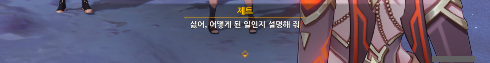

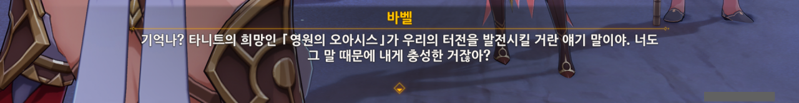

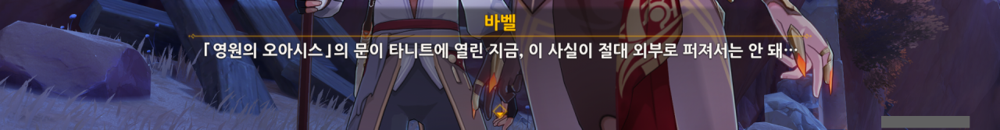

그게 왜?

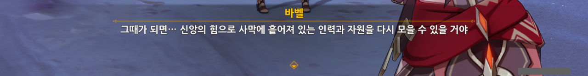

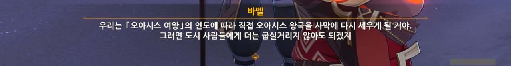

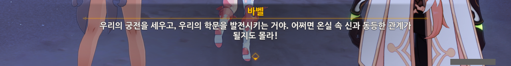

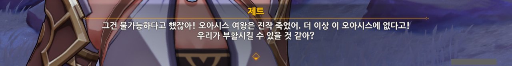

「오아시스 여왕」, 즉 화신(花神)은 이미 죽은 지 오래고, 적왕의 약속처럼 다시 되살아나지 않았다.

이미 그 이야기는 영원의 오아시스에 다녀온 이후, 바벨에게 다 해준 이야기 아니었나? 도리어 바벨이 영원의 오아시스에 정신이 팔려, 여행자와 제트의 말을 한 귀로 듣고 한 귀로 흘린 것이다.

화신이 없는데 나히다와 동등한 관계는 무슨... 지나가던 개가 웃겠다.

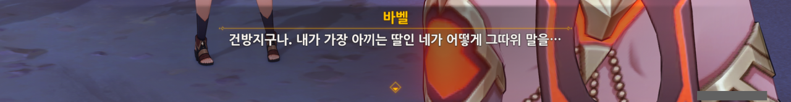

> 건방지구나. 내가 가장 아끼는 딸인 네가 어떻게 그따위 말을...

아, 나왔다. 상대의 말을 논리적으로 반박할 수 없을 때 나오는 전매대사인 '건방지다', '감히 네가 어찌'.

벌써부터 바벨에 질렸다. 너무 클리셰적인 악당이잖아...

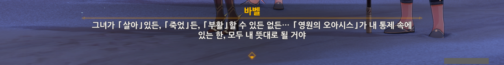

바벨은 화신이 있든 없든 '화신의 유일한 여예언자'를 참칭 할 것이기 때문이었기에, 화신이 없는 것이 더 좋은 것이다.

ㅋㅋㅋ 거 참 꿈도 크셔라.

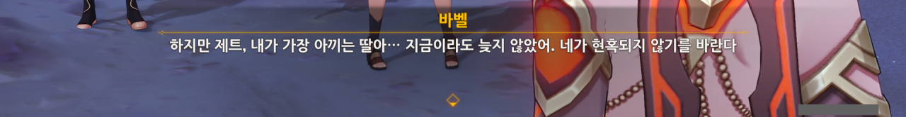

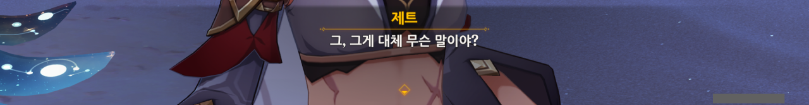

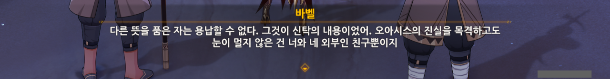

저 '신탁'이란 말도 참 웃긴 것이, 적왕도 없고 화신도 없는데 바벨은 대체 누구에게서 신탁을 받았단 말인가?

나히다? 나히다는 정선궁에 500년 동안 갇혀 있었고, 그 가혹하고 긴 감금 생활을 '아카데미아가 잘하고 있겠지'라고 아카데미아를 믿으며 견디고 있었다.

그러니 저 '신탁'은 정말 신탁이 아니라, 사막 전체의 권력을 잡기 위해 바벨이 지어낸 말인 것이다.

진짜 뭘 몰라도 너무 모르네.

릴루페르는 이미 구라바드로 먼 여정을 떠난 지 오래다. 여행자를 죽이더라도 릴루페르가 돌아올 리는 없지. 여행자를 죽일 수 있는지는 둘째 치고서라도 말이다.

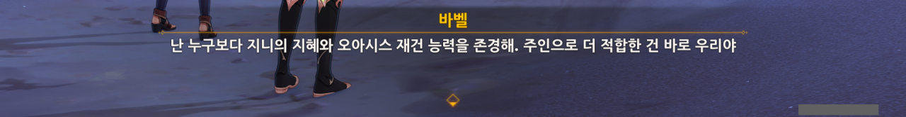

> 주인으로 더 적합한 건 바로 우리야.

저 말을 들으니 예전에 릴루페르가 했던 말이 다 이해가 된다.

&nbsp;

아자릭이 여행자와 제트를 배신했을 때, 바로 저런 말을 했었다. 아자릭이 그런 발상을 누구에게서 얻었겠는가? 바로 바벨에게서였겠지.

바벨이 더러운 방법으로 타니트 부족의 권력을 잡을 때부터 함께 했었던 아자릭이니, 당연하다면 당연한 말이다.

릴루페르는 바벨이 여행자를 배신할 것까지 전부 꿰뚫어 보고 있었던 거였구나.

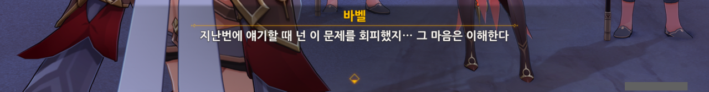

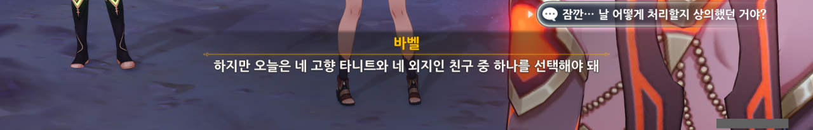

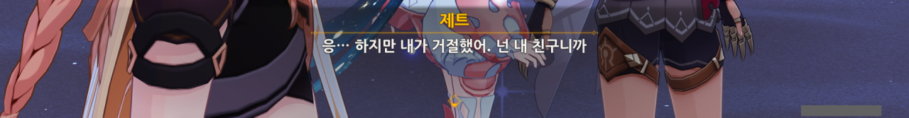

심지어 바벨은 여행자의 친구인 제트에게 여행자를 죽일 방법을 강구하라고 한 모양이다.

하지만 제트는 여행자를 친구로 여기고 있었기에, 바벨의 명령을 회피했고 말이다.

예전부터 바벨을 쓰레기라 생각하고 있었지만, 방금 그 이유에 한 줄이 더 추가되었다.

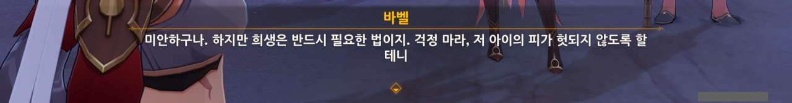

> 미안하구나. 하지만 희생은 반드시 필요한 법이지.

'대를 위해 소를 희생한다'... 겉보기엔 참 그럴듯해 보이지만, 그런 걸 부르짖는 개인이나 사회, 국가는 결코 오래가지 못했다.

그걸 부르짖는 놈은 절대로 대를 위해 자신을 희생할 생각을 하지 않았고, 국가나 사회는 그렇지 않은 사회보다 더 빨리 무너져 내렸다.

뿌리부터 썩은 사상인데, 거기서 자란 작물이 제대로 자랄 리 없지.

바벨의 계획이 모두 성공하더라도, 결국 구라바드 Mk.2가 될 뿐이다. 아니, 구라바드는 흔적이라도 남겼지만, 타니트 부족이 주축이 된 국가는 그 흔적조차 남기지 못하겠지.

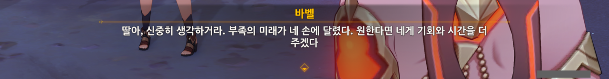

이젠 바벨의 말 하나하나가 웃길 지경이다.

'내게 붙으면 권력을 주겠다'라니, 이것 역시 전형적인 악당의 대사 아니던가.

하지만 제트는 이미 사막 유적에서 마음을 굳히고 왔다. 바벨의 설득이 통할 리 없지.

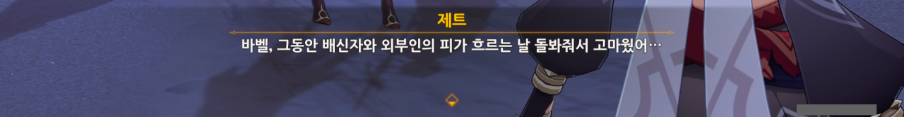

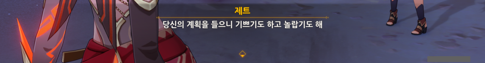

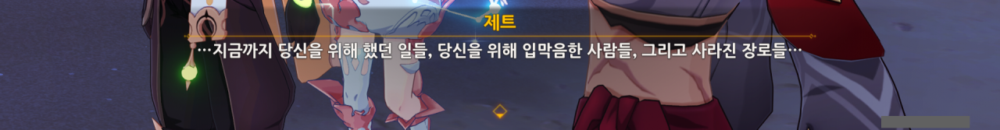

지금껏 해왔던, 제트와 바벨의 관계가 사실이었음이 드러났다.

제트는 바벨을 위해 여러 사람들을 죽여왔고, 바벨은 그들을 부족의 배신자라고 낙인찍었다.

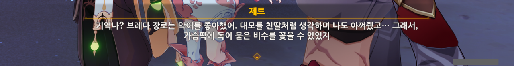

브레다 장로는 바벨을 친딸처럼 생각하며 바벨과 제트를 아꼈지만, 제트에 의해 가슴팍에 독이 묻은 비수를 맞고 죽었다.

과파 장로는 제트에 의해 동물 짐꾼의 턱뼈로 맞아 죽었다.

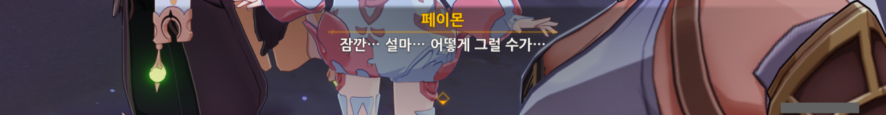

그 일을 왜 부족민 앞에서 꺼내냐며 질색하는 바벨.

왜? 자신의 추악한 과거가 부족민에게 만천하에 드러나니 두려운가?

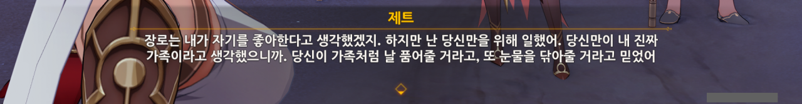

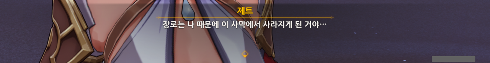

테야 장로는 바벨보다 더 뛰어난 사람이었지만, 바벨은 자신이 권력을 잡기 위해 제트로 하여금 테야 장로를 죽이도록 했다.

모욕은 무슨, 지나가던 개가 웃겠다. 사실을 그대로 말하는 건 전혀 모욕이 아니에요.

바벨의 명예는 물론 훼손되겠지만, 그 명예가 과연 지킬만한 가치가 있는 걸까? 고작 찬탈자인데 말이다.

드디어 제트가 타니트를 완전히 버리기로 결심했다.

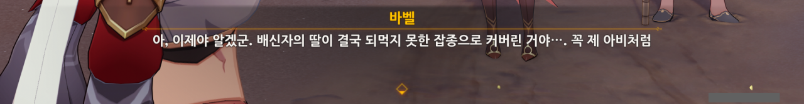

음, 바벨의 최후가 벌써부터 눈에 선하다.

부모를 잃었고, 잔뜩 화가 난 사람 앞에서 그 사람의 부모를 욕하는 건, '나는 아주 잔혹하게 난도질 당해 죽고 싶어 환장했습니다'라고 만천하에 공표하는 꼴인데.

조만간 바벨 고기가 흩날리는 걸 볼 수 있겠다.

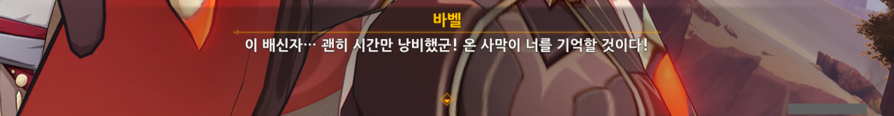

여기도 꼴에 수메르라고, '사막이 기억할 것이다'라고 말하네. 네가 그런 말을 하는 것 자체가 아란나라에 대한 모욕이다.

게다가 이렇게 저 좋을 것만 기억하는 사막이라면, 없어져도 괜찮다고 생각해.

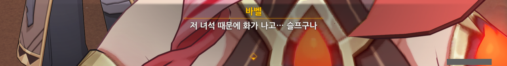

> 저 녀석 때문에 화가 나고... 슬프구나.

ㅋㅋㅋㅋㅋㅋ 말은 저렇게 하지만 분명 속으로는 자신의 흑역사가 들춰져 부들대고 있을 게 뻔하다.

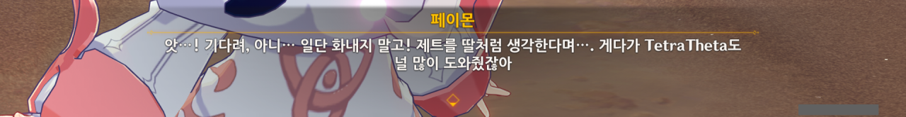

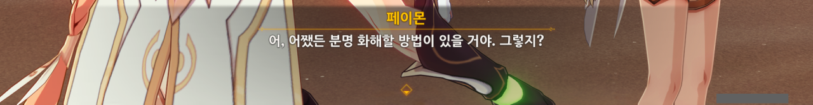

아직도 상황 파악을 못한 페이몬이 '아직 화해할 방법이 있을 것이다'라고 하지만, 내가 볼 때 둘 다 이미 돌아올 수 없는 강을 건넜다.

제트가 저렇게 바벨의 치부를 부족민 앞에서 드러냈다는 건, '오늘 너 죽고 나 살자'라는 뜻이라고.

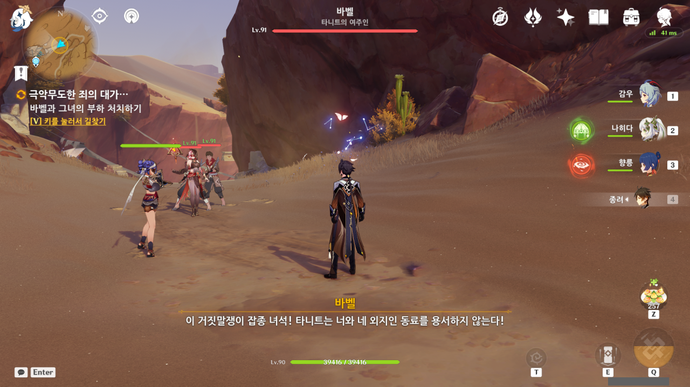

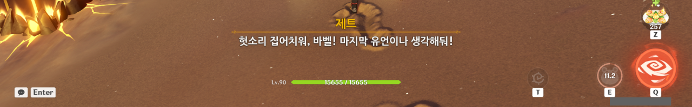

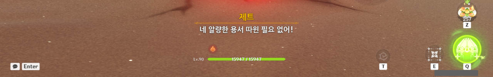

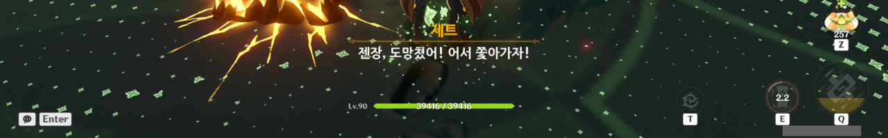

자신이 전형적인 악당이란 걸 증명이라도 하듯, 바벨은 꼬리를 자르고 타니트 부족 안으로 도망쳤다. 어휴, 추하다 추해...

어차피 멀리 도망가지도 못하고 죽을 텐데, 그냥 빨리 끝내지 그러냐.

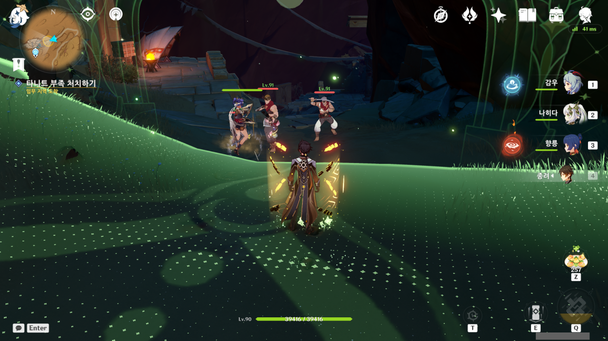

타니트 부족 전체가 달려 나온 것 같다.

뭐, 상관없다. 바벨이 부족원을 고기방패로 쓰며 발악할수록, 타니트 부족이 세상에서 지워져 가는 것일 테니 말이다.

그렇게 탐내던 부족이 자신의 눈앞에서 빠르게 스러져가는 모습을 보여주는 것도 좋다.

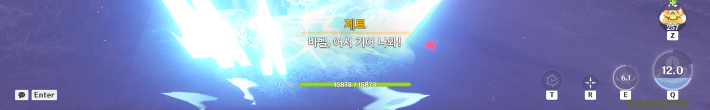

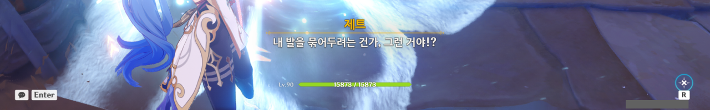

제트, 그건 개를 모욕하는 발언이야.

개는 절대로 제 주인을 배신하지 않거든.

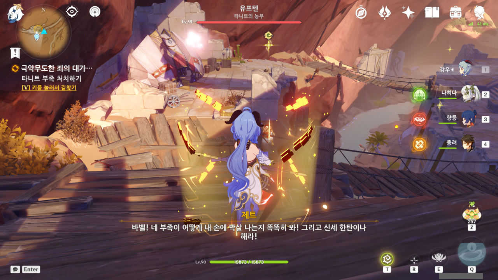

유프텐이 등장했다. 호칭이 '타니트의 농부'인데, 농사를 지을 수 없는 사막에 농부라니, 분명 사막식 은어일 것이다.

저번에 암살자가 죽은 걸 갖고 '비료가 써졌다'라고 한 걸 보면, 사막식 은어인 게 확실하지.

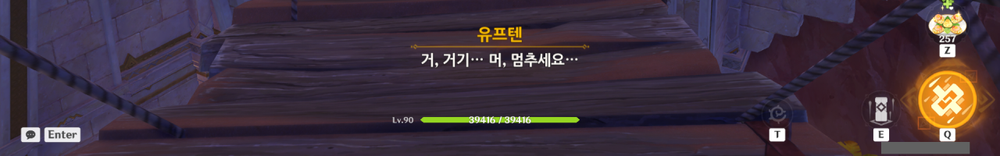

여전히 말을 더듬으며 유프텐이 덤비지만 얼마 버티지도 못하고 잘게 다진 육편이 되었다.

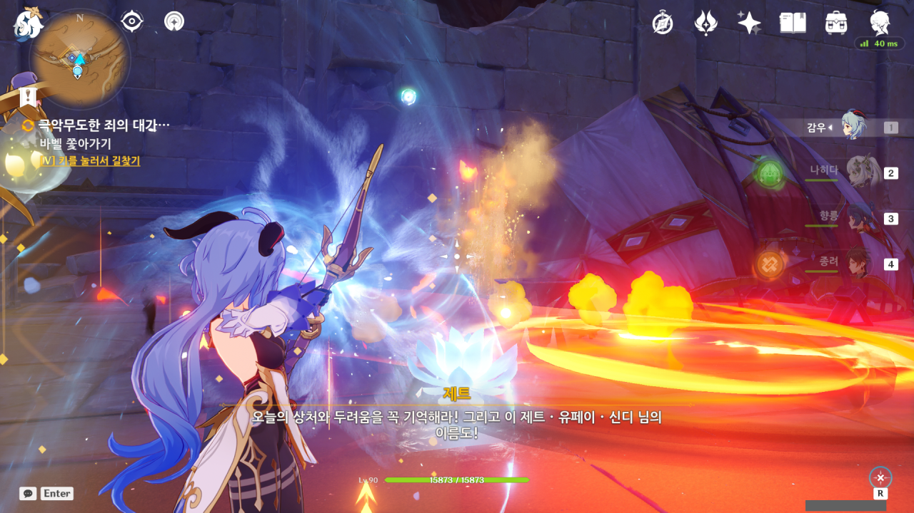

어차피 다 죽일 건데 기억하고 말고 가 필요해? 그냥 다 죽이면 끝나는 건데, 뭘...

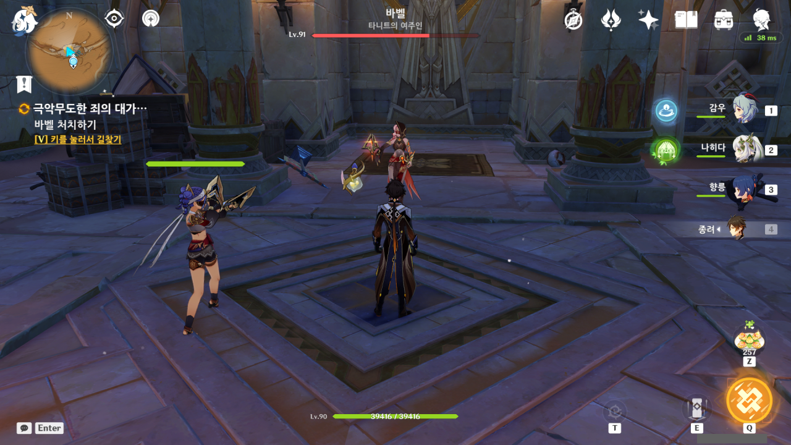

드디어 바벨을 찾았다. 항상 있던 그곳에서 진을 치고 있었다.

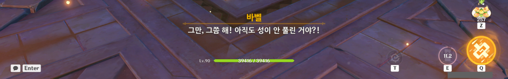

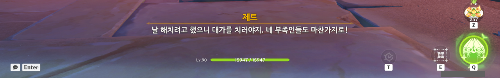

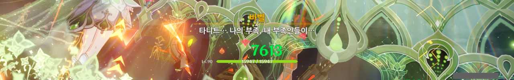

그래! 바로 이런 걸 원했어! 자신이 *일궈놓은* 모든 게 산산이 부스러져가는 걸 보고 절망하는 그 표정을 원했다고!

복수를 할 때에는 무덤을 두 개 파두라는 말이 있는데, 배신 역시 마찬가지이다.

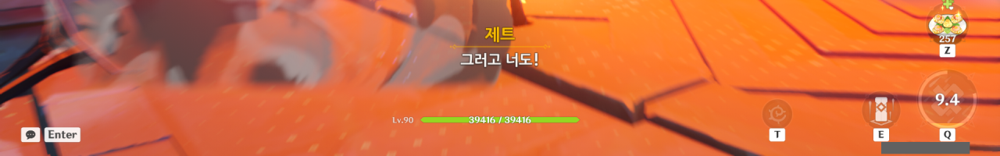

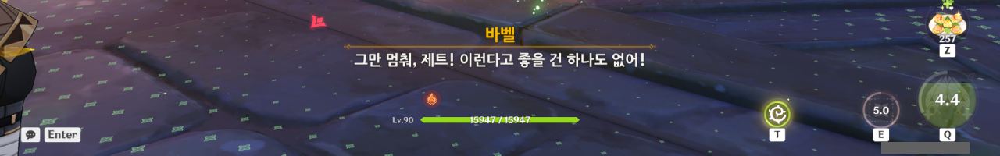

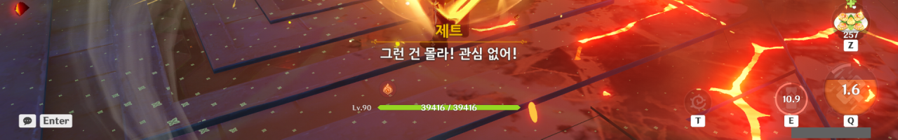

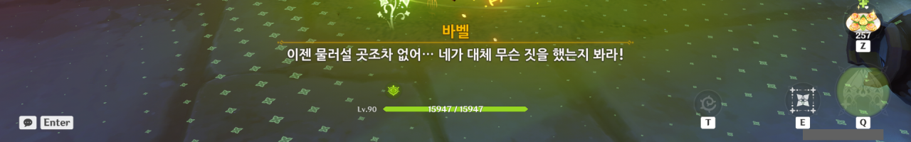

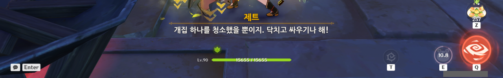

개집 ㅋㅋㅋㅋㅋㅋ

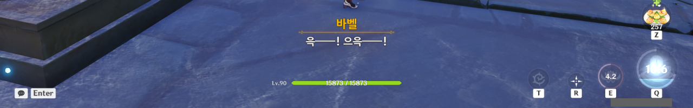

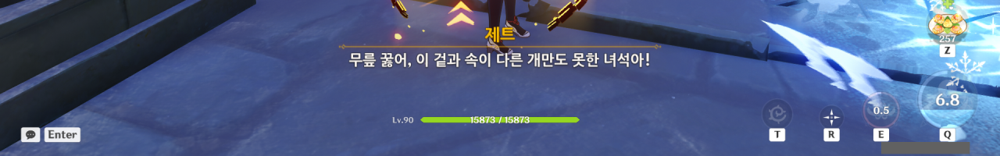

결국 바벨이 쓰러졌다.

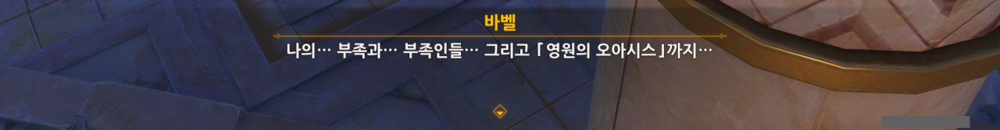

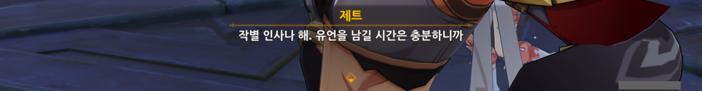

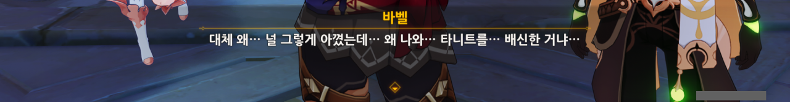

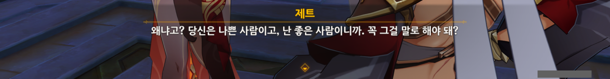

응? 그렇게 말하면 아무도 이해 못 하지 않을까?

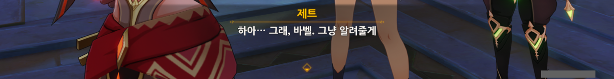

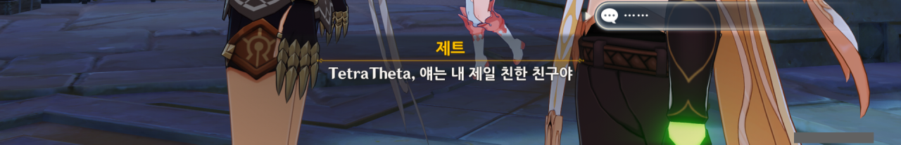

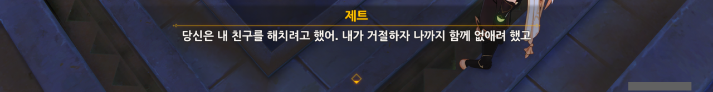

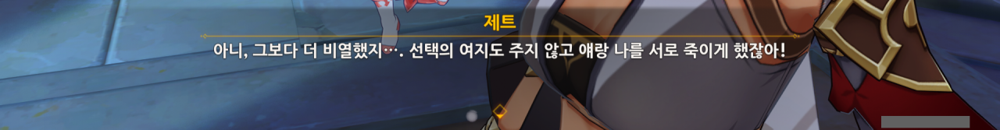

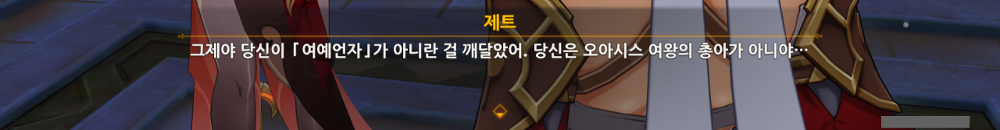

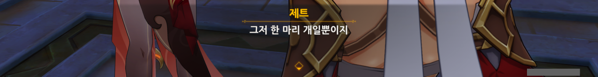

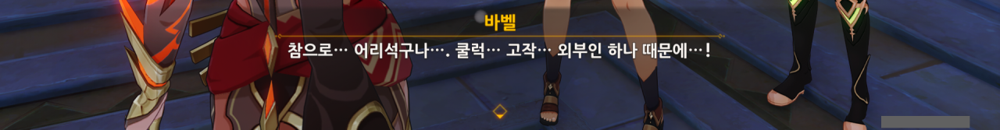

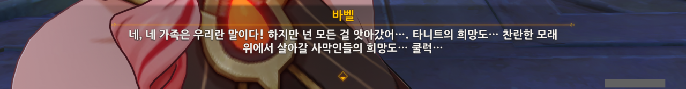

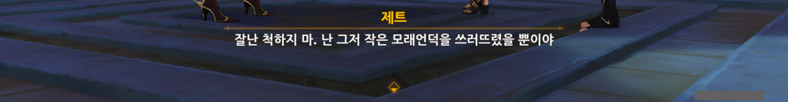

끝까지 자기가 옳다고 말하는 바벨을 보니, '비비안 콘리'가 생각난다.

디비전 2: 뉴욕의 지배자에 등장하는 로그 요원인데, 그녀를 두고 폴 로즈가 '자기 논리에 매몰된 꼴 하고는'이라며 까대는 대사가 임무 중간에 나온다.

바벨 역시 마찬가지이다. 자신이 사막의 지도자가 될 것이라는 망상에 빠져, 자신이 죽으면 사막의 미래 역시 사라질 것이라고 말하는 바벨.

하지만 역설적이게도, 바벨이 없어져야만 사막의 미래가 더 밝아질 수 있다.

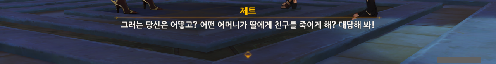

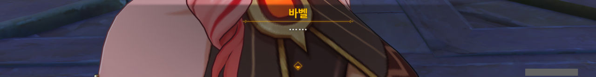

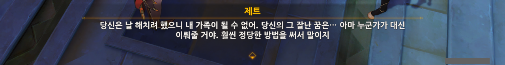

바벨이 말했던 '사막의 독립'까지는 무리여도, 이미 나히다가 아카데미아 학자들을 사막에 파견하고 있으니 사막의 미래는 결코 어둡지 않다.

오히려 바벨이 없어졌기에 사막 부족민들은 제대로 된 아카데미아의 교육을 받을 수 있겠지.

게다가 사막이 독립해서 뭘 하겠는가? 사막에 석유라도 나오면 모를까, 농사는 전혀 지을 수 없는 땅이 독립해 봤자 아무 소용없는 것이다.

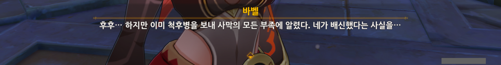

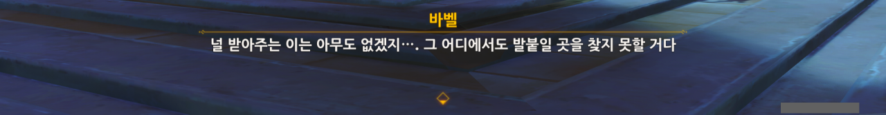

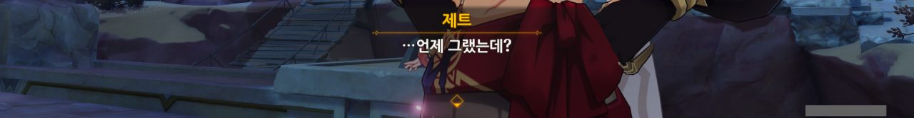

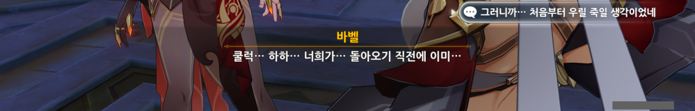

제트에게는 '돌아오면 용서해 주마'라고 지껄였지만, 이미 바벨은 사막의 여러 부족에게 제트가 타니트 부족의 배신자라며 척후병을 보냈다.

하... 더 이상 들어줄 가치를 못 느끼겠는데.

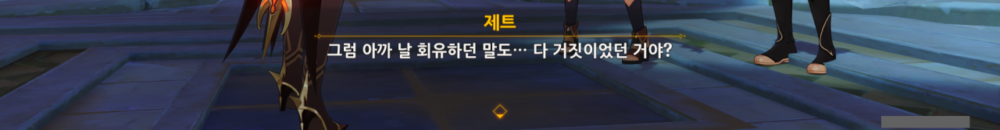

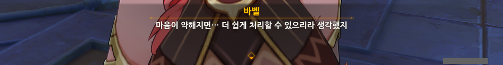

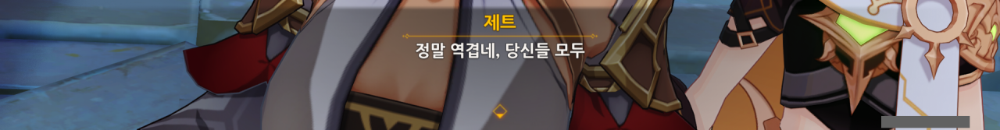

바벨 역시 아자릭처럼 쓱-싹 되었다. 바벨이 잘게 다져진 육편이 되지 않은 게 아쉽네.

***

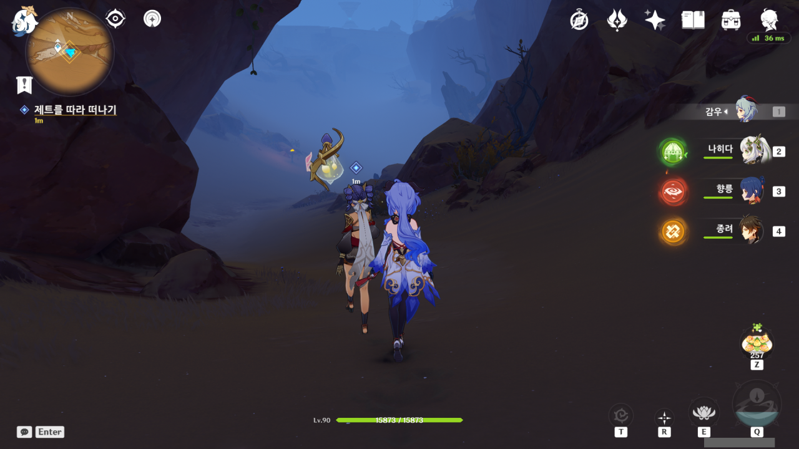

그나마 집이라고 부를 수 있었던 타니트 부족마저 사라진 상황. 갈 곳이 없어진 제트와 함께 협곡을 정처 없이 걷는다.

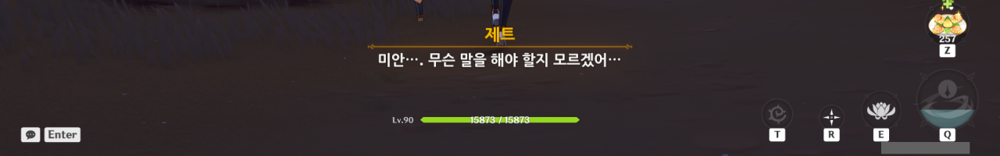

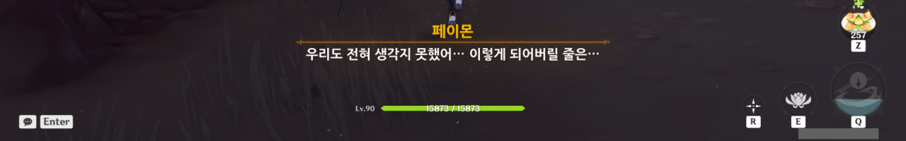

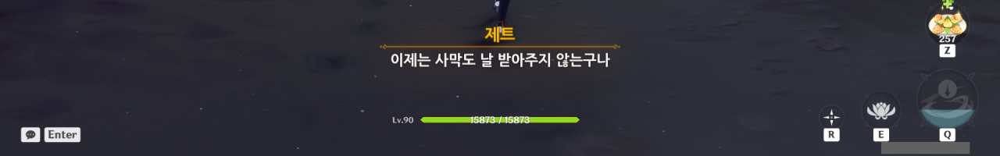

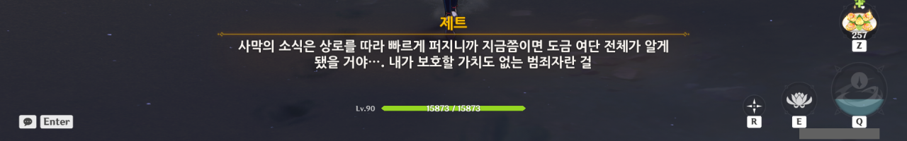

여러 사막 부족에게 여태껏 무슨 일이 있었는지 알려 제트의 누명을 벗길 수 있으면 좋겠지만, 여태 보아왔던 사막 부족의 폐쇄성을 생각해 볼 때, 그들은 진실을 들어도 전혀 믿지 않고 여전히 제트를 사막의 배신자라고 생각할 가능성이 높다.

그들 눈에는 이제 제트가 *한낱 친구* 때문에 부족 전체를 몰살시킨 천인공노할 배신자로만 보이겠지.

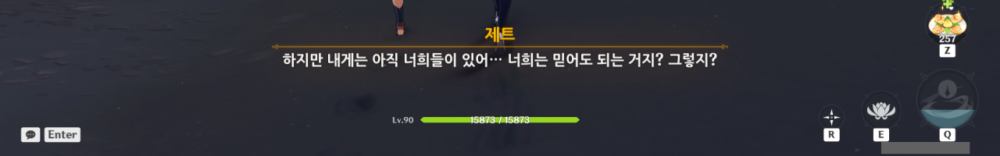

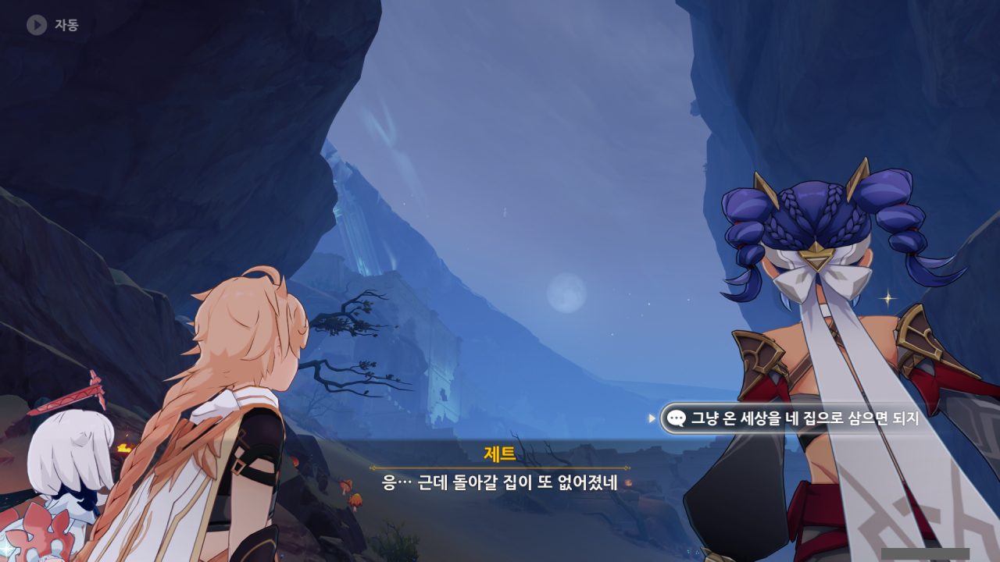

그래. 꼭 사막에서 살라는 법은 없다.

사막을 떠나 수메르 성에서 살아도 좋고, 수메르를 떠나 다른 나라로 가도 좋다.

이 세상 어딘가에는 제트가 행복하게 살 수 있는 곳이 하나 정도는 있을 테니까.

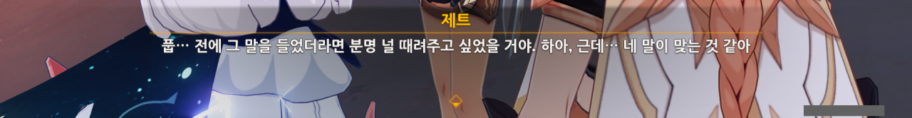

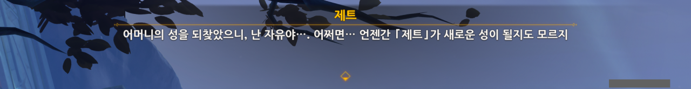

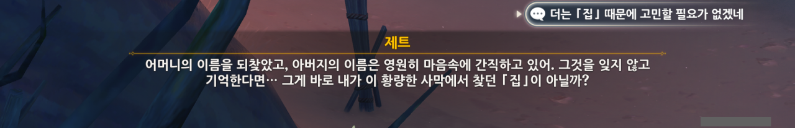

'황금빛 꿈'에서부터 '빌키스의 애가'를 넘어 '파도처럼 들이닥친 원수'까지, 어쩌면 이 긴 이야기는 제트가 자신의 진정한 「집」을 찾는 여정을 그린 것일지도 모른다.

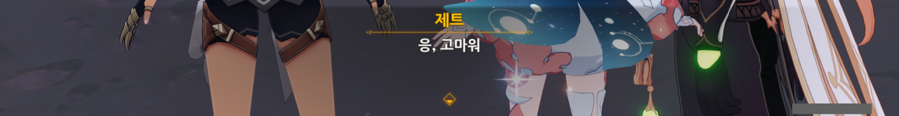

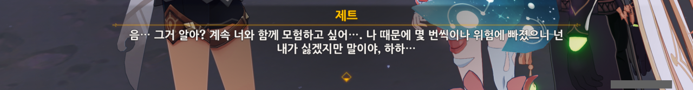

제트는 여행자와 함께 가고 싶지만, 여행자는 자신과는 다른 길을 가야 하는 사람임을 깨닫고 여행자와 이만 헤어지려 한다.

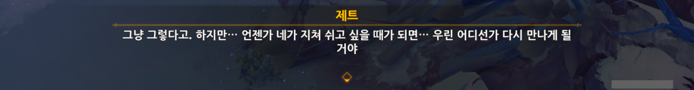

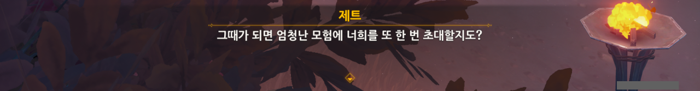

여행자와 헤어져 자신만의 길로 떠나는 제트. 그래도 제트의 곁에는 붐붐이 있으니, 그리 외롭지 않은 여정일 것이다.

처음부터 끝까지, 사막에서 있었던 월드 임무는 그 끝이 달콤한 적이 단 한 번도 없었다.

황금빛 꿈 임무에서는 제트의 아버지인 제브라엘이 죽는 것으로 끝났고, 빌키스의 애가 임무에서는 제트가 가족처럼 생각했던 아자릭이 배신하고 죽임 당했으며, 마지막에는 어머니처럼 따랐던 바벨과 사막 부족 전체가 제트를 배신했다.

&nbsp;

사막 민족이 이렇게 과거의 영광에 집착하는 한, 그들의 이야기는 언제나 이렇게 씁쓸한 결말만을 맞을 것 같다는 생각이 든다.
