이번 '장난감 전쟁!' 이벤트를 계속 진행하기 위해선 반드시 이 '물빛 파도 자국' 월드 임무를 진행해야 한다.

월드 임무는 가능한 한 아껴 먹고 싶었는데, 어쩔 수 없네...

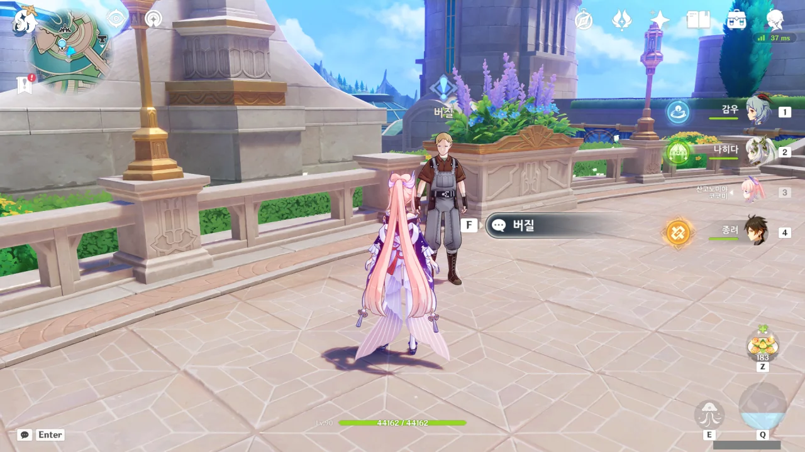

폰타인성 신상을 찍었을 때 발견한, '버질'이라는 NPC에게 말을 걸면 '물빛 파도 자국' 월드 임무를 시작할 수 있다.

아, 이래서 얘한테 '수락 대기'라는 표시가 뜬 거였어?



이 사람, 보자마자 사람 낯간지럽게 하는 말을 태연하게 쏟아낸다.

저번에 루키나 분수 앞에서 본 부부도 닭살 돋는 말을 잘하던데, 폰타인 사람들은 다 그런가?

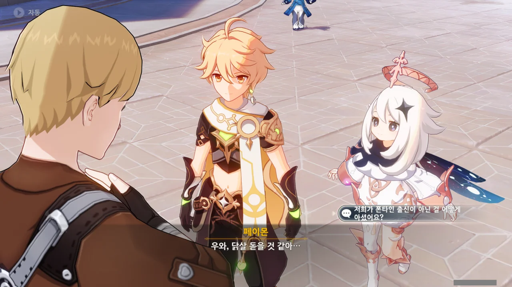

그런데 버질은 여행자 일행이 폰타인 출신이 아닌 걸 어떻게 안 걸까? 복장...? 그럴 지도...



> 흥, 딱 봐도 촌...

애써 "촌각을 다투는 동안 알아보았다"라고 말을 돌리지만, 이미 그가 무슨 말을 하려 했는지 다 눈치챘다.

딱 봐도 촌놈이라고 하려 했던 것 같은데... 일단 메모.

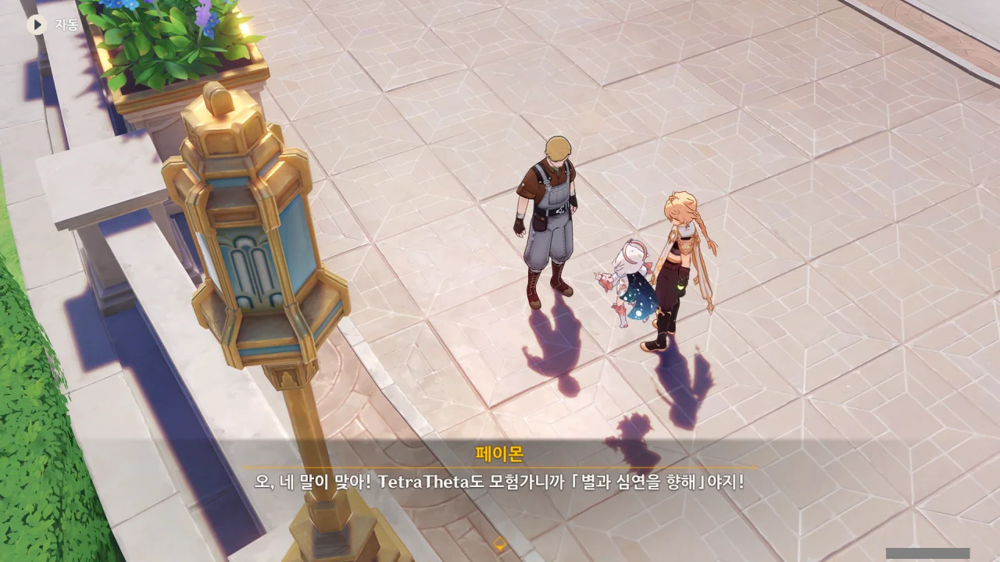

버질의 공갈빵 같은 말을 페이몬은 좋다고 주워 삼킨다.

어차피 여기서 '너, 방금 촌놈이라고 하려 했지?'라고 따져 봤자 시치미를 뗄 것이 분명하니, 지금은 그냥 넘어가는 게 좋다.



> 모험가 길드 녀석들은 모두 거지...

뭐지? 일부러 말실수인 척 사람 신경을 긁는 게 목적인 건가?

버질은 이번에도 역시 "거짓말처럼 세상의 모든 비밀을 밝히려는 뜻을 가진 용사"라며 말을 돌린다.

버질의 속이 너무 잘 보이는데, 잘하면 버질이 오늘 점심에 뭘 먹었는지조차 볼 수 있을 것 같다.



버질이 말하는 본새를 보니, 흔히 말하는 '국뽕'의 냄새가 솔솔 풍긴다. 아까 버질이 말하려던 '촌놈'이라는 단어와 조합하면 더더욱 말이다.

다른 나라에 비해 폰타인은 기계 공학이 매우 발달한 것으로 보이니, 이런 생각을 가진 사람이 나오는 것도 큰 무리는 아닐 것이다. 그걸 좋게 받아들일 수 있느냐는 또 다른 문제지만.

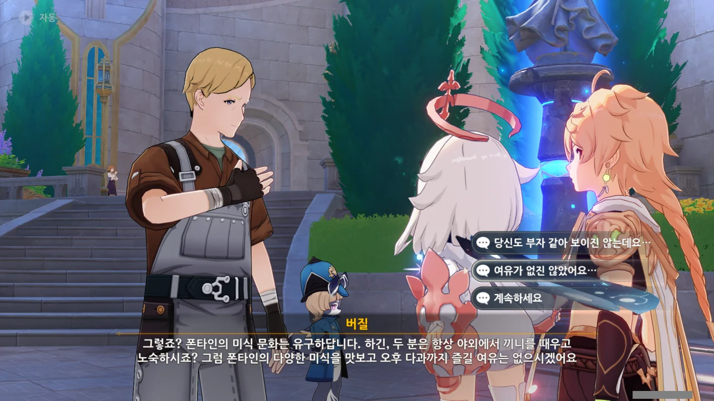

모험가는 항상 야외에서 끼니를 때우고 노숙을 한다는, 마치 오리엔탈리즘을 연상케 하는 고정관념을 지닌 버질.

저번에 만났던 아르본과 알베르는 조금 싫은 부분이 있긴 했어도 전반적으로 호감이 가는 인물들이었는데, 그와 정반대로 이 버질이란 사람은 호감이 가는 부분이 단 하나도 없다. 그나마 장점을 꼽자면, 저 매끄럽게 굴러가는 혓바닥 정도일까?



버질이 갑자기 「십자 은방울꽃의 보물」의 전설에 대해 이야기한다.

저번에 폰타인 성 근처의 물 밑에서 만난 물의 정령 '안'이 「수선화 십자 모험단」 소속이라고 했던 것 같은데... 둘이 무슨 연관이 있는 걸까?



「십자 은방울꽃의 보물」은 폰타인에서 수백 년 동안 전해 내려온 전설이라고 한다.

아주 오래전 사회 각지의 유명 인사들과 주요 인물들이 「십자 은방울꽃 학회」라는 비밀 결사를 만들고 국가 전복을 위한 음모를 꾸몄다고 한다. 음모가 발각되자 학회 회원들은 법률 집행청과 격전을 벌였고, 패배했다.





버질은 「십자 은방울꽃 학회」가 폰타인을 전복시키려 했던 세력인 만큼, 분명 한 나라에 필적할만한 부를 쌓았을 거라 생각하고, 거기에 눈독을 들이고 있다.

그런데 생트가 뭐지? 생트를 장악한다는 말로 봐선 '생트'는 어떤 조직의 이름인 것 같은데...

아무튼, 버질은 뭔가 뒷꿍꿍이가 있다.



버질은 「십자 은방울꽃 학회」가 성 밖 물 밑 폐허에 있는 걸 알아냈다며, 같이 보물을 찾자고 제안한다.

&nbsp;

아, 이건 100% 함정이다.

막대한 양의 보물이 숨겨진 곳의 위치를 알게 되었는데, 왜 거기에 혼자 가서 보물을 독차지할 생각을 하지 않고, 굳이 다른 사람과 함께 가서 자신의 몫을 줄이는 행동을 하는 걸까?

물론, 버질의 힘이 약해 보물이 있는 곳까지 혼자만의 힘으로 갈 수 없어 협력자를 구하는 것일 수도 있다. 하지만 그렇다고 해도 협력의 대상은 자신이 약점을 쥐고 있거나 확실히 믿을 수 있는 사람으로 하는 게 당연한 것 아닌가? 오늘 처음 만난 여행자에게 같이 보물을 찾자고 제안하는 건 너무 이상하다.

내 장담컨대, 저 밑에는 보물 대신 뭔가 구질구질한 것이 있을 것이다.



물에 빠졌다가 여행자에게 구해진 이후, 페이몬은 물 공포증 같은 것이 생긴 모양이다.

괜찮아. 너, 이미 안과 만났을 때, 물속에서 아무렇지도 않게 대화했잖아?





여행자의 잠수복도 준비하려는 버질을 말린다. 여행자는 잠수복이 없어도 물속에서 자유로이 헤엄칠 수 있으니까.

물론, 신의 눈이 없는 버질은 얌전히 잠수복을 입어야 한다.



기다릴 게 뭐가 있겠는가. 지금 바로 출발하자.



버질이 입은 잠수복은 건식 잠수복인데, 몸이 물에 젖어 체온을 빼앗기는 걸 완전히 차단하는 잠수복이다. 이런 잠수복은 주로 깊은 물속으로 잠수할 때 쓴다.

다만 폰타인의 수온은 그리 낮지 않은 건지, 잠수복 안에 열이 지나치게 쌓이는 걸 막기 위해 천으로 싼 서리꽃을 넣는 모양이다.

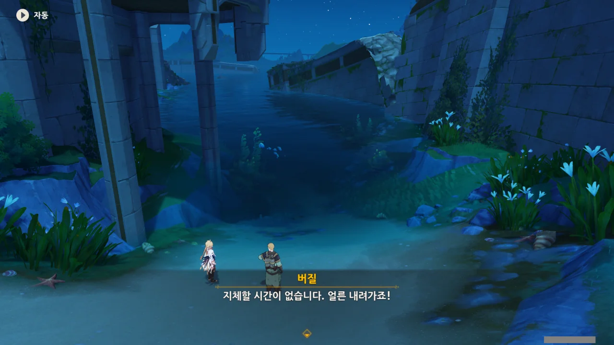

그래, 얼른 내려가자. 얼른 내려가야 버질이 어떻게 배신할지 볼 수 있지 않겠는가.



여행자가 잠수복을 입는 일은 아마 앞으로도 없지 않을까? 엄청난 깊이의 심해로 들어가는 게 아니라면 말이다.

버질이 찾는 건 학회가 남긴 자료나 단서인 것 같다. 그게 그가 진짜로 원하는 건진 잘 모르겠지만.

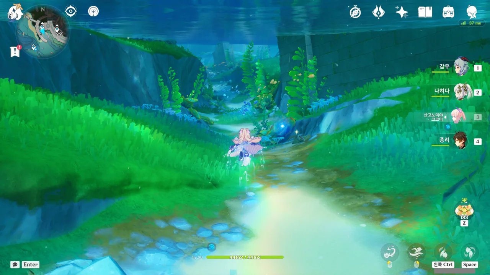



물에 잠긴 상자 속에서 학회 자료로 보이는 뭔가를 발견했다.





물에 오랫동안 잠겨있던 탓인지, 상자 안에 있던 자료는 전부 물에 젖어 흐물흐물해졌다. 물 먹은 물건도 나름 가치가 있다고 버질이 말하지만, 아무리 봐도 새빨간 거짓말로밖에 보이지 않는다.

그나저나 그 '친애하는'은 좀 그만두면 안 될까?



마지막 상자는 아예 아무것도 나오지 않았다. 하지만 그 앞에 아래로 내려가는 길이 놓여 있다.

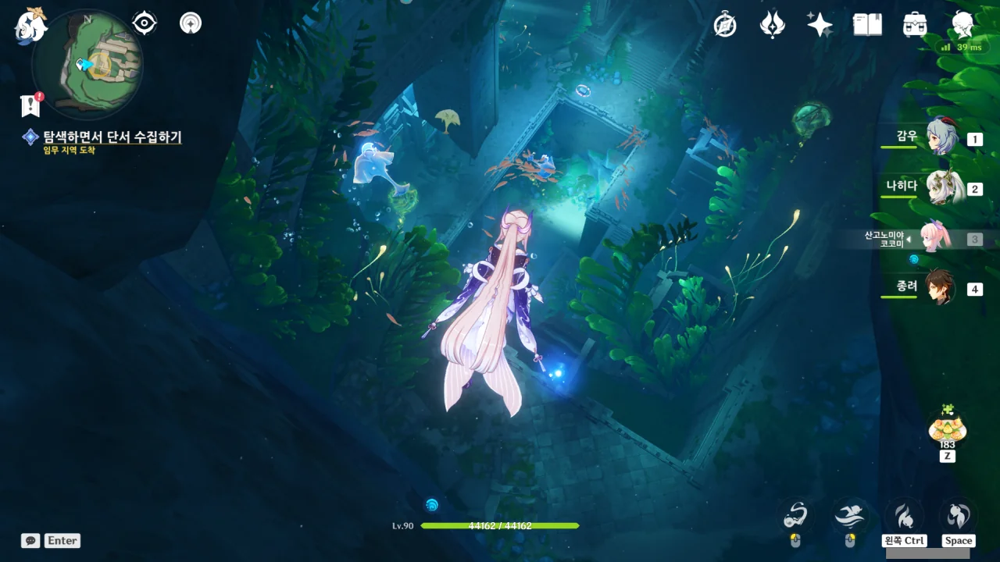

어? 여기 거기 아냐?

폰타인의 지도를 밝히기 위해 폰타인 이곳저곳을 돌아다닐 때, 여길 발견 했었다. 이걸 보고 '현재 폰타인성은 수몰된 구 폰타인성 위에 지어진 게 아닐까?'하고 추측했었는데.





놀랍게도 여기가 바로 「십자 은방울꽃 학회」의 유적지라고 한다.

페이몬이 「그걸」 한번 써보자고 하는데... 그게 뭐지?



아, 이거? 푸른색 수생 생물 가까이서 좌클릭을 하면 해당 수생 생물의 능력을 흡수할 수 있는데, 이걸 말하는 거였다.

이색 칼날 가오리의 능력은 원류바다 물의 칼날이다. 무언가를 끊을 수 있지.



이런 식으로 수초 가운데에 동그랗게 빛나는 뭔가를 물의 칼날로 끊으면 수초에 감싸여있던 상자의 봉인이 풀린다.

그런데 버질, "열쇠가 여기 있었군요"라니? 그게 대체 무슨 소리니?





예전에 동료와 함께 여기 왔을 때, 열쇠를 찾지 못해 문 앞에서 되돌아가야 했다고 버질이 말한다. 그 동료는 지금 어쩌고?

그 동료 역시 버질과 마찬가지로 신의 눈이 없어 문을 뚫지 못했을 거라 생각할 수도 있지만, 의심이 가는 건 어쩔 수 없다.

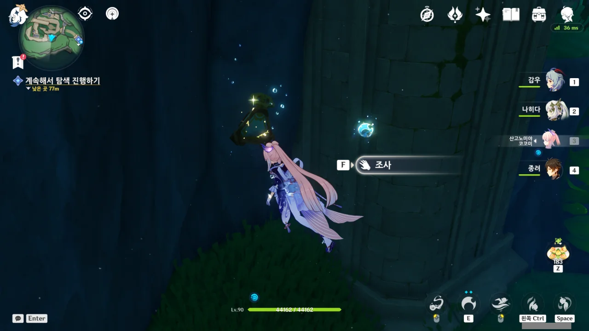

이게 뭔가 했는데, 그냥 폰타인 버전 돌무덤이었다. 열면 모라가 나오지.



이렇게 길을 막고 있는 수초는 물의 칼날로 슥삭 그어주면 길이 열린다.



길을 막고 있는 바위는 이색 중갑 게의 능력인 충격파 발동으로 부술 수 있다.



아까 상자에서 얻은 열쇠로 문을 연다.

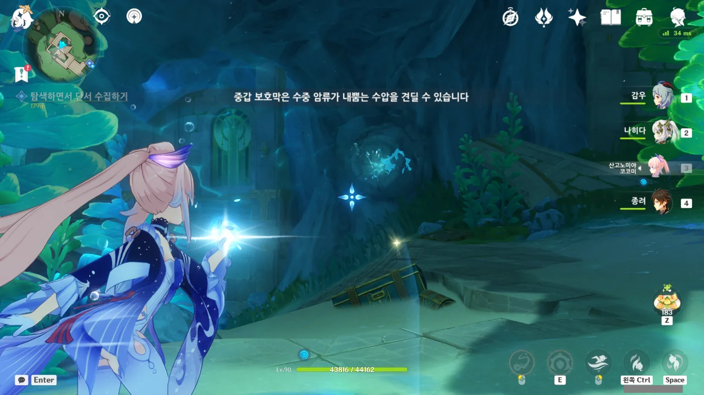

중갑 보호막을 두르면 수중 암류에 저항할 수 있다고 한다. 보호막과 암류 저항에 무슨 상관이 있는 건진 잘 모르겠지만...

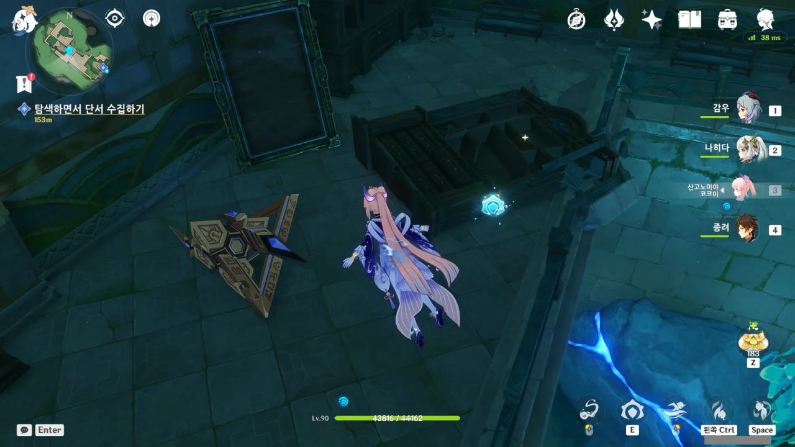

응? 이거 태고의 구조체잖아. 수메르 사막에 있어야 할 게 왜 여기에 있는 거지?

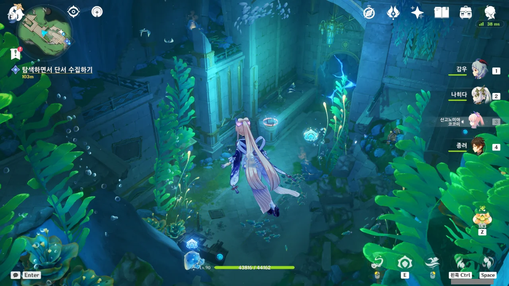

음, 또 다른 퍼즐이다.

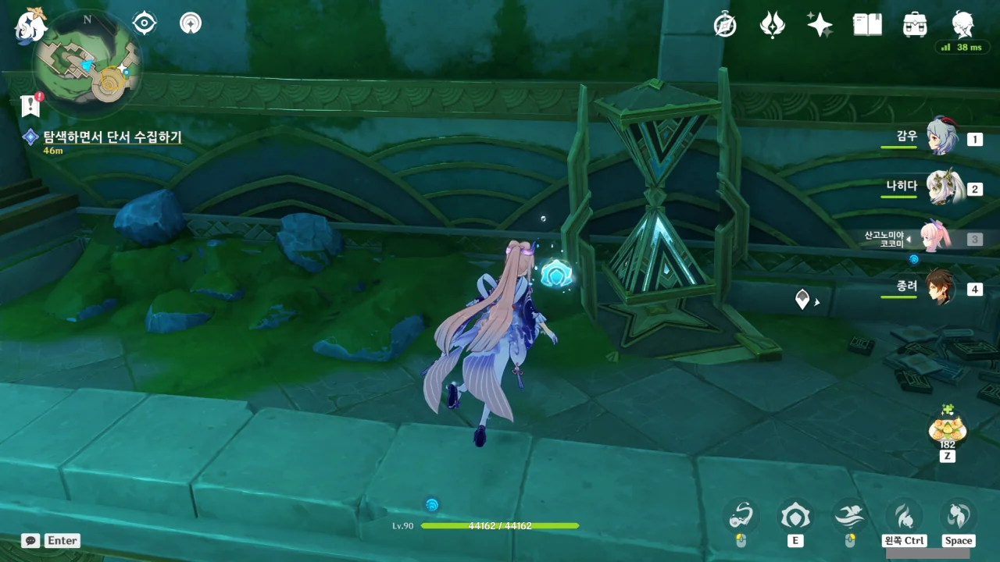

이 모래시계도 원래 수메르 사막 유적에 있던 건데...

공교롭게도 모래시계가 양쪽에 하나씩 있던 탓에, 순간적으로 '사막 모래시계 기믹을 물속에서 해야 하나?'라고 생각했다. 모래시계가 작동하지 않는 단순 오브젝트임을 알고 안도의 한숨을 내쉬었다.

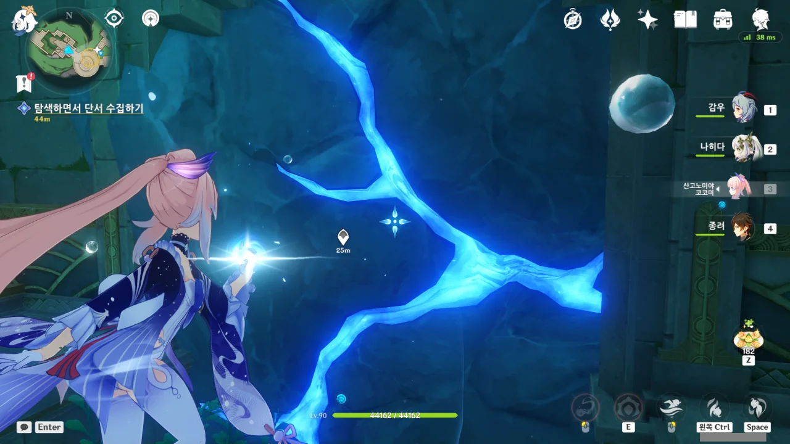

응? 이 밑에도 워프 포인트가 있다고?



알아차리는 게 너무 늦어, 페이몬.

카메라까지 여럿 가져다 둔 걸 보면, 꽤 진지하게 수메르 물건을 연구한 것 같다.

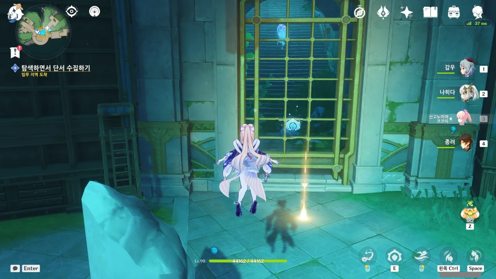

윽, 문이 잠겨있다.



올라가서? 이 위에도 길이 있나?



진짜로 있었네.







굉장히 긴 일지를 발견했다.

일지의 주인은 평소 몸이 허약했으며, '알랭'이라는 천재 소년의 조수이다. 그와 알랭, 르네, 야코브는 모두 '수선화 십자원' 출신이며, 알랭에게는 '안'이라는 이름의 여동생이 있다.

알랭과 르네는 서로 말이 잘 통하는 천재였으며, 나머지 역시 범상치 않은 재능을 가졌던 것 같다.





이 일지는 알랭이 쓴 것으로 보이는데, 자신의 조수 --- 첫 번째 일지의 주인 --- 를 대놓고 '못 미덥다'라고 말한다. '극복해야 할 난관'이라고 생각하기로 했다고 하는데, 너무한 거 아냐?

알랭은 원래 여기서 연구를 하고 있었지만, 운동학 실험 때문에 더 넓은 실험실을 필요로 하게 되었다. 하지만 조수가 새 실험실을 찾지 못할 걸 염려하여 몇 번이고 실험실 이전을 보류하다가 새로운 실험실로 옮겨갔다고 한다. 처음 조수를 '극복해야 할 난관' 취급한 걸 생각하면, 시간이 지나며 조수와 꽤 정이 든 모양이다.

앞으로 알랭과 그의 조수의 일지를 더 발견할 수 있을 것 같다.





지금까지 발견한 것으로만 생각하면, 「십자 은방울꽃 학회」, 아니 「십자 은방울꽃 학원」은 그냥 평범한 학원으로만 보인다. 폰타인을 전복하려 했던 학회 --- 혹은 학원 --- 라고 도저히 생각할 수 없다.

> 많은 지식을 장악한 것은 강한 힘을 장악한 것과 마찬가지라는 사실을 아셔야 합니다.
> 막강한 힘을 장악한 사람에게 남은 길은 단 하나뿐입니다.

이건 좀 많이 억지 같은데. 많은 지식을 알고 있다는 건 분명 큰 힘이 맞지만, 그게 꼭 국가 전복으로 흘러가진 않거든.

국가를 전복한다는 건 그리 쉬운 일이 아니다. 단신으로 두린 정도 되는 힘을 갖고 있거나, 군대라고 부를 수 있을 정도의 전투원을 확보해야 하거든. 단순한 지식만으론 절대로 불가능하다.



버질은 여기 곳곳에 수메르 물건이 놓여있는 이유가 학회 회원들이 그들의 막대한 재력으로 수메르에서 공수해 왔기 때문이라 추정한다.

뭐, 돈만 많다면야 불가능한 일은 아닐 것이다. '돈으로 행복을 살 수 없다면 당신은 돈이 부족한 것입니다'라는 말도 있지 않은가.



버질이 갑자기 "그럼 보물도 많이 찾으셨겠네요?"라고 묻는다.

이거, 말하는 걸 보면, 나중에 여행자를 죽이고 여행자가 찾은 보물을 독차지하려 할 것 같은데... 뭔가 찝찝해서 "그냥 여행 경비를 충당할 정도는 돼요"라고 대답했다. 오히려 이게 더 잘못된 선택 같긴 하지만...



이미 과거에 폰타인의 수위가 상승한 적이 있었고, 폰타인 과학원 역시 앞으로 폰타인의 수위가 계속 상승할 것이며, 심지어 폰타인 전체가 물에 잠길 수도 있다고 예측하고 있다.

마신 임무에서 들었던 예언이 완전 헛소리는 아니었던 셈이네.





> 미래를 보기 전에 난 먼저 죽고 없을 테니, 미래를 신경 쓸 필요가 없다.
> 부모 형제를 추모하는 건 그들이 내게 베푼 은혜와, 나의 혈족이라는 것 때문이다.

이걸 극단적인 개인주의라고 해야 할까? 여기서 갑자기 급발진을 하는 걸 보면, 가족을 포함한 주변 사람들과 그리 사이가 좋지 않았던 것 같다.



일단 흩어져 문을 열 방법을 찾아보기로 했다.



버질은 여기가 「자연철학 학원」이라며, 허탕을 친 것 같다고 혼잣말을 한다. 그러니까 여기가 「십자 은방울꽃 학회」가 아니란 거지?

버질이 처리하려는 '소니 일당'이 누구인진 잘 모르겠지만, 앞서 버질이 흘린 '생트'와 분명 연관이 있을 것이다.

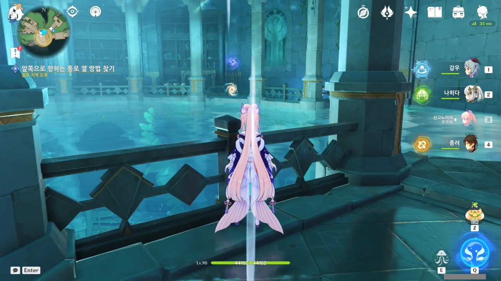

아깐 저런 게 없었던 것 같은데.



보라색 우시아 에너지 덩어리와 노란색 프뉴마 에너지 덩어리가 보인다.





프뉴마 에너지 덩어리를 보라색 장치에 넣으면 장치의 잠금이 해제된다. 그리고 그걸 반대로 한번 더 하면 이렇게 잠금장치를 해제할 수 있다.



버질은 말이 헛나와 '학회'를 '학원'이라 말했다고 한다. 아까 버질의 혼잣말을 듣지 않았다면 '정말 그런가?' 하고 넘어갔을지도 모르겠다.





버질은 다른 악당들 역시 「십자 은방울꽃 학회」의 보물을 노리고 있고, 버질이 그들과의 협력을 거절하자, 버질을 노리고 있다고 말한다. 아무래도 거짓말 같다.

아무리 생각해도 버질의 말은 마치 사이비가 포교할 때 '주변에 연락을 자주 하는 사람이 있습니까?'라던가 '연락이 갑자기 끊기면 당신을 찾을 사람이 있습니까?'라고 묻는 것처럼 보인다. 보통 그런 걸 묻는 건 '우린 당신을 납치한 후, 감금세뇌할 것입니다'라고 말하는 것이거든.

물론 지금 경우에는 여행자가 다른 사람에게 이 일에 대해 말하지 않았다는 걸 확인하고, 여행자를 안전하게 *처리*할 요량으로 물어본 거겠지만.





글쎄. 두고 보면 알겠지.







처음엔 분명 물먹은 물건도 가치가 있다고 하더니, 이젠 필요가 없다고 한다. 처음 물먹은 물건을 모은 이유도 그저 보물을 모으는 척하기 위해서였던 거 아냐?

상황이 바뀌었다니, 길 가던 개도 안 믿을 소리를 하고 자빠졌네.
