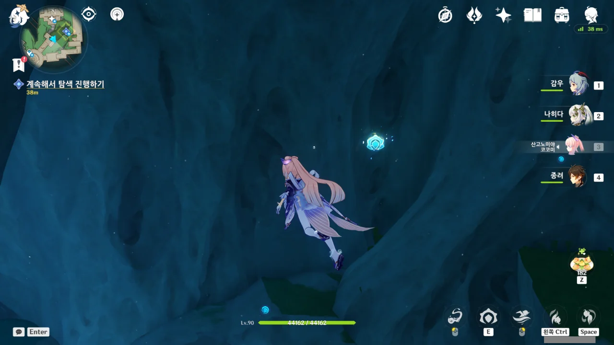

여기 있는 돌은 생긴 게 돌이 아니라 무슨 길게 늘어져 섬유화 된 근육과 힘줄처럼 생겼다. 뭔가 더 적합한 표현이 있을 것 같지만, 아무튼 절대 그냥 돌로 보이지 않는다.

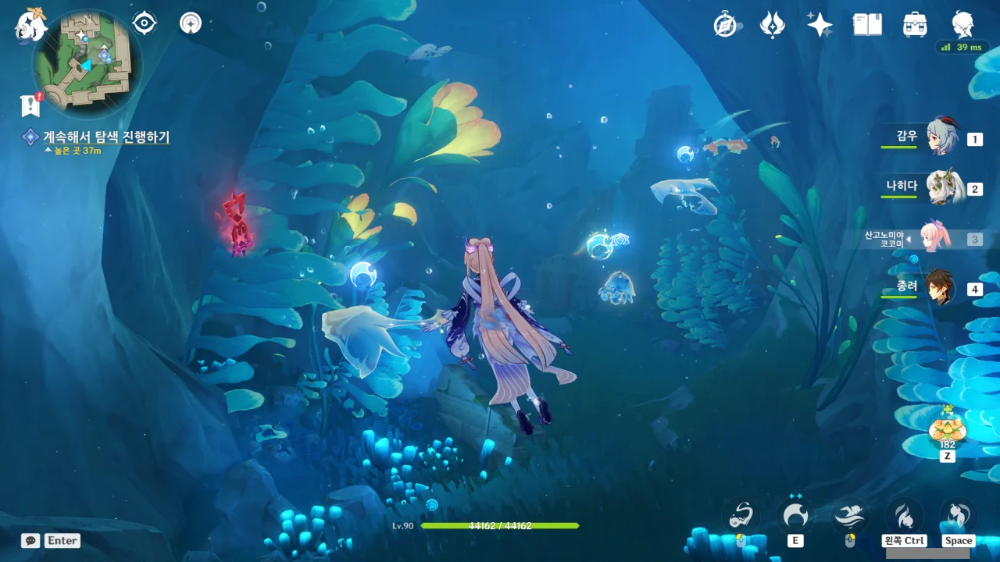

이 타임어택 도전 중에 과연 NPC 대사가 나올까? 저번 '여름! 낙원? 대비경!' 이벤트 중 강제로 진행된 타임어택 도전 중에 NPC 대사가 나와서 도전 진행하랴 NPC 대사 사진 찍으랴 아주 정신이 없었는데...



다행스럽게도, 도전 중 NPC 대사가 나오진 않았다.

하지만 물 밖으로 나오자, 처음 보는 기계 장치가 날 반겨준다.



보통, 저렇게 자동 장치가 뭔갈 지키고 있다면, 그 너머에 있는 건 대개 두 가지 중 하나이다.

정말 보물이거나, 이 세상 밖에 풀려나선 안 될 무언가이거나. 그런데 보통 이런 건 후자더라고.



어이쿠, 또 국뽕인가.



잔뜩 흥분하며 말하다 자신이 법률 집행청에 붙잡힐만한 짓을 했다는 사실까지 말해버린 버질. 그러니까 버질은 나쁜 짓을 하다가 법률 집행청에 붙잡힌 범죄자라는 것이다.

버질이 배신할 거란 내 의심이 한층 더 강해졌다.



> 인간을 고용하는 비용은 태엽 장치보다 훨씬 저렴합니다.

저 말은 절대 좋은 말이 아닐 텐데... 내가 알기로 저 말은 '사람을 싸게 고용해서 실컷 부려먹다가, 아프거나 다치게 되면 즉시 해고한 후, 새로운 사람을 고용한다'라는, 천민자본주의를 제대로 보여주는 말이다. 비싼 기계 장치를 돈을 들여가며 고쳐 사용하는 것보다, 즉시 교체 가능한 사람을 쓰는 것이 낫다는 말이니까.

버질은 자신이 한 말이 대체 무슨 뜻을 갖고 있는 건지 알고는 있는 걸까? 그게 무슨 뜻인지 알고 말하는 거라면 절대로 그다음에 "그 누구도 노동 권리를 박탈하지 못한다"라는 말을 붙이진 않았을 테니, 그냥 멋져 보여서 대충 가져다 주절거리는 것일 테다.



처음 페이몬의 기계 흉내를 들었을 때, 피식 웃었던 기억이 난다. 그건 진짜 웃지 않을 수 없었거든.

버질 말처럼, 사람과 기계는 서로 확실히 다르지만, 휴식 없이 일만 시키면 망가진다는 점에서는 동일하다.

어느 박람회에서 한 회사가 끊임없이 상하차를 하는 이족 보행 로봇을 전시했는데, 그 로봇이 휴식 없이 계속 상하차를 하다가 다리 관절이 망가져 그대로 제자리에 힘없이 철퍼덕 주저앉아버리는 영상을 인상 깊게 본 적이 있다.





보면 볼수록 이상한 사람이다. 폰타인의 미래에 대해서는 '내 알 바가 아니다'라며 차갑게 선을 긋지만, 정작 폰타인에 대한 자부심은 하늘을 찌른다. 이건 국뽕인 걸까, 아니면 국까인 걸까.

의도한 건 아니었겠지만, 페이몬이 "그런 말도 있구나!"라며 버질의 말에 맞장구를 친 덕분에 버질이 더 이상 국뽕 대사를 내뱉을 수 없게 되었다. 상대가 자신의 말에 수긍했는데 거기서 무슨 말을 더 할 수 있겠는가?

잘했어, 페이몬.



아무튼, 앞으로 계속 전진하자.



보면 볼수록 정말 이쁘다는 생각밖에 들지 않는다.

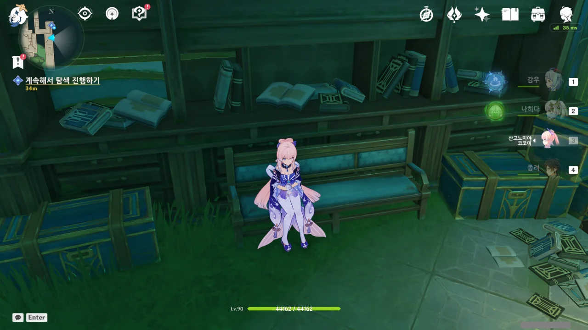

이야, 여기 의자에 앉을 수 있었네. ㅋㅋㅋㅋㅋㅋ



이 일지는 알랭이나 그의 조수가 아닌, 다른 연구원이 쓴 것으로 보인다.

&nbsp;

천재 소년 기요틴을 보며 '천재 소년도 실패할 기회를 한 번 잡아야 할 텐데'라며 시샘하지만, 기요틴 주변에 모인 다른 천재들을 보며 자신의 평범함과 한계를 깨닫고, 우연히 발생한 계기를 통해 학원을 그만둔 사람이다.

다만 기요틴을 시샘하기만 했을 뿐, 그를 모함하기 위해 별다른 행동을 하지 않았으며, 그와 공동으로 만든 기계 역시 '이 기계는 내가 아니라 기요틴이 만든 것이다'라며 특허 신청을 거절한 걸 볼 때, 성격이 나쁜 사람이라기보다는 그냥 천재를 시샘한 일반인 정도였던 것으로 보인다.

&nbsp;

기요틴 하니 생각난 건데, 태엽 기계를 발명한 사람의 이름이 '알랭 기요틴'이라고 하지 않았나? 아까 발견한 일지에서 등장한 '알랭'도, 이 일지에 등장한 '기요틴'도 모두 '알랭 기요틴'을 가리키는 것 같다.

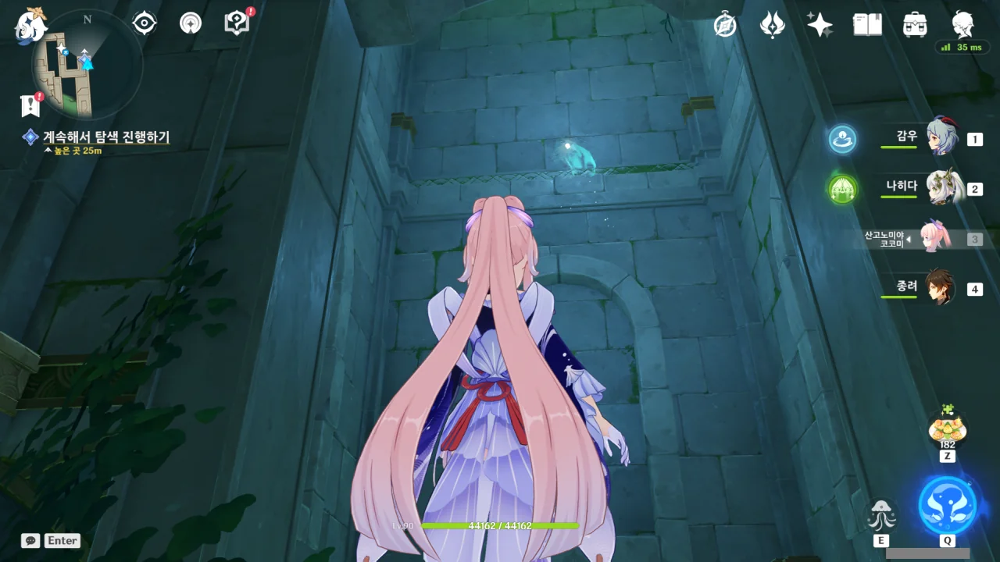

위로 올라가는 사다리가 전혀 보이지 않는데, 선령이 위로 올라가 버린다. 뭐지, 벽을 타고 등반하라는 건가?



별생각 없이 떨어진 아래는 스위치 하나만 달랑 있는 막다른 길이었다.

스위치를 누르자 수위가 올라가 마치 엘리베이터처럼 되었는데, 그걸 보고 아까 내가 떨어진 곳도 물에 잠기는 게 아닌가 순간 걱정했다. 하지만 내가 아까 떨어진 곳에 투명한 벽이 생겨 물이 복도에 쏟아지는 걸 막아주었다.

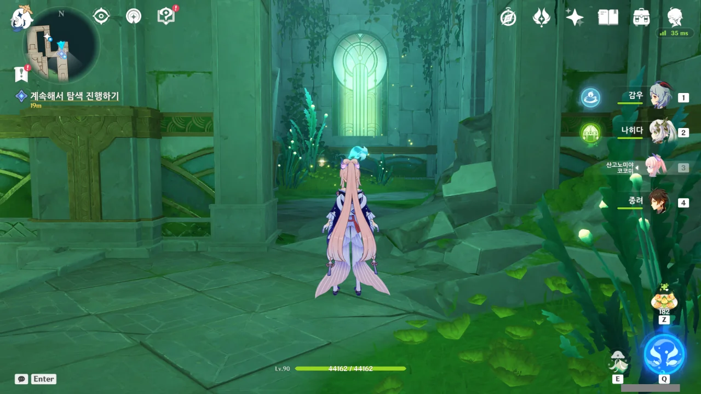

선령과의 숨바꼭질은 계속된다.



중간에 태엽 장치도 한번 더 만나주고, 기껏 뭍으로 올라온 건가 싶더니 또다시 물속으로 잠수하기도 한다.





도착한 곳은 유적 가디언 바로 앞이었다. 뭐지, 선령이 우릴 암살하려고 하는 건가?

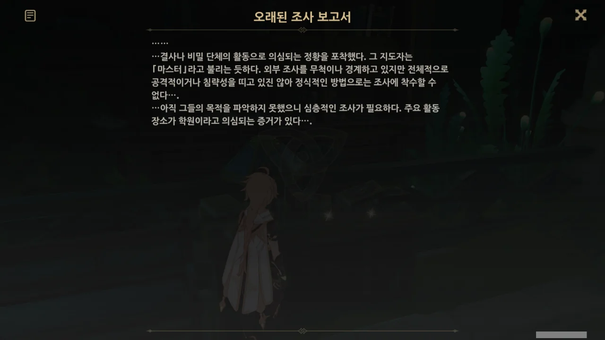

「자연철학 학원」 안에 비밀 단체가 있는 것 같다는 내용의 조사 보고서가 나왔다. 아무래도 버질의 말이 아예 틀린 건 아니었던 모양이다.

설마 「자연철학 학원」 안에 있다는 비밀 결사가 「십자 은방울꽃 학회」인 건 아니겠지?

이번엔 파멸의 유적 가디언이 날 맞아준다. 아깐 유적 가디언을 잡았으니, 이번엔 파멸의 유적 가디언을 잡아보라는 걸까?



여기에 보물이 있을 거라고 하는데, 정작 아무것도 없다.



여기에 보물이 없단 건 이미 기정사실. 버질이 이걸 어떻게 수습하나 보려 했는데, 실망스럽기 그지없다.

버질, 너, 정말 말 못 하는구나. 설득력이 전혀 없어.





어이쿠, 이젠 "날 의심하는 거야?"를 시전 한다. 당연히 의심하고 있지. 뭘 새삼스럽게 묻고 그러나.





이젠 '수억 모라'와 '「십자 은방울꽃 성검」' 이야길 즉석에서 막 지어낸다.

야, 여태껏 계속 「십자 은방울꽃 학회」라고 하지 않았어? 그런데 학회에 웬 되지도 않는 성검이냐?



어지간히도 급했던 모양인지, "꾸물대다간 보물을 빼앗긴다"라고도 한다.

상품을 팔 때 '이 조건으로 물건을 살 수 있는 시간이 이제 얼마 남지 않았습니다!'와 같은 말을 붙여서 듣는 사람을 조급하게 만들어 제대로 된 판단을 하기 힘들게 하는, 흔한 장사 수법이다.





버질에게 "나라면 하지 않을 일은 하지 마라"라고 조용히 경고하지만, 버질이 이 경고를 들을 것 같진 않다.

페이몬은 여전히 버질의 검은 속내를 눈치채지 못한 것 같고.

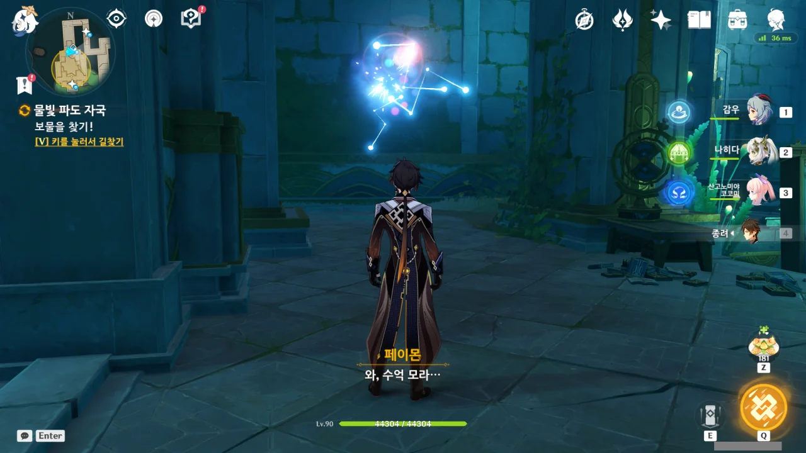

페이몬은 버질의 달콤한 '수억 모라'라는 말에 이미 눈이 멀었다.

"와, 수억 모라..."라고 말한 후, 뭐라 더 말할 줄 알았는데, 그냥 저게 전부였다.



왼쪽에는 유적 가디언이, 중앙에는 파멸의 유적 가디언이, 오른쪽에는 '미니 유적 헌터'같은 것이 하나 있다.

저게 다 한꺼번에 활성화되어 덤비는 건 아니겠지?



아, 미래가 보인다, 보여. 이 녀석, 여행자가 안에 있을 때 문을 닫을 생각이다. 문 스위치 옆에서 떠날 생각을 하지 않고 있지 않은가.

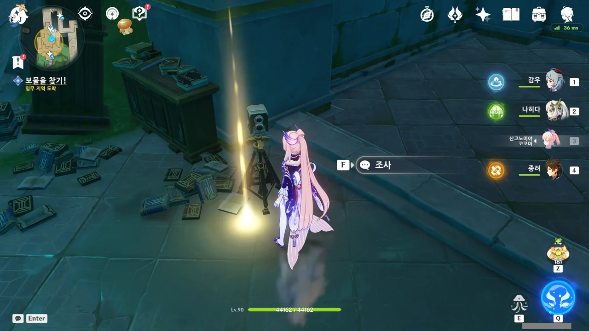

일단 사진기를 먼저 조사하기로 했다.





음... 이거 위험한 거 아냐? 통제를 잃는다고? 그 통제가 파멸의 유적 가디언 통제를 말하는 건 아니겠지?

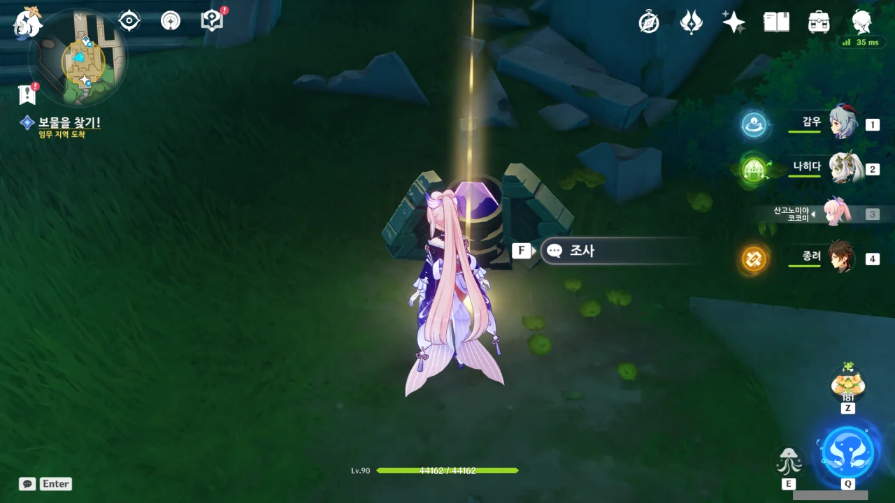

그다음은 이 용도를 알 수 없는 장치이다.



보라색 보석이 있는 걸 보면 이나즈마 계전석 같지만, 뭔가 확신이 들지 않는다.



먹을 걸 좋아하는 페이몬에게는 값진 지식보다 많은 모라가 더 중요한 듯하다. 뭐, 지식으로는 음식을 살 수 없으니, 페이몬에겐 당연한 일일지도.

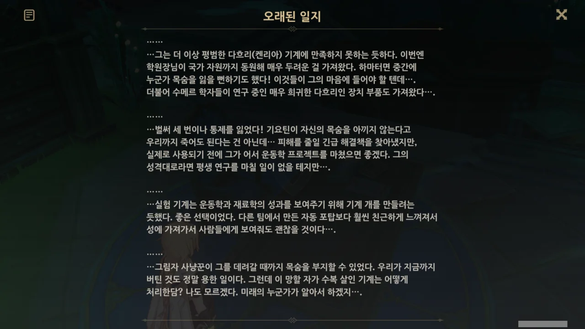

이 일지에 따르면, 저 파멸의 유적 가디언은 무한히 재생하는 특성을 갖고 있다고 하는데... 정말이냐? 무한 재생 파멸의 유적 가디언은 수메르에서 한 번 본 거로 충분하다고 생각하는데...

파멸의 유적 가디언에 자가 수복 장치를 추가한 건 다름 아닌 알랭 기요틴인 것으로 추측된다. 알랭, 대체 뭘 만든 거냐!

그런데 마지막에 나온 '그림자 사냥꾼'은 대체 누굴까?



이 유리벽에는 금이 가있다. 어쩌면 나중에 써먹을 수 있을지도...

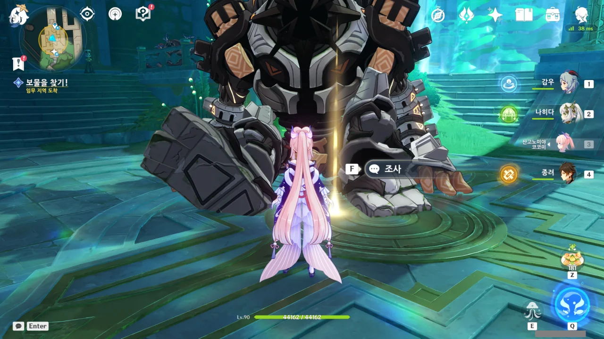

이제 남은 건 이 파멸의 유적 가디언 하나뿐이다. 조사를 시작하자마자 곧바로 일어나는 건 아니겠지?



버질이 말한 보물은 코빼기도 보이지 않지만, 우리 눈앞에 놓인 파멸의 유적 가디언은 당면한 문제다. 당연히 이 파멸의 유적 가디언이 더 중요하지.







그래, 언제 버질이 본색을 드러내나 했다.

버질은 안에 있는 파멸의 유적 가디언이 여행자를 죽이면 여행자가 갖고 있던 보물을 회수하겠다고 한다.

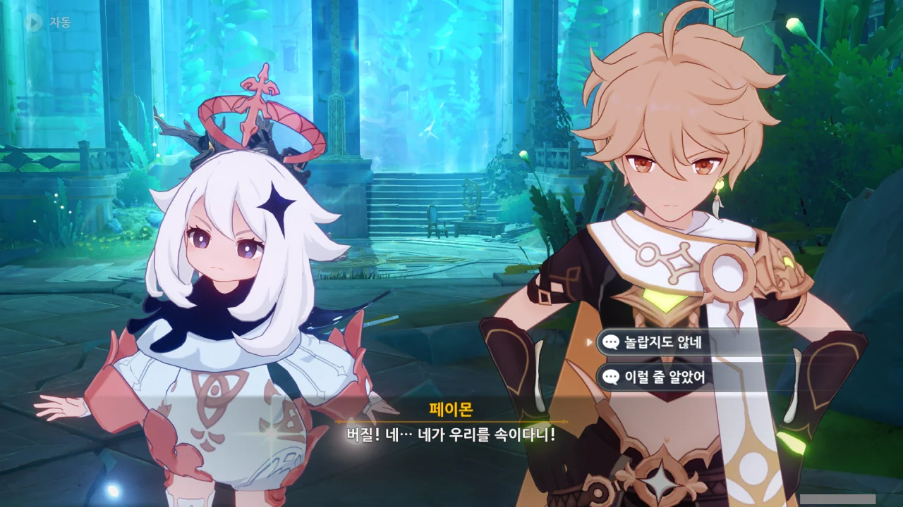

페이몬은 이제야 버질에게 속았단 걸 깨닫고 잔뜩 화를 내지만, 여행자는 이미 다 눈치채고 있어서 별로 놀라지 않는다.



역시나, 저 파멸의 유적 가디언은 특수한 개체였다. 분명 아까 일지에 나온 무한 재생 특성을 갖고 있겠지.

그나저나 저 파멸의 유적 가디언이 무한히 재생하는 특징을 갖고 있단 걸 버질이 알고 있는 걸 보면, 버질은 예전에도 이렇게 다른 사람을 이 방에 가둬 파멸의 유적 가디언에게 죽게 만든 후, 죽은 시체에서 소지품을 훔친 적이 있나 보다. 한두 번 한 솜씨가 아냐...

파멸의 유적 가디언의 눈에 불이 들어온다. 음, 왠지 이럴 것 같더라.



조금 두들기다 보면 제자리에 주저앉아 체력을 회복한다.



페이몬, 네가 언제 그 말을 하나 기다렸어. 곧바로 유리를 쏴서 부쉈다.







페이몬이 잔뜩 물을 마신 듯하다. 저런.

나가서 따지긴 뭘 따져? 일단 만나면 배때지에 칼 한 방 꽂고 심문을 시작해야지.



단순한 수몰이라 보기에는, 학원 주변에 자연 동굴이 여럿 있는 게 조금 이상하다. 이런 지형이 되려면 학원을 골짜기 안에 지었어야 하거든.

학원이 세워진 곳만 지반 침하로 가라앉았을 가능성도 있지만, 정말 그랬을 것 같진 않다.





탈출 성공.

이다음에 뭔가 더 있을 줄 알았는데, '물빛 파도 자국' 월드 임무는 그냥 여기서 끝이었다.
