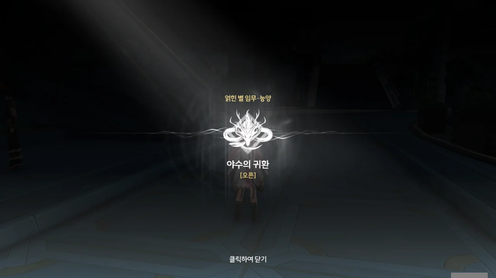
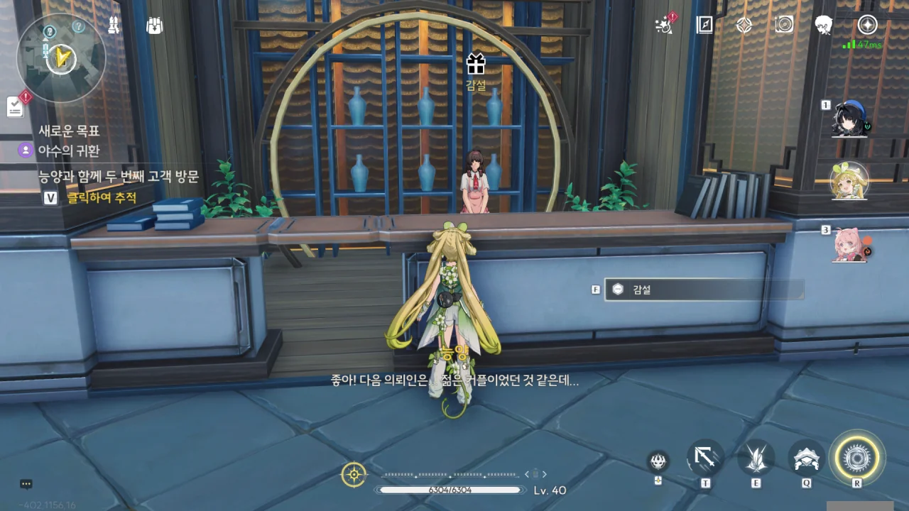

사실 얽힌 별 임무는 최대한 늦게 하고 싶었다. 하지만 상황이 날 그렇게 내버려 두질 않았다.

데이터 스테이션의 레벨을 더 올리고 싶은데, 연각 레벨이 모자라 데이터 스테이션의 레벨을 올리지 못하고 있다. 수집하는 에코의 품질을 결정하는 게 바로 데이터 스테이션 레벨이기 때문에, 데이터 스테이션 레벨은 가능한 한 빨리 올려줘야 하는데 말이다.

별 수 있나. 연각 경험치를 제일 잘 주는 얽힌 별 임무를 통해 연각 경험치를 수급할 수밖에.





응? 능양이 뾰족하고 길쭉한 발톱을 갖고 있다고? 그런 이야긴 처음 들어보는데.



대체 뭐지? 난 이 상황을 어떻게 해석해야 하는 거지?

능양이 '어흥' 한 번 하자, 여자아이는 곧바로 울음을 터트려 버리고, 남자아이는 금방이라도 울 것 같은 표정을 짓는다.

한동안 멍하니 눈만 끔뻑인 끝에, 내가 느낀 감정이 바로 '어처구니없음'이란 걸 깨달을 수 있었다.





능양이 우는 아이들을 곧장 사탕으로 달랜다. 사탕을 미리 준비해 둔 걸 보면, 이런 상황을 한두 번 겪은 게 아닌 모양이다.

사탕을 받은 남자아이는 언제 울먹였냐는 듯, 금세 의기양양해져서 ""내가 안 무섭다고 했잖아!"라며 으쓱댄다. 에휴...



사자춤 공연? 설마 능양은 사자춤 공연 홍보를 위해 돌아다니고 있었던 건가?



> 네 몸에서 나는 냄새...

> 이상한 냄새...?

음, 이건 분명 노린 게 분명하다.

보통 '오타쿠' 할 때 흔히 생각하는 이미지 중 하나가 바로 '잘 씻지 않아 몸에서 냄새가 난다'인데, 안타깝게도 이건 악의적인 음해가 아닌, 실제로 자주 있는 일이다.

게임의 오프라인 행사가 있을 때마다 커뮤니티에는 '몸에서 냄새가 나지 않게 잘 씻는 법'을 상세히 적은 글이 올라오고, 압도적인 추천을 받아 인기글에 올라간다. 그럼에도 불구하고 행사가 끝난 후 올라오는 후기에는 항상 '행사장에 엄청난 냄새를 풍기는 사람이 있었다'가 들어간다.

> 성에 엄청난 손님이 왔다고 들었는데.

방랑자가 처음 금주성에 온 날, 금희가 전체 방송으로 '황룡과 금주에 소중한 손님이 있다'라고 말했으니, 방랑자의 존재 자체를 모르는 사람은 없을 거다.



손을 내밀며 악수를 청하길래, 마찬가지로 손을 내밀었다.

> 악수했으니까, 이제 절친인 거다?

어... 그게 그렇게 되나? 갑자기 절친은 너무 갑작스러운데...





아까 했던 예상대로, 능양은 곧 있을 사자춤 --- 태평요, 금주의 전통 민속 --- 공연단의 대규모 사자춤 공연을 홍보하기 위해 나와있던 것이었다.





우와, 하루 종일 밥도 제대로 안 먹고 리허설을 한 거야? 그런 다음 곧바로 공연 홍보를 하러 나온 거고?

능양이 밥을 쏘겠다고 하자, 냉큼 좋다고 대답했다. 공짜 밥을 마다할 사람이 어디 있겠는가!

> 하아... 근데 지금은 내가 좀 바빠서...

...? 너무 말이 확확 바뀌는 거 아냐? 밥을 쏘겠다고 해서 곧바로 밥 먹으러 갈 줄 알았는데 갑자기 일 이야기로 돌아왔다.







'개인적인 사자춤 의뢰가 많다'라고 하는 걸 보면, 공연단은 단체 공연뿐만 아니라 개인 공연도 받는 모양이다. 그런데 하필이면 그 의뢰 중 몇 개가 내일 있을 대형 사자춤 공연 일정과 겹친다고 한다. 일반적으로 여러 의뢰를 받을 때엔 기존 행사 일정에 따라 의뢰 일정을 조절하지 않아? 설마 이 공연단, 의뢰를 주먹구구식으로 받고 있던 거야?

아무튼, 한번 수락했던 의뢰를 날짜가 겹친다는 이유로 거부하면 다들 실망할 것이 당연하기 때문에, 능양은 내일 있을 대형 공연에 개인 의뢰 내용을 잘 녹여내어 일석이조를 노리려 한다.

> 그런 공연으로 괜찮은가?
> 괜찮아, 문제없어.
{.bq}

뭔가 많이 이상하긴 하지만, 밥을 인질로 잡혀버린 탓에, 하는 수 없이 능양을 따라가게 되었다.

얽힌 별 임무 · 능양 \[야수의 귀환\] 오픈!



응? 방랑자와 만난 적이 있을 거라고? 그게 대체 누구지?





첫 번째 손님은 할아버지 생신 잔치를 위해 사자춤 공연을 예약한, 「선행 공약」 굿즈 판매원, 감설이었다. 아, 그래서 방랑자가 만난 적이 있을 거라고 말한 거였구나.



아, 대규모 공연을 예약한 게 변정이었어? 그런 거라면 이렇게 공연 일정이 겹치는 것도 이해가 된다.

살고 있는 도시의 시장이 찾아와 식당 대관을 요청했을 때, 예약이 밀려있다는 말을 하며 그 요청을 거절할 수 있는 음식점 사장은 별로 없을 것이다. 오히려 개인 예약 손님들에게 하나하나 양해를 구하고 개인 예약을 취소하겠지.

이렇게 개인 손님이 원하는 걸 대규모 공연에 끼워 넣겠다는 건 갑작스러운 예약 취소에 따른 공연단 나름의 사과일지도 모르겠다.





이번에 환갑을 맞은 감설의 할아버지는 사람들이 모여 떠들썩하게 노는 걸 좋아하기 때문에, 대규모 공연이라면 흔쾌히 받아들일 거라고 말한다.

능양은 환갑을 맞은 감설의 할아버지를 위해 무대에서 예순을 의미하는 여섯 바퀴를 돌며 할아버지를 위해 무병장수를 비는 「헌수」를 하겠다고 한다.

젊은 커플...? 사자춤 공연이라길래, 나이 지긋한 사람들에게나 인기 있는 공연일 줄 알았는데, 젊은 사람들 역시 사자춤 공연을 좋아하나 보다.





> 감사합니다. 영원히 한마음으로 백년해로하세요!

선물을 받았으니 덕담이라도 되돌려 줘야지.





둘 다 황룡 출신인 이 부부는 전통 「사자 주례」로 결혼식을 치르고 싶어 했다.

사자춤은 온갖 행사에서 쓸 수 있는 만능 공연이라도 되는 건가? '사자 주례'라니, 정말 처음 들어보는 방식이네.





능양은 「사자 주례」 대신 내일 사자춤 공연과 어울리는 결혼식 방법을 제안한다.





> 우리 자기도 언젠가는 변방으로 가서 작전에 참여하게 될 테니까, 분명 의미가 클 것 같아요.

설마 황룡은 징병제 국가였던 건가? 단순히 승모의 직업이 군인이라 저런 말을 한 걸 수도 있지만, 적어도 지금은 황룡이 징병제 국가여서 나온 말이란 느낌이 더 강하다.



이제 마지막인 건가...







별생각 없이 감설에게 말을 걸었는데, 사자춤에 대한 추가 정보를 얻을 수 있었다.

육선찻집... 거기, 감심이 일하는 가게 아냐?





대체 「사자후 고추다발」은 무슨 음식인 걸까? 높게 걸어둔다는 말을 보면 과자나 튀김음식처럼 건조한 음식인 건 확실해 보인다. '고추다발'이라는 표현을 보면, 엄청 매운 음식인 것 같기도 하고...

대기 순열이 있는 걸 보니, 능양의 사자춤 공연단은 굉장히 인기가 좋은 모양이다. 그런데 개업식과 사자춤 공연...? 뭔가 잘 안 어울리는데.





능양이 순재의 의뢰 내용 대신, 「사자후 고추다발」을 사자춤 공연에 넣어 개업을 축하하고 싶다고 하자, 그럴 필요 없다고 만류한다.

여기에도 PPL 개념이 있는 건가? 아무튼, 사자춤 공연에 특정 가게의 음식이 뜬금없이 나온다면 누구라도 이상하게 생각할 것이다.







과연 순재가 준 간식은 어떤 음식이고, 맛은 어땠을까?

> 음식을 맛보는 건, 그 지역을 빠르게 이해하는 열쇠니까!

지역의 풍토에 따라 쓰는 재료와 양념, 향신료 등이 달라지니, 능양의 말이 맞다.

능양이 "공연에 간식이 빠지면 섭섭하다"라며, 순재의 신메뉴를 잔뜩 사가려 한다. 그나저나 내일 대규모 공연이 있는데, 오늘 저녁에도 공연이 또 있다고? 대체 능양은 얼마나 바쁘게 사는 거야?







성 밖에 「딸랑딸랑 야수」라는 괴물이 나타나는 바람에 순재의 간식 재료를 포함한 모든 육류의 공급에 차질이 생겨, 이번 저녁 공연에 필요한 양의 간식을 준비할 수 없다고 한다.

능양이 「딸랑딸랑 야수」의 친구라고? 순재의 말을 들어보면, 도저히 사람과 친구가 될 수 없을 것 같은 짐승으로 보이는데...

뭐, 과장된 소문이겠지. 어떻게 짐승의 이빨이 50cm가 넘어?





현재 남아있는 육류 유통의 유일한 경로는 「딸랑딸랑 야수」와 소통할 수 있어 식재료를 수급하는데 문제가 없는 「야수 패거리」 추방자 단체가 장악하고 있다고 한다. 공급 경로를 독점한 그들이 시세의 다섯 배나 되는 가격을 불렀기에, 단시일 내에 간식 제조 재개는 힘들 거라고 한다.

흠... 듣기만 해도 벌써 구리구리한 냄새가 솔솔 풍기는데. 「딸랑딸랑 야수」 이야기가 새빨간 거짓말이라는 데에 금빛 파도의 무늬 5개를 걸 수 있다.





뭔갈 생각하던 능양은 찻집 옆에 있을 마지막 의뢰인에게 금방 다녀오겠다며, 방랑자를 가게 앞에 내버려 두고 혼자 찻집으로 달려갔다.

입을 살짝 벌리고 '뭐지?'라고 말하는 듯한 방랑자의 표정을 보라.







> 이렇게 갑자기...?
> 이렇게 가버린다고요?

방랑자 역시 꽤 당황했나 보다.

순재 말로는, 원래 능양은 생각나는 대로 행동하는 사람이라고 한다. 물불 안 가리고 남을 돕다 다치기도 하는지라, 능양의 도움을 받은 사람들은 능양이 다칠 때마다 미안하고 안쓰럽다고 한다.

생각나는 대로 행동한다니, 능양을 처음 만났을 때 밥 먹으러 가자고 하다가 갑자기 의뢰인 이야기로 빠진 게 이제 이해가 되네.



> 밥 산다더니 돈도 주지 않고 가버려서요.

ㅋㅋㅋㅋㅋㅋㅋㅋㅋㅋㅋㅋ

'패시'라는 사람이 사자춤 의뢰를 한 적 없다고 말하는데, 대체 무슨 일인 걸까?



저번 주, 능양은 요구 사항은 전혀 쓰여있지 않고 오직 「성남 패씨」라고 적힌 낙관만이 찍힌 의뢰를 받았다고 한다. 그 '성남 패씨'가 이 '패시'인 것 같은데... 정작 본인은 사자춤을 예약한 적이 없다고 말하는 상황.





자신에게 연락한 사람의 목소리가 성숙한 남자의 것임을 기억한 능양이 패시에게 오빠가 있냐 물어보자, 있다고 대답한다.

「성남 패씨」라는 낙관을 썼으니, 그 의뢰를 보낸 사람은 분명 패시의 가족일 것이다. 그런데 의뢰인의 목소리가 성인 남성의 것이었으니, 패시의 아버지 혹은 오빠가 보낸 것이란 결론이 도출된다. '성숙한' 남자 목소리라 했으니, 설사 그녀가 성인이 된 남동생이 있다고 해도, 여기에 해당하진 않을 거고...



자기소개가 굉장히 늦었네...







> 마지막으로 외출한 게 언제인지도 모르고요...

이 부분이 잘 이해가 안 되는데. 대체 무슨 말인 거지? 싸운 거랑 외출이랑 대체 무슨 상관이야?

아무튼, 패시와 패지는 서로 싸워 사이가 틀어진 지 오래되었으며, 패지는 일주일 전부터 집에 들어오지 않았다고 한다. 패지는 종종 패시에게 소포를 보내곤 했는데, 소포 안에는 오래된 청분초와 상한 수육이 들어 있었다.



패지가 「야수 패거리」와 어울리고 있다는 정보 역시 입수했다. 패시는 오빠가 체포당할까 봐 여태껏 오빠의 실종을 순찰관에게 알리지 않았다고 한다.

정말 공교로운 상황이다. 각종 육류의 공급을 틀어막고 있는 것으로 추정되는 「야수 패거리」가 여기서도 또 나왔네?



> 소포에 있는 주소가 다 달라서, 좀 막막한데...

> 그들이 사용하는 공통된 경유센터가 있을 거예요.

뭔가 이들의 말이 잘 이해되지 않는다. 이것도 오역의 일종인 건가?

일단 나는, 소포의 발신지가 전부 달라, 패지가 가입한 「야수 패거리」의 위치를 알 수 없지만, 소포의 이동 경로를 역추적해 공통분모를 찾고, 그 마지막 지점을 중심으로 「야수 패거리」의 위치를 찾으면 된다는 말로 이해했다.

허리춤에 손을 얹고 의기양양하게 미소 짓는 방랑자가 귀엽다. 도얏~ 도얏~





오빠가 무척 걱정되었던 건지, 패시가 능양과 방랑자를 따라가겠다고 말한다.

> 예전에, 선행 공약 멤버였는걸요.

이 말을 들으니, 타종 거북 임무에서 오버클럭으로 기억을 잃은 전 선행 공약 멤버가 기억난다.

"선행 공약의 멤버에게 위험이란... 없어요..."라고 힘없이 말하는 걸 보면, 모험 도중 겪은 위험한 일 때문에 마음이 꺾여 선행 공약을 탈퇴한 게 아닐까 생각된다.







명식 무상선주도 기염과 함께 잡아 본 방랑자니까, 패시 하나 정도는 괜찮을 것이다. 선행 공약 출신이니, 적어도 각종 위험에 대응하는 법 정도는 알고 있겠지...



패시가 늘 자신에게 오빠의 소포를 보내주던 택배원의 위치를 알고 있다고 하니, 거기로 가보면 되겠다.
