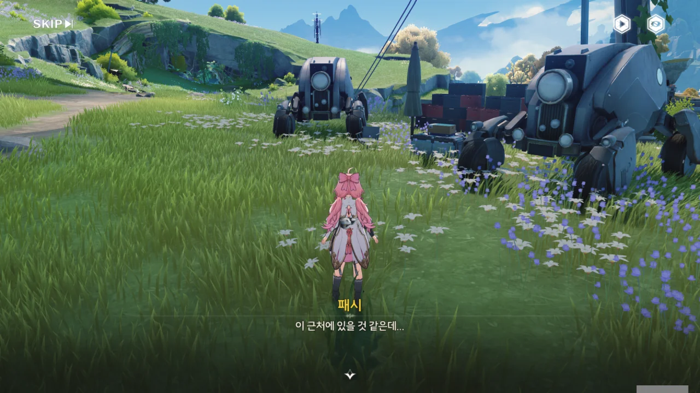
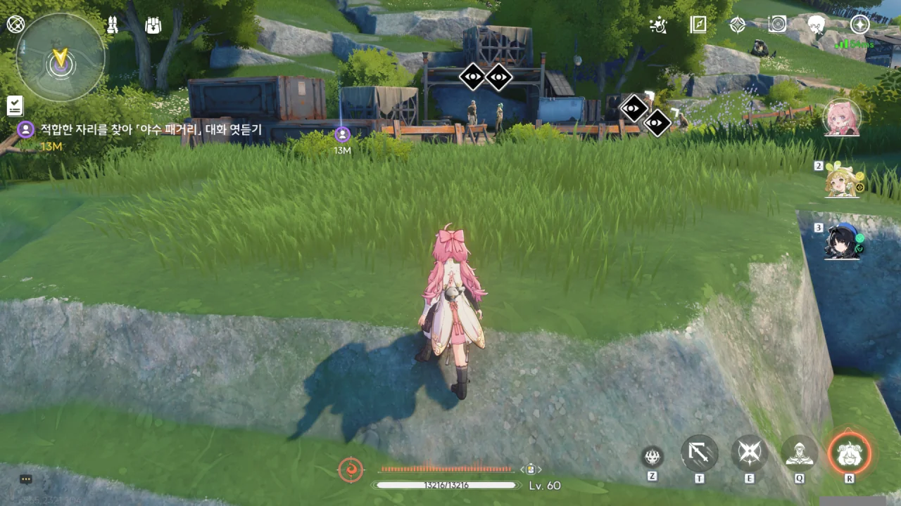
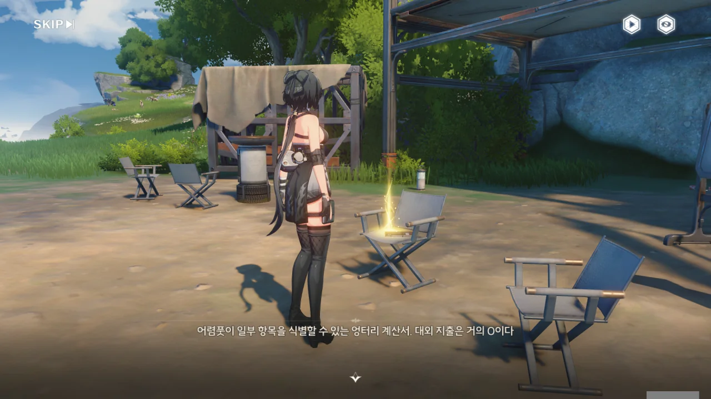
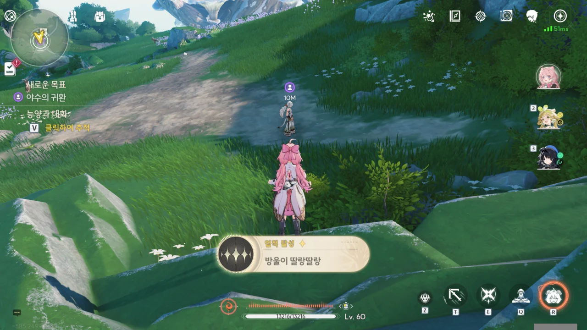

패시가 알려준 곳으로 왔다.

어... 여기가 '택배 센터'라고? 여긴 그냥 공터잖아! 물론 저기 택배 상자로 보이는 뭔가가 여럿 쌓여있긴 하지만, 그 위에 최소한 비바람을 막을 천막이라도 쳐놨어야지! 이게 어딜 봐서 택배 센터야? 무무물류의 수준이 고작 이 정도밖에 안 되는 거였어?



까부는 원숭이인지 시끄러운 원숭이인지 모를 녀석들이 누군갈 위협하고 있길래, 냉큼 가서 구해주었다.



원숭이의 습격에도 소포를 그냥 두고 도망갈 수 없었다고 말하는 택배원. '택배 센터'의 빈약한 시설에 비해, 그 책임감이 정말 대단하다.





> 혹시 여기서 소포를 보내는 사람이 자주 있나요?

> 어떤 물건이든 저희 쪽을 경유해야 하지만... 저희가 직접 보내는 경우는 드물어요.

뭔가 번역이 잘못된 것 같은데. 택배 센터는 소비자와 물류 네트워크를 이어주는 말단 역할이니, "저희가 직접 보내는 경우는 드물어요"라고 말할 게 아니라, 택배 센터에서 직접 보내는 경우가 드물다고 말해야 하는 거 아냐?

> 아... 이 소포요? 어... 모르겠는데...
> 글쎄요... 잘못된 건가...?

이 택배원, 굉장히 수상하다. 뭔가 거짓말을 하고 있는 게 틀림없다. 분명 본인이 배달했다고 되어있는 택배를 전혀 기억하지 못한다고?

한 발짝 물러나, 택배원이 배달한 택배가 너무 많아 이 택배를 기억하지 못할 수도 있다. 하지만 그런 경우라면 분명 그런 뜻이 전달되도록 말했을 것이다. 그런데 그냥 모르겠다고만 말하는 걸 보면... 뭔가 켕기는 게 있는 게 분명하다.







「딸랑딸랑 야수」를 「따르릉따르릉 야수」로 잘못 알고 있는 것만 빼면, 택배원이 알고 있는 건 우리가 알고 있는 것과 크게 다를 게 없다.

그래서 더 수상쩍다. 소문에 따르면, 「딸랑딸랑 야수」는 분명 이 근방의 물류를 끊어버릴 정도로 위험한 야수이다. 그런데 「딸랑딸랑 야수」 출몰지 근처에서 활동하는 택배원이 자길 덮칠지도 모르는 야수의 이름조차 제대로 기억하지 못한다는 게 말이나 돼?

이 택배원이 거짓말을 하고 있는 게 아니라면, 분명 얼마 못 가 불귀의 객이 되고 말 거다. 자기 주변에 도사리고 있는 위험도 제대로 파악하지 못했으니, 언제 어떻게 죽어도 이상하지 않다.





일단 하나 확실한 건 찾았다. 이 택배원은 야수 패거리와 교류가 있다. 그렇지 않고서야 야수 패거리의 정보를 '고객의 정보'라며 보호할 리 없지. 택배원이 말한 게 거짓말일 가능성도 생각하는 게 좋을 것 같다.

정보 출처가 상당히 미심쩍긴 하지만, 「딸랑딸랑 야수」가 활동하는 지역에 대한 정보를 얻었다.





넌 대체 야수가 한 마리가 아닐 수도 있다는 정보를 어디서 들었니?

이건 '제발 날 의심해 주세요!'라고 호소하는 것과 다름이 없다.





택배원에서 얻은 정보가 전혀 쓸모없는 건 아니었지만, 그렇다고 크게 유용한 것도 아니었다.

> 뭔가를 두려워해서, 말하지 못한 게 있는 걸 거야.

내 눈에는 야수 패거리와 한통속인 게 들킬까 봐 조마조마해하면서 애써 거짓말만 늘어놓는 것으로밖에 안 보였는데...

이번에 얻은 소득이라고는 진위 여부가 상당히 의심스러운, 「딸랑딸랑 야수」의 출몰지에 대한 아주 작은 정보밖에 없다.



> 산허리에 큰 나무가 쓰러져 있는데, 그 근처 캠프에서 「딸랑딸랑 야수」가 자주 활동한다던데요...

이 정보 하나만으로 대체 어떻게 캠프를 찾겠다는 거야? '큰 나무가 쓰러져 있다'로 힌트를 얻은 건가, 설마?







음, 내 눈엔 쓰러진 나무가 전혀 보이지 않는데... 아무튼 사람의 목소리가 들리는 걸 보면, 능양이 맞았나 보다.

와, 여기서 메탈 기어 솔리드를 할 줄은 몰랐는걸.



> 헤헤... 보스, 말도 마세요. 「딸랑딸랑 야수」 얘기, 효과가 있던데요!

흠... 여자 추방자의 말을 들어보면, 「딸랑딸랑 야수」 이야기는 최소 부풀려진 소문이거나, 새빨간 거짓말인 것 같다.





나무 덤불을 피하라 했던 이유가 바로 이거였구나.

이 나무 덤불은 본래 여기서 자라는 나무가 아닌데, 추방자들이 사주 경계를 위해 일부러 옮겨 심은 것으로 보인다. 능양 말처럼, 덤불 안에 함정을 숨겨뒀을 수도 있고.





이 패거리에 최근 신입이 하나 들어왔는데, 「딸랑딸랑 야수」를 찾으려 들어온 것으로 보인다.

그리고 내 의심에 쐐기를 박듯, 추방자 대장 입에서 "그렇게 야수를 찾고 싶다면, 녀석한테 찾으라고 해"라는 말이 나왔다. 이 말은 이들 역시 「딸랑딸랑 야수」를 본 적이 없다는 말이다. 즉, 「딸랑딸랑 야수」 소문은 새빨간 거짓말이었다는 거다.







추방자 대장이 패거리를 이끌고 「딸랑딸랑 야수」 이야기를 믿지 않는 신입을 직접 두들겨 패러 간다.

> 절대 모르겠지,  사람들이 두려워하는 건 「딸랑딸랑 야수」가 아니란 걸...

으응? 그러면 「딸랑딸랑 야수」 말고 다른 뭔가가 있다는 거야?





저들이 경계하고 있다고? 설마, 방랑자 일행이 여기서 몰래 엿듣고 있던 걸 들킨 건가? 그런데 그 숨소리는 대체 어떻게 들은 거야?

> 하지만 야수가 되려면 한참 멀었어.

그 말은 저들과 달리, 능양은 야수라는 말처럼 들리는데...



> 알 수 없는 생물의 날카로운 이빨. 크기가 거대하다.
{.bq}

> 냉장된 짐승 고기. 적갈색으로 변한 상태로, 불쾌한 냄새가 진동한다.
{.bq}

이 녀석들, 뭔가를 키우고 있었던 건가?

육류 유통로를 독점한 것 치고는, 이들이 쓴 고기 역시 상태가 좋지 않다.



> 설마 우리 오빠가, 그자들과 한편일까요...

그건 가봐야 알겠지. 아직은 모르는 게 너무 많다.

> 어렴풋이 일부 항목을 식별할 수 있는 엉터리 계산서. 대외 지출은 거의 0이다.
{.bq}

대외 지출이 0이라고? 그러면 이들은 돈을 모아놓기만 하고 쓰질 않았다는 거야? 대체 뭔 생각인 거지...







패지의 통신 장치를 찾았다. 패시가 걱정했던 대로, 패지가 「야수 패거리」에 가담한 모양이다.

능양이 패시에게 눈앞에 보이는 것만 믿지 말라며, 패지를 믿어보라는 말을 해준다.





이야, 정말 보면 볼수록 대단하네.

야수 패거리는 너무 오랫동안 보관해 상한 고기에 화학 첨가제를 잔뜩 뿌린 후, 시장에 내다 팔 생각이었다고 한다. 아, 설마 그래서 대외 지출이 0이었던 거야? 상해서 버린 고기를 주워온 후, 화학 첨가제를 듬뿍 뿌려 팔거라, 새 고기를 살 필요가 없었으니까?

살려둘 이유가 없군. 먹을 거로 장난치는 놈은 사형이야, 사형!







미행을 야수 패거리에게 들켜도, 방랑자의 실력이라면 추방자가 얼마나 많이 덤비던 상관없이 전부 처리할 수 있을 것 같아, 야수 패거리를 쫓는 선택지를 골랐다. 그러자 능양이 자기가 야생 환경에 더 익숙하다며, 자기가 야수 패거리를 쫓겠다고 말한다.

저렇게 자신 있게 말하는 걸 보면, 방랑자보다 능양이 가는 게 더 효율적일 것 같다는 생각이 들어, 알았다고 했다.



패지가 남긴 통신 장치에 녹화된 메시지를 찾아 재생해 본다.





패지가 남긴 메시지에는 동생의 꿈을 막는 오빠가 되어 미안하다는 말과 함께, 패시를 위해 「딸랑딸랑 야수」를 죽이러 가겠다는 말이 녹음되어 있었다.

대체 이들 사이에 무슨 일이 있었길래, 이런 말이 나오는 걸까?





패시가 선행 공약에 가입한 것 때문에 크게 싸운 패시와 패지 남매. 패시는 선행 공약에 가입하는 게 꿈이었는데, 패지는 그걸 극구 반대했던 모양이다.

그런데 그게 그가 지금 「딸랑딸랑 야수」를 죽이려는 것과 무슨 상관이 있는 거지?



어디선가 방울 소리가 들리자, 패시가 「딸랑딸랑 야수」가 내는 소리임이 틀림없다며 패닉에 빠졌다.







얼마 전, 패시가 야외에서 임무를 수행하던 때, 잔상의 습격을 받았다. 잔상으로 도망치던 그녀가 더는 뛰지 못할 때, 저 방울 소리가 들려왔다. 그녀를 계속 쫓아오던 방울소리는 그녀가 안전구역에 들어오고 나서야 그쳤다.

흠... 뭐, 직접 보면 뭐가 뭔지 알 수 있겠지. 「딸랑딸랑 야수」가 아무리 세도 명식보다 세지는 않을 것 아닌가. 방랑자라면 분명 괜찮을 거야.

응...? 방울 소리를 따라온 것뿐인데, 왜 그 끝에 능양이 있는 거야?



방랑자도 방울소리 끝에 능양이 있는 걸 보고 놀랐는지, "능양, 당신이 왜 여기에 있는 거죠?"라고 묻는다.

어... 설마 그 방울소리가 능양이 보낸 신호였어?



능양에게 방울소리에 대해 묻자, 능양은 뭔가 켕기는 게 있다는 듯이 고개를 돌리고 "방울소리를 어렴풋이 들은 것 같다"라고 말한 후, 패지 이야기로 급하게 말을 돌린다.

방울 소리가 능양에게서 난 건 확실한데... 설마 능양이 그 「딸랑딸랑 야수」였다는 그런 전개는 아니겠지, 설마? 아까 추방자 대장이 그 이야기는 가짜라고 말했잖아.





야수 패거리가 신입 --- 패지일 가능성이 높은 --- 을 이 동굴로 보냈다고 한다.

> 방울 소리가 환청은 아닐 거예요... 「딸랑딸랑 야수」가 동굴에 있을지도 몰라요!

이빨이 50cm나 될 정도로 큰 녀석이 이렇게 작은 동굴에 들어갈 것 같진 않은데...

아무튼, 신입이 위험한 상황에 처한 것 같으니, 일단 진입해 보는 게 좋을 것 같다.



이 이야기의 끝이 궁금하니, 끝까지 가보기로 했다.

그나저나 "밥 두 끼 사주세요!" 선택지는 대체 ㅋㅋㅋㅋㅋㅋ





이번에도 역시 패시가 따라가겠다고 말하지만, 이번엔 능양이 적극적으로 말린다.





능양은 패시에게 지금 금주성으로 돌아가, 오늘 있었던 일을 순찰관에게 알리고 지원을 요청해 달라고 말한다. 그리고 더 이상 도망치고 싶지 않다는 패시에게 선행 공약의 탐험가는 지금 놓인 상황에 대해 정확한 판단을 내릴 수 있어야 하며, 지금 물러나는 게 꼭 나약하다는 건 아니라고도 말해준다.





능양의 조언을 받아들인 패시는 금주성으로 지원을 요청하러 떠났다.

이제 동굴 안에서 무슨 일이 일어나고 있는지 확인할 시간이다.
