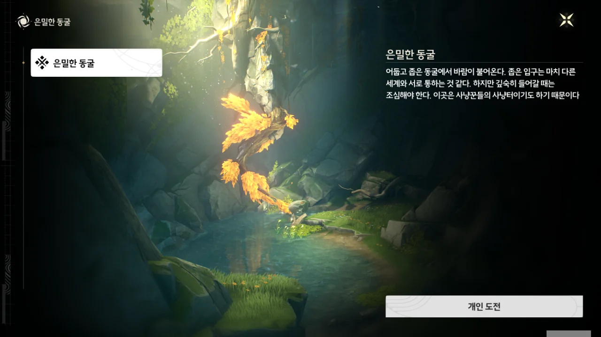
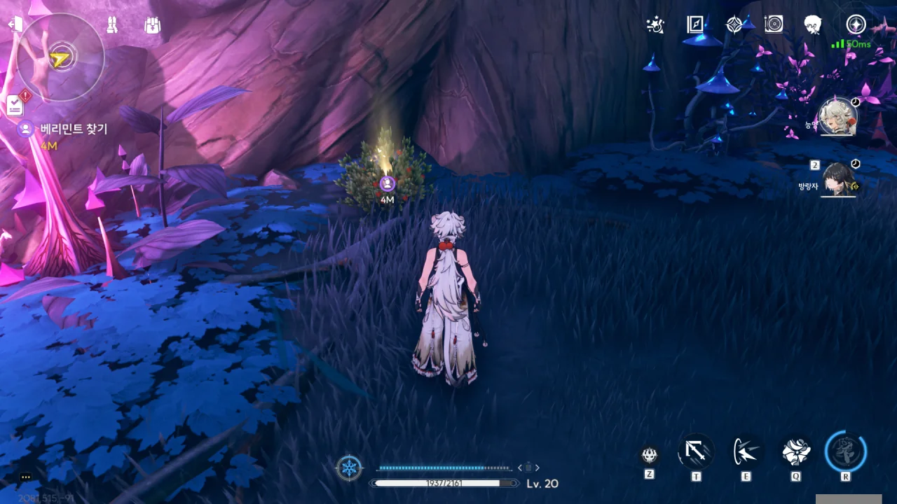

던전 설명부터 뭔가 싸하네... '사냥꾼들의 사냥터'라고?



> 온갖 냄새가 섞여 있어. 식물, 짐승, 잔상, 그리고... 사람?

대체 능양의 정체는 뭘까? 여태까지는 그냥 그런가 보다 하며 넘어갔지만, 능양의 정체가 사람이 아니라는 정황상 증거가 한둘이 아니다.

* 사자 귀와 꼬리가 달려 있음
* 추방자 캠프 주변에 심어진 나무 덤불 속에 함정이 숨겨져 있을 것이라 예측함
* 추방자들이 캠프에서 출발했음에도 여전히 주변에 숨어 경계하고 있음을 숨소리로 예측함
* "하지만 야수가 되려면 한참 멀었어."
* "난 놈들보다 야생 환경에 익숙하니까"  
  단순히 야외 환경에 익숙하다고 한 게 아니라, '야생' 환경이라고 했다.
* 동굴 속에서 냄새로 사물을 구별함  
  인간의 후각은 다른 동물에 비해 심각할 정도로 퇴화되어 있어, 냄새로 사물을 구별하기가 불가능에 가깝다. 후각 피로 역시 후각의 퇴화가 원인이라 추정되고 있다.

공명 어빌리티의 폭주로 머리카락 일부가 깃털로 변한 양양 같은 경우가 있으니, 사자 귀와 꼬리가 달린 건 넘어갈 수 있다. 하지만 나머지는 능양의 정체가 사람이 아니거나, 최소한 정상적인 환경에서 자라지 못한 사람임을 암시한다.





패지의 소지품이 떨어져 있는 걸 보면, 패지가 여기에 온 게 확실하다.



동굴에 들어오자마자 잔상 냄새를 맡았다는 능양 말대로, 잔상이 눈앞에 나타났다.



오, 공중 낙공으로 바닥의 장애물을 파괴할 수 있다고?



일회성 비경에서 명조의 자연스러운 시점 변경을 처음 보고 굉장히 놀랐던 기억이 난다. 이렇게 자연스럽게 시점을 변경하는 연출은 패키지 게임에서나 드물게 볼 수 있었거든.

명조가 원신을 베끼다시피 했다는 평가를 듣긴 하지만, 이런 연출은 오히려 원신보다 발전했다고 평가하고 싶다.

원신에서의 시점 변경 연출은 '컷(Cut)'이라고 해도 될 정도로 끊어져있다.  
시점을 변경하기 위해 플레이어는 필드 내 오브젝트와 F키 등으로 상호작용을 해야 한다. 이후 페이드 인/아웃 등의 화면 전환 효과가 삽입되며, 이 화면 전환 효과가 끝나면 어느새 시점이 변경되어 있다.

하지만 명조의 경우는 시점 전환이 매우 부드러워, 시점이 변경된 것을 곧바로 알아차리기 힘들 정도이다.  
가령 이 장면을 예로 들자면, 능양이 공중에서 낙공으로 바닥의 돌을 부수고 떨어지는 장면까지는 기존의 백뷰를 유지한다. 하지만 떨어지는 과정에서 카메라가 화면 전환 효과 없이 부드럽게 캐릭터의 우측으로 이동하여 자연스럽게 시점이 이동한다.





동굴 속 빛은 앞으로 나아갈 길을 보여주지만, 동시에 날 노리는 적에게 내 위치를 노출시키기도 하는, 양날의 검이라고 한다.

그런데 왜 이 말을 지금 하는 걸까?





화살곰과 싸웠다간 동굴이 무너져 내릴 수 있어, 강한 냄새를 이용해 화살곰을 쫓아내기로 했다.



아, 이것 때문에 능양 얽힌 별 임무가 '둥두르둥 둥두르둥'이라고 불리는 거였구나. 여기서 뜬금없이 능양이 북소리를 입으로 내거든.



그냥 앞으로 갔을 뿐인데, 시점이 자연스럽게 돌아간다. 오오...

아, 이게 베리민트였어? 내 배낭에 좀 있는데, 그걸 썼다면 이 고생을 안 해도 되었을 텐데...



베리민트를 채집하자마자 나타난 잔상을 모두 처리한 후, 다시 되돌아와 화살곰 앞에 베리민트를 놓아두었다.



베리민트의 냄새가 어지간히 지독했던 모양인지, 냄새 때문에 자다 깬 화살곰은 이빨을 드러내며 성을 내더니, 자리를 멀찍이 옮겨 다시 잠을 청한다.



> 이건 어두운 곳에서만 자라는 식물이야. 오랫동안 못 보던 건데... 옛날 생각나네.

저 말은 능양이 한때 어두운 곳에서 살았다는 말인데... 대체 어떤 환경에서 자란 거야?



추방자 두목이 패지를 동굴로 보낸 이유는 패지가 동굴 속 '야수들'에게 잡아먹히길 바라서였다. 하지만 패지는 생채기하나 없이 동굴 끝에 도착했고, 이를 보다 못한 추방자 두목이 직접 패지를 죽이려 하고 있다.





패지가 남긴 영상에서 보았듯이, 패지는 나쁜 마음을 품고 「야수 패거리」에 가담한 게 아니었다.

패지는 오히려 이들이 벌인 악행의 증거를 모아 어디론가 보냈다고 한다. 음, 설마, 패시가 받았다던 소포가 바로 그 증거는 아니겠지?







누군가가 자신을 따라다니며 대화를 엿듣는다는 걸 깨달은 추방자 두목은 자신을 미행하는 방랑자 일행을 동굴 깊숙한 곳으로 유인한 후, 한꺼번에 일망타진할 계획을 꾸몄다. 제법 머리를 쓰는 걸 보면, 폼으로 추방자 대장 노릇을 하고 있는 건 아니었나 보네.

> 훗, 사냥감들아! 얌전히 있는 게 좋을걸!

그건 오히려 내가 해야 할 말 같은데.





> 너희가 스스로 야수라고 자부한다면... 이거 하난 알아 둬. 이 세상에는 더 똑똑한 야수도 있다는 걸...
> 어떤 야수들은 말이야... 약한 척하면서, 사냥감들이 착각하게 만들어. 자신이 사냥꾼이라고 믿도록 말이야.

아무리 봐도 이건 능양이 자기 이야기를 하는 것처럼 들린다.



당연하지. Beat 'em up!





> 이 녀석이 꼬리를 빠르게 움직이기 시작하면, 엄청 호전적으로 변한다고...
> 이 녀석의 꼬리... 헬리콥터처럼 움직이는데요!

이런 일이 전에도 자주 있었던 모양인지, 추방자 사이에 능양에 대한 소문이 쫙 퍼졌나 보다.

아직 덜 맞은 모양인지, 추방자 두목은 그 소릴 듣고도 아직 제 실력을 다 내지 않았다며 허세를 부린다. 괜찮아. 아까 본인이 했던 말, 그대로 돌려줄게. 맞고 나면 얼마나 봐준 건지 믿게 될 거다.



> 야생은 내 고향이야. 순순히 항복하는 게 어때? 나한테 찢기고 싶지 않다면 말이야.

오... 박력이 넘치네. 







이 동굴에 「딸랑딸랑 야수」는 아니더라도, 뭔가 살고 있긴 했나 보다. 뭔가가 오는 소리가 들리네.

추방자들은 그 틈을 타 잽싸게 도망쳤다.



동물형 잔상이 꽤 많이 나오긴 했다. 전부 잡았지만.

마지막에 화살곰이 나왔는데, 그 화살곰이 아까 우리가 베리민트 냄새로 쫓아낸 화살곰인지는 잘 모르겠다. 뭐, 어차피 죽었으니까 이젠 상관없는 이야기가 되어버렸지만.



응? 왜 갑자기 이런 말을 하는 거지? 능양이 뭔가 평소와 다른 모습을 보인 적은 없는 것 같은데...

번역팀, 똑바로 일 안 하냐!





아무튼, 패지를 무사히 구출하고 그동안 있었던 일을 말해주었다.







패시와 패지의 부모님은 선행 공약의 탐험가였지만, 사고로 인해 일찍 세상을 떴다. 패시와 함께 단 둘이 남겨진 패지는 동생을 먹여 살리기 위해 온갖 일을 다 했지만, 패시는 선행 공약에 들어가 부모님의 뜻을 마저 이루고 싶어 했다.

마지막 남은 가족마저 자신의 곁을 떠날까 걱정한 패지는 패시가 선행 공약에 가입하는 걸 극구 반대했고, 둘은 한바탕 크게 싸운 끝에 서로 말도 안 하게 되었다고 한다.





하지만 패지는 자신과 달리 낙천적이고 강인하며 용기 있는 패시가 선행 공약 멤버가 된 걸 내심 기뻐하고 있었다.



방금 전투로 구조 손상을 입었을지도 모르는 동굴 안에서 계속 이야기하는 건 위험하니, 일단 밖에서 마저 이야기하기로 했다.
