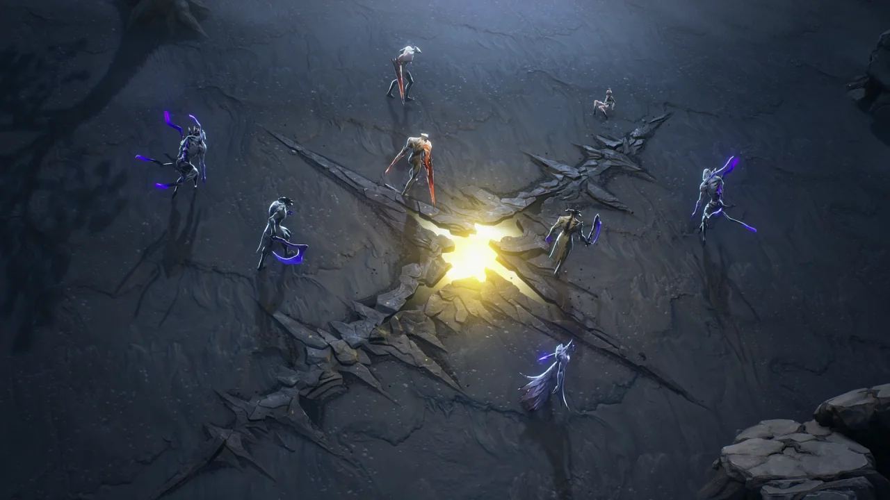
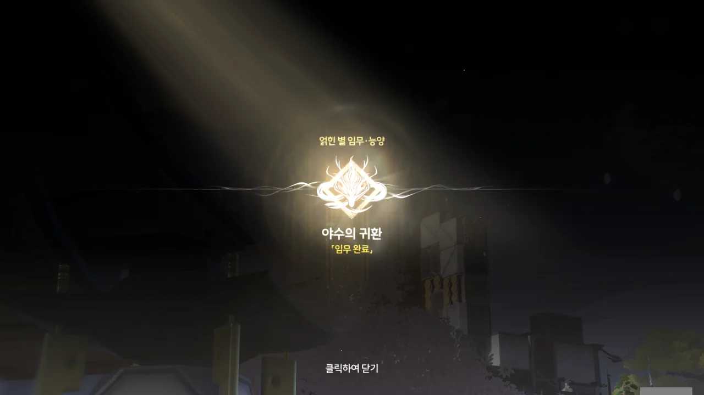





패시가 순찰관에게 이곳 상황을 알려주고 지원을 요청한 덕분에, 도망친 추방자를 모조리 붙잡을 수 있었다.





재회의 기쁨도 잠시, 여긴 너무 어수선하다며, 능양이 성에서 마저 이야기할 것을 제안했다.







「딸랑딸랑 야수」 때문에 용기를 잃은 패시를 본 패지는 「딸랑딸랑 야수」를 없애면 패시가 다시 용기를 되찾을 수 있을 거라 생각했다. 소심하고 나약한 오빠가 「딸랑딸랑 야수」를 잡는다면, 패시에게 큰 동기부여가 될 테니 말이다.

마침 야수 패거리가 「딸랑딸랑 야수」와 소통할 수 있다는 소문이 들리자, 패지는 야수 패거리에 가담해 「딸랑딸랑 야수」에 대한 정보를 얻어 직접 야수를 죽일 계획을 세웠다.

발상은 좋았지만, 너무 무모했네.



패지는 호기롭게 「딸랑딸랑 야수」를 잡겠다고 덤볐지만, 정작 야수 패거리조차 이기지 못하고 구석에서 벌벌 떨고만 있었던 자신이야말로 비겁함과 무능함 그 자체라며 자책한다.





> 이익만 추구하며 힘든 일은 피하고, 욕망에 따라 동족을 해치는 건... 야수의 논리지.
> 더 중요한 무언가를 위해서 자신의 본능과 약점을 극복하고 희생까지 무릅쓰는 것이... 인간만이 지닌 품위야.
> 하지만, 한순간의 오판으로 인간이 야수로 떨어질 수 있어. 그렇기 때문에, 인간성을 지키기 위해서는 오랜 노력과 큰 용기가 필요해.

하지만 능양은 패지가 야수 패거리에 가입한 후, 다른 추방자들처럼 편하게 거짓말로 사람을 속이지 않고, 동생인 패시를 위해 「딸랑딸랑 야수」를 잡으려 한 것을 높이 사고 있다.







그래도 패지의 행동이 아예 쓸모없는 건 아니었다. 결국 모든 사람들이 소문의 「딸랑딸랑 야수」가 실존하지 않는다는 걸 알게 되었지 않은가?

그런데 패시가 들었다는 그 방울 소리의 정체는 대체 뭐였을까? 패시가 한 말에 따르면, 방랑자가 들었던 방울 소리가 바로 그 방울 소리였다는데...









사자춤 공연을 의뢰한 건 「딸랑딸랑 야수」를 조사하기 위해서였기에, 「딸랑딸랑 야수」 일이 해결된 지금은 사자춤 공연이 더 이상 필요 없다고 말하는 패지에게 능양이 "「딸랑딸랑 야수」에 대한 의문의 답이 사자춤에 숨어 있을지도 모르잖아?"라며, 사자춤 공연을 보러 오라고 재차 권한다.

능양이 뭔갈 알고 있는 게 분명하다. 그런데 왜 그걸 직접 말하지 않는 걸까?



능양이 마침 상의하고 싶은 일이 있으니 따라오라고 방랑자에게 말한다.









대체 뭘 하려는 건가 싶었는데, 처음에 만났던 손님들을 하나하나 지나치며 인사를 한다.

> 거친 야생을 돌아다니다가 시내에서 사람들이랑 불빛을 보니까, 마음이 편안해지네...

그냥 보면 '여태껏 성 밖을 돌아다니다가 성 안에 돌아오니 좋네'라고 읽히지만, '야생'과 기이하리만치 얽힌 능양의 정체에 대해 의심하며 읽어보니, 능양의 정체에 대한 궁금증이 한층 더 커진다.







이제 능양과 대화를 할 수 있는 건가 싶었을 때, 능양의 사형제인 아치가 찾아와, 사부가 능양을 찾고 있다는 말을 전한다.

능양은 방랑자에게 패시의 마음을 풀어줄 소품을 극장 무대 뒤에서 찾아달라는 말을 남기고, 아치와 함께 사부에게 급히 향한다. 아, 방랑자와 상의하려던 게 패시에게 줄 소품을 고르는 거였던 거야?





여긴 별 것 없어 보이는데...

「덕담대전」은 시중에 유행하는 덕담을 능양이 꾸준히 기록해 온 책으로 보인다.



마지막으로 확인한 건 방울이었다. 설마 이 방울이 패시가 들었다는 방울 소리의 원인은 아니겠지?

> 하아, 사부님은 공연 전만 되면 예민해지셔. 최선을 다해야 모두를 위한 최고의 춤을 선보일 수 있다고...

능양의 사부 말이 틀린 말은 아니지만, 아무리 생각해도 이번엔 너무 지나쳤다.

능양을 처음 만났을 때, 능양은 하루종일 리허설을 하느라 밥도 제대로 먹지 못했다고 말했다. 그러면서도 공연단 사정으로 인해 예약이 취소된 사람들의 본래 요구 사항을 공연에 하나하나 녹여내기 위해 이리저리 뛰어다니고 있었다. 그러다가 패시의 오빠, 패지를 구하기 위해 한동안 성 밖을 돌아다녔고.

아치가 한 말로 미루어 보면, 능양의 사부는 능양이 연습을 하지 않고 하루종일 밖에서 쏘다녔다는 이유로 능양을 질책한 것으로 보인다. 과연 오늘 무슨 일이 일어났는지 듣고 나서도 똑같은 말을 할 수 있을지 궁금해지는 걸.





금주 사람들이 왜 이렇게 사자춤 공연이 관심이 많냐고 묻자, 능양이 금주 사자춤의 기원에 대해 알려준다.







능양은 잔상의 습격이 주는 충격이 너무 커 방울 소리를 제외한 그 당시의 기억을 모두 잃은 패시가 「딸랑딸랑 야수」의 소문을 듣게 되자, 그 방울 소리의 주인이 「딸랑딸랑 야수」라고 착각한 것이 아닐까 생각한다.

또한, 패지가 하려 했던 것처럼 「딸랑딸랑 야수」를 죽이는 건 일시적인 처방에 불과하며, 패시에게 필요한 건 어떤 야수든 쫓아낼 수 있는 용기라고 말한다.





> 그래서 난 사자춤의 메시지로 패시의 두려움을 덮어줄 거야.

사자춤으로 사람에게 용기를 심어주는 일이 과연 가능할까?





다음날, 약속대로 패지가 패시와 함께 사자춤 공연을 보러 왔다. 패시가 「딸랑딸랑 야수」의 비밀에 대해 묻자, 방랑자 역시 들은 것이 없었기 때문에 모른다고 대답했다.













능양이 사자춤 공연을 선보인다.

무대에 서있는 저 기둥이 저번에 능양이 말한 '매화 기둥'이구나. 동굴에서 본 기둥과 전혀 안 닮았는데?





능양이 제일 높은기둥을 사뿐히 밟나 싶더니, 갑자기 다른 장면이 눈앞에 펼쳐진다.

숲 속에서 능양이 마치 고양이처럼 쪼그려 앉은 자세로 폴짝폴짝 뛰며 나비를 잡으려 하고 있다.





그러다 누군가의 비명을 들은 능양이 비명이 들린 곳으로 다급하게 뛰어간다. 뛸 때에도 마찬가지로, 능양이 동물처럼 네 발로 뛰기도 하고 사람처럼 두 발로 뛰기도 한다.

이런 연출이 나온다는 건, 해당 인물이 다음 두 가지 경우 중 하나임을 암시하는 경우가 잦다.

1. 해당 인물은 사람이 아니라, 사람으로 변신한 동물이다
2. 해당 인물은 동물과 함께 자라, 동물처럼 행동하는 데에 더 익숙하다

대체 어쩌다 무음구역에 오게 된 건진 몰라도, 패시가 무음구역에서 잔상들에게 둘러싸여 있다.









그걸 본 능양이 잔상들을 모조리 쓸어버린다. 패시가 들었다던 방울 소리가 설마 능양이 차고 있던 방울에서 난 소리였던 거야?





패시 역시 그때의 기억을 되찾은 건지, 표정이 밝다.







사자춤의 방울 소리를 듣고, 패시가 그때 들은 방울 소리는 자신을 해치려는 「딸랑딸랑 야수」의 것이 아니라, 오히려 자신을 위험에서 벗어나게 도와준 사자춤의 방울 소리였단 걸 깨달았다. 다만 자신을 구해준 게 지금 눈앞에 있는 능양이었다는 건 깨닫지 못한 모양이다.

능양은 거기에 대해 별말을 덧붙이지 않고, "사자춤은 사람마다 느끼는 게 달라!"라고 답한다.







어제 헤어지고 난 후, 남매가 서로 대화로 화를 푼 줄 알았는데, 아니었나 보다. 패지가 이제 그만 화를 풀어달라 말하자, 패시가 다음부터는 혼자서 생각하고 결정해 행동하지 말라고 한다.

맛있는 것을 사주겠다는 패지에게 능양이 가게 하나를 소개해준다. 분명 순재의 가게를 추천해 준 거겠지.





질문이 있다는 방랑자의 말에 능양이 조용한 곳으로 이동한다.









능양의 말에 따르면, 사람이 공명의 힘을 얻듯이, 동물도 공명의 힘을 얻을 수 있다고 한다. 공명 어빌리티가 인간의 전유물이 아니란 건 당연하다면 당연한 이야기이니, 납득할 수 있다.

본능을 억제할 수 있는 사람에 비해 동물은 본능을 억제할 수 없기 때문에, 감정을 억제하지 못해 발생하는 공명 어빌리티의 폭주, 오버클럭에 더 큰 피해를 입는 모양이다. 그래서 공명의 힘을 얻은 대부분의 동물들은 오버클럭으로 인해 자멸하고 말았다.

하지만 공명의 힘을 얻은 모든 동물이 그렇게 된 건 아니고, 「딸랑딸랑 야수」라고도 불리는 「산예(狻猊)」 --- 두 한자 모두 '사자'라는 뜻을 가졌다 --- 는 공명의 힘을 통제하는 데 성공했다고 한다.





본래 산예는 암흑 밀림의 자색 반얀나무 밑에 살며 인간을 기피했지만, 무음구역이 빈번하게 발생하자, 살 수 있는 곳을 찾기 위해 하는 수 없이 인간이 사는 영토로 내려오게 되었다.

인간의 눈에는 흉악한 짐승이 공명의 힘까지 가진 것으로 보였기에, 인간들은 산예에 적극적으로 대항했고, 수많은 인명 피해를 낸 끝에 산예를 '야수'로 분류하게 되었다.

어떻게 그렇게 자세히 알고 있냐 묻자, 고서에서 읽은 적이 있다며 말을 얼버무린다.





시간이 지나며 산예의 수는 점점 줄어들었고, 지금은 멸종하여 오늘날에는 단 한 마리만이 살아있다고 한다.

능양이 고고학자에게 들었다며 덧붙이길, 마지막 산예는 인간이 되길 바랐다고 말한다. 그래서 사람들이 두려워하지 않을 이름을 스스로에게 붙이고, 자신의 털을 다 뽑고 발톱도 다듬었으며, 골격 역시 교정해 사람처럼 서는 법을 배웠다고 한다.

&nbsp;

눈치가 빠른 사람이라면 이미 눈치챘겠지만, 이건 능양 본인의 이야기이다.





> 어쩌면, 인류가 만들어낸 떠들썩한 의식과 축제에 매료되었던 걸지도... 종족 중에 자신만 남았으니까, 엄청 외로웠겠지?
> 어쩌면, 「비명」에 맞서며 두려움을 모르는 인간의 용기에 이끌렸을지도 몰라. 자기 땅을 점령한 「비명」을 함께 물리쳐 나가려고.
> 아니면... 인간들이 먹을 것을 가공하는 법에 이끌렸을지도?

방랑자 역시 능양이 자기 이야기를 하는 걸 알아차렸는지, 능양의 마지막 말을 듣고 '뭐야 그게'라는 표정을 짓고 있다.





> 어쩌면 어린 소녀를 구해준 적이 있을지도 모르지.

거 봐. 능양 자기 이야기가 맞았네.





> 가짜에게 진짜가 되려고 하는 의지가 있는 만큼 가짜 쪽에 가치가 있다.
> ***
> 카이키 데이슈 ― 이야기 시리즈
{.bq}

> 선하게 태어나는 것과, 악한 본성을 위대한 노력으로 극복하는 것. 무엇이 더 훌륭한가?
> ***
> 파서낙스 ― 엘더스크롤 5: 스카이림
{.bq}

인간이 되려는 마음을 가진 한, 「딸랑딸랑 야수」는 인간이라 볼 수 있다. 이미 이 세상에는 야수의 마음을 가진 인간이 있으니, 인간의 마음을 가진 짐승이 있기에 충분하지 않은가.





처음에 능양이 악수를 청할 때, 손을 내미는 선택지와 손을 내밀지 않는 선택지가 있었던 것과 달리, 지금은 손을 내미는 선택지만 있다.





능양이 방랑자에게 방울을 주고 먼저 떠난다.

얽힌 별 임무 · 능양 \[야수의 귀환\] 끝!



능양이 그 산예라는 것을 다시 한번 확인시켜 주려는 것인지, 업적 제목부터가 '악곡의 흥에 맞춰 사자춤을 추는 산예'라고 되어 있다.



> **길상 방울**
> ***
> 능양이 공연할 때 착용하는 방울. 한길을 함께 했던 고마움을 표현하기 위해 능양이 그것을 선물로 주었다.
> ***
> 동제 공형 종. 가볍게 흔들면 청량하고 즐거운 소리를 들을 수 있으며, 착용자에게 행운과 용기의 축복을 가져다줄 수 있다고 전해진다.
> 물체 자체에는 의미가 없으며, 독특함은 종종 사람들이 부여한다. 아마도, 소년이 사람들 속에서 당신에게 단호하게 손을 내미는 그 순간, 그는 이미 당신에게 그의 용기를 표현했을 것이다.
{.bq}

능양이 방랑자를 처음 만났을 때 악수를 청하던 그 장면을 말하는 거구나.
