얽힌 별 임무는 위험한 임무에 비해 인물의 감정 묘사가 자세한 탓에, 각 사진을 분류할 때마다 매번 '이 사진을 잘라야 하나, 말아야 하나?' 같은 고민에 빠져야 했다. 어휴, 얽힌 별 임무가 이 정도라면, 이보다 더 복잡한 조수 임무는 어떻게 되는 거지?



조수 임무에서 기염이 역행비로 인해 나타난 유령을 보며 '일이 잘 풀리면 올해는 레이스 대회를 열 수 있을지도...'라고 생각한 장면이 있었는데, 기염과 방랑자가 힘을 합쳐 명식 「무상선주」를 물리친 덕분에 정말로 올해 레이스 대회가 열린 모양이다.

금주 레이스 대회는 원래 야귀군 내에서 개최하던 소규모 대회였지만, 시간이 지나며 야귀군뿐만 아니라 금주 주민까지 참여하는 대회로 확대되었다고 한다. 이 대회가 초기엔 군 내에서만 열렸기 때문에 역행비 속 유령이 이 대회를 '군대 레이스'라고 불렀던 거였다.

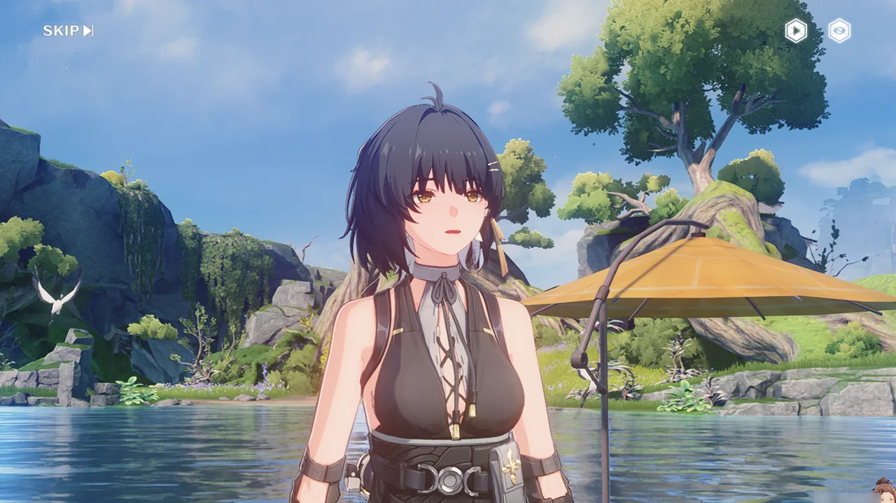

방랑자는 언제 봐도 이쁘고 귀엽다.





이번 레이스 대회 책임자, 문숙이 기염과 대화 중이다. 곳곳에선 야귀군이 금주 주민과 함께 대회를 즐기는 모습이 보인다.

밤낮없이 전선을 지키느라 고생했으니 대회에 참가하는 여유도 좀 가져보는 게 어떻냐며, 문숙이 기염에게 대회 참여를 권유하지만, 딱딱한 기염은 대회 참가를 거절한다. 기염이 머리를 짚는 걸 보면, 이런 식으로 대회 참여를 권유받은 게 한두 번이 아니었던 모양이다.







문숙이 방랑자에 대해 알게 된 건 기염을 통해서였던듯하다. 물론, 문숙 역시 금희가 금주 전체에 뿌린 공개 방송을 통해 방랑자의 존재 자체는 이미 알고 있었겠지만...







레이싱 대회의 일부 종목은 공명자만 참가할 수 있지만, 그 외 대부분의 종목은 참가에 특별한 제한이 없다고 한다. 이 흐름대로라면... 방랑자도 레이싱 대회에 참가하게 되는 건가? 방랑자는 공명자이니, 레이싱 대회의 모든 종목에 참가할 수 있잖아.

문숙 말대로, 금주성 밖은 곳곳에 출몰하는 잔상과 잡석 고지 쪽에서 밀려오는 잔상류 때문에 항상 긴장 상태이다. 그래서 다들 이런 대회에서나 잠시 긴장을 풀고 여유를 즐길 수 있는 것이다.

기염은 경기 시작 전 안전 상황을 확인하러 가겠다며 먼저 가버렸다.

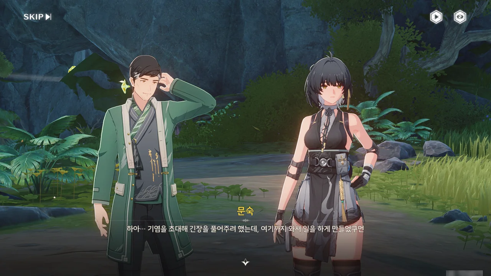





난 여태껏 기염이 여기 온 이유가 대회의 안전을 확인하기 위한, 공적인 이유 때문인 줄로 알고 있었다. 그런데 기염 역시 방랑자처럼 문숙이 초대한 대회의 손님이었다고?

문숙이 기염을 초대한 건 기염이 레이싱 대회에서나마 잠시 긴장을 풀고 여유를 가지게 하고 싶어서였는데, 정작 기염은 대회의 손님으로 와서도 계속 일만 하는 중이다. 물론 문숙 말처럼, 기염의 준비성이 저렇게 철저했기에 잔상류를 막아낼 수 있었던 거지만...

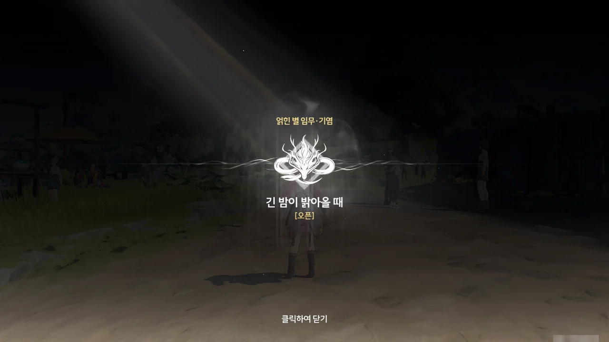

얽힌 별 임무 · 기염 \[긴 밤이 밝아올 때\] 시작!

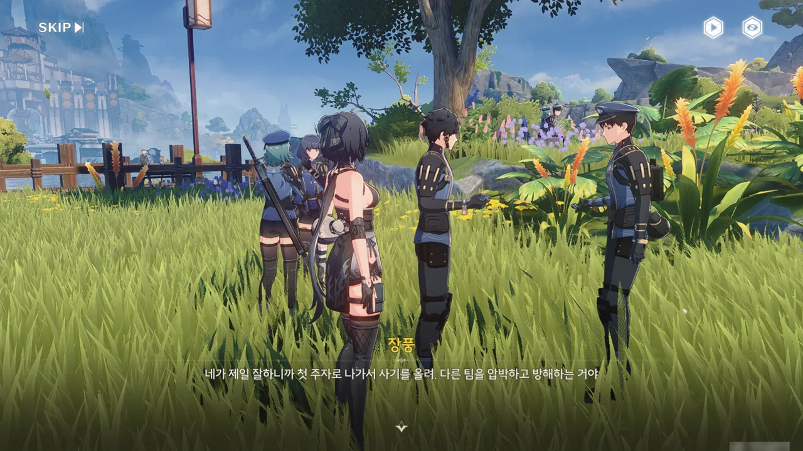







꾹꾹복어 계주에 참가하는 한백과 장풍에게서 약간의 정보를 얻을 수 있었다.

꾹꾹복어 계주는 레이싱 대회 종목 중 가장 인기가 높은 단체 종목으로, 4명이 한 팀이 되어 꾹꾹복어 에코를 조종해 수로를 달리는 경기이다. 현재 기록 1위는 10년 전 참가한 '임시 소대'가 세운 기록으로, 그들의 전략은 초반엔 실력을 숨겼다가 마지막에 역전하는 것이라고 한다.

이런 정보를 괜히 알려줄 리 없으니 일단 마음 한구석에 적어는 놔야겠다.

난 계주를 할 때에는 초반에 기세를 잡아 다른 선수와의 격차를 최대한 많이 벌려놔야 한다고 생각한다. 선두를 달리던 주자가 방심한 사이 다른 선수에게 따라 잡혀 선수를 내줄 위험성이 크긴 하지만, 다른 선수들에게 좁힐 수 없는 격차를 선보여 주눅 들게 하는 것만으로도 그럴 가치가 있다 생각하거든.

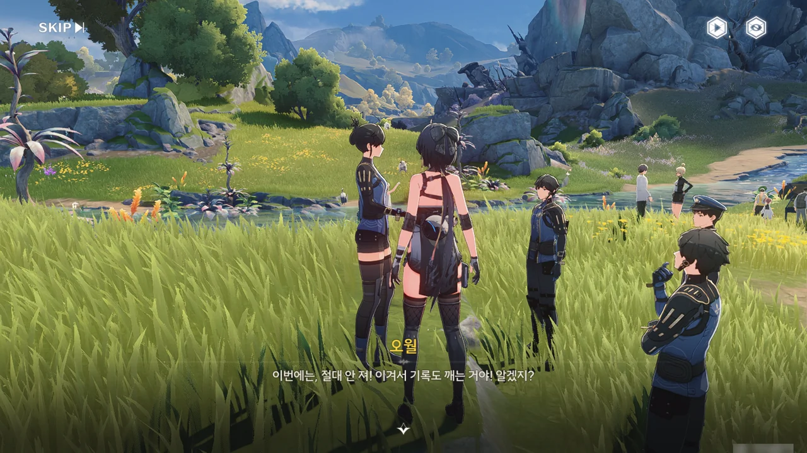







이 팀은 무슨 까닭인지 시합을 앞두고 풀이 죽어 매가리가 없다. *우리만큼 의욕이 넘치는 팀*이라고? 그거 반어법이지?

아무튼, 다른 한 팀에 뭔가 문제가 생긴 것 같다고 한다. 대회 책임자인 문숙이 황급히 달려갈 정도면, 보통 일은 아니란 건데...

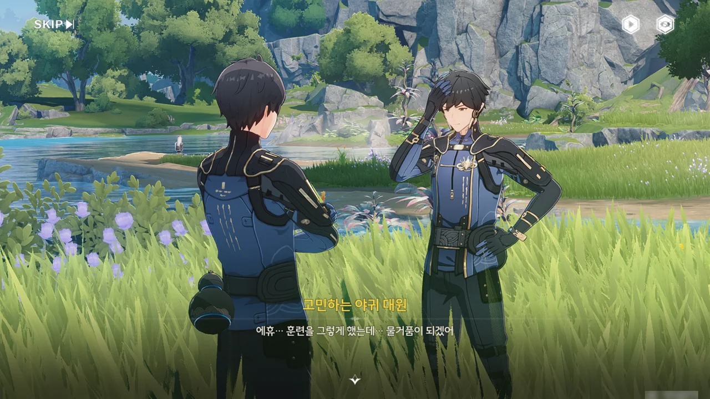









문제가 생겼다는 팀이 바로 이 팀이었나 보네.

능언과 감천의 팀원 중 두 명이 시합 전 몸을 풀다 돌에 부딪혀 다치는 사고가 발생했다. 부상은 그리 크지 않았지만, 당분간 쉬는 게 좋을 것 같다는 의사에 말에 따라 그 둘은 시합에 참가하지 못하게 되었다. 조직 위원회로부터 임시로 팀을 꾸려도 된다는 허락을 받긴 했지만, 이들은 경기 시작 시간이 얼마 남지 않은 지금까지도 임시 팀원을 구하지 못하고 있다.

본래라면 팀장이 나서 임시 팀원을 구했겠지만, 팀장은 며칠 전 급한 일이 생겨 자리를 비워 여기에 없다. 지금의 팀 역시 사람을 겨우 긁어모아 만든 팀이라, 별달리 참여를 권할 수 있는 사람도 없다.

그래서 이들은 이번 대회의 참가를 포기하고 다음 대회에 재도전해야 하나 고민 중이다. 하지만 최근 잦아진 잔상류 때문에 다음 대회가 열릴 수 있을지조차 불투명하다.







자연스럽게 그 공백 중 하나를 방랑자가 채우게 되었다. 그 대신 방랑자는 능언과 감천이 사주겠다는 맛있는 식사 한 끼를 대가로 받기로 했다. 마지막 빈자리는... 여기에 기염이 들어오면 딱이겠네.

지금 사진을 잘라놓아서 눈에 잘 띄지 않지만, 지금 방랑자와 문숙 뒤편엔 기염이 홀로 멍하니 서있다. 대체 거기서 혼자 뭘 하고 있는 건진 잘 모르겠지만.



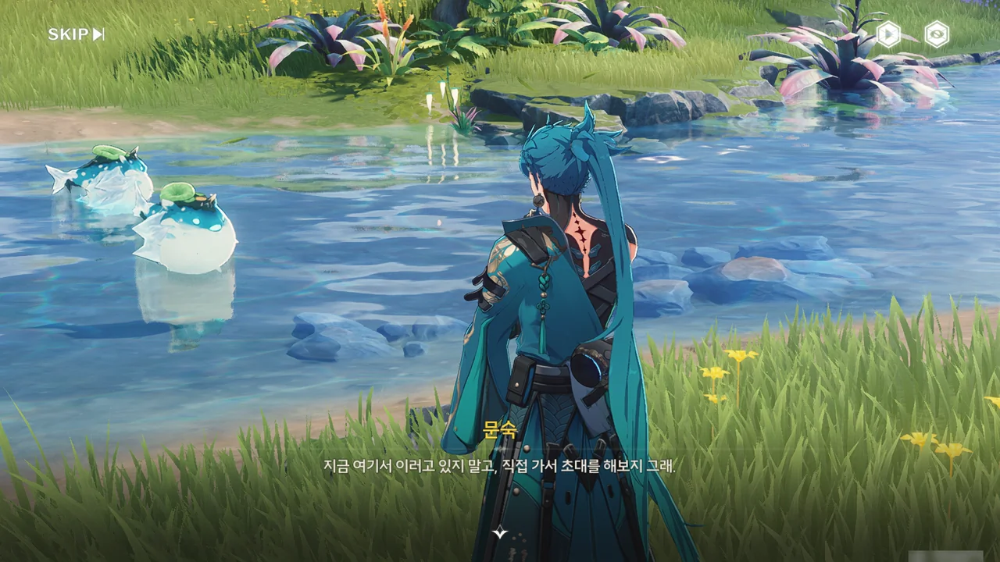



멍하니 서서 꾹꾹복어를 바라보고 있는 기염에게 방랑자가 직접 가 영입제안을 하기로 했다.





'마음에 드는 종목을 찾았지만 기염만이 도와줄 수 있는 문제가 생겼다'며, 자연스럽게 기염에게 상황을 설명하고 영입을 시도한다.

답답하다는 듯이 눈을 감고 하소연하듯 말하는 방랑자의 모습이 너무 귀엽다.









기염의 행동이 뭔가 좀 수상쩍다.

기염에게 임시 팀원으로서 꾹꾹복어 계주에 참가해 달라고 말하자, 뭔가 걸리는 게 있기라도 한 듯, 기염이 잠시 말을 삼킨다.  
계주 경기에 있어 속도보다 더 중요한 건 팀워크, 즉 협력이라고 말한 후에도 잠시 말을 하지 않다가, 자신보다 임시 팀원에 더 적합한 사람이 있을 거라 생각했다고 말한다.  
'임시 소대'라는 말을 꺼내자, 오랜만에 듣는 이름이라며 조금 놀란 모습을 보인다.

설마 기염에게 꾹꾹복어 계주와 관련해 안 좋은 기억이 있는 건가? 예를 들면, 기염이 임시 팀원으로 참여한 팀이 부족한 팀워크 때문에 계주에서 형편없는 성적을 냈다던가 말이다. 만약 정말 그런 일이 있었다면 기염이 여태껏 보인, 레이싱 대회 손님으로 왔으면서도 일에만 열중한 모습이나 '임시 팀원', '협력', '임시 소대' 등의 키워드에 반응한 모습이 모두 설명된다.







능언과 감천에게 합류하려던 찰나, 기염이 뭔갈 느낀 것인지 뒤를 돌아보지만, 이내 착각한 것 같다며 다시 발걸음을 옮긴다. 그리고 그 모습을 지켜보던 꾹꾹복어들이 마치 짜기라도 한 듯, 한꺼번에 물속으로 사라진다.

설마 대회 도중 다른 누군가가 꾹꾹복어의 조종을 방해해 사고가 생기는 걸까?











팀에 기염 장군은 물론이요, 방랑자까지 들어왔으니 10년 전 '임시 소대'가 만든 신기록을 깰 수 있을지도 모른다며 흥분한 감천과 달리, 능언이 그 '임시 소대'는 신기록을 세웠을 만큼 팀워크가 뛰어난 오랜 동료 사이일 게 분명하다며, 급조된 임시 소대에 불과한 우리는 당시 '임시 소대'의 영상 --- 누군가가 빌려가 아직도 반납하지 않은 --- 을 보아도 빨리 배울 수 없을뿐더러, 그 기록을 깰 수도 없을 거라 말한다.

오랜 동료 사이인데 팀 이름이 '임시 소대'라고? 그럴 리 없을 것 같은데.





기염이 능언에게 모든 건 사람 하기에 달렸다며, 10년 전의 '임시 소대' 역시 말 그대로 임시로 급조된 팀이었다고 말해준다.

능언이 "10년이나 지났는데, 그때 사람들은 뭘 하고 있을까요?"라고 말하자, 기염의 표정이 굳었다. 내 직감이 '기염은 10년 전 임시 소대의 일원이었다'라고 말하고 있다.











> | | |
> |:--|:--|
> | 능언 | 원래 순서는 팀장님이 정해주셨었는데... 장군님이... 정해주시겠습니까? |
> | 기염 | 자네들이 정해주면, 최선을 다해보겠네. |
> {_borderless=true,_thead=false}

능언이 팀장 역할을 기염에게 떠넘기려 하자, 기염이 '나보다 오랫동안 호흡을 맞춘 너희들이 순서를 정하는 게 맞지 않겠냐?'라며 자연스럽게 되받아 넘긴다.

그래서 능언이 정한 대로, 감천-능언-기염-방랑자 순서로 뛰게 되었다.



비록 마지막 주자가 가장 주목받는 순서이긴 하지만, 원래 순위보다 뒤처지는 게 아닌 이상 절대로 손해를 보지 않는 순서이기도 하다. 잘하면 대역전극을 선보이는 거고, 못해도 '씁 어쩔 수 없지'로 넘길 수 있는 순서가 바로 마지막이다.

"에이~ 식은 죽 먹기죠!"라며 의기양양한 표정을 내보이는 방랑자가 너무 귀엽고 이쁘다. 하... 너무 이뻐...





아직 팀 이름을 정하지 않았다는 감천의 말에 제일 무난해 보이는 '꾹꾹특공대'를 골랐지만, 기염으로부터 '더 특별한 이름을 제안할 줄 알았는데'라는 핀잔 아닌 핀잔을 들었다.

아니, 그게 뭐 어때서! '방랑자소대'는 너무 자아가 비대한 것처럼 느껴지고, '함께 하기로 약속~ 소대'나 '기염 말이 다 맞소~대'는 너무 유치한 이름처럼 느껴지니, 제일 멀쩡해 보이는 '꾹꾹특공대'를 선택할 수밖에 없잖아!

비록 기염이 곧바로 "나쁘지 않군. 과하지도 않고."라고 말하긴 했지만, 병 주고 약 주는 것 같아 별로 위로가 안 되었다.



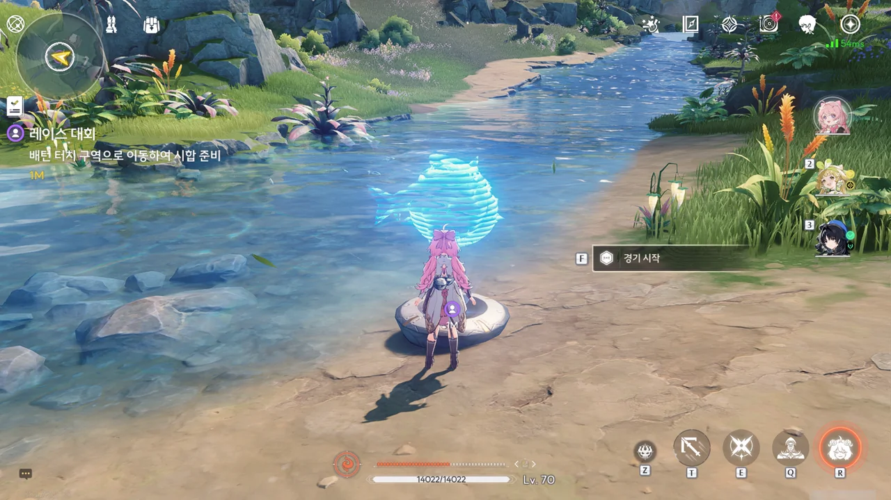

뭐... <kbd>Shift</kbd> 키만 누르고 있으면 되겠지. 설마 그랬는 데도 따라 잡히겠어?



설명을 보니, 능언과 감천의 순위가 한참 뒤처진 걸 기염이 어느 정도 따라잡은 것으로 보인다.

달리느라 정신이 없어 미처 사진을 찍지 못했는데, 방랑자와 기염이 단말기로 통신하던 중, 누군가의 목소리가 잡음처럼 통신에 섞여 들어왔다. 그 이후, 꾹꾹복어가 통제를 벗어나 제멋대로 물가로 달려들었다.

> | | |
> |:--|:--|
> | 기염 | 잠깐만요. 꾹꾹복어 상태가 이상한 거 같아요. 조심해요! |
> {_borderless=true,_thead=false}

ㅋㅋㅋ... 기염이 원래 이렇게 말하는 캐릭터였어? 번역팀의 오역이 이젠 놀랍지도 않다.

만약 내가 명조를 접게 된다면, 이 조악한 번역 품질 때문에 접게 될 가능성이 제일 크다.



물가에서 구경하던 관중들에게 달려든 꾹꾹복어는 머리 위에 한 관중을 태운 후 이리저리 빙글빙글 돌며 내달리기 시작한다.



방랑자의 단말기는 정상인 것 같은데... 뭔가 짚이는 게 있는 모양인지, 기염이 그저 앞만 바라보고 있다.

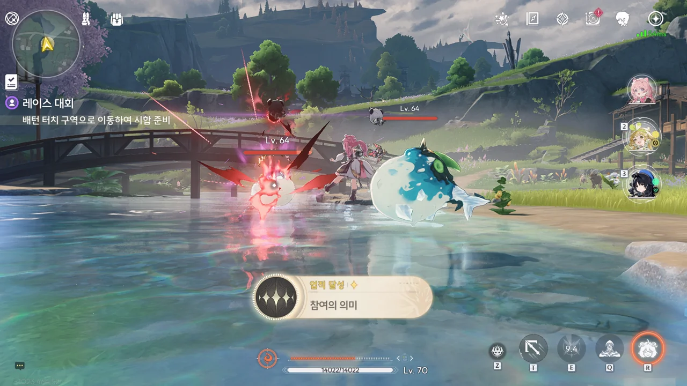

원래 여기 있던 꾹꾹복어인지, 아니면 방랑자의 것처럼 통제를 벗어난 다른 꾹꾹복어 에코인지는 잘 모르겠지만, 덤벼드는 꾹꾹복어를 모두 처리했다.







기염 역시 통신 중 이상한 소리를 들었다며, 문숙에게 대회를 즉시 중단하고 관중들을 금주성으로 데려가달라고 말한다. 기염이 추측한 이상 현상의 원인이 뭔지는 몰라도, 사람들을 금주성으로 대피시켜야 할 정도의 위협이라 생각한 모양이다.

몇 년 만에 어렵게 연 레이싱 대회가 이렇게 갑자기 끝나면 사람들이 실망할 게 분명하다며, 관중들이 외치던 소리를 오해한 것일 수도 있지 않냐 문숙이 말하지만, 기염은 그 의문의 소리를 경기 시작 전에도 강가에서 들었다고 말하며 문숙의 의견에 반박한다.



이 사건에 이상 현상이 엮여 있을 수 있다 판단한 건지, 기염은 연구원에게 전국 수로 모니터링 데이터를 수집하라 명령했다. 무엇 때문에 꾹꾹복어가 이상 행동을 한 건지 알 수 없으니, 안전이 확인되기 전까진 사람들을 금주성으로 대피시키는 것이 안전하다.







아까 한 관객이 꾹꾹복어를 타고 이리저리 뛰어다니는 모습을 본 사람들이 너도나도 꾹꾹복어를 타겠다고 난리라, 본격적인 대피가 시작되기까지는 시간이 좀 걸릴 거라고 한다. 마침 저기 뒤에 아까 꾹꾹복어 머리 위에 탄 사람이 잔뜩 흥분해서 주변 사람들에게 자랑하는 듯한 모습이 보인다.

그리고 거기에 대한 기염의 대응은 '바람 잡는 사람 먼저 처리하면 된다'였다.

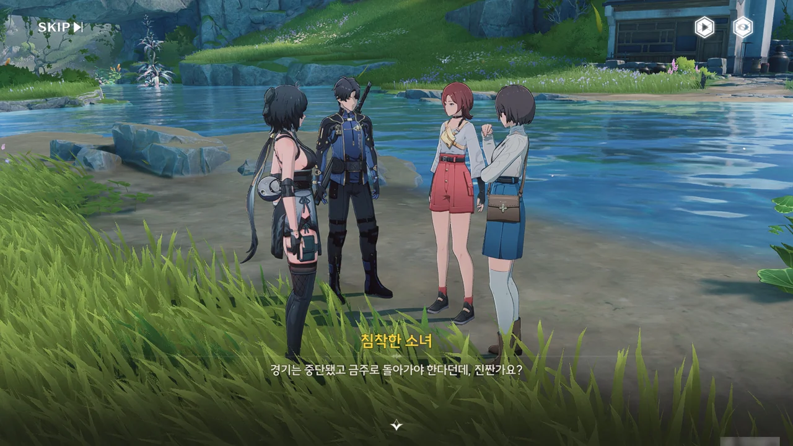













마지막에 역전극을 선보인 방랑자의 협조 덕분에 관객을 잘 설득해 금주성으로 돌려보낼 수 있었다. 이 사진 찍기 좋아하는 소녀가 메모리의 절반도 채 쓰지 못한 채 금주성으로 돌아가게 된 일은 아쉽지만, 안전이 우선이니 어쩔 수 없다.

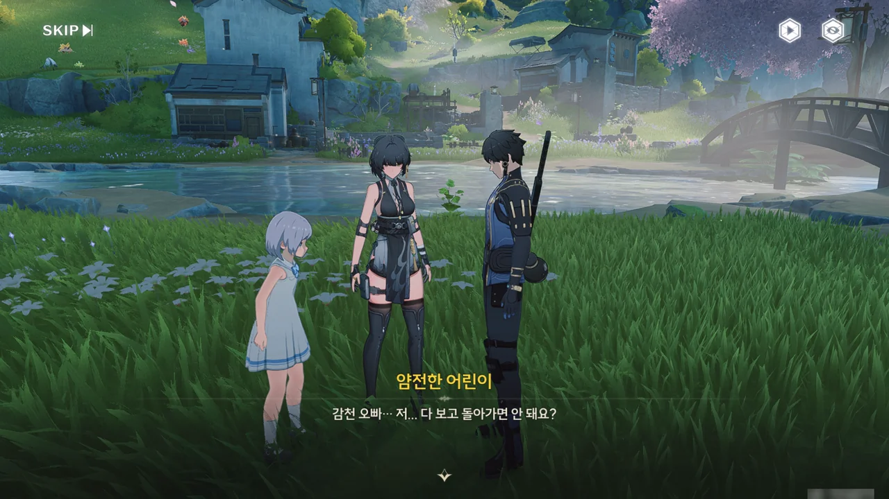



















오랫동안 보지 못한 아빠, '공청'을 보기 위해 엄마 몰래 대회장에 온 아이가 하나 있다. 공청이 3년 전 마지막 경기에서 2등을 했기에, 대회장에 오면 아빠를 만날 수 있을 것 같아서 대회장에 온 거라고 한다. 하지만 감천의 반응을 보면, 그는 잔상류에 맞서다 전사한 모양이다.

... 이래서 전쟁이 싫다니까.



맨 처음 꾹꾹복어에 치여 그 머리 위에 올라탄 채 이리저리 휘둘렸던 사람이 여기에 있다. 꾹꾹복어 위에 탄 게 그렇게 재미있었는지, 사건이 끝난 지 한참 되었음에도 여전히 흥분 상태에 빠져있다.









아니, 대체 얼마나 흥분했으면 여태껏 자기 오른손이 다친 줄도 모르고 있었던 거야? ㅋㅋㅋ... 직접적으로 꾹꾹복어에 의해 다친 게 아니라고 하니, 아마 이리저리 휘둘릴 때 어딘가에 치여서 생긴 상처인가 보다.

남자의 흥분이 가라앉힌 후에야 남자를 금주성으로 돌려보낼 수 있었다.



연구원에 모르테피만 있는 게 아닐 텐데, 어째 이야기에서 연구원이 나오면 십중팔구 모르테피와 대화하게 된다. 모르테피의 직책이 낮은 건 아니지만, 너무 발이 넓은 거 아냐?











수로 북쪽 상류 호수 부근에서 이상 변동이 생겼으며, 꾹꾹복어가 통제를 잃은 건 주파수 파동 변화에 민감한 꾹꾹복어가 그 이상 변동을 감지해 패닉에 빠졌기 때문이라고 한다. 다만 이를 감지했어야 할 비콘이 왜 그 이상 변동을 감지하지 못했는지는 불명이라고 한다.

지금으로선 대회의 어떤 주파수가 상류의 무언가와 공명해 이상 변동이 생긴 게 아닐까 추측할 뿐이다. 뭐, 직접 가서 확인해 보면 되겠지.

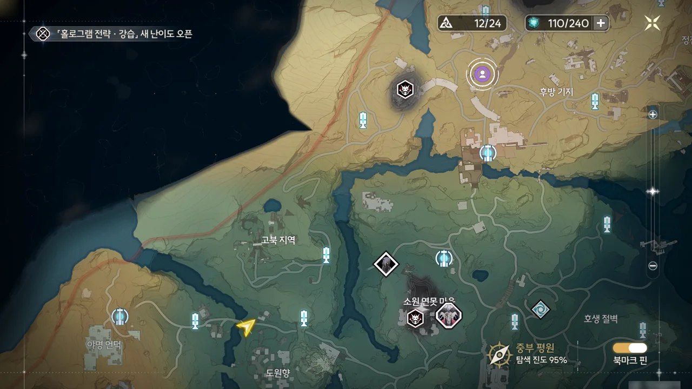

그런데 이거 너무 거리가 먼데요?
